# 第七章：高级 Spring Boot 功能

在上一章中，我们通过异常处理、HATEOAS、缓存和国际化扩展了我们的微服务。在本章中，让我们把注意力转向将我们的服务部署到生产环境。为了能够将服务部署到生产环境，我们需要能够设置和创建功能来配置、部署和监控服务。

以下是本章将回答的一些问题：

+   如何外部化应用程序配置？

+   如何使用配置文件来配置特定环境的值？

+   如何将我们的应用程序部署到云端？

+   嵌入式服务器是什么？如何使用 Tomcat、Jetty 和 Undertow？

+   Spring Boot Actuator 提供了哪些监控功能？

+   如何通过 Spring Boot 成为更高效的开发者？

# 外部化配置

应用程序通常只构建一次（JAR 或 WAR），然后部署到多个环境中。下图显示了应用程序可以部署到的不同环境：

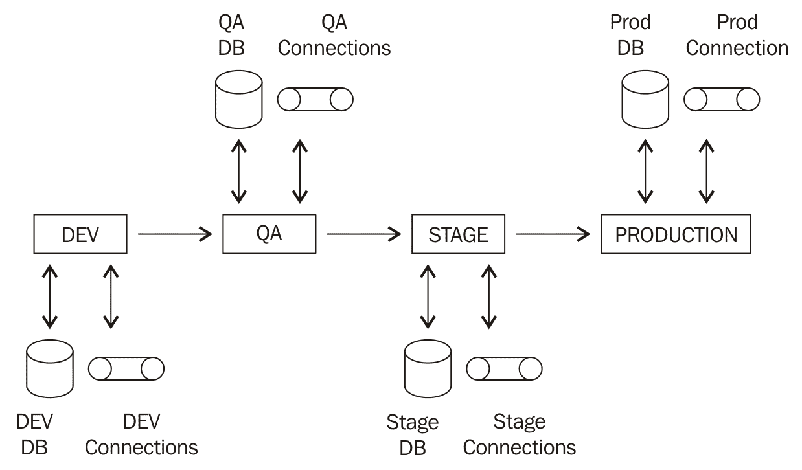

在前述的每个环境中，应用程序通常具有以下内容：

+   连接到数据库

+   连接到多个服务

+   特定环境配置

将配置在不同环境之间变化的配置外部化到配置文件或数据库中是一个很好的做法。

Spring Boot 提供了一种灵活的、标准化的外部化配置方法。

在本节中，我们将看一下以下内容：

+   如何在我们的服务中使用`application.properties`中的属性？

+   如何使应用程序配置成为一件轻而易举的事情？

+   Spring Boot 为**Spring Profiles**提供了什么样的支持？

+   如何在`application.properties`中配置属性？

在 Spring Boot 中，`application.properties`是默认的配置值来源文件。Spring Boot 可以从类路径的任何位置获取`application.properties`文件。通常，`application.properties`位于`src\main\resources`，如下图所示：


在第六章中，*扩展微服务*，我们看了一些使用`application.properties`中的配置自定义 Spring Security 的示例：

```java
    security.basic.enabled=false
    management.security.enabled=false
    security.user.name=user-name
    security.user.password=user-password
    security.oauth2.client.clientId: clientId
    security.oauth2.client.clientSecret: clientSecret
    security.oauth2.client.authorized-grant-types:                
    authorization_code,refresh_token,password
    security.oauth2.client.scope: openid
```

与此类似，所有其他 Spring Boot starters、模块和框架都可以通过`application.properties`中的配置进行自定义。在下一节中，让我们看一下 Spring Boot 为这些框架提供的一些配置选项。

# 通过`application.properties`自定义框架

在本节中，我们将讨论一些可以通过`application.properties`进行配置的重要事项。

有关完整列表，请参阅[`docs.spring.io/spring-boot/docs/current-SNAPSHOT/reference/htmlsingle/#common-application-properties`](https://docs.spring.io/spring-boot/docs/current-SNAPSHOT/reference/htmlsingle/#common-application-properties)。

# 日志

一些可以配置的事项如下：

+   日志配置文件的位置

+   日志文件的位置

+   日志级别

以下代码片段显示了一些示例：

```java
# Location of the logging configuration file.
  logging.config=
# Log file name.
  logging.file=
# Configure Logging level. 
# Example `logging.level.org.springframework=TRACE`
  logging.level.*=
```

# 嵌入式服务器配置

嵌入式服务器是 Spring Boot 最重要的特性之一。一些可以通过应用程序属性进行配置的嵌入式服务器特性包括：

+   服务器端口

+   SSL 支持和配置

+   访问日志配置

以下代码片段显示了一些可以通过应用程序属性进行配置的嵌入式服务器特性：

```java
# Path of the error controller.
server.error.path=/error
# Server HTTP port.
server.port=8080
# Enable SSL support.
server.ssl.enabled=
# Path to key store with SSL certificate
server.ssl.key-store=
# Key Store Password
server.ssl.key-store-password=
# Key Store Provider
server.ssl.key-store-provider=
# Key Store Type
server.ssl.key-store-type=
# Should we enable access log of Tomcat?
server.tomcat.accesslog.enabled=false
# Maximum number of connections that server can accept
server.tomcat.max-connections=
```

# Spring MVC

Spring MVC 可以通过`application.properties`进行广泛配置。以下是一些重要的配置：

```java
# Date format to use. For instance `dd/MM/yyyy`.
 spring.mvc.date-format=
# Locale to use.
 spring.mvc.locale=
# Define how the locale should be resolved.
 spring.mvc.locale-resolver=accept-header
# Should "NoHandlerFoundException" be thrown if no Handler is found?
 spring.mvc.throw-exception-if-no-handler-found=false
# Spring MVC view prefix. Used by view resolver.
 spring.mvc.view.prefix=
# Spring MVC view suffix. Used by view resolver.
 spring.mvc.view.suffix=
```

# Spring starter security

Spring Security 可以通过`application.properties`进行广泛配置。以下示例显示了与 Spring Security 相关的一些重要配置选项：

```java
# Set true to Enable basic authentication
 security.basic.enabled=true
# Provide a Comma-separated list of uris you would want to secure
 security.basic.path=/**
# Provide a Comma-separated list of paths you don't want to secure
 security.ignored=
# Name of the default user configured by spring security
 security.user.name=user
# Password of the default user configured by spring security. 
 security.user.password=
# Roles granted to default user
 security.user.role=USER
```

# 数据源、JDBC 和 JPA

数据源、JDBC 和还可以通过`application.properties`进行广泛配置。以下是一些重要选项：

```java
# Fully qualified name of the JDBC driver. 
 spring.datasource.driver-class-name=
# Populate the database using 'data.sql'.
 spring.datasource.initialize=true
# JNDI location of the datasource.
 spring.datasource.jndi-name=
# Name of the datasource.
 spring.datasource.name=testdb
# Login password of the database.
 spring.datasource.password=
# Schema (DDL) script resource references.
 spring.datasource.schema=
# Db User to use to execute DDL scripts
 spring.datasource.schema-username=
# Db password to execute DDL scripts
 spring.datasource.schema-password=
# JDBC url of the database.
 spring.datasource.url=
# JPA - Initialize the schema on startup.
 spring.jpa.generate-ddl=false
# Use Hibernate's newer IdentifierGenerator for AUTO, TABLE and SEQUENCE.
 spring.jpa.hibernate.use-new-id-generator-mappings=
# Enable logging of SQL statements.
 spring.jpa.show-sql=false
```

# 其他配置选项

通过`application.properties`可以配置的其他一些事项如下：

+   配置文件

+   HTTP 消息转换器（Jackson/JSON）

+   事务管理

+   国际化

以下示例显示了一些配置选项：

```java
# Comma-separated list (or list if using YAML) of active profiles.
 spring.profiles.active=
# HTTP message conversion. jackson or gson
 spring.http.converters.preferred-json-mapper=jackson
# JACKSON Date format string. Example `yyyy-MM-dd HH:mm:ss`.
 spring.jackson.date-format=
# Default transaction timeout in seconds.
 spring.transaction.default-timeout=
# Perform the rollback on commit failures.
 spring.transaction.rollback-on-commit-failure=
# Internationalisation : Comma-separated list of basenames
 spring.messages.basename=messages
# Cache expiration for resource bundles, in sec. -1 will cache for ever
 spring.messages.cache-seconds=-1
```

# application.properties 中的自定义属性

到目前为止，我们已经看过了使用 Spring Boot 为各种框架提供的预构建属性。在本节中，我们将看看如何创建我们的应用程序特定配置，这些配置也可以在`application.properties`中配置。

让我们考虑一个例子。我们希望能够与外部服务进行交互。我们希望能够外部化此服务的 URL 配置。

以下示例显示了我们如何在`application.properties`中配置外部服务：

```java
   somedataservice.url=http://abc.service.com/something
```

我们想要在我们的数据服务中使用`;`somedataservice.url`属性的值。以下代码片段显示了我们如何在示例数据服务中实现这一点。

```java
    @Component
    public class SomeDataService {
      @Value("${somedataservice.url}")
      private String url;
      public String retrieveSomeData() {
        // Logic using the url and getting the data
       return "data from service";
      }
    }
```

需要注意的一些重要事项如下：

+   `@Component public class SomeDataService`：数据服务 bean 由 Spring 管理，因为有`@Component`注解。

+   `@Value("${somedataservice.url}")`：`somedataservice.url`的值将自动装配到`url`变量中。`url`的值可以在 bean 的方法中使用。

# 配置属性-类型安全的配置管理

虽然`;@Value`注解提供了动态配置，但它也有一些缺点：

+   如果我们想在一个服务中使用三个属性值，我们需要使用`@Value`三次进行自动装配。

+   `@Value`注解和消息的键将分布在整个应用程序中。如果我们想要查找应用程序中可配置的值列表，我们必须搜索`@Value`注解。

Spring Boot 通过强类型的`ConfigurationProperties`功能提供了更好的应用程序配置方法。这使我们能够做到以下几点：

+   在预定义的 bean 结构中具有所有属性

+   这个 bean 将作为所有应用程序属性的集中存储

+   配置 bean 可以在需要应用程序配置的任何地方进行自动装配

示例配置 bean 如下所示：

```java
    @Component
    @ConfigurationProperties("application")
    public class ApplicationConfiguration {
      private boolean enableSwitchForService1;
      private String service1Url;
      private int service1Timeout;
      public boolean isEnableSwitchForService1() {
        return enableSwitchForService1;
      }
     public void setEnableSwitchForService1
     (boolean enableSwitchForService1) {
        this.enableSwitchForService1 = enableSwitchForService1;
      }
     public String getService1Url() {
       return service1Url;
     }
     public void setService1Url(String service1Url) {
       this.service1Url = service1Url;
     }
     public int getService1Timeout() {
       return service1Timeout;
     }
     public void setService1Timeout(int service1Timeout) {
       this.service1Timeout = service1Timeout;
    }
  }
```

需要注意的一些重要事项如下：

+   `@ConfigurationProperties("application")`是外部化配置的注解。我们可以将此注解添加到任何类中，以绑定到外部属性。双引号中的值--application--在将外部配置绑定到此 bean 时用作前缀。

+   我们正在定义 bean 中的多个可配置值。

+   由于绑定是通过 Java bean 属性描述符进行的，因此需要 getter 和 setter。

以下代码片段显示了如何在`application.properties`中定义这些属性的值：

```java
    application.enableSwitchForService1=true
    application.service1Url=http://abc-dev.service.com/somethingelse
    application.service1Timeout=250
```

需要注意的一些重要事项如下：

+   `application`：在定义配置 bean 时，前缀被定义为`@ConfigurationProperties("application")`

+   通过将前缀附加到属性的名称来定义值

我们可以通过将`ApplicationConfiguration`自动装配到 bean 中，在其他 bean 中使用配置属性。

```java
    @Component
    public class SomeOtherDataService {
      @Autowired
      private ApplicationConfiguration configuration;
      public String retrieveSomeData() {
        // Logic using the url and getting the data
        System.out.println(configuration.getService1Timeout());
        System.out.println(configuration.getService1Url());
        System.out.println(configuration.isEnableSwitchForService1());
        return "data from service";
      }
    }
```

需要注意的一些重要事项如下：

+   `@Autowired private ApplicationConfiguration configuration`：`ApplicationConfiguration`被自动装配到`SomeOtherDataService`中

+   `configuration.getService1Timeout(), configuration.getService1Url(), configuration.isEnableSwitchForService1()`：可以使用配置 bean 上的 getter 方法在 bean 方法中访问值

默认情况下，将外部配置的值绑定到配置属性 bean 的任何失败都将导致服务器启动失败。这可以防止因运行在生产环境中的配置错误的应用程序而引起的问题。

让我们使用错误的服务超时来看看会发生什么：

```java
    application.service1Timeout=SOME_MISCONFIGURATION
```

应用程序将因错误而无法启动。

```java
 ***************************
 APPLICATION FAILED TO START
 ***************************
Description:
Binding to target com.mastering.spring.springboot.configuration.ApplicationConfiguration@79d3473e failed:

Property: application.service1Timeout
Value: SOME_MISCONFIGURATION
Reason: Failed to convert property value of type 'java.lang.String' to required type 'int' for property 'service1Timeout'; nested exception is org.springframework.core.convert.ConverterNotFoundException: No converter found capable of converting from type [java.lang.String] to type [int]

Action:
Update your application's configuration
```

# 配置文件

到目前为止，我们看了如何将应用程序配置外部化到属性文件`application.properties`。我们希望能够在不同环境中为相同的属性具有不同的值。

配置文件提供了在不同环境中提供不同配置的方法。

以下代码片段显示了如何在`application.properties`中配置活动配置文件：

```java
    spring.profiles.active=dev
```

一旦配置了活动配置文件，您可以在`application-{profile-name}.properties`中定义特定于该配置文件的属性。对于`dev`配置文件，属性文件的名称将是`application-dev.properties`。以下示例显示了`application-dev.properties`中的配置：

```java
    application.enableSwitchForService1=true
    application.service1Url=http://abc-dev.service.com/somethingelse
    application.service1Timeout=250
```

如果活动配置文件是`dev`，则`application-dev.properties`中的值将覆盖`application.properties`中的默认配置。

我们可以为多个环境进行配置，如下所示：

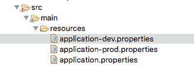

# 基于配置文件的 Bean 配置

配置文件还可以用于在不同环境中定义不同的 bean 或不同的 bean 配置。所有标有`@Component`或`@Configuration`的类也可以标有额外的`@Profile`注解，以指定启用该 bean 或配置的配置文件。

让我们考虑一个例子。一个应用程序需要在不同环境中启用不同的缓存。在`dev`环境中，它使用非常简单的缓存。在生产环境中，我们希望使用分布式缓存。这可以使用配置文件来实现。

以下 bean 显示了在`dev`环境中启用的配置：

```java
    @Profile("dev")
    @Configuration
    public class DevSpecificConfiguration {
      @Bean
      public String cache() {
        return "Dev Cache Configuration";
      }
    }
```

以下 bean 显示了在生产环境中启用的配置：

```java
    @Profile("prod")
    @Configuration
    public class ProdSpecificConfiguration {
      @Bean
      public String cache() {
        return "Production Cache Configuration - Distributed Cache";
      }
   }
```

根据配置的活动配置文件，选择相应的配置。请注意，在此示例中，我们实际上并没有配置分布式缓存。我们返回一个简单的字符串来说明可以使用配置文件来实现这些变化。

# 其他选项用于应用程序配置值

到目前为止，我们采用的方法是使用`application.properties`或`application-{profile-name}.properties`中的键值对来配置应用程序属性。

Spring Boot 提供了许多其他配置应用程序属性的方法。

以下是提供应用程序配置的一些重要方法：

+   命令行参数

+   创建一个名为`SPRING_APPLICATION_JSON`的系统属性，并包含 JSON 配置

+   ServletConfig 初始化参数

+   ServletContext 初始化参数

+   Java 系统属性（`System.getProperties()`）

+   操作系统环境变量

+   打包在`.jar`之外的特定配置文件，位于应用程序的类路径中（`application-{profile}.properties`）

+   打包在`.jar`中的特定配置文件（`application-{profile}.properties`和 YAML 变体）

+   `.jar`之外的应用程序属性

+   打包在`.jar`中的应用程序属性

有关更多信息，请参阅 Spring Boot 文档[`docs.spring.io/spring-boot/docs/current-SNAPSHOT/reference/htmlsingle/#boot-features-external-config`](http://docs.spring.io/spring-boot/docs/current-SNAPSHOT/reference/htmlsingle/#boot-features-external-config)。

此列表顶部的方法比列表底部的方法具有更高的优先级。例如，如果在启动应用程序时提供了一个名为`spring.profiles.active`的命令行参数，它将覆盖通过`application.properties`提供的任何配置，因为命令行参数具有更高的优先级。

这在确定如何在不同环境中配置应用程序方面提供了很大的灵活性。

# YAML 配置

Spring Boot 还支持 YAML 来配置您的属性。

YAML 是“YAML Ain't Markup Language”的缩写。它是一种人类可读的结构化格式。YAML 通常用于配置文件。

要了解 YAML 的基本语法，请查看下面的示例（`application.yaml`）。这显示了如何在 YAML 中指定我们的应用程序配置。

```java
spring:
   profiles:
      active: prod
security:
   basic:
      enabled: false
   user:
      name=user-name
      password=user-password
oauth2:
   client:
      clientId: clientId
      clientSecret: clientSecret
      authorized-grant-types: authorization_code,refresh_token,password
      scope: openid
application:
   enableSwitchForService1: true
   service1Url: http://abc-dev.service.com/somethingelse
   service1Timeout: 250
```

正如您所看到的，YAML 配置比`application.properties`更易读，因为它允许更好地对属性进行分组。

YAML 的另一个优点是它允许您在单个配置文件中为多个配置文件指定配置。以下代码片段显示了一个示例：

```java
application:
  service1Url: http://service.default.com
---
spring:
  profiles: dev
  application:
    service1Url: http://service.dev.com
---
spring:
   profiles: prod
   application:
    service1Url: http://service.prod.com
```

在这个例子中，`http://service.dev.com`将在`dev`配置文件中使用，而`http://service.prod.com`将在`prod`配置文件中使用。在所有其他配置文件中，`http://service.default.com`将作为服务 URL 使用。

# 嵌入式服务器

Spring Boot 引入的一个重要概念是嵌入式服务器。

让我们首先了解传统 Java Web 应用程序部署与这个称为嵌入式服务器的新概念之间的区别。

传统上，使用 Java Web 应用程序，我们构建 Web 应用程序存档（WAR）或企业应用程序存档（EAR）并将它们部署到服务器上。在我们可以在服务器上部署 WAR 之前，我们需要在服务器上安装 Web 服务器或应用服务器。应用服务器将安装在服务器上的 Java 实例之上。因此，我们需要在可以部署我们的应用程序之前在机器上安装 Java 和应用程序（或 Web 服务器）。以下图显示了 Linux 中的一个示例安装：

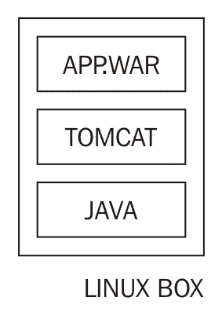

Spring Boot 引入了嵌入式服务器的概念，其中 Web 服务器是应用程序可部署的一部分--JAR。使用嵌入式服务器部署应用程序时，只需在服务器上安装 Java 即可。以下图显示了一个示例安装：

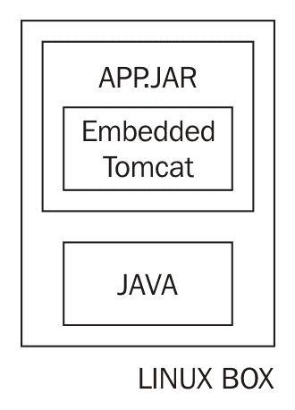

当我们使用 Spring Boot 构建任何应用程序时，默认情况下是构建一个 JAR。使用`spring-boot-starter-web`，默认的嵌入式服务器是 Tomcat。

当我们使用`spring-boot-starter-web`时，在 Maven 依赖项部分可以看到一些与 Tomcat 相关的依赖项。这些依赖项将作为应用程序部署包的一部分包含进去：

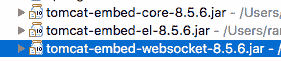

要部署应用程序，我们需要构建一个 JAR。我们可以使用以下命令构建一个 JAR：

```java
mvn clean install
```

以下屏幕截图显示了创建的 JAR 的结构。

`BOOT-INF\classes`包含所有与应用程序相关的类文件（来自`src\main\java`）以及来自`src\main\resources`的应用程序属性：

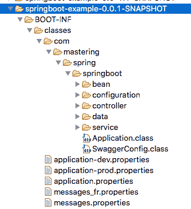

`BOOT-INF\lib`中的一些库在以下屏幕截图中显示：

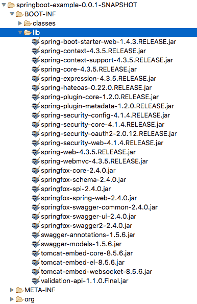

`BOOT-INF\lib`包含应用程序的所有 JAR 依赖项。其中有三个 Tomcat 特定的 JAR 文件。这三个 JAR 文件在将应用程序作为 Java 应用程序运行时启用了嵌入式 Tomcat 服务的启动。因此，只需安装 Java 即可在服务器上部署此应用程序。

# 切换到 Jetty 和 Undertow

以下屏幕截图显示了切换到使用 Jetty 嵌入式服务器所需的更改：

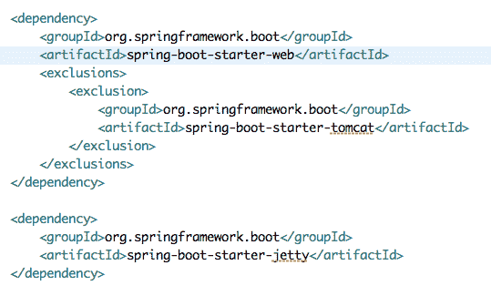

我们所需要做的就是在`spring-boot-starter-web`中排除 Tomcat 启动器依赖项，并在`spring-boot-starter-jetty`中包含一个依赖项。

现在您可以在 Maven 依赖项部分看到许多 Jetty 依赖项。以下截图显示了一些与 Jetty 相关的依赖项：

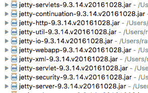

切换到 Undertow 同样很容易。使用`spring-boot-starter-undertow`代替`spring-boot-starter-jetty`：

```java
    <dependency>
      <groupId>org.springframework.boot</groupId>
      <artifactId>spring-boot-starter-undertow</artifactId>
   </dependency>
```

# 构建 WAR 文件

Spring Boot 还提供了构建传统 WAR 文件而不是使用 JAR 的选项。

首先，我们需要在`pom.xml`中更改我们的打包为`WAR`：

```java
    <packaging>war</packaging>
```

我们希望防止 Tomcat 服务器作为 WAR 文件中的嵌入式依赖项。我们可以通过修改嵌入式服务器（以下示例中的 Tomcat）的依赖项来将其范围设置为提供。以下代码片段显示了确切的细节：

```java
    <dependency>
      <groupId>org.springframework.boot</groupId>
      <artifactId>spring-boot-starter-tomcat</artifactId>
      <scope>provided</scope>
   </dependency>
```

当构建 WAR 文件时，不包括 Tomcat 依赖项。我们可以使用此 WAR 文件部署到应用服务器，如 WebSphere 或 Weblogic，或 Web 服务器，如 Tomcat。

# 开发工具

Spring Boot 提供了可以改善开发 Spring Boot 应用程序体验的工具。其中之一是 Spring Boot 开发工具。

要使用 Spring Boot 开发工具，我们需要包含一个依赖项：

```java
    <dependencies>
     <dependency>
       <groupId>org.springframework.boot</groupId>
       <artifactId>spring-boot-devtools</artifactId>
       <optional>true</optional>
     </dependency>
   </dependencies>
```

Spring Boot 开发工具默认禁用视图模板和静态文件的缓存。这使开发人员可以在进行更改后立即看到更改。

另一个重要功能是当类路径中的任何文件更改时自动重新启动。因此，在以下情况下应用程序会自动重新启动：

+   当我们对控制器或服务类进行更改时

+   当我们对属性文件进行更改时

Spring Boot 开发工具的优点如下：

+   开发人员不需要每次都停止和启动应用程序。只要有变化，应用程序就会自动重新启动。

+   Spring Boot 开发工具中的重新启动功能是智能的。它只重新加载活跃开发的类。它不会重新加载第三方 JAR（使用两个不同的类加载器）。因此，当应用程序中的某些内容发生变化时，重新启动速度比冷启动应用程序要快得多。

# 实时重新加载

另一个有用的 Spring Boot 开发工具功能是**实时重新加载**。您可以从[`livereload.com/extensions/`](http://livereload.com/extensions/)下载特定的浏览器插件。

您可以通过单击浏览器中的按钮来启用实时重新加载。 Safari 浏览器中的按钮如下截图所示。它位于地址栏旁边的左上角。

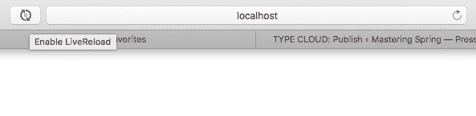

如果在浏览器中显示的页面或服务上进行了代码更改，它们将自动刷新为新内容。不再需要点击刷新按钮！

# Spring Boot 执行器

当应用程序部署到生产环境时：

+   我们希望立即知道某些服务是否宕机或非常缓慢

+   我们希望立即知道任何服务器是否没有足够的可用空间或内存

这被称为**应用程序监控**。

**Spring Boot 执行器**提供了许多生产就绪的监控功能。

我们将通过添加一个简单的依赖项来添加 Spring Boot 执行器：

```java
    <dependencies>
      <dependency>
        <groupId>org.springframework.boot</groupId>
        <artifactId>spring-boot-starter-actuator</artifactId>
     </dependency>
   </dependencies>
```

一旦执行器添加到应用程序中，它就会启用许多端点。当我们启动应用程序时，我们会看到许多新添加的映射。以下截图显示了启动日志中这些新映射的摘录：

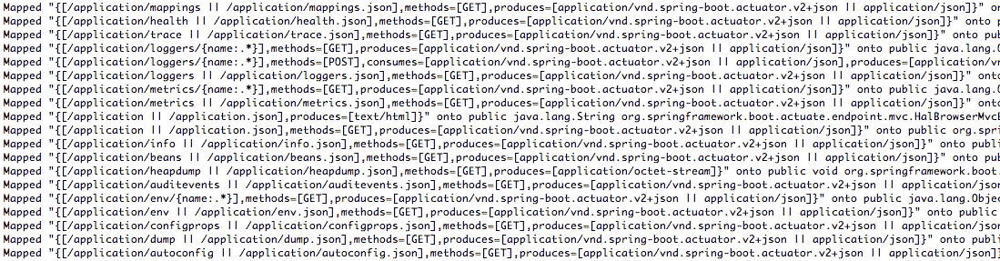

执行器公开了许多端点。执行器端点（`http://localhost:8080/application`）充当所有其他端点的发现。当我们从 Postman 执行请求时，以下截图显示了响应：

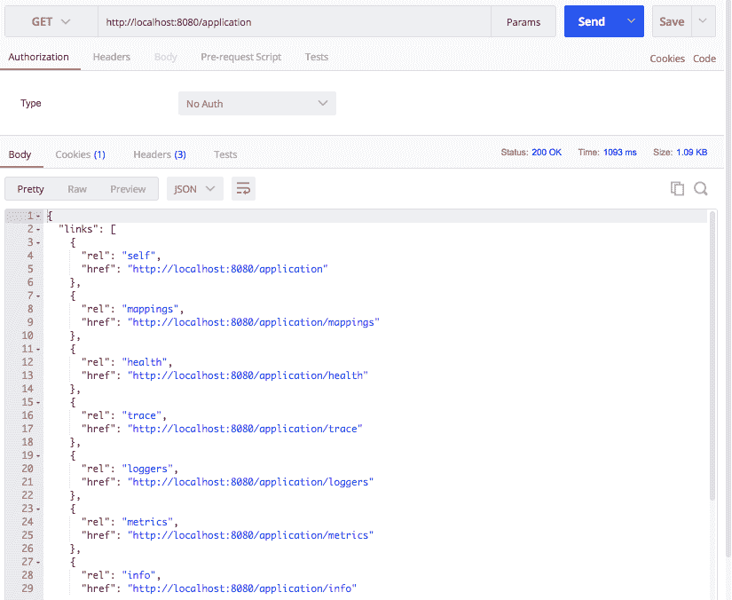

# HAL 浏览器

许多这些端点暴露了大量数据。为了能够更好地可视化信息，我们将在我们的应用程序中添加一个**HAL 浏览器**：

```java
    <dependency>
      <groupId>org.springframework.data</groupId>
      <artifactId>spring-data-rest-hal-browser</artifactId>
    </dependency>
```

Spring Boot Actuator 在 Spring Boot 应用程序和环境中捕获的所有数据周围暴露了 REST API。HAL 浏览器使得在 Spring Boot Actuator API 周围进行可视化表示成为可能：

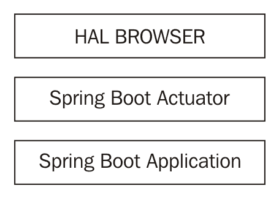

当我们在浏览器中启动`http://localhost:8080/application`时，我们可以看到 actuator 暴露的所有 URL。

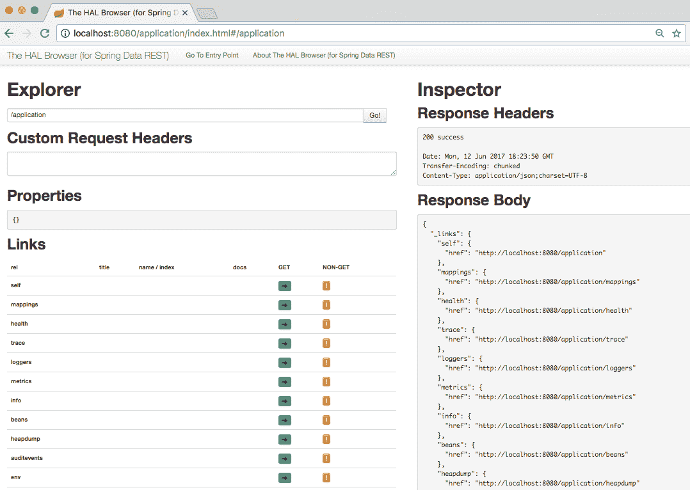

让我们通过 HAL 浏览器浏览 actuator 作为不同端点的一部分暴露的所有信息。

# 配置属性

`configprops`端点提供了关于可以通过应用程序属性进行配置的配置选项的信息。它基本上是所有`@ConfigurationProperties`的汇总列表。下面的屏幕截图显示了 HAL 浏览器中的 configprops：

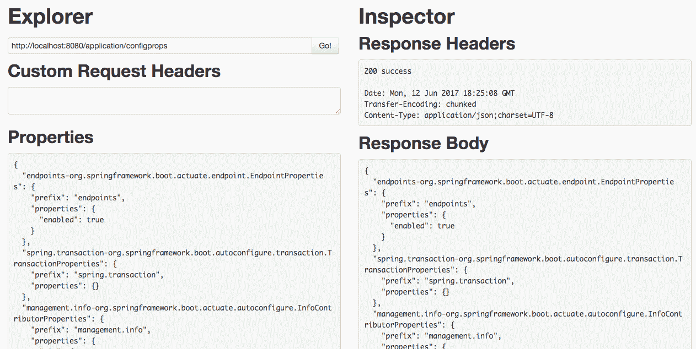

为了举例说明，以下部分从服务响应中显示了 Spring MVC 可用的配置选项：

```java
"spring.mvc-  org.springframework.boot.autoconfigure.web.WebMvcProperties": {
   "prefix": "spring.mvc",
   "properties": {
                   "dateFormat": null,
                   "servlet": {
                     "loadOnStartup": -1
                  },
   "staticPathPattern": "/**",
   "dispatchOptionsRequest": true,
   "dispatchTraceRequest": false,
   "locale": null,
   "ignoreDefaultModelOnRedirect": true,
   "logResolvedException": true,
   "async": {
              "requestTimeout": null
            },
   "messageCodesResolverFormat": null,
   "mediaTypes": {},
   "view": {
             "prefix": null,
             "suffix": null
           },
   "localeResolver": "ACCEPT_HEADER",
   "throwExceptionIfNoHandlerFound": false
    }
 }
```

为了为 Spring MVC 提供配置，我们将前缀与属性中的路径组合在一起。例如，要配置`loadOnStartup`，我们使用名称为`spring.mvc.servlet.loadOnStartup`的属性。

# 环境细节

**环境（env）**端点提供了有关操作系统、JVM 安装、类路径、系统环境变量以及各种应用程序属性文件中配置的值的信息。以下屏幕截图显示了 HAL 浏览器中的环境端点：

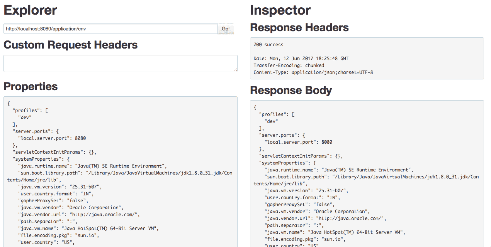

以下是从`/application/env`服务的响应中提取的内容。它显示了一些系统详细信息以及应用程序配置的详细信息：

```java
"systemEnvironment": {
    "JAVA_MAIN_CLASS_13377": "com.mastering.spring.springboot.Application",
    "PATH": "/usr/bin:/bin:/usr/sbin:/sbin",
    "SHELL": "/bin/bash",
    "JAVA_STARTED_ON_FIRST_THREAD_13019": "1",
    "APP_ICON_13041": "../Resources/Eclipse.icns",
    "USER": "rangaraokaranam",
    "TMPDIR": "/var/folders/y_/x4jdvdkx7w94q5qsh745gzz00000gn/T/",
    "SSH_AUTH_SOCK": "/private/tmp/com.apple.launchd.IcESePQCLV/Listeners",
    "XPC_FLAGS": "0x0",
    "JAVA_STARTED_ON_FIRST_THREAD_13041": "1",
    "APP_ICON_11624": "../Resources/Eclipse.icns",
    "LOGNAME": "rangaraokaranam",
    "XPC_SERVICE_NAME": "0",
    "HOME": "/Users/rangaraokaranam"
  },
  "applicationConfig: [classpath:/application-prod.properties]": {
    "application.service1Timeout": "250",
    "application.service1Url": "http://abc-    prod.service.com/somethingelse",
    "application.enableSwitchForService1": "false"
  },
```

# 健康

健康服务提供了磁盘空间和应用程序状态的详细信息。以下屏幕截图显示了从 HAL 浏览器执行的服务：

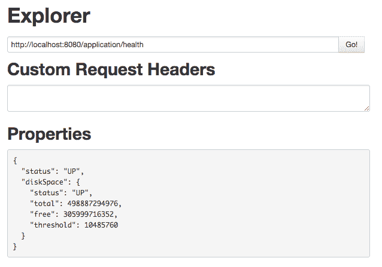

# Mappings

Mappings 端点提供了有关从应用程序暴露的不同服务端点的信息：

+   URI

+   请求方法

+   Bean

+   暴露服务的控制器方法

Mappings 提供了所有`@RequestMapping`路径的汇总列表。以下是从`/application/mappings`端点的响应中提取的内容。我们可以看到在本书中之前创建的不同控制器方法的映射：

```java
"{[/welcome-internationalized],methods=[GET]}": {
   "bean": "requestMappingHandlerMapping",
   "method": "public java.lang.String 
    com.mastering.spring.springboot.controller.
    BasicController.msg(java.uti l.Locale)"
 },
 "{[/welcome],methods=[GET]}": {
    "bean": "requestMappingHandlerMapping",
    "method": "public java.lang.String 
     com.mastering.spring.springboot.controller.
     BasicController.welcome()"
 },
 "{[/welcome-with-object],methods=[GET]}": {
     "bean": "requestMappingHandlerMapping",
     "method": "public com.mastering.spring.springboot.
      bean.WelcomeBeancom.mastering.spring.springboot.
      controller.BasicController.welcomeWithObject()"
 },
 "{[/welcome-with-parameter/name/{name}],methods=[GET]}": {
      "bean": "requestMappingHandlerMapping",
      "method": "public 
       com.mastering.spring.springboot.bean.WelcomeBean   
       com.mastering.spring.springboot.controller.
       BasicController.welcomeWithParameter(java.lang.String)"
 },
 "{[/users/{name}/todos],methods=[POST]}": {
       "bean": "requestMappingHandlerMapping",
       "method": "org.springframework.http.ResponseEntity<?>    
        com.mastering.spring.springboot.controller.
        TodoController.add(java.lang.String,com.mastering.spring.
        springboot.bean.Todo)"
  },
 "{[/users/{name}/todos],methods=[GET]}": {
        "bean": "requestMappingHandlerMapping",
        "method": "public java.util.List<com.mastering.spring.
         springboot.bean.Todo> 
         com.mastering.spring.springboot.controller.
         TodoController.retrieveTodos(java.lang.String)"
 },
 "{[/users/{name}/todos/{id}],methods=[GET]}": {
        "bean": "requestMappingHandlerMapping",
        "method": "public 
         org.springframework.hateoas.Resource<com.mastering.
         spring.springboot.bean.Todo>  
         com.mastering.spring.springboot.controller.
         TodoController.retrieveTodo(java.lang.String,int)"
 },
```

# Beans

beans 端点提供了有关加载到 Spring 上下文中的 bean 的详细信息。这对于调试与 Spring 上下文相关的任何问题非常有用。

以下是从`/application/beans`端点的响应中提取的内容：

```java
  {
     "bean": "basicController",
     "aliases": [],
     "scope": "singleton",
     "type": "com.mastering.spring.springboot.
      controller.BasicController",
     "resource": "file [/in28Minutes/Workspaces/
      SpringTutorial/mastering-spring-chapter-5-6-  
      7/target/classes/com/mastering/spring/springboot/
      controller/BasicController.class]",
      "dependencies": [
                     "messageSource"
                    ]
   },
   {
      "bean": "todoController",
      "aliases": [],
      "scope": "singleton",
      "type": "com.mastering.spring.springboot.
       controller.TodoController",
       "resource": "file [/in28Minutes/Workspaces/SpringTutorial/
       mastering-spring-chapter-5-6-
       7/target/classes/com/mastering/spring/
       springboot/controller/TodoController.class]",
       "dependencies": [
                      "todoService"
                     ]
    }
```

它显示了两个 bean：`basicController`和`todoController`的详细信息。您可以看到所有 bean 的以下详细信息：

+   bean 的名称及其别名

+   bean 的范围

+   Bean 的类型

+   创建此 bean 的类的确切位置

+   Bean 的依赖关系

# 指标

指标端点显示以下一些重要的指标：

+   服务器--空闲内存、处理器、正常运行时间等

+   JVM--关于堆、线程、垃圾收集、会话等的详细信息

+   应用程序服务提供的响应

以下是从`/application/metrics`端点的响应中提取的内容：

```java
{
 "mem": 481449,
 "mem.free": 178878,
 "processors": 4,
 "instance.uptime": 1853761,
 "uptime": 1863728,
 "systemload.average": 2.3349609375,
 "heap.committed": 413696,
 "heap.init": 65536,
 "heap.used": 234817,
 "heap": 932352,
 "nonheap.committed": 69248,
 "nonheap.init": 2496,
 "nonheap.used": 67754,
 "nonheap": 0,
 "threads.peak": 23,
 "threads.daemon": 21,
 "threads.totalStarted": 30,
 "threads": 23,
 "classes": 8077,
 "classes.loaded": 8078,
 "classes.unloaded": 1,
 "gc.ps_scavenge.count": 15,
 "gc.ps_scavenge.time": 242,
 "gc.ps_marksweep.count": 3,
 "gc.ps_marksweep.time": 543,
 "httpsessions.max": -1,
 "httpsessions.active": 0,
 "gauge.response.actuator": 8,
 "gauge.response.mappings": 12,
 "gauge.response.beans": 83,
 "gauge.response.health": 14,
 "gauge.response.root": 9,
 "gauge.response.heapdump": 4694,
 "gauge.response.env": 6,
 "gauge.response.profile": 12,
 "gauge.response.browser.star-star": 10,
 "gauge.response.actuator.root": 2,
 "gauge.response.configprops": 272,
 "gauge.response.actuator.star-star": 13,
 "counter.status.200.profile": 1,
 "counter.status.200.actuator": 8,
 "counter.status.200.mappings": 1,
 "counter.status.200.root": 5,
 "counter.status.200.configprops": 1,
 "counter.status.404.actuator.star-star": 3,
 "counter.status.200.heapdump": 1,
 "counter.status.200.health": 1,
 "counter.status.304.browser.star-star": 132,
 "counter.status.302.actuator.root": 4,
 "counter.status.200.browser.star-star": 37,
 "counter.status.200.env": 2,
 "counter.status.302.root": 5,
 "counter.status.200.beans": 1,
 "counter.status.200.actuator.star-star": 210,
 "counter.status.302.actuator": 1
 }
```

# 自动配置

自动配置是 Spring Boot 的最重要特性之一。自动配置端点（`/application/autoconfig`）暴露了与自动配置相关的详细信息。它显示了成功或失败的特定自动配置的原因的正匹配和负匹配。

以下提取显示了响应中一些正匹配的内容：

```java
"positiveMatches": {
  "AuditAutoConfiguration#auditListener": [
   {
     "condition": "OnBeanCondition",
     "message": "@ConditionalOnMissingBean (types:     
      org.springframework.boot.actuate.audit.
      listener.AbstractAuditListener; SearchStrategy: all) did not find 
      any beans"
   }
 ],
 "AuditAutoConfiguration#authenticationAuditListener": [
 {
   "condition": "OnClassCondition",
   "message": "@ConditionalOnClass found required class
   'org.springframework.security.authentication.
   event.AbstractAuthenticationEvent'"
 },
```

以下提取显示了响应中一些负匹配的内容：

```java
"negativeMatches": {
  "CacheStatisticsAutoConfiguration.
   CaffeineCacheStatisticsProviderConfiguration": [
 {
   "condition": "OnClassCondition",
   "message": "@ConditionalOnClass did not find required class  
   'com.github.benmanes.caffeine.cache.Caffeine'"
 }
 ],
   "CacheStatisticsAutoConfiguration.
   EhCacheCacheStatisticsProviderConfiguration": [
 {
   "condition": "OnClassCondition",
   "message": "@ConditionalOnClass did not find required classes
   'net.sf.ehcache.Ehcache',   
   'net.sf.ehcache.statistics.StatisticsGateway'"
 }
 ],
```

所有这些细节对于调试自动配置非常有用。

# 调试

在调试问题时，三个执行器端点非常有用：

+   `/application/heapdump`：提供堆转储

+   `/application/trace`：提供应用程序最近几个请求的跟踪

+   `/application/dump`：提供线程转储

# 将应用程序部署到 Cloud

Spring Boot 对大多数流行的云**平台即服务**（**PaaS**）提供商有很好的支持。

一些流行的云端包括：

+   Cloud Foundry

+   Heroku

+   OpenShift

+   **亚马逊网络服务**（**AWS**）

在本节中，我们将专注于将我们的应用程序部署到 Cloud Foundry。

# Cloud Foundry

Cloud Foundry 的 Java 构建包对 Spring Boot 有很好的支持。我们可以部署基于 JAR 的独立应用程序，也可以部署传统的 Java EE WAR 应用程序。

Cloud Foundry 提供了一个 Maven 插件来部署应用程序：

```java
<build>
   <plugins>
      <plugin>
         <groupId>org.cloudfoundry</groupId>
         <artifactId>cf-maven-plugin</artifactId>
         <version>1.1.2</version>
      </plugin>
   </plugins>
</build>
```

在我们部署应用程序之前，我们需要为应用程序配置目标和空间以部署应用程序。

涉及以下步骤：

1.  我们需要在[`account.run.pivotal.io/sign-up`](https://account.run.pivotal.io/sign-up)创建一个 Pivotal Cloud Foundry 账户。

1.  一旦我们有了账户，我们可以登录到[`run.pivotal.io`](https://run.pivotal.io)创建一个组织和空间。准备好组织和空间的详细信息，因为我们需要它们来部署应用程序。

我们可以使用`org`和`space`的配置更新插件：

```java
<build>
   <plugins>
      <plugin>
         <groupId>org.cloudfoundry</groupId>
         <artifactId>cf-maven-plugin</artifactId>
         <version>1.1.2</version>
         <configuration>
            <target>http://api.run.pivotal.io</target>
            <org>in28minutes</org>
            <space>development</space>
            <memory>512</memory>
            <env>
               <ENV-VAR-NAME>prod</ENV-VAR-NAME>
            </env>
         </configuration>
      </plugin>
   </plugins>
</build>
```

我们需要使用 Maven 插件在命令提示符或终端上登录到 Cloud Foundry：

```java
mvn cf:login -Dcf.username=<<YOUR-USER-ID>> -Dcf.password=<<YOUR-PASSWORD>>
```

如果一切顺利，您将看到一条消息，如下所示：

```java
[INFO] ------------------------------------------------------------------
 [INFO] Building Your First Spring Boot Example 0.0.1-SNAPSHOT
 [INFO] -----------------------------------------------------------------
 [INFO]
 [INFO] --- cf-maven-plugin:1.1.2:login (default-cli) @ springboot-for-beginners-example ---
 [INFO] Authentication successful
 [INFO] -----------------------------------------------------------------
 [INFO] BUILD SUCCESS
 [INFO] -----------------------------------------------------------------
 [INFO] Total time: 14.897 s
 [INFO] Finished at: 2017-02-05T16:49:52+05:30
 [INFO] Final Memory: 22M/101M
 [INFO] -----------------------------------------------------------------
```

一旦您能够登录，您可以将应用程序推送到 Cloud Foundry：

```java
mvn cf:push
```

一旦我们执行命令，Maven 将编译，运行测试，构建应用程序的 JAR 或 WAR，然后将其部署到云端：

```java
[INFO] Building jar: /in28Minutes/Workspaces/SpringTutorial/springboot-for-beginners-example-rest-service/target/springboot-for-beginners-example-0.0.1-SNAPSHOT.jar
 [INFO]
 [INFO] --- spring-boot-maven-plugin:1.4.0.RELEASE:repackage (default) @ springboot-for-beginners-example ---
 [INFO]
 [INFO] <<< cf-maven-plugin:1.1.2:push (default-cli) < package @ springboot-for-beginners-example <<<
 [INFO]
 [INFO] --- cf-maven-plugin:1.1.2:push (default-cli) @ springboot-for-beginners-example ---
 [INFO] Creating application 'springboot-for-beginners-example'
 [INFO] Uploading '/in28Minutes/Workspaces/SpringTutorial/springboot-for-beginners-example-rest-service/target/springboot-for-beginners-example-0.0.1-SNAPSHOT.jar'
 [INFO] Starting application
 [INFO] Checking status of application 'springboot-for-beginners-example'
 [INFO] 1 of 1 instances running (1 running)
 [INFO] Application 'springboot-for-beginners-example' is available at 'http://springboot-for-beginners-example.cfapps.io'
 [INFO] ----------------------------------------------------------------- [INFO] BUILD SUCCESS
 [INFO] ----------------------------------------------------------------- [INFO] Total time: 02:21 min
 [INFO] Finished at: 2017-02-05T16:54:55+05:30
 [INFO] Final Memory: 29M/102M
 [INFO] -----------------------------------------------------------------
```

一旦应用程序在云端运行起来，我们可以使用日志中的 URL 来启动应用程序：[`springboot-for-beginners-example.cfapps.io`](http://springboot-for-beginners-example.cfapps.io)。

您可以在[`docs.run.pivotal.io/buildpacks/java/build-tool-int.html#maven`](https://docs.run.pivotal.io/buildpacks/java/build-tool-int.html#maven)找到有关 Cloud Foundry 的 Java Build Pack 的更多信息。

# 总结

Spring Boot 使开发基于 Spring 的应用程序变得容易。它使我们能够非常快速地创建生产就绪的应用程序。

在本章中，我们了解了 Spring Boot 提供的不同外部配置选项。我们查看了嵌入式服务器，并将一个测试应用程序部署到了 PaaS 云平台--Cloud Foundry。我们探讨了如何使用 Spring Boot 执行器在生产环境中监视我们的应用程序。最后，我们看了一下使开发人员更加高效的功能--Spring Boot 开发人员工具和实时重新加载。

在下一章中，我们将把注意力转向数据。我们将涵盖 Spring Data，并看看它如何使与 JPA 集成和提供 Rest 服务更容易。
