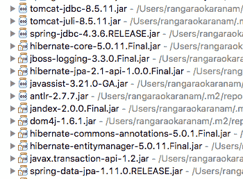
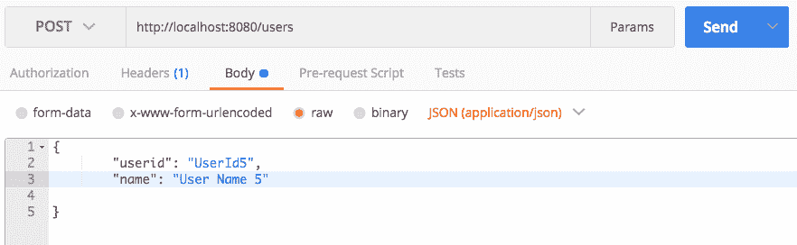

# 第八章：Spring Data

在*第七章*中，*高级 Spring Boot 功能*，我们讨论了高级 Spring Boot 功能，如外部化配置、监控、嵌入式服务器和部署到云端。在本章中，让我们把注意力转向数据。我们存储数据的地方以及我们如何存储数据在过去的十年中发生了快速的演变。在几十年的关系数据库稳定之后，在过去的十年中，一些非结构化的非关系数据库开始占据重要地位。随着各种数据存储的出现，与这些数据存储进行通信的框架变得更加重要。虽然 JPA 使得与关系数据库进行通信变得容易，但 Spring Data 旨在引入一种通用的方法来与更广泛的数据存储进行通信--无论是关系型还是其他类型的数据存储。

在本章中，我们将回答以下一些问题：

+   什么是 Spring Data？

+   Spring Data 的目标是什么？

+   如何使用 Spring Data 和 Spring Data JPA 与关系数据库进行通信？

+   如何使用 Spring Data 与 Spring Data JPA 与关系数据库进行通信？

# 背景-数据存储

大多数应用程序与各种数据存储进行通信。应用程序与数据存储进行通信的方式已经有了相当大的发展。Java EE 提供的最基本的 API 是**JDBC**（Java 数据库连接）。JDBC 用于从 Java EE 的第一个版本开始与关系数据库通信。JDBC 基于使用 SQL 查询来操作数据。以下是典型的 JDBC 代码示例：

```java
    PreparedStatement st = null; 
    st = conn.prepareStatement(INSERT_TODO_QUERY); 
    st.setString(1, bean.getDescription()); 
    st.setBoolean(2, bean.isDone()); 
    st.execute();
```

典型的 JDBC 代码包含以下内容：

+   要执行的查询（或存储过程）

+   设置查询参数到语句对象的代码

+   将 ResultSet（执行查询的结果）转换为 bean 的代码

典型项目涉及数千行 JDBC 代码。JDBC 代码编写和维护起来很麻烦。为了在 JDBC 之上提供额外的层，出现了两个流行的框架：

+   **myBatis**（之前称为 iBatis）：MyBatis 消除了手动编写代码来设置参数和检索结果的需要。它提供了简单的基于 XML 或注释的配置，将 Java POJO 映射到数据库。

+   **Hibernate**：Hibernate 是一个**ORM**（对象/关系映射）框架。ORM 框架帮助您将对象映射到关系数据库中的表。Hibernate 的好处在于开发人员不需要手动编写查询。一旦对象和表之间的关系被映射，Hibernate 就会使用映射来创建查询和填充/检索数据。

Java EE 提出了一个名为**JPA**（Java 持久化 API）的 API，它基本上是根据当时流行的 ORM 实现--Hibernate 框架来定义的。Hibernate（自 3.4.0.GA 以来）支持/实现 JPA。

在关系数据库中，数据存储在规范化的、定义良好的表中。虽然 Java EE 试图解决与关系数据存储通信的挑战，但在过去的十年中，其他几种数据存储变得流行。随着大数据和实时数据需求的发展，新的和更无结构的数据存储形式出现了。这些类型的数据库通常被归类为 NoSQL 数据库。例如 Cassandra（列）、MongoDB（文档）和 Hadoop。

# Spring Data

每种数据存储都有不同的连接和检索/更新数据的方式。Spring Data 旨在提供一种一致的模型--另一种抽象层--以访问不同类型的数据存储中的数据。

以下是一些重要的 Spring Data 功能：

+   通过各种存储库轻松集成多个数据存储

+   根据存储库方法名称解析和形成查询的能力

+   提供默认的 CRUD 功能

+   基本支持审计，例如由用户创建和最后由用户更改

+   与 Spring 强大的集成

+   与 Spring MVC 的出色集成，通过**Spring Data Rest**公开 REST 控制器

Spring Data 是一个由多个模块组成的综合项目。一些重要的 Spring Data 模块列举如下：

+   **Spring Data Commons**：定义了所有 Spring Data 模块的共同概念--存储库和查询方法

+   **Spring Data JPA**：提供与 JPA 存储库的轻松集成

+   **Spring Data MongoDB**：提供与 MongoDB（基于文档的数据存储）的轻松集成

+   **Spring Data REST**：提供将 Spring Data 存储库作为 REST 服务暴露出来的功能，代码量最小

+   **Spring Data for Apache Cassandra**：提供与 Cassandra 的轻松集成

+   提供与 Hadoop 的轻松集成

在本章中，我们将深入研究 Spring Data、存储库和查询方法背后的共同概念。在最初的示例中，我们将使用 Spring Data JPA 来说明这些概念。在本章后面，我们还将看一下与 MongoDB 的示例集成。

# Spring Data Commons

Spring Data Commons 提供了 Spring Data 模块背后的基本抽象。我们将使用 Spring Data JPA 作为示例来说明这些抽象。

Spring Data Commons 中的一些重要接口列举如下：

```java
   Repository<T, ID extends Serializable>
   CrudRepository<T, ID extends Serializable> extends Repository<T, ID>
   PagingAndSortingRepository<T, ID extends Serializable> extends   
   CrudRepository<T, ID>
```

# Repository

Repository 是 Spring Data 的核心接口。它是一个**标记接口**。

# CrudRepository 接口

`CrudRepository`定义了基本的`Create`、`Read`、`Update`和`Delete`方法。`CrudRepository`中的重要方法如下所示：

```java
    public interface CrudRepository<T, ID extends Serializable>
      extends Repository<T, ID> {
      <S extends T> S save(S entity);
      findOne(ID primaryKey);
      Iterable<T> findAll();
      Long count();
      void delete(T entity);
      boolean exists(ID primaryKey);
      // … more functionality omitted.
    }
```

# PagingAndSortingRepository 接口

PagingAndSortingRepository 定义了方法，提供了将 ResultSet 分成页面以及对结果进行排序的功能：

```java
   public interface PagingAndSortingRepository<T, ID extends
     Serializable>
     extends CrudRepository<T, ID> {
       Iterable<T> findAll(Sort sort);
       Page<T> findAll(Pageable pageable);
    }
```

我们将在 Spring Data JPA 部分的示例中查看使用`Sort`类和`Page`、`Pageable`接口的示例。

# Spring Data JPA

Spring Data JPA 实现了 Spring Data Common 接口中定义的核心功能。

**JpaRepository**是 JPA 特定的存储库接口。

```java
   public interface JpaRepository<T, ID extends Serializable>
   extends PagingAndSortingRepository<T, ID>, 
   QueryByExampleExecutor<T>     {
```

**SimpleJpaRepository**是 JPA 的 CrudRepository 接口的默认实现：

```java
   public class SimpleJpaRepository<T, ID extends Serializable>
   implements JpaRepository<T, ID>, JpaSpecificationExecutor<T>
```

# Spring Data JPA 示例

让我们建立一个简单的项目，以了解与 Spring Data Commons 和 Spring Data JPA 相关的不同概念。

以下是涉及的步骤：

1.  使用`spring-boot-starter-data-jpa`作为依赖项创建一个新项目。

1.  添加实体。

1.  将`SpringBootApplication`类添加到运行应用程序。

1.  创建存储库。

# 使用 Starter Data JPA 创建新项目

我们将使用以下依赖项创建一个简单的 Spring Boot Maven 项目：

```java
   <dependency>
     <groupId>org.springframework.boot</groupId>
     <artifactId>spring-boot-starter-data-jpa</artifactId>
  </dependency>
  <dependency>
     <groupId>com.h2database</groupId>
     <artifactId>h2</artifactId>
     <scope>runtime</scope>
  </dependency>
  <dependency>
     <groupId>org.springframework.boot</groupId>
     <artifactId>spring-boot-starter-test</artifactId>
     <scope>test</scope>
  </dependency>
```

`spring-boot-starter-data-jpa`是 Spring Boot 的 Spring Data JPA 启动器项目。`spring-boot-starter-data-jpa`引入的重要依赖包括**JTA**（Java 事务 API）、Hibernate Core 和 Entity Manager（默认 JPA 实现）。其他一些重要的依赖包如下截图所示：



# 实体

让我们定义一些实体来用在我们的示例中。我们将创建一个名为`Todo`的实体来管理待办事项。一个简单的示例如下所示：

```java
   @Entity
   public class Todo {
     @Id
     @GeneratedValue(strategy = GenerationType.AUTO)
     private Long id;
     @ManyToOne(fetch = FetchType.LAZY)
     @JoinColumn(name = "userid")
     private User user;
     private String title;
     private String description;
     private Date targetDate;
     private boolean isDone;
     public Todo() {// Make JPA Happy
    }
   }
```

需要注意的重要事项如下：

+   `Todo`有一个标题，一个描述，一个目标日期和一个完成指示器（`isDone`）。JPA 需要一个构造函数。

+   `@Entity`: 该注解指定该类是一个实体。

+   `@Id`: 指定 ID 是实体的主键。

+   `@GeneratedValue(strategy = GenerationType.AUTO)`: `GeneratedValue`注解用于指定如何生成主键。在这个例子中，我们使用了`GenerationType.AUTO`的策略。这表示我们希望持久性提供者选择正确的策略。

+   `@ManyToOne(fetch = FetchType.LAZY)`: 表示`User`和`Todo`之间的多对一关系。`@ManyToOne`关系用于关系的一侧。`FetchType.Lazy`表示数据可以懒加载。

+   `@JoinColumn(name = "userid")`: `JoinColumn`注解指定外键列的名称。

以下代码片段显示了`User`实体：

```java
   @Entity
   public class User {
     @Id
     @GeneratedValue(strategy = GenerationType.AUTO)
     private Long id;
     private String userid;
     private String name;
     @OneToMany(mappedBy = "user")
     private List<Todo> todos;
     public User() {// Make JPA Happy
    }
   }
```

需要注意的重要事项如下：

+   用户被定义为具有`userid`和`name`属性的实体。ID 是自动生成的主键。

+   `@OneToMany(mappedBy = "user")`：`OneToMany`注解用于一对多关系的多端。`mappedBy`属性指示关系的所有者实体的属性。

# SpringBootApplication 类

让我们创建一个`SpringBootApplication`类，以便能够运行 Spring Boot 应用程序。以下代码片段显示了一个简单的示例：

```java
    @SpringBootApplication
    public class SpringDataJpaFirstExampleApplication {
      public static void main(String[] args) {
        SpringApplication.run( 
        SpringDataJpaFirstExampleApplication.class, args);
      }
    }
```

以下代码片段显示了我们将`SpringDataJpaFirstExampleApplication`作为 Java 应用程序运行时生成的一些日志：

```java
LocalContainerEntityManagerFactoryBean : Building JPA container EntityManagerFactory for persistence unit 'default'
org.hibernate.Version : HHH000412: Hibernate Core {5.0.11.Final}
org.hibernate.dialect.Dialect : HHH000400: Using dialect: org.hibernate.dialect.H2Dialect
org.hibernate.tool.hbm2ddl.SchemaExport : HHH000227: Running hbm2ddl schema export
org.hibernate.tool.hbm2ddl.SchemaExport : HHH000230: Schema export complete
j.LocalContainerEntityManagerFactoryBean : Initialized JPA EntityManagerFactory for persistence unit 'default'
```

一些重要观察结果如下：

+   `HHH000412: Hibernate Core {5.0.11.Final}`：Hibernate 框架已初始化

+   `HHH000400: Using dialect: org.hibernate.dialect.H2Dialect`：初始化了 H2 内存数据库

+   `HHH000227: Running hbm2ddl schema export`：基于可用的实体（`Todo`和`User`）和它们之间的关系，创建了一个模式

在上一次执行中发生了很多魔法。让我们看一些重要的问题：

1.  尽管我们没有在`pom.xml`中明确声明依赖关系，但 Hibernate 框架是如何介入的？

1.  H2 内存数据库是如何使用的？

1.  创建的模式是什么？

现在让我们回答每个问题。

尽管我们没有在`pom.xml`中明确声明依赖关系，但 Hibernate 框架是如何介入的？

+   Hibernate 是 Spring Boot Starter JPA 的依赖之一。因此，它是默认使用的 JPA 实现。

H2 内存数据库是如何使用的？

+   在我们的依赖项中，我们包含了一个运行时范围的 H2 依赖项。当 Spring Boot Data JPA 自动配置运行时，它注意到我们没有在配置中包含任何数据源（实际上，我们根本没有配置）。Spring Boot Data JPA 然后尝试自动配置一个内存数据库。它看到类路径上的 H2。因此，它初始化了一个内存中的 H2 数据库。

创建的模式是什么？

以下代码片段显示了根据我们声明的实体类和关系创建的模式。这是由 Spring Boot Data JPA 自动配置自动创建的。

```java
    create table todo (
      id bigint generated by default as identity,
      description varchar(255),
      is_done boolean not null,
      target_date timestamp,
      title varchar(255),
      userid bigint,
      primary key (id)
     )
    create table user (
      id bigint generated by default as identity,
      name varchar(255),
      userid varchar(255),
      primary key (id)
     )
    alter table todo
    add constraint FK4wek61l9imiccm4ypjj5hfn2g
   foreign key (userid)
   references user
```

`todo`表对用户表有一个外键用户 ID。

# 填充一些数据

为了能够测试我们将创建的存储库，我们将在这些表中填充一些测试数据。我们需要做的就是在`src\main\resources`中包含名为`data.sql`的文件，并包含以下语句：

```java
insert into user (id, name, userid)
 values (1, 'User Name 1', 'UserId1');
insert into user (id, name, userid)
 values (2, 'User Name 2', 'UserId2');
insert into user (id, name, userid)
 values (3, 'User Name 3', 'UserId3');
insert into user (id, name, userid)
 values (4, 'User Name 4', 'UserId4');
insert into todo (id, title, description, is_done, target_date, userid)
 values (101, 'Todo Title 1', 'Todo Desc 1', false, CURRENT_DATE(), 1);
insert into todo (id, title, description, is_done, target_date, userid)
 values (102, 'Todo Title 2', 'Todo Desc 2', false, CURRENT_DATE(), 1);
insert into todo (id, title, description, is_done, target_date, userid)
 values (103, 'Todo Title 3', 'Todo Desc 3', false, CURRENT_DATE(), 2);
```

这些是简单的插入语句。我们创建了四个用户 - 第一个用户有两个待办事项，第二个用户有一个待办事项，最后两个用户没有。

当您再次将`SpringDataJpaFirstExampleApplication`作为 Java 应用程序运行时，您将在日志中看到一些额外的语句：

```java
ScriptUtils : Executing SQL script from URL [file:/in28Minutes/Workspaces/SpringDataJPA-Preparation/Spring-Data-JPA-Trial-Run/target/classes/data.sql]

ScriptUtils : Executed SQL script from URL [file:/in28Minutes/Workspaces/SpringDataJPA-Preparation/Spring-Data-JPA-Trial-Run/target/classes/data.sql] in 42 ms.
```

日志语句确认数据正在填充到 H2 内存数据库中。让我们把注意力转向创建存储库，以从 Java 代码中访问和操作数据。

# 一个简单的存储库

可以通过扩展存储库标记接口来创建自定义存储库。在以下示例中，我们使用两个方法扩展了存储库接口--`findAll`和`count`：

```java
    import org.springframework.data.repository.Repository;
    public interface TodoRepository extends Repository<Todo, Long> {
      Iterable<Todo> findAll();
      long count();
    }
```

需要注意的一些重要事项如下：

+   `public interface TodoRepository extends Repository<Todo, Long>`：`TodoRepository`接口扩展了`Repository`接口。两个泛型类型表示正在管理的实体--Todo 和主键的类型，即`Long`。

+   `Iterable<Todo> findAll()`: 用于列出所有待办事项。请注意，方法的名称应与`CrudRepository`中定义的名称匹配。

+   `long count()`: 用于查找所有待办事项的计数。

# 单元测试

让我们编写一个简单的单元测试，测试我们是否能够使用`TodoRepository`访问`todo`数据。以下代码片段显示了重要细节：

```java
    @DataJpaTest
    @RunWith(SpringRunner.class)
    public class TodoRepositoryTest {
      @Autowired
      TodoRepository todoRepository;
      @Test
      public void check_todo_count() {
        assertEquals(3, todoRepository.count());
      }
    }
```

需要注意的一些重要事项如下：

+   `@DataJpaTest`: `DataJpaTest`注解通常与`SpringRunner`一起在 JPA 存储库单元测试中使用。此注解将仅启用与 JPA 相关的自动配置。测试将默认使用内存数据库。

+   `@RunWith(SpringRunner.class)`: `SpringRunner`是`SpringJUnit4ClassRunner`的简单别名。它启动了一个 Spring 上下文。

+   `@Autowired TodoRepository todoRepository`: 自动装配`TodoRepository`以在测试中使用。

+   `assertEquals(3, todoRepository.count())`: 检查返回的计数是否为`3`。请记住，我们在`data.sql`中插入了三个`todos`。

一个警告：在前面的示例中，我们正在采用一种快捷方式来编写单元测试。理想情况下，单元测试不应依赖于数据库中已创建的数据。我们将在未来的测试中解决这个问题。

`Extending Repository`接口帮助我们在实体上公开选定的方法。

# CrudRepository 接口

我们可以扩展`CrudRepository`以公开实体上的所有创建、读取、更新和删除方法。以下代码片段显示了`TodoRepository`扩展`CrudRepository`：

```java
    public interface TodoRepository extends CrudRepository<Todo, Long>
     {
    }
```

`TodoRepository`可用于执行`CrudRepository`接口公开的所有方法。让我们编写一些单元测试来测试其中一些方法。

# 单元测试

`findById()`方法可用于使用主键查询。以下代码片段显示了一个示例：

```java
    @Test
    public void findOne() {
      Optional<Todo> todo = todoRepository.findById(101L);
      assertEquals("Todo Desc 1", todo.get().getDescription());
    }
```

`Optional`表示一个可以为 null 的对象的容器对象。`Optional`中的一些重要方法如下所示：

+   `isPresent()`: 检查`Optional`是否包含非空值。

+   `orElse()`: 如果包含的对象为空，则使用默认值。

+   `ifPresent()`: 如果包含的对象不为空，则执行`ifPresent`中的代码。

+   `get()`: 检索包含的对象。

`existsById()`方法可用于检查具有给定 ID 的实体是否存在。以下示例显示了如何执行此操作：

```java
    @Test
    public void exists() {
      assertFalse(todoRepository.existsById(105L));
      assertTrue(todoRepository.existsById(101L));
    }
```

`deleteById()`方法用于删除具有特定 ID 的实体。在下面的例子中，我们正在删除一个`todo`，将可用的`todos`从三个减少到两个：

```java
    @Test
    public void delete() {
      todoRepository.deleteById(101L);
      assertEquals(2,todoRepository.count());
    }
```

`deleteAll()`方法用于删除特定存储库管理的所有实体。在这个具体的例子中，`todo`表中的所有`todos`都被删除了：

```java
    @Test
    public void deleteAll() {
      todoRepository.deleteAll();
      assertEquals(0,todoRepository.count());
    }
```

`save()`方法可用于更新或插入实体。以下示例显示了如何更新`todo`的描述。以下测试使用`TestEntityManager`在检索数据之前刷新数据。`TestEntityManager`是作为`@DataJpaTest`注解功能的一部分自动装配的：

```java
    @Autowired
    TestEntityManager entityManager;
    @Test
    public void save() {
      Todo todo = todoRepository.findById(101L).get();
      todo.setDescription("Todo Desc Updated");
      todoRepository.save(todo);
      entityManager.flush();
      Todo updatedTodo = todoRepository.findById(101L).get();
      assertEquals("Todo Desc Updated",updatedTodo.getDescription());
     }
```

# PagingAndSortingRepository 接口

`PagingAndSortingRepository`扩展了`CrudRepository`，并提供了以分页和指定排序机制检索实体的方法。看看下面的例子：

```java
    public interface UserRepository 
    extends PagingAndSortingRepository<User, Long> {
      }
```

需要注意的重要事项如下：

+   `public interface UserRepository extends PagingAndSortingRepository`：`UserRepository`接口扩展了`PagingAndSortingRepository`接口

+   `<User, Long>`: 实体类型为`User`，具有类型为`Long`的 ID 字段

# 单元测试

让我们编写一些测试来使用`UserRepository`的排序和分页功能。测试的基础与`TodoRepositoryTest`非常相似：

```java
    @DataJpaTest
    @RunWith(SpringRunner.class)
    public class UserRepositoryTest {
      @Autowired
      UserRepository userRepository;
      @Autowired
      TestEntityManager entityManager;
    }
```

让我们编写一个简单的测试来对用户进行排序并将`users`打印到日志中：

```java
    @Test
    public void testing_sort_stuff() {
      Sort sort = new Sort(Sort.Direction.DESC, "name")
      .and(new Sort(Sort.Direction.ASC, "userid"));
    Iterable<User> users = userRepository.findAll(sort);
    for (User user : users) {
      System.out.println(user);
     }
   }
```

需要注意的一些重要事项如下：

+   `new Sort(Sort.Direction.DESC, "name")`: 我们希望按名称降序排序。

+   `and(new Sort(Sort.Direction.ASC, "userid"))`: `and()`方法是一个连接方法，用于组合不同的排序配置。在这个例子中，我们添加了按用户 ID 升序排序的次要条件。

+   `userRepository.findAll(sort)`: 排序条件作为参数传递给`findAll()`方法。

前面测试的输出如下所示。用户按名称降序排序：

```java
User [id=4, userid=UserId4, name=User Name 4, todos=0]
User [id=3, userid=UserId3, name=User Name 3, todos=0]
User [id=2, userid=UserId2, name=User Name 2, todos=1]
User [id=1, userid=UserId1, name=User Name 1, todos=2]
```

分页测试如下所示：

```java
    @Test
    public void using_pageable_stuff() {
      PageRequest pageable = new PageRequest(0, 2);
      Page<User> userPage = userRepository.findAll(pageable);
      System.out.println(userPage);
      System.out.println(userPage.getContent());
    }
```

测试的输出如下所示：

```java
Page 1 of 2 containing com.in28minutes.model.User instances
[User [id=1, userid=UserId1, name=User Name 1, todos=2],
User [id=2, userid=UserId2, name=User Name 2, todos=1]]
```

需要注意的重要事项如下：

+   `new PageRequest(0, 2)`: 我们请求第一页（索引 0），并设置每页的大小为 2

+   `userRepository.findAll(pageable)`: `PageRequest`对象作为参数发送到`findAll`方法

+   `Page 1 of 2`：输出显示我们正在查看两个页面中的第一个页面

关于`PageRequest`的一些重要事项如下：

+   `PageRequest`对象具有`next()`、`previous()`和`first()`方法来遍历页面

+   `PageRequest`构造函数（`public PageRequest(int page, int size, Sort sort)`）还接受第三个参数--`Sort order`

Page 及其子接口 Slice 中的重要方法如下所示：

+   `int getTotalPages()`: 返回结果页面的数量

+   `long getTotalElements()`: 返回所有页面中的元素总数

+   `int getNumber()`: 返回当前页面的编号

+   `int getNumberOfElements()`: 返回当前页面中的元素数

+   `List<T> getContent()`: 以列表形式获取当前片段（或页面）的内容

+   `boolean hasContent()`: 返回当前片段是否有任何元素

+   `boolean isFirst()`: 返回这是否是第一个片段

+   `boolean isLast()`: 返回这是否是最后一个片段

+   `boolean hasNext()`: 返回是否有下一个片段

+   `boolean hasPrevious()`: 返回是否有上一个片段

+   `Pageable nextPageable()`: 获取下一个片段的访问权限

+   `Pageable previousPageable()`: 获取上一个片段的访问权限

# 查询方法

在前面的部分中，我们查看了`CrudRepository`和`PagingAndSortingRepository`接口。我们查看了它们默认提供的不同方法。Spring Data 并不止于此。它定义了一些模式，允许您定义自定义查询方法。在本节中，我们将看一些 Spring Data 提供的自定义查询方法的示例选项。

我们将从与查找特定属性值匹配的行相关的示例开始。以下示例显示了按名称搜索`User`的不同方法：

```java
    public interface UserRepository 
    extends PagingAndSortingRepository<User, Long> {
      List<User> findByName(String name);
      List<User> findByName(String name, Sort sort);
      List<User> findByName(String name, Pageable pageable);
      Long countByName(String name);
      Long deleteByName(String name);
      List<User> removeByName(String name);
   }
```

需要注意的重要事项如下：

+   `List<User> findByName(String name)`: 模式是`findBy`，后跟您想要查询的属性的名称。属性的值作为参数传递。

+   `List<User> findByName(String name, Sort sort)`: 该方法允许您指定特定的排序顺序。

+   `List<User> findByName(String name, Pageable pageable)`: 该方法允许使用分页。

+   除了 find，我们还可以使用 read、query 或 get 来命名方法。例如，queryByName 代替 findByName。

+   与 find..By 类似，我们可以使用 count..By 来查找计数，并使用 delete..By（或 remove..By）来删除记录。

以下示例显示了如何按包含元素的属性进行搜索：

```java
    List<User> findByTodosTitle(String title);
```

用户包含`Todos`。`Todo`有`title`属性。要创建一个根据 todo 的标题搜索用户的方法，我们可以在`UserRepository`中创建一个名为`findByTodosTitle`的方法。

以下示例显示了使用`findBy`可能的一些更多变化：

```java
    public interface TodoRepository extends CrudRepository<Todo, Long>  
    {
      List<Todo> findByTitleAndDescription
      (String title, String description);
      List<Todo> findDistinctTodoByTitleOrDescription
      (String title,String description);
      List<Todo> findByTitleIgnoreCase(String title, String
      description);
      List<Todo> findByTitleOrderByIdDesc(String lastname);
      List<Todo> findByIsDoneTrue(String lastname);
    }
```

需要注意的重要事项如下：

+   `findByTitleAndDescription`: 可以使用多个属性来查询

+   `findDistinctTodoByTitleOrDescription`: 查找不同的行

+   `findByTitleIgnoreCase`: 说明了忽略大小写的用法

+   `findByTitleOrderByIdDesc`: 说明了指定特定排序顺序的示例

以下示例显示了如何使用 find 查找特定记录的子集：

```java
    public interface UserRepository 
    extends PagingAndSortingRepository<User, Long> {
      User findFirstByName(String name);
      User findTopByName(String name);
      List<User> findTop3ByName(String name);
      List<User> findFirst3ByName(String name);
   }
```

需要注意的重要事项如下：

+   `findFirstByName, findTopByName`: 查询第一个用户

+   `findTop3ByName, findFirst3ByName`: 查找前三个用户

# 查询

Spring Data JPA 还提供了编写自定义查询的选项。以下代码片段显示了一个简单的示例：

```java
    @Query("select u from User u where u.name = ?1")
    List<User> findUsersByNameUsingQuery(String name);
```

需要注意的重要事项如下：

+   `@Query`: 用于定义存储库方法的查询的注释

+   `select u from User u where u.name = ?1`：要执行的查询。`?1`代表第一个参数

+   `findUsersByNameUsingQuery`：调用此方法时，将使用指定的查询和名称作为参数执行

# 命名参数

我们可以使用命名参数使查询更易读。下面来自 UserRepository 的代码片段显示了一个示例：

```java
    @Query("select u from User u where u.name = :name")
    List<User> findUsersByNameUsingNamedParameters
    (@Param("name") String name);
```

需要注意的重要事项如下：

+   `select u from User u where u.name = :name`：在查询中定义了一个命名参数`"name"`

+   `findUsersByNameUsingNamedParameters(@Param("name") String name)`：`@Param("name")`在参数列表中定义了命名参数

# 命名查询

是在实体本身上定义命名查询。以下示例显示了如何在

```java
    @Entity
    @NamedQuery(name = "User.findUsersWithNameUsingNamedQuery", 
    query = "select u from User u where u.name = ?1")
    public class User {
```

要在存储库中使用此查询，我们需要创建一个与命名查询同名的方法。下面的代码片段显示了 UserRepository 中对应的方法：

```java
    List<User> findUsersWithNameUsingNamedQuery(String name);
```

请注意，命名查询的名称是`User.findUsersWithNameUsingNamedQuery`。因此，存储库中的方法名称应为`findUsersWithNameUsingNamedQuery`。

# 本地查询

Spring Data JPA 还提供了执行本地查询的选项。以下示例演示了在`UserRepository`中执行简单本地查询：

```java
    @Query(value = "SELECT * FROM USERS WHERE u.name = ?1", 
     nativeQuery = true)
    List<User> findUsersByNameNativeQuery(String name);
```

需要注意的重要事项如下：

+   `SELECT * FROM USERS WHERE u.name = ?1`：这是要执行的本地查询。请注意，我们没有引用 User 实体，而是在查询中使用了表名 users。

+   `nativeQuery = true`：此属性确保查询作为本地查询执行。

# Spring Data Rest

Spring Data Rest 提供了一个非常简单的选项，可以在数据存储库周围公开 CRUD RESTful 服务。

Spring Data Rest 的一些重要特性包括以下内容：

+   围绕 Spring Data 存储库公开 REST API

+   支持分页和过滤

+   了解 Spring Data 存储库中的查询方法并将其公开为搜索资源

+   支持的框架包括 JPA、MongoDB 和 Cassandra

+   默认情况下公开了自定义资源的选项

我们将首先在`pom.xml`中包含 Spring Boot Data Rest starter：

```java
    <dependency>
     <groupId>org.springframework.boot</groupId>
     <artifactId>spring-boot-starter-data-rest</artifactId>
    </dependency>
```

我们可以通过添加一个简单的注释使`UserRepository`公开 REST 服务，如下面的代码片段所示：

```java
    @RepositoryRestResource(collectionResourceRel = "users", path =
     "users")
    public interface UserRepository 
    extends PagingAndSortingRepository<User, Long> {
```

需要注意的重要事项如下：

+   `@RepositoryRestResource`：用于使用 REST 公开存储库的注释

+   `collectionResourceRel = "users"`：在生成的链接中要使用的`collectionResourceRel`值

+   `path = "users"`：要公开资源的路径

当我们将`SpringDataJpaFirstExampleApplication`作为 Java 应用程序启动时，日志中可以看到以下内容：

```java
s.b.c.e.t.TomcatEmbeddedServletContainer : Tomcat initialized with port(s): 8080 (http)
o.s.b.w.servlet.ServletRegistrationBean : Mapping servlet: 'dispatcherServlet' to [/]
o.s.b.w.servlet.FilterRegistrationBean : Mapping filter: 'characterEncodingFilter' to: [/*]
s.w.s.m.m.a.RequestMappingHandlerMapping : Mapped "{[/error]}" onto ****
o.s.d.r.w.RepositoryRestHandlerMapping : Mapped "{[/{repository}], methods=[OPTIONS]
o.s.d.r.w.RepositoryRestHandlerMapping : Mapped "{[/{repository}], methods=[HEAD]
o.s.d.r.w.RepositoryRestHandlerMapping : Mapped "{[/{repository}], methods=[GET]
o.s.d.r.w.RepositoryRestHandlerMapping : Mapped "{[/{repository}], methods=[POST]
o.s.d.r.w.RepositoryRestHandlerMapping : Mapped "{[/{repository}/{id}], methods=[OPTIONS]
o.s.d.r.w.RepositoryRestHandlerMapping : Mapped "{[/{repository}/{id}/{property}]
o.s.d.r.w.RepositoryRestHandlerMapping : Mapped "{[/{repository}/search], methods=[GET]
```

前面的日志显示了 Spring MVC DispatcherServlet 已启动并准备好为不同的请求方法和 URI 提供服务。

# GET 方法

当我们向`http://localhost:8080/users`发送`GET`请求时，我们会得到如下所示的响应。为了简洁起见，响应已编辑以删除`UserId2`、`UserId3`和`UserId4`的详细信息：

```java
    {
      "_embedded" : {
      "users" : [ {
                   "userid" : "UserId1",
                   "name" : "User Name 1",
                   "_links" : {
                     "self" : {
                        "href" : "http://localhost:8080/users/1"
                        },
                     "user" : {
                        "href" : "http://localhost:8080/users/1"
                       },
                    "todos" : {
                         "href" : "http://localhost:8080/users/1/todos"
                        }
                     }
               } ]
       },
      "_links" : {

         "self" : {
                  "href" : "http://localhost:8080/users"
                  },
                "profile" : {
                      "href" : "http://localhost:8080/profile/users"
                       },
                "search" : {
                      "href" : "http://localhost:8080/users/search"
             }
     },
     "page" : {
             "size" : 20,
             "totalElements" : 4,
             "totalPages" : 1,
             "number" : 0
            }
     }
```

# POST 方法

以下屏幕截图显示了如何发送`POST`请求以创建新用户：



以下代码片段显示了响应：

```java
    {
      "userid": "UserId5",
      "name": "User Name 5",
      "_links": {
       "self": {
         "href": "http://localhost:8080/users/5"
            },
      "user": {
         "href": "http://localhost:8080/users/5"
          },
      "todos": {
         "href": "http://localhost:8080/users/5/todos"
         }
       }
    }
```

响应包含已创建资源的 URI--`http://localhost:8080/users/5`。

# 搜索资源

Spring Data Rest 公开了存储库中其他方法的搜索资源。例如，`findUsersByNameUsingNamedParameters`方法在`http://localhost:8080/users/search/findUsersByNameUsingNamedParameters?name=User%20Name%201`处公开。下面的代码片段显示了对上述 URL 发送`Get`请求的响应：

```java
    {
      "_embedded": {
          "users": [
                     {
                       "userid": "UserId1",
                       "name": "User Name 1",
                       "_links": {
                         "self": {
                                "href": "http://localhost:8080/users/1"
                                },
                          "user": {
                                "href": "http://localhost:8080/users/1"
                          },
                         "todos": {
                            "href":    
     "http://localhost:8080/users/1/todos"
                          }
                        }
                     }
                  ]
               },
     "_links": {
      "self": {
          "href":"http://localhost:8080/users/search/
      findUsersByNameUsingNamedParameters?name=User%20Name%201"
        }
     }
    }
```

# 大数据

正如我们在本章介绍中讨论的，有各种数据存储库提供了传统数据库的替代方案。在过去几年中，“大数据”这个词变得很流行。虽然对于大数据没有统一的定义，但有一些共同的特征：

+   **非结构化数据**：数据没有特定的结构

+   **大容量**：通常比传统数据库能够处理更多的数据量，例如日志流、Facebook 帖子、推文

+   **易于扩展**：通常提供水平和垂直扩展的选项

Hadoop、Cassandra 和 MongoDB 是其中受欢迎的选项。

在本节中，我们将以 MongoDB 为例，使用 Spring Data 进行连接。

# MongoDB

按照[`docs.mongodb.org/manual/installation/`](http://docs.mongodb.org/manual/installation/)上的说明在你特定的操作系统上安装 MongoDB。

要开始连接到 MongoDB，需要在`pom.xml`中包含 Spring Boot MongoDB starter 的依赖项：

```java
    <dependency>
      <groupId>org.springframework.boot</groupId>
      <artifactId>spring-boot-starter-data-mongodb</artifactId>
    </dependency>
```

让我们创建一个新的实体类`Person`来存储到 MongoDB。以下代码段显示了一个带有 ID 和姓名的`Person`类：

```java
    public class Person {
      @Id
      private String id;
      private String name;
      public Person() {// Make JPA Happy
      }
    public Person(String name) {
      super();
      this.name = name;
     }
   }
```

我们希望将`Person`实体存储到 MongoDB。我们需要创建一个新的存储库。以下代码段显示了一个 MongoDB 存储库：

```java
    public interface PersonMongoDbRepository 
    extends MongoRepository<Person, String> {
      List<Person> findByName(String name);
      Long countByName(String name);
    }
```

重要事项如下：

+   `PersonMongoDbRepository extends MongoRepository`：`MongoRepository`是一个特定于 MongoDB 的存储库接口

+   `MongoRepository<Person, String>`：我们希望存储具有 String 类型键的`Person`实体

+   `List<Person> findByName(String name)`：一个简单的通过姓名查找人的方法

# 单元测试

我们将编写一个简单的单元测试来测试这个存储库。单元测试的代码如下所示：

```java
    @DataMongoTest
    @RunWith(SpringRunner.class)
    public class PersonMongoDbRepositoryTest {
      @Autowired
      PersonMongoDbRepository personRepository;
      @Test
      public void simpleTest(){
        personRepository.deleteAll();
        personRepository.save(new Person( "name1"));
        personRepository.save(new Person( "name2"));
        for (Person person : personRepository.findAll()) {
          System.out.println(person);
         }
        System.out.println(personRepository.findByName("name1"));
        System.out.println(personRepository.count());
       }
     }
```

一些重要事项如下：

+   确保在运行测试时 MongoDB 正在运行。

+   `@DataMongoTest`：`DataMongoTest`注解与`SpringRunner`一起用于典型的 MongoDB 单元测试。这将除了与 MongoDB 相关的内容之外，禁用自动配置。

+   `@Autowired PersonMongoDbRepository personRepository`：将 MongoDB 存储库自动装配到被测试的对象。

一个重要的事项是测试中的所有代码与为 Spring Data JPA 编写的代码非常相似。这个例子展示了 Spring Data 使得连接到不同类型的数据存储变得非常简单。与非关系型大数据存储交互的代码与与关系型数据库交互的代码类似。这就是 Spring Data 的魔力。

# 总结

Spring Boot 使得基于 Spring 的应用程序开发变得容易。Spring Data 使得连接到不同的数据存储变得容易。

我们看到了 Spring Data 如何通过简单的概念（如存储库）使得连接到不同的数据存储变得容易。我们还了解了如何将 Spring Data 与 Spring Data JPA 结合使用来连接到内存中的关系型数据库，以及如何使用 Spring Data MongoDB 来连接和保存数据到一个大数据存储，比如 MongoDB。

在下一章中，我们将把注意力转向云端。我们将学习 Spring Cloud 以及它如何解决云端的问题。
