# 第九章：Spring Cloud

在本章中，我们将介绍与开发云原生应用程序和使用 Spring Cloud 伞下的项目实现相关的一些重要模式。我们将介绍以下功能：

+   使用 Spring Cloud Config Server 实现集中式微服务配置

+   使用 Spring Cloud Bus 同步微服务实例的配置

+   使用 Feign 创建声明性 REST 客户端

+   使用 Ribbon 实现客户端负载均衡

+   使用 Eureka 实现名称服务器

+   使用 Zuul 实现 API 网关

+   使用 Spring Cloud Sleuth 和 Zipkin 实现分布式跟踪

+   使用 Hystrix 实现容错

# 介绍 Spring Cloud

在第四章中，*向微服务和云原生应用的演进*，我们讨论了单片应用程序的问题以及架构如何演变为微服务。然而，微服务也有自己的一系列挑战：

+   采用微服务架构的组织还需要在不影响微服务团队创新能力的情况下，就微服务的一致性做出具有挑战性的决策。

+   更小的应用意味着更多的构建、发布和部署。通常会使用更多的自动化来解决这个问题。

+   微服务架构是基于大量更小、细粒度服务构建的。管理这些服务的配置和可用性存在挑战。

+   由于应用程序的分布式特性，调试问题变得更加困难。

为了从微服务架构中获得最大的好处，微服务应该是 Cloud-Native——可以轻松部署在云上。在第四章中，*向微服务和云原生应用的演进*，我们讨论了十二要素应用的特征——这些模式通常被认为是云原生应用中的良好实践。

Spring Cloud 旨在提供一些在构建云上系统时常见的模式的解决方案。一些重要的特性包括以下内容：

+   管理分布式微服务配置的解决方案

+   使用名称服务器进行服务注册和发现

+   在多个微服务实例之间进行负载均衡

+   使用断路器实现更具容错性的服务

+   用于聚合、路由和缓存的 API 网关

+   跨微服务的分布式跟踪

重要的是要理解 Spring Cloud 不是一个单一的项目。它是一组旨在解决部署在云上的应用程序所面临问题的子项目。

一些重要的 Spring Cloud 子项目如下：

+   **Spring Cloud Config**：实现了在不同环境下不同微服务之间的集中外部配置。

+   **Spring Cloud Netflix**：Netflix 是微服务架构的早期采用者之一。在 Spring Cloud Netflix 的支持下，许多内部 Netflix 项目开源了。例如 Eureka、Hystrix 和 Zuul。

+   **Spring Cloud Bus**：使得与轻量级消息代理集成微服务更加容易。

+   **Spring Cloud Sleuth**：与 Zipkin 一起，提供了分布式跟踪解决方案。

+   **Spring Cloud Data Flow**：提供了构建围绕微服务应用程序的编排能力。提供 DSL、GUI 和 REST API。

+   **Spring Cloud Stream**：提供了一个简单的声明性框架，用于将基于 Spring（和 Spring Boot）的应用程序与诸如 Apache Kafka 或 RabbitMQ 之类的消息代理集成。

Spring Cloud 伞下的所有项目都有一些共同点：

+   它们解决了在云上开发应用程序时的一些常见问题

+   它们与 Spring Boot 集成得很好

+   它们通常配置简单的注解

+   它们广泛使用自动配置

# Spring Cloud Netflix

Netflix 是第一批开始从单片到微服务架构转变的组织之一。Netflix 一直非常开放地记录这一经验。一些内部 Netflix 框架在 Spring Cloud Netflix 的支持下开源。如在 Spring Cloud Netflix 网站上所定义的([`cloud.spring.io/spring-cloud-netflix/`](https://cloud.spring.io/spring-cloud-netflix/))：

Spring Cloud Netflix 通过自动配置和绑定到 Spring 环境以及其他 Spring 编程模型习语，为 Spring Boot 应用程序提供了 Netflix OSS 集成。

Spring Cloud Netflix 支持的一些重要项目如下：

+   **Eureka**: 提供微服务的服务注册和发现功能的名称服务器。

+   **Hystrix**: 通过断路器构建容错微服务的能力。还提供了一个仪表板。

+   **Feign**: 声明式 REST 客户端，使调用使用 JAX-RS 和 Spring MVC 创建的服务变得容易。

+   **Ribbon**: 提供客户端负载均衡能力。

+   **Zuul**: 提供典型的 API 网关功能，如路由、过滤、认证和安全。它可以通过自定义规则和过滤器进行扩展。

# 演示微服务设置

我们将使用两个微服务来演示本章的概念：

+   **微服务 A**: 一个简单的微服务，公开了两个服务--一个用于从配置文件中检索消息，另一个`random service`提供了一个随机数列表。

+   **服务消费者微服务**: 一个简单的微服务，公开了一个称为`add`服务的简单计算服务。`add`服务从**微服务 A**中消费了`random service`并将数字相加。

以下图显示了微服务之间以及公开的服务之间的关系：

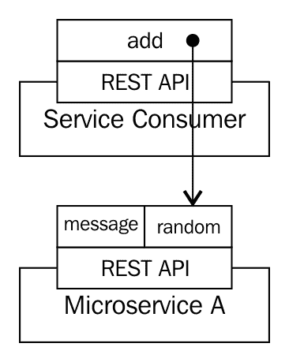

让我们快速设置这些微服务。

# 微服务 A

让我们使用 Spring Initializr ([`start.spring.io`](https://start.spring.io))来开始使用微服务 A。选择 GroupId、ArtifactId 和框架，如下面的截图所示：

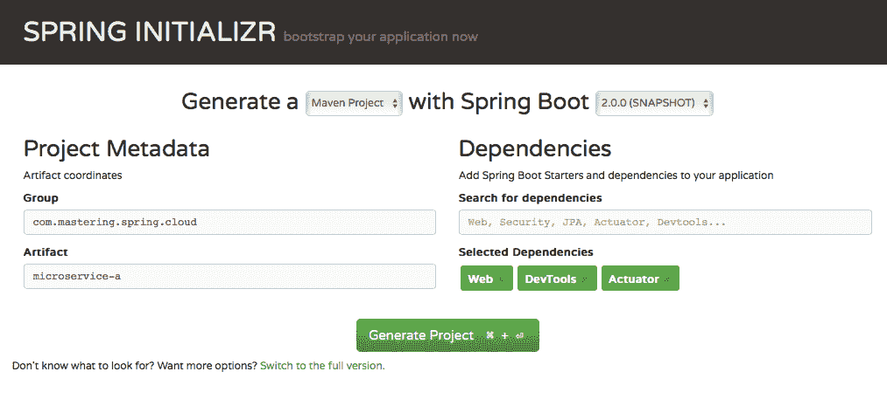

我们将创建一个服务来公开一组随机数：

```java
    @RestController
    public class RandomNumberController {
      private Log log =
        LogFactory.getLog(RandomNumberController.class);
      @RequestMapping("/random")
      public List<Integer> random() {
        List<Integer> numbers = new ArrayList<Integer>();
        for (int i = 1; i <= 5; i++) {
          numbers.add(generateRandomNumber());
        }
        log.warn("Returning " + numbers);
        return numbers;
      }
      private int generateRandomNumber() {
        return (int) (Math.random() * 1000);
      }
    }
```

需要注意的一些重要事项如下：

+   `@RequestMapping("/random") public List<Integer> random()`: 随机服务返回一个随机数列表

+   `private int generateRandomNumber() {`: 生成 0 到 1000 之间的随机数

以下片段显示了从`http://localhost:8080/random`服务的示例响应：

```java
    [666,257,306,204,992]
```

接下来，我们希望创建一个服务，从`application.properties`中的应用程序配置返回一个简单的消息。

让我们定义一个简单的应用程序配置，其中包含一个属性--`message`：

```java
    @Component
    @ConfigurationProperties("application")
    public class ApplicationConfiguration {
      private String message;
      public String getMessage() {
        return message;
      }
      public void setMessage(String message) {
        this.message = message;
      }
    }
```

以下是一些重要事项需要注意：

+   `@ConfigurationProperties("application")`: 定义了一个定义`application.properties`的类。

+   `private String message`: 定义了一个属性--`message`。该值可以在`application.properties`中使用`application.message`作为键进行配置。

让我们根据下面的片段配置`application.properties`：

```java
    spring.application.name=microservice-a
    application.message=Default Message
```

需要注意的一些重要事项如下：

+   `spring.application.name=microservice-a`: `spring.application.name`用于为应用程序命名

+   `application.message=Default Message`: 为`application.message`配置了默认消息

让我们创建一个控制器来读取消息并返回它，如下面的片段所示：

```java
    @RestController
    public class MessageController {
      @Autowired
      private ApplicationConfiguration configuration;
      @RequestMapping("/message")
      public Map<String, String> welcome() {
        Map<String, String> map = new HashMap<String, String>();
        map.put("message", configuration.getMessage());
        return map;
      }
    }
```

需要注意的重要事项如下：

+   `@Autowired private ApplicationConfiguration configuration`: 自动装配`ApplicationConfiguration`以启用读取配置消息值。

+   `@RequestMapping("/message") public Map<String, String> welcome()`: 在 URI/`message`上公开一个简单的服务。

+   `map.put("message", configuration.getMessage())`：服务返回一个具有一个条目的映射。它有一个键消息，值是从`ApplicationConfiguration`中获取的。

当在`http://localhost:8080/message`执行服务时，我们得到以下响应：

```java
    {"message":"Default Message"}
```

# 服务消费者

让我们设置另一个简单的微服务来消费微服务 A 公开的`random service`。让我们使用 Spring Initializr ([`start.spring.io`](https://start.spring.io))来初始化微服务，如下面的屏幕截图所示：

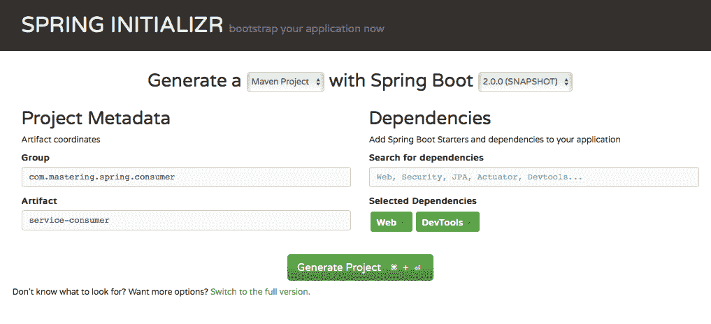

让我们添加消费`random service`的服务：

```java
    @RestController
    public class NumberAdderController {
      private Log log = LogFactory.getLog(
        NumberAdderController.class);
      @Value("${number.service.url}")
      private String numberServiceUrl;
      @RequestMapping("/add")
      public Long add() {
        long sum = 0;
        ResponseEntity<Integer[]> responseEntity =
          new RestTemplate()
          .getForEntity(numberServiceUrl, Integer[].class);
        Integer[] numbers = responseEntity.getBody();
        for (int number : numbers) {
          sum += number;
        }
        log.warn("Returning " + sum);
        return sum;
      }
    }
```

需要注意的重要事项如下：

+   `@Value("${number.service.url}") private String numberServiceUrl`：我们希望数字服务的 URL 在应用程序属性中可配置。

+   `@RequestMapping("/add") public Long add()`: 在 URI`/add`上公开一个服务。`add`方法使用`RestTemplate`调用数字服务，并具有对返回的数字求和的逻辑。

让我们配置`application.properties`，如下面的片段所示：

```java
    spring.application.name=service-consumer
    server.port=8100
    number.service.url=http://localhost:8080/random
```

需要注意的重要事项如下：

+   `spring.application.name=service-consumer`：为 Spring Boot 应用程序配置名称

+   `server.port=8100`：使用`8100`作为服务消费者的端口

+   `number.service.url=http://localhost:8080/random`：配置用于 add 服务的数字服务 URL

当在 URL`http://localhost:8100/add`调用服务时，将返回以下响应：

```java
    2890
```

以下是微服务 A 日志的摘录：

```java
    c.m.s.c.c.RandomNumberController : Returning [752,
      119, 493, 871, 445]
```

日志显示，来自微服务 A 的`random service`返回了`5`个数字。服务消费者中的`add`服务将它们相加并返回结果`2890`。

我们现在有我们的示例微服务准备好了。在接下来的步骤中，我们将为这些微服务添加云原生功能。

# 端口

在本章中，我们将创建六个不同的微服务应用程序和组件。为了保持简单，我们将为特定应用程序使用特定的端口。

以下表格显示了我们在本章中创建的不同应用程序所保留的端口：

| **微服务组件** | **使用的端口** |
| --- | --- |
| 微服务 A | `8080` 和 `8081` |
| 服务消费者微服务 | `8100` |
| 配置服务器（Spring Cloud Config） | `8888` |
| Eureka 服务器（名称服务器） | `8761` |
| Zuul API 网关服务器 | `8765` |
| Zipkin 分布式跟踪服务器 | `9411` |

我们的两个微服务已经准备好了。我们准备为我们的微服务启用云功能。

# 集中式微服务配置

Spring Cloud Config 提供了外部化微服务配置的解决方案。让我们首先了解外部化微服务配置的需求。

# 问题陈述

在微服务架构中，我们通常有许多小型微服务相互交互，而不是一组大型的单片应用程序。每个微服务通常部署在多个环境中--开发、测试、负载测试、暂存和生产。此外，不同环境中可能有多个微服务实例。例如，特定的微服务可能正在处理大量负载。在生产环境中可能有多个该微服务的实例。

应用程序的配置通常包括以下内容：

+   **数据库配置**：连接到数据库所需的详细信息

+   **消息代理配置**：连接到 AMQP 或类似资源所需的任何配置

+   **外部服务配置**：微服务需要的其他服务

+   **微服务配置**：与微服务的业务逻辑相关的典型配置

每个微服务实例都可以有自己的配置--不同的数据库，不同的外部服务等。例如，如果一个微服务在五个环境中部署，并且每个环境中有四个实例，则该微服务可以拥有总共 20 个不同的配置。

以下图显示了 Microservice A 所需的典型配置。我们正在查看开发中的两个实例，QA 中的三个实例，阶段中的一个实例以及生产中的四个实例：

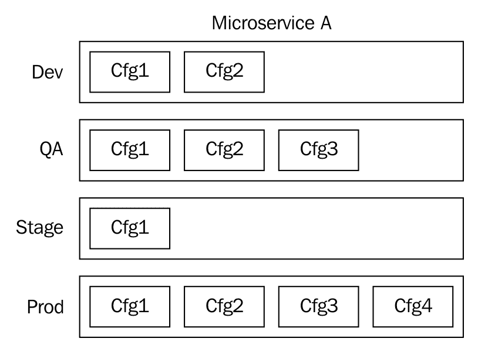

# 解决方案

为不同的微服务单独维护配置会使运维团队难以处理。如下图所示的解决方案是创建一个集中式**配置服务器**：

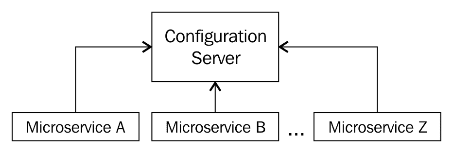

集中式**配置服务器**保存了所有不同微服务的配置。这有助于将配置与应用程序部署分开。

相同的可部署文件（EAR 或 WAR）可以在不同的环境中使用。但是，所有配置（在不同环境之间变化的内容）将存储在集中式配置服务器中。

需要做出的一个重要决定是决定是否为不同的环境有单独的集中配置服务器实例。通常，您希望对生产配置的访问比其他环境更受限制。至少，我们建议为生产环境使用单独的集中配置服务器。其他环境可以共享一个配置服务器实例。

# 选项

以下截图显示了 Spring Initializer 提供的 Cloud Config Servers 选项：

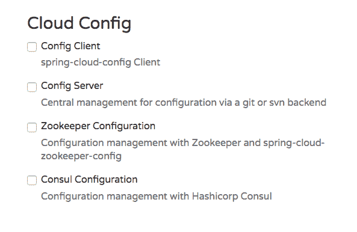

在本章中，我们将使用 Spring Cloud Config 配置 Cloud Config Server。

# Spring Cloud Config

Spring Cloud Config 提供了对集中式微服务配置的支持。它是两个重要组件的组合：

+   Spring Cloud Config Server：提供支持，通过版本控制仓库（GIT 或子版本）公开集中配置

+   Spring Cloud Config Client：提供应用连接到 Spring Cloud Config Server 的支持

以下图显示了使用 Spring Cloud Config 的典型微服务架构。多个微服务的配置存储在单个**GIT**仓库中：

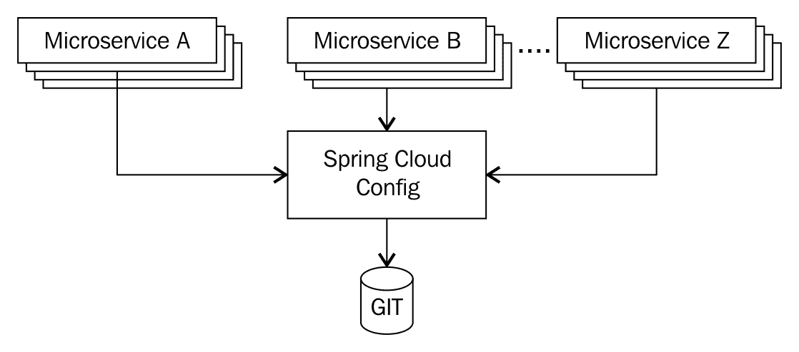

# 实现 Spring Cloud Config Server

以下图显示了使用 Spring Cloud Config 更新 Microservice A 和服务消费者的实现。在下图中，我们将 Microservice A 与 Spring Cloud Config 集成，以从本地 Git 仓库中检索其配置：

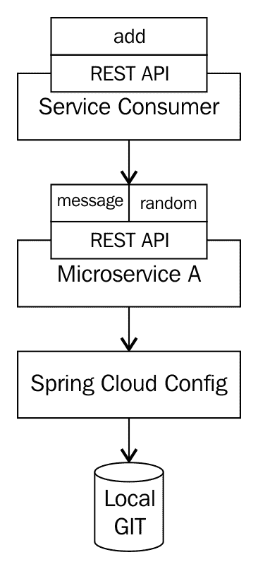

实现 Spring Cloud Config 需要以下内容：

1.  设置 Spring Cloud Config 服务器。

1.  设置本地 Git 仓库并将其连接到 Spring Cloud Config 服务器。

1.  更新 Microservice A 以使用来自 Cloud Config Server 的配置--使用 Spring Cloud Config Client。

# 设置 Spring Cloud Config Server

让我们使用 Spring Initializr（[`start.spring.io`](http://start.spring.io)）设置 Cloud Config Server。以下截图显示了要选择的 GroupId 和 ArtifactId。确保选择 Config Server 作为依赖项：

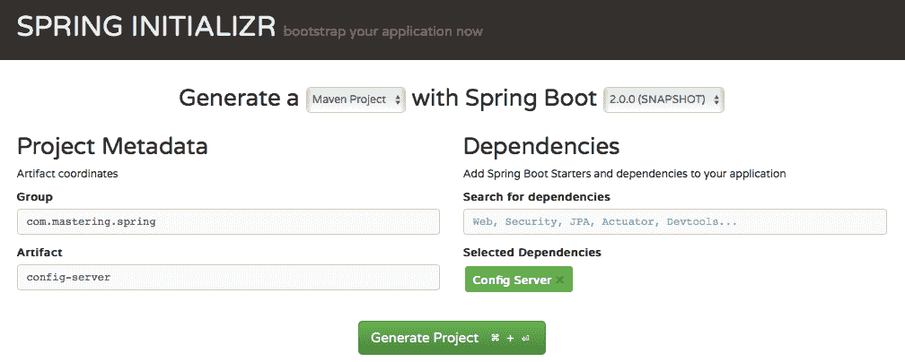

如果要将 Config Server 添加到现有应用程序中，请使用此处显示的依赖项：

```java
    <dependency>
      <groupId>org.springframework.cloud</groupId>
      <artifactId>spring-cloud-config-server</artifactId>
    </dependency>
```

项目创建后，第一步是添加`EnableConfigServer`注解。以下代码片段显示了将注解添加到`ConfigServerApplication`中：

```java
    @EnableConfigServer
    @SpringBootApplication
    public class ConfigServerApplication {
```

# 将 Spring Cloud Config Server 连接到本地 Git 仓库

配置服务器需要连接到一个 Git 存储库。为了保持简单，让我们连接到一个本地 Git 存储库。

您可以从[`git-scm.com`](https://git-scm.com)为您的特定操作系统安装 Git。

以下命令可帮助您设置一个简单的本地 Git 存储库。

安装 Git 后切换到您选择的目录。在终端或命令提示符上执行以下命令：

```java
mkdir git-localconfig-repo
cd git-localconfig-repo
git init
```

在`git-localconfig-repo`文件夹中创建一个名为`microservice-a.properties`的文件，内容如下：

```java
    management.security.enabled=false
    application.message=Message From Default Local Git Repository
```

执行以下命令将`microservice-a.properties`添加并提交到本地 Git 存储库：

```java
git add -A
git commit -m "default microservice a properties"
```

现在我们已经准备好了具有我们配置的本地 Git 存储库，我们需要将配置服务器连接到它。让我们按照这里所示配置`config-server`中的`application.properties`：

```java
    spring.application.name=config-server
    server.port=8888
    spring.cloud.config.server.git.uri=file:///in28Minutes
    /Books/MasteringSpring/git-localconfig-repo
```

一些重要的事项如下：

+   `server.port=8888`：配置配置服务器的端口。`8888`通常是配置服务器最常用的端口。

+   `spring.cloud.config.server.git.uri=file:///in28Minutes/Books/MasteringSpring/git-localconfig-repo`：配置到本地 Git 存储库的 URI。如果要连接到远程 Git 存储库，可以在这里配置 Git 存储库的 URI。

启动服务器。当您访问 URL`http://localhost:8888/microservice-a/default`时，您将看到以下响应：

```java
    {  
      "name":"microservice-a",
      "profiles":[  
        "default"
       ],
       "label":null,
       "version":null,
       "state":null,
       "propertySources":[  
        {  
          "name":"file:///in28Minutes/Books/MasteringSpring
          /git-localconfig-repo/microservice-a.properties",
          "source":{  
            "application.message":"Message From Default
             Local Git Repository"
          }
        }]
    }
```

一些重要的事项如下：

+   `http://localhost:8888/microservice-a/default`：URI 格式为`/{application-name}/{profile}[/{label}]`。这里，`application-name`是`microservice-a`，配置文件是`default`。

+   由于我们使用默认配置文件，该服务将从`microservice-a.properties`返回配置。您可以在`propertySources`>`name`字段的响应中看到它。

+   `"source":{"application.message":"Message From Default Local Git Repository"}`：响应的内容是属性文件的内容。

# 创建特定于环境的配置

让我们为`dev`环境为 Microservice A 创建一个特定的配置。

在`git-localconfig-repo`中创建一个名为`microservice-a-dev.properties`的新文件，内容如下：

```java
application.message=Message From Dev Git Repository
```

执行以下命令将`microservice-a-dev.properties`添加并提交到本地 Git 存储库：

```java
git add -A
git commit -m "default microservice a properties" 
```

当您访问 URL`http://localhost:8888/microservice-a/dev`时，您将看到以下响应：

```java
    {  
      "name":"microservice-a",
      "profiles":[  
        "dev"
      ],
      "label":null,
      "version":null,
      "state":null,
      "propertySources":[  
      {  
        "name":"file:///in28Minutes/Books/MasteringSpring
         /git-localconfig-repo/microservice-a-dev.properties",
        "source":{  
          "application.message":"Message From Dev Git Repository"
        }
      },
      {  
      "name":"file:///in28Minutes/Books/MasteringSpring
        /git-localconfig-repo/microservice-a.properties",
      "source":{  
        "application.message":"Message From Default
         Local Git Repository"
      }}]
    }
```

响应包含来自`microservice-a-dev.properties`的`dev`配置。还返回了默认属性文件（`microservice-a.properties`）中的配置。在`microservice-a-dev.properties`中配置的属性（特定于环境的属性）优先级高于在`microservice-a.properties`中配置的默认属性。

类似于`dev`，可以为不同的环境创建 Microservice A 的单独配置。如果在单个环境中需要多个实例，可以使用标签进行区分。可以使用格式为`http://localhost:8888/microservice-a/dev/{tag}`的 URL 来根据特定标签检索配置。

下一步是将 Microservice A 连接到配置服务器。

# Spring Cloud 配置客户端

我们将使用 Spring Cloud 配置客户端将`Microservice A`连接到`配置服务器`。依赖项如下所示。将以下代码添加到`Microservice A`的`pom.xml`文件中：

```java
    <dependency>
      <groupId>org.springframework.cloud</groupId>
      <artifactId>spring-cloud-starter-config</artifactId>
    </dependency>
```

Spring Cloud 的依赖项与 Spring Boot 的管理方式不同。我们将使用依赖项管理来管理依赖项。以下代码段将确保使用所有 Spring Cloud 依赖项的正确版本：

```java
    <dependencyManagement>
       <dependencies>
          <dependency>
             <groupId>org.springframework.cloud</groupId>
             <artifactId>spring-cloud-dependencies</artifactId>
             <version>Dalston.RC1</version>
             <type>pom</type>
             <scope>import</scope>
          </dependency>
       </dependencies>
    </dependencyManagement>
```

将`Microservice A`中的`application.properties`重命名为`bootstrap.properties`。

按照这里所示进行配置：

```java
    spring.application.name=microservice-a
    spring.cloud.config.uri=http://localhost:8888
```

由于我们希望`微服务 A`连接到`Config Server`，因此我们使用`spring.cloud.config.uri`提供`Config Server`的 URI。 Cloud Config Server 用于检索微服务 A 的配置。因此，配置在`bootstrap.properties`中提供。

**Spring Cloud Context**：Spring Cloud 为部署在云中的 Spring 应用程序引入了一些重要概念。引导应用程序上下文是一个重要概念。它是微服务应用程序的父上下文。它负责加载外部配置（例如，来自 Spring Cloud Config Server）和解密配置文件（外部和本地）。引导上下文使用 bootstrap.yml 或 bootstrap.properties 进行配置。我们之前必须将 application.properties 的名称更改为 Microservice A 中的 bootstrap.properties，因为我们希望 Microservice A 使用 Config Server 进行引导。

Microservice A 重新启动时日志中的提取如下所示：

```java
    Fetching config from server at: http://localhost:8888
    Located environment: name=microservice-a, profiles=[default],
    label=null, version=null, state=null
    Located property source: CompositePropertySource 
    [name='configService', propertySources=[MapPropertySource
    [name='file:///in28Minutes/Books/MasteringSpring/git-localconfig-
    repo/microservice-a.properties']]]
```

`微服务 A`服务正在使用来自`Spring Config Server`的配置，地址为`http://localhost:8888`。

当调用`http://localhost:8080/message`上的`消息服务`时，以下是响应：

```java
    {"message":"Message From Default Local Git Repository"}
```

消息是从`localconfig-repo/microservice-a.properties`文件中提取的。

您可以将活动配置设置为`dev`以获取 dev 配置：

```java
    spring.profiles.active=dev
```

服务消费者微服务的配置也可以存储在`local-config-repo`中，并使用 Spring Config Server 公开。

# Spring Cloud Bus

Spring Cloud Bus 使得将微服务连接到轻量级消息代理（如 Kafka 和 RabbitMQ）变得轻松。

# Spring Cloud Bus 的需求

考虑一个在微服务中进行配置更改的例子。假设在生产环境中有五个运行中的`微服务 A`实例。我们需要进行紧急配置更改。例如，让我们在`localconfig-repo/microservice-a.properties`中进行更改：

```java
    application.message=Message From Default Local 
      Git Repository Changed
```

为了使`微服务 A`获取此配置更改，我们需要在`http://localhost:8080/refresh`上调用`POST`请求。可以在命令提示符处执行以下命令以发送`POST`请求：

```java
curl -X POST http://localhost:8080/refresh
```

您将在`http://localhost:8080/message`看到配置更改的反映。以下是服务的响应：

```java
    {"message":"Message From Default Local Git Repository Changed"}
```

我们有五个运行中的 Microservice A 实例。配置更改仅对执行 URL 的 Microservice A 实例反映。其他四个实例在执行刷新请求之前将不会接收配置更改。

如果有多个微服务实例，则对每个实例执行刷新 URL 变得很麻烦，因为您需要对每个配置更改执行此操作。

# 使用 Spring Cloud Bus 传播配置更改

解决方案是使用 Spring Cloud Bus 通过消息代理（如 RabbitMQ）向多个实例传播配置更改。

以下图显示了不同实例的微服务（实际上，它们也可以是完全不同的微服务）如何使用 Spring Cloud Bus 连接到消息代理：

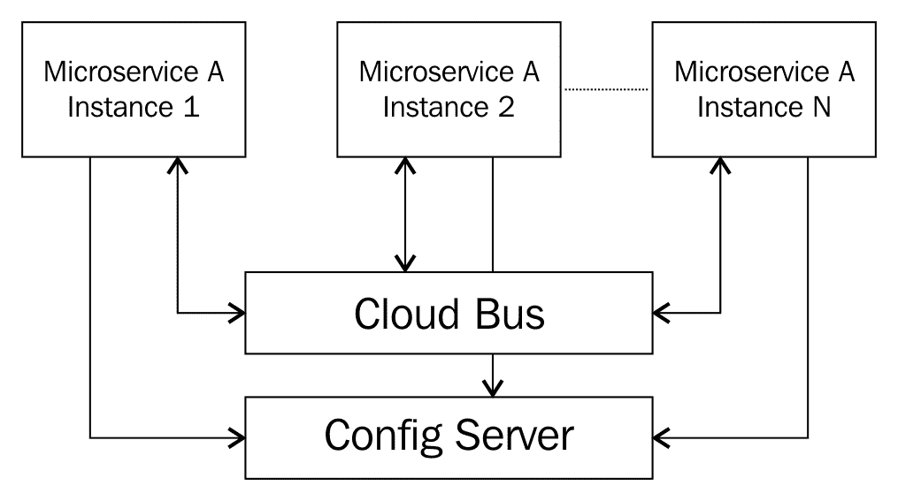

每个微服务实例将在应用程序启动时向 Spring Cloud Bus 注册。

当刷新调用一个微服务实例时，Spring Cloud Bus 将向所有微服务实例传播更改事件。微服务实例在接收更改事件时将从配置服务器请求更新的配置。

# 实施

我们将使用 RabbitMQ 作为消息代理。在继续之前，请确保已安装并启动了 RabbitMQ。

RabbitMQ 的安装说明请参见[`www.rabbitmq.com/download.html`](https://www.rabbitmq.com/download.html)。

下一步是为`Microservice A`添加与 Spring Cloud Bus 的连接。让我们在 Microservice A 的`pom.xml`文件中添加以下依赖项：

```java
    <dependency>
      <groupId>org.springframework.cloud</groupId>
      <artifactId>spring-cloud-starter-bus-amqp</artifactId>
    </dependency>
```

我们可以通过将端口作为启动 VM 参数之一来在不同端口上运行`Microservice A`。以下屏幕截图显示了如何在 Eclipse 中将服务器端口配置为 VM 参数。配置的值为`-Dserver.port=8081`：

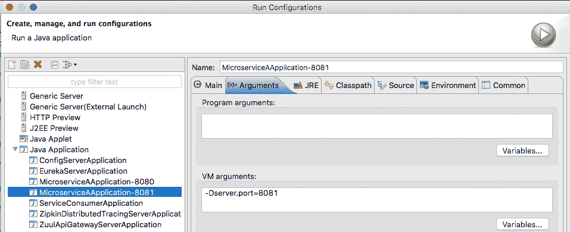

我们将在端口`8080`（默认）和`8081`上运行 Microservice A。以下是在重新启动 Microservice A 时日志的摘录：

```java
o.s.integration.channel.DirectChannel : Channel 'microservice-a.springCloudBusInput' has 1 subscriber(s).
Bean with name 'rabbitConnectionFactory' has been autodetected for JMX exposure
Bean with name 'refreshBusEndpoint' has been autodetected for JMX exposure
Created new connection: SimpleConnection@6d12ea7c [delegate=amqp://guest@127.0.0.1:5672/, localPort= 61741]
Channel 'microservice-a.springCloudBusOutput' has 1 subscriber(s).
 declaring queue for inbound: springCloudBus.anonymous.HK-dFv8oRwGrhD4BvuhkFQ, bound to: springCloudBus
Adding {message-handler:inbound.springCloudBus.default} as a subscriber to the 'bridge.springCloudBus' channel
```

所有`Microservice A`的实例都已在`Spring Cloud Bus`中注册，并监听 Cloud Bus 上的事件。RabbitMQ 连接的默认配置是自动配置的魔术结果。

现在让我们更新`microservice-a.properties`中的新消息：

```java
    application.message=Message From Default Local
      Git Repository Changed Again
```

提交文件并发送请求以刷新其中一个实例的配置，比如端口`8080`，使用 URL`http://localhost:8080/bus/refresh`：

```java
    curl -X POST http://localhost:8080/bus/refresh
```

以下是运行在端口`8081`上的第二个`Microservice A`实例的日志摘录：

```java
Refreshing org.springframework.context.annotation.AnnotationConfigApplicationContext@510cb933: startup date [Mon Mar 27 21:39:37 IST 2017]; root of context hierarchy
Fetching config from server at: http://localhost:8888
Started application in 1.333 seconds (JVM running for 762.806)
Received remote refresh request. Keys refreshed [application.message]
```

您可以看到，即使刷新 URL 未在端口`8081`上调用，更新的消息仍然从配置服务器中获取。这是因为 Microservice A 的所有实例都在 Spring Cloud Bus 上监听更改事件。一旦在其中一个实例上调用刷新 URL，它就会触发更改事件，所有其他实例都会获取更改后的配置。

您将看到配置更改反映在 Microservice A 的两个实例中，分别是`http://localhost:8080/message`和`http://localhost:8081/message`。以下是服务的响应：

```java
    {"message":"Message From Default Local 
      Git Repository Changed Again"}
```

# 声明式 REST 客户端 - Feign

Feign 帮助我们使用最少的配置和代码创建 REST 服务的 REST 客户端。您只需要定义一个简单的接口并使用适当的注释。

`RestTemplate`通常用于进行 REST 服务调用。Feign 帮助我们编写 REST 客户端，而无需`RestTemplate`和围绕它的逻辑。

Feign 与 Ribbon（客户端负载平衡）和 Eureka（名称服务器）很好地集成。我们将在本章后面看到这种集成。

要使用 Feign，让我们将 Feign starter 添加到服务消费者微服务的`pom.xml`文件中：

```java
    <dependency>
      <groupId>org.springframework.cloud</groupId>
      <artifactId>spring-cloud-starter-feign</artifactId>
    </dependency>
```

我们需要将 Spring Cloud 的`dependencyManagement`添加到`pom.xml`文件中，因为这是服务消费者微服务使用的第一个 Cloud 依赖项：

```java
    <dependencyManagement>
       <dependencies>
         <dependency>
           <groupId>org.springframework.cloud</groupId>
           <artifactId>spring-cloud-dependencies</artifactId>
           <version>Dalston.RC1</version>
           <type>pom</type>
           <scope>import</scope>
         </dependency>
       </dependencies>
    </dependencyManagement>
```

下一步是添加注释以启用对`ServiceConsumerApplication`中 Feign 客户端的扫描。以下代码片段显示了`@EnableFeignClients`注释的用法：

```java
    @EnableFeignClients("com.mastering.spring.consumer")
    public class ServiceConsumerApplication {
```

我们需要定义一个简单的接口来创建一个`random service`的 Feign 客户端。以下代码片段显示了详细信息：

```java
    @FeignClient(name ="microservice-a", url="localhost:8080")
    public interface RandomServiceProxy {
      @RequestMapping(value = "/random", method = RequestMethod.GET)
      public List<Integer> getRandomNumbers();
    }
```

需要注意的一些重要事项如下：

+   `@FeignClient(name ="microservice-a", url="localhost:8080")`: `FeignClient`注解用于声明需要创建具有给定接口的 REST 客户端。我们现在正在硬编码`Microservice A`的 URL。稍后，我们将看看如何将其连接到名称服务器并消除硬编码的需要。

+   `@RequestMapping(value = "/random", method = RequestMethod.GET)`: 此特定的 GET 服务方法在 URI`/random`上公开。

+   `public List<Integer> getRandomNumbers()`: 这定义了服务方法的接口。

让我们更新`NumberAdderController`以使用`RandomServiceProxy`来调用服务。以下代码片段显示了重要细节：

```java
    @RestController
    public class NumberAdderController {
      @Autowired
      private RandomServiceProxy randomServiceProxy;
      @RequestMapping("/add")
      public Long add() {
        long sum = 0;
        List<Integer> numbers = randomServiceProxy.getRandomNumbers();
        for (int number : numbers) {
          sum += number;
         }
          return sum;
        }
    }
```

需要注意的一些重要事项如下：

+   `@Autowired private RandomServiceProxy randomServiceProxy`: `RandomServiceProxy`被自动装配。

+   `List<Integer> numbers = randomServiceProxy.getRandomNumbers()`: 看看使用 Feign 客户端是多么简单。不再需要使用`RestTemplate`。

当我们在服务消费者微服务中调用`add`服务时，您将获得以下响应：

```java
    2103
```

可以通过配置来启用 Feign 请求的 GZIP 压缩，如下所示：

```java
    feign.compression.request.enabled=true
    feign.compression.response.enabled=true
```

# 负载均衡

微服务是云原生架构中最重要的构建模块。微服务实例根据特定微服务的负载进行扩展和缩减。我们如何确保负载在不同微服务实例之间均匀分布？这就是负载均衡的魔力所在。负载均衡对于确保负载在不同微服务实例之间均匀分布至关重要。

# Ribbon

如下图所示，Spring Cloud Netflix Ribbon 提供了客户端负载均衡，使用轮询执行在不同微服务实例之间。

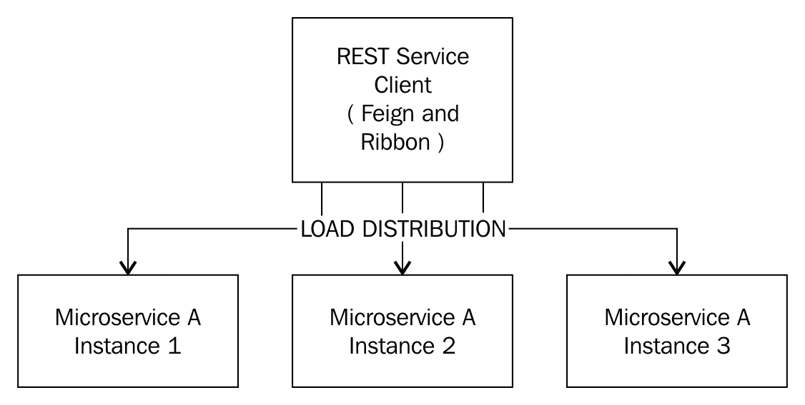

# 实施

我们将在服务消费者微服务中添加 Ribbon。服务消费者微服务将在两个`微服务 A`实例之间分发负载。

让我们从在服务消费者微服务的`pom.xml`文件中添加 Ribbon 依赖开始：

```java
    <dependency>
      <groupId>org.springframework.cloud</groupId>
      <artifactId>spring-cloud-starter-ribbon</artifactId>
    </dependency>
```

接下来，我们可以配置不同`微服务 A`实例的 URL。在服务消费者微服务的`application.properties`中添加以下配置：

```java
    random-proxy.ribbon.listOfServers= 
      http://localhost:8080,http://localhost:8081
```

然后我们将在服务代理`RandomServiceProxy`上指定`@RibbonClient`注解。`@RibbonClient`注解用于指定 ribbon 客户端的声明性配置：

```java
    @FeignClient(name ="microservice-a")
    @RibbonClient(name="microservice-a")
    public interface RandomServiceProxy {
```

当您重新启动服务消费者微服务并访问`http://localhost:8100/add`上的添加服务时，您将获得以下响应：

```java
    2705
```

这个请求由运行在端口`8080`上的`微服务 A`实例处理，日志中显示了一部分内容：

```java
    c.m.s.c.c.RandomNumberController : Returning [487,
      441, 407, 563, 807]
```

当我们再次在相同的 URL`http://localhost:8100/add`上访问添加服务时，我们会得到以下响应：

```java
    3423
```

然而，这次请求由运行在端口`8081`上的`微服务 A`实例处理。日志中显示了一部分内容：

```java
    c.m.s.c.c.RandomNumberController : Returning [661,
      520, 256, 988, 998]
```

我们现在已经成功地将负载分布在不同的`微服务 A`实例之间。虽然这还有待进一步改进，但这是一个很好的开始。

虽然轮询（`RoundRobinRule`）是 Ribbon 使用的默认算法，但还有其他选项可用：

+   `AvailabilityFilteringRule`将跳过宕机的服务器和具有大量并发连接的服务器。

+   `WeightedResponseTimeRule`将根据响应时间选择服务器。如果服务器响应时间长，它将获得更少的请求。

可以在应用程序配置中指定要使用的算法：

```java
    microservice-a.ribbon.NFLoadBalancerRuleClassName = 
      com.netflix.loadbalancer.WeightedResponseTimeRule
```

`microservice-a`是我们在`@RibbonClient(name="microservice-a")`注解中指定的服务名称。

以下图显示了我们已经设置的组件的架构：

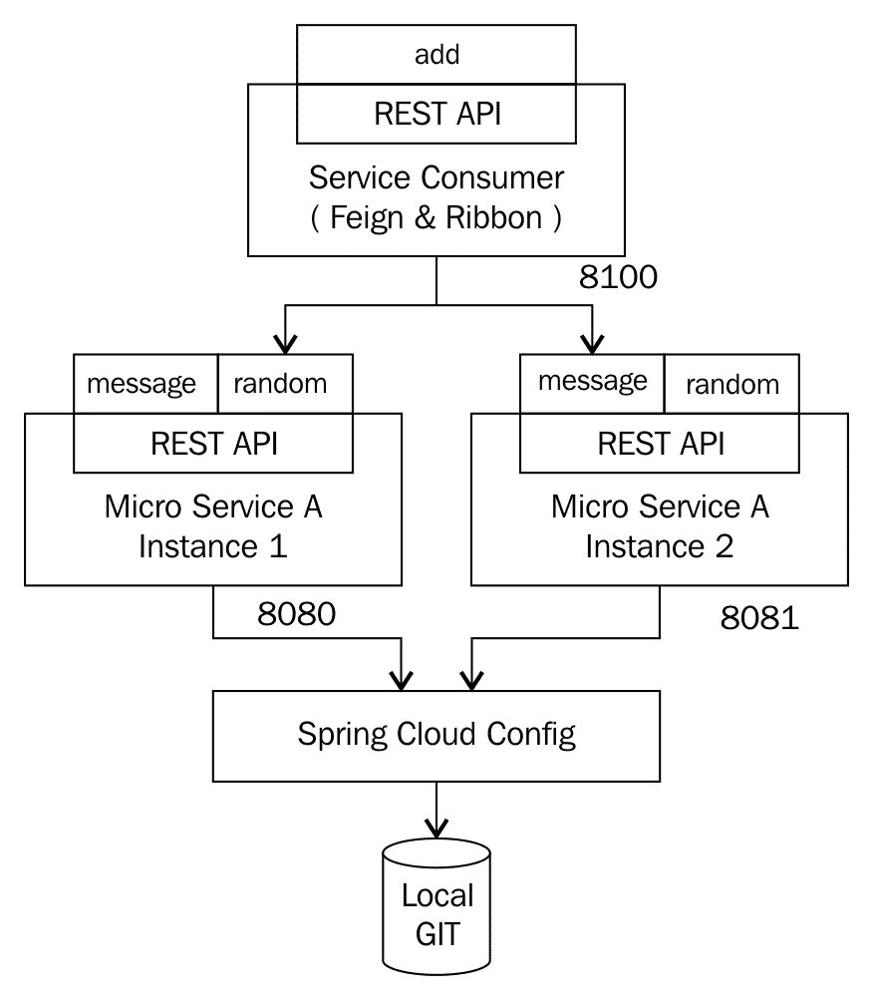

# 名称服务器

微服务架构涉及许多较小的微服务相互交互。除此之外，每个微服务可能有多个实例。手动维护外部服务连接和配置将会很困难，因为新的微服务实例是动态创建和销毁的。名称服务器提供了服务注册和服务发现的功能。名称服务器允许微服务注册自己，并发现它们想要与之交互的其他微服务的 URL。

# 硬编码微服务 URL 的限制

在前面的例子中，我们在服务消费者微服务的`application.properties`中添加了以下配置：

```java
    random-proxy.ribbon.listOfServers=
      http://localhost:8080,http://localhost:8081
```

这个配置代表了所有`微服务 A`的实例。看看这些情况：

+   创建了一个新的`微服务 A`实例

+   现有的`微服务 A`实例不再可用

+   `微服务 A`被移动到不同的服务器

在所有这些实例中，需要更新配置并刷新微服务以获取更改。

# 名称服务器的工作原理

名称服务器是前述情况的理想解决方案。以下图表显示了名称服务器的工作原理：

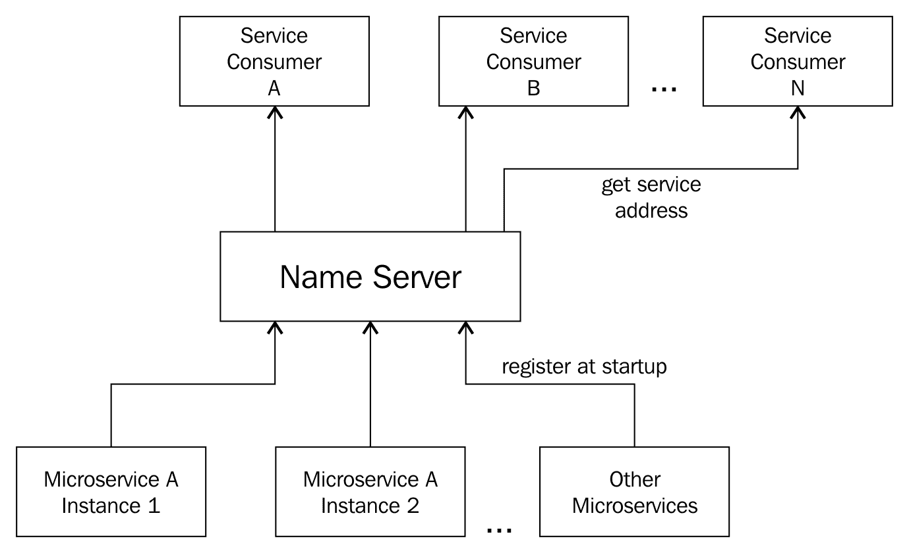

所有微服务（不同的微服务及其所有实例）将在每个微服务启动时注册到名称服务器。当服务消费者想要获取特定微服务的位置时，它会请求名称服务器。

为每个微服务分配一个唯一的微服务 ID。这将用作注册请求和查找请求中的键。

微服务可以自动注册和注销。每当服务消费者使用微服务 ID 查找名称服务器时，它将获得该特定微服务实例的列表。

# 选项

以下截图显示了 Spring Initializr（[`start.spring.io`](http://start.spring.io)）中用于服务发现的不同选项：

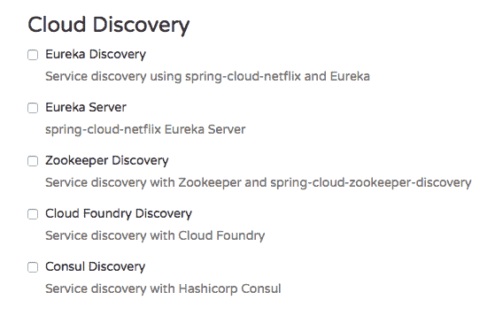

我们将在示例中使用 Eureka 作为服务发现的名称服务器。

# 实施

我们示例中 Eureka 的实现涉及以下内容：

1.  设置`Eureka Server`。

1.  更新“微服务 A”实例以注册到`Eureka Server`。

1.  更新服务消费者微服务以使用 Eureka Server 中注册的“微服务 A”实例。

# 设置 Eureka Server

我们将使用 Spring Initializr（[`start.spring.io`](http://start.spring.io)）为 Eureka Server 设置一个新项目。以下截图显示了要选择的 GroupId、ArtifactId 和 Dependencies：

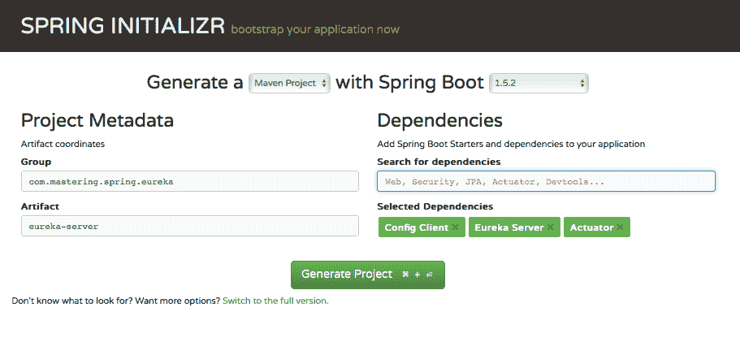

下一步是将`EnableEurekaServer`注解添加到`SpringBootApplication`类中。以下片段显示了详细信息：

```java
    @SpringBootApplication
    @EnableEurekaServer
    public class EurekaServerApplication {
```

以下片段显示了`application.properties`中的配置：

```java
    server.port = 8761
    eureka.client.registerWithEureka=false
    eureka.client.fetchRegistry=false
```

我们正在使用端口`8761`作为`Eureka Naming Server`。启动`EurekaServerApplication`。

Eureka 仪表板的截图在`http://localhost:8761`中显示如下：

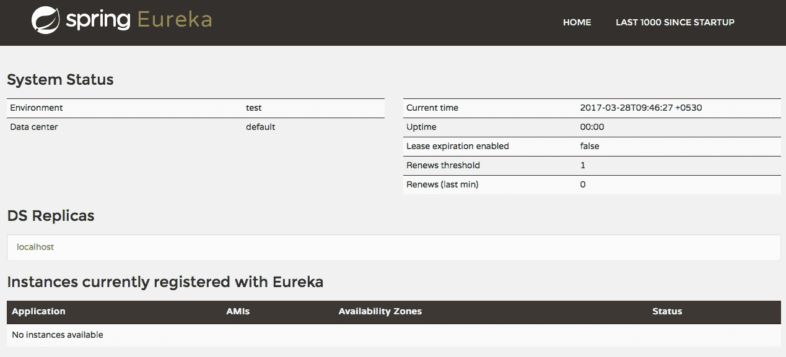

目前，没有应用程序注册到 Eureka。在下一步中，让我们注册“微服务 A”和其他服务到 Eureka。

# 使用 Eureka 注册微服务

要将任何微服务注册到 Eureka 名称服务器，我们需要在 Eureka Starter 项目中添加依赖项。需要将以下依赖项添加到“Microservice A”的`pom.xml`文件中：

```java
    <dependency>
      <groupId>org.springframework.cloud</groupId>
      <artifactId>spring-cloud-starter-eureka</artifactId>
    </dependency>
```

下一步是将`EnableDiscoveryClient`添加到`SpringBootApplication`类中。这里显示了`MicroserviceAApplication`的示例：

```java
    @SpringBootApplication
    @EnableDiscoveryClient
    public class MicroserviceAApplication {
```

Spring Cloud Commons 托管了在不同 Spring Cloud 实现中使用的公共类。一个很好的例子是`@EnableDiscoveryClient`注解。Spring Cloud Netflix Eureka、Spring Cloud Consul Discovery 和 Spring Cloud Zookeeper Discovery 提供了不同的实现。

我们将在应用程序配置中配置命名服务器的 URL。对于 Microservice A，应用程序配置在本地 Git 存储库文件`git-localconfig-repomicroservice-a.properties`中：

```java
    eureka.client.serviceUrl.defaultZone=
      http://localhost:8761/eureka
```

当两个“微服务 A”的实例都重新启动时，您将在`Eureka Server`的日志中看到以下消息：

```java
    Registered instance MICROSERVICE-A/192.168.1.5:microservice-a
      with status UP (replication=false)
    Registered instance MICROSERVICE-A/192.168.1.5:microservice-a:
      8081 with status UP (replication=false)
```

Eureka 仪表板的截图在`http://localhost:8761`中显示如下：

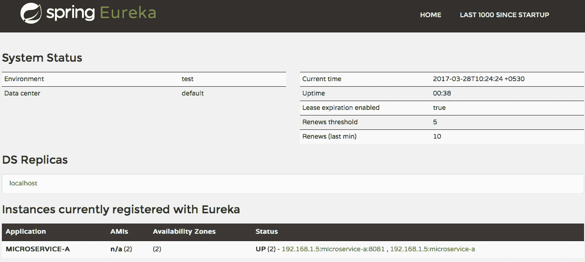

现在有两个“微服务 A”的实例已经注册到`Eureka Server`中。类似的更新也可以在`Config Server`上进行，以便将其连接到`Eureka Server`。

在下一步中，我们希望连接服务消费者微服务，以从 Eureka 服务器中获取“微服务 A”的实例的 URL。

# 将服务消费者微服务连接到 Eureka

需要将 Eureka starter 项目添加为服务消费者微服务的`pom.xml`文件中的依赖项：

```java
    <dependency>
      <groupId>org.springframework.cloud</groupId>
      <artifactId>spring-cloud-starter-eureka</artifactId>
    </dependency>
```

目前，“微服务 A”的不同实例的 URL 在服务消费者微服务中是硬编码的，如下所示，在`application.properties`中：

```java
    microservice-a.ribbon.listOfServers=
      http://localhost:8080,http://localhost:8081
```

然而，现在我们不想硬编码微服务 A 的 URL。我们希望服务消费者微服务从`Eureka Server`获取 URL。我们通过在服务消费者微服务的`application.properties`中配置`Eureka Server`的 URL 来实现这一点。我们将注释掉对微服务 A URL 的硬编码：

```java
    #microservice-a.ribbon.listOfServers=
      http://localhost:8080,http://localhost:8081
    eureka.client.serviceUrl.defaultZone=
      http://localhost:8761/eureka
```

接下来，我们将在`ServiceConsumerApplication`类上添加`EnableDiscoveryClient`，如下所示：

```java
    @SpringBootApplication
    @EnableFeignClients("com.mastering.spring.consumer")
    @EnableDiscoveryClient
    public class ServiceConsumerApplication {
```

一旦服务消费者微服务重新启动，您将看到它会在`Eureka Server`中注册自己。以下是从`Eureka Server`日志中提取的内容：

```java
    Registered instance SERVICE-CONSUMER/192.168.1.5:
      service-consumer:8100 with status UP (replication=false)
```

在`RandomServiceProxy`中，我们已经在 Feign 客户端上为`microservice-a`配置了一个名称，如下所示：

```java
    @FeignClient(name ="microservice-a")
    @RibbonClient(name="microservice-a")
    public interface RandomServiceProxy {
```

服务消费者微服务将使用此 ID（微服务 A）查询`Eureka Server`以获取实例。一旦从`Eureka Service`获取 URL，它将调用 Ribbon 选择的服务实例。

当在`http://localhost:8100/add`调用`add`服务时，它会返回适当的响应。

以下是涉及的不同步骤的快速回顾：

1.  每个微服务 A 实例启动时，都会向`Eureka Name Server`注册。

1.  服务消费者微服务请求`Eureka Name Server`获取微服务 A 的实例。

1.  服务消费者微服务使用 Ribbon 客户端负载均衡器来决定调用微服务 A 的特定实例。

1.  服务消费者微服务调用特定实例的微服务 A。

`Eureka Service`的最大优势是服务消费者微服务现在与微服务 A 解耦。每当新的微服务 A 实例启动或现有实例关闭时，服务消费者微服务无需重新配置。

# API 网关

微服务有许多横切关注点：

+   **认证、授权和安全**：我们如何确保微服务消费者是他们声称的人？我们如何确保消费者对微服务有正确的访问权限？

+   **速率限制**：消费者可能有不同类型的 API 计划，每个计划的限制（微服务调用次数）也可能不同。我们如何对特定消费者强制执行限制？

+   **动态路由**：特定情况（例如，一个微服务宕机）可能需要动态路由。

+   **服务聚合**：移动设备的 UI 需求与桌面设备不同。一些微服务架构具有针对特定设备定制的服务聚合器。

+   **容错性**：我们如何确保一个微服务的失败不会导致整个系统崩溃？

当微服务直接相互通信时，这些问题必须由各个微服务单独解决。这种架构可能难以维护，因为每个微服务可能以不同的方式处理这些问题。

最常见的解决方案之一是使用 API 网关。所有对微服务的服务调用都应该通过 API 网关进行。API 网关通常为微服务提供以下功能：

+   认证和安全

+   速率限制

+   洞察和监控

+   动态路由和静态响应处理

+   负载限制

+   聚合多个服务的响应

# 使用 Zuul 实现客户端负载平衡

Zuul 是 Spring Cloud Netflix 项目的一部分。它是一个 API 网关服务，提供动态路由、监控、过滤、安全等功能。

实现 Zuul 作为 API 网关涉及以下内容：

1.  设置新的 Zuul API 网关服务器。

1.  配置服务消费者以使用 Zuul API 网关。

# 设置新的 Zuul API 网关服务器

我们将使用 Spring Initializr（[`start.spring.io`](http://start.spring.io)）为 Zuul API 网关设置一个新项目。以下屏幕截图显示了要选择的 GroupId、ArtifactId 和 Dependencies：

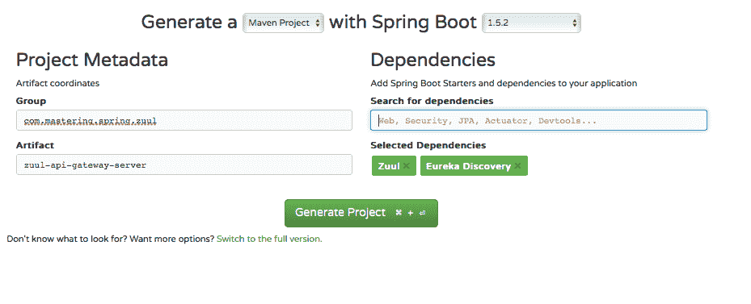

下一步是在 Spring Boot 应用程序上启用 Zuul 代理。这是通过在`ZuulApiGatewayServerApplication`类上添加`@EnableZuulProxy`注解来完成的。以下代码片段显示了详细信息：

```java
    @EnableZuulProxy
    @EnableDiscoveryClient
    @SpringBootApplication
    public class ZuulApiGatewayServerApplication {
```

我们将在端口`8765`上运行 Zuul 代理。以下代码片段显示了`application.properties`中所需的配置：

```java
    spring.application.name=zuul-api-gateway
    server.port=8765
    eureka.client.serviceUrl.defaultZone=http://localhost:8761/eureka
```

我们正在配置 Zuul 代理的端口，并将其连接到 Eureka Name 服务器。

# Zuul 自定义过滤器

Zuul 提供了创建自定义过滤器以实现典型 API 网关功能（如身份验证、安全性和跟踪）的选项。在本例中，我们将创建一个简单的日志记录过滤器来记录每个请求。以下代码片段显示了详细信息：

```java
    @Component
    public class SimpleLoggingFilter extends ZuulFilter {
      private static Logger log = 
        LoggerFactory.getLogger(SimpleLoggingFilter.class);
      @Override
      public String filterType() {
        return "pre";
      }
      @Override
      public int filterOrder() {
        return 1;
      }
      @Override
      public boolean shouldFilter() {
        return true;
      }
      @Override
      public Object run() {
        RequestContext context = RequestContext.getCurrentContext();
        HttpServletRequest httpRequest = context.getRequest();
        log.info(String.format("Request Method : %s n URL: %s", 
        httpRequest.getMethod(),
        httpRequest.getRequestURL().toString()));
        return null;
      }
    }
```

需要注意的一些重要事项如下：

+   `SimpleLoggingFilter extends ZuulFilter`: `ZuulFilter`是创建 Zuul 过滤器的基本抽象类。任何过滤器都应实现此处列出的四种方法。

+   `public String filterType()`: 可能的返回值是`"pre"`表示预路由过滤，`"route"`表示路由到原始位置，`"post"`表示后路由过滤，`"error"`表示错误处理。在本例中，我们希望在执行请求之前进行过滤。我们返回值`"pre"`。

+   `public int filterOrder()`: 定义过滤器的优先级。

+   `public boolean shouldFilter()`: 如果过滤器只应在某些条件下执行，可以在此处实现逻辑。如果要求过滤器始终执行，则返回`true`。

+   `public Object run()`: 实现过滤器逻辑的方法。在我们的示例中，我们正在记录请求方法和请求的 URL。

当我们通过启动`ZuulApiGatewayServerApplication`作为 Java 应用程序来启动 Zuul 服务器时，您将在`Eureka Name Server`中看到以下日志：

```java
    Registered instance ZUUL-API-GATEWAY/192.168.1.5:zuul-api-
      gateway:8765 with status UP (replication=false)
```

这表明`Zuul API 网关`正在运行。`Zuul API 网关`也已注册到`Eureka Server`。这允许微服务消费者与名称服务器通信，以获取有关`Zuul API 网关`的详细信息。

以下图显示了`http://localhost:8761`上的 Eureka 仪表板。您可以看到`Microservice A`、`service consumer`和`Zuul API Gateway`的实例现在已注册到`Eureka Server`：

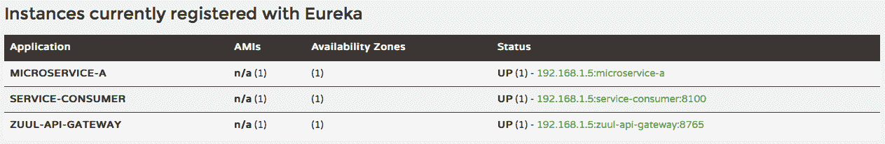

以下是从`Zuul API 网关`日志中提取的内容：

```java
    Mapped URL path [/microservice-a/**] onto handler of type [
    class org.springframework.cloud.netflix.zuul.web.ZuulController]
    Mapped URL path [/service-consumer/**] onto handler of type [
    class org.springframework.cloud.netflix.zuul.web.ZuulController]
```

默认情况下，Zuul 会为 Microservice A 中的所有服务和服务消费者微服务启用反向代理。

# 通过 Zuul 调用微服务

现在让我们通过服务代理调用`random service`。随机微服务的直接 URL 是`http://localhost:8080/random`。这是由应用程序名称为`microservice-a`的 Microservice A 公开的。

通过`Zuul API Gateway`调用服务的 URL 结构是`http://localhost:{port}/{microservice-application-name}/{service-uri}`。因此，`random service`的`Zuul API Gateway` URL 是`http://localhost:8765/microservice-a/random`。当您通过 API Gateway 调用`random service`时，您会得到下面显示的响应。响应类似于直接调用 random service 时通常会得到的响应：

```java
    [73,671,339,354,211]
```

以下是从`Zuul Api Gateway`日志中提取的内容。您可以看到我们在`Zuul API Gateway`中创建的`SimpleLoggingFilter`已被执行：

```java
    c.m.s.z.filters.pre.SimpleLoggingFilter : Request Method : GET
    URL: http://localhost:8765/microservice-a/random
```

`add`服务由服务消费者公开，其应用程序名称为 service-consumer，服务 URI 为`/add`。因此，通过 API Gateway 执行`add`服务的 URL 是`http://localhost:8765/service-consumer/add`。来自服务的响应如下所示。响应类似于直接调用`add`服务时通常会得到的响应：

```java
    2488
```

以下是从`Zuul API Gateway`日志中提取的内容。您可以看到初始的`add`服务调用是通过 API 网关进行的：

```java
    2017-03-28 14:05:17.514 INFO 83147 --- [nio-8765-exec-1] 
    c.m.s.z.filters.pre.SimpleLoggingFilter : Request Method : GET
    URL: http://localhost:8765/service-consumer/add
```

`add`服务调用`Microservice A`上的`random service`。虽然对 add 服务的初始调用通过 API 网关进行，但从 add 服务（服务消费者微服务）到`random service`（Microservice A）的调用并未通过 API 网关路由。在理想情况下，我们希望所有通信都通过 API 网关进行。

在下一步中，让我们也让服务消费者微服务的请求通过 API 网关进行。

# 配置服务消费者以使用 Zuul API 网关

以下代码显示了`RandomServiceProxy`的现有配置，用于调用`Microservice A`上的`random service`。`@FeignClient`注解中的 name 属性配置为使用 Microservice A 的应用名称。请求映射使用了`/random` URI：

```java
    @FeignClient(name ="microservice-a")
    @RibbonClient(name="microservice-a")
    public interface RandomServiceProxy {
    @RequestMapping(value = "/random", method = RequestMethod.GET)
      public List<Integer> getRandomNumbers();
    }
```

现在，我们希望调用通过 API 网关进行。我们需要使用 API 网关的应用名称和`random service`的新 URI 在请求映射中。以下片段显示了更新的`RandomServiceProxy`类：

```java
    @FeignClient(name="zuul-api-gateway")
    //@FeignClient(name ="microservice-a")
    @RibbonClient(name="microservice-a")
    public interface RandomServiceProxy {
      @RequestMapping(value = "/microservice-a/random", 
      method = RequestMethod.GET)
      //@RequestMapping(value = "/random", method = RequestMethod.GET)
      public List<Integer> getRandomNumbers();
    }
```

当我们在`http://localhost:8765/service-consumer/add`调用 add 服务时，我们将看到典型的响应：

```java
    2254
```

然而，现在我们将在`Zuul API 网关`上看到更多的事情发生。以下是从`Zuul API 网关`日志中提取的内容。您可以看到服务消费者上的初始 add 服务调用，以及对 Microservice A 上的`random service`的调用，现在都通过 API 网关进行路由：

```java
2017-03-28 14:10:16.093 INFO 83147 --- [nio-8765-exec-4] c.m.s.z.filters.pre.SimpleLoggingFilter : Request Method : GET
URL: http://localhost:8765/service-consumer/add
2017-03-28 14:10:16.685 INFO 83147 --- [nio-8765-exec-5] c.m.s.z.filters.pre.SimpleLoggingFilter : Request Method : GET
URL: http://192.168.1.5:8765/microservice-a/random
```

我们看到了在`Zuul API Gateway`上实现简单日志过滤器的基本实现。类似的方法可以用于实现其他横切关注点的过滤器。

# 分布式跟踪

在典型的微服务架构中，涉及许多组件。以下是其中一些：

+   不同的微服务

+   API 网关

+   命名服务器

+   配置服务器

典型的调用可能涉及四五个以上的组件。这些是需要问的重要问题：

+   我们如何调试问题？

+   我们如何找出特定问题的根本原因？

典型的解决方案是具有仪表板的集中式日志记录。将所有微服务日志汇总到一个地方，并在其上提供仪表板。

# 分布式跟踪选项

以下截图显示了 Spring Initializr 网站上分布式跟踪的选项：

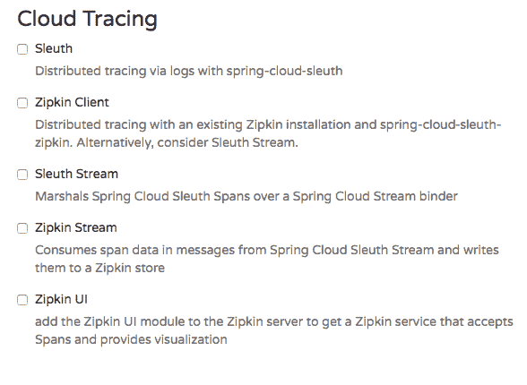

在这个例子中，我们将使用 Spring Cloud Sleuth 和 Zipkin Server 的组合来实现分布式跟踪。

# 实现 Spring Cloud Sleuth 和 Zipkin

**Spring Cloud Sleuth**提供了在不同微服务组件之间唯一跟踪服务调用的功能。**Zipkin**是一个分布式跟踪系统，用于收集微服务中需要用于排除延迟问题的数据。我们将实现 Spring Cloud Sleuth 和 Zipkin 的组合来实现分布式跟踪。

涉及的步骤如下：

1.  将 Microservice A、API 网关和服务消费者与 Spring Cloud Sleuth 集成。

1.  设置 Zipkin 分布式跟踪服务器。

1.  将 Microservice A、API 网关和服务消费者与 Zipkin 集成。

# 将微服务组件与 Spring Cloud Sleuth 集成

当我们在服务消费者上调用 add 服务时，它将通过 API 网关调用 Microservice A。为了能够跟踪服务调用跨不同组件，我们需要为请求流程分配一个唯一的东西。

Spring Cloud Sleuth 提供了跟踪服务调用跨不同组件的选项，使用了一个称为**span**的概念。每个 span 都有一个唯一的 64 位 ID。唯一 ID 可用于跟踪调用跨组件的情况。

以下片段显示了`spring-cloud-starter-sleuth`的依赖项：

```java
    <dependency>
      <groupId>org.springframework.cloud</groupId>
      <artifactId>spring-cloud-starter-sleuth</artifactId>
    </dependency>
```

我们需要在以下列出的三个项目中添加 Spring Cloud Sleuth 的前置依赖：

+   Microservice A

+   服务消费者

+   Zuul API 网关服务器

我们将从跟踪所有微服务之间的服务请求开始。为了能够跟踪所有请求，我们需要配置一个`AlwaysSampler` bean，如下面的代码片段所示：

```java
    @Bean
    public AlwaysSampler defaultSampler() {
      return new AlwaysSampler();
    }
```

`AlwaysSampler` bean 需要在以下微服务应用程序类中进行配置：

+   `MicroserviceAApplication`

+   `ServiceConsumerApplication`

+   `ZuulApiGatewayServerApplication`

当我们在`http://localhost:8765/service-consumer/add`调用`add`服务时，我们将看到典型的响应：

```java
    1748
```

然而，您将开始在日志条目中看到更多细节。这里显示了来自服务消费者微服务日志的简单条目：

```java
2017-03-28 20:53:45.582 INFO [service-consumer,d8866b38c3a4d69c,d8866b38c3a4d69c,true] 89416 --- [l-api-gateway-5] c.netflix.loadbalancer.BaseLoadBalancer : Client:zuul-api-gateway instantiated a LoadBalancer:DynamicServerListLoadBalancer:{NFLoadBalancer:name=zuul-api-gateway,current list of Servers=[],Load balancer stats=Zone stats: {},Server stats: []}ServerList:null
```

`[service-consumer,d8866b38c3a4d69c,d8866b38c3a4d69c,true]`：第一个值`service-consumer`是应用程序名称。关键部分是第二个值--`d8866b38c3a4d69c`。这是可以用来跟踪此请求在其他微服务组件中的值。

以下是`service consumer`日志中的一些其他条目：

```java
2017-03-28 20:53:45.593 INFO [service-consumer,d8866b38c3a4d69c,d8866b38c3a4d69c,true] 89416 --- [l-api-gateway-5] c.n.l.DynamicServerListLoadBalancer : Using serverListUpdater PollingServerListUpdater
 2017-03-28 20:53:45.597 INFO [service-consumer,d8866b38c3a4d69c,d8866b38c3a4d69c,true] 89416 --- [l-api-gateway-5] c.netflix.config.ChainedDynamicProperty : Flipping property: zuul-api-gateway.ribbon.ActiveConnectionsLimit to use NEXT property: niws.loadbalancer.availabilityFilteringRule.activeConnectionsLimit = 2147483647
2017-03-28 20:53:45.599 INFO [service-consumer,d8866b38c3a4d69c,d8866b38c3a4d69c,true] 89416 --- [l-api-gateway-5] c.n.l.DynamicServerListLoadBalancer : DynamicServerListLoadBalancer for client zuul-api-gateway initialized: DynamicServerListLoadBalancer:{NFLoadBalancer:name=zuul-api-gateway,current list of Servers=[192.168.1.5:8765],Load balancer stats=Zone stats: {defaultzone=[Zone:defaultzone; Instance count:1; Active connections count: 0; Circuit breaker tripped count: 0; Active connections per server: 0.0;]
 [service-consumer,d8866b38c3a4d69c,d8866b38c3a4d69c,true] 89416 --- [nio-8100-exec-1] c.m.s.c.service.NumberAdderController : Returning 1748
```

以下是`Microservice A`日志的摘录：

```java
[microservice-a,d8866b38c3a4d69c,89d03889ebb02bee,true] 89404 --- [nio-8080-exec-8] c.m.s.c.c.RandomNumberController : Returning [425, 55, 51, 751, 466]
```

以下是`Zuul API Gateway`日志的摘录：

```java
[zuul-api-gateway,d8866b38c3a4d69c,89d03889ebb02bee,true] 89397 --- [nio-8765-exec-8] c.m.s.z.filters.pre.SimpleLoggingFilter : Request Method : GET
URL: http://192.168.1.5:8765/microservice-a/random
```

正如您在前面的日志摘录中所看到的，我们可以使用日志中的第二个值--称为 span ID--来跟踪跨微服务组件的服务调用。在本例中，span ID 是`d8866b38c3a4d69c`。

然而，这需要搜索所有微服务组件的日志。一种选择是使用类似**ELK**（**Elasticsearch**，**Logstash**和**Kibana**）堆栈实现集中式日志。我们将采用更简单的选择，在下一步中创建一个 Zipkin 分布式跟踪服务。

# 设置 Zipkin 分布式跟踪服务器

我们将使用 Spring Initializr ([`start.spring.io`](http://start.spring.io))来设置一个新项目。以下截图显示了要选择的 GroupId、ArtifactId 和 Dependencies：

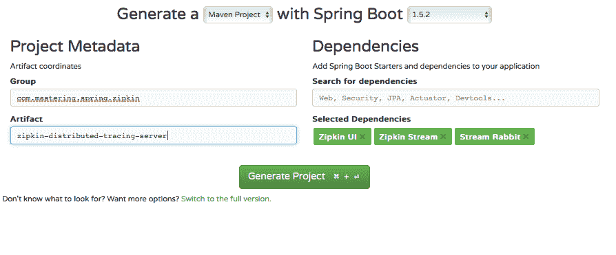

依赖项包括以下内容：

+   **Zipkin Stream**：存在多种选项来配置 Zipkin 服务器。在本例中，我们将通过创建一个独立的服务监听事件并将信息存储在内存中来保持简单。

+   **Zipkin UI**：提供带有搜索功能的仪表板。

+   **Stream Rabbit**：用于将 Zipkin 流与 RabbitMQ 服务绑定。

在生产环境中，您可能希望拥有更健壮的基础设施。一种选择是将永久数据存储连接到 Zipkin Stream 服务器。

接下来，我们将在`ZipkinDistributedTracingServerApplication`类中添加`@EnableZipkinServer`注解，以启用 Zipkin 服务器的自动配置。以下代码片段显示了详细信息：

```java
    @EnableZipkinServer
    @SpringBootApplication
    public class ZipkinDistributedTracingServerApplication {
```

我们将使用端口`9411`来运行跟踪服务器。以下代码片段显示了需要添加到`application.properties`文件中的配置：

```java
    spring.application.name=zipkin-distributed-tracing-server
    server.port=9411
```

您可以在`http://localhost:9411/`上启动 Zipkin UI 仪表板。以下是该仪表板的截图。由于没有任何微服务连接到 Zipkin，因此没有显示任何数据：

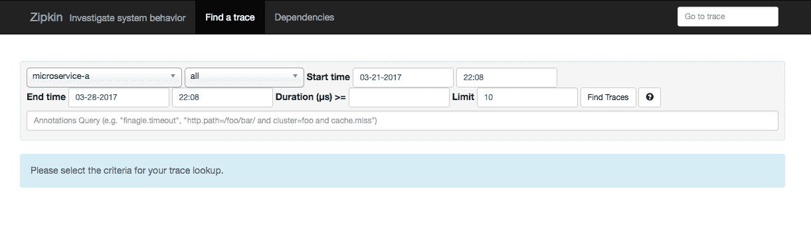

# 将微服务组件与 Zipkin 集成

我们将需要连接我们想要跟踪的所有微服务组件与`Zipkin 服务器`。以下是我们将开始的组件列表：

+   Microservice A

+   服务消费者

+   Zuul API 网关服务器

我们只需要在前述项目的`pom.xml`文件中添加对`spring-cloud-sleuth-zipkin`和`spring-cloud-starter-bus-amqp`的依赖：

```java
    <dependency>
      <groupId>org.springframework.cloud</groupId>
      <artifactId>spring-cloud-sleuth-zipkin</artifactId>
    </dependency>
    <dependency>
      <groupId>org.springframework.cloud</groupId>
      <artifactId>spring-cloud-starter-bus-amqp</artifactId>
    </dependency>
```

继续执行`http://localhost:8100/add`上的`add`服务。现在您可以在 Zipkin 仪表板上看到详细信息。以下截图显示了一些详细信息：

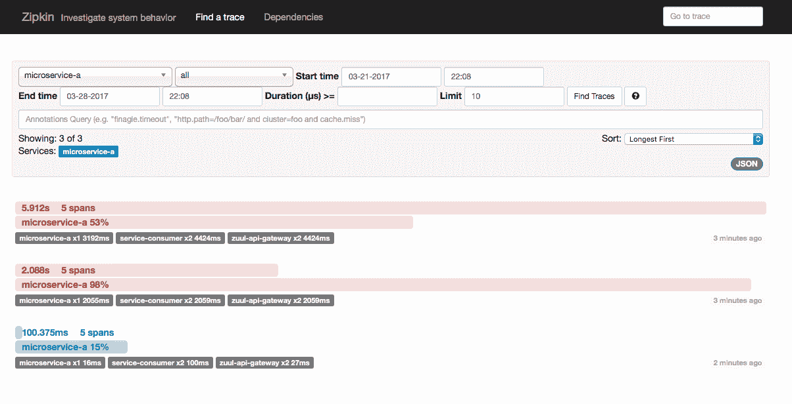

前两行显示了失败的请求。第三行显示了成功请求的详细信息。我们可以通过点击成功的行来进一步挖掘。以下截图显示了显示的详细信息：

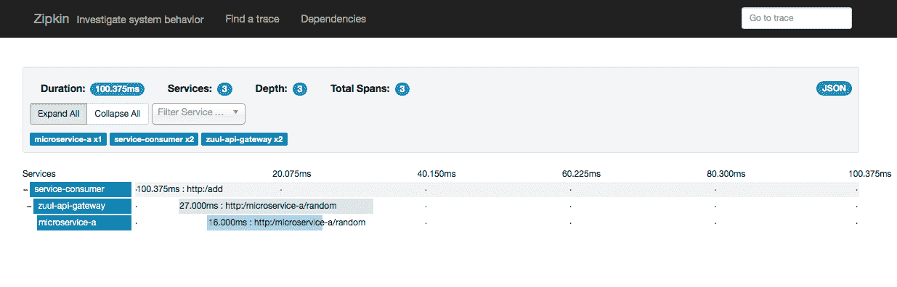

在每个服务上都有一个花费的时间。您可以通过点击服务栏进一步了解。以下截图显示了显示的详细信息：

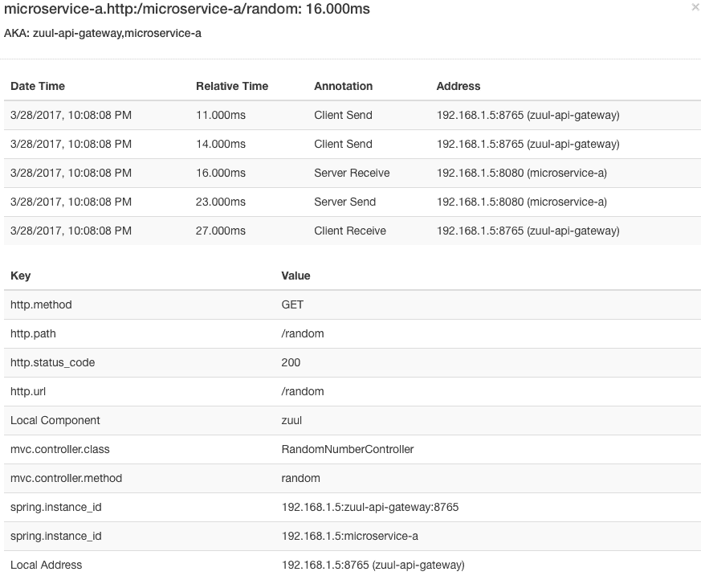

在本节中，我们为我们的微服务添加了分布式跟踪。现在我们将能够直观地跟踪我们的微服务中发生的一切。这将使得追踪和调试问题变得容易。

# Hystrix - 容错

微服务架构是由许多微服务组件构建的。如果一个微服务出现故障会怎么样？所有依赖的微服务都会失败并使整个系统崩溃吗？还是错误会被优雅地处理，并为用户提供降级的最小功能？这些问题决定了微服务架构的成功。

微服务架构应该是有弹性的，并且能够优雅地处理服务错误。Hystrix 为微服务提供了容错能力。

# 实施

我们将在服务消费者微服务中添加 Hystrix，并增强 add 服务，即使 Microservice A 宕机也能返回基本响应。

我们将从向服务消费者微服务的`pom.xml`文件中添加 Hystrix Starter 开始。以下代码片段显示了依赖项的详细信息：

```java
    <dependency>
      <groupId>org.springframework.cloud</groupId>
      <artifactId>spring-cloud-starter-hystrix</artifactId>
    </dependency>
```

接下来，我们将通过向`ServiceConsumerApplication`类添加`@EnableHystrix`注解来启用 Hystrix 自动配置。以下代码片段显示了详细信息：

```java
    @SpringBootApplication
    @EnableFeignClients("com.mastering.spring.consumer")
    @EnableHystrix
    @EnableDiscoveryClient
    public class ServiceConsumerApplication {
```

`NumberAdderController`公开了一个请求映射为`/add`的服务。这使用`RandomServiceProxy`来获取随机数。如果这个服务失败了怎么办？Hystrix 提供了一个回退。以下代码片段显示了如何向请求映射添加一个回退方法。我们只需要向`@HystrixCommand`注解添加`fallbackMethod`属性，定义回退方法的名称--在这个例子中是`getDefaultResponse`：

```java
    @HystrixCommand(fallbackMethod = "getDefaultResponse")
    @RequestMapping("/add")
    public Long add() {
      //Logic of add() method 
    }
```

接下来，我们定义了`getDefaultResponse()`方法，其返回类型与`add()`方法相同。它返回一个默认的硬编码值：

```java
    public Long getDefaultResponse() {
      return 10000L;
     }
```

让我们关闭微服务 A 并调用`http://localhost:8100/add`。您将得到以下响应：

```java
    10000
```

当`Microservice A`失败时，服务消费者微服务会优雅地处理它并提供降级功能。

# 摘要

Spring Cloud 使得向微服务添加云原生功能变得容易。在本章中，我们看了一些开发云原生应用程序中的重要模式，并使用各种 Spring Cloud 项目来实现它们。

重要的是要记住，开发云原生应用程序的领域仍处于起步阶段--在最初的几年。它需要更多的时间来成熟。预计未来几年模式和框架会有一些演变。

在下一章中，我们将把注意力转向 Spring Data Flow。云上的典型用例包括实时数据分析和数据管道。这些用例涉及多个微服务之间的数据流动。Spring Data Flow 提供了分布式流和数据管道的模式和最佳实践。
