# 第十章：Spring Cloud Data Flow

Spring Data Flow 将微服务架构引入了典型的数据流和事件流场景。我们将在本章后面更多地讨论这些场景。基于其他 Spring 项目，如 Spring Cloud Stream、Spring Integration 和 Spring Boot，Spring Data Flow 使得使用基于消息的集成定义和扩展数据和事件流的用例变得容易。

在本章中，我们将讨论以下主题：

+   我们为什么需要异步通信？

+   什么是 Spring Cloud Stream？它如何构建在 Spring Integration 之上？

+   我们为什么需要 Spring Data Flow？

+   Spring Data Flow 中的重要概念是什么？

+   Spring Data Flow 有哪些有用的用例？

我们还将实现一个简单的事件流场景，其中有三个微服务充当源（生成事件的应用程序）、处理器和汇（消费事件的应用程序）。我们将使用 Spring Cloud Stream 实现这些微服务，并使用 Spring Cloud Data Flow 在消息代理上建立它们之间的连接。

# 基于消息的异步通信

在集成应用程序时有两个选项：

+   **同步**：服务消费者调用服务提供者并等待响应。

+   **异步**：服务消费者通过将消息放在消息代理上调用服务提供者，但不等待响应。

我们在*第五章，使用 Spring Boot 构建微服务*中构建的服务（`random`服务，`add`服务）是同步集成的示例。这些是典型的通过 HTTP 公开的 Web 服务。服务消费者调用服务并等待响应。下一次调用只有在前一个服务调用完成后才会进行。

这种方法的一个重要缺点是期望服务提供者始终可用。如果服务提供者宕机，或者由于某种原因服务执行失败，服务消费者将需要重新执行服务。

另一种方法是使用基于消息的异步通信。服务消费者将消息放在消息代理上。服务提供者在消息代理上监听，一旦有消息可用，就会处理它。

一个优点是，即使服务提供者暂时宕机，它可以在恢复时处理消息代理上的消息。服务提供者不需要一直可用。虽然可能会有延迟，但数据最终会保持一致。

以下图显示了基于异步消息的通信的示例：

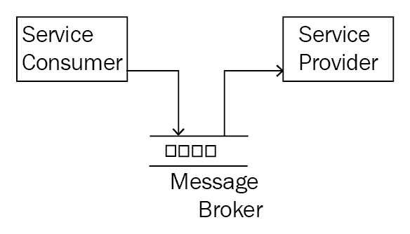

异步通信改善可靠性的两种情况：

+   如果服务提供者宕机，那么消息将在消息代理中排队。当服务提供者恢复时，它将处理这些消息。因此，即使服务提供者宕机，消息也不会丢失。

+   如果消息处理出现错误，服务提供者将把消息放入错误通道。当错误被分析和修复后，消息可以从错误通道移动到输入通道，并排队等待重新处理。

重要的一点是，在前面的两种情况中，服务消费者不需要担心服务提供者是否宕机或消息处理失败。服务消费者发送消息后就可以忘记它了。消息架构确保消息最终会成功处理。

基于消息的异步通信通常用于事件流和数据流：

+   **事件流**：这涉及基于事件的处理逻辑。例如，新客户事件、股价变动事件或货币变动事件。下游应用程序将在消息代理上监听事件并对其做出反应。

+   **数据流**：这涉及通过多个应用程序增强的数据，并最终存储到数据存储中。

在功能上，数据流架构之间交换的消息内容与事件流架构不同。但从技术上讲，它只是从一个系统发送到另一个系统的另一条消息。在本章中，我们不会区分事件和数据流。Spring Cloud 数据流可以处理所有这些流--尽管只有数据流在名称中。我们可以互换使用事件流、数据流或消息流来指示不同应用程序之间的消息流。

# 异步通信的复杂性

虽然前面的示例是两个应用程序之间的简单通信，但在现实世界的应用程序中，典型的流程可能要复杂得多。

下图显示了涉及消息流的三个不同应用程序的示例场景。源应用程序生成事件。处理器应用程序处理事件并生成另一条消息，将由接收应用程序处理：

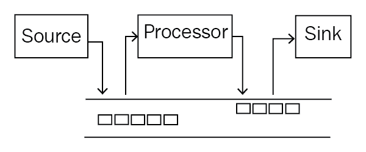

另一个示例场景涉及一个事件被多个应用程序消耗。例如，当客户注册时，我们希望给他们发送电子邮件、欢迎包和邮件。该场景的简单消息架构如下图所示：

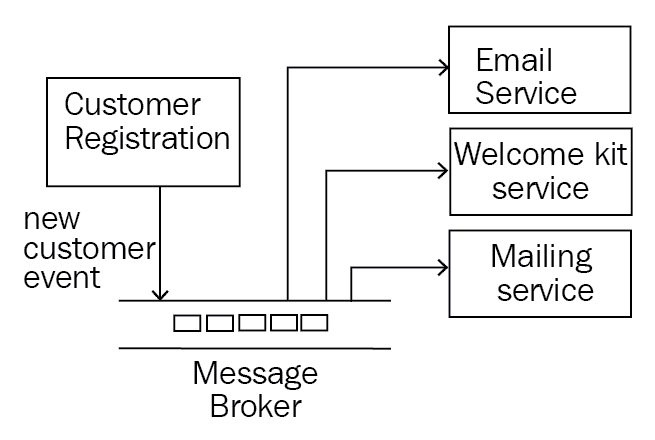

要实现上述场景，涉及许多不同的步骤：

1.  配置消息代理。

1.  在消息代理上创建不同的通道。

1.  编写应用程序代码以连接到消息代理上的特定通道。

1.  在应用程序中安装必要的绑定器以连接到消息代理。

1.  建立应用程序与消息代理之间的连接。

1.  构建和部署应用程序。

考虑这样一个场景，其中流程中的一些应用程序必须处理大量的消息负载。我们需要根据负载创建多个这样的应用程序实例。实现复杂性变得多方面。这些是 Spring Cloud 数据流和 Spring Cloud Stream 旨在解决的挑战。

在下一节中，我们将看看不同的 Spring 项目--Spring Cloud Stream（构建在 Spring 集成之上）和 Spring Cloud 数据流如何使我们能够进行基于消息的集成，而无需进行大量配置。

# 用于异步消息的 Spring 项目

在本节中，我们将看看 Spring 提供的不同项目，以实现应用程序之间基于消息的通信。我们将从 Spring 集成开始，然后转向在云上甚至能够实现基于消息的集成的项目--Spring Cloud Stream 和 Spring Cloud 数据流。

# Spring 集成

Spring 集成有助于在消息代理上无缝集成微服务。它允许程序员专注于业务逻辑，并将技术基础设施的控制（使用什么消息格式？如何连接到消息代理？）交给框架。Spring 集成通过定义良好的接口和消息适配器提供了各种配置选项。Spring 集成网站（[`projects.spring.io/spring-integration/`](https://projects.spring.io/spring-integration/)）：

扩展 Spring 编程模型以支持众所周知的企业集成模式。Spring 集成使 Spring 应用程序内部实现轻量级消息传递，并通过声明性适配器支持与外部系统的集成。这些适配器提供了对 Spring 支持远程调用、消息传递和调度的更高级抽象。Spring 集成的主要目标是提供一个简单的模型来构建企业集成解决方案，同时保持关注点的分离，这对于生成可维护、可测试的代码至关重要。

Spring Integration 提供的功能包括以下内容：

+   企业集成模式的简单实现

+   聚合来自多个服务的响应

+   从服务中过滤结果

+   服务消息转换

+   多协议支持--HTTP、FTP/SFTP、TCP/UDP、JMS

+   支持不同风格的 Web 服务（SOAP 和 REST）

+   支持多个消息代理，例如 RabbitMQ

在上一章中，我们使用了 Spring Cloud 来使我们的微服务成为云原生--部署在云中并利用云部署的所有优势。

然而，使用 Spring Integration 构建的应用程序，特别是与消息代理交互的应用程序，需要大量配置才能部署到云中。这阻止它们利用云的典型优势，例如自动扩展。

我们希望扩展 Spring Integration 提供的功能，并在云上提供这些功能。我们希望我们的微服务云实例能够自动与消息代理集成。我们希望能够自动扩展我们的微服务云实例，而无需手动配置。这就是 Spring Cloud Stream 和 Spring Cloud Data Flow 的用武之地。

# Spring Cloud Stream

Spring Cloud Stream 是构建面向云的消息驱动微服务的首选框架。

Spring Cloud Stream 允许程序员专注于围绕事件处理的业务逻辑构建微服务，将这里列出的基础设施问题留给框架处理：

+   消息代理配置和通道创建

+   针对消息代理的特定转换

+   创建绑定器以连接到消息代理

Spring Cloud Stream 完美地融入了微服务架构。在事件处理或数据流的用例中，可以设计具有明确关注点分离的典型微服务。单独的微服务可以处理业务逻辑，定义输入/输出通道，并将基础设施问题留给框架。

典型的流应用程序涉及事件的创建、事件的处理和存储到数据存储中。Spring Cloud Stream 提供了三种简单的应用程序类型来支持典型的流程：

+   **Source**：Source 是事件的创建者，例如触发股价变动事件的应用程序。

+   **Processor**：Processor 消耗事件，即处理消息，对其进行一些处理，并创建带有结果的事件。

+   **Sink**：Sink 消耗事件。它监听消息代理并将事件存储到持久数据存储中。

Spring Cloud Stream 用于在数据流中创建单独的微服务。Spring Cloud Stream 微服务定义业务逻辑和连接点，即输入和/或输出。Spring Cloud Data Flow 有助于定义流程，即连接不同的应用程序。

# Spring Cloud Data Flow

Spring Cloud Data Flow 有助于在使用 Spring Cloud Stream 创建的不同类型的微服务之间建立消息流。

基于流行的开源项目，**Spring XD** 简化了数据管道和工作流的创建--特别是针对大数据用例。然而，Spring XD 在适应与数据管道相关的新要求（例如金丝雀部署和分布式跟踪）方面存在挑战。Spring XD 架构基于运行时依赖于多个外围设备。这使得调整集群规模成为一项具有挑战性的任务。Spring XD 现在被重新命名为 Spring Cloud Data Flow。Spring Cloud Data Flow 的架构基于可组合的微服务应用程序。

Spring Cloud Data Flow 中的重要特性如下：

+   配置流，即数据或事件如何从一个应用程序流向另一个应用程序。Stream DSL 用于定义应用程序之间的流程。

+   建立应用程序与消息代理之间的连接。

+   提供围绕应用程序和流的分析。

+   将在流中定义的应用程序部署到目标运行时。

+   支持多个目标运行时。几乎每个流行的云平台都得到支持。

+   在云上扩展应用程序。

+   创建和调用任务。

有时，术语可能会有点混淆。流是流的另一种术语。重要的是要记住，Spring Cloud Stream 实际上并没有定义整个流。它只有助于创建整个流中涉及的微服务之一。正如我们将在接下来的部分中看到的，流实际上是使用 Spring Cloud Data Flow 中的 Stream DSL 来定义的。

# Spring Cloud Stream

Spring Cloud Stream 用于创建涉及流的单个微服务，并定义与消息代理的连接点。

Spring Cloud Stream 是建立在两个重要的 Spring 项目之上的：

+   **Spring Boot**：使微服务能够创建适用于生产的微服务

+   **Spring Integration**：使微服务能够通过消息代理进行通信

Spring Cloud Stream 的一些重要特性如下：

+   将微服务连接到消息代理的最低配置。

+   支持各种消息代理--RabbitMQ、Kafka、Redis 和 GemFire。

+   支持消息的持久性--如果服务宕机，它可以在恢复后开始处理消息。

+   支持消费者组--在负载较重的情况下，您需要多个相同微服务的实例。您可以将所有这些微服务实例分组到一个消费者组中，以便消息只被可用实例中的一个接收。

+   支持分区--可能存在这样的情况，您希望确保一组特定的消息由同一个实例处理。分区允许您配置标准来识别由同一分区实例处理的消息。

# Spring Cloud Stream 架构

以下图显示了典型 Spring Cloud Stream 微服务的架构。源只有一个输入通道，处理器既有输入通道又有输出通道，而汇则只有一个输出通道：

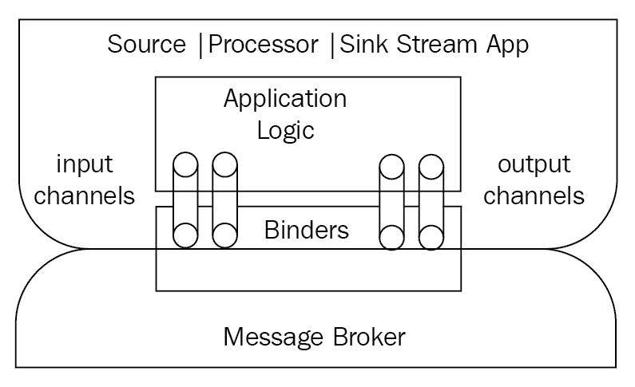

应用程序声明它们想要什么样的连接--输入和/或输出。Spring Cloud Stream 将建立连接应用程序与消息代理所需的一切。

Spring Cloud Stream 将执行以下操作：

+   将输入和/或输出通道注入到应用程序中

+   通过特定于消息代理的绑定器建立与消息代理的连接。

绑定器为 Spring Cloud Stream 应用程序带来了可配置性。一个 Spring Cloud Stream 应用程序只声明通道。部署团队可以在运行时配置通道连接到哪个消息代理（Kafka 或 RabbitMQ）。Spring Cloud Stream 使用自动配置来检测类路径上可用的绑定器。要连接到不同的消息代理，我们只需要改变项目的依赖。另一个选项是在类路径中包含多个绑定器，并在运行时选择要使用的绑定器。

# 事件处理-股票交易示例

让我们想象一个场景。一位股票交易员对他/她投资的股票的重大股价变动感兴趣。以下图显示了使用 Spring Cloud Stream 构建的这样一个应用程序的简单架构：

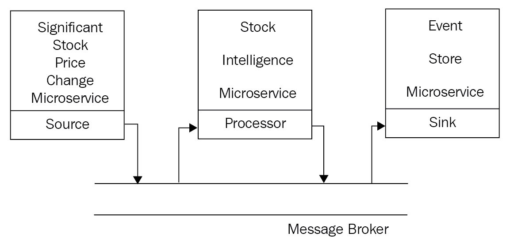

需要注意的重要事项如下：

+   **重要股价变动微服务**：每当交易所上市的任何股票的价格发生重大变动时，它会在消息代理上触发一个事件。这是**源**应用程序。

+   **股票智能微服务**：这个微服务监听股价变化事件的消息代理。当有新消息时，它会检查股票库存并将有关用户当前持仓的信息添加到消息中，并将另一条消息放在消息代理上。这是**处理器**应用程序。

+   **事件存储微服务**：这个微服务在消息代理上监听投资股票警报的股价变化。当有新消息时，它将其存储在数据存储中。这是**接收器**应用程序。

前面的架构为我们提供了在不进行重大更改的情况下增强系统的灵活性：

+   电子邮件微服务和短信微服务在消息代理上监听投资股票警报的股价变化，并发送电子邮件/短信警报。

+   股票交易员可能希望对他们没有投资的其他股票进行重大更改。股票智能微服务可以进一步增强。

正如我们之前讨论的，Spring Cloud Stream 帮助我们构建流的基本构建模块，也就是微服务。我们将使用 Spring Cloud Stream 创建三个微服务。我们稍后将使用这三个微服务并使用 Spring Cloud Data Flow 创建一个流，也就是使用 Spring Cloud Data Flow 在应用程序之间创建一个流程。

我们将从下一节开始使用 Spring Cloud Stream 创建微服务。在开始源、处理器和接收器流应用程序之前，我们将设置一个简单的模型项目：

# 股票交易示例的模型

`StockPriceChangeEvent`类包含股票的代码、股票的旧价格和股票的新价格：

```java
    public class StockPriceChangeEvent {
      private final String stockTicker;
      private final BigDecimal oldPrice;
      private final BigDecimal newPrice;
      //Setter, Getters and toString()
    }
```

`StockPriceChangeEventWithHoldings`类扩展了`StockPriceChangeEvent`。它有一个额外的属性--`holdings`。`holdings`变量用于存储交易员当前拥有的股票数量：

```java
    public class StockPriceChangeEventWithHoldings 
    extends StockPriceChangeEvent {
      private Integer holdings;
      //Setter, Getters and toString()
    }
```

`StockTicker`枚举存储应用程序支持的股票列表：

```java
    public enum StockTicker {
      GOOGLE, FACEBOOK, TWITTER, IBM, MICROSOFT
    }
```

# 源应用程序

源应用程序将是股价变化事件的生产者。它将定义一个输出通道并将消息放在消息代理上。

让我们使用 Spring Initializr（[`start.spring.io`](https://start.spring.io)）来设置应用程序。提供这里列出的详细信息，然后点击生成项目：

+   组：`com.mastering.spring.cloud.data.flow`

+   Artifact：`significant-stock-change-source`

+   依赖项：`Stream Rabbit`

以下是`pom.xml`文件中的一些重要依赖项：

```java
    <dependency>
      <groupId>org.springframework.cloud</groupId>
      <artifactId>spring-cloud-starter-stream-rabbit</artifactId>
    </dependency>
```

使用以下代码更新`SpringBootApplication`文件：

```java
    @EnableBinding(Source.class)
    @SpringBootApplication
    public class SignificantStockChangeSourceApplication {
      private static Logger logger = LoggerFactory.getLogger 
     (SignificantStockChangeSourceApplication.class);
     // psvm - main method
     @Bean
     @InboundChannelAdapter(value = Source.OUTPUT, 
     poller = @Poller(fixedDelay = "60000", maxMessagesPerPoll = "1"))
     public MessageSource<StockPriceChangeEvent>
     stockPriceChangeEvent()     {
       StockTicker[] tickers = StockTicker.values();
       String randomStockTicker = 
       tickers[ThreadLocalRandom.current().nextInt(tickers.length)] 
      .name();
       return () - > {
        StockPriceChangeEvent event = new         
        StockPriceChangeEvent(randomStockTicker,
        new BigDecimal(getRandomNumber(10, 20)), new   
        BigDecimal(getRandomNumber(10, 20)));
        logger.info("sending " + event);
        return MessageBuilder.withPayload(event).build();
        };
      }
     private int getRandomNumber(int min, int max) {
       return ThreadLocalRandom.current().nextInt(min, max + 1);
     }
    }
```

需要注意的一些重要事项如下：

+   `@EnableBinding(Source.class)`：`EnableBinding`注解使类与它需要的相应通道进行绑定--输入和/或输出。源类用于注册一个具有一个输出通道的 Cloud Stream。

+   `@Bean @InboundChannelAdapter(value = Source.OUTPUT, poller = @Poller(fixedDelay = "60000", maxMessagesPerPoll = "1"))`：`InboundChannelAdapter`注解用于指示该方法可以创建要放在消息代理上的消息。value 属性用于指示消息要放置的通道的名称。`Poller`用于调度消息的生成。在这个例子中，我们使用`fixedDelay`每分钟生成一次消息（60 * 1000 ms）。

+   `private int getRandomNumber(int min, int max)`：这个方法用于在传递的范围内创建一个随机数。

`Source`接口定义了一个输出通道，如下面的代码所示：

```java
    public abstract interface 
    org.springframework.cloud.stream.messaging.Source {
      public static final java.lang.String OUTPUT = "output";
      @org.springframework.cloud.stream.
      annotation.Output(value="output")
      public abstract org.springframework.
      messaging.MessageChannel   output();
     }
```

# 处理器

处理器应用程序将从消息代理的输入通道接收消息。它将处理消息并将其放在消息代理的输出通道上。在这个特定的例子中，处理包括将当前持仓的位置添加到消息中。

让我们使用 Spring Initializr（[`start.spring.io`](https://start.spring.io)）来设置应用程序。提供这里列出的详细信息，然后点击生成项目：

+   组：`com.mastering.spring.cloud.data.flow`

+   构件：`stock-intelligence-processor`

+   依赖：`Stream Rabbit`

使用以下代码更新`SpringBootApplication`文件：

```java
    @EnableBinding(Processor.class)@SpringBootApplication
    public class StockIntelligenceProcessorApplication {
      private static Logger logger = 
      LoggerFactory.getLogger
      (StockIntelligenceProcessorApplication.class);
      private static Map < StockTicker, Integer > holdings =
        getHoldingsFromDatabase();
        private static Map < StockTicker,
        Integer > getHoldingsFromDatabase() {
          final Map < StockTicker,
          Integer > holdings = new HashMap < >();
          holdings.put(StockTicker.FACEBOOK, 10);
          holdings.put(StockTicker.GOOGLE, 0);
          holdings.put(StockTicker.IBM, 15);
          holdings.put(StockTicker.MICROSOFT, 30);
          holdings.put(StockTicker.TWITTER, 50);
          return holdings;
        }
        @Transformer(inputChannel = Processor.INPUT,
        outputChannel = Processor.OUTPUT)
        public Object addOurInventory(StockPriceChangeEvent event) {
          logger.info("started processing event " + event);
          Integer holding =  holdings.get(
            StockTicker.valueOf(event.getStockTicker()));
          StockPriceChangeEventWithHoldings eventWithHoldings =
            new StockPriceChangeEventWithHoldings(event, holding);
          logger.info("ended processing eventWithHoldings " 
            + eventWithHoldings);
          return eventWithHoldings;
        }
        public static void main(String[] args) {
          SpringApplication.run(
            StockIntelligenceProcessorApplication.class,args);
        }
    }
```

需要注意的一些重要事项如下：

+   `@EnableBinding(Processor.class)`: `EnableBinding`注解用于将类与其所需的相应通道绑定--输入和/或输出。`Processor`类用于注册一个具有一个输入通道和一个输出通道的 Cloud Stream。

+   `private static Map<StockTicker, Integer> getHoldingsFromDatabase()`: 这个方法处理消息，更新持有量，并返回一个新对象，该对象将作为新消息放入输出通道。

+   `@Transformer(inputChannel = Processor.INPUT, outputChannel = Processor.OUTPUT)`: `Transformer`注解用于指示一个能够将一种消息格式转换/增强为另一种消息格式的方法。

如下所示，`Processor`类扩展了`Source`和`Sink`类。因此，它定义了输出和输入通道：

```java
   public abstract interface 
   org.springframework.cloud.stream.messaging.Processor extends 
   org.springframework.cloud.stream.messaging.Source, 
   org.springframework.cloud.stream.messaging.Sink {
  }
```

# Sink

Sink 将从消息代理中提取消息并处理它。在这个例子中，我们将提取消息并记录它。Sink 只定义了一个输入通道。

让我们使用 Spring Initializr ([`start.spring.io`](https://start.spring.io))来设置应用程序。提供这里列出的细节，然后点击生成项目：

+   组：`com.mastering.spring.cloud.data.flow`

+   构件：`event-store-sink`

+   依赖：`Stream Rabbit`

使用以下代码更新`SpringBootApplication`文件：

```java
    @EnableBinding(Sink.class)@SpringBootApplication
    public class EventStoreSinkApplication {
      private static Logger logger = 
      LoggerFactory.getLogger(EventStoreSinkApplication.class);
      @StreamListener(Sink.INPUT)
      public void loggerSink(StockPriceChangeEventWithHoldings event) {
      logger.info("Received: " + event);
    }
    public static void main(String[] args) {
      SpringApplication.run(EventStoreSinkApplication.class, args);
    }
   }
```

需要注意的一些重要事项如下：

+   `@EnableBinding(Sink.class)`: `EnableBinding`注解用于将类与其所需的相应通道绑定--输入和/或输出。`Sink`类用于注册一个具有一个输入通道的 Cloud Stream。

+   `public void loggerSink(StockPriceChangeEventWithHoldings event)`: 这个方法通常包含将消息存储到数据存储的逻辑。在这个例子中，我们将消息打印到日志中。

+   `@StreamListener(Sink.INPUT)`: `StreamListener`注解用于监听传入消息的通道。在这个例子中，`StreamListener`配置为监听默认输入通道。

如下代码所示，`Sink`接口定义了一个输入通道：

```java
    public abstract interface   
    org.springframework.cloud.stream.messaging.Sink {
      public static final java.lang.String INPUT = "input";
      @org.springframework.cloud.stream.annotation.Input(value="input")
      public abstract org.springframework.messaging.SubscribableChannel 
      input();
    }
```

现在我们有了三个流应用程序准备好了，我们需要连接它们。在下一节中，我们将介绍 Spring Cloud Data Flow 如何帮助连接不同的流。

# Spring Cloud Data Flow

Spring Cloud Data Flow 有助于建立使用 Spring Cloud Stream 创建的不同类型的微服务之间的消息流。通过 Spring Cloud Data Flow 服务器部署的所有微服务都应该是定义了适当通道的 Spring Boot 微服务。

Spring Cloud Data Flow 提供了接口来定义应用程序，并使用 Spring DSL 定义它们之间的流。Spring Data Flow 服务器理解 DSL 并在应用程序之间建立流。

通常，这涉及多个步骤：

+   使用应用程序名称和应用程序的可部署单元之间的映射来从存储库下载应用程序构件。Spring Data Flow Server 支持 Maven 和 Docker 存储库。

+   将应用程序部署到目标运行时。

+   在消息代理上创建通道。

+   建立应用程序和消息代理通道之间的连接。

Spring Cloud Data Flow 还提供了在需要时扩展所涉及的应用程序的选项。部署清单将应用程序映射到目标运行时。部署清单需要回答的一些问题如下：

+   需要创建多少个应用程序实例？

+   每个应用程序实例需要多少内存？

数据流服务器理解部署清单并按照指定的方式创建目标运行时。Spring Cloud Data Flow 支持各种运行时：

+   云原生

+   Apache YARN

+   Kubernetes

+   Apache Mesos

+   用于开发的本地服务器

本章中的示例将使用本地服务器。

# 高级架构

在前面的示例中，我们有三个需要在数据流中连接的微服务。以下图表示使用 Spring Cloud Data Flow 实现解决方案的高级架构：

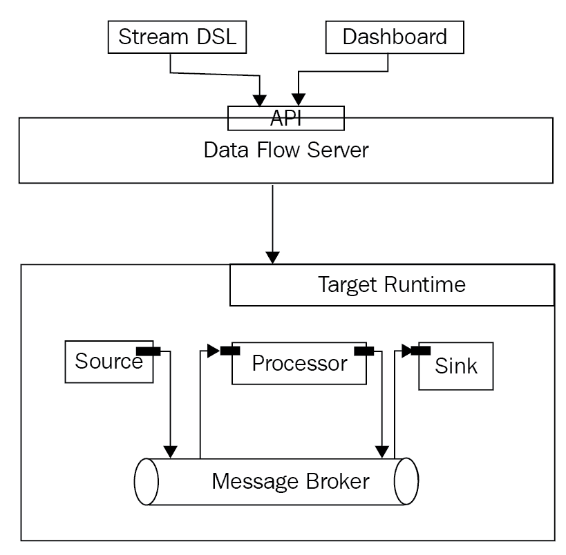

在前面的图中，源、接收器和处理器是使用 Spring Cloud Stream 创建的 Spring Boot 微服务：

+   源微服务定义了一个输出通道

+   处理器微服务定义了输入和输出通道

+   接收器微服务定义了一个输入通道

# 实施 Spring Cloud Data Flow

实施 Spring Cloud Data Flow 涉及五个步骤：

1.  设置 Spring Cloud Data Flow 服务器。

1.  设置 Data Flow Shell 项目。

1.  配置应用程序。

1.  配置流。

1.  运行流。

# 设置 Spring Cloud Data Flow 服务器

让我们使用 Spring Initializr（[`start.spring.io`](https://start.spring.io)）来设置应用程序。提供这里列出的详细信息，然后单击“生成项目”：

+   组：`com.mastering.spring.cloud.data.flow`

+   Artifact：`local-data-flow-server`

+   依赖项：`本地 Data Flow 服务器`

以下是`pom.xml`文件中一些重要的依赖项：

```java
    <dependency>
      <groupId>org.springframework.cloud</groupId>
      <artifactId>spring-cloud-starter-dataflow-server-
      local</artifactId>
    </dependency>
```

更新`SpringBootApplication`文件，使用以下代码：

```java
    @EnableDataFlowServer
    @SpringBootApplication
    public class LocalDataFlowServerApplication {
      public static void main(String[] args) {
        SpringApplication.run(LocalDataFlowServierApplication.class,
        args);
      }
    }
```

`@EnableDataFlowServer`注解用于激活 Spring Cloud Data Flow 服务器实现。

在运行本地 Data Flow 服务器之前，请确保消息代理 RabbitMQ 正在运行。

以下是在启动`LocalDataFlowServerApplication`时的启动日志中的重要摘录：

```java
Tomcat initialized with port(s): 9393 (http)
Starting H2 Server with URL: jdbc:h2:tcp://localhost:19092/mem:dataflow
Adding dataflow schema classpath:schema-h2-common.sql for h2 database
Adding dataflow schema classpath:schema-h2-streams.sql for h2 database
Adding dataflow schema classpath:schema-h2-tasks.sql for h2 database
Adding dataflow schema classpath:schema-h2-deployment.sql for h2 database
Executed SQL script from class path resource [schema-h2-common.sql] in 37 ms.
Executed SQL script from class path resource [schema-h2-streams.sql] in 2 ms.
Executed SQL script from class path resource [schema-h2-tasks.sql] in 3 ms.
Executing SQL script from class path resource [schema-h2-deployment.sql]
Executed SQL script from class path resource [schema-h2-deployment.sql] in 3 ms.
Mapped "{[/runtime/apps/{appId}/instances]}" onto public org.springframework.hateoas.PagedResources
Mapped "{[/runtime/apps/{appId}/instances/{instanceId}]}" onto public 
Mapped "{[/streams/definitions/{name}],methods=[DELETE]}" onto public void org.springframework.cloud.dataflow.server.controller.StreamDefinitionController.delete(java.lang.String)
Mapped "{[/streams/definitions],methods=[GET]}" onto public org.springframework.hateoas.PagedResources
Mapped "{[/streams/deployments/{name}],methods=[POST]}" onto public void org.springframework.cloud.dataflow.server.controller.StreamDeploymentController.deploy(java.lang.String,java.util.Map<java.lang.String, java.lang.String>)
Mapped "{[/runtime/apps]}" onto public org.springframework.hateoas.PagedResources<org.springframework.cloud.dataflow.rest.resource.AppStatusResource> org.springframework.cloud.dataflow.server.controller.RuntimeAppsController.list(org.springframework.data.domain.Pageable,org.springframework.data.web.PagedResourcesAssembler<org.springframework.cloud.deployer.spi.app.AppStatus>) throws java.util.concurrent.ExecutionException,java.lang.InterruptedException
Mapped "{[/tasks/executions],methods=[GET]}" onto public org.springframework.hateoas.PagedResources
```

需要注意的一些重要事项如下：

+   Spring Cloud Data Flow 服务器的默认端口是`9393`。可以通过在`application.properties`中指定不同的端口`server.port`来更改这一点。

+   Spring Cloud Data Flow 服务器使用内部模式存储所有应用程序、任务和流的配置。在本例中，我们尚未配置任何数据库。因此，默认情况下使用`H2`内存数据库。Spring Cloud Data Flow 服务器支持各种数据库，包括 MySQL 和 Oracle，用于存储配置。

+   由于使用了`H2`内存数据库，您可以看到在启动期间设置了不同的模式，并且还执行了不同的 SQL 脚本来设置数据。

+   Spring Cloud Data Flow 服务器公开了许多围绕其配置、应用程序、任务和流的 API。我们将在后面的部分更多地讨论这些 API。

以下屏幕截图显示了 Spring Cloud Data Flow 的启动屏幕，网址为`http://localhost:9393/dashboard`：

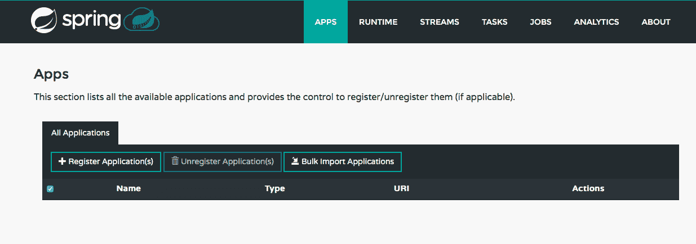

有不同的选项卡可用于查看和修改应用程序、流和任务。在下一步中，我们将使用命令行界面--Data Flow Shell 来设置应用程序和流。

# 设置 Data Flow Shell 项目

Data Flow Shell 提供了使用命令配置 Spring Data Flow 服务器中的流和其他内容的选项。

让我们使用 Spring Initializr（[`start.spring.io`](https://start.spring.io)）来设置应用程序。提供这里列出的详细信息，然后单击“生成项目”：

+   组：`com.mastering.spring.cloud.data.flow`

+   Artifact：`data-flow-shell`

+   依赖项：`Data Flow Shell`

以下是`pom.xml`文件中一些重要的依赖项：

```java
    <dependency>
      <groupId>org.springframework.cloud</groupId>
      <artifactId>spring-cloud-dataflow-shell</artifactId>
    </dependency>
```

更新`SpringBootApplication`文件，使用以下代码：

```java
    @EnableDataFlowShell
    @SpringBootApplication
    public class DataFlowShellApplication {
      public static void main(String[] args) {
      SpringApplication.run(DataFlowShellApplication.class, args);
     }
    }
```

`@EnableDataFlowShell`注解用于激活 Spring Cloud Data Flow shell。

以下屏幕截图显示了启动 Data Flow Shell 应用程序时显示的消息。我们可以在命令提示符中输入命令：

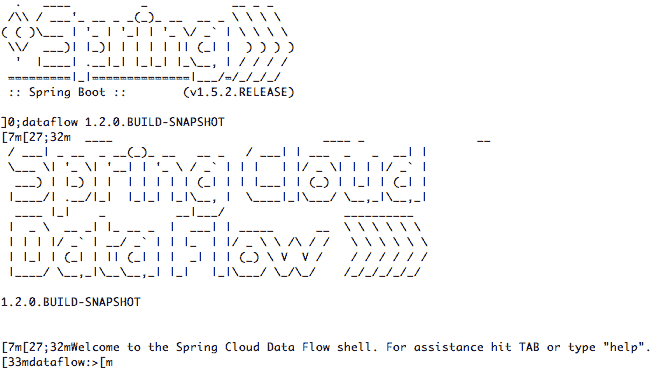

您可以尝试`help`命令以获取支持的命令列表。以下屏幕截图显示了执行`help`命令时打印的一些命令：

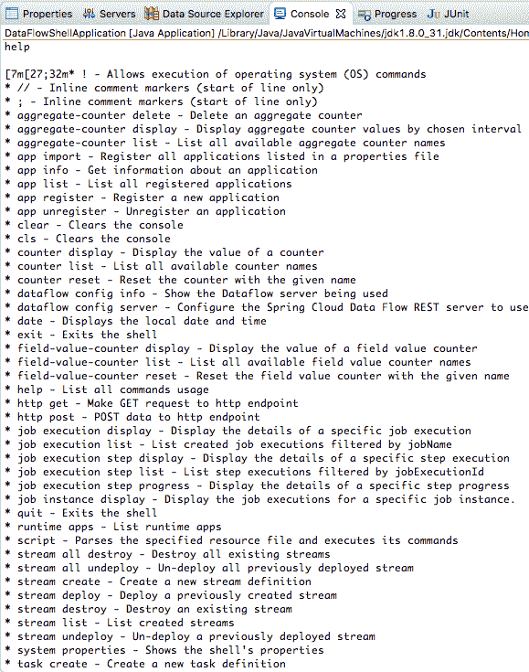

当您执行以下任何命令时，您会发现打印出空列表，因为我们尚未配置这些：

+   `app list`

+   `stream list`

+   `task list`

+   `runtime apps`

# 配置应用程序

在开始配置流之前，我们需要注册构成流的应用程序。我们有三个应用程序要注册--源、处理器和接收器。

要在 Spring Cloud Data Flow 中注册应用程序，您需要访问应用程序可部署。Spring Cloud Data Flow 提供了从 Maven 存储库中获取应用程序可部署的选项。为了简化，我们将从本地 Maven 存储库中获取应用程序。

在使用 Spring Cloud Stream 创建的三个应用程序上运行`mvn clean install`：

+   `significant-stock-change-source`

+   `stock-intelligence-processor`

+   `event-store-sink`

这将确保所有这些应用程序都构建并存储在您的本地 Maven 存储库中。

从 Maven 存储库注册应用的命令语法如下所示：

```java
app register —-name {{NAME_THAT_YOU_WANT_TO_GIVE_TO_APP}} --type source --uri maven://{{GROUP_ID}}:{{ARTIFACT_ID}}:jar:{{VERSION}}
```

三个应用程序的 Maven URI 如下所示：

```java
maven://com.mastering.spring.cloud.data.flow:significant-stock-change-source:jar:0.0.1-SNAPSHOT
maven://com.mastering.spring.cloud.data.flow:stock-intelligence-processor:jar:0.0.1-SNAPSHOT
maven://com.mastering.spring.cloud.data.flow:event-store-sink:jar:0.0.1-SNAPSHOT
```

创建应用程序的命令在此处列出。这些命令可以在 Data Flow Shell 应用程序上执行：

```java
app register --name significant-stock-change-source --type source --uri maven://com.mastering.spring.cloud.data.flow:significant-stock-change-source:jar:0.0.1-SNAPSHOT

app register --name stock-intelligence-processor --type processor --uri maven://com.mastering.spring.cloud.data.flow:stock-intelligence-processor:jar:0.0.1-SNAPSHOT

app register --name event-store-sink --type sink --uri maven://com.mastering.spring.cloud.data.flow:event-store-sink:jar:0.0.1-SNAPSHOT
```

当成功注册应用程序时，您将看到此处显示的消息：

```java
Successfully registered application 'source:significant-stock-change-source'

Successfully registered application 'processor:stock-intelligence-processor'

Successfully registered application 'sink:event-store-sink'
```

您还可以在 Spring Cloud Data Flow 仪表板上查看已注册的应用程序，如下图所示：`http://localhost:9393/dashboard`

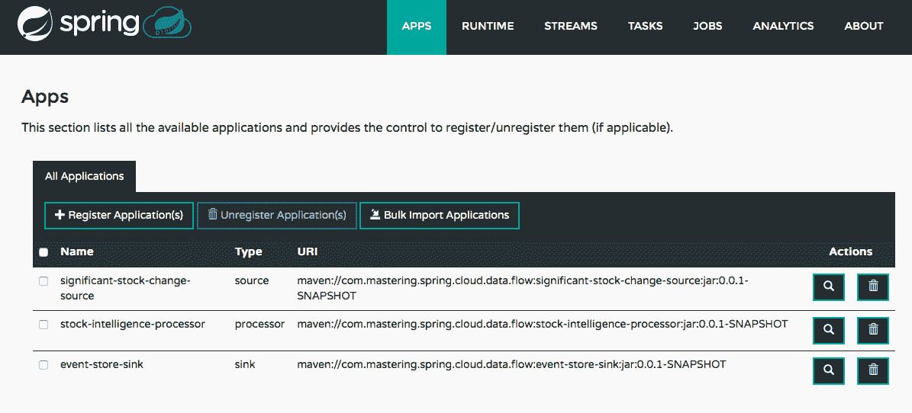

我们还可以使用仪表板注册应用程序，如下图所示：

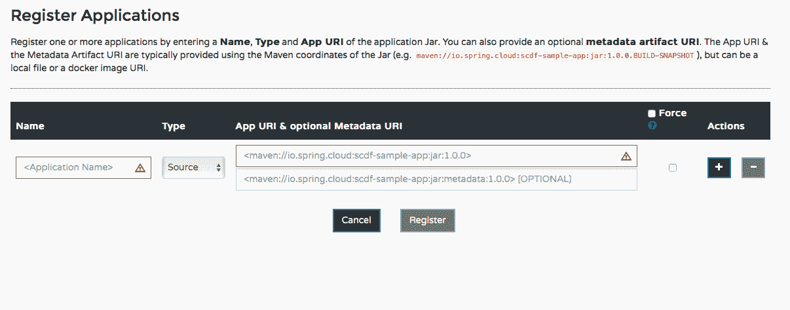

# 配置流

Stream DSL 可用于配置流--这里显示了一个简单的示例，用于连接`app1`到`app2`。由`app1`放在输出通道上的消息将在`app2`的输入通道上接收：

```java
app1 | app2
```

我们希望连接这三个应用程序。以下代码片段显示了用于连接前述应用程序的 DSL 的示例：

```java
#source | processor | sink

significant-stock-change-source|stock-intelligence-processor|event-store-sink
```

这表示以下内容：

+   源的输出通道应链接到处理器的输入通道

+   处理器的输出通道应链接到接收器的输入通道

创建流的完整命令如下所示：

```java
stream create --name process-stock-change-events --definition significant-stock-change-source|stock-intelligence-processor|event-store-sink
```

如果成功创建流，则应看到以下输出：

```java
Created new stream 'process-stock-change-events'
```

您还可以在 Spring Cloud Data Flow 仪表板的 Streams 选项卡上查看已注册的流，如下图所示：`http://localhost:9393/dashboard`

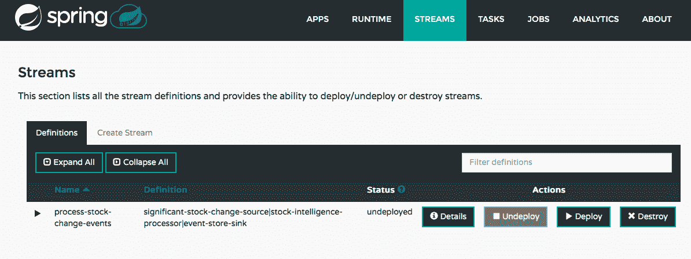

# 部署流

要部署流，可以在 Data Flow Shell 上执行以下命令：

```java
stream deploy --name process-stock-change-events
```

当发送请求创建流时，您将看到此处显示的消息：

```java
Deployment request has been sent for stream 'process-stock-change-events'
```

以下摘录显示了本地数据流服务器日志中的一部分：

```java
o.s.c.d.spi.local.LocalAppDeployer : deploying app process-stock-change-events.event-store-sink instance 0

Logs will be in /var/folders/y_/x4jdvdkx7w94q5qsh745gzz00000gn/T/spring-cloud-dataflow-3084432375250471462/process-stock-change-events-1492100265496/process-stock-change-events.event-store-sink

o.s.c.d.spi.local.LocalAppDeployer : deploying app process-stock-change-events.stock-intelligence-processor instance 0

Logs will be in /var/folders/y_/x4jdvdkx7w94q5qsh745gzz00000gn/T/spring-cloud-dataflow-3084432375250471462/process-stock-change-events-1492100266448/process-stock-change-events.stock-intelligence-processor

o.s.c.d.spi.local.LocalAppDeployer : deploying app process-stock-change-events.significant-stock-change-source instance 0

Logs will be in /var/folders/y_/x4jdvdkx7w94q5qsh745gzz00000gn/T/spring-cloud-dataflow-3084432375250471462/process-stock-change-events-1492100267242/process-stock-change-events.significant-stock-change-source
```

以下是一些需要注意的重要事项：

+   当部署流时，Spring Cloud Data Flow 将部署流中的所有应用程序，并通过消息代理设置应用程序之间的连接。应用程序代码独立于消息代理。Kafka 与 RabbitMQ 相比具有不同的消息代理设置。Spring Cloud Data Flow 会处理它。如果要从 RabbitMQ 切换到 Kafka，则应用程序代码无需更改。

+   本地数据流服务器日志包含所有应用程序的日志路径--源、处理器和接收器。

# 日志消息 - 设置与消息工厂的连接

以下代码片段显示了与从`Source`、`Transformer`和`Sink`应用程序设置消息代理相关的摘录：

```java
#Source Log
CachingConnectionFactory : Created new connection: SimpleConnection@725b3815 [delegate=amqp://guest@127.0.0.1:5672/, localPort= 58373]

#Transformer Log
o.s.i.endpoint.EventDrivenConsumer : Adding {transformer:stockIntelligenceProcessorApplication.addOurInventory.transformer} as a subscriber to the 'input' channel

o.s.integration.channel.DirectChannel : Channel 'application:0.input' has 1 subscriber(s).

o.s.i.endpoint.EventDrivenConsumer : started stockIntelligenceProcessorApplication.addOurInventory.transformer

o.s.i.endpoint.EventDrivenConsumer : Adding {message-handler:inbound.process-stock-change-events.significant-stock-change-source.process-stock-change-events} as a subscriber to the 'bridge.process-stock-change-events.significant-stock-change-source' channel

o.s.i.endpoint.EventDrivenConsumer : started inbound.process-stock-change-events.significant-stock-change-source.process-stock-change-events

#Sink Log

c.s.b.r.p.RabbitExchangeQueueProvisioner : declaring queue for inbound: process-stock-change-events.stock-intelligence-processor.process-stock-change-events, bound to: process-stock-change-events.stock-intelligence-processor

o.s.a.r.c.CachingConnectionFactory : Created new connection: SimpleConnection@3de6223a [delegate=amqp://guest@127.0.0.1:5672/, localPort= 58372]
```

以下是一些需要注意的事项：

+   `创建新连接：SimpleConnection@725b3815 [delegate=amqp://guest@127.0.0.1:5672/, localPort= 58373]`：由于我们将`spring-cloud-starter-stream-rabbit`添加到了三个应用程序的类路径中，所以使用的消息代理是 RabbitMQ。

+   `将{transformer:stockIntelligenceProcessorApplication.addOurInventory.transformer}添加为“input”通道的订阅者`：类似于此，每个应用程序的输入和/或输出通道在消息代理上设置。源和处理器应用程序在通道上监听传入消息。

# 日志消息-事件流程

有关处理消息的提取如下所示：

```java
#Source Log
SignificantStockChangeSourceApplication : sending StockPriceChangeEvent [stockTicker=MICROSOFT, oldPrice=15, newPrice=12]

#Transformer Log
.f.StockIntelligenceProcessorApplication : started processing event StockPriceChangeEvent [stockTicker=MICROSOFT, oldPrice=18, newPrice=20]

.f.StockIntelligenceProcessorApplication : ended processing eventWithHoldings StockPriceChangeEventWithHoldings [holdings=30, toString()=StockPriceChangeEvent [stockTicker=MICROSOFT, oldPrice=18, newPrice=20]]

#Sink Log
c.m.s.c.d.f.EventStoreSinkApplication : Received: StockPriceChangeEventWithHoldings [holdings=30, toString()=StockPriceChangeEvent [stockTicker=MICROSOFT, oldPrice=18, newPrice=20]]
```

源应用程序发送`StockPriceChangeEvent`。`Transformer`应用程序接收事件，将持有添加到消息中，并创建新的`StockPriceChangeEventWithHoldings`事件。接收器应用程序接收并记录此消息。

# Spring Cloud Data Flow REST API

Spring Cloud Data Flow 提供了围绕应用程序、流、任务、作业和指标的 RESTful API。可以通过向`http://localhost:9393/`发送`GET`请求来获取完整列表。

以下屏幕截图显示了`GET`请求的响应：

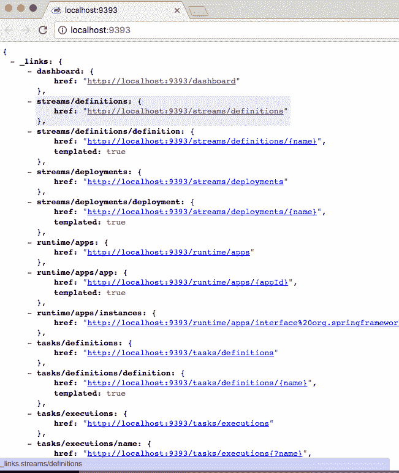

所有 API 都是不言自明的。让我们看一个向`http://localhost:9393/streams/definitions`发送`GET`请求的示例：

```java
{  
  "_embedded":{  
  "streamDefinitionResourceList":[  
         {  
            "name":"process-stock-change-events"
            "dslText":"significant-stock-change-source|stock-
            intelligence-processor|event-store-sink",
            "status":"deployed",
            "statusDescription":"All apps have been successfully
             deployed",
            "_links":{  
               "self":{  
                  "href":"http://localhost:9393/streams/definitions/
                   process-stock-change-events"
               }
            }
         }
      ]
   },
   "_links":{  
      "self":{  
         "href":"http://localhost:9393/streams/definitions"
      }
   },
   "page":{
      "size":20,
      "totalElements":1,
      "totalPages":1,
      "number":0
   }
}
```

需要注意的重要事项如下：

+   API 是 RESTful 的。`_embedded`元素包含请求的数据。`_links`元素包含 HATEOAS 链接。页面元素包含分页信息。

+   `_embedded.streamDefinitionResourceList.dslText`包含流的定义`"significant-stock-change-source|stock-intelligence-processor|event-store-sink"`。

+   `_embedded.streamDefinitionResourceList.status`

# Spring Cloud Task

Spring Cloud Data Flow 还可以用于创建和调度批处理应用程序。在过去的十年中，Spring Batch 一直是开发批处理应用程序的首选框架。Spring Cloud Task 扩展了这一点，并使批处理程序可以在云上执行。

让我们使用 Spring Initializr ([`start.spring.io`](https://start.spring.io))来设置应用程序。提供此处列出的详细信息，然后单击“生成项目”：

+   组：`com.mastering.spring.cloud.data.flow`

+   构件：`simple-logging-task`

+   依赖项：`Cloud Task`

使用以下代码更新`SimpleLoggingTaskApplication`类：

```java
@SpringBootApplication
@EnableTask

public class SimpleLoggingTaskApplication {

@Bean
public CommandLineRunner commandLineRunner() {
  return strings -> System.out.println(
  "Task execution :" + new SimpleDateFormat().format(new Date()));
  }
public static void main(String[] args) {
  SpringApplication.run(SimpleLoggingTaskApplication.class, args);
  }
}
```

此代码只是将当前时间戳与 sysout 放在一起。`@EnableTask`注解在 Spring Boot 应用程序中启用任务功能。

我们可以使用以下命令在数据流 shell 上注册任务：

```java
app register --name simple-logging-task --type task --uri maven://com.mastering.spring.cloud.data.flow:simple-logging-task:jar:0.0.1-SNAPSHOT
task create --name simple-logging-task-definition --definition "simple-logging-task"
```

这些命令与用于注册我们之前创建的流应用程序的命令非常相似。我们正在添加一个任务定义，以便能够执行该任务。

可以使用以下命令启动任务：

```java
task launch simple-logging-task-definition
```

任务执行也可以在 Spring Cloud Flow 仪表板上触发和监视。

# 摘要

Spring Cloud Data Flow 为数据流和事件流带来了云原生功能。它使得在云上创建和部署流变得容易。在本章中，我们介绍了如何使用 Spring Cloud Stream 设置事件驱动流中的单个应用程序。我们以 1000 英尺的视角来创建具有 Spring Cloud Task 的任务。我们使用 Spring Cloud Data Flow 来设置流，还执行简单任务。

在下一章中，我们将开始了解构建 Web 应用程序的新方法--响应式风格。我们将了解为什么非阻塞应用程序备受推崇，以及如何使用 Spring Reactive 构建响应式应用程序。
