# 第十一章：响应式编程

在前一章中，我们讨论了使用 Spring Cloud Data Flow 在微服务中实现典型的数据流使用案例。

函数式编程标志着从传统的命令式编程转向更声明式的编程风格。响应式编程建立在函数式编程之上，提供了一种替代的风格。

在本章中，我们将讨论响应式编程的基础知识。

微服务架构促进基于消息的通信。响应式编程的一个重要原则是围绕事件（或消息）构建应用程序。我们需要回答一些重要的问题，包括以下内容：

+   什么是响应式编程？

+   典型的使用案例是什么？

+   Java 为响应式编程提供了什么样的支持？

+   Spring WebFlux 中的响应式特性是什么？

# 响应式宣言

几年前的大多数应用程序都有以下的奢侈条件：

+   多秒级的响应时间

+   多个小时的离线维护

+   较小的数据量

时代已经改变。新设备（手机、平板等）和新的方法（基于云的）已经出现。在今天的世界中，我们正在谈论：

+   亚秒级的响应时间

+   100%的可用性

+   数据量呈指数增长

在过去几年中出现了不同的方法来应对这些新兴挑战。虽然响应式编程并不是一个真正新的现象，但它是成功应对这些挑战的方法之一。

响应式宣言（[`www.reactivemanifesto.org`](http://www.reactivemanifesto.org)）旨在捕捉共同的主题。

我们相信需要一个连贯的系统架构方法，并且我们相信所有必要的方面已经被单独认可：我们希望系统具有响应性、弹性、弹性和消息驱动。我们称这些为响应式系统。

构建为响应式系统的系统更加灵活、松散耦合和可扩展。这使得它们更容易开发和适应变化。它们对故障更具有容忍性，当故障发生时，它们以优雅的方式而不是灾难性地应对。响应式系统具有高度的响应性，为用户提供有效的交互反馈。

虽然响应式宣言清楚地阐述了响应式系统的特性，但对于响应式系统的构建方式并不是很清晰。

# 响应式系统的特点

以下图显示了响应式系统的重要特点：

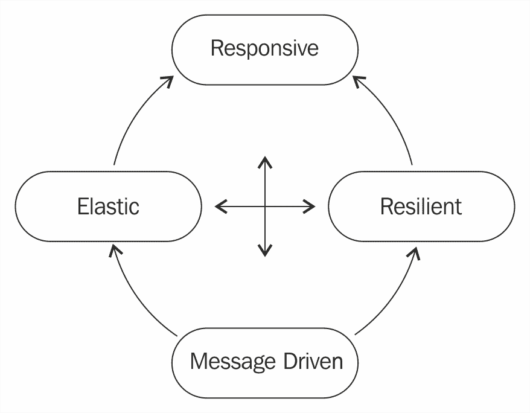

重要特点如下：

+   **响应性**：系统对用户做出及时的响应。设置了明确的响应时间要求，并且系统在所有情况下都满足这些要求。

+   **弹性**：分布式系统是使用多个组件构建的。任何一个组件都可能发生故障。响应式系统应该被设计成在局部空间内包含故障，例如在每个组件内。这可以防止整个系统在局部故障的情况下崩溃。

+   **弹性**：响应式系统在不同负载下保持响应。在高负载下，这些系统可以添加额外的资源，而在负载减少时释放资源。弹性是通过使用通用硬件和软件实现的。

+   **消息驱动**：响应式系统由消息（或事件）驱动。这确保了组件之间的低耦合。这保证了系统的不同组件可以独立扩展。使用非阻塞通信确保线程的生存时间更短。

响应式系统对不同类型的刺激做出响应。一些例子如下：

+   **对事件做出反应**：基于消息传递构建，响应式系统对事件做出快速响应。

+   **对负载做出反应**：响应式系统在不同负载下保持响应。在高负载下使用更多资源，在较低负载下释放资源。

+   **对故障做出反应**：反应式系统可以优雅地处理故障。反应式系统的组件被构建为局部化故障。外部组件用于监视组件的可用性，并在需要时复制组件。

+   **对用户做出反应**：反应式系统对用户做出响应。当消费者未订阅特定事件时，它们不会浪费时间执行额外的处理。

# 反应式用例 - 股票价格页面

虽然反应式宣言帮助我们理解反应式系统的特性，但它并不能真正帮助我们理解反应式系统是如何构建的。为了理解这一点，我们将考虑构建一个简单用例的传统方法，并将其与反应式方法进行比较。

我们要构建的用例是一个显示特定股票价格的股票价格页面。只要页面保持打开状态，我们希望在页面上更新股票的最新价格。

# 传统方法

传统方法使用轮询来检查股票价格是否发生变化。以下的序列图展示了构建这样一个用例的传统方法：

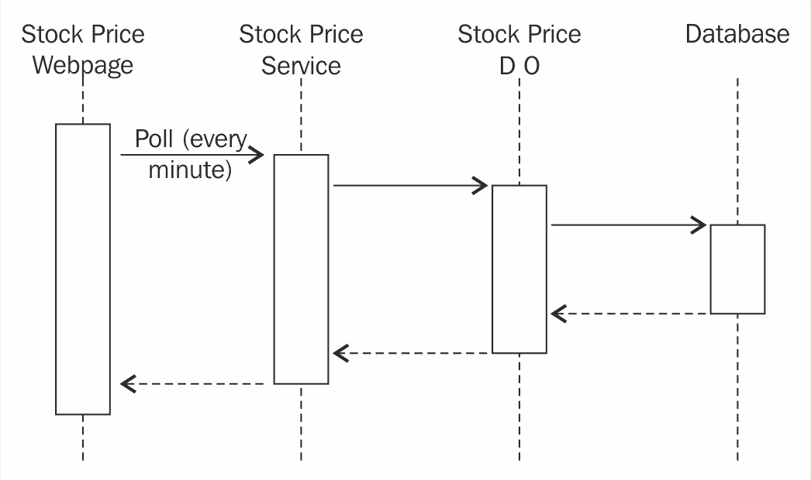

页面渲染后，会定期向股票价格服务发送获取最新价格的 AJAX 请求。这些调用必须进行，无论股票价格是否发生变化，因为网页不知道股票价格的变化。

# 反应式方法

反应式方法涉及连接不同的组件，以便能够对事件做出反应。

当股票价格网页加载时，网页会注册股票价格服务的事件。当股票价格变化事件发生时，会触发一个事件。最新的股票价格会更新在网页上。以下的序列图展示了构建股票价格页面的反应式方法：

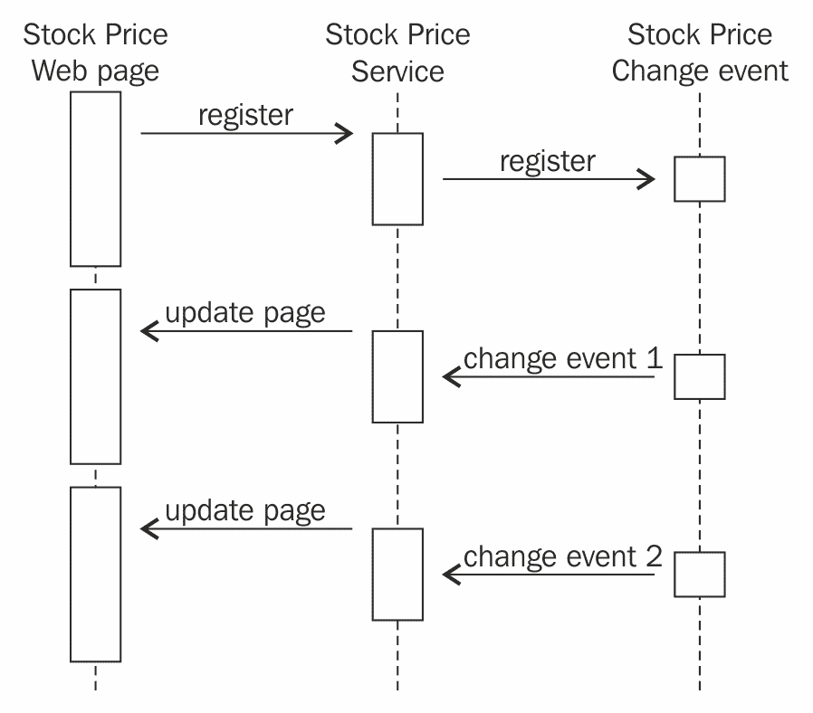

反应式方法通常包括三个步骤：

1.  订阅事件。

1.  事件的发生。

1.  注销。

当股票价格网页最初加载时，它会订阅股票价格变化事件。订阅的方式根据使用的反应式框架和/或消息代理（如果有）而有所不同。

当特定股票的股票价格变化事件发生时，会为所有订阅者触发一个新的事件。监听器确保网页上显示最新的股票价格。

一旦网页关闭（或刷新），订阅者会发送注销请求。

# 传统方法和反应式方法之间的比较

传统方法非常简单。反应式方法需要实现反应式订阅和事件链。如果事件链涉及消息代理，它会变得更加复杂。

在传统方法中，我们轮询变化。这意味着每分钟（或指定的间隔）都会触发整个序列，无论股票价格是否发生变化。在反应式方法中，一旦我们注册了事件，只有当股票价格发生变化时才会触发序列。

传统方法中线程的生命周期更长。线程使用的所有资源会被锁定更长时间。考虑到服务器同时为多个请求提供服务的整体情况，线程和它们的资源会有更多的竞争。在反应式方法中，线程的生命周期较短，因此资源的竞争较少。

传统方法中的扩展涉及扩展数据库并创建更多的 Web 服务器。由于线程的寿命很短，反应式方法可以处理更多用户。虽然反应式方法具有传统方法的所有扩展选项，但它提供了更多的分布式选项。例如，股价变动事件的触发可以通过消息代理与应用程序通信，如下图所示：

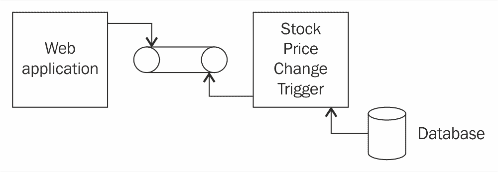

这意味着 Web 应用程序和股价变动触发的应用程序可以独立扩展。这在需要时提供了更多的扩展选项。

# Java 中的反应式编程

Java 8 没有内置对反应式编程的支持。许多框架提供了反应式功能。我们将在后续章节中讨论反应式流、Reactor 和 Spring WebFlux。

# 反应式流

反应式流是一项旨在提供异步流处理和非阻塞背压标准的倡议。这包括针对运行时环境（JVM 和 JavaScript）以及网络协议的努力。

需要注意的一些重要事项如下：

+   反应式流旨在定义一组最小的接口、方法和协议，以实现反应式编程

+   反应式流旨在成为一种与语言无关的方法，实现在 Java（基于 JVM）和 JavaScript 语言中

+   支持多个传输流（TCP、UDP、HTTP 和 WebSockets）

反应式流的 Maven 依赖关系如下所示：

```java
    <dependency>
      <groupId>org.reactivestreams</groupId>
      <artifactId>reactive-streams</artifactId>
      <version>1.0.0</version>
    </dependency>

    <dependency>
      <groupId>org.reactivestreams</groupId>
      <artifactId>reactive-streams-tck</artifactId>
      <version>1.0.0</version>
      <scope>test</scope>
    </dependency>
```

在 Reactive Streams 中定义的一些重要接口如下所示：

```java
    public interface Subscriber<T> {
      public void onSubscribe(Subscription s);
      public void onNext(T t);
      public void onError(Throwable t);
      public void onComplete();
    }
   public interface Publisher<T> {
     public void subscribe(Subscriber<? super T> s);
   }
   public interface Subscription {
     public void request(long n);
     public void cancel();
  }
```

需要注意的一些重要事项如下：

+   **接口发布者**：`Publisher`根据其订阅者的需求提供元素流。一个发布者可以为任意数量的订阅者提供服务。订阅者数量可能会随时间变化。

+   **接口订阅者**：`Subscriber`注册以监听事件流。订阅是一个两步过程。第一步是调用 Publisher.subscribe(Subscriber)。第二步涉及调用 Subscription.request(long)。完成这些步骤后，订阅者可以使用`onNext(T t)`方法开始处理通知。`onComplete()`方法表示通知的结束。每当`Subscriber`实例能够处理更多时，可以通过 Subscription.request(long)发出需求信号。

+   **接口订阅**：`Subscription`表示`Subscriber`和其`Publisher`之间的链接。订阅者可以使用`request(long n)`请求更多数据。它可以使用`cancel()`方法取消通知的订阅。

# Reactor

Reactor 是 Spring Pivotal 团队的一个反应式框架。它建立在 Reactive Streams 之上。正如我们将在本章后面讨论的那样，Spring Framework 5.0 使用 Reactor 框架来实现反应式 Web 功能。

Reactor 的依赖关系如下所示：

```java
    <dependency>
      <groupId>io.projectreactor</groupId>
      <artifactId>reactor-core</artifactId>
      <version>3.0.6.RELEASE</version>
   </dependency>
   <dependency>
     <groupId>io.projectreactor.addons</groupId>
     <artifactId>reactor-test</artifactId>
     <version>3.0.6.RELEASE</version>
  </dependency>
```

Reactor 在`Subscriber`、`Consumer`和`Subscriptions`术语的基础上增加了一些重要的内容。

+   **Flux**：Flux 表示发出 0 到*n*个元素的反应式流

+   **Mono**：Mono 表示发出零个或一个元素的反应式流

在后续的示例中，我们将创建存根 Mono 和 Flux 对象，这些对象将预先配置为在特定时间间隔内发出元素。我们将创建消费者（或观察者）来监听这些事件并对其做出反应。

# Mono

创建 Mono 非常简单。以下 Mono 在 5 秒延迟后发出一个元素。

```java
   Mono<String> stubMonoWithADelay = 
   Mono.just("Ranga").delayElement(Duration.ofSeconds(5));
```

我们希望从 Mono 中监听事件并将其记录到控制台。我们可以使用此处指定的语句来实现：

```java
    stubMonoWithADelay.subscribe(System.out::println);
```

但是，如果您在以下代码中以`Test`注释运行程序，并运行前面两个语句，您会发现控制台上没有打印任何内容：

```java
    @Test
    public void monoExample() throws InterruptedException {
      Mono<String> stubMonoWithADelay =   
      Mono.just("Ranga").delayElement(Duration.ofSeconds(5));
      stubMonoWithADelay.subscribe(System.out::println);
     }
```

由于`Test`执行在 Mono 在 5 秒后发出元素之前结束，因此不会打印任何内容到控制台。为了防止这种情况，让我们使用`Thread.sleep`延迟`Test`的执行：

```java
    @Test
    public void monoExample() throws InterruptedException {
      Mono<String> stubMonoWithADelay = 
      Mono.just("Ranga").delayElement(Duration.ofSeconds(5));
      stubMonoWithADelay.subscribe(System.out::println);
      Thread.sleep(10000);
    }
```

当我们使用`stubMonoWithADelay.subscribe(System.out::println)`创建一个订阅者时，我们使用了 Java 8 引入的函数式编程特性。`System.out::println`是一个方法定义。我们将方法定义作为参数传递给一个方法。

这是因为有一个特定的函数接口叫做`Consumer`。函数接口是只有一个方法的接口。`Consumer`函数接口用于定义接受单个输入参数并返回无结果的操作。`Consumer`接口的概要显示在以下代码片段中：

```java
     @FunctionalInterface
     public interface Consumer<T> {
       void accept(T t); 
     }
```

我们可以明确定义`Consumer`，而不是使用 lambda 表达式。以下代码片段显示了重要细节：

```java
    class SystemOutConsumer implements Consumer<String> {
      @Override
      public void accept(String t) {
        System.out.println("Received " + t + " at " + new Date());
      }
    }
    @Test
    public void monoExample() throws InterruptedException {
      Mono<String> stubMonoWithADelay = 
      Mono.just("Ranga").delayElement(Duration.ofSeconds(5));
      stubMonoWithADelay.subscribe(new SystemOutConsumer());
      Thread.sleep(10000);
     }
```

重要事项如下：

+   `class SystemOutConsumer implements Consumer<String>`：我们创建了一个实现函数接口`Consumer`的`SystemOutConsumer`类。输入类型为`String`。

+   `public void accept(String t)`：我们定义 accept 方法来将字符串的内容打印到控制台。

+   `stubMonoWithADelay.subscribe(new SystemOutConsumer())`：我们创建了一个`SystemOutConsumer`的实例来订阅事件。

输出显示在以下截图中：

！[](img/3b65fe68-87d9-492d-92c8-e84f58c56aa0.png)

我们可以有多个订阅者监听来自 Mono 或 Flux 的事件。以下代码片段显示了如何创建额外的订阅者：

```java
    class WelcomeConsumer implements Consumer<String> {
      @Override
      public void accept(String t) {
        System.out.println("Welcome " + t);
      } 
    }
    @Test
    public void monoExample() throws InterruptedException {
      Mono<String> stubMonoWithADelay = 
      Mono.just("Ranga").delayElement(Duration.ofSeconds(5));
      stubMonoWithADelay.subscribe(new SystemOutConsumer());
      stubMonoWithADelay.subscribe(new WelcomeConsumer());
      Thread.sleep(10000);
    }
```

重要事项如下：

+   `class WelcomeConsumer implements Consumer<String>`：我们正在创建另一个 Consumer 类，`WelcomeConsumer`

+   `stubMonoWithADelay.subscribe(new WelcomeConsumer())`：我们将`WelcomeConsumer`的一个实例添加为 Mono 事件的订阅者

输出显示在以下截图中：

！[](img/7891d557-00d5-4703-8345-60f1c0a992c7.png)

# Flux

Flux 代表一个发出 0 到*n*个元素的响应流。以下代码片段显示了一个简单的 Flux 示例：

```java
    @Test
    public void simpleFluxStream() {
      Flux<String> stubFluxStream = Flux.just("Jane", "Joe");
      stubFluxStream.subscribe(new SystemOutConsumer());  
    }
```

重要事项如下：

+   `Flux<String> stubFluxStream = Flux.just("Jane", "Joe")`：我们使用`Flux.just`方法创建了一个 Flux。它可以创建包含硬编码元素的简单流。

+   `stubFluxStream.subscribe(new SystemOutConsumer())`：我们在 Flux 上注册了一个`SystemOutConsumer`的实例作为订阅者。

输出显示在以下截图中：

！[](img/f724d985-4bd0-47c0-8f7e-d1557589bc63.png)

以下代码片段显示了一个具有两个订阅者的 Flux 的更复杂的示例：

```java
    private static List<String> streamOfNames = 
    Arrays.asList("Ranga", "Adam", "Joe", "Doe", "Jane");
    @Test
    public void fluxStreamWithDelay() throws InterruptedException {
      Flux<String> stubFluxWithNames = 
      Flux.fromIterable(streamOfNames)
     .delayElements(Duration.ofMillis(1000));
      stubFluxWithNames.subscribe(new SystemOutConsumer());
      stubFluxWithNames.subscribe(new WelcomeConsumer());
      Thread.sleep(10000);
    }
```

重要事项如下：

+   `Flux.fromIterable(streamOfNames).delayElements(Duration.ofMillis(1000))`：从指定的字符串列表创建一个 Flux。元素在指定的 1000 毫秒延迟后发出。

+   `stubFluxWithNames.subscribe(new SystemOutConsumer())`和`stubFluxWithNames.subscribe(new WelcomeConsumer())`：我们在 Flux 上注册了两个订阅者。

+   `Thread.sleep(10000)`：与第一个 Mono 示例类似，我们引入了 sleep 来使程序等待直到 Flux 发出的所有元素都被发出。

输出显示在以下截图中：

！[](img/b955cd0f-3580-4d92-8759-2b6755b67939.png)

# Spring Web Reactive

**Spring Web Reactive**是 Spring Framework 5 中的一个重要新功能。它为 Web 应用程序带来了响应式能力。

Spring Web Reactive 基于与 Spring MVC 相同的基本编程模型。以下表格提供了两个框架的快速比较：

| . | **Spring MVC** | **Spring Web Reactive** |
| --- | --- | --- |
| **用途** | 传统的 Web 应用程序 | 响应式 Web 应用程序 |
| **编程模型** | `@Controller` with `@RequestMapping` | 与 Spring MVC 相同 |
| **基本 API** | Servlet API | 响应式 HTTP |
| **运行在** | Servlet 容器 | Servlet 容器（>3.1）、Netty 和 Undertow |

在随后的步骤中，我们希望为 Spring Web Reactive 实现一个简单的用例。

以下是涉及的重要步骤：

+   使用 Spring Initializr 创建项目

+   创建返回事件流（Flux）的反应式控制器

+   创建 HTML 视图

# 使用 Spring Initializr 创建项目

让我们从使用 Spring Initializr（[`start.spring.io/`](http://start.spring.io/)）创建一个新项目开始。以下屏幕截图显示了详细信息：

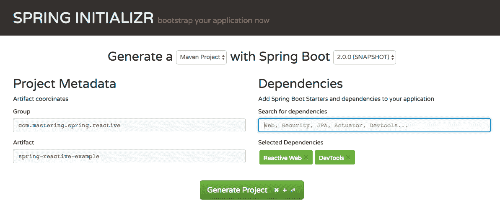

需要注意的几点如下：

+   组：`com.mastering.spring.reactive`

+   Artifact：`spring-reactive-example`

+   依赖项：`ReactiveWeb`（用于构建反应式 Web 应用程序）和`DevTools`（用于在应用程序代码更改时进行自动重新加载）

下载项目并将其作为 Maven 项目导入到您的 IDE 中。

`pom.xml`文件中的重要依赖项如下所示：

```java
    <dependency>
      <groupId>org.springframework.boot</groupId>
      <artifactId>spring-boot-starter</artifactId>
    </dependency>

    <dependency>
      <groupId>org.springframework.boot</groupId>
      <artifactId>spring-boot-devtools</artifactId>
   </dependency>

   <dependency>
     <groupId>org.springframework.boot</groupId>
     <artifactId>spring-boot-starter-webflux</artifactId>
   </dependency>

   <dependency>
     <groupId>org.springframework.boot</groupId>
     <artifactId>spring-boot-starter-test</artifactId>
     <scope>test</scope>
   </dependency>
```

`spring-boot-starter-webflux`依赖项是 Spring Web Reactive 的最重要的依赖项。快速查看`spring-boot-starter-webflux`的`pom.xml`文件，可以看到 Spring Reactive 的构建块--`spring-webflux`、`spring-web`和`spring-boot-starter-reactor-netty`。

**Netty**是默认的嵌入式反应式服务器。以下代码段显示了依赖项：

```java
    <dependency>
      <groupId>org.springframework.boot</groupId>
      <artifactId>spring-boot-starter</artifactId>
    </dependency>

    <dependency>
      <groupId>org.springframework.boot</groupId>
      <artifactId>spring-boot-starter-reactor-netty</artifactId>
    </dependency>

    <dependency>
      <groupId>com.fasterxml.jackson.core</groupId>
      <artifactId>jackson-databind</artifactId>
    </dependency>

    <dependency>
      <groupId>org.hibernate</groupId>
      <artifactId>hibernate-validator</artifactId>
    </dependency>

    <dependency>
      <groupId>org.springframework</groupId>
      <artifactId>spring-web</artifactId>
    </dependency>

    <dependency>
      <groupId>org.springframework</groupId>
      <artifactId>spring-webflux</artifactId>
    </dependency>
```

# 创建一个反应式控制器

创建 Spring Reactive Controller 与创建 Spring MVC Controller 非常相似。基本结构相同：`@RestController`和不同的`@RequestMapping`注解。以下代码段显示了一个名为`StockPriceEventController`的简单反应式控制器：

```java
    @RestController
    public class StockPriceEventController {
      @GetMapping("/stocks/price/{stockCode}")
      Flux<String> retrieveStockPriceHardcoded
      (@PathVariable("stockCode") String stockCode) {
        return Flux.interval(Duration.ofSeconds(5))
        .map(l -> getCurrentDate() + " : " 
        + getRandomNumber(100, 125))
        .log();
      }
     private String getCurrentDate() {
       return (new Date()).toString();
     }
     private int getRandomNumber(int min, int max) {
       return ThreadLocalRandom.current().nextInt(min, max + 1);
     }
    }
```

需要注意的几点如下：

+   `@RestController`和`@GetMapping("/stocks/price/{stockCode}")`：基本结构与 Spring MVC 相同。我们正在创建一个映射到指定 URI 的映射。

+   `Flux<String> retrieveStockPriceHardcoded(@PathVariable("stockCode") String stockCode)`：Flux 表示 0 到*n*个元素的流。返回类型`Flux<String>`表示该方法返回表示股票当前价格的值的流。

+   `Flux.interval().map(l -> getCurrentDate() + " : " + getRandomNumber(100, 125))`：我们正在创建一个硬编码的 Flux，返回一系列随机数。

+   `Duration.ofSeconds(5)`: 每 5 秒返回一次流元素。

+   `Flux.<<****>>.log()`: 在 Flux 上调用`log()`方法有助于观察所有 Reactive Streams 信号并使用 Logger 支持对其进行跟踪。

+   `private String getCurrentDate()`：将当前时间作为字符串返回。

+   `private int getRandomNumber(int min, int max)`：返回`min`和`max`之间的随机数。

# 创建 HTML 视图

在上一步中，我们将 Flux 流映射到`"/stocks/price/{stockCode}"` URL。在这一步中，让我们创建一个视图来在屏幕上显示股票的当前价值。

我们将创建一个简单的静态 HTML 页面（`resources/static/stock-price.html`），其中包含一个按钮，用于开始从流中检索。以下代码段显示了 HTML：

```java
    <p>
      <button id="subscribe-button">Get Latest IBM Price</button>
      <ul id="display"></ul>
    </p>
```

我们想要创建一个 JavaScript 方法来注册到流中，并将新元素附加到特定的 div。以下代码段显示了 JavaScript 方法：

```java
    function registerEventSourceAndAddResponseTo(uri, elementId) {
      var stringEvents = document.getElementById(elementId); 
      var stringEventSource = new (uri);
      stringEventSource.onmessage = function(e) {
        var newElement = document.createElement("li");
        newElement.innerHTML = e.data;
        stringEvents.appendChild(newElement);
      }
    }
```

`EventSource`接口用于接收服务器发送的事件。它通过 HTTP 连接到服务器，并以 text/event-stream 格式接收事件。当它接收到一个元素时，将调用`onmessage`方法。

以下代码段显示了注册获取最新 IBM 价格按钮的 onclick 事件的代码：

```java
    addEvent("click", document.getElementById('subscribe-button'), 
    function() {
            registerEventSourceAndAddResponseTo("/stocks/price/IBM", 
            "display"); 
          }
     );
     function addEvent(evnt, elem, func) {
       if (typeof(EventSource) !== "undefined") {
         elem.addEventListener(evnt,func,false);
       }
       else { // No much to do
         elem[evnt] = func;
       }
    }
```

# 启动 SpringReactiveExampleApplication

将应用类`SpringReactiveExampleApplication`作为 Java 应用程序启动。在启动日志中，您将看到的最后一条消息之一是`Netty started on port(s): 8080`。Netty 是 Spring Reactive 的默认嵌入式服务器。

当您导航到`localhost:8080/static/stock-price.html` URL 时，以下屏幕截图显示了浏览器：

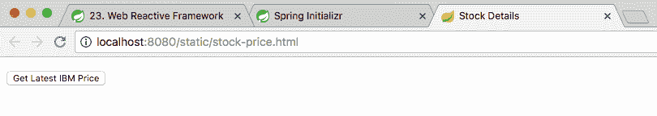

当点击“获取最新的 IBM 价格”按钮时，`EventSource`开始注册从`"/stocks/price/IBM"`接收事件。一旦接收到元素，它就会显示在屏幕上。

下一个截图显示了在接收到一些事件后屏幕上的情况。您可以观察到每隔 5 秒接收到一个事件：

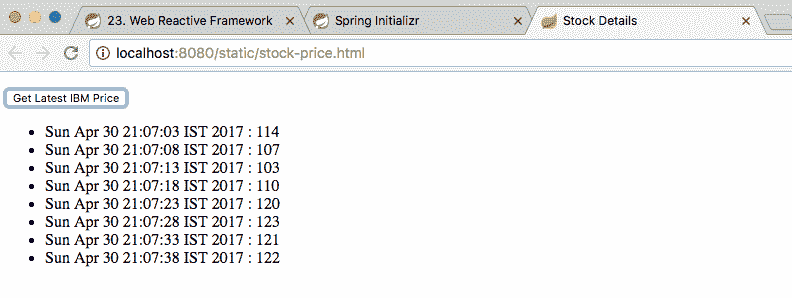

下一个截图显示了在关闭浏览器窗口后日志中的一部分内容：

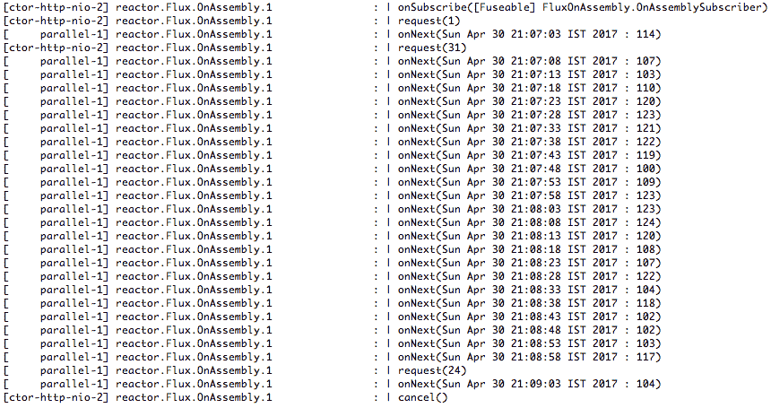

您可以观察到一系列`onNext`方法调用，这些调用会在元素可用时触发。当关闭浏览器窗口时，将调用`cancel()`方法来终止流。

在这个例子中，我们创建了一个控制器返回一个事件流（作为`Flux`），并且一个网页使用`EventSource`注册到事件流。在下一个例子中，让我们看看如何将事件流的范围扩展到数据库。

# 响应式数据库

所有普通数据库操作都是阻塞的；也就是说，线程会等待直到从数据库接收到响应。

为了充分利用响应式编程，端到端的通信必须是响应式的，也就是基于事件流的。

**ReactiveMongo**旨在是响应式的，避免阻塞操作。所有操作，包括选择、更新或删除，都会立即返回。数据可以使用事件流流入和流出数据库。

在本节中，我们将使用 Spring Boot 响应式 MongoDB 启动器创建一个简单的示例，连接到 ReactiveMongo。

涉及以下步骤：

1.  集成 Spring Boot 响应式 MongoDB 启动器。

1.  创建股票文档的模型对象。

1.  创建`reactiveCrudRepository`。

1.  使用命令行运行器初始化股票数据。

1.  在 Rest Controller 中创建响应式方法。

1.  更新视图以订阅事件流。

# 集成 Spring Boot 响应式 MongoDB 启动器

为了连接到 ReactiveMongo 数据库，Spring Boot 提供了一个启动项目--Spring Boot 响应式 MongoDB 启动器。让我们将其添加到我们的`pom.xml`文件中：

```java
    <dependency>
      <groupId>org.springframework.boot</groupId>
      <artifactId>spring-boot-starter-data-mongodb-
        reactive</artifactId>
    </dependency>
```

`spring-boot-starter-data-mongodb-reactive`启动器引入了`spring-data-mongodb`、`mongodb-driver-async`和`mongodb-driver-reactivestreams`依赖项。以下代码片段显示了`spring-boot-starter-data-mongodb-reactive`启动器中的重要依赖项：

```java
    <dependency>
      <groupId>org.springframework.data</groupId>
      <artifactId>spring-data-mongodb</artifactId>
      <exclusions>
       <exclusion>
         <groupId>org.mongodb</groupId>
         <artifactId>mongo-java-driver</artifactId>
       </exclusion>
      <exclusion>
        <groupId>org.slf4j</groupId>
        <artifactId>jcl-over-slf4j</artifactId>
      </exclusion>
     </exclusions>
    </dependency>
    <dependency>
     <groupId>org.mongodb</groupId>
     <artifactId>mongodb-driver</artifactId>
    </dependency>
    <dependency>
     <groupId>org.mongodb</groupId>
     <artifactId>mongodb-driver-async</artifactId>
    </dependency>
    <dependency>
     <groupId>org.mongodb</groupId>
     <artifactId>mongodb-driver-reactivestreams</artifactId>
    </dependency>
    <dependency>
     <groupId>io.projectreactor</groupId>
     <artifactId>reactor-core</artifactId>
    </dependency>
```

`EnableReactiveMongoRepositories`注解启用了 ReactiveMongo 的功能。以下代码片段显示了它被添加到`SpringReactiveExampleApplication`类中：

```java
    @SpringBootApplication
    @EnableReactiveMongoRepositories
    public class SpringReactiveExampleApplication {
```

# 创建一个模型对象 - 一个股票文档

我们将创建`Stock`文档类，如下所示。它包含三个成员变量--`code`、`name`和`description`：

```java
    @Document
    public class Stock {
      private String code;
      private String name;
      private String description;
        //Getters, Setters and Constructor  
    }
```

# 创建一个 ReactiveCrudRepository

传统的 Spring Data 存储库是阻塞的。Spring Data 引入了一个新的存储库用于与响应式数据库交互。以下代码显示了`ReactiveCrudRepository`接口中声明的一些重要方法：

```java
    @NoRepositoryBean
    public interface ReactiveCrudRepository<T, ID extends Serializable> 
    extends Repository<T, ID> {
      <S extends T> Mono<S> save(S entity);
      Mono<T> findById(ID id);
      Mono<T> findById(Mono<ID> id);
      Mono<Boolean> existsById(ID id);
      Flux<T> findAll();
      Mono<Long> count();
      Mono<Void> deleteById(ID id);
      Mono<Void> deleteAll();  
     }
```

在前面的接口中的所有方法都是非阻塞的。它们返回的是 Mono 或 Flux，可以在触发事件时用来检索元素。

我们想要为股票文档对象创建一个存储库。以下代码片段显示了`StockMongoReactiveCrudRepository`的定义。我们使用`Stock`作为被管理的文档，并且键的类型为`String`来扩展`ReactiveCrudRepository`：

```java
    public interface StockMongoReactiveCrudRepository 
    extends ReactiveCrudRepository<Stock, String> { 
     }
```

# 使用命令行运行器初始化股票数据

让我们使用命令行运行器向 ReactiveMongo 插入一些数据。以下代码片段显示了添加到`SpringReactiveExampleApplication`的详细信息：

```java
    @Bean
    CommandLineRunner initData(
    StockMongoReactiveCrudRepository mongoRepository) {
      return (p) -> {
      mongoRepository.deleteAll().block();
      mongoRepository.save(
      new Stock("IBM", "IBM Corporation", "Desc")).block();
      mongoRepository.save(
      new Stock("GGL", "Google", "Desc")).block();
      mongoRepository.save(
      new Stock("MST", "Microsoft", "Desc")).block();
     };
    }
```

`mongoRepository.save()`方法用于将`Stock`文档保存到 ReactiveMongo。`block()`方法确保在执行下一条语句之前保存操作已完成。

# 在 Rest Controller 中创建响应式方法

现在我们可以添加控制器方法来使用`StockMongoReactiveCrudRepository`检索详细信息：

```java
    @RestController
    public class StockPriceEventController {
      private final StockMongoReactiveCrudRepository repository;
      public StockPriceEventController(
      StockMongoReactiveCrudRepository repository) {
        this.repository = repository;
     }

   @GetMapping("/stocks")
   Flux<Stock> list() {
     return this.repository.findAll().log();
   }

   @GetMapping("/stocks/{code}")
   Mono<Stock> findById(@PathVariable("code") String code) {
     return this.repository.findById(code).log();
   }
  }
```

以下是一些重要事项需要注意：

+   `private final StockMongoReactiveCrudRepository repository`：`StockMongoReactiveCrudRepository`通过构造函数注入。

+   `@GetMapping("/stocks") Flux<Stock> list()`：公开一个`GET`方法来检索股票列表。返回一个 Flux，表示这将是一个股票流。

+   `@GetMapping("/stocks/{code}") Mono<Stock> findById(@PathVariable("code") String code)`：`findById`返回一个 Mono，表示它将返回 0 或 1 个股票元素。

# 更新视图以订阅事件流

我们希望更新视图，添加新按钮来触发事件以列出所有股票并显示特定股票的详细信息。以下代码显示了要添加到`resources\static\stock-price.html`的代码：

```java
    <button id="list-stocks-button">List All Stocks</button>
    <button id="ibm-stock-details-button">Show IBM Details</button>
```

以下代码片段启用了新按钮的点击事件，触发与它们各自事件的连接：

```java
    <script type="application/javascript">
    addEvent("click", 
    document.getElementById('list-stocks-button'), 
    function() {
      registerEventSourceAndAddResponseTo("/stocks","display"); 
     }
    );
    addEvent("click", 
    document.getElementById('ibm-stock-details-button'), 
    function() {
      registerEventSourceAndAddResponseTo("/stocks/IBM","display"); 
    }
    );
    </script>
```

# 启动 SpringReactiveExampleApplication

启动 MongoDB 和`SpringReactiveExampleApplication`类。以下截图显示了在`http://localhost:8080/static/stock-price.html`加载页面时的屏幕：

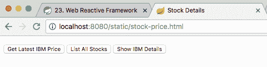

以下截图显示了单击股票列表时的屏幕：

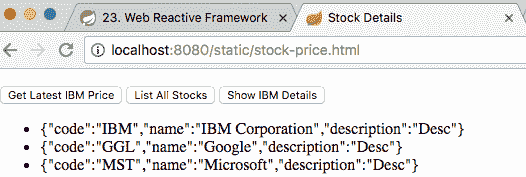

以下截图显示了单击`显示 IBM 详细信息按钮`时的屏幕：

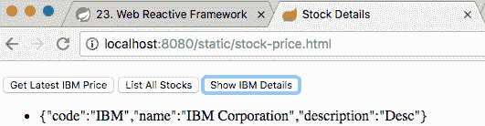

# 总结

在本章中，我们快速了解了响应式编程的世界。我们讨论了 Java 响应式世界中的重要框架--Reactive Streams、Reactor 和 Spring Web Flux。我们使用事件流实现了一个简单的网页。

响应式编程并非万能之策。虽然它可能并非所有用例的正确选择，但它是您应该评估的可能选择。它的语言、框架支持和响应式编程的使用处于初期阶段。

在下一章中，我们将继续讨论使用 Spring Framework 开发应用程序的最佳实践。
