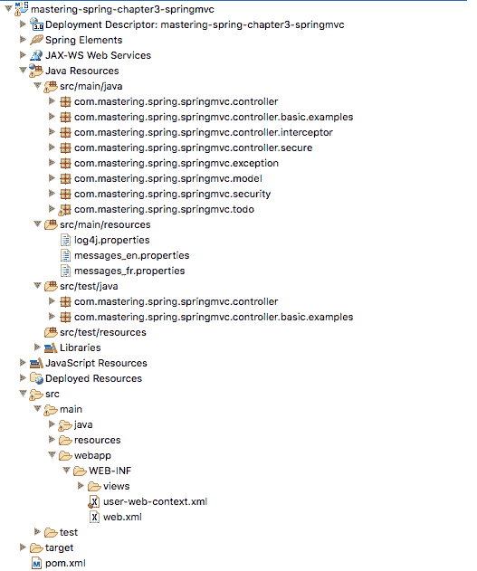
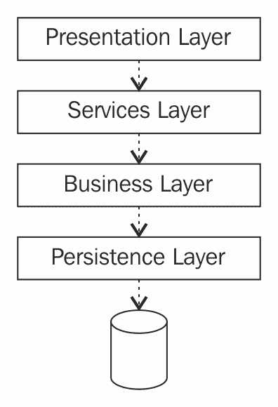
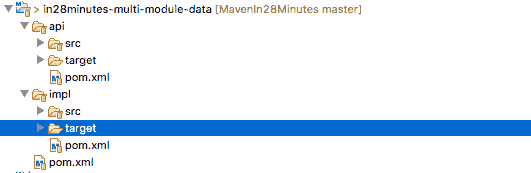
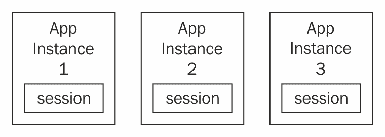
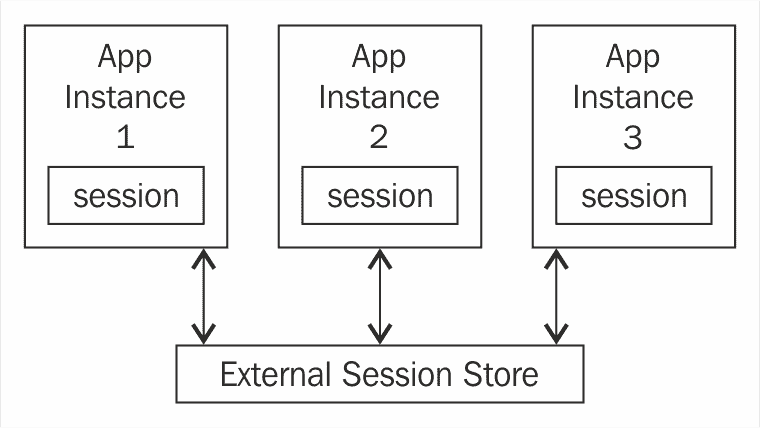

# 第十二章：Spring 最佳实践

在前几章中，我们讨论了一些 Spring 项目--Spring MVC、Spring Boot、Spring Cloud、Spring Cloud Data Flow 和 Spring Reactive。企业应用程序开发的挑战并不仅仅是选择正确的框架。最大的挑战之一是正确使用这些框架。

在本章中，我们将讨论使用 Spring 框架进行企业应用程序开发的最佳实践。我们将讨论以下相关的最佳实践：

+   企业应用程序的结构

+   Spring 配置

+   管理依赖版本

+   异常处理

+   单元测试

+   集成测试

+   会话管理

+   缓存

+   日志记录

# Maven 标准目录布局

Maven 为所有项目定义了标准目录布局。一旦所有项目采用了这种布局，开发人员就可以轻松地在项目之间切换。

以下截图显示了一个 Web 项目的示例目录布局：



以下是一些重要的标准目录：

+   `src/main/java`：所有与应用程序相关的源代码

+   `src/main/resources`：所有与应用程序相关的资源--Spring 上下文文件、属性文件、日志配置等

+   `src/main/webapp`：与 Web 应用程序相关的所有资源--视图文件（JSP、视图模板、静态内容等）

+   `src/test/java`：所有单元测试代码

+   `src/test/resources`：所有与单元测试相关的资源

# 分层架构

**关注点分离**（SoC）是核心设计目标之一。无论应用程序或微服务的大小如何，创建分层架构都是一种良好的实践。

分层架构中的每一层都有一个关注点，并且应该很好地实现它。分层应用程序还有助于简化单元测试。每个层中的代码可以通过模拟以下层来完全进行单元测试。以下图显示了典型微服务/ Web 应用程序中一些重要的层：



前面图表中显示的层如下：

+   **呈现层**：在微服务中，呈现层是 Rest 控制器所在的地方。在典型的 Web 应用程序中，该层还包含与视图相关的内容--JSP、模板和静态内容。呈现层与服务层交互。

+   **服务层**：这充当业务层的外观。不同的视图--移动、Web 和平板电脑，可能需要不同类型的数据。服务层了解它们的需求，并根据呈现层提供正确的数据。

+   **业务层**：这是所有业务逻辑的地方。另一个最佳实践是将大部分业务逻辑放入领域模型中。业务层与数据层交互以获取数据，并在其上添加业务逻辑。

+   **持久层**：负责从数据库中检索和存储数据。该层通常包含 JPA 映射或 JDBC 代码。

# 推荐实践

建议为每个层使用不同的 Spring 上下文。这有助于分离每个层的关注点。这也有助于针对特定层的单元测试代码。

应用程序`context.xml`可用于从所有层导入上下文。这可以是在应用程序运行时加载的上下文。以下是一些可能的 Spring 上下文名称：

+   `application-context.xml`

+   `presentation-context.xml`

+   `services-context.xml`

+   `business-context.xml`

+   `persistence-context.xml`

# 重要层的 API 和实现分离

确保应用程序层之间松耦合的另一个最佳实践是在每个层中拥有单独的 API 和实现模块。以下截图显示了具有两个子模块--API 和 impl 的数据层：



数据`pom.xml`定义了两个子模块：

```java
    <modules>
      <module>api</module>
      <module>impl</module>
    </modules>
```

`api`模块用于定义数据层提供的接口。`impl`模块用于创建实现。

业务层应该使用数据层的 API 进行构建。业务层不应该依赖于数据层的实现（`impl`模块）。这有助于在两个层之间创建清晰的分离。数据层的实现可以更改而不影响业务层。

以下片段显示了业务层`pom.xml`文件中的一部分内容：

```java
    <dependency>
      <groupId>com.in28minutes.example.layering</groupId>
      <artifactId>data-api</artifactId>
    </dependency>

    <dependency>
      <groupId>com.in28minutes.example.layering</groupId>
      <artifactId>data-impl</artifactId>
      <scope>runtime</scope>
    </dependency>
```

虽然`data-api`依赖项具有默认范围--compile--，但`data-impl`依赖项具有运行时范围。这确保了在编译业务层时`data-impl`模块不可用。

虽然可以为所有层实现单独的`API`和`impl`，但建议至少在业务层中使用。

# 异常处理

有两种类型的异常：

+   **已检查的异常**：当服务方法抛出此异常时，所有使用者方法应该处理或抛出异常

+   **未经检查的异常**：使用者方法不需要处理或抛出服务方法抛出的异常

`RuntimeException`及其所有子类都是未经检查的异常。所有其他异常都是已检查的异常。

已检查的异常会使您的代码难以阅读。请看以下示例：

```java
    PreparedStatement st = null;
    try {
        st = conn.prepareStatement(INSERT_TODO_QUERY);
        st.setString(1, bean.getDescription());
        st.setBoolean(2, bean.isDone());
        st.execute();
        } catch (SQLException e) {
          logger.error("Failed : " + INSERT_TODO_QUERY, e);
          } finally {
            if (st != null) {
              try {
                st.close();
                } catch (SQLException e) {
                // Ignore - nothing to do..
                }
          }
      }
```

`PreparedStatement`类中 execute 方法的声明如下所示：

```java
    boolean execute() throws SQLException
```

`SQLException`是一个已检查的异常。因此，调用`execute()`方法的任何方法都应该处理异常或抛出异常。在前面的示例中，我们使用`try-catch`块处理异常。

# Spring 对异常处理的方法

Spring 对这个问题采取了不同的方法。它使大多数异常变成了未经检查的。代码变得简单：

```java
    jdbcTemplate.update(INSERT_TODO_QUERY, 
    bean.getDescription(),bean.isDone());
```

`JDBCTemplate`中的 update 方法不声明抛出任何异常。

# 推荐的方法

我们建议采用与 Spring 框架类似的方法。在决定从方法中抛出什么异常时，始终要考虑方法的使用者。

方法的使用者是否能对异常做些什么？

在前面的示例中，如果查询执行失败，`consumer`方法将无法做任何事情，除了向用户显示错误页面。在这种情况下，我们不应该复杂化事情并强制使用者处理异常。

我们建议在应用程序中采用以下异常处理方法：

+   考虑使用者。如果方法的使用者除了记录日志或显示错误页面外无法做任何有用的事情，就将其设置为未经检查的异常。

+   在最顶层，通常是表示层，要有`catch all`异常处理来显示错误页面或向使用者发送错误响应。有关实现`catch all`异常处理的更多详细信息，请参阅第三章中的*使用 Spring MVC 构建 Web 应用程序*中的`@ControllerAdvice`。

# 保持 Spring 配置的轻量级

Spring 在注解之前的一个问题是应用程序上下文 XML 文件的大小。应用程序上下文 XML 文件有时会有数百行（有时甚至有数千行）。然而，使用注解后，就不再需要这样长的应用程序上下文 XML 文件了。

我们建议您使用组件扫描来定位和自动装配 bean，而不是在 XML 文件中手动装配 bean。保持应用程序上下文 XML 文件非常小。我们建议您在需要一些与框架相关的配置时使用 Java `@Configuration`。

# 在 ComponentScan 中使用 basePackageClasses 属性

在使用组件扫描时，建议使用`basePackageClasses`属性。以下片段显示了一个示例：

```java
    @ComponentScan(basePackageClasses = ApplicationController.class) 
    public class SomeApplication {
```

`basePackageClasses`属性是`basePackages()`的类型安全替代，用于指定要扫描注释组件的包。将扫描每个指定类的包。

这将确保即使包被重命名或移动，组件扫描也能正常工作。

# 在模式引用中不使用版本号

Spring 可以从依赖项中识别出正确的模式版本。因此，在模式引用中不再需要使用版本号。类片段显示了一个例子：

```java
    <?xml version="1.0" encoding="UTF-8"?>
    <beans 

      xsi:schemaLocation="http://www.springframework.org/schema/beans
      http://www.springframework.org/schema/beans/spring-beans.xsd
      http://www.springframework.org/schema/context/
      http://www.springframework.org/schema/context/spring-
      context.xsd">
      <!-- Other bean definitions-->
    </beans>
```

# 优先使用构造函数注入而不是 setter 注入进行强制依赖项

bean 有两种依赖项：

+   **强制依赖项**：这些是您希望对 bean 可用的依赖项。如果依赖项不可用，您希望上下文加载失败。

+   **可选依赖项**：这些是可选的依赖项。它们并不总是可用。即使这些依赖项不可用，加载上下文也是可以的。

我们建议您使用构造函数注入而不是 setter 注入来连接强制依赖项。这将确保如果缺少强制依赖项，则上下文将无法加载。以下片段显示了一个例子：

```java
    public class SomeClass {
      private MandatoryDependency mandatoryDependency
      private OptionalDependency optionalDependency;
      public SomeClass(MandatoryDependency mandatoryDependency) {
      this.mandatoryDependency = mandatoryDependency;
    }
    public void setOptionalDependency(
    OptionalDependency optionalDependency) {
      this.optionalDependency = optionalDependency;
    }
    //All other logic
   }
```

Spring 文档的摘录（[`docs.spring.io/spring/docs/current/spring-framework-reference/htmlsingle/#beans-constructor-injection`](https://docs.spring.io/spring/docs/current/spring-framework-reference/htmlsingle/#beans-constructor-injection)）如下所示：

Spring 团队通常倡导构造函数注入，因为它使我们能够将应用程序组件实现为不可变对象，并确保所需的依赖项不为空。此外，构造函数注入的组件始终以完全初始化的状态返回给客户端（调用）代码。另外，大量的构造函数参数是糟糕的代码味道，意味着该类可能具有太多的责任，应该进行重构以更好地处理关注点的分离。主要应该仅将 setter 注入用于可以在类内分配合理默认值的可选依赖项。否则，代码使用依赖项的地方必须执行非空检查。setter 注入的一个好处是 setter 方法使该类的对象能够在以后重新配置或重新注入。因此，通过[JMX MBeans](https://docs.spring.io/spring/docs/current/spring-framework-reference/htmlsingle/#jmx)进行管理是 setter 注入的一个引人注目的用例。

# 为 Spring 项目管理依赖项版本

如果您正在使用 Spring Boot，则管理依赖项版本的最简单选项是将`spring-boot-starter-parent`用作父 POM。这是我们在本书中所有项目示例中使用的选项：

```java
    <parent>
      <groupId>org.springframework.boot</groupId>
      <artifactId>spring-boot-starter-parent</artifactId>
      <version>${spring-boot.version}</version>
      <relativePath /> <!-- lookup parent from repository -->
    </parent>
```

`spring-boot-starter-parent`管理了 200 多个依赖项的版本。在 Spring Boot 发布之前，确保这些依赖项的所有版本能够很好地协同工作。以下是一些受管依赖项的版本：

```java
<activemq.version>5.14.3</activemq.version>
 <ehcache.version>2.10.3</ehcache.version>
 <elasticsearch.version>2.4.4</elasticsearch.version>
 <h2.version>1.4.193</h2.version>
 <jackson.version>2.8.7</jackson.version>
 <jersey.version>2.25.1</jersey.version>
 <junit.version>4.12</junit.version>
 <mockito.version>1.10.19</mockito.version>
 <mongodb.version>3.4.2</mongodb.version>
 <mysql.version>5.1.41</mysql.version>
 <reactor.version>2.0.8.RELEASE</reactor.version>
 <reactor-spring.version>2.0.7.RELEASE</reactor-spring.version>
 <selenium.version>2.53.1</selenium.version>
 <spring.version>4.3.7.RELEASE</spring.version>
 <spring-amqp.version>1.7.1.RELEASE</spring-amqp.version>
 <spring-cloud-connectors.version>1.2.3.RELEASE</spring-cloud-connectors.version>
 <spring-batch.version>3.0.7.RELEASE</spring-batch.version>
 <spring-hateoas.version>0.23.0.RELEASE</spring-hateoas.version>
 <spring-kafka.version>1.1.3.RELEASE</spring-kafka.version>
 <spring-restdocs.version>1.1.2.RELEASE</spring-restdocs.version>
 <spring-security.version>4.2.2.RELEASE</spring-security.version>
<thymeleaf.version>2.1.5.RELEASE</thymeleaf.version>
```

建议您不要覆盖项目 POM 文件中受管依赖项的任何版本。这样可以确保当我们升级 Spring Boot 版本时，我们将获得所有依赖项的最新版本升级。

有时，您必须使用自定义公司 POM 作为父 POM。以下片段显示了如何在这种情况下管理依赖项版本：

```java
    <dependencyManagement>
      <dependencies>
        <dependency>
          <groupId>org.springframework.boot</groupId>
          <artifactId>spring-boot-dependencies</artifactId>
          <version>${spring-boot.version}</version>
          <type>pom</type>
          <scope>import</scope>
        </dependency>
      </dependencies>
    </dependencyManagement>
```

如果您没有使用 Spring Boot，则可以使用 Spring BOM 管理所有基本的 Spring 依赖项：

```java
    <dependencyManagement>
      <dependencies>
        <dependency>
          <groupId>org.springframework</groupId>
          <artifactId>spring-framework-bom</artifactId>
          <version>${org.springframework-version}</version>
          <type>pom</type>
          <scope>import</scope>
        </dependency>
      </dependencies>
    </dependencyManagement>
```

# 单元测试

虽然单元测试的基本目的是查找缺陷，但各层编写单元测试的方法是不同的。在本节中，我们将快速查看各层的单元测试示例和最佳实践。

# 业务层

在为业务层编写测试时，我们建议您避免在单元测试中使用 Spring 框架。这将确保您的测试是框架无关的，并且运行速度更快。

以下是一个在不使用 Spring 框架的情况下编写的单元测试的示例：

```java
    @RunWith(MockitoJUnitRunner.class)
    public class BusinessServiceMockitoTest {
      private static final User DUMMY_USER = new User("dummy");
      @Mock
      private DataService dataService;
      @InjectMocks
      private BusinessService service = new BusinessServiceImpl();
      @Test
      public void testCalculateSum() {
        BDDMockito.given(dataService.retrieveData(
        Matchers.any(User.class)))
        .willReturn(Arrays.asList(
        new Data(10), new Data(15), new Data(25)));
        long sum = service.calculateSum(DUMMY_USER);
        assertEquals(10 + 15 + 25, sum);
       }
     }
```

Spring 框架用于在运行应用程序中连接依赖关系。然而，在您的单元测试中，使用`@InjectMocks` Mockito 注解与`@Mock`结合使用是最佳选择。

# Web 层

Web 层的单元测试涉及测试控制器--REST 和其他。

我们建议以下操作：

+   在构建在 Spring MVC 上的 Web 层中使用 Mock MVC

+   Jersey 测试框架是使用 Jersey 和 JAX-RS 构建的 REST 服务的不错选择

设置 Mock MVC 框架的一个快速示例如下所示：

```java
    @RunWith(SpringRunner.class)
    @WebMvcTest(TodoController.class)
    public class TodoControllerTest {
      @Autowired
      private MockMvc mvc;
      @MockBean
      private TodoService service;
      //Tests
    }
```

使用`@WebMvcTest`将允许我们使用自动装配`MockMvc`并执行 Web 请求。`@WebMVCTest`的一个很棒的特性是它只实例化控制器组件。所有其他 Spring 组件都预期被模拟，并可以使用`@MockBean`进行自动装配。

# 数据层

Spring Boot 为数据层单元测试提供了一个简单的注解`@DataJpaTest`。一个简单的示例如下所示：

```java
    @DataJpaTest
    @RunWith(SpringRunner.class)
    public class UserRepositoryTest {
      @Autowired
      UserRepository userRepository;
      @Autowired
      TestEntityManager entityManager;
     //Test Methods
    }
```

`@DataJpaTest`也可能注入一个`TestEntityManager` bean，它提供了一个专门为测试设计的替代标准 JPA `entityManager`。

如果您想在`@DataJpaTest`之外使用`TestEntityManager`，您也可以使用`@AutoConfigureTestEntityManager`注解。

数据 JPA 测试默认针对嵌入式数据库运行。这确保了测试可以运行多次而不影响数据库。

# 其他最佳实践

我们建议您遵循测试驱动开发（TDD）的方法来开发代码。在编写代码之前编写测试可以清楚地了解正在编写的代码单元的复杂性和依赖关系。根据我的经验，这会导致更好的设计和更好的代码。

我参与的最好的项目认识到单元测试比源代码更重要。应用程序会不断发展。几年前的架构今天已经是遗留的。通过拥有出色的单元测试，我们可以不断重构和改进我们的项目。

一些指导方针列如下：

+   单元测试应该易读。其他开发人员应该能够在不到 15 秒的时间内理解测试。力求编写作为代码文档的测试。

+   单元测试只有在生产代码中存在缺陷时才应该失败。这似乎很简单。然而，如果单元测试使用外部数据，它们可能会在外部数据更改时失败。随着时间的推移，开发人员对单元测试失去信心。

+   单元测试应该运行得很快。慢测试很少运行，失去了单元测试的所有好处。

+   单元测试应该作为持续集成的一部分运行。一旦在版本控制中提交，构建（包括单元测试）应该运行并在失败时通知开发人员。

# 集成测试

虽然单元测试测试特定层，但集成测试用于测试多个层中的代码。为了保持测试的可重复性，我们建议您在集成测试中使用嵌入式数据库而不是真实数据库。

我们建议您为使用嵌入式数据库的集成测试创建一个单独的配置文件。这样可以确保每个开发人员都有自己的数据库来运行测试。让我们看几个简单的例子。

`application.properties`文件：

```java
    app.profiles.active: production
```

`application-production.properties`文件：

```java
    app.jpa.database: MYSQL
    app.datasource.url: <<VALUE>>
    app.datasource.username: <<VALUE>>
    app.datasource.password: <<VALUE>>
```

`application-integration-test.properties`文件：

```java
    app.jpa.database: H2
    app.datasource.url=jdbc:h2:mem:mydb
    app.datasource.username=sa
    app.datasource.pool-size=30
```

我们需要在测试范围内包含 H2 驱动程序依赖项，如下面的代码片段所示：

```java
    <dependency>
      <groupId>mysql</groupId>
      <artifactId>mysql-connector-java</artifactId>
      <scope>runtime</scope>
   </dependency>

   <dependency>
     <groupId>com.h2database</groupId>
     <artifactId>h2</artifactId>
     <scope>test</scope>
   </dependency>
```

使用`@ActiveProfiles("integration-test")`的集成测试示例如下所示。集成测试现在将使用嵌入式数据库运行：

```java
    @ActiveProfiles("integration-test")
    @RunWith(SpringRunner.class)
    @SpringBootTest(classes = Application.class, webEnvironment =    
    SpringBootTest.WebEnvironment.RANDOM_PORT)
    public class TodoControllerIT {
      @LocalServerPort
      private int port;
      private TestRestTemplate template = new TestRestTemplate();
      //Tests
    }
```

集成测试对于能够持续交付可工作软件至关重要。Spring Boot 提供的功能使得实现集成测试变得容易。

# Spring Session

管理会话状态是分发和扩展 Web 应用程序中的重要挑战之一。HTTP 是一种无状态协议。用户与 Web 应用程序的交互状态通常在 HttpSession 中管理。

在会话中尽可能少地保存数据是很重要的。专注于识别和删除会话中不需要的数据。

考虑一个具有三个实例的分布式应用程序，如下所示。每个实例都有自己的本地会话副本：



想象一下，用户当前正在从`App Instance 1`提供服务。假设`App Instance 1`关闭，负载均衡器将用户发送到`App Instance 2`。`App Instance 2`不知道`App Instance 1`中可用的会话状态。用户必须重新登录并重新开始。这不是一个良好的用户体验。

Spring Session 提供了将会话存储外部化的功能。Spring Session 提供了将会话状态存储到不同数据存储的替代方法，而不是使用本地 HttpSession：



Spring Session 还提供了明确的关注点分离。无论使用哪种会话数据存储，应用程序代码都保持不变。我们可以通过配置在会话数据存储之间切换。

# 示例

在此示例中，我们将连接 Spring Session 以使用 Redis 会话存储。虽然将数据放入会话的代码保持不变，但数据将存储到 Redis 而不是 HTTP 会话中。

涉及三个简单的步骤：

1.  添加 Spring Session 的依赖项。

1.  配置过滤器以用 Spring Session 替换 HttpSession。

1.  通过扩展`AbstractHttpSessionApplicationInitializer`启用 Tomcat 的过滤。

# 添加 Spring Session 的依赖项

连接到 Redis 存储的 Spring Session 所需的依赖项是`spring-session-data-redis`和`lettuce-core`：

```java
    <dependency>
      <groupId>org.springframework.session</groupId>
      <artifactId>spring-session-data-redis</artifactId>
      <type>pom</type>
    </dependency>

   <dependency>
     <groupId>io.lettuce</groupId>
     <artifactId>lettuce-core</artifactId>
   </dependency>
```

# 配置过滤器以用 Spring Session 替换 HttpSession

以下配置创建了一个 Servlet 过滤器，用 Spring Session 中的会话实现替换`HTTPSession`--在此示例中为 Redis 数据存储：

```java
    @EnableRedisHttpSession 
    public class ApplicationConfiguration {
      @Bean 
      public LettuceConnectionFactory connectionFactory() {
        return new LettuceConnectionFactory(); 
      } 
   }
```

# 通过扩展 AbstractHttpSessionApplicationInitializer 启用 Tomcat 的过滤

在上一步中，需要在每个请求到 Servlet 容器（Tomcat）上启用 Servlet 过滤器。以下代码段显示了涉及的代码：

```java
    public class Initializer 
    extends AbstractHttpSessionApplicationInitializer {
      public Initializer() {
        super(ApplicationConfiguration.class); 
      }
    }
```

这就是您需要的所有配置。Spring Session 的好处在于，您的应用程序代码与`HTTPSession`通信不会改变！您可以继续使用 HttpSession 接口，但在后台，Spring Session 确保会话数据存储到外部数据存储--在此示例中为 Redis：

```java
    req.getSession().setAttribute(name, value);
```

Spring Session 提供了连接到外部会话存储的简单选项。在外部会话存储上备份会话可以确保用户即使在一个应用程序实例关闭时也能故障转移。

# 缓存

缓存是构建高性能应用程序的必要条件。您不希望一直访问外部服务或数据库。不经常更改的数据可以被缓存。

Spring 提供了透明的机制来连接和使用缓存。启用应用程序缓存涉及以下步骤：

1.  添加 Spring Boot Starter Cache 依赖项。

1.  添加缓存注释。

让我们详细讨论这些。

# 添加 Spring Boot Starter Cache 依赖项

以下代码段显示了`spring-boot-starter-cache`依赖项。它引入了配置缓存所需的所有依赖项和自动配置：

```java
    <dependency>
      <groupId>org.springframework.boot</groupId>
      <artifactId>spring-boot-starter-cache</artifactId>
    </dependency>
```

# 添加缓存注释

下一步是添加缓存注释，指示何时需要向缓存中添加或删除内容。以下代码段显示了一个示例：

```java
    @Component
    public class ExampleRepository implements Repository {
      @Override
      @Cacheable("something-cache-key")
      public Something getSomething(String id) {
          //Other code
      }
    }
```

支持的一些注释如下：

+   可缓存：用于缓存方法调用的结果。默认实现根据传递给方法的参数构造键。如果在缓存中找到值，则不会调用该方法。

+   `CachePut`：类似于 `@Cacheable`。一个重要的区别是该方法总是被调用，并且结果被放入缓存中。

+   `CacheEvict`：触发从缓存中清除特定元素。通常在元素被删除或更新时执行。

关于 Spring 缓存的另外一些重要事项如下：

+   默认使用的缓存是 ConcurrentHashMap

+   Spring 缓存抽象符合 JSR-107 标准

+   可以自动配置的其他缓存包括 EhCache、Redis 和 Hazelcast

# 日志记录

Spring 和 Spring Boot 依赖于 Commons Logging API。它们不依赖于任何其他日志记录框架。Spring Boot 提供了 starter 来简化特定日志记录框架的配置。

# Logback

Starter `spring-boot-starter-logging` 是使用 Logback 框架所需的全部内容。这个依赖是大多数 starter 中包含的默认日志记录。包括 `spring-boot-starter-web`。依赖关系如下所示：

```java
    <dependency>
      <groupId>org.springframework.boot</groupId>
      <artifactId>spring-boot-starter-logging</artifactId>
    </dependency>
```

以下片段显示了 `spring-boot-starter-logging` 中包含的 logback 和相关依赖项：

```java
    <dependency>
      <groupId>ch.qos.logback</groupId>
      <artifactId>logback-classic</artifactId>
    </dependency>

    <dependency>
      <groupId>org.slf4j</groupId>
      <artifactId>jcl-over-slf4j</artifactId>
    </dependency>

    <dependency>
      <groupId>org.slf4j</groupId>
      <artifactId>jul-to-slf4j</artifactId>
    </dependency>

    <dependency>
      <groupId>org.slf4j</groupId>
      <artifactId>log4j-over-slf4j</artifactId>
    </dependency>
```

# Log4j2

要使用 Log4j2，我们需要使用 starter `spring-boot-starter-log4j2`。当我们使用 `spring-boot-starter-web` 等 starter 时，我们需要确保在 `spring-boot-starter-logging` 中排除该依赖项。以下片段显示了详细信息：

```java
    <dependency>
      <groupId>org.springframework.boot</groupId>
      <artifactId>spring-boot-starter</artifactId>
      <exclusions>
        <exclusion>
          <groupId>org.springframework.boot</groupId>
          <artifactId>spring-boot-starter-logging</artifactId>
        </exclusion>
       </exclusions>
    </dependency>

    <dependency>
      <groupId>org.springframework.boot</groupId>
      <artifactId>spring-boot-starter-log4j2</artifactId>
    </dependency>
```

以下片段显示了 `spring-boot-starter-log4j2` starter 中使用的依赖项：

```java
    <dependency>
      <groupId>org.apache.logging.log4j</groupId>
      <artifactId>log4j-slf4j-impl</artifactId>
    </dependency>

   <dependency>
     <groupId>org.apache.logging.log4j</groupId>
     <artifactId>log4j-api</artifactId>
   </dependency>

   <dependency>
     <groupId>org.apache.logging.log4j</groupId>
     <artifactId>log4j-core</artifactId>
   </dependency>

  <dependency>
    <groupId>org.slf4j</groupId>
    <artifactId>jul-to-slf4j</artifactId>
  </dependency>
```

# 框架独立配置

无论使用哪种日志记录框架，Spring Boot 都允许在应用程序属性中进行一些基本配置选项。一些示例如下所示：

```java
   logging.level.org.springframework.web=DEBUG
   logging.level.org.hibernate=ERROR 
   logging.file=<<PATH_TO_LOG_FILE>>
```

在微服务时代，无论您使用哪种框架进行日志记录，我们建议您将日志记录到控制台（而不是文件），并使用集中式日志存储工具来捕获所有微服务实例的日志。

# 摘要

在本章中，我们介绍了开发基于 Spring 的应用程序的一些最佳实践。我们涵盖了在项目结构化方面的最佳实践--分层、遵循 Maven 标准目录布局，并使用`api`和 implementation 模块。我们还讨论了如何将 Spring 配置保持最小化的最佳实践。我们还讨论了与日志记录、缓存、会话管理和异常处理相关的最佳实践。
