# 第十三章：在 Spring 中使用 Kotlin

Kotlin 是一种静态类型的 JVM 语言，可以编写富有表现力、简短和可读的代码。Spring Framework 5.0 对 Kotlin 有很好的支持。

在本章中，我们将探讨 Kotlin 的一些重要特性，并学习如何使用 Kotlin 和 Spring Boot 创建基本的 REST 服务。

通过本章，您将了解以下内容：

+   Kotlin 是什么？

+   它与 Java 相比如何？

+   如何在 Eclipse 中创建 Kotlin 项目？

+   如何在 Spring Boot 中创建一个 Kotlin 项目？

+   如何使用 Kotlin 实现和单元测试一个简单的 Spring Boot REST 服务？

# Kotlin

Kotlin 是一种开源的静态类型语言，可用于构建在 JVM、Android 和 JavaScript 平台上运行的应用程序。Kotlin 由 JetBrains 在 Apache 2.0 许可下开发，源代码可在 GitHub 上获得（[`github.com/jetbrains/kotlin`](https://github.com/jetbrains/kotlin)）。

以下是 Kotlin 的首席语言设计师 Andrey Breslav 的一些引用。这些引用有助于我们了解 Kotlin 背后的思维过程：

<q>Project Kotlin 的主要目的是为开发人员创建一种通用语言，可以作为一种安全、简洁、灵活且 100%兼容 Java 的有用工具。</q>

Kotlin 旨在成为一种工业级的面向对象语言，并且比 Java 更好，但仍然可以完全与 Java 代码互操作，允许公司逐步从 Java 迁移到 Kotlin。

Kotlin 是 Android 支持的官方语言之一。官方的 Android 开发者页面为 Kotlin（[`developer.android.com/kotlin/index.html`](https://developer.android.com/kotlin/index.html)）强调了 Kotlin 为何迅速受到开发人员欢迎的重要原因：

Kotlin 是一种富有表现力、简洁、可扩展、强大且令人愉悦的阅读和编写的语言。它在空值和不可变性方面具有出色的安全功能，这与我们的投资相一致，使 Android 应用默认情况下健康且性能良好。最重要的是，它与我们现有的 Android 语言和运行时是可互操作的。

Kotlin 的一些重要内容包括以下内容：

+   与 Java 完全兼容。您可以从 Kotlin 调用 Java 代码，反之亦然。

+   简洁且易读的语言。Kotlin FAQ（[`kotlinlang.org/docs/reference/faq.html`](http://kotlinlang.org/docs/reference/faq.html)）估计代码行数减少了 40%。

+   支持函数式和面向对象编程。

+   IntelliJ IDEA、Android Studio、Eclipse 和 NetBeans 是支持 Kotlin 的 IDE。虽然支持程度不及 Java，但每天都在改进。

+   所有主要的构建工具——Gradle、Maven 和 Ant——都支持构建 Kotlin 项目。

# Kotlin 与 Java 的比较

Java 是由 Sun Microsystems 的 James Gosling 开发并于 1995 年发布的。至今已经保持了 20 多年的流行。

Java 受欢迎的一个重要原因是 Java 平台，包括 Java 虚拟机（JVM）。Java 平台为 Java 语言提供了安全性和可移植性。在过去几年中出现了许多旨在利用 Java 平台优势的语言。它们编译为字节码，可以在 JVM 上运行。这些语言包括以下框架：

+   Clojure

+   Groovy

+   Scala

+   JRuby

+   Jython

Kotlin 旨在解决 Java 语言中的一些重要问题，并提供简洁的替代方案。与 Java 语言的一些重要区别如下。

# 变量和类型推断

Kotlin 从赋给它的值推断变量的类型。在以下示例中，`intVariable`被赋予了`Int`类型：

```java
    //Type Inference
    var intVariable = 10
```

由于 Kotlin 是类型安全的，如果取消注释以下代码片段，将导致编译错误：

```java
    //intVariable = "String" 
    //If uncommented -> Type mismatch: 
    //inferred type is String but Int was expected
```

# 变量和不可变性

通常，像其他所有编程语言一样，变量的值可以更改。以下代码片段显示了一个例子：

```java
    var variable = 5
    variable = 6 //You can change value
```

但是，如果使用`val`（而不是`var`）来定义变量，那么变量是不可变的。变量的值不能被改变。这类似于 Java 中的`final`变量。考虑以下代码：

```java
    val immutable = 6
    //immutable = 7 //Val cannot be reassigned
```

# 类型系统

在 Kotlin 中，一切都是对象。没有原始变量。

以下是重要的数字类型：

+   双精度--64 位

+   浮点型--32 位

+   长整型--64 位

+   整型--32 位

+   短整型--16 位

+   字节--8 位

与 Java 不同，Kotlin 不将字符视为数字类型。对字符的任何数字操作都将导致编译错误。考虑以下代码：

```java
    var char = 'c'
    //Operator '==' cannot be applied to 'Char' and 'Int'
    //if(char==1) print (char);
    Null safety
```

Java 程序员非常熟悉`java.lang.NullPointerException`。对空对象变量执行的任何操作都会抛出`NullPointerException`。

Kotlin 的类型系统旨在消除`空指针异常`。普通变量不能持有 null。如果取消注释，以下代码片段将无法编译：

```java
    var string: String = "abc"
    //string = null //Compilation Error
```

为了能够在变量中存储 null，需要使用特殊声明。即，类型后跟一个?。例如，考虑以下`String?`：

```java
    var nullableString: String? = "abc"
    nullableString = null
```

一旦变量声明为可空，只允许安全的(?)或非空断言(!!.)调用。直接引用将导致编译错误

```java
    //Compilation Error
    //print(nullableString.length)
    if (nullableString != null) {
      print(nullableString.length)
     }
    print(nullableString?.length)
```

# 函数

在 Kotlin 中，使用`fun`关键字声明函数。以下代码片段显示了一个例子：

```java
    fun helloBasic(name: String): String {
      return "Hello, $name!"
    }
```

函数参数在函数名后的括号中指定。`name`是`String`类型的参数。返回类型在参数后指定。函数的返回类型是`String`。

以下代码行显示了对`helloBasic`函数的调用：

```java
    println(helloBasic("foo")) // => Hello, foo!
```

Kotlin 还允许 n。以下代码行显示了一个例子：

```java
    println(helloBasic(name = "bar"))
```

函数参数可以选择具有默认值

```java
    fun helloWithDefaultValue(name: String = "World"): String {
      return "Hello, $name!"
    }
```

以下代码行显示了对`helloWithDefaultValue`函数的调用，而不指定任何参数。使用了 name 参数的默认值：

```java
    println(helloWithDefaultValue()) //Hello, World
```

如果一个函数只有一个表达式，那么它可以在一行上定义。`helloWithOneExpression`函数是`helloWithDefaultValue`函数的简化版本。返回类型从值中推断出来

```java
    fun helloWithOneExpression(name: String = "world") 
    = "Hello, $name!"
```

返回 void 并且只有一个表达式的函数也可以在一行上定义。以下代码片段显示了一个例子：

```java
    fun printHello(name: String = "world") 
    = println("Hello, $name!")
```

# 数组

在 Kotlin 中，数组由`Array`类表示。以下代码片段显示了`Array`类中的一些重要属性和方法：

```java
    class Array<T> private constructor() {
      val size: Int
      operator fun get(index: Int): T
      operator fun set(index: Int, value: T): Unit
      operator fun iterator(): Iterator<T>
      // ...
     }
```

可以使用`intArrayOf`函数创建数组

```java
    val intArray = intArrayOf(1, 2, 10)
```

以下代码片段显示了可以在数组上执行的一些重要操作：

```java
    println(intArray[0])//1
    println(intArray.get(0))//1
    println(intArray.all { it > 5 }) //false
    println(intArray.any { it > 5 }) //true
    println(intArray.asList())//[1, 2, 10]
    println(intArray.max())//10
    println(intArray.min())//1
```

# 集合

Kotlin 有简单的函数来初始化集合。以下代码行显示了初始化列表的示例：

```java
    val countries = listOf("India", "China", "USA")
```

以下代码片段显示了可以在列表上执行的一些重要操作：

```java
    println(countries.size)//3
    println(countries.first())//India
    println(countries.last())//USA
    println(countries[2])//USA
```

在 Kotlin 中，使用`listOf`创建的列表是不可变的。要能够更改列表的内容，需要使用`mutableListOf`函数

```java
    //countries.add("China") //Not allowed
    val mutableContries = mutableListOf("India", "China", "USA")
    mutableContries.add("China")
```

`mapOf`函数用于初始化地图，如下面的代码片段所示：

```java
    val characterOccurances = 
    mapOf("a" to 1, "h" to 1, "p" to 2, "y" to 1)//happy
    println(characterOccurances)//{a=1, h=1, p=2, y=1}
```

以下代码行显示了检索特定键的值：

```java
    println(characterOccurances["p"])//2
```

地图可以在循环中解构为其键值组成部分。以下代码行显示了详细信息：

```java
    for ((key, value) in characterOccurances) {
      println("$key -> $value")
    }
```

# 没有 c

在 Java 中，必须处理或重新抛出已检查的异常。这导致了许多不必要的代码。以下示例显示了如何处理`try catch`块抛出的`new FileReader("pathToFile") - throws FileNotFoundException`和`reader.read() - throws IOException`的已检查异常：

```java
    public void openSomeFileInJava(){
      try {
            FileReader reader = new FileReader("pathToFile");
            int i=0;
            while(i != -1){
              i = reader.read();
              //Do something with what was read
            }
      reader.close();
      } catch (FileNotFoundException e) {
           //Exception handling code
        } catch (IOException e) {
        //Exception handling code
      }
    }
```

Kotlin 没有任何已检查的异常。由客户端代码决定是否要处理异常。客户端不强制进行异常处理。

# 数据类

通常，我们会创建许多 bean 类来保存数据。Kotlin 引入了数据类的概念。以下代码块显示了数据类的声明：

```java
    data class Address(val line1: String,
    val line2: String,
    val zipCode: Int,
    val state: String,
    val country: String)
```

Kotlin 提供了主构造函数、`equals()`、`hashcode()`和一些其他用于数据类的实用方法。以下代码显示了使用构造函数创建对象：

```java
    val myAddress = Address("234, Some Apartments", 
    "River Valley Street", 54123, "NJ", "USA")
```

Kotlin 还提供了`toString`：

```java
    println(myAddress)
    //Address(line1=234, Some Apartments, line2=River Valley 
    //Street, zipCode=54123, state=NJ, country=USA)
```

`copy`函数可以用来复制（克隆）现有的数据类对象。以下代码片段显示了细节：

```java
    val myFriendsAddress = myAddress.copy(line1 = "245, Some Apartments")
    println(myFriendsAddress)
    //Address(line1=245, Some Apartments, line2=River Valley 
    //Street, zipCode=54123, state=NJ, country=USA)
```

数据类的对象可以很容易地被解构。以下代码显示了细节。`println`使用字符串模板来打印值：

```java
    val (line1, line2, zipCode, state, country) = myAddress;
tln("$line1 $line2 $zipCode $state $country"); 
    //234, Some Apartments River Valley Street 54123 NJ USA
```

# 在 Eclipse 中创建一个 Kotlin 项目

在 Eclipse 中使用 Kotlin 之前，我们需要在 Eclipse 中安装 Kotlin 插件。

# Kotlin 插件

Kotlin 插件可以从[`marketplace.eclipse.org/content/kotlin-plugin-eclipse`](https://marketplace.eclipse.org/content/kotlin-plugin-eclipse)安装。点击以下截图中的安装按钮：

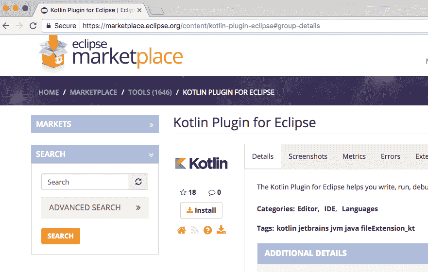

选择 Kotlin 插件并点击确认按钮，如下截图所示：

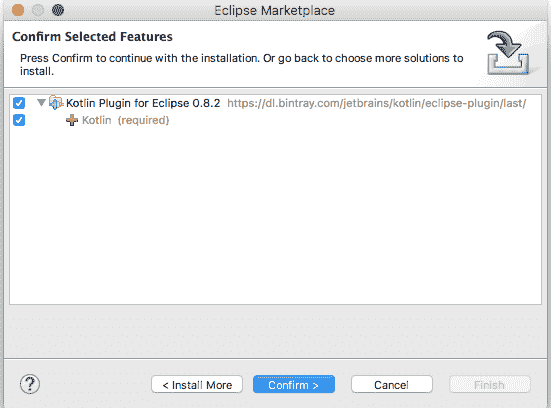

接受后续步骤中的默认设置来安装插件。安装需要一些时间。安装插件完成后重新启动 Eclipse。

# 创建一个 Kotlin 项目

现在让我们创建一个新的 Kotlin 项目。在 Eclipse 中，点击文件 | 新建 | 项目...，如下截图所示：

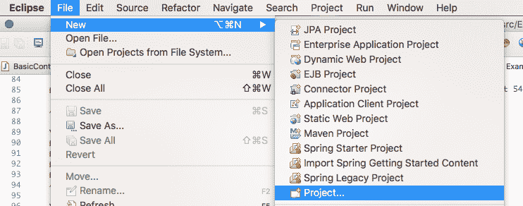

从列表中选择 Kotlin 项目。

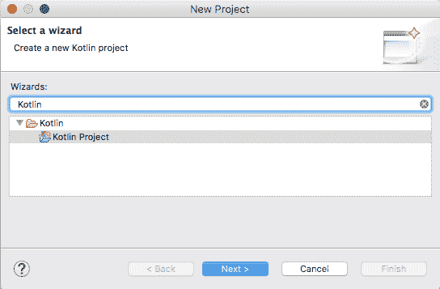

将`Kotlin-Hello-World`作为项目名称，接受所有默认设置，然后点击完成。Eclipse 将创建一个新的 Kotlin 项目。

以下截图显示了典型 Kotlin 项目的结构。项目中都有`Kotlin Runtime Library`和`JRE System Library`。

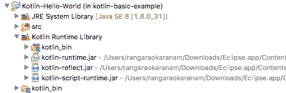

# 创建一个 Kotlin 类

要创建一个新的 Kotlin 类，右键单击文件夹，然后选择新建 | 其他，如下截图所示：

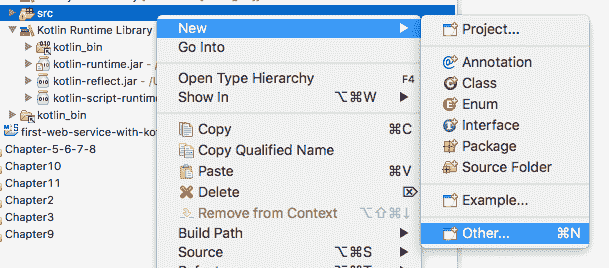

选择类，如下截图所示：

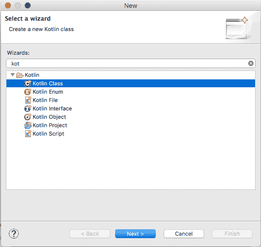

给你的新 Kotlin 类起一个名字（`HelloWorld`）和一个包（`com.mastering.spring.kotlin.first`）。点击完成。

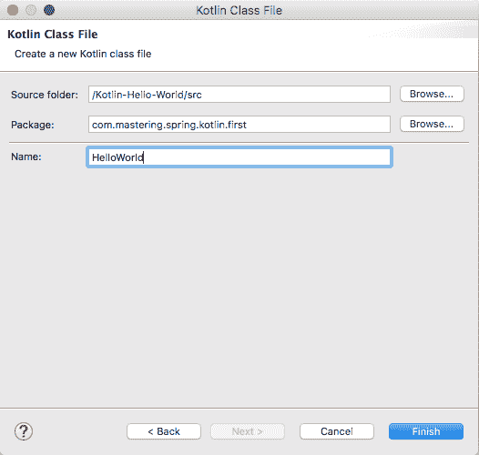

创建一个 main 函数，如下代码所示：

```java
    fun main(args: Array<String>) {
      println("Hello, world!")
    }
```

# 运行 Kotlin 类

右键单击`HelloWorld.kt`文件，然后点击运行为 | tlin，如下截图所示：

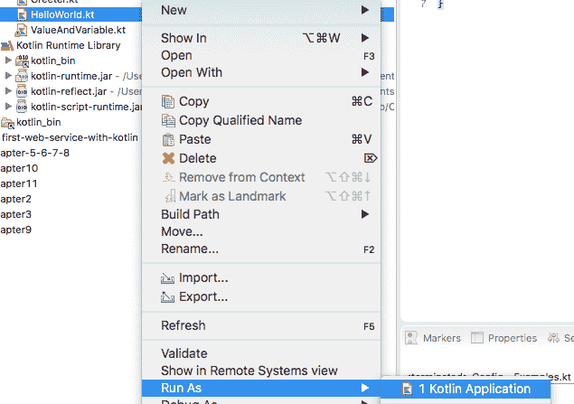

`Hello, World`在控制台上打印出来，如下所示：

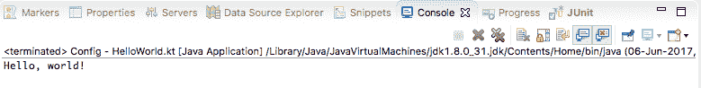

# 使用 Kotlin 创建 Spring Boot 项目

我们将使用 Spring Initializr（[`start.spring.io`](http://start.spring.io)）来初始化一个 Kotlin 项目。以下截图显示了要选择的 Group 和 ArtifactId：

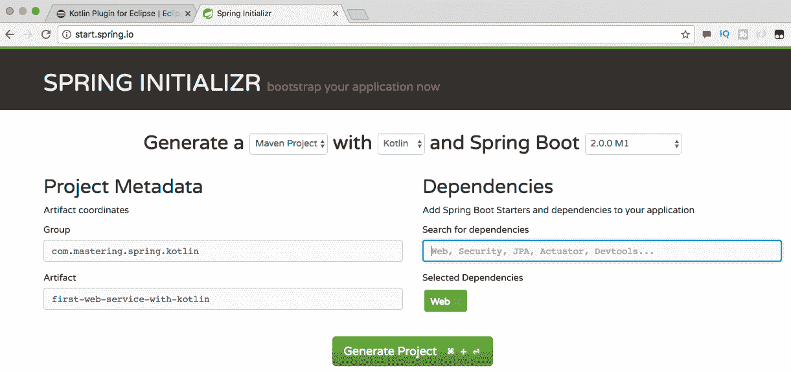

以下是一些重要的事项：

+   选择 Web 作为依赖

+   选择 Kotlin 作为语言（截图顶部的第二个下拉菜单）

+   点击生成项目并将下载的项目导入 Eclipse 作为 Maven 项目

以下截图显示了生成项目的结构：

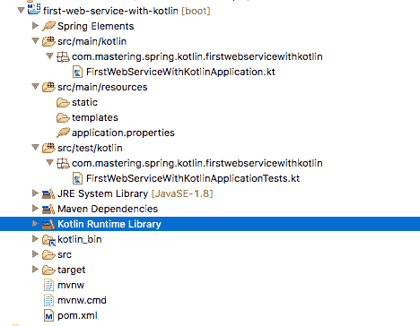

以下是一些重要的事项：

+   `src/main/kotlin`：这是所有 Kotlin 源代码的文件夹。这类似于 Java 项目中的`src/main/java`。

+   `src/test/kotlin`：这是所有 Kotlin 测试代码的文件夹。这类似于 Java 项目中的`src/test/java`。

+   资源文件夹与典型的 Java 项目相同--`src/main/resources`和`src/test/resources`。

+   Kotlin 运行库用作执行环境，而不是 JRE。

# 依赖和插件

除了 Java Spring Boot 项目中的常规依赖项外，`pom.xml`中还有两个额外的依赖项。

```java
    <dependency>
      <groupId>org.jetbrains.kotlin</groupId>
      <artifactId>kotlin-stdlib-jre8</artifactId>
      <version>${kotlin.version}</version>
    </dependency>

    <dependency>
      <groupId>org.jetbrains.kotlin</groupId>
      <artifactId>kotlin-reflect</artifactId>
      <version>${kotlin.version}</version>
    </dependency>
```

以下是一些重要事项需要注意：

+   `kotlin-stdlib-jre8`是支持 Java 8 中添加的新 JDK API 的标准库。

+   `kotlin-reflect`是在 Java 平台上使用反射功能的运行时组件

除了`spring-boot-maven-plugin`，`kotlin-maven-plugin`也作为`pom.xml`中的插件添加。`kotlin-maven-plugin`编译 Kotlin 源代码和模块。该插件配置为在`compile`和`test-compile`阶段使用。以下代码显示了详细信息：

```java
    <plugin>
     <artifactId>kotlin-maven-plugin</artifactId>
     <groupId>org.jetbrains.kotlin</groupId>
     <version>${kotlin.version}</version>
     <configuration>
       <compilerPlugins>
         <plugin>spring</plugin>
       </compilerPlugins>
       <jvmTarget>1.8</jvmTarget>
     </configuration>
    <executions>
    <execution>
      <id>compile</id>
      <phase>compile</phase>
      <goals>
        <goal>compile</goal>
      </goals>
    </execution>
    <execution>
      <id>test-compile</id>
      <phase>test-compile</phase>
      <goals>
        <goal>test-compile</goal>
      </goals>
     </execution>
    </executions>
    <dependencies>
      <dependency>
        <groupId>org.jetbrains.kotlin</groupId>
        <artifactId>kotlin-maven-allopen</artifactId>
        <version>${kotlin.version}</version>
       </dependency>
    </dependencies>
   </plugin>
```

# Spring Boot 应用程序类

以下代码块显示了生成的`SpringBootApplication`类`FirstWebServiceWithKotlinApplication`。我们将该类设置为开放以使 Spring Boot 能够覆盖它：

```java
    @SpringBootApplication
    open class FirstWebServiceWithKotlinApplication
    fun main(args: Array<String>) {
      SpringApplication
      .run(
         FirstWebServiceWithKotlinApplication::class.java,
         *args)
    }
```

以下是一些重要事项需要注意：

+   包、导入和注解与 Java 类相同。

+   在 Java 中，主函数的声明是`public static void main(String[] args)`。在上面的示例中，我们使用了 Kotlin 函数语法。Kotlin 没有静态方法。在类外声明的任何函数都可以在不需要类引用的情况下调用。

+   在 Java 中启动`SpringApplication`是使用`SpringApplication.run(FirstWebServiceWithKotlinApplication.class, args)`完成的。

+   `::`用于获取 Kotlin 类的运行时引用。因此，`FirstWebServiceWithKotlinApplication::class`给我们提供了对 Kotlin 类的运行时引用。要获取 Java 类引用，我们需要在引用上使用`.java`属性。因此，在 Kotlin 中，语法是`FirstWebServiceWithKotlinApplication::class.java`。

+   在 Kotlin 中，`*`被称为扩展操作符。当将数组传递给接受可变参数的函数时使用。因此，我们将使用`*args`将数组传递给`run`方法。

该应用程序可以通过将`FirstWebServiceWithKotlinApplication`作为 Kotlin 应用程序运行来启动。

# Spring Boot 应用程序测试类

以下代码片段显示了生成的`SpringBootApplicationTest`类`FirstWebServiceWithKotlinApplicationTests`：

```java
    @RunWith(SpringRunner::class)
    @SpringBootTest
    class FirstWebServiceWithKotlinApplicationTests {
      @Test
      fun contextLoads() {
      }
    }
```

以下是一些重要事项需要注意：

+   包、导入和注解与 Java 类相同。

+   `::`用于获取 Kotlin 类的运行时引用。与 Java 中的`@RunWith(SpringRunner.class)`相比，Kotlin 代码使用`@RunWith(SpringRunner::class)`。

+   测试类的声明使用了 Kotlin 函数语法。

# 使用 Kotlin 实现 REST 服务

我们将首先创建一个返回硬编码字符串的服务。之后，我们将讨论返回适当的 JSON 响应的示例。我们还将看一个传递路径参数的示例。

# 返回字符串的简单方法

让我们从创建一个简单的 REST 服务返回`welcome`消息开始：

```java
    @RestController
    class BasicController {
      @GetMapping("/welcome")
      fun welcome() = "Hello World"
    }
```

以下是一个可比较的 Java 方法。一个主要的区别是我们如何能够在 Kotlin 中一行定义一个函数--`fun welcome() = "Hello World"`：

```java
    @GetMapping("/welcome")
    public String welcome() {
      return "Hello World";
    }
```

如果我们将`FirstWebServiceWithKotlinApplication.kt`作为 Kotlin 应用程序运行，它将启动嵌入式 Tomcat 容器。我们可以在浏览器中启动 URL(`http://localhost:8080/welcome`)，如下图所示：

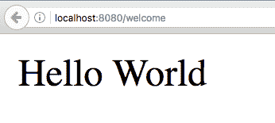

# 单元测试

让我们快速编写一个单元测试来测试前面的控制器方法：

```java
    @RunWith(SpringRunner::class)
    @WebMvcTest(BasicController::class)
    class BasicControllerTest {
      @Autowired
      lateinit var mvc: MockMvc;
      @Test
      fun `GET welcome returns "Hello World"`() {
        mvc.perform(
           MockMvcRequestBuilders.get("/welcome").accept(
           MediaType.APPLICATION_JSON))
           .andExpect(status().isOk())
           .andExpect(content().string(equalTo("Hello World")));
       } 
     }
```

在上述单元测试中，我们将使用`BasicController`启动一个 Mock MVC 实例。以下是一些需要注意的快速事项：

+   注解`@RunWith(SpringRunner.class)`和`@WebMvcTest(BasicController::class)`与 Java 类似，只是类引用不同。

+   `@Autowired lateinit var mvc: MockMvc`: 这样自动装配了`MockMvc` bean，可以用于发出请求。声明为非空的属性必须在构造函数中初始化。对于通过依赖注入自动装配的属性，我们可以通过在变量声明中添加`lateinit`来避免空值检查。

+   `fun `GET welcome returns "Hello World"`()`: 这是 Kotlin 的一个独特特性。我们不是给测试方法命名，而是给测试添加一个描述。这很棒，因为理想情况下，测试方法不会被其他方法调用。

+   `mvc.perform(MockMvcRequestBuilders.get("/welcome").accept(MediaType.APPLICATION_JSON))`: 这执行了一个带有 Accept 头值`application/json`的`/welcome`请求，这与 Java 代码类似。

+   `andExpect(status().isOk())`: 这期望响应的状态是`200`（成功）。

+   `andExpect(content().string(equalTo("Hello World")))`: 这期望响应的内容等于`"Hello World"`。

# 集成测试

当我们进行集成测试时，我们希望启动嵌入式服务器，并配置所有的控制器和 bean。以下代码块展示了我们如何创建一个简单的集成测试：

```java
    @RunWith(SpringRunner::class)
    @SpringBootTest(webEnvironment = SpringBootTest.WebEnvironment.RANDOM_PORT)
    class BasicControllerIT {
      @Autowired
      lateinit var restTemplate: TestRestTemplate
      @Test
      fun `GET welcome returns "Hello World"`() {
        // When
        val body = restTemplate.getForObject("/welcome", 
        String::class.java)
        // Then
        assertThat(body).isEqualTo("Hello World")
      }
    }
```

以下是一些重要事项需要注意：

+   `@RunWith(SpringRunner::class), @SpringBootTest(webEnvironment = SpringBootTest.WebEnvironment.RANDOM_PORT)`: `SpringBootTest`在 Spring `TestContext`的基础上提供了额外的功能。它支持配置完全运行容器和 TestRestTemplate（用于执行请求）的端口。这与 Java 代码类似，只是类引用不同。

+   `@Autowired lateinit var restTemplate: TestRestTemplate`: `TestRestTemplate`通常用于集成测试。它在`RestTemplate`的基础上提供了额外的功能，特别适用于测试上下文的集成。它不会遵循重定向，这样我们就可以断言响应位置。`lateinit`允许我们避免对自动装配变量进行空值检查。

# 返回对象的简单 REST 方法

我们将创建一个简单的 POJO `WelcomeBean`，其中包含一个名为 message 的成员字段和一个参数构造函数，如下面的代码行所示：

```java
    data class WelcomeBean(val message: String = "")
```

相应的 Java 类列在下面：

```java
    public class WelcomeBean {
      private String message;
      public WelcomeBean(String message) {
        super();
        this.message = message;
      }
      public String getMessage() {
      return message;
     }
   }
```

Kotlin 会自动为数据类添加构造函数和其他实用方法。

在之前的方法中，我们返回了一个字符串。让我们创建一个返回正确的 JSON 响应的方法。看一下下面的方法：

```java
    @GetMapping("/welcome-with-object")
    fun welcomeWithObject() = WelcomeBean("Hello World")
```

该方法返回一个简单的`WelcomeBean`，其中包含一个`"Hello World"`的消息。

# 执行请求

让我们发送一个测试请求，看看我们得到什么响应。以下截图显示了输出：

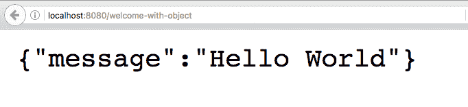

`http://localhost:8080/welcome-with-object` URL 的响应如下所示：

```java
    {"message":"Hello World"}
```

# 单元测试

让我们快速编写一个单元测试，检查 JSON 响应，然后将测试添加到`BasicControllerTest`中：

```java
    @Test
    fun `GET welcome-with-object returns "Hello World"`() {
      mvc.perform(
      MockMvcRequestBuilders.get("/welcome-with-object")
      .accept(MediaType.APPLICATION_JSON))
      .andExpect(status().isOk())
      .andExpect(content().string(
      containsString("Hello World")));
    }
```

这个测试与之前的单元测试非常相似，不同之处在于我们使用`containsString`来检查内容是否包含`"Hello World"`子字符串。

# 集成测试

让我们把注意力转移到编写一个集成测试，然后在`BasicControllerIT`中添加一个方法，如下面的代码片段所示：

```java
    @Test
    fun `GET welcome-with-object returns "Hello World"`() {
      // When
      val body = restTemplate.getForObject("/welcome-with-object",
      WelcomeBean::class.java)
      // Then
     assertThat(body.message, containsString("Hello World"));
   }
```

这个方法类似于之前的集成测试，不同之处在于我们在`assertThat`方法中断言一个子字符串。

# 带有路径变量的 GET 方法

让我们把注意力转移到路径变量。路径变量用于将 URI 中的值绑定到控制器方法上的变量。在下面的例子中，我们想要对名称进行参数化，以便我们可以使用名称定制欢迎消息：

```java
    @GetMapping("/welcome-with-parameter/name/{name}")
    fun welcomeWithParameter(@PathVariable name: String) = 
    WelcomeBean("Hello World, $name")
```

以下是一些重要事项需要注意：

+   `@GetMapping("/welcome-with-parameter/name/{name}")`: `{name}`表示这个值将是变量。我们可以在 URI 中有多个变量模板。

+   `welcomeWithParameter(@PathVariable String name)`: `@PathVariable` 确保来自 URI 的变量值绑定到变量名。

+   `fun welcomeWithParameter(@PathVariable name: String) = WelcomeBean("Hello World, $name")`: 我们使用 Kotlin 的单表达式函数声明直接返回创建的 `WelcomeBean`。`"Hello World, $name"` 使用了 Kotlin 字符串模板。`$name` 将被路径变量 name 的值替换。

# 执行请求

让我们发送一个测试请求，看看我们得到什么响应。以下截图显示了响应：

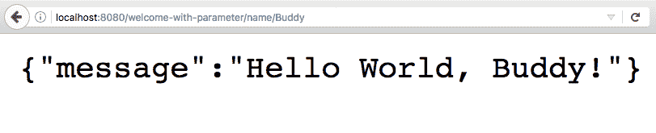

`http://localhost:8080/welcome-with-parameter/name/Buddy` URL 的响应如下：

```java
    {"message":"Hello World, Buddy!"}
```

正如预期的那样，URI 中的名称用于形成响应中的消息。

# 单元测试

让我们快速为上述方法编写一个单元测试。我们将要在 URI 的一部分中传递一个名称，并检查响应是否包含该名称。以下代码显示了我们如何做到这一点：

```java
    @Test
    fun `GET welcome-with-parameter returns "Hello World, Buddy"`() {
      mvc.perform(
      MockMvcRequestBuilders.get(
      "/welcome-with-parameter/name/Buddy")
     .accept(MediaType.APPLICATION_JSON))
     .andExpect(status().isOk())
     .andExpect(content().string(
     containsString("Hello World, Buddy")));
    }
```

需要注意的几个重要事项如下：

+   `MockMvcRequestBuilders.get("/welcome-with-parameter/name/Buddy")`: 这与 URI 中的变量模板匹配。我们将传入名称 `Buddy`。

+   `.andExpect(content().string(containsString("Hello World, Buddy")))`: 我们期望响应包含带有名称的消息。

# 集成测试

上述方法的集成测试非常简单。看一下以下的 `test` 方法：

```java
   @Test
   fun `GET welcome-with-parameter returns "Hello World"`() {
     // When
     val body = restTemplate.getForObject(
     "/welcome-with-parameter/name/Buddy", 
     WelcomeBean::class.java)
     // Then
    assertThat(body.message, 
    containsString("Hello World, Buddy"));
   }
```

需要注意的几个重要事项如下：

+   `restTemplate.getForObject("/welcome-with-parameter/name/Buddy", WelcomeBean::class.java)`: 这与 URI 中的变量模板匹配。我们传入名称 `Buddy`。

+   `assertThat(response.getBody(), containsString("Hello World, Buddy"))`: 我们期望响应包含带有名称的消息。

在本节中，我们了解了使用 Spring Boot 创建简单 REST 服务的基础知识。我们还确保了我们有良好的单元测试和集成测试。

# 总结

Kotlin 帮助开发人员编写简洁、可读的代码。它与 Spring Boot 的理念完美契合，使应用程序开发更加简单快速。

在本章中，我们从理解 Kotlin 及其与 Java 的比较开始。我们使用 Spring Boot 和 Kotlin 构建了一些简单的 REST 服务。我们看到了 Kotlin 用于服务和单元测试的代码是简洁的示例。

Kotlin 在过去几年取得了巨大进步--成为 Android 官方支持的语言是一个很好的第一步。Spring Framework 5.0 对 Kotlin 的支持是锦上添花。Kotlin 的未来取决于它在更大的 Java 开发社区中的成功程度。它有潜力成为你工具库中的重要工具。
