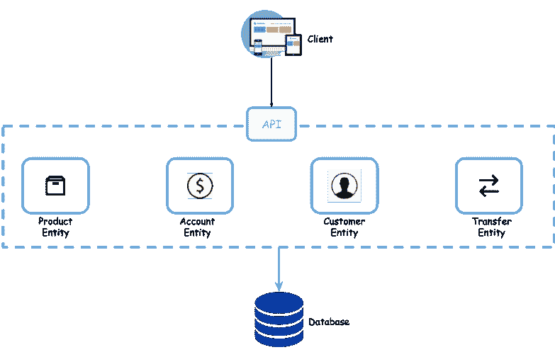
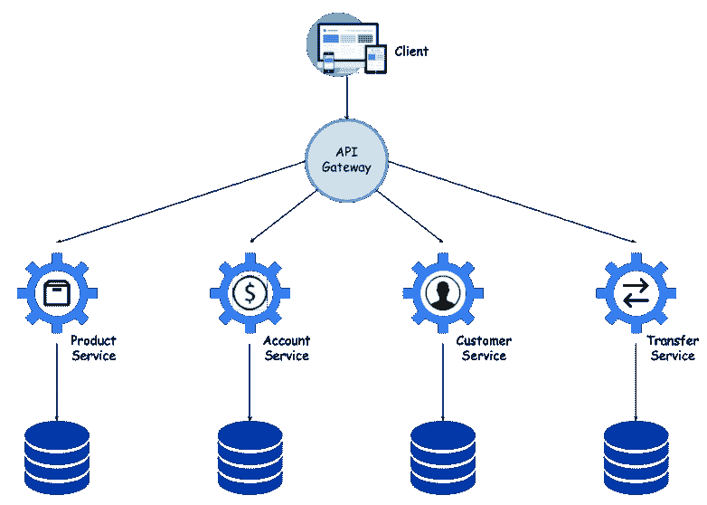
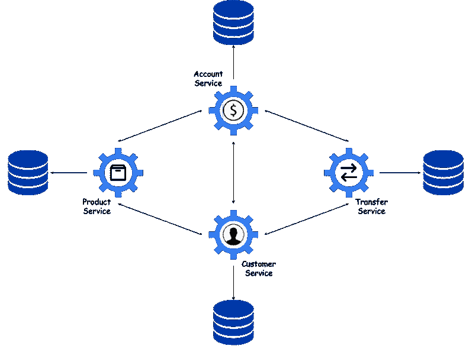
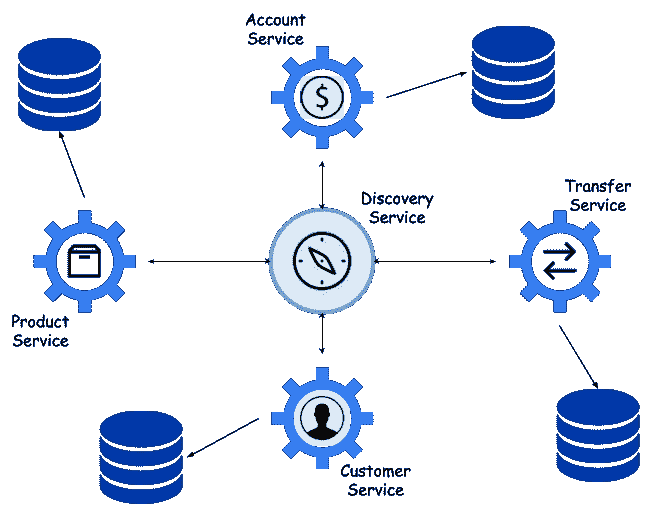
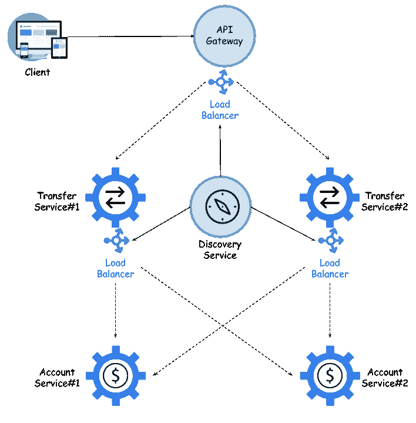

# 第一章：微服务简介

微服务是近年来 IT 世界中出现的最热门趋势之一。相对容易地识别出它们日益受欢迎的最重要原因。它们的优点和缺点都是众所周知的，尽管我们所说的缺点可以通过使用正确的工具轻易解决。它们提供的优势包括可扩展性、灵活性和独立交付；这些是它们迅速受欢迎的原因。有一些早期的 IT 趋势对微服务受欢迎程度的增长产生了一些影响。我指的是像使用常见的基于云的环境和从关系型数据库迁移到 NoSQL 这样的趋势。

在详细讨论之前，让我们看看本章我们将要覆盖的主题：

+   使用 Spring Cloud 的云原生开发

+   微服务架构中的最重要元素

+   服务间通信模型

+   介绍断路器及其回退模式

# 微服务的恩赐

微服务概念定义了一种 IT 系统架构方法，该方法将应用程序划分为一系列松耦合的服务，这些服务实现业务需求。实际上，这是**面向服务架构**（**SOA**）概念的一个变种。迁移到微服务架构的最重要好处之一是能够执行大型复杂应用程序的持续交付。

到目前为止，你可能有机会阅读一些关于微服务的书籍或文章。我认为，大多数书籍都会给你详细描述它们的优点和缺点。使用微服务有很多优点。首先，对于一个新项目开发者来说，微服务相对较小，容易理解。我们通常想要确保代码中的一个变化不会对我们应用程序的所有其他模块产生不希望的效果。与微服务相比，我们可以对此有更多的确定性，因为我们只实现一个单一的业务领域，而不是像单体应用那样，有时即使看似不相关的功能也会放在同一个篮子里。不仅如此。我注意到，通常，在小微服务中维护预期的代码质量比在一个大的单体应用中（许多开发者引入了他们的更改）要容易。

我喜欢微服务架构的第二个方面与划分有关。到目前为止，当我不得不处理复杂的企业系统时，我总是看到系统根据其他子系统进行划分。例如，电信组织总是有一个计费子系统。然后你创建一个子系统来隐藏计费复杂性并提供一个 API。然后你发现你需要存储在计费系统中无法存储的数据，因为它不容易定制。所以你创建另一个子系统。这实际上导致你构建了一个复杂的子系统网格，如果不你是组织中的新员工，尤其难以理解。使用微服务，你不会有这样的问题。如果它们设计得很好，每个微服务都应该负责一个完整的选择区域。在某些情况下，这些区域与组织活动的部门无关。

# 使用 Spring Framework 构建微服务

尽管微服务概念已经是几年的重要话题，但支持运行完整微服务环境所需的所有功能的稳定框架仍然不多。自从我开始微服务的冒险以来，我一直试图跟上最新的框架，并找出针对微服务需求发展的特性。还有其他一些有趣的解决方案，如 Vert.x 或 Apache Camel，但它们没有一个能与 Spring Framework 相匹敌。

Spring Cloud 实现了所有在微服务架构中使用的经过验证的模式，如服务注册表、配置服务器、断路器、云总线、OAuth2 模式和 API 网关。它拥有强大的社区，因此新功能以高频率发布。它基于 Spring 的开放编程模型，该模型被全球数百万 Java 开发者使用。它也被很好地文档化。你在线找到许多可用的 Spring Framework 使用示例不会有任何问题。

# 云原生开发

微服务与云计算平台有着内在的联系，但微服务的概念并不是什么新东西。这种方法已经在 IT 开发世界中应用了多年，但现在，随着云解决方案的普及，它已经发展到了一个新的高度。指出这种普及的原因并不困难。与组织内部的本地解决方案相比，使用云可以为你提供可扩展性、可靠性和低维护成本。这导致了云原生应用开发方法的兴起，旨在让你充分利用云提供的所有优势，如弹性扩展、不可变部署和可弃实例。这一切都归结于一点——减少满足新需求所需的时间和成本。如今，软件系统和应用程序正在不断地得到改进。如果你采用基于单体的传统开发方法，代码库会不断增长，变得过于复杂，难以进行修改和维护。引入新功能、框架和技术变得困难，从而影响创新，抑制新想法。这是无法争辩的。

这个问题还有另一面。如今，几乎每个人都考虑迁移到云端，部分原因是因为这是潮流。每个人都需要这样做吗？当然不是。那些不确定是否要将应用程序迁移到远程云提供商（如 AWS、Azure 或 Google）的人，至少希望拥有一个本地私有云或 Docker 容器。但这真的能带来补偿所花费费用的好处吗？在考虑云原生开发和云平台之前，值得回答这个问题。

我并不是想阻止你使用 Spring Cloud，恰恰相反。我们必须彻底理解什么是云原生开发。这里有一个非常好的定义：

“云原生应用程序是一个专门为云计算环境而设计的程序，而不是简单地迁移到云端。”

Spring 旨在加速你的云原生开发。使用 Spring Boot 构建应用程序非常快；我将在下一章详细展示如何做到这一点。Spring Cloud 实现微服务架构模式，并帮助我们使用该领域最受欢迎的解决方案。使用这些框架开发的应用程序可以轻松地适应在 Pivotal Cloud Foundry 或 Docker 容器上部署，但它们也可以以传统方式作为一台或多台机器上的分离进程启动，并且你会拥有微服务方法的优点。现在让我们深入了解一下微服务架构。

# 学习微服务架构

设想一下，一个客户找上门来，希望您为他们设计一个解决方案。他们需要某种银行应用程序，该程序需要在整个系统中保证数据一致性。我们的客户到目前为止一直使用 Oracle 数据库，并且还从他们那里购买了支持。不假思索，我们决定设计一个基于关系数据模型的单体应用程序。您可以在以下简化系统设计图中看到系统设计：

数据库中映射了四个实体：

+   第一个实体，**客户**，存储和检索活动客户列表。

+   每个客户可能有一个或多个账户，这些账户由**Account**实体操作。

+   **转账**实体负责执行系统内账户间所有资金的转账。

+   还有一个**产品**实体，用于存储诸如客户存款和信贷等信息。

不深入讨论具体细节，应用程序暴露了 API，提供了实现对设计数据库上操作的所有必要操作。当然，实现符合三层模型。

一致性不再是最重要的要求，甚至不再是强制性的。客户期望一个解决方案，但不想让开发需要重新部署整个应用程序。系统应该是可扩展的，并且能够轻松地扩展新的模块和功能。另外，客户不会对开发者使用 Oracle 或其他关系型数据库施加压力——不仅如此，他还很高兴能避免使用它。这些足够成为决定迁移到微服务的理由吗？让我们假设它们是。我们将我们的单体应用程序分成四个独立的微服务，每个都有自己的专用数据库。在某些情况下，它仍然可以是关系型数据库，而在其他情况下则可以是 NoSQL 数据库。现在，我们的系统由许多独立构建和在我们环境中运行的服务组成。随着微服务数量的增加，系统复杂性也在上升。我们希望能够将这种复杂性隐藏在外部 API 客户端之外，它不应该知道它正在与服务*X*而不是*Y*进行通信。网关负责将所有请求动态路由到不同的端点。例如，单词*dynamically*意味着它应该基于服务发现中的条目，关于服务发现的需要，我将在后面的部分*理解服务发现的需求*中讨论。

隐藏特定服务的调用或动态路由并不是 API 网关的唯一功能。由于它是系统的入口点，因此它可以是一个跟踪重要数据、收集请求指标和其他统计信息的好地方。它可以通过丰富请求或响应头，来包含系统内部应用程序可用的某些额外信息。它应执行一些安全操作，例如身份验证和授权，并应能够检测到每个资源的每个要求，并拒绝不满足它们的请求。下面是一个说明示例系统的图表，该系统由四个独立的微服务组成，隐藏在 API 网关后面的外部客户端中：

# 理解服务发现的需求

假设我们已经将我们的单体应用程序划分为更小、独立的微服务。从外部看，我们的系统仍然和以前看起来一样，因为其复杂性隐藏在 API 网关后面。实际上，微服务并不多，但可能有更多。此外，它们中的每一个都可以与其他微服务进行交互。这意味着每个微服务都必须保留有关其他微服务的网络地址的信息。维护此类配置可能非常麻烦，尤其是当涉及到手动重写每个配置时。那么如果这些地址在重启后动态变化呢？下面的图表显示了示例微服务之间的调用路由：

服务发现是指在计算机网络上自动检测设备和设备提供的服务。在微服务架构中，这是必要的机制。每个服务启动后应该在自己名称的一个中央位置注册，以便其他所有服务都能访问。注册键应该是服务的名称或标识符，在整个系统中必须是唯一的，以便其他人能够通过该名称找到并调用该服务。每个具有给定名称的键都有一些值与之关联。在大多数情况下，这些属性指示服务的网络位置。更准确地说，它们指示微服务的一个实例，因为它可以作为在不同机器或端口上运行的独立应用程序进行复制。有时可以发送一些附加信息，但这取决于具体的服务发现提供程序。然而，重要的是，在同一键下，可以注册同一服务的多个实例。除了注册，每个服务还会获得其他注册在特定发现服务器上的服务完整列表。不仅如此，每个微服务都必须了解注册列表的任何更改。这可以通过定期更新从远程服务器先前收集的配置来实现。

一些解决方案结合了服务发现和服务器配置功能的使用。归根结底，这两种方法都非常相似。服务器的配置让你能够集中管理系统中的所有配置文件。通常，这样的配置是一个作为 REST web 服务的服务器。在启动之前，每个微服务都会尝试连接到服务器并获取为其准备好的参数。一种方法是将这样的配置存储在版本控制系统中，例如 Git。然后配置服务器更新其 Git 工作副本，并将所有属性作为 JSON 提供。另一种方法是使用存储键值对的解决方案，在服务发现过程中充当提供者的角色。最受欢迎的工具是 Consul 和 Zookeeper。以下图表说明了一个由一些微服务组成的系统架构，这些微服务带有数据库后端，并注册在一个名为**发现服务**的中央服务中：

# 服务之间的通信

为了保证系统的可靠性，我们不能让每个服务只运行一个实例。我们通常希望至少有两个实例在运行，以防其中一个出现故障。当然，可以更多，但我们为了性能原因会尽量减少。无论如何，相同服务多个实例的存在使得使用负载均衡来处理传入请求变得必要。首先，负载均衡器通常内置在 API 网关中。这个负载均衡器应该从发现服务器获取注册实例的列表。如果没有不用的理由，我们通常使用轮询规则，使传入流量在所有运行实例之间平均分配。同样的规则也适用于微服务侧的负载均衡器。

以下图表说明了两个示例微服务实例之间服务间通信的最重要的组件：

当人们听到微服务时，他们认为它由 RESTful web 服务组成，使用 JSON 表示法，但这只是可能性之一。我们可以使用一些其他的交互方式，这些方式当然不仅适用于基于微服务的架构。首先应该执行的分类是一对一或一对多的通信。在一对一的交互中，每个传入请求都由一个服务实例处理，而在一对多的情况下，它由多个服务实例处理。但最流行的分类标准是调用是同步还是异步。此外，异步通信可以分为通知。当客户端向服务发送请求，但不需要回复时，它只需执行一个简单的异步调用，这不会阻塞线程，而是异步回复。

此外，值得提及的是反应式微服务。现在，从版本 5 开始，Spring 也支持这种类型的编程。还有支持与 NoSQL 数据库（如 MongoDB 或 Cassandra）交互的反应式支持的库。最后一种著名的通信类型是发布-订阅。这是一种一对多的交互类型，其中客户端发布一条消息，然后被所有监听服务消费。通常，这个模型是使用消息代理实现的，如 Apache Kafka、RabbitMQ 和 ActiveMQ。

# 失败和断路器

我们已经讨论了与微服务架构相关的绝大多数重要概念。这样的机制，如服务发现、API 网关和配置服务器，是有用的元素，它们帮助我们创建一个可靠和高效的系统。即使你在设计系统架构时考虑了这些方面的许多方面，你也应该始终准备好应对失败。在许多情况下，失败的原因完全超出了持有者的控制范围，比如网络或数据库问题。对于基于微服务的系统来说，这类错误尤其严重，因为一个输入请求需要经过许多后续调用才能处理。第一个好的实践是在等待响应时始终使用网络超时。如果单个服务存在性能问题，我们应该尽量减小对其他服务的影响。发送错误响应比长时间等待回复更好，以免阻塞其他线程。

对于网络超时问题，一个有趣的解决方案可能是**断路器模式**。这是一个与微服务方法紧密相关的概念。断路器负责计算成功和失败的请求。如果错误率超过假设的阈值，它就会断开，并导致所有后续尝试立即失败。在特定时间段后，API 客户端应该重新开始发送请求，如果它们成功，则关闭断路器。如果每个服务都有多个实例，其中一个比其他实例慢，那么在负载均衡过程中它就会被忽视。处理部分网络故障的第二个常用机制是**回退**。这是一种在请求失败时必须执行的逻辑。例如，一个服务可以返回缓存数据、默认值或空的结果列表。我个人并不是这种解决方案的忠实粉丝。我更愿意将错误代码传播到其他系统，而不是返回缓存数据或默认值。

# 总结

Spring Cloud 的一大优势在于它支持我们所探讨的所有模式和机制。这些也是稳定的实现，与其他一些框架不同。我在第三章，*Spring Cloud 概览*中详细描述了哪些模式被哪个 Spring Cloud 项目所支持。

在本章中，我们讨论了与微服务架构相关的最重要概念，例如云原生开发、服务发现、分布式配置、API 网关以及断路器模式。我试图阐述我对这种方法在企业应用开发中的优缺点观点。然后，我描述了与微服务相关的的主要模式和解决方案。其中一些是已经存在多年的知名模式，在 IT 世界中被视为新事物。在这份总结中，我想引起您注意一些事情。微服务本质上就是云原生的。像 Spring Boot 和 Spring Cloud 这样的框架可以帮助您加速云原生开发。迁移到云原生开发的主要动机是能够更快地实施和交付应用程序，同时保持高质量。在许多情况下，微服务帮助我们实现这一点，但有时单体架构也是一个不错的选择。

尽管微服务是小型且独立的单元，但它们是集中管理的。例如网络位置、配置、日志文件和指标等信息应该存储在一个中央位置。有各种各样的工具和解决方案提供了所有这些功能。我们将在本书的几乎所有章节中详细讨论它们。Spring Cloud 项目旨在帮助我们整合所有这些内容。我希望能有效地引导您了解它提供的最重要的集成。
