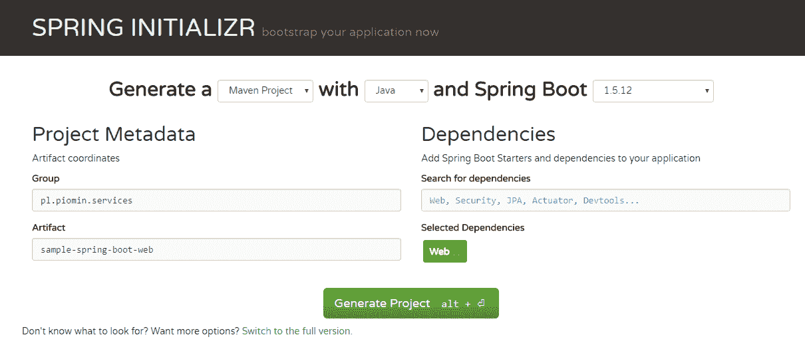
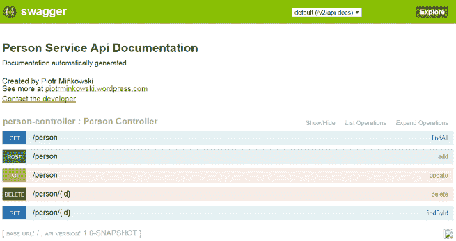
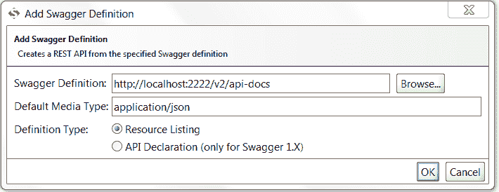
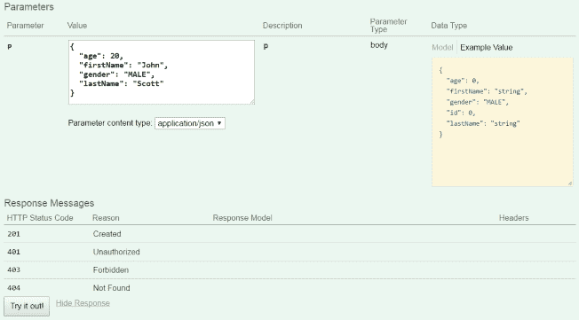
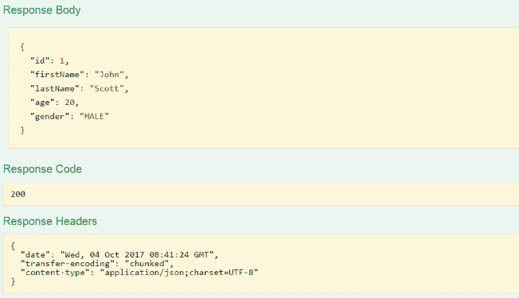
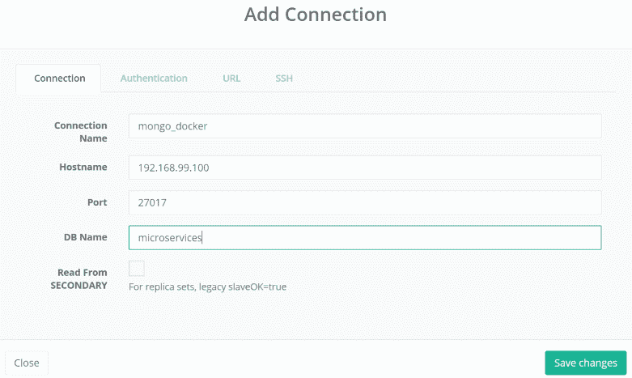
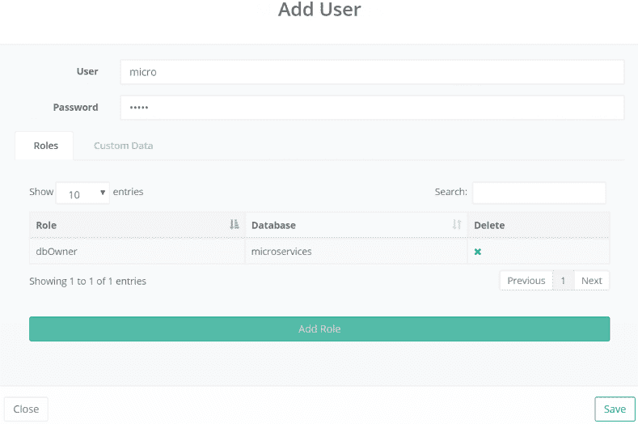

# 第二章：用于微服务的 Spring

我知道很多 Java 开发者都接触过 Spring Framework。实际上，它由许多项目组成，可以与许多其他框架一起使用，所以迟早你都会被迫尝试它。尽管与 Spring Boot 的接触经验相对较少，但它已经迅速获得了大量流行。与 Spring Framework 相比，Spring Boot 是一个相对较新的解决方案。它的实际版本是 2，而不是 Spring Framework 的 5。它的创建目的是什么？与标准 Spring Framework 方式相比，使用 Spring Boot 运行应用程序有什么区别？

本章我们将涵盖的主题包括：

+   使用启动器启用项目中的额外功能

+   使用 Spring Web 库实现暴露 REST API 方法的服务

+   使用属性和 YAML 文件自定义服务配置

+   为暴露的 REST 端点提供文档和规范

+   配置健康检查和监控功能

+   使用 Spring Boot 配置文件使应用程序适应不同模式运行

+   使用 ORM 功能与嵌入式和远程 NoSQL 数据库进行交互

# 介绍 Spring Boot

Spring Boot 专为独立运行 Spring 应用程序而设计，与简单的 Java 应用程序一样，可通过 `java -jar` 命令运行。使 Spring Boot 与标准 Spring 配置不同的基本要素就是简单。这种简单与我们需要了解的第一个重要术语紧密相关，那就是“启动器”（starter）。“启动器”是一个可以包含在项目依赖中的工件。它所做的就是为其他必须包含在你应用程序中的工件提供一套依赖项，以实现所需的功能。以这种方式提供的包已准备好使用，这意味着我们不需要配置任何内容使其工作。这让我们想到了与 Spring Boot 相关的第二个重要术语——自动配置。所有通过启动器包含的工件都设置了默认设置，这些设置可以通过属性或其他类型的启动器轻松覆盖。例如，如果你在你的应用程序依赖中包含了 `spring-boot-starter-web`，它将在应用程序启动时嵌入默认的 Web 容器并在默认端口上启动它。展望未来，Spring Boot 中的默认 Web 容器是 Tomcat，它在端口 `8080` 上启动。我们可以通过在应用程序属性文件中声明指定的字段轻松更改此端口，甚至可以通过在项目依赖中包含 `spring-boot-starter-jetty` 或 `spring-boot-starter-undertow` 来更改 Web 容器。

让我再来说一下启动器。它们的官方命名模式是`spring-boot-starter-*`，其中`*`是启动器的特定类型。在 Spring Boot 中有许多启动器可用，但我想要给你简单介绍一下其中最受欢迎的几个，这些也在这本书的后续章节中提供了示例：

| **名称** | **描述** |
| --- | --- |
| `spring-boot-starter` | 核心启动器，包括自动配置支持、日志和 YAML。 |
| `spring-boot-starter-web` | 允许我们构建 Web 应用程序，包括 RESTful 和 Spring MVC。使用 Tomcat 作为默认的嵌入式容器。 |
| `spring-boot-starter-jetty` | 在项目中包含 Jetty，并将其设置为默认的嵌入式 servlet 容器。 |
| `spring-boot-starter-undertow` | 在项目中包含 Undertow，并将其设置为默认的嵌入式 servlet 容器。 |
| `spring-boot-starter-tomcat` | 包含 Tomcat 作为嵌入式 servlet 容器。`spring-boot-starter-web`默认使用的 servlet 容器启动器。 |
| `spring-boot-starter-actuator` | 包含 Spring Boot Actuator，为应用程序提供监控和管理功能。 |
| `spring-boot-starter-jdbc` | 包含 Spring JBDC 和 Tomcat 连接池。特定数据库的驱动应由您自己提供。 |
| `spring-boot-starter-data-jpa` | 包含用于与关系型数据库使用 JPA/Hibernate 交互的所有工件。 |
| `spring-boot-starter-data-mongodb` | 包含与 MongoDB 交互所需的所有工件，并在本地主机上初始化 Mongo 客户端连接。 |
| `spring-boot-starter-security` | 将 Spring Security 包含在项目中，默认启用应用程序的基本安全性。 |
| `spring-boot-starter-test` | 允许使用如 JUnit、Hamcrest 和 Mockito 等库创建单元测试。 |
| `spring-boot-starter-amqp` | 将 Spring AMQP 包含在项目中，并作为默认的 AMQP 经纪人启动 RabbitMQ。 |

如果你对可用的启动器完整列表感兴趣，请参考 Spring Boot 规范。现在，让我们回到 Spring Boot 与 Spring Framework 标准配置之间的主要区别。正如我之前提到的，我们可以包含`spring-boot-starter-web`，它将 Web 容器嵌入到我们的应用程序中。使用标准的 Spring 配置，我们不会将 Web 容器嵌入应用程序中，而是将其作为 WAR 文件部署在 Web 容器上。这是 Spring Boot 用于创建部署在微服务架构中的应用程序的重要原因之一。微服务的一个主要特性是与其它微服务的独立性。在这种情况下，很明显，它们不应该共享常见的资源，如数据库或 Web 容器。在一个 Web 容器上部署许多 WAR 文件是微服务的反模式。因此，Spring Boot 是明显的选择。

个人而言，我在开发许多应用程序时使用了 Spring Boot，不仅是在微服务环境中工作。如果你尝试用它代替标准的 Spring Framework 配置，你将不希望回到过去。支持这个结论，你可以在 GitHub 上找到一个有趣的图表，展示了 Java 框架仓库的流行度：[`redmonk.com/fryan/files/2017/06/java-tier1-relbar-20170622-logo.png`](http://redmonk.com/fryan/files/2017/06/java-tier1-relbar-20170622-logo.png)。让我们仔细看看如何使用 Spring Boot 开发应用程序。

# 使用 Spring Boot 开发应用程序

在项目中启用 Spring Boot 的推荐方式是使用一个依赖管理系统。在这里，你可以看到一个简短的片段，展示了如何在你的 Maven 和 Gradle 项目中包含适当的工件。以下是 Maven `pom.xml`的一个示例片段：

```java
<parent>
    <groupId>org.springframework.boot</groupId>
    <artifactId>spring-boot-starter-parent</artifactId>
    <version>1.5.7.RELEASE</version>
</parent>
<dependencies>
    <dependency>
        <groupId>org.springframework.boot</groupId>
        <artifactId>spring-boot-starter-web</artifactId>
    </dependency>
</dependencies>
```

使用 Gradle，我们不需要定义父级依赖。以下是`build.gradle`的一个片段：

```java
plugins {
    id 'org.springframework.boot' version '1.5.7.RELEASE'
}
dependencies {
    compile("org.springframework.boot:spring-boot-starter-web:1.5.7.RELEASE")
}
```

当使用 Maven 时，继承`spring-boot-starter-parent` POM 并不是必要的。另外，我们可以使用依赖管理机制：

```java
<dependencyManagement>
    <dependencies>
        <dependency>
            <groupId>org.springframework.boot</groupId>
            <artifactId>spring-boot-dependencies</artifactId>
            <version>1.5.7.RELEASE</version>
            <type>pom</type>
            <scope>import</scope>
        </dependency>
    </dependencies>
</dependencyManagement>
```

现在，我们需要的只是创建一个主应用程序类并给它加上`@SpringBootApplication`注解，这个注解相当于其他三个注解的组合——`@Configuration`、`@EnableAutoConfiguration`和`@ComponentScan`：

```java
@SpringBootApplication
public class Application {

    public static void main(String[] args) {
        SpringApplication.run(Application.class, args);
    }

}
```

一旦我们声明了主类并包括了`spring-boot-starter-web`，我们只需要运行我们的第一个应用程序。如果你使用一个开发 IDE，比如 Eclipse 或 IntelliJ，你应该直接运行你的主类。否则，应用程序必须像标准的 Java 应用程序一样使用`java -jar`命令进行构建和运行。首先，我们应该提供负责在应用程序构建过程中将所有依赖项打包成可执行 JAR（有时被称为**胖 JAR**）的配置。如果定义在 Maven `pom.xml`中，这个操作将由`spring-boot-maven-plugin`执行：

```java
<build>
    <plugins>
        <plugin>
            <groupId>org.springframework.boot</groupId>
            <artifactId>spring-boot-maven-plugin</artifactId>
        </plugin>
    </plugins>
</build>
```

示例应用程序所做的不仅仅是启动在 Tomcat 容器上的 Spring 上下文，该容器在端口`8080`上可用。胖 JAR 的大小约为 14 MB。你可以很容易地，使用 IDE，查看项目中包含了哪些库。这些都是基本的 Spring 库，如`spring-core`、`spring-aop`、`spring-context`；Spring Boot；Tomcat 嵌入式；包括 Logback、Log4j 和 Slf4j 在内的日志库；以及用于 JSON 序列化或反序列化的 Jackson 库。一个好的建议是为项目设置默认的 Java 版本。你可以在`pom.xml`中很容易地设置它，通过声明`java.version`属性：

```java
<properties>
    <java.version>1.8</java.version>
</properties>
```

我们可以通过添加一个新的依赖项来更改默认的 Web 容器，例如，使用 Jetty 服务器：

```java
 <dependency>
     <groupId>org.springframework.boot</groupId>
     <artifactId>spring-boot-starter-jetty</artifactId>
 </dependency>  
```

# 定制配置文件

快速且不需要大量工作来创建应用程序的能力固然重要，但同样重要的是能够轻松自定义和覆盖默认设置的能力。Spring Boot 应运而生，并提供了实现配置管理的机制。实现这一点的最简单方法是使用配置文件，这些文件附加到应用程序的胖 JAR 中。Spring Boot 会自动检测以`application`前缀开头的配置文件。支持的文件类型是`.properties`和`.yml`。因此，我们可以创建如`application.properties`或`application.yml`的配置文件，甚至包括特定于配置文件后缀的文件，如`application-prod.properties`或`application-dev.yml`。此外，我们还可以使用操作系统环境变量和命令行参数来外部化配置。当使用属性文件或 YAML 文件时，它们应该放置在以下位置之一：

+   当前应用程序目录的`/config`子目录

+   当前应用程序目录

+   类路径上的`/config`包（例如，在你的 JAR 文件中）

+   类路径根目录

如果你想给你的配置文件指定一个特定的名字，除了`application`或者`application-{profile}`之外，你需要在启动时提供一个`spring.config.name`环境属性。你也可以使用`spring.config.location`属性，它包含一个由逗号分隔的目录位置或文件路径列表：

```java
java -jar sample-spring-boot-web.jar --spring.config.name=example
java -jar sample-spring-boot-web.jar --spring.config.location=classpath:/example.properties
```

在配置文件内部，我们可以定义两种类型的属性。首先是一组通用的、预定义的 Spring Boot 属性，这些属性通常由底层的类从`spring-boot-autoconfigure`库中消费。我们也可以定义我们自己的自定义配置属性，然后使用`@Value`或`@ConfigurationProperties`注解将它们注入到应用程序中。

让我们先来看看预定义的属性。Spring Boot 项目支持的全部属性在其文档中的*附录 A*，*通用应用程序属性*部分中列出。其中大部分是特定于某些 Spring 模块的，如数据库、网络服务器、安全和一些其他解决方案，但也有一组核心属性。我个人更喜欢使用 YAML 而不是属性文件，因为它可以很容易地被人类阅读，但最终决定权在你。通常，我会覆盖如应用程序名称、用于服务发现和分布式配置管理的网络服务器端口、日志记录或数据库连接设置等属性。通常，`application.yml`文件放在`src/main/resources`目录中，在 Maven 构建后，该目录位于 JAR 根目录中。这是一个覆盖默认服务器端口、应用程序名称和日志记录属性的示例配置文件：

```java
server: 
    port: ${port:2222}

spring: 
    application:
        name: first-service

logging:
    pattern:
        console: "%d{HH:mm:ss.SSS} %-5level %logger{36} - %msg%n"
        file: "%d{HH:mm:ss.SSS} [%thread] %-5level %logger{36} - %msg%n"
    level:
        org.springframework.web: DEBUG
    file: app.log
```

这里真正酷的一点是，你不需要定义任何其他外部配置文件，例如`log4j.xml`或`logback.xml`，用于日志配置。在前一部分，你可以看到我将`org.springframework.web`的默认日志级别更改为`DEBUG`，并修改了日志模式，创建了一个日志文件`app.log`，放在当前应用程序目录中。现在，默认的应用程序名是`first-service`，默认的 HTTP 端口是`2222`。

我们的自定义配置设置也应该放在相同的属性或 YAML 文件中。以下是带有自定义属性的一个`application.yml`样本：

```java
name: first-service
my:
  servers:
    - dev.bar.com
    - foo.bar.com  
```

可以使用`@Value`注解注入一个简单的属性：

```java
@Component
public class CustomBean {

    @Value("${name}")
    private String name;

    // ...
}
```

还可以使用`@ConfigurationProperties`注解注入更复杂的配置属性。YAML 文件中`my.servers`属性定义的值被注入到目标 bean 类型`java.util.List`中：

```java
@ConfigurationProperties(prefix="my")
public class Config {

    private List<String> servers = new ArrayList<String>();

    public List<String> getServers() {
        return this.servers;
    }
}
```

到目前为止，我们已经成功创建了一个简单的应用程序，它所做的只是在一个诸如 Tomcat 或 Jetty 的 web 容器上启动 Spring。在本章的这部分，我想向您展示使用 Spring Boot 开始应用程序开发是多么简单。除此之外，我还描述了如何使用 YAML 或属性文件自定义配置。对于那些喜欢点击而不是打字的人来说，我推荐使用 Spring Initializr 网站([`start.spring.io/`](https://start.spring.io/)），你可以在该网站上根据你选择的选项生成项目骨架。在简单视图中，你可以选择构建工具（Maven/Gradle）、语言（Java/Kotlin/Groovy）和 Spring Boot 版本。然后，你应该使用搜索引擎根据“搜索依赖项”标签提供所有必要的依赖项。我在其中包含了`spring-boot-starter-web`，正如你在下面的截图中看到的，在 Spring Initializr 上它只被标记为`Web`。点击“生成项目”后，生成的源代码的 ZIP 文件会被下载到你的电脑上。你可能还想知道，通过点击“切换到完整版本”，你可以看到 Spring Boot 和 Spring Cloud 几乎所有的库，这些库可以包含在生成的项目中：



我认为，既然我们已经复习了使用 Spring Boot 构建项目的基础知识，现在为我们的示例应用程序添加一些新功能正是时候。

# 创建 RESTful Web 服务

作为第一步，让我们创建一些面向调用客户端的 RESTful Web 服务。正如前面提到的，负责 JSON 消息序列化和反序列化的 Jackson 库，已经自动包含在我们的类路径中，与`spring-boot-starter-web`一起。因此，我们除了声明一个模型类之外，不需要做更多的操作，该模型类随后由 REST 方法返回或作为参数接收。以下是我们的示例模型类`Person`：

```java
public class Person {

    private Long id;
    private String firstName;
    private String lastName;
    private int age;
    private Gender gender;

    public Long getId() {
        return id;
    }

    public void setId(Long id) {
        this.id = id;
    }

    //...
}
```

Spring Web 提供了一些用于创建 RESTful Web 服务的注解。首先是`@RestController`注解，它应该设置在你负责处理传入 HTTP 请求的控制器 bean 类上。还有`@RequestMapping`注解，通常用于将控制器方法映射到 HTTP。正如你在下面的代码片段中所看到的，它可以用在整个控制器类上，为其中的所有方法设置请求路径。我们可以使用更具体的注解为具体的 HTTP 方法 such as `@GetMapping`或`@PostMapping`。`@GetMapping`与`@RequestMapping`参数`method=RequestMethod.GET`相同。另外两个常用的注解是`@RequestParam`和`@RequestBody`。第一个将路径和查询参数绑定到对象；第二个使用 Jackson 库将输入 JSON 映射到对象：

```java
@RestController
@RequestMapping("/person")
public class PersonController {

    private List<Person> persons = new ArrayList<>(); 

    @GetMapping
    public List<Person> findAll() {
         return persons;
     }

    @GetMapping("/{id}")
    public Person findById(@RequestParam("id") Long id) {
        return persons.stream().filter(it -> it.getId().equals(id)).findFirst().get();
    }

    @PostMapping
    public Person add(@RequestBody Person p) {
        p.setId((long) (persons.size()+1));
        persons.add(p);
        return p;
    }

    // ...
}
```

为了与 REST API 标准兼容，我们应该处理`PUT`和`DELETE`方法。在它们的实现之后，我们的服务执行所有的 CRUD 操作：

| **方法** | **路径** | **描述** |
| --- | --- | --- |
| `GET` | `/person` | 返回所有现有的人员 |
| `GET` | `/person/{id}` | 返回给定*id*的人员 |
| `POST` | `/person` | 添加新人员 |
| `PUT` | `/person` | 更新现有人员 |
| `DELETE` | `/person/{id}` | 使用给定的*id*从列表中删除人员 |

以下是带有`DELETE`和`PUT`方法的示例`@RestController`实现的片段：

```java
@DeleteMapping("/{id}")
public void delete(@RequestParam("id") Long id) {
    List<Person> p = persons.stream().filter(it -> it.getId().equals(id)).collect(Collectors.toList());
    persons.removeAll(p);
}

@PutMapping
public void update(@RequestBody Person p) {
    Person person = persons.stream().filter(it -> it.getId().equals(p.getId())).findFirst().get();
    persons.set(persons.indexOf(person), p);
}
```

控制器代码非常简单。它将所有数据存储在本地`java.util.List`中，这显然不是一种好的编程实践。然而，将此视为为了基本示例而采用的简化。在本章的*将应用程序与数据库集成*部分，我将介绍一个更高级的示例应用程序，该应用程序集成了 NoSQL 数据库。

可能有些同学有使用 SOAP Web 服务的经验。如果我们用 SOAP 而不是 REST 创建了一个类似的的服务，我们将为客户端提供一个 WSDL 文件，其中包含所有服务定义。不幸的是，REST 不支持像 WSDL 这样的标准表示法。在 RESTful Web 服务的初期阶段，人们曾说过 **Web 应用程序描述语言**（**WADL**）将承担这一角色。但现实情况是，包括 Spring Web 在内的许多提供者，在应用程序启动后并不会生成 WADL 文件。我为什么要提到这些呢？嗯，我们已经完成了我们的第一个微服务，它通过 HTTP 暴露了一些 REST 操作。你可能在使用这个微服务时，在 IDE 中运行它，或者使用 `java -jar` 命令在构建完胖 JAR 之后运行它。如果你没有修改 `application.yml` 文件中的配置属性，或者在运行应用程序时没有设置 `-Dport` 选项，那么它将在 `http://localhost:2222` 上运行。为了使其他人调用我们的 API，我们有两个选择。我们可以分享一份描述其使用或自动生成 API 客户端机制的文档。或者两者都有。Swagger 就在这时介入了。

# API 文档

**Swagger** 是设计、构建和文档化 RESTful API 的最受欢迎的工具。它是由 SoapUI（一个非常流行的 SOAP Web 服务工具）的设计者 SmartBear 创建的。我认为这对于那些有丰富 SOAP 经验的人来说已经足够推荐了。无论如何，使用 Swagger，我们可以使用表示法设计 API 然后从它生成源代码，或者反过来，我们从源代码开始然后生成一个 Swagger 文件。与 Spring Boot 一起，我们使用后一种方法。

# 使用 Swagger 2 与 Spring Boot 一起

**Spring Boot** 与 **Swagger 2** 的集成是由 Springfox 项目实现的。它在运行时检查应用程序，以推断基于 Spring 配置、类结构和 Java 注解的 API 语义。为了将 Swagger 与 Spring 结合使用，我们需要在 Maven `pom.xml` 中添加以下两个依赖，并用 `@EnableSwagger2` 注解主应用类：

```java
<dependency>
    <groupId>io.springfox</groupId>
    <artifactId>springfox-swagger2</artifactId>
    <version>2.7.0</version>
</dependency>
<dependency>
    <groupId>io.springfox</groupId>
    <artifactId>springfox-swagger-ui</artifactId>
    <version>2.7.0</version>
</dependency>
```

API 文档将在应用程序启动时由 Swagger 库从源代码自动生成。这个过程由 `Docket` bean 控制，它也声明在主类中。一个好主意可能是从 Maven `pom.xml` 文件中获取 API 版本。我们可以通过在类路径中包含 `maven-model` 库并使用 `MavenXpp3Reader` 类来实现。我们还使用 `apiInfo` 方法设置一些其他属性，如标题、作者和描述。默认情况下，Swagger 为所有 REST 服务生成文档，包括由 Spring Boot 创建的服务。我们想要限制此文档只包含位于 `pl.piomin.services.boot.controller` 包内的 `@RestController`：

```java
  @Bean
  public Docket api() throws IOException, XmlPullParserException {
    MavenXpp3Reader reader = new MavenXpp3Reader();
    Model model = reader.read(new FileReader("pom.xml"));
    ApiInfoBuilder builder = new ApiInfoBuilder()
        .title("Person Service Api Documentation")
        .description("Documentation automatically generated")
        .version(model.getVersion())
        .contact(new Contact("Piotr Mińkowski", "piotrminkowski.wordpress.com", "piotr.minkowski@gmail.com"));
    return new Docket(DocumentationType.SWAGGER_2).select()
        .apis(RequestHandlerSelectors.basePackage("pl.piomin.services.boot.controller"))
        .paths(PathSelectors.any()).build()
        .apiInfo(builder.build());
  }
```

# 使用 Swagger UI 测试 API

应用程序启动后，在`http://localhost:2222/swagger-ui.html`上提供了 API 文档仪表板。这是 Swagger JSON 定义文件的更用户友好的版本，也是自动生成的，并在`http://localhost:2222/v2/api-docs`上可用。该文件可以被其他 REST 工具导入，例如 SoapUI：



如果你更喜欢 SoapUI 而不是 Swagger UI，你可以通过选择项目|导入 Swagger 来轻松导入 Swagger 定义文件。然后，你需要提供一个文件地址，正如你在这张截图中所看到的：



个人而言，我更喜欢 Swagger UI。你可以展开每个 API 方法以查看它们的详细信息。每个操作都可以通过提供所需的参数或 JSON 输入，并点击“尝试一下！”按钮来进行测试。这里有一张截图，展示了发送一个`POST /person`测试请求的情况：



这是响应屏幕：



# Spring Boot Actuator 功能

仅仅创建工作应用程序并分享标准的 API 文档是不够的，特别是当我们谈论微服务时，那里有很多独立的实体结构成一个受管理的环境。接下来需要提到的重要事情是监控和收集应用程序的度量信息。在这方面，Spring Boot 也提供了支持。Spring Boot 项目提供了许多内置端点，允许我们监控并与应用程序互动。为了在我们的项目中启用它，我们应该在依赖项中包含`spring-boot-starter-actuator`。以下是最重要的 Actuator 端点列表：

| **路径** | **描述** |
| --- | --- |
| `/beans` | 显示应用程序中初始化的所有 Spring bean 的完整列表。 |
| `/env` | 暴露 Spring 的 Configurable Environment 中的属性，这意味着例如操作系统环境变量和配置文件中的属性。 |
| `/health` | 显示应用程序的健康信息。 |
| `/info` | 显示任意应用程序信息。它可以从例如`build-info.properties`或`git.properties`文件中获取。 |
| `/loggers` | 显示并修改应用程序中的日志记录器配置。 |
| `/metrics` | 显示当前应用程序的度量信息，例如内存使用情况、运行线程数或 REST 方法响应时间。 |
| `/trace` | 显示跟踪信息（默认显示最后 100 个 HTTP 请求）。 |

使用 Spring 配置属性，端点可以很容易地进行自定义。例如，我们可以禁用默认启用的端点中的一个。默认情况下，除了`shutdown`之外的所有端点都是启用的。其中大多数端点都是受保护的。如果你想要从网页浏览器中调用它们，你应在请求头中提供安全凭据，或者为整个项目禁用安全功能。要实现后者，你需要在你的`application.yml`文件中包含以下语句：

```java
management:
  security:
    enabled: false
```

# 应用程序信息

项目可用的端点完整列表在应用程序启动时的日志中可见。在禁用安全功能后，你可以在网页浏览器中测试它们全部。有趣的是，`/info`端点默认不提供任何信息。如果你想要改变这一点，你可以使用其中三个可用的自动配置`InfoContributor` bean 中的一个，或者编写你自己的。第一个，`EnvironmentInfoContributor`，在端点中暴露环境键。第二个，`GitInfoContributor`，在类路径中检测`git.properties`文件，然后显示关于提交的所有必要信息，如分支名称或提交 ID。最后一个，名为`BuildInfoContributor`，从`META-INF/build-info.properties`文件中收集信息，并在端点中也显示它。这两个用于 Git 和构建信息的属性文件可以在应用程序构建过程中自动生成。为了实现这一点，你应该在你的`pom.xml`中包含`git-commit-id-plugin`，并自定义`spring-boot-maven-plugin`以生成`build-info.properties`，如本代码片段中所见：

```java
<plugin>
    <groupId>org.springframework.boot</groupId>
    <artifactId>spring-boot-maven-plugin</artifactId>
    <executions>
        <execution>
            <goals>
                <goal>build-info</goal>
                <goal>repackage</goal>
            </goals>
            <configuration>
                <additionalProperties>
                    <java.target>${maven.compiler.target}</java.target>
                    <time>${maven.build.timestamp}</time>
                </additionalProperties>
            </configuration>
        </execution>
    </executions>
</plugin>
<plugin>
    <groupId>pl.project13.maven</groupId>
    <artifactId>git-commit-id-plugin</artifactId>
    <configuration>
    <failOnNoGitDirectory>false</failOnNoGitDirectory>
    </configuration>
</plugin>
```

有了可用的`build-info.properties`文件，你的`/info`将和之前有点不同：

```java
{ 
    "build": {
        "version":"1.0-SNAPSHOT",
        "java": {
            "target":"1.8"
        },
        "artifact":"sample-spring-boot-web",
        "name":"sample-spring-boot-web",
        "group":"pl.piomin.services",
        "time":"2017-10-04T10:23:22Z"
    }
}
```

# 健康信息

与`/info`端点一样，`/health`端点也有一些自动配置的指标。我们可以监控磁盘使用情况、邮件服务、JMS、数据源以及 NoSQL 数据库（如 MongoDB 或 Cassandra）的状态。如果你从我们的示例应用程序中检查该端点，你只能得到关于磁盘使用情况的信息。让我们在项目中添加 MongoDB 来测试其中一个可用的健康指标，`MongoHealthIndicator`。MongoDB 并非随机选择。它在未来对于`Person`微服务的更高级示例中将很有用。为了启用 MongoDB，我们需要在`pom.xml`中添加以下依赖项。`de.flapdoodle.embed.mongo`构件在应用程序启动期间负责启动嵌入式数据库实例：

```java
<dependency>
    <groupId>org.springframework.boot</groupId>
    <artifactId>spring-boot-starter-data-mongodb</artifactId>
</dependency>
<dependency>
    <groupId>de.flapdoodle.embed</groupId>
    <artifactId>de.flapdoodle.embed.mongo</artifactId>
</dependency>
```

现在，`/health`端点返回了关于磁盘使用情况和 MongoDB 状态的信息：

```java
{
 "status":"UP",
 "diskSpace":{
 "status":"UP",
 "total":499808989184,
 "free":193956904960,
 "threshold":10485760
 },
 "mongo":{
 "status":"UP",
 "version":"3.2.2"
 }
} 
```

在这个例子中，我们可以看到 Spring Boot 自动配置的力量。我们只需要将两个依赖项添加到项目中，就可以启用嵌入式 MongoDB。其状态已自动添加到`/health`端点。它还有一个对 Mongo ready-to-use 的客户端连接，这可以被进一步用于仓库 bean。

# 指标

正如我们通常所说的，没有免费的午餐。发展既快又容易，但在项目中包含一些额外的库后，庞大的 JAR 文件现在大约有 30 MB。使用自动配置的 actuator 端点之一，`/metrics`，我们可以轻松查看微服务的堆内存和非堆内存使用情况。发送一些测试请求后，堆内存使用大约为 140 MB，非堆内存为 65 MB。应用程序的总内存使用量约为 320 MB。当然，即使只是使用`java -jar`命令启动时使用`-Xmx`参数，这些值也可以稍微降低。然而，如果我们关心在生产模式下的可靠工作，就不应该将此限制降低太多。除了内存使用情况外，`/metrics`端点还显示了加载的类数量、活动线程数、每个 API 方法的平均持续时间等信息。以下是我们示例微服务端点响应的一个片段：

```java
{
 "mem":325484,
 "mem.free":121745,
 "processors":4,
 "instance.uptime":765785,
 "uptime":775049,
 "heap.committed":260608,
 "heap.init":131072,
 "heap.used":138862,
 "heap":1846272,
 "nonheap.committed":75264,
 "nonheap.init":2496,
 "nonheap.used":64876,
 "threads.peak":28,
 "threads.totalStarted":33,
 "threads":28,
 "classes":9535,
 "classes.loaded":9535,
 "gauge.response.person":7.0,
 "counter.status.200.person":4,
 // ...
} 
```

有可能创建我们自己的自定义指标。Spring Boot Actuator 提供了两个类，以便我们这样做——`CounterService`和`GaugeService`。正如其名称所暗示的，`CounterService`暴露了增加值、减少值和重置值的方法。相比之下，`GaugeService`旨在仅提交当前值。默认的 API 方法调用统计数据有点不完美，因为它们仅基于调用路径。如果它们在同一路径上可用，则无法区分方法类型。在我们的示例端点中，这适用于`GET /person`、`POST /person`和`PUT /person`。无论如何，我创建了`PersonCounterService` bean，用于计算`add`和`delete`方法调用的数量：

```java
@Service
public class PersonCounterService {
    private final CounterService counterService;

    @Autowired
    public PersonCounterService(CounterService counterService) {
        this.counterService = counterService;
    }

    public void countNewPersons() {
        this.counterService.increment("services.person.add");
    }

    public void countDeletedPersons() {
        this.counterService.increment("services.person.deleted");
    } 
}
```

这个 bean 需要被注入到我们的 REST 控制器 bean 中，当一个人被添加或删除时，可以调用增加计数值的方法：

```java
public class PersonController {

    @Autowired
    PersonCounterService counterService;

    // ...

    @PostMapping
    public Person add(@RequestBody Person p) {
        p.setId((long) (persons.size()+1));
        persons.add(p);
        counterService.countNewPersons();
        return p;
    }

    @DeleteMapping("/{id}")
    public void delete(@RequestParam("id") Long id) {
        List<Person> p = persons.stream().filter(it -> it.getId().equals(id)).collect(Collectors.toList());
        persons.removeAll(p);
        counterService.countDeletedPersons();
    } 
}
```

现在，如果你再次显示应用程序指标，你将在 JSON 响应中看到以下两个新字段：

```java
{
    // ...
    "counter.services.person.add":4,
    "counter.services.person.deleted":3
}
```

所有由 Spring Boot 应用程序生成的指标都可以从内存缓冲区导出到一个可以分析和显示的地方。例如，我们可以将它们存储在 Redis、Open TSDB、Statsd 或甚至 InfluxDB 中。

我认为关于内置监控端点的细节差不多就这些了。我为此类主题如文档、指标和健康检查分配了相对较多的空间，但在我看来，这些都是微服务开发和维护的重要方面。开发者通常不在乎这些机制是否实现得很好，但其他人通常只是通过这些指标、健康检查和应用程序日志的质量来看我们的应用程序。Spring Boot 提供了这样的实现，因此开发者不必花太多时间来启用它们。

# 开发者工具

Spring Boot 为开发者提供了其他一些有用的工具。对我来说真正酷的是，项目类路径上的文件发生变化时，应用程序会自动重新启动。如果你使用 Eclipse 作为你的 IDE，要启用它，你只需要在 Maven 的 `pom.xml` 中添加 `spring-boot-devtools` 依赖。然后，尝试更改你其中一个类中的某个东西并保存它。应用程序会自动重新启动，而且所用时间远比标准方式停止和启动要少。当我启动我们的示例应用程序时，大约需要 9 秒钟，而自动重启只需要 3 秒：

```java
<dependency>
    <groupId>org.springframework.boot</groupId>
    <artifactId>spring-boot-devtools</artifactId>
    <optional>true</optional>
</dependency>
```

如果我们不需要在更改时触发重启，我们可以排除一些资源。默认情况下，类路径上可用的任何指向文件夹的文件都将被监控以检测更改，即使是静态资产或视图模板，也不需要重新启动。例如，如果它们放在静态文件夹中，你可以在 `application.yml` 配置文件中添加以下属性来排除它们：

```java
spring:
 devtools:
   restart:
     exclude: static/**
```

# 将应用程序与数据库集成

你可以在 Spring Boot 规范中找到更多有趣的特性。我想花更多时间描述该框架提供的其他酷功能，但我们不应该偏离主题太远——Spring 用于微服务。正如你可能记得的，通过在项目中包含嵌入式 MongoDB，我答应给你一个更高级的微服务示例。在开始处理它之前，让我们回到我们应用程序的当前版本。它的源代码可以在我的公共 GitHub 账户上找到。将以下 Git 仓库克隆到你的本地机器：[`github.com/piomin/sample-spring-boot-web.git`](https://github.com/piomin/sample-spring-boot-web.git)。

# 构建一个示例应用程序

基本示例可以在 `master` 分支中找到。带有嵌入式 MongoDB 的更高级示例提交到了 `mongo` 分支。如果你想尝试运行更高级的示例，你需要使用 `git checkout mongo` 切换到那个分支。现在，我们需要在模型类中进行一些更改，以启用对 MongoDB 的对象映射。模型类必须用 `@Document` 注解，主键字段用 `@Id` 注解。我还将 ID 字段类型从 `Long` 改为 `String`，因为 MongoDB 使用 UUID 格式的的主键，例如 `59d63385206b6d14b854a45c`：

```java
@Document(collection = "person")
public class Person {

    @Id
    private String id;
    private String firstName;
    private String lastName;
    private int age;
    private Gender gender;

    public String getId() {
        return id;
    }

    public void setId(String id) {
        this.id = id;
    }
    // ...
}
```

下一步是创建一个扩展了`MongoRepository`的仓库接口。MongoRepository 为搜索和存储数据提供了基本方法，如`findAll`、`findOne`、`save`和`delete`。Spring Data 有一个非常智能的机制，利用仓库对象执行查询。我们不需要自己实现查询，只需定义一个命名正确的接口方法。该方法名应具有`findBy`前缀和搜索字段名。它可能以一个标准的搜索关键字后缀结束，如`GreaterThan`、`LessThan`、`Between`、`Like`等。基于完整的方法名，Spring Data 类会自动生成 MongoDB 查询。相同的关键词可以与`delete…By`或`remove…By`结合使用，以创建删除查询。在`PersonRepository`接口中，我决定定义两个查找方法。第一个，`findByLastName`，选择所有给定`lastName`值的`Person`实体。第二个，`findByAgeGreaterThan`，旨在检索所有年龄大于给定值的`Person`实体：

```java
public interface PersonRepository extends MongoRepository<Person, String> {

    public List<Person> findByLastName(String lastName);
    public List<Person> findByAgeGreaterThan(int age);

}
```

仓库应该被注入到 REST 控制器类中。然后，我们终于可以调用`PersonRepository`提供的所有必需的 CRUD 方法：

```java
@Autowired
private PersonRepository repository;
@Autowired
private PersonCounterService counterService; 

@GetMapping
public List<Person> findAll() {
    return repository.findAll();
} 

@GetMapping("/{id}")
public Person findById(@RequestParam("id") String id) {
    return repository.findOne(id);
}

@PostMapping
public Person add(@RequestBody Person p) {
    p = repository.save(p);
    counterService.countNewPersons();
    return p;
}

@DeleteMapping("/{id}")
public void delete(@RequestParam("id") String id) {
    repository.delete(id);
    counterService.countDeletedPersons();
}
```

我们还添加了两个从`PersonRepository` bean 自定义查找操作的 API 方法：

```java
@GetMapping("/lastname/{lastName}")
public List<Person> findByLastName(@RequestParam("lastName") String lastName) {
    return repository.findByLastName(lastName);
}

@GetMapping("/age/{age}")
public List<Person> findByAgeGreaterThan(@RequestParam("age") int age) {
    return repository.findByAgeGreaterThan(age);
} 
```

这就做完了所有的事情。我们的微服务已经准备好启动，它暴露了实现对嵌入式 Mongo 数据库进行 CRUD 操作的基本 API 方法。你可能已经注意到，它并没有要求我们创建大量的源代码。使用 Spring Data 实现与数据库的任何交互，无论是关系型还是 NoSQL，都是快速和相对简单的。无论如何，我们面前还有一个挑战。嵌入式数据库是一个不错的选择，但只适用于开发模式或单元测试，而不是生产模式。如果你必须在生产模式下运行你的微服务，你可能会启动一个独立的 MongoDB 实例或一些作为分片集群部署的 MongoDB 实例，并将应用程序连接到它们。对于我们的示例目的，我将使用 Docker 运行 MongoDB 的一个实例。

如果你不熟悉 Docker，你总是可以只在你的本地或远程机器上安装 Mongo。关于 Docker 的更多信息，你也可以参考第十四章、*Docker 支持*，在那里我会给你一个简短的介绍。那里有你开始所需的一切，例如如何在 Windows 上安装它和使用基本命令。我还将使用 Docker 在为下一章节和主题实现示例中，所以我认为如果你有基本的了解它会很有用。

# 运行应用程序

让我们使用 Docker `run`命令启动 MongoDB：

```java
docker run -d --name mongo -p 27017:27017 mongo
```

对我们可能有用的一件事是 Mongo 数据库客户端。使用这个客户端，可以创建一个新的数据库并添加一些带有凭据的用户。如果您在 Windows 上安装了 Docker，默认虚拟机地址是`192.168.99.100`。由于在`run`命令内部设置了`-p`参数，Mongo 容器暴露了端口`27017`。实际上，我们不必创建数据库，因为当我们定义客户端连接时提供数据库名称，如果它不存在，它将自动创建：



接下来，我们应该为应用程序创建一个具有足够权限的用户：



最后，我们应该在`application.yml`配置文件中设置 Mongo 数据库连接设置和凭据：

```java
server: 
  port: ${port:2222}
spring: 
  application:
  name: first-service

// ...

---

spring:
  profiles: production
  application:
    name: first-service
  data:
    mongodb:
      host: 192.168.99.100
      port: 27017
      database: microservices
      username: micro 
      password: micro
```

Spring Boot 很好地支持多配置文件。YAML 文件可以通过使用`*---*`行分隔成一系列文档，每个文档部分独立解析为一个扁平化的映射。前面的示例与使用`application-production.yml`的分离配置文件完全一样。如果您没有使用任何其他选项运行应用程序，它将使用默认设置，这些设置没有设置配置文件名称。如果您希望使用生产属性运行它，您应该设置 VM 参数`spring.profiles.active`：

```java
java -jar -Dspring.profiles.active=production sample-spring-boot-web-1.0-SNAPSHOT.jar
```

这还不算完。现在，带有活动生产配置文件的应用程序无法启动，因为它尝试初始化`embeddedMongoServer`bean。正如您可能已经知道的，Spring Boot 中几乎所有的附加解决方案都设置了自动配置。这个例子也不例外。我们需要在生产配置文件中排除`EmbeddedMongoAutoConfiguration`类：

```java
spring:
  profiles: production
  // ...
  autoconfigure:
    exclude: org.springframework.boot.autoconfigure.mongo.embedded.EmbeddedMongoAutoConfiguration
```

我们也可以使用配置类来排除该工件：

```java
@Configuration
@Profile("production")
@EnableAutoConfiguration(exclude = EmbeddedMongoAutoConfiguration.class)
public class ApplicationConfig {
    // ...
}
```

当然，我们本可以使用更优雅的解决方案，比如 Maven 配置文件，并从目标构建包中排除整个`de.flapdoodle.embed.mongo`工件。所示解决方案只是解决该问题的几种可能性之一，但它展示了 Spring Boot 中的自动配置和配置文件机制。现在，您可以运行我们的示例应用程序并使用例如 Swagger UI 进行一些测试。您还可以使用 Mongo 客户端连接到数据库并查看数据库中的更改。以下是我们的示例项目的最终文件结构：

```java
pl
  +- piomin
    +- services
      +- boot
        +- Application.java
        |
        +- controller
        |  +- PersonController.java
        |
        +- data
        |  +- PersonRepository.java
        |
        +- model
        |  +- Person.java
        |  +- Gender.java
        |
        +- service
        |  +- PersonCounterService.java
```

示例应用程序完成了。这些都是我本章想要展示给你的 Spring Boot 功能。我主要关注那些特别适用于创建基于 REST 的服务的功能。

# 总结

我已经引导你经历了单微服务开发的过程，从一个非常基础的例子到一个更高级的、生产就绪的 Spring Boot 应用。我描述了如何使用启动器（starters）为项目启用附加特性；使用 Spring Web 库来实现暴露 REST API 方法的服务；然后我们转向使用属性和 YAML 文件自定义服务配置。我们还看到了如何文档化和提供暴露 REST 端点的规格说明。接下来，我们配置了健康检查和监控特性。我们使用了 Spring Boot 配置文件（profiles）使应用能够以不同的模式运行，最后，我们使用了对象关系映射（ORM）特性来与内嵌和远程的 NoSQL 数据库进行交互。

我没有在这一章中提到 Spring Cloud 绝非偶然。你没有基本的 Spring Boot 知识和经验，是无法开始使用 Spring Cloud 项目的。Spring Cloud 提供了许多不同的特性，让你可以将你的服务放置在一个完整的基于微服务的生态系统中。我们将在接下来的章节中逐一讨论这些功能。
