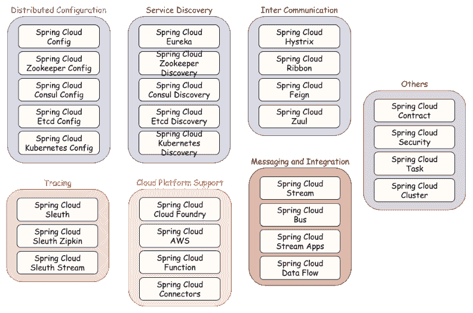

# 第三章：Spring Cloud 概览

在第一章，*微服务介绍*中，我提到了基于云的开发风格，以及 Spring Cloud 如何帮助你轻松采用与这种概念相关的最佳实践。最常用的最佳实践已经被收集在一个有趣的倡议中，称为**The Twelve-Factor App**。正如你可能会在他们网站上读到的（[`12factor.net/`](https://12factor.net/)），这是一种构建**软件即服务**（**SaaS**）现代应用程序的方法，这种应用程序必须是可扩展的，容易在云平台上部署，并以持续部署过程提供。熟悉这些原则尤其值得，特别是如果你是一个构建作为服务运行的应用程序的开发者。Spring Boot 和 Spring Cloud 提供了使你的应用程序符合*Twelve-Factor 规则*的特性和组件。我们可以区分出一些最现代分布式系统通常使用的典型特性。每个有见地的框架都应该提供它们，Spring Cloud 也不例外。这些特性如下：

+   分布式/版本化配置

+   服务注册与发现

+   路由

+   服务间调用

+   负载均衡

+   断路器

+   分布式消息传递

# 从基础开始

让我们先回到上一章的内容。在那儿，我已经详细介绍了 Spring Boot 项目的结构。配置应该提供在 YAML 文件或以应用程序或`application-{profile}`命名的属性文件中。与标准的 Spring Boot 应用程序相比，Spring Cloud 是基于从远程服务器获取的配置。然而，在应用程序内部只需要最少的设置；例如，其名称和配置服务器地址。这就是为什么 Spring Cloud 应用程序创建了一个引导上下文，负责从外部来源加载属性。引导属性具有最高优先级，它们不能被本地配置覆盖。引导上下文是主应用程序上下文的父级，它使用`bootstrap.yml`而不是`application.yml`。通常，我们将应用程序名称和 Spring Cloud Config 设置放在下面这样：

```java
spring:
  application:
    name: person-service
  cloud:
    config:
      uri: http://192.168.99.100:8888
```

通过将`spring.cloud.bootstrap.enabled`属性设置为`false`，可以轻松禁用 Bootstrap 上下文的启动。我们还可以使用`spring.cloud.bootstrap.name`属性更改引导配置文件的名称，或者通过设置`spring.cloud.bootstrap.location`来更改其位置。在这里也可以使用配置文件机制，因此我们可以创建例如`bootstrap-development.yml`的文件，在激活的开发配置文件上进行加载。Spring Cloud Context 库中提供了这些以及其他一些特性，该库作为项目类路径的父依赖与其他任何 Spring Cloud 库一起添加。其中一些特性包括与 Spring Boot Actuator 一起提供的附加管理端点：

+   `env`：新的`POST`方法用于`Environment`，日志级别更新和`@ConfigurationProperties`重新绑定

+   `refresh`：重新加载引导上下文并刷新所有带有`@RefreshScope`注解的 bean

+   `restart`：重新启动 Spring `ApplicationContext`

+   `pause`：停止 Spring `ApplicationContext`

+   `resume`：启动 Spring `ApplicationContext`

与 Spring Cloud Context 一起作为 Spring Cloud 项目的父依赖包含在项目中的下一个库是 Spring Cloud Commons。它为诸如服务发现、负载均衡和断路器等机制提供了一个共同的抽象层。这些包括其他常用注解，如`@EnableDiscoveryClient`或`@LoadBalanced`。关于它们的详细信息，我将在接下来的章节中介绍。

# Netflix OSS

在阅读前两章之后，你们可能已经注意到了许多与微服务架构相关的关键词。对于一些人来说，这可能是一个新术语，对于其他人来说，它可能是众所周知的。但到目前为止，对微服务社区来说还有一个重要的词还没有提到。大多数你们肯定都知道，这个词是*Netflix*。嗯，我也喜欢他们的电视剧和其他制作，但对我来说，他们因为另一个原因而出名。这个原因就是微服务。Netflix 是最早从传统的开发模式迁移到基于云的微服务开发方法的先驱之一。这家公司通过将大部分源代码推送到公共仓库、在会议演讲中发言以及发布博客文章，与社区分享他们的专业知识。Netflix 在其架构概念上的成功是如此之大，以至于它们成为了其他大型组织和他们的 IT 架构师（如 Adrian Cockcroft）的榜样，这些人现在是微服务的突出倡导者。作为回报，许多开源框架将它们的库基于 Netflix 共享的代码下的解决方案。对于 Spring Cloud 来说也不例外，它提供了与最流行的 Netflix OSS 特性（如 Eureka、Hystrix、Ribbon 或 Zuul）的集成。

顺便说一下，我不知道你是否一直在关注 Netflix，但他们透露了他们决定开源大部分代码的原因。我认为值得引用，因为这部分解释了他们在 IT 世界中成功和持续受欢迎的原因：

“当我们说我们要将整个 Netflix 搬到云端时，每个人都认为我们完全疯了。他们不相信我们真的在做这件事，他们认为我们只是在编造故事。”

# 使用 Eureka 进行服务发现

由 Spring Cloud Netflix 提供的第一个模式是使用 Eureka 进行服务发现。这个包分为客户端和服务器端。

要在项目中包含 Eureka 客户端，你应该使用`spring-cloud-starter-eureka`启动器。客户端总是应用程序的一部分，负责连接远程发现服务器。一旦建立连接，它应该发送一个包含服务名称和网络位置的注册消息。如果当前微服务需要调用另一个微服务的端点，客户端应该从服务器检索带有已注册服务列表的最新配置。服务器可以作为独立的 Spring Boot 应用程序进行配置和运行，并且每个服务器都应该将其状态复制到其他节点以实现高可用性。要在项目中包含 Eureka 服务器，你需要使用`spring-cloud-starter-eureka-server`启动器。

# 使用 Zuul 进行路由

在 Spring Cloud Netflix 项目中可用的下一个流行模式是使用 Zuul 进行智能路由。它不仅仅是一个基于 JVM 的路由器，还充当服务器端负载均衡器，执行某些过滤操作。它还有各种各样的应用。Netflix 用它来处理诸如认证、负载均衡、静态响应处理或压力测试等情况。它与 Eureka Server 相同，可以作为独立的 Spring Boot 应用程序进行配置和运行。

要在项目中包含 Zuul，请使用`spring-cloud-starter-zuul`启动器。在微服务架构中，Zuul 作为 API 网关扮演着至关重要的角色，它是整个系统的入口点。它需要了解每个服务的网络位置，因此通过将发现客户端包含在类路径中与 Eureka Server 进行交互。

# 使用 Ribbon 进行负载均衡

我们不能忽视用于客户端负载均衡的下一个 Spring Cloud Netflix 功能——Ribbon。它支持最流行的协议，如 TCP、UDP 和 HTTP。它不仅可以用于同步 REST 调用，还可以用于异步和反应式模型。除了负载均衡外，它还提供与服务发现、缓存、批处理和容错集成的功能。Ribbon 是基本 HTTP 和 TCP 客户端的下一个抽象级别。

要将其纳入您的项目，请使用`spring-cloud-starter-ribbon`启动器。Ribbon 支持循环冗余、可用性过滤和加权响应时间负载均衡规则，并且可以很容易地通过自定义规则进行扩展。它基于*命名客户端*概念，其中用于负载均衡的服务应提供名称。

# 编写 Java HTTP 客户端

Feign 是 Netflix OSS 包中稍微不太流行的一个。它是一个声明性的 REST 客户端，可以帮助我们更容易地编写 Web 服务客户端。使用 Feign，开发者只需声明和注解一个接口，而实际实现将在运行时生成。

要在您的项目中包含 Feign，您需要使用`spring-cloud-starter-feign`启动器。它与 Ribbon 客户端集成，因此默认支持负载均衡和其他 Ribbon 功能，包括与发现服务的通信。

# 使用 Hystrix 实现延迟和容错

我已经在第一章，*微服务简介*中提到了断路器模式，Spring Cloud 提供了一个实现此模式的库。它基于 Netflix 创建的 Hystrix 包，作为断路器实现。Hystrix 默认与 Ribbon 和 Feign 客户端集成。回退与断路器概念紧密相关。使用 Spring Cloud 库，您可以轻松配置回退逻辑，如果存在读取或断路器超时，应执行此逻辑。您应该使用`spring-cloud-starter-hystrix`启动器将 Hystrix 纳入您的项目。

# 使用 Archaius 进行配置管理

在 Spring Cloud Netflix 项目中提供的最后一个重要功能是 Archaius。我个人没有接触过这个库，但在某些情况下可能很有用。Spring Cloud 参考 Archaius 是 Apache Commons Configuration 项目的扩展。它允许通过轮询源进行配置更新或将更改推送到客户端。

# 发现与分布式配置

服务发现和分布式配置管理是微服务架构的两个重要部分。这两种不同机制的技术实现非常相似。它归结为在灵活的键值存储中存储特定键下的参数。实际上，市场上有一些有趣的解决方案可以提供这两种功能。Spring Cloud 与其中最受欢迎的解决方案集成。但是，还有一个例外，Spring Cloud 有自己的实现，仅用于分布式配置。此功能在 Spring Cloud Config 项目中提供。相比之下，Spring Cloud 不提供其自己的服务注册和发现实现。

像往常一样，我们可以将这个项目分为服务器和客户端支持两部分。服务器是所有外部属性的集中管理的地方，跨所有环境管理应用程序的属性。配置可以同时维护几个版本和配置文件。这是通过使用 Git 作为存储后端来实现的。这个机制非常智能，我们将在第五章，*Spring Cloud Config 的分布式配置*中详细讨论它。Git 后端不是存储属性的唯一选项。配置文件也可以位于文件系统或服务器类路径上。下一个选项是使用 Vault 作为后端。Vault 是 HashiCorp 发布的一个开源工具，用于管理令牌、密码或证书等秘密。我知道许多组织特别关注诸如将凭据存储在安全地方等安全问题，所以这可能是他们的正确解决方案。通常，我们也可以在配置服务器访问级别管理安全。无论使用哪种后端存储属性，Spring Cloud Config Server 都暴露了一个基于 HTTP 的 API，提供轻松访问它们。默认情况下，这个 API 通过基本身份验证保护，但也可以设置使用私钥/公钥身份验证的 SSL 连接。

一个服务器可以作为一个独立的 Spring Boot 应用程序运行，并通过 REST API 暴露属性。为了在我们的项目中启用它，我们应该添加`spring-cloud-config-server`依赖。在客户端也有支持。每个使用配置服务器作为属性源的微服务在启动后都需要连接到它，在创建任何 Spring bean 之前。有趣的是，Spring Cloud Config Server 可以被非 Spring 应用程序使用。有一些流行的微服务框架在客户端与之集成。为了在你的应用程序中启用 Spring Cloud Config Client，你需要包含`spring-cloud-config-starter`依赖。

# 一个替代方案——Consul

对于 Netflix 发现和 Spring 分布式配置，Consul（由 Hashicorp 创建）似乎是一个有趣的选择。Spring Cloud 为与这个流行的工具集成提供了发现和配置服务器的整合。像往常一样，这个集成可以通过一些简单的公共注解启用，与之前介绍的解决方案相比，唯一的区别在于配置设置。为了与 Consul 服务器建立通信，应用程序需要有一个可用的 Consul 代理。它必须能够作为一个分离的进程运行，默认情况下可以通过`http://localhost:8500`地址访问。Consul 还提供了 REST API，可以直接用于注册、收集服务列表或配置属性。

要激活 Consul 服务发现，我们需要使用`spring-cloud-starter-consul-discovery`启动器。在应用程序启动和注册后，客户端将查询 Consul 以定位其他服务。它支持使用 Netflix Ribbon 的客户端负载均衡器以及使用 Netflix Zuul 的动态路由和过滤器。

# Apache Zookeeper

在这个领域内，Spring Cloud 支持的下一个流行解决方案是 Apache Zookeeper。按照其文档，它是一个维护配置、命名的中间服务，也提供分布式同步，并能够分组服务。之前应用于 Consul 的支持在 Spring Cloud 中也是一样的。我想在这里提到的是简单的通用注解，它们必须用于启用集成、配置，通过设置文件中的属性以及与 Ribbon 或 Zuul 交互的自动配置。要在客户端方面启用与 Zookeeper 的服务发现，我们不仅需要包括`spring-cloud-starter-zookeeper-discovery`，还需要 Apache Curator。它提供了一个 API 框架和工具，使集成更加容易和可靠。在分布式配置客户端方面，我们只需要在项目依赖中包含`spring-cloud-starter-zookeeper-config`。

# 其他各种项目

值得提到的是另外两个现在处于孵化阶段的项目。所有这些项目都可以在 GitHub 仓库中找到，[`github.com/spring-cloud-incubator`](https://github.com/spring-cloud-incubator)。其中一些可能会很快正式加入 Spring Cloud 包。第一个是 Spring Cloud Kubernetes，它提供了与这个非常受欢迎的工具的集成。我们可以谈论它很长时间，但让我们尝试用几句话来介绍它。它是一个自动化部署、扩展和管理容器化应用程序的系统，最初由 Google 设计。它用于容器编排，并具有许多有趣的功能，包括服务发现、配置管理和负载均衡。在某些情况下，它可能会被视为 Spring Cloud 的竞争对手。配置是通过使用 YAML 文件来提供的。

Spring Cloud 的角度来看，重要的功能包括服务发现和分布式配置机制，这些机制在 Kubernetes 平台上可用。要使用它们，你应该包括`spring-cloud-starter-kubernetes`启动器。

在孵化阶段的第二个有趣项目是 Spring Cloud Etcd。与之前完全一样，它的主要特点包括分布式配置、服务注册和发现。Etcd 并不是像 Kubernetes 那样的强大工具。它只是为集群环境提供了一个可靠的键值存储的分布式键值存储，以及一点小八卦——Etcd 是 Kubernetes 中服务发现、集群状态和配置管理的后端。

# 使用 Sleuth 的分布式追踪

Spring Cloud 的另一个关键功能是分布式追踪，它是在 Spring Cloud Sleuth 库中实现的。其主要目的是将处理单个输入请求的不同微服务之间传递的后续请求相关联。在大多数情况下，这些都是基于 HTTP 头实现追踪机制的 HTTP 请求。该实现基于 Slf4j 和 MDC。Slf4j 为特定的日志框架（如 logback、log4j 或 `java.util.logging`）提供外观和抽象。**MDC** 或者 **映射诊断上下文**，全称是解决方案，用于区分来自不同来源的日志输出，并丰富它们附加在实际作用域中不可用的信息。

Spring Cloud Sleuth 在 Slf4J MDC 中添加了追踪和跨度 ID，这样我们就能提取具有给定追踪或跨度所有的日志。它还添加了一些其他条目，如应用程序名称或可导出标志。它与最受欢迎的消息解决方案集成，如 Spring REST 模板、Feign 客户端、Zuul 过滤器、Hystrix 或 Spring Integration 消息通道。它还可以与 RxJava 或计划任务一起使用。为了在您的项目中启用它，您应该添加`spring-cloud-starter-sleuth`依赖。对于基本跨度 ID 和追踪 ID 机制的使用对开发者是完全透明的。

添加追踪头并不是 Spring Cloud Sleuth 的唯一功能。它还负责记录时间信息，这在延迟分析中非常有用。这些统计信息可以导出到 Zipkin，这是一个用于查询和可视化时间数据的工具。

Zipkin 是一个为分析微服务架构内部延迟问题而特别设计的分布式追踪系统。它暴露了用于收集输入数据的 HTTP 端点。为了启用生成并将追踪数据发送到 Zipkin，我们应该在项目中包含`spring-cloud-starter-zipkin`依赖。

通常，没有必要分析所有内容；输入流量如此之大，我们只需要收集一定比例的数据。为此，Spring Cloud Sleuth 提供了一个采样策略，我们可以决定发送多少输入流量到 Zipkin。解决大数据问题的第二个智能方案是使用消息代理发送统计数据，而不是默认的 HTTP 端点。为了启用这个特性，我们必须包含`spring-cloud-sleuth-stream`依赖，它允许您的应用程序成为发送到 Apache Kafka 或 RabbitMQ 的消息的生产者。

# 消息和集成

我已经提到了消息代理以及它们用于应用程序和 Zipkin 服务器之间通信的用法。通常，Spring Cloud 支持两种类型的通信，即通过同步/异步 HTTP 和消息代理。这一领域的第一个项目是 Spring Cloud Bus。它允许你向应用程序发送广播事件，通知它们关于状态变化的信息，例如配置属性更新或其他管理命令。实际上，我们可能想使用带有 RabbitMQ 代理或 Apache Kafka 的 AMQP 启动器。像往常一样，我们只需要将`spring-cloud-starter-bus-amqp`或`spring-cloud-starter-bus-kafka`包含在依赖管理中，其他所有必要操作都通过自动配置完成。

Spring Cloud Bus 是一个较小的项目，允许你为诸如广播配置变更事件等常见操作使用分布式消息功能。构建由消息驱动的微服务系统所需的正确框架是 Spring Cloud Stream。这是一个非常强大的框架，也是 Spring Cloud 项目中最大的一个，我为此专门写了一整章——书籍的第十一章，《消息驱动的微服务》*Message Driven Microservices*。与 Spring Cloud Bus 相同，这里也有两个绑定器可供选择，第一个是用于 RabbitMQ 的 AMQP，第二个是用于 Apache Kafka 的。Spring Cloud Stream 基于 Spring Integration，这是 Spring 的另一个大型项目。它提供了一个编程模型，支持大多数企业集成模式，如端点、通道、聚合器或转换器。整个微服务系统中的应用程序通过 Spring Cloud Stream 的输入和输出通道相互通信。它们之间的主要通信模型是发布/订阅，其中消息通过共享主题进行广播。此外，支持每个微服务的多实例也很重要。在大多数情况下，消息应仅由单个实例处理，而发布/订阅模型不支持这一点。这就是 Spring Cloud Stream 引入分组机制的原因，其中仅组中的一个成员从目的地接收消息。与之前一样，这两个启动器可以根据绑定的类型包括一个项目——`spring-cloud-starter-stream-kafka`或`spring-cloud-starter-stream-rabbit`。

还有两个与 Spring Cloud Stream 相关的项目。首先，Spring Cloud Stream App Starters 定义了一系列可以独立运行或使用第二个项目 Spring Cloud Data Flow 运行的 Spring Cloud Stream 应用程序。在这些应用程序中，我们可以区分出连接器、网络协议适配器和通用协议。Spring Cloud Data Flow 是另一个广泛且强大的 Spring Cloud 工具集。它通过提供构建数据集成和实时数据处理管道的智能解决方案，简化了开发和部署。使用简单的 DSL、拖放式 UI 仪表板和 REST API 共同实现了基于微服务的数据管道的编排。

# 云平台支持

Pivotal Cloud Foundry 是一个用于部署和管理现代应用程序的云原生平台。Pivotal Software，正如你们中的一些人可能已经知道的那样，是 Spring 框架商标的拥有者。大型商业平台的支持是 Spring 日益受欢迎的重要原因之一。显而易见的是，PCF 完全支持 Spring Boot 的可执行 JAR 文件以及所有 Spring Cloud 微服务模式，如 Config Server、服务注册表和断路器。这些类型的工具可以通过 UI 仪表板或客户端命令行上可用的市场轻松运行和配置。对于 PCF 的开发甚至比标准的 Spring Cloud 应用程序还要简单。我们唯一要做的就是在项目依赖项中包含正确的启动器：

+   `spring-cloud-services-starter-circuit-breaker`

+   `spring-cloud-services-starter-config-client`

+   `spring-cloud-services-starter-service-registry`

要找到一个没有支持 AWS 的观点明确的云框架很难。对于 Spring Cloud 来说也是如此。Spring Cloud for Amazon Web Services 提供了与那里最流行的网络工具的集成。这包括与**简单队列服务**（**SQS**）、**简单通知服务**（**SNS**）、**ElasticCache**和**关系数据库服务**（**RDS**）通信的模块，后者提供如 Aurora、MySQL 或 Oracle 等引擎。可以使用在 CloudFormation 堆栈中定义的名称访问远程资源。一切都是按照众所周知的 Spring 约定和模式进行操作的。有四个主要模块可供使用：

+   **Spring Cloud AWS Core**：通过使用`spring-cloud-starter-aws`启动器包含，提供核心组件，实现对 EC2 实例的直接访问

+   **Spring Cloud AWS Context**：提供对简单存储服务、简单电子邮件服务和缓存服务的访问

+   **Spring Cloud AWS JDBC**：通过使用启动器`spring-cloud-starter-aws-jdbc`，提供数据源查找和配置，可以与 Spring 支持的任何数据访问技术一起使用

+   **Spring Cloud AWS 消息**：包含使用`starter spring-cloud-starter-aws-messaging`启动器，允许应用程序使用 SQS（点对点）或 SNS（发布/订阅）发送和接收消息。

还有一个值得提及的项目，尽管它仍然处于开发的早期阶段。那是 Spring Cloud Function，它提供了无服务器架构的支持。无服务器也被称为**FaaS**（**Function-as-a-Service**），在其中开发者只创建非常小的模块，这些模块完全由第三方提供商托管在容器上。实际上，Spring Cloud Functions 为最流行的 FaaS 提供商 AWS Lambda 和 Apache OpenWhisk 实现了适配器。我将关注这个旨在支持无服务器方法的项目的开发。

在这一节中，我们不应该忘记 Spring Cloud Connectors 项目，原名**Spring Cloud**。它为部署在云平台上的 JVM 基础应用程序提供了抽象。实际上，它支持 Heroku 和 Cloud Foundry，我们的应用程序可以使用 Spring Cloud Heroku Connectors 和 Spring Cloud Foundry Connector 模块连接 SMTP、RabbitMQ、Redis 或可用的关系型数据库。

# 其他有用的库

微服务架构周围有一些重要的方面，这些不能算作其核心特性，但也非常重要。其中第一个是安全性。

# 安全性

标准实现用于保护 API 的绝大多数机制，如 OAuth2、JWT 或基本认证，都可在 Spring Security 和 Spring Web 项目中找到。Spring Cloud Security 使用这些库，使我们能够轻松创建实现常见模式的系统，如单点登录和令牌传递。为了为我们的应用程序启用安全管理，我们应该包含`spring-cloud-starter-security`启动器。

# 自动化测试

微服务开发中的下一个重要领域是自动化测试。对于微服务架构，接触测试变得越来越重要。马丁·福勒给出了以下定义：

“集成合同测试是在外部服务边界上进行的测试，验证它满足消费服务期望的合同。”

Spring Cloud 针对这种单元测试方法有一个非常有趣的实现，即 Spring Cloud Contract。它使用 WireMock 进行流量记录和 Maven 插件生成存根。

您也可能有机会使用 Spring Cloud Task。它帮助开发者使用 Spring Cloud 创建短暂存在的微服务，并本地运行或在云环境中运行。为了在项目中启用它，我们应该包含`spring-cloud-starter-task`启动器。

# 集群特性

最后，最后一个项目，Spring Cloud Cluster。它提供了一个解决方案，用于领导选举和常见有状态模式，以及 Zookeeper、Redis、Hazelcast 和 Consul 的抽象和实现。

# 项目概览

正如你所看到的，Spring Cloud 包含许多子项目，提供与许多不同工具和解决方案的集成。我认为如果你是第一次使用 Spring Cloud，很容易迷失方向。根据一图千言的原则，我呈现了最重要的项目，按类别划分，如下面的图表所示：



# 发布列车

正如之前的图表所示，Spring Cloud 内部有许多项目，它们之间存在许多关系。定义上，这些都是具有不同发布级联和版本号的独立项目。在这种情况下，我们应用中的依赖管理可能会出现问题，这需要了解所有项目版本之间的关系。为了使事情变得容易，Spring Cloud 引入了启动机制，我们已经在前面讨论过，还有发布列车。发布列车通过名称而不是版本来标识，以避免与子项目混淆。有趣的是，它们以伦敦地铁站的名称命名，并且按字母顺序排列。第一个发布版是 Angel，第二个是 Brixton，依此类推。整个依赖管理机制基于**BOM**（**物料清单**），这是一个用于独立版本管理工件的标准 Maven 概念。下面是一个实际的表格，其中分配了 Spring Cloud 项目版本到发布列车。带有后缀 M[*X*]的名称，其中[*X*]是版本号，意味着**里程碑**，SR[*X*]意味着**服务发布**，指的是修复关键 bug 的变化。正如您在下面的表格中看到的，Spring Cloud Stream 有自己的发布列车，它使用与 Spring Cloud 项目相同的规则来分组其子项目：

| **组件** | **Camden.SR7** | **Dalston.SR4** | **Edgware.M1** | **Finchley.M2** | **Finchley.BUILD-SNAPSHOT** |
| --- | --- | --- | --- | --- | --- |
| `spring-cloud-aws` | 1.1.4.RELEASE | 1.2.1.RELEASE | 1.2.1.RELEASE | 2.0.0.M1 | 2.0.0.BUILD-SN |
| `spring-cloud-bus` | 1.2.2.RELEASE | 1.3.1.RELEASE | 1.3.1.RELEASE | 2.0.0.M1 | 2.0.0.BUILD-SNAPSHOT |
| `spring-cloud-cli` | 1.2.4.RELEASE | 1.3.4.RELEASE | 1.4.0.M1 | 2.0.0.M1 | 2.0.0.BUILD-SNAPSHOT |
| `spring-cloud-commons` | 1.1.9.RELEASE | 1.2.4.RELEASE | 1.3.0.M1 | 2.0.0.M2 | 2.0.0.BUILD-SNAPSHOT |
| `spring-cloud-contract` | 1.0.5.RELEASE | 1.1.4.RELEASE | 1.2.0.M1 | 2.0.0.M2 | 2.0.0.BUILD-SNAPSHOT |
| `spring-cloud-config` | 1.2.3.RELEASE | 1.3.3.RELEASE | 1.4.0.M1 | 2.0.0.M2 | 2.0.0.BUILD-SNAPSHOT |
| `spring-cloud-netflix` | 1.2.7.RELEASE | 1.3.5.RELEASE | 1.4.0.M1 | 2.0.0.M2 | 2.0.0.BUILD-SNAPSHOT |
| `spring-cloud-security` | 1.1.4.RELEASE | 1.2.1.RELEASE | 1.2.1.RELEASE | 2.0.0.M1 | 2.0.0.BUILD-SNAPSHOT |
| `spring-cloud-cloudfoundry` | 1.0.1.RELEASE | 1.1.0.RELEASE | 1.1.0.RELEASE | 2.0.0.M1 | 2.0.0.BUILD-SNAPSHOT |
| ```spring-cloud-consul``` | 1.1.4.RELEASE | 1.2.1.RELEASE | 1.2.1.RELEASE | 2.0.0.M1 | 2.0.0.BUILD-SNAPSHOT |
| ```spring-cloud-sleuth``` | 1.1.3.RELEASE | 1.2.5.RELEASE | 1.3.0.M1 | 2.0.0.M2 | 2.0.0.BUILD-SNAPSHOT |
| ```spring-cloud-stream``` | Brooklyn.SR3 | Chelsea.SR2 | Ditmars.M2 | Elmhurst.M1 | Elmhurst.BUILD-SNAPSHOT |
| ```spring-cloud-zookeeper``` | 1.0.4.RELEASE | 1.1.2.RELEASE | 1.2.0.M1 | 2.0.0.M1 | 2.0.0.BUILD-SNAPSHOT |
| ```spring-boot``` | 1.4.5.RELEASE | 1.5.4.RELEASE | 1.5.6.RELEASE | 2.0.0.M3 | 2.0.0.M3 |
| ```spring-cloud-task``` | 1.0.3.RELEASE | 1.1.2.RELEASE | 1.2.0.RELEASE | 2.0.0.M1 | 2.0.0.RELEASE |

现在，我们只需要在 Maven `pom.xml`的依赖管理部分提供正确的发行版名称，然后使用启动器包含项目：

```java
<dependencyManagement>
    <dependencies>
        <dependency>
            <groupId>org.springframework.cloud</groupId>
            <artifactId>spring-cloud-dependencies</artifactId>
            <version>Finchley.M2</version>
            <type>pom</type>
            <scope>import</scope>
        </dependency>
    </dependencies>
</dependencyManagement>
<dependencies>
    <dependency>
        <groupId>org.springframework.cloud</groupId>
        <artifactId>spring-cloud-starter-config</artifactId>
    </dependency>
    ...
</dependencies>
```

这是 Gradle 的相同示例：

```java
dependencyManagement {
    imports {
        mavenBom ':spring-cloud-dependencies:Finchley.M2'
    }
}
dependencies {
    compile ':spring-cloud-starter-config'
    ...
}
```

# 总结

在本章中，我介绍了属于 Spring Cloud 的最重要的项目。我指出了几个区域，并为每个项目分配了这些区域。阅读完本章后，你应该能够识别出在你的应用程序中需要包含哪个库，以实现在服务发现、分布式配置、断路器或负载均衡器等模式。你也应该能够识别出应用上下文和引导上下文之间的差异，并理解如何使用基于发行版概念的依赖管理来在项目中包含依赖项。在本章的最后，我想引起你们注意的一些与 Spring Cloud 集成的工具，例如 Consul、Zookeeper、RabbitMQ 或 Zipkin。我详细描述了它们的所有内容。我还指出了与这些工具交互的项目。

本章完成了本书的第一部分。在这一部分中，主要目标是让你了解 Spring Cloud 项目的基本知识。阅读完它后，你应该能够识别出基于微服务架构的最重要元素，有效地使用 Spring Boot 创建简单和更高级的微服务，最后，你也应该能够列出所有最流行的子项目，这些子项目是 Spring Cloud 的一部分。现在，我们可以继续下一部分的书，并详细讨论那些负责在 Spring Cloud 中实现分布式系统常见模式的子项目。其中大多数是基于 Netflix OSS 库的。我们将从提供服务注册、Eureka 发现服务器的解决方案开始。
