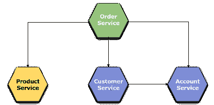
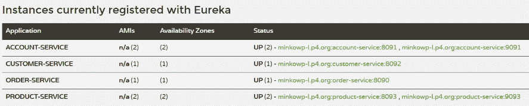
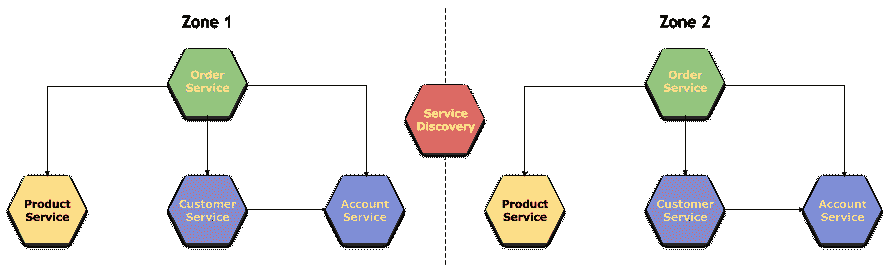
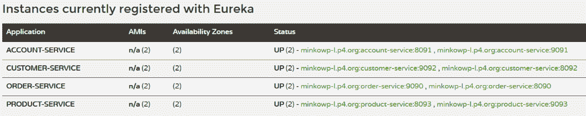

# 第六章：微服务间的通信

在过去的两章中，我们讨论了与微服务架构中非常重要的元素相关的细节——服务发现和配置服务器。然而，值得记住的是，它们存在于系统中的主要原因只是为了帮助管理整个独立、独立的应用程序集合。这种管理的一个方面是微服务间的通信。在这里，服务发现扮演着特别重要的角色，它负责存储和提供所有可用应用程序的网络位置。当然，我们可以想象我们的系统架构没有服务发现服务器。本章也将呈现这样一个示例。

然而，参与服务间通信最重要的组件是 HTTP 客户端和客户端负载均衡器。在本章中，我们将只关注它们。

本章我们将覆盖的主题包括：

+   使用 Spring `RestTemplate`进行带服务发现和不带服务发现的微服务间通信

+   自定义 Ribbon 客户端

+   描述 Feign 客户端提供的 main 特性，如与 Ribbon 客户端的集成、服务发现、继承和区域支持

# 不同的通信风格

我们可以识别出微服务间通信的不同风格。可以将它们分为两个维度进行分类。第一个维度是同步通信和异步通信协议的区分。异步通信的关键点是，客户端在等待响应时不应该阻塞线程。对于这种类型的通信，最流行的协议是 AMQP，我们在上一章的末尾已经有了使用该协议的示例。然而，服务间通信的主要方式仍然是同步 HTTP 协议。我们本章只讨论这个。

第二个维度是基于是否有单一的消息接收者或多个接收者来进行不同的通信类型区分。在一对一的通信中，每个请求都由一个确切的服务实例处理。在一对多的通信中，每个请求可能被多个不同的服务处理。这将在第十一章 *消息驱动的微服务* 中讨论。

# 使用 Spring Cloud 进行同步通信

Spring Cloud 提供了一系列组件，帮助你实现微服务之间的通信。第一个组件是 `RestTemplate`，它总是用于客户端消费 RESTful web 服务。它包含在 Spring Web 项目中。为了在一个微服务环境中有效地使用它，它应该用 `@LoadBalanced` 注解标记。得益于这一点，它会自动配置为使用 Netflix Ribbon，并能够利用服务发现，通过使用服务名称而不是 IP 地址。Ribbon 是客户端负载均衡器，它提供了一个简单的接口，允许控制 HTTP 和 TCP 客户端的行为。它可以轻松地与其他 Spring Cloud 组件集成，如服务发现或断路器，而且对开发者完全透明。下一个可用的组件是 Feign，来自 Netflix OSS 堆栈的声明式 REST 客户端。Feign 已经使用 Ribbon 进行负载均衡和从服务发现获取数据。它可以通过在接口方法上使用 `@FeignClient` 注解轻松声明。在本章中，我们将详细查看这里列出的所有组件。

# 使用 Ribbon 进行负载均衡

围绕 Ribbon 的主要概念是一个命名的 **客户端**。这就是为什么我们可以使用服务名称而不是带有主机名和端口的全地址来调用其他服务，而无需连接到服务发现。在这种情况下，地址列表应该在 `application.yml` 文件内的 Ribbon 配置设置中提供。

# 使用 Ribbon 客户端启用微服务之间的通信

让我们来看一个例子。这个例子包含四个独立的微服务。其中一些可能会调用其他微服务暴露的端点。应用程序源代码可以在以下链接找到：

链接：[`github.com/piomin/sample-spring-cloud-comm.git`](https://github.com/piomin/sample-spring-cloud-comm.git)。

在这个例子中，我们将尝试开发一个简单的订单系统，顾客可以购买产品。如果顾客决定确认购买的选定产品列表，`POST`请求将被发送到`order-service`。它由 REST 控制器内的`Order prepare(@RequestBody Order order) {...}`方法处理，该方法负责订单准备。首先，它通过调用`customer-service`中的适当 API 方法计算最终价格，考虑列表中每个产品的价格、顾客订单历史以及他们在系统中的类别。然后，它通过调用账户服务验证顾客的账户余额是否足够执行订单，并最终返回计算出的价格。如果顾客确认该操作，将调用`PUT /{id}`方法。请求由 REST 控制器内的`Order accept(@PathVariable Long id) {...}`方法处理。它更改订单状态并从顾客账户中提取资金。系统架构如以下所示分解为单独的微服务：



# 静态负载均衡配置

我们的`order-service`必须与示例中的所有其他微服务通信以执行所需操作。因此，我们需要定义三个不同的 Ribbon 客户端，并使用`ribbon.listOfServers`属性设置网络地址。示例中的第二件重要的事情是禁用默认启用的 Eureka 发现服务。以下是`order-service`在其`application.yml`文件中定义的所有属性：

```java
server:
 port: 8090

account-service:
 ribbon:
   eureka:
     enabled: false
   listOfServers: localhost:8091
customer-service:
 ribbon:
   eureka:
     enabled: false
   listOfServers: localhost:8092
product-service:
 ribbon:
   eureka:
     enabled: false
   listOfServers: localhost:8093
```

为了与 Ribbon 客户端一起使用`RestTemplate`，我们应该在项目中包含以下依赖关系：

```java
<dependency>
 <groupId>org.springframework.cloud</groupId>
 <artifactId>spring-cloud-starter-ribbon</artifactId>
</dependency>
<dependency>
 <groupId>org.springframework.boot</groupId>
 <artifactId>spring-boot-starter-web</artifactId>
</dependency>
```

然后，我们应该通过声明在`application.yml`中配置的名称列表来启用 Ribbon 客户端。为了实现这一点，您可以注解主类或任何其他 Spring 配置类为`@RibbonClients`。您还应该注册`RestTemplate`bean，并将其注解为`@LoadBalanced`，以启用与 Spring Cloud 组件的交互：

```java
@SpringBootApplication
@RibbonClients({
 @RibbonClient(name = "account-service"),
 @RibbonClient(name = "customer-service"),
 @RibbonClient(name = "product-service")
})
public class OrderApplication {

 @LoadBalanced
 @Bean
 RestTemplate restTemplate() {
     return new RestTemplate();
 } 

 public static void main(String[] args) {
     new SpringApplicationBuilder(OrderApplication.class).web(true).run(args);
 }
 // ...
}
```

# 调用其他服务

最后，我们可以开始实现负责提供微服务外暴露的 HTTP 方法的`OrderController`。它注入了`RestTemplate`bean，以便能够调用其他 HTTP 端点。您可以在以下代码片段中看到使用了在`application.yml`中配置的 Ribbon 客户端名称，而不是 IP 地址或主机名。使用相同的`RestTemplate`bean，我们可以与三个不同的微服务进行通信。让我们在这里讨论一下控制器中可用的方法。在实现的方法中，我们调用`product-service`的`GET`端点，它返回所选产品的详细信息列表。然后，我们调用`customer-service`暴露的`GET /withAccounts/{id}`方法。它返回带有其账户列表的客户详细信息。

现在，我们已经有了计算最终订单价格和验证客户在他们主账户中是否有足够资金所需的所有信息。`PUT`方法调用`account-service`的端点从客户账户中提取资金。我花了很多时间讨论了`OrderController`中可用的方法。然而，我认为这是必要的，因为同一个示例将用于展示提供微服务间同步通信机制的 Spring Cloud 组件的主要特性：

```java
@RestController
public class OrderController {

 @Autowired
 OrderRepository repository; 
 @Autowired
 RestTemplate template;

 @PostMapping
 public Order prepare(@RequestBody Order order) {
     int price = 0;
     Product[] products = template.postForObject("http://product-service/ids", order.getProductIds(), Product[].class);
     Customer customer = template.getForObject("http://customer-service/withAccounts/{id}", Customer.class, order.getCustomerId());
     for (Product product : products) 
         price += product.getPrice();
     final int priceDiscounted = priceDiscount(price, customer);
     Optional<Account> account = customer.getAccounts().stream().filter(a -> (a.getBalance() > priceDiscounted)).findFirst();
     if (account.isPresent()) {
         order.setAccountId(account.get().getId());
         order.setStatus(OrderStatus.ACCEPTED);
         order.setPrice(priceDiscounted);
     } else {
         order.setStatus(OrderStatus.REJECTED);
     }
     return repository.add(order);
 }

 @PutMapping("/{id}")
 public Order accept(@PathVariable Long id) {
     final Order order = repository.findById(id);
     template.put("http://account-service/withdraw/{id}/{amount}", null, order.getAccountId(), order.getPrice());
     order.setStatus(OrderStatus.DONE);
     repository.update(order);
     return order;
 }
 // ...
}
```

有趣的是，`customer-service`中的`GET /withAccounts/{id}`方法，它被`order-service`调用，也使用 Ribbon 客户端与另一个微服务`account-service`进行通信。以下是`CustomerController`中实现上述方法的片段：

```java
@GetMapping("/withAccounts/{id}")
public Customer findByIdWithAccounts(@PathVariable("id") Long id) {
 Account[] accounts = template.getForObject("http://account-service/customer/{customerId}", Account[].class, id);
 Customer c = repository.findById(id);
 c.setAccounts(Arrays.stream(accounts).collect(Collectors.toList()));
 return c;
}
```

首先，使用 Maven 命令`mvn clean install`构建整个项目。然后，您可以使用没有任何额外参数的`java -jar`命令以任何顺序启动所有微服务。可选地，您还可以从您的 IDE 中运行应用程序。每个微服务在启动时都会准备测试数据。没有持久化存储，所以重启后所有对象都会被清除。我们可以通过调用`order-service`暴露的`POST`方法来测试整个系统。以下是一个示例请求：

```java
$ curl -d '{"productIds": [1,5],"customerId": 1,"status": "NEW"}' -H "Content-Type: application/json" -X POST http://localhost:8090
```

如果您尝试发送这个请求，您将能够看到 Ribbon 客户端打印出以下日志：

```java
DynamicServerListLoadBalancer for client customer-service initialized: DynamicServerListLoadBalancer:{NFLoadBalancer:name=customer-service,current list of Servers=[localhost:8092],Load balancer stats=Zone stats: {unknown=[Zone:unknown; Instance count:1; Active connections count: 0; Circuit breaker tripped count: 0; Active connections per server: 0.0;]
},Server stats: [[Server:localhost:8092; Zone:UNKNOWN; Total Requests:0; Successive connection failure:0; Total blackout seconds:0; Last connection made:Thu Jan 01 01:00:00 CET 1970; First connection made: Thu Jan 01 01:00:00 CET 1970; Active Connections:0; total failure count in last (1000) msecs:0; average resp time:0.0; 90 percentile resp time:0.0; 95 percentile resp time:0.0; min resp time:0.0; max resp time:0.0; stddev resp time:0.0]
]}ServerList:com.netflix.loadbalancer.ConfigurationBasedServerList@7f1e23f6
```

本节描述的方法有一个很大的缺点，这使得它在由几个微服务组成的系统中不太可用。如果您有自动扩展，问题会更严重。很容易看出，所有服务的网络地址都必须手动管理。当然，我们可以将配置设置从每个胖 JAR 内的`application.yml`文件移动到配置服务器。然而，这并没有改变管理大量交互仍然会麻烦的事实。这种问题可以通过客户端负载均衡和服务发现之间的互动轻易解决。

# 使用与服务发现一起的 RestTemplate

实际上，与服务发现集成是 Ribbon 客户端的默认行为。正如您可能记得的，我们通过将`ribbon.eureka.enabled`属性设置为`false`来禁用客户端负载均衡的 Eureka。服务发现的存在简化了 Spring Cloud 组件在服务间通信时的配置，本节的示例就是如此。

# 构建示例应用程序

系统架构与之前的示例相同。要查看当前练习的源代码，你必须切换到`ribbon_with_discovery`分支 ([`github.com/piomin/shown here-spring-cloud-comm/tree/ribbon_with_discovery`](https://github.com/piomin/sample-spring-cloud-comm/tree/ribbon_with_discovery)).在那里，你首先看到的是一个新模块，`discovery-service`。我们在第四章，*服务发现*中详细讨论了与 Eureka 几乎所有相关方面，所以你应该不会有任何问题启动它。我们运行一个带有非常基本设置的单一独立 Eureka 服务器。它可在默认端口`8761`上访问。

与之前示例相比，我们应该删除所有严格与 Ribbon 客户端相关的配置和注解。取而代之的是，必须使用`@EnableDiscoveryClient`启用 Eureka 发现客户端，并在`application.yml`文件中提供 Eureka 服务器地址。现在，`order-service`的主类看起来像这样：

```java
@SpringBootApplication
@EnableDiscoveryClient
public class OrderApplication {

 @LoadBalanced
 @Bean
 RestTemplate restTemplate() {
 return new RestTemplate();
 }

 public static void main(String[] args) {
     new SpringApplicationBuilder(OrderApplication.class).web(true).run(args);
 }
 // ...
}
```

这是当前的配置文件。我用`spring.application.name`属性设置了服务的名称：

```java
spring: 
 application:
   name: order-service

server:
 port: ${PORT:8090}

eureka:
 client:
   serviceUrl:
     defaultZone: ${EUREKA_URL:http://localhost:8761/eureka/}
```

这就是之前的内容；我们同样启动所有的微服务。但是，这次`account-service`和`product-service`将各增加两个实例。启动每个服务的第二个实例时，默认的服务器端口可以通过`-DPORT`或`-Dserver.port`参数来覆盖，例如，`java -jar -DPORT=9093 product-service-1.0-SNAPSHOT.jar`。所有实例都已注册到 Eureka 服务器中。这可以通过其 UI 仪表板轻松查看：



这是本书中第一次看到负载均衡的实际例子。默认情况下，Ribbon 客户端将流量平均分配到微服务的所有注册实例。这种算法叫做**轮询**。实际上，这意味着客户端记得它上一次将请求转发到哪里，然后将当前请求发送到队列中的下一个服务。这种方法可以被我接下来详细介绍的其他规则覆盖。负载均衡也可以为前面没有服务发现的例子进行配置，通过在`ribbon.listOfServers`中设置一个以逗号分隔的服务地址列表，例如，`ribbon.listOfServers=localhost:8093,localhost:9093`。回到例子应用程序，`order-service`发送的请求将在`account-service`和`product-service`的两个实例之间进行负载均衡。这与上面截图中显示的`customer-service`类似，后者将在两个`account-service`实例之间分配流量。如果你启动了上一截图中 Eureka 仪表板上可见的所有服务实例，并向`order-service`发送一些测试请求，你肯定会看到我贴出的以下日志。我突出了 Ribbon 客户端显示目标服务找到的地址列表的片段：

```java
DynamicServerListLoadBalancer for client account-service initialized: DynamicServerListLoadBalancer:{NFLoadBalancer:name=account-service,current list of Servers=[minkowp-l.p4.org:8091, minkowp-l.p4.org:9091],Load balancer stats=Zone stats: {defaultzone=[Zone:defaultzone; Instance count:2; Active connections count: 0; Circuit breaker tripped count: 0; Active connections per server: 0.0;]
 },Server stats: [[Server:minkowp-l.p4.org:8091; Zone:defaultZone; Total Requests:0; Successive connection failure:0; Total blackout seconds:0; Last connection made:Thu Jan 01 01:00:00 CET 1970; First connection made: Thu Jan 01 01:00:00 CET 1970; Active Connections:0; total failure count in last (1000) msecs:0; average resp time:0.0; 90 percentile resp time:0.0; 95 percentile resp time:0.0; min resp time:0.0; max resp time:0.0; stddev resp time:0.0]
 , [Server:minkowp-l.p4.org:9091; Zone:defaultZone; Total Requests:0; Successive connection failure:0; Total blackout seconds:0; Last connection made:Thu Jan 01 01:00:00 CET 1970; First connection made: Thu Jan 01 01:00:00 CET 1970; Active Connections:0; total failure count in last (1000) msecs:0; average resp time:0.0; 90 percentile resp time:0.0; 95 percentile resp time:0.0; min resp time:0.0; max resp time:0.0; stddev resp time:0.0]
 ]}ServerList:org.springframework.cloud.netflix.ribbon.eureka.DomainExtractingServerList@3e878e67
```

# 使用 Feign 客户端

`RestTemplate`是 Spring 的一个组件，特别适用于与 Spring Cloud 和微服务进行交互。然而，Netflix 开发了自己的工具，作为 web 服务客户端，提供给独立的 REST 服务之间开箱即用的通信。Feign 客户端，在其中，通常与`RestTemplate`的`@LoadBalanced`注解做相同的事情，但以更优雅的方式。它是一个通过处理注解将其转换为模板化请求的 Java 到 HTTP 客户端绑定器。当使用 Open Feign 客户端时，你只需要创建一个接口并注解它。它与 Ribbon 和 Eureka 集成，提供一个负载均衡的 HTTP 客户端，从服务发现中获取所有必要的网络地址。Spring Cloud 为 Spring MVC 注解添加支持，并使用与 Spring Web 相同的 HTTP 消息转换器。

# 支持不同区域

让我回退一下，回到上一个例子。我打算对我们的系统架构做些改动以使其稍微复杂一些。当前的架构在下面的图表中有可视化展示。微服务之间的通信模型仍然是相同的，但现在我们启动每个微服务的两个实例并将它们分为两个不同的区域。关于区域划分机制已经在第四章、*服务发现*中讨论过，在讨论使用 Eureka 进行服务发现时，所以我想你们已经很熟悉了。这次练习的主要目的不仅是展示如何使用 Feign 客户端，还有微服务实例间通信中区域划分机制是如何工作的。那么我们从基础知识开始：



# 启用 Feign 应用程序

为了在项目中包含 Feign，我们必须添加依赖`spring-cloud-starter-feign`artifact 或`spring-cloud-starter-openfeign`对于 Spring Cloud Netflix 的最小版本 1.4.0：

```java
<dependency>
 <groupId>org.springframework.cloud</groupId>
 <artifactId>spring-cloud-starter-feign</artifactId>
</dependency>
```

下一步是启用应用程序中的 Feign，通过用`@EnableFeignClients`注解主类或配置类来实现。这个注解会导致搜索应用程序中所有实现的客户端。我们也可以通过设置`clients`或`basePackages`注解属性来减少使用的客户端数量，例如，`@EnableFeignClients(clients = {AccountClient.class, Product.class})`。这是`order-service`应用程序的主类：

```java
@SpringBootApplication
@EnableDiscoveryClient
@EnableFeignClients
public class OrderApplication {

    public static void main(String[] args) {
        new SpringApplicationBuilder(OrderApplication.class).web(true).run(args);
    }

    @Bean
    OrderRepository repository() {
        return new OrderRepository();
    }

}
```

# 构建 Feign 接口

一种只需要创建带有某些注解的接口来提供组件的方法是 Spring Framework 的标准做法。对于 Feign，必须用`@FeignClient(name = "...")`注解接口。它有一个必需的属性名，如果启用了服务发现，则对应于被调用的微服务名称。否则，它与`url`属性一起使用，我们可以设置一个具体的网络地址。`@FeignClient`并不是这里需要使用的唯一注解。我们客户端接口中的每个方法都通过用`@RequestMapping`或更具体的注解如`@GetMapping`、`@PostMapping`或`@PutMapping`来标记，与特定的 HTTP API 端点相关联，正如这个例子源代码片段中所示：

```java
@FeignClient(name = "account-service")
public interface AccountClient {
    @PutMapping("/withdraw/{accountId}/{amount}")
    Account withdraw(@PathVariable("accountId") Long id, @PathVariable("amount") int amount);
}

@FeignClient(name = "customer-service")
public interface CustomerClient {
    @GetMapping("/withAccounts/{customerId}")
    Customer findByIdWithAccounts(@PathVariable("customerId") Long customerId);
}

@FeignClient(name = "product-service")
public interface ProductClient {
    @PostMapping("/ids")
    List<Product> findByIds(List<Long> ids);
}
```

这样的组件可以被注入到控制器 bean 中，因为它们也是 Spring Beans。然后，我们只需调用它们的方法。以下是`order-service`中当前 REST 控制器的实现：

```java
@Autowired
OrderRepository repository;
@Autowired
AccountClient accountClient;
@Autowired
CustomerClient customerClient;
@Autowired
ProductClient productClient;

@PostMapping
public Order prepare(@RequestBody Order order) {
    int price = 0;
    List<Product> products = productClient.findByIds(order.getProductIds());
    Customer customer = customerClient.findByIdWithAccounts(order.getCustomerId());
    for (Product product : products)
        price += product.getPrice();
    final int priceDiscounted = priceDiscount(price, customer);
    Optional<Account> account = customer.getAccounts().stream().filter(a -> (a.getBalance() > priceDiscounted)).findFirst();
    if (account.isPresent()) {
        order.setAccountId(account.get().getId());
        order.setStatus(OrderStatus.ACCEPTED);
        order.setPrice(priceDiscounted);
    } else {
        order.setStatus(OrderStatus.REJECTED);
    }
    return repository.add(order);
}
```

# 启动微服务

我已经在`application.yml`中更改了所有微服务的配置。现在，有两个不同的配置文件，第一个用于将应用程序分配给`zone1`，第二个用于`zone2`。你可以从`feign_with_discovery`分支查看版本（[`github.com/piomin/shown here-spring-cloud-comm/tree/feign_with_discovery`](https://github.com/piomin/sample-spring-cloud-comm/tree/feign_with_discovery)）。然后，使用`mvn clean install`命令构建整个项目。应用应该使用`java -jar --spring.profiles.active=zone[n]`命令启动，其中`[n]`是区域编号。因为你要启动很多实例来执行那个测试，考虑通过设置`-Xmx`参数限制堆大小是有价值的，例如，`-Xmx128m`。以下是其中一个微服务当前的配置设置：

```java
spring: 
 application:
     name: account-service

---
spring:
 profiles: zone1
eureka:
 instance:
     metadataMap:
         zone: zone1
 client:
     serviceUrl:
        defaultZone: http://localhost:8761/eureka/
        preferSameZoneEureka: true
server: 
 port: ${PORT:8091}

---
spring:
 profiles: zone2
eureka:
 instance:
     metadataMap:
        zone: zone2
 client:
     serviceUrl:
        defaultZone: http://localhost:8761/eureka/
        preferSameZoneEureka: true
server: 
 port: ${PORT:9091}
```

我们将每个区域启动每一个微服务的一个实例。所以，有九个正在运行的 Spring Boot 应用程序，包括服务发现服务器，如图所示：



如果你向在`zone1`运行的`order-service`实例（`http://localhost:8090`）发送测试请求，所有流量都将转发到该区域的其他服务，`zone2`（`http://localhost:9090`）也是如此。我突出了 Ribbon 客户端在该区域注册的目标服务找到的地址列表的片段：

```java
DynamicServerListLoadBalancer for client product-service initialized: DynamicServerListLoadBalancer:{NFLoadBalancer:name=product-service,current list of Servers=[minkowp-l.p4.org:8093],Load balancer stats=Zone stats: {zone1=[Zone:zone1; Instance count:1; Active connections count: 0; Circuit breaker tripped count: 0; Active connections per server: 0.0;]...
```

# 继承支持

你可能已经注意到，控制器实现内部的注解和为该控制器服务的 REST 服务的 Feign 客户端实现是相同的。我们可以创建一个包含抽象 REST 方法定义的接口。这个接口可以被控制器类实现或者被 Feign 客户端接口扩展：

```java
public interface AccountService {

    @PostMapping
    Account add(@RequestBody Account account);

    @PutMapping
    Account update(@RequestBody Account account);

    @PutMapping("/withdraw/{id}/{amount}")
    Account withdraw(@PathVariable("id") Long id, @PathVariable("amount") int amount); 

    @GetMapping("/{id}")
    Account findById(@PathVariable("id") Long id); 

    @GetMapping("/customer/{customerId}")
    List<Account> findByCustomerId(@PathVariable("customerId") Long customerId); 

    @PostMapping("/ids")
    List<Account> find(@RequestBody List<Long> ids); 

    @DeleteMapping("/{id}")
    void delete(@PathVariable("id") Long id);

}
```

现在，控制器类为基本接口提供了所有方法的实现，但并未包含任何 REST 映射注解，而只用了`@RestController`。以下是`account-service`控制器的片段：

```java
@RestController
public class AccountController implements AccountService {

    @Autowired
    AccountRepository repository;

    public Account add(@RequestBody Account account) {
        return repository.add(account);
    }
    // ...
}
```

调用`account-service`的 Feign 客户端接口不提供任何方法。它只是扩展了基础接口，`AccountService`。要查看基于接口和 Feign 继承的全实现，切换到`feign_with_inheritance`分支：

[`github.com/piomin/shown here-spring-cloud-comm/tree/feign_with_inheritance`](https://github.com/piomin/sample-spring-cloud-comm/tree/feign_with_inheritance)

以下是一个带有继承支持的 Feign 客户端声明示例。它扩展了`AccountService`接口，因此处理了所有由`@RestController`暴露的方法：

```java
@FeignClient(name = "account-service")
public interface AccountClient extends AccountService {
}
```

# 手动创建客户端

如果你不喜欢注解式的风格，你总是可以手动创建一个 Feign 客户端，使用 Feign Builder API。Feign 有多个可以自定义的功能，比如消息的编码器和解码器或 HTTP 客户端实现：

```java
AccountClient accountClient = Feign.builder().client(new OkHttpClient())
    .encoder(new JAXBEncoder())
    .decoder(new JAXBDecoder())
    .contract(new JAXRSContract())
    .requestInterceptor(new BasicAuthRequestInterceptor("user", "password"))
    .target(AccountClient.class, "http://account-service");
```

# 客户端定制

客户端定制不仅可以使用 Feign Builder API 完成，还可以通过使用注解风格来进行。我们可以通过设置`@FeignClient`的`configuration`属性来提供一个配置类：

```java
@FeignClient(name = "account-service", configuration = AccountConfiguration.class)
```

以下是一个配置 bean 的示例：

```java
@Configuration
public class AccountConfiguration {
 @Bean
 public Contract feignContract() {
     return new JAXRSContract();
 }

 @Bean
 public Encoder feignEncoder() {
     return new JAXBEncoder();
 }

 @Bean
 public Decoder feignDecoder() {
     return new JAXBDecoder();
 }

 @Bean
 public BasicAuthRequestInterceptor basicAuthRequestInterceptor() {
     return new BasicAuthRequestInterceptor("user", "password");
 }
}
```

Spring Cloud 支持以下属性通过声明 Spring Beans 来覆盖：

+   `Decoder`：默认是`ResponseEntityDecoder`。

+   `Encoder`：默认是`SpringEncoder`。

+   `Logger`：默认是`Slf4jLogger`。

+   `Contract`：默认是`SpringMvcContract`。

+   `Feign.Builder`：默认是`HystrixFeign.Builder`。

+   `Client`：如果启用了 Ribbon，则是`LoadBalancerFeignClient`；否则，使用默认的 Feign 客户端。

+   `Logger.Level`：它为 Feign 设置了默认日志级别。你可以选择`NONE`、`BASIC`、`HEADERS`和`FULL`之间的一种。

+   `Retryer`：它允许在通信失败时实现重试算法。

+   `ErrorDecoder`：它允许将 HTTP 状态码映射为特定于应用程序的异常。

+   `Request.Options`：它允许为请求设置读取和连接超时。

+   `Collection<RequestInterceptor>`：已注册的`RequestInterceptor`实现集合，根据从请求中获取的数据执行某些操作。

Feign 客户端也可以通过配置属性进行定制。通过在`feign.client.config`属性前缀后提供其名称，可以覆盖所有可用客户端的设置，或仅覆盖单个选定客户端的设置。如果我们设置名为`default`而不是特定客户端名称，它将应用于所有 Feign 客户端。当使用`@EnableFeignClients`注解及其`defaultConfiguration`属性时，也可以在`appplication.yml`文件中指定默认配置。提供的设置始终优先于`@Configuration` bean。如果想要改变这种方法，优先使用`@Configuration`而不是 YAML 文件，你应该将`feign.client.default-to-properties`属性设置为`false`。以下是一个为`account-service`设置连接超时、HTTP 连接的读取超时和日志级别的 Feign 客户端配置示例：

```java
feign:
 client:
   config:
     account-service:
       connectTimeout: 5000
       readTimeout: 5000
       loggerLevel: basic
```

# 摘要

在本章中，我们已经启动了几个相互通信的微服务。我们讨论了诸如 REST 客户端的不同实现、多个实例之间的负载均衡以及与服务发现集成等主题。在我看来，这些方面是如此重要，以至于我决定用两章的篇幅来描述它们。本章应被视为微服务间通信主题的介绍，以及对微服务架构中其他重要组件集成的讨论。下一章将展示负载均衡器和 REST 客户端的高级使用，特别关注网络和通信问题。阅读完本章后，您应该能够在自己的应用程序中正确使用 Ribbon、Feign，甚至`RestTemplate`，并将它们连接到 Spring Cloud 的其他组件。

在大多数情况下，这些知识已经足够。然而，有时您可能需要自定义客户端负载均衡器配置，或者启用像断路器或回退这样的更高级的通信机制。理解这些解决方案及其对您系统中微服务间通信的影响是很重要的。我们将在下一章中讨论它们。
