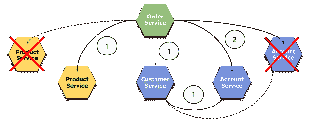
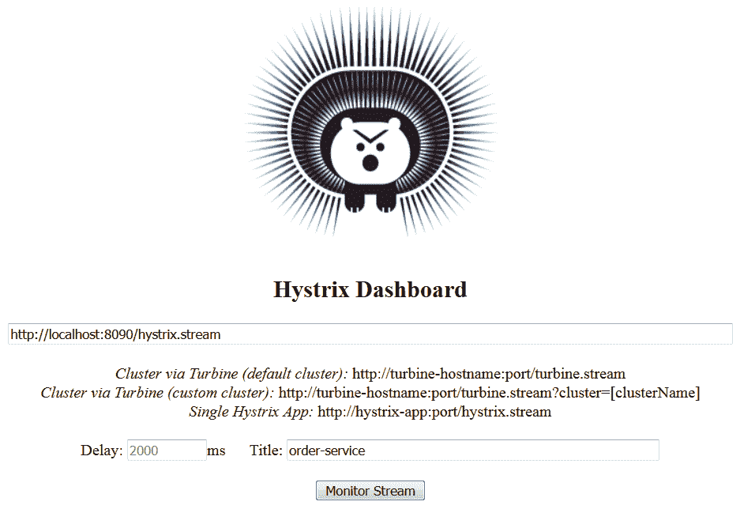
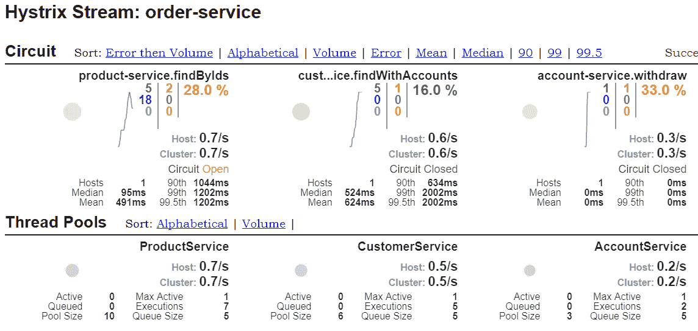
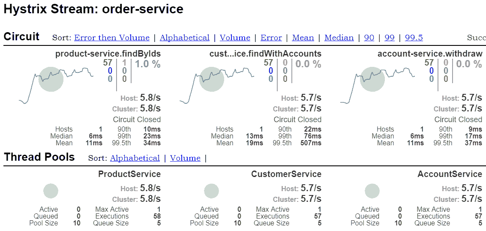
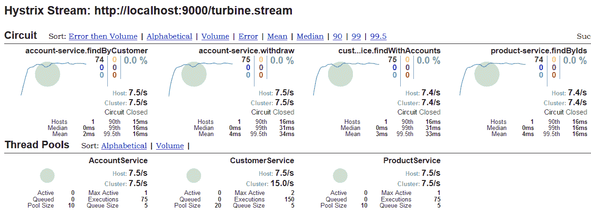

# 第七章：高级负载均衡和断路器

在本章中，我们将继续讨论前一章中讨论的主题，即服务间通信。我们将扩展到更高级的负载均衡、超时和断路示例。

Spring Cloud 提供了使微服务间通信简单而优雅的功能。然而，我们绝不能忘记，这样的通信所面临的的主要困难涉及所涉及系统的处理时间。如果您系统中有很多微服务，您需要处理的第一个问题之一是延迟问题。在本章中，我想讨论一些 Spring Cloud 功能，帮助我们避免由于服务间处理单个输入请求时的许多跃点、多个服务的缓慢响应或服务的暂时不可用而引起的延迟问题。处理部分失败有几种策略，包括设置网络超时、限制等待请求的数量、实现不同的负载均衡方法，或设置断路器模式和回退实现。

我们还将再次讨论 Ribbon 和 Feign 客户端，这次重点关注它们更高级的配置功能。在这里将介绍一个全新的库，即 Netflix Hystrix。这个库实现了断路器模式。

本章我们将覆盖以下主题：

+   使用 Ribbon 客户端的不同负载均衡算法

+   启用应用程序的断路器

+   使用配置属性自定义 Hystrix

+   使用 Hystrix 仪表板监控服务间通信

+   使用 Hystrix 和 Feign 客户端一起

# 负载均衡规则

Spring Cloud Netflix 提供了不同的负载均衡算法，以向用户提供不同的好处。您支持的方法选择取决于您的需求。在 Netflix OSS 命名法中，此算法称为**规则**。自定义规则类应实现`IRule`基础接口。以下实现默认情况下在 Spring Cloud 中可用：

+   `RoundRobinRule`：此规则简单地使用众所周知的轮询算法选择服务器，其中传入请求按顺序分配到所有实例。它通常用作默认规则或更高级规则的回退，例如`ClientConfigEnabledRoundRobinRule`和`ZoneAvoidanceRule`。`ZoneAvoidanceRule`是 Ribbon 客户端的默认规则。

+   `AvailabilityFilteringRule`：This rule will skip servers that are marked as circuit tripped or with a high number of concurrent connections. It also uses `RoundRobinRule` as a base class. By default, an instance is circuit tripped if an HTTP client fails to establish a connection with it three times in a row. This approach may be customized with the `niws.loadbalancer.<clientName>.connectionFailureCountThreshold` property. Once an instance is circuit tripped, it will remain in this state for the next 30 seconds before the next retry. This property may also be overridden in the configuration settings.

+   `WeightedResponseTimeRule`： with this implementation, a traffic volume forwarder to the instance is inversely proportional to the instance's average response time. In other words, the longer the response time, the less weight it will get. In these circumstances, a load balancing client will record the traffic and response time of every instance of the service.

+   `BestAvailableRule`：According to the description from the class documentation, this rule skips servers with *tripped* circuit breakers and picks the server with the lowest concurrent requests.

跳闸断路器是一个来自电气工程的术语，指的是电路中没有电流流动。在 IT 术语中，它指的是发送给服务器的连续请求失败次数过多，因此客户端软件会立即中断对远程服务的进一步调用，以减轻服务器端应用程序的负担。

# 权重响应时间规则

直到现在，我们通常还通过从网页浏览器或 REST 客户端调用服务来手动测试服务。目前的更改不允许采用这种方法，因为我们需要为服务设置模拟延迟，以及生成许多 HTTP 请求。

# 介绍 Hoverfly 用于测试

在此阶段，我想介绍一个可能完美解决这类测试的有趣框架。我指的是 Hoverfly，一个轻量级的服务虚拟化工具，用于模拟或虚拟 HTTP 服务。它最初是用 Go 编写的，但还为您提供了用于管理 Hoverfly 的 Java 语言的丰富 API。由 SpectoLabs 维护的 Hoverfly Java 提供了用于抽象二进制和 API 调用、创建模拟的 DSL 以及与 JUnit 测试框架集成的类。我喜欢这个框架的一个功能。您可以通过在 DSL 定义中调用一个方法，轻松地为每个模拟服务添加延迟。为了使 Hoverfly 适用于您的项目，您必须在 Maven `pom.xml`中包含以下依赖项：

```java
<dependency>
    <groupId>io.specto</groupId>
    <artifactId>hoverfly-java</artifactId>
    <version>0.9.0</version>
    <scope>test</scope>
</dependency>
```

# 测试规则

我们在这里讨论的样本可以在 GitHub 上找到。要访问它，你必须切换到`weighted_lb`分支（[`github.com/piomin/sample-spring-cloud-comm/tree/weighted_lb`](https://github.com/piomin/sample-spring-cloud-comm/tree/weighted_lb)）。我们的 JUnit 测试类，名为`CustomerControllerTest`，位于`src/test/Java`目录下。为了在测试中启用 Hoverfly，我们应该定义 JUnit `@ClassRule`。`HoverflyRule`类提供了一个 API，允许我们模拟具有不同地址、特性和响应的许多服务。在下面的源代码片段中，你可以看到我们的示例微服务`account-service`的两个实例被声明在`@ClassRule`中。正如你可能记得的，那个服务已经被`customer-service`和`order-service`调用过。

让我们来看一下`customer-service`模块中的一个测试类。它模拟了`GET /customer/*`方法，并为`account-service`的两个实例（分别监听端口`8091`和`9091`）定义了一个预定义的响应。其中第一个实例延迟了`200`毫秒，而第二个实例延迟了`50`毫秒：

```java
@ClassRule
public static HoverflyRule hoverflyRule = HoverflyRule
 .inSimulationMode(dsl(
 service("account-service:8091")
     .andDelay(200, TimeUnit.MILLISECONDS).forAll()
     .get(startsWith("/customer/"))
     .willReturn(success("[{\"id\":\"1\",\"number\":\"1234567890\",\"balance\":5000}]", "application/json")),
 service("account-service:9091")
     .andDelay(50, TimeUnit.MILLISECONDS).forAll()
     .get(startsWith("/customer/"))
     .willReturn(success("[{\"id\":\"2\",\"number\":\"1234567891\",\"balance\":8000}]", "application/json"))))
 .printSimulationData();
```

在运行测试之前，我们还应该修改`ribbon.listOfServers`配置文件，将其更改为`listOfServers: account-service:8091, account-service:9091`。我们只有在使用 Hoverfly 时才应该进行这样的修改。

这是一个调用`customer-service`暴露的`GET /withAccounts/ {id}`端点的`test`方法，调用次数为一千次。反过来，它调用了`account-service`的`GET customer/{customerId}`端点，带有客户拥有的账户列表。每个请求都使用`WeightedResponseTimeRule`在`account-service`的两个实例之间进行负载均衡：

```java
@RunWith(SpringRunner.class)
@SpringBootTest(webEnvironment = WebEnvironment.DEFINED_PORT)
public class CustomerControllerTest {

    private static Logger LOGGER = LoggerFactory.getLogger(CustomerControllerTest.class);

    @Autowired
    TestRestTemplate template; 
    // ...

    @Test
    public void testCustomerWithAccounts() {
        for (int i = 0; i < 1000; i++) {
            Customer c = template.getForObject("/withAccounts/{id}", Customer.class, 1);
            LOGGER.info("Customer: {}", c);
        }
    }

}
```

使用加权响应规则实现的工作方法真的很有趣。就在开始测试后，传入的请求在`account-service`的两个实例之间以 50:50 的比例进行了负载均衡。但是，过了一段时间后，大部分请求都被转发到了延迟较小的实例。

最后，在我的本地机器上启动的 JUnit 测试中，端口`9091`上的实例处理了 731 个请求，端口`8091`上的实例处理了 269 个请求。然而，在测试结束时，比例看起来有点不同，并且倾向于延迟较小的实例，其中传入流量在两个实例之间以 4:1 的比例进行了加权。

现在，我们将稍微改变一下我们的测试用例，通过添加一个延迟大约 10 秒的`account-service`的第三个实例。这个改动旨在模拟 HTTP 通信中的超时。以下是 JUnit `@ClassRule`定义中的一个片段，最新的服务实例监听在端口`10091`上：

```java
service("account-service:10091")
    .andDelay(10000, TimeUnit.MILLISECONDS).forAll()
    .get(startsWith("/customer/"))
    .willReturn(success("[{\"id\":\"3\",\"number\":\"1234567892\",\"balance\":10000}]", "application/json"))
```

我们应该相应地在 Ribbon 配置中进行更改，以启用对`account-service`最新实例的负载均衡：

```java
listOfServers: account-service:8091, account-service:9091, account-service:10091
```

最后一个需要更改的东西，但在之前的测试用例中保持不变，就是`RestTemplate`bean 的声明。在这个实例中，我将读取和连接超时都设置为 1 秒，因为测试中启动的`account-service`的第三个实例延迟了 10 秒。每发送一个请求都会在 1 秒后因超时而终止：

```java
@LoadBalanced
@Bean
RestTemplate restTemplate(RestTemplateBuilder restTemplateBuilder) {
    return restTemplateBuilder
        .setConnectTimeout(1000)
        .setReadTimeout(1000)
        .build();
}
```

如果您像以前那样运行相同的测试，结果将不令人满意。所有声明的实例之间的分布将是 420，由端口`8091`上的实例处理（延迟 200 毫秒），468，由端口`9091`上的实例处理（延迟 50 毫秒），而 112 发送到第三个实例，由超时终止。我为什么引用这些统计数据？我们可以将默认负载均衡规则从`WeightedResponseTimeRule`更改为`AvailabilityFilteringRule`，并重新运行测试。如果我们这样做，496 个请求将发送给第一个和第二个实例，而只有 8 个请求将发送给第三个实例，有一个 1 秒的超时。有趣的是，如果您将`BestAvailableRule`设置为默认规则，所有请求都将发送到第一个实例。

现在您阅读了此示例，可以轻松地看到 Ribbon 客户端所有可用负载均衡规则之间的区别。

# 自定义 Ribbon 客户端

Ribbon 客户端的几个配置设置可以通过 Spring bean 声明来覆盖。与 Feign 一样，它应该在名为 configuration 的客户端注解字段中声明，例如，`@RibbonClient(name = "account-service", configuration = RibbonConfiguration.class)`。使用这种方法可以自定义以下功能：

+   `IClientConfig`：此接口的默认实现是`DefaultClientConfigImpl`。

+   `IRule`：此组件用于从列表中确定应选择哪个服务实例。`ZoneAvoidanceRule`实现类是自动配置的。

+   `IPing`：这是一个在后台运行的组件。它负责确保服务实例正在运行。

+   `ServerList<Server>`：这可以是静态的或动态的。如果是动态的（如`DynamicServerListLoadBalancer`所使用），后台线程将在预定义的间隔刷新和过滤列表。默认情况下，Ribbon 使用从配置文件中获取的服务器静态列表。它由`ConfigurationBasedServerList`实现。

+   `ServerListFilter<Server>`：`ServerListFilter`是`DynamicServerListLoadBalancer`用来过滤`ServerList`实现返回的服务器的组件。该接口有两个实现——自动配置的`ZonePreferenceServerListFilter`和`ServerListSubsetFilter`。

+   `ILoadBalancer`：此组件负责在客户端侧对服务的可用实例进行负载均衡。默认情况下，Ribbon 使用`ZoneAwareLoadBalancer`。

+   `ServerListUpdater`：它负责更新给定应用程序可用的实例列表。默认情况下，Ribbon 使用 `PollingServerListUpdater`。

让我们来看一个定义 `IRule` 和 `IPing` 组件默认实现的配置类示例。这样的配置可以定义为单个 Ribbon 客户端，也可以定义为应用程序类路径中可用的所有 Ribbon 客户端，通过提供 `@RibbonClients(defaultConfiguration = RibbonConfiguration.class)` 注解来实现：

```java
@Configuration
public class RibbonConfiguration {

    @Bean
    public IRule ribbonRule() {
        return new WeightedResponseTimeRule();
    }

    @Bean
    public IPing ribbonPing() {
        return new PingUrl();
    }

}
```

即使你没有 Spring 的经验，你可能也已经猜到（根据之前的示例），配置也可以通过使用 `properties` 文件进行自定义。在这种情况下，Spring Cloud Netflix 与 Netflix 提供的 Ribbon 文档中描述的属性兼容。以下类是支持的属性，它们应该以 `<clientName>.ribbon` 开头，或者如果它们适用于所有客户端，以 `ribbon` 开头：

+   `NFLoadBalancerClassName`：`ILoadBalancer` 默认实现类

+   `NFLoadBalancerRuleClassName`：`IRule` 默认实现类

+   `NFLoadBalancerPingClassName`：`IPing` 默认实现类

+   `NIWSServerListClassName`：`ServerList` 默认实现类

+   `NIWSServerListFilterClassName`：`ServerListFilter` 默认实现类

以下是一个与前面 `@Configuration` 类相似的示例，它覆盖了 Spring Cloud 应用程序使用的 `IRule` 和 `IPing` 默认实现：

```java
account-service:
 ribbon:
   NFLoadBalancerPingClassName: com.netflix.loadbalancer.PingUrl
   NFLoadBalancerRuleClassName: com.netflix.loadbalancer.WeightedResponseTimeRule
```

# Hystrix 电路断路器模式

我们已经讨论了 Spring Cloud Netflix 中负载均衡算法的不同实现。其中一些是基于监控实例响应时间或失败次数。在这些情况下，负载均衡器根据这些统计数据来决定调用哪个实例。电路断路器模式应被视为该解决方案的扩展。电路断路器背后的主要想法非常简单。一个受保护的函数调用被包装在一个电路断路器对象中，该对象负责监控失败调用次数。如果失败次数达到阈值，电路将打开，所有后续调用都将自动失败。通常，如果电路断路器触发，也希望有一种监控警报。应用程序中使用电路断路器模式的一些关键好处是，当相关服务失败时能够继续运行，防止级联失败，并给失败的服务时间来恢复。

# 使用 Hystrix 构建应用程序

Netflix 在他们的库中提供了一个名为 **Hystrix** 的断路器模式的实现。这个库也被作为 Spring Cloud 的默认断路器实现。Hystrix 还有一些其他有趣的特性，也应该被视为一个用于处理分布式系统延迟和容错的综合工具。重要的是，如果打开断路器，Hystrix 将所有调用重定向到指定的回退方法。回退方法被设计为提供一个不依赖于网络的通用响应，通常从内存缓存中读取或简单实现为静态逻辑。如果需要执行网络调用，建议您使用另一个 `HystrixCommand` 或 `HystrixObservableCommand` 来实现。为了在您的项目中包含 Hystrix，您应该使用 `spring-cloud-starter-netflix-hystrix` 或 `spring-cloud-starter-hystrix` 作为 Spring Cloud Netflix 1.4.0 版本之前的启动器：

```java
<dependency>
    <groupId>org.springframework.cloud</groupId>
    <artifactId>spring-cloud-starter-hystrix</artifactId>
</dependency>
```

# 实现 Hystrix 的命令

Spring Cloud Netflix Hystrix 会寻找带有 `@HystrixCommand` 注解的方法，然后将其包装在连接到断路器的代理对象中。正因为如此，Hystrix 能够监控这类方法的所有的调用。这个注解目前只对标记有 `@Component` 或 `@Service` 的类有效。这对我们来说是很重要的信息，因为我们已经在带有 `@RestController` 注解的 REST 控制器类中实现了与其它服务调用相关的所有逻辑。所以，在 `customer-service` 应用程序中，所有那部分逻辑都被移动到了新创建的 `CustomerService` 类中，然后将其注入到控制器 bean 中。负责与 `account-service` 通信的方法已经被标记为 `@HystrixCommand`。我还实现了一个回退方法，其名称传递到 `fallbackMethod` 注解的字段中。这个方法只返回一个空列表：

```java
@Service
public class CustomerService {

    @Autowired
    RestTemplate template;
    @Autowired
    CustomerRepository repository;
    // ...

    @HystrixCommand(fallbackMethod = "findCustomerAccountsFallback")
    public List<Account> findCustomerAccounts(Long id) {
        Account[] accounts = template.getForObject("http://account-service/customer/{customerId}", Account[].class, id);
        return Arrays.stream(accounts).collect(Collectors.toList());
    }

    public List<Account> findCustomerAccountsFallback(Long id) {
        return new ArrayList<>();
    }

}
```

不要忘记用`@EnableHystrix`标记你的主类，这是告诉 Spring Cloud 应该为应用程序使用断路器所必需的。我们也可以选择性地用`@EnableCircuitBreaker`注解一个类，它也能起到同样的作用。为了测试目的，`account-service.ribbon.listOfServers`属性应该包含`localhost:8091, localhost:9091`服务两个实例的网络地址。虽然我们为 Ribbon 客户端声明了两个`account-service`实例，但我们将在`8091`端口上启动唯一可用的一个。如果你调用`customer-service`方法的`GET http://localhost:8092/withAccounts/{id}`，Ribbon 将尝试将在两个声明的实例之间平衡每个传入请求，即，一旦你收到包含账户列表的响应，第二次收到空账户列表，或相反。以下应用日志的片段说明了这一点。以下是对应用日志的一个片段。要访问示例应用程序的源代码，你应该切换到与前章示例相同的 GitHub 仓库中的`hystrix_basic`分支：（https://github.com/piomin/sample-spring-cloud-comm/tree/hystrix_basic）

```java
{"id":1,"name":"John Scott","type":"NEW","accounts":[]}
{"id":1,"name":"John Scott","type":"NEW","accounts":[{"id":1,"number":"1234567890","balance":5000},{"id":2,"number":"1234567891","balance":5000},{"id":3,"number":"1234567892","balance":0}]}
```

# 实现带有缓存数据的回退

前面示例中呈现的回退实现非常简单。对于在生产环境中运行的应用程序来说，返回一个空列表并没有多大意义。在请求失败时，例如从缓存中读取数据时，在应用程序中使用回退方法更有意义。这样的缓存可以在客户端应用程序内部实现，也可以使用第三方工具实现，如 Redis、Hazelcast 或 EhCache。最简单的实现是在 Spring 框架内部提供的，在将`spring-boot-starter-cache` artifact 包含在依赖项之后可以使用。要为 Spring Boot 应用程序启用缓存，你应该用`@EnableCaching`注解标注主类或配置类，并提供以下上下文中的`CacheManager` bean：

```java
@SpringBootApplication
@RibbonClient(name = "account-service")
@EnableHystrix
@EnableCaching
public class CustomerApplication {

    @LoadBalanced
    @Bean
    RestTemplate restTemplate() {
        return new RestTemplate();
    }

    public static void main(String[] args) {
        new SpringApplicationBuilder(CustomerApplication.class).web(true).run(args);
    }

    @Bean
    public CacheManager cacheManager() {
        return new ConcurrentMapCacheManager("accounts");
    }
    // ...

}
```

然后，你可以使用`@CachePut`注解标记被电路 breaker 包裹的方法。这会将调用方法的返回结果添加到缓存映射中。在这种情况下，我们的映射名为`accounts`。最后，您可以在回退方法实现内部直接调用`CacheManager` bean 来读取数据。如果你多次重试同一个请求，你会看到空账户列表不再作为响应返回。相反，服务总是返回在第一次成功调用期间缓存的数据：

```java
@Autowired
CacheManager cacheManager;
@CachePut("accounts")
@HystrixCommand(fallbackMethod = "findCustomerAccountsFallback")
public List<Account> findCustomerAccounts(Long id) {
    Account[] accounts = template.getForObject("http://account-service/customer/{customerId}", Account[].class, id);
    return Arrays.stream(accounts).collect(Collectors.toList());
}

public List<Account> findCustomerAccountsFallback(Long id) {
    ValueWrapper w = cacheManager.getCache("accounts").get(id);
    if (w != null) {
        return (List<Account>) w.get();
    } else {
    return new ArrayList<>();
    }
}
```

# 触发断路器

让我给你提个练习题。到目前为止，你已经学会了如何使用 Hystrix，结合 Spring Cloud，在应用程序中启用和实现断路器，以及如何使用回退方法从缓存中获取数据。但你还没有使用过触发断路器来防止负载均衡器调用失败实例。现在，我想配置 Hystrix，在失败率超过`30`%的情况下，在三次失败的调用尝试后打开电路，并在接下来的 5 秒钟内防止 API 方法被调用。测量时间窗口大约是`10`秒。为了满足这些要求，我们必须重写几个默认的 Hystrix 配置设置。这可以在`@HystrixCommand`内的`@HystrixProperty`注解中执行。

以下是`customer-service`中获取账户列表方法的当前实现：

```java
@CachePut("accounts")
@HystrixCommand(fallbackMethod = "findCustomerAccountsFallback",
 commandProperties = {
    @HystrixProperty(name = "execution.isolation.thread.timeoutInMilliseconds", value = "500"),
    @HystrixProperty(name = "circuitBreaker.requestVolumeThreshold", value = "10"),
    @HystrixProperty(name = "circuitBreaker.errorThresholdPercentage", value = "30"),
    @HystrixProperty(name = "circuitBreaker.sleepWindowInMilliseconds", value = "5000"),
    @HystrixProperty(name = "metrics.rollingStats.timeInMilliseconds", value = "10000")
 }
)
public List<Account> findCustomerAccounts(Long id) {
    Account[] accounts = template.getForObject("http://account-service/customer/{customerId}", Account[].class, id);
    return Arrays.stream(accounts).collect(Collectors.toList());
}
```

关于 Hystrix 配置属性的完整列表，可以在 Netflix 的 GitHub 网站上找到，网址为[`github.com/Netflix/Hystrix/wiki/Configuration`](https://github.com/Netflix/Hystrix/wiki/Configuration)。我不会讨论所有属性，只讨论微服务间通信最重要的属性。以下是我们在示例中使用的属性列表及其描述：

+   `execution.isolation.thread.timeoutInMilliseconds`：此属性设置在发生读取或连接超时的时间（以毫秒为单位），之后客户端将离开命令执行。Hystrix 将此类方法调用标记为失败，并执行回退逻辑。可以通过将`command.timeout.enabled`属性设置为`false`来完全关闭超时。默认值为 1,000 毫秒。

+   `circuitBreaker.requestVolumeThreshold`：此属性设置在滚动窗口中触发电路的最小请求数量。默认值是 20。在我们的示例中，此属性设置为`10`，这意味着前九个请求不会触发电路，即使它们都失败了。我设置这个值是因为我们假设如果`30`%的传入请求失败，电路应该被打开，但最少传入请求数量是三个。

+   `circuitBreaker.errorThresholdPercentage`：此属性设置最小的错误百分比。超过此百分比将导致打开电路，系统开始短路请求以执行回退逻辑。默认值是 50。我将其设置为`30`，因为在我们示例中，我希望`30`%的失败请求应该打开电路。

+   `circuitBreaker.sleepWindowInMilliseconds`：此属性设置在触发电路和允许尝试以确定是否应再次关闭电路之间的时间间隔。在这段时间内，所有传入请求都被拒绝。默认值是`5,000`。因为我们希望电路打开后在`10`秒内等待第一次调用被退休，所以我将其设置为`10,000`。

+   `metrics.rollingStats.timeInMilliseconds`：这个属性设置了统计滚动窗口的持续时间，单位为毫秒。Hystrix 就是用这个时间来保持电路断路器使用的指标和发布用的。

使用这些设置，我们可以运行与之前例子相同的 JUnit 测试。我们使用`HoverflyRule`启动两个`account-service`的存根。其中的第一个会被延迟 200 毫秒，而第二个延迟 2000 毫秒的会超过`@HystrixCommand`中`execution.isolation.thread.timeoutInMilliseconds`属性的设置。运行 JUnit`CustomerControllerTest`后，查看打印的日志。我插入了我机器上运行的测试的日志。`customer-service`的第一个请求会被负载均衡到第一个延迟 200 毫秒的实例`(1)`。发送到`9091`端口可用的实例的每个请求，在一秒后都会超时完成。在发送 10 个请求后，第一个失败触发了电路的断开`(2)`。然后，在接下来的 10 秒内，每个请求都由回退方法处理，返回缓存数据`(3)`、`(4)`。10 秒后，客户端再次尝试调用`account-service`的实例并成功`(5)`，因为它击中了延迟 200 毫秒的实例。这次成功导致电路关闭。不幸的是，`account-service`的第二个实例仍然响应缓慢，所以整个场景再次重演，直到 JUnit 测试结束`(6)`和`(7)`。这个详细的描述准确地展示了 Spring Cloud 中的 Hystrix 电路断路器是如何工作的：

```java
16:54:04+01:00 Found response delay setting for this request host: {account-service:8091 200} // (1)
16:54:05+01:00 Found response delay setting for this request host: {account-service:9091 2000}
16:54:05+01:00 Found response delay setting for this request host: {account-service:8091 200}
16:54:06+01:00 Found response delay setting for this request host: {account-service:9091 2000}
16:54:06+01:00 Found response delay setting for this request host: {account-service:8091 200}
...
16:54:09+01:00 Found response delay setting for this request host: {account-service:9091 2000} // (2)
16:54:10.137 Customer [id=1, name=John Scott, type=NEW, accounts=[Account [id=1, number=1234567890, balance=5000]]] // (3)
...
16:54:20.169 Customer [id=1, name=John Scott, type=NEW, accounts=[Account [id=1, number=1234567890, balance=5000]]] // (4)
16:54:20+01:00 Found response delay setting for this request host: {account-service:8091 200} // (5)
16:54:20+01:00 Found response delay setting for this request host: {account-service:9091 2000}
16:54:21+01:00 Found response delay setting for this request host: {account-service:8091 200}
...
16:54:25+01:00 Found response delay setting for this request host: {account-service:8091 200} // (6)
16:54:26.157 Customer [id=1, name=John Scott, type=NEW, accounts=[Account [id=1, number=1234567890, balance=5000]]] // (7)
```

# 监控延迟和容错

如我前面所提到的，Hystrix 不仅仅是一个实现断路器模式的简单工具。它是一个解决方案，用于处理分布式系统中的延迟和容错。Hystrix 提供的一个有趣功能是可以暴露与服务间通信相关的最重要的指标，并通过 UI 仪表板显示出来。这个功能适用于用 Hystrix 命令包装的客户端。

在之前的某些示例中，我们分析了我们系统的一部分，以模拟`customer-service`和`account-service`之间的通信延迟。当测试高级负载均衡算法或不同的断路器配置设置时，这是一种非常好的方法，但现在我们将回到分析我们示例系统的整体设置，作为一个独立的 Spring Boot 应用程序集合。这使我们能够观察到 Spring Cloud 与 Netflix OSS 工具结合在一起，如何帮助我们监控和响应微服务之间的通信延迟问题和故障。示例系统以一种简单的方式模拟了一个故障。它有一个静态配置，包含了两个实例`account-service`和`product-service`的网络地址，但每个服务只运行一个实例。

为了使您记忆犹新，以下是我们样本系统的架构，考虑到关于失败的假设：



这次，我们将以一种稍微不同方式开始，进行一个测试。以下是正在循环调用测试方法的片段。首先，它调用来自`order-service`的`POST http://localhost:8090/`端点，发送一个`Order`对象，并收到具有`id`、`status`和`price`设置的响应。在该请求中，如前一个图中所标记的`(1)`，`order-service`与`product-service`和`customer-service`通信，并且，除此之外，`customer-service`调用来自`account-service`的端点。如果订单被接受，测试客户端调用`PUT http://localhost:8090/{id}`方法，带有订单的`id`来接受它并从账户中提取资金。在服务器端，在那情况下只有一次服务间通信，如前一个图中所标记的`(2)`。在运行这个测试之前，你必须启动我们系统中的所有微服务：

```java
Random r = new Random();
Order order = new Order();
order.setCustomerId((long) r.nextInt(3)+1);
order.setProductIds(Arrays.asList(new Long[] {(long) r.nextInt(10)+1,(long) r.nextInt(10)+1}));
order = template.postForObject("http://localhost:8090", order, Order.class); // (1)
if (order.getStatus() != OrderStatus.REJECTED) {
    template.put("http://localhost:8090/{id}", null, order.getId()); // (2)
}
```

# 暴露 Hystrix 的指标流

每个使用 Hystrix 在与其他微服务通信中可能暴露每个封装在 Hystrix 命令中的集成指标的微服务。要启用这样的指标流，你应该包括对`spring-boot-starter-actuator`的依赖。这将把`/hystrix.stream`对象作为管理端点暴露出来。还需要包括`spring-cloud-starter-hystrix`，这已经添加到我们的示例应用程序中：

```java
<dependency>
    <groupId>org.springframework.boot</groupId>
    <artifactId>spring-boot-starter-actuator</artifactId>
</dependency>
```

生成的流作为进一步的 JSON 条目暴露，包含描述单一调用内方法的指标。以下是来自`customer-service`的`GET /withAccounts/{id}`方法的一个调用条目：

```java
{"type":"HystrixCommand","name":"customer-service.findWithAccounts","group":"CustomerService","currentTime":1513089204882,"isCircuitBreakerOpen":false,"errorPercentage":0,"errorCount":0,"requestCount":74,"rollingCountBadRequests":0,"rollingCountCollapsedRequests":0,"rollingCountEmit":0,"rollingCountExceptionsThrown":0,"rollingCountFailure":0,"rollingCountFallbackEmit":0,"rollingCountFallbackFailure":0,"rollingCountFallbackMissing":0,"rollingCountFallbackRejection":0,"rollingCountFallbackSuccess":0,"rollingCountResponsesFromCache":0,"rollingCountSemaphoreRejected":0,"rollingCountShortCircuited":0,"rollingCountSuccess":75,"rollingCountThreadPoolRejected":0,"rollingCountTimeout":0,"currentConcurrentExecutionCount":0,"rollingMaxConcurrentExecutionCount":1,"latencyExecute_mean":5,"latencyExecute":{"0":0,"25":0,"50":0,"75":15,"90":16,"95":31,"99":47,"99.5":47,"100":62},"latencyTotal_mean":5,"latencyTotal":{"0":0,"25":0,"50":0,"75":15,"90":16,"95":31,"99":47,"99.5":47,"100":62},"propertyValue_circuitBreakerRequestVolumeThreshold":10,"propertyValue_circuitBreakerSleepWindowInMilliseconds":10000,"propertyValue_circuitBreakerErrorThresholdPercentage":30,"propertyValue_circuitBreakerForceOpen":false,"propertyValue_circuitBreakerForceClosed":false,"propertyValue_circuitBreakerEnabled":true,"propertyValue_executionIsolationStrategy":"THREAD","propertyValue_executionIsolationThreadTimeoutInMilliseconds":2000,"propertyValue_executionTimeoutInMilliseconds":2000,"propertyValue_executionIsolationThreadInterruptOnTimeout":true,"propertyValue_executionIsolationThreadPoolKeyOverride":null,"propertyValue_executionIsolationSemaphoreMaxConcurrentRequests":10,"propertyValue_fallbackIsolationSemaphoreMaxConcurrentRequests":10,"propertyValue_metricsRollingStatisticalWindowInMilliseconds":10000,"propertyValue_requestCacheEnabled":true,"propertyValue_requestLogEnabled":true,"reportingHosts":1,"threadPool":"CustomerService"}
```

# Hystrix 仪表板

Hystrix 仪表板可视化了以下信息：

+   健康和流量体积以一个随着传入统计数据变化而改变颜色和大小的圆形显示

+   过去 10 秒内的错误百分比

+   过去两分钟内的请求速率，通过数字显示结果在图表上

+   断路器状态（开启/关闭）

+   服务主机数量

+   过去一分钟内的延迟百分比

+   服务的线程池

# 构建带有仪表板的应用程序

Hystrix 仪表板与 Spring Cloud 集成。在系统内实现仪表板的最佳方法是将仪表板分离为一个独立的 Spring Boot 应用程序。要将在项目中包含 Hystrix 仪表板，请使用`spring-cloud-starter-hystrix-netflix-dashboard`启动器或对于旧于 1.4.0 的 Spring Cloud Netflix 版本使用`spring-cloud-starter-hystrix-dashboard`：

```java
<dependency>
    <groupId>org.springframework.cloud</groupId>
    <artifactId>spring-cloud-starter-hystrix-dashboard</artifactId>
</dependency>
```

应用程序的主类应使用`@EnableHystrixDashboard`注解。启动后，Hystrix 仪表板在`/hystrix`上下文路径下可用：

```java
@SpringBootApplication
@EnableHystrixDashboard
public class HystrixApplication {

    public static void main(String[] args) {
        new SpringApplicationBuilder(HystrixApplication.class).web(true).run(args);
    }

}
```

我在我们示例系统中的 Hystrix 应用程序中配置了端口`9000`作为默认端口，该应用程序在`hystrix-dashboard`模块中实现。所以，在启动`hystrix-dashboard`后，用网络浏览器调用`http://localhost:9000/hystrix`地址，它会显示如下截图中的页面。在那里，您应提供 Hystrix 流端点的地址，可选提供一个标题。如果您想要为从`order-service`调用所有端点显示指标，请输入地址`http://localhost:8090/hystrix.stream`，然后点击监控流按钮：



# 在仪表板上监控指标

在本节中，我们将查看从`customer-service`调用`GET /withAccounts/{id}`方法。它被包裹在`@HystrixCommand`中。它显示在 Hystrix 仪表板上，标题为`customer-service.findWithAccounts`，来自一个`commandKey`属性。此外，UI 仪表板还显示了分配给每个提供 Hystrix 命令封装方法实现的 Spring Bean 的线程池信息。在此案例中，它是`CustomerService`：

```java
@Service
public class CustomerService {

    // ...
    @CachePut("customers")
    @HystrixCommand(commandKey = "customer-service.findWithAccounts", fallbackMethod = "findCustomerWithAccountsFallback",
        commandProperties = {
            @HystrixProperty(name = "execution.isolation.thread.timeoutInMilliseconds", value = "2000"),
            @HystrixProperty(name = "circuitBreaker.requestVolumeThreshold", value = "10"),
            @HystrixProperty(name = "circuitBreaker.errorThresholdPercentage", value = "30"),
            @HystrixProperty(name = "circuitBreaker.sleepWindowInMilliseconds", value = "10000"),
            @HystrixProperty(name = "metrics.rollingStats.timeInMilliseconds", value = "10000")
        })
    public Customer findCustomerWithAccounts(Long customerId) {
        Customer customer = template.getForObject("http://customer-service/withAccounts/{id}", Customer.class, customerId);
        return customer;
    }

    public Customer findCustomerWithAccountsFallback(Long customerId) {
        ValueWrapper w = cacheManager.getCache("customers").get(customerId);
        if (w != null) {
            return (Customer) w.get();
        } else {
            return new Customer();
        }
    }

}
```

这是 Hystrix 仪表板在 JUnit 测试开始后的屏幕。我们监控了三个用`@HystrixCommand`包裹的方法的状态。`product-service`的`findByIds`方法的电路如预期般已被打开。几秒钟后，`account-service`的`withdraw`方法的电路也已打开：



片刻之后，情况将稳定下来。所有电路都保持关闭状态，因为只有少量的流量被发送到应用程序的不活动实例。这展示了 Spring Cloud 结合 Hystrix 和 Ribbon 的力量。系统能够自动重新配置自己，以便基于负载均衡器和断路器生成的指标，将大部分传入请求重定向到工作实例：



# 使用 Turbine 聚合 Hystrix 的流

您可能已经注意到，我们在 Hystrix 仪表板上只能查看服务的一个实例。当我们显示`order-service`命令的状态时，没有从`customer-service`和`account-service`之间的通信指标，反之亦然。我们可能还会想象`order-service`有不止一个实例在运行，这使得在 Hystrix 仪表板上定期切换不同的实例或服务变得必要。幸运的是，有一个名为**Turbine**的应用程序可以将所有相关的`/hystrix.stream`端点聚合到一个组合的`/turbine.stream`中，使我们能够监控整个系统的整体健康状况。

# 启用 Turbine

在为我们的应用程序启用 Turbine 之前，我们首先应该启用服务发现，这是在这里必需的。切换到`hystrix_with_turbine`分支，以访问支持通过 Eureka 进行服务发现并使用 Turbine 聚合 Hystrix 流的一个版本我们的示例系统。要为项目启用 UI 仪表板，只需在依赖项中包含`spring-cloud-starter-turbine`，并用`@EnableTurbine`注解主应用类：

```java
<dependency>
    <groupId>org.springframework.cloud</groupId>
    <artifactId>spring-cloud-starter-turbine</artifactId>
</dependency>
```

`turbine.appConfig`配置属性是 Turbine 将要查找实例的 Eureka 服务名称列表。然后，在`http://localhost:9000/turbine.stream` URL 下，Hystrix 仪表板中的 Turbine 流即可使用。地址也由`turbine.aggregator.clusterConfig`属性的值决定，`http://localhost:9000/turbine.stream?cluster=<clusterName>`。如果集群名称为`default`，则可以省略集群参数。以下 Turbine 配置将所有 Hystrix 的可视化指标整合到单个 UI 仪表板上：

```java
turbine:
 appConfig: order-service,customer-service
   clusterNameExpression: "'default'"
```

现在，整个示例系统的所有 Hystrix 指标都可以在一个仪表板网站上显示出来。要显示它们，我们只需要监控位于`http://localhost:9000/turbine.stream`下的统计流：



另外，我们可以为每个服务配置一个集群，通过提供`turbine.aggregator.clusterConfig`属性的服务列表来实现。在这种情况下，您可以通过提供服务名称`cluster`以及`http://localhost:9000/turbine.stream?cluster=ORDER-SERVICE`参数，在集群之间进行切换。因为 Eureka 服务器返回的值是大写的，所以集群名称必须是大写的：

```java
turbine:
  aggregator:
    clusterConfig: ORDER-SERVICE,CUSTOMER-SERVICE
  appConfig: order-service,customer-service
```

默认情况下，Turbine 在其 Eureka 注册实例的`homePageUrl`地址下寻找`/hystrix.stream`端点。然后，它在该 URL 后附加`/hystrix.stream`。我们的示例应用`order-service`在端口`8090`上启动，因此我们应该也覆盖默认的管理端口为`8090`。下面是`order-service`的当前配置代码片段。另外，您还可以通过`eureka.instance.metadata-map.management.port`属性来更改端口：

```java
spring: 
 application:
   name: order-service 

server:
 port: ${PORT:8090} 

eureka:
 client:
   serviceUrl:
     defaultZone: ${EUREKA_URL:http://localhost:8761/eureka/}

management:
 security:
   enabled: false
     port: 8090
```

# 启用 Turbine 流式处理

经典 Turbine 模型从所有分布式 Hystrix 命令中提取指标，并不总是一个好的选择。例如，收集 HTTP 端点的指标也可以通过消息代理异步实现。要使 Turbine 支持流式处理，我们应该在项目中包含以下依赖项，然后用`@EnableTurbineStream`注解主应用。下面的示例使用 RabbitMQ 作为默认消息代理，但您可以通过包含`spring-cloud-starter-stream-kafka`来使用 Apache Kafka：

```java
<dependency>
 <groupId>org.springframework.cloud</groupId>
 <artifactId>spring-cloud-starter-turbine-stream</artifactId>
</dependency>
<dependency>
 <groupId>org.springframework.cloud</groupId>
 <artifactId>spring-cloud-starter-stream-rabbit</artifactId>
</dependency>
```

前面代码中可见的依赖项应该包含在服务器端。对于客户端应用程序，这些是`order-service`和`customer-service`，我们还需要添加`spring-cloud-netflix-hystrix-stream`库。如果你在本地运行了消息代理，它应该在自动配置的设置上成功工作。你也可以使用 Docker 容器运行 RabbitMQ，正如我们在第五章中描述的 Spring Cloud Config 与 AMQP 总线一样，*分布式配置与 Spring Cloud Config*。然后，你应该在客户端和服务器端应用程序的`application.yml`文件中覆盖以下属性：

```java
spring:
 rabbitmq:
   host: 192.168.99.100
   port: 5672
   username: guest
   password: guest
```

如果你登录到 RabbitMQ 管理控制台，该控制台可通过`http://192.168.99.100:15672`访问，你会看到在我们的示例应用程序启动后创建了一个名为`springCloudHystrixStream`的新交换机。现在，剩下要做的就是运行与之前部分中描述的经典 Turbine 方法的示例相同的 JUnit 测试。所有指标都通过消息代理发送，并可以在`http://localhost:9000`端点下观察。如果你想要亲自尝试，请切换到`hystrix_with_turbine_stream`分支（更多信息请参见[`github.com/piomin/sample-spring-cloud-comm/tree/hystrix_with_turbine_stream`](https://github.com/piomin/sample-spring-cloud-comm/tree/hystrix_with_turbine_stream)）。

# 使用 Feign 的失败和断路器模式

默认情况下，Feign 客户端与 Ribbon 和 Hystrix 集成。这意味着，如果你愿意，你可以在使用该库时应用不同的方法来处理系统的延迟和超时。这些方法中的第一种是由 Ribbon 客户端提供的连接重试机制。第二种是在 Hystrix 项目中提供的断路器模式和回退实现，这在本书的上一节中已经讨论过了。

# 使用 Ribbon 重试连接

当使用 Feign 库时，应用程序默认启用 Hystrix。这意味着如果你不想使用它，你应该在配置设置中禁用它。为了测试带有 Ribbon 的重试机制，我建议你禁用 Hystrix。为了使 Feign 具有连接重试功能，你只需要设置两个配置属性—`MaxAutoRetries`和`MaxAutoRetriesNextServer`。在此情况下，重要的设置还包括`ReadTimeout`和`ConnectTimeout`。它们都可以在`application.yml`文件中覆盖。以下是 Ribbon 设置中最重要的一些：

+   `MaxAutoRetries`：这是在同一服务器或服务实例上进行重试的最大次数。第一次尝试不包括在内。

+   `MaxAutoRetriesNextServer`：这是要重试的最大下一个服务器或服务实例次数，不包括第一个服务器。

+   `OkToRetryOnAllOperations`：这表示此客户端的所有操作都可以重试。

+   `ConnectTimeout`：这是等待与服务器或服务实例建立连接的最大时间。

+   `ReadTimeout`：这是在建立连接后等待服务器响应的最大时间。

假设我们有一个目标服务的两个实例。第一个实例的连接已经建立，但它响应太慢并且发生了超时。根据`MaxAutoRetries=1`属性，客户端对该实例进行一次重试。如果仍然不成功，它尝试连接该服务的第二个可用实例。在失败的情况下，这一动作根据`MaxAutoRetriesNextServer=2`属性重复两次。如果描述的机制最终*不成功*，超时将被返回到外部客户端。在这种情况下，即使在四秒以上之后也可能会发生。请查看以下配置：

```java
ribbon:
 eureka:
   enabled: true
 MaxAutoRetries: 1
 MaxAutoRetriesNextServer: 2
 ConnectTimeout: 500
 ReadTimeout: 1000

feign:
 hystrix:
   enabled: false
```

这个解决方案是为微服务环境实现的标准重试机制。我们还可以看看与 Ribbon 的超时和重试不同配置设置相关的其他场景。我们没有理由不使用这个机制与 Hystrix 的断路器一起。然而，我们必须记住`ribbon.ReadTimeout`应该小于 Hystrix 的`execution.isolation.thread.timeoutInMilliseconds`属性的值。

我建议您测试我们刚才描述的配置设置作为一个练习。您可以使用之前介绍的 Hoverfly JUnit 规则来模拟服务实例的延迟和存根。

# Hystrix 对 Feign 的支持

首先，我想重申一下，当使用 Feign 库时，Hystrix 默认对应用程序是启用的，但只适用于 Spring Cloud 的旧版本。根据最新版本 Spring Cloud 的文档，我们应该将`feign.hystrix.enabled`属性设置为`true`，这强制 Feign 包装所有方法为一个断路器。

在 Spring Cloud Dalston 版本之前，如果 Hystrix 在类路径上，Feign 会默认包装所有方法为一个断路器。这一默认行为在 Spring Cloud Dalston 版本中为了采用可选参与方式而改变。

当使用 Hystrix 和 Feign 客户端一起时，提供之前用`@HystrixProperty`在`@HystrixCommand`内部设置的配置属性的最简单方法是通过`application.yml`文件。以下是之前示例的等效配置：

```java
hystrix:
 command:
   default:
     circuitBreaker:
       requestVolumeThreshold: 10
       errorThresholdPercentage: 30
       sleepWindowInMilliseconds: 10000
     execution:
       isolation:
         thread:
           timeoutInMilliseconds: 1000
     metrics:
       rollingStats:
         timeInMilliseconds: 10000
```

Feign 支持回退的表示。要为给定的`@FeignClient`启用回退，我们应该将`fallback`属性设置为提供回退实现的类名。实现类应该被定义为一个 Spring Bean：

```java
@FeignClient(name = "customer-service", fallback = CustomerClientFallback.class)
public interface CustomerClient {

    @CachePut("customers")
    @GetMapping("/withAccounts/{customerId}")
    Customer findByIdWithAccounts(@PathVariable("customerId") Long customerId);

}
```

回退实现基于缓存，并实现了带有`@FeignClient`注解的接口：

```java
@Component
public class CustomerClientFallback implements CustomerClient {

    @Autowired
    CacheManager cacheManager;

    @Override 
    public Customer findByIdWithAccountsFallback(Long customerId) {
        ValueWrapper w = cacheManager.getCache("customers").get(customerId);
        if (w != null) {
            return (Customer) w.get();
        } else {
            return new Customer();
        }
    }

}
```

选择性地，我们可以实现一个`FallbackFactory`类。这种方法有一个很大的优点，它让你能够访问触发回退的原因。要为 Feign 声明一个`FallbackFactory`类，只需在`@FeignClient`内部使用`fallbackFactory`属性：

```java
@FeignClient(name = "account-service", fallbackFactory = AccountClientFallbackFactory.class)
public interface AccountClient {

    @CachePut
    @GetMapping("/customer/{customerId}")
    List<Account> findByCustomer(@PathVariable("customerId") Long customerId); 

}
```

自定义的`FallbackFactory`类需要实现一个`FallbackFactory`接口，该接口声明了一个必须重写的`T create(Throwable cause)`方法：

```java
@Component
public class AccountClientFallbackFactory implements FallbackFactory<AccountClient> {

    @Autowired
    CacheManager cacheManager;

    @Override
    public AccountClient create(Throwable cause) {
        return new AccountClient() {
            @Override
            List<Account> findByCustomer(Long customerId) {
                ValueWrapper w = cacheManager.getCache("accounts").get(customerId);
                if (w != null) {
                    return (List<Account>) w.get();
                } else {
                    return new Customer();
                }
            }
        }
    }
}
```

# 摘要

如果你已经使用自动配置的客户端进行服务间通信，你可能不知道本章中描述的配置设置或工具。然而，我认为即使它们可以在后台运行，甚至可以开箱即用，了解一些高级机制也是值得的。在本章中，我试图通过演示它们如何使用简单示例来让你更接近主题，如负载均衡器、重试、回退或断路器。阅读本章后，你应该能够根据需要在微服务之间的通信中自定义 Ribbon、Hystrix 或 Feign 客户端。你也应该理解在系统中使用它们的何时何地。通过本章，我们结束了关于微服务架构内部核心元素的讨论。现在，我们需要关注的是系统外部的一个重要组件，即网关。它将系统复杂性隐藏在外部客户端之外。
