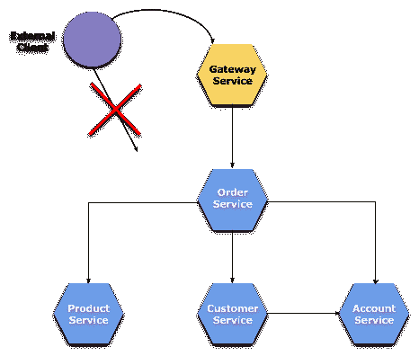

# 第八章：使用 API 网关进行路由和过滤

在本章中，我们将讨论微服务架构中的下一个重要元素——API 网关。在实践中，这并不是我们第一次遇到这个元素。我们已经在第四章，*服务发现*中实现了一个简单的网关模式，以展示如何在 Eureka 中使用分区机制进行服务发现。我们使用了 Netflix 的 Zuul 库，它是一个基于 JVM 的路由和服务器端负载均衡器。Netflix 设计 Zuul 以提供诸如认证、压力和金丝雀测试、动态路由以及活动/活动多区域流量管理等功能。虽然这没有明确说明，但它也在微服务架构中充当网关，并其主要任务是隐藏系统的外部客户端复杂性。

直到现在，Zuul 在 Spring Cloud 框架内部实现 API 网关模式时实际上并没有任何竞争。然而，随着一个名为 Spring Cloud Gateway 的新项目的不断发展，这种情况正在动态变化。它基于 Spring Framework 5、Project Reactor 和 Spring Boot 2.0。该库的最后稳定版本是 1.0.0，但目前正在开发的版本 2.0.0 中有很多关键变化，目前仍处于里程碑阶段。Spring Cloud Gateway 旨在提供一种简单、有效的方式来路由 API 并提供与它们相关的交叉关注点，例如安全性、监控/度量以及弹性。尽管这个解决方案相对较新，但它绝对值得关注。

本章我们将涉及的主题包括：

+   根据 URL 的静态路由和负载均衡

+   将 Zuul 与 Spring Cloud Gateway 集成并实现服务发现

+   使用 Zuul 创建自定义过滤器

+   使用 Zuul 自定义路由配置

+   在路由失败的情况下提供 Hystrix 回退

+   Spring Cloud Gateway 中包含的主要组件的描述——预测器和网关过滤器

# 使用 Spring Cloud Netflix Zuul

Spring Cloud 实现了一个内嵌的 Zuul 代理，以便前端应用程序能够代理调用后端服务。这个特性对于外部客户端来说非常有用，因为它隐藏了系统复杂性，并帮助避免为所有微服务独立管理 CORS 和认证问题。要启用它，你应该用 `@EnableZuulProxy` 注解标注一个 Spring Boot 主类，然后它将传入的请求转发到目标服务。当然，Zuul 与 Ribbon 负载均衡器、Hystrix 断路器以及服务发现集成，例如与 Eureka。

# 构建网关应用程序

让我们回到前一章节的示例，以添加微服务架构的最后一步，API 网关。我们还没有考虑的是外部客户端如何调用我们的服务。首先，我们不希望暴露系统内所有微服务的网络地址。我们还可以在单一位置执行一些操作，例如请求认证或设置跟踪头。解决方案是只共享一个边缘网络地址，该地址将所有传入请求代理到适当的服务。当前示例的系统架构在下图中说明：



为了满足我们当前示例的需求，让我回到前一章节中已经讨论过的项目。它可以在 GitHub 上找到（[`github.com/piomin/sample-spring-cloud-comm.git`](https://github.com/piomin/sample-spring-cloud-comm.git)），在`master`分支中。现在，我们将向该项目添加一个名为`gateway-service`的新模块。第一步是使用 Maven 依赖项包含 Zuul：

```java
<dependency>
    <groupId>org.springframework.cloud</groupId>
    <artifactId>spring-cloud-starter-zuul</artifactId>
</dependency>
```

在 Spring Boot 主类上使用`@EnableZuulProxy`注解后，我们可以继续进行路由配置，该配置位于`application.yml`文件中。默认情况下，Zuul 启动器 artifact 不包含服务发现客户端。路由是使用`url`属性静态配置的，该属性设置为服务的网络地址。现在，如果您启动了所有微服务和网关应用程序，您可以尝试通过网关调用它们。每个服务都可以在为每个路由配置的`path`属性设置的路径下访问，例如，`http://localhost:8080/account/1`将被转发到`http://localhost:8091/1`：

```java
server:
 port: ${PORT:8080}

zuul:
 routes:
  account:
   path: /account/**
   url: http://localhost:8091
  customer:
   path: /customer/**
   url: http://localhost:8092
  order:
   path: /order/**
   url: http://localhost:8090
  product:
   path: /product/**
   url: http://localhost:8093
```

# 与服务发现集成

前面示例中呈现的静态路由配置对于基于微服务的系统来说是不够的。API 网关的主要要求是与服务发现的内置集成。为了使 Zuul 与 Eureka 集成，我们必须在项目依赖项中包含`spring-cloud-starter-eureka`启动器，并通过注释应用程序的主类来启用客户端`@EnableDiscoveryClient`。实际上，让网关自己在发现服务器上注册是没有意义的，它只能获取当前注册的服务列表。因此，我们将通过将`eureka.client.registerWithEureka`属性设置为`false`来禁用该注册。`application.yml`文件中的路由定义非常简单。每个路由的名称映射到 Eureka 中的应用程序服务名称：

```java
zuul:
 routes:
  account-service:
   path: /account/**
  customer-service:
   path: /customer/**
  order-service:
   path: /order/**
  product-service:
   path: /product/**
```

# 自定义路由配置

有一些配置设置，允许我们自定义 Zuul 代理的行为。其中一些与服务发现集成密切相关。

# 忽略注册的服务

默认情况下，Spring Cloud Zuul 会暴露 Eureka 服务器中注册的所有服务。如果您想跳过每个服务的自动添加，您必须使用与发现服务器中所有忽略的服务名称匹配的模式设置`zuul.ignored-services`属性。实际工作中它是如何工作的呢？即使您没有提供任何`zuul.routes.*`属性的配置，Zuul 也会从 Eureka 获取服务列表并将它们自动绑定到服务名称的路径下。例如，`account-service`将在网关地址`http://localhost:8080/account-service/**`下可用。现在，如果您在`application.yml`文件中设置了以下配置，它将忽略`account-service`并返回一个 HTTP 404 状态码：

```java
zuul:
  ignoredServices: 'account-service'
```

您还可以通过将`zuul.ignored-services`设置为`'*'`来忽略所有注册的服务。如果一个服务与被忽略的模式匹配，但同时也包含在路由映射配置中，那么 Zuul 将会包含它。在这种情况下，只有`customer-service`会被处理：

```java
zuul:
 ignoredServices: '*'
  routes:
   customer-service: /customer/**
```

# 显式设置服务名称

从发现服务器获取的服务名称也可以在配置中使用`serviceId`属性进行设置。它使你能够对路由进行细粒度控制，因为你可以独立指定路径和`serviceId`。以下是路由的等效配置：

```java
zuul:
  routes:
   accounts:
    path: /account/**
    serviceId: account-service
   customers:
    path: /customer/**
    serviceId: customer-service
   orders:
    path: /order/**
    serviceId: order-service
   products:
    path: /product/**
    serviceId: product-service
```

# 带有 Ribbon 客户端的路由定义

还有另一种配置路由的方法。我们可以禁用 Eureka 发现，以便只依赖于 Ribbon 客户端提供的`listOfServers`属性的网络地址列表。网关的所有传入请求默认通过 Ribbon 客户端在所有服务实例之间进行负载均衡。即使您启用了或禁用了服务发现，以下示例代码也是正确的：

```java
zuul:
 routes:
  accounts:
   path: /account/**
   serviceId: account-service

ribbon:
 eureka:
  enabled: false

account-service:
 ribbon:
  listOfServers: http://localhost:8091,http://localhost:9091
```

# 为路径添加前缀

有时，为了让通过网关调用的服务设置不同的路径，而不是直接可用，这是必要的。在这种情况下，Zuul 提供了为所有定义的映射添加前缀的能力。这可以通过`zuul.prefix`属性轻松配置。默认情况下，Zuul 在将请求转发给服务之前截断该前缀。然而，通过将`zuul.stripPrefix`属性设置为`false`，可以禁用这种行为。`stripPrefix`属性不仅可以为所有定义的路由全局配置，还可以为每个单独的路由配置。

以下示例为所有转发请求添加了`/api`前缀。现在，例如，如果您想从`account-service`调用`GET /{id}`端点，您应该使用地址`http://localhost:8080/api/account/1`：

```java
zuul:
 prefix: /api
 routes:
   accounts:
    path: /account/**
    serviceId: account-service
   customers:
    path: /customer/**
    serviceId: customer-service
```

如果我们提供了`stripPrefix`设置为`false`的配置会发生什么？Zuul 将尝试在目标服务的上下文路径`/api/account`和`/api/customer`下查找端点：

```java
zuul:
 prefix: /api
 stripPrefix: false
```

# 连接设置和超时

**Spring Cloud Netflix Zuul 的主要任务**是将传入请求路由到下游服务。因此，它必须使用一个 HTTP 客户端实现与这些服务的通信。Zuul 目前默认使用的 HTTP 客户端是由 Apache HTTP Client 支持的，而不是已被弃用的 Ribbon `RestClient`。如果你想要使用 Ribbon，你应该将`ribbon.restclient.enabled`属性设置为`true`。你也可以通过将`ribbon.okhttp.enabled`属性设置为`true`来尝试`OkHttpClient`。

我们可以为 HTTP 客户端配置基本设置，如连接或读取超时以及最大连接数。根据我们是否使用服务发现，此类配置有两大选项。如果你通过`url`属性定义了具有指定网络地址的 Zuul 路由，那么你应该设置`zuul.host.connect-timeout-millis`和`zuul.host.socket-timeout-millis`。为了控制最大连接数，你应该覆盖默认值为`200`的`zuul.host.maxTotalConnections`属性。你也可以通过设置默认值为`20`的`zuul.host.maxPerRouteConnections`属性来定义每个单一路径的最大连接数。

如果 Zuul 配置为从发现服务器获取服务列表，你需要使用与 Ribbon 客户端属性`ribbon.ReadTimeout`和`ribbon.SocketTimeout`相同的超时配置。最大连接数可以通过`ribbon.MaxTotalConnections`和`ribbon.MaxConnectionsPerHost`进行自定义。

# 安全头

如果你在请求中设置了例如`Authorization` HTTP 头，但它没有被转发到下游服务，你可能会有些惊讶。这是因为 Zuul 定义了一个默认的敏感头列表，在路由过程中会移除这些头。这些头包括`Cookie`、`Set-Cookie`和`Authorization`。这一特性是为了与外部服务器通信而设计的。虽然对于同一系统中的服务之间共享头没有反对意见，但出于安全原因，不建议与外部服务器共享。可以通过覆盖`sensitiveHeaders`属性的默认值来自定义这种方法。它可以为所有路由或单个路由全局设置。`sensitiveHeaders`不是一个空的黑名单，所以为了使 Zuul 转发所有头，你应该明确将其设置为空列表：

```java
zuul:
 routes:
  accounts:
   path: /account/**
   sensitiveHeaders:
   serviceId: account-service
```

# 管理端点

Spring Cloud Netflix Zuul 暴露了两个用于监控的额外管理端点：

+   **路由**：打印出定义的路由列表

+   **过滤器**：打印出实现过滤器的列表（自 Spring Cloud Netflix 版本`1.4.0.RELEASE`起可用）

要启用管理端点功能，我们必须（像往常一样）在项目依赖中包含`spring-boot-starter-actuator`。为了测试目的，禁用端点安全是一个好主意，通过将`management.security.enabled`属性设置为`false`。现在，你可以调用`GET /routes`方法，它将打印出我们示例系统的以下 JSON 响应：

```java
{
  "/api/account/**": "account-service",
  "/api/customer/**": "customer-service",
  "/api/order/**": "order-service",
  "/api/product/**": "product-service",
}
```

要获取更多详细信息，必须在`/routes`路径上添加`?format=details`查询字符串。这个选项从 Spring Cloud 版本 1.4.0（Edgware 发布列车）也开始提供。还有一个`POST /route`方法，可以强制刷新当前存在的路由。另外，您可以通过将`endpoints.routes.enabled`设置为`false`来禁用整个端点：

```java
"/api/account/**": {
  "id": "account-service",
  "fullPath": "/api/account/**",
  "location": "account-service",
  "path": "/**",
  "prefix": "/api/account",
  "retryable": false,
  "customSensitiveHeaders": false,
  "prefixStripped": true
}
```

`/filters`端点的响应结果非常有趣。你可以看到 Zuul 网关默认提供了多少种过滤器和过滤器类型。以下是带有选定过滤器的一个响应片段。它包含完整的类名，调用顺序和状态。关于过滤器的更多信息，你可以参考*Zuul 过滤器*部分：

```java
"route": [{
 "class": "org.springframework.cloud.netflix.zuul.filters.route.RibbonRoutingFilter",
 "order": 10,
 "disabled": false,
 "static": true
}, { 
... 
]
```

# 提供 Hystrix 回退

我们可能需要为 Zuul 配置中定义的每个单独的路由提供一个回退响应，以防电路被打开。为此，我们应该创建一个类型为`ZuulFallbackProvider`（目前已被弃用）或`FallbackProvider`的 bean。在这个实现中，我们必须指定路由 ID 模式，以匹配所有应该由回退 bean 处理的路由。第二步是在`fallbackResponse`方法中返回`ClientHttpResponse`接口的实现作为响应。

这是一个简单的回退 bean，它将每个异常映射到 HTTP 状态`200 OK`，并在 JSON 响应中设置`errorCode`和`errorMessage`。仅针对`account-service`路由执行回退。

```java
public class AccountFallbackProvider implements FallbackProvider {

    @Override
    public String getRoute() {
        return "account-service";
    }

    @Override
    public ClientHttpResponse fallbackResponse(Throwable cause) {
        return new ClientHttpResponse() {

            @Override
            public HttpHeaders getHeaders() {
                HttpHeaders headers = new HttpHeaders();
                headers.setContentType(MediaType.APPLICATION_JSON);
                return headers;
            } 

            @Override
            public InputStream getBody() throws IOException {
                AccountFallbackResponse response = new AccountFallbackResponse("1.2", cause.getMessage());
                return new ByteArrayInputStream(new ObjectMapper().writeValueAsBytes(response));
            }

            @Override
            public String getStatusText() throws IOException {
                return "OK";
            } 

            @Override
            public HttpStatus getStatusCode() throws IOException {
                return HttpStatus.OK;
            } 

            @Override
            public int getRawStatusCode() throws IOException {
                return 200;
            } 

            @Override
            public void close() {

            } 
        };
    }
    // ...
}
```

# Zuul 过滤器

如我前面已经提到的，Spring Cloud Zuul 默认提供了一些 bean，这些 bean 是`ZuulFilter`接口的实现。每个内置过滤器都可以通过将`zuul.<SimpleClassName>.<filterType>.disable`属性设置为`true`来禁用。例如，要禁用`org.springframework.cloud.netflix.zuul.filters.post.SendResponseFilter`，你必须设置`zuul.SendResponseFilter.post.disable=true`。

HTTP 过滤机制你可能已经很熟悉了。过滤器动态地拦截请求和响应以转换，或者只是使用，从 HTTP 消息中获取的信息。它可能在 incoming request 或 outgoing response 之前或之后触发。我们可以识别出由 Zuul 为 Spring Cloud 提供的几种类型的过滤器：

+   **预过滤器**：它用于在`RequestContext`中准备初始数据，以在下游过滤器中使用。主要责任是设置路由过滤器所需的信息。

+   **路由过滤器**：它在预过滤器之后调用，负责创建到其他服务的请求。使用它的主要原因是需要适应客户端所需的请求或响应模型。

+   **后过滤器**：最常见的是操作响应。它甚至可以转换响应体。

+   **错误过滤器**：它仅在其他过滤器抛出异常时执行。只有一个内置的错误过滤器实现。如果`RequestContext.getThrowable()`不为空，则执行`SendErrorFilter`。

# 预定义过滤器

如果你用`@EnableZuulProxy`注解主类，Spring Cloud Zuul 会加载`SimpleRouteLocator`和`DiscoveryClientRouteLocator`使用的过滤器 bean。这是作为普通 Spring Bean 安装的一些最重要的实现列表：

+   `ServletDetectionFilter`：这是一个**预过滤器**。它检查请求是否通过 Spring Dispatcher。设置了一个布尔值，键为`FilterConstants.IS_DISPATCHER_SERVLET_REQUEST_KEY`。

+   `FormBodyWrapperFilter`：这是一个**预过滤器**。它解析表单数据并重新编码以供下游请求使用。

+   `PreDecorationFilter`：这是一个**预过滤器**。它根据提供的`RouteLocator`确定路由的位置和方式。它还负责设置与代理相关的头信息。

+   `SendForwardFilter`：这是一个**路由过滤器**。它使用`RequestDispatcher`转发请求。

+   `RibbonRoutingFilter`：这是一个**路由过滤器**。它使用 Ribbon、Hystrix 和外部 HTTP 客户端，如 Apache `HttpClient`、`OkHttpClient`或 Ribbon HTTP 客户端来发送请求。服务 ID 从请求上下文中获取。

+   `SimpleHostRoutingFilter`：这是一个**路由过滤器**。它通过 Apache HTTP 客户端将请求发送到 URL。 URL 在请求上下文中找到。

+   `SendResponseFilter`：这是一个**后过滤器**。它将代理请求的响应写入当前响应。

# 自定义实现

除了默认安装的过滤器之外，我们还可以创建自己的自定义实现。 每个实现都必须实现`ZuulFilter`接口及其四个方法。 这些方法负责设置过滤器的类型（`filterType`）、确定与其他具有相同类型的过滤器执行的顺序（`filterOrder`）、启用或禁用过滤器（`shouldFilter`）以及最后过滤逻辑实现（`run`）。 以下是一个示例实现，它向响应中添加了`X-Response-ID`头：

```java
public class AddResponseIDHeaderFilter extends ZuulFilter {

    private int id = 1;

    @Override
    public String filterType() {
        return "post";
    }

    @Override
    public int filterOrder() {
        return 10;
    }

    @Override
    public boolean shouldFilter() {
        return true;
    }

    @Override
    public Object run() {
        RequestContext context = RequestContext.getCurrentContext();
        HttpServletResponse servletResponse = context.getResponse();
        servletResponse.addHeader("X-Response-ID",
         String.valueOf(id++));
        return null;
    }

}
```

还有很多工作要做。自定义过滤器实现也应该在主类或 Spring 配置类中声明为`@Bean`：

```java
@Bean 
AddResponseIDHeaderFilter filter() {
    return new AddResponseIDHeaderFilter();
}
```

# 使用 Spring Cloud Gateway

围绕 Spring Cloud Gateway 有三个基本概念：

+   **路由**：这是网关的基本构建块。它包括一个用于标识路由的唯一 ID、一个目标 URI、一个断言列表和一个过滤器列表。只有在所有断言都已满足时，才会匹配路由。

+   **断言**：这是在处理每个请求之前执行的逻辑。它负责检测 HTTP 请求的不同属性，如头和参数，是否与定义的 criteria 匹配。实现基于 Java 8 接口`java.util.function.Predicate<T>`。输入类型反过来基于 Spring 的`org.springframework.web.server.ServerWebExchange`。

+   **过滤器**：它们允许修改传入的 HTTP 请求或 outgoing HTTP 响应。它们可以在发送下游请求之前或之后进行修改。路由过滤器针对特定的路由。它们实现 Spring 的`org.springframework.web.server.GatewayFilter`。

# 启用 Spring Cloud Gateway

Spring Cloud Gateway 建立在 Netty 网络容器和 Reactor 框架之上。Reactor 项目和 Spring Web Flux 可以与 Spring Boot 2.0 一起使用。到目前为止，我们使用的是 1.5 版本，因此 parent 项目版本声明不同。目前，Spring Boot 2.0 仍然处于里程碑阶段。以下是继承自`spring-boot-starter-parent`项目的 Maven `pom.xml`片段：

```java
<parent>
    <groupId>org.springframework.boot</groupId>
    <artifactId>spring-boot-starter-parent</artifactId>
    <version>2.0.0.M7</version>
</parent>
```

与之前的示例相比，我们还需要更改 Spring Cloud 的发布列车。最新可用的里程碑版本是`Finchley.M5`：

```java
<properties>
    <project.build.sourceEncoding>UTF-8</project.build.sourceEncoding>
    <project.reporting.outputEncoding>UTF-8</project.reporting.outputEncoding>
    <java.version>1.8</java.version>
    <spring-cloud.version>Finchley.M5</spring-cloud.version>
</properties>
<dependencyManagement>
    <dependencies>
        <dependency>
            <groupId>org.springframework.cloud</groupId>
            <artifactId>spring-cloud-dependencies</artifactId>
            <version>${spring-cloud.version}</version>
            <type>pom</type>
            <scope>import</scope>
        </dependency>
    </dependencies>
</dependencyManagement>
```

在设置正确的 Spring Boot 和 Spring Cloud 版本之后，我们终于可以在项目依赖中包含`spring-cloud-starter-gateway`启动器：

```java
<dependency>
    <groupId>org.springframework.cloud</groupId>
    <artifactId>spring-cloud-starter-gateway</artifactId>
</dependency>
```

# 内置断言和过滤器

Spring Cloud Gateway 包括许多内置的路由断言和网关过滤器工厂。每个路由可以通过`application.yml`文件中的配置属性或使用 Fluent Java Routes API 以编程方式定义。可用的断言工厂列表如下表所示。多个工厂可以组合用于单一路由定义，使用逻辑`and`关系。过滤器的集合可以在`application.yml`文件中，在`spring.cloud.gateway.routes`属性下，每个定义的路由的`predicates`属性下进行配置：

| **名称** | **描述** | **示例** |
| --- | --- | --- |
| `After` 路由 | 它接受一个日期时间参数，并匹配在其之后发生的请求 | `After=2017-11-20T...` |
| `Before` 路由 | 它接受一个日期时间参数，并匹配在其之前的请求 | `Before=2017-11-20T...` |
| `Between` 路由 | 它接受两个日期时间参数，并匹配在这些日期之间的请求 | `Between=2017-11-20T..., 2017-11-21T...` |
| `Cookie` 路由 | 它接受一个 cookie 名称和正则表达式参数，在 HTTP 请求的头中找到 cookie，并将其值与提供的表达式匹配 | `Cookie=SessionID, abc.` |
| `Header` 路由 | 它接受头名称和正则表达式参数，在 HTTP 请求的头中找到一个特定的头，并将其值与提供的表达式匹配 | `Header=X-Request-Id, \d+` |
| `Host` 路由 | 它接受一个以`.`分隔符的主机名 ANT 风格模式作为参数，并与`Host`头匹配 | `Host=**.example.org` |
| `Method` 路由 | 它接受一个 HTTP 方法作为参数以进行匹配 | `Method=GET` |
| `Path` 路由 | 它接受一个请求上下文路径模式作为参数 | `Path=/account/{id}` |
| `Query` 路由 | 它接受两个参数——一个必需的参数和一个可选的正则表达式，并与查询参数匹配 | `Query=accountId, 1.` |
| `RemoteAddr` 路由 | 它接受一个 CIDR 表示法的 IP 地址列表，如`192.168.0.1/16`，并与请求的远程地址匹配 | `RemoteAddr=192.168.0.1/16` |

还有几个网关过滤器模式的内置实现。以下表格还提供了可用工厂列表。每个`filters`属性下定义的路线可以在`application.yml`文件的`spring.cloud.gateway.routes`属性下配置过滤器集合：

| **名称** | **描述** | **示例** |
| --- | --- | --- |
| `AddRequestHeader` | 在 HTTP 请求中添加一个头，参数中提供了名称和值 | `AddRequestHeader=X-Response-ID, 123` |
| `AddRequestParameter` | 在 HTTP 请求中添加一个查询参数，参数中提供了名称和值 | `AddRequestParameter=id, 123` |
| `AddResponseHeader` | 在 HTTP 响应中添加一个头，参数中提供了名称和值 | `AddResponseHeader=X-Response-ID, 123` |
| `Hystrix` | 它接受一个参数，该参数是 HystrixCommand 的名称 | `Hystrix=account-service` |
| `PrefixPath` | 在参数中定义的 HTTP 请求路径前添加一个前缀 | `PrefixPath=/api` |
| `RequestRateLimiter` | 它根据三个输入参数限制单个用户的处理请求数量，包括每秒最大请求数、突发容量和一个返回用户键的 bean | `RequestRateLimiter=10, 20, #{@userKeyResolver}` |
| `RedirectTo` | 它接受一个 HTTP 状态和一个重定向 URL 作为参数，将其放入`Location` HTTP 头中以执行重定向 | `RedirectTo=302, http://localhost:8092` |
| `RemoveNonProxyHeaders` | 它从转发请求中移除一些跳过头的头信息，如 Keep-Alive、Proxy-Authenticate 或 Proxy-Authorization | - |
| `RemoveRequestHeader` | 它接受一个头名称作为参数，并将其从 HTTP 请求中移除 | `RemoveRequestHeader=X-Request-Foo` |
| `RemoveResponseHeader` | 它接受一个头名称作为参数，并将其从 HTTP 响应中移除 | `RemoveResponseHeader=X-Response-ID` |
| `RewritePath` | 它接受一个路径正则表达式参数和一个替换参数，然后重写请求路径 | `RewritePath=/account/(?<path>.*), /$\{path}` |
| `SecureHeaders` | 它在响应中添加一些安全头 | - |
| `SetPath` | 它接受一个带有路径模板参数的单参数，并更改请求路径 | `SetPath=/{segment}` |
| `SetResponseHeader` | 它接受名称和值参数，在 HTTP 响应中设置一个头 | `SetResponseHeader=X-Response-ID, 123` |
| `SetStatus` | 它接受一个单独的状态参数，该参数必须是一个有效的 HTTP 状态，并在响应中设置它 | `SetStatus=401` |

这是一个带有两个谓词和两个过滤器设置的简单示例。每个传入的`GET /account/{id}`请求都会被转发到`http://localhost:8080/api/account/{id}`，并包含新的 HTTP 头`X-Request-ID`：

```java
spring:
  cloud:
    gateway:
      routes:
      - id: example_route
        uri: http://localhost:8080
        predicates:
        - Method=GET
        - Path=/account/{id}
        filters:
        - AddRequestHeader=X-Request-ID, 123
        - PrefixPath=/api

```

相同的配置可以使用定义在`Route`类中的流利 API 提供。这种风格给我们更多的灵活性。虽然使用 YAML 可以组合使用逻辑`and`的谓词，但流利 Java API 允许你在`Predicate`类上使用`and()`、`or()`和`negate()`操作符。以下是使用流利 API 实现的替代路由：

```java
@Bean
public RouteLocator customRouteLocator(RouteLocatorBuilder routeBuilder) {
    return routeBuilder.routes()
        .route(r -> r.method(HttpMethod.GET).and().path("/account/{id}")
            .addRequestHeader("X-Request-ID", "123").prefixPath("/api")
            .uri("http://localhost:8080"))
        .build();
}
```

# 微服务网关

让我们回到我们的基于微服务的系统示例。我们已经在基于 Spring Cloud Netflix Zuul 的 API 网关配置部分讨论了这个示例。我们希望能够为基于 Zuul 代理的应用程序准备相同的静态路由定义。然后，每个服务都可以在网关地址和特定路径下可用，例如`http://localhost:8080/account/**`。使用 Spring Cloud Gateway 声明此类配置的最合适方式是通过路径路由谓词工厂和重写路径网关过滤器工厂。重写路径机制通过取其一部分或添加某些模式来改变请求路径。在我们的案例中，每个传入的请求路径都被重写，例如，从`account/123`变为`/123`。以下是网关的`application.yml`文件：

```java
server:
 port: ${PORT:8080}

spring:
 application:
  name: gateway-service

cloud:
 gateway:
   routes:
   - id: account-service
     uri: http://localhost:8091
     predicates:
     - Path=/account/**
     filters:
     - RewritePath=/account/(?<path>.*), /$\{path}
   - id: customer-service
     uri: http://localhost:8092
     predicates:
     - Path=/customer/**
     filters:
     - RewritePath=/customer/(?<path>.*), /$\{path}
   - id: order-service
     uri: http://localhost:8090
     predicates:
     - Path=/order/**
     filters:
     - RewritePath=/order/(?<path>.*), /$\{path}
   - id: product-service
     uri: http://localhost:8093
     predicates:
     - Path=/product/**
     filters:
     - RewritePath=/product/(?<path>.*), /$\{path}
```

令人惊讶的是，这就足够了。我们不需要提供任何与使用 Eureka 或 Config Server 等其他 Spring Cloud 组件时相比额外的注解。所以，我们网关应用程序的主类如下面的代码片段所示。你必须使用`mvn clean install`构建项目，并使用`java -jar`启动它，或者直接从你的 IDE 运行主类。示例应用程序的源代码可以在 GitHub 上找到([`github.com/piomin/sample-spring-cloud-gateway.git`](https://github.com/piomin/sample-spring-cloud-gateway.git)):

```java
@SpringBootApplication
public class GatewayApplication {

    public static void main(String[] args) {
        SpringApplication.run(GatewayApplication.class, args);
    }

}
```

# 服务发现集成

网关可以配置为基于服务发现中注册的服务列表创建路由。它可以与那些具有与`DiscoveryClient`兼容的服务注册解决方案集成的解决方案，例如 Netflix Eureka、Consul 或 Zookeeper。要启用`DiscoveryClient`路由定义定位器，你应该将`spring.cloud.gateway.discovery.locator.enabled`属性设置为`true`，并在类路径上提供一个`DiscoveryClient`实现。我们使用 Eureka 客户端和服务器进行发现。请注意，随着 Spring Cloud 最新里程碑版本`Finchley.M5`的发布，所有 Netflix 构件的名称都发生了变化，现在例如使用`spring-cloud-starter-netflix-eureka-client`而不是`spring-cloud-starter-eureka`:

```java
<dependency>
    <groupId>org.springframework.cloud</groupId>
    <artifactId>spring-cloud-starter-netflix-eureka-client</artifactId>
</dependency>
```

主类对 Eureka 客户端应用程序来说应该是相同的，用`@DiscoveryClient`注解。这是带有路由配置的`application.yml`文件。与之前的示例相比，唯一的变化是每个定义的路由的`uri`属性。我们不是提供它们的网络地址，而是使用从发现服务器中带有`lb`前缀的名称，例如`lb://order-service`:

```java
spring:
 application:
  name: gateway-service
 cloud:
  gateway:
   discovery:
    locator:
     enabled: true
   routes:
   - id: account-service
     uri: lb://account-service
     predicates:
     - Path=/account/**
     filters:
     - RewritePath=/account/(?<path>.*), /$\{path}
   - id: customer-service
     uri: lb://customer-service
     predicates:
     - Path=/customer/**
     filters:
     - RewritePath=/customer/(?<path>.*), /$\{path}
   - id: order-service
     uri: lb://order-service
     predicates:
     - Path=/order/**
     filters:
     - RewritePath=/order/(?<path>.*), /$\{path}
   - id: product-service
     uri: lb://product-service
     predicates:
     - Path=/product/**
     filters:
     - RewritePath=/product/(?<path>.*), /$\{path}
```

# 总结

有了 API 网关，我们在 Spring Cloud 中实现微服务架构核心元素的讨论已经结束。阅读了本书这部分内容后，你应该能够定制并使用 Eureka、Spring Cloud Config、Ribbon、Feign、Hystrix 以及最后基于 Zuul 和 Spring Cloud Gateway 的网关。

将这一章节视为两种可用的解决方案——老版本的 Netflix Zuul 和最新版本的 Spring Cloud Gateway 之间的比较。其中一个新的解决方案正在动态变化。它的当前版本 2.0，可能只与 Spring 5 一起使用，并且还没有在发行版中提供。而第一个解决方案，Netflix Zuul，是稳定的，但它不支持异步、非阻塞连接。它仍然基于 Netflix Zuul 1.0，尽管有一个新的 Zuul 版本支持异步通信。不管它们之间的差异如何，我都描述了如何使用这两种解决方案提供简单和更高级的配置。我还根据前面章节的示例，展示了与服务发现、客户端负载均衡器和断路器的集成。
