# 第九章：分布式日志记录和追踪

当将单体应用拆分为微服务时，我们通常会花很多时间思考业务边界或应用逻辑的划分，但我们忘记了日志。根据我自己作为开发者和软件架构师的经验，我可以说明开发者通常不会支付太多注意力到日志上。另一方面，负责应用程序维护的操作团队主要依赖日志。无论你的专业领域是什么，毫无疑问，日志是所有应用程序都必须做的工作，无论它们是有单体架构还是微服务架构。然而，微服务在设计和安排应用程序日志方面增加了一个全新的维度。有许多小型的、独立的、水平扩展的、相互通信的服务在多台机器上运行。请求通常由多个服务处理。我们必须关联这些请求，并将所有日志存储在单一的、中心位置，以便更容易查看它们。Spring Cloud 引入了一个专门的库，实现了分布式追踪解决方案，即 Spring Cloud Sleuth。

在这里还应该讨论一件事情。日志记录不同于追踪！指出它们之间的区别是值得的。追踪是跟随你的程序的数据流。它通常被技术支持团队用来诊断问题出现的位置。你要追踪你的系统流程以发现性能瓶颈或错误发生的时间。日志记录用于错误报告和检测。与追踪相比，它应该始终是启用的。当你设计一个大型系统，并且你希望跨机器有良好的、灵活的错误报告时，你肯定应该考虑以集中式方式收集日志数据。实现这一目标的推荐和最受欢迎的解决方案是**ELK**栈（**Elasticsearch** + **Logstash** + **Kibana**）。Spring Cloud 中没有为这个栈提供专门的库，但是可以通过 Java 日志框架（如 Logback 或 Log4j）来实现集成。在本章中还将讨论另一个工具，Zipkin。它是一个典型的追踪工具，帮助收集可以用来解决微服务架构中延迟问题的计时数据。

本章我们将要覆盖的主题包括以下内容：

+   微服务基础系统日志的最佳实践

+   使用 Spring Cloud Sleuth 向消息添加追踪信息并关联事件

+   将 Spring Boot 应用程序与 Logstash 集成

+   使用 Kibana 显示和筛选日志条目

+   使用 Zipkin 作为分布式追踪工具，并通过 Spring Cloud Sleuth 与应用程序集成

# 微服务最佳的日志实践

处理日志最重要的最佳实践之一是跟踪所有传入请求和传出响应。这可能对你来说很显然，但我见过几个不符合这一要求的应用程序。如果你满足这个需求，微服务架构有一个后果。与单片应用程序相比，系统的日志总数会增加，其中没有消息传递。这反过来又要求我们比以前更加关注日志记录。我们应该尽最大努力生成尽可能少的信息，尽管这些信息可以告诉我们很多情况。我们如何实现这一点？首先，拥有所有微服务相同的日志消息格式是很好的。例如，考虑如何在应用程序日志中打印变量。我建议你使用 JSON 表示法，因为通常，微服务之间交换的消息格式是 JSON。这种格式有一个非常直接的标准化，使得你的日志容易阅读和解析，如下面的代码片段所示：

```java
17:11:53.712   INFO   Order received: {"id":1,"customerId":5,"productId":10}
```

前面的格式比以下内容更容易分析：

```java
17:11:53.712   INFO   Order received with id 1, customerId 5 and productId 10.
```

但通常，这里最重要的是标准化。无论你选择哪种格式，关键是在到处使用它。你还应该小心确保你的日志是有意义的。尽量避免不包含任何信息的句子。例如，从以下格式来看，不清楚哪个顺序正在处理：

```java
17:11:53.712   INFO   Processing order
```

然而，如果你真的想要这种日志条目格式，尽量把它分配给不同的日志级别。将所有内容都以`INFO`相同的级别记录，真的是一种糟糕的做法。有些信息比其他信息更重要，所以这里的困难在于决定日志条目应该记录在哪个级别。以下是一些建议：

+   `TRACE`：这是非常详细的信息，仅用于开发。你可能会在部署到生产环境后短时间内保留它，但将其视为临时文件。

+   `DEBUG`：在这个级别，记录程序中发生的任何事件。这主要用于开发人员的调试或故障排除。`DEBUG`和`TRACE`之间的区别可能是最难的。

+   `INFO`：在这个级别，你应该记录操作期间最重要的信息。这些信息必须易于理解，不仅对开发者，对管理员或高级用户也是如此，让他们能够快速找出应用程序正在做什么。

+   `WARN`：在这个级别，记录所有可能变成错误的潜在事件。这样的过程可以继续进行，但你应该对此特别小心。

+   `ERROR`：通常，你会在这个级别打印异常。这里的关键不是到处都抛出异常，例如，如果只有一个业务逻辑执行没有成功的话。

+   `FATAL`：这个 Java 日志级别表示非常严重的错误事件，可能会导致应用程序停止运行。

还有其他一些好的日志实践，但我已经提到了在基于微服务的系统中使用的一些最重要的实践。还值得提到日志的一个方面，即规范化。如果您想轻松理解和解释您的日志，您肯定要知道它们是在何时何地收集的，它们包含什么，以及为什么要发出它们。在所有微服务中特别重要的特性应该进行规范化，例如`Time`（何时）、`Hostname`（何地）和`AppName`（何人）。正如您将在本章的下一部分看到的，这种规范化在系统中实现集中日志收集方法时非常有用。

# 使用 Spring Boot 进行日志记录

Spring Boot 内部日志使用 Apache Commons Logging，但如果您包含启动器中的依赖项，默认情况下您的应用程序将使用 Logback。它以任何方式都不妨碍使用其他日志框架的可能性。还提供了 Java Util Logging、Log4J2 和 SLF4J 的默认配置。日志设置可以在`application.yml`文件中使用`logging.*`属性进行配置。默认日志输出包含日期和时间（毫秒）、日志级别、进程 ID、线程名称、发出条目的类的全名和消息。可以通过分别使用`logging.pattern.console`和`logging.pattern.file`属性为控制台和文件附加器来覆盖它。

默认情况下，Spring Boot 只向控制台记录日志。为了允许除了控制台输出之外还写入日志文件，您应该设置`logging.file`或`logging.path`属性。如果您指定`logging.file`属性，日志将被写入确切位置或当前位置的文件。如果您设置`logging.path`，它将在指定目录中创建一个`spring.log`文件。日志文件在达到 10 MB 后会被轮换。

在`application.yml`设置文件中可以自定义的最后一件事情是日志级别。默认情况下，Spring Boot 记录`ERROR`、`WARN`和`INFO`级别的消息。我们可以使用`logging.level.*`属性为每个单独的包或类覆盖此设置。还可以使用`logging.level.root`配置根日志记录器。以下是在`application.yml`文件中的一个示例配置，它更改了默认模式格式，以及一些日志级别，并设置了日志文件的存储位置：

```java
logging:
 file: logs/order.log
 level:
  com.netflix: DEBUG
  org.springframework.web.filter.CommonsRequestLoggingFilter: DEBUG
 pattern:
  console: "%d{HH:mm:ss.SSS} %-5level %msg%n"
  file: "%d{HH:mm:ss.SSS} %-5level %msg%n"
```

正如您在之前的示例中所看到的，这样的配置相当简单，但在某些情况下，这并不足够。如果您想要定义额外的 appender 或过滤器，您肯定应该包括其中一个可用的日志系统的配置——Logback(`logback-spring.xml`)，Log4j2(`log4j2-spring.xml`)，或 Java Util Logging(`logging.properties`)。正如我之前提到的，Spring Boot 默认使用 Logback 来记录应用程序日志。如果您在类路径的根目录提供`logback-spring.xml`文件，它将覆盖`application.yml`中定义的所有设置。例如，您可以创建每日轮转日志的文件 appender，并保留最多 10 天的历史记录。这个功能在应用程序中非常常用。在本章的下一节中，您还将了解到，要集成您的微服务与 Logstash，需要一个自定义的 appender。以下是一个设置`logs/order.log`文件每日轮转策略的 Logback 配置文件片段的例子：

```java
<configuration>
 <appender name="FILE" class="ch.qos.logback.core.rolling.RollingFileAppender">
  <file>logs/order.log</file>
  <rollingPolicy class="ch.qos.logback.core.rolling.TimeBasedRollingPolicy">
   <fileNamePattern>order.%d{yyyy-MM-dd}.log</fileNamePattern>
   <maxHistory>10</maxHistory>
   <totalSizeCap>1GB</totalSizeCap>
  </rollingPolicy>
  <encoder>
   <pattern>%d{HH:mm:ss.SSS} %-5level %msg%n</pattern>
  </encoder>
 </appender>
 <root level="DEBUG">
  <appender-ref ref="FILE" />
 </root>
</configuration>
```

值得一提的是，Spring 建议使用`logback-spring.xml`而不是默认的`logback.xml`对 Logback 进行配置。Spring Boot 包含对 Logback 的一些扩展，这些扩展对于高级配置可能很有帮助。它们不能用在标准的`logback.xml`中，只能与`logback-spring.xml`一起使用。我们已经列出了其中一些扩展，这些扩展将允许您定义特定于配置文件或从 Spring Environment 公开属性的配置：

```java
<springProperty scope="context" name="springAppName" source="spring.application.name" />
<property name="LOG_FILE" value="${BUILD_FOLDER:-build}/${springAppName}"/>​

<springProfile name="development">
...
</springProfile>

<springProfile name="production">
 <appender name="flatfile" class="ch.qos.logback.core.rolling.RollingFileAppender">
  <file>${LOG_FILE}</file>
  <rollingPolicy class="ch.qos.logback.core.rolling.TimeBasedRollingPolicy">
   <fileNamePattern>${LOG_FILE}.%d{yyyy-MM-dd}.gz</fileNamePattern>
   <maxHistory>7</maxHistory>
  </rollingPolicy>
  <encoder>
   <pattern>${CONSOLE_LOG_PATTERN}</pattern>
   <charset>utf8</charset>
  </encoder>
 </appender>
 ...
</springProfile>
```

# 使用 ELK 栈集中日志

ELK 是三个开源工具的缩写——Elasticsearch、Logstash 和 Kibana。它也被称为**Elastic Stack**。这个系统的核心是**Elasticsearch**，一个基于另一个开源 Java 项目 Apache Lucene 的搜索引擎。这个库特别适合于需要在跨平台环境中进行全文搜索的应用程序。Elasticsearch 流行的主要原因是它的性能。当然，它还有一些其他优势，如可扩展性、灵活性和通过提供基于 RESTful、JSON 格式的 API 来搜索存储的数据，易于集成。它有一个庞大的社区和许多用例，但对我们来说最有趣的是它存储和搜索应用程序生成的日志的能力。日志是包含 Logstash 在 ELK 栈中的主要原因。这个开源数据处理管道允许我们收集、处理并将数据输入到 Elasticsearch 中。

**Logstash**支持许多输入，这些输入可以从外部来源提取事件。有趣的是，它有许多输出，而 Elasticsearch 只是其中之一。例如，它可以将事件写入 Apache Kafka、RabbitMQ 或 MongoDB，并且可以将指标写入 InfluxDB 或 Graphite。它不仅接收并将数据转发到它们的目的地，还可以实时解析和转换它们。

**Kibana** 是 ELK 堆栈的最后一个元素。它是一个开源的数据可视化插件，用于 Elasticsearch。它允许您可视化、探索和发现来自 Elasticsearch 的数据。我们可以通过创建搜索查询轻松地显示和筛选我们应用程序收集的所有日志。在此基础上，我们可以将数据导出为 PDF 或 CSV 格式以提供报告。

# 在机器上设置 ELK 堆栈

在我们将应用程序的任何日志发送到 Logstash 之前，我们必须在本地机器上配置 ELK 堆栈。最合适的方法是使用 Docker 容器运行它。堆栈中的所有产品都可以作为 Docker 镜像使用。ELastic Stack 的供应商提供了一个专用的 Docker 注册表。可以在[www.docker.elastic.co](http://www.docker.elastic.co)找到所有发布镜像和标签的完整列表。它们都使用`centos:7`作为基础镜像。

我们将从 Elasticsearch 实例开始。其开发可以通过以下命令启动：

```java
docker run -d --name es -p 9200:9200 -p 9300:9300 -e "discovery.type=single-node" docker.elastic.co/elasticsearch/elasticsearch:6.1.1
```

在开发模式下运行 Elasticsearch 是最方便的，因为我们不需要提供任何其他配置。如果您想要在生产模式下启动它，`vm.max_map_count` Linux 内核设置至少需要设置为`262144`。根据不同的操作系统平台，修改它的过程是不同的。对于带有 Docker Toolbox 的 Windows，必须通过`docker-machine`来设置：

```java
docker-machine ssh
sudo sysctl -w vm.max_map_count=262144
```

下一步是运行带有 Logstash 的容器。除了启动带有 Logstash 的容器外，我们还应该定义一个输入和一个输出。输出是显而易见的——Elasticsearch，现在在默认的 Docker 机器地址`192.168.99.100`下可用。作为输入，我们定义了与我们的示例应用程序中用作日志附加器的`LogstashTcpSocketAppender`兼容的简单 TCP 插件`logstash-input-tcp`。我们所有的微服务日志都将以 JSON 格式发送。现在，重要的是为该插件设置`json`编码器。每个微服务都将以其名称和`micro`前缀在 Elasticsearch 中索引。以下是 Logstash 配置文件`logstash.conf`：

```java
input {
  tcp {
    port => 5000
    codec => json
  }
}

output {
  elasticsearch {
    hosts => ["http://192.168.99.100:9200"]
    index => "micro-%{appName}"
  }
}
```

这是一个运行 Logstash 并将其暴露在端口`5000`上的命令。它还将带有前述设置的文件复制到容器中，并覆盖 Logstash 配置文件的默认位置：

```java
docker run -d --name logstash -p 5000:5000 -v ~/logstash.conf:/config-dir/logstash.conf docker.elastic.co/logstash/logstash-oss:6.1.1 -f /config-dir/logstash.conf
```

最后，我们可以运行堆栈的最后一个元素，Kibana。默认情况下，它暴露在端口`5601`上，并连接到端口`9200`上的 Elasticsearch API，以便能够从那里加载数据：

```java
docker run -d --name kibana -e "ELASTICSEARCH_URL=http://192.168.99.100:9200" -p 5601:5601 docker.elastic.co/kibana/kibana:6.1.1
```

如果您想在带有 Docker 的 Windows 机器上运行 Elastic Stack 的所有产品，您可能需要将 Linux 虚拟机图像的默认 RAM 内存增加到至少 2 GB。在启动所有容器后，您最终可以通过`http://192.168.99.100:5601`访问可用的 Kibana 仪表板，然后继续将您的应用程序与 Logstash 集成。

# 将应用程序与 ELK 堆栈集成

有多种方法可以通过 Logstash 将 Java 应用程序与 ELK 堆栈集成。其中一种方法涉及到使用 Filebeat，它是一个用于本地文件的日志数据传输器。这种方法需要为 Logstash 实例配置一个 beats（`logstash-input-beats`）输入，实际上这就是默认选项。你还需要在服务器机器上安装并启动一个 Filebeat 守护进程。它负责将日志传递给 Logstash。

个人而言，我更喜欢基于 Logback 和专用追加器的配置。这似乎比使用 Filebeat 代理简单。除了需要部署一个附加服务外，Filebeat 还要求我们使用诸如 Grok 过滤器的解析表达式。使用 Logback 追加器时，你不需要任何日志传输器。这个追加器可在项目中的 Logstash JSON 编码器内使用。你可以通过在`logback-spring.xml`文件内声明`net.logstash.logback.appender.LogstashSocketAppender`追加器来为你的应用程序启用它。

我们还将讨论一种将数据发送到 Logstash 的替代方法，使用消息代理。在我们即将研究的示例中，我将向你展示如何使用 Spring `AMQPAppender`将日志事件发布到 RabbitMQ 交换。在这种情况下，Logstash 订阅该交换并消费发布的消息。

# 使用 LogstashTCPAppender

库`logstash-logback-encoder`提供了三种类型的追加器——UDP、TCP 和异步。TCP 追加器最常用。值得一提的是，TCP 追加器是异步的，所有的编码和通信都委托给一个线程。除了追加器，该库还提供了一些编码器和布局，以使你能够以 JSON 格式记录日志。因为 Spring Boot 默认包含一个 Logback 库，以及`spring-boot-starter-web`，我们只需在 Maven `pom.xml`中添加一个依赖项：

```java
<dependency>
 <groupId>net.logstash.logback</groupId>
 <artifactId>logstash-logback-encoder</artifactId>
 <version>4.11</version>
</dependency>
```

下一步是在 Logback 配置文件中定义带有`LogstashTCPAppender`类的追加器。每个 TCP 追加器都需要你配置一个编码器。你可以选择`LogstashEncoder`和`LoggingEventCompositeJsonEncoder`之间。`LoggingEventCompositeJsonEncoder`给你更多的灵活性。它由一个或多个映射到 JSON 输出的 JSON 提供者组成。默认情况下，没有提供者被配置。`LogstashTCPAppender`不是这样。默认情况下，它包括几个标准字段，如时间戳、版本、日志器名称和堆栈跟踪。它还添加了来自**映射诊断上下文**（**MDC**）和上下文的所有条目，除非你通过将`includeMdc`或`includeContext`属性设置为`false`来禁用它：

```java
<appender name="STASH" class="net.logstash.logback.appender.LogstashTcpSocketAppender">
 <destination>192.168.99.100:5000</destination>
 <encoder class="net.logstash.logback.encoder.LoggingEventCompositeJsonEncoder">
  <providers>
   <mdc />
   <context />
   <logLevel />
   <loggerName />
   <pattern>
    <pattern>
    {
    "appName": "order-service"
    }
    </pattern>
   </pattern>
   <threadName />
   <message />
   <logstashMarkers />
   <stackTrace />
  </providers>
 </encoder>
</appender>
```

现在，我想回到我们的示例系统片刻。我们仍然在同一个 Git 仓库([`github.com/piomin/sample-spring-cloud-comm.git`](https://github.com/piomin/sample-spring-cloud-comm.git))的`feign_with_discovery`分支([`github.com/piomin/sample-spring-cloud-comm/tree/feign_with_discovery`](https://github.com/piomin/sample-spring-cloud-comm/tree/feign_with_discovery))。我在源代码中添加了一些日志条目，按照*微服务最佳日志实践*部分描述的建议。以下是`order-service`内部的`POST`方法的当前版本。我通过从`org.slf4j.LoggerFactory`调用`getLogger`方法，使用 Logback over SLF4J 作为日志记录器：

```java
@PostMapping
public Order prepare(@RequestBody Order order) throws JsonProcessingException {
    int price = 0;
    List<Product> products = productClient.findByIds(order.getProductIds());
    LOGGER.info("Products found: {}", mapper.writeValueAsString(products));
    Customer customer = customerClient.findByIdWithAccounts(order.getCustomerId());
    LOGGER.info("Customer found: {}", mapper.writeValueAsString(customer));

    for (Product product : products) 
        price += product.getPrice();
    final int priceDiscounted = priceDiscount(price, customer);
    LOGGER.info("Discounted price: {}", mapper.writeValueAsString(Collections.singletonMap("price", priceDiscounted)));

    Optional<Account> account = customer.getAccounts().stream().filter(a -> (a.getBalance() > priceDiscounted)).findFirst();
    if (account.isPresent()) {
        order.setAccountId(account.get().getId());
        order.setStatus(OrderStatus.ACCEPTED);
        order.setPrice(priceDiscounted);
        LOGGER.info("Account found: {}", mapper.writeValueAsString(account.get()));
    } else {
        order.setStatus(OrderStatus.REJECTED);
        LOGGER.info("Account not found: {}", mapper.writeValueAsString(customer.getAccounts()));
    }

    return repository.add(order);
}
```

让我们看看 Kibana 仪表板。它可通过`http://192.168.99.100:5601`访问。应用程序日志在那里可以轻松发现和分析。你可以在页面左侧的菜单中选择所需的索引名称（在以下屏幕快照中标记为**1**）。日志统计信息以时间线图的形式展示（**2**）。你可以通过点击具体柱状图或选择一组柱状图来缩小搜索参数所花费的时间。给定时间段内的所有日志都显示在图表下方的面板中（**3**）：

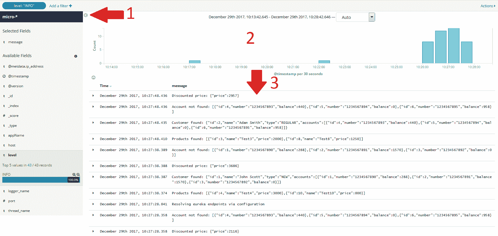

每个条目都可以扩展以查看其详细信息。在详细表格视图中，我们可以看到，例如，Elasticsearch 索引的名称（`_index`）和微服务的级别或名称（`appName`）。大多数这些字段都是由`LoggingEventCompositeJsonEncoder`设置的。我只定义了一个应用程序特定的字段，`appName`：

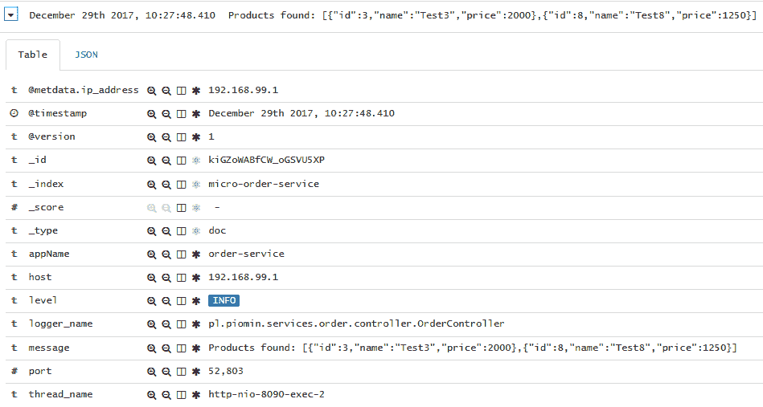

Kibana 赋予我们搜索特定条目的强大能力。我们只需点击选中的条目即可定义过滤器，以定义一组搜索条件。在前面的屏幕快照中，你可以看到我过滤掉了所有进入 HTTP 请求的条目。正如你可能记得的，`org.springframework.web.filter.CommonsRequestLoggingFilter`类负责记录它们。我只是定义了一个名称与完全限定日志类名相等的过滤器。以下是我 Kibana 仪表板上的屏幕截图，它只显示由`CommonsRequestLoggingFilter`生成的日志：

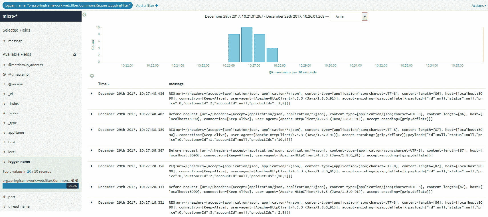

# 使用 AMQP appender 和消息代理

使用 Spring AMQP appender 和消息代理的配置比使用简单的 TCP appender 的方法要复杂一些。首先，你需要在你的本地机器上启动一个消息代理。我在第五章，*与 Spring Cloud Config 的分布式配置*中描述了这一过程，其中我介绍了使用 Spring Cloud Bus 的 RabbitMQ 进行动态配置重载。假设你已经在本地下启动了一个 RabbitMQ 实例或作为 Docker 容器启动，你可以继续进行配置。我们必须为发布传入事件创建一个队列，然后将其绑定到交换机。为此，你应该登录到 Rabbit 管理控制台，然后单击队列部分。我创建了一个名为`q_logstash`的队列。我定义了一个名为`ex_logstash`的新交换机，如下面的屏幕截图所示。该队列已使用所有示例微服务的路由键绑定到交换机：

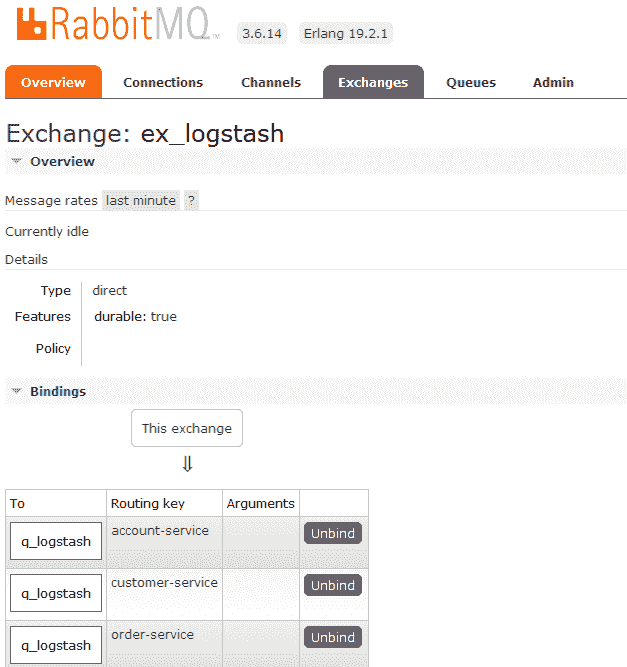

在我们启动和配置了 RabbitMQ 实例之后，我们可以在应用程序方面开始集成。首先，你必须将`spring-boot-starter-amqp`包含在项目依赖项中，以提供 AMQP 客户端和 AMQP appender 的实现：

```java
<dependency>
    <groupId>org.springframework.boot</groupId>
    <artifactId>spring-boot-starter-amqp</artifactId>
</dependency>
```

然后，你唯一需要做的是在 Logback 配置文件中定义具有`org.springframework.amqp.rabbit.logback.AmqpAppender`类的 appender。需要设置的最重要属性是 RabbitMQ 网络地址（`host`，`port`），声明的交换机名称（`exchangeName`）和路由键（`routingKeyPattern`），它必须与为交换机绑定声明的其中一个键匹配。与 TCP appender 相比，这种方法的缺点是需要自己准备发送给 Logstash 的 JSON 消息。以下是`order-service`的 Logback 配置片段：

```java
<appender name="AMQP"
 class="org.springframework.amqp.rabbit.logback.AmqpAppender">
 <layout>
  <pattern>
  {
  "time": "%date{ISO8601}",
  "thread": "%thread",
  "level": "%level",
  "class": "%logger{36}",
  "message": "%message"
  }
  </pattern>
 </layout>
 <host>192.168.99.100</host>
 <port>5672</port>
 <username>guest</username>
 <password>guest</password> 
 <applicationId>order-service</applicationId>
 <routingKeyPattern>order-service</routingKeyPattern>
 <declareExchange>true</declareExchange>
 <exchangeType>direct</exchangeType>
 <exchangeName>ex_logstash</exchangeName>
 <generateId>true</generateId>
 <charset>UTF-8</charset>
 <durable>true</durable>
 <deliveryMode>PERSISTENT</deliveryMode>
</appender>
```

通过声明`rabbitmq`（`logstash-input-rabbitmq`）输入，Logstash 可以轻松集成 RabbitMQ：

```java
input {
  rabbitmq {
    host => "192.168.99.100"
    port => 5672
    durable => true
    exchange => "ex_logstash"
  }
}

output { 
  elasticsearch { 
    hosts => ["http://192.168.99.100:9200"]
  } 
}
```

# Spring Cloud Sleuth

Spring Cloud Sleuth 是一个相当小型的、简单的项目，但它提供了一些对日志记录和跟踪有用的功能。如果你参考*使用 LogstashTCPAppender*部分中讨论的示例，你可以很容易地看出，没有可能过滤出与单个请求相关的所有日志。在基于微服务的环境中，关联应用程序在处理进入系统的请求时交换的消息也非常重要。这是创建 Spring Cloud Sleuth 项目的主要动机。

如果为应用程序启用了 Spring Cloud Sleuth，它会向请求中添加一些 HTTP 头，这允许您将请求与响应以及独立应用程序之间交换的消息链接起来，例如，通过 RESTful API。它定义了两个基本工作单位——跨度（span）和跟踪（trace）。每个都有一个独特的 64 位 ID。跟踪 ID 的值等于跨度 ID 的初始值。跨度指的是一个单独的交换，其中响应是作为对请求的反应发送的。跟踪通常被称为**上下文关联**（correlation IT），它帮助我们链接系统处理传入请求时不同应用程序生成的所有日志。

每个跟踪和跨度 ID 都添加到 Slf4J **MDC**（**映射诊断上下文**）中，因此您将能够在日志聚合器中提取具有给定跟踪或跨度的所有日志。MDC 只是一个存储当前线程上下文数据的映射。每个到达服务器的客户端请求都是由不同的线程处理的。得益于这一点，每个线程在其线程生命周期内都可以访问其 MDC 的值。除了`spanId`和`traceId`之外，Spring Cloud Sleuth 还将在 MDC 中添加以下两个跨度：

+   `appName`：生成日志条目的应用程序名称

+   `exportable`：这指定了日志是否应导出到 Zipkin

除了前面的特性外，Spring Cloud Sleuth 还提供了：

+   一种对常见分布式跟踪数据模型的抽象，允许与 Zipkin 集成。

+   记录时间信息以帮助进行延迟分析。它还包括不同的抽样策略来管理导出到 Zipkin 的数据量。

+   与参与通信的常见 Spring 组件集成，如 servlet 过滤器、异步端点、RestTemplate、消息通道、Zuul 过滤器和 Feign 客户端。

# 将 Sleuth 集成到应用程序中

为了在应用程序中启用 Spring Cloud Sleuth 功能，只需将`spring-cloud-starter-sleuth`启动器添加到依赖项中：

```java
<dependency>
    <groupId>org.springframework.cloud</groupId>
    <artifactId>spring-cloud-starter-sleuth</artifactId>
</dependency>
```

包含此依赖项后，应用程序生成的日志条目的格式已更改。您可以通过以下方式看到这一点：

```java
2017-12-30 00:21:31.639 INFO [order-service,9a3fef0169864e80,9a3fef0169864e80,false] 49212 --- [nio-8090-exec-6] p.p.s.order.controller.OrderController : Products found: [{"id":2,"name":"Test2","price":1500},{"id":9,"name":"Test9","price":2450}]
2017-12-30 00:21:31.683 INFO [order-service,9a3fef0169864e80,9a3fef0169864e80,false] 49212 --- [nio-8090-exec-6] p.p.s.order.controller.OrderController : Customer found: {"id":2,"name":"Adam Smith","type":"REGULAR","accounts":[{"id":4,"number":"1234567893","balance":5000},{"id":5,"number":"1234567894","balance":0},{"id":6,"number":"1234567895","balance":5000}]}
2017-12-30 00:21:31.684 INFO [order-service,9a3fef0169864e80,9a3fef0169864e80,false] 49212 --- [nio-8090-exec-6] p.p.s.order.controller.OrderController : Discounted price: {"price":3752}
2017-12-30 00:21:31.684 INFO [order-service,9a3fef0169864e80,9a3fef0169864e80,false] 49212 --- [nio-8090-exec-6] p.p.s.order.controller.OrderController : Account found: {"id":4,"number":"1234567893","balance":5000}
2017-12-30 00:21:31.711 INFO [order-service,58b06c4c412c76cc,58b06c4c412c76cc,false] 49212 --- [nio-8090-exec-7] p.p.s.order.controller.OrderController : Order found: {"id":4,"status":"ACCEPTED","price":3752,"customerId":2,"accountId":4,"productIds":[9,2]}
2017-12-30 00:21:31.722 INFO [order-service,58b06c4c412c76cc,58b06c4c412c76cc,false] 49212 --- [nio-8090-exec-7] p.p.s.order.controller.OrderController : Account modified: {"accountId":4,"price":3752}
2017-12-30 00:21:31.723 INFO [order-service,58b06c4c412c76cc,58b06c4c412c76cc,false] 49212 --- [nio-8090-exec-7] p.p.s.order.controller.OrderController : Order status changed: {"status":"DONE"}
```

# 使用 Kibana 搜索事件

Spring Cloud Sleuth 自动向所有请求和响应添加 HTTP 头`X-B3-SpanId`和`X-B3-TraceId`。这些字段也包括在 MDC 中作为`spanId`和`traceId`。但在移到 Kibana 仪表板之前，我想让您看一下下面的图表。这是一个顺序图，展示了样本微服务之间的通信流程：

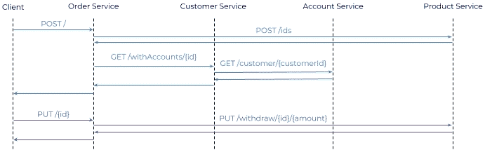

`order-service`暴露了两种可用方法。第一种是创建新订单，第二种是确认它。第一个`POST /`方法，实际上，直接从`customer-service`、`product-service`和`account-service`通过`customer-service`调用所有其他服务的端点。第二个`PUT /{id}`方法只与`account-service`的一个端点集成。

前述流程现在可以通过存储在 ELK Stack 中的日志条目进行映射。当使用 Kibana 作为日志聚合器，结合由 Spring Cloud Sleuth 生成的字段时，我们可以通过使用 trace 或 span ID 过滤它们来轻松找到条目。这是一个例子，我们发现所有与从`order-service`调用`POST /`端点有关的事件，其`X-B3-TraceId`字段等于`103ec949877519c2`:

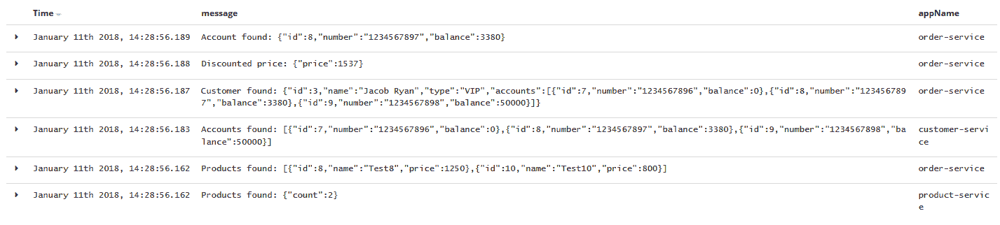

下面是一个与前一个例子类似的例子，但是在这个例子中，所有在处理请求期间存储的事件都被发送到`PUT /{id}`端点。这些条目也通过`X-B3-TraceId`字段过滤出来，该字段的值等于`7070b90bfb36c961`:

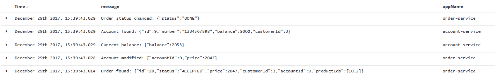

在这里，你可以看到已经发送到 Logstash 的微服务应用程序的完整字段列表。带有`X-`前缀的字段已经被 Spring Cloud Sleuth 库包含在消息中：

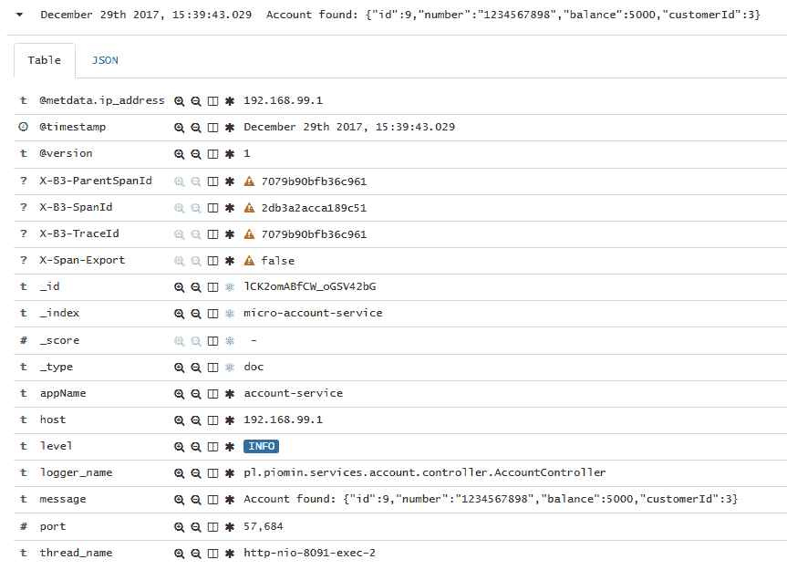

# 将 Sleuth 与 Zipkin 集成

Zipkin 是一个流行的、开源的分布式追踪系统，它帮助收集分析微服务架构中延迟问题的所需时序数据。它能够使用 UI web 控制台收集、查询和可视化数据。Zipkin UI 提供了一个依赖关系图，显示了系统内所有应用程序处理了多少追踪请求。Zipkin 由四个元素组成。我已经提到了其中一个，Web UI。第二个是 Zipkin 收集器，负责验证、存储和索引所有传入的追踪数据。Zipkin 使用 Cassandra 作为默认的后端存储。它还原生支持 Elasticsearch 和 MySQL。最后一个元素是查询服务，它为查找和检索追踪提供了简单的 JSON API。它主要由 Web UI 消费。

# 运行 Zipkin 服务器

我们可以通过几种方式在本地运行 Zipkin 服务器。其中一种方式是使用 Docker 容器。以下命令启动一个内存中的服务器实例：

```java
docker run -d --name zipkin -p 9411:9411 openzipkin/zipkin
```

在运行 Docker 容器之后，Zipkin API 在`http://192.168.99.100:9411`可用。或者，你可以使用 Java 库和 Spring Boot 应用程序来启动它。为了启用 Zipkin，你应该在你的 Maven `pom.xml`文件中包含以下依赖项，如下面的代码片段所示。默认版本由`spring-cloud-dependencies`管理。在我们的示例应用程序中，我使用了`Edgware.RELEASE` Spring Cloud Release Train:

```java
<dependency>
    <groupId>io.zipkin.java</groupId>
    <artifactId>zipkin-server</artifactId>
</dependency>
<dependency>
    <groupId>io.zipkin.java</groupId>
    <artifactId>zipkin-autoconfigure-ui</artifactId>
</dependency>
```

我在我们的示例系统中增加了一个新的`zipkin-service`模块。它非常简单。必须实现的唯一事情是应用的主类，它用`@EnableZipkinServer`注解标记。得益于这一点，Zipkin 实例被嵌入到 Spring Boot 应用程序中：

```java
@SpringBootApplication
@EnableZipkinServer
public class ZipkinApplication {

    public static void main(String[] args) {
        new SpringApplicationBuilder(ZipkinApplication.class).web(true).run(args);
    }

}
```

为了在默认端口上启动 Zipkin 实例，我们必须在`application.yml`文件中覆盖默认服务器端口。启动应用程序后，Zipkin API 在`http://localhost:9411`处可用：

```java
spring: 
 application:
  name: zipkin-service

server: 
 port: ${PORT:9411}
```

# 构建客户端应用程序

如果你想在项目中同时使用 Spring Cloud Sleuth 和 Zipkin，只需在依赖项中添加`spring-cloud-starter-zipkin`启动器。它通过 HTTP API 实现了与 Zipkin 的集成。如果你已经在 Spring Boot 应用程序内部以内嵌实例启动了 Zipkin 服务器，你不需要提供包含连接地址的任何附加配置。如果你使用 Docker 容器，你应该在`application.yml`中覆盖默认 URL：

```java
spring:
 zipkin:
  baseUrl: http://192.168.99.100:9411/
```

你总是可以利用与服务发现的集成。如果你通过`@EnableDiscoveryClient`为带有内嵌 Zipkin 服务器的应用程序启用了发现客户端，你只需将属性`spring.zipkin.locator.discovery.enabled`设置为`true`即可。在这种情况下，即使它不在默认端口上可用，所有应用程序都可以通过注册名称来定位它。你还应该用`spring.zipkin.baseUrl`属性覆盖默认的 Zipkin 应用程序名称：

```java
spring:
 zipkin:
  baseUrl: http://zipkin-service/
```

默认情况下，Spring Cloud Sleuth 只发送一些选定的传入请求。这是由属性`spring.sleuth.sampler.percentage`决定的，其值必须是一个在 0.0 和 1.0 之间的双精度值。采样解决方案已经实现，因为分布式系统之间交换的数据量有时可能非常高。Spring Cloud Sleuth 提供了采样器接口，可以实现来控制采样算法。默认实现位于`PercentageBasedSampler`类中。如果你想追踪你应用程序之间交换的所有请求，只需声明`AlwaysSampler`bean。这对于测试目的可能是有用的：

```java
@Bean
public Sampler defaultSampler() {
    return new AlwaysSampler();
}
```

# 使用 Zipkin UI 分析数据

让我们回到我们的示例系统一会儿。如我之前提到的，新的`zipkin-service`模块已经增加。我还为所有微服务（包括`gateway-service`）启用了 Zipkin 跟踪。默认情况下，Sleuth 将`spring.application.name`的值作为跨度服务名称。你可以用`spring.zipkin.service.name`属性覆盖那个名称。

为了成功使用 Zipkin 测试我们的系统，我们必须启动微服务、网关、发现和 Zipkin 服务器。为了生成并发送一些测试数据，你可以运行由`pl.piomin.services.gateway.GatewayControllerTest`类实现的 JUnit 测试。它通过`gateway-service`向`order-service`发送 100 条消息，`gateway-service`可通过`http://localhost:8080/api/order/**`访问。

让我们分析 Zipkin 从所有服务收集的数据。你可以通过其 Web 控制台 UI 轻松查看。所有跟踪都被标记为服务的名称跨度。如果一个条目有五个跨度，这意味着进入系统的请求被五个不同的服务处理。你可以在以下屏幕截图中看到这一点：

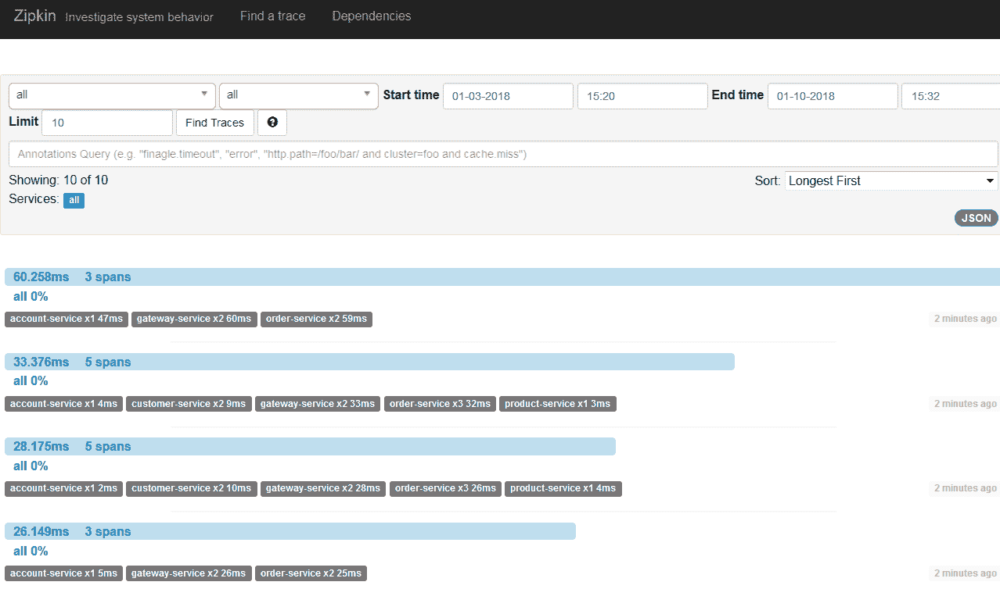

你可以用不同的标准过滤条目，比如服务名称、跨度名称、跟踪 ID、请求时间或持续时间。Zipkin 还可视化失败的请求并按持续时间降序或升序排序：

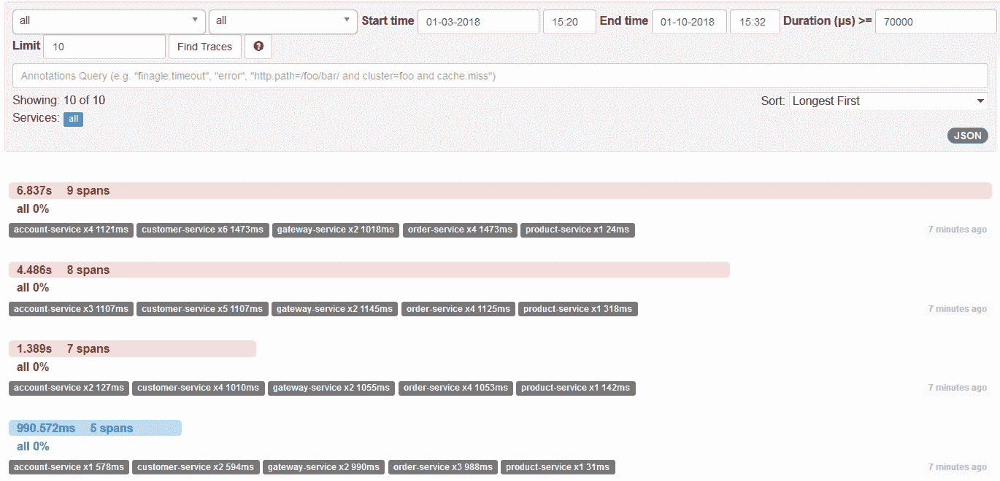

你可以查看每个条目的详细信息。Zipkin 可视化了所有参与通信的微服务之间的流程。它考虑了每个传入请求的时间数据。你可以揭示系统延迟的原因：

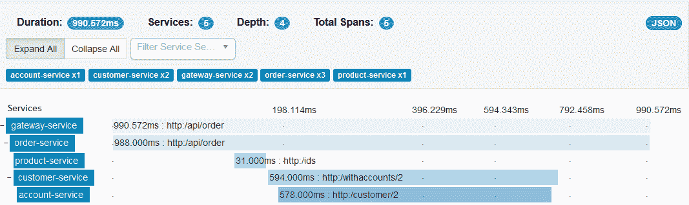

Zipkin 提供了一些额外有趣的功能。其中之一是能够可视化应用程序之间的依赖关系。以下屏幕截图说明了我们的示例系统的通信流程：

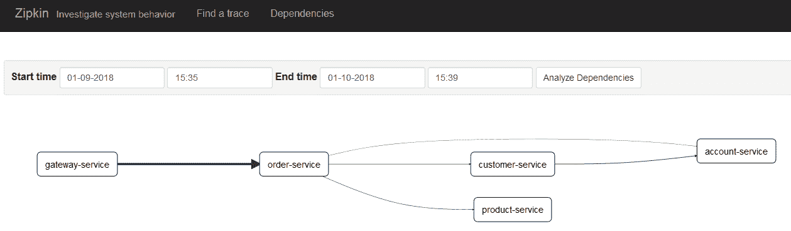

你可以通过点击相关元素来查看服务之间交换了多少消息：

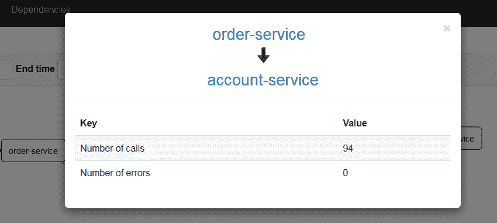

# 通过消息代理进行集成

通过 HTTP 集成 Zipkin 并不是唯一选项。正如 Spring Cloud 通常所做的那样，我们可以使用消息代理作为代理。有两个可用的代理商—RabbitMQ 和 Kafka。第一个可以通过使用`spring-rabbit`依赖项包含在项目中，而第二个可以通过`spring-kafka`包含。这两个代理商的默认目的地名称都是`zipkin`：

```java
<dependency>
 <groupId>org.springframework.cloud</groupId>
 <artifactId>spring-cloud-starter-zipkin</artifactId>
</dependency>
<dependency>
 <groupId>org.springframework.amqp</groupId>
 <artifactId>spring-rabbit</artifactId>
</dependency>
```

这个功能还要求 Zipkin 服务器端进行更改。我们配置了一个消费者，它正在监听来自 RabbitMQ 或 Kafka 队列的数据。为了实现这一点，只需在你的项目中包含以下依赖项。你仍然需要将`zipkin-server`和`zipkin-autoconfigure-ui`工件包含在类路径中：

```java
<dependency>
 <groupId>org.springframework.cloud</groupId>
 <artifactId>spring-cloud-sleuth-zipkin-stream</artifactId>
</dependency>
<dependency>
 <groupId>org.springframework.cloud</groupId>
 <artifactId>spring-cloud-starter-stream-rabbit</artifactId>
</dependency>
```

你应该用`@EnableZipkinStreamServer`而不是`@EnableZipkinServer`注解主应用类。幸运的是，`@EnableZipkinStreamServer`也注解有`@EnableZipkinServer`，这意味着你也可以使用标准的 Zipkin 服务器端点通过 HTTP 收集跨度，以及使用 Web 控制台查找它们：

```java
@SpringBootApplication
@EnableZipkinStreamServer
public class ZipkinApplication {

    public static void main(String[] args) {
        new SpringApplicationBuilder(ZipkinApplication.class).web(true).run(args);
    }

}
```

# 摘要

在开发过程中，日志记录和跟踪通常并不是非常重要，但这些是系统维护中的关键特性。在本章中，我重点介绍了开发和运维领域。我向您展示了如何以几种不同的方式将 Spring Boot 微服务应用程序与 Logstash 和 Zipkin 集成。我还向您展示了如何启用 Spring Cloud Sleuth 功能的一些示例，以便更容易监视许多微服务之间的调用。阅读完本章后，您还应该能够有效地使用 Kibana 作为日志聚合工具，以及使用 Zipkin 作为跟踪工具，发现系统内部通信的瓶颈。

Spring Cloud Sleuth 与 Elastic Stack 和 Zipkin 结合使用，似乎是一个非常强大的生态系统，它消除了您可能对由许多独立微服务组成的监控系统存在问题的任何疑虑。
