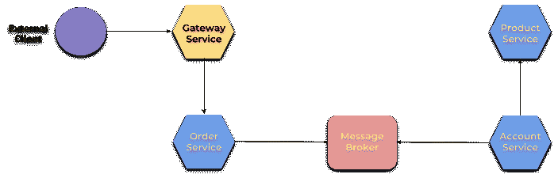
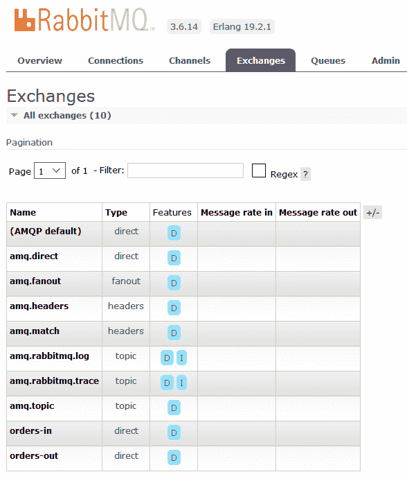
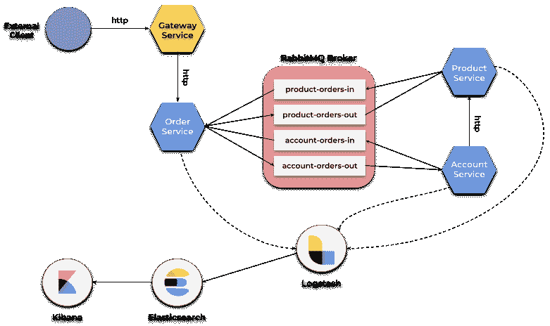
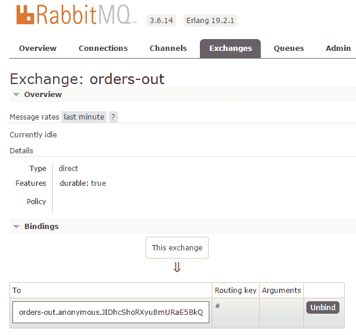
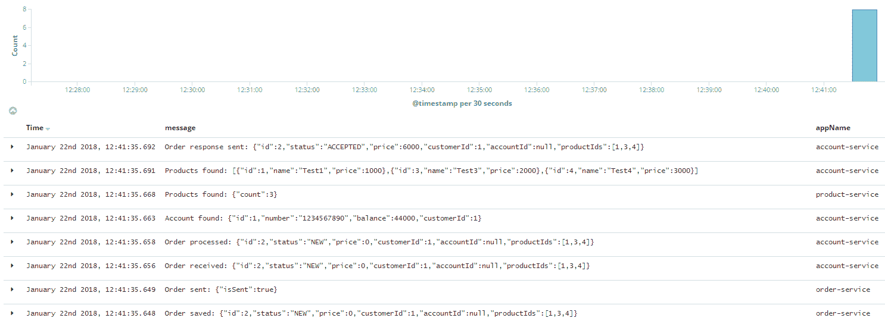
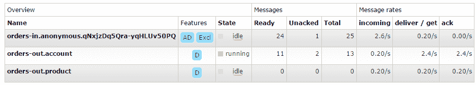
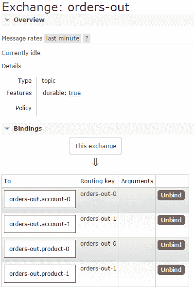
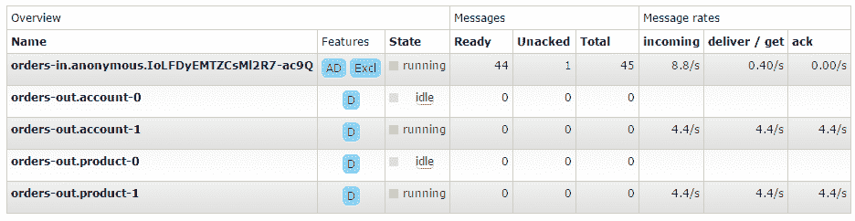

# 第十一章：消息驱动的微服务

我们已经讨论了围绕由 Spring Cloud 提供的微服务架构的许多特性。然而，我们一直都在考虑基于同步、RESTful 的跨服务通信。正如您可能从第一章，《微服务简介》中记忆的那样，还有一些其他流行的通信方式，如发布/订阅或异步、事件驱动的点对点消息传递。在本章中，我想介绍一种与前几章中介绍的微服务不同的方法。我们将更详细地讨论如何使用 Spring Cloud Stream 来构建消息驱动的微服务。

本章我们将覆盖的主题包括：

+   与 Spring Cloud Stream 相关的术语和概念

+   使用 RabbitMQ 和 Apache Kafka 消息代理作为绑定器

+   Spring Cloud Stream 编程模型

+   绑定、生产者和消费者的高级配置

+   实现缩放、分组和分区机制

+   支持多个绑定器

# 学习 Spring Cloud Stream

Spring Cloud Stream 是建立在 Spring Boot 之上的。它允许我们创建独立的、生产级别的 Spring 应用程序，并使用 Spring Integration 来实现与消息代理的通信。使用 Spring Cloud Stream 创建的每个应用程序通过输入和输出通道与其他微服务集成。这些通道通过特定于中间件的绑定器实现与外部消息代理的连接。内置的绑定器实现有两个——Kafka 和 Rabbit MQ。

Spring Integration 将 Spring 编程模型扩展以支持著名的**企业集成模式**（**EIP**）。EIP 定义了一系列通常用于分布式系统中的编排的组件。您可能已经听说过诸如消息通道、路由器、聚合器或端点之类的模式。Spring Integration 框架的主要目标是提供一个简单的模型，用于构建基于 EIP 的 Spring 应用程序。如果您对 EIP 的更多细节感兴趣，请访问[`www.enterpriseintegrationpatterns.com/patterns/messaging/toc.html`](http://www.enterpriseintegrationpatterns.com/patterns/messaging/toc.html)网站。

# 构建消息系统

我认为介绍 Spring Cloud Stream 的主要特性的最适合方式是通过一个基于微服务的示例系统。我们将轻微修改一下在前几章中讨论过的系统架构。让我回顾一下那个架构。我们的系统负责处理订单。它由四个独立的微服务组成。`order-service` 微服务首先与 `product-service` 通信，以收集所选产品的详细信息，然后与 `customer-service` 通信，以获取有关客户和他的账户的信息。现在，发送到 `order-service` 的订单将被异步处理。仍然有一个暴露的 RESTful HTTP API 端点，用于客户端提交新订单，但它们不被应用程序处理。它只保存新订单，将其发送到消息代理，然后向客户端回应订单已被批准处理。目前讨论的示例的主要目标是展示点对点通信，所以消息只会被一个应用程序，`account-service` 接收。以下是说明示例系统架构的图表：



在接收到新消息后，`account-service` 调用 `product-service` 暴露的方法，以找出其价格。它从账户中提取资金，然后将当前订单状态的响应发送回 `order-service`。该消息也是通过消息代理发送的。`order-service` 微服务接收到消息并更新订单状态。如果外部客户想要检查当前订单状态，它可以通过调用暴露 `find` 方法的端点来提供订单详情。示例应用程序的源代码可以在 GitHub 上找到（[`github.com/piomin/sample-spring-cloud-messaging.git`](https://github.com/piomin/sample-spring-cloud-messaging.git)）。

# 启用 Spring Cloud Stream

将 Spring Cloud Stream 包含在项目中的推荐方法是使用依赖管理系统。Spring Cloud Stream 在整个 Spring Cloud 框架方面有独立的发布列车管理。然而，如果我们已经在 `dependencyManagement` 部分声明了 `Edgware.RELEASE` 版本的 `spring-cloud-dependencies`，我们不必在 `pom.xml` 中声明其他内容。如果您更喜欢只使用 Spring Cloud Stream 项目，您应该定义以下部分：

```java
<dependencyManagement>
 <dependencies>
  <dependency>
   <groupId>org.springframework.cloud</groupId>
   <artifactId>spring-cloud-stream-dependencies</artifactId>
   <version>Ditmars.SR2</version>
   <type>pom</type>
   <scope>import</scope>
  </dependency>
 </dependencies>
</dependencyManagement>
```

下一步是向项目依赖中添加 `spring-cloud-stream`。我还建议您至少包含 `spring-cloud-sleuth` 库，以提供与通过 Zuul 网关传入 `order-service` 的源请求相同的 `traceId` 发送消息：

```java
<dependency>
 <groupId>org.springframework.cloud</groupId>
 <artifactId>spring-cloud-stream</artifactId>
</dependency>
<dependency>
 <groupId>org.springframework.cloud</groupId>
 <artifactId>spring-cloud-sleuth</artifactId>
</dependency>
```

为了使应用程序能够连接到消息代理，请用`@EnableBinding`注解标记主类。`@EnableBinding`注解需要一个或多个接口作为参数。您可以选择 Spring Cloud Stream 提供的三个接口之一：

+   `Sink`：这用于标记接收来自入站通道消息的服务。

+   `Source`：用于向出站通道发送消息。

+   `Processor`：如果您需要入站通道和出站通道，可以使用它，因为它扩展了`Source`和`Sink`接口。因为`order-service`发送消息，以及接收消息，所以它的主类被用`@EnableBinding(Processor.class)`注解标记。

这是`order-service`的`main`类，它启用了 Spring Cloud Stream 绑定：

```java
@SpringBootApplication
@EnableDiscoveryClient
@EnableBinding(Processor.class)
public class OrderApplication {

    public static void main(String[] args) {
        new SpringApplicationBuilder(OrderApplication.class).web(true).run(args);
    }

}
```

# 声明和绑定通道

得益于 Spring Integration 的使用，应用程序与项目中包含的消息代理实现是独立的。Spring Cloud Stream 会自动检测并使用类路径中找到的绑定器。这意味着我们可以选择不同类型的中间件，并用相同的代码使用它。所有中间件特定的设置都可以通过 Spring Boot 支持的格式（如应用程序参数、环境变量，或仅仅是`application.yml`文件）的外部配置属性来覆盖。正如我之前提到的，Spring Cloud Stream 为 Kafka 和 Rabbit MQ 提供了绑定器实现。要包括对 Kafka 的支持，您需要将以下依赖项添加到项目中：

```java
<dependency>
 <groupId>org.springframework.cloud</groupId>
 <artifactId>spring-cloud-starter-stream-kafka</artifactId>
</dependency>
```

个人而言，我更喜欢 RabbitMQ，但在这章节，我们将为 RabbitMQ 和 Kafka 都创建一个示例。因为我们已经讨论过 RabbitMQ 的功能，我将从基于 RabbitMQ 的示例开始：

```java
<dependency>
 <groupId>org.springframework.cloud</groupId>
 <artifactId>spring-cloud-starter-stream-rabbit</artifactId>
</dependency>
```

在启用 Spring Cloud Stream 并包括绑定器实现之后，我们可以创建发送者和监听者。让我们从负责将新订单消息发送到代理的生产者开始。这通过`order-service`中的`OrderSender`实现，它使用`Output`bean 来发送消息：

```java
@Service
public class OrderSender {

    @Autowired
    private Source source;

    public boolean send(Order order) {
        return this.source.output().send(MessageBuilder.withPayload(order).build());
    }

}
```

这个 bean 被控制器调用，控制器暴露了一个允许提交新订单的 HTTP 方法：

```java
@RestController
public class OrderController {

    private static final Logger LOGGER = LoggerFactory.getLogger(OrderController.class); 
    private ObjectMapper mapper = new ObjectMapper();

    @Autowired
    OrderRepository repository;
    @Autowired
    OrderSender sender;

    @PostMapping
    public Order process(@RequestBody Order order) throws JsonProcessingException {
        Order o = repository.add(order);
        LOGGER.info("Order saved: {}", mapper.writeValueAsString(order));
        boolean isSent = sender.send(o);
        LOGGER.info("Order sent: {}",     mapper.writeValueAsString(Collections.singletonMap("isSent", isSent)));
        return o;
    }

}
```

包含关于订单信息的消息已经发送到消息代理。现在，它应该被`account-service`接收。使这成为可能，我们必须声明接收者，它正在监听来自消息代理上创建的队列的消息。为了接收带有订单数据的消息，我们只需用`@StreamListener`注解来标记接受`Order`对象作为参数的方法：

```java
@SpringBootApplication
@EnableDiscoveryClient
@EnableBinding(Processor.class)
public class AccountApplication { 

    @Autowired
    AccountService service;

    public static void main(String[] args) {
        new SpringApplicationBuilder(AccountApplication.class).web(true).run(args);
    }

    @Bean
    @StreamListener(Processor.INPUT)
    public void receiveOrder(Order order) throws JsonProcessingException {
        service.process(order);
    }

}
```

现在您可以启动示例应用程序了。但是，还有一个重要细节尚未提到。这两个应用程序都尝试连接到运行在 localhost 上的 RabbitMQ，并且它们都将相同的交换机作为输入或输出。这是一个问题，因为`order-service`将消息发送到输出交换机，而`account-service`监听其输入交换机传入的消息。这些是不同的交换机，但首先事情要一件一件来做。让我们先从运行一个消息代理开始。

# 使用 RabbitMQ 代理自定义连接

在之前的章节中，我们已经使用 RabbitMQ 的 Docker 镜像启动了 RabbitMQ 代理，因此值得提醒这个命令。它启动了一个带有 RabbitMQ 的独立 Docker 容器，端口为`5672`，以及其 UI 网页控制台，端口为`15672`：

```java
docker run -d --name rabbit -p 15672:15672 -p 5672:5672 rabbitmq:management
```

默认的 RabbitMQ 地址应该在`application.yml`文件中使用`spring.rabbit.*`属性进行覆盖：

```java
spring:
 rabbitmq:
  host: 192.168.99.100
  port: 5672
```

默认情况下，Spring Cloud Stream 为通信创建了一个主题交换机。这种类型的交换机更适合发布/订阅交互模型。我们可以使用`exchangeType`属性来覆盖它，如`application.yml`的片段所示：

```java
spring:
 cloud:
  stream:
   rabbit:
    bindings:
     output:
      producer:
       exchangeType: direct
     input:
      consumer:
       exchangeType: direct
```

相同的配置设置应该提供给`order-service`和`account-service`。您不需要手动创建任何交换机。如果不存在，应用程序在启动时会自动创建。否则，应用程序只是绑定到该交换机。默认情况下，它为`@Input`通道创建名为 input 的交换机，为`@Output`通道创建名为 output 的交换机。这些名称可以通过`spring.cloud.stream.bindings.output.destination`和`spring.cloud.stream.bindings.input.destination`属性进行覆盖，其中 input 和 output 是通道的名称。这个配置选项不仅仅是 Spring Cloud Stream 功能的一个很好的补充，而且是用于跨服务通信中关联输入和输出目的地的一个关键设置。解释为什么会出现这种情况非常简单。在我们的示例中，`order-service`是消息源应用程序，因此它将消息发送到输出通道。另一方面，`account-service`监听输入通道传入的消息。如果`order-service`输出通道和`account-service`输入通道不指向代理上的相同目的地，它们之间的通信将失败。总之，我决定使用名为`orders-out`和`orders-in`的目标，并为`order-service`提供了以下配置：

```java
spring:
 cloud: 
  stream:
   bindings:
    output:
     destination: orders-out
    input:
     destination: orders-in
```

对于`account-service`，类似的配置设置是反向的：

```java
spring:
 cloud: 
  stream:
   bindings:
    output:
     destination: orders-in
    input:
     destination: orders-out
```

两个应用程序启动后，您可以通过访问 `http://192.168.99.100:15672`（`quest`/`guest`）的 RabbitMQ 代理的 Web 管理控制台，轻松查看声明的交换机列表。以下是为测试目的创建的两个目的地：



默认情况下，Spring Cloud Stream 提供了一个输入消息通道和一个输出消息通道。我们可以想象一种情况，我们的系统需要为每种类型的消息通道设置多个目的地。让我们回到示例系统架构中一会儿，考虑每个订单都由两个其他微服务异步处理的情况。到目前为止，只有 `account-service` 在监听来自 `order-service` 的传入事件。在当前示例中，`product-service` 将是传入订单的接收者。在该场景中，其主要目标是管理可用产品的数量，并根据订单详情减少产品数量。它需要我们在 `order-service` 内部定义两个输入和输出消息通道，因为基于直接 RabbitMQ 交换的点对点通信，每个消息可能由一个消费者处理。

在这种情况下，我们应该声明两个带有 `@Input` 和 `@Output` 方法的接口。每个方法都必须返回一个 `channel` 对象。Spring Cloud Stream 为出站通信提供了一个可绑定消息组件——`MessageChannel`，以及其扩展，`SubscribableChannel`，用于入站通信。以下是与 `product-service` 交互的接口定义。已经为与 `account-service` 消息通信创建了类似接口：

```java
public interface ProductOrder {

    @Input
    SubscribableChannel productOrdersIn();

    @Output
    MessageChannel productOrdersOut();
}
```

下一步是通过对主类使用 `@EnableBinding(value={AccountOrder.class, ProductOrder.class})` 注解来激活应用程序中声明的组件。现在，您可以使用它们的名称在配置属性中引用这些通道，例如，`spring.cloud.stream.bindings.productOrdersOut.destination=product-orders-in`。每个通道名称可以通过在使用 `@Input` 和 `@Output` 注解时指定通道名称来自定义，如下例所示：

```java
public interface ProductOrder {

    @Input("productOrdersIn")
    SubscribableChannel ordersIn();

    @Output("productOrdersOut")
    MessageChannel ordersOut();
}
```

基于自定义接口的声明，Spring Cloud Stream 将生成实现该接口的 bean。但是，它仍然必须在负责发送消息的 bean 中被访问。与之前的示例相比，直接注入绑定通道会更方便。以下是当前产品订单发送者的 bean 实现。还有一个类似的实现，用于向 `account-service` 发送消息：

```java
@Service
public class ProductOrderSender {

    @Autowired
    private MessageChannel output;

    @Autowired
    public SendingBean(@Qualifier("productOrdersOut") MessageChannel output) {
        this.output = output;
    }

    public boolean send(Order order) {
        return this.output.send(MessageBuilder.withPayload(order).build());
    }

}
```

每个消息通道的自定义接口也应提供给目标服务。监听器应绑定到消息代理上的正确消息通道和目的地：

```java
@StreamListener(ProductOrder.INPUT)
public void receiveOrder(Order order) throws JsonProcessingException {
    service.process(order);
}
```

# 与其他 Spring Cloud 项目的集成

你可能已经注意到，示例系统混合了不同的服务间通信风格。有些微服务使用典型的 RESTful HTTP API，而其他的则使用消息代理。也没有反对在单个应用程序中混合不同的通信风格。例如，你可以将`spring-cloud-starter-feign`添加到带有 Spring Cloud Stream 的项目中，并用`@EnableFeignClients`注解启用它。在我们的示例系统中，这两种不同的通信风格结合了`account-service`，它通过消息代理与`order-service`集成，并通过 REST API 与`product-service`通信。以下是`account-service`模块中`product-service`的 Feign 客户端实现：

```java
@FeignClient(name = "product-service")
public interface ProductClient {

    @PostMapping("/ids")
    List<Product> findByIds(@RequestBody List<Long> ids); 
}
```

还有其他好消息。得益于 Spring Cloud Sleuth，通过网关进入系统的一个单一请求期间交换的所有消息都有相同的`traceId`。无论是同步的 REST 通信，还是异步的消息传递，你都可以很容易地使用标准日志文件，或像 Elastic Stack 这样的日志聚合工具，在微服务之间跟踪和关联日志。

我认为现在是一个运行和测试我们的示例系统的好时机。首先，我们必须使用`mvn clean install`命令构建整个项目。要访问包含两个微服务，分别在两个不同的交换机上监听消息的代码示例，你应该切换到`advanced`分支([`github.com/piomin/sample-spring-cloud-messaging/tree/advanced`](https://github.com/piomin/sample-spring-cloud-messaging/tree/advanced)). 你应该启动那里所有的应用程序——网关、发现以及三个微服务(`account-service`, `order-service`, `product-service`)。目前讨论的案例假设我们已经使用 Docker 容器启动了 RabbitMQ、Logstash、Elasticsearch 和 Kibana。关于如何使用 Docker 镜像在本地运行 Elastic Stack 的详细说明，请参考第九章，*分布式日志和跟踪*。下面的图表详细显示了系统的架构：



在运行所有必要的应用程序和工具后，我们可以进行测试。以下是可以通过 API 网关发送到`order-service`的示例请求：

```java
curl -H "Content-Type: application/json" -X POST -d '{"customerId":1,"productIds":[1,3,4],"status":"NEW"}' http://localhost:8080/api/order
```

当我第一次运行测试时，按照前几节的描述配置应用程序，它不起作用。我可以理解，你们中的一些人可能会有些困惑，因为通常它是用默认设置进行测试的。为了使其正常运行，我还需要在`application.yml`中添加以下属性：`spring.cloud.stream.rabbit.bindings.output.producer.routingKeyExpression: '"#"'`. 它将默认生产者的路由键设置为自动在应用程序启动期间创建的交换机路由键，以符合输出交换定义。在下面的屏幕截图中，你可以看到输出交换定义之一：



在前面描述的修改之后，测试应该成功完成。微服务打印的日志通过 `traceId` 相互关联。我在 `logback-spring.xml` 中稍微修改了默认的 Sleuth 日志格式，现在它是这样配置的——`%d{HH:mm:ss.SSS} %-5level [%X{X-B3-TraceId:-},%X{X-B3-SpanId:-}] %msg%n`。在发送 `order-service` 测试请求后，记录以下信息：

```java
12:34:48.696 INFO [68038cdd653f7b0b,68038cdd653f7b0b] Order saved: {"id":1,"status":"NEW","price":0,"customerId":1,"accountId":null,"productIds":[1,3,4]}
12:34:49.821 INFO [68038cdd653f7b0b,68038cdd653f7b0b] Order sent: {"isSent":true}
```

正如您所看到的，`account-service` 也使用相同的日志格式，并打印出与 `order-service` 相同的 `traceId`：

```java
12:34:50.079 INFO [68038cdd653f7b0b,23432d962ec92f7a] Order processed: {"id":1,"status":"NEW","price":0,"customerId":1,"accountId":null,"productIds":[1,3,4]}
12:34:50.332 INFO [68038cdd653f7b0b,23432d962ec92f7a] Account found: {"id":1,"number":"1234567890","balance":50000,"customerId":1}
12:34:52.344 INFO [68038cdd653f7b0b,23432d962ec92f7a] Products found: [{"id":1,"name":"Test1","price":1000},{"id":3,"name":"Test3","price":2000},{"id":4,"name":"Test4","price":3000}]
```

在单个事务期间生成的所有日志可以使用 Elastic Stack 进行聚合。例如，您可以根据 `X-B3-TraceId` 字段过滤条目，例如 `9da1e5c83094390d`：



# 发布/订阅模型

创建 Spring Cloud Stream 项目的主要动机实际上是为了支持持久的发布/订阅模型。在前面的部分，我们已经讨论了微服务之间的点对点通信，这只是额外的特性。然而，无论我们决定使用点对点还是发布/订阅模型，编程模型都是相同的。

在发布/订阅通信中，数据通过共享主题进行广播。它简化了生产者和消费者的复杂性，并且允许在没有更改流程的情况下，轻松地向现有拓扑添加新应用程序。这一点在前面展示的系统示例中可以明显看到，我们决定向由源微服务生成的事件添加第二个应用程序。与初始架构相比，我们不得不为每个目标应用程序定义自定义消息通道。通过队列进行直接通信，消息只能被一个应用程序实例消费，因此，这种解决方案是必要的。发布/订阅模型的使用简化了架构。

# 运行示例系统

对于发布/订阅模型，示例应用程序的开发比点对点通信要简单。我们不需要重写任何默认消息通道以实现与多个接收者的交互。与最初示例相比，我们只需要稍改配置设置。因为 Spring Cloud Stream 默认绑定到主题，所以我们不需要重写输入消息通道的 `exchangeType`。如您在下面的配置片段中所见，我们仍然在使用点对点通信发送对 `order-service` 的响应。如果我们仔细想想，这是有道理的。`order-service` 微服务发送的消息必须被 `account-service` 和 `product-service` 接收，而它们的响应只针对 `order-service`：

```java
spring: 
 application:
  name: product-service
 rabbitmq:
  host: 192.168.99.100
  port: 5672
 cloud: 
  stream:
   bindings:
    output:
     destination: orders-in
    input:
     destination: orders-out
   rabbit:
    bindings:
     output:
      producer:
       exchangeType: direct
       routingKeyExpression: '"#"'
```

产品-服务的主要处理方法的逻辑非常简单。它只需要从接收到的订单中找到所有的`productIds`，为每一个它们改变存储产品的数量，然后将响应发送给`order-service`：

```java
@Autowired
ProductRepository productRepository;
@Autowired
OrderSender orderSender;

public void process(final Order order) throws JsonProcessingException {
 LOGGER.info("Order processed: {}", mapper.writeValueAsString(order));
 for (Long productId : order.getProductIds()) {
     Product product = productRepository.findById(productId);
     if (product.getCount() == 0) {
         order.setStatus(OrderStatus.REJECTED);
         break;
     }
     product.setCount(product.getCount() - 1);
     productRepository.update(product);
     LOGGER.info("Product updated: {}", mapper.writeValueAsString(product));
 }
 if (order.getStatus() != OrderStatus.REJECTED) {
     order.setStatus(OrderStatus.ACCEPTED);
 }
 LOGGER.info("Order response sent: {}", mapper.writeValueAsString(Collections.singletonMap("status", order.getStatus())));
 orderSender.send(order);
}
```

要访问当前示例，您只需切换到`publish_subscribe`分支，可在[`github.com/piomin/sample-spring-cloud-messaging/tree/publish_subscribe`](https://github.com/piomin/sample-spring-cloud-messaging/tree/publish_subscribe)找到。然后，您应该构建父项目并像前一个示例一样运行所有服务。如果您想测试，直到您只有一个运行的`account-service`和`product-service`实例，所有都正常工作。让我们来讨论那个问题。

# 扩展和分组

当谈论基于微服务的架构时，可扩展性总是作为其主要优点之一被提出。通过创建给定应用程序的多个实例来扩展系统的能力非常重要。这样做时，应用程序的不同实例被放置在竞争性消费者关系中，其中只有一个实例预期处理给定消息。对于点对点通信，这不是问题，但在发布-订阅模型中，消息被所有接收者消费，这可能是一个挑战。

# 运行多个实例

对于扩展微服务实例的数量，Spring Cloud Stream 的可用性是围绕其主要概念之一。然而，这个想法背后并没有魔法。使用 Spring Cloud Stream 运行应用程序的多个实例非常容易。其中一个原因是消息代理的原生支持，它被设计用来处理许多消费者和大量流量。

在我们的案例中，所有的消息微服务也都暴露了 RESTful HTTP API，因此首先我们必须为每个实例定制服务器端口。我们之前已经进行了这样的操作。我们还可以考虑设置两个 Spring Cloud Stream 属性，`spring.cloud.stream.instanceCount`和`spring.cloud.stream.instanceIndex`。得益于它们，每个微服务实例都能够接收到关于有多少其他相同应用程序的实例被启动以及它自己的实例索引的信息。只有在您想要启用分区特性时，才需要正确配置这些属性。我稍后会详细讲解这个机制。现在，让我们来看看扩展应用程序的配置设置。`account-service`和`product-service`都为运行应用程序的多个实例定义了两个配置文件。我们在那里定制了服务器的 HTTP 端口、数量和实例索引：

```java
---
spring:
 profiles: instance1
 cloud:
  stream:
   instanceCount: 2
   instanceIndex: 0
server: 
 port: ${PORT:8091}

---
spring:
 profiles: instance2
 cloud:
  stream:
   instanceCount: 2
   instanceIndex: 1
server: 
 port: ${PORT:9091}
```

构建父项目后，您可以运行应用程序的两个实例。每个实例在启动时都分配有属性，例如，`java -jar --spring.profiles.active=instance1 target/account-service-1.0-SNAPSHOT.jar`。如果您向`order-service`端点`POST /`发送测试请求，新订单将被转发到 RabbitMQ 主题交换，以便被连接到该交换的`account-service`和`product-service`接收。问题在于，消息被每个服务的所有实例接收，这并不是我们想要实现的效果。在这里，分组机制提供了帮助。

# 消费者组

我们的目标很明确。我们有多个微服务消费同一个主题的消息。应用程序的不同实例处于竞争性消费者关系中，但只有一个实例应该处理给定的消息。Spring Cloud Stream 引入了消费者组的概念来模拟这种行为。要激活这种行为，我们应该设置一个名为`spring.cloud.stream.bindings.<channelName>.group`的属性，并指定一个组名。设置后，所有订阅给定目的地的组都会接收到发布的数据副本，但每个组中只有一个成员会从那个目的地接收并处理消息。在我们这个案例中，有两个组。首先，为所有`account-service`实例命名 account，其次，为名为 product 的`product-service`。

这是`account-service`当前的绑定配置。`orders-in`目的地是为与`order-service`直接通信而创建的队列，所以只有`orders-out`按服务名称分组。为`product-service`准备了类似的配置：

```java
spring:
 cloud: 
  stream:
   bindings:
    output:
     destination: orders-in
    input:
     destination: orders-out
     group: account
```

第一个区别体现在为 RabbitMQ 交换自动创建的队列的名称上。现在，它不是一个随机生成的名称，如`orders-in.anonymous.qNxjzDq5Qra-yqHLUv50PQ`，而是一个由目的地和组名组成的确定字符串。下面的屏幕截图显示了目前在 RabbitMQ 上存在的所有队列：



您可以自行重新测试以验证消息是否仅被同一组中的一个应用程序接收。然而，您无法确定哪个实例会处理传入的消息。为了确定这一点，您可以使用分区机制。

# 分区

Spring Cloud Stream 为应用程序的多个实例之间的数据分区提供了支持。在典型用例中，目的地被视为被分成不同的分区。每个生产者，在向多个消费者实例发送消息时，确保数据通过配置的字段来标识，以强制由同一个消费者实例处理。

为了启用您应用程序的分区功能，您必须在生产者配置设置中定义`partitionKeyExpression`或`partitionKeyExtractorClass`属性，以及`partitionCount`。以下是为您的应用程序可能提供的示例配置：

```java
spring.cloud.stream.bindings.output.producer.partitionKeyExpression=payload.customerId
spring.cloud.stream.bindings.output.producer.partitionCount=2
```

分区机制还需要在消费者侧设置`spring.cloud.stream.instanceCount`和`spring.cloud.stream.instanceIndex`属性。它还需要通过将`spring.cloud.stream.bindings.input.consumer.partitioned`属性设置为`true`来显式启用。实例索引负责识别特定实例从哪个唯一分区接收数据。通常，生产者侧的`partitionCount`和消费者侧的`instanceCount`应该相等。

让我来向您介绍由 Spring Cloud Stream 提供的分区机制。首先，它根据`partitionKeyExpression`计算分区键，该表达式针对出站消息或实现`PartitionKeyExtractorStrategy`接口的实现进行评估，该接口定义了提取消息键的算法。一旦计算出消息键，目标分区就被确定为零到`partitionCount - 1`之间的一个值。默认的计算公式是`key.hashCode() % partitionCount`。可以通过设置`partitionSelectorExpression`属性，或通过实现`org.springframework.cloud.stream.binder.PartitionSelectorStrategy`接口来定制它。计算出的键与消费者侧的`instanceIndex`相匹配。

我认为分区的主要概念已经解释清楚了。接下来让我们看一个示例。以下是`product-service`的输入通道当前的配置（与`account-service`设置账户组名相同）：

```java
spring:
 cloud: 
  stream:
   bindings:
    input:
     consumer:
      partitioned: true
     destination: orders-out
     group: product
```

在我们每个从主题交换中消费数据的微服务中，都有两个运行实例。在`order-service`内部也为生产者设置了两个分区。消息键是基于`Order`对象中的`customerId`字段计算得出的。索引为`0`的分区专门用于`customerId`字段中偶数的订单，而索引为`1`的分区则用于奇数。

实际上，RabbitMQ 并没有对分区提供原生支持。有趣的是，Spring Cloud Stream 是如何使用 RabbitMQ 实现分区过程的。下面是一张说明在 RabbitMQ 中创建的交换器绑定的列表的屏幕截图。正如你所看到的，为交换器定义了两个路由键——`orders-out-0`和`orders-out-1`：



例如，如果你在一个 JSON 消息中发送一个`customerId`等于 1 的订单，例如`{"customerId": 1,"productIds": [4],"status": "NEW"}`，它总是会由`instanceIndex=1`的实例处理。可以通过应用程序日志或使用 RabbitMQ 网页控制台进行检查。下面是一个每个队列的消息率的图表，其中`customerId=1`的消息已经发送了几次：



# 配置选项

Spring Cloud Stream 的配置设置可以通过 Spring Boot 支持的任何机制进行覆盖，例如应用程序参数、环境变量以及 YAML 或属性文件。它定义了一系列通用的配置选项，可以应用于所有绑定器。然而，还有一些特定于应用程序使用的消息代理的其他属性。

# Spring Cloud Stream 属性

当前组的属性适用于整个 Spring Cloud Stream 应用程序。以下所有属性都带有`spring.cloud.stream`前缀：

| 名称 | 默认值 | 描述 |
| --- | --- | --- |
| `instanceCount` | `1` | 应用程序正在运行的实例数量。有关详细信息，请参阅*扩展和分组*部分。 |
| `instanceIndex` | `0` | 应用程序的实例索引。有关详细信息，请参阅*扩展和分组*部分。 |
| `dynamicDestinations` | - | 可以动态绑定的目的地列表。 |
| `defaultBinder` | - | 如果有多个绑定器定义，则使用的默认绑定器。有关详细信息，请参阅*多个绑定器*部分。 |
| `overrideCloudConnectors` | `false` | 仅当云处于活动状态且 Spring Cloud Connectors 在类路径上时才使用。当设置为`true`时，绑定器完全忽略已绑定的服务，并依赖于`spring.rabbitmq.*`或`spring.kafka.*`的 Spring Boot 属性。 |

# 绑定属性

下一组属性与消息通道有关。在 Spring Cloud 命名法中，这些是绑定属性。它们只能分配给消费者、生产者，或同时分配给两者。以下是这些属性及其默认值和描述：

| 名称 | 默认值 | 描述 |
| --- | --- | --- |
| `destination` | - | 配置为消息通道的消息代理的目标目的地名称。如果通道只被一个消费者使用，它可以被指定为以逗号分隔的目的地列表。 |
| `group` | `null` | 通道的消费者组。有关详细信息，请参阅*扩展和分组*部分。 |
| `contentType` | `null` | 给定通道上交换消息的内容类型。例如，我们可以将其设置为`application/json`。然后，从该应用程序发送的所有对象都会自动转换为 JSON 字符串。 |
| `binder` | `null` | 通道使用的默认绑定器。有关详细信息，请参阅*多个绑定器*部分。 |

# 消费者

下面的属性列表仅适用于输入绑定，并且必须以`spring.cloud.stream.bindings.<channelName>.consumer`为前缀。我将只指示其中最重要的几个：

| **名称** | **默认值** | **描述** |
| --- | --- | --- |
| `concurrency` | `1` | 每个单一输入通道的消费者数量 |
| `partitioned` | `false` | 它使能够从分区生产者接收数据 |
| `headerMode` | `embeddedHeaders` | 如果设置为`raw`，则禁用输入上的头部解析 |
| `maxAttempts` | `3` | 如果消息处理失败，则重试的次数。将此选项设置为`1`将禁用重试机制 |

# 生产者

下面的属性绑定仅适用于输出绑定，并且必须以`spring.cloud.stream.bindings.<channelName>.producer`为前缀。我也会只指示其中最重要的几个：

| **名称** | **默认值** | **描述** |
| --- | --- | --- |
| `requiredGroups` | - | 必须在与消息代理上创建的分隔的组列表 |
| `headerMode` | `embeddedHeaders` | 如果设置为`raw`，则禁用输入上的头部解析 |
| `useNativeEncoding` | `false` | 如果设置为`true`，则出站消息由客户端库直接序列化 |
| `errorChannelEnabled` | `false` | 如果设置为`true`，则将失败消息发送到目的地的错误通道 |

# 高级编程模型

Spring Cloud Stream 编程模型的基础知识已经介绍过了，还包括点对点和发布/订阅通信的示例。让我们讨论一些更高级的示例特性。

# 发送消息

在本章中 presented 的所有示例中，我们通过 RESTful API 发送订单以进行测试。然而，我们很容易通过在应用程序内部定义消息源来创建一些测试数据。下面是一个使用`@Poller`每秒生成一条消息并将其发送到输出通道的 bean：

```java
@Bean
@InboundChannelAdapter(value = Source.OUTPUT, poller = @Poller(fixedDelay = "1000", maxMessagesPerPoll = "1"))
public MessageSource<Order> ordersSource() {
    Random r = new Random();
    return () -> new GenericMessage<>(new Order(OrderStatus.NEW, (long) r.nextInt(5), Collections.singletonList((long) r.nextInt(10))));
}
```

# 转换

正如您可能记得的，`account-service`和`product-service`一直在从`order-service`接收事件，然后发送回响应消息。我们创建了`OrderSender`bean，它负责准备响应载荷并将其发送到输出通道。结果是，如果我们在方法中返回响应对象并将其注解为`@SentTo`，则实现可能更简单：

```java
@StreamListener(Processor.INPUT)
@SendTo(Processor.OUTPUT)
public Order receiveAndSendOrder(Order order) throws JsonProcessingException {
    LOGGER.info("Order received: {}", mapper.writeValueAsString(order));
    return service.process(order);
}
```

我们甚至可以想象这样一个实现，比如下面的实现，而不使用`@StreamListener`。变换器模式负责改变对象的形式。在这种情况下，它修改了两个`order`字段—`status`和`price`：

```java
@EnableBinding(Processor.class)
public class OrderProcessor {

    @Transformer(inputChannel = Processor.INPUT, outputChannel = Processor.OUTPUT)
    public Order process(final Order order) throws JsonProcessingException {
        LOGGER.info("Order processed: {}", mapper.writeValueAsString(order));
        // ...

        products.forEach(p -> order.setPrice(order.getPrice() + p.getPrice()));
        if (order.getPrice() <= account.getBalance()) {
            order.setStatus(OrderStatus.ACCEPTED);
            account.setBalance(account.getBalance() - order.getPrice());
        } else {
            order.setStatus(OrderStatus.REJECTED);
        }
        return order;
    }

}
```

# 条件性地接收消息

假设我们希望对同一消息通道传入的消息进行不同的处理，我们可以使用条件分发。Spring Cloud Stream 支持根据条件将消息分发到输入通道上注册的多个`@StreamListener`方法。这个条件是一个**Spring 表达式语言**（**SpEL**）表达式，定义在`@StreamListener`注解的`condition`属性中：

```java
public boolean send(Order order) {
    Message<Order> orderMessage = MessageBuilder.withPayload(order).build();
    orderMessage.getHeaders().put("processor", "account");
    return this.source.output().send(orderMessage);
}
```

这是一个定义了两个注有`@StreamListener`注解的方法的示例，它们监听同一个主题。其中一个只处理来自`account-service`的消息，而第二个只处理`product-service`的消息。传入的消息根据其头部的`processor`名称进行分发：

```java
@SpringBootApplication
@EnableDiscoveryClient
@EnableBinding(Processor.class)
public class OrderApplication {

    @StreamListener(target = Processor.INPUT, condition = "headers['processor']=='account'")
    public void receiveOrder(Order order) throws JsonProcessingException {
        LOGGER.info("Order received from account: {}", mapper.writeValueAsString(order));
        // ...
    }

    @StreamListener(target = Processor.INPUT, condition = "headers['processor']=='product'")
    public void receiveOrder(Order order) throws JsonProcessingException {
        LOGGER.info("Order received from product: {}", mapper.writeValueAsString(order));
        // ...
    }

}
```

# 使用 Apache Kafka

在讨论 Spring Cloud 与消息代理的集成时，我提到了 Apache Kafka 几次。然而，到目前为止，我们还没有基于该平台运行任何示例。事实上，当与 Spring Cloud 项目一起使用时，RabbitMQ 往往是最受欢迎的选择，但 Kafka 也值得我们关注。它相对于 RabbitMQ 的一个优势是对分区的大力支持，这是 Spring Cloud Stream 最重要的特性之一。

Kafka 不是一个典型的消息代理。它更像是一个分布式流处理平台。它的主要特性是允许您发布和订阅记录流。它特别适用于实时流应用程序，这些应用程序转换或对数据流做出反应。它通常作为由一个或多个服务器组成的集群运行，并将记录流存储在主题中。

# 运行 Kafka

不幸的是，没有官方的 Apache Kafka Docker 镜像。然而，我们可以使用一个非官方的镜像，例如 Spotify 共享的镜像。与其他可用的 Kafka Docker 镜像相比，这个镜像在同一个容器中同时运行 Zookeeper 和 Kafka。以下是启动 Kafka 并将其暴露在端口`9092`上的 Docker 命令。Zookeeper 也外部可访问端口`2181`：

```java
docker run -d --name kafka -p 2181:2181 -p 9092:9092 --env ADVERTISED_HOST=192.168.99.100 --env ADVERTISED_PORT=9092 spotify/kafka
```

# 定制应用程序设置

要为应用程序启用 Apache Kafka，请将`spring-cloud-starter-stream-kafka`启动器包括在依赖项中。我们当前的示例与在*发布/订阅模型*章节中介绍的 RabbitMQ 的发布/订阅、带分组和分区的示例非常相似。唯一的区别在于依赖项和配置设置。

Spring Cloud Stream 会自动检测并使用类路径中找到的绑定器。连接设置可以通过`spring.kafka.*`属性进行覆盖。在我们的案例中，我们只需要将自动配置的 Kafka 客户端地址更改为 Docker 机器的地址`192.168.99.100`。对于由 Kafka 客户端使用的 Zookeeper 也应进行相同的修改：

```java
spring: 
 application:
  name: order-service
  kafka:
   bootstrap-servers: 192.168.99.100:9092
 cloud: 
  stream:
   bindings:
    output:
     destination: orders-out
     producer:
      partitionKeyExpression: payload.customerId
      partitionCount: 2
    input:
     destination: orders-in
   kafka:
    binder:
     zkNodes: 192.168.99.100
```

启动发现、网关以及所有必需的微服务实例之后，您可以执行与之前示例相同的测试。如果配置正确，您在应用启动过程中在日志中应看到以下片段。测试结果与基于 RabbitMQ 的示例完全相同：

```java
16:58:30.008 INFO [,] Discovered coordinator 192.168.99.100:9092 (id: 2147483647 rack: null) for group account.
16:58:30.038 INFO [,] Successfully joined group account with generation 1
16:58:30.039 INFO [,] Setting newly assigned partitions [orders-out-0, orders-out-1] for group account
16:58:30.081 INFO [,] partitions assigned:[orders-out-0, orders-out-1]
```

# 支持 Kafka Streams API

Spring Cloud Stream Kafka 提供了一个专门为 Kafka Streams 绑定设计的绑定器。通过这个绑定器，应用程序可以利用 Kafka Streams API。为了为您的应用程序启用此功能，请在您的项目中包含以下依赖项：

```java
<dependency>
 <groupId>org.springframework.cloud</groupId>
 <artifactId>spring-cloud-stream-binder-kstream</artifactId>
</dependency>
```

Kafka Streams API 提供了高级流 DSL。可以通过声明接收 `KStream` 接口作为参数的 `@StreamListener` 方法来访问它。KStream 为流处理提供了些有用的方法，这些方法在其他流式 API 中也很知名，如 `map`、`flatMap`、`join` 或 `filter`。还有一些 Kafka Stream 特有的方法，例如 `to(...)`（用于将流发送到主题）或 `through(...)`（与 `to` 相同，但还会从主题创建一个新的 `KStream` 实例）：

```java
@SpringBootApplication
@EnableBinding(KStreamProcessor.class)
public class AccountApplication {

    @StreamListener("input")
    @SendTo("output")
    public KStream<?, Order> process(KStream<?, Order> input) {
        // ..
    }

    public static void main(String[] args) {
        SpringApplication.run(AccountApplication.class, args);
    }

}
```

# 配置属性

一些 Spring Cloud 针对 Kafka 的配置设置在讨论示例应用程序实现时已经介绍过。下面是一个包含为自定义 Apache Kafka 绑定器设置的最重要属性的表格，所有这些属性都带有 `spring.cloud.stream.kafka.binder` 前缀：

| Name | 默认值 | 描述 |
| --- | --- | --- |
| `brokers` | `localhost` | 带或不带端口信息的经纪人列表，以逗号分隔。 |
| `defaultBrokerPort` | `9092` | 如果没有使用`brokers`属性定义端口，则设置默认端口。 |
| `zkNodes` | `localhost` | 带或不带端口信息的 ZooKeeper 节点列表，以逗号分隔。 |
| `defaultZkPort` | `2181` | 如果没有使用 `zkNodes` 属性定义端口，则设置默认 ZooKeeper 端口。 |
| `configuration` | - | Kafka 客户端属性的键/值映射。它适用于绑定器创建的所有客户端。 |
| `headers` | - | 将由绑定器传递的自定义头列表。 |
| `autoCreateTopics` | `true` | 如果设置为`true`，则绑定器会自动创建新主题。 |
| `autoAddPartitions` | `false` | 如果设置为`true`，则绑定器会自动创建新的分区。 |

# 多个绑定器

在 Spring Cloud Stream 命名约定中，可以实现以提供对外部中间件的物理目的地连接的接口称为**绑定器**。目前，有两大内置绑定器实现——Kafka 和 RabbitMQ。如果您想要提供一个自定义的绑定器库，关键的接口是一个将输入和输出连接到外部中间件的策略的抽象，称为 `Binder`，有两个方法——`bindConsumer` 和 `bindProducer`。有关更多详细信息，请参考 Spring Cloud Stream 规范。

对我们来说重要的是，能够在单个应用程序中使用多个绑定器。你甚至可以混合不同的实现，例如，RabbitMQ 和 Kafka。Spring Cloud Stream 在绑定过程中依赖于 Spring Boot 的自动配置。可用的实现自动使用。如果您想要同时使用默认的绑定器，请将以下依赖项包含在项目中：

```java
<dependency>
 <groupId>org.springframework.cloud</groupId>
 <artifactId>spring-cloud-stream-binder-rabbit</artifactId>
</dependency>
<dependency>
 <groupId>org.springframework.cloud</groupId>
 <artifactId>spring-cloud-stream-binder-kafka</artifactId>
</dependency>
```

如果在类路径中找到了多个绑定器，应用程序必须检测出哪个应该用于特定的通道绑定。我们可以通过`spring.cloud.stream.defaultBinder`属性全局配置默认的绑定器，或者每个通道分别通过`spring.cloud.stream.bindings.<channelName>.binder`属性配置。现在，我们回到我们的示例中，在那里配置多个绑定器。我们为`account-service`和`order-service`之间的直接通信定义 RabbitMQ，为`order-service`与其他微服务之间的发布/订阅模型定义 Kafka。

以下是在`publish_subscribe`分支中为`account-service`提供的等效配置([`github.com/piomin/sample-spring-cloud-messaging/tree/publish_subscribe`](https://github.com/piomin/sample-spring-cloud-messaging/tree/publish_subscribe)),但基于两种不同的绑定器：

```java
spring:
 cloud:
  stream:
   bindings:
    output:
     destination: orders-in
     binder: rabbit1
    input:
     consumer:
      partitioned: true
     destination: orders-out
     binder: kafka1
     group: account
   rabbit:
    bindings:
     output:
      producer:
       exchangeType: direct
       routingKeyExpression: '"#"'
   binders:
    rabbit1:
     type: rabbit
     environment:
      spring:
       rabbitmq:
        host: 192.168.99.100
    kafka1:
     type: kafka
     environment:
      spring:
       kafka:
        bootstrap-servers: 192.168.99.100:9092
```

# 概要

Spring Cloud Stream 与其他所有 Spring Cloud 项目相比可以被视为一个单独的类别。它经常与其他项目关联，而这些项目目前由 Pivotal Spring Cloud Data Flow 强烈推广。这是一个用于构建数据集成和实时数据处理管道的工具包。然而，这是一个庞大的主题，更是一个需要单独讨论的书本内容。

更具体地说，Spring Cloud Stream 提供了异步消息传递的支持，这可以通过使用 Spring 注解风格轻松实现。我认为对于你们中的某些人来说，这种服务间通信的风格不如 RESTful API 模型明显。因此，我专注于向你们展示使用 Spring Cloud Stream 的点对点和发布/订阅通信的示例。我还描述了这两种消息传递风格之间的区别。

发布/订阅模型并非新事物，但得益于 Spring Cloud Stream，它可以轻松地包含在基于微服务的系统中。本章中还描述了一些关键概念，例如消费者组或分区。阅读后，你应该能够实现基于消息模型的微服务，并将它们与 Spring Cloud 库集成，以提供日志记录、跟踪，或者只是将它们作为现有 REST-based 微服务系统的一部分部署。
