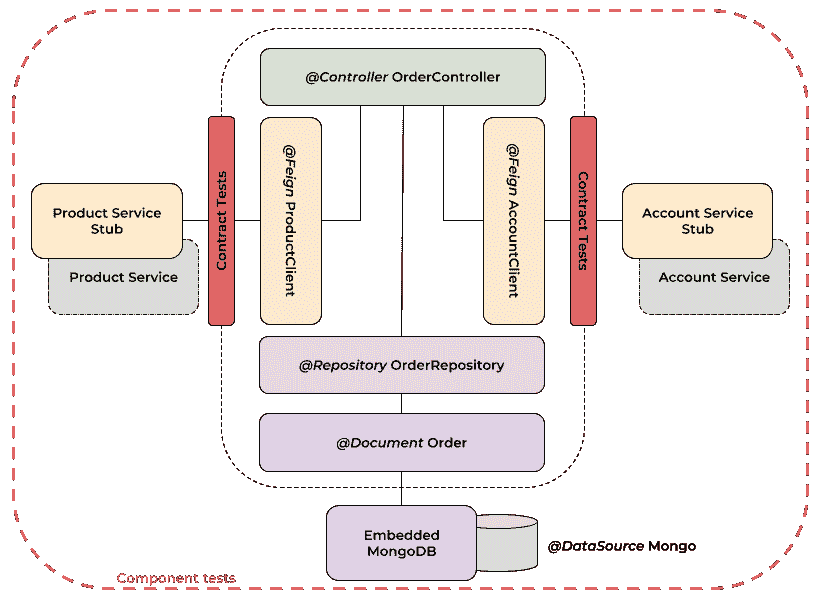
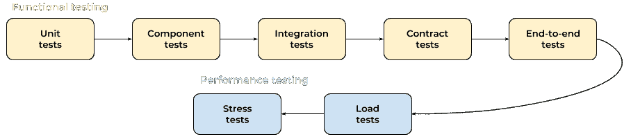
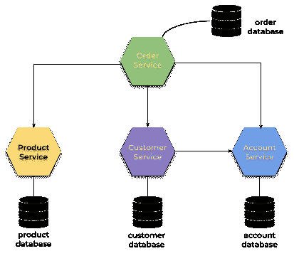
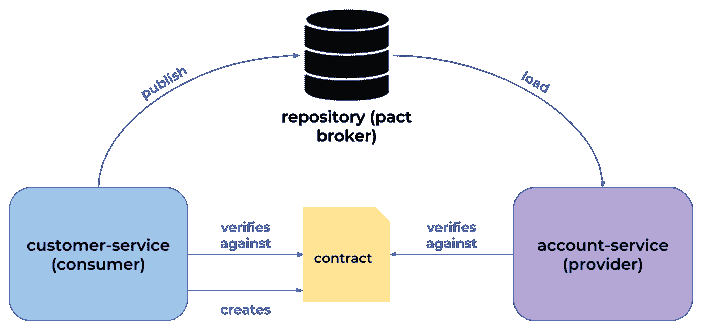
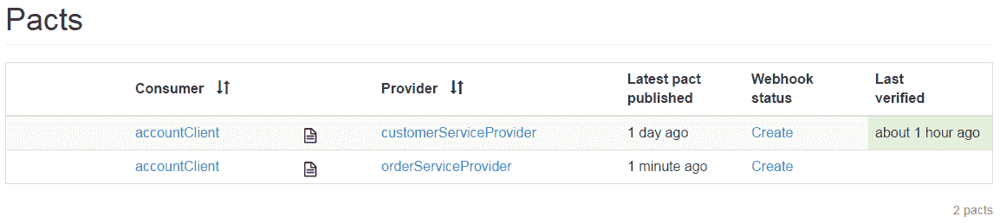
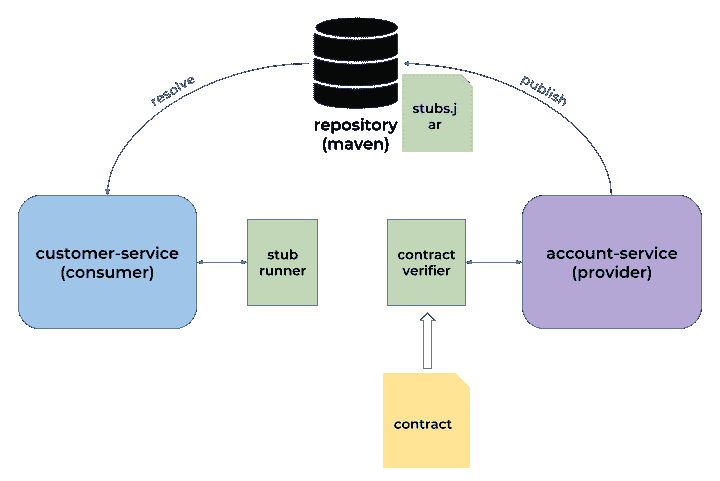
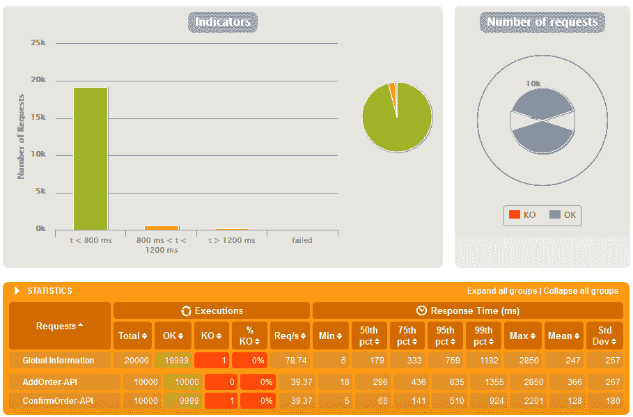
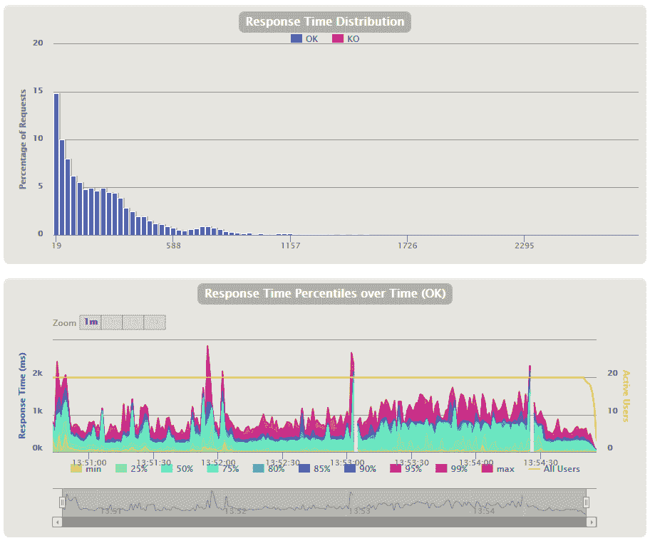

# 第十三章：测试 Java 微服务

在开发新应用程序时，我们永远不要忘记自动化测试。如果考虑基于微服务的架构，这些尤其重要。测试微服务需要与为单体应用程序创建的测试不同的方法。就单体而言，主要关注的是单元测试和集成测试，以及数据库层。在微服务的情况下，最重要的事情是以尽可能细粒度的覆盖每个通信。尽管每个微服务都是独立开发和发布的，但其中一个服务的更改可能会影响所有与之交互的其他服务。它们之间的通信是通过消息实现的。通常，这些消息是通过 REST 或 AMQP 协议发送的。

本章我们将覆盖以下主题：

+   Spring 对自动化测试的支持

+   Spring Boot 微服务中组件测试与集成测试的区别

+   使用 Pact 实施合同测试

+   使用 Spring Cloud Contract 实施合同测试

+   使用 Gatling 实施性能测试

# 测试策略

有五种不同的微服务测试策略。其中前三种与单体应用相同：

+   **单元测试**：单元测试中，我们测试代码的最小单元，例如，一个单独的方法或组件，并模拟其他方法和组件的每次调用。有许多流行的 Java 框架支持单元测试，如 JUnit、TestNG 和 Mockito（用于模拟）。这类测试的主要任务是确认实现符合需求。单元测试尤其是一个强大的工具，尤其是在与测试驱动开发结合使用时。

+   **集成测试**：仅使用单元测试并不能保证您将验证整个系统的行为。集成测试取模块并尝试将它们一起测试。这种方法为您提供了在子系统中锻炼通信路径的机会。我们根据模拟的外部服务接口测试组件之间的交互和通信。在基于微服务的系统中，集成测试可以用于包括其他微服务、数据源或缓存。

+   **端到端测试**：端到端测试也称为**功能测试**。这些测试的主要目标是验证系统是否符合外部要求。这意味着我们应该设计测试场景，以测试参与该过程的所有微服务。设计一个好的端到端测试并不是一件简单的事。由于我们需要测试整个系统，因此特别重视测试场景的设计非常重要。

+   **契约测试**：契约测试用于确保微服务的显式和隐式契约如预期般工作。当消费者集成并使用组件的接口时，总是形成契约。在微服务系统中，通常有一个组件被多个消费者使用。每个消费者通常需要一个满足其需求的不同的契约。基于这些假设，每个消费者都负责源组件接口的行为。

+   **组件测试**：在我们完成了微服务中所有对象和方法的单元测试之后，我们应该孤立地测试整个微服务。为了在孤立环境中运行测试，我们需要模拟或替换其他微服务的调用。外部数据存储应被等效的内存数据存储所替代，这也显著提高了测试性能。

契约测试与组件测试的区别是显而易见的。以下图表在我们的示例`order-service`微服务中说明了这些差异：



现在，有一个问题是我们是否真的需要为基于微服务的系统测试添加两个额外的策略。通过适当的单元和集成测试，我们可能对构成微服务的一部分的单个组件的实现的正确性有信心。然而，如果没有为微服务制定更具体的测试策略，我们不能确定它们如何共同工作以满足我们的业务需求。因此，增加了组件和契约测试。这是帮助我们理解组件、契约和集成测试之间差异的一个非常重要的变化。因为组件测试是在与外界隔离的情况下进行的，所以集成测试负责验证与那个世界的交互。这就是为什么我们应该为集成测试提供存根，而不是为组件测试。契约测试与集成测试类似，强调微服务之间的交互，但它们将它们视为黑盒，仅验证响应的格式。

一旦你为你的微服务提供了功能测试，你也应该考虑性能测试。我们可以区分出以下性能测试策略：

+   **负载测试**：这些测试用于确定系统在正常和预期负载条件下的行为。这里的主要想法是识别一些弱点，例如响应时间延迟、异常中断或如果网络超时设置不正确则尝试次数过多。

+   **压力测试**：这些测试检查系统的上限，以观察在极端重载下系统的表现。除了负载测试之外，它还检查内存泄漏、安全问题以及数据损坏。它可能使用与负载测试相同的工具。

以下图表说明了在您的系统上执行所有测试策略的逻辑顺序。我们从最简单的单元测试开始，该测试验证小块软件，然后继续下一阶段，最后完成压力测试，将整个系统推向极限：



# 测试 Spring Boot 应用程序

正如您在上一节可能已经读到的，您的应用程序中有不同的测试策略和方法。我简要提到了它们的所有内容，所以现在我们可以继续实践方面的问题。Spring Boot 提供了一系列工具，有助于实现自动化测试。为了在项目中启用这些特性，您必须将 `spring-boot-starter-test` 启动器添加到依赖项中。它不仅导入了 `spring-test` 和 `spring-boot-test` 工件，还导入了其他一些有用的测试库，如 JUnit、Mockito 和 AssertJ：

```java
<dependency>
    <groupId>org.springframework.boot</groupId>
    <artifactId>spring-boot-starter-test</artifactId>
    <scope>test</scope>
</dependency>
```

# 构建示例应用程序

在我们开始自动化测试之前，我们需要为测试目的准备一个示例业务逻辑。我们可以使用前几章中的同一个示例系统，但它必须稍作修改。到目前为止，我们从未使用过外部数据源来存储和收集测试数据。在本章中，为了说明不同的策略如何处理持久性测试问题，这样做将很有帮助。现在，每个服务都有自己的数据库尽管，通常，选择哪个数据库并不重要。Spring Boot 支持大量解决方案，包括关系型和 NoSQL 数据库。我决定使用 Mongo。让我们回顾一下示例系统的架构。以下图表所示的当前模型考虑了关于每个服务专用数据库的先前描述的假设：



# 数据库集成

为了在 Spring Boot 应用程序中启用 Mongo 支持，请在依赖项中包含 `spring-boot-starter-data-mongo` 启动器。这个项目提供了一些有趣的特性来简化与 MongoDB 的集成。在这些特性中，特别值得一提的是丰富的对象映射、`MongoTemplate`，当然还有对仓库编写风格的支持，这是其他 Spring Data 项目所熟知的。以下是 `pom.xml` 中所需的依赖声明：

```java
<dependency>
 <groupId>org.springframework.boot</groupId>
 <artifactId>spring-boot-starter-data-mongodb</artifactId>
</dependency>
```

可以使用 MongoDB 的 Docker 镜像轻松启动 MongoDB 的实例。运行以下命令以启动一个容器，该容器在端口 `27017` 上暴露 Mongo 数据库：

```java
docker run --name mongo -p 27017:27017 -d mongo
```

为了将应用程序与之前启动的数据源连接，我们应该覆盖 `application.yml` 中的 `auto-configured` 设置。这可以通过 `spring.data.mongodb.*` 属性来实现：

```java
spring: 
 application:
  name: account-service
 data:
  mongodb:
   host: 192.168.99.100
   port: 27017
   database: micro
   username: micro 
   password: micro123
```

我已经提到了对象映射功能。Spring Data Mongo 提供了一些可用于此的注解。存储在数据库中的每个对象都应该用`@Document`注解。目标集合的主键是一个 12 字节的字符串，应该在 Spring Data 的`@Id`中每个映射类中指示。以下是`Account`对象实现的片段：

```java
@Document
public class Account {

    @Id
    private String id;
    private String number;
    private int balance;
    private String customerId;
    // ...

}
```

# 单元测试

我花了很长时间描述与 MongoDB 的集成。然而，测试持久性是自动化测试的关键点之一，所以正确配置它非常重要。现在，我们可以进行测试的实现。Spring Test 为最典型的测试场景提供支持，例如通过 REST 客户端与其他服务集成或与数据库集成。我们有一套库可供我们轻松模拟与外部服务的交互，这对于单元测试尤为重要。

下面的测试类是一个典型的 Spring Boot 应用程序的单元测试实现。我们使用了 JUnit 框架，这是 Java 事实上的标准。在这里，我们使用 Mockito 库用它们的存根替换真实的仓库和控制器。这种方法允许我们轻松验证`@Controller`类实现的每个方法的正确性。测试在与外部组件隔离的环境中进行，这是单元测试的主要假设：

```java
@RunWith(SpringRunner.class)
@WebMvcTest(AccountController.class)
public class AccountControllerUnitTest {

    ObjectMapper mapper = new ObjectMapper();

    @Autowired
    MockMvc mvc;
    @MockBean
    AccountRepository repository;

    @Test
    public void testAdd() throws Exception {
        Account account = new Account("1234567890", 5000, "1");
        when(repository.save(Mockito.any(Account.class))).thenReturn(new Account("1","1234567890", 5000, "1"));
        mvc.perform(post("/").contentType(MediaType.APPLICATION_JSON).content(mapper.writeValueAsString(account)))
 .andExpect(status().isOk());
 }

    @Test
    public void testWithdraw() throws Exception {
        Account account = new Account("1", "1234567890", 5000, "1");
        when(repository.findOne("1")).thenReturn(account);
        when(repository.save(Mockito.any(Account.class))).thenAnswer(new Answer<Account>() {
            @Override
            public Account answer(InvocationOnMock invocation) throws Throwable {
                Account a = invocation.getArgumentAt(0, Account.class);
                return a;
             }
        });
        mvc.perform(put("/withdraw/1/1000"))
            .andExpect(status().isOk())
            .andExpect(content().contentType(MediaType.APPLICATION_JSON_UTF8))
            .andExpect(jsonPath("$.balance", is(4000)));
    }

}
```

尤其是在微服务的背景下，我们可以很容易地模拟 Feign 客户端通信。下面的例子测试类验证了`order-service`中用于提款的端点，通过调用`account-service`暴露的端点。正如你可能已经注意到的，那个端点已经被之前介绍的测试类测试过了。这是`order-service`的带有单元测试实现的类：

```java
@RunWith(SpringRunner.class)
@WebMvcTest(OrderController.class)
public class OrderControllerTest {

    @Autowired
    MockMvc mvc;
    @MockBean
    OrderRepository repository;
    @MockBean
    AccountClient accountClient;

    @Test
    public void testAccept() throws Exception {
        Order order = new Order("1", OrderStatus.ACCEPTED, 2000, "1", "1", null);
        when(repository.findOne("1")).thenReturn(order);
        when(accountClient.withdraw(order.getAccountId(), order.getPrice())).thenReturn(new Account("1", "123", 0));
        when(repository.save(Mockito.any(Order.class))).thenAnswer(new Answer<Order>() {
            @Override
            public Order answer(InvocationOnMock invocation) throws Throwable {
                Order o = invocation.getArgumentAt(0, Order.class);
                return o;
            }
        });

        mvc.perform(put("/1"))
            .andExpect(status().isOk())
            .andExpect(content().contentType(MediaType.APPLICATION_JSON_UTF8))
            .andExpect(jsonPath("$.status", is("DONE")));
    }

}
```

# 组件测试

如果你为应用程序中的所有关键类和接口提供了单元测试，你可以继续进行组件测试。组件测试的主要思想是使用内存中的测试替身和数据存储实例化完整的微服务。这允许我们跳过网络连接。而在单元测试中，我们模拟了所有的数据库或 HTTP 客户端，在这里我们不模拟任何东西。我们为数据库客户端提供内存中的数据源，并为 REST 客户端模拟 HTTP 响应。

# 使用内存数据库运行测试

我选择 MongoDB 的一个原因是因为它很容易与 Spring Boot 应用程序集成以用于测试目的。为了为你的项目启用嵌入式 MongoDB，请在 Maven 的`pom.xml`中包含以下依赖项：

```java
<dependency>
    <groupId>de.flapdoodle.embed</groupId>
    <artifactId>de.flapdoodle.embed.mongo</artifactId>
    <scope>test</scope>
</dependency>
```

Spring Boot 为内嵌 MongoDB 提供了自动配置，所以我们除了在`application.yml`中设置本地地址和端口外，不需要做任何事情。因为默认情况下，我们使用运行在 Docker 容器上的 Mongo，所以我们应该在一个额外的 Spring 配置文件中声明这样的配置。这个特定的配置文件在测试用例执行期间通过在测试类上使用`@ActiveProfiles`注解来激活。下面是`application.yml`文件的一个片段，我们定义了两个配置文件`dev`和`test`，它们具有不同的 MongoDB 连接设置：

```java
---
spring:
 profiles: dev
 data:
  mongodb:
   host: 192.168.99.100
   port: 27017
   database: micro
   username: micro 
   password: micro123

---
spring:
 profiles: test
 data:
  mongodb:
   host: localhost
   port: 27017
```

如果你使用的是除 MongoDB 之外的数据库，例如 MySQL 或 Postgres，你可以很容易地将它们替换为替代的、基于内存的、内嵌的关系型数据库，如 H2 或 Derby。Spring Boot 支持它们，并为可能通过`@DataJpaTest`激活的测试提供自动配置。除了使用`@SpringBootTest`之外，你还可以使用`@DataMongoTest`注解来进行内嵌 MongoDB 的测试。这不仅会配置一个基于内存的内嵌 MongoDB，还会配置一个`MongoTemplate`，扫描带有`@Document`注解的类，并配置 Spring Data MongoDB 仓库。

# 处理 HTTP 客户端和服务发现

有关使用内嵌数据库测试持久化的 issue 已经解决。然而，我们仍然需要考虑测试的其他方面，例如模拟来自其他服务的 HTTP 响应或与服务发现集成。当你为微服务实现一些测试时，你可以选择服务发现的两种典型方法。第一种是在测试用例执行期间将发现服务器嵌入到应用程序中，第二种只是禁用在客户端上的发现。第二种选项通过 Spring Cloud 相对容易地进行配置。对于 Eureka Server，可以通过设置`eureka.client.enabled=false`属性来禁用它。

这只是练习的第一部分。我们还应该禁用 Ribbon 客户端的服务发现功能，它负责服务间通信的负载均衡。如果有多个目标服务，我们必须给每个客户端打上服务名称的标签。下面配置文件中最后一个属性的值`listOfServers`与用于自动化测试实现的框架密切相关。我将向你展示一个基于 Hoverfly Java 库的示例，该库在第七章《高级负载均衡和断路器》中已经介绍过，用于模拟调用目标服务时的延迟，以展示 Ribbon 客户端和 Hystrix 如何处理网络超时。在这里，我们只是使用它来返回预制的响应，使我们的组件测试涉及到网络通信。下面是配置文件的一个片段，其中包含负责禁用 Eureka 发现和设置 Ribbon 客户端测试属性的配置文件。该配置文件还应通过用`@ActiveProfiles`注解来激活测试类：

```java
---
spring:
 profiles: no-discovery
eureka:
 client:
  enabled: false
account-service:
 ribbon:
  eureka:
   enable: false
  listOfServers: account-service:8080
customer-service:
 ribbon:
  eureka:
   enable: false
  listOfServers: customer-service:8080
product-service:
 ribbon:
  eureka:
   enable: false
  listOfServers: product-service:8080
```

我不想深入讲解 Hoverfly 的使用细节，因为这在第七章《高级负载均衡和断路器》中已经讨论过了，*理查德·费曼*。正如你可能记得的，Hoverfly 可以通过声明`@ClassRule`和`HoverflyRule`来为 JUnit 测试激活，通过定义需要模拟的服务和端点的列表来实现。每个服务的名称必须与其在`listOfServers`属性中定义的地址相同。下面是一个定义 Hoverfly 测试规则的示例，该规则模拟来自三个不同服务的响应：

```java
@ClassRule
public static HoverflyRule hoverflyRule = HoverflyRule
 .inSimulationMode(dsl(
 service("account-service:8080")
 .put(startsWith("/withdraw/"))
 .willReturn(success("{\"id\":\"1\",\"number\":\"1234567890\",\"balance\":5000}", "application/json")),
 service("customer-service:8080")
 .get("/withAccounts/1")
 .willReturn(success("{\"id\":\"{{ Request.Path.[1] }}\",\"name\":\"Test1\",\"type\":\"REGULAR\",\"accounts\":[{\"id\":\"1\",\"number\":\"1234567890\",\"balance\":5000}]}", "application/json")),
 service("product-service:8080")
 .post("/ids").anyBody()
 .willReturn(success("[{\"id\":\"1\",\"name\":\"Test1\",\"price\":1000}]", "application/json"))))
 .printSimulationData();
```

# 实现示例测试

为了总结前两节所讲的内容，我们现在将准备一个使用内存内嵌入的 MongoDB、Hoverfly（用于模拟 HTTP 响应）和服务发现禁用的组件测试。专门为我们测试目的准备的正确配置设置位于`test`和`no-discovery`配置文件中。每个组件测试都是通过`TestRestTemplate`初始化的，它调用`order-service`的 HTTP 端点。测试结果的验证可以基于 HTTP 响应或存储在嵌入式 MongoDB 中的数据。下面是针对`order-service`的组件测试的一个示例实现：

```java
@RunWith(SpringRunner.class)
@SpringBootTest(webEnvironment = WebEnvironment.RANDOM_PORT)
@FixMethodOrder(MethodSorters.NAME_ASCENDING)
@ActiveProfiles({"test", "no-discovery"})
public class OrderComponentTest {

    @Autowired
    TestRestTemplate restTemplate;
    @Autowired
    OrderRepository orderRepository;

    // ...

    @Test
    public void testAccept() {
        Order order = new Order(null, OrderStatus.ACCEPTED, 1000, "1", "1", Collections.singletonList("1"));
        order = orderRepository.save(order);
        restTemplate.put("/{id}", null, order.getId());
        order = orderRepository.findOne(order.getId());
        Assert.assertEquals(OrderStatus.DONE, order.getStatus());
    }

    @Test
    public void testPrepare() {
        Order order = new Order(null, OrderStatus.NEW, 1000, "1", "1", Collections.singletonList("1"));
        order = restTemplate.postForObject("/", order, Order.class);
        Assert.assertNotNull(order);
        Assert.assertEquals(OrderStatus.ACCEPTED, order.getStatus());
        Assert.assertEquals(940, order.getPrice());
    }

}
```

# 集成测试

在创建单元和组件测试之后，我们已经验证了微服务中的所有功能。然而，我们仍然需要测试与其他服务、外部数据存储和缓存的交互。在基于微服务的架构集成测试中，测试的处理方式与单体应用程序中的处理方式不同。因为所有内部模块之间的关系都通过组件测试进行了测试，所以我们只测试了与外部组件交互的模块。

# 分类测试

把集成测试分离到 CI 管道中也是有意义的，这样外部故障就不会阻塞或破坏项目的构建。你应该通过用`@Category`注解标记它们来分类你的测试。你可以为集成测试创建一个特别的接口，例如`IntegrationTest`：

```java
public interface IntegrationTest  { }
```

然后，你可以使用`@Category`注解标记你的测试：

```java
@Category(IntegrationTest.class)
public class OrderIntegrationTest { ... }
```

最后，你可以配置 Maven 只运行选定的测试类型，例如，使用`maven-failsafe-plugin`：

```java
<plugin>
  <artifactId>maven-failsafe-plugin</artifactId>
  <dependencies>
    <dependency>
      <groupId>org.apache.maven.surefire</groupId>
      <artifactId>surefire-junit47</artifactId>
    </dependency>
  </dependencies>
  <configuration>
    <groups>pl.piomin.services.order.IntegrationTest</groups>
  </configuration>
  <executions>
    <execution>
      <goals>
        <goal>integration-test</goal>
      </goals>
      <configuration>
        <includes>
          <include>**/*.class</include>
        </includes>
      </configuration>
    </execution>
  </executions>
</plugin>
```

# 捕获 HTTP 流量

分类是处理自动化测试期间与外部微服务通信问题的方法之一。另一种流行的方法涉及记录外出请求和进入响应，以便在未来不建立与外部服务的连接的情况下使用它们。

在之前的示例中，我们只是使用了 Hoverfly 的模拟模式。然而，它也可以以捕获模式运行，这意味着请求将像往常一样发送到真实服务，但它们将被 Hoverfly 拦截、记录并存储在文件中。存储在 JSON 格式的捕获流量文件随后可以在模拟模式下使用。你可以在你的 JUnit 测试类中创建一个 Hoverfly 规则，如果模拟文件不存在，它将以捕获模式启动，如果存在，则以模拟模式启动。它总是存储在`src/test/resources/hoverfly`目录中。

这是一种简单的方法，用于打破对外部服务的依赖。例如，如果你知道那里没有发生变化，那么与真实服务交互就不是必要的。如果这样的服务被修改了，你可以删除 JSON 模拟文件，从而切换到捕获模式。如果你的测试失败了，这意味着修改影响到了你的服务，你需要在回到捕获模式之前进行一些修复。

这是一个位于`order-service`内的集成测试示例。它添加了一个新账户，然后调用从该账户取款的的方法。由于使用了`inCaptureOrSimulationMode`方法，只有在`account.json`文件不存在或你更改了传递给服务的输入数据时，才会调用真实服务：

```java
@RunWith(SpringRunner.class)
@SpringBootTest
@ActiveProfiles("dev")
@Category(IntegrationTest.class)
public class OrderIntegrationTest {

    @Autowired
    AccountClient accountClient;
    @Autowired
    CustomerClient customerClient;
    @Autowired
    ProductClient productClient;
    @Autowired
    OrderRepository orderRepository;

    @ClassRule
    public static HoverflyRule hoverflyRule = HoverflyRule.inCaptureOrSimulationMode("account.json").printSimulationData();

    @Test
    public void testAccount() {
        Account account = accountClient.add(new Account(null, "123", 5000));
        account = accountClient.withdraw(account.getId(), 1000);
        Assert.notNull(account);
        Assert.equals(account.getBalance(), 4000);
    }

}
```

# 合同测试

有一些有趣的工具专门用于合同测试。我们将通过查看最受欢迎的两个工具——Pact 和 Spring Cloud Contract——来讨论这个概念。

# 使用 Pact

正如我们已经在前面提到的，合同测试的主要概念是定义消费者和提供者之间的合同，然后独立地为每个服务验证它。由于创建和维护合同的责任主要在消费者端，这种类型的测试通常被称为消费者驱动的测试。在 Pact JVM 中，消费者和提供者端的分界是非常明显的。它提供了两个分离的库，第一个以`pact-jvm-consumer`为前缀，第二个以`pact-jvm-provider`为前缀。当然，合同是由消费者与提供商共同创建和维护的，这在下面的图表中已经说明：



Pact 实际上是一组提供支持消费者驱动合同测试的框架集合。这些实现适用于不同的语言和框架。幸运的是，Pact 可以与 JUnit 和 Spring Boot 一起使用。考虑我们在示例系统中实现的一个集成，即`customer-service`和`account-service`之间的集成。名为`customer-service`的微服务使用 Feign 客户端与`account-service`进行通信。消费者端的 Feign 客户端定义实际上代表我们的合同：

```java
@FeignClient(name = "account-service")
public interface AccountClient {

    @GetMapping("/customer/{customerId}")
    List<Account> findByCustomer(@PathVariable("customerId") String customerId);

}
```

# 消费者端

要在消费者端启用带有 JUnit 支持的 Pact，请将以下依赖项包含在你的项目中：

```java
<dependency>
    <groupId>au.com.dius</groupId>
    <artifactId>pact-jvm-consumer-junit_2.12</artifactId>
    <version>3.5.12</version>
    <scope>test</scope>
</dependency>
```

现在我们只需要创建一个 JUnit 测试类。我们可以通过用`@SpringBootTest`注解它并使用 Spring Runner 运行它来实现一个标准的 Spring Boot 测试。为了成功执行创建的测试，我们首先需要禁用发现客户端，并确保 Ribbon 客户端将使用`@Rule` `PactProviderRuleMk2`与`account-service`的存根进行通信。测试的关键点是`callAccountClient`方法，它用`@Pact`注解并返回一个`RequestResponsePact`。它定义了请求的格式和响应的内容。在测试用例执行期间，Pact 会自动生成该定义的 JSON 表示，该表示位于`target/pacts/addressClient-customerServiceProvider.json`文件中。最后，在用`@PactVerification`注解的测试方法中调用 Feign 客户端实现的方法，并验证 Pact `@Rule`返回的响应。下面是针对`customer-service`的消费者端合同测试的一个示例实现：

```java
@RunWith(SpringRunner.class)
@SpringBootTest(properties = { 
 "account-service.ribbon.listOfServers: localhost:8092",
 "account-service.ribbon.eureka.enabled: false",
 "eureka.client.enabled: false",
})
public class CustomerConsumerContractTest {

    @Rule
    public PactProviderRuleMk2 stubProvider = new PactProviderRuleMk2("customerServiceProvider", "localhost", 8092, this);
    @Autowired
    private AccountClient accountClient;

    @Pact(state = "list-of-3-accounts", provider = "customerServiceProvider", consumer = "accountClient")
    public RequestResponsePact callAccountClient(PactDslWithProvider builder) {
        return builder.given("list-of-3-accounts").uponReceiving("test-account-service")
            .path("/customer/1").method("GET").willRespondWith().status(200)
            .body("[{\"id\":\"1\",\"number\":\"123\",\"balance\":5000},{\"id\":\"2\",\"number\":\"124\",\"balance\":5000},{\"id\":\"3\",\"number\":\"125\",\"balance\":5000}]", "application/json").toPact();
    }

    @Test
    @PactVerification(fragment = "callAccountClient")
    public void verifyAddressCollectionPact() {
        List<Account> accounts = accountClient.findByCustomer("1");
        Assert.assertEquals(3, accounts.size());
    }

}
```

在`target/pacts`目录中生成的 JSON 测试结果文件必须在提供者一侧可用。最简单的解决方案假设它可以通过使用`@PactFolder`注解来访问生成的文件。当然，这需要提供者能够访问`target/pacts`目录。尽管这对我们的示例有效，因为其源代码存储在同一个 Git 仓库中，但这不是我们的目标解决方案。幸运的是，我们可以使用 Pact Broker 在网络上发布 Pact 测试结果。Pact Broker 是一个提供 HTTP API 用于发布和消费 Pact 文件的存储库服务器。我们可以使用其 Docker 镜像启动 Pact Broker。它需要一个 Postgres 数据库作为后端存储，所以我们还需要启动带有 Postgres 的容器。以下是所需的 Docker 命令：

```java
docker run -d --name postgres -p 5432:5432 -e POSTGRES_USER=oauth -e POSTGRES_PASSWORD=oauth123 -e POSTGRES_DB=oauth postgres
docker run -d --name pact-broker --link postgres:postgres -e PACT_BROKER_DATABASE_USERNAME=oauth -e PACT_BROKER_DATABASE_PASSWORD=oauth123 -e PACT_BROKER_DATABASE_HOST=postgres -e PACT_BROKER_DATABASE_NAME=oauth -p 9080:80 dius/pact_broker
```

在 Docker 上运行 Pact Broker 后，我们必须在那里发布我们的测试报告。我们可以使用`pact-jvm-provider-maven_2.12`插件轻松地执行此操作。如果您运行`mvn clean install pack:publish`命令，所有放置在`/target/pacts`目录中的文件都将发送到代理的 HTTP API：

```java
<plugin>
    <groupId>au.com.dius</groupId>
    <artifactId>pact-jvm-provider-maven_2.12</artifactId>
    <version>3.5.12</version>
    <configuration>
        <pactBrokerUrl>http://192.168.99.100:9080</pactBrokerUrl>
    </configuration>
</plugin>
```

已发布 Pact 的完整列表可以通过在`http://192.168.99.100:9080`上可用的 web 控制台显示。它还提供了列表中每个 Pact 的最后验证日期和详细信息，如下面的屏幕截图所示：



# 生产者一侧

假设消费者已经在代理上创建了一个 Pact 并发布了它，我们可以在提供者一侧继续实现验证测试。要在提供者一侧启用支持 Pact 的 JUnit，请在项目中包含`pact-jvm-provider-junit`依赖项。还有一个可用的框架，`pact-jvm-provider-spring`。这个库允许您使用 Spring 和 JUnit 对提供者运行合同测试。所需依赖项如下面的 Maven `pom.xml`片段所示：

```java
<dependency>
    <groupId>au.com.dius</groupId>
    <artifactId>pact-jvm-provider-junit_2.12</artifactId>
    <version>3.5.12</version>
    <scope>test</scope>
</dependency>
<dependency>
    <groupId>au.com.dius</groupId>
    <artifactId>pact-jvm-provider-spring_2.12</artifactId>
    <version>3.5.12</version>
    <scope>test</scope>
</dependency>
```

由于有专门针对 Spring 的库，我们可以使用`SpringRestPactRunner`而不是默认的`PactRunner`。这反过来又允许您使用 Spring 测试注解，如`@MockBean`。在下面的 JUnit 测试中，我们模拟了`AccountRepository`bean。它返回测试消费者一侧期望的三个对象。测试自动启动 Spring Boot 应用程序并调用`/customer/{customerId}`端点。还有另外两个重要的事情。通过使用`@Provider`和`@State`注解，我们需要在`@Pact`注解中设置与消费者一侧测试相同的名称。最后，通过在测试类上声明`@PactBroker`，我们提供了连接到 Pact 存储库的设置。以下是使用 Pact 的示例测试，验证由`customer-service`发布的合同：

```java
@RunWith(SpringRestPactRunner.class)
@Provider("customerServiceProvider")
@PactBroker(host = "192.168.99.100", port = "9080")
@SpringBootTest(webEnvironment = SpringBootTest.WebEnvironment.DEFINED_PORT, properties = { "eureka.client.enabled: false" })
public class AccountProviderContractTest {

    @MockBean
    private AccountRepository repository;
    @TestTarget
    public final Target target = new HttpTarget(8091);

    @State("list-of-3-accounts")
    public void toDefaultState() {
        List<Account> accounts = new ArrayList<>();
        accounts.add(new Account("1", "123", 5000, "1"));
        accounts.add(new Account("2", "124", 5000, "1"));
        accounts.add(new Account("3", "125", 5000, "1"));
        when(repository.findByCustomerId("1")).thenReturn(accounts);
    }

}
```

# 使用 Spring Cloud Contract

-   Spring Cloud Contract 在合同测试方面提出了与 Pack 略有不同的方法。在 Pack 中，消费者负责发布合同，而在 Spring Cloud Contract 中，这一行动的发起者是提供者。合同作为 JAR 存储在 Maven 仓库中，其中包含基于合同定义文件自动生成的存根。这些定义可以使用 Groovy DSL 语法创建。每个定义都包含两部分：请求和响应规格。基于这些文件，Spring Cloud Contract 生成 JSON 存根定义，这些定义由 WireMock 用于客户端方面的集成测试。与用作支持 REST API 的消费者驱动合同测试工具的 Pact 相比，它特别设计用于测试基于 JVM 的微服务。它包含三个子项目：

+   -   Spring Cloud Contract Verifier

+   Spring Cloud Contract Stub Runner

+   -   Spring Cloud Contract WireMock

-   让我们分析如何根据之前在 Pact 框架部分描述的相同示例来使用它们进行合同测试。

-   WireMock 是一个基于 HTTP 的 API 模拟器。有些人可能认为它是一个服务虚拟化工具或模拟服务器。它可以通过捕获现有 API 的流量快速启动。

# -   定义合同并生成存根

-   正如我已经在前面提到的，与 Pact 相比，在 Spring Cloud Contract 中，提供者（服务器端）负责发布合同规格。因此，我们将从`account-service`开始实现，该服务是`customer-service`调用的端点。但在继续实现之前，看看下面的图表。它描述了在我们测试过程中参与的主要组件。示例应用程序的源代码可在 GitHub 仓库中的上一个示例的不同分支 contract 中找到：

-   

-   为了在提供者端应用程序中启用 Spring Cloud Contract 的功能，首先你必须将 Spring Cloud Contract Verifier 添加到你的项目依赖中：

```java
<dependency>
    <groupId>org.springframework.cloud</groupId>
    <artifactId>spring-cloud-starter-contract-verifier</artifactId>
    <scope>test</scope>
</dependency>
```

-   下一步是添加 Spring Cloud Contract Verifier Maven 插件，该插件生成并运行你的合同测试。它还会生成并安装存根到本地 Maven 仓库中。你必须为它定义的唯一参数是生成的测试类所扩展的基本类所在的包：

```java
<plugin>
    <groupId>org.springframework.cloud</groupId>
    <artifactId>spring-cloud-contract-maven-plugin</artifactId>
    <version>1.2.0.RELEASE</version>
    <extensions>true</extensions>
    <configuration>
        <packageWithBaseClasses>pl.piomin.services.account</packageWithBaseClasses>
    </configuration>
</plugin>
```

现在，我们必须为合同测试创建一个基类。它应该放在`pl.piomin.services.account`包内。在下面的基类中，我们用`@SpringBootTest`设置了 Spring Boot 应用程序，然后模拟了`AccountRepository`。我们还使用`RestAssured`来模拟 Spring MVC，只向我们的控制器发送请求。由于所有的模拟，测试不与任何外部组件（如数据库或 HTTP 端点）交互，只测试合同：

```java
@RunWith(SpringRunner.class)
@SpringBootTest(classes = {AccountApplication.class})
public abstract class AccountProviderTestBase {

    @Autowired
    private WebApplicationContext context;
    @MockBean
    private AccountRepository repository;

    @Before
    public void setup() {
        RestAssuredMockMvc.webAppContextSetup(context);
        List<Account> accounts = new ArrayList<>();
        accounts.add(new Account("1", "123", 5000, "1"));
        accounts.add(new Account("2", "124", 5000, "1"));
        accounts.add(new Account("3", "125", 5000, "1"));
        when(repository.findByCustomerId("1")).thenReturn(accounts);
    }

}
```

我们已经提供了所有运行与 Spring Cloud Contract 一起的测试所需的配置和基类。因此，我们可以进行最重要的部分，使用 Spring Cloud Contract Groovy DSL 定义合同。所有合同的规格都应该位于`/src/test/resources/contracts`目录下。这个目录下具体的位置，包含存根定义，被视为基测试类名。每个存根定义代表一个单独的合同测试。根据这个规则，`spring-cloud-contract-maven-plugin`会自动找到合同并将其分配给基测试类。在我们当前讨论的示例中，我把我的存根定义放在了`/src/test/resources/contracts/accountService`目录下。因此生成的测试类名是`AccountServiceTest`，并且它也继承了`AccountServiceBase`类。

这是返回属于客户账户列表的示例合同规格。这个合同并不简单，所以有些东西需要解释。你可以使用正则表达式来编写你的请求 Contract DSL。你还可以为每个属性提供不同的值，这取决于通信方（消费者或生产者）。Contract DSL 还允许你通过使用`fromRequest`方法来引用请求。下面的合同返回了三个账户列表，从请求路径中获取`customerId`字段和由五位数字组成的`id`字段：

```java
org.springframework.cloud.contract.spec.Contract.make {
 request {
  method 'GET'
  url value(consumer(regex('/customer/[0-9]{3}')), producer('/customer/1'))
 }
 response {
  status 200
  body([
   [
    id: $(regex('[0-9]{5}')),
    number: '123',
    balance: 5000,
    customerId: fromRequest().path(1)
   ], [
    id: $(regex('[0-9]{5}')),
    number: '124',
    balance: 5000,
    customerId: fromRequest().path(1)
   ], [
    id: $(regex('[0-9]{5}')),
    number: '125',
    balance: 5000,
    customerId: fromRequest().path(1)
   ]
  ])
  headers {
   contentType(applicationJson())
  }
 }
}
```

测试类在 Maven 构建的测试阶段会在`target/generated-test-sources`目录下生成。下面是早先描述的合同规格生成的类：

```java
public class AccountServiceTest extends AccountServiceBase {

    @Test
    public void validate_customerContract() throws Exception {

        // given:
        MockMvcRequestSpecification request = given();

        // when:
        ResponseOptions response = given().spec(request)
 .get("/customer/1");

        // then:
        assertThat(response.statusCode()).isEqualTo(200);
        assertThat(response.header("Content-Type")).matches("application/json.*");

        // and:
        DocumentContext parsedJson = JsonPath.parse(response.getBody().asString());
        assertThatJson(parsedJson).array().contains("['number']").isEqualTo("123");
        assertThatJson(parsedJson).array().contains("['balance']").isEqualTo(5000);
        assertThatJson(parsedJson).array().contains("['number']").isEqualTo("124");
        assertThatJson(parsedJson).array().contains("['customerId']").isEqualTo("1");
        assertThatJson(parsedJson).array().contains("['id']").matches("[0-9]{5}");
     }

 }
```

# 在消费者侧验证合同

假设我们已经成功在提供者侧构建并运行了测试，存根将会被生成，然后发布在我们的本地 Maven 仓库中。为了能够在消费者应用程序测试时使用它们，我们应该将 Spring Cloud Contract Stub Runner 添加到项目依赖中：

```java
<dependency>
    <groupId>org.springframework.cloud</groupId>
    <artifactId>spring-cloud-starter-contract-stub-runner</artifactId>
    <scope>test</scope>
</dependency>
```

然后我们应该用`@AutoConfigureStubRunner`注解我们的测试类。它接受两个输入参数—`ids`和`workOffline`。`Ids`字段是`artifactId`、`groupId`、版本号、`stubs`限定符和端口号的组合，通常指出提供者发布的存根的 JAR。`workOffline`标志指示存根仓库的位置。默认情况下，消费者尝试自动从 Nexus 或 Artifactory 下载工件。如果你想要强制 Spring Cloud Contract Stub Runner 只从本地 Maven 仓库下载存根，可以将`workOffline`参数的值切换为`true`。

以下是一个使用 Feign 客户端调用由提供方发布的存根的端点的 JUnit 测试类。Spring Cloud Contract 查找`pl.piomin.services:account-service`工件的最新版本。这通过在`@AutoConfigureStubRunner`注解中传递`+`作为存根的版本来指示。如果你想要使用该工件的具体版本，你可以在`pom.xml`文件中设置当前版本而不是`+`，例如，`@AutoConfigureStubRunner(ids = {"pl.piomin.services:account-service:1.0-SNAPSHOT:stubs:8091"})`：

```java
@RunWith(SpringRunner.class)
@SpringBootTest(properties = {
 "eureka.client.enabled: false"
})
@AutoConfigureStubRunner(ids = {"pl.piomin.services:account-service:+:stubs:8091"}, workOffline = true)
public class AccountContractTest {

    @Autowired
    private AccountClient accountClient;

    @Test
    public void verifyAccounts() {
        List<Account> accounts = accountClient.findByCustomer("1");
        Assert.assertEquals(3, accounts.size());
    }

}
```

剩下要做的就是使用`mvn clean install`命令来构建整个项目，以验证测试是否成功运行。然而，我们应该记住，之前创建的测试只覆盖了`customer-service`和`account-service`之间的集成。在我们的示例系统中，还有其他一些微服务之间的集成应该被验证。我会再给你一个例子，它测试了整个系统。它测试了`order-service`中暴露的方法，该服务与其他所有微服务进行通信。为此，我们将使用 Spring Cloud Contract 场景的另一个有趣特性。

# 场景

使用 Spring Cloud Contract 定义场景并不困难。你只需要在做合同创建时提供合适的命名约定。这个约定假设每个场景中的合同名称都由一个序号和一个下划线前缀。一个场景中包含的所有合同必须位于同一个目录中。Spring Cloud Contract 场景基于 WireMock 的场景。以下是一个包含为创建和接受订单需求定义的合同的目录结构：

```java
src\main\resources\contracts
 orderService\
  1_createOrder.groovy
  2_acceptOrder.groovy
```

以下是为此场景生成的测试源代码：

```java
@FixMethodOrder(MethodSorters.NAME_ASCENDING)
public class OrderScenarioTest extends OrderScenarioBase {

    @Test
    public void validate_1_createOrder() throws Exception {
        // ...
    }

    @Test
    public void validate_2_acceptOrder() throws Exception {
        // ...
    }

}
```

现在，让我们想象一下我们有很多微服务，其中大多数都与其他一个或多个微服务进行通信。所以，即使你测试了一个单一的合约，你也不能确保所有其他在服务间通信过程中的合约都能如预期般工作。然而，借助 Spring Cloud Contract，你完全可以轻松地将所有必需的存根（stubs）包含到你的测试类中。这赋予了你验证所有合约在定义场景中的能力。为此，你必须将`spring-cloud-starter-contract-verifier`和`spring-cloud-starter-contract-stub-runner`这两个依赖项包含到项目中。下面的类定义作为 Spring Cloud Contract 测试类的基类，并包含了由其他微服务生成的存根。为`order-service`端点生成的存根可以被任何其他需要与`order-service`验证合约的外部服务使用。如下面的测试代码不仅会验证本服务与`order-service`之间的合约，还会验证`order-service`与其他被该服务使用的服务之间的合约：

```java
@RunWith(SpringRunner.class)
@SpringBootTest(properties = {
    "eureka.client.enabled: false"
})
@AutoConfigureStubRunner(ids = {
        "pl.piomin.services:account-service:+:stubs:8091",
        "pl.piomin.services:customer-service:+:stubs:8092",
        "pl.piomin.services:product-service:+:stubs:8093"
}, workOffline = true)
public class OrderScenarioBase {

    @Autowired
    private WebApplicationContext context;
    @MockBean
    private OrderRepository repository;

    @Before
    public void setup() {
        RestAssuredMockMvc.webAppContextSetup(context);
        when(repository.countByCustomerId(Matchers.anyString())).thenReturn(0);
        when(repository.save(Mockito.any(Order.class))).thenAnswer(new Answer<Order>() {
            @Override
            public Order answer(InvocationOnMock invocation) throws Throwable {
                Order o = invocation.getArgumentAt(0, Order.class);
                o.setId("12345");
                return o;
            }
        });
    }

}
```

# 性能测试

我们还需要讨论一种自动化测试的最后类型。在本章的开头已经提到了它。我当然是在谈论性能测试。有一些非常有趣的工具和框架可以帮助你创建和运行这类测试。如果我们谈论的是 HTTP API 测试，特别是在仪器选择上有很多选择。我不想讨论它们全部，但我将讨论一个可能会有帮助的框架。它就是 Gatling。让我们更仔细地看看它。

# Gatling

Gatling 是一个用 Scala 编写的开源性能测试工具。它允许你使用一种易于阅读和编写的**领域特定语言**（**DSL**）来开发测试。它通过生成详尽、图表化的负载报告，展示了测试过程中收集的所有指标，从而区别于其他竞争对手。还有插件可用于将 Gatling 与 Gradle、Maven 和 Jenkins 集成。

# 启用 Gatling

为了使项目启用 Gatling 框架，我们应该在依赖项中包含`io.gatling.highcharts:gatling-charts-highcharts`这个构件。

# 定义测试场景

每个 Gatling 测试套件都应该扩展`Simulation`类。在每一个测试类中，我们可以使用 Gatling Scala DSL 声明一系列场景。我们通常会声明可以同时调用 HTTP 端点的线程数以及每个线程发送的请求总数。在 Gatling 的术语中，线程数是由使用`atOnceUsers`方法设置的用户数决定的。测试类应该放在`src/test/scala`目录中。

假设我们想要测试由`order-service`暴露的两个端点，在该服务上运行 20 个客户端，每个客户端按顺序发送 500 个请求，总共将发送 20,000 个请求。通过在短时间内发送它们全部，我们能够测试我们应用程序的性能。

下面的测试场景是用 Scala 编写的。让我们仔细看看。在运行这个测试之前，我通过调用`account-service`和`product-service`暴露的 HTTP API 创建了一些账户和产品。因为它们连接到一个外部数据库，所以 ID 是自动生成的。为了提供一些测试数据，我将它们复制到了测试类中。账户和产品 ID 的列表都被传递到测试场景作为数据源。然后，在每次迭代中，都会从列表中随机选择所需值。我们的测试场景名为`AddAndConfirmOrder`。它由两个`exec`方法组成。第一个方法通过调用`POST /order`HTTP 方法创建一个新订单。订单 ID 由服务自动生成，因此应该作为属性保存。然后，它可以用在下一个`exec`方法中，通过调用`PUT /order/{id}`端点确认订单。测试后验证的唯一事情是 HTTP 状态：

```java
class OrderApiGatlingSimulationTest extends Simulation {

    val rCustomer = Iterator.continually(Map("customer" -> List("5aa8f5deb44f3f188896f56f", "5aa8f5ecb44f3f188896f570", "5aa8f5fbb44f3f188896f571", "5aa8f620b44f3f188896f572").lift(Random.nextInt(4)).get))
    val rProduct = Iterator.continually(Map("product" -> List("5aa8fad2b44f3f18f8856ac9","5aa8fad8b44f3f18f8856aca","5aa8fadeb44f3f18f8856acb","5aa8fae3b44f3f18f8856acc","5aa8fae7b44f3f18f8856acd","5aa8faedb44f3f18f8856ace","5aa8faf2b44f3f18f8856acf").lift(Random.nextInt(7)).get))

    val scn = scenario("AddAndConfirmOrder").feed(rCustomer).feed(rProduct).repeat(500, "n") {
        exec(
            http("AddOrder-API")
                .post("http://localhost:8090/order")
                .header("Content-Type", "application/json")
                .body(StringBody("""{"productIds":["${product}"],"customerId":"${customer}","status":"NEW"}"""))
                .check(status.is(200), jsonPath("$.id").saveAs("orderId"))
        )
        .
        exec(
            http("ConfirmOrder-API")
                .put("http://localhost:8090/order/${orderId}")
                .header("Content-Type", "application/json")
                .check(status.is(200))
        )
    }

    setUp(scn.inject(atOnceUsers(20))).maxDuration(FiniteDuration.apply(10, "minutes"))

}
```

# 运行一个测试场景

有几种不同的方法可以在你的机器上运行 Gatling 性能测试。其中一种是通过可用的 Gradle 插件之一，它提供在项目构建过程中运行测试的支持。你也可以使用 Maven 插件，或者尝试从你的 IDE 中运行它。如果你用 Gradle 构建你的项目，你还可以定义简单的任务，只需通过启动`io.gatling.app.Gatling`主类来运行测试。下面是在`gradle.build`文件中此类任务的定义：

```java
task loadTest(type: JavaExec) {
    dependsOn testClasses
    description = "Load Test With Gatling"
    group = "Load Test"
    classpath = sourceSets.test.runtimeClasspath
    jvmArgs = [
        "-Dgatling.core.directory.binaries=${sourceSets.test.output.classesDir.toString()}"
    ]
    main = "io.gatling.app.Gatling"
    args = [
        "--simulation", "pl.piomin.services.gatling.OrderApiGatlingSimulationTest",
        "--results-folder", "${buildDir}/gatling-results",
        "--binaries-folder", sourceSets.test.output.classesDir.toString(),
        "--bodies-folder", sourceSets.test.resources.srcDirs.toList().first().toString() + "/gatling/bodies",
    ]
}
```

现在你可以通过调用`gradle loadTest`命令来运行该任务。当然，在运行这些测试之前，你需要启动所有示例微服务、MongoDB 和`discovery-service`。默认情况下，Gatling 会打印发送的所有请求、收到的响应以及最终的测试结果，包括时间统计和成功与失败的 API 调用次数。如果你需要更详细的信息，你应该参考测试后生成的文件，这些文件可以在`build/gatling-results`目录下找到。你可能会发现那里的 HTML 文件以图表和图形的形式提供了可视化。其中的第一个（如图所示）显示了生成的请求总数以及按百分位数划分的最大响应时间。例如，你可能看到`AddOrder` API 的 95%响应中的最大响应时间是 835 毫秒：



还有一些其他有趣的统计数据进行了可视化。让我们特别关注以下两个报告。第一个报告显示了一个图表，显示按平均响应时间分组的请求百分比，而第二个报告则显示了按百分位数显示的平均响应时间的时间线：



# 总结

在本章中，我介绍了一些框架，这些框架可以帮助您有效地测试用 Java 编写的基于 REST 的应用程序。每个解决方案都被分配到一种特定的测试类型。我专注于与微服务直接相关的测试，例如契约测试和组件测试。本章的主要目标是比较两种最流行的用于契约测试的框架，即 Pact 和 Spring Cloud Contract。尽管它们看起来很相似，但实际上它们之间有一些显著的区别。我试图向您展示基于我们在前几章中查看的相同示例应用程序的最重要相似之处和差异。

微服务与自动化密切相关。请记住，从单体迁移到微服务为您提供了一个机会来重构您的代码，而且更重要的是，提高自动化测试的质量和代码覆盖率。当一起使用时，如 Mockito、Spring Test、Spring Cloud Contract 和 Pact 这样的框架为您提供了一个非常强大的解决方案，用于开发基于 REST 的 Java 微服务的测试。自动化测试是 CI/CD 过程的一个重要组成部分，下一章将讨论这一点。
