# 第十四章：Docker 支持

我们已经在本书的第一部分讨论了微服务架构的基础和 Spring Cloud 项目。在第二部分中，我们研究了该架构的最常见元素，并讨论了如何使用 Spring Cloud 实现它们。到目前为止，我们已经谈到了与微服务迁移有关的一些重要主题，例如集中日志记录、分布式追踪、安全和自动化测试。现在，由于我们掌握了这些知识，我们可以继续讨论书的最后一部分，那里我们将讨论微服务作为一种云原生开发方法的真正力量。使用容器化工具将应用程序彼此隔离、在软件交付过程中实现持续部署以及轻松扩展应用程序的能力，所有这些都有助于微服务的迅速普及。

正如您可能还记得早前的章节，我们使用了 Docker 镜像在本地机器上运行第三方工具和解决方案。有了这个前提，我想向您介绍 Docker 的主要概念，比如其基本命令和使用场景。这些信息将帮助您运行前几章中呈现的示例。然后，我们将讨论如何使用我们的示例 Spring Boot 应用程序来构建镜像，以及如何在本地机器上的容器内运行它们。为此，我们将使用简单的 Docker 命令，以及更高级的工具，如 Jenkins 服务器，它帮助您执行完整的、持续的交付，并在您的组织中启用持续集成流程。最后，我们将介绍用于自动化部署、扩展和管理容器化应用程序的最受欢迎的工具之一：Kubernetes。我们所有的示例都将在通过 Minikube 运行的单节点 Kubernetes 集群上本地运行。

本章我们将覆盖的主题如下：

+   最有用的 Docker 命令

+   使用 Spring Boot 微服务构建 Docker 容器

+   在 Docker 上运行 Spring Cloud 组件

+   使用 Jenkins 和 Docker 进行持续集成/持续交付

+   在 Minikube 上部署和运行微服务

# 介绍 Docker

Docker 是一个帮助你通过容器创建、部署和运行应用程序的工具。它旨在根据 DevOps 哲学，同时造福开发人员和系统管理员。Docker 通过解决与软件交付相关的一些重要问题来改进软件交付过程。其中一个关注点是不可变交付的概念，这与所谓的“**对我有效**”有关。当在 Docker 中工作时，尤其是重要的，开发者使用与生产中相同的镜像进行测试。唯一应该看到的不同是在配置上。在不可变交付模式下，软件交付对于微服务基础系统尤为重要，因为有很多独立部署的应用程序。多亏了 Docker，开发者现在可以专注于编写代码，而不用担心目标操作系统（应用程序将被启动的地方）。因此，操作人员可以使用相同的接口来部署、启动和维护所有应用程序。

还有许多其他原因促使 Docker 越来越受欢迎。毕竟，容器化概念在信息技术世界中并不是什么新事物。Linux 容器多年前就已经被引入，并自 2008 年起成为内核的一部分。然而，Docker 引入了几项其他技术和解决方案，这是其他技术所没有的。首先，它提供了一个简单的接口，允许你轻松地将应用程序及其依赖打包到一个容器中，然后在不同的 Linux 内核版本和实现中运行。容器可以在本地或远程的任何启用了 Docker 的服务器上运行，每个容器都在几秒钟内启动。我们还可以轻松地在容器外部对其执行每个命令。此外，Docker 镜像的共享和分发机制允许开发人员像分享源代码一样提交更改、推送和拉取镜像，例如使用 Git。目前，几乎所有最受欢迎的软件工具都在 Docker 中心以镜像的形式发布，有些我们已经成功用于运行我们样本应用程序所需的工具。

有一些基本的定义和元素构成了 Docker 架构，最重要的是容器。容器在单一机器上运行，并与该机器共享操作系统内核。它们包含运行特定软件所需的一切，包括运行时、系统工具、系统库和设置。容器是由 Docker 镜像中发现的指令创建的。镜像就像一种食谱或模板，定义了在容器上安装和运行必要软件的步骤。容器还可以与虚拟机相比较，因为它们具有类似的资源隔离和分配优势。然而，它们虚拟化操作系统而不是硬件，使它们比虚拟机更便携、更高效。以下图表展示了 Docker 容器与虚拟机之间的架构差异：

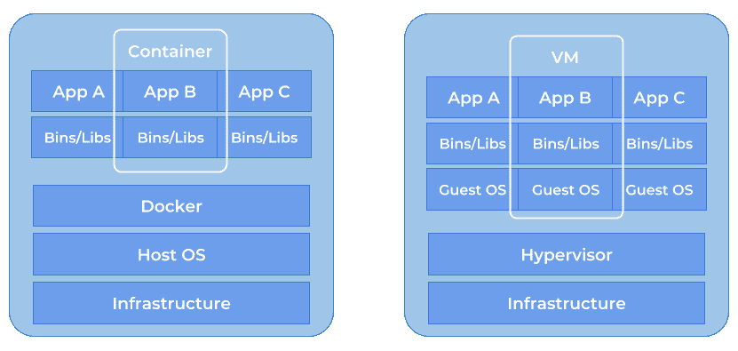

所有容器都部署在一个称为**Docker 主机**的物理或虚拟机上。Docker 主机反过来运行一个 Docker 守护进程，该守护进程通过 Docker API 监听 Docker 客户端发送的命令。Docker 客户端可能是命令行工具或其他软件，如 Kinematic。除了运行守护进程，Docker 主机还负责存储从这些镜像创建的缓存镜像和容器。每个镜像都是由一系列层构建的。每个层仅包含与父层相比的增量差异。这样的镜像不是很小，需要存储在其他地方。这个地方称为**Docker 仓库**。你可以创建自己的私有仓库，或者使用网络上的现有公共仓库。最受欢迎的仓库是 Docker Hub，其中包含几乎所有必需的镜像。

# 安装 Docker

Linux 下的 Docker 安装步骤因发行版而异([`docs.docker.com/install/#supported-platforms`](https://docs.docker.com/install/#supported-platforms))。然而，有时在安装后你不得不运行 Docker 守护进程，你可以通过调用以下命令来实现：

```java
dockerd --host=unix:///var/run/docker.sock --host=tcp://0.0.0.0:2375
```

在本节中，我们将重点关注 Windows 平台的指令。通常，当你在 Windows 或 Mac 上安装 Docker Community Edition (CE)时有两种可用的选项。最快最简单的方法是使用 Docker for Windows，你可以在[`www.docker.com/docker-windows`](https://www.docker.com/docker-windows)找到它。这是一个原生的 Windows 应用程序，为构建、部署和运行容器化应用程序提供了易于使用的开发环境。这绝对是利用最好的选择，因为它使用了 Windows 本地的 Hyper-V 虚拟化和网络。然而，有一个缺点——它仅适用于 Microsoft Windows 10 专业版或企业版 64 位。更早的 Windows 版本应该使用 Docker Toolbox，你可以在[`docs.docker.com/toolbox/toolbox_install_windows/`](https://docs.docker.com/toolbox/toolbox_install_windows/)下载到它。这包括 Docker 平台、带有 Docker Machine 的命令行、Docker Compose、Kitematic 和 VirtualBox。请注意，你不能在 Windows 上使用 Docker Toolbox 本地运行 Docker Engine，因为它使用了特定于 Linux 的内核功能。相反，你必须使用 Docker Machine 命令（`docker-machine`），它在本机上创建一个 Linux 虚拟机，并使用 Virtual Box 运行它。这个虚拟机可以通过默认的虚拟地址`192.168.99.100`被你的机器访问。所有之前讨论的示例都是与那个 IP 地址上可用的 Docker 工具集成的。

# 常用的 Docker 命令

在 Windows 上安装 Docker Toolbox 后，你应该运行 Docker 快速启动终端。它会完成所有需要做的事情，包括创建和启动 Docker Machine 以及提供命令行界面。如果你输入一个没有参数的 Docker 命令，你现在应该能够看到完整的可用 Docker 客户端命令列表及其描述。我们将要查看的就是这类命令：

+   运行和停止容器

+   列出并删除容器

+   拉取和推送镜像

+   构建镜像

+   网络配置

# 运行和停止容器

安装后通常运行的第一个 Docker 命令是`docker run`。正如您可能记得的，这个命令在前面的示例中是最常用的命令之一。这个命令做两件事：它从注册表中拉取和下载镜像定义，以防它没有在本地缓存，然后启动容器。对这个命令可以设置很多选项，您可以通过运行`docker run --help`来轻松查看这些选项。有些选项有一个字母的简写，这些通常是使用最频繁的选项。选项`–d`让容器在后台运行，而`–i`即使在未附加的情况下也保持`stdin`打开。如果您需要在容器外部暴露任何端口，您可以使用带有定义`<port_outside_container>:<port_inside_container>`的激活选项`–p`。一些镜像需要额外的配置，这通常通过环境变量完成，这些环境变量可以通过`–e`选项覆盖。为了轻松运行其他命令，设置容器的好友名称也很有用，使用`--name`选项。看看这里可见的示例 Docker 命令。它启动了带有 Postgres 的容器，创建了一个具有密码的数据库用户，并在端口`55432`上暴露它。现在，Postgres 数据库可以在地址`192.168.99.100:55432`上访问：

```java
$ docker run -d --name pg -e POSTGRES_PASSWORD=123456 -e POSTGRES_USER=piomin -e POSTGRES_DB=example -p 55432:5432 postgres
```

带有 Postgres 的容器持久化数据。建议通过卷机制来存储外部应用程序访问的数据的容器。可以通过`–v`选项将卷传递给容器，其中值由冒号分隔的字段组成，`:`。第一个字段是卷的名称，第二个字段是在容器中挂载文件或目录的路径。下一个有趣的选项是使用`–m`选项限制容器分配的最大 RAM 量。以下是为新卷创建并挂载到启动的容器的命令。最大 RAM 设置为 500 MB。容器在停止后自动删除，使用激活的选项`--rm`，如下所示：

```java
$ docker volume create pgdata
$ docker run --rm -it -e -m 500M -v pgdata:/var/lib/postgresql/data -p 55432:5432 postgres
```

每个运行中的容器都可以使用`docker stop`命令来停止。我们已经为我们的容器设置了一个名字，因此我们可以很容易地将其作为标签使用，如下所示：

```java
$ docker stop pg
```

容器的整个状态都会写入磁盘，因此我们可以用完全相同的数据再次运行它，例如：

```java
$ docker start pg
```

如果您只想重新启动容器，而不是停止/启动容器，您可以使用以下命令：

```java
$ docker restart  pg
```

# 列出和删除容器

如果你已经启动了一些容器，你可能想考虑显示你 Docker 机器上所有正在运行的容器列表。应该使用`docker ps`命令来实现。这个命令显示关于容器的一些基本信息，比如暴露的端口列表和源镜像的名称。这个命令只打印当前启动的容器。如果你想看到已停止或未活跃的容器，请在 Docker 命令中使用`-a`选项，如下所示：

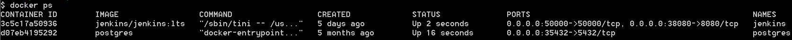

如果一个容器不再需要，可以使用`docker rm`命令将其删除。有时你可能需要删除一个正在运行的容器，但默认情况下这是不允许的。要强制这个选项，请在 Docker 上使用以下命令设置`-f`选项：

```java
$ docker rm -f pg
```

你应该记得`docker ps`命令只删除容器。它创建的镜像仍然在本地下缓存。这类镜像可能会占用相当大的空间，从兆字节到几百兆字节不等。你可以使用以下参数使用`docker rmi`命令删除每个镜像：

```java
$ docker rmi 875263695ab8
```

我们还没有创建任何 Docker 镜像，但在创建镜像过程中很容易产生大量不需要或未命名的镜像。这些镜像很容易识别，因为它们的名称是`<none>`。在 Docker 的术语中，这些被称为**悬空镜像**，可以通过以下命令轻松删除。当前缓存的所有镜像列表可以使用`docker images`命令显示，如下所示：

```java
$ docker rmi $(docker images -q -f dangling=true)
```

# 拉取和推送镜像

我们已经讨论过 Docker Hub。它是网络上最大的最受欢迎的 Docker 仓库。它位于[`hub.docker.com`](https://hub.docker.com)。Docker 客户端默认会尝试拉取该仓库的所有镜像。有许多经过认证的官方镜像，如 Redis、Java、Nginx 或 Mongo，但您也可以找到数十万人创建的镜像。如果您使用`docker run`命令，则镜像会在本地没有缓存的情况下从仓库拉取。您还可以运行以下`docker pull`命令，它只负责下载镜像：

```java
$ docker pull postgres
```

前一个命令下载了一个镜像的最新版本（具有最新标签的名称）。如果你想要使用一个较老版本的 Postgres Docker 镜像，你应该在标签后加上具体版本的数字。通常，可用的所有版本列表会发布在镜像的网站上，这个情况也不例外。访问[`hub.docker.com/r/library/postgres/tags/`](https://clicktime.symantec.com/a/1/Im1LdWl8NQ4ddISjfwL_OxcUojdkW-H3fP-oquj1vZs=?d=zKV7R9H5uhYC7J5kAN4WlSdYuV7w56mec0MwOxbVt-onFGmsM6Sx37HIaVHJUb3QiEeB2UoRmfzGJLL2nbKFa0anD4Lnn9-ximh393HGo36BjpeP0FoTIe_ikOi5QeJ1AeoMYVgQp_eESUZZNBRlDtcfYxSSkGpgZ_sGge1ts1DBD0AiZXddlCKygZL3ttJma9imoX-dIYGhyIi7l13N-8Y_5N5OYuthQeHXR4cE3e6ZicVVMyrnPGOm4nPLOHZiFzLZsTnDT0QQgFKRuqd4dsZekUaglgG9Y90wlN16gLc1DewmmCqRs_KiE1hwsBfCnFIku3QSPBvVa8e7YWJmMEGwuCxlybf2ywMx81HkC4uMHvQfq1EiVA0PYg5arA%3D%3D&u=https%3A%2F%2Fhub.docker.com%2Fr%2Flibrary%2Fpostgres%2Ftags%2F)获取可用标签的列表。

```java
$ docker pull postgres:9.3
```

一旦你运行并验证了你的镜像，你应该考虑将其远程保存。当然，最合适的地方是 Docker Hub。然而，有时你可能想将镜像存储在其他存储中，比如私有仓库。在推送镜像之前，你必须使用你的注册表用户名、镜像名称和其版本号来标记它。以下命令从 Postgres 源镜像创建了一个名为`piomin/postgres`和`1.0`版本标签的新镜像：

```java
$ docker tag postgres piomin/postgres:1.0
```

现在，如果你运行`docker images`命令，你会发现有两个具有相同 ID 的镜像。第一个镜像的名称是 Postgres，并且是最新的标签，而第二个镜像的名称是`piomin/postgres`，标签是`1.0`。重要的是`piomin`是我的 Docker Hub 用户名。因此，在进一步操作之前，我们首先应该在那里注册这个镜像。之后，我们还应该使用`docker login`命令登录到我们的 Docker 客户端。在这里，系统会提示你输入用户名、密码和用于注册的电子邮件地址。最后，你可以使用以下`docker push`命令推送一个带标签的镜像：

```java
$ docker push piomin/postgres:1.0
```

现在剩下的所有事情就是使用网络浏览器登录到你的 Docker Hub 账户，以检查推送到那里的镜像是否出现。如果一切工作正常，你将在网站上看到一个新的公开仓库和你的镜像。下面的屏幕截图显示了我 Docker Hub 账户中当前推送的镜像：

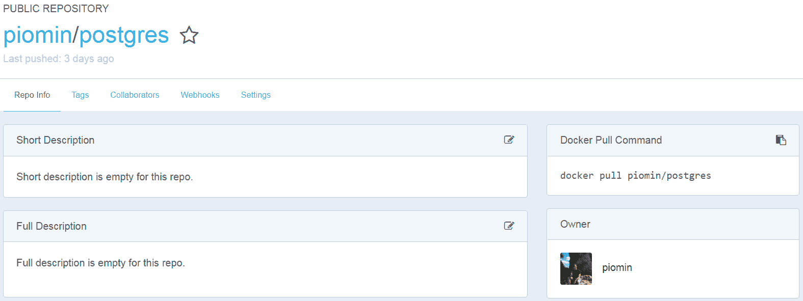

# 构建镜像

在上一节中，我们将 Postgres 的 Docker 镜像副本推送到 Docker Hub 仓库。通常，我们会将基于文件`Dockerfile`创建的自己的镜像推送到仓库，`Dockerfile`中定义了安装和配置软件所需的所有指令。关于`Dockerfile`结构的细节将在后面讨论。现在重要的是构建 Docker 镜像时使用的命令，即`docker build`。这个命令应该在`Dockerfile`所在的同一个目录中运行。构建新镜像时，建议使用`-t`选项为其设置名称和标签。以下命令创建了名为`piomin/order-service`的镜像，版本标记为`1.0`。您可以像之前推送 Postgres 镜像一样，将此镜像推送到您的 Docker Hub 账户中，如下所示：

```java
$ docker build -t piomin/order-service:1.0 .
```

# 网络配置

网络配置是 Docker 架构的一个重要方面，因为我们必须经常在不同容器上运行的应用程序之间提供通信。一个常见的用例可能是一个需要访问数据库的 web 应用程序。现在我们将参考在第十一章中已经介绍过的另一个例子，即*消息驱动的微服务*。这是 Apache Kafka 与 ZooKeeper 之间的通信。Kafka 需要 ZooKeeper，因为它将各种配置作为键/值对存储在 ZK 数据树中，并在整个集群中使用它。正如您可能记得的，我们首先必须创建一个自定义网络并在那里运行这两个容器。以下命令用于在 Docker 主机上创建一个用户定义的网络：

```java
$ docker network create kafka-network
```

在上一个命令运行完成后，您可以使用以下命令查看可用的网络列表。默认情况下，Docker 为您创建了三个网络，所以您应该看到四个网络，名称分别为 bridge、host、none 和`kafka-network`：

```java
$ docker network ls
```

下一步是向使用`docker run`命令创建的容器传递网络名称。这可以通过`--network`参数实现，正如您在以下示例中看到的那样。如果您为两个不同的容器设置相同的网络名称，它们将在同一个网络中启动。让我们实际分析一下这意味着什么。如果您在一个容器内，可以用它的名字而不是 IP 地址来调用它，这就是为什么在启动带有 Apache Kafka 的容器时，我们可以将环境变量`ZOOKEEPER_IP`设置为 ZooKeeper 的原因。Kafka 在这个容器内启动，如下所示连接到默认端口的 ZooKeeper 实例：

```java
$ docker run -d --name zookeeper --network kafka-net zookeeper:3.4
$ docker run -d --name kafka --network kafka-net -e ZOOKEEPER_IP=zookeeper ches/kafka
```

# 创建带有微服务的 Docker 镜像

我们已经讨论了可用于运行、创建和管理容器的基本 Docker 命令。现在是我们创建和构建第一个 Docker 镜像的时候了，这个镜像启动了我们在上一章中介绍的示例微服务。为此，我们应该回到地址[`github.com/piomin/sample-spring-cloud-comm.git`](https://github.com/piomin/sample-spring-cloud-comm.git)可用的仓库，然后切换到`feign_with_discovery`分支上[`github.com/piomin/sample-spring-cloud-comm/tree/feign_with_discovery`](https://github.com/piomin/sample-spring-cloud-comm/tree/feign_with_discovery)。在那里，你可以找到每个微服务、网关和发现模块的`Dockerfile`。然而，在讨论这些示例之前，我们应该参考`Dockerfile`参考资料，以了解我们可以在其中放置的基本命令。实际上，`Dockerfile`不是构建 Docker 镜像的唯一方法；我们还将向您展示如何使用 Maven 插件创建包含微服务的镜像。

# Dockerfiles

Docker 可以通过读取`Dockerfile`中提供的指令来自动构建镜像，这是一个包含所有在命令行中调用以组装镜像的命令的文档。`Dockerfile`中的所有命令都必须由`Dockerfile`规范中定义的关键字前缀。以下是最常用的指令列表。它们按照在`Dockerfile`中找到的顺序执行。在这里，我们还可以添加一些以`#`字符开头的注释：

| **指令** | **描述** |
| --- | --- |
| `FROM` | 这初始化一个新的构建阶段并设置后续指令的基础镜像。实际上，每个有效的`Dockerfile`都必须以`FROM`指令开始。 |
| `MAINTAINER` | 这设置了生成镜像的作者身份。这个指令已经过时，所以你可能会在许多旧镜像中找到它。我们应该使用`LABEL`指令代替`MAINTAINER`，如下所示：`LABEL maintainer="piotr.minkowski@gmail.com"`。 |
| `RUN` | 这执行 Linux 命令，用于在新的层上配置和安装当前镜像所需的应用程序，然后提交结果。它可以有两种形式:`RUN <命令>`或`RUN ["可执行文件", "参数 1", "参数 2"]`。 |
| `ENTRYPOINT` | 这配置了一个最终脚本，用于引导作为可执行文件的容器。它覆盖了所有使用`CMD`指定的元素，并有两个形式:`ENTRYPOINT ["可执行文件", "参数 1", "参数 2"]`和`ENTRYPOINT`命令`参数 1 参数 2`。值得注意的是，`Dockerfile`中最后一个`ENTRYPOINT`指令才会生效。 |
| `CMD` | `Dockerfile`中只能包含一个`CMD`指令。这个指令通过 JSON 数组格式为`ENTRYPOINT`提供默认参数。 |
| `ENV` | 这为容器设置环境变量，以键/值形式。 |
| `COPY` | 这个指令会将给定源路径的新文件或目录复制到容器文件系统内的目标路径。它的格式如下：`COPY [--chown=<用户>:<组>] <源>... <目标>`。 |
| `ADD` | 这是`COPY`指令的一个替代选项。它比`COPY`指令多做了一些事情，例如，它允许`<src>`是一个 URL 地址。 |
| `WORKDIR` | 这个指令为`RUN`、`CMD`、`ENTRYPOINT`、`COPY`和`ADD`设置工作目录。 |
| `EXPOSE` | 这个指令负责告知 Docker 容器在运行时监听指定的网络端口。它实际上并不发布端口。端口的发布是通过`docker run`命令的`-p`选项来实现的。 |
| `VOLUME` | 这个指令创建了指定名称的挂载点。卷是 Docker 容器内持久化数据的首选机制。 |
| `USER` | 这个指令为运行镜像以及`RUN`、`CMD`和`ENTRYPOINT`指令设置用户名和可选的用户组。 |

让我们看看实际操作中它是如何工作的。我们应该为每个微服务定义一个`Dockerfile`，并将其放在其 Git 项目的根目录中。下面是为`account-service`创建的`Dockerfile`：

```java
FROM openjdk:8u151-jdk-slim-stretch
MAINTAINER Piotr Minkowski <piotr.minkowski@gmail.com>
ENV SPRING_PROFILES_ACTIVE zone1
ENV EUREKA_DEFAULT_ZONE http://localhost:8761/eureka/
ADD target/account-service-1.0-SNAPSHOT.jar app.jar
ENTRYPOINT ["java", "-Xmx160m", "-jar", "-Dspring.profiles.active=${SPRING_PROFILES_ACTIVE}", "-Deureka.client.serviceUrl.defaultZone=${EUREKA_DEFAULT_ZONE}", "/app.jar"]
EXPOSE 8091
```

前面的例子并不复杂。它只是将微服务生成的胖 JAR 文件添加到 Docker 容器中，并将`java -jar`命令作为`ENTRYPOINT`。即便如此，让我们逐一分析它。我们示例中的`Dockerfile`执行了以下指令：

+   该镜像扩展了一个现有的 OpenJDK 镜像，这是一个官方的、开源的 Java 平台标准版实现。OpenJDK 镜像有很多版本。可用的镜像变体之间的主要区别在于它们的大小。标记为`8u151-jdk-slim-stretch`的镜像提供了 JDK 8，并包括运行 Spring Boot 微服务所需的所有库。它也比这个版本的 Java（`8u151-jdk`）的基本镜像小得多。

+   在这里，我们定义了两个可以在运行时覆盖的环境变量，它们是通过`docker run`命令的`-e`选项来设置的。第一个是活动的 Spring 配置文件名，默认初始化为`zone1`值。第二个是发现服务器的地址，默认等于`[`localhost:8761/eureka/`](http://localhost:8761/eureka/)`。

+   胖 JAR 文件包含了所有必需的依赖项以及应用程序的二进制文件。因此，我们必须使用`ADD`指令将生成的 JAR 文件放入容器中。

+   我们将容器配置为执行 Java 应用程序。定义的`ENTRYPOINT`相当于在本地机器上运行以下命令：

```java
java -Xmx160m -jar –Dspring.profiles.active=zone1 -Deureka.client.serviceUrl.defaultZone=http://localhost:8761/eureka/ app.jar
```

+   我们使用`EXPOSE`指令告知 Docker 可能会暴露容器内部应用程序的 HTTP API，该 API 可通过端口`8091`访问。

# 运行容器化的微服务

假设我们已经为每个服务准备了一个有效的`Dockerfile`，下一步是在为每个服务构建 Docker 镜像之前，使用`mvn clean install`命令构建整个 Maven 项目。

构建 Docker 镜像时，你应该始终位于每个微服务源代码的`root`目录。在我们基于微服务的系统中，需要运行的第一个容器是一个发现服务器。其 Docker 镜像被命名为`piomin/discovery-service`。在运行 Docker 的`build`命令之前，请转到模块`discovery-service`。这个`Dockerfile`比其他微服务要简单一些，因为容器内部不需要设置环境变量，如下所示：

```java
FROM openjdk:8u151-jdk-slim-stretch
MAINTAINER Piotr Minkowski <piotr.minkowski@gmail.com>
ADD target/discovery-service-1.0-SNAPSHOT.jar app.jar
ENTRYPOINT ["java", "-Xmx144m", "-jar", "/app.jar"]
EXPOSE 8761
```

在这里只需要执行五个步骤，你可以在构建目标镜像时生成的日志中看到，在运行`docker build`命令之后。如果一切正常，你应该看到`Dockerfile`中定义的所有五个步骤的进度，以及以下告诉您镜像已成功构建和标记的最终消息：

```java
$ docker build -t piomin/discovery-service:1.0 .
Sending build context to Docker daemon 39.9MB
Step 1/5 : FROM openjdk:8u151-jdk-slim-stretch
8u151-jdk-slim-stretch: Pulling from library/openjdk
8176e34d5d92: Pull complete
2208661344b7: Pull complete
99f28966f0b2: Pull complete
e991b55a8065: Pull complete
aee568884a84: Pull complete
18b6b371c215: Pull complete
Digest: sha256:bd394fdc76e8aa73adba2a7547fcb6cde3281f70d6b3cae6fa62ef1fbde327e3
Status: Downloaded newer image for openjdk:8u151-jdk-slim-stretch
 ---> 52de5d98a41d
Step 2/5 : MAINTAINER Piotr Minkowski <piotr.minkowski@gmail.com>
 ---> Running in 78fc78cc21f0
 ---> 0eba7a369e43
Removing intermediate container 78fc78cc21f0
Step 3/5 : ADD target/discovery-service-1.0-SNAPSHOT.jar app.jar
 ---> 1c6a2e04c4dc
Removing intermediate container 98138425b5a0
Step 4/5 : ENTRYPOINT java -Xmx144m -jar /app.jar
 ---> Running in 7369ba693689
 ---> c246470366e4
Removing intermediate container 7369ba693689
Step 5/5 : EXPOSE 8761
 ---> Running in 74493ae54220
 ---> 06af6a3c2d41
Removing intermediate container 74493ae54220
Successfully built 06af6a3c2d41
Successfully tagged piomin/discovery-service:1.0
```

一旦我们成功构建了一个镜像，我们就应该运行它。我们建议创建一个网络，在该网络中启动所有我们的微服务容器。要在新创建的网络中启动容器，我们需要使用`--network`参数将容器名称传递给`docker run`命令。为了检查容器是否已成功启动，运行`docker logs`命令。此命令将应用程序打印到控制台的所有日志行输出到控制台，如下所示：

```java
$ docker network create sample-spring-cloud-network
$ docker run -d --name discovery -p 8761:8761 --network sample-spring-cloud-network piomin/discovery-service:1.0
de2fac673806e134faedee3c0addaa31f2bbadcffbdff42a53f8e4ee44ca0674
$ docker logs -f discovery
```

下一步是使用我们的四个微服务—`account-service`、`customer-service`、`order-service`和`product-service`—构建和运行容器。每个服务的步骤都相同。例如，如果你想构建`account-service`，首先需要进入示例项目源代码中的那个目录。这里的`build`命令与发现服务相同；唯一的区别在于镜像名称，如下所示片段：

```java
$ docker build -t piomin/account-service:1.0 .
```

对于`discovery-service`，运行 Docker 镜像的命令要稍微复杂一些。在这种情况下，我们必须将 Eureka 服务器的地址传递给启动容器。因为此容器与发现服务容器在同一网络中运行，我们可以使用其名称而不是其 IP 地址或其他任何标识符。可选地，我们还可以使用`-m`参数设置容器的内存限制，例如，设置为 256 MB。最后，我们可以使用以下方式使用`docker logs`命令查看容器上运行的应用程序生成的日志：

```java
$ docker run -d --name account -p 8091:8091 -e EUREKA_DEFAULT_ZONE=http://discovery:8761/eureka -m 256M --network sample-spring-cloud-network piomin/account-service:1.0
$ docker logs -f account
```

与之前描述的步骤相同，应对所有其他微服务重复这些步骤。最终结果是五个正在运行的容器，可以使用`docker ps`命令来显示，如下所示截图：

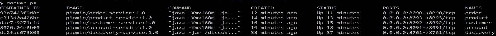

所有的微服务都注册在 Eureka 服务器上。Eureka 仪表板可在地址`http://192.168.99.100:8761/`找到，如下截图所示：

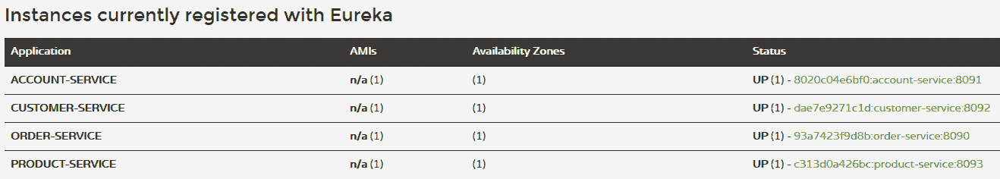

这里再提一个有趣的 Docker 命令：`docker stats`。这个命令打印了一些关于启动容器的统计信息，比如内存或 CPU 使用情况。如果你使用该命令的`--format`参数，你可以自定义它打印统计信息的方式；例如，你可以打印容器名称而不是它的 ID。在运行那个命令之前，你可能需要进行一些测试，以检查一切是否按预期工作。检查微服务之间的通信是否成功完成是很值得的。你可能还想尝试从`customer-service`调用端点`GET /withAccounts/{id}`，该端点由`account-service`暴露出来。我们运行以下命令：

```java
docker stats --format "table {{.Name}}\t{{.Container}}\t{{.CPUPerc}}\t{{.MemUsage}}" 
```

以下截图可见：

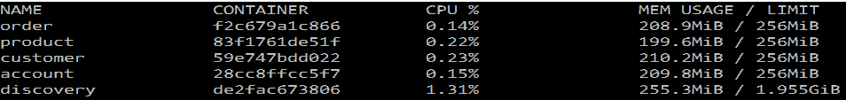

# 使用 Maven 插件构建镜像

如我们之前提到的，`Dockerfile`不是创建和构建容器的唯一方式。还有其他一些方法可用，例如，通过使用 Maven 插件。我们有多个用于构建镜像的插件，它们与`mvn`命令一起使用。其中比较流行的是`com.spotify:docker-maven-plugin`。这个插件在其配置中有与`Dockerfile`指令相当的标签。`account-service`的`pom.xml`中插件的配置如下：

```java
<plugin>
 <groupId>com.spotify</groupId>
 <artifactId>docker-maven-plugin</artifactId>
 <version>1.0.0</version>
 <configuration>
 <imageName>piomin/${project.artifactId}</imageName>
 <imageTags>${project.version}</imageTags>
 <baseImage>openjdk:8u151-jdk-slim-stretch</baseImage>
 <entryPoint>["java", "-Xmx160m", "-jar", "-Dspring.profiles.active=${SPRING_PROFILES_ACTIVE}", "-Deureka.client.serviceUrl.defaultZone=${EUREKA_DEFAULT_ZONE}", "/${project.build.finalName}.jar"] </entryPoint>
 <env>
  <SPRING_PROFILES_ACTIVE>zone1</SPRING_PROFILES_ACTIVE>
  <EUREKA_DEFAULT_ZONE>http://localhost:8761/eureka/</EUREKA_DEFAULT_ZONE>
 </env>
 <exposes>8091</exposes>
 <maintainer>piotr.minkowski@gmail.com</maintainer>
 <dockerHost>https://192.168.99.100:2376</dockerHost>
 <dockerCertPath>C:\Users\Piotr\.docker\machine\machines\default</dockerCertPath>
 <resources>
  <resource>
   <directory>${project.build.directory}</directory>
   <include>${project.build.finalName}.jar</include>
  </resource>
 </resources>
 </configuration>
</plugin>
```

这个插件可以在 Maven 的`build`命令期间被调用。如果你想在构建应用程序之后立即构建一个 Docker 镜像，可以使用以下的 Maven 命令：

```java
$ mvn clean install docker:build   
```

另外，你也可以设置`dockerDirectory`标签，以便基于`Dockerfile`进行构建。无论你选择哪种方法，效果都是一样的。任何用应用程序构建的新镜像都会在你的 Docker 机器上可用。在使用`docker-maven-plugin`时，你可以通过将`pushImage`设置为`true`来强制自动镜像推送到仓库，如下所示：

```java
<plugin>
 <groupId>com.spotify</groupId>
 <artifactId>docker-maven-plugin</artifactId>
 <version>1.0.0</version>
 <configuration>
  <imageName>piomin/${project.artifactId}</imageName>
  <imageTags>${project.version}</imageTags>
  <pushImage>true</pushImage>
  <dockerDirectory>src/main/docker</dockerDirectory>
  <dockerHost>https://192.168.99.100:2376</dockerHost>
  <dockerCertPath>C:\Users\Piotr\.docker\machine\machines\default</dockerCertPath>
  <resources>
   <resource>
    <directory>${project.build.directory}</directory>
    <include>${project.build.finalName}.jar</include>
   </resource>
  </resources>
 </configuration>
</plugin>
```

# 高级 Docker 镜像

到目前为止，我们已经构建了一些相当简单的 Docker 镜像。然而，有时需要创建一个更高级的镜像。我们将需要这样一个镜像来进行持续交付演示。这个 Docker 镜像将作为 Jenkins 奴隶运行，并连接到作为 Docker 容器启动的 Jenkins 主节点。我们在 Docker Hub 上没有找到这样的镜像，所以我们自己创建了一个。在这里，镜像必须包含 Git、Maven、JDK8 和 Docker。这些都是构建我们的示例微服务的 Jenkins 奴隶所需的全部工具。我将在本章的后面部分给你一个关于使用 Jenkins 服务器进行持续交付的基本概述。现在，我们将重点关注 just building the required image。以下是`Dockerfile`中提供的镜像的完整定义：

```java
FROM docker:18-dind
MAINTAINER Piotr Minkowski <piotr.minkowski@gmail.com>
ENV JENKINS_MASTER http://localhost:8080
ENV JENKINS_SLAVE_NAME dind-node
ENV JENKINS_SLAVE_SECRET ""
ENV JENKINS_HOME /home/jenkins
ENV JENKINS_REMOTING_VERSION 3.17
ENV DOCKER_HOST tcp://0.0.0.0:2375

RUN apk --update add curl tar git bash openjdk8 sudo

ARG MAVEN_VERSION=3.5.2
ARG USER_HOME_DIR="/root"
ARG SHA=707b1f6e390a65bde4af4cdaf2a24d45fc19a6ded00fff02e91626e3e42ceaff
ARG BASE_URL=https://apache.osuosl.org/maven/maven-3/${MAVEN_VERSION}/binaries
RUN mkdir -p /usr/share/maven /usr/share/maven/ref \
 && curl -fsSL -o /tmp/apache-maven.tar.gz ${BASE_URL}/apache-maven-${MAVEN_VERSION}-bin.tar.gz \
 && echo "${SHA} /tmp/apache-maven.tar.gz" | sha256sum -c - \
 && tar -xzf /tmp/apache-maven.tar.gz -C /usr/share/maven --strip-components=1 \
 && rm -f /tmp/apache-maven.tar.gz \
 && ln -s /usr/share/maven/bin/mvn /usr/bin/mvn
ENV MAVEN_HOME /usr/share/maven
ENV MAVEN_CONFIG "$USER_HOME_DIR/.m2"

RUN adduser -D -h $JENKINS_HOME -s /bin/sh jenkins jenkins && chmod a+rwx $JENKINS_HOME
RUN echo "jenkins ALL=(ALL) NOPASSWD: /usr/local/bin/dockerd" > /etc/sudoers.d/00jenkins && chmod 440 /etc/sudoers.d/00jenkins
RUN echo "jenkins ALL=(ALL) NOPASSWD: /usr/local/bin/docker" > /etc/sudoers.d/01jenkins && chmod 440 /etc/sudoers.d/01jenkins
RUN curl --create-dirs -sSLo /usr/share/jenkins/slave.jar http://repo.jenkins-ci.org/public/org/jenkins-ci/main/remoting/$JENKINS_REMOTING_VERSION/remoting-$JENKINS_REMOTING_VERSION.jar && chmod 755 /usr/share/jenkins && chmod 644 /usr/share/jenkins/slave.jar

COPY entrypoint.sh /usr/local/bin/entrypoint
VOLUME $JENKINS_HOME
WORKDIR $JENKINS_HOME
USER jenkins
ENTRYPOINT ["/usr/local/bin/entrypoint"]
```

让我们分析一下发生了什么。在这里，我们扩展了 Docker 基础镜像。这是一个相当智能的解决方案，因为现在这个镜像提供了 Docker 内的 Docker。尽管通常不建议在 Docker 内运行 Docker，但有一些期望的使用案例，比如使用 Docker 的持续交付。除了 Docker 之外，还使用`RUN`指令在镜像上安装了其他软件，如 Git、JDK、Maven 或 Curl。我们还添加了一个 OS 用户，在`dockerd`脚本中有`sudoers`权限，负责在机器上运行 Docker 守护进程。这不是在运行容器中必须启动的唯一进程；启动 JAR 与 Jenkins 奴隶也是必须的。这两个命令在`entrypoint.sh`中执行，作为镜像的`ENTRYPOINT`。这个 Docker 镜像的完整源代码可以在 GitHub 上找到，地址为[`github.com/piomin/jenkins-slave-dind-jnlp.git`](https://github.com/piomin/jenkins-slave-dind-jnlp.git)。你可以省略从源代码构建它，只需使用以下命令从我的 Docker Hub 账户下载一个现成的镜像：

```java
docker pull piomin/jenkins-slave-dind-jnlp
```

这里是在 Docker 镜像中的`entrypoint.sh`脚本，它启动了 Docker 守护进程和 Jenkins 奴隶：

```java
#!/bin/sh
set -e
echo "starting dockerd..."
sudo dockerd --host=unix:///var/run/docker.sock --host=tcp://0.0.0.0:2375 --storage-driver=vfs &
echo "starting jnlp slave..."
exec java -jar /usr/share/jenkins/slave.jar \
 -jnlpUrl $JENKINS_URL/computer/$JENKINS_SLAVE_NAME/slave-agent.jnlp \
 -secret $JENKINS_SLAVE_SECRET
```

# 持续交付

迁移到基于微服务的架构的关键好处之一就是能够快速交付软件。这应该是你在组织中实施持续交付或持续部署流程的主要动机。简而言之，持续交付流程是一种尝试自动化软件交付的所有阶段的方法，比如构建、测试代码和发布应用程序。有许多工具可以赋能这个过程。其中之一就是 Jenkins，这是一个用 Java 编写的开源自动化服务器。Docker 能够将你的**持续集成**（**CI**）或**持续交付**（**CD**）流程提升到一个新的水平。例如，不可变交付是 Docker 最重要的优势之一。

# 将 Jenkins 与 Docker 集成

这里的主要目标是使用 Jenkins 和 Docker 在本地设计和运行持续交付过程。这个过程涉及到四个元素。其中第一个元素已经准备好了：我们的微服务源代码仓库，它位于 GitHub 上。第二个元素，Jenkins，需要运行和配置。Jenkins 是我们持续交付系统的一个关键元素。它必须从 GitHub 仓库下载应用程序的源代码，构建它，然后将生成的 JAR 文件放入 Docker 镜像中，将该镜像推送到 Docker Hub，最后运行带有微服务的容器。这个过程中所有的任务都是直接在 Jenkins 主节点上执行的，但是是在其从节点上。Jenkins 及其从节点都是作为 Docker 容器启动的。这个解决方案的架构如下所示：

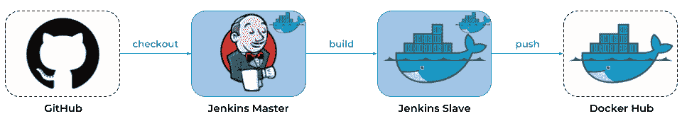

值得一提的是，Jenkins 是基于插件概念构建的。核心是一个过于简单的自动化构建引擎。Jenkins 的真正力量在于其插件，并且在更新中心有数百个插件。现在，我们将只讨论一些感谢 Jenkins 服务器为我们提供的机会。我们需要安装以下插件才能在 Docker 容器中构建和运行我们的微服务：

+   **流水线**：这是一套插件，可以让您使用 Groovy 脚本创建自动化，遵循**流水线即代码**的理念 ([`wiki.jenkins.io/display/JENKINS/Pipeline+Plugin`](https://clicktime.symantec.com/a/1/4g9YbrLxE43FYJrIE5v0J-RjoqlfXZm5h2piohXV60o=?d=GiSMteljxw-3ox0rf3cMazK9IOHzeSrn0vm9sus4y_n0hehkoAHvPijqT9dNXanC2Z3KtWbAm0BF-YDyp2HFvxXpFa6IkS_tvoddqdWrcb2R6vx-7YEpFHbt4IzErozigZnPecmyLha58i_mX_GOqw8nGcIkFmptcNTdFqB6DA-shedWhYxMv5VpzsTWPmDZA52S7fjMHuYvrTP5MOqqgejXYWvZr4d9OaWe0jeXJ-MEIccIx-UiD_tYy9OK2eYpd4eiaegTQb9XhbUR0ZNPGlpo4vSShb3yAI2Kf9JPcQ4hOSXoj5JpZSvnKhm1C9Yn68IsYCIBmwjYZZYyuS3y9uUI9zHbgSpVOx8ehvCmMWx0MAwCJ5gDR1ZIXXNcnw%3D%3D&u=https%3A%2F%2Fwiki.jenkins.io%2Fdisplay%2FJENKINS%2FPipeline%2BPlugin))

+   **Docker 流水线**：这允许您在流水线中构建 Docker 容器 ([`wiki.jenkins.io/display/JENKINS/Docker+Pipeline+Plugin`](https://clicktime.symantec.com/a/1/3BcsCubSP1UZ0ssSZFCe2iSCQQ_b1asMBhlt_0nQFKI=?d=GiSMteljxw-3ox0rf3cMazK9IOHzeSrn0vm9sus4y_n0hehkoAHvPijqT9dNXanC2Z3KtWbAm0BF-YDyp2HFvxXpFa6IkS_tvoddqdWrcb2R6vx-7YEpFHbt4IzErozigZnPecmyLha58i_mX_GOqw8nGcIkFmptcNTdFqB6DA-shedWhYxMv5VpzsTWPmDZA52S7fjMHuYvrTP5MOqqgejXY

+   -   **Git**: 该插件将 Git 与 Jenkins 集成([https://wiki.jenkins.io/display/JENKINS/Git+Plugin](https://clicktime.symantec.com/a/1/Zbv8hM_2L26s_PMbntThO-9W_A4uUxsqo7UyU5nbae8=?d=GiSMteljxw-3ox0rf3cMazK9IOHzeSrn0vm9sus4y_n0hehkoAHvPijqT9dNXanC2Z3KtWbAm0BF-YDyp2HFvxXpFa6IkS_tvoddqdWrcb2R6vx-7YEpFHbt4IzErozigZnPecmyLha58i_mX_GOqw8nGcIkFmptcNTdFqB6DA-shedWhYxMv5VpzsTWPmDZA52S7fjMHuYvrTP5MOqqgejXYWvZr4d9OaWe0jeXJ-MEIccIx-UiD_tYy9OK2eYpd4eiaegTQb9XhbUR0ZNPGlpo4vSShb3yAI2Kf9JPcQ4hOSXoj5JpZSvnKhm1C9Yn68IsYCIBmwjYZZYyuS3y9uUI9zHbgSpVOx8ehvCmMWx0MAwCJ5gDR1ZIXXNcnw%3D%3D&u=https%3A%2F%2Fwiki.jenkins.io%2Fdisplay%2FJENKINS%2FGit%2BPlugin))

+   -   **Maven 集成**: 当使用 Maven 和 Jenkins 构建应用程序时，该插件提供了一些有用的命令([`plugins.jenkins.io/maven-plugin`](https://clicktime.symantec.com/a/1/jmIwLdZZ-wtodkRm1Goje_nuKFV98VcZYPHn5cWj1KM=?d=GiSMteljxw-3ox0rf3cMazK9IOHzeSrn0vm9sus4y_n0hehkoAHvPijqT9dNXanC2Z3KtWbAm0BF-YDyp2HFvxXpFa6IkS_tvoddqdWrcb2R6vx-7YEpFHbt4IzErozigZnP

-   所需插件可以通过 UI 仪表盘进行配置，可以在启动后或通过管理 Jenkins *|* 管理插件进行配置。为了在本地运行 Jenkins，我们将使用其 Docker 镜像。下面的命令将创建一个名为`jenkins`的网络，并启动 Jenkins 主容器，在端口`38080`上暴露 UI 仪表盘。注意，当你启动 Jenkins 容器并首次使用其 Web 控制台时，需要使用生成的初始密码进行设置。你可以通过调用`docker logs jenkins`命令轻松地从 Jenkins 日志中获取此密码，如下所示：

```java
$ docker network create jenkins
$ docker run -d --name jenkins -p 38080:8080 -p 50000:50000 --network jenkins jenkins/jenkins:lts
```

-   一旦我们成功配置了 Jenkins 主节点及其所需插件，我们需要添加新的奴隶节点。为此，你应该前往管理 Jenkins *|* 管理节点部分，然后选择新建节点。在显示的表单中，你必须将`/home/jenkins`设置为远程根目录，并通过 Java Web Start 将启动代理作为启动方法。现在你可以按照之前讨论的启动带有 Jenkins 奴隶的 Docker 容器。请注意，你必须覆盖两个环境变量，指示奴隶的名称和密钥。`name`参数在节点创建时设置，而密钥由服务器自动生成。你可以查看节点的详细信息页面以获取更多信息，如下所示的屏幕截图：

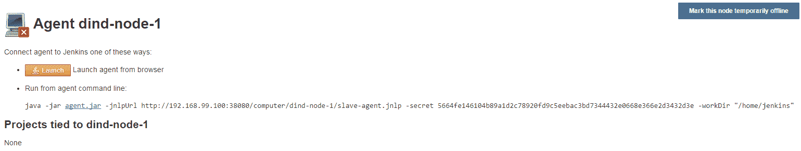

-   以下是在 Docker 中使用 Docker 的 Jenkins 奴隶容器启动的 Docker 命令：

```java
$ docker run --privileged -d --name slave --network jenkins -e JENKINS_SLAVE_SECRET=5664fe146104b89a1d2c78920fd9c5eebac3bd7344432e0668e366e2d3432d3e -e JENKINS_SLAVE_NAME=dind-node-1 -e JENKINS_URL=http://jenkins:38080 piomin/jenkins-slave-dind-jnlp
```

这篇关于 Jenkins 配置的简短介绍应该可以帮助你在自己的机器上重复讨论的持续交付过程。记住，我们只查看了与 Jenkins 相关的几个方面，包括设置，这允许你为你的微服务基础系统设置 CI 或 CD 环境。如果你对深入研究这个话题感兴趣，你应该参考可用的文档，具体请访问 [`jenkins.io/doc`](https://jenkins.io/doc)。

# 构建流水线

在 Jenkins 服务器的旧版本中，工作单位是作业。目前，其主要特性是能够将流水线定义为代码。这种变化与 IT 架构中更现代的趋势有关，该趋势认为应用程序交付与正在交付的应用程序一样重要。由于应用程序堆栈的所有组件已经自动化，并以代码的形式在版本控制系统中表示，因此可以利用同样的好处来定义 CI 或 CD 流水线。

Jenkins Pipeline 提供了一套用于将简单和更高级的交付流水线建模为代码的工具。这样的流水线的定义通常写入一个名为 `Jenkinsfile` 的文本文件中。它支持通过 *共享库* 功能提供的特定步骤的领域特定语言。流水线支持两种语法：声明式（在 Pipeline 2.5 中引入）和脚本化流水线。无论使用哪种语法，它都会逻辑上分为阶段和步骤。步骤是流水线的最基本部分，因为它们告诉 Jenkins 需要做什么。阶段逻辑上分组了几个步骤，然后在流水线的结果屏幕上显示。下面的代码是一个脚本化流水线的示例，为 `account-service` 定义了一个构建过程。对于其他微服务也需要创建类似的定义。所有这些定义都位于每个应用程序源代码的 `root` 目录中的 `Jenkinsfile`：

```java
node('dind-node-1') {
 withMaven(maven:'M3') {
  stage('Checkout') {
   git url: 'https://github.com/piomin/sample-spring-cloud-comm.git', credentialsId: 'github-piomin',   branch: 'master'
  }

  stage('Build') {
   dir('account-service') {
    sh 'mvn clean install'
   }
   def pom = readMavenPom file:'pom.xml'
   print pom.version
   env.version = pom.version
   currentBuild.description = "Release: ${env.version}"
  }

  stage('Image') {
   dir ('account-service') {
    def app = docker.build "piomin/account-service:${env.version}"
    app.push()
   }
  }

  stage ('Run') {
   docker.image("piomin/account-service:${env.version}").run('-p 8091:8091 -d --name account --network sample-spring-cloud-network')
  }

 }
}
```

之前的定义被分为四个阶段。在第一个阶段，`Checkout`，我们克隆包含所有示例应用程序源代码的 Git 仓库。在第二个阶段，`Build`，我们从 `account-service` 模块构建一个应用程序，然后从 `root` 的 `pom.xml` 中读取整个 Maven 项目的版本号。在 `Image` 阶段，我们从 `Dockerfile` 构建一个镜像，并将其推送到 Docker 仓库。最后，在 `Run` 阶段我们在 `dind-node-1` 上运行一个包含 `account-service` 应用程序的容器。所有描述的阶段都按照节点元素的定义在 `dind-node-1` 上执行，节点元素是流水线定义中所有其他元素的根。

现在我们可以继续在 Jenkins 的网页控制台中定义流水线。选择新建项目，然后检查管道项目类型并输入其名称。确认后，你应该会被重定向到管道的配置页面。在那里你唯一需要做的是提供 Git 仓库中`Jenkinsfile`的位置，然后按照下面的屏幕截图设置 SCM 认证凭据：

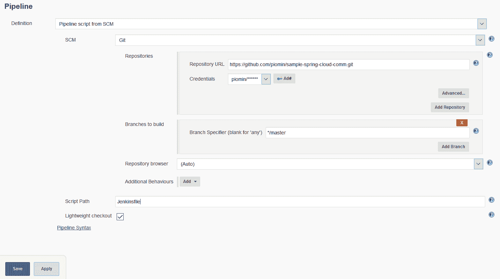

保存更改后，管道的配置就准备好了。为了启动构建，点击“立即构建”按钮。在这个阶段，有两件事需要澄清。在生产模式下，你可以使用由最流行的 Git 托管提供商（包括 GitHub、BitBucket 和 GitLab）提供的`webhook`机制。这个机制可以在将更改推送到仓库后自动触发 Jenkins 中的构建。为了演示这个，我们本应运行一个本地的版本控制系统，例如使用 GitLab 和 Docker。还有一种更简单的测试方法。容器化的应用程序直接在 Jenkins 的 Docker in Docker 奴隶上运行；在正常情况下，我们会在专门用于应用程序部署的分离远程机器上启动。下面的屏幕截图是 Jenkins 的网页控制台，展示了`product-service`的构建过程，分为不同的阶段：

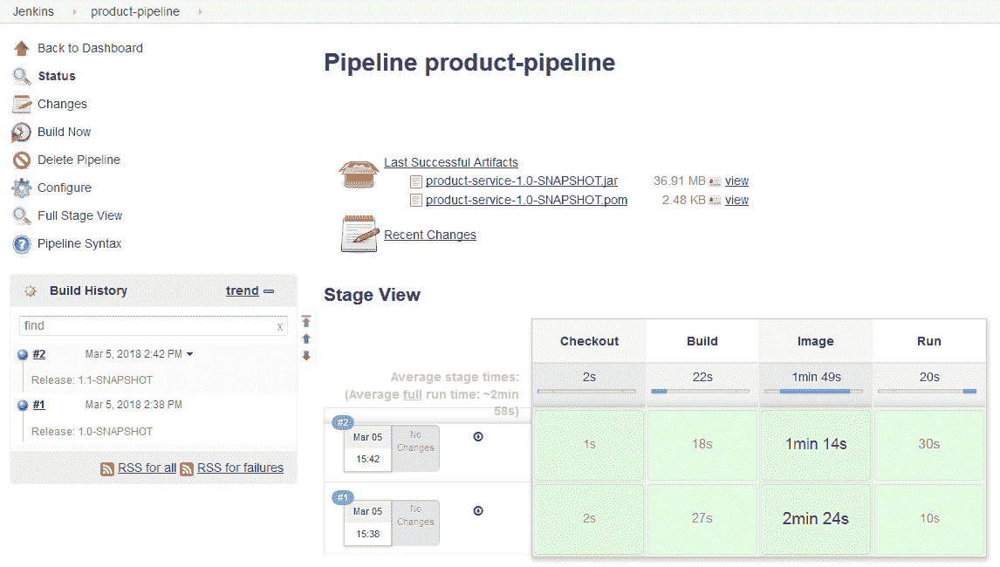

我们应该现在为每个微服务创建一个管道。创建的所有管道的列表如下：

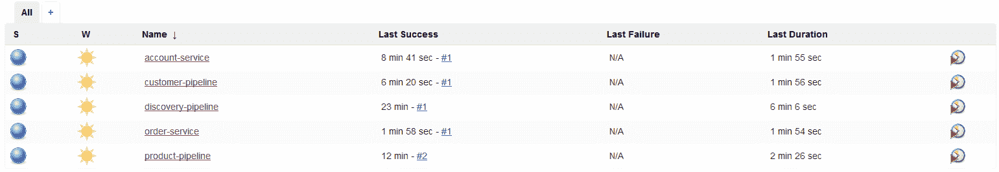

# 与 Kubernetes 一起工作

我们已经在我们本地的 Docker 容器上启动了我们的示例微服务。我们甚至使用了 CI 和 CD 自动化管道，以便在本地机器上运行它们。然而，你可能有一个重要的问题。我们如何在大规模和生产模式下组织我们的环境，在那里我们必须在多台机器上运行多个容器呢？好吧，这正是我们在根据云原生开发的观念实现微服务时必须做的。然而，在这个实例中，仍然存在许多挑战。假设我们在多个实例中启动了许多微服务，将有很多容器需要管理。在正确的时间启动正确的容器，处理存储考虑，进行扩展或缩放，以及手动处理故障将是一场噩梦。幸运的是，有一些平台可以帮助在大规模上进行 Docker 容器的集群和编排。目前，在这个领域的领导者是 Kubernetes。

Kubernetes 是一个用于管理容器化工作负载和服务的开源平台。它可以作为容器平台，微服务平台，云平台，还有更多。它自动化了在不同机器上运行容器、扩展、缩减、在容器之间分配负载，以及在应用程序的多个实例之间保持存储一致性等操作。它还有许多其他功能，包括服务发现、负载均衡、配置管理、服务命名和滚动更新。然而，这些功能并非都对我们有用，因为许多类似的功能由 Spring Cloud 提供。

值得一提的是，Kubernetes 并不是市面上唯一的容器管理工具。还有 Docker Swarm，这是 Docker 自带的本地工具。然而，由于 Docker 已经宣布对 Kubernetes 提供原生支持，似乎这是一个自然的选择。在深入实践之前，我们应该了解几个关于 Kubernetes 的重要概念和组件。

# 概念和组件

使用 Kubernetes 时，您可能首先要处理的第一个术语是 pod，这是 Kubernetes 中的基本构建块。pod 表示集群中的运行进程。它可以由一个或多个容器组成，这些容器保证在主机机器上共同定位，并将共享相同的资源。每个 pod 中只有一个容器是最常见的 Kubernetes 用例。每个 pod 在集群中都有一个唯一的 IP 地址，但部署在同一 pod 中的所有容器可以通过 `localhost` 与彼此通信。

另一个常见的组件是服务。服务逻辑上组了一组 pod，并定义了对其访问的策略；有时它被称为微服务。默认情况下，服务是在集群内部暴露的，但它也可以暴露在外的 IP 地址上。我们可以使用四种可用行为之一来暴露服务：`ClusterIP`、`NodePort`、`LoadBalancer` 和 `ExternalName`。默认选项是 `ClusterIP`。这将在集群内部 IP 上暴露服务，使其仅可在集群内部访问。`NodePort` 将在每个节点的 IP 上以静态端口暴露服务，并自动创建 `ClusterIP` 以在集群内部暴露服务。反过来，`LoadBalancer` 使用云提供商的负载均衡器在外部暴露服务，而 `ExternalName` 将服务映射到 `externalName` 字段的内容。我们还应该花点时间讨论 Kubernetes 的复制控制器。此控制器通过在集群中运行指定数量的 pod 副本来处理复制和扩展。如果底层节点失败，它还负责替换 pod。Kubernetes 中的每个控制器都是由 `kube-controller-manager` 运行的独立进程。你还可以在 Kubernetes 中找到节点控制器、端点控制器以及服务账号和令牌控制器。

Kubernetes 使用一个 `etcd` 键/值存储作为所有集群数据的后端存储。在集群中的每个节点都有一个名为 **kubelet** 的代理，它负责确保容器在 pod 中运行。用户发送给 Kubernetes 的每个命令都由 `kubeapi-server` 暴露的 Kubernetes API 处理。

当然，这是对 Kubernetes 架构的一个非常简化的解释。为了成功运行高可用的 Kubernetes 集群，还有更多组件和工具需要正确配置。执行此任务并非易事，它需要对这个平台有大量的了解。幸运的是，有一个工具可以使在本地运行 Kubernetes 集群变得容易——Minikube。

# 通过 Minikube 在本地运行 Kubernetes

Minikube 是一个使在本地运行 Kubernetes 变得简单的工具。它在一个本地机器上的 VM 中运行一个单节点 Kubernetes 集群。在开发模式下，它绝对是最佳选择。当然，Minikube 不支持 Kubernetes 提供的所有功能；只包括最重要的功能，包括 DNS、NodePorts、Config Map、Dashboard 和 Ingress。

要在 Windows 上运行 Minikube，我们需要安装一个虚拟化工具。然而，如果您已经运行了 Docker，您可能已经安装了 Oracle VM VirtualBox。在这种情况下，您只需要下载并安装 Minikube 的最新版本，您可以查看 [`github.com/kubernetes/minikube/releases`](https://clicktime.symantec.com/a/1/eXr_fIrvCIRYzEHt0YvbtkptTqcVd9nJzBV28fxoaTY=?d=7tChM-hIl54SsiVoHKrovXbmLIi8ouu38bfWFa5LjYebKneJvW_c2_HMgDdoq431rSiEnNRRoWc7WI40qLP-zxO_svn7BtB5YkP7_3z6XE1bc9UDw_gg4B_LUQLmxfklfTjgbs0J-dnBHLc3GOsVYjvBMyOE-nmJR1SuKthIzdMfxP8oasaAGIamKBmwy-pKxDOZYKGzKE4iEAO1nFo15LHQ7enPYrMhvcEhb3LDIMsYYwnwVTe52q36t77MaAeAFdq7DgkU1BLlVMydfq9vglCYhLnhnOOzSDesZnjGR3spuBjVhNyCD3pcc73yC-ARPXPUpScKDxqUYA8pZg40QrbDOyzuC95KNm-9vIqcPXR6iDgu8QK_SscvFxnDi4A%3D&u=https%3A%2F%2Fgithub.com%2Fkubernetes%2Fminikube%2Freleases) ，并 `kubectl.exe` ，如 [`storage.googleapis.com/kubernetes-release/release/stable.txt`](https://storage.googleapis.com/kubernetes-release/release/stable.txt) 描述。文件 `minikube.exe` 和 `kubectl.exe` 应该包括在 `PATH` 环境变量中。此外，Minikube 提供自己的安装程序 `minikube-installer.exe` ，它将自动将 `minikube.exe` 添加到您的路径中。然后，您可以从命令行通过运行以下命令启动 Minikube：

```java
$ minikube start
```

前一个命令初始化了一个名为`minikube`的`kubectl`上下文。它包含了允许你与 Minikube 集群通信的配置。现在你可以使用`kubectl`命令来维护由 Minikube 创建的本地集群，并在其中部署容器。命令行界面的替代方案是 Kubernetes 仪表板。通过调用`minikube` dashboard，可以为你的节点启用 Kubernetes 仪表板。您可以使用这个仪表板创建、更新或删除部署，以及列出和查看所有 pods、服务、ingress 和复制控制器的配置。通过以下命令可以轻松停止和删除本地集群：

```java
$ minikube stop
$ minikube delete
```

# 部署应用程序

Kubernetes 集群上存在的每个配置都由 Kubernetes 对象表示。这些对象可以通过 Kubernetes API 进行管理，并且应该以 YAML 格式表达。你可能会直接使用那个 API，但可能会决定利用`kubectl`命令行界面为你做所有必要的调用。在 Kubernetes 上新建对象的描述必须提供描述其期望状态的规格，以及关于对象的一些基本信息。以下是在 YAML 配置文件中应始终设置的一些必需字段：

+   `apiVersion`：这指示了用于创建对象的 Kubernetes API 的版本。API 在请求中总是需要 JSON 格式，但`kubectl`会自动将 YAML 输入转换为 JSON。

+   `kind`：这设置了要创建的对象的种类。有一些预定义的类型可供选择，例如 Deployment、Service、Ingress 或 ConfigMap。

+   `metadata`：这允许你通过名称、UID 或可选的命名空间来标识对象。

+   `spec`：这是对象的正确定义。规格的精确格式取决于对象的类型，并包含特定于该对象的嵌套字段。

通常，在 Kubernetes 上创建新对象时，其`kind`是部署。在下面的`Deployment` YAML 文件中，有两个重要的字段被设置。首先是`replicas`，它指定了期望的 pods 数量。实际上，这意味着我们将运行容器化应用程序的两个实例。第二个是`spec.template.spec.containers.image`，它设置了将在 pods 内部启动的 Docker 镜像的名称和版本。容器将在端口`8090`上暴露，`order-service`在此端口监听 HTTP 连接：

```java
apiVersion: apps/v1
kind: Deployment
metadata:
  name: order-service
spec:
  replicas: 2
  selector:
    matchLabels:
      app: order-service
  template:
    metadata:
      labels:
        app: order-service
    spec:
      containers:
      - name: order-service
        image: piomin/order-service:1.0
        env:
        - name: EUREKA_DEFAULT_ZONE
          value: http://discovery-service:8761/eureka
        ports:
        - containerPort: 8090
          protocol: TCP
```

假设前面的代码存储在文件`order-deployment.yaml`中，我们现在可以使用以下命令基于 imperative management 在 Kubernetes 上部署我们的容器化应用程序：

```java
$ kubectl create -f order-deployment.yaml
```

另外，你可以基于声明式管理方法执行相同的操作，如下所示：

```java
$ kubectl apply -f order-deployment.yaml
```

我们现在必须为所有微服务和`discovery-service`创建相同的部署文件。`discovery-service`的主题是一个非常好奇的事情。我们有使用基于 pods 和服务的内置 Kubernetes 发现的选项，但我们的主要目标是在这个平台上部署和运行 Spring Cloud 组件。所以，在部署任何微服务之前，我们首先应该部署、运行并暴露 Eureka 在 Kubernetes 上。以下是`discovery-service`的部署文件，也可以通过调用`kubectl apply`命令应用于 Kubernetes：

```java
apiVersion: apps/v1
kind: Deployment
metadata:
 name: discovery-service
 labels:
  run: discovery-service
spec:
 replicas: 1
 selector:
  matchLabels:
   app: discovery-service
 template:
  metadata:
   labels:
    app: discovery-service
  spec:
   containers:
   - name: discovery-service
     image: piomin/discovery-service:1.0
   ports:
   - containerPort: 8761
     protocol: TCP
```

如果你创建了一个 Deployment，Kubernetes 会自动为你创建 pods。它们的数量等于`replicas`字段中设置的值。一个 pods 不能暴露部署在容器上的应用程序提供的 API，它只是代表集群上运行的一个进程。为了访问运行在 pods 内的微服务提供的 API，我们必须定义一个服务。让我们回顾一下服务是什么。服务是一个定义了逻辑集合 of pods 和访问它们的策略的抽象。服务针对的 pods 集合通常由一个标签选择器确定。Kubernetes 中提供了四种服务类型。最简单且默认的是`ClusterIP`，它在一个内部暴露服务。如果你希望从集群外部访问一个服务，你应该定义类型为`NodePort`的服务。这个选项已经在下面的 YAML 文件示例中设置；现在，所有微服务都可以使用其 Kubernetes 服务名称与 Eureka 通信：

```java
apiVersion: v1
kind: Service
metadata:
 name: discovery-service
  labels:
   app: discovery-service
spec:
 type: NodePort
 ports:
   - protocol: TCP
     port: 8761
     targetPort: 8761
 selector:
   app: discovery-service
```

实际上，我们部署在 Minikube 上的所有微服务都应该能在集群外部访问，因为我们需要访问它们暴露的 API。为此，你需要提供与前面示例类似的 YAML 配置，只更改服务的名称、标签和端口。

我们架构中只有一个组件应该存在：API 网关。我们可以部署一个带有 Zuul 代理的容器，但是我们需要引入流行的 Kubernetes 对象，Ingress。这个组件负责管理通常通过 HTTP 暴露的服务的外部访问。Ingress 提供负载均衡、SSL 终止和基于名称的虚拟托管。Ingress 配置的 YAML 文件如下所示；注意所有服务可以在不同 URL 路径上的相同端口`80`上访问：

```java
apiVersion: extensions/v1beta1
kind: Ingress
metadata:
 name: gateway-ingress
spec:
 backend:
  serviceName: default-http-backend
  servicePort: 80
 rules:
 - host: microservices.example.pl
   http:
   paths:
   - path: /account
     backend:
       serviceName: account-service
       servicePort: 8091
   - path: /customer
     backend:
       serviceName: customer-service
       servicePort: 8092 
   - path: /order
     backend:
       serviceName: order-service
       servicePort: 8090 
   - path: /product
     backend:
       serviceName: product-service
       servicePort: 8093 
```

# 维护集群

维护 Kubernetes 集群是非常复杂的。在本节中，我们将向您展示如何使用一些基本命令和 UI 仪表板来查看集群上当前存在的对象。首先，我们列出为运行我们的微服务 based 系统而创建的元素。首先，我们通过运行`kubectl get deployments`命令来显示部署列表，这应该会导致以下结果：

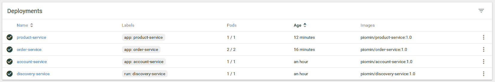

一个部署可以创建多个 pods。您可以如下调用`kubectl get pods`命令来查看 pods 列表：

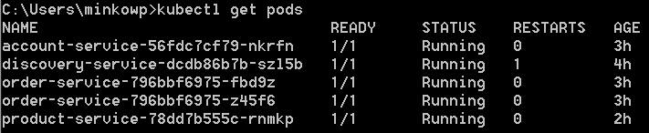

可以使用 UI 仪表板查看相同的列表。通过点击选中的行或者点击每行右侧的图标来查看这些详细信息，如下图所示：

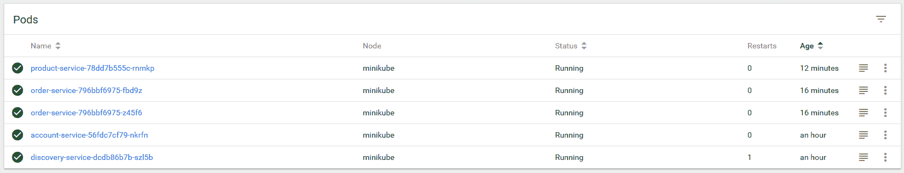

可以使用命令`kubectl get services`显示所有可用服务的完整列表。这里有一些有趣的字段，包括一个指示集群内部可用服务 IP 地址的字段（CLUSTER-IP），以及服务内部和外部暴露的一对端口（PORT(S)）。我们还可以通过`http://192.168.99.100:31099`调用`account-service`上暴露的 HTTP API，或者通过`http://192.168.99.100:31931`调用 Eureka UI 仪表板，如下所示：

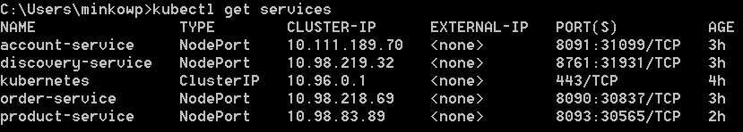

与之前的对象类似，服务也可以使用 Kubernetes 仪表板显示，如下所示：

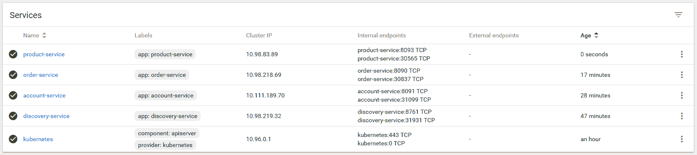

# 概要

在本章中，我们讨论了许多与 Spring Cloud 明显不相关的主题，但本章解释的工具将使您能够利用迁移到基于微服务的架构。在使用 Docker、Kubernetes 或 CI/CD 工具时，采用 Spring Cloud 进行云原生开发具有明显的优势。当然，所有示例都已在本机上启动，但您可以参考这些示例来想象该过程如何在远程机器集群的生产环境中设计。

在本章中，我们想向您展示将 Spring 微服务手动运行在本地机器转变为完全自动化的过程是多么简单和快速，该过程从源代码构建应用程序，创建包含应用程序的 Docker 镜像，并在由多台机器组成的集群上部署它。在一章中很难描述 Docker、Kubernetes 或 Jenkins 等复杂工具提供的所有功能。取而代之的是，这里的主要目的是为您提供如何基于容器化、自动化部署、扩展和私有、本地云等概念设计和维护现代架构的更广阔视野。

现在，我们离书的结尾已经非常近了。我们已经讨论了与 Spring Cloud 框架相关的计划主题的大部分。在下一章中，我们将向您展示如何使用两个最受欢迎的在线云平台，使您能够持续交付 Spring Cloud 应用程序。
