# 第十五章：云平台上的 Spring 微服务

Pivotal 将 Spring Cloud 定义为一个加速云原生应用程序开发的框架。今天，当我们谈论云原生应用程序时，首先想到的是快速交付软件的能力。为了满足这些需求，我们应该能够快速构建新的应用程序并设计可扩展、可移植且准备频繁更新的架构。提供容器化和编排机制的工具帮助我们设置和维护此类架构。实际上，像 Docker 或 Kubernetes 这样的工具，我们在之前的章节中已经探讨过，允许我们创建自己的私有云并在其上运行 Spring Cloud 微服务。尽管应用程序不必部署在公共云上，但它包含了云软件最重要的特性。

在公共云上部署您的 Spring 应用程序只是一个可能性，而不是必需的。然而，确实有一些非常有趣的云平台，可以让您在几分钟内轻松运行微服务并将它们暴露在网络上。其中一个平台是**Pivotal Cloud Foundry**（**PCF**）；它与其他平台相比的优势在于其对 Spring Cloud 服务的原生支持，包括使用 Eureka 的发现、Config Server 以及使用 Hystrix 的断路器。您还可以通过启用 Pivotal 提供的托管服务轻松设置完整的微服务环境。

我们还应该提到的另一个云平台是 Heroku。与 PCF 相比，它不偏爱任何编程框架。Heroku 是一个全托管的、多语言平台，可以让您快速交付软件。一旦您将存储在 GitHub 仓库中的源代码更改推送到 Heroku，它就可以自动构建和运行应用程序。它还提供许多可以单命令部署和扩展的附加服务。

本章涵盖的主题如下：

+   Pivotal Web Services 平台简介

+   使用 CLI、Maven 插件和 UI 仪表板在 Pivotal Cloud Foundry 上部署和管理应用程序

+   使用 Spring Cloud Foundry 库准备应用程序以在平台上正确运行

+   在 Heroku 平台上部署 Spring Cloud 微服务

+   管理托管服务

# Pivotal Cloud Foundry

尽管 Pivotal 平台可以运行用多种语言编写的应用程序，包括 Java、.NET、Ruby、JavaScript、Python、PHP 和 Go，但它对 Spring Cloud Services 和 Netflix OSS 工具的支持最为出色。这是有道理的，因为它们是开发 Spring Cloud 的人。看看下面的图表，也可在 Pivotal 的官方网站上找到。下面的图表说明了 Pivotal Cloud 平台提供的基于微服务的架构。你可以在 Cloud Foundry 上使用 Spring Cloud 快速利用常见的微服务模式，包括分布式配置管理、服务发现、动态路由、负载均衡和容错：

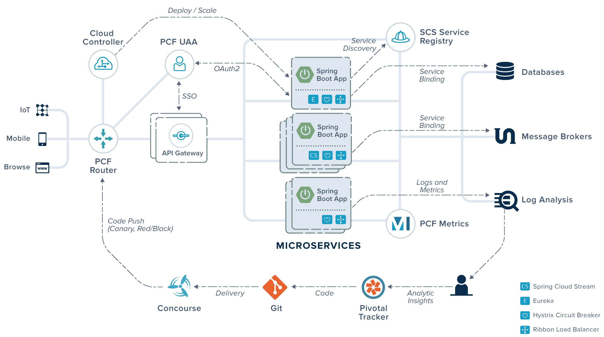

# 使用模型

你可以以三种不同的模型使用 Pivotal 平台。模型是根据宿主区分，这是应用程序被部署的地方。以下是可用的解决方案列表：

+   **PCF Dev**: 这个 Pivotal 平台的实例可以在单个虚拟机上本地运行。它旨在满足实验和开发的需求。它并不提供所有可能的特性和服务。例如，它只有一些内置服务，如 Redis、MySQL 和 RabbitMQ。然而，PCF Dev 也支持**Spring Cloud Services**（**SCS**），以及 PCF 完整版本中支持的所有语言。需要注意的是，如果你想本地运行带有 SCS 的 PCF Dev，你需要有超过 6GB 的可用 RAM。

+   **Pivotal Web Services**: 这是一个在线的云原生平台，网址为[`run.pivotal.io/`](https://run.pivotal.io/)。它就像 Pivotal Cloud Foundry，但有由 SaaS 合作伙伴提供的服务，以及按小时计费的托管服务。它并不提供 Pivotal Cloud Foundry 中可用的所有特性和服务。Pivotal Web Services 最适合初创公司或个人团队。在本书接下来的部分，我们将使用这个 Pivotal 平台托管模型进行展示。

+   **Pivotal Cloud Foundry**：这是一个功能全面的云原生平台，可以在任何主要的公共 IaaS 上运行，包括 AWS、Azure 和 Google Cloud Platform，或者基于 OpenStack 或 VMware vSphere 的私有云上运行。这是一个针对大型企业环境的商业解决方案。

# 准备应用程序

由于 Pivotal Web Services 对 Spring Cloud 应用有本地支持，所以部署过程非常简单。但是，它需要在应用程序方面指定特定的依赖项和配置—特别是如果你的微服务必须与 Pivotal 平台提供的内置服务（如服务注册表、配置服务器或断路器）集成。除了 Spring Cloud 的标准依赖管理外，我们还应该在`pom.xml`中包括`spring-cloud-services-dependencies`，并且是与`Edgware.SR2`发布列车一起工作的最新版本，如下所示：

```java
<dependencyManagement>
    <dependencies>
        <dependency>
            <groupId>org.springframework.cloud</groupId>
            <artifactId>spring-cloud-dependencies</artifactId>
            <version>Edgware.SR2</version>
            <type>pom</type>
            <scope>import</scope>
        </dependency>
        <dependency>
            <groupId>io.pivotal.spring.cloud</groupId>
            <artifactId>spring-cloud-services-dependencies</artifactId>
            <version>1.6.1.RELEASE</version>
            <type>pom</type>
            <scope>import</scope>
        </dependency>
    </dependencies>
</dependencyManagement>
```

根据所选的集成服务，您可能希望将以下工件包括在您的项目中。我们决定使用 Pivotal 平台提供的所有 Spring Cloud 功能，因此我们的微服务从配置服务器获取属性，在 Eureka 中注册自己，并将服务间通信封装在 Hystrix 命令中。以下是为在 Pivotal 平台上部署的应用程序启用发现客户端、配置客户端和断路器所需的依赖项：

```java
<dependency>
    <groupId>io.pivotal.spring.cloud</groupId>
    <artifactId>spring-cloud-services-starter-circuit-breaker</artifactId>
</dependency>
<dependency>
    <groupId>io.pivotal.spring.cloud</groupId>
    <artifactId>spring-cloud-services-starter-config-client</artifactId>
</dependency>
<dependency>
    <groupId>io.pivotal.spring.cloud</groupId>
    <artifactId>spring-cloud-services-starter-service-registry</artifactId>
</dependency>
```

我们将为我们的示例微服务提供另一个集成。它们都将将数据存储在 MongoDB 中，该 MongoDB 也作为 Pivotal 平台上的服务提供。为了实现这一点，我们首先应该在项目依赖项中包括启动器`spring-boot-starter-data-mongodb`：

```java
<dependency>
 <groupId>org.springframework.boot</groupId>
 <artifactId>spring-boot-starter-data-mongodb</artifactId>
</dependency>
```

在配置设置中应使用`spring.data.mongodb.uri`属性提供 MongoDB 地址。为了允许应用程序与 MongoDB 连接，我们必须创建一个 Pivotal 的服务 mLab，然后将其绑定到应用程序。默认情况下，与绑定服务相关的元数据作为环境变量`$VCAP_SERVICES`暴露给应用程序。这种方法的主要动机是，Cloud Foundry 被设计为多语言的，这意味着任何语言和平台都可以作为构建包支持。所有 Cloud Foundry 属性都可以使用`vcap`前缀注入。如果您想访问 Pivotal 的服务，您应该使用`vcap.services`前缀，然后传递如下所示的服务名称：

```java
spring:
 data:
  mongodb:
   uri: ${vcap.services.mlab.credentials.uri}
```

实际上，应用程序方面需要做的就是与在 Pivotal 平台上创建的组件正确配合。现在我们只需要像对用 Spring 编写的标准微服务一样启用 Spring Cloud 功能，如下例所示：

```java
@SpringBootApplication
@EnableDiscoveryClient
@EnableFeignClients
@EnableCircuitBreaker
public class OrderApplication {

    public static void main(String[] args) {
        SpringApplication.run(OrderApplication.class, args);
    }

}
```

# 部署应用程序

应用程序可以通过三种不同的方式在**Pivotal Web Service**（**PWS**）平台上进行管理。第一种是通过位于[`console.run.pivotal.io`](https://console.run.pivotal.io)的 web 控制台。我们可以通过这种方式监控、扩展、重新启动部署的应用程序，启用和禁用服务，定义新的配额，更改账户设置。然而，使用 web 控制台无法完成这项工作——也就是说，初始应用程序部署。这可以通过**CLI**（**命令行界面**）完成。您可以从[pivotal.io](https://pivotal.io)网站下载所需的安装程序。安装后，您应该能够在您的机器上通过输入`cf`来调用 Cloud Foundry CLI，例如，`cf help`。

# 使用 CLI

CLI 提供了一组命令，允许您管理在 Cloud Foundry 上的应用程序、有偿服务、空间、域和其他组件。让我向您展示一些最重要的命令，您需要了解这些命令才能在 PWS 上运行您的应用程序：

1.  为了部署应用程序，你首先必须导航到其目录。然后使用以下`cf login`命令登录 PWS：

```java
$ cf login -a https://api.run.pivotal.io 
```

1.  下一步是使用`cf push`命令将应用程序推送到 PWS，并传递服务的名称：

```java
$ cf push account-service -p target/account-service-1.0.0-SNAPSHOT.jar
```

1.  另外，你可以在应用程序的根目录下提供`manifest.yml`文件，其中包含所有必需的部署设置。在这种情况下，你只需要运行没有任何额外参数的`cf push`命令，如下所示：

```java
---
applications:
- name: account-service
  memory: 300M
  random-route: true
  path: target/account-service-1.0-SNAPSHOT.jar
```

1.  使用`manifest.yml`中提供的配置设置部署将失败。要了解原因，请运行命令`cf logs`。原因是堆内存限制不足：

```java
$ cf logs account-service --recent
```

默认情况下，平台为代码缓存分配了 240 MB，为元空间分配了 140 MB，并为每个线程分配了 1 MB，假设 Tomcat 连接器最多有 200 个线程。很容易计算出，根据这些设置，每个应用程序需要大约 650 MB 的分配内存。我们可以通过调用`cf set-env`命令并传递`JAVA_OPTS`参数来更改这些设置，如您在以下示例中看到的。这样的内存限制在生产模式中是不够的，但在测试目的上应该是可以的。为确保这些更改生效，使用以下`cf restage`命令：

```java
$ cf set-env account-service JAVA_OPTS "-Xmx150M -Xss250K -XX:ReservedCodeCacheSize=70M -XX:MaxMetaspaceSize=90M"
$ cf restage account-service
```

分配的内存很重要，特别是如果只有 2 GB RAM 可供免费账户使用。应用默认的内存设置，我们只能在 Pivotal 平台上部署两个应用程序，因为每个应用程序都会占用 1 GB 的 RAM。尽管我们解决了前面描述的问题，但我们的应用程序仍然无法正常工作。

# 绑定服务

在启动过程中，应用程序无法与所需服务连接。问题发生是因为服务默认情况下不会绑定到应用程序。你可以通过运行命令`cf services`来显示你在你的空间中创建的所有服务，并通过调用命令`cf bind-service`将每个服务绑定到给定的微服务。在以下命令执行示例中，我们将 Eureka、配置服务器和 MongoDB 绑定到`account-service`。最后，我们再次运行`cf restage`，一切应该都能正常工作，如下所示：

```java
$ cf bind-service account-service discovery-service
$ cf bind-service account-service config-service
$ cf bind-service account-service sample-db
```

# 使用 Maven 插件

正如我们之前提到的，CLI 和 Web 控制台并不是在 Pivotal 平台上管理应用程序的唯一方式。Cloud Foundry 团队已经实现了 Maven 插件，以促进和加快应用程序的部署。有趣的是，同一个插件可以用来管理任何 Cloud Foundry 实例的推送和更新，不仅仅是由 Pivotal 提供的实例。

当使用 Cloud Foundry 的 Maven 插件时，你可以轻松地将云部署集成到他们的 Maven 项目的生命周期中。这允许你在 Cloud Foundry 中推送、删除和更新项目。如果你想要与 Maven 一起推送你的项目，只需运行以下命令：

```java
$ mvn clean install cf:push
```

通常，Maven 插件提供的命令与 CLI 提供的命令非常相似。例如，你可以通过执行命令`mvn cf:apps`来显示应用程序列表。要删除一个应用程序，请运行以下命令：

```java
$ mvn cf:delete -Dcf.appname=product-service
```

如果你想要上传一些更改到现有应用程序，请使用以下`cf:update`命令：

```java
$ mvn clean install cf:update
```

在运行任何命令之前，我们必须正确配置插件。首先，需要传递 Cloud Foundry 登录凭据。建议将它们单独存储在 Maven 的`settings.xml`中。服务器标签内的典型条目可能如下所示：

```java
<settings>
    ...
    <servers>
        <server>
            <id>cloud-foundry-credentials</id>
            <username>piotr.minkowski@play.pl</username>
            <password>123456</password>
        </server>
    </servers>
    ...
</settings>
```

使用 Maven 插件而不是 CLI 命令有一个重要的优势：你可以在一个地方配置所有必要的配置设置，并在应用构建时使用一个命令应用它们。插件的完整配置如下所示。除了包括空间、内存和实例数量等一些基本设置外，还可以通过`JAVA_OPTS`环境变量和将所需服务绑定到应用程序来改变内存限制。在运行`cf:push`命令后，`product-service`可以在`https://product-service-piomin.cfapps.io/`地址上使用：

```java
<plugin>
    <groupId>org.cloudfoundry</groupId>
    <artifactId>cf-maven-plugin</artifactId>
    <version>1.1.3</version>
    <configuration>
        <target>http://api.run.pivotal.io</target>
        <org>piotr.minkowski</org>
        <space>development</space>
        <appname>${project.artifactId}</appname>
        <memory>300</memory>
        <instances>1</instances>
        <server>cloud-foundry-credentials</server>
        <url>https://product-service-piomin.cfapps.io/</url>
        <env>
            <JAVA_OPTS>-Xmx150M -Xss250K -XX:ReservedCodeCacheSize=70M -XX:MaxMetaspaceSize=90M</JAVA_OPTS>
        </env>
        <services>
            <service>
                <name>sample-db</name>
                <label>mlab</label>
                <plan>sandbox</plan>
            </service>
            <service>
                <name>discovery-service</name>
                <label>p-service-registry</label>
                <plan>standard</plan>
            </service>
            <service>
                <name>config-service</name>
                <label>p-config-server</label>
                <plan>standard</plan>
            </service>
        </services>
    </configuration>
</plugin>
```

# 维护

假设我们已经成功部署了构成我们示例微服务系统的所有应用程序，我们可以使用 Pivotal Web Services 仪表板轻松地管理和监控它们，甚至只需使用 CLI 命令。Pivotal 平台提供的免费试用为我们维护应用程序提供了许多可能性和工具，所以让我们探索它的一些最有趣的功能。

# 访问部署详情

我们可以通过运行`cf apps`命令或通过在 Web 控制台中导航到我们空间的主页来列出所有已部署的应用程序。你可以在下面的屏幕截图中看到这个列表。表格的每一行代表一个单独的应用程序。除了它的名称外，还有关于其状态、实例数量、分配的内存、部署时间和平台外可访问服务的外部 URL 的信息。如果你在应用部署时没有指定一个 URL 地址，它会自动生成：

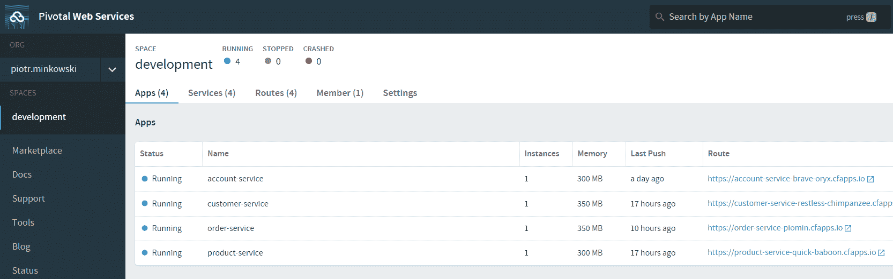

你可以点击每一行以发现有关应用程序的详细信息。使用 CLI 命令`cf app <app-name>`或`cf app order-service`也可以获取类似的信息。下面的屏幕截图显示了一个应用程序详细视图的主要面板，其中包含事件历史、摘要以及每个实例的内存、磁盘和 CPU 使用情况。在这个面板中，你可以通过点击缩放按钮来扩展应用程序。还有几个其他标签可用。通过切换到其中一个，你可以查看所有绑定服务（服务）、分配的外部 URL（规则）、显示日志（日志）和传入请求历史（追踪）：

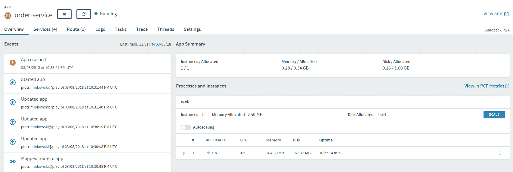

当然，你总是可以使用 CLI 来收集前例中显示的相同细节。如果你执行命令`cf logs <app-name>`，你会附加到由应用程序生成的`stdout`。你还可以显示已激活的 Pivotal 管理服务的列表，以及绑定应用程序的列表，如下面的截图所示：

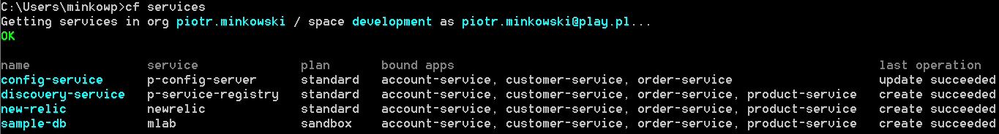

# 管理应用程序生命周期

Pivotal Web Services 提供的另一个非常有用的功能是管理应用程序生命周期的能力。换句话说，我们只需点击一次就可以轻松地停止、启动和重新启动一个应用程序。在执行请求的命令之前，你会被提示确认，如下面的截图所示：

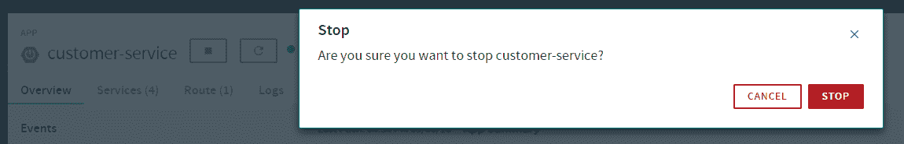

以下任一 CLI 命令运行可以达到相同的效果：

```java
$ cf stop <app-name>
$ cf restart <app-name>
$ cf start <app-name>
```

# 扩展

使用云解决方案最重要的原因之一是能够轻松扩展应用程序。Pivotal 平台以非常直观的方式处理这些问题。首先，你可能决定在每个部署阶段启动应用程序的实例数量。例如，如果你决定使用`manifest.yml`并使用`cf push`命令部署它，创建的实例数量将由字段实例决定，如下面的代码片段所示：

```java
---
applications:
- name: account-service
  memory: 300M
  instances: 2
  host: account-service-piomin
  domain: cfapps.io
  path: target/account-service-1.0-SNAPSHOT.jar
```

运行实例的数量，以及内存和 CPU 的限制，可以在启动的应用程序中进行修改。实际上，有两种可用的扩展方法。你可以手动设置应该启动多少实例，或者启用自动扩展，你只需要基于选定指标的阈值定义一个标准。Pivotal 平台上的自动扩展是通过一个名为**PCF App Autoscaler**的工具实现的。我们可以从以下五个可用的规则中选择，如下所示：

+   CPU 利用率

+   内存利用率

+   HTTP 延迟

+   HTTP 吞吐量

+   RabbitMQ 深度

你可以定义多个活跃规则。每个这些规则都有每个单一指标缩放 down 的最小值和缩放 up 的最大值。`customer-service`的自动扩展设置如下面的截图所示。在这里，我们决定应用 HTTP 吞吐量和 HTTP 延迟规则。如果 99%的流量延迟低于`20`毫秒，应该禁用一个应用程序实例，以防有多个实例。类似地，如果延迟超过`200`毫秒，平台应该附加一个更多的实例：

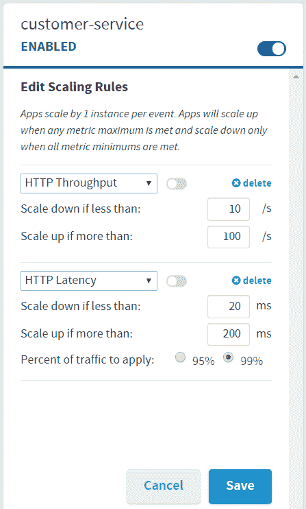

我们也可以手动控制运行实例的数量。自动扩展有很多优点，但手动方法能让你对这个过程有更多的控制权。由于每个应用程序的内存有限，仍有多余的空间用于其他实例。我们示例系统中压力最大的应用程序是`account-service`，因为它在订单创建以及订单确认时都会被调用。所以，让我们为这个微服务添加一个实例。为此，请前往`account-service`详情面板，点击进程和实例下的扩展。然后，你应该增加实例数量并应用必要的更改；你应该会看到`account-service`有两个实例可用，如下面的屏幕截图所示：

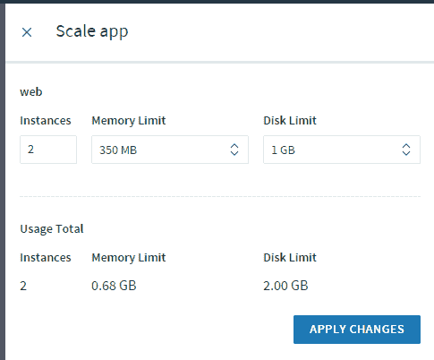

# 托管服务的部署

我们已经查看了如何使用`cf bind-service`命令和 Maven 插件将应用程序绑定到服务。然而，我们现在应该看看如何启用和配置我们的服务。你可以轻松显示所有可用服务的列表，然后使用 Pivotal 的仪表板启用它们；这可以在市场下找到。

使用 Pivotal Web Services 提供的托管服务非常简单。安装后，一些服务无需任何额外配置即可使用。我们只需要将它们绑定到选定的应用程序，并在应用程序的设置中正确传递它们的网络地址。每个应用程序都可以通过 UI 仪表板轻松绑定到服务。首先，导航到服务的主页面。在那里，你会看到当前已绑定应用程序的列表。你可以通过点击绑定应用并从显示的列表中选择一个来将新应用程序绑定到服务，如下面的屏幕截图所示：

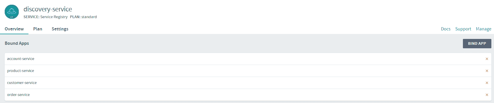

你只需要在市场上下启用注册表服务并将其绑定到应用程序，就可以在 Pivotal Web Services 上启用发现功能。当然，如果需要，你可以在客户端覆盖一些配置设置。可以在服务的主要配置面板下的管理中显示注册的所有应用程序的完整列表。由于我们在上一节中扩展了它，`account-service`有两个运行实例；其他微服务只有一个运行实例，如下所示：

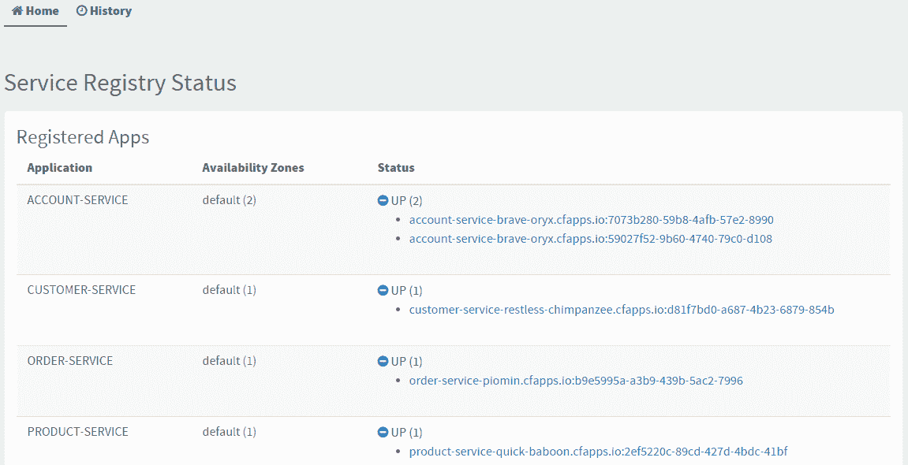

与发现服务相比，配置服务器需要包括额外的设置。像以前一样，你应该导航到它的主面板，然后选择“管理”。在这里，你会被重定向到配置表单。配置参数必须以 JSON 对象的形式提供在那里。`count`参数指定了需要预配的节点的数量，如果实例可以升级的升级选项，以及`force`即使实例已经是可用的最新版本也强制升级。其他配置参数取决于用于存储属性源的后端类型。正如您可能还记得第五章，*使用 Spring Cloud Config 进行分布式配置*，Spring Cloud Config Server 最受欢迎的解决方案是基于 Git 仓库的。我们在 GitHub 上创建了一个示例仓库，其中提交了所有所需的源代码。以下是在 Pivotal Web Services 上为 Config Server 提供的 JSON 格式的参数：

```java
{
    "count": 1,
    "git": {
        "password": "****",
        "uri": "https://github.com/piomin/sample-spring-cloud-pcf-config.git",
        "username": "piomin"
    }
}
```

示例应用程序使用的最后一个代理服务托管了一个 MongoDB 实例。在服务的管理主面板中导航到“管理”，你应该会被重定向到[`mlab.com/home`](https://mlab.com/home)，在那里你可以使用数据库节点。

# Heroku 平台

Heroku 是使用**PaaS**（**平台即服务**）模型创建的最古老的云平台之一。与 Pivotal Cloud Foundry 相比，Heroku 没有内置的对 Spring Cloud 应用程序的支持。这使我们的模型稍微复杂了一些，因为我们不能使用平台的服务的典型微服务组件，包括服务发现、配置服务器或断路器。尽管如此，Heroku 包含了一些 Pivotal Web Services 没有的非常有趣的功能。

# 部署方法

我们可以使用 CLI、网络控制台或专用的 Maven 插件来管理我们的应用程序。在 Heroku 上部署应用程序与在 Pivotal 平台上部署非常相似，但方法有些不同。主要方法假设你是通过从本地 Git 仓库或 GitHub 存储的源代码构建应用程序的。构建完成后，Heroku 平台会自动执行，当你向仓库的分支推送了一些更改，或者从选定分支的最新版本中按需执行。部署应用程序的另一种有趣方式是将你的 Docker 镜像推送到 Heroku 的容器注册表。

# 使用 CLI

你可以从[`cli-assets.heroku.com/heroku-cli/channels/stable/heroku-cli-x64.exe`](https://cli-assets.heroku.com/heroku-cli/channels/stable/heroku-cli-x64.exe)下载**Heroku 命令行界面**（**CLI**），这是为 Windows 用户提供的（对于 Windows 用户）。为了使用 CLI 在 Heroku 上部署和运行你的应用程序，你必须按照以下步骤进行：

1.  安装后，你可以在 shell 中使用`Heroku`命令。首先，使用你的凭据登录到 Heroku，如下所示：

```java
$ heroku login
Enter your Heroku credentials:
Email: piotr.minkowski@play.pl
Password: ********
Logged in as piotr.minkowski@play.pl 
```

1.  接下来，导航到应用的`root`目录并在 Heroku 上创建一个应用。在运行以下命令后，不仅会创建应用，还会创建一个名为`heroku`的 Git 远程。这与你本地的 Git 仓库相关联，如下所示：

```java
$ heroku create
Creating app... done, aqueous-retreat-66586
https://aqueous-retreat-66586.herokuapp.com/ | https://git.heroku.com/aqueous-retreat-66586.git
Git remote heroku added 
```

1.  现在你可以通过将代码推送到 Heroku 的 Git 远程来部署你的应用。Heroku 会为你完成所有工作，具体如下：

```java
$ git push heroku master
```

1.  如果应用启动成功，你将能够使用一些基本命令来管理它。根据以下顺序，你可以显示日志、更改运行中的 dyno 数量（换句话说，扩展应用）、分配新的附加组件，以及列出所有启用的附加组件：

```java
$ heroku logs --tail
$ heroku ps:scale web=2
$ heroku addons:create mongolab
$ heroku addons
```

# 连接到 GitHub 仓库

个人而言，我更喜欢通过连接到项目的 GitHub 仓库来将我的应用部署到 Heroku。关于这种部署方法有两种可能的方法：手动和自动。你可以通过导航到应用详情面板上的**部署**标签，然后将其连接到指定的 GitHub 仓库，如以下屏幕截图所示。如果你点击“部署分支”按钮，将在给定的 Git 分支上立即开始构建和部署。另外，你也可以通过点击**启用自动部署**来在选定的分支上启用自动部署。此外，如果你为你的 GitHub 仓库启用了持续集成，你还可以配置 Heroku 等待持续集成构建结果；这是一个非常有用的功能，因为它允许你在推送之前运行项目的自动化测试：

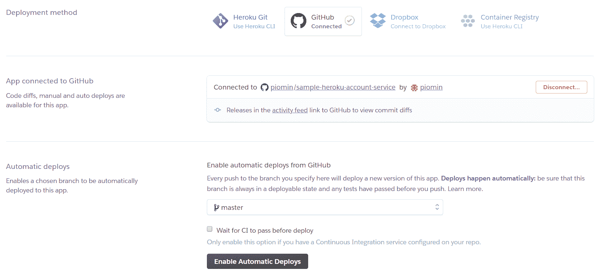

# Docker 容器注册表

紧跟最新趋势，Heroku 允许你使用 Docker 部署容器化应用。为了做到这一点，你应该在你的本地机器上安装 Docker 和 Heroku CLI：

1.  首先，通过运行命令`heroku login`登录到 Heroku 云。下一步是登录到容器注册表：

```java
$ heroku container:login
```

1.  接下来，确保你的当前目录包含`Dockerfile`。如果存在，你可以通过执行以下命令来构建并在 Heroku 容器注册表中推送镜像：

```java
$ heroku container:push web
```

1.  如果你有一个现有的构建镜像，你可能只对给镜像打标签并推送到 Heroku 感兴趣。为了做到这一点，你需要使用 Docker 的命令行，通过执行以下命令来实现（假设你的应用名称是`piomin-order-service`）：

```java
$ docker tag piomin/order-service registry.heroku.app/piomin-order-service/web
$ docker push registry.heroku.app/piomin-order-service/web
```

成功推送镜像后，新应用应该在 Heroku 仪表板上可见。

# 准备应用

当将基于 Spring Cloud 组件的应用程序部署到 Heroku 时，我们不再需要对其源代码进行任何额外的更改或添加任何额外的库，这是我们本地在本地运行它时所需要做的。这里唯一的不同在于配置设置，我们需要设置一个地址以便将应用程序与服务发现、数据库或任何其他可以为您微服务启用的附加组件集成。当前的示例，与 Pivotal 的部署示例相同，是将数据存储在分配给应用程序作为 mLab 服务的 MongoDB 中。另外，在这里，每个客户端都会在作为`piomin-discovery-service`部署的 Eureka 服务器上注册自己。下面的屏幕截图显示了部署在 Heroku 上的我们示例中的应用程序列表：

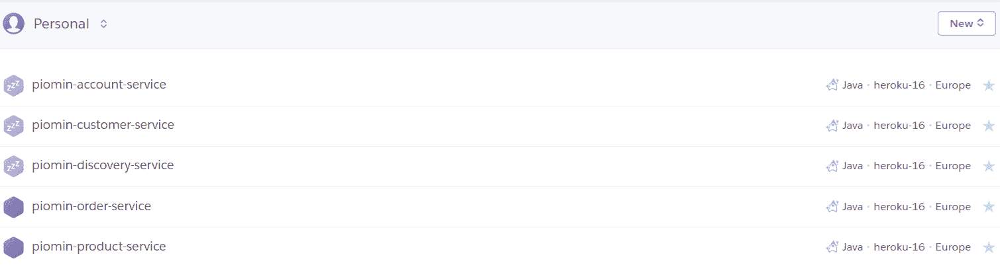

我将前面的应用程序通过连接 GitHub 仓库部署到 Heroku。这要求你为每个微服务创建一个单独的仓库。例如，`order-service`的仓库可在[`github.com/piomin/sample-heroku-order-service.git;`](https://clicktime.symantec.com/a/1/T35T4GHVxyO3_yEnmgYJzEOMwTYVoyfmLx2ONL0JOmM=?d=Em-4WZBG8KjUF8i64GiOj94xj1zxN6a1uB0eVZ0nPiAMBASzKXYmiNLpRNEcgxEQ7bHQ6AzvMbnrWHqhusJvYyZqTNMHlShDuReFC57yByy3O9bujQaWuS_jFkuW-GXlbAc9l9L2CmOU0k0c7iCbz4TP6gxYzTpi3F2ZhiR4yOGU_aIfM0-ImE4VjE3Zwu5hcRLW6fRjQIpA00TbvIfq03qKyXpN4rOeSy-uW8xOD3AifhkEun4HB33yo6UpNlLAVK45YxrUxZn2iT_VdnO336VCgrUe4QGzCEoQEtzN_eTC5eSH0FHDXyXwW0Aj4Px9YTY5asaj9oWluYR6xuKHwLEyHqyAWSKmRhRVXDNsi3pF13hLo94F&u=https%3A%2F%2Fgithub.com%2Fpiomin%2Fsample-heroku-order-service.git)进行测试。

现在让我们来看看为其中一个示例应用程序提供的配置设置：`account-service`。首先，我们必须覆盖 MongoDB 的自动配置地址，使用 Heroku 平台提供的`MONGODB_URI`环境变量。还必须提供正确的 Eureka 服务器地址，以及覆盖注册时发现客户端发送的主机名和端口。这是因为默认情况下，每个应用程序都会尝试使用对其他应用程序不可用的内部地址进行注册。如果不覆盖这些值，使用 Feign 客户端的服务间通信将失败：

```java
spring:  
   application:
     name: account-service
   data:
     mongodb:
       uri: ${MONGODB_URI}
 eureka:
   instance:
     hostname: ${HEROKU_APP_NAME}.herokuapp.com
     nonSecurePort: 80
   client:
     serviceUrl:
       defaultZone: http://piomin-discovery-service.herokuapp.com/eureka
```

请注意，环境变量`HEROKU_APP_NAME`是部署在 Heroku 上的当前应用程序的名称，如前面的片段中所见。这并非默认可用。要为您的应用程序启用变量，例如`customer-service`，请运行以下命令并使用实验性附加组件`runtime-dyno-metadata`：

```java
$ heroku labs:enable runtime-dyno-metadata -a piomin-customer-service
```

# 测试部署

-   部署后，每个应用程序都可以在其名称和平台域名组成的地址上访问，例如，[`piomin-order-service.herokuapp.com`](http://piomin-order-service.herokuapp.com)。您可以使用 URL 调用 Eureka 仪表板，即 [`piomin-discovery-service.herokuapp.com/`](http://piomin-discovery-service.herokuapp.com/)，这将允许您检查我们的示例微服务是否已注册。如果一切工作正常，您应该会看到类似于以下屏幕截图的东西：

-   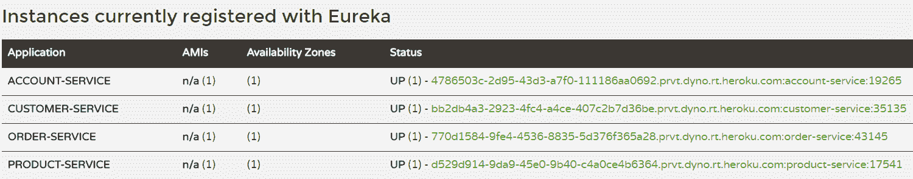

-   每个微服务都暴露了由 Swagger2 自动生成的 API 文档，所以你可以通过从`/swagger-ui.html`获取的 Swagger UI 仪表板轻松地测试每个端点；例如，[`piomin-order-service.herokuapp.com/swagger-ui.html`](http://piomin-order-service.herokuapp.com/swagger-ui.html)。`order-service`的 HTTP API 视图如下：

-   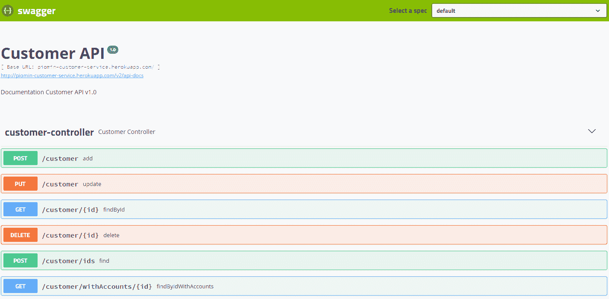

-   每个微服务都在 MongoDB 中存储数据。这个数据库可以通过向 Heroku 项目添加插件来启用，例如 mLab。正如您可能记得的，我们已经在 Pivotal 平台上部署的应用程序中使用过相同服务的示例来存储数据。插件可以通过在应用程序的详细信息面板的资源标签中为其选择计划来为应用程序启用。完成后，您可以简单地点击它来管理每个插件。对于 mLab，您将被重定向到 mLab 网站([mlab.com](https://mlab.com/))，在那里您可以查看所有集合、用户和生成的统计信息的列表。以下屏幕截图说明了我们的示例的 mLab 仪表板：

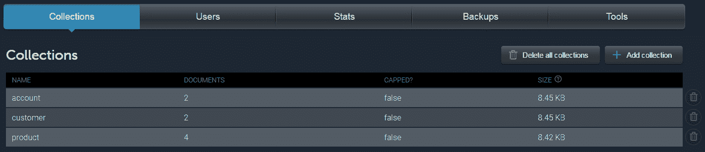

# -   总结

-   我们的 Spring Cloud 微服务之旅已经结束！我们的练习始于在本地机器上的简单部署，但在上一章中，我们的微服务部署在完全由云供应商管理的环境中，该环境还自动构建、启动并在指定域名上暴露 HTTP API。我个人认为，我们能够如此轻松地使用任何一种流行的编程语言或第三方工具（如数据库或消息代理）运行、扩展和将数据暴露于应用程序之外，这是非常惊人的。事实上，我们中的每一个人现在都可以在几小时内实施并将一个生产就绪的应用程序部署到网上，而无需担心必须安装的软件。

本章向你们展示了如何在不同的平台上轻松运行 Spring Cloud 微服务。所给示例说明了云原生应用的真正力量。无论你是在自己的笔记本电脑上本地启动应用，还是在 Docker 容器内，使用 Kubernetes，或是在如 Heroku 或 Pivotal Web Services 这样的在线云平台上启动应用，你都不需要在应用的源代码中做任何更改；修改只需要在其属性中进行。（假设你在你的架构中使用 Config Server，这些更改是非侵入性的。）

在过去的两章中，我们探讨了 IT 世界中的一些最新趋势。如持续集成和持续部署（CI 和 CD）、使用 Docker 的容器化、使用 Kubernetes 的编成以及云平台等主题正被越来越多的组织所使用。实际上，这些解决方案在微服务的日益普及中起到了部分作用。目前，在这个编程领域有一个领导者——Spring Cloud。没有其他 Java 框架有如此多的功能，或者能够实现与微服务相关的如此多的模式，如 Spring Cloud。我希望这本书能帮助你在构建和精炼你的基于微服务的企业系统时有效地使用这个框架。
