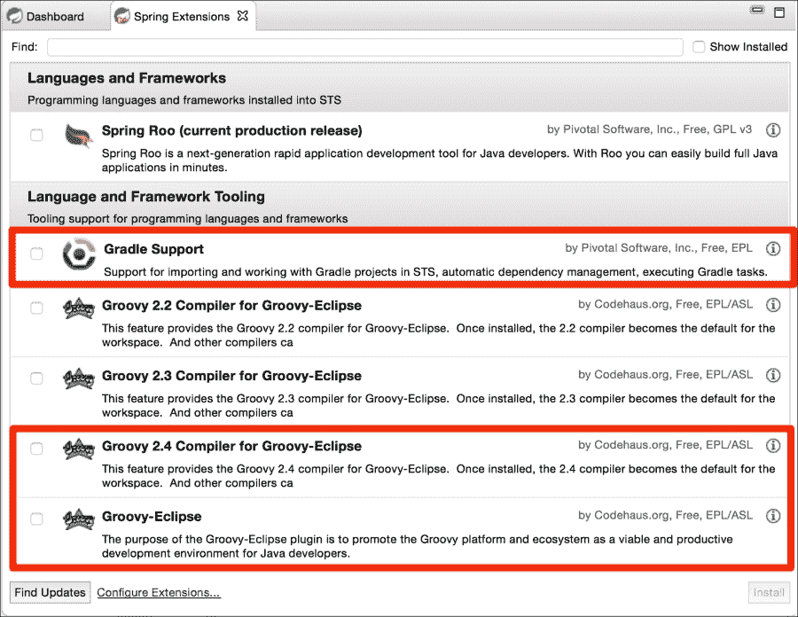
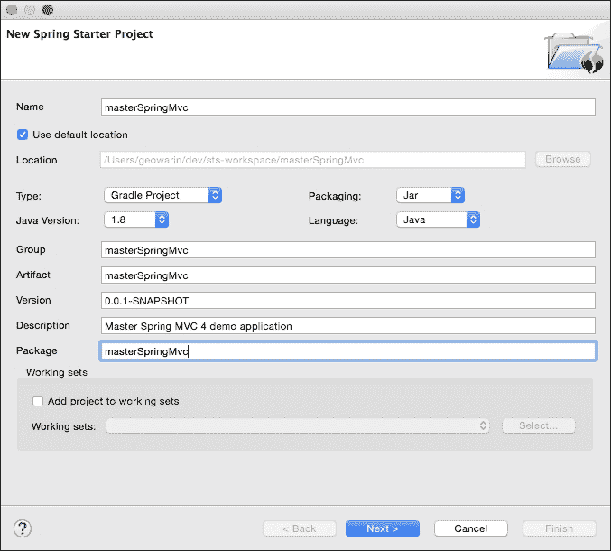
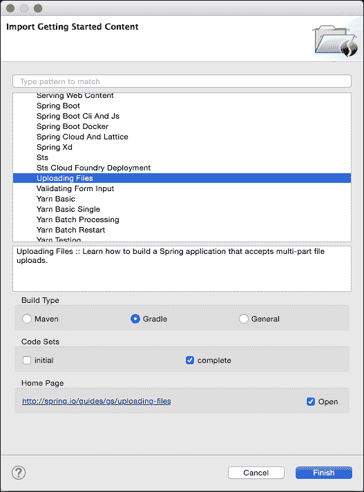
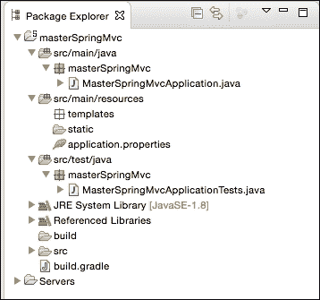
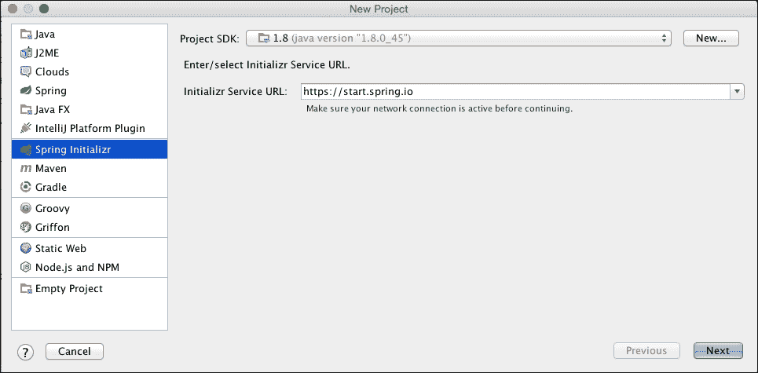
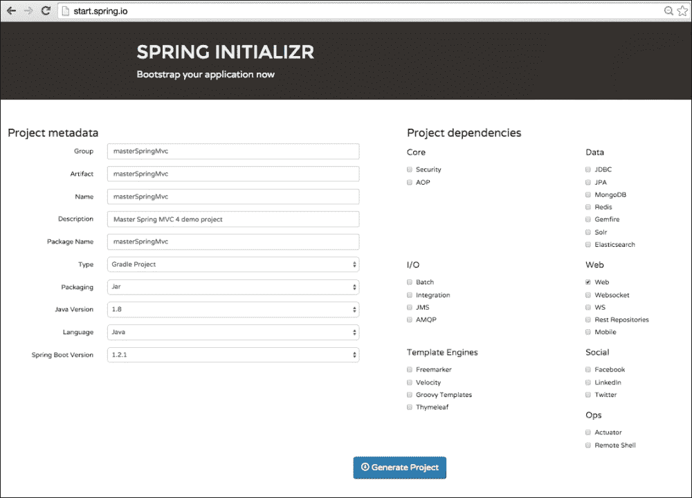
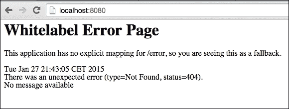
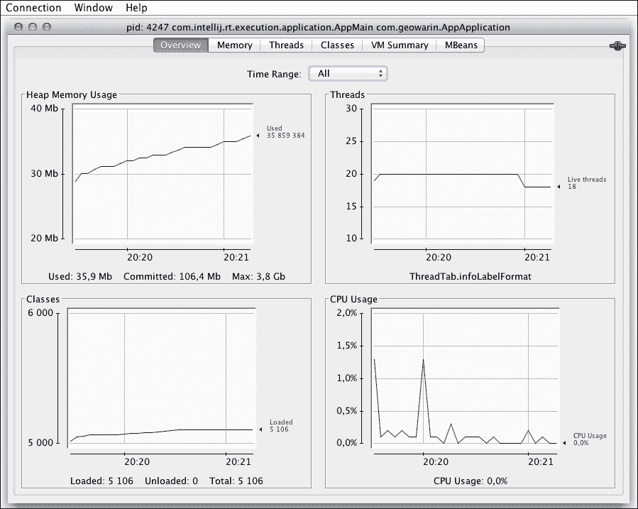

# 第一章. 快速设置 Spring Web 应用程序

在本章中，我们将直接进入代码并设置一个 Web 应用程序，我们将在这本书的剩余部分继续工作。

我们将利用 Spring Boot 的自动配置功能来构建一个无需样板代码或配置文件的程序。

我将概述 Spring Boot 的工作原理以及如何配置它。有四种方式开始使用 Spring：

+   使用 Spring Tool Suite 生成启动代码

+   使用 IntelliJ IDEA 14.1，它现在对 Spring Boot 有很好的支持

+   使用 Spring 的网站[`start.Spring.io`](http://start.Spring.io)下载一个可配置的 zip 文件

+   使用 curl 命令行访问[`start.Spring.io`](http://start.Spring.io)并实现相同的结果

在本书中，我们将使用 Gradle 和 Java 8，但不要害怕。即使您仍在使用 Maven 和 Java 的早期版本，我相信您会发现这些技术很容易使用。

许多官方 Spring 教程都有 Gradle 构建和 Maven 构建，所以如果您决定坚持使用 Maven，您将很容易找到示例。Spring 4 完全兼容 Java 8，所以不利用 lambda 来简化我们的代码库将是一件遗憾的事情。

我还将向您展示一些 Git 命令。我认为在您处于稳定状态时跟踪进度并提交是一个好主意。这也会使您更容易将您的工作与本书提供的源代码进行比较。

由于我们将在第九章 Chapter 9 中部署我们的应用程序到 Heroku，我建议您从一开始就使用 Git 进行版本控制。我将在本章后面为您提供一些关于如何开始使用 Git 的建议。

# 开始使用 Spring Tool Suite

开始使用 Spring 并发现 Spring 社区提供的众多教程和启动项目之一是下载**Spring Tool Suite**（**STS**）。STS 是为与各种 Spring 项目、Groovy 和 Gradle 一起工作而设计的 eclipse 的定制版本。即使像我一样，您有另一个您更愿意使用的 IDE，我也强烈建议您尝试一下 STS，因为它让您有机会通过“入门”项目在几分钟内探索 Spring 的庞大生态系统。

因此，让我们访问[`Spring.io/tools/sts/all`](https://Spring.io/tools/sts/all)并下载 STS 的最新版本。在我们生成第一个 Spring Boot 项目之前，我们需要为 STS 安装 Gradle 支持。您可以在仪表板上找到一个**管理 IDE 扩展**按钮。然后您需要在**语言和框架工具**部分下载**Gradle 支持**软件。

我还建议安装**Groovy Eclipse**插件以及**Groovy 2.4 编译器**，如图所示。这些将在本书后面的内容中设置 geb 接受测试时需要。



我们现在有两个主要选项开始使用。

### 提示

**下载示例代码**

您可以从您在 [`www.packtpub.com`](http://www.packtpub.com) 的账户中下载您购买的所有 Packt 书籍的示例代码文件。如果您在其他地方购买了这本书，您可以访问 [`www.packtpub.com/support`](http://www.packtpub.com/support) 并注册以直接将文件通过电子邮件发送给您。

您也可以从 [`github.com/Mastering-Spring-MVC-4/mastering-spring-mvc4`](https://github.com/Mastering-Spring-MVC-4/mastering-spring-mvc4) 下载本书的示例代码。

第一个选项是导航到**文件** | **新建** | **Spring Starter 项目**，如图所示。这将为您提供与 [`start.Spring.io`](http://start.Spring.io) 相同的选项，嵌入到您的 IDE 中：



您还可以访问 [`spring.io`](http://spring.io) 上提供的所有教程，在顶部栏中选择**文件** | **新建** | **导入入门内容**。您可以选择使用 Gradle 或 Maven，如图所示：

### 注意

您还可以查看入门代码以跟随教程，或直接获取完整代码。



在**入门内容**中有许多非常有趣的内容可供探索，我鼓励您自己探索。它将展示 Spring 与您可能感兴趣的各种技术的集成。

目前，我们将生成一个如图所示的网络项目。它将是一个 Gradle 应用程序，生成一个 JAR 文件并使用 Java 8。

这里是我们想要使用的配置：

| 属性 | 值 |
| --- | --- |
| 名称 | masterSpringMvc |
| 类型 | Gradle 项目 |
| 打包 | Jar |
| Java 版本 | 1.8 |
| 语言 | Java |
| 组 | masterSpringMvc |
| 生成物 | masterSpringMvc |
| 版本 | 0.0.1-SNAPSHOT |
| 描述 | 发挥创意！ |
| 包 | masterSpringMvc |

在第二屏，您将需要选择您想要使用的 Spring Boot 版本以及应该添加到项目中的依赖项。

在撰写本文时，Spring Boot 的最新版本是 1.2.5。请确保您始终检查最新版本。

到你阅读这篇文档的时候，Spring Boot 的最新快照版本也将可用。如果那时 Spring Boot 1.3 还没有发布，你可能可以试一试。它的一大特点是出色的开发者工具。有关更多详细信息，请参阅[`spring.io/blog/2015/06/17/devtools-in-spring-boot-1-3`](https://spring.io/blog/2015/06/17/devtools-in-spring-boot-1-3)。

在配置窗口的底部，你会看到代表各种 boot 启动库的多个复选框。这些是可以附加到你的构建文件中的依赖项。它们为各种 Spring 项目提供自动配置。

目前我们只对 Spring MVC 感兴趣，所以我们将只勾选 Web 复选框。

### 小贴士

一个 Web 应用程序的 JAR 文件？有些人可能觉得将 Web 应用程序打包成 JAR 文件很奇怪。虽然仍然可以使用 WAR 文件进行打包，但这并不是推荐的做法。默认情况下，Spring Boot 将创建一个胖 JAR，它将包含所有应用程序的依赖项，并提供使用 Java -jar 启动 Web 服务器的一种方便方式。

我们的应用程序将被打包成一个 JAR 文件。如果你想创建 WAR 文件，请参阅[`spring.io/guides/gs/convert-jar-to-war/`](http://spring.io/guides/gs/convert-jar-to-war/)。

你已经点击了**完成**了吗？如果你已经点击了，你应该会得到以下项目结构：



我们可以看到我们的主类**MasterSpringMvcApplication**及其测试套件**MasterSpringMvcApplicationTests**。还有两个空文件夹，**static**和**templates**，我们将在这里放置我们的静态 Web 资源（图像、样式等）和显然是我们的模板（jsp、freemarker、Thymeleaf）。最后一个文件是一个空的**application.properties**文件，这是 Spring Boot 的默认配置文件。这是一个非常方便的文件，我们将在本章中看到 Spring Boot 如何使用它。

`build.gradle`文件，我们将在稍后详细说明的构建文件。

如果你准备好了，运行应用程序的主方法。这将为我们启动一个 Web 服务器。

要这样做，请转到应用程序的主方法，并在工具栏中通过右键单击类或单击工具栏中的绿色播放按钮导航到**运行方式**|**Spring 应用程序**。

这样做并导航到`http://localhost:8080`将产生一个错误。别担心，继续阅读。

我将向你展示如何在不使用 STS 的情况下生成相同的项目，然后我们将回到所有这些文件。

# IntelliJ 入门

IntelliJ IDEA 是 Java 开发者中非常受欢迎的工具。在过去几年里，我很高兴为这个出色的编辑器支付 Jetbrains 的年度费用。

IntelliJ 还有快速创建 Spring Boot 项目的方法。

前往新项目菜单，并选择**Spring Initializr**项目类型：



这将给我们提供与 STS 相同的选项，因此请参考上一章的详细配置。

### 小贴士

你需要将 Gradle 项目导入 IntelliJ。我建议首先生成 Gradle 包装器（参考以下 **Gradle 构建** 部分）。

如果需要，你可以通过再次打开其 `build.gradle` 文件来重新导入项目。

# 使用 start.Spring.io 入门

前往 [`start.Spring.io`](http://start.Spring.io) 开始使用 start.Spring.io。这个令人瞩目的类似 Bootstrap 的网站背后的系统你应该很熟悉！当你点击之前提到的链接时，你会看到以下截图：



的确，这里可以找到与 STS 相同的选项。点击 **生成项目** 将下载一个包含我们的入门项目的 ZIP 文件。

## 使用命令行入门

对于那些沉迷于控制台的人来说，你可以使用 curl [`start.Spring.io`](http://start.Spring.io)。这样做将显示如何构建你的 curl 请求的说明。

例如，要生成之前相同的项目，你可以执行以下命令：

```java
$ curl http://start.Spring.io/starter.tgz \
-d name=masterSpringMvc  \
-d dependencies=web \
-d language=java \
-d JavaVersion=1.8 \
-d type=gradle-project \
-d packageName=masterSpringMvc \
-d packaging=jar \
-d baseDir=app | tar -xzvf -
% Total    % Received % Xferd  Average Speed   Time    Time     Time  Current
Dload  Upload   Total   Spent    Left  Speed
100  1255  100  1119  100   136   1014    123  0:00:01  0:00:01 --:--:--  1015
x app/
x app/src/
x app/src/main/
x app/src/main/Java/
x app/src/main/Java/com/
x app/src/main/Java/com/geowarin/
x app/src/main/resources/
x app/src/main/resources/static/
x app/src/main/resources/templates/
x app/src/test/
x app/src/test/Java/
x app/src/test/Java/com/
x app/src/test/Java/com/geowarin/
x app/build.Gradle
x app/src/main/Java/com/geowarin/AppApplication.Java
x app/src/main/resources/application.properties
x app/src/test/Java/com/geowarin/AppApplicationTests.Java

```

哇！你现在可以不离开控制台就开始使用 Spring 了，这是一个梦想成真。

### 小贴士

你可以考虑使用之前的命令创建一个别名，这将帮助你非常快速地原型化 Spring 应用程序。

# 让我们开始吧

现在我们的 Web 应用程序已经准备好了，让我们看看它是如何编写的。在继续之前，我们可以使用 Git 保存我们的工作。

如果你对 Git 一无所知，我推荐以下两个教程：

+   [`try.github.io`](https://try.github.io)，这是一个很好的逐步交互式教程，用于学习基本的 Git 命令

+   [`pcottle.github.io/learnGitBranching`](http://pcottle.github.io/learnGitBranching)，这是一个出色的 Git 树状结构的交互式可视化，它将向你展示基本的以及非常高级的 Git 功能

### 小贴士

**安装 Git**

在 Windows 上，安装 Git bash，它可以在 [`msysgit.github.io`](https://msysgit.github.io) 找到。在 Mac 上，如果你使用 homebrew，你应该已经安装了 Git。否则，使用命令 `brew install git`。如果有疑问，请查看 [`git-scm.com/book/en/v2/Getting-Started-Installing-Git`](https://git-scm.com/book/en/v2/Getting-Started-Installing-Git) 的文档。

要使用 Git 对我们的工作进行版本控制，请在控制台中输入以下命令：

```java
$ cd app
$ git init

```

使用 IntelliJ 时，忽略生成的文件：`.idea` 和 `*.iml`。使用 eclipse 时，你应该提交 `.classpath` 和 `.settings` 文件夹。在任何情况下，你应该忽略 `.gradle` 文件夹和 `build` 文件夹。

创建一个包含以下文本的 `.gitignore` 文件：

```java
# IntelliJ project files
.idea
*.iml

# gradle
.gradle
build
```

现在，我们可以将所有其他文件添加到 Git 中：

```java
$ git add .
$ git commit -m "Generated with curl start.Spring.io"
[master (root-commit) eded363] Generated with curl start.Spring.io
4 files changed, 75 insertions(+)
create mode 100644 build.Gradle
create mode 100644 src/main/Java/com/geowarin/AppApplication.Java
create mode 100644 src/main/resources/application.properties
create mode 100644 src/test/Java/com/geowarin/AppApplicationTests.Java

```

## Gradle 构建

如果您不熟悉 Gradle，可以将其视为 Maven 的继任者，一个现代的构建工具。像 Maven 一样，它使用诸如如何结构化 Java 应用程序之类的约定。我们的源代码仍然位于 `src/main/java`，我们的 webapp 位于 `src/main/webapp`，等等。与 Maven 类似，您可以使用 Gradle 插件来处理各种构建任务。然而，Gradle 真正的亮点在于它允许您使用 Groovy DSL 编写自己的构建任务。默认库使得操作文件、声明任务之间的依赖关系以及增量执行作业变得容易。

### 提示

**安装 Gradle**

如果您使用的是 OS X，您可以使用 `brew install gradle` 命令通过 brew 安装 Gradle。在任何 *NIX 系统（包括 Mac）上，您可以使用 gvm ([`gvmtool.net/`](http://gvmtool.net/)) 安装它。或者，您可以从 [`Gradle.org/downloads`](https://Gradle.org/downloads) 下载二进制发行版。

在使用 Gradle 创建应用程序时，第一个好的实践是生成一个 Gradle 包装器。Gradle 包装器是一个小的脚本，您将和代码一起分享以确保构建将使用您用于构建应用程序的相同版本的 Gradle。

生成包装器的命令是 `Gradle wrapper`：

```java
$ gradle wrapper
:wrapper

BUILD SUCCESSFUL

Total time: 6.699 secs

```

如果我们查看创建的新文件，我们可以看到两个脚本和两个目录：

```java
$ git status -s
?? .gradle/
?? gradle/
?? gradlew
?? gradlew.bat

```

`.gradle` 目录包含 Gradle 二进制文件；您不希望将这些提交到版本控制中。

我们之前忽略了此文件以及构建目录，这样您就可以安全地 `git add` 其他所有内容：

```java
$ git add .
$ git commit -m "Added Gradle wrapper"

```

`Gradle` 目录包含有关如何获取二进制文件的信息。另外两个文件是脚本：Windows 的批处理脚本（`Gradlew.bat`）和其他系统的 shell 脚本。

我们也可以使用 Gradle 运行我们的应用程序，而不是从 IDE 中执行应用程序：

```java
$ ./gradlew bootrun

```

执行此命令将在其中包含我们的应用程序的嵌入式 tomcat 服务器上运行！

日志告诉我们服务器正在 8080 端口上运行。让我们检查一下：



我可以想象您的失望。我们的应用程序还没有准备好面向公众。

话虽如此，我们项目由两个文件完成的工作相当令人印象深刻。让我们回顾一下。

第一个是 Gradle 构建文件，`build.Gradle`：

```java
buildscript {
    ext {
        springBootVersion = '1.2.5.RELEASE'
    }
    repositories {
        mavenCentral()
    }
    dependencies {
        classpath("org.springframework.boot:spring-boot-gradle-plugin:${springBootVersion}") 
        classpath("io.spring.gradle:dependency-management-plugin:0.5.1.RELEASE")
    }
}

apply plugin: 'java'
apply plugin: 'eclipse'
apply plugin: 'idea'
apply plugin: 'spring-boot' 
apply plugin: 'io.spring.dependency-management' 

jar {
    baseName = 'masterSpringMvc'
    version = '0.0.1-SNAPSHOT'
}
sourceCompatibility = 1.8
targetCompatibility = 1.8

repositories {
    mavenCentral()
}

dependencies {
    compile("org.springframework.boot:spring-boot-starter-web")
    testCompile("org.springframework.boot:spring-boot-starter-test") 
}

eclipse {
    classpath {
         containers.remove('org.eclipse.jdt.launching.JRE_CONTAINER')
         containers 'org.eclipse.jdt.launching.JRE_CONTAINER/org.eclipse.jdt.internal.debug.ui.launcher.StandardVMType/JavaSE-1.8'
    }
}

task wrapper(type: Wrapper) {
    gradleVersion = '2.3'
}
```

我们在这里看到了什么？

+   依赖于在 Maven 中央仓库上分发的 Spring Boot 插件。

+   我们的项目是一个 Java 项目。Gradle 可以为 IntelliJ 或 Eclipse 生成 IDE 项目文件。

+   应用程序将生成一个 JAR 文件。

+   我们的项目依赖托管在 Maven 中央仓库。

+   我们的项目类路径在生产中包含 `spring-boot-starter-web`，在测试中包含 `spring-boot-starter-test`。

+   为 eclipse 配置的一些附加设置。

+   Gradle 包装器的版本是 2.3。

Spring Boot 插件将生成一个包含项目所有依赖项的胖 JAR 文件。要构建它，请输入：

```java
./gradlew build

```

你可以在`build/libs`目录中找到 JAR 文件。这个目录将包含两个文件，一个称为`masterSpringMvc-0.0.1-SNAPSHOT.jar`的胖 JAR 文件，以及一个不包含任何依赖的经典 JAR 文件，`masterSpringMvc-0.0.1-SNAPSHOT.jar.original`。

### 小贴士

**可运行 JAR**

Spring Boot 的一个主要优点是将应用程序需要的所有内容嵌入到一个易于分发的 JAR 文件中，包括 Web 服务器。如果你运行`java jar masterSpringMvc-0.0.1-SNAPSHOT.jar`，tomcat 将在 8080 端口启动，就像你在开发时做的那样。这对于在生产环境或云中部署来说非常方便。

我们在这里的主要依赖是`spring-boot-starter-web`。Spring Boot 提供了一系列的 starters，它们会自动配置应用程序的一些方面，通过提供典型的依赖和 Spring 配置。

例如，`spring-starter-web`将包含`tomcat-embedded`和 Spring MVC 的依赖。它还将运行最常用的 Spring MVC 配置，提供一个监听`"/"`根路径的调度器，错误处理，例如我们之前看到的 404 页面，以及一个经典的视图解析器配置。

我们稍后会看到更多关于这个的内容。首先，让我们看看下一节。

## 让我看看代码！

这里是需要运行应用程序的所有代码。所有内容都在一个经典的主函数中，这是一个巨大的优势，因为你可以像运行其他任何程序一样在你的 IDE 中运行你的应用程序。你可以调试它，并且还可以无需插件就获得一些类重新加载的功能。

当你在 Eclipse 中保存文件或在 IntelliJ 中点击**Make Project**时，这种重新加载将在调试模式下可用。这只有在 JVM 能够切换新的编译版本和类文件的新版本时才可能；修改静态变量或触摸配置文件将迫使你重新加载应用程序。

我们的主要类看起来如下：

```java
package masterSpringMvc;

import org.Springframework.boot.SpringApplication;
import org.Springframework.boot.autoconfigure.SpringBootApplication;

@SpringBootApplication
public class AppApplication {

    public static void main(String[] args) {
        SpringApplication.run(AppApplication.class, args);
    }
}
```

注意`@SpringBootApplication`注解。如果你查看这个注解的代码，你会看到它实际上结合了三个其他的注解：`@Configuration`、`@EnableAutoConfiguration`和`@ComponentScan`：

```java
@Target(ElementType.TYPE)
@Retention(RetentionPolicy.RUNTIME)
@Documented
@Inherited
@Configuration
@EnableAutoConfiguration
@ComponentScan
public @interface SpringBootApplication {

  /**
  * Exclude specific auto-configuration classes such that they will never be applied.
  */
  Class<?>[] exclude() default {};
}
```

如果你之前已经使用 Java 代码配置过 Spring 应用，那么`@Configuration`类应该对你来说很熟悉。它表示我们的类将处理 Spring 配置的经典方面：例如声明 bean。

`@ComponentScan`类也是一个经典。它将告诉 Spring 在哪里查找我们的 Spring 组件（服务、控制器等）。默认情况下，这个注解将扫描当前包及其所有子包。

这里的新特性是`@EnableAutoConfiguration`，它将指导 Spring Boot 执行其魔法。如果你移除它，你将不再从 Spring Boot 的自动配置中受益。

使用 Spring Boot 编写 MVC 应用程序的第一步通常是向我们的代码中添加一个控制器。将控制器添加到控制器子包中，以便它被`@ComponentScan`注解拾取：

```java
package masterSpringMvc.controller;

import org.springframework.stereotype.Controller;
import org.springframework.web.bind.annotation.RequestMapping;
import org.springframework.web.bind.annotation.ResponseBody;

@Controller
public class HelloController {

    @RequestMapping("/")
    @ResponseBody
    public String hello() {
        return "Hello, world!";
    }
}
```

这次，如果你打开你的浏览器并访问`http://localhost:8080`，你将看到这个可爱的**Hello, world!**输出：


# Spring Boot 幕后

如果你之前已经设置了一个 Spring MVC 应用程序，你可能已经习惯了至少编写一小部分 XML 或一些 Java 注解配置类。

初始化步骤通常是以下这样：

1.  初始化 Spring MVC 的 DispatcherServlet。

1.  设置一个编码过滤器以确保客户端请求被正确编码。

1.  设置视图解析器，告诉 Spring 在哪里可以找到我们的视图以及它们是用哪种方言编写的（jsp、Thymeleaf 模板等）。

1.  配置静态资源位置（css、js）。

1.  配置支持的地区和资源包。

1.  配置一个多部分解析器，以便文件上传可以工作。

1.  包括 tomcat 或 jetty，以便在我们的 Web 服务器上运行应用程序。

1.  设置错误页面（例如 404）。

然而，Spring Boot 为我们处理所有这些工作。因为这种配置通常取决于你的应用程序，你可以提出无限多的组合。

从某种意义上说，Spring Boot 是一个有偏见的 Spring 项目配置器。它基于约定，并将默认强制执行这些约定到你的项目中。

## 分发器和多部分配置

让我们看看幕后发生了什么。

我们将使用为我们创建的默认 Spring Boot 配置文件，并将其置于调试模式。将以下行添加到`src/main/resources/application.properties`：

```java
debug=true
```

现在，如果我们再次启动我们的应用程序，我们将看到 Spring Boot 的自动配置报告。它分为两部分：**positive matches**（正匹配），列出了我们应用程序使用的所有自动配置；以及**negative matches**（负匹配），这些是当应用程序启动时未满足要求的 Spring Boot 自动配置：

```java
=========================
AUTO-CONFIGURATION REPORT
=========================

Positive matches:
-----------------

 DispatcherServletAutoConfiguration
 - @ConditionalOnClass classes found: org.Springframework.web.servlet.DispatcherServlet (OnClassCondition)
 - found web application StandardServletEnvironment (OnWebApplicationCondition)

 EmbeddedServletContainerAutoConfiguration
 - found web application StandardServletEnvironment (OnWebApplicationCondition)

 ErrorMvcAutoConfiguration
 - @ConditionalOnClass classes found: javax.servlet.Servlet,org.springframework.web.servlet.DispatcherServlet (OnClassCondition)
 - found web application StandardServletEnvironment (OnWebApplicationCondition)

 HttpEncodingAutoConfiguration
 - @ConditionalOnClass classes found: org.springframework.web.filter.CharacterEncodingFilter (OnClassCondition)
 - matched (OnPropertyCondition)

<Input trimmed>

```

让我们更仔细地看看`DispatcherServletAutoConfiguration`：

```java
/**
* {@link EnableAutoConfiguration Auto-configuration} for the Spring
* {@link DispatcherServlet}. Should work for a standalone application where an embedded
* servlet container is already present and also for a deployable application using
* {@link SpringBootServletInitializer}.
*
* @author Phillip Webb
* @author Dave Syer
*/
@Order(Ordered.HIGHEST_PRECEDENCE)
@Configuration
@ConditionalOnWebApplication
@ConditionalOnClass(DispatcherServlet.class)
@AutoConfigureAfter(EmbeddedServletContainerAutoConfiguration.class)
public class DispatcherServletAutoConfiguration {

    /*
    * The bean name for a DispatcherServlet that will be mapped to the root URL "/"
    */
    public static final String DEFAULT_DISPATCHER_SERVLET_BEAN_NAME = "dispatcherServlet";

    /*
    * The bean name for a ServletRegistrationBean for the DispatcherServlet "/"
    */
    public static final String DEFAULT_DISPATCHER_SERVLET_REGISTRATION_BEAN_NAME = "dispatcherServletRegistration";

    @Configuration
    @Conditional(DefaultDispatcherServletCondition.class)
    @ConditionalOnClass(ServletRegistration.class)
    protected static class DispatcherServletConfiguration {

        @Autowired
        private ServerProperties server;

        @Autowired(required = false)
        private MultipartConfigElement multipartConfig;

        @Bean(name = DEFAULT_DISPATCHER_SERVLET_BEAN_NAME)
        public DispatcherServlet dispatcherServlet() {
            return new DispatcherServlet();
        }

        @Bean(name = DEFAULT_DISPATCHER_SERVLET_REGISTRATION_BEAN_NAME)
        public ServletRegistrationBean dispatcherServletRegistration() {
            ServletRegistrationBean registration = new ServletRegistrationBean(
                    dispatcherServlet(), this.server.getServletMapping());
            registration.setName(DEFAULT_DISPATCHER_SERVLET_BEAN_NAME);
            if (this.multipartConfig != null) {
                registration.setMultipartConfig(this.multipartConfig);
            }
            return registration;
        }

        @Bean
        @ConditionalOnBean(MultipartResolver.class)
        @ConditionalOnMissingBean(name = DispatcherServlet.MULTIPART_RESOLVER_BEAN_NAME)
        public MultipartResolver multipartResolver(MultipartResolver resolver) {
            // Detect if the user has created a MultipartResolver but named it incorrectly
            return resolver;
        }

    }

    @Order(Ordered.LOWEST_PRECEDENCE - 10)
    private static class DefaultDispatcherServletCondition extends SpringBootCondition {

        @Override
        public ConditionOutcome getMatchOutcome(ConditionContext context,
                AnnotatedTypeMetadata metadata) {
            ConfigurableListableBeanFactory beanFactory = context.getBeanFactory();
            ConditionOutcome outcome = checkServlets(beanFactory);
            if (!outcome.isMatch()) {
                return outcome;
            }
            return checkServletRegistrations(beanFactory);
        }

    }
}
```

这是一个典型的 Spring Boot 配置类：

+   它像任何其他 Spring 配置类一样被`@Configuration`注解。

+   它通常使用`@Order`注解声明其优先级级别。你可以看到`DispatcherServletAutoConfiguration`需要首先配置。

+   它还可以包含如`@AutoConfigureAfter`或`@AutoConfigureBefore`之类的提示，以进一步细化配置处理的顺序。

+   它在特定条件下被启用。通过`@ConditionalOnClass(DispatcherServlet.class)`，这个特定的配置确保我们的类路径中包含`DispatcherServlet`，这是一个很好的迹象表明 Spring MVC 在类路径中，并且用户肯定希望启动它。

此文件还包含用于 Spring MVC 分发器 servlet 和多部分解析器的经典 bean 声明。整个 Spring MVC 配置被拆分为多个文件。

还值得注意的是，这些 bean 遵循某些规则来检查它们是否处于活动状态。在 `@Conditional(DefaultDispatcherServletCondition.class)` 条件下，`ServletRegistrationBean` 函数将被启用，这有点复杂，但会检查您是否已经在自己的配置中注册了分发器 servlet。

只有当条件 `@ConditionalOnMissingBean(name = DispatcherServlet.MULTIPART_RESOLVER_BEAN_NAME)` 满足时，`MultipartResolver` 功能才会生效，例如，如果我们没有自己声明它。

这意味着 Spring Boot 只在根据常见用例配置应用程序时提供帮助。然而，在任何时候，您都可以覆盖这些默认设置并声明自己的配置。

因此，`DispatcherServletAutoConfiguration` 类解释了为什么我们有分发器 servlet 和多部分解析器。

## 视图解析器、静态资源和区域设置配置

另一个非常相关的配置是 `WebMvcAutoConfiguration`。它声明了视图解析器、区域解析器和我们的静态资源位置。视图解析器如下：

```java
@Configuration
@Import(EnableWebMvcConfiguration.class)
@EnableConfigurationProperties({ WebMvcProperties.class, ResourceProperties.class })
public static class WebMvcAutoConfigurationAdapter extends WebMvcConfigurerAdapter {

  @Value("${spring.view.prefix:}")
  private String prefix = "";

  @Value("${spring.view.suffix:}")
  private String suffix = "";

  @Bean
  @ConditionalOnMissingBean(InternalResourceViewResolver.class)
  public InternalResourceViewResolver defaultViewResolver() {
    InternalResourceViewResolver resolver = new InternalResourceViewResolver();
    resolver.setPrefix(this.prefix);
    resolver.setSuffix(this.suffix);
    return resolver;
  }
}
```

视图解析器配置非常典型。真正有趣的是这里使用配置属性来允许用户自定义它。

它所说的内容是“我将在用户的 `application.properties` 中寻找两个变量，分别称为 `spring.view.prefix` 和 `spring.view.suffix`”。这是一种非常方便的方法，只需在我们的配置中两行代码即可设置视图解析器。

请记住这一点，为下一章做准备。现在，我们只是浏览 Spring Boot 的代码。

关于静态资源，此配置包括以下行：

```java
private static final String[] CLASSPATH_RESOURCE_LOCATIONS = {
    "classpath:/META-INF/resources/", "classpath:/resources/",
    "classpath:/static/", "classpath:/public/" };

private static final String[] RESOURCE_LOCATIONS;
static {
  RESOURCE_LOCATIONS = new String[CLASSPATH_RESOURCE_LOCATIONS.length
      + SERVLET_RESOURCE_LOCATIONS.length];
  System.arraycopy(SERVLET_RESOURCE_LOCATIONS, 0, RESOURCE_LOCATIONS, 0,
      SERVLET_RESOURCE_LOCATIONS.length);
  System.arraycopy(CLASSPATH_RESOURCE_LOCATIONS, 0, RESOURCE_LOCATIONS,
      SERVLET_RESOURCE_LOCATIONS.length, CLASSPATH_RESOURCE_LOCATIONS.length);
}

@Override
public void addResourceHandlers(ResourceHandlerRegistry registry) {
  if (!this.resourceProperties.isAddMappings()) {
    logger.debug("Default resource handling disabled");
    return;
  }

  Integer cachePeriod = this.resourceProperties.getCachePeriod();
  if (!registry.hasMappingForPattern("/webjars/**")) {
    registry.addResourceHandler("/webjars/**")
        .addResourceLocations("classpath:/META-INF/resources/webjars/")
        .setCachePeriod(cachePeriod);
  }
  if (!registry.hasMappingForPattern("/**")) {
    registry.addResourceHandler("/**")
        .addResourceLocations(RESOURCE_LOCATIONS)
        .setCachePeriod(cachePeriod);
  }
}
```

资源位置的声明有点复杂，但我们仍然可以理解两件事：

+   使用 "webjar" 前缀访问的任何资源都将解析在类路径内的类路径中。这将允许我们使用 Maven central 中的预包装 JavaScript 依赖项。

+   我们静态资源可以位于类路径 `/META-INF/resources/`、`/resources/`、`/static/` 或 `/public/` 之后的任何位置。

### 小贴士

WebJars 是 Maven central 上可用的客户端 JavaScript 库的 JAR 包。它们包含一个 Maven 项目文件，允许传递依赖关系，并在所有基于 JVM 的应用程序中工作。WebJars 是 JavaScript 包管理器（如 bower 或 npm）的替代品。对于只需要少量 JavaScript 库的应用程序来说，它们非常出色。在 [www.webjars.org](http://www.webjars.org) 上可以找到可用的 WebJars 列表。

此文件还有一部分是专门用于区域管理的：

```java
@Bean
@ConditionalOnMissingBean(LocaleResolver.class)
@ConditionalOnProperty(prefix = "spring.mvc", name = "locale")
public LocaleResolver localeResolver() {
  return new FixedLocaleResolver(
      StringUtils.parseLocaleString(this.mvcProperties.getLocale()));
}
```

此默认区域解析器只处理一个区域，并允许我们通过 `spring.mvc.locale` 配置属性来定义它。

# 错误和编码配置

记得我们第一次启动应用程序而没有添加控制器时吗？我们得到了一个有趣的**Whitelabel 错误页面**输出。

错误处理比看起来要复杂得多，尤其是在您没有`web.xml`配置文件并希望应用程序能够在不同的 Web 服务器之间移植时。好消息是 Spring Boot 为我们处理了这一点！让我们看看`ErrorMvcAutoConfiguration`：

```java
ConditionalOnClass({ Servlet.class, DispatcherServlet.class })
@ConditionalOnWebApplication
// Ensure this loads before the main WebMvcAutoConfiguration so that the error View is
// available
@AutoConfigureBefore(WebMvcAutoConfiguration.class)
@Configuration
public class ErrorMvcAutoConfiguration implements EmbeddedServletContainerCustomizer,
        Ordered {

    @Value("${error.path:/error}")
    private String errorPath = "/error";

    @Autowired
    private ServerProperties properties;

    @Override
    public int getOrder() {
        return 0;
    }

    @Bean
    @ConditionalOnMissingBean(value = ErrorAttributes.class, search = SearchStrategy.CURRENT)
    public DefaultErrorAttributes errorAttributes() {
        return new DefaultErrorAttributes();
    }

    @Bean
    @ConditionalOnMissingBean(value = ErrorController.class, search = SearchStrategy.CURRENT)
    public BasicErrorController basicErrorController(ErrorAttributes errorAttributes) {
        return new BasicErrorController(errorAttributes);
    }

    @Override
    public void customize(ConfigurableEmbeddedServletContainer container) {
        container.addErrorPages(new ErrorPage(this.properties.getServletPrefix()
                + this.errorPath));
    }

    @Configuration
    @ConditionalOnProperty(prefix = "error.whitelabel", name = "enabled", matchIfMissing = true)
    @Conditional(ErrorTemplateMissingCondition.class)
    protected static class WhitelabelErrorViewConfiguration {

        private final SpelView defaultErrorView = new SpelView(
                "<html><body><h1>Whitelabel Error Page</h1>"
                        + "<p>This application has no explicit mapping for /error, so you are seeing this as a fallback.</p>"
                        + "<div id='created'>${timestamp}</div>"
                        + "<div>There was an unexpected error (type=${error}, status=${status}).</div>"
                        + "<div>${message}</div></body></html>");

        @Bean(name = "error")
        @ConditionalOnMissingBean(name = "error")
        public View defaultErrorView() {
            return this.defaultErrorView;
        }

        // If the user adds @EnableWebMvc then the bean name view resolver from
        // WebMvcAutoConfiguration disappears, so add it back in to avoid disappointment.
        @Bean
        @ConditionalOnMissingBean(BeanNameViewResolver.class)
        public BeanNameViewResolver beanNameViewResolver() {
            BeanNameViewResolver resolver = new BeanNameViewResolver();
            resolver.setOrder(Ordered.LOWEST_PRECEDENCE - 10);
            return resolver;
        }

    }
}
```

这段配置做了什么？

+   它定义了一个 bean，`DefaultErrorAttributes`，通过特殊属性（如状态、错误代码和关联的堆栈跟踪）公开有用的错误信息。

+   它定义了一个`BasicErrorController` bean，这是一个负责显示我们看到的错误页面的 MVC 控制器。

+   它允许我们通过在配置文件`application.properties`中将`error.whitelable.enabled`设置为 false 来停用 Spring Boot 的 whitelabel 错误页面。

+   我们还可以利用我们的模板引擎来提供我们自己的错误页面。例如，它将被命名为`error.html`。这就是`ErrorTemplateMissingCondition`条件检查的内容。

我们将在本书的后面部分看到如何正确处理错误。

在编码方面，非常简单的`HttpEncodingAutoConfiguration`函数将通过提供 Spring 的`CharacterEncodingFilter`类来处理它。您可以使用`spring.http.encoding.charset`覆盖默认编码（"UTF-8"），并通过`spring.http.encoding.enabled`禁用此配置。

# 内嵌 Servlet 容器（Tomcat）配置

默认情况下，Spring Boot 使用 Tomcat 内嵌 API 运行和打包我们的应用程序。

让我们看看`EmbeddedServletContainerAutoConfiguration`：

```java
@Order(Ordered.HIGHEST_PRECEDENCE)
@Configuration
@ConditionalOnWebApplication
@Import(EmbeddedServletContainerCustomizerBeanPostProcessorRegistrar.class)
public class EmbeddedServletContainerAutoConfiguration {

  /**
  * Nested configuration for if Tomcat is being used.
  */
  @Configuration
  @ConditionalOnClass({ Servlet.class, Tomcat.class })
  @ConditionalOnMissingBean(value = EmbeddedServletContainerFactory.class, search = SearchStrategy.CURRENT)
  public static class EmbeddedTomcat {

    @Bean
    public TomcatEmbeddedServletContainerFactory tomcatEmbeddedServletContainerFactory() {
      return new TomcatEmbeddedServletContainerFactory();
    }

  }

  /**
  * Nested configuration if Jetty is being used.
  */
  @Configuration
  @ConditionalOnClass({ Servlet.class, Server.class, Loader.class })
  @ConditionalOnMissingBean(value = EmbeddedServletContainerFactory.class, search = SearchStrategy.CURRENT)
  public static class EmbeddedJetty {

    @Bean
    public JettyEmbeddedServletContainerFactory jettyEmbeddedServletContainerFactory() {
      return new JettyEmbeddedServletContainerFactory();
    }

  }

  /**
  * Nested configuration if Undertow is being used.
  */
  @Configuration
  @ConditionalOnClass({ Servlet.class, Undertow.class, SslClientAuthMode.class })
  @ConditionalOnMissingBean(value = EmbeddedServletContainerFactory.class, search = SearchStrategy.CURRENT)
  public static class EmbeddedUndertow {

    @Bean
    public UndertowEmbeddedServletContainerFactory undertowEmbeddedServletContainerFactory() {
      return new UndertowEmbeddedServletContainerFactory();
    }

  }
}
```

上述代码非常直接。此代码包括三个不同的配置，具体将根据您的类路径上可用的内容来激活。

您可以使用 Tomcat、tc-server、Jetty 或 Undertow 与 Spring Boot 一起使用。您可以通过排除`spring-boot-starter-tomcat` JAR 依赖项并用其 Jetty 或 Undertow 等价物替换它来轻松替换服务器。如果您想这样做，请参阅文档。

我们 Servlet 容器（Tomcat）的所有配置都将发生在`TomcatEmbeddedServletContainerFactory`中。虽然您应该确实阅读它，因为它提供了非常高级的 Tomcat 内嵌配置（对于找到文档来说可能很困难），但我们不会直接查看这个类。

相反，我将向您介绍配置 Servlet 容器可用的不同选项。

## HTTP 端口

您可以通过在`application.properties`文件中定义`server.port`属性或定义一个名为`SERVER_PORT`的环境变量来更改默认的 HTTP 端口。

您可以通过将此变量设置为`-1`来禁用 HTTP，或者通过将其设置为`0`在随机端口上启动它。这对于测试来说非常方便。

## SSL 配置

配置 SSL 是一项繁琐的工作，但 Spring Boot 提供了一个简单的解决方案。您只需要几个属性来保护您的服务器：

```java
server.port = 8443
server.ssl.key-store = classpath:keystore.jks
server.ssl.key-store-password = secret
server.ssl.key-password = another-secret

```

尽管如此，您将需要为上述示例生成一个密钥库文件。

我们将在第六章中更深入地了解我们的安全选项，*保护您的应用程序*。当然，您可以通过添加自己的`EmbeddedServletContainerFactory`来进一步自定义`TomcatEmbeddedServletContainerFactory`功能。如果您希望添加多个连接器，这可能很有用。有关更多信息，请参阅[`docs.spring.io/spring-boot/docs/current/reference/html/howto-embedded-servlet-containers.html#howto-configure-ssl`](http://docs.spring.io/spring-boot/docs/current/reference/html/howto-embedded-servlet-containers.html#howto-configure-ssl)的文档。

## 其他配置

您可以通过简单地将它们声明为配置中的`@Bean`元素来添加经典的 Java Web 元素，如`Servlet`、`Filter`和`ServletContextListener`。

默认情况下，Spring Boot 还为我们添加了三样东西：

+   在`JacksonAutoConfiguration`中使用 Jackson 进行 JSON 序列化

+   `HttpMessageConvertersAutoConfiguration`中的默认`HttpMessageConverters`

+   在`JmxAutoConfiguration`中的 JMX 功能

我们将在第五章中看到更多关于 Jackson 配置的内容，*构建 RESTful 应用程序*。关于 JMX 配置，您可以通过在本地使用`jconsole`连接到应用程序来尝试它：



您可以通过将`org.springframework.boot:spring-boot-starter-actuator`添加到类路径中来添加更多有趣的 MBeans。您甚至可以定义自己的 MBeans，并通过 Jolokia 在 HTTP 上公开它们。另一方面，您也可以通过在配置中添加`spring.jmx.enabled=false`来禁用这些端点。

### 注意

更多详细信息，请参阅[`docs.spring.io/spring-boot/docs/current/reference/html/production-ready-jmx.html`](http://docs.spring.io/spring-boot/docs/current/reference/html/production-ready-jmx.html)。

# 摘要

现在我们有一个非常谦逊的 Spring Web 应用程序，尽管我们没有自己配置任何东西，但它已经有一个 RESTful JSON 的“Hello world”。我们已经看到了 Spring Boot 为我们做了什么，它是如何做到的，并且希望我们已经对如何覆盖默认的自动配置有了很好的理解。

Spring Boot 的工作原理是一个单独的书籍主题。如果您想深入了解，我推荐您阅读同一系列中 Greg Turnquist 编写的优秀书籍《Learning Spring Boot》。

现在，我们已经准备好进入下一章，我们的应用程序将通过实际提供网页服务而达到一个新的阶段，您将更多地了解 Spring MVC 的哲学。
