# 第二章 掌握 MVC 架构

在本章中，我们将讨论 MVC 架构原则，并了解 Spring MVC 如何实现这些原则。

我们将继续使用上一章中的应用程序，并构建一些更有趣的东西。我们的目标是设计一个简单的页面，用户可以在其中根据特定标准搜索推文，并将它们展示给我们的用户。

为了实现这一点，我们将使用 Spring Social Twitter 项目，该项目可在[`projects.spring.io/spring-social-twitter/`](http://projects.spring.io/spring-social-twitter/)找到。

我们将了解如何使 Spring MVC 与现代模板引擎 Thymeleaf 协同工作，并尝试理解框架的内部机制。我们将通过不同的视图引导我们的用户，最后，我们将使用 WebJars 和 Materialize ([`materializecss.com`](http://materializecss.com))为我们的应用程序提供一个出色的外观。

# MVC 架构

我预计 MVC 缩写的含义对大多数人来说都很熟悉。它代表模型-视图-控制器，并且被认为是通过解耦数据和表示层来构建用户界面的非常流行的方式。

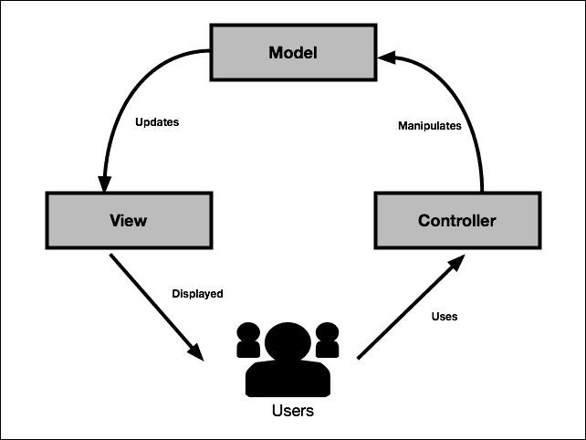

MVC 模式在从小型计算机制造商的世界中脱颖而出，并在 Ruby on Rails 框架中落地后变得非常流行。

架构模式具有三个层次：

+   **模型**：这包括应用程序所知道的数据的各种表示形式。

+   **视图**：这是由将显示给用户的几个数据表示形式组成的。

+   **控制器**：这是应用程序中处理用户交互的部分。它是模型和视图之间的桥梁。

MVC 背后的想法是将视图与模型解耦。模型必须是自包含的，并且对 UI 一无所知。这基本上允许相同的数据在多个视图中重用。这些视图是查看数据的不同方式。深入挖掘或使用不同的渲染器（HTML、PDF）是这一原则的良好说明。

控制器充当用户和数据之间的调解者。其角色是控制对最终用户可用的操作，并通过应用程序的不同视图进行路由。

# MVC 批评和最佳实践

虽然 MVC 仍然是设计 UI 的首选方法，但随着其普及，许多批评也随之而来。大多数批评实际上是指向了模式的错误使用。

## 贫血型领域模型

埃里克·埃文斯的具有影响力的书籍《领域驱动设计》，也简称为**DDD**，定义了一套架构规则，这些规则有助于在代码内部更好地整合业务领域。

核心思想之一是利用领域对象内的面向对象范式。违反这一原则有时被称为**贫血领域模型**。关于这个问题的良好定义可以在 Martin Fowler 的博客上找到（[`www.martinfowler.com/bliki/AnemicDomainModel.html`](http://www.martinfowler.com/bliki/AnemicDomainModel.html)）。

贫血模型通常表现出以下症状：

+   模型由非常简单的**普通 Java 对象**（**POJO**s）构成，仅包含 getter 和 setter 方法

+   所有业务逻辑都在服务层内部处理

+   模型的验证位于模型外部，例如，在控制器中

这可能取决于您的业务领域的复杂性，可能是一种不良实践。一般来说，DDD 实践需要额外的努力来隔离领域与应用逻辑。

架构总是需要权衡。值得注意的是，典型的 Spring 应用程序设计方式可能会导致维护过程中的复杂化。

如何避免领域贫血在这里解释：

+   服务层适合于应用级别的抽象，如事务处理，而不是业务逻辑。

+   您的领域应该始终处于有效状态。使用验证器或 JSR-303 的验证注解在表单对象内部进行验证。

+   将输入转换为有意义的领域对象。

+   将您的数据层视为具有领域查询的存储库（例如，参考 Spring Data Specification）。

+   将您的领域逻辑与底层持久化框架解耦

+   尽可能使用真实对象。例如，操作`FirstName`类而不是字符串。

DDD（领域驱动设计）远不止这些简单的规则：实体、值类型、通用语言、边界上下文、洋葱架构和反腐败层。我强烈建议您自己研究这些原则。就我们而言，在这本书中，我们将尝试在构建我们的 Web 应用程序时牢记前面列出的指南。随着我们在这本书中的进展，这些问题将变得越来越熟悉。

## 从源头学习

如果您熟悉 Spring，您可能已经访问了 Spring 的网站，[`spring.io`](http://spring.io)。它完全是用 Spring 制作的，好消息是它是开源的。

项目的代码名称是 sagan。它具有许多有趣的功能：

+   一个 Gradle 多模块项目

+   安全集成

+   Github 集成

+   Elasticsearch 集成

+   一个 JavaScript 前端应用程序

与项目相关的 GitHub wiki 非常详细，这将帮助您轻松开始项目。

### 注意

如果您对 Spring 真实世界应用程序的架构感兴趣，请访问以下 URL：

[`github.com/spring-io/sagan`](https://github.com/spring-io/sagan)

# Spring MVC 1-0-1

在 Spring MVC 中，模型是 Spring MVC 的`Model`或`ModelAndView`类封装的一个简单映射。它可以从数据库、文件、外部服务等来源。如何获取数据并将其放入模型取决于你。与数据层交互的推荐方式是通过 Spring Data 库：Spring Data JPA、Spring Data MongoDB 等。与 Spring Data 相关联的项目有数十个，我鼓励你查看[`projects.spring.io/spring-data`](http://projects.spring.io/spring-data)。

Spring MVC 的控制器端通过使用`@Controller`注解来处理。在 Web 应用程序中，控制器的作用是对 HTTP 请求做出响应。带有`@Controller`注解的类将被 Spring 拾取并有机会处理即将到来的请求。

通过`@RequestMapping`注解，控制器根据其 HTTP 方法（例如`GET`或`POST`方法）和 URL 声明处理特定请求。然后控制器决定是直接在 Web 响应中写入内容还是将应用程序路由到视图并将属性注入到该视图中。

一个纯 RESTful 应用程序会选择第一种方法，并通过`@ResponseBody`注解直接在 HTTP 响应中暴露模型的 JSON 或 XML 表示。在 Web 应用程序的情况下，这种类型的架构通常与一个前端 JavaScript 框架相关联，例如 Backbone.js、AngularJS 或 React。在这种情况下，Spring 应用程序将只处理 MVC 模型中的模型层。我们将在第四章*文件上传和错误处理*中研究这种类型的架构。

在第二种方法中，模型被传递到视图，由模板引擎渲染，然后写入响应。

这种视图通常与模板方言相关联，这将允许在模型内部进行导航。流行的模板方言包括 JSPs、FreeMarker 或 Thymeleaf。

混合方法可以利用模板引擎与应用程序的一些方面进行交互，然后将视图层委托给前端框架。

# 使用 Thymeleaf

Thymeleaf 是一个模板引擎，得到了 Spring 社区的特别关注。

它的成功主要归功于其友好的语法（几乎看起来像 HTML）以及它易于扩展。

可用的各种扩展已集成到 Spring Boot 中：

| 支持 | 依赖 |
| --- | --- |
| 布局 | `nz.net.ultraq.thymeleaf:thymeleaf-layout-dialect` |
| HTML5 data-*属性 | `com.github.mxab.thymeleaf.extras:thymeleaf-extras-data-attribute` |
| Internet Explorer 条件注释 | `org.thymeleaf.extras:thymeleaf-extras-conditionalcomments` |
| 对 Spring 安全性的支持 | `org.thymeleaf.extras:thymeleaf-extras-springsecurity3` |

可以在 [`www.thymeleaf.org/doc/tutorials/2.1/thymeleafspring.html`](http://www.thymeleaf.org/doc/tutorials/2.1/thymeleafspring.html) 找到关于 Thymeleaf 与 Spring 集成的非常好的教程。

不再拖延，让我们添加 `spring-boot-starter-thymeleaf` 依赖项以启动 thymeleaf 模板引擎：

```java
buildscript {
    ext {
        springBootVersion = '1.2.5.RELEASE'
    }
    repositories {
        mavenCentral()
    }
    dependencies {
        classpath("org.springframework.boot:spring-boot-gradle-plugin:${springBootVersion}") 
        classpath("io.spring.gradle:dependency-management-plugin:0.5.1.RELEASE")
    }
}

apply plugin: 'java'
apply plugin: 'eclipse'
apply plugin: 'idea'
apply plugin: 'spring-boot' 
apply plugin: 'io.spring.dependency-management' 

jar {
    baseName = 'masterSpringMvc'
    version = '0.0.1-SNAPSHOT'
}
sourceCompatibility = 1.8
targetCompatibility = 1.8

repositories {
    mavenCentral()
}

dependencies {
    compile 'org.springframework.boot:spring-boot-starter-web'
    compile 'org.springframework.boot:spring-boot-starter-thymeleaf'
    testCompile 'org.springframework.boot:spring-boot-starter-test'
}

eclipse {
    classpath {
         containers.remove('org.eclipse.jdt.launching.JRE_CONTAINER')
         containers 'org.eclipse.jdt.launching.JRE_CONTAINER/org.eclipse.jdt.internal.debug.ui.launcher.StandardVMType/JavaSE-1.8'
    }
}

task wrapper(type: Wrapper) {
    gradleVersion = '2.3'
}
```

## 我们的第一个页面

现在我们将向我们的应用程序添加第一个页面。它将位于 `src/main/resources/templates`。让我们称这个文件为 `resultPage.html`：

```java
<!DOCTYPE html>
<html >
<head lang="en">
    <meta charset="UTF-8"/>
    <title>Hello thymeleaf</title>
</head>
<body>
    <span th:text="|Hello thymeleaf|">Hello html</span>
</body>
</html>
```

我们可以从一开始就看到 Thymeleaf 与 html 完美集成，其语法几乎感觉自然。

`th:text` 的值放在管道之间。这意味着文本内的所有值都将连接起来。

起初可能有些不自然，但在实践中，我们的页面中很少会硬编码文本；因此，Thymeleaf 在这里做出了有见地的设计决策。

Thymeleaf 对网页设计师来说有一个很大的优势：模板内部的所有动态内容，在没有服务器运行的情况下打开时，都可以回退到默认值。资源 URL 可以指定为相对路径，并且每个标记都可以包含占位符。在我们的上一个例子中，当视图在我们的应用程序上下文中渲染时，文本 "Hello html" 不会显示，但如果直接用网页浏览器打开文件，则会显示。

为了加快开发速度，将此属性添加到您的 `application.properties` 文件中：

```java
spring.thymeleaf.cache=false
```

这将禁用视图缓存，并导致每次访问模板时都会重新加载。

当然，当我们进入生产环境时，需要禁用此设置。我们将在 第八章 中看到这一点，*优化您的请求*。

### 小贴士

**重新加载视图**

禁用缓存后，只需使用 eclipse 保存您的视图或使用 IntelliJ 中的 `Build > Make Project` 操作来在更改后刷新视图。

最后，我们需要修改我们的 `HelloController` 类。它现在必须路由到我们刚刚创建的视图，而不是显示纯文本。为了完成这个任务，我们将移除 `@ResponseBody` 注解。这样做并返回一个字符串将告诉 Spring MVC 将此字符串映射到视图名称，而不是直接在响应中显示特定的模型。

现在我们来看看我们的控制器现在是什么样子：

```java
@Controller
public class HelloController {

    @RequestMapping("/")
    public String hello() {
        return "resultPage";
    }
}
```

在这个例子中，控制器将用户重定向到视图名称 `resultPage`。然后 `ViewResolver` 接口将此名称与我们的页面关联。

让我们再次启动我们的应用程序并转到 `http://localhost:8080`。

您将看到以下页面：

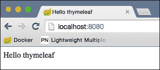

# Spring MVC 架构

让我们从这个精彩的 "Hello World" 新功能中退一步，试图理解我们的网络应用程序内部发生了什么。为此，我们将回顾浏览器发送的 HTTP 请求和从服务器收到的响应的旅程。

## DispatcherServlet

每个 Spring Web 应用程序的入口点是`DispatcherServlet`。以下图展示了 Dispatcher Servlet 架构：


这仍然是一个经典的`HttpServlet`类，它将 HTTP 请求分派到`HandlerMapping`。**HandlerMapping**是资源（URL）和控制器之间的关联。

然后在控制器上调用适当的带有`@RequestMapping`注解的方法。在这个方法中，控制器设置模型数据，并将视图名称返回给分派器。

然后，`DispatcherServlet`将查询`ViewResolver`接口以找到视图的相应实现。

在我们的情况下，`ThymeleafAutoConfiguration`类已经为我们设置了视图解析器。

你可以在`ThymeleafProperties`类中看到，我们视图的默认前缀是`classpath:/templates/`，默认后缀是`.html`。

这意味着，给定视图名称`resultPage`，视图解析器将在我们的类路径的模板目录中查找名为`resultPage.html`的文件。

在我们的应用程序中，我们的`ViewResolver`接口是静态的，但更高级的实现可以根据请求头或用户的区域设置返回不同的结果。

视图最终将被渲染，并将结果写入响应。

## 传递数据到视图

我们的第一页完全是静态的；它并没有真正利用 Spring MVC 的强大功能。让我们稍微加点料。如果“Hello World”字符串不是硬编码的，而是来自服务器会怎样呢？

你会说这仍然是一个蹩脚的“Hello World”吗？是的，但它将打开更多的可能性。让我们将我们的`resultPage.html`文件更改为显示来自模型的消息：

```java
<!DOCTYPE html>
<html >
<head lang="en">
    <meta charset="UTF-8"/>
    <title>Hello thymeleaf</title>
</head>
<body>
    <span th:text="${message}">Hello html</span>
</body>
</html>
```

然后，让我们修改我们的控制器，使其将此消息放入此模型中：

```java
@Controller
public class HelloController {

    @RequestMapping("/")
    public String hello(Model model) {
        model.addAttribute("message", "Hello from the controller");
        return "resultPage";
    }
}
```

我知道，这种悬念正在折磨你！让我们看看`http://localhost:8080`看起来像什么。

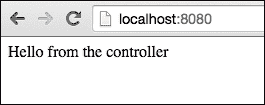

首先要注意的是，我们向控制器的方法传递了一个新的参数，并且`DispatcherServlet`为我们提供了正确的对象。实际上，有许多对象可以被注入到控制器的方法中，例如`HttpRequest`或`HttpResponse`，`Locale`，`TimeZone`和`Principal`，它们代表一个认证用户。此类对象的完整列表可在文档中找到，文档位于[`docs.spring.io/spring/docs/current/spring-framework-reference/html/mvc.html#mvc-ann-arguments`](http://docs.spring.io/spring/docs/current/spring-framework-reference/html/mvc.html#mvc-ann-arguments)。

# Spring 表达式语言

当使用`${}`语法时，实际上你正在使用**Spring 表达式语言**（**SpEL**）。在野外有几种可用的 EL 变体；SpEl 是其中最强大的变体之一。

这里是其主要功能的概述：

| 功能 | 语法 | 说明 |
| --- | --- | --- |
| 访问列表元素 | `list[0]` |   |
| 访问映射条目 | `map[key]` |   |
| 三元运算符 | `condition ? 'yes' : 'no'` |   |
| 爱丽丝运算符 | `person ?: default` | 如果 person 的值为 null，则返回 `default` |
| 安全导航 | `person?.name` | 如果 person 或她的名字为 null，则返回 `null` |
| 模板 | `'Your name is #{person.name}'` | 将值注入到字符串中 |
| 投影 | `${persons.![name]}` | 提取所有人员的姓名并将它们放入列表中 |
| 选择 | `persons.?[name == 'Bob']'` | 在列表中检索名为 Bob 的人 |
| 函数调用 | `person.sayHello()` |   |

### 注意

对于完整的参考，请查看 [`docs.spring.io/spring/docs/current/spring-framework-reference/html/expressions.html`](http://docs.spring.io/spring/docs/current/spring-framework-reference/html/expressions.html) 中的手册。

SpEl 的使用不仅限于视图。您还可以在 Spring 框架的各个地方使用它，例如，当使用 `@Value` 注解在 bean 中注入属性时。

## 使用请求参数获取数据

我们能够在视图中显示来自服务器的数据。然而，如果我们想从用户那里获取输入呢？使用 HTTP 协议，有多种方法可以做到这一点。最简单的方法是将查询参数传递给我们的 URL。

### 注意

**查询参数**

您当然知道查询参数。它们位于 URL 中的 `?` 字符之后。它们由一个由 & 符号（和号）分隔的名称和值列表组成，例如，`page?var1=value1&var2=value2`。

我们可以利用这项技术来请求用户的姓名。让我们再次修改我们的 `HelloController` 类：

```java
@Controller
public class HelloController {

    @RequestMapping("/")
    public String hello(@RequestParam("name") String userName, Model model) {
        model.addAttribute("message", "Hello, " + userName);
        return "resultPage";
    }
}
```

如果我们导航到 `localhost:8080/?name=Geoffroy`，我们可以看到以下内容：

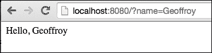

默认情况下，请求参数是必需的。这意味着如果我们导航到 `localhost:8080`，我们会看到一个错误消息。

通过查看 `@RequestParam` 代码，我们可以看到除了值参数外，还有两个可能的属性：`required` 和 `defaultValue`。

因此，我们可以更改我们的代码并指定参数的默认值或指示它不是必需的：

```java
@Controller
public class HelloController {

    @RequestMapping("/")
    public String hello(@RequestParam(defaultValue = "world") String name, Model model) {
        model.addAttribute("message", "Hello, " + name);
        return "resultPage";
    }
}
```

### 小贴士

在 Java 8 中，可以不指定值参数。在这种情况下，注解方法参数的名称将被使用。

# 足够的 "Hello World"，让我们获取推文！

好吧，这本书的名字并不是 "Mastering Hello Worlds"。使用 Spring，查询 Twitter 的 API 真的很简单。

## 注册您的应用程序

在开始之前，您必须在 Twitter 开发者控制台中注册您的应用程序。

前往 [`apps.twitter.com`](https://apps.twitter.com) 并创建一个新的应用程序。

给它您喜欢的名字。在网站和回调 URL 部分，只需输入 `http://127.0.0.1:8080`。这将允许您在本地机器上测试您的开发中的应用程序。

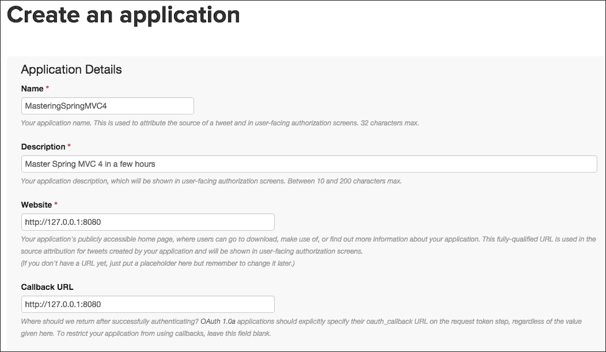

现在，导航到密钥，访问令牌，并复制**消费者密钥**和**消费者密钥**。我们稍后会使用这些。看看下面的截图：

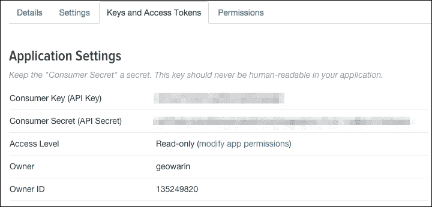

默认情况下，我们的应用程序只有只读权限。这对我们的应用程序来说已经足够了，但如果你愿意，可以对其进行调整。

## 设置 Spring Social Twitter

我们将在`build.gradle`文件中添加以下依赖项：

```java
compile 'org.springframework.boot:spring-boot-starter-social-twitter'
```

### 注意

**Spring Social**是一组提供访问各种社交网络公共 API 的项目。Spring Boot 默认提供了与 Twitter、Facebook 和 LinkedIn 的集成。Spring Social 总共有大约 30 个项目，可以在[`projects.spring.io/spring-social/`](http://projects.spring.io/spring-social/)找到。

将以下两行添加到`application.properties`中：

```java
spring.social.twitter.appId= <Consumer Key>
spring.social.twitter.appSecret= <Consumer Secret>
```

这些是我们刚刚创建的应用程序关联的键。

你将在第六章*保护你的应用程序*中了解更多关于 OAuth 的内容。现在，我们只需使用这些凭据代表我们的应用程序向 Twitter 的 API 发出请求。

## 访问 Twitter

现在，我们可以在控制器中使用 Twitter 了。让我们将其名称更改为`TweetController`，以更好地反映其新的职责：

```java
@Controller
public class HelloController {

    @Autowired
    private Twitter twitter;

    @RequestMapping("/")
    public String hello(@RequestParam(defaultValue = "masterSpringMVC4") String search, Model model) {
        SearchResults searchResults = twitter.searchOperations().search(search);
        String text = searchResults.getTweets().get(0).getText();
        model.addAttribute("message", text);
        return "resultPage";
    }
}
```

如你所见，代码正在搜索与请求参数匹配的推文。如果一切顺利，你将在屏幕上看到第一条推文的内容：

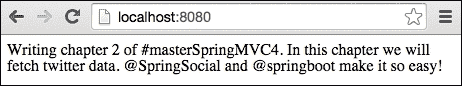

当然，如果搜索没有产生任何结果，我们笨拙的代码将因`ArrayOutOfBoundException`而失败。所以，不要犹豫，发推文解决问题！

如果我们想显示推文列表呢？让我们修改`resultPage.html`文件：

```java
<!DOCTYPE html>
<html >
<head lang="en">
    <meta charset="UTF-8"/>
    <title>Hello twitter</title>
</head>
<body>
    <ul>
 <li th:each="tweet : ${tweets}" th:text="${tweet}">Some tweet</li>
 </ul>
</body>
</html>
```

### 注意

`th:each`是 Thymeleaf 中定义的一个标签，允许它遍历集合，并在循环中将每个值分配给变量。

我们还需要更改我们的控制器：

```java
@Controller
public class TweetController {

    @Autowired
    private Twitter twitter;

    @RequestMapping("/")
    public String hello(@RequestParam(defaultValue = "masterSpringMVC4") String search, Model model) {
        SearchResults searchResults = twitter.searchOperations().search(search);
        List<String> tweets =
 searchResults.getTweets()
 .stream()
 .map(Tweet::getText)
 .collect(Collectors.toList());
 model.addAttribute("tweets", tweets);
        return "resultPage";
    }
}
```

注意，我们正在使用 Java 8 流来收集推文中的消息。`Tweet`类包含许多其他属性，如发送者、转发次数等。然而，我们现在将保持简单，如下面的截图所示：

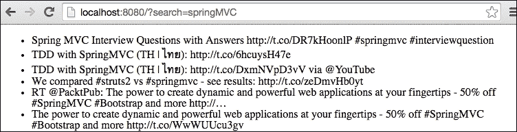

# Java 8 流和 lambda

你可能还不熟悉 lambda 表达式。在 Java 8 中，每个集合都有一个默认方法`stream()`，它提供了对函数式操作方式的访问。

这些操作可以是返回流的中间操作，从而允许链式调用，或者返回值的终端操作。

最著名的中间操作如下：

+   `map`: 将方法应用于列表中的每个元素，并返回结果列表

+   `filter`: 返回匹配谓词的每个元素的列表

+   `reduce`: 使用操作和累加器将列表投影为一个单一值

Lambda 是函数表达式的简写语法。它们可以被强制转换为只有一个抽象方法的 Single Abstract Method，一个只有一个函数的接口。

例如，你可以这样实现`Comparator`接口：

```java
Comparator<Integer> c = (e1, e2) -> e1 - e2;
```

在 lambda 表达式中，返回关键字隐式地是其最后一个表达式。

我们之前使用的双冒号运算符是获取类上函数引用的快捷方式，

```java
Tweet::getText
```

前面的内容等同于以下内容：

```java
(Tweet t) -> t.getText()
```

`collect`方法允许我们调用一个终端操作。`Collectors`类是一组终端操作，将结果放入列表、集合或映射中，允许分组、连接等。

调用`collect(Collectors.toList())`方法将生成一个包含流中每个元素的列表；在我们的案例中，是推文名称。

# 使用 WebJars 的材料设计

我们的应用程序已经很好了，但在美学方面还有很多需要改进的地方。你可能听说过材料设计。这是谷歌对扁平化设计的看法。

我们将使用 Materialize（[`materializecss.com`](http://materializecss.com)），一个看起来很棒的响应式 CSS 和 JavaScript 库，就像 Bootstrap 一样。

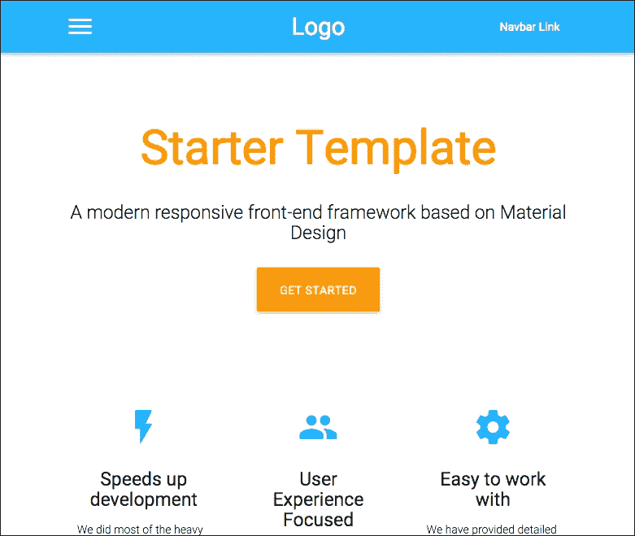

我们在第一章中谈到了 WebJars，*快速设置 Spring Web 应用程序*；我们现在将使用它们。将 jQuery 和 Materialize CSS 添加到我们的依赖项中：

```java
compile 'org.webjars:materializecss:0.96.0'
compile 'org.webjars:jquery:2.1.4'
```

WebJar 的组织方式是完全标准化的。你将在`/webjars/{lib}/{version}/*.js`中找到任何库的 JS 和 CSS 文件。

例如，要将 jQuery 添加到我们的页面中，可以在网页中添加以下内容：

```java
<script src="img/jquery.js"></script>
```

让我们修改我们的控制器，使其给我们一个所有推文对象的列表，而不是简单的文本：

```java
package masterSpringMvc.controller;

import org.springframework.beans.factory.annotation.Autowired;
import org.springframework.social.twitter.api.SearchResults;
import org.springframework.social.twitter.api.Tweet;
import org.springframework.social.twitter.api.Twitter;
import org.springframework.stereotype.Controller;
import org.springframework.ui.Model;
import org.springframework.web.bind.annotation.RequestMapping;
import org.springframework.web.bind.annotation.RequestParam;

import java.util.List;

@Controller
public class TweetController {

    @Autowired
    private Twitter twitter;

    @RequestMapping("/")
    public String hello(@RequestParam(defaultValue = "masterSpringMVC4") String search, Model model) {
        SearchResults searchResults = twitter.searchOperations().search(search);
        List<Tweet> tweets = searchResults.getTweets();
        model.addAttribute("tweets", tweets);
        model.addAttribute("search", search);
        return "resultPage";
    }
}
```

让我们在视图中包含 materialize CSS：

```java
<!DOCTYPE html>
<html >
<head lang="en">
    <meta charset="UTF-8"/>
    <title>Hello twitter</title>

    <link href="/webjars/materializecss/0.96.0/css/materialize.css" type="text/css" rel="stylesheet" media="screen,projection"/>
</head>
<body>
<div class="row">

    <h2 class="indigo-text center" th:text="|Tweet results for ${search}|">Tweets</h2>

    <ul class="collection">
        <li class="collection-item avatar" th:each="tweet : ${tweets}">
            
            <span class="title" th:text="${tweet.user.name}">Username</span>
            <p th:text="${tweet.text}">Tweet message</p>
        </li>
    </ul>

</div>

<script src="img/jquery.js"></script>
<script src="img/materialize.js"></script>
</body>
</html>
```

结果看起来已经好多了！

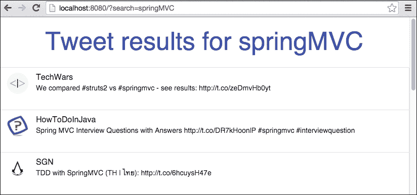

## 使用布局

我们最不想做的事情是将我们 UI 的可重用块放入模板中。为此，我们将使用`thymeleaf-layout-dialect`依赖项，它包含在我们的项目`spring-boot-starter-thymeleaf`依赖项中。

我们将在`src/main/resources/templates/layout`中创建一个名为`default.html`的新文件。它将包含我们将从页面到页面重复的代码：

```java
<!DOCTYPE html>
<html 
      >
<head>
    <meta http-equiv="Content-Type" content="text/html; charset=UTF-8"/>
    <meta name="viewport" content="width=device-width, initial-scale=1, maximum-scale=1.0, user-scalable=no"/>
    <title>Default title</title>

    <link href="/webjars/materializecss/0.96.0/css/materialize.css" type="text/css" rel="stylesheet" media="screen,projection"/>
</head>
<body>

<section layout:fragment="content">
    <p>Page content goes here</p>
</section>

<script src="img/jquery.js"></script>
<script src="img/materialize.js"></script>
</body>
</html>
```

我们现在将修改`resultPage.html`文件，使其使用布局，这将简化其内容：

```java
<!DOCTYPE html>
<html 

      layout:decorator="layout/default">
<head lang="en">
    <title>Hello twitter</title>
</head>
<body>
<div class="row" layout:fragment="content">

    <h2 class="indigo-text center" th:text="|Tweet results for ${search}|">Tweets</h2>

    <ul class="collection">
        <li class="collection-item avatar" th:each="tweet : ${tweets}">
            
            <span class="title" th:text="${tweet.user.name}">Username</span>

            <p th:text="${tweet.text}">Tweet message</p>
        </li>
    </ul>
</div>
</body>
</html>
```

`layout:decorator="layout/default"`将指示我们的布局在哪里。然后我们可以将内容注入布局的不同`layout:fragment`部分。请注意，每个模板都是有效的 HTML 文件。你也可以很容易地覆盖标题。

## 导航

我们有一个很好的小推文显示应用程序，但我们的用户应该如何知道他们需要提供一个“搜索”请求参数呢？

如果我们在应用程序中添加一个小表单会很好。

让我们做点这样的事情：

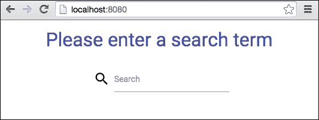

首先，我们需要修改我们的`TweetController`以向我们的应用程序添加第二个视图。搜索页面将直接位于我们应用程序的根目录，当在`search`字段中按下回车键时，将显示结果页面：

```java
@Controller
public class TweetController {

    @Autowired
    private Twitter twitter;

    @RequestMapping("/")
    public String home() {
        return "searchPage";
    }

    @RequestMapping("/result")
    public String hello(@RequestParam(defaultValue = "masterSpringMVC4") String search, Model model) {
        SearchResults searchResults = twitter.searchOperations().search(search);
        List<Tweet> tweets = searchResults.getTweets();
        model.addAttribute("tweets", tweets);
        model.addAttribute("search", search);
        return "resultPage";
    }
}
```

我们将在`templates`文件夹中添加另一个页面，名为`searchPage.html`文件。它将包含一个简单的表单，通过`get`方法将搜索词传递到结果页面：

```java
<!DOCTYPE html>
<html 

      layout:decorator="layout/default">
<head lang="en">
    <title>Search</title>
</head>
<body>

<div class="row" layout:fragment="content">

    <h4 class="indigo-text center">Please enter a search term</h4>

    <form action="/result" method="get" class="col s12">
        <div class="row center">
            <div class="input-field col s6 offset-s3">
                <i class="mdi-action-search prefix"></i>
                <input id="search" name="search" type="text" class="validate"/>
                <label for="search">Search</label>
            </div>
        </div>
    </form>
</div>

</body>
</html>
```

这非常简单的 HTML，并且工作得很好。你现在可以尝试一下。

如果我们想要禁止某些搜索结果怎么办？比如说，我们想在用户输入`struts`时显示一个错误信息。

实现这一点最好的方法是将表单修改为提交数据。在控制器中，我们可以拦截所提交的内容并相应地实现这个业务规则。

首先，我们需要更改`searchPage`中的表单，如下所示：

```java
<form action="/result" method="get" class="col s12">
```

现在，我们将表单改为如下所示：

```java
<form action="/postSearch" method="post" class="col s12">
```

我们还需要在服务器上处理这个 POST 请求。向`TweetController`添加此方法：

```java
@RequestMapping(value = "/postSearch", method = RequestMethod.POST)
public String postSearch(HttpServletRequest request,
    RedirectAttributes redirectAttributes) {
        String search = request.getParameter("search");
        redirectAttributes.addAttribute("search", search);
        return "redirect:result";
}
```

这里有几个新特性：

+   在请求映射注解中，我们指定我们想要处理的 HTTP 方法，即`POST`。

+   我们直接将两个属性作为方法参数注入。它们是请求和`RedirectAttributes`。

+   我们检索请求上提交的值，并将其传递给下一个视图。

+   我们不是返回视图的名称，而是将重定向到一个 URL。

`RedirectAttributes`是 Spring 模型，将专门用于在重定向场景中传播值。

### 注意

**重定向/转发**是 Java Web 应用程序中的经典选项。它们都会改变在用户浏览器上显示的视图。区别在于`Redirect`会发送一个 302 头部，这将触发浏览器内的导航，而`Forward`则不会导致 URL 改变。在 Spring MVC 中，你可以通过在方法返回字符串前加上`redirect:`或`forward:`来使用这两个选项中的任何一个。在两种情况下，你返回的字符串都不会像我们之前看到的那样解析为一个视图，而是会触发导航到特定的 URL。

之前的例子有点牵强，我们将在下一章看到更智能的表单处理。如果你在`postSearch`方法中设置断点，你会看到它会在我们的表单 POST 之后立即被调用。

那么，错误信息怎么办呢？

让我们修改`postSearch`方法：

```java
@RequestMapping(value = "/postSearch", method = RequestMethod.POST)
public String postSearch(HttpServletRequest request,
    RedirectAttributes redirectAttributes) {
        String search = request.getParameter("search");
        if (search.toLowerCase().contains("struts")) {
                redirectAttributes.addFlashAttribute("error", "Try using spring instead!");
                return "redirect:/";
        }
        redirectAttributes.addAttribute("search", search);
        return "redirect:result";
}
```

如果用户的搜索词包含“struts”，我们将它们重定向到`searchPage`，并使用闪存属性添加一条小错误信息。

这些特殊的属性仅在请求期间存在，页面刷新后会消失。当我们使用`POST-REDIRECT-GET`模式时，这非常有用，正如我们刚才所做的那样。

我们需要在`searchPage`结果中显示这条信息：

```java
<!DOCTYPE html>
<html 

      layout:decorator="layout/default">
<head lang="en">
    <title>Search</title>
</head>
<body>

<div class="row" layout:fragment="content">

    <h4 class="indigo-text center">Please enter a search term</h4>

 <div class="col s6 offset-s3">
 <div id="errorMessage" class="card-panel red lighten-2" th:if="${error}">
 <span class="card-title" th:text="${error}"></span>
 </div>

        <form action="/postSearch" method="post" class="col s12">
            <div class="row center">
                <div class="input-field">
                    <i class="mdi-action-search prefix"></i>
                    <input id="search" name="search" type="text" class="validate"/>
                    <label for="search">Search</label>
                </div>
            </div>
        </form>
    </div>
</div>

</body>
</html>
```

现在，如果用户尝试搜索“struts2”推文，他们将得到一个有用且适当的答案：

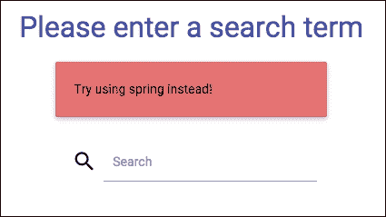

# 检查点

在本章结束时，你应该有一个控制器，即`TweetController`，它处理搜索以及位于`src/main/java`目录中的未修改的生成配置类`MasterSpringMvcApplication`：

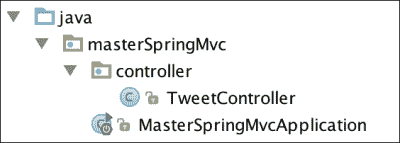

在`src/main/resources`目录中，你应该有一个默认布局和两个使用该布局的页面。

在`application.properties`文件中，我们添加了 Twitter 应用程序凭据以及一个属性，告诉 Spring 不要缓存模板以简化开发：

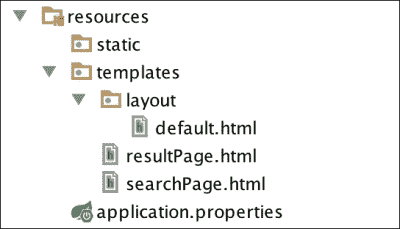

# 摘要

在本章中，你学习了如何构建一个好的 MVC 架构。我们看到了 Spring MVC 的一些内部工作原理，并且使用 Spring Social Twitter 时配置非常少。现在，多亏了 WebJars，我们可以设计一个漂亮的 Web 应用程序。

在下一章中，我们将要求用户填写他们的个人资料，这样我们就可以自动获取他们可能喜欢的推文。这将为你提供学习更多关于表单、格式化、验证和国际化的机会。
