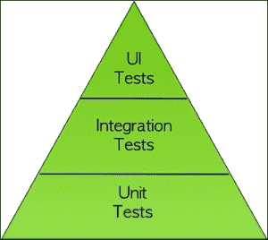
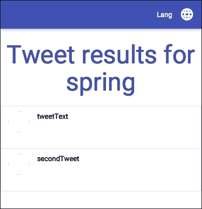
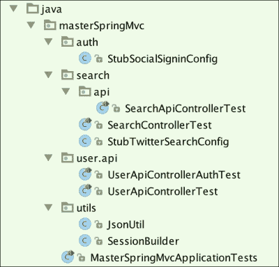
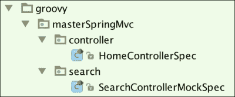
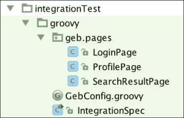

# 第七章。别把希望寄托在运气上——单元测试和验收测试

在本章中，我们将了解为什么以及如何对我们的应用程序进行测试。我们将了解单元测试和验收测试之间的区别，并学习如何进行这两种测试。

本章分为两部分。在第一部分，我们将学习不同的测试方法的同时，用 Java 编写测试。在第二部分，这部分较短，我们将用 Groovy 编写完全相同的测试，并看看我们如何利用这种出色的语言提高代码的可读性。

如果你完成本章的所有内容，你将面临双重测试，所以请随意保留对你来说最易读的测试。

# 为什么我应该测试我的代码？

在 Java 世界中工作使许多开发者意识到了测试的重要性。一套好的测试可以尽早捕捉回归，并使我们发布产品时更有信心。

现在很多人已经熟悉了持续集成（[`www.thoughtworks.com/continuous-integration`](http://www.thoughtworks.com/continuous-integration)）的概念。这是一种实践，其中服务器负责在源代码控制系统上每次更改时构建应用程序。

构建应该尽可能快，并且能够自我测试。这种实践的主要思想是获得快速的反馈循环；你应该在系统中的某个部分出错时立即获得有关出错详情。

你为什么要关心？毕竟，测试你的应用程序是一种额外的成本；设计和维护测试所花费的时间必然会占用一些开发时间。

实际上，发现的错误越晚，成本越高。如果你这么想，即使是由你的 QA 团队发现的错误，其成本也开始超过你自己发现的错误。它迫使你回到编写代码时的上下文：我为什么要写这一行？那个函数的潜在业务规则是什么？

如果你早期编写测试，并且能够在几秒钟内启动它们，那么解决代码中潜在错误的成本肯定会更低。

测试的另一个好处是它们充当了代码的活文档。虽然编写广泛的文档，甚至代码注释，可能会证明是无效的，因为它们很容易过时，但养成编写良好测试以限制情况或意外行为的习惯将作为未来的安全网。

这行代码是做什么用的？你是否曾发现自己提出过这类问题？好吧，如果你有一套好的单元测试，你只需移除它并看看什么会出错！测试给了我们对代码和重构能力的空前信心。软件非常脆弱。如果你不再关心，它将慢慢腐烂并死亡。

要负责任——不要让你的代码死亡！

# 我应该如何测试我的代码？

我们可以在软件上执行不同类型的测试，例如安全测试、性能测试等。作为开发者，我们将专注于我们可以自动化并且有助于改进我们代码的测试。

测试分为两大类：单元测试和验收测试。测试金字塔（[`martinfowler.com/bliki/TestPyramid.html`](http://martinfowler.com/bliki/TestPyramid.html)）显示了这些测试应该以何种比例编写：



在金字塔的底部，是单元测试（启动快且相对容易维护），在顶部是 UI 测试（成本更高且执行速度更慢）。集成测试位于中间：它们可以被视为大型单元测试，具有单元之间的复杂交互。

金字塔的理念是提醒你将重点放在你影响最大和获得最佳反馈循环的地方。

# 测试驱动开发

许多开发者养成了健康的习惯，即**测试驱动开发**（**TDD**）。这种做法，源自极限编程（XP），是将每个开发阶段拆分成小步骤，并为每个步骤编写一个失败的测试。你进行必要的修改，以便测试再次通过（测试为绿色）。只要测试保持绿色，你就可以重构代码。以下图示说明了 TDD 周期：


你可以迭代，直到功能完成，具有非常短的反馈循环，没有回归的保险，以及保证你写的所有代码从一开始就被测试。

TDD 受到了一些批评。其中最有趣的是这些：

+   编写测试所需的时间比实际实现的时间要多

+   这可能导致设计不良的应用程序

事实上，成为一名优秀的 TDD 实践者需要时间。一旦你掌握了应该测试什么的感觉，并且足够熟悉你的工具，你将不会浪费太多时间。

使用 TDD（或任何其他方法）构建具有适当设计的应用程序也需要经验丰富的开发者。如果你陷入“小步骤”的咒语而忘记了看大局，设计不良可能是 TDD 的副作用。诚然，TDD 不会神奇地导致优秀应用程序的设计，所以请小心，并在完成每个功能后记得退一步思考。

从本书开始，我们的代码中只有一个自动生成的单元测试。这是不好的！我们没有遵循良好的实践。本章就是为了解决这个问题而存在的。

# 单元测试

我们可以编写的较低级别的测试被称为单元测试。它们应该测试一小部分代码，因此有“单元”这一概念。你如何定义一个单元取决于你；它可以是类或是一组紧密相关的类。定义这一概念将决定什么将被模拟（用假对象替换）。你打算用轻量级替代品替换数据库吗？你打算替换与外部服务的交互吗？你打算模拟与测试上下文无关的行为不相关的紧密相关对象吗？

我的建议是保持平衡的方法。保持你的测试干净和快速，其他一切都会随之而来。

我很少完全模拟数据层。我倾向于使用嵌入式数据库进行测试。它们提供了一种在测试时轻松加载数据的方法。

通常，我总是出于两个原因模拟与外部服务的协作：

+   测试的速度以及在没有连接到网络的情况下运行测试的可能性

+   为了能够在与这些服务通信时测试错误情况

此外，模拟和存根之间存在微妙的区别。我们将尝试使用这两种方法来了解它们之间的关系。

## 适合工作的正确工具

测试新手面临的第一道障碍是缺乏编写相关和可维护测试的良好工具和库的知识。

我将在这里列出一些。这个列表绝对不是详尽的，但它包含了我们将要使用且与 Spring 兼容的工具：

| JUnit | 最广泛采用的 Java 测试运行器。默认由所有构建工具启动。 |
| --- | --- |
| AssertJ | 一个流畅的断言库。它比 Hamcrest 更容易使用。 |
| Mockito | 一个易于使用的模拟框架。 |
| DbUnit | 用于使用 XML 数据集模拟和断言你的数据库内容。 |
| Spock | 一个优雅的 Groovy DSL，用于以行为驱动开发（BDD）风格（Given/When/Then）编写测试。 |

Groovy 在我的测试工具集中有特殊的位置。即使你还没有准备好将 Groovy 代码投入生产，你也可以轻松地在测试中使用该语言的便利性。使用 Gradle，这非常容易做到，但我们将稍后看到。

# 验收测试

在 Web 应用程序的上下文中，“验收测试”通常指的是浏览器内、端到端测试。在 Java 世界中，Selenium 显然是最可靠和成熟的库之一。

在 JavaScript 世界中，我们可以找到其他替代品，例如 PhantomJS 或 Protractor。PhantomJS 在我们的案例中非常相关，因为有一个 WebDriver 可以在无头浏览器中运行 Selenium 测试，这将提高启动时间，并且不需要模拟 X 服务器或启动单独的 Selenium 服务器：

| Selenium 2 | 这提供了用于自动化测试的浏览器驱动程序。 |
| --- | --- |
| PhantomJS | 一个无头浏览器（没有 GUI）。可能是最快的浏览器。 |
| FluentLenium | 一个用于引导 Selenium 测试的流畅库。 |
| Geb | 一个用于执行 Selenium 测试的 Groovy 库。 |

# 我们的第一单元测试

现在是时候编写我们的第一个单元测试了。

我们将专注于编写控制器级别的测试，因为我们几乎没有业务代码或服务。编写 Spring MVC 测试的关键是我们类路径中的`org.springframework.boot:spring-boot-starter-test`依赖项。它将添加一些非常实用的库，例如这些：

+   `hamcrest`：这是 JUnit 的断言库

+   `mockito`：这是一个模拟库

+   `spring-test`：这是 Spring 测试库

我们将测试当用户还没有创建他们的个人资料时，重定向到个人资料页面的情况。

我们已经有一个自动生成的测试叫做`MasterSpringMvc4ApplicationTests`。这是可以用 Spring 测试框架编写的最基本类型的测试：它什么也不做，如果上下文无法加载，就会崩溃：

```java
@RunWith(SpringJUnit4ClassRunner.class)
@SpringApplicationConfiguration(classes = MasterSpringMvc4Application.class)
@WebAppConfiguration
public class MasterSpringMvc4ApplicationTests {

    @Test
    public void contextLoads() {
    }
}
```

我们可以删除这个测试，创建一个新的测试来确保没有个人资料的用户新建默认重定向到个人资料页面。实际上，这将测试`HomeController`类的代码，所以让我们称它为`HomeControllerTest`类，并将其放在与`HomeController`相同的包中，在`src/test/java`。所有 IDE 都有从类创建 JUnit 测试用例的快捷方式。现在就找出如何使用你的 IDE 来做这件事吧！

这里是测试：

```java
package masterSpringMvc.controller;

import masterSpringMvc.MasterSpringMvcApplication;
import org.junit.Before;
import org.junit.Test;
import org.junit.runner.RunWith;
import org.springframework.beans.factory.annotation.Autowired;
import org.springframework.boot.test.SpringApplicationConfiguration;
import org.springframework.test.context.junit4.SpringJUnit4ClassRunner;
import org.springframework.test.context.web.WebAppConfiguration;
import org.springframework.test.web.servlet.MockMvc;
import org.springframework.test.web.servlet.setup.MockMvcBuilders;
import org.springframework.web.context.WebApplicationContext;

import static org.springframework.test.web.servlet.request.MockMvcRequestBuilders.*;
import static org.springframework.test.web.servlet.result.MockMvcResultHandlers.print;
import static org.springframework.test.web.servlet.result.MockMvcResultMatchers.*;

@RunWith(SpringJUnit4ClassRunner.class)
@SpringApplicationConfiguration(classes = MasterSpringMvcApplication.class)
@WebAppConfiguration
public class HomeControllerTest {
    @Autowired
    private WebApplicationContext wac;

    private MockMvc mockMvc;

    @Before
    public void setup() {
        this.mockMvc = MockMvcBuilders.webAppContextSetup(this.wac).build();
    }

    @Test
    public void should_redirect_to_profile() throws Exception {
        this.mockMvc.perform(get("/"))
                .andDo(print())
                .andExpect(status().isFound())
                .andExpect(redirectedUrl("/profile"));
    }
}
```

我们使用`MockMvc`来模拟与 Spring 控制器的交互，而不需要 Servlet 容器的实际开销。

我们还使用了一些 Spring 提供的匹配器来断言我们的结果。它们实际上实现了 Hamcrest 匹配器。

`.andDo(print())`语句将为测试场景的请求和响应生成整洁的调试输出。如果你觉得它太冗长，可以将其注释掉。

就这些了！一开始语法有点棘手，但一个具有良好补全功能的 IDE 将能够帮助你。

现在我们想测试如果用户已经填写了他们的个人资料测试部分，我们能否将他们重定向到正确的搜索。为此，我们需要使用`MockHttpSession`类存根会话：

```java
import org.springframework.mock.web.MockHttpSession;
import masterSpringMvc.profile.UserProfileSession;

// put this test below the other one
@Test
public void should_redirect_to_tastes() throws Exception {
    MockHttpSession session = new MockHttpSession();
    UserProfileSession sessionBean = new UserProfileSession();
    sessionBean.setTastes(Arrays.asList("spring", "groovy"));
    session.setAttribute("scopedTarget.userProfileSession", sessionBean);

    this.mockMvc.perform(get("/").session(session))
        .andExpect(status().isFound())
        .andExpect(redirectedUrl("/search/mixed;keywords=spring,groovy"));
}
```

为了使测试工作，你必须将`setTastes()`设置器添加到`UserProfileSession`bean 中。

`org.springframework.mock.web`包中有许多用于 Servlet 环境的模拟工具。

注意，代表我们的 bean 在会话中的属性以`scopedTarget`为前缀。这是因为会话 bean 被 Spring 代理。因此，在 Spring 上下文中实际上有两个对象，我们定义的实际 bean 及其最终将放入会话的代理。

模拟会话是一个整洁的类，但我们可以通过一个构建器重构测试，该构建器将隐藏实现细节，并且可以在以后重用：

```java
@Test
public void should_redirect_to_tastes() throws Exception {

    MockHttpSession session = new SessionBuilder().userTastes("spring", "groovy").build();
    this.mockMvc.perform(get("/")
        .session(session))
        .andExpect(status().isFound())
        .andExpect(redirectedUrl("/search/mixed;keywords=spring,groovy"));
}
```

构建器的代码如下：

```java
public class SessionBuilder {
    private final MockHttpSession session;
    UserProfileSession sessionBean;

    public SessionBuilder() {
        session = new MockHttpSession();
        sessionBean = new UserProfileSession();
        session.setAttribute("scopedTarget.userProfileSession", sessionBean);
    }

    public SessionBuilder userTastes(String... tastes) {
        sessionBean.setTastes(Arrays.asList(tastes));
        return this;
    }

    public MockHttpSession build() {
        return session;
    }
}
```

在这次重构之后，当然你的测试应该总是通过。

# 模拟和存根

如果我们想测试由`SearchController`类处理的搜索请求，我们当然会想模拟`SearchService`。

有两种方法来做这件事：使用模拟或使用存根。

## 使用 Mockito 进行模拟

首先，我们可以使用 Mockito 创建一个模拟对象：

```java
package masterSpringMvc.search;

import masterSpringMvc.MasterSpringMvcApplication;
import org.junit.Before;
import org.junit.Test;
import org.junit.runner.RunWith;
import org.mockito.InjectMocks;
import org.mockito.Mock;
import org.mockito.MockitoAnnotations;
import org.springframework.boot.test.SpringApplicationConfiguration;
import org.springframework.test.context.junit4.SpringJUnit4ClassRunner;
import org.springframework.test.context.web.WebAppConfiguration;
import org.springframework.test.web.servlet.MockMvc;
import org.springframework.test.web.servlet.setup.MockMvcBuilders;

import java.util.Arrays;

import static org.hamcrest.Matchers.*;
import static org.mockito.Matchers.*;
import static org.mockito.Mockito.*;
import static org.springframework.test.web.servlet.request.MockMvcRequestBuilders.get;
import static org.springframework.test.web.servlet.result.MockMvcResultMatchers.*;

@RunWith(SpringJUnit4ClassRunner.class)
@SpringApplicationConfiguration(classes = MasterSpringMvcApplication.class)
@WebAppConfiguration
public class SearchControllerMockTest {
    @Mock
    private SearchService searchService;

    @InjectMocks
    private SearchController searchController;

    private MockMvc mockMvc;

    @Before
    public void setup() {
        MockitoAnnotations.initMocks(this);
        this.mockMvc = MockMvcBuilders
                .standaloneSetup(searchController)
                .setRemoveSemicolonContent(false)
                .build();
    }

    @Test
    public void should_search() throws Exception {

        when(searchService.search(anyString(), anyListOf(String.class)))
                .thenReturn(Arrays.asList(
                        new LightTweet("tweetText")
                ));

        this.mockMvc.perform(get("/search/mixed;keywords=spring"))
                .andExpect(status().isOk())
                .andExpect(view().name("resultPage"))
                .andExpect(model().attribute("tweets", everyItem(
                        hasProperty("text", is("tweetText"))
                )));

        verify(searchService, times(1)).search(anyString(), anyListOf(String.class));
    }
}
```

你可以看到，我们不是使用带有 Web 应用程序上下文的`MockMvc`来设置，而是创建了一个独立上下文。这个上下文将只包含我们的控制器。这意味着我们对控制器及其依赖的实例化和初始化有完全的控制权。这将使我们能够轻松地在控制器内部注入模拟对象。

缺点是，我们必须重新声明我们配置的一部分，比如说我们不想在分号之后删除 URL 字符。

我们使用几个 Hamcrest 匹配器来断言最终会出现在视图模型中的属性。

模拟方法有其优点，例如能够验证与模拟对象的交互并在运行时创建期望。

这也将使你的测试与对象的实际实现相关联。例如，如果你在控制器中更改了获取推文的方式，你可能会破坏与此控制器相关的测试，因为它们仍然试图模拟我们不再依赖的服务。

## 测试时存根我们的豆

另一种方法是替换我们的`SearchService`类在测试中的实现。

我们一开始有点懒惰，没有为`SearchService`定义接口。*始终面向接口编程，而不是面向实现*。这句谚语背后的智慧是“四人帮”最重要的教训之一。

控制反转的一个好处是允许我们在测试或真实系统中轻松替换我们的实现。为了使这成为可能，我们必须修改所有使用`SearchService`的地方，使用新的接口。一个好的 IDE 有一个名为“提取接口”的重构，它将做到这一点。这应该会创建一个包含我们`SearchService`类公共方法`search()`的接口：

```java
public interface TwitterSearch {
    List<LightTweet> search(String searchType, List<String> keywords);
}
```

当然，我们的两个控制器`SearchController`和`SearchApiController`现在必须使用接口而不是实现。

现在，我们有能力为`TwitterSearch`类创建一个专门针对测试用例的测试双胞胎。为了使这成为可能，我们需要声明一个新的 Spring 配置，名为`StubTwitterSearchConfig`，它将包含`TwitterSearch`的另一个实现。我将它放在了搜索包中，紧挨着`SearchControllerMockTest`：

```java
package masterSpringMvc.search;

import org.springframework.context.annotation.Bean;
import org.springframework.context.annotation.Configuration;
import org.springframework.context.annotation.Primary;

import java.util.Arrays;

@Configuration
public class StubTwitterSearchConfig {
    @Primary @Bean
    public TwitterSearch twitterSearch() {
        return (searchType, keywords) -> Arrays.asList(
                new LightTweet("tweetText"),
                new LightTweet("secondTweet")
        );
    }
}
```

在这个配置类中，我们重新声明了带有`@Primary`注解的`TwitterSearch`豆，这将告诉 Spring 如果类路径中找到其他实现，则优先使用这个实现。

由于`TwitterSearch`接口只包含一个方法，我们可以使用 lambda 表达式来实现它。

这里是使用我们的`StubConfiguration`类以及带有`SpringApplicationConfiguration`注解的主要配置的完整测试：

```java
package masterSpringMvc.search;

import masterSpringMvc.MasterSpringMvcApplication;
import org.junit.Before;
import org.junit.Test;
import org.junit.runner.RunWith;
import org.springframework.beans.factory.annotation.Autowired;
import org.springframework.boot.test.SpringApplicationConfiguration;
import org.springframework.test.context.junit4.SpringJUnit4ClassRunner;
import org.springframework.test.context.web.WebAppConfiguration;
import org.springframework.test.web.servlet.MockMvc;
import org.springframework.test.web.servlet.setup.MockMvcBuilders;
import org.springframework.web.context.WebApplicationContext;

import static org.hamcrest.Matchers.*;
import static org.springframework.test.web.servlet.request.MockMvcRequestBuilders.get;
import static org.springframework.test.web.servlet.result.MockMvcResultMatchers.*;

@RunWith(SpringJUnit4ClassRunner.class)
@SpringApplicationConfiguration(classes = {
        MasterSpringMvcApplication.class,
        StubTwitterSearchConfig.class
})
@WebAppConfiguration
public class SearchControllerTest {
    @Autowired
    private WebApplicationContext wac;

    private MockMvc mockMvc;

    @Before
    public void setup() {
        this.mockMvc = MockMvcBuilders.webAppContextSetup(this.wac).build();
    }

    @Test
    public void should_search() throws Exception {

        this.mockMvc.perform(get("/search/mixed;keywords=spring"))
                .andExpect(status().isOk())
                .andExpect(view().name("resultPage"))
                .andExpect(model().attribute("tweets", hasSize(2)))
                .andExpect(model().attribute("tweets",
                                hasItems(
                                        hasProperty("text", is("tweetText")),
                                        hasProperty("text", is("secondTweet"))
                                ))
                );
    }
}
```

## 我应该使用模拟还是存根？

这两种方法都有其优点。对于详细解释，请查看 Martin Fowler 的这篇优秀文章：[`martinfowler.com/articles/mocksArentStubs.html`](http://martinfowler.com/articles/mocksArentStubs.html)。

我的测试例程更多的是编写存根，因为我更喜欢测试对象的输出而不是它们的内部工作。但那取决于你。Spring 作为其核心的依赖注入框架意味着你可以轻松地选择你喜欢的任何方法。

# 单元测试 REST 控制器

我们刚刚测试了一个传统的控制器重定向到视图。在原则上测试 REST 控制器非常相似，但有一些细微差别。

由于我们打算测试我们控制器的 JSON 输出，我们需要一个 JSON 断言库。将以下依赖项添加到您的 `build.gradle` 文件中：

```java
testCompile 'com.jayway.jsonpath:json-path'
```

让我们为允许搜索推文并返回 JSON 或 XML 结果的 `SearchApiController` 类编写一个测试，该控制器：

```java
package masterSpringMvc.search.api;

import masterSpringMvc.MasterSpringMvcApplication;
import masterSpringMvc.search.StubTwitterSearchConfig;
import org.junit.Before;
import org.junit.Test;
import org.junit.runner.RunWith;
import org.springframework.beans.factory.annotation.Autowired;
import org.springframework.boot.test.SpringApplicationConfiguration;
import org.springframework.http.MediaType;
import org.springframework.test.context.junit4.SpringJUnit4ClassRunner;
import org.springframework.test.context.web.WebAppConfiguration;
import org.springframework.test.web.servlet.MockMvc;
import org.springframework.test.web.servlet.setup.MockMvcBuilders;
import org.springframework.web.context.WebApplicationContext;

import static org.hamcrest.Matchers.*;
import static org.springframework.test.web.servlet.request.MockMvcRequestBuilders.get;
import static org.springframework.test.web.servlet.result.MockMvcResultHandlers.print;
import static org.springframework.test.web.servlet.result.MockMvcResultMatchers.*;

@RunWith(SpringJUnit4ClassRunner.class)
@SpringApplicationConfiguration(classes = {
        MasterSpringMvcApplication.class,
        StubTwitterSearchConfig.class
})
@WebAppConfiguration
public class SearchApiControllerTest {
    @Autowired
    private WebApplicationContext wac;

    private MockMvc mockMvc;

    @Before
    public void setup() {
        this.mockMvc = MockMvcBuilders.webAppContextSetup(this.wac).build();
    }

    @Test
    public void should_search() throws Exception {

        this.mockMvc.perform(
                get("/api/search/mixed;keywords=spring")
                        .accept(MediaType.APPLICATION_JSON))
                .andDo(print())
                .andExpect(status().isOk())
                .andExpect(content().contentTypeCompatibleWith(MediaType.APPLICATION_JSON))
                .andExpect(jsonPath("$", hasSize(2)))
                .andExpect(jsonPath("$[0].text", is("tweetText")))
                .andExpect(jsonPath("$[1].text", is("secondTweet")));
    }
}
```

注意对 JSON 输出的简单而优雅的断言。测试我们的用户控制器将需要更多的工作。

首先，让我们将 `assertj` 添加到类路径中；它将帮助我们编写更干净的测试：

```java
testCompile 'org.assertj:assertj-core:3.0.0'
```

然后，为了简化测试，向我们的 `UserRepository` 类添加一个 `reset()` 方法，这将帮助我们进行测试：

```java
void reset(User... users) {
        userMap.clear();
        for (User user : users) {
                save(user);
        }
}
```

在现实生活中，我们可能需要提取一个接口并为测试创建一个存根。我将把这个作为你的练习。

这里是第一个获取用户列表的测试：

```java
package masterSpringMvc.user.api;

import masterSpringMvc.MasterSpringMvcApplication;
import masterSpringMvc.user.User;
import masterSpringMvc.user.UserRepository;
import org.junit.Before;
import org.junit.Test;
import org.junit.runner.RunWith;
import org.springframework.beans.factory.annotation.Autowired;
import org.springframework.boot.test.SpringApplicationConfiguration;
import org.springframework.http.MediaType;
import org.springframework.test.context.junit4.SpringJUnit4ClassRunner;
import org.springframework.test.context.web.WebAppConfiguration;
import org.springframework.test.web.servlet.MockMvc;
import org.springframework.test.web.servlet.setup.MockMvcBuilders;
import org.springframework.web.context.WebApplicationContext;

import static org.hamcrest.Matchers.*;
   import static org.springframework.test.web.servlet.request.MockMvcRequestBuilders.*;
import static org.springframework.test.web.servlet.result.MockMvcResultMatchers.*;

@RunWith(SpringJUnit4ClassRunner.class)
@SpringApplicationConfiguration(classes = MasterSpringMvcApplication.class)
@WebAppConfiguration
public class UserApiControllerTest {

    @Autowired
    private WebApplicationContext wac;

    @Autowired
    private UserRepository userRepository;

    private MockMvc mockMvc;

    @Before
    public void setup() {
        this.mockMvc = MockMvcBuilders.webAppContextSetup(this.wac).build();
        userRepository.reset(new User("bob@spring.io"));
    }

    @Test
    public void should_list_users() throws Exception {
        this.mockMvc.perform(
                get("/api/users")
                        .accept(MediaType.APPLICATION_JSON)
        )
                .andExpect(status().isOk())
                .andExpect(content().contentTypeCompatibleWith(MediaType.APPLICATION_JSON))
                .andExpect(jsonPath("$", hasSize(1)))
                .andExpect(jsonPath("$[0].email", is("bob@spring.io")));
    }
}
```

为了使这生效，向 `User` 类添加一个构造函数，该构造函数接受电子邮件属性作为参数。请注意：您还需要为 Jackson 提供一个默认构造函数。

测试与之前的测试非常相似，只是增加了 `UserRepository` 的设置。

现在让我们测试创建用户的 `POST` 方法：

```java
import static org.assertj.core.api.Assertions.assertThat;

// Insert this test below the previous one
@Test
public void should_create_new_user() throws Exception {
        User user = new User("john@spring.io");
        this.mockMvc.perform(
                post("/api/users")
                        .contentType(MediaType.APPLICATION_JSON)
                        .content(JsonUtil.toJson(user))
        )
                .andExpect(status().isCreated());

        assertThat(userRepository.findAll())
                .extracting(User::getEmail)
                .containsOnly("bob@spring.io", "john@spring.io");
}
```

有两点需要注意。第一点是使用 AssertJ 在测试后断言存储库的内容。为此，您需要以下静态导入：

```java
import static org.assertj.core.api.Assertions.assertThat;
```

第二点是我们在发送到控制器之前使用一个实用方法将我们的对象转换为 JSON。为此目的，我在 `utils` 包中创建了一个简单的实用类，如下所示：

```java
package masterSpringMvc.utils;

import com.fasterxml.jackson.annotation.JsonInclude;
import com.fasterxml.jackson.databind.ObjectMapper;

import java.io.IOException;

public class JsonUtil {
    public static byte[] toJson(Object object) throws IOException {
        ObjectMapper mapper = new ObjectMapper();
        mapper.setSerializationInclusion(JsonInclude.Include.NON_NULL);
        return mapper.writeValueAsBytes(object);
    }
}
```

`DELETE` 方法的测试如下：

```java
@Test
public void should_delete_user() throws Exception {
        this.mockMvc.perform(
                delete("/api/user/bob@spring.io")
                        .accept(MediaType.APPLICATION_JSON)
        )
                .andExpect(status().isOk());

        assertThat(userRepository.findAll()).hasSize(0);
}

@Test
public void should_return_not_found_when_deleting_unknown_user() throws Exception {
        this.mockMvc.perform(
                delete("/api/user/non-existing@mail.com")
                        .accept(MediaType.APPLICATION_JSON)
        )
                .andExpect(status().isNotFound());
}
```

最后，这是测试 `PUT` 方法的测试，该方法更新用户：

```java
@Test
public void put_should_update_existing_user() throws Exception {
        User user = new User("ignored@spring.io");
        this.mockMvc.perform(
                put("/api/user/bob@spring.io")
                        .content(JsonUtil.toJson(user))
                        .contentType(MediaType.APPLICATION_JSON)
        )
                .andExpect(status().isOk());

        assertThat(userRepository.findAll())
                .extracting(User::getEmail)
                .containsOnly("bob@spring.io");
}
```

哎呀！最后一个测试没有通过！通过检查 `UserApiController` 的实现，我们可以很容易地看出原因：

```java
   @RequestMapping(value = "/user/{email}", method = RequestMethod.PUT)
    public ResponseEntity<User> updateUser(@PathVariable String email, @RequestBody User user) throws EntityNotFoundException {
        User saved = userRepository.update(email, user);
        return new ResponseEntity<>(saved, HttpStatus.CREATED);
    }
```

我们在控制器中返回了错误的状态！将其更改为 `HttpStatus.OK`，测试应该再次变绿。

使用 Spring，可以轻松地使用我们应用程序的相同配置编写控制器测试，但我们也可以有效地覆盖或更改我们的测试设置中的某些元素。

在运行所有测试时，您会发现的一个有趣的事情是应用程序上下文只加载一次，这意味着开销实际上非常小。

我们的应用程序也很小，所以我们没有努力将配置拆分成可重用的块。实际上，不将整个应用程序上下文加载到每个测试中可能是一个非常好的实践。你实际上可以使用`@ComponentScan`注解将扫描的组件拆分成不同的单元。

这个注解有几个属性，允许你使用`includeFilter`和`excludeFilter`（例如仅加载控制器）定义过滤器，并使用`basePackageClasses`和`basePackages`注解扫描特定的包。

你也可以将你的配置拆分成多个`@Configuration`类。一个很好的例子是将我们应用程序的用户和推文部分的代码拆分成两个独立的部分。

我们现在将探讨验收测试，它们是一种非常不同的生物。

# 测试认证

如果你希望在 MockMvc 测试中设置 Spring Security，你可以将此测试写在我们的上一个测试旁边：

```java
package masterSpringMvc.user.api;

import masterSpringMvc.MasterSpringMvcApplication;
import masterSpringMvc.user.User;
import masterSpringMvc.user.UserRepository;
import org.junit.Before;
import org.junit.Test;
import org.junit.runner.RunWith;
import org.springframework.beans.factory.annotation.Autowired;
import org.springframework.boot.test.SpringApplicationConfiguration;
import org.springframework.http.MediaType;
import org.springframework.security.web.FilterChainProxy;
import org.springframework.test.context.junit4.SpringJUnit4ClassRunner;
import org.springframework.test.context.web.WebAppConfiguration;
import org.springframework.test.web.servlet.MockMvc;
import org.springframework.test.web.servlet.setup.MockMvcBuilders;
import org.springframework.web.context.WebApplicationContext;

import java.util.Base64;

import static org.springframework.test.web.servlet.request.MockMvcRequestBuilders.get;
import static org.springframework.test.web.servlet.result.MockMvcResultMatchers.status;

@RunWith(SpringJUnit4ClassRunner.class)
@SpringApplicationConfiguration(classes = MasterSpringMvcApplication.class)
@WebAppConfiguration
public class UserApiControllerAuthTest {

    @Autowired
    private FilterChainProxy springSecurityFilter;

    @Autowired
    private WebApplicationContext wac;

    @Autowired
    private UserRepository userRepository;

    private MockMvc mockMvc;

    @Before
    public void setup() {
        this.mockMvc = MockMvcBuilders.webAppContextSetup(this.wac).addFilter(springSecurityFilter).build();
        userRepository.reset(new User("bob@spring.io"));
    }

    @Test
    public void unauthenticated_cannot_list_users() throws Exception {
        this.mockMvc.perform(
                get("/api/users")
                        .accept(MediaType.APPLICATION_JSON)
        )
                .andExpect(status().isUnauthorized());
    }

    @Test
    public void admin_can_list_users() throws Exception {
        this.mockMvc.perform(
                get("/api/users")
                        .accept(MediaType.APPLICATION_JSON)
                        .header("Authorization", basicAuth("admin", "admin"))
        )
                .andExpect(status().isOk());
    }

    private String basicAuth(String login, String password) {
        byte[] auth = (login + ":" + password).getBytes();
        return "Basic " + Base64.getEncoder().encodeToString(auth);
    }
}
```

在前面的示例中，我们向我们的配置中添加了`SpringSecurityFilter`。这将激活 Spring Security 检查。为了测试认证是否工作，我们只需在我们要执行的请求中发送正确的头信息。

基本认证的优势在于它非常简单易模拟。在更复杂的设置中，你将不得不在认证端点上执行模拟请求。

在撰写本文时，Spring Boot 处于版本 1.2.3，依赖于 Spring Security 3。

几周后，Spring Boot 1.3.0 将可用，它将更新 Spring Security 并使用版本 4。

这是一个好消息，因为 Spring Security 4 包括一个使用简单注解的非常简单的认证设置。有关更多详细信息，请参阅[`docs.spring.io/spring-security/site/docs/4.0.x/reference/htmlsingle/#test`](http://docs.spring.io/spring-security/site/docs/4.0.x/reference/htmlsingle/#test)。

# 编写验收测试

单元测试只能覆盖我们应用程序组件之间不同交互的一部分。为了更进一步，我们需要设置验收测试，这些测试将实际启动完整的应用程序并允许我们与其界面交互。

## Gradle 配置

当我们将集成测试添加到项目时，我们首先想要做的是将它们放在与单元测试不同的位置。

原因基本上是，验收测试比单元测试慢。它们可以是不同集成作业的一部分，例如夜间构建，我们希望开发者能够轻松地从他们的 IDE 中启动不同类型的测试。为了使用 Gradle 做到这一点，我们必须添加一个新的配置，称为`integrationTest`。对于 Gradle 来说，一个配置是一组工件及其依赖项。我们已经在项目中有了几个配置：`compile`、`testCompile`等等。

你可以通过在项目根目录下输入`./gradlew properties`来查看你项目的配置，以及更多内容。

在`build.gradle`文件末尾添加一个新的配置：

```java
configurations {
    integrationTestCompile.extendsFrom testCompile
    integrationTestRuntime.extendsFrom testRuntime
}
```

这将允许你为`integrationTestCompile`和`integrationTestRuntime`声明依赖项。更重要的是，通过继承测试配置，我们可以访问它们的依赖项。

### 小贴士

我不建议将你的集成测试依赖项声明为`integrationTestCompile`。它对 Gradle 来说会正常工作，但在 IDE 中的支持不存在。我通常会将我的集成测试依赖项声明为`testCompile`依赖项。这只是一个小的不便。

现在我们有了新的配置，我们必须为它们创建一个与之关联的`sourceSet`类。`sourceSet`类代表一组逻辑上的 Java 源代码和资源。自然地，它们也必须继承自测试和主类；请参见以下代码：

```java
sourceSets {
    integrationTest {
        compileClasspath += main.output + test.output
        runtimeClasspath += main.output + test.output
    }
}
```

最后，我们需要添加一个任务来从我们的构建中运行它们，如下所示：

```java
task integrationTest(type: Test) {
    testClassesDir = sourceSets.integrationTest.output.classesDir
    classpath = sourceSets.integrationTest.runtimeClasspath
    reports.html.destination = file("${reporting.baseDir}/integrationTests")
}
```

要运行我们的测试，我们可以输入`./gradlew integrationTest`。除了配置我们的类路径和测试类的位置外，我们还定义了一个测试报告将被生成的目录。

此配置允许我们在`src/integrationTest/java`或`src/integrationTest/groovy`中编写我们的测试，这将使它们更容易被识别，并且可以单独从我们的单元测试中运行它们。

默认情况下，它们将被生成在`build/reports/tests`目录下。如果我们不覆盖它们，如果我们使用`gradle clean test integrationTest`启动测试和集成测试，它们将相互覆盖。

值得注意的是，Gradle 生态系统中的一个年轻插件旨在简化声明新的测试配置，有关详细信息，请访问[`plugins.gradle.org/plugin/org.unbroken-dome.test-sets`](https://plugins.gradle.org/plugin/org.unbroken-dome.test-sets)。

## 我们的第一条 FluentLenium 测试

FluentLenium 是一个用于执行 Selenium 测试的出色库。让我们在我们的构建脚本中添加一些依赖项：

```java
testCompile 'org.fluentlenium:fluentlenium-assertj:0.10.3'
testCompile 'com.codeborne:phantomjsdriver:1.2.1'
testCompile 'org.seleniumhq.selenium:selenium-java:2.45.0'
```

默认情况下，`fluentlenium`附带`selenium-java`。我们重新声明它只是为了明确要求可用的最新版本。我们还添加了对`PhantomJS`驱动程序的依赖项，该驱动程序不是由 Selenium 官方支持的。`selenium-java`库的问题在于它捆绑了所有受支持的 Web 驱动程序。

你可以通过输入`gradle dependencies`来查看你项目的依赖树。在底部，你会看到类似以下的内容：

```java
+--- org.fluentlenium:fluentlenium-assertj:0.10.3
|    +--- org.fluentlenium:fluentlenium-core:0.10.3
|    |    \--- org.seleniumhq.selenium:selenium-java:2.44.0 -> 2.45.0
|    |         +--- org.seleniumhq.selenium:selenium-chrome-driver:2.45.0

|    |         +--- org.seleniumhq.selenium:selenium-htmlunit-driver:2.45.0

|    |         +--- org.seleniumhq.selenium:selenium-firefox-driver:2.45.0

|    |         +--- org.seleniumhq.selenium:selenium-ie-driver:2.45.0

|    |         +--- org.seleniumhq.selenium:selenium-safari-driver:2.45.0

|    |         +--- org.webbitserver:webbit:0.4.14 (*)
|    |         \--- org.seleniumhq.selenium:selenium-leg-rc:2.45.0
|    |              \--- org.seleniumhq.selenium:selenium-remote-driver:2.45.0 (*)
|    \--- org.assertj:assertj-core:1.6.1 -> 3.0.0
```

由于我们只会使用`PhantomJS`驱动程序，所以将这些依赖项全部放在类路径中是非常不必要的。为了排除我们不需要的依赖项，我们可以在我们的 buildscript 中添加以下部分，在依赖项声明之前：

```java
configurations {
    testCompile {
        exclude module: 'selenium-safari-driver'
        exclude module: 'selenium-ie-driver'
        //exclude module: 'selenium-firefox-driver'
        exclude module: 'selenium-htmlunit-driver'
        exclude module: 'selenium-chrome-driver'
    }
}
```

我们只需保留`firefox`驱动器。`PhantomJS`驱动器是一个无头浏览器，因此理解没有 GUI 发生的事情可能会很棘手。切换到 Firefox 来调试复杂的测试可能是个不错的选择。

在正确配置了 classpath 之后，我们现在可以编写我们的第一个集成测试。Spring Boot 有一个非常方便的注解来支持这种测试：

```java
import masterSpringMvc.MasterSpringMvcApplication;
import masterSpringMvc.search.StubTwitterSearchConfig;
import org.fluentlenium.adapter.FluentTest;
import org.junit.Test;
import org.junit.runner.RunWith;
import org.openqa.selenium.WebDriver;
import org.openqa.selenium.phantomjs.PhantomJSDriver;
import org.springframework.beans.factory.annotation.Value;
import org.springframework.boot.test.SpringApplicationConfiguration;
import org.springframework.boot.test.WebIntegrationTest;
import org.springframework.test.context.junit4.SpringJUnit4ClassRunner;

import static org.assertj.core.api.Assertions.assertThat;

@RunWith(SpringJUnit4ClassRunner.class)
@SpringApplicationConfiguration(classes = {
        MasterSpringMvcApplication.class,
        StubTwitterSearchConfig.class
})
@WebIntegrationTest(randomPort = true)
public class FluentIntegrationTest extends FluentTest {

    @Value("${local.server.port}")
    private int serverPort;

    @Override
    public WebDriver getDefaultDriver() {
        return new PhantomJSDriver();
    }

    public String getDefaultBaseUrl() {
        return "http://localhost:" + serverPort;
    }

    @Test
    public void hasPageTitle() {
        goTo("/");
        assertThat(findFirst("h2").getText()).isEqualTo("Login");
    }
}
```

注意，FluentLenium 有一个用于请求 DOM 元素的整洁 API。然后，我们可以使用 AssertJ 在页面内容上编写易于阅读的断言。

### 注意

请参阅[`github.com/FluentLenium/FluentLenium`](https://github.com/FluentLenium/FluentLenium)上的文档以获取更多信息。

使用`@WebIntegrationTest`注解，Spring 实际上会创建嵌入的 Servlet 容器（Tomcat）并在随机端口上启动我们的 Web 应用程序！我们需要在运行时检索这个端口号。这将允许我们为测试提供一个基本 URL，这个 URL 将是我们在测试中进行的所有导航的前缀。

如果你在这个阶段尝试运行测试，你将看到以下错误信息：

```java
java.lang.IllegalStateException: The path to the driver executable must be set by the phantomjs.binary.path capability/system property/PATH variable; for more information, see https://github.com/ariya/phantomjs/wiki. The latest version can be downloaded from http://phantomjs.org/download.html

```

事实上，PhantomJS 需要安装在你的机器上才能正确工作。在 Mac 上，只需使用`brew install phantomjs`。对于其他平台，请参阅[`phantomjs.org/download.html`](http://phantomjs.org/download.html)上的文档。

如果你不想在机器上安装新的二进制文件，将`new PhantomJSDriver()`替换为`new FirefoxDriver()`。你的测试会稍微慢一些，但你将有一个 GUI。

我们的第一测试是登录到配置文件页面，对吧？我们现在需要找到一种登录的方法。

关于使用存根伪造登录怎么办？

将此类放入测试源代码（`src/test/java`）：

```java
package masterSpringMvc.auth;

import org.springframework.beans.factory.annotation.Autowired;
import org.springframework.context.annotation.Bean;
import org.springframework.context.annotation.Configuration;
import org.springframework.context.annotation.Primary;
import org.springframework.security.authentication.UsernamePasswordAuthenticationToken;
import org.springframework.security.core.context.SecurityContextHolder;
import org.springframework.social.connect.ConnectionFactoryLocator;
import org.springframework.social.connect.UsersConnectionRepository;
import org.springframework.social.connect.web.ProviderSignInController;
import org.springframework.social.connect.web.SignInAdapter;
import org.springframework.web.context.request.NativeWebRequest;
import org.springframework.web.servlet.view.RedirectView;

@Configuration
public class StubSocialSigninConfig {

    @Bean
    @Primary
    @Autowired
    public ProviderSignInController signInController(ConnectionFactoryLocator factoryLocator,
                                                     UsersConnectionRepository usersRepository,
                                                     SignInAdapter signInAdapter) {
        return new FakeSigninController(factoryLocator, usersRepository, signInAdapter);
    }

    public class FakeSigninController extends ProviderSignInController {
        public FakeSigninController(ConnectionFactoryLocator connectionFactoryLocator,
                                    UsersConnectionRepository usersConnectionRepository,
                                    SignInAdapter signInAdapter) {
            super(connectionFactoryLocator, usersConnectionRepository, signInAdapter);
        }

        @Override
        public RedirectView signIn(String providerId, NativeWebRequest request) {
            UsernamePasswordAuthenticationToken authentication =
                    new UsernamePasswordAuthenticationToken("geowarin", null, null);
            SecurityContextHolder.getContext().setAuthentication(authentication);
            return new RedirectView("/");
        }
    }
}
```

这将验证任何点击 Twitter 登录按钮的用户为 geowarin。

我们将编写第二个测试，该测试将填写配置文件表单并断言搜索结果已显示：

```java
import masterSpringMvc.MasterSpringMvcApplication;
import masterSpringMvc.auth.StubSocialSigninConfig;
import masterSpringMvc.search.StubTwitterSearchConfig;
import org.fluentlenium.adapter.FluentTest;
import org.junit.Test;
import org.junit.runner.RunWith;
import org.openqa.selenium.WebDriver;
import org.openqa.selenium.phantomjs.PhantomJSDriver;
import org.springframework.beans.factory.annotation.Value;
import org.springframework.boot.test.SpringApplicationConfiguration;
import org.springframework.boot.test.WebIntegrationTest;
import org.springframework.test.context.junit4.SpringJUnit4ClassRunner;

import static org.assertj.core.api.Assertions.assertThat;
import static org.fluentlenium.core.filter.FilterConstructor.withName;

@RunWith(SpringJUnit4ClassRunner.class)
@SpringApplicationConfiguration(classes = {
        MasterSpringMvcApplication.class,
        StubTwitterSearchConfig.class,
        StubSocialSigninConfig.class
})
@WebIntegrationTest(randomPort = true)
public class FluentIntegrationTest extends FluentTest {

    @Value("${local.server.port}")
    private int serverPort;

    @Override
    public WebDriver getDefaultDriver() {
        return new PhantomJSDriver();
    }

    public String getDefaultBaseUrl() {
        return "http://localhost:" + serverPort;
    }

    @Test
    public void hasPageTitle() {
        goTo("/");
        assertThat(findFirst("h2").getText()).isEqualTo("Login");
    }

    @Test
    public void should_be_redirected_after_filling_form() {
        goTo("/");
        assertThat(findFirst("h2").getText()).isEqualTo("Login");

        find("button", withName("twitterSignin")).click();
 assertThat(findFirst("h2").getText()).isEqualTo("Your profile");

        fill("#twitterHandle").with("geowarin");
        fill("#email").with("geowarin@mymail.com");
        fill("#birthDate").with("03/19/1987");

        find("button", withName("addTaste")).click();
        fill("#tastes0").with("spring");

        find("button", withName("save")).click();

        takeScreenShot();
        assertThat(findFirst("h2").getText()).isEqualTo("Tweet results for spring");
        assertThat(findFirst("ul.collection").find("li")).hasSize(2);
    }
}
```

注意，我们可以轻松地让我们的 WebDriver 截取当前用于测试的浏览器的屏幕截图。这将产生以下输出：



## 使用 FluentLenium 的页面对象

之前的测试有点混乱。我们在测试中硬编码了所有的选择器。当我们使用相同的元素编写大量测试时，这可能会变得非常危险，因为每次我们更改页面布局，所有测试都会失败。此外，测试的阅读性有点困难。

为了解决这个问题，一个常见的做法是使用一个页面对象来表示我们应用程序中的特定网页。使用 FluentLenium，页面对象必须继承`FluentPage`类。

我们将创建三个页面，一个用于 GUI 的每个元素。第一个将是登录页面，可以选择点击`twitterSignin`按钮，第二个将是配置文件页面，其中包含填充配置文件表单的便利方法，最后一个将是结果页面，我们可以断言显示的结果。

让我们立即创建登录页面。我将所有三个页面放在一个 `pages` 包中：

```java
package pages;

import org.fluentlenium.core.FluentPage;
import org.fluentlenium.core.domain.FluentWebElement;
import org.openqa.selenium.support.FindBy;

import static org.assertj.core.api.Assertions.assertThat;

public class LoginPage extends FluentPage {
    @FindBy(name = "twitterSignin")
    FluentWebElement signinButton;

    public String getUrl() {
        return "/login";
    }

    public void isAt() {
        assertThat(findFirst("h2").getText()).isEqualTo("Login");
    }

    public void login() {
        signinButton.click();
    }
}
```

让我们为我们的个人资料页面创建一个页面：

```java
package pages;

import org.fluentlenium.core.FluentPage;
import org.fluentlenium.core.domain.FluentWebElement;
import org.openqa.selenium.support.FindBy;

import static org.assertj.core.api.Assertions.assertThat;

public class ProfilePage extends FluentPage {
    @FindBy(name = "addTaste")
    FluentWebElement addTasteButton;
    @FindBy(name = "save")
    FluentWebElement saveButton;

    public String getUrl() {
        return "/profile";
    }

    public void isAt() {
        assertThat(findFirst("h2").getText()).isEqualTo("Your profile");
    }

    public void fillInfos(String twitterHandle, String email, String birthDate) {
        fill("#twitterHandle").with(twitterHandle);
        fill("#email").with(email);
        fill("#birthDate").with(birthDate);
    }

    public void addTaste(String taste) {
        addTasteButton.click();
        fill("#tastes0").with(taste);
    }

    public void saveProfile() {
        saveButton.click();
    }
}
```

让我们再为搜索结果页面创建一个页面：

```java
package pages;

import com.google.common.base.Joiner;
import org.fluentlenium.core.FluentPage;
import org.fluentlenium.core.domain.FluentWebElement;
import org.openqa.selenium.support.FindBy;

import static org.assertj.core.api.Assertions.assertThat;

public class SearchResultPage extends FluentPage {
    @FindBy(css = "ul.collection")
    FluentWebElement resultList;

    public void isAt(String... keywords) {
        assertThat(findFirst("h2").getText())
                .isEqualTo("Tweet results for " + Joiner.on(",").join(keywords));
    }

    public int getNumberOfResults() {
        return resultList.find("li").size();
    }
}
```

我们现在可以使用这些页面对象重构测试：

```java
@Page
private LoginPage loginPage;
@Page
private ProfilePage profilePage;
@Page
private SearchResultPage searchResultPage;

@Test
public void should_be_redirected_after_filling_form() {
    goTo("/");
    loginPage.isAt();

    loginPage.login();
    profilePage.isAt();

    profilePage.fillInfos("geowarin", "geowarin@mymail.com", "03/19/1987");
    profilePage.addTaste("spring");

    profilePage.saveProfile();

    takeScreenShot();
    searchResultPage.isAt();
    assertThat(searchResultPage.getNumberOfResults()).isEqualTo(2);
}
```

难道不是更易于阅读吗？

## 使我们的测试更具 Groovy 风格

如果你不知道 Groovy，可以将其视为 Java 的一个近亲，但没有那么冗长。Groovy 是一种动态语言，具有可选类型。这意味着当需要时，你可以拥有类型系统的保证，当你知道自己在做什么时，可以拥有鸭子类型的多功能性。

使用这种语言，你可以编写没有 getters、setters、`equals` 和 `hashcode` 方法的 POJO。所有这些都会为你处理。

使用 `==` 实际上会调用 `equals` 方法。运算符可以重载，这允许使用小箭头等简洁的语法，例如 `<<` 将文本写入文件。这也意味着你可以将整数添加到 `BigIntegers` 中并获得正确的结果。

**Groovy 开发工具包**（**GDK**）还为经典 Java 对象添加了几个非常有趣的方法。它还将正则表达式和闭包视为一等公民。

### 注意

如果你想对 Groovy 有一个坚实的介绍，请查看 [`www.groovy-lang.org/style-guide.html`](http://www.groovy-lang.org/style-guide.html) 上的 Groovy 风格指南。

你还可以观看 Peter Ledbrook 在 [`www.infoq.com/presentations/groovy-for-java`](http://www.infoq.com/presentations/groovy-for-java) 上做的这个精彩演讲。

至少对我来说，我总是试图在我工作的应用程序的测试方面推广 Groovy。这确实提高了代码的可读性和开发者的生产力。

## 使用 Spock 的单元测试

为了能够在我们的项目中编写 Groovy 测试，我们需要使用 Groovy 插件而不是 Java 插件。

这是你构建脚本中的内容：

```java
apply plugin: 'java'
```

更改为以下内容：

```java
apply plugin: 'groovy'
```

这种修改完全无害。Groovy 插件扩展了 Java 插件，所以它所做的唯一区别是它提供了在 `src/main/groovy`、`src/test/groovy` 和 `src/integrationTest/groovy` 中添加 Groovy 源代码的能力。

显然，我们还需要将 Groovy 添加到类路径中。我们还将通过 `spock-spring` 依赖项添加 Spock，这是最受欢迎的 Groovy 测试库，这将使它与 Spring 兼容：

```java
testCompile 'org.codehaus.groovy:groovy-all:2.4.4:indy'
testCompile 'org.spockframework:spock-spring'
```

我们现在可以用不同的方法重写 `HomeControllerTest`。让我们在 `src/test/groovy` 中创建一个 `HomeControllerSpec` 类。我将其添加到 `masterSpringMvc.controller` 包中，就像我们的第一个 `HomeControllerTest` 实例一样：

```java
package masterSpringMvc.controller

import masterSpringMvc.MasterSpringMvcApplication
import masterSpringMvc.search.StubTwitterSearchConfig
import org.springframework.beans.factory.annotation.Autowired
import org.springframework.boot.test.SpringApplicationContextLoader
import org.springframework.test.context.ContextConfiguration
import org.springframework.test.context.web.WebAppConfiguration
import org.springframework.test.web.servlet.MockMvc
import org.springframework.test.web.servlet.setup.MockMvcBuilders
import org.springframework.web.context.WebApplicationContext
import spock.lang.Specification

import static org.springframework.test.web.servlet.request.MockMvcRequestBuilders.*;
import static org.springframework.test.web.servlet.result.MockMvcResultMatchers.*;

@ContextConfiguration(loader = SpringApplicationContextLoader,
        classes = [MasterSpringMvcApplication, StubTwitterSearchConfig])
@WebAppConfiguration
class HomeControllerSpec extends Specification {
    @Autowired
    WebApplicationContext wac;

    MockMvc mockMvc;

    def setup() {
        mockMvc = MockMvcBuilders.webAppContextSetup(this.wac).build();
    }

    def "User is redirected to its profile on his first visit"() {
        when: "I navigate to the home page"
        def response = this.mockMvc.perform(get("/"))

        then: "I am redirected to the profile page"
        response
                .andExpect(status().isFound())
                .andExpect(redirectedUrl("/profile"))
    }
}
```

使用字符串作为方法名称和 Spock 提供的 BDD DSL（领域特定语言）的能力，我们的测试立即变得更加易于阅读。这里没有直接显示，但 `then` 块内的每个语句都将隐式地成为一个断言。

在撰写本文时，由于 Spock 不读取元注解，因此不能使用`@SpringApplicationConfiguration`注解，所以我们将其替换为`@ContextConfiguration(loader = SpringApplicationContextLoader)`，这本质上是一样的。

现在我们有了同一测试的两个版本，一个是 Java 版本，另一个是 Groovy 版本。选择最适合您编码风格的版本，并删除另一个版本。如果您决定坚持使用 Groovy，您将不得不将`should_redirect_to_tastes()`测试重写为 Groovy。这应该不难。

Spock 也提供了强大的 mock 支持。我们可以将之前的`SearchControllerMockTest`类稍作修改：

```java
package masterSpringMvc.search

import masterSpringMvc.MasterSpringMvcApplication
import org.springframework.boot.test.SpringApplicationContextLoader
import org.springframework.test.context.ContextConfiguration
import org.springframework.test.context.web.WebAppConfiguration
import org.springframework.test.web.servlet.setup.MockMvcBuilders
import spock.lang.Specification

import static org.hamcrest.Matchers.*;
import static org.springframework.test.web.servlet.request.MockMvcRequestBuilders.*;
import static org.springframework.test.web.servlet.result.MockMvcResultMatchers.*;

@ContextConfiguration(loader = SpringApplicationContextLoader,
        classes = [MasterSpringMvcApplication])
@WebAppConfiguration
class SearchControllerMockSpec extends Specification {
    def twitterSearch = Mock(TwitterSearch)
    def searchController = new SearchController(twitterSearch)

    def mockMvc = MockMvcBuilders.standaloneSetup(searchController)
            .setRemoveSemicolonContent(false)
            .build()

    def "searching for the spring keyword should display the search page"() {
        when: "I search for spring"
        def response = mockMvc.perform(get("/search/mixed;keywords=spring"))

        then: "The search service is called once"
        1 * twitterSearch.search(_, _) >> [new LightTweet('tweetText')]

        and: "The result page is shown"
        response
                .andExpect(status().isOk())
                .andExpect(view().name("resultPage"))

        and: "The model contains the result tweets"
        response
                .andExpect(model().attribute("tweets", everyItem(
                hasProperty("text", is("tweetText"))
        )))
    }
}
```

Mockito 的所有冗余现在都消失了。`then`块实际上断言`twitterSearch`方法被调用一次（`1 *`）并且带有任何参数（`_, _`）。就像 mockito 一样，我们本可以期望特定的参数。

双箭头`>>`语法用于从 mocked 方法返回一个对象。在我们的例子中，它是一个只包含一个元素的列表。

仅通过在我们的类路径中添加少量依赖项，我们就已经编写了更易于阅读的测试，但我们还没有完成。我们还将重构我们的验收测试以使用 Geb，这是一个引导 Selenium 测试的 Groovy 库。

## Geb 的集成测试

Geb 是 Grails 框架中编写测试的事实上的库。尽管其版本为 0.12.0，但它非常稳定，并且非常易于使用。

它提供了一个类似于 jQuery 的选择器 API，这使得测试易于编写，即使是对于前端开发者来说也是如此。Groovy 也是一种受到 JavaScript 影响的编程语言，这也将吸引他们。

让我们添加 Geb 和 Spock 规范支持的类路径：

```java
testCompile 'org.gebish:geb-spock:0.12.0'
```

Geb 可以通过位于`src/integrationTest/groovy`根目录下的 Groovy 脚本进行配置，该脚本名为`GebConfig.groovy`：

```java
import org.openqa.selenium.Dimension
import org.openqa.selenium.firefox.FirefoxDriver
import org.openqa.selenium.phantomjs.PhantomJSDriver

reportsDir = new File('./build/geb-reports')
driver = {
        def driver = new FirefoxDriver()
    // def driver = new PhantomJSDriver()
    driver.manage().window().setSize(new Dimension(1024, 768))
    return driver
}
```

在此配置中，我们指定了 Geb 将生成报告的位置以及要使用的驱动器。Geb 的报告是屏幕截图的增强版本，它还包含当前页面的 HTML。可以在任何时刻通过在 Geb 测试中调用`report`函数来触发报告的生成。

让我们用 Geb 重写我们的第一个集成测试：

```java
import geb.Configuration
import geb.spock.GebSpec
import masterSpringMvc.MasterSpringMvcApplication
import masterSpringMvc.search.StubTwitterSearchConfig
import org.springframework.beans.factory.annotation.Value
import org.springframework.boot.test.SpringApplicationContextLoader
import org.springframework.boot.test.WebIntegrationTest
import org.springframework.test.context.ContextConfiguration

@ContextConfiguration(loader = SpringApplicationContextLoader,
        classes = [MasterSpringMvcApplication, StubTwitterSearchConfig])
@WebIntegrationTest(randomPort = true)
class IntegrationSpec extends GebSpec {

    @Value('${local.server.port}')
    int port

    Configuration createConf() {
        def configuration = super.createConf()
        configuration.baseUrl = "http://localhost:$port"
        configuration
    }

    def "User is redirected to the login page when not logged"() {
        when: "I navigate to the home page"
        go '/'
//        report 'navigation-redirection'

        then: "I am redirected to the profile page"
        $('h2', 0).text() == 'Login'
    }
}
```

目前，它与 FluentLenium 非常相似。我们已经可以看到`$`函数，它将允许我们通过其选择器获取 DOM 元素。在这里，我们还声明我们想要页面的第一个`h2`，通过给出`0`索引。

## Geb 的页面对象

使用 Geb 的页面对象非常易于工作。我们将创建与之前相同的页面对象，以便您能够欣赏到差异。

使用 Geb 时，页面对象必须继承自`geb.Page`类。首先，让我们创建`LoginPage`。我建议不要将其放在与之前相同的包中。我创建了一个名为`geb.pages`的包：

```java
package geb.pages

import geb.Page

class LoginPage extends Page {

    static url = '/login'
    static at = { $('h2', 0).text() == 'Login' }
    static content = {
        twitterSignin { $('button', name: 'twitterSignin') }
    }

    void loginWithTwitter() {
        twitterSignin.click()
    }
}
```

然后，我们可以创建`ProfilePage`：

```java
package geb.pages

import geb.Page

class ProfilePage extends Page {

    static url = '/profile'
    static at = { $('h2', 0).text() == 'Your profile' }
    static content = {
        addTasteButton { $('button', name: 'addTaste') }
        saveButton { $('button', name: 'save') }
    }

    void fillInfos(String twitterHandle, String email, String birthDate) {
        $("#twitterHandle") << twitterHandle
        $("#email") << email
        $("#birthDate") << birthDate
    }

    void addTaste(String taste) {
        addTasteButton.click()
        $("#tastes0") << taste
    }

    void saveProfile() {
        saveButton.click();
    }
}
```

这基本上与之前的页面相同。注意小 `<<` 用于将值分配给输入元素。您也可以调用 `setText`。

`at` 方法完全是框架的一部分，当您导航到相应的页面时，Geb 会自动断言这些内容。

让我们创建 `SearchResultPage`：

```java
package geb.pages

import geb.Page

class SearchResultPage extends Page {
    static url = '/search'
    static at = { $('h2', 0).text().startsWith('Tweet results for') }
    static content = {
        resultList { $('ul.collection') }
        results { resultList.find('li') }
    }
}
```

由于可以重用先前定义的内容来生成结果，所以它稍微短一些。

在没有设置页面对象的情况下，我们可以这样编写测试：

```java
import geb.Configuration
import geb.pages.LoginPage
import geb.pages.ProfilePage
import geb.pages.SearchResultPage
import geb.spock.GebSpec
import masterSpringMvc.MasterSpringMvcApplication
import masterSpringMvc.auth.StubSocialSigninConfig
import masterSpringMvc.search.StubTwitterSearchConfig
import org.springframework.beans.factory.annotation.Value
import org.springframework.boot.test.SpringApplicationContextLoader
import org.springframework.boot.test.WebIntegrationTest
import org.springframework.test.context.ContextConfiguration

@ContextConfiguration(loader = SpringApplicationContextLoader,
        classes = [MasterSpringMvcApplication, StubTwitterSearchConfig, StubSocialSigninConfig])
@WebIntegrationTest(randomPort = true)
class IntegrationSpec extends GebSpec {

    @Value('${local.server.port}')
    int port

    Configuration createConf() {
        def configuration = super.createConf()
        configuration.baseUrl = "http://localhost:$port"
        configuration
    }

    def "User is redirected to the login page when not logged"() {
        when: "I navigate to the home page"
        go '/'

        then: "I am redirected to the login page"
        $('h2').text() == 'Login'
    }

    def "User is redirected to its profile on his first visit"() {
        when: 'I am connected'
        to LoginPage
        loginWithTwitter()

        and: "I navigate to the home page"
        go '/'

        then: "I am redirected to the profile page"
        $('h2').text() == 'Your profile'
    }

    def "After filling his profile, the user is taken to result matching his tastes"() {
        given: 'I am connected'
        to LoginPage
        loginWithTwitter()

        and: 'I am on my profile'
        to ProfilePage

        when: 'I fill my profile'
        fillInfos("geowarin", "geowarin@mymail.com", "03/19/1987");
        addTaste("spring")

        and: 'I save it'
        saveProfile()

        then: 'I am taken to the search result page'
        at SearchResultPage
        page.results.size() == 2
    }
}
```

哇，真美！您当然可以直接用 Geb 编写用户故事！

通过我们简单的测试，我们只是触及了 Geb 的表面。还有很多功能可用，我鼓励您阅读《Geb 之书》，这是一份非常好的文档，可在[`www.gebish.org/manual/current/`](http://www.gebish.org/manual/current/)找到。

# 检查点

在本章中，我们在 `src/test/java` 中添加了大量测试。我选择使用 Groovy，因此我删除了重复的测试：



在 `src/test/groovy` 目录中，我已经重构了两个测试，如下所示：



在 `src/integrationTest/groovy` 中，我们用 Geb 编写了一个集成测试：



最后，我们在 Gradle 构建中添加了一个 `integrationTest` 任务。运行 `gradle clean test` 和 `gradle clean integrationTest` 以确保所有测试都通过。

如果构建成功，我们就准备好进入下一章了。

# 摘要

在本章中，我们研究了单元测试和集成测试之间的区别。

我们看到了测试是如何成为一种健康的习惯，它将给我们对我们所构建和所发布的信心。从长远来看，它将节省我们的金钱并避免一些头痛。

Spring 与用 Java 编写的经典 JUnit 测试配合得很好，并且它对集成测试有第一级支持。但我们也容易使用其他语言，例如 Groovy，使测试更易于阅读和编写。

测试无疑是 Spring 框架最强大的特点之一，也是最初使用依赖注入的主要原因。

请期待下一章，我们将优化我们的应用程序，使其准备好在云中部署！
