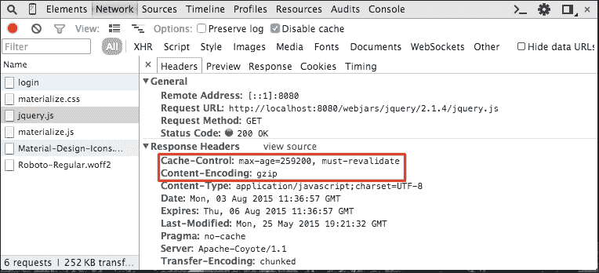
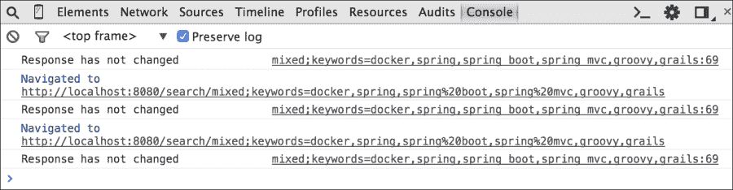
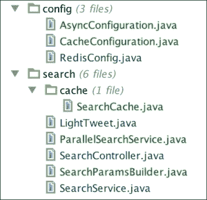

# 第八章.优化您的请求

在本章中，我们将探讨不同的技术来提高我们应用程序的性能。

我们将实现优化 Web 应用程序的经典方法：缓存控制头、Gzipping、应用程序缓存和 ETags，以及更反应性的内容，例如异步方法调用和 WebSockets。

# 生产配置文件

在上一章中，我们看到了如何定义一个应用程序属性文件，该文件仅在以特定配置文件启动应用程序时读取。我们将使用相同的方法，并在`src/main/resources`中创建一个`application-prod.properties`文件，紧挨着现有的`application.properties`文件。这样，我们将能够使用优化设置配置生产环境。

我们将在这个文件中放入一些属性以开始。在第三章中，*处理表单和复杂 URL 映射*，我们停用了 Thymeleaf 缓存并强制翻译捆绑包在每次访问时重新加载。

这对于开发来说很棒，但在生产中却毫无用处且浪费时间。所以让我们来解决这个问题：

```java
spring.thymeleaf.cache=true
spring.messages.cache-seconds=-1
```

`-1` 的缓存周期意味着永久缓存捆绑包。

现在，如果我们使用“prod”配置文件启动我们的应用程序，模板和捆绑包应该会永久缓存。

来自“prod”配置文件的性质确实会覆盖我们在`application.properties`文件中声明的那些。

# Gzipping

**Gzipping** 是一种被浏览器广泛理解的压缩算法。您的服务器将提供压缩响应，这将会消耗更多的 CPU 周期，但可以节省带宽。

客户端浏览器将负责解压缩资源并向用户显示它们。

要利用 Tomcat 的 Gzipping 压缩能力，只需将以下行添加到`application-prod.properties`文件中：

```java
server.tomcat.compression=on
server.tomcat.compressableMimeTypes=text/html,text/xml,text/css,text/plain,\
  application/json,application/xml,application/javascript
```

这将启用 Tomcat 在服务任何匹配列表中指定的 MIME 类型且长度大于 2048 字节的文件时的 Gzipping 压缩。您可以将`server.tomcat.compression`设置为`force`以强制压缩，或者将其设置为数值以更改 Gzipped 资产的最小长度值。

如果您想要对压缩有更多的控制，比如说对压缩级别进行控制，或者想要排除压缩的用户代理，您可以通过将`org.eclipse.jetty:jetty-servlets`依赖项添加到项目中，在 Jetty 中使用`GzipFilter`类。

这将自动触发`GzipFilterAutoConfiguration`类，可以通过以`spring.http.gzip`为前缀的一组属性进行配置。查看`GzipFilterProperties`以了解其可定制的程度。

### 注意

请参阅[`docs.spring.io/spring-boot/docs/current/reference/html/howto-embedded-servlet-containers.html#how-to-enable-http-response-compression`](http://docs.spring.io/spring-boot/docs/current/reference/html/howto-embedded-servlet-containers.html#how-to-enable-http-response-compression)文档以获取更多信息。

# 缓存控制

缓存控制是一组由服务器发送的 HTTP 头，用于控制用户的浏览器允许缓存资源的方式。

在上一章中，我们看到了 Spring Security 自动禁用受保护资源的缓存。

如果我们想从缓存控制中受益，我们首先必须禁用该功能：

```java
security.headers.cache=false

# Cache resources for 3 days
spring.resources.cache-period=259200
```

现在，启动应用程序，转到主页，并检查 Chrome 开发者控制台。你将看到我们的 JavaScript 文件被 Gzipped 并缓存，如下面的截图所示：



如果你想对自己的缓存有更多控制，你可以在配置中添加自己资源的处理器：

```java
@Override
public void addResourceHandlers(ResourceHandlerRegistry registry) {
    // This is just an example
    registry.addResourceHandler("/img/**")
            .addResourceLocations("classpath:/static/images/")
            .setCachePeriod(12);
}
```

我们也可以覆盖 Spring Security 的默认设置。如果我们想为我们的 API 禁用“无缓存控制”策略，我们可以像这样更改`ApiSecurityConfiguration`类：

```java
@Override
protected void configure(HttpSecurity http) throws Exception {
    http
        .antMatcher("/api/**")
// This is just an example – not required in our case
        .headers().cacheControl().disable()
        .httpBasic().and()
        .csrf().disable()
        .authorizeRequests()
        .antMatchers(HttpMethod.GET).hasRole("USER")
        .antMatchers(HttpMethod.POST).hasRole("ADMIN")
        .antMatchers(HttpMethod.PUT).hasRole("ADMIN")
        .antMatchers(HttpMethod.DELETE).hasRole("ADMIN")
        .anyRequest().authenticated();
}
```

# 应用程序缓存

现在我们已经压缩并缓存了 Web 请求，下一步我们可以采取以减少服务器负载的是将昂贵操作的输出放入缓存。Twitter 搜索需要一些时间，并将消耗我们的应用程序请求比率在 Twitter API 上。使用 Spring，我们可以轻松缓存搜索，并在每次使用相同参数调用搜索时返回相同的结果。

我们需要做的第一件事是使用`@EnableCache`注解激活 Spring 缓存。我们还需要创建一个`CacheManager`来解析我们的缓存。让我们在`config`包中创建一个`CacheConfiguration`类：

```java
package masterSpringMvc.config;

import org.springframework.cache.CacheManager;
import org.springframework.cache.annotation.EnableCaching;
import org.springframework.cache.concurrent.ConcurrentMapCache;
import org.springframework.cache.support.SimpleCacheManager;
import org.springframework.context.annotation.Bean;
import org.springframework.context.annotation.Configuration;

import java.util.Arrays;

@Configuration
@EnableCaching
public class CacheConfiguration {

    @Bean
    public CacheManager cacheManager() {
        SimpleCacheManager simpleCacheManager = new SimpleCacheManager();
        simpleCacheManager.setCaches(Arrays.asList(
                new ConcurrentMapCache("searches")
        ));
        return simpleCacheManager;
    }
}
```

在前面的例子中，我们使用了最简单的缓存抽象。其他实现也可用，例如`EhCacheCacheManager`或`GuavaCacheManager`，我们将在稍后使用。

现在我们已经配置了缓存，我们可以在我们的方法上使用`@Cacheable`注解。当我们这样做时，Spring 将自动缓存方法的结果，并将其与当前参数关联以供检索。

Spring 需要在缓存的 bean 周围创建代理。这通常意味着在同一个 bean 内部调用缓存的函数不会失败，并且可以使用 Spring 的缓存。

在我们的案例中，在`SearchService`类中，调用搜索操作的部分将极大地受益于缓存。

作为初步步骤，将负责创建`SearchParameters`类的代码放入一个名为`SearchParamsBuilder`的专用对象中会很好：

```java
package masterSpringMvc.search;

import org.springframework.social.twitter.api.SearchParameters;

import java.util.List;
import java.util.stream.Collectors;

public class SearchParamsBuilder {

    public static SearchParameters createSearchParam(String searchType, String taste) {
        SearchParameters.ResultType resultType = getResultType(searchType);
        SearchParameters searchParameters = new SearchParameters(taste);
        searchParameters.resultType(resultType);
        searchParameters.count(3);
        return searchParameters;
    }

    private static SearchParameters.ResultType getResultType(String searchType) {
        for (SearchParameters.ResultType knownType : SearchParameters.ResultType.values()) {
            if (knownType.name().equalsIgnoreCase(searchType)) {
                return knownType;
            }
        }
        return SearchParameters.ResultType.RECENT;
    }
}
```

这将帮助我们在我们的服务中创建搜索参数。

现在我们想要为我们的搜索结果创建一个缓存。我们希望 Twitter API 的每次调用都被缓存。Spring 缓存注解依赖于代理来对`@Cacheable`方法进行检测。因此，我们需要一个新的类，其中包含一个用`@Cacheable`注解的方法。

当你使用 Spring 抽象 API 时，你不知道缓存的底层实现。许多实现将需要缓存的返回类型和参数类型都是可序列化的。

`SearchParameters`不是可序列化的，这就是为什么我们将在缓存方法中传递搜索类型和关键字（都是字符串）。

由于我们想要将`LightTweets`对象放入缓存，我们希望它们是`Serializable`的；这将确保它们可以从任何缓存抽象中始终被写入和读取：

```java
public class LightTweet implements Serializable {
    // the rest of the code remains unchanged
}
```

让我们创建一个`SearchCache`类并将其放入`search.cache`包中：

```java
package masterSpringMvc.search.cache;

import masterSpringMvc.search.LightTweet;
import masterSpringMvc.search.SearchParamsBuilder;
import org.apache.commons.logging.Log;
import org.apache.commons.logging.LogFactory;
import org.springframework.beans.factory.annotation.Autowired;
import org.springframework.boot.autoconfigure.social.TwitterProperties;
import org.springframework.cache.annotation.Cacheable;
import org.springframework.social.twitter.api.SearchParameters;
import org.springframework.social.twitter.api.Twitter;
import org.springframework.social.twitter.api.impl.TwitterTemplate;
import org.springframework.stereotype.Service;

import java.util.List;
import java.util.stream.Collectors;

@Service
public class SearchCache {
    protected final Log logger = LogFactory.getLog(getClass());
    private Twitter twitter;

    @Autowired
    public SearchCache(TwitterProperties twitterProperties) {
        this.twitter = new TwitterTemplate(twitterProperties.getAppId(), twitterProperties.getAppSecret());
    }

    @Cacheable("searches")
    public List<LightTweet> fetch(String searchType, String keyword) {
        logger.info("Cache miss for " + keyword);
        SearchParameters searchParam = SearchParamsBuilder.createSearchParam(searchType, keyword);
        return twitter.searchOperations()
                .search(searchParam)
                .getTweets().stream()
                .map(LightTweet::ofTweet)
                .collect(Collectors.toList());
    }
}
```

实际上没有比这更简单的方法了。我们使用了`@Cacheable`注解来指定将要使用的缓存名称。不同的缓存可能有不同的策略。

注意，我们手动创建了一个新的`TwitterTemplate`方法，而不是像以前那样注入它。这是因为我们稍后需要从其他线程访问缓存。在 Spring Boot 的`TwitterAutoConfiguration`类中，`Twitter`bean 绑定到请求作用域，因此它不能在 Servlet 线程之外使用。

使用这两个新对象，我们的`SearchService`类的代码就简单成这样：

```java
package masterSpringMvc.search;

import masterSpringMvc.search.cache.SearchCache;
import org.springframework.beans.factory.annotation.Autowired;
import org.springframework.context.annotation.Profile;
import org.springframework.stereotype.Service;

import java.util.List;
import java.util.stream.Collectors;

@Service
@Profile("!async")
public class SearchService implements TwitterSearch {
    private SearchCache searchCache;

    @Autowired
    public SearchService(SearchCache searchCache) {
        this.searchCache = searchCache;
    }

    @Override
    public List<LightTweet> search(String searchType, List<String> keywords) {
        return keywords.stream()
                .flatMap(keyword -> searchCache.fetch(searchType, keyword).stream())
                .collect(Collectors.toList());
    }
}
```

注意，我们使用`@Profile("!async")`注解了服务。这意味着只有当`async`配置没有被激活时，我们才会创建这个 bean。

之后，我们将创建`TwitterSearch`类的另一个实现，以便能够在两者之间切换。

真棒！假设我们重启我们的应用程序并尝试一个大的请求，如下所示：

`http://localhost:8080/search/mixed;keywords=docker,spring,spring%20boot,spring%20mvc,groovy,grails`

首先，可能需要一点时间，但之后我们的控制台将显示以下日志：

```java
2015-08-03 16:04:01.958  INFO 38259 --- [nio-8080-exec-8] m.search.cache.SearchCache               : Cache miss for docker
2015-08-03 16:04:02.437  INFO 38259 --- [nio-8080-exec-8] m.search.cache.SearchCache               : Cache miss for spring
2015-08-03 16:04:02.728  INFO 38259 --- [nio-8080-exec-8] m.search.cache.SearchCache               : Cache miss for spring boot
2015-08-03 16:04:03.098  INFO 38259 --- [nio-8080-exec-8] m.search.cache.SearchCache               : Cache miss for spring mvc
2015-08-03 16:04:03.383  INFO 38259 --- [nio-8080-exec-8] m.search.cache.SearchCache               : Cache miss for groovy
2015-08-03 16:04:03.967  INFO 38259 --- [nio-8080-exec-8] m.search.cache.SearchCache               : Cache miss for grails

```

之后，如果我们刷新页面，结果将立即显示，并且控制台不会看到缓存未命中。

这就是我们的缓存功能，但缓存 API 还有很多其他功能。你可以使用以下注解来注解方法：

+   `@CachEvict`：这将从缓存中删除一个条目

+   `@CachePut`：这将把方法的结果放入缓存，而不会干扰方法本身

+   `@Caching`：这重新组合了缓存注解

+   `@CacheConfig`：这指向不同的缓存配置

`@Cacheable`注解也可以配置为在特定条件下缓存结果。

### 注意

关于 Spring 缓存的更多信息，请参阅以下文档：

[`docs.spring.io/spring/docs/current/spring-framework-reference/html/cache.html`](http://docs.spring.io/spring/docs/current/spring-framework-reference/html/cache.html)

## 缓存失效

目前，搜索结果将永久缓存。使用默认的简单缓存管理器给我们提供的选项不多。我们还可以做一件事来提高我们的应用程序缓存。由于我们的类路径中有 Guava，我们可以用以下代码替换缓存配置中现有的缓存管理器：

```java
package masterSpringMvc.config;

import com.google.common.cache.CacheBuilder;
import org.springframework.cache.CacheManager;
import org.springframework.cache.annotation.EnableCaching;
import org.springframework.cache.guava.GuavaCacheManager;
import org.springframework.context.annotation.Bean;
import org.springframework.context.annotation.Configuration;

import java.util.concurrent.TimeUnit;

@Configuration
@EnableCaching
public class CacheConfiguration {

    @Bean
    public CacheManager cacheManager() {
        GuavaCacheManager cacheManager = new GuavaCacheManager("searches");
        cacheManager
                .setCacheBuilder(
                        CacheBuilder.newBuilder()
                                .softValues()
                                .expireAfterWrite(10, TimeUnit.MINUTES)
                );
        return cacheManager;
    }
}
```

这将构建一个 10 分钟后过期的缓存，并使用软值，这意味着如果 JVM 内存不足，条目将被清理。

尝试调整 Guava 的缓存构建器。你可以为你的测试指定更小的时间单位，甚至指定不同的缓存策略。

### 注意

请参阅[`code.google.com/p/guava-libraries/wiki/CachesExplained`](https://code.google.com/p/guava-libraries/wiki/CachesExplained)中的文档。

## 分布式缓存

我们已经有了 Redis 配置文件。如果 Redis 可用，我们也可以将其用作我们的缓存提供者。这将允许我们在多个服务器之间分布缓存。让我们更改`RedisConfig`类：

```java
package masterSpringMvc.config;

import org.springframework.beans.factory.annotation.Qualifier;
import org.springframework.cache.CacheManager;
import org.springframework.context.annotation.Bean;
import org.springframework.context.annotation.Configuration;
import org.springframework.context.annotation.Primary;
import org.springframework.context.annotation.Profile;
import org.springframework.data.redis.cache.RedisCacheManager;
import org.springframework.data.redis.connection.RedisConnectionFactory;
import org.springframework.data.redis.core.RedisTemplate;
import org.springframework.session.data.redis.config.annotation.web.http.EnableRedisHttpSession;

import java.util.Arrays;

@Configuration
@Profile("redis")
@EnableRedisHttpSession
public class RedisConfig {

    @Bean(name = "objectRedisTemplate")
    public RedisTemplate objectRedisTemplate(RedisConnectionFactory redisConnectionFactory) {
        RedisTemplate<Object, Object> template = new RedisTemplate<>();
        template.setConnectionFactory(redisConnectionFactory);
        return template;
    }

    @Primary @Bean
    public CacheManager cacheManager(@Qualifier("objectRedisTemplate") RedisTemplate template) {
        RedisCacheManager cacheManager = new RedisCacheManager(template);
        cacheManager.setCacheNames(Arrays.asList("searches"));
        cacheManager.setDefaultExpiration(36_000);
        return cacheManager;
    }
}
```

使用此配置，如果我们以“Redis”配置文件运行我们的应用程序，由于它被标注为`@Primary`，将使用 Redis 缓存管理器而不是`CacheConfig`类中定义的缓存管理器。

这将允许缓存在我们在多个服务器上进行扩展时进行分布式。Redis 模板用于序列化缓存返回值和参数，并且需要对象实现`Serializable`接口。

# 异步方法

我们的应用程序中仍然存在瓶颈；当用户搜索十个关键词时，每个搜索将依次执行。我们可以通过使用不同的线程同时启动所有搜索来轻松提高我们应用程序的速度。

要启用 Spring 的异步功能，必须使用`@EnableAsync`注解。这将透明地执行任何标注了`@Async`的方法，使用`java.util.concurrent.Executor`。

通过实现`AsyncConfigurer`接口，可以自定义默认的执行器。让我们在`config`包中创建一个新的配置类，称为`AsyncConfig`。

```java
package masterSpringMvc.config;

import org.apache.commons.logging.Log;
import org.apache.commons.logging.LogFactory;
import org.springframework.aop.interceptor.AsyncUncaughtExceptionHandler;
import org.springframework.context.annotation.Configuration;
import org.springframework.scheduling.annotation.AsyncConfigurer;
import org.springframework.scheduling.annotation.EnableAsync;

import java.util.concurrent.Executor;
import java.util.concurrent.Executors;

@Configuration
@EnableAsync
public class AsyncConfiguration implements AsyncConfigurer {

    protected final Log logger = LogFactory.getLog(getClass());

    @Override
    public Executor getAsyncExecutor() {
        return Executors.newFixedThreadPool(10);
    }

    @Override
    public AsyncUncaughtExceptionHandler getAsyncUncaughtExceptionHandler() {
        return (ex, method, params) -> logger.error("Uncaught async error", ex);
    }
}
```

使用此配置，我们确保整个应用程序中分配给处理异步任务的最大线程数不超过 10 个。在一个 Web 应用程序中，每个客户端都有一个专用的线程，这非常重要。你使用的线程越多，它们阻塞的时间越长，你能够处理的客户端请求就越少。

让我们标注我们的搜索方法并使其异步。我们需要使其返回`Future`的子类型，这是一个表示异步结果的 Java 并发类。

我们将创建一个新的`TwitterSearch`类实现，该实现将在不同的线程中查询搜索 API。实现有点复杂，所以我将其分解成几个小部分。

首先，我们需要使用 `@Async` 注解来注释将要查询 API 的方法，以告诉 Spring 使用我们的执行器来安排任务。同样，Spring 将使用代理来完成其魔法，因此此方法必须在与调用它的服务不同的类中。如果这个组件也能使用我们的缓存那就更好了。这将导致我们创建这个组件：

```java
@Component
private static class AsyncSearch {
    protected final Log logger = LogFactory.getLog(getClass());
    private SearchCache searchCache;

    @Autowired
    public AsyncSearch(SearchCache searchCache) {
        this.searchCache = searchCache;
    }

    @Async
    public ListenableFuture<List<LightTweet>> asyncFetch(String searchType, String keyword) {
        logger.info(Thread.currentThread().getName() + " - Searching for " + keyword);
        return new AsyncResult<>(searchCache.fetch(searchType, keyword));
    }
}
```

还不要创建这个类。让我们先看看我们的服务需要什么。

`ListenableFuture` 抽象允许我们在未来完成之后添加回调，无论是正确结果还是发生异常的情况。

等待一组异步任务的算法看起来像这样：

```java
@Override
public List<LightTweet> search(String searchType, List<String> keywords) {
    CountDownLatch latch = new CountDownLatch(keywords.size());
    List<LightTweet> allTweets = Collections.synchronizedList(new ArrayList<>());
    keywords
            .stream()
            .forEach(keyword -> asyncFetch(latch, allTweets, searchType, keyword));

    await(latch);
    return allTweets;
}
```

如果你不知道 `CountDownLatch` 方法，它只是一个简单的阻塞计数器。

`await()` 方法将等待直到闩锁达到 0 以解锁线程。

在前面的代码中显示的 `asyncFetch` 方法将为我们的每个 `asynFetch` 方法附加一个回调。回调将结果添加到 `allTweets` 列表并减少闩锁。一旦每个回调都被调用，该方法将返回所有推文。

明白了？以下是最终的代码：

```java
package masterSpringMvc.search;

import masterSpringMvc.search.cache.SearchCache;
import org.apache.commons.logging.Log;
import org.apache.commons.logging.LogFactory;
import org.springframework.beans.factory.annotation.Autowired;
import org.springframework.context.annotation.Profile;
import org.springframework.scheduling.annotation.Async;
import org.springframework.scheduling.annotation.AsyncResult;
import org.springframework.social.twitter.api.SearchParameters;
import org.springframework.stereotype.Component;
import org.springframework.stereotype.Service;
import org.springframework.util.concurrent.ListenableFuture;

import java.util.ArrayList;
import java.util.Collections;
import java.util.List;
import java.util.concurrent.CountDownLatch;

@Service
@Profile("async")
public class ParallelSearchService implements TwitterSearch {
    private final AsyncSearch asyncSearch;

    @Autowired
    public ParallelSearchService(AsyncSearch asyncSearch) {
        this.asyncSearch = asyncSearch;
    }

    @Override
    public List<LightTweet> search(String searchType, List<String> keywords) {
        CountDownLatch latch = new CountDownLatch(keywords.size());
        List<LightTweet> allTweets = Collections.synchronizedList(new ArrayList<>());

        keywords
                .stream()
                .forEach(keyword -> asyncFetch(latch, allTweets, searchType, keyword));

        await(latch);
        return allTweets;
    }

    private void asyncFetch(CountDownLatch latch, List<LightTweet> allTweets, String searchType, String keyword) {
        asyncSearch.asyncFetch(searchType, keyword)
                .addCallback(
                        tweets -> onSuccess(allTweets, latch, tweets),
                        ex -> onError(latch, ex));
    }

    private void await(CountDownLatch latch) {
        try {
            latch.await();
        } catch (InterruptedException e) {
            throw new IllegalStateException(e);
        }
    }

    private static void onSuccess(List<LightTweet> results, CountDownLatch latch, List<LightTweet> tweets) {
        results.addAll(tweets);
        latch.countDown();
    }

    private static void onError(CountDownLatch latch, Throwable ex) {
        ex.printStackTrace();
        latch.countDown();
    }

    @Component
    private static class AsyncSearch {
        protected final Log logger = LogFactory.getLog(getClass());
        private SearchCache searchCache;

        @Autowired
        public AsyncSearch(SearchCache searchCache) {
            this.searchCache = searchCache;
        }

        @Async
        public ListenableFuture<List<LightTweet>> asyncFetch(String searchType, String keyword) {
            logger.info(Thread.currentThread().getName() + " - Searching for " + keyword);
            return new AsyncResult<>(searchCache.fetch(searchType, keyword));
        }
    }
}
```

现在，为了使用这个实现，我们需要使用 `async` 配置文件来运行应用程序。

我们可以通过用逗号分隔来同时运行具有多个活动配置文件，如下所示：

`--spring.profiles.active=redis,async`

如果我们在多个术语上启动搜索，我们可以看到类似这样的内容：

```java
pool-1-thread-3 - Searching groovy
pool-1-thread-1 - Searching spring
pool-1-thread-2 - Searching java
```

这表明不同的搜索是并行进行的。

Java 8 实际上引入了一种名为 `CompletableFuture` 的新类型，这是一个更好的 API，用于操作未来。可完成未来的主要问题是没有任何执行器可以在不写一些代码的情况下与它们一起工作。这超出了本文的范围，但你可以查看我的博客上关于这个主题的文章：[`geowarin.github.io/spring/2015/06/12/completable-futures-with-spring-async.html`](http://geowarin.github.io/spring/2015/06/12/completable-futures-with-spring-async.html)。

### 注意

**免责声明**

以下部分包含大量的 JavaScript。显然，我认为你应该看看代码，特别是如果你不是 JavaScript 的粉丝。是时候学习了。话虽如此，即使 WebSocket 非常酷，它也不是必需的。你可以安全地跳到最后一个章节，并立即部署你的应用程序。

# ETags

我们的 Twitter 结果被整洁地缓存，所以用户刷新结果页面不会触发对 Twitter API 的额外搜索。然而，即使结果没有变化，响应也会多次发送给这个用户，这会浪费带宽。

ETag 是网页响应数据的哈希，作为头部发送。客户端可以记住资源的 ETag 并通过 `If-None-Match` 头部将最后已知版本发送到服务器。这允许服务器在请求在此期间没有变化的情况下回答 `304 Not Modified`。

Spring 有一个特殊的 Servlet 过滤器，称为`ShallowEtagHeaderFilter`，用于处理 ETag。只需将其作为 bean 添加到`MasterSpringMvc4Application`配置类中：

```java
@Bean
public Filter etagFilter() {
    return new ShallowEtagHeaderFilter();
}
```

这将自动为你的响应生成 ETag，只要响应没有缓存控制头。

现在如果我们查询我们的 RESTful API，我们可以看到 ETag 随服务器响应一起发送：

```java
> http GET 'http://localhost:8080/api/search/mixed;keywords=spring' -a admin:admin
HTTP/1.1 200 OK
Content-Length: 1276
Content-Type: application/json;charset=UTF-8
Date: Mon, 01 Jun 2015 11:29:51 GMT
ETag: "00a66d6dd835b6c7c60638eab976c4dd7"
Server: Apache-Coyote/1.1
Set-Cookie: JSESSIONID=662848E4F927EE9A1BA2006686ECFE4C; Path=/; HttpOnly

```

现在如果我们再次请求相同的资源，指定我们在`If-None-Match`头中知道的上一个 ETag，服务器将自动响应`304 Not Modified`状态：

```java
> http GET 'http://localhost:8080/api/search/mixed;keywords=spring' If-None-Match:'"00a66d6dd835b6c7c60638eab976c4dd7"' -a admin:admin
HTTP/1.1 304 Not Modified
Date: Mon, 01 Jun 2015 11:34:21 GMT
ETag: "00a66d6dd835b6c7c60638eab976c4dd7"
Server: Apache-Coyote/1.1
Set-Cookie: JSESSIONID=CA956010CF268056C241B0674C6C5AB2; Path=/; HttpOnly

```

### 提示

由于我们的搜索具有并行性，针对不同关键词获取的推文可能会以不同的顺序到达，这将导致 ETag 发生变化。如果你想让这种技术适用于多个搜索，请在将搜索结果发送给客户端之前考虑对搜索结果进行排序。

如果我们要利用这一点，显然我们需要重写我们的客户端代码来处理它们。我们将使用 jQuery 的简单解决方案来实现这一点，利用浏览器的本地存储来保存用户的最新查询。

首先，从我们的模型中移除`tweets`变量；我们不会再从服务器进行搜索。你可能需要修改一个或两个测试来反映这一变化。

在继续之前，让我们将 lodash 添加到我们的 JavaScript 库中。如果你不知道 lodash，可以说它是 JavaScript 的 Apache Utils。你可以像这样将 lodash 添加到你的项目依赖中：

```java
compile 'org.webjars.bower:lodash:3.9.3'
```

将其添加到`default.html`布局中，位于 materialize 的 JavaScript 之下：

```java
<script src="img/lodash.js"></script>
```

我们将修改`resultPage.html`文件，并将显示推文的区域留空：

```java
<!DOCTYPE html>
<html 

      layout:decorator="layout/default">
<head lang="en">
    <title>Hello twitter</title>
</head>
<body>
<div class="row" layout:fragment="content">

    <h2 class="indigo-text center" th:text="|Tweet results for ${search}|">Tweets</h2>

    <ul id="tweets" class="collection">
 </ul>
</div>
</body>
</html>
```

然后，我们在页面的底部添加一个脚本元素，就在关闭 body 之前：

```java
<script layout:fragment="script" th:inline="javascript">
    /*<![CDATA[*/
    var baseUrl = /*[[@{/api/search}]]*/ "/";
    var currentLocation = window.location.href;
    var search = currentLocation.substr(currentLocation.lastIndexOf('/'));
    var url = baseUrl + search;
    /*]]>*/
</script>
```

之前的脚本将负责构建我们的请求的 URL。我们将通过发出一个简单的 jQuery AJAX 调用使用它：

```java
$.ajax({
    url: url,
    type: "GET",
    beforeSend: setEtag,
    success: onResponse
});
```

我们将使用`beforeSend`回调在调用之前修改请求头：

```java
function getLastQuery() {
    return JSON.parse(localStorage.getItem('lastQuery')) || {};
}

function storeQuery(query) {
    localStorage.setItem('lastQuery', JSON.stringify(query));
}

function setEtag(xhr) {
    xhr.setRequestHeader('If-None-Match', getLastQuery().etag)
}
```

如你所见，我们可以轻松地从本地存储中读取和写入。这里的难点是本地存储只支持字符串，因此我们必须解析和序列化查询对象为 JSON。

如果 HTTP 状态是`304 Not Modified`，我们可以通过从本地存储检索内容来处理响应：

```java
function onResponse(tweets, status, xhr) {
  if (xhr.status == 304) {
      console.log('Response has not changed');
      tweets = getLastQuery().tweets
  }

  var etag = xhr.getResponseHeader('Etag');
  storeQuery({tweets: tweets, etag: etag});

  displayTweets(tweets);
}

function displayTweets(tweets) {
  $('#tweets').empty();
  $.each(tweets, function (index, tweet) {
      addTweet(tweet);
  })
}
```

对于你将要看到的`addTweet`函数，我使用 lodash，一个非常有用的 JavaScript 实用库，来生成模板。向页面添加推文的函数可以写成如下：

```java
function addTweet(tweet) {
    var template = _.template('<li class="collection-item avatar">' +
        '' +
        '<span class="title">${tweet.user}</span>' +
        '<p>${tweet.text}</p>' +
        '</li>');

    $('#tweets').append(template({tweet: tweet}));
}
```

这就是大量的 JavaScript！在单页应用中使用像 Backbone.js 这样的库来泛化这个模式更有意义。不过，希望这能作为一个简单的例子，说明如何在你的应用程序中实现 ETag。

如果你尝试多次刷新搜索页面，你会看到内容没有变化，并且会立即显示：



ETags 还有其他用途，例如用于事务的乐观锁定（它能让您知道客户端在任何时候应该基于对象的哪个版本进行工作）。在发送数据之前在服务器端对数据进行哈希处理也是额外的工作，但它将节省带宽。

# WebSocket

我们还可以考虑的一种优化是将数据作为它对服务器可用时发送给客户端。由于我们在多个线程中检索搜索结果，数据将分多个块到来。我们可以分块发送它们，而不是等待所有结果。

Spring 对 WebSocket 协议提供了出色的支持，该协议允许客户端与服务器保持长时间运行的连接。数据可以在连接的两端通过 WebSocket 推送，并且消费者将实时获取数据。

我们将使用一个名为 SockJS 的 JavaScript 库来确保与所有浏览器的兼容性。如果用户使用的是过时的浏览器，SockJS 将透明地回退到另一种策略。

我们还将使用 StompJS 连接到我们的消息代理。

将以下库添加到您的构建中：

```java
compile 'org.springframework.boot:spring-boot-starter-websocket'
compile 'org.springframework:spring-messaging'

compile 'org.webjars:sockjs-client:1.0.0'
compile 'org.webjars:stomp-websocket:2.3.3'
```

将 WebJars 添加到我们的默认 Thymeleaf 模板中：

```java
<script src="img/sockjs.js"></script>
<script src="img/stomp.js"></script>
```

要在我们的应用程序中配置 WebSocket，我们需要添加一些配置：

```java
@Configuration
@EnableWebSocketMessageBroker
public class WebSocketConfiguration extends AbstractWebSocketMessageBrokerConfigurer {

    @Override
    public void configureMessageBroker(MessageBrokerRegistry config) {
        config.enableSimpleBroker("/topic");
        config.setApplicationDestinationPrefixes("/ws");
    }

    @Override
    public void registerStompEndpoints(StompEndpointRegistry registry) {
        registry.addEndpoint("/twitterSearch").withSockJS();
    }

}
```

这将配置我们应用程序中可用的不同频道。SockJS 客户端将连接到`twitterSearch`端点，并将数据推送到服务器的`/ws/频道`，并且能够监听`/topic/`以获取变化。

这将允许我们在新的控制器中注入`SimpMessagingTemplate`，以便在`/topic/searchResult`频道中向客户端推送数据，如下所示：

```java
@Controller
public class SearchSocketController {
    private CachedSearchService searchService;
    private SimpMessagingTemplate webSocket;

    @Autowired
    public SearchSocketController(CachedSearchService searchService, SimpMessagingTemplate webSocket) {
        this.searchService = searchService;
        this.webSocket = webSocket;
    }

    @MessageMapping("/search")
    public void search(@RequestParam List<String> keywords) throws Exception {
        Consumer<List<LightTweet>> callback = tweet -> webSocket.convertAndSend("/topic/searchResults", tweet);
        twitterSearch(SearchParameters.ResultType.POPULAR, keywords, callback);
    }

    public void twitterSearch(SearchParameters.ResultType resultType, List<String> keywords, Consumer<List<LightTweet>> callback) {
        keywords.stream()
            .forEach(keyword -> {
                searchService.search(resultType, keyword)
                    .addCallback(callback::accept, Throwable::printStackTrace);
            });
    }
}
```

在我们的`resultPage`中，JavaScript 代码非常简单：

```java
var currentLocation = window.location.href;
var search = currentLocation.substr(currentLocation.lastIndexOf('=') + 1);

function connect() {
  var socket = new SockJS('/hello');
  stompClient = Stomp.over(socket);
  // stompClient.debug = null;
  stompClient.connect({}, function (frame) {
      console.log('Connected: ' + frame);

      stompClient.subscribe('/topic/searchResults', function (result) {
          displayTweets(JSON.parse(result.body));
      });

      stompClient.send("/app/search", {}, JSON.stringify(search.split(',')));
  });
}
```

`displayTweets`函数与之前基本相同：

```java
function displayTweets(tweets) {
    $.each(tweets, function (index, tweet) {
        addTweet(tweet);
    })
}

function addTweet(tweet) {
    var template = _.template('<li class="collection-item avatar">' +
        '' +
        '<span class="title">${tweet.userName}</span>' +
        '<p>${tweet.text}</p>' +
        '</li>');

    $('#tweets').append(template({tweet: tweet}));
}
```

现在您知道了！客户端现在将接收到应用程序中所有搜索的结果——实时！

在将此推送到生产环境之前，还需要做更多的工作。以下是一些想法：

+   为客户端创建子频道以私密地监听变化

+   当客户端完成使用频道时关闭频道

+   为新推文添加 CSS 过渡效果，让用户感觉到它是实时的

+   使用真实的代理，如 RabbitMQ，以允许后端随着连接的增多而扩展

WebSocket 远不止这个简单的例子。别忘了查看[`docs.spring.io/spring/docs/current/spring-framework-reference/html/websocket.html`](http://docs.spring.io/spring/docs/current/spring-framework-reference/html/websocket.html)文档以获取更多信息。

# 检查点

在本章中，我们创建了两个新的配置：`AsyncConfiguration`，它将允许我们使用`@Async`注解将任务提交给执行器，以及`CacheConfiguration`，它将创建一个`CacheManager`接口并允许我们使用`@Cacheable`注解。由于我们可以使用 Redis 作为缓存管理器，我们还修改了`RedisConfig`类。

我们创建了一个`SearchCache`类，其中包含了一个推文的缓存，现在我们有两种`TwitterSearch`实现可供选择：传统的`SearchService`，它将同步获取每个结果，以及`ParallelSearchService`，它将在不同的线程中发出每个查询：



# 摘要

在本章中，我们看到了两种与性能改进相关的不同理念。一开始，我们试图通过缓存数据和尽可能少地与服务器建立连接来减少客户端使用的带宽。

然而，在第二部分，我们开始做一些更高级的操作，允许并行运行搜索，并且每个客户端通过 WebSocket 与服务器保持持久的连接同步。这将允许客户端实时接收更新，我们的应用程序将感觉更加反应灵敏，但会消耗更多的线程。

我强烈建议我们在进入下一章并部署我们的应用程序之前，先对结果进行润色！
