# 第二章：自动化 JUnit 测试

在本章中，你将了解 **极限编程**（**XP**）、**持续集成**（**CI**）、CI 的好处以及使用各种工具进行 JUnit 测试自动化的概念。

本章将涵盖以下主题：

+   CI

+   Gradle 自动化

+   Maven 项目管理

+   Ant

+   Jenkins

# 持续集成

在大学期间，我正在做一个关键的水印技术（图像水印）项目，并同时在我的家用计算机上开发一个模块，我在那里将我的更改与其他在大学服务器上的更改集成在一起。我大部分时间都浪费在集成上。在手动集成之后，我会发现一切都不正常；所以，集成是可怕的。

当 CI 不可用时，开发团队或开发者会对代码进行更改，然后将所有代码更改合并在一起。有时，这种合并并不简单；它涉及到大量冲突更改的集成。通常，在集成之后，奇怪的错误会出现，一个工作模块可能开始失败，因为它涉及到众多模块的完全重做。一切都不按计划进行，交付被延迟。结果，可预测性、成本和客户服务受到影响。

CI 是一个 XP 概念。它被引入以防止集成问题。在 CI 中，开发者定期提交代码，每次提交都会构建。自动测试验证系统完整性。它有助于增量开发和定期交付可工作的软件。

## CI 的好处

CI 的目的是确保我们在匆忙中不会无意识地破坏某些东西。我们希望持续运行测试，如果测试失败，我们需要得到警告。

在一个优秀的软件开发团队中，我们会发现 **测试驱动开发**（**TDD**）以及 CI。

CI 需要一个监听工具来关注版本控制系统中的更改。每当有更改提交时，此工具会自动编译和测试应用程序（有时它还会创建 WAR 文件，部署 WAR/EAR 文件等）。

如果编译失败，或者测试失败，或者部署失败，或者出现其他问题，CI 工具会立即通知相关团队，以便他们可以解决问题。

CI 是一个概念；为了遵守 CI，可以将 Sonar 和 FindBugs 等工具添加到构建过程中，以跟踪代码质量，并自动监控代码质量和代码覆盖率指标。高质量的代码让我们有信心认为团队正在走正确的道路。技术债务可以非常快速地识别出来，团队可以开始减少债务。通常，CI 工具具有展示与质量指标相关的仪表板的能力。

简而言之，CI 工具强制执行代码质量、可预测性和快速反馈，从而降低潜在风险。CI 有助于提高构建的信心。一个团队仍然可以编写非常低质量的代码，甚至测试低质量的代码，CI 也不会关心。

市场上有许多 CI 工具，如 Go、Bamboo、TeamCity、CruiseControl 和 Jenkins。然而，CruiseControl 和 Jenkins 是广泛使用的工具。

Jenkins 支持各种构建脚本工具。它几乎可以集成所有类型的项目，并且易于配置。在本章中，我们将使用 Jenkins。

CI 只是一个通用的命令执行通道；通常，构建工具用于执行命令，然后 CI 工具收集由命令或构建工具产生的指标。Jenkins 需要构建脚本来执行测试、编译源代码，甚至部署成果。Jenkins 支持不同的构建工具来执行命令——Gradle、Maven 和 Ant 是广泛使用的工具。我们将探讨构建工具，然后与 Jenkins 一起工作。

### 注意

您可以下载本章的代码。解压缩 ZIP 文件。它包含一个名为`Packt`的文件夹。此文件夹有两个子文件夹：`gradle`和`chapter02`。`gradle`文件夹包含基本的 Gradle 示例，而`chapter02`文件夹包含 Java 项目和 Ant、Gradle 和 Maven 构建脚本。

## Gradle 自动化

**Gradle**是一种构建自动化工具。Gradle 具有许多优点，如松散的结构、编写构建脚本的能力、简单的两遍项目解析、依赖管理、远程插件等。

Gradle 的最佳特性是能够为构建创建**领域特定语言**（**DSL**）。一个例子是 generate-web-service-stubs 或 run-all-tests-in-parallel。

### 注意

DSL 是一种针对特定领域的编程语言，专注于系统的特定方面。HTML 是 DSL 的一个例子。我们无法使用 DSL 构建整个系统，但 DSL 用于解决特定领域的问题。以下是一些 DSL 的例子：

+   用于构建 Java 项目的 DSL

+   用于绘制图形的 DSL

它的一个独特卖点（**USP**）是增量构建。它可以配置为仅在项目中的任何资源发生变化时构建项目。因此，整体构建执行时间减少。

Gradle 为不同类型的项目提供了许多预加载的插件。我们可以使用它们或覆盖它们。

与 Maven 或 Ant 不同，Gradle 不是基于 XML 的；它基于一种名为**Groovy**的动态语言。Groovy 是一种面向开发者的**Java 虚拟机**（**JVM**）语言。它的语法使得表达代码意图更加容易，并提供有效使用表达式、集合、闭包等方法。Groovy 程序在 JVM 上运行；因此，如果我们在一个 Groovy 文件中编写 Java 代码，它将会运行。Groovy 支持 DSL，以使代码更易于阅读和维护。

Groovy 的官方网站是[`groovy.codehaus.org/`](http://groovy.codehaus.org/)。

### 小贴士

我们可以在 Gradle 脚本中使用 Ant 或 Maven。Gradle 支持 Groovy 语法。Gradle 为 Java、Web、Hibernate、GWT、Groovy、Scala、OSGi 以及许多其他项目提供支持。

大型公司如 LinkedIn 和西门子使用 Gradle。许多开源项目，如 Spring、Hibernate 和 Grails，也使用 Gradle。

### 入门

在执行 Gradle 脚本之前，需要安装 Java (jdk 1.5+)。以下是操作步骤：

1.  打开命令提示符并运行 `java –version`；如果 Java 未安装或版本低于 1.5，请从 Oracle 网站安装最新版本。

1.  Gradle 可在 [`www.gradle.org/downloads`](http://www.gradle.org/downloads) 获取。下载完成后，提取媒体文件。你会发现它包含一个 `bin` 目录。打开命令提示符并进入 `bin` 目录。你可以将媒体文件提取到任何你想要的目录。例如，如果你将 Gradle 媒体文件提取到 `D:\Software\gradle-1.10` 下，那么打开命令提示符并进入 `D:\Software\gradle-1.10\bin`。

1.  现在，使用 `gradle –v` 命令检查 Gradle 版本。它将显示版本和其他配置。要在计算机的任何位置运行 Gradle，请创建一个 `GRADLE_HOME` 环境变量，并将其值设置为提取 Gradle 媒体文件的位置。

1.  将 `%GRADLE_HOME%\bin`（在 Windows 上）添加到 `PATH` 变量中（在 Linux 的 `bash_login` 和 Mac 的 `bashrc` 中导出 `GRADLE_HOME` 和 `PATH`）。

1.  打开一个新的命令提示符，进入任何文件夹，并再次运行相同的命令 `gradle –v` 以检查 `PATH` 变量是否设置正确。

另一种选择是使用 Gradle 包装器 (`gradlew`)，并允许批处理文件（或 shell 脚本）下载针对每个项目特定的 Gradle 版本。这是使用 Gradle 的行业标准，确保 Gradle 版本之间的一致性。Gradle 包装器也随构建工件一起提交到源代码控制。

### Gradling

在编程世界中，“Hello World” 是起点。在本节中，我们将编写第一个“Hello World” Gradle 脚本。Gradle 脚本可以构建一个或多个项目。每个项目可以有一个或多个任务。任务可以是编译 Java 文件或构建 WAR 文件等任何操作。

### 小贴士

要执行一个任务，我们将创建一个 `build.gradle` 文件并执行 `gradle` 命令以运行构建。Gradle 将在当前目录中查找名为 `build.gradle` 的文件。要执行除 `build.gradle` 之外的构建文件，请使用 `–b <文件名>` 选项。

我们将创建一个任务，在控制台上打印“Hello World”。执行以下步骤：

1.  打开一个文本编辑器并输入以下内容：

    ```java
    task firstTask << {
      println 'Hello world.'
    }
    ```

    将文件保存为 `build.gradle`。

1.  打开命令提示符并浏览到保存 `build.gradle` 文件的文件夹。运行 `gradle firstTask` 命令，或者如果你将文件保存在 `D:\Packt\gradle` 下，只需打开命令提示符并运行 `gradle –b D:\Packt\gradle\build.gradle firstTask`。

    命令提示符将打印以下信息：

    ```java
    :firstTask
    Hello world.
    BUILD SUCCESSFUL

    ```

```java
method style task definition and subtask ordering:
```

```java
task aTask(){
  doLast{
   println 'Executing last.'
  }

  doFirst {
        println 'Running 1st'
  }
}
```

在这里，我们使用 Java 方法风格定义了一个名为 `aTask` 的任务。任务 `aTask` 包含两个闭包关键字：`doLast` 和 `doFirst`。

当任务被调用后，`doFirst` 闭包会被执行，而 `doLast` 闭包会在任务结束时执行。

当我们运行 `gradle aTask` 时，它会打印以下信息：

```java
:aTask
Running 1st
Executing last.

BUILD SUCCESSFUL

```

#### 默认任务

在 Ant 中，我们可以定义一个默认目标；同样，Gradle 提供了使用关键字 `defaultTasks 'taskName1', …'taskNameN'` 的默认任务选项。

`defaultTasks` 关键字 `'aTask'` 定义 `aTask` 为默认任务。因此，如果我们只执行 `gradle` 而不带任务名称，那么它将调用默认任务。

#### 任务依赖

在 Ant 中，一个目标依赖于另一个目标，例如，Java 代码编译任务可能依赖于输出文件夹的清理；同样，在 Gradle 中，一个任务可能依赖于另一个任务。依赖是通过 `dependsOn` 关键字定义的。以下语法用于定义任务依赖：

```java
secondTask.dependsOn 'firstTask'
```

在这里，`secondTask` 依赖于 `firstTask`。

定义任务依赖的另一种方式是以类似方法的方式传递依赖。以下代码片段显示了方法参数样式：

```java
task secondTask (dependsOn: 'firstTask') {

  doLast {
        println 'Running last'
    }

   doFirst {
        println 'Running first'
    }

}
```

执行 `gradle secondTask`；它将首先执行依赖任务 `firstTask`，然后执行任务 `secondTask`，如下所示：

```java
:firstTask
Hello world.
:secondTask
Running first
Running last

```

定义任务间依赖的另一种方式是使用 `secondTask.dependsOn = ['firstTask']` 或 `secondTask.dependsOn 'firstTask'`。

### 注意

我们可以将任务名称中的每个单词缩写为驼峰式，以执行任务。例如，任务名称 `secondTask` 可以缩写为 `sT`。

#### 守护进程

每次调用 `gradle` 命令时，都会启动一个新的进程，加载 Gradle 类和库，并执行构建。加载类和库需要时间。如果每次都不加载 JVM、Gradle 类和库，则可以减少执行时间。`--daemon` 命令行选项启动一个新的 Java 进程并预加载 Gradle 类和库；因此，第一次执行需要时间。带有 `--daemon` 选项的后续执行几乎不需要时间，因为只有构建被执行——JVM 以及所需的 Gradle 类和库已经加载。守护进程的配置通常放入 `GRADLE_OPTS` 环境变量中；因此，不是所有调用都需要这个标志。以下截图显示了守护进程的执行：

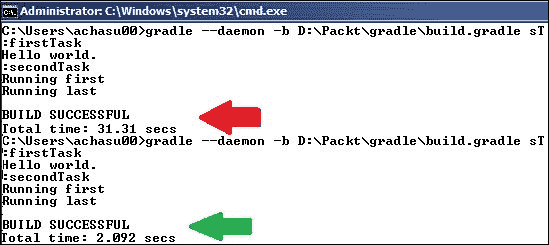

注意，第一次构建花费了 31 秒，而第二次构建工具只花费了 2 秒。

要停止守护进程，请使用命令行选项 `gradle –stop`。

### Gradle 插件

构建脚本通常是单调的，例如，在一个 Java 构建脚本中，我们定义源文件位置、第三方 JAR 文件位置、清理输出文件夹、编译 Java 文件、运行测试、创建 JAR 文件等。几乎所有的 Java 项目构建脚本看起来都很相似。

这类似于重复代码。我们通过重构和将重复的代码移动到公共位置并共享公共代码来解决重复的代码问题。Gradle 插件通过将重复的任务移动到公共位置来解决重复的构建任务问题，这样所有项目都可以共享和继承公共任务，而不是重新定义它们。

插件是一个 Gradle 配置扩展。它包含一些预配置的任务，这些任务组合起来可以完成一些有用的功能。Gradle 随带了许多插件，帮助我们编写整洁的脚本。

在本章中，我们将探讨 Java 和 Eclipse 插件。

#### Eclipse 插件

Eclipse 插件生成导入 Eclipse 项目所需的文件。

任何 Eclipse 项目都有两个重要的文件：一个 `.project` 文件和一个 `.classpath` 文件。`.project` 文件包含项目信息，如项目名称和项目类型。`.classpath` 文件包含项目的类路径条目。

让我们按照以下步骤使用 Eclipse 插件创建一个简单的 Gradle 构建脚本：

1.  创建一个名为 `eclipse` 的文件夹，然后创建一个名为 `build.gradle` 的文件，并添加以下脚本：

    ```java
    apply plugin: 'eclipse'
    ```

    要继承插件类型，Gradle 使用 `apply plugin: '<plug-in name>'` 语法。

1.  打开命令提示符，使用 `gradle tasks –-all` 命令检查所有可用的任务。这将为您列出可用的 Eclipse 插件任务。

1.  现在运行 `gradle eclipse` 命令。它将只生成 `.project` 文件，因为该命令不知道需要构建哪种类型的项目。您将在命令提示符上看到以下输出：

    ```java
    :eclipseProject
    :eclipse
    BUILD SUCCESSFUL

    ```

1.  要创建一个 Java 项目，将 `apply plugin: 'java'` 添加到 `build.gradle` 文件中，并重新运行命令。这次它将执行以下四个任务：

    ```java
    :eclipseClasspath
    :eclipseJdt
    :eclipseProject
    :eclipse

    ```

1.  打开 `Eclipse` 文件夹（放置 `build.gradle` 文件的位置）。您将找到 `.project` 和 `.classpath` 文件以及一个 `.settings` 文件夹。对于 Java 项目，需要一个 **Java 开发工具**（**JDT**）配置文件。`.settings` 文件夹包含 `org.eclipse.jdt.core.prefs` 文件。

现在，我们可以启动 Eclipse 并导入项目。我们可以编辑 `.project` 文件并更改项目名称。

通常，Java 项目依赖于第三方 JAR 文件，例如 JUnit JAR 和 Apache 工具 JAR。在下一节中，我们将学习如何使用 JAR 依赖项生成类路径。

#### Java 插件

Java 插件为您的项目提供了一些默认任务，这些任务将编译和单元测试您的 Java 源代码，并将其打包成一个 JAR 文件。

Java 插件定义了项目许多方面的默认值，例如源文件的位置和 Maven 仓库。我们可以遵循约定或根据需要自定义它们；通常，如果我们遵循传统的默认值，那么我们就不需要在构建脚本中做很多事情。

让我们创建一个简单的 Gradle 构建脚本，使用 Java 插件并观察插件提供了什么。执行以下步骤：

1.  创建一个`java.gradle`构建文件并添加`apply plugin: 'java'`行。

1.  打开命令提示符并输入`gradle -b java.gradle tasks –-all`。这将为您列出 Java 插件任务。

1.  要构建一个项目，我们可以使用构建任务；构建依赖于许多任务。执行`gradle -b java.gradle build`命令。以下截图显示了输出：

由于没有提供源代码，构建脚本没有构建任何内容。然而，我们可以看到可用的任务列表——构建任务依赖于编译、JAR 创建、测试执行等。

Java 插件遵循一个约定，即构建源文件将位于项目目录下的`src/main/java`。非 Java 资源文件，如 XML 和属性文件，将位于`src/main/resources`。测试将位于`src/test/java`，测试资源位于`src/test/resources`。

要更改默认的 Gradle 项目源文件目录设置，使用`sourceSets`关键字。`sourceSets`关键字允许我们更改默认源文件的位置。

Gradle 脚本必须知道`lib`目录的位置才能编译文件。Gradle 对库位置的约定是仓库。Gradle 支持本地`lib`文件夹、外部依赖项和远程仓库。

Gradle 还支持以下仓库：

+   **Maven 仓库**：Maven 可以配置在我们的本地机器上、网络机器上，甚至是预配置的中心仓库。

    +   **Maven 中心仓库**：Maven 的中心仓库位于[`repo1.maven.org/maven2`](http://repo1.maven.org/maven2)。可以使用`mavenCentral()`groovy 方法从集中的 Maven 仓库加载依赖项。以下是一个访问中心仓库的示例：

        ```java
        repositories {
            mavenCentral()
        }
        ```

    +   **Maven 本地仓库**：如果我们有一个本地 Maven 仓库，我们可以使用`mavenLocal()`方法如下解决依赖项：

        ```java
        repositories {
            mavenLocal()
        }
        ```

        ### 提示

        可以使用`maven()`方法来访问内网配置的仓库。以下是一个访问内网 URL 的示例：

        ```java
        repositories {
            maven {
                name = 'Our Maven repository name'
                url = '<intranet URL>'
            }
        }
        ```

        可以使用以下代码使用`mavenRepo()`方法：

        ```java
        repositories {
            mavenRepo(name: '<name of the repository>', url: '<URL>')
        }
        ```

        受保护的 Maven 仓库需要用户凭据。Gradle 提供了`credentials`关键字来传递用户凭据。以下是一个访问受保护 Maven 仓库的示例：

        ```java
        repositories {
            maven(name: repository name') {
                credentials {
                    username = 'username'
                    password = 'password'
                }
                url = '<URL>'
            }
        }
        ```

+   **Ivy 仓库**：这是一个远程或本地 Ivy 仓库。Gradle 支持与 Maven 相同的 Ivy 方法。以下是一个访问 Ivy 仓库和受保护 Ivy 仓库的示例：

    ```java
    repositories {
        ivy(url: '<URL>', name: '<Name>')
        ivy {     
        credentials
         { 
            username = 'user name'
                password = 'password'
          }
            url = '<URL>'
        }
    }
    ```

+   **平面目录仓库**：这是一个本地或网络目录。以下是一个访问本地目录的示例：

    ```java
    repositories {
        flatDir(dir: '../thirdPartyFolder', name: '3rd party library')
        flatDir {
            dirs '../springLib', '../lib/apacheLib', '../lib/junit' 
            name = ' Configured libraries for spring, apache and JUnit'
        }
    }
    ```

    Gradle 使用`flatDir()`来定位本地或网络共享的库文件夹。在这里，`dir`用于定位单个目录，而使用以逗号分隔的目录位置`dirs`用于定位分布式文件夹。

在本节中，我们将创建一个 Java 项目，编写一个测试，执行测试，编译源文件或测试文件，并最终构建一个 JAR 文件。执行以下步骤：

1.  在`packt\chapter02\java`下创建一个`build.gradle`构建脚本文件。

1.  使用以下代码行添加 Eclipse 和 Java 插件支持：

    ```java
    apply plugin: 'eclipse'
    apply plugin: 'java'
    ```

1.  我们将编写一个 JUnit 测试，因此我们的项目将依赖于 JUnit JARs。在`packt\chapter02`下创建一个`lib`目录，并复制`hamcrest-core-1.3.jar`和`junit-4.11.jar` JAR 文件（我们在第一章中下载了这些 JAR 文件，*JUnit 4 – 全部回忆*）。

1.  在此示例中，我们将使用平面目录仓库。我们为 JUnit JARs 创建了一个`lib`目录。将以下行添加到`build.gradle`文件中，以配置我们的仓库：

    ```java
    repositories {
        flatDir(dir: '../lib', name: 'JUnit Library')
    }
    ```

    我们有一个单独的`lib`文件夹；因此，我们将使用`flatDir`和`dir`约定。

    一个仓库可以包含大量的库文件，但我们可能只需要其中的一部分。例如，源文件编译不需要 JUnit JARs，但测试文件和测试执行需要它们。

    Gradle 自带依赖管理。`dependencies`关键字用于定义依赖项。

    闭包依赖支持以下默认类型：

    +   **编译**：这些是编译项目源代码所需的依赖项。

    +   **运行时**：这些依赖项是生产类在运行时所需的。默认情况下，这些也包括编译时依赖项。

    +   **testCompile**：这些依赖项是编译项目测试源代码所必需的。默认情况下，它们还包括编译后的生产类和编译时依赖项。

    +   **testRuntime**：这些依赖项是运行测试所必需的。默认情况下，它们还包括编译、运行时和 testCompile 依赖项。

    每种依赖类型都需要一个坐标：依赖 JAR 的组、名称和版本。

    一些网站，如[mvnrepository.com](http://mvnrepository.com)，可以帮助我们生成一个可复制粘贴的依赖字符串，例如[`mvnrepository.com/artifact/org.springframework/spring-aop/3.1.1.RELEASE`](http://mvnrepository.com/artifact/org.springframework/spring-aop/3.1.1.RELEASE)。

    ### 注意

    假设我们需要将`org.springframework.aop-3.1.1.RELEASE.jar`文件包含在我们的类路径中（这里`org.springframework`是组，`aop`是名称，`3.1.1.RELEASE`是版本）。我们可以简单地写`org.springframework:aop:3.1.1.RELEASE`来标识`aop.jar`。

1.  测试需要 JUnit JAR 支持。将以下行添加到我们的`build.gradle`文件中，以添加 JUnit 依赖项：

    ```java
    dependencies {
        testCompile group: 'junit', name: 'junit', version: '4.11'
        testCompile group: '', name: 'hamcrest-core', version: '1.3'
    }
    ```

    或者简单地添加以下行到文件中：

    ```java
    dependencies {
        testCompile 'junit:junit:4.11', ':hamcrest-core:1.3'
    }
    ```

1.  使用 Eclipse 插件生成 Eclipse 项目，并执行`gradle eclipse`命令。`eclipse`命令将执行三个任务：`eclipseClasspath`、`eclipseJdt`和`eclipseProject`。

    进入 `\chapter02\java` 文件夹，你将找到 `.classpath` 和 `.project` 文件。打开 `.classpath` 文件，检查 `junit-4.11` 和 `hamcrest-core-1.3.jar` 是否已添加为 `classpathentry`。

    以下截图显示了 `gradle eclipse` 命令的输出：

    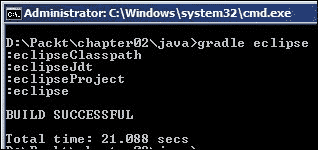

    以下截图显示了生成的 `.classpath` 文件的内容：

    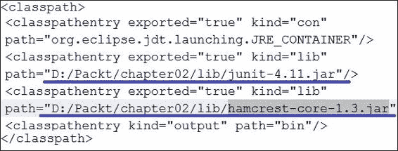

1.  启动 Eclipse，通过导航到 **文件** | **导入** | **将现有项目导入工作空间** 来导入项目。现在浏览到 `D:\Packt\chapter02\java` 文件夹并导入项目。Eclipse 将打开 `java` 项目——Java 社区的最佳实践是将测试和源代码文件放在同一个包下，但不同的源文件夹中。Java 代码文件存储在 `src/main/java` 下，测试文件存储在 `src/test/java` 下。源资源存储在 `src/main/resources` 下。

    我们需要在 Java 项目的直接下创建 `src/main/java`、`src/main/resources` 和 `src/test/java` 文件夹。

    以下截图显示了文件夹结构：

    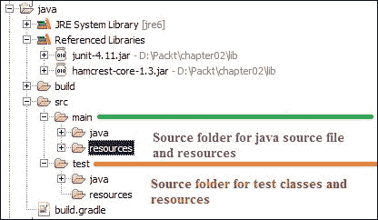

1.  右键单击叶文件夹（分别在 `src/main` 和 `src/test` 下的 `java` 和 `resources` 文件夹）；将打开一个弹出菜单。现在，转到 **构建路径** | **使用为源文件夹**。

    以下截图显示了该操作：

    

1.  我们将创建一个 Java 类并测试其行为；Java 类将读取属性文件并根据属性文件中提供的值返回一个 `enum` 类型。从测试中读取文件是不推荐的，因为 I/O 操作是不可预测且缓慢的；你的测试可能无法读取文件，并花费时间减慢测试执行。我们可以使用模拟对象来模拟文件读取，但为了简单起见，我们将在服务类中添加两个方法——一个将接受一个 `String` 参数并返回一个 `enum` 类型，另一个将读取属性文件并调用第一个方法。从测试中，我们将使用字符串调用第一个方法。以下是为配置项目所需的步骤：

    1.  在 `/java/src/main/resources` 下添加一个 `environment.properties` 属性文件，并在该文件中添加 `env = DEV`。

    1.  在 `/java/src/main/java` 源包下的 `com.packt.gradle` 包中创建一个 `enum` 文件：

        ```java
        public enum EnvironmentType {
          DEV, PROD, TEST
        }
        ```

    1.  创建一个 Java 类来读取属性文件，如下所示：

        ```java
        package com.packt.gradle;

        import java.util.ResourceBundle;

        public class Environment {
          public String getName() {
            ResourceBundle resourceBundle = ResourceBundle.getBundle("environment");
            return resourceBundle.getString("env");
          }
        }
        ```

    1.  创建一个 `EnvironmentService` 类，根据环境设置返回一个 `enum` 类型，如下所示：

        ```java
        package com.packt.gradle;
        public class EnvironmentService {

          public EnvironmentType getEnvironmentType() {
            return getEnvironmentType(new Environment().getName());
          }
          public EnvironmentType getEnvironmentType(String name) {
            if("dev".equals(name)) {
              return EnvironmentType.DEV;
            }else if("prod".equals(name)) {
              return EnvironmentType.PROD;
            }
            return null;
          }
        }
        ```

        `getEnvironmentType()` 方法调用 `Environment` 类来读取属性文件值，然后使用读取的值调用 `getEnvironmentType(String name)` 方法以返回一个 `enum` 类型。

    1.  在 `com.packt.gradle` 包下的 `/src/test/java` 中添加一个测试类。以下是其代码：

        ```java
        package com.packt.gradle;
        import static org.junit.Assert.*;
        import static org.hamcrest.CoreMatchers.*;
        import org.junit.Test;

        public class EnvironmentServiceTest {
        EnvironmentService service = new EnvironmentService();
        @Test
        public void returns_NULL_when_environment_not_configured(){
            assertNull(service.getEnvironmentType("xyz"));	}

        @Test
        public void production_environment_configured(){
            EnvironmentType environmentType = service.getEnvironmentType("prod");
            assertThat(environmentType, is(EnvironmentType.PROD));
          }
        }
        ```

        在这里，`returns_NULL_when_environment_not_configured()` 测试将 `xyz` 传递给 `getEnvironmentType` 方法，并期望服务返回 `null`，假设没有 `xyz` 环境。在另一个测试中，它将 `prod` 值传递给 `getEnvironmentType` 方法，并期望返回一个类型。

1.  现在，打开命令提示符并运行 `gradle build`；它将编译源文件和测试文件，执行测试，并最终创建一个 JAR 文件。

    要仅执行测试，请运行 `gradle test`。

    打开 `\chapter02\java\build` 文件夹，您将找到三个重要的文件夹：

    +   `libs`：此文件夹包含构建输出 JAR 文件—`Java.jar`

    +   `reports`：此文件夹包含 HTML 测试结果

    +   `test-results`：此文件夹包含 XML 格式的测试执行结果和每个测试的执行时间

    以下截图显示了 HTML 格式的测试执行结果：

    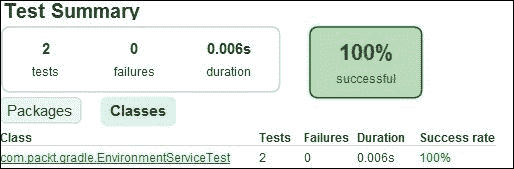

Gradle 是一个智能构建工具，它支持增量构建。重新运行 `gradle build` 命令。它将跳过任务并显示 `UP-TO-DATE`。以下是一个增量构建的截图：

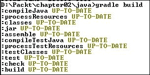

如果我们对测试类进行更改，只有测试任务将被执行。以下是一些测试任务：`compileTestJava`、`testClasses`、`test`、`check` 和 `build`。

在下一章中，我们将探讨更多关于 Gradle 的内容。你现在想深入了解吗？如果是这样，你可以访问 [`www.gradle.org/docs/current/userguide/userguide.html`](http://www.gradle.org/docs/current/userguide/userguide.html)。

## Maven 项目管理

Maven 是一个项目构建工具。使用 Maven，我们可以构建一个可见的、可重用的和可维护的项目基础设施。

Maven 提供了用于可见性的插件：代码质量/最佳实践通过 PMD/checkstyle 插件可见，XDOC 插件生成项目内容信息，JUnit 报告插件使团队可见失败/成功故事，项目活动跟踪插件使每日活动可见，变更日志插件生成变更列表，等等。

因此，开发者知道可以使用哪些 API 或模块；因此，他或她不会重新发明轮子（而是重用现有的 API 或模块）。这减少了重复，并允许创建一个可维护的系统。

在本节中，我们将探讨 Maven 架构，并使用 Maven 重新构建我们的 Gradle 项目。

### 安装

Maven 的先决条件是 **Java 开发工具包**（**JDK**）。请确保您的计算机上已安装 JDK。

以下设置 Maven 的步骤：

1.  下载 Maven 媒体。转到 [`maven.apache.org/download.html`](http://maven.apache.org/download.html) 获取 Maven 的最新版本。

1.  下载 Maven 后，将其存档提取到一个文件夹中；例如，我将其提取到 `D:\Software\apache-maven-3.1.1`。

1.  对于 Windows 操作系统，创建一个名为 `M2_HOME` 的环境变量，并将其指向 Maven 安装文件夹。修改 `PATH` 变量，并追加 `%M2_HOME%\bin`。

1.  对于 Linux，我们需要将 `PATH` 和 `M2_HOME` 环境变量导出到 `.bashrc` 文件。打开 `.bashrc` 文件，并使用以下文本进行编辑：

    ```java
    export M2_HOME=/home/<location of Maven installation>
    export PATH=${PATH}:${M2_HOME}/bin
    ```

1.  对于 Mac，需要修改 `.bash_login` 文件，添加以下文本：

    ```java
    export M2_HOME=/usr/local/<maven folder>
    export PATH=${PATH}:${M2_HOME}/bin
    ```

1.  检查安装并执行 `mvn –version` 命令。这应该会打印出 Maven 版本。以下是一个输出截图：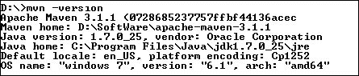

Maven 已经安装，因此我们可以开始探索 Maven。已经安装了 `m2eclipse` 插件的 Eclipse 用户已经拥有 Maven，他们可以直接在 Eclipse 中使用 Maven，无需安装 Maven。

### 架构插件

在 Maven 中，架构是一个项目模板生成插件。

Maven 允许我们从预定义的项目类型列表中从头开始创建项目基础设施。Maven 命令 `mvn archetype:generate` 生成一个新的项目骨架。

`archetype:generate` 命令加载可用的项目类型目录。它尝试连接到 Maven 中央仓库 [`repo1.maven.org/maven2`](http://repo1.maven.org/maven2)，并下载架构目录。

### 提示

要获取最新目录，您应该连接到互联网。

按照以下步骤生成 Java 项目骨架：

1.  创建文件夹层次结构 `/Packt/chapter02/maven`，打开命令提示符，并浏览到 `/Packt/chapter02/maven` 文件夹。

1.  发出 `mvn archetype:generate` 命令；您将看到一个大型架构列表正在下载，每个架构都有一个编号、一个名称和简短描述。

    它将提示您输入架构编号。输入默认的 `maven-archetype-quickstart` 架构。在我的情况下，编号是 343。

    以下截图显示编号 `343` 是默认值：

    

    ### 提示

    要在 Windows 操作系统中获取整个目录，请输入 `mvn archetype:generate > archetype.txt` 命令。这将把项目类型列表填充到文本文件中。

1.  输入 `343` 或直接按 *Enter* 键选择默认值。接下来，它将提示您选择版本。按 *Enter* 键选择默认值。

1.  现在，它将要求您提供一个 `groupId`。`groupId` 是多个项目的根包，`org.springframework` 是所有 Spring 项目的 `groupId`。输入 `org.packt` 作为 `groupId`。

1.  接下来，它将询问 `artifactId`。这是项目名称，`aop` 是 `org.springframework.aop-3.1.1.RELEASE` 的 `artifactId`。输入 `Demo` 作为 `artifactId`。

1.  Maven 将询问版本，默认为 `1.0-SNAPSHOT`。版本是项目的版本，在这里 `3.1.1.RELEASE` 是 `org.springframework.aop-3.1.1.RELEASE` 项目的版本。我们将接受默认值。按 *Enter* 键接受默认值。

1.  现在将提示您输入包名。输入 `com.packt.edu` 作为包名。

1.  最后，它将显示您输入的内容。请查看并接受，如下面的截图所示：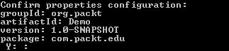

    打开 `/Packt/chapter02/maven` 文件夹；您将看到创建的 `Demo` 项目文件夹具有以下文件结构：

    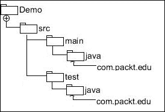

Maven 对于源 Java 文件的约定是 `src/main/java`，而测试源文件是 `src/test/java`。

Maven 将自动在 `src/main/java/com/packt/edu` 下创建一个 Java 文件 `App.java`，并在 `src/test/java/com/packt/edu` 下创建一个测试文件 `AppTest`。

此外，它将在 `Demo` 下的直接位置创建一个 XML 文件 `pom.xml`。此文件将用于构建项目。在下一节中，我们将了解 POM 文件。

### 项目对象模型（POM）文件。

每个 Maven 项目都包含一个 `pom.xml` 文件，这是一个项目元数据文件。

POM 文件可以包含以下部分：

+   项目坐标，如 `<groupId/>`、`<artifactId/>`、`<version/>`、`<dependency>` 以及通过 `<modules/>` 和 `<parent/>` 的继承。

    在 `Demo` 文件夹中打开 `pom.xml` 文件；它包含以下坐标细节：

    ```java
     <groupId>org.packt</groupId>
     <artifactId>Demo</artifactId>
     <version>1.0-SNAPSHOT</version>
     <packaging>jar</packaging>
    ```

+   `<build>` 和 `<reporting>` 中的构建细节。

+   项目可见性细节，如 `<name>`、`<organization>`、`<developers>`、`<url>` 和 `<contributors>`。

    我们生成的 `pom.xml` 包含以下细节：

    ```java
     <name>Demo</name>

    <url>http://maven.apache.org</url>
    ```

+   项目环境细节，如 `<scm>`、`<repository>` 和 `<mailingList>`。

### 项目依赖。

在多模块项目中，一个项目可以依赖于许多其他项目。例如，假设我们依赖于 JUnit。Maven 会自动发现所需的工件依赖。这对于我们依赖于许多开源项目来说非常有用。无论是开源还是闭源项目，这总是有用的。

你还记得 Gradle 依赖闭包吗？它有四个默认类型：编译、运行时、测试编译和测试运行时。

类似地，Maven 有以下依赖范围：

+   **编译**：代码编译时间类路径依赖；这是默认范围。如果没有明确定义，则设置编译时间范围。

+   **运行时**：这是运行时所需的。

+   **测试**：此依赖对于测试代码编译和测试执行是必需的。

+   **提供**：运行时所需的 JDK 或环境依赖。

父项目使用以下代码片段定义依赖：

```java
<dependencies>
    <dependency>
      <groupId>junit</groupId>
      <artifactId>junit</artifactId>
      <version>4.11</version>
      <scope>test</scope>
    </dependency>
  </dependencies
```

所有子项目只需添加 `<dependency>` 标签即可继承依赖，如下所示：

```java
<dependency>
  <groupId>junit</groupId>
  <artifactId>junit</artifactId>
</dependency>
```

### 构建生命周期。

构建生命周期明确定义了构建和分发特定项目工件的过程。

Maven 有以下三个内置的构建生命周期：

+   **默认**：此生命周期处理编译、测试、打包、部署以及更多功能。

+   **清理**：此生命周期通常清理由之前的构建（s）生成的构建工件。

+   **站点**：此生命周期负责生成和部署项目的站点文档。

现在，我们将编译和测试我们的 `Demo` 项目。

在本节中，我们将处理默认生命周期的编译、测试和打包目标。

#### 编译项目

执行以下步骤以编译项目：

1.  打开命令提示符并浏览到 `\Packt\chapter02\maven\Demo`。Maven 需要一个 `pom.xml` 文件来编译项目。

1.  输入 `mvn compile`；它将编译项目并在 `\Demo\target\classes` 下创建类文件。以下截图显示了输出：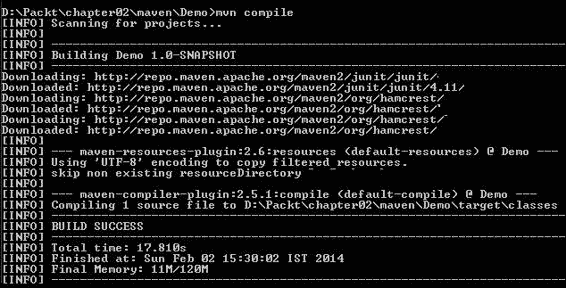

#### 测试项目

要在 Demo 中执行测试，打开命令提示符并输入 `mvn test`；它将下载 JUnit JARs 和 surefire JARs 分别用于测试编译和测试报告生成，然后执行测试。以下截图显示了输出：

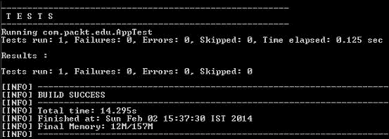

##### 打包项目

`mvn package` 命令编译源代码，编译测试，执行测试，并最终构建一个 JAR 文件。它将在 `\Packt\chapter02\maven\Demo\target` 下生成 `Demo-1.0-SNAPSHOT.jar`。

### 清理生命周期

`mvn clean` 命令会删除 `target` 文件夹并删除所有内容。运行该命令并检查 `\Packt\chapter02\maven\Demo\` 中的 `target` 文件夹是否已被删除。

### 网站生命周期

`mvn site` 命令在目标或站点下生成详细的 HTML 格式项目报告。它包括关于、插件管理、分发管理、依赖信息、源代码库、邮件列表、问题跟踪、持续集成、项目插件、项目许可、项目团队、项目摘要和依赖项。

参考以下链接以了解更多关于 Maven 的信息：[`maven.apache.org/guides/index.html`](http://maven.apache.org/guides/index.html)

下一节将介绍 Apache Ant。

## 另一个整洁的工具（Ant）

Ant 是 Apache 软件基金会的一个基于 Java 的构建工具。Ant 的构建文件是用 XML 编写的。你需要 Java 来执行 Ant 任务。

从 [`ant.apache.org/`](http://ant.apache.org/) 下载 Apache Ant，提取媒体文件，并创建一个 `ANT_HOME` 变量，将其值设置为提取的位置。在 Windows 中编辑 `PATH` 并追加 `%ANT_HOME%\bin`。对于 Mac 或 Linux 操作系统，你需要像本章前面提到的 *Maven 项目管理* 部分的 *安装* 部分中描述的那样导出 `ANT_HOME` 和 `PATH`。

Ant 需要一个 `build.xml` 文件来执行任务。Ant 支持使用 `–f` 选项来指定构建脚本；因此，`ant –f myBuildFile.xml` 命令将有效。

我们将创建一个构建脚本并使用 Ant 执行 Maven 项目 (`\Packt\chapter02\maven\Demo`)。按照以下步骤操作：

1.  在 `\Packt\chapter02\maven\Demo` 中创建一个 XML 文件 `build.xml`。

1.  在 `build.xml` 文件中添加以下行：

    ```java
    <?xml version="1.0"?>
    <project name="Demo"  basedir=".">
      <property name="src.dir" location="src/main/java" />
      <property name="build.dir" location="bin" />
      <property name="dist.dir" location="ant_output" />
    </project>
    ```

    `<project>`标签是 Ant 中定义的标签。你可以给你的项目命名，`Demo`是这个项目的名称。接下来，我们将设置属性；一个属性可以有一个名称和值或位置。在这里，`src.dir`是一个属性名称，这个属性可以通过`${src.dir}`语法在任何任务中使用。`location`属性指的是从`build.xml`文件开始的相对位置。由于`src/main/java`包含源文件，我们将位置值设置为`src/main/java`。其他两个属性，`build.dir`和`dist.dir`，将由 Java 编译任务用来编译类文件并生成 JAR 文件。

1.  你还记得 Maven 中的 clean 任务吗？Ant 不提供默认目标。我们必须定义一个`clean`目标来删除旧的构建输出，然后我们将使用 Ant 的`<delete>`命令来删除目录。然后，使用`<mkdir>`命令，我们将重新创建目录：

    ```java
      <target name="clean">
        <delete dir="${build.dir}" />
        <delete dir="${dist.dir}" />
      </target>
      <target name="makedir">
        <mkdir dir="${build.dir}" />
        <mkdir dir="${dist.dir}" />
      </target>
    ```

    注意，我们使用`<target>`标签添加了两个目标。每个目标都通过一个名称来标识。我们将调用`clean`目标来删除`build.dir`（生成的`.class`文件）和`dist.dir`（构建输出 JAR 文件）。

1.  编译任务内置于 Gradle/Maven 中，但 Ant 没有内置的编译目标；因此，我们将创建一个目标来编译 Java 文件，如下所示：

    ```java
      <target name="compile" depends="clean, makedir">
        <javac srcdir="${src.dir}" destdir="${build.dir}">
        </javac>
      </target>
    ```

    使用`<javac>`命令编译 Java 文件。`<javac>`命令接受`srcdir`和`destdir`。编译器从`srcdir`读取 Java 文件，并将类文件生成到`destdir`。

    一个目标可能依赖于另一个，`depends`允许我们传递以逗号分隔的目标名称。在这里，编译目标依赖于`clean`和`makedir`。

1.  编译已完成。现在，我们将使用`<jar>`命令从类文件创建`jar`，如下所示：

    ```java
    <target name="jar" depends="compile">
        <jar destfile="${dist.dir}\${ant.project.name}.jar" basedir="${build.dir}">
        </jar>
      </target>
    ```

    `jar`目标需要知道类文件的位置和目标位置。`destfile`属性指的是目标 JAR 文件名和位置，`basedir`指的是类文件位置。检查我们是否使用了`${dist.dir}\${ant.project.name}.jar`来表示目标 JAR 文件名和文件夹。在这里，`${dist.dir}`指的是目标文件夹，而`${ant.project.name}.jar`代表 JAR 名称。`${ant.project.name}`是我们之前在`<project>`标签中提到的名称（`Demo`）。

1.  Ant 脚本已经准备好编译并创建 JAR 文件。打开命令提示符，转到`\Packt\chapter02\maven\Demo`，然后执行`ant jar`命令。在这里，`jar`依赖于`compile`，而`compile`依赖于`clean`和`makedir`。因此，`jar`命令将创建两个目录，`bin`和`ant_output`，编译 Java 文件并在 bin 文件夹中生成`.class`文件，最后在`ant_output`文件夹中创建`Demo.jar` JAR 文件。

1.  编译已完成；现在，是时候执行测试了。测试需要 JUnit JAR 文件和生成的源代码类文件来编译和执行。我们已经在 `Packt\chapter02\lib` 中为 Gradle 创建了 `lib` 目录，并将 JUnit 4 JAR 文件保存在其中。我们将使用这个 `lib`。添加以下三个属性，用于测试源文件目录、库目录和测试报告：

    ```java
      <property name="test.dir" location="src/test/java" />
      <property name="lib.dir" location="../../lib" />
      <property name="report.dir" location="${dist.dir}/report" />
    ```

    检查 `lib.dir` 位置是否相对于 `build.xml` 位置。`test.dir` 属性指向 `src/test/main`，测试报告将在 `ant_output/report` 内生成。

1.  路径允许我们引用一个目录或文件路径。我们将定义一个 `jclass.path` 路径来引用 `lib` 目录下的所有 JAR 文件和生成的 `.class` 文件，如下所示：

    ```java
      <path id="jclass.path">
        <fileset dir="${lib.dir}/">
          <include name="**/*" />
        </fileset>
        <pathelement location="${build.dir}" />
      </path>
    ```

    `<fileset>` 标签接受目录位置，而 `<include>` 接受文件名或正则表达式。`**/*` 值表示 `${lib.dir}` 下的所有目录和文件。`pathelement` 属性引用放置编译后的类文件的 `bin` 目录。

1.  现在，我们需要编译测试文件。添加一个 `testcompile` 目标并使用 `javac` 命令。将 `test.dir` 作为 `srcdir` 用于编译。添加 `<classpath>` 来引用 `jclass.path` 值。这将编译测试文件。考虑以下代码片段：

    ```java
     <target name="testcompile" depends="compile">
        <javac srcdir="${test.dir}" destdir="${build.dir}">
          <classpath refid="jclass.path" />
        </javac>
      </target>
    ```

1.  添加另一个目标来执行 JUnit 测试。Ant 有一个 `junit` 命令来运行测试。传递 `jclass.path` 来指向 `lib` 目录和生成的文件，如下所示：

    ```java
      <target name="test" depends="testcompile">
        <junit printsummary="on" fork="true" haltonfailure="yes">
          <classpath refid="jclass.path" />
          <formatter type="xml" />
          <batchtest todir="${report.dir}">
            <fileset dir="${test.dir}">
              <include name="**/*Test*.java" />
            </fileset>
          </batchtest>
        </junit>
      </target>
    ```

    执行 `ant test` 命令。此命令编译并执行测试。

    我们可以在 `<project>` 标签中的 `build.xml` 文件中设置一个默认任务。语法是 `<project name="Demo" default="task name" basedir=".">`。现在，我们不需要指定目标名称。

我们的 Ant 脚本已准备好编译 Java 文件、执行测试和生成报告。在下一节中，我们将设置 Jenkins 并使用构建脚本。

要了解更多关于如何编译 Web 归档和高级主题的信息，请访问 [`ant.apache.org/`](http://ant.apache.org/)。

# Jenkins

Jenkins 是一个用 Java 编写的开源 CI 工具。它可以在任何符合 Servlet 规范 2.4 的 Web 容器上运行。新的 Apache Tomcat 服务器是 Jenkins 可以集成为 Windows 服务的一个 Web 容器示例。

Jenkins 通过使用插件支持各种源代码控制平台，如 CVS、SVN、Git、Mercurial 和 ClearCase。

它可以在 Ant 和 Maven 项目上执行自动化构建。Jenkins 是免费的（MIT 许可证），并在许多操作系统上运行。Jenkins 不允许你创建 Gradle 项目，但你可以创建一个自由风格的项目并构建 Gradle 项目。

要在你的本地机器上安装 Jenkins，请遵循 [`wiki.jenkins-ci.org/display/JENKINS/Installing+Jenkins`](https://wiki.jenkins-ci.org/display/JENKINS/Installing+Jenkins) 中的说明。

一旦 Jenkins 安装完成，我们将执行以下步骤来配置 Jenkins：

1.  启动 Jenkins URL；从主页转到 **管理 Jenkins** | **配置系统**。

1.  现在，您需要设置 JDK。转到 **JDK** 部分，点击 **JDK 安装**，然后点击 **添加 JDK**。取消选择 **自动安装** 复选框，并输入一个 **名称** 和 **JAVA_HOME** 路径。您可以添加任意数量的 JDK。**名称** 和 **JAVA_HOME** 位置唯一标识 JDK 的版本。在您的项目中，您可以引用您想要使用的 JDK。以下截图显示了 JDK 的安装：

1.  现在，设置 Maven。转到 **Maven** 部分，点击 **Maven 安装**。现在，点击 **添加 Maven**，取消选择 **自动安装** 复选框，输入一个 **名称**，并将其设置为 **MAVEN_HOME**。

    通常，如果复选框 **自动安装** 被勾选，那么 Jenkins 将要求您选择工具的版本并下载该版本。您可以安装或添加多个软件版本，只需给出一个独特的名称。例如，您可以添加一个名称，`Maven3,` 来引用 Maven 版本 3.1.1，并添加 `Maven2` 来引用版本 2.2.1。在您的构建作业中，Jenkins 将显示列表并选择您需要的适当版本。以下截图显示了 Maven 的安装：

    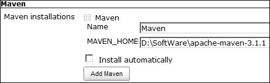

1.  转到 **Ant** 部分，点击 **Ant 安装**。然后，点击 **添加 Ant**，取消选择 **自动安装** 复选框，输入一个 **名称**，并将其设置为 **ANT_HOME**。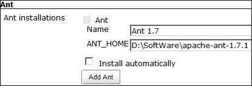

我们的基本配置已完成。接下来，我们将开始使用 Gradle 构建一个 Java 项目。

## Gradle 项目

Jenkins 不自带 Gradle。您需要按照以下步骤安装插件：

1.  启动 Jenkins URL；从主页转到 **管理 Jenkins** | **管理插件**。转到 **可用** 选项卡；在页面右上角的 **过滤器** 文本框中，输入 `gradle`。这将带您到 **Gradle 插件**。勾选与 **Gradle 插件** 相关的复选框，然后点击 **不重启安装**。

    这将安装 **Gradle 插件**。Jenkins 将显示安装进度。安装完成后，您需要配置 Gradle，就像我们对 Ant 和 Maven 所做的那样。参考以下截图来安装 **Gradle 插件**：

    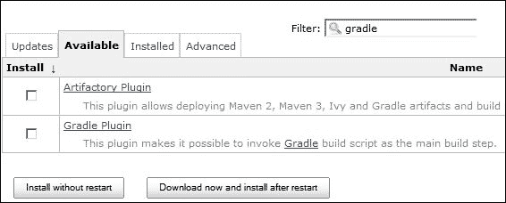

1.  从主页转到 **管理 Jenkins** | **配置系统**。滚动到 **Gradle** 部分，点击 Gradle 安装。然后，点击 **添加 Gradle**，取消选择 **自动安装** 复选框，输入一个 **名称**，并将 **GRADLE_HOME** 设置好。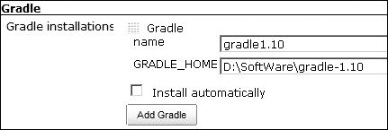

1.  返回主页。Jenkins 的项目构建约定是**作业**。一个作业会持续运行，调用脚本，并给出反馈。为了设置自动构建过程，用户必须配置一个作业。点击**创建新作业**超链接以添加新的项目类型。Jenkins 支持多种类型的构建作业。最常用的两种作业是自由式构建和 Maven 2/3 构建。自由式项目允许您配置任何类型的构建作业；这种作业类型非常灵活且可配置。然而，您可以安装插件以支持其他类型。

    以下截图显示了如何创建一个`gradleProject`自由式作业：

    

1.  自由式项目有几个设置。在**高级项目选项**中，您可以设置**静默期**（构建后的等待时间）、**重试次数**（从仓库签出的尝试次数）等。在**源代码管理**中，您可以选择版本控制工具类型。版本控制是 CI 中最重要的东西之一。它跟踪软件版本，我们可以在任何时间点回滚我们的更改，查看文件历史记录等。默认情况下，Jenkins 附带源代码管理工具插件，CVS 和 SVN，但我们可以安装插件以支持其他类型，如 Git 和 Rational ClearCase。我们尚未配置任何版本控制工具；因此，选择**无**，如下面的截图所示：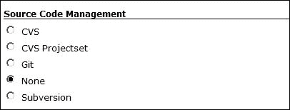

1.  接下来是**构建触发器**事件，构建触发器知道何时启动作业。有几种类型：

    +   **在构建其他项目之后构建**：这意味着作业将在另一个作业之后调用

    +   **定期构建**：这表示 cron 表达式的周期性调度，即每 5 分钟或每 30 分钟等

    +   **轮询 SCM**：这意味着在**调度**选项中设置特定时间后轮询版本控制位置

    我们没有其他作业或版本控制工具，因此选择**定期构建**并将**调度**设置为**H/5******以每 5 分钟执行一次构建，如下面的截图所示：

    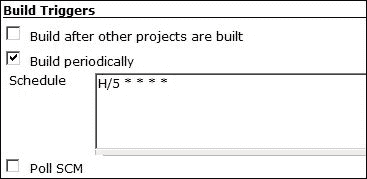

1.  下一个部分是**构建**。您可以为构建添加多个步骤。点击**添加构建步骤**。它将显示一个步骤；选择**调用 Gradle 脚本**以调用我们的 Gradle 项目，如下面的截图所示：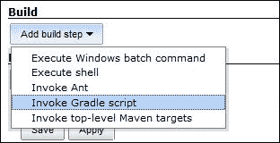

1.  现在点击**调用 Gradle**单选按钮并选择我们添加的 Gradle 版本。在**任务**字段中，输入`build`以调用构建任务；您可以在此处添加多个任务。在**构建文件**字段中，输入您的 Gradle 构建文件的完整路径`\Packt\chapter02\java\build.gradle`，如下面的截图所示：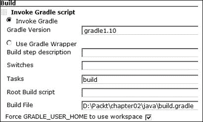

1.  现在点击**保存**。Jenkins 将带您到项目的首页。点击**立即构建**超链接。它将开始构建我们的第一个项目。它将显示一个包含构建编号的构建历史表，例如**#1 2014 年 2 月 4 日 09:18:45 PM**。点击**build#**超链接，然后点击**控制台输出**。它将显示构建日志。以下截图显示了我们的 Gradle 构建日志：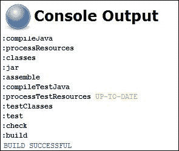

1.  现在返回首页；它显示了所有构建及其状态的列表。有一个天气列——当所有构建失败时，天气显示多云的图片，当所有构建通过时，天气变为晴朗。您可以通过点击每个构建行右侧的轮形符号来调用构建。参见图表：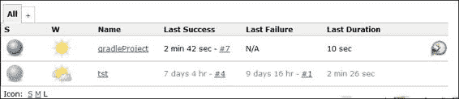

我们的 Gradle 构建配置已完成。自动地，每过五分钟，构建将被启动。我们可以配置构建后的操作，在每次构建后发送电子邮件。这样，如果构建失败，则立即发送邮件，相关人员可以处理问题。因此，反馈周期更快。

在下一节中，我们将配置 Maven 作业。

## Maven 项目

在本节中，我们将配置 Jenkins 执行 Maven 构建作业。请执行以下步骤：

1.  点击**新建工作**超链接以添加新的项目类型。选择**构建 Maven2/3 项目**并输入一个工作名称，如图所示：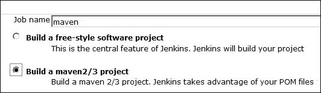

1.  在详情页面上，选择**源代码管理**为**无**，**构建触发器**为**定期构建**，并将**H/5******设置为每 5 分钟执行一次构建。

1.  接下来，转到**构建**部分，并设置**根 POM**值；在`Demo`项目中设置`pom.xml`文件的完整文件路径位置。您可以将**目标和选项**部分留空。Gradle 将发出默认的`mvn install`命令。参见图表：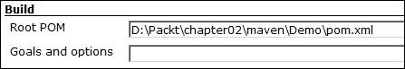

1.  现在点击**保存**。Jenkins 将带您到项目的首页。点击**立即构建**超链接，它将开始构建我们的第一个项目。它将显示一个包含构建编号的构建历史表，例如**#1 2014 年 2 月 4 日 09:18:45 PM**。点击**build#**超链接，然后点击**控制台输出**。它将显示以下构建日志：

    ```java
    Executing Maven:  -B -f D:\Packt\chapter02\maven\Demo\pom.xml install
    [INFO] Scanning for projects...

    [INFO] Building Demo 1.0-SNAPSHOT
     [INFO] Downloading: http://repo.maven.apache.org/maven2/org/apache/maven/plugin
    (226 KB at 33.4 KB/sec)
    [INFO] BUILD SUCCESS
     [INFO] Total time: 2:28.150s
    [
     [JENKINS] Archiving D:\Packt\chapter02\maven\Demo\pom.xml to org.packt/Demo/1.0-SNAPSHOT/Demo-1.0-SNAPSHOT.pom
    [JENKINS] Archiving D:\Packt\chapter02\maven\Demo\target\Demo-1.0-SNAPSHOT.jar to org.packt/Demo/1.0-SNAPSHOT/Demo-1.0-SNAPSHOT.jar
    channel stopped
    Finished: SUCCESS

    ```

1.  检查 Jenkins 是否发出了`mvn install`命令，创建了 JAR 文件，并在`.m2`仓库中安装了工件。

## 构建 Ant 项目

我们将设置一个使用 Ant 构建的自由风格软件项目。以下步骤如下：

1.  打开 Jenkins URL，点击**新建工作**，然后选择**构建自由风格软件项目**。输入名称`ant`，然后点击**确定**。

1.  我们没有源代码管理，因此跳过此部分。转到**构建触发器**并设置**H/5 * * * ***值以自动每 5 分钟启动构建。

1.  前往**构建**部分，添加一个**调用 Ant**构建步骤，如图所示：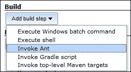

1.  从下拉菜单中选择一个 Ant 版本，将**目标**设置为`jar`；`jar`将调用测试和编译。在**构建文件**中，浏览到我们的`build.xml`文件位置并设置值，如图所示：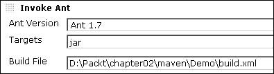

1.  保存设置，新的作业将被保存。点击**立即构建**。它将开始构建本章中较早创建的`Demo`项目。以下为**控制台输出**的截图：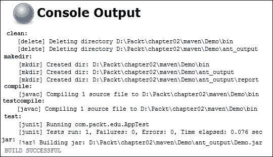

你可以在 Jenkins wiki 上阅读有关保护 Jenkins、构建后操作、损坏的构建声明插件和 CI 游戏的内容，网址为[`jenkins-ci.org/`](http://jenkins-ci.org/)。

# 摘要

本章涵盖了 CI 的概念，探索了构建自动化工具，并配置 Jenkins 以实现 CI。

Gradle 部分涵盖了环境设置、Gradle 任务、守护进程、依赖管理、仓库设置、Eclipse/Java 插件，并逐步探索了 Gradle 的功能。Maven 部分演示了如何设置 Maven，描述了 POM 文件、项目依赖，并探索了默认、清理和站点生命周期。Ant 部分描述了如何编写 Ant 脚本来编译和执行 JUnit 测试。Jenkins 部分涵盖了构建自动化设置以及使用 Gradle、Maven 和 Ant 的自动化构建。

到目前为止，读者将能够使用 Gradle、Maven 和 Ant 编写构建脚本，并配置 Jenkins 以执行构建脚本。

下一章提供了测试替身和不同测试替身类型的概述，并包含如哑元、存根、模拟、间谍和伪造等主题。
