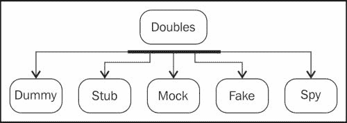

# 第三章：测试替身

本章涵盖了测试替身的概念，并解释了各种测试替身类型，如模拟、伪造、假设、存根和间谍。有时，由于协作对象不可用或实例化的成本，可能无法对一段代码进行单元测试。测试替身减轻了对协作对象的需求。

我们了解替身——一种用于电影中危险动作序列的受过训练的替代品，例如从帝国大厦跳下，在一辆燃烧的火车上打斗，从飞机上跳下或类似动作。替身用于保护真实演员或当演员不在场时进行补充。

在测试与 API 通信的类时，你不想在每次测试时都调用 API；例如，当一段代码依赖于数据库访问时，除非数据库可访问，否则无法对代码进行单元测试。同样，在测试与支付网关通信的类时，你不能向真实的支付网关提交支付以运行测试。

测试替身充当替身。它们是协作对象的熟练替代品。Gerard Meszaros 提出了测试替身这个术语，并在他的书籍《xUnit Test Patterns》中解释了测试替身。*Pearson Education*。

测试替身被分为五种类型。以下图表显示了这些类型：



# 假设

假设的一个例子是电影场景中，替身演员没有进行任何表演，只是在屏幕上出现。它们在实际演员不在场但需要出现在场景中时使用，例如观看美国公开赛网球决赛。

类似地，为了避免对强制参数对象传递`NullPointerException`，会传递假设对象，如下所示：

```java
Book javaBook = new Book("Java 101", "123456");
Member dummyMember = new DummyMember());
javaBook.issueTo(dummyMember);
assertEquals(javaBook.numberOfTimesIssued(),1);
```

在前面的代码片段中，创建了一个假设成员并将其传递给一个图书对象，以测试图书能否报告其被借阅的次数。在这里，成员对象在别处没有使用，但它需要用于借阅图书。

# 存根

当存根的方法被调用时，存根会向调用者提供间接输入。存根仅针对测试范围进行编程。存根可能会记录其他信息，例如方法被调用的次数等。

如果 ATM 的货币分配器未能分配现金，则应回滚账户交易。当我们没有 ATM 机器或如何模拟分配器失败的场景时，我们如何测试这一点？我们可以使用以下代码来完成：

```java
public interface Dispenser {
  void dispense(BigDecimal amount) throws DispenserFailed;
}
public class AlwaysFailingDispenserStub implements Dispenser{
  public void dispense(BigDecimal amount) throws DispenserFailed{
    throw new DispenserFailed (ErrorType.HARDWARE,"not  responding");
  }
}
class ATMTest...
  @Test
  public void transaction_is_rolledback_when_hardware_fails() {
    Account myAccount = new Account("John", 2000.00);
    TransactionManager txMgr = TransactionManager.forAccount(myAccount);
    txMgr.registerMoneyDispenser(new AlwaysFailingDispenserStub());
    WithdrawalResponse response = txMgr.withdraw(500.00);
    assertEquals(false, response.wasSuccess());
    assertEquals(2000.00, myAccount.remainingAmount());
  }
```

在前面的代码中，`AlwaysFailingDispenserStub`在调用`dispense()`方法时引发错误。这允许我们在硬件不存在的情况下测试事务行为。

Mockito 允许我们模拟接口和具体类。使用 Mockito，你可以模拟`dispense()`方法以抛出异常。

# 伪造

模拟对象是工作实现；大多数情况下，模拟类扩展了原始类，但它通常会对性能进行修改，这使得它不适合生产环境。以下是一个模拟对象的示例：

```java
public class AddressDao extends SimpleJdbcDaoSupport{

  public void batchInsertOrUpdate(List<AddressDTO> addressList, User user){
    List<AddressDTO> insertList = buildListWhereLastChangeTimeMissing(addressList);

    List<AddressDTO> updateList = buildListWhereLastChangeTimeValued(addressList);
    int rowCount =  0;

    if (!insertList.isEmpty()) {
      rowCount = getSimpleJdbcTemplate().batchUpdate(INSERT_SQL,…);
    }

    if (!updateList.isEmpty()){
      rowCount += getSimpleJdbcTemplate().batchUpdate(UPDATE_SQL,…);
    }

    if (addressList.size() != rowCount){
      raiseErrorForDataInconsistency(…); 
    }
}
```

`AddressDAO`类继承自 Spring 框架类，并提供了一个用于批量更新的 API。同一个方法用于创建新地址和更新现有地址；如果计数不匹配，则会引发错误。这个类不能直接进行测试，需要`getSimpleJdbcTemplate()`。因此，为了测试这个类，我们需要绕过 JDBC 协作者；我们可以通过扩展原始 DAO 类但重写协作者方法来实现。以下`FakeAddressDao`类是`AddressDao`的模拟实现：

```java
public class FakeAddressDao extends AddressDao{
  @Override
  public SimpleJdbcTemplate getSimpleJdbcTemplate() {
    return jdbcTemplate;
  } 
}
```

`FakeAddressDao`扩展了`AddressDao`，但只重写了`getSimpleJdbcTemplate()`并返回一个 JDBC 模板存根。我们可以使用 Mockito 创建`JdbcTemplate`的模拟版本，并从模拟实现中返回它。这个类不能用于生产，因为它使用了一个模拟的`JdbcTemplate`；然而，模拟类继承了 DAO 的所有功能，因此可以用于测试。模拟类对于遗留代码非常有用。

# 模拟

模拟对象有期望值；测试会从模拟对象中期望得到一个值，在执行过程中，模拟对象返回期望的结果。此外，模拟对象可以跟踪调用次数，即模拟对象上的方法被调用的次数。

以下示例是 ATM 示例的延续，使用模拟版本。在前一个示例中，我们模拟了`Dispenser`接口的 dispense 方法以抛出异常；这里，我们将使用模拟对象来复制相同的行为。我们将解释语法在第四章，*渐进式 Mockito*。

```java
public class ATMTest {
  @Mock Dispenser failingDispenser;

  @Before  public void setUp() throws Exception {
    MockitoAnnotations.initMocks(this);
  }

  @Test  public void transaction_is_rolledback_when_hardware_fails() throws DispenserFailed {
    Account myAccount = new Account(2000.00, "John");
    TransactionManager txMgr = TransactionManager.forAccount(myAccount);
    txMgr.registerMoneyDispenser(failingDispenser);

    doThrow(new  DispenserFailed()).when(failingDispenser).dispense(isA(BigDecimal.class));

    txMgr.withdraw(500);
      assertEquals(2000.00, myAccount.getRemainingBalance());

    verify(failingDispenser, new Times(1)).dispense(isA(BigDecimal.class));
}
}
```

上述代码是 ATM 测试的模拟（Mockito）版本。同一个对象可以在不同的测试中使用；只需设置期望值。在这里，`doThrow()`会在模拟对象被任何`BigDecimal`值调用时引发错误。

# 间谍

间谍（Spy）是模拟/存根（Mock/Stub）的一种变体，但它不仅设置期望值，还会记录对协作者的调用。以下示例解释了这一概念：

```java
class ResourceAdapter{  
  void print(String userId, String document, Object settings) {
    if(securityService.canAccess("lanPrinter1", userId)) {
      printer.print(document, settings);
    }
  }
}
```

要测试`ResourceAdapter`类的`print`行为，我们需要知道当用户有权限时，`printer.print()`方法是否被调用。在这里，`printer`协作者不做任何事情；它只是用来验证`ResourceAdapter`的行为。

现在，考虑以下代码：

```java
class SpyPrinter implements Printer{
  private int noOfTimescalled = 0;
   @Override
  public void print(Object document, Object settings) {
    noOfTimescalled++;
  }
  public int getInvocationCount() {
    return noOfTimescalled;
  }
}
```

`SpyPrinter`实现了`Printer.print()`调用，增加一个`noOfTimescalled`计数器，`getInvocationCount`返回计数。创建一个`SecurityService`类的模拟实现，使其从`canAccess(String printerName, String userId)`方法返回`true`。以下是`SecurityService`类的模拟实现：

```java
class FakeSecurityService implements SecurityService{
  public boolean canAccess(String printerName, String userId){
    return true;
  }
}
```

```java
print behavior of the ResourceAdapter class:
```

```java
@Test public void verify() throws Exception {
  SpyPrinter spyPrinter = new SpyPrinter();
  adapter = new ResourceAdapter(new FakeSecurityService(), spyPrinter);
  adapter.print("john", "helloWorld.txt", "all pages");
  assertEquals(1, spyPrinter.getInvocationCount());
}
```

创建了一个假的 `SecurityService` 对象和一个 `SpyPrinter` 对象，并将它们传递给 `ResourceAdapter` 类，然后调用 `adapter.print`。反过来，预期 `securityService` 对象将返回 `true`，并且将访问打印机，`spyPrinter.print(…)` 将增加 `noOfTimescalled` 计数器。最后，在前面代码中，我们验证了计数为 1。

# 摘要

本章通过示例概述了测试替身，包括哑元、存根、模拟、伪造和间谍。本章是 Mockito 的先决条件。

下一章将介绍 Mockito 框架及其高级用法。Mockito 是一个用于 Java 的模拟框架。它提供了创建模拟、间谍和存根的 API。
