# 第五章：探索代码覆盖率

本章解释了代码覆盖率、覆盖率工具，并提供了生成覆盖率报告的逐步指导。

本章涵盖了以下主题：

+   代码、分支和行覆盖率

+   覆盖率工具，如 Clover、Cobertura、EclEmma 和 JaCoCo

+   使用 Eclipse 插件测量覆盖率

+   使用 Ant、Maven 和 Gradle 生成报告

# 理解代码覆盖率

**代码覆盖率**是在自动化测试运行时，代码指令被执行的百分比度量。

高代码覆盖率意味着代码已经彻底进行了单元测试，并且比低代码覆盖率代码含有更少的错误机会。你应该专注于编写有意义的（业务逻辑）单元测试，而不是追求 100%的覆盖率，因为很容易通过完全无用的测试来欺骗并达到 100%的覆盖率。

可以使用许多指标来衡量代码覆盖率。以下是一些广泛使用的指标：

+   **语句或行覆盖率**：这衡量了被覆盖的语句或行

+   **分支覆盖率**：这衡量了每个控制结构（如 if-else 和 switch-case 语句）的每个分支的百分比

+   **函数或方法覆盖率**：这衡量了函数的执行

以下 Java 代码将阐明这些指标。

`absSum`方法接受两个整数参数，然后返回这两个参数的绝对和。`Integer`类型可以持有`NULL`值，因此该方法会检查`NULL`。如果两个参数都是`NULL`，则该方法返回`0`，如下面的代码所示：

```java
public class Metrics {
  public int absSum(Integer op1, Integer op2) {
    if (op1 == null && op2 == null) {
      return 0;
    }
    if (op1 == null && op2 != null) {
      return Math.abs(op2);
    }
    if (op2 == null) {
      return Math.abs(op1);
    }
    return Math.abs(op1)+Math.abs(op2);
  }
}
```

以下示例有 10 个分支：第一个`if(op1 == null && op2 == null)`语句有四个分支：`op1 == null`、`op1!= null`、`op2 == null`和`op2 != null`。同样，第二个`if`语句有四个分支，最后一个`if (op2 == null)`语句有两个分支，`op2== null`和`op2 != null`。

如果测试将两个非空整数传递给`absSum`方法，则它覆盖了四行，即三个`if`语句和最后的`return`语句，但前三个`return`语句仍然未被覆盖。它覆盖了十个分支中的三个；第一个`if`语句覆盖了四个分支中的一个，即`op1 == null`。同样，第二个`if`语句覆盖了四个分支中的一个，最后一个`if`语句覆盖了两个分支中的一个`op2 != null`。因此，分支覆盖率变为 30%。

要覆盖所有指令和所有分支，需要将以下四个输入对传递给方法：`[null, null]`、`[null, value]`、`[value, null]`和`[value, value]`。

## 学习代码插装的内部细节

覆盖率是通过基本代码分支或指令被某些测试执行的比例来衡量的，与在测试的系统中的指令或分支总数相比。

比率是通过一系列步骤测量的。首先，在源代码的一个副本中，每个语句块都被一个累加标志检测。然后，在检测代码上运行测试并更新标志。最后，一个程序收集累加标志并测量开启的标志与总标志数的比例。字节码可以在运行时或编译时更改。这正是测试覆盖率框架在幕后所做的事情。

有两种代码检测选项：源代码检测和对象代码检测。对象代码检测修改生成的字节码，因此很难实现。

之前的代码覆盖率示例有七行，但如果我们将分支展开成行，那么就会变成 14 行。如果一个覆盖率工具需要为代码添加检测点，那么它将修改源代码，并初始化一个长度为 14 的数组，初始值为 `0`，当测试运行时执行一行，则将该值设置为 `1`。以下示例演示了源代码检测：

```java
  int[] visitedLines = new int[14];
  public int absSumModified(Integer op1 , Integer op2) {
    visitedLines[0] = 1;
    if(op1 == null) {
      visitedLines[1] = 1;
      if(op2 == null) {
        visitedLines[2] = 1;
        return 0;
      }else {
        visitedLines[3] = 1;
      }
    }else {
      visitedLines[4] = 1;
    }

    visitedLines[5] = 1;
    if(op1 == null) {
      visitedLines[6] = 1;
      if(op2 != null) {
        visitedLines[7] = 1;
        return Math.abs(op2);
      }else {
        visitedLines[8] = 1;
      }
    }else {
      visitedLines[9] = 1;
    }

    visitedLines[10] = 1;
    if(op2 == null) {
      visitedLines[11] = 1;
      return Math.abs(op1);
    }else {
      visitedLines[12] = 1;
    }
    visitedLines[13] = 1;
    return Math.abs(op1)+Math.abs(op2);
  }}
```

测试执行后，覆盖率工具检查 `visitedLines` 数组，并计算所有 `visitedLines[index]` 等于 `1` 的行的比例与总行数的比例。如果我们用输入集 `[null, null]` 和 `[value, value]` 测试该方法，那么五行（第 4、7、8、9 和 12 行）仍然未被覆盖。要达到 100% 的覆盖率，我们需要用四个可能的 null 和非 null 整数的组合来测试该方法。

# 配置 Eclipse 插件

我们了解到覆盖率工具可以检测对象代码或源代码。Java 代码覆盖率工具可以分为两类：检测源代码的工具和检测字节码的工具。

源代码检测更容易，但需要重新编译源代码。字节码检测更复杂，但不需要重新编译源代码。

以下是可以用的 Java 代码覆盖率工具：

+   **Cobertura**：这个工具在离线检测字节码，是一个广泛使用的覆盖率工具。Cobertura 是一个开源项目（GNU GPL），并且与 Eclipse 和构建工具配置非常简单。2010 年 3 月发布的 1.9 版本是最新的稳定版本。

+   **EMMA**：这个工具可以在离线或运行时检测字节码，并在 Common Public License（CPL）下分发。2005 年 6 月发布的 2.1 版本是最新的版本。**Google CodePro AnalytiX** 基于 EMMA。

+   **Clover**：这个工具检测源代码，并附带 Atlassian 的专有许可证，最新的稳定版本 3.2 于 2014 年 2 月发布。

+   **JaCoCo**：这个工具在 Eclipse Public License（EPL）下分发。JaCoCo 在运行代码时动态检测字节码。最新的稳定版本，0.6.4，于 2013 年 12 月发布。JaCoCo 是 EMMA 的替代品。EclEmma 是基于 JaCoCo 的 Eclipse 插件。

以下部分将探讨基于前面 Java 覆盖率工具的 Eclipse 插件。

## 揭示 Clover 插件

可以安装 Clover 插件的试用版一个月。您可以在[`confluence.atlassian.com/display/CLOVER/`](https://confluence.atlassian.com/display/CLOVER/)查看安装说明。Clover Eclipse 插件支持站点更新和手动下载安装。

以下安装和执行 Clover 插件的步骤：

1.  在安装过程中，Clover 显示可安装元素的列表。展开**Clover**选项卡，选择**Clover 3**和**Clover 3 Ant Support**。以下截图显示了详细信息：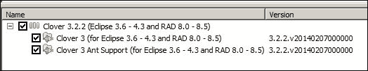

1.  打开**显示视图**菜单，选择所有**Clover**视图。以下截图显示了**Clover**视图：

1.  创建一个名为`Chapter05`的新 Java 项目，并将`Metrics.java`和`MetricsTest.java`Java 文件添加到项目中，如前所述。打开 Clover 的**覆盖率探索器**，点击**启用或禁用 Clover 在项目上**按钮。以下截图显示了按钮的详细信息：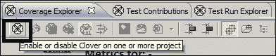

1.  选择`Chapter05`项目。Clover 将在此项目上启用源代码仪器化。右键单击`MetricsTest`文件，转到**使用 Clover 运行** | **JUnit 测试**。以下截图显示了弹出菜单：

1.  打开**覆盖率探索器**，它将显示以下覆盖率输出：

1.  打开**Clover 仪表板**。仪表板将显示覆盖率细节、测试结果、复杂性和最少测试的方法。以下截图显示了仪表板的详细信息：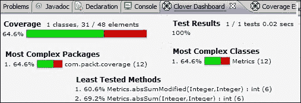

1.  打开源代码。Clover 插件装饰了源代码；未覆盖的行变成红色，覆盖的行变成绿色。它还显示每行的执行次数。以下是对仪器化源代码输出的显示：

## 使用 EclEmma 插件

EclEmma 版本 2.0 基于 JaCoCo 代码覆盖率库。按照[`www.eclemma.org/index.html`](http://www.eclemma.org/index.html)上的说明安装 EclEmma Eclipse 插件。与 Clover 一样，EclEmma 支持站点更新和手动下载。

一旦安装了 EclEmma，请按照以下步骤配置和执行测试：

1.  右键单击测试类，转到**覆盖率** | **1 JUnit 测试**。这将即时对字节码进行仪器化，并显示覆盖率报告。

1.  在 EclEmma 安装后，主菜单面板下会出现一个新的菜单按钮。当你展开这个菜单时，它会显示最近执行过的 JUnit 测试。点击菜单按钮以生成覆盖率报告。以下截图显示了 EclEmma 代码覆盖率菜单按钮：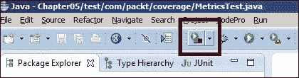

1.  当你打开**覆盖率**标签时，它会显示覆盖率详情。以下截图显示了输出：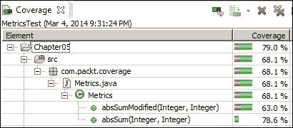

1.  在 EclEmma 中，分支覆盖率报告更为突出。以下截图显示了覆盖率详情：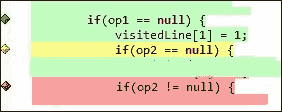

    绿色菱形表示分支被 100%覆盖，红色菱形表示分支没有被覆盖，黄色菱形表示分支部分被覆盖。

## 检查 eCobertura 插件

**eCobertura**是一个基于 Cobertura 的 Eclipse 插件。eCobertura 以表格格式显示分支覆盖率。要安装 eCobertura 插件，请访问[`marketplace.eclipse.org/content/ecobertura#.UxYBmoVh85w`](https://marketplace.eclipse.org/content/ecobertura#.UxYBmoVh85w)，并将**安装**按钮拖到正在运行的 Eclipse 工作空间中。Eclipse 将自动为你安装插件。以下截图显示了 Marketplace 的**安装**按钮：


安装后，Cobertura 菜单面板下会出现一个新的菜单按钮，如下截图所示：


使用 eCobertura 测量代码覆盖率有以下步骤：

1.  前往**显示视图** | **其他**，然后在**eCobertura**下选择**覆盖率会话视图**选项。

1.  执行测试然后点击 Cobertura 菜单按钮，或者从下拉菜单中选择你想要测量的测试。

1.  打开**覆盖率会话视图**标签。这将显示以下输出：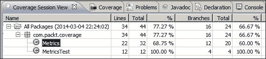

注意分支覆盖率是 60%。在上一个章节中，我们测量了 10 个分支。使用我们的自定义覆盖率程序，我们测量出 10 个分支中有 4 个被覆盖。这证明了我们的自定义代码覆盖率程序运行良好。

# 使用 Gradle 测量覆盖率

Gradle 可以被配置为使用 JaCoCo 生成覆盖率报告。本节将解释如何在项目中配置 Gradle JaCoCo 插件。

以下是如何配置 Gradle 插件的步骤：

1.  在任何目录下创建一个名为`Chapter05`的基础文件夹，例如`D:/Packt`；然后在`Chapter05`下添加一个`lib`文件夹，并将`JUnit4`和`hamcrest` JAR 文件复制到`lib`文件夹中。在基础文件夹`Chapter05`下添加另一个名为`Chapter05`的文件夹用于 Java 项目。根据 Gradle 约定，源文件保存在`src/main/java`下，测试文件保存在`src/test/java`下。在`Chapter05\Chapter05`下创建目录。

    ### 小贴士

    这个`Chapter05`命名策略是为了让您更容易跟踪项目并从 Packt Publishing 网站下载代码，但您的代码应该表达代码的意图。名称`Chapter05`没有任何意义，也许您可以将其命名为类似`SimpleGradleProject`或`GradleCoverageProject`。

1.  将 Eclipse 项目的内容以及我们在“揭示 Clover 插件”部分创建的`Metrics`和`MetricsTest` Java 文件复制到新目录。按照 Gradle 约定，将`src`文件夹的内容复制到`src/main/java`，将`test`文件夹的内容复制到`src/test/java`。

1.  在`Chapter05\Chapter05`下直接创建一个`build.gradle`文件，并将以下代码片段添加到文件中以启用 JaCoCo 覆盖率：

    ```java
    apply plugin: 'java'
    apply plugin: "jacoco"
    repositories {
        flatDir(dir: '../lib', name: 'JUnit Library')
        mavenCentral()
    }
    dependencies {
        testCompile'junit:junit:4.11', ':hamcrest-core:1.3'}
        jacocoTestReport {
          reports {
            xml.enabled false
            csv.enabled false
            html.destination "${buildDir}/jacocoHtml"
        }
    }
    ```

1.  `jaCoCo`插件添加了一个新的任务`jacocoTestReport`。要执行`jacocoTestReport`任务，需要在`repositories`闭包中添加一个`mavenCentral()`仓库依赖项。Gradle 从`mavenCentral`仓库下载所需的`jaCoCo` JAR 文件。

1.  打开命令提示符，转到`Chapter05\Chapter05`目录，并运行`gradle jacocoTestReport`命令。这将下载 JAR 文件并生成覆盖率报告。以下截图显示了控制台输出：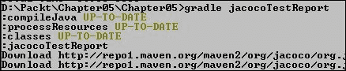

1.  打开`Chapter05\Chapter05\build\jacocoHtml`并启动`index.html`文件。以下是 JaCoCo 覆盖率报告输出：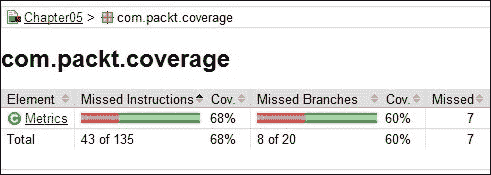

# 使用 Maven Cobertura 插件

Maven 有一个 Cobertura 插件来测量代码覆盖率；本节将解释如何配置项目中的 Cobertura Maven 插件。

### 小贴士

Cobertura 使用`asm`来检测字节码。`asm`框架是一个 Java 字节码操作和分析框架。访问[`asm.ow2.org/`](http://asm.ow2.org/)获取`asm`的详细信息。Cobertura 修改`.class`文件，导入`net.sourceforge.cobertura.coveragedata.*`，实现`HasBeenInstrumented`接口，并添加捕获覆盖率的代码，例如`ProjectData.getGlobalProjectData().getOrCreateClassData("com.packt.coverage.Metrics").touch(21);`。

在检测字节码后，Cobertura 创建一个`.ser`文件并在测试执行期间更新该文件。这个`.ser`文件包含测试覆盖率详情。没有它，检测过的字节码可能会比正常字节码稍微慢一些。

按照以下步骤配置 Maven 以生成 Cobertura 报告：

1.  创建一个`pom.xml`文件并将其放置在`/Chapter05/Chapter05`下。

1.  修改`pom.xml`文件以添加项目详细信息如下：

    ```java
    <project  
      xsi:schemaLocation="http://maven.apache.org/POM/4.0.0 http://maven.apache.org/xsd/maven-4.0.0.xsd">
      <modelVersion>4.0.0</modelVersion>

      <groupId>org.packt</groupId>
      <artifactId>Chapter05</artifactId>
      <version>1.0-SNAPSHOT</version>
      <packaging>jar</packaging>

      <name>Chapter05</name>
      <url>http://maven.apache.org</url>
    ```

1.  按照以下方式添加 Cobertura 插件的详细信息：

    ```java
    <build>
      <plugins>
        <plugin>
          <groupId>org.codehaus.mojo</groupId>
          <artifactId>cobertura-maven-plugin</artifactId>
          <version>2.2</version>
          <configuration>
            <formats>
              <format>html</format>
              <format>xml</format>
            </formats>
          </configuration>
          <executions>
            <execution>
              <phase>package</phase>
              <goals>
                <goal>cobertura</goal>
              </goals>
            </execution>
          </executions>
        </plugin>          
      </plugins>
    </build>
    ```

1.  打开命令提示符，将目录更改为`/Chapter05/Chapter05`，并执行`mvn cobertura:cobertura`命令。这将开始下载 Cobertura 插件文件并开始对`.class`文件进行检测。以下截图展示了 Maven 控制台输出：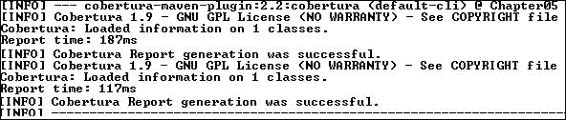

1.  打开`/Chapter05/Chapter05/target`。`target`文件夹包含以下重要子文件夹：

    +   `cobertura`: 这包含`cobertura.ser`文件

    +   `generated-classes`: 这包含被检测的字节码或`.class`文件

    +   `site`: 这包含 XML 和 HTML 格式的覆盖率报告

    +   `surefire-reports`: 这包含测试执行报告

以下截图显示了在`site`文件夹中生成的 HTML 格式的覆盖率报告：

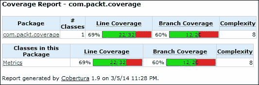

# 运行 Cobertura Ant 任务

本节将解释如何在项目中配置 Cobertura Ant 任务。

以下是为配置的步骤：

1.  Gradle 和 Maven 可以在构建过程中下载覆盖率工具 JAR 文件，但 Ant 需要将 Cobertura JAR 文件添加到类路径。从[`cobertura.github.io/cobertura/`](http://cobertura.github.io/cobertura/)下载 Cobertura ZIP 文件。

1.  提取 ZIP 文件，并将下载的 ZIP 文件中的所有 JAR 文件复制到`Chapter05\lib`。包括`lib`文件夹中的所有 JAR 文件以及`root`文件夹中的`cobertura.jar`。

1.  在`Chapter05\Chapter05`下创建一个`build.properties`文件，并输入以下信息：

    ```java
    src.dir=src/main/java
    test.dir=src/test/java
    # The path to cobertura.jar
    cobertura.dir=../lib
    classes.dir=classes
    instrumented.dir=instrumented
    reports.dir=reports
    # Unit test reports from JUnit are deposited into this directory
    reports.xml.dir=${reports.dir}/junit-xml
    reports.html.dir=${reports.dir}/junit-html
    coverage.xml.dir=${reports.dir}/cobertura-xml
    coverage.summaryxml.dir=${reports.dir}/cobertura-summary-xml
    coverage.html.dir=${reports.dir}/cobertura-html

    ```

    `src.dir`属性表示源文件夹位置，`test.dir`表示测试文件位置。`cobertura.dir`属性指的是 Cobertura 库或 JAR 文件。覆盖率工具需要访问 Cobertura 库文件。其他条目是用于报告生成和字节码检测所必需的。

1.  在`Chapter05\Chapter05`下创建一个`build.xml`文件，并添加 Cobertura 检测和 JUnit 测试的目标以更新`.ser`文件并生成报告。从 Packt Publishing 网站（`Chapter05`代码）下载`build.xml`文件。重要目标包括`init`、`compile`、`testcompile`、`instrument`、`test`、`coverage-report`、`summary-coverage-report`、`alternate-coverage-report`和`clean`。

1.  打开命令提示符，将目录更改为`Chapter05\Chapter05`，并执行`ant`命令。这将生成报告。以下是该命令的控制台输出：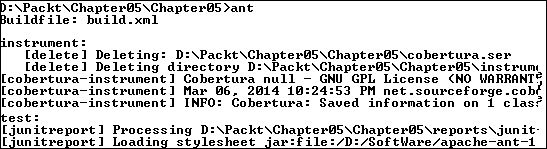

    Cobertura 在`Chapter05\Chapter05\reports`中生成报告。`reports`文件夹包含各种 XML 和 HTML 格式的报告。

    ### 小贴士

    代码覆盖率并不是一个能够提供零缺陷软件的银弹！最重要的是编写有效的测试和单元测试逻辑。为 getter 和 setter 或构造函数编写测试并不增加价值。

# 摘要

在本章中，我们将深入介绍代码覆盖率，并提供使用 Eclipse 插件和各种覆盖率工具（如 Clover、JaCoCo、EclEmma 和 Cobertura）来测量代码覆盖率的示例。我们还已配置 Ant、Maven 和 Gradle，使用覆盖率工具生成代码覆盖率报告。

到本章结束时，你应该能够配置 Eclipse 插件和构建脚本来测量代码覆盖率。

下一章涵盖了静态代码分析、代码指标以及各种开源工具。它配置并使用 PMD、Checkstyle 和 FindBugs 来分析代码质量，并探索 Sonar 代码质量仪表板。
