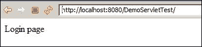
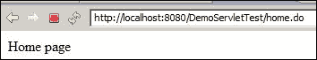
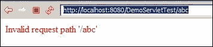
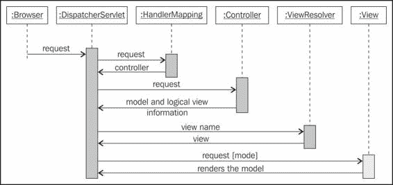
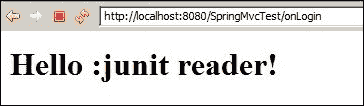

# 第七章：单元测试 Web 层

> “如果你不喜欢对你的产品进行单元测试，那么你的客户很可能也不喜欢对其进行测试。”
> 
> ——匿名

企业应用程序遵循**N 层架构模型**来处理众多非功能性关注点，例如可升级性、可扩展性和可维护性。最佳的设计方法是解耦各个层；这允许在不影响其他层的情况下扩展一个层，或者在不影响其他层的情况下重构一个层的代码。通常，任何 Web 应用程序都包含三个层：表示层、业务逻辑层和数据库层。本章将处理对 Web 层或表示层的单元测试。下一章将涵盖应用程序和数据库层。

本章将涵盖以下主题：

+   单元测试 MVC 中的 servlet 控制器

+   理解在表示层中要测试的内容

# 单元测试 servlet

**模型-视图-控制器**（**MVC**）是一种广泛使用的 Web 开发模式。MVC 模式定义了三个相互关联的组件：模型、视图和控制器。

模型表示应用程序数据、逻辑或业务规则。

视图是信息或模型的表示。一个模型可以有多个视图；例如，学生的分数可以用表格格式或图形图表表示。

控制器接受客户端请求并启动命令以更新模型或更改视图。

控制器控制应用程序的流程。在 JEE 应用程序中，控制器通常实现为一个 servlet。控制器 servlet 拦截请求并将每个请求映射到适当的处理资源。在本节中，我们将构建一个经典的 MVC 前端控制器 servlet 以将请求重定向到视图。

只有上下文路径的请求，例如`http://localhost:8080/context/`，将被路由到`login.jsp`页面，所有主页请求（带有 URL `/home.do`）将被路由到`home.jsp`页面，所有其他请求将被路由到`error.jsp`页面。

## 构建和单元测试一个 J2EE Web 应用程序

按照以下步骤构建 Web 应用程序并测试控制器逻辑：

1.  在 Eclipse 中创建一个名为`DemoServletTest`的动态 Web 项目。

1.  创建一个名为`com.packt.servlet.DemoController`的控制器 servlet，并将以下行添加到`doGet`方法中：

    ```java
    protected void doGet(HttpServletRequest req, HttpServletResponse res) throws ServletException, IOException {
      String urlContext = req.getServletPath();
      if(urlContext.equals("/")) {
        req.getRequestDispatcher("login.jsp").forward(req, res);  
      }else if(urlContext.equals("/home.do")) {
        req.getRequestDispatcher("home.jsp").forward(req, res);  
      }else {
        req.setAttribute("error", "Invalid request path '"+urlContext+"'");
        req.getRequestDispatcher("error.jsp").forward(req, res);  
      }
    }
    ```

    此方法从请求中获取 servlet 路径并与`/`标记进行匹配。如果没有找到匹配项，则`doGet`方法将错误属性设置到请求中。

1.  创建三个 JSP 文件：`login.jsp`、`home.jsp`和`error.jsp`。修改`error.jsp`文件，并添加以下脚本以显示错误消息：

    ```java
    <body>
      <font color="RED"><%=request.getAttribute("error") %></font>
    </body>
    ```

1.  修改`web.xml`文件以将所有请求映射到`DemoController`。在`web.xml`文件中添加以下代码行：

    ```java
    <web-app    xsi:schemaLocation="http://java.sun.com/xml/ ns/javaee http://java.sun.com/xml/ns/javaee/web-app_3_0.xsd" id="WebApp_ID" version="3.0">
     <display-name>DemoServletTest</display-name>
      <servlet>
        <servlet-name>demo</servlet-name>
        <servlet-class>com.packt.servlet.DemoController
       </servlet-class>
      </servlet>
      <servlet-mapping>
        <servlet-name>demo</servlet-name>
        <url-pattern>/</url-pattern>
      </servlet-mapping>
    </web-app>
    ```

    `demo` servlet 映射`url-pattern`标签。

应用程序已准备就绪，但我们如何对控制器逻辑进行单元测试？

我们不能实例化 `HttpServletRequest` 或 `HttpServletResponse` 对象。我们可以使用 Mockito 模拟 `HttpServletRequest` 或 `HttpServletResponse` 对象。

创建一个名为 `DemoControllerTest` 的测试类，并添加以下代码片段：

```java
@RunWith(MockitoJUnitRunner.class)
public class DemoControllerTest {
  @Mock   HttpServletRequest req;
  @Mock   HttpServletResponse res;
  @Mock   RequestDispatcher dispatcher;
  DemoController controllerServlet;

  @Before
  public void setup() {
    controllerServlet = new DemoController();
    when(req.getRequestDispatcher(anyString())).      thenReturn(dispatcher);
  }

  @Test
  public void when_servlet_path_is_empty_then_opens_login_page(){
    when(req.getServletPath()).thenReturn("/");
    controllerServlet.doGet(req, res);
    ArgumentCaptor<String> dispatcherArgument =        ArgumentCaptor.forClass(String.class);
    verify(req).getRequestDispatcher(      dispatcherArgument.capture());
    assertEquals("login.jsp", dispatcherArgument.getValue());
  }

  @Test
  public void when_home_page_request_then_opens_home_page(){
    when(req.getServletPath()).thenReturn("/home.do");
    controllerServlet.doGet(req, res);

    ArgumentCaptor<String> dispatcherArgument =       ArgumentCaptor.forClass(String.class);
    verify(req).getRequestDispatcher(      dispatcherArgument.capture());
    assertEquals("home.jsp", dispatcherArgument.getValue());
  }

  @Test
  public void when_invalid_request_then_opens_error_page(){
    when(req.getServletPath()).thenReturn("/xyz.do");
    controllerServlet.doGet(req, res);
    ArgumentCaptor<String> dispatcherArgument =       ArgumentCaptor.forClass(String.class);
    verify(req).getRequestDispatcher(      dispatcherArgument.capture());
    assertEquals("error.jsp", dispatcherArgument.getValue());
  }
}
```

注意，使用 mockito 模拟了 `request` 和 `response` 对象，并设置了期望以获取 `ServletPath`，然后使用 `verify` 检查控制器返回的视图名称。我们添加了三个测试来验证控制器逻辑：一个用于检查默认上下文路径，一个用于检查 `home.do` URL，另一个用于验证错误条件。

从服务器视图（在服务器视图中右键单击并创建一个新的服务器；从服务器向导中选择 Tomcat 并设置运行时配置）创建一个 Tomcat 服务器实例并运行应用程序。打开浏览器并访问 `http://localhost:8080/DemoServletTest/`，检查应用程序是否打开 **登录页面**。以下为浏览器输出：



访问 `http://localhost:8080/DemoServletTest/home.do`；它将打开 **主页**。以下为浏览器输出：



访问任何其他 URL，例如 `http://localhost:8080/DemoServletTest/abc`。它将打开一个错误页面并显示错误信息。以下为错误输出：



上述浏览器验证结果表明我们的 JUnit 测试运行良好。

`DemoServletTest` 充当 **前端控制器**。前端控制器是一种设计模式，其中单个 servlet 处理所有网络请求并将它们路由到其他控制器或处理器进行实际处理。所有使用 Java 或 Servlet API 编写的动态网络应用程序都需要一个前端控制器 servlet 来处理 HTTP 请求，因此所有项目都编写逻辑上重复的代码来通过前端控制器 servlet 处理请求。

Spring MVC 是为了为网络应用程序开发者提供一个灵活的框架而构建的。Spring 的 `DispatcherServlet` 充当前端控制器；类似于 `DemoServletTest` 测试，它接收所有传入的请求并将请求的处理委托给处理器。它允许开发者专注于业务逻辑，而不是在自定义前端控制器的样板代码上工作。下一节将描述 Spring MVC 架构以及如何使用 Spring MVC 对网络应用程序进行单元测试。

# 撒娇 Spring MVC

在 Spring MVC 中，以下是一个简化的请求处理机制的示例：

1.  `DispatcherServlet` 接收一个请求并与处理器映射协商以确定哪个控制器可以处理该请求，然后将请求传递给该控制器。

1.  控制器执行业务逻辑（可以委托请求到服务或业务逻辑处理器）并将一些信息返回给 `DispatcherServlet` 以供用户显示或响应。而不是直接将信息（模型）发送给用户，控制器返回一个可以渲染模型的视图名称。

1.  `DispatcherServlet` 然后根据视图名称解析物理视图，并将模型对象传递给视图。这样，`DispatcherServlet` 就与视图实现解耦了。

1.  视图渲染模型。一个视图可以是 JSP 页面、servlet、PDF 文件、Excel 报告或任何可展示的组件。

以下序列图表示了 Spring MVC 组件的流程和交互：



我们将构建一个 Spring 网络应用程序，并使用 JUnit 对代码进行单元测试。以下是需要执行的步骤：

1.  启动 Eclipse 并创建一个名为 `SpringMvcTest` 的动态网络项目。

1.  打开 `web.xml` 并输入以下行：

    ```java
    <display-name>SpringMVCTest</display-name>
    <servlet>
      <servlet-name>dispatcher</servlet-name>
      <servlet-class>
        org.springframework.web.servlet.DispatcherServlet
      </servlet-class>
      <load-on-startup>1</load-on-startup>
      </servlet>
      <servlet-mapping>
        <servlet-name>dispatcher</servlet-name>
        <url-pattern>/</url-pattern>
      </servlet-mapping>
      <context-param>
        <param-name>contextConfigLocation</param-name>
        <param-value>
          /WEB-INF/dispatcher-servlet.xml
        </param-value>
      </context-param>
    </web-app>
    ```

    分发器被命名为 `DispatcherServlet`，它映射所有请求。注意 `contextConfigLocation` 参数。这表明 Spring 容器在 `/WEB-INF/dispatcher-servlet.xml` 中定义了 Spring 容器。

1.  在 `WEB-INF` 中创建一个名为 `dispatcher-servlet.xml` 的 XML 文件，并添加以下行：

    ```java
    <?xml version="1.0" encoding="UTF-8"?>
    <beans 

      xsi:schemaLocation="
      http://www.springframework.org/schema/beans     
      http://www.springframework.org/schema/beans/spring-beans-3.0.xsd
      http://www.springframework.org/schema/context 
      http://www.springframework.org/schema/context/spring-context-3.0.xsd">
     <context:component-scan base-package="com.packt" />
     <bean class= "org.springframework.web.servlet.view.
        InternalResourceViewResolver">
      <property name="prefix">
        <value>/WEB-INF/pages/</value>
      </property>
      <property name="suffix">
          <value>.jsp</value>
        </property>
      </bean>
    </beans>
    ```

    此 XML 定义了一个 Spring 视图解析器。任何视图都将位于 `/WEB-INF/pages` 位置，并具有 `.jsp` 后缀，所有容器都配置在 `com.packt` 包下，并使用 Spring 注解。

1.  在 `com.packt.model` 包中创建一个名为 `LoginInfo` 的类。这个类表示登录信息。添加两个私有的 `String` 字段，`userId` 和 `password`，并生成获取器和设置器。

1.  在 `/WEB-INF/view` 下创建一个名为 `login.jsp` 的 JSP 页面，并添加以下行以使用 Spring 标签库创建表单。修改表单并添加用于用户名和密码的正常 HTML 输入：

    ```java
    <%@ taglib prefix="sf" uri="http://www.springframework.org/tags/form"%>
    <sf:form method="POST" modelAttribute="loginInfo" action="/onLogin">

    </sf:form>
    ```

1.  创建一个名为 `com.packt.controller.LoginController` 的控制器类来处理登录请求。添加以下行：

    ```java
    @Controller
    @Scope("session")
    public class LoginController implements Serializable {
      @RequestMapping({ "/", "/login" })
      public String onStartUp(ModelMap model) {
        model.addAttribute("loginInfo", new LoginInfo());
        return "login";
      }
    }
    ```

    `@Controller` 注解表示该类是一个 Spring MVC 控制器类。在 `smapl-servlet.xml` 中，我们定义了 `<context:component-scan base-package="com.packt" />`，因此 Spring 将扫描此 `@Controller` 注解并创建一个 Bean。`@RequestMapping` 注解将任何请求与默认路径 `/SpringMvcTest/` 或 `/SpringMvcTest/login` 映射到 `onStartUp` 方法。此方法返回一个逻辑视图名称 `login`。XML 文件中定义的视图解析器将登录请求映射到 `/WEB-INF/pages` 下的物理视图 `login.jsp` 页面。

1.  在 `Login` 类中创建另一个方法来处理登录和提交请求，如下所示：

    ```java
    @RequestMapping({ "/onLogin" })
    public String onLogin(@ModelAttribute("loginInfo") LoginInfo loginInfo, ModelMap model) {
      if(!"junit".equals(loginInfo.getUserId())) {
        model.addAttribute("error", "invalid login name");
        return "login";
      }
      if(!"password".equals(loginInfo.getPassword())) {
        model.addAttribute("error", "invalid password");
        return "login";
      }
      model.addAttribute("name", "junit reader!");
      return "greetings";
    }
    ```

    `onLogin`方法与`/onLogin`映射。`@ModelAttribute("loginInfo")`方法是来自`login.jsp`表单提交的模型。此方法检查用户名是否为`junit`且密码为`password`。如果用户 ID 或密码不匹配，则登录页面将显示错误信息，否则将打开`greetings`视图。

1.  将`login.jsp`文件的内容更改为将表单提交到`/SpringMvcTest/onLogin`，并将`modelattribute`名称更改为`loginInfo`，如下所示：

    ```java
    <sf:form method="POST" modelAttribute="loginInfo" action="/SpringMvcTest/onLogin">
    ```

    此外，添加`<h1>${error}</h1>` JSTL 表达式以显示错误信息。

1.  在`com.packt.controller`目录下创建一个名为`greetings.jsp`的 JSP 文件，并添加以下行：

    ```java
    <h1>Hello :${name}</h1>
    ```

1.  在浏览器中输入`http://localhost:8080/SpringMvcTest/`；这将打开登录页面。在登录页面，不要输入任何值，只需点击**提交**。它将显示**无效登录名**错误信息。现在，在**用户 ID**字段中输入`junit`，在**密码**字段中输入`password`并按*Enter*。应用程序将使用以下截图所示的消息问候你：

我们可以对`controller`类进行单元测试。以下是一些步骤：

1.  在`com.packt.controller`目录下创建一个`LoginControllerTest.java`类。

1.  使用以下代码，添加一个测试来检查当用户 ID 为 null 时，是否会抛出错误信息：

    ```java
    public class LoginControllerTest {
      LoginController controller = new LoginController();
      @Test
      public void when_no_name_entered_shows_error_message(){
        ModelMap model = new ModelMap();
        String viewName = controller.onLogin(new LoginInfo(), model);
        assertEquals("login", viewName);
        assertEquals("invalid login name", model.get("error"));
      }
    }
    ```

1.  添加另一个测试来检查无效密码，如下所示：

    ```java
    @Test
    public void when_invalid_password_entered_shows_error_message()   {
      ModelMap model = new ModelMap();
      LoginInfo loginInfo = new LoginInfo();
      loginInfo.setUserId("junit");
      String viewName =controller.onLogin(loginInfo, model);
      assertEquals("login", viewName);
      assertEquals("invalid password", model.get("error"));
    }
    ```

1.  添加一个`happyPath`测试，如下所示：

    ```java
    @Test   public void happyPath(){
      loginInfo.setUserId("junit");
      loginInfo.setPassword("password");
      String viewName =controller.onLogin(loginInfo, model);
      assertEquals("greetings", viewName);
    }
    ```

这只是一个 Spring MVC 的示例，所以我们使用硬编码的常量来检查用户名和密码。在现实世界中，服务会查询数据库以获取用户信息，并返回错误信息；服务可以被自动注入到控制器中。这样，我们可以对控制器和服务层进行单元测试。

# 摘要

本章解释了表示层的单元测试策略，并提供了前端控制器 servlet 和 Spring MVC 的示例。

到目前为止，你应该能够对 Web 层组件进行单元测试，并将视图组件从表示逻辑中隔离出来。

下一章将介绍数据库层的单元测试。
