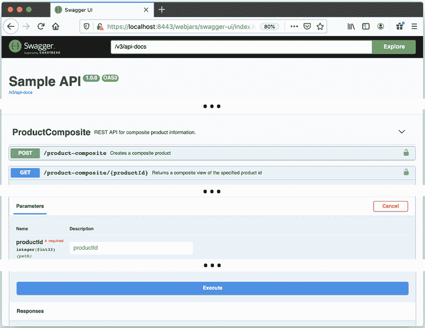

# 第二章：Spring Boot 简介

在本章中，我们将介绍如何使用 Spring Boot 构建一组协作的微服务，重点关注如何开发提供业务价值的功能。我们将对上一章中指出的微服务挑战进行一定程度上的考虑，但在后续章节中将对它们进行全面解决。

我们将开发包含业务逻辑的微服务，基于普通的**Spring Beans**，并使用**Spring WebFlux**公开 REST API。API 将根据 OpenAPI 规范使用`springdoc-openapi`进行文档编制。为了使微服务处理的数据持久化，我们将使用**Spring Data**在 SQL 和 NoSQL 数据库中存储数据。

自 2018 年 3 月 Spring Boot v2.0 版本发布以来，开发反应式微服务（包括非阻塞同步 REST API）变得更加容易。为了开发基于消息的异步服务，我们将使用**Spring Cloud Stream**。有关更多信息，请参阅*第一章*，*微服务简介*中的*反应式微服务*部分。

2022 年 11 月，Spring Boot 3.0 版本发布。它基于 Spring Framework 6.0 和 Jakarta EE 9，同时也兼容 Jakarta EE 10。作为最低 Java 版本，需要 Java 17，这是当前的**长期支持**（**LTS**）版本。

最后，我们将使用**Docker**将我们的微服务作为容器运行。这将使我们能够通过单个命令启动和停止包括数据库服务器和消息代理在内的微服务景观。

这有很多技术和框架，所以让我们简要地了解一下它们各自的内容！

在本章中，我们将介绍以下开源项目：

+   Spring Boot

（本节还包括 v3.0 的新功能和如何迁移 v2 应用程序的概述。）

+   Spring WebFlux

+   `springdoc-openapi`

+   Spring Data

+   Spring Cloud Stream

+   Docker

每个产品的更多详细信息将在后续章节中提供。

# 技术要求

本章不包含任何可以下载的源代码，也不需要安装任何工具。

# Spring Boot

Spring Boot，以及它所基于的 Spring 框架，是一个用于在 Java 中开发微服务的优秀框架。

当 Spring Framework v1.0 版本在 2004 年发布时，其主要目标之一是解决过于复杂的**J2EE**标准（即**Java 2 Platform, Enterprise Edition**）及其臭名昭著且重量级的部署描述符。Spring 框架提供了一个基于**依赖注入**概念的更轻量级的开发模型。与 J2EE 中的部署描述符相比，Spring 框架还使用了更轻量级的 XML 配置文件。

要使 J2EE 标准的问题更加严重，重量级的部署描述符实际上有两种类型：

+   标准部署描述符，以标准化的方式描述配置

+   供应商特定的部署描述符，将配置映射到供应商应用程序服务器中的特定功能

在 2006 年，J2EE 被更名为**Java EE**，即**Java 平台，企业版**。在 2017 年，Oracle 将 Java EE 提交给 Eclipse 基金会。2018 年 2 月，Java EE 被更名为 Jakarta EE。新的名称，Jakarta EE，也影响了由标准定义的 Java 包的名称，要求开发者在升级到 Jakarta EE 时进行包重命名，如*迁移 Spring Boot 2 应用程序*部分所述。多年来，随着 Spring 框架越来越受欢迎，Spring 框架的功能也显著增长。慢慢地，使用不再轻量级的 XML 配置文件设置 Spring 应用程序所带来的负担成为一个问题。

在 2014 年，Spring Boot v1.0 发布，解决了这些问题！

## 约定优于配置和胖 JAR 文件

Spring Boot 通过对如何设置 Spring 框架的核心模块和第三方产品（如用于日志记录或连接到数据库的库）有明确的意见，旨在快速开发生产就绪的 Spring 应用程序。Spring Boot 通过默认应用一系列约定来实现这一点，最大限度地减少了对配置的需求。在需要时，可以通过编写一些配置来覆盖每个约定，具体情况具体分析。这种设计模式被称为**约定优于配置**，并最大限度地减少了初始配置的需求。

在需要时，我认为使用 Java 和注解编写配置最佳。虽然它们比 Spring Boot 之前要小得多，但基于 XML 的老式配置文件仍然可以使用。

除了使用约定优于配置之外，Spring Boot 还倾向于基于独立 JAR 文件（也称为**胖 JAR 文件**）的运行时模型。在 Spring Boot 之前，运行 Spring 应用程序最常见的方式是将它作为 WAR 文件部署在 Java EE 服务器上，例如 Apache Tomcat。Spring Boot 仍然支持 WAR 文件部署。

一个胖 JAR 文件不仅包含应用程序本身的类和资源文件，还包含应用程序所依赖的所有 JAR 文件。这意味着胖 JAR 文件是运行应用程序所需的唯一 JAR 文件；也就是说，我们只需要将一个 JAR 文件传输到我们想要运行应用程序的环境中，而不是将应用程序的 JAR 文件以及所有依赖的 JAR 文件一起传输。

启动胖 JAR 文件不需要安装单独的 Java EE 服务器，例如 Apache Tomcat。相反，可以使用简单的命令（如 `java -jar app.jar`）启动，使其成为在 Docker 容器中运行的理想选择！例如，如果 Spring Boot 应用程序使用 HTTP 来公开 REST API，它也将包含一个嵌入的 Web 服务器。

## 设置 Spring Boot 应用程序的代码示例

为了更好地理解这意味着什么，让我们看看一些源代码示例。

我们在这里只将查看一些小的代码片段来指出主要特性。对于完整的工作示例，你将不得不等到下一章才能看到！

### 魔法的`@SpringBootApplication`注解

基于约定的自动配置机制可以通过在应用程序类（即包含静态`main`方法的类）上使用`@SpringBootApplication`注解来启动。以下代码展示了这一点：

```java
**@SpringBootApplication**
public class MyApplication {
  public static void main(String[] args) {
    SpringApplication.run(MyApplication.class, args);
  }
} 
```

此注解将提供以下功能：

+   它启用了组件扫描，即在应用程序类的包及其所有子包中查找 Spring 组件和配置类。

+   应用程序类本身变成了一个配置类。

+   它启用了自动配置，Spring Boot 会在类路径中查找它可以自动配置的 JAR 文件。例如，如果你有 Tomcat 在类路径中，Spring Boot 将自动配置 Tomcat 作为嵌入式 Web 服务器。

### 组件扫描

假设我们有一个以下 Spring 组件在应用程序类（或其子包）的包中：

```java
@Component
public class MyComponentImpl implements MyComponent { ... 
```

应用程序中的另一个组件可以使用`@Autowired`注解自动获取这个组件，也称为**自动装配**：

```java
public class AnotherComponent {
  private final MyComponent myComponent;
  **@Autowired**
  public AnotherComponent(MyComponent myComponent) {
    this.myComponent = myComponent;
  } 
```

我更喜欢使用构造函数注入（而不是字段和 setter 注入）来保持组件的状态不可变。在多线程运行时环境中运行组件时，不可变状态非常重要。

如果我们想要使用在应用程序包外部声明的组件，例如，多个 Spring Boot 应用程序共享的实用组件，我们可以在应用程序类中的`@SpringBootApplication`注解上补充一个`@ComponentScan`注解：

```java
package se.magnus.myapp;
@SpringBootApplication
**@ComponentScan**({"se.magnus.myapp",**"se.magnus.util"** })
public class MyApplication { 
```

我们现在可以从应用程序代码中的`se.magnus.util`包自动装配组件，例如，一个名为`MyUtility`的实用组件，如下所示：

```java
package se.magnus.util;
@Component
public class **MyUtility** { ... 
```

这个实用组件可以像这样在一个应用程序组件中自动装配：

```java
package se.magnus.myapp.services;
public class AnotherComponent {
 private final MyUtility myUtility;
 @Autowired
 public AnotherComponent(**MyUtility** myUtility) {
   this.myUtility = myUtility;
 } 
```

### 基于 Java 的配置

如果我们想要覆盖 Spring Boot 的默认配置，或者我们想要添加自己的配置，我们可以简单地使用`@Configuration`注解一个类，它将被我们之前描述的组件扫描机制所拾取。

例如，如果我们想在处理 HTTP 请求（由 Spring WebFlux 处理，将在下一节中描述）的过程中设置一个过滤器，在处理开始和结束时写入日志消息，我们可以配置一个日志过滤器，如下所示：

```java
**@Configuration**
public class SubscriberApplication {
  @Bean
  public **Filter** **logFilter****()** {
    CommonsRequestLoggingFilter filter = new 
        CommonsRequestLoggingFilter();
    filter.setIncludeQueryString(true);
    filter.setIncludePayload(true);
    filter.setMaxPayloadLength(5120);
    return filter;
  } 
```

我们也可以直接在应用程序类中放置配置，因为`@SpringBootApplication`注解隐含了`@Configuration`注解。

关于 Spring Boot 的内容就到这里，但在我们转向下一个组件之前，让我们看看 Spring Boot 3.0 的新特性以及如何迁移 Spring Boot 2 应用程序。

## Spring Boot 3.0 的新特性

对于本书的范围，Spring Boot 3.0 中最重要的新功能如下：

+   **可观测性**

    Spring Boot 3.0 增强了对可观测性的支持，在之前 Spring Boot 版本中已有的对指标和日志的支持基础上，增加了内置的分布式跟踪支持。新的分布式跟踪支持基于 Spring 框架 v6.0 中的新可观测性 API 和名为 Micrometer Tracing 的新模块。Micrometer Tracing 基于 Spring Cloud Sleuth，现在已被弃用。*第十四章*，*理解分布式跟踪*，介绍了如何使用新的可观测性和分布式跟踪支持。

+   **原生编译**

    Spring Boot 3.0 还支持将 Spring Boot 应用程序编译成原生镜像，这些镜像是可以独立执行的文件。原生编译的 Spring Boot 应用程序启动速度更快，并且消耗更少的内存。*第二十三章*，*原生编译的 Java 微服务*，描述了如何基于 Spring Boot 原生编译微服务。

+   **虚拟线程**

    最后，Spring Boot 3.0 支持轻量级线程，称为来自 OpenJDK Project Loom 的虚拟线程。虚拟线程预计将简化开发反应式非阻塞微服务的编程模型，例如，与 Project Reactor 和各种 Spring 组件使用的编程模型相比。虚拟线程目前在 Java 19 中仅作为预览版提供。它们目前也缺乏对可组合性功能的支持，例如，构建同时从其他微服务聚合信息的微服务所需的。因此，虚拟线程将不会在本书中介绍。*第七章*，*开发反应式微服务*，介绍了如何使用 Project Reactor 和 Spring WebFlux 实现虚拟线程。

## 将 Spring Boot 2 应用程序迁移

如果您已经基于 Spring Boot 2 开发了应用程序，您可能想了解迁移到 Spring Boot 3.0 需要做什么。以下是需要采取的操作列表：

1.  Pivotal 建议首先将 Spring Boot 2 应用程序升级到最新的 v2.7.x 版本，因为他们的迁移指南假设您正在使用 v2.7。

1.  确保您已安装 Java 17 或更高版本，无论是在您的开发环境还是运行时环境中。如果您的 Spring Boot 应用程序作为 Docker 容器部署，您需要确保贵公司批准使用基于 Java 17 或更高版本发布的 Docker 镜像。

1.  移除对 Spring Boot 2.x 中已弃用方法的调用。所有弃用方法都在 Spring Boot 3.0 中被移除，因此您必须确保您的应用程序没有调用这些方法中的任何一个。要查看应用程序中调用这些方法的确切位置，您可以在 Java 编译器中启用 `lint:deprecation` 标志（假设使用 Gradle）：

    ```java
    tasks.withType(JavaCompile) {
        options.compilerArgs += ['-Xlint:deprecation']
    } 
    ```

1.  将 `javax` 包的所有导入重命名为 `jakarta`。

1.  对于不由 Spring 管理的库，您需要确保您使用的是符合 Jakarta 规范的版本，即使用 `jakarta` 包。

1.  对于破坏性变更和其他重要迁移信息，请阅读以下内容：

    [`github.com/spring-projects/spring-boot/wiki/Spring-Boot-3.0-Migration-Guide`](https://github.com/spring-projects/spring-boot/wiki/Spring-Boot-3.0-Migration-Guide)

    [`docs.spring.io/spring-security/reference/migration/index.html`](https://docs.spring.io/spring-security/reference/migration/index.html)

1.  确保您有端到端的全黑盒测试来验证您应用程序的功能。在迁移前后运行这些测试，以确保应用程序的功能没有受到迁移的影响。

在将本书前版源代码迁移到 Spring Boot 3.0 时，最耗时的工作是弄清楚如何处理 Spring Security 配置中的破坏性变更；有关详细信息，请参阅第十一章，*保护 API 访问*。例如，前版中授权服务器的以下配置需要更新：

```java
@Bean
SecurityFilterChain defaultSecurityFilterChain(HttpSecurity http) throws Exception {
  http
    .authorizeRequests(authorizeRequests -> authorizeRequests
      .antMatchers("/actuator/**").permitAll() 
```

此配置在 Spring Boot 3.0 中看起来如下：

```java
@Bean
SecurityFilterChain defaultSecurityFilterChain(HttpSecurity http) throws Exception {
  http
    .authorizeHttpRequests(authorizeRequests -> authorizeRequests
      .requestMatchers("/actuator/**").permitAll() 
```

随着每个章节一起提供的端到端测试脚本 `test-em-all.bash` 在验证每个章节迁移后功能未受影响方面变得不可或缺。

既然我们已经了解了 Spring Boot，那么让我们来谈谈 Spring WebFlux。

# Spring WebFlux

Spring Boot 3.0 基于 Spring Framework 6.0，它内置了对开发反应式应用程序的支持。Spring Framework 使用 **Project Reactor** 作为其反应式支持的基础实现，并附带了一个新的网络框架 **Spring WebFlux**，该框架支持开发反应式（即非阻塞）的 HTTP 客户端和服务。

Spring WebFlux 支持两种不同的编程模型：

+   一种基于注解的命令式风格，类似于已经存在的网络框架 Spring Web MVC，但支持反应式服务

+   基于路由器和处理器的新功能导向模型

在本书中，我们将使用基于注解的命令式风格来演示如何轻松地将 REST 服务从 Spring Web MVC 移动到 Spring WebFlux，然后开始重构服务，使它们成为完全反应式的。

Spring WebFlux 还提供了一个完全反应式的 HTTP 客户端 `WebClient`，作为现有 `RestTemplate` 客户端的补充。

Spring WebFlux 支持在基于 Jakarta Servlet 规范 v5.0 或更高版本的 servlet 容器上运行，例如 Apache Tomcat，但也支持基于反应式且非 servlet 的嵌入式网络服务器，如 Netty ([`netty.io/`](https://netty.io/))。

Servlet 规范是 Java EE 平台中的一个规范，它标准化了如何开发使用 HTTP 等网络协议进行通信的 Java 应用程序。

## 设置 REST 服务的代码示例

在我们能够创建基于 Spring WebFlux 的 REST 服务之前，我们需要将 Spring WebFlux（以及 Spring WebFlux 所需的依赖项）添加到类路径中，以便 Spring Boot 在启动时检测和配置。Spring Boot 提供了大量方便的 **启动依赖项**，它们带来了特定的功能，以及每个功能通常所需的依赖项。因此，让我们使用 Spring WebFlux 的启动依赖项，然后看看一个简单的 REST 服务是什么样的！

### 启动依赖项

在这本书中，我们将使用 Gradle 作为我们的构建工具，因此 Spring WebFlux 的启动依赖项将被添加到 `build.gradle` 文件中。它看起来像这样：

```java
implementation('org.springframework.boot:spring-boot-starter-webflux') 
```

你可能想知道为什么我们不指定版本号。当我们查看 *第三章*，*创建一组协作微服务* 的完整示例时，我们将讨论这个问题！

当微服务启动时，Spring Boot 将检测类路径上的 Spring WebFlux 并进行配置，以及启动嵌入式 Web 服务器等其他事情。Spring WebFlux 默认使用 Netty，这可以从日志输出中看到：

```java
2023-03-09 15:23:43.592 INFO 17429 --- [ main] o.s.b.web.embedded.netty.NettyWebServer : Netty started on port(s): 8080 
```

如果我们想将 Netty 作为嵌入式 Web 服务器切换到 Tomcat，我们可以通过排除 Netty 的启动依赖项并添加 Tomcat 的启动依赖项来覆盖默认配置：

```java
implementation('org.springframework.boot:spring-boot-starter-webflux') 
{
 **exclude** group: 'org.springframework.boot', module: **'spring-boot-**
 **starter-reactor-netty'**
}
**implementation**('org.springframework.boot:**spring-boot-starter-tomcat'**) 
```

微服务重启后，我们可以看到 Spring Boot 选择了 Tomcat：

```java
2023-03-09 18:23:44.182 INFO 17648 --- [ main] o.s.b.w.embedded.tomcat.TomcatWebServer : Tomcat initialized with port(s): 8080 (http) 
```

### 属性文件

如前所述的示例所示，Web 服务器使用端口 `8080` 启动。如果您想更改端口，您可以使用属性文件覆盖默认值。Spring Boot 应用程序属性文件可以是 `.properties` 文件或 YAML 文件。默认情况下，它们分别命名为 `application.properties` 和 `application.yml`。

在这本书中，我们将使用 YAML 文件，以便嵌入式 Web 服务器使用的 HTTP 端口可以更改为，例如，`7001`。通过这样做，我们可以避免与其他在同一服务器上运行的微服务发生端口冲突。为此，我们可以在 `application.yml` 文件中添加以下行：

```java
server.port: 7001 
```

当我们在 *第四章*，*使用 Docker 部署我们的微服务* 中开始以容器形式开发我们的微服务时，端口冲突将不再成为问题。每个容器都有自己的主机名和端口范围，因此所有微服务都可以使用，例如端口 `8080`，而不会相互冲突。

### 示例 RestController

现在，有了 Spring WebFlux 和我们选择的嵌入式 Web 服务器，我们可以像使用 Spring MVC 一样编写 REST 服务，即作为一个 `RestController`：

```java
**@RestController**
public class MyRestService {
  **@GetMapping**(value = "/my-resource", produces = "application/json")
  List<Resource> listResources() {
    …
  } 
```

`listResources()` 方法上的 `@GetMapping` 注解将 Java 方法映射到 `host:8080/myResource` URL 上的 HTTP `GET` API。`List<Resource>` 类型的返回值将被转换为 JSON。

现在我们已经讨论了 Spring WebFlux，让我们看看我们如何使用 Spring WebFlux 记录我们开发的 API。

# springdoc-openapi

开发 API 的一个重要方面，例如 RESTful 服务，是如何对其进行文档化，以便它们易于使用。SmartBear Software 的 Swagger 规范是记录 RESTful 服务最广泛使用的方法之一。许多领先的 API 网关都原生支持使用 Swagger 规范公开 RESTful 服务的文档。

2015 年，SmartBear Software 在**OpenAPI 倡议**下将 Swagger 规范捐赠给了 Linux Foundation，并创建了**OpenAPI 规范**。Swagger 这个名字仍然被用于 SmartBear Software 提供的工具。

`springdoc-openapi`是一个开源项目，独立于 Spring 框架，可以在运行时创建基于 OpenAPI 的 API 文档。它是通过检查应用程序来实现的，例如，检查 WebFlux 和基于 Swagger 的注解。

我们将在接下来的章节中查看完整的源代码示例，但到目前为止，以下简化的截图（被移除的部分用“**…**”标记）将展示一个示例 API 文档：



图 2.1：使用 Swagger UI 可视化的示例 API 文档

注意到大的**执行**按钮，它可以用来实际尝试 API，而不仅仅是阅读其文档！

`springdoc-openapi`帮助我们记录微服务暴露的 API。现在，让我们继续了解 Spring Data。

# Spring Data

Spring Data 提供了一种通用的编程模型，用于在多种类型的数据库引擎中持久化数据，从传统的关系型数据库（SQL 数据库）到各种类型的 NoSQL 数据库引擎，例如文档数据库（例如，MongoDB）、键值数据库（例如，Redis）和图数据库（例如，Neo4j）。

Spring Data 项目被分为几个子项目，在这本书中，我们将使用映射到 MySQL 数据库的 Spring Data 子项目，即 MongoDB 和 JPA。

**JPA**代表**Jakarta 持久化 API**，是关于如何处理关系型数据的一个 Java 规范。请访问[`jakarta.ee/specifications/persistence/`](https://jakarta.ee/specifications/persistence/)获取最新的规范。Jakarta EE 9 基于 Jakarta Persistence 3.0。

Spring Data 编程模型的两个核心概念是**实体**和**仓库**。实体和仓库概括了如何从各种类型的数据库中存储和访问数据。它们提供了一个共同的抽象，但仍然支持向实体和仓库添加特定于数据库的行为。随着我们继续本章，我们将简要解释这两个核心概念，并伴随一些示例代码。请记住，更多细节将在接下来的章节中提供！

尽管 Spring Data 为不同类型的数据库提供了一个共同的编程模型，但这并不意味着您将能够编写可移植的源代码。例如，将数据库技术从 SQL 数据库切换到 NoSQL 数据库通常需要在源代码中进行一些更改才能实现！

## 实体

实体描述了 Spring Data 将要存储的数据。实体类通常使用通用的 Spring Data 注解和针对每种数据库技术特定的注解进行注解。

例如，一个将要存储在关系型数据库中的实体可以注解以下 JPA 注解：

```java
import jakarta.persistence.Entity;
import jakarta.persistence.Id;
import jakarta.persistence.IdClass;
import jakarta.persistence.Table;
@Entity
@IdClass(ReviewEntityPK.class)
@Table(name = "review")
public class ReviewEntity {
 @Id private int productId;
 @Id private int reviewId;
 private String author;
 private String subject;
 private String content; 
```

如果一个实体要存储在 MongoDB 数据库中，可以使用 Spring Data MongoDB 子项目中的注解，与通用的 Spring Data 注解一起使用。例如，考虑以下代码：

```java
import org.springframework.data.annotation.Id;
import org.springframework.data.annotation.Version;
import org.springframework.data.mongodb.core.mapping.Document;
@Document
public class RecommendationEntity {
    @Id
    private String id;
    @Version
    private int version;
    private int productId;
    private int recommendationId;
    private String author;
    private int rate;
    private String content; 
```

`@Id`和`@Version`注解是通用注解，而`@Document`注解是 Spring Data MongoDB 子项目特有的。

这可以通过研究`import`语句来揭示；包含`mongodb`的`import`语句来自 Spring Data MongoDB 子项目。

## 仓库

仓库用于存储和访问不同类型数据库的数据。在其最基本的形式中，一个仓库可以被声明为一个 Java 接口，Spring Data 将根据既定的约定动态生成其实现。这些约定可以通过额外的配置来覆盖和/或补充，如果需要，还可以通过一些 Java 代码。

Spring Data 还提供了一些基本的 Java 接口，例如`CrudRepository`，以使仓库的定义更加简单。基本接口`CrudRepository`为我们提供了`创建`、`读取`、`更新`和`删除`操作的标准方法。

要指定处理 JPA 实体`ReviewEntity`的仓库，我们只需要声明以下内容：

```java
import org.springframework.data.repository.CrudRepository;
public interface ReviewRepository extends 
  CrudRepository<**ReviewEntity**, **ReviewEntityPK**> {

  Collection<ReviewEntity> **findByProductId**(int productId);
} 
```

在本例中，我们使用一个类，`ReviewEntityPK`，来描述一个复合主键。它看起来如下所示：

```java
public class **ReviewEntityPK** implements Serializable {
    public int productId;
    public int reviewId;
} 
```

我们还添加了一个额外的方法`findByProductId`，允许我们根据`productid`（它是主键的一部分）查找`Review`实体。方法的命名遵循 Spring Data 定义的命名约定，允许 Spring Data 动态生成此方法的实现。

如果我们要使用仓库，我们可以简单地注入它，然后开始使用它，例如：

```java
private final ReviewRepository repository;
@Autowired
public ReviewService(ReviewRepository repository) {
 this.repository = repository;
}
public void someMethod() {
  repository.save(entity);
  repository.delete(entity);
  repository.findByProductId(productId); 
```

除了`CrudRepository`接口外，Spring Data 还提供了一个反应式的基本接口`ReactiveCrudRepository`，它使得反应式仓库成为可能。该接口中的方法不返回对象或对象集合；相反，它们返回**Mono**和**Flux**对象。正如我们将在第七章*开发反应式微服务*中看到的，`Mono`和`Flux`对象是能够返回 0 到 1 个或 0 到 m 个实体作为它们在流中可用时的反应式流。

基于响应式的接口只能由支持响应式数据库驱动程序的 Spring Data 子项目使用；也就是说，它们基于非阻塞 I/O。Spring Data MongoDB 子项目支持响应式存储库，而 Spring Data JPA 不支持。

指定一个响应式存储库来处理之前描述的 MongoDB 实体`RecommendationEntity`可能看起来像以下这样：

```java
import org.springframework.data.repository.reactive.ReactiveCrudRepository;
import reactor.core.publisher.Flux;
public interface RecommendationRepository extends ReactiveCrudRepository<**RecommendationEntity**, String> {
    Flux<RecommendationEntity> findByProductId(int productId);
} 
```

这就结束了 Spring Data 部分的内容。现在让我们看看如何使用 Spring Cloud Stream 来开发基于消息的异步服务。

# Spring Cloud Stream

在这部分中，我们不会关注 Spring Cloud；我们将在书的第二部分*第二部分*中这样做，从*第八章*，*Spring Cloud 简介*到*第十四章*，*理解分布式跟踪*。然而，我们将引入 Spring Cloud 的一部分：**Spring Cloud Stream**。Spring Cloud Stream 在基于**发布和订阅**集成模式的信息传递之上提供了一个流抽象。Spring Cloud Stream 目前内置了对 Apache Kafka 和 RabbitMQ 的支持。存在许多独立的项目，它们提供了与其他流行信息传递系统的集成。有关更多详细信息，请参阅[`github.com/spring-cloud?q=binder`](https://github.com/spring-cloud?q=binder)。

Spring Cloud Stream 的核心概念如下：

+   **消息**：一种用于描述发送到和从信息传递系统接收到的数据的数据结构。

+   **发布者**：向信息传递系统发送消息，也称为**供应商**。

+   **订阅者**：从信息传递系统接收消息，也称为**消费者**。

+   **目的地**：用于与信息传递系统通信。发布者使用输出目的地，订阅者使用输入目的地。目的地由特定的绑定器映射到底层信息传递系统中的队列和主题。

+   **绑定器**：绑定器提供了与特定信息传递系统的实际集成，类似于 JDBC 驱动程序对特定类型数据库的集成。

实际要使用的信息传递系统是在运行时确定的，取决于类路径上找到的内容。Spring Cloud Stream 提供了一套关于如何处理信息传递的约定。这些约定可以通过指定消息功能（如消费者组、分区、持久性、持久性和错误处理）的配置来覆盖；例如，重试和死信队列处理。

## 发送和接收消息的代码示例

为了更好地理解所有这些是如何结合在一起的，让我们看看一些源代码示例。

Spring Cloud Stream 提供了两种编程模型：一种是基于注解使用（例如，`@EnableBinding`、`@Output`和`@StreamListener`）的较老且现在已弃用的模型，另一种是基于编写函数的新模型。在这本书中，我们将使用函数式实现。

要实现发布者，我们只需要将`java.util.function.Supplier`功能接口实现为一个 Spring Bean。例如，以下是一个发布消息为字符串的发布者：

```java
@Bean
public **Supplier**<String> myPublisher() {
   return () -> new Date().toString();
} 
```

订阅者作为实现`java.util.function.Consumer`功能接口的 Spring Bean 实现。例如，以下是一个消费字符串消息的订阅者：

```java
@Bean
public **Consumer**<String> mySubscriber() {
   return s -> System.out.println("ML RECEIVED: " + s);
} 
```

也可以定义一个处理消息的 Spring Bean，这意味着它既消费又发布消息。这可以通过实现`java.util.function.Function`功能接口来完成。例如，一个 Spring Bean 消费传入的消息，并在一些处理后发布一条新消息（在这个例子中，两条消息都是字符串）：

```java
@Bean
public **Function**<String, String> myProcessor() {
   return s -> "ML PROCESSED: " + s;
} 
```

要使 Spring Cloud Stream 了解这些函数，我们需要使用`spring.cloud.function.definition`配置属性来声明它们。例如，对于之前定义的三个函数，这会看起来如下：

```java
**spring.cloud.function:**
 **definition**: myPublisher;myProcessor;mySubscriber 
```

最后，我们需要告诉 Spring Cloud Stream 每个函数使用哪个目标。为了连接我们的三个函数，以便我们的处理器从发布者那里消费消息，而我们的订阅者从处理器那里消费消息，我们可以提供以下配置：

```java
spring.cloud.stream.bindings:
  myPublisher-out-0:
    destination: myProcessor-in
  myProcessor-in-0:
    destination: myProcessor-in
  myProcessor-out-0:
    destination: myProcessor-out
  mySubscriber-in-0:
    destination: myProcessor-out 
```

这将导致以下消息流：

```java
myPublisher → myProcessor → mySubscriber 
```

默认情况下，Spring Cloud Stream 每秒触发一次供应商，因此如果我们启动一个包含之前描述的函数和配置的 Spring Boot 应用程序，我们可以期望以下输出：

```java
ML RECEIVED: ML PROCESSED: Wed Mar 09 16:28:30 CET 2021
ML RECEIVED: ML PROCESSED: Wed Mar 09 16:28:31 CET 2021
ML RECEIVED: ML PROCESSED: Wed Mar 09 16:28:32 CET 2021
ML RECEIVED: ML PROCESSED: Wed Mar 09 16:28:33 CET 2021 
```

在供应商应该由外部事件触发而不是使用定时器的情况下，可以使用`StreamBridge`辅助类。例如，如果当调用 REST API `sampleCreateAPI`时应该向处理器发布消息，代码可能如下所示：

```java
@Autowired
private StreamBridge streamBridge;
@PostMapping
void **sampleCreateAPI**(@RequestBody String body) {
  **streamBridge**.send("myProcessor-in-0", body);
} 
```

现在我们已经了解了各种 Spring API，让我们在下一节中学习一些关于 Docker 和容器的内容。

# Docker

我假设 Docker 和容器概念不需要深入介绍。Docker 在 2013 年使容器概念作为轻量级虚拟机替代品变得非常流行。实际上，容器是 Linux 主机上的一个进程，它使用 Linux **命名空间**来在不同容器之间提供隔离，这些容器在全局系统资源（如用户、进程、文件系统和网络）的使用方面是隔离的。Linux **控制组**（也称为**cgroups**）用于限制容器可以消耗的 CPU 和内存量。

与使用虚拟机管理程序在每个虚拟机上运行操作系统完整副本的虚拟机相比，容器中的开销是传统虚拟机开销的一小部分。

这导致启动时间更快，并且在 CPU 和内存使用方面显著降低开销。

然而，提供的容器隔离性并不被认为像虚拟机提供的隔离性那样安全。随着 Windows Server 2016 的发布，Microsoft 支持在 Windows 服务器中使用 Docker。

在过去几年里，一种轻量级的虚拟机形式已经发展起来。它结合了传统虚拟机和容器的优点，为虚拟机提供了与容器相似的足迹和启动时间，并且提供了与传统虚拟机相同级别的安全隔离。一些例子包括 **Amazon Firecracker** 和 **Microsoft Windows Subsystem for Linux v2**（**WSL2**）。更多信息，请参阅 [`firecracker-microvm.github.io`](https://firecracker-microvm.github.io) 和 [`docs.microsoft.com/en-us/windows/wsl/`](https://docs.microsoft.com/en-us/windows/wsl/).

容器在开发和测试阶段都非常有用。能够用一个命令启动一个完整的协作微服务和资源管理器（例如，数据库服务器、消息代理等）的系统景观进行测试，真是太神奇了。

例如，我们可以编写脚本来自动化微服务景观的端到端测试。测试脚本可以启动微服务景观，使用公开的 API 运行测试，并拆除景观。这种类型的自动化测试脚本非常有用，既可以在将代码推送到源代码库之前在开发者的 PC 上本地运行，也可以作为交付管道中的一个步骤执行。构建服务器可以在开发者将代码推送到源代码库时，在其持续集成和部署过程中运行这些类型的测试。

对于生产使用，我们需要一个容器编排器，如 Kubernetes。我们将在本书的后面部分回到容器编排器和 Kubernetes。

在这本书中我们将要查看的大部分微服务，只需要以下这样的 **Dockerfile** 就可以运行作为 Docker 容器的微服务：

```java
FROM openjdk:17
MAINTAINER Magnus Larsson <magnus.larsson.ml@gmail.com>
EXPOSE 8080
ADD ./build/libs/*.jar app.jar
ENTRYPOINT ["java","-jar","/app.jar"] 
```

如果我们想要用一个命令启动和停止许多容器，**Docker Compose** 是完美的工具。Docker Compose 使用 YAML 文件来描述要管理的容器。

对于我们的微服务，可能看起来像以下这样：

```java
product:
 **build**: microservices/product-service
recommendation:
 **build**: microservices/recommendation-service
review:
  **build**: microservices/review-service
composite:
  **build**: microservices/product-composite-service
  **ports**:
    - "**8080:8080**" 
```

让我稍微解释一下前面的源代码：

+   使用 `build` 指令来指定每个微服务要使用的 Dockerfile。Docker Compose 将使用它来构建 Docker 镜像，然后基于该镜像启动 Docker 容器。

+   复合服务的 `ports` 指令用于在 Docker 运行的服务器上公开端口 `8080`。在开发者的机器上，这意味着可以通过 `localhost:8080` 直接访问复合服务的端口！

YAML 文件中的所有容器都可以使用以下简单的命令进行管理：

+   `docker-compose up -d`：启动所有容器。`-d` 表示容器在后台运行，不会锁定执行命令的终端。

+   `docker-compose down`：停止并删除所有容器。

+   `docker-compose logs -f --tail=0`：打印出所有容器的日志消息。`-f` 表示命令不会完成，而是等待新的日志消息。`--tail=0` 表示我们不想看到任何以前的日志消息，只想看到新的。

有关 Docker Compose 命令的完整列表，请参阅 [`docs.docker.com/compose/reference/`](https://docs.docker.com/compose/reference/)。

这是对 Docker 的简要介绍。我们将从 *第四章*，*使用 Docker 部署我们的微服务* 开始更详细地介绍 Docker。

# 摘要

在本章中，我们介绍了 Spring Boot 和可以用来构建协作微服务的开源工具。

Spring Boot 用于简化基于 Spring 的、适用于生产的应用程序的开发，例如微服务。它在如何设置 Spring 框架的核心模块和第三方工具方面有很强的意见。使用 Spring WebFlux，我们可以开发暴露反应式（即非阻塞）REST 服务的微服务。为了记录这些 REST 服务，我们可以使用 `springdoc-openapi` 来为 API 创建基于 OpenAPI 的文档。如果我们需要持久化微服务使用的数据，我们可以使用 Spring Data，它为使用实体和仓库访问和操作持久数据提供了一个优雅的抽象。Spring Data 的编程模型类似，但不是完全可移植到不同类型的数据库之间，例如关系型、文档型、键值型和图数据库。

如果我们更喜欢在微服务之间异步发送消息，我们可以使用 Spring Cloud Stream，它提供了基于消息的流抽象。Spring Cloud Stream 自带对 Apache Kafka 和 RabbitMQ 的支持，但可以通过自定义绑定器扩展以支持其他消息代理。最后，Docker 使得容器作为轻量级虚拟机的替代方案的概念变得易于使用。基于 Linux 命名空间和控制组，容器提供了类似于传统虚拟机的隔离，但在 CPU 和内存使用方面具有显著更低的开销。

在下一章中，我们将迈出第一步，使用 Spring Boot 和 Spring WebFlux 创建具有最小功能性的微服务。

# 问题

1.  `@SpringBootApplication` 注解的目的是什么？

1.  旧的用于开发 REST 服务的 Spring 组件 Spring Web MVC 和新的 Spring WebFlux 之间主要区别是什么？

1.  `springdoc-openapi` 如何帮助开发者记录 REST API？

1.  Spring Data 中的仓库有什么功能？以及仓库的最简单实现是什么？

1.  Spring Cloud Stream 中的绑定器有什么作用？

1.  Docker Compose 的目的是什么？
