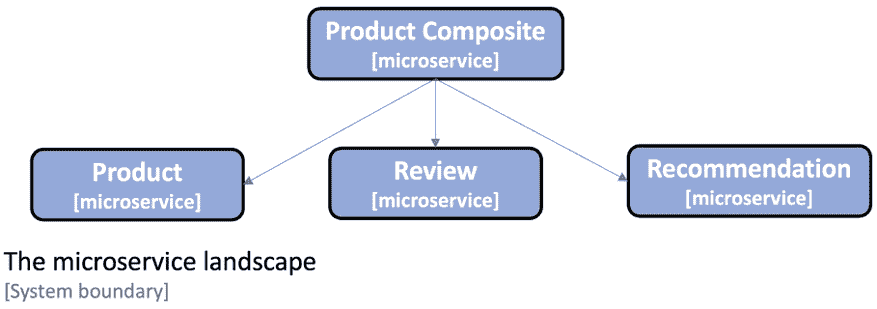
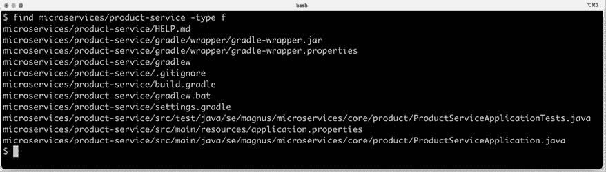
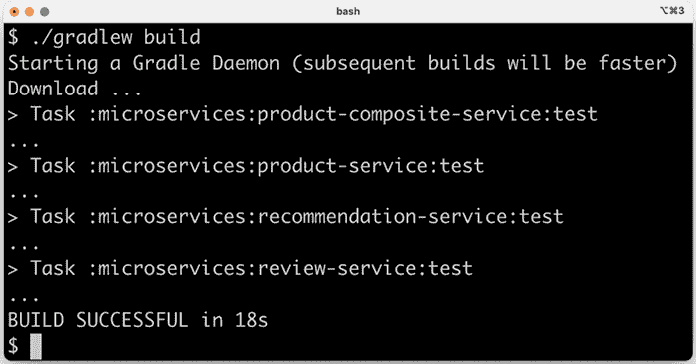
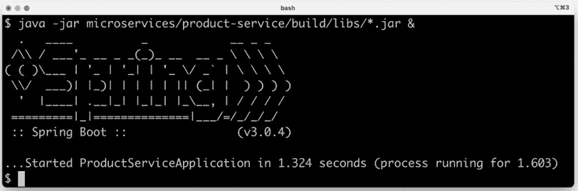
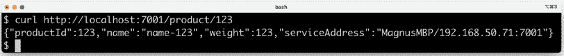
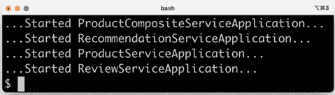
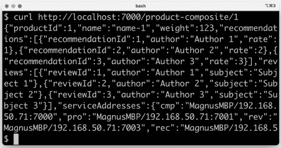
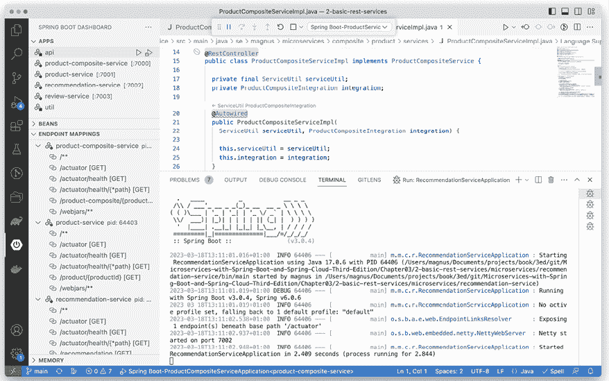
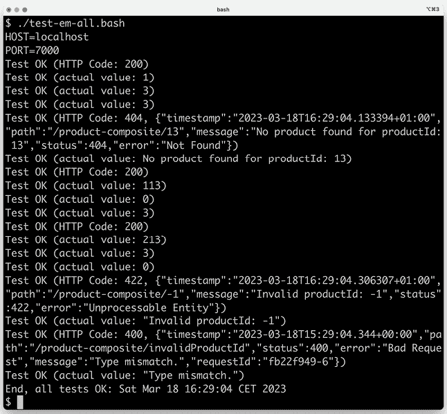

# 第三章：创建一组协作微服务

在本章中，我们将构建我们的第一个几个微服务。我们将学习如何创建具有最小功能的协作微服务。在未来的章节中，我们将向这些微服务添加更多和更多的功能。到本章结束时，我们将通过组合微服务公开一个 RESTful API。组合微服务将调用其他三个微服务，使用它们的 RESTful API 来创建聚合响应。

本章将涵盖以下主题：

+   介绍微服务景观

+   生成骨架微服务

+   添加 RESTful API

+   添加组合微服务

+   添加错误处理

+   手动测试 API

+   为微服务添加隔离的自动化测试

+   向微服务景观添加半自动化测试

# 技术要求

有关如何安装本书中使用的工具以及如何访问本书源代码的说明，请参阅以下内容：

+   *第二十一章*，*macOS 的安装说明*

+   *第二十二章*，*使用 WSL 2 和 Ubuntu 的 Microsoft Windows 安装说明*

本章中的所有代码示例都来自`$BOOK_HOME/Chapter03`中的源代码。有了工具和源代码，我们可以开始学习我们将在本章中创建的微服务系统景观。

# 介绍微服务景观

在*第一章*，*微服务简介*中，我们简要介绍了本书将使用的基于微服务的系统景观：



图 3.1：微服务景观

它由三个核心微服务组成，即**产品**、**评论**和**推荐**服务，它们都处理一种类型的资源，以及一个名为**产品组合**的组合微服务，该服务从三个核心服务中聚合信息。

## 微服务处理的信息

为了使本书中的源代码示例易于理解，它们包含的业务逻辑量最小。出于同样的原因，它们处理的企业对象的信息模型也保持最小。在本节中，我们将了解每个微服务处理的信息，包括与基础设施相关的信息。

### 产品服务

产品服务管理产品信息，并使用以下属性描述每个产品：

+   产品 ID

+   名称

+   重量

### 评论服务

评论服务管理产品评论，并存储以下关于每个评论的以下信息：

+   产品 ID

+   评论 ID

+   作者

+   主题

+   内容

### 推荐服务

推荐服务管理产品推荐，并存储以下关于每个推荐的以下信息：

+   产品 ID

+   推荐 ID

+   作者

+   评分

+   内容

### 产品组合服务

产品组合服务从三个核心服务中聚合信息，并按以下方式展示产品信息：

+   如产品服务所述的产品信息

+   如审查服务所述的指定产品的产品评论列表

+   如推荐服务所述的指定产品的产品推荐列表

### 基础设施相关信息

一旦我们开始以由基础设施管理的容器形式运行我们的微服务（首先是 Docker，然后是 Kubernetes），跟踪哪些容器实际上响应了我们的请求将变得很有兴趣。作为一个简单的解决方案，已向所有响应添加了一个`serviceAddress`属性，格式为`hostname/ip-address:port`。

在第十八章“使用服务网格提高可观察性和管理”和第十九章“使用 EFK 堆栈进行集中式日志记录”中，我们将了解跟踪微服务处理请求的更强大解决方案。

## 临时替换服务发现

由于在此阶段我们没有设置任何服务发现机制，因此我们将所有微服务运行在`localhost`上，并为每个微服务使用硬编码的端口号。我们将使用以下端口号：

+   产品组合服务：`7000`

+   产品服务：`7001`

+   审查服务：`7002`

+   推荐服务：`7003`

我们将在开始使用 Docker 和 Kubernetes 时删除硬编码的端口号！

在本节中，我们介绍了将要创建的微服务和它们将处理的信息。在下节中，我们将使用 Spring Initializr 为微服务创建骨架代码。

# 生成骨架微服务

现在是时候看看我们如何为我们的微服务创建项目了。本主题的最终结果可以在`$BOOK_HOME/Chapter03/1-spring-init`文件夹中找到。为了简化项目设置，我们将使用**Spring Initializr**为每个微服务生成一个骨架项目。骨架项目包含构建项目所需的所有文件，以及微服务的空`main`类和测试类。之后，我们将了解如何使用我们将使用的构建工具 Gradle 中的多项目构建命令来构建所有微服务。

## 使用 Spring Initializr 生成骨架代码

要开始开发我们的微服务，我们将使用一个名为 Spring Initializr 的工具为我们生成骨架代码。Spring Initializr 由 Spring 团队提供，可用于配置和生成新的 Spring Boot 应用程序。该工具帮助开发者选择应用程序将使用的附加 Spring 模块，并确保依赖项配置为使用所选模块的兼容版本。该工具支持使用 Maven 或 Gradle 作为构建系统，并可以为 Java、Kotlin 或 Groovy 生成源代码。

它可以通过 URL [`start.spring.io/`](https://start.spring.io/) 或使用命令行工具 `spring init` 从网络浏览器中调用。为了更容易地重现微服务的创建，我们将使用命令行工具。

对于每个微服务，我们将创建一个执行以下操作的 Spring Boot 项目：

+   使用 Gradle 作为构建工具

+   为 Java 8 生成代码

+   将项目打包成一个胖 JAR 文件

+   引入 `Actuator` 和 `WebFlux` Spring 模块的依赖

+   基于 Spring Boot v3.0.4（它依赖于 Spring Framework v6.0.6）

**Spring Boot Actuator** 为管理和监控提供了一些有价值的端点。我们将在稍后看到它们的作用。**Spring WebFlux** 将用于创建我们的 RESTful API。

为了为我们的微服务创建骨架代码，我们需要为 `product-service` 运行以下命令：

```java
spring init \
--boot-version=3.0.4 \
--type=gradle-project \
--java-version=17 \
--packaging=jar \
--name=product-service \
--package-name=se.magnus.microservices.core.product \
--groupId=se.magnus.microservices.core.product \
--dependencies=actuator,webflux \
--version=1.0.0-SNAPSHOT \
product-service 
```

如果你想了解更多关于 `spring init` CLI 的信息，可以运行 `spring help init` 命令。要查看可以添加的依赖项，请运行 `spring init --list` 命令。

如果你想要自己创建四个项目而不是使用本书 GitHub 仓库中的源代码，请尝试 `$BOOK_HOME/Chapter03/1-spring-init/create-projects.bash`，如下所示：

```java
mkdir some-temp-folder
cd some-temp-folder
$BOOK_HOME/Chapter03/1-spring-init/create-projects.bash 
```

使用 `create-projects.bash` 创建我们的四个项目后，我们将有以下文件结构：

```java
microservices/
├── product-composite-service 
├── product-service
├── recommendation-service
└── review-service 
```

对于每个项目，我们可以列出创建的文件。让我们为 `product-service` 项目做这件事：

```java
find microservices/product-service -type f 
```

我们将收到以下输出：



图 3.2：列出我们为 product-service 创建的文件

Spring Initializr 为 Gradle 创建了多个文件，一个 `.gitignore` 文件和三个 Spring Boot 文件：

+   `ProductServiceApplication.java`，我们的主应用程序类

+   `application.properties`，一个空属性文件

+   `ProductServiceApplicationTests.java`，一个配置为使用 JUnit 在我们的 Spring Boot 应用程序上运行测试的测试类

根据前一章中 *The magic @SpringBootApplication annotation* 部分的描述，`main` 应用程序类 `ProductServiceApplication.java` 看起来应该是这样的：

```java
package se.magnus.microservices.core.product;
@SpringBootApplication
public class ProductServiceApplication {
   public static void main(String[] args) {
      SpringApplication.run(ProductServiceApplication.class, args);
   }
} 
```

测试类看起来如下：

```java
package se.magnus.microservices.core.product;
**@SpringBootTest**
class ProductServiceApplicationTests {
   @Test
   void contextLoads() {
   }
} 
```

`@SpringBootTest` 注解将以与 `@SpringBootApplication` 相同的方式初始化我们的应用程序；也就是说，在执行测试之前，将使用组件扫描和自动配置设置 Spring 应用程序上下文，正如前一章所述。

让我们再看看最重要的 Gradle 文件，`build.gradle`。此文件的内容描述了如何构建项目——例如，如何解决依赖关系和编译、测试和打包源代码。Gradle 文件首先列出要应用的插件：

```java
plugins {
    id 'java'
    id 'org.springframework.boot' version '3.0.4'
    id 'io.spring.dependency-management' version '1.1.0'
} 
```

声明的插件如下使用：

+   `java` 插件将 Java 编译器添加到项目中。

+   声明了`org.springframework.boot`和`io.spring.dependency-management`插件，这两个插件一起确保 Gradle 将构建一个胖 JAR 文件，并且我们不需要在 Spring Boot 启动器依赖项上指定任何显式的版本号。相反，它们由`org.springframework.boot`插件的版本隐含，即 3.0.4。

在构建文件的其余部分，我们基本上声明了项目的组名和版本、Java 版本及其依赖项：

```java
**group** = 'se.magnus.microservices.composite.product'
**version** = '1.0.0-SNAPSHOT'
**sourceCompatibility** = '17'
repositories {
    mavenCentral()
}
**dependencies** {
    implementation 'org.springframework.boot:spring-boot-starter-actuator'
    implementation 'org.springframework.boot:spring-boot-starter-webflux'
    testImplementation 'org.springframework.boot:spring-boot-starter-test'
    testImplementation 'io.projectreactor:reactor-test'
}
**tasks.named('test') {**
 **useJUnitPlatform()**
**}** 
```

关于使用的依赖项和最终测试声明的几点说明：

+   依赖项，就像前面的插件一样，从中央 Maven 仓库获取。

+   依赖项的设置与 Actuator 和 WebFlux 模块中指定的设置相同，以及一些有用的测试依赖项。

+   最后，JUnit 被配置为在 Gradle 构建中运行我们的测试。

我们可以使用以下命令分别构建每个微服务：

```java
cd microservices/product-composite-service; ./gradlew build; cd -; \
cd microservices/product-service;           ./gradlew build; cd -; \
cd microservices/recommendation-service;    ./gradlew build; cd -; \
cd microservices/review-service;            ./gradlew build; cd -; 
```

注意我们如何使用由 Spring Initializr 创建的`gradlew`可执行文件；也就是说，我们不需要安装 Gradle！

第一次运行带有`gradlew`的命令时，它会自动下载 Gradle。使用的 Gradle 版本由`gradle/wrapper/gradle-wrapper.properties`文件中的`distributionUrl`属性确定。

## 在 Gradle 中设置多项目构建

为了使使用一个命令构建所有微服务变得简单一些，我们可以在 Gradle 中设置一个多项目构建。步骤如下：

1.  首先，我们创建`settings.gradle`文件，该文件描述了 Gradle 应该构建哪些项目：

    ```java
    cat <<EOF > settings.gradle
    include ':microservices:product-service'
    include ':microservices:review-service'
    include ':microservices:recommendation-service'
    include ':microservices:product-composite-service'
    EOF 
    ```

1.  接下来，我们复制从其中一个项目中生成的 Gradle 可执行文件，以便我们可以为多项目构建重用它们：

    ```java
    cp -r microservices/product-service/gradle .
    cp microservices/product-service/gradlew .
    cp microservices/product-service/gradlew.bat .
    cp microservices/product-service/.gitignore . 
    ```

1.  我们不再需要每个项目中生成的 Gradle 可执行文件，因此我们可以使用以下命令删除它们：

    ```java
    find microservices -depth -name "gradle" -exec rm -rfv "{}" \; 
    find microservices -depth -name "gradlew*" -exec rm -fv "{}" \; 
    ```

    结果应该与你在文件夹`$BOOK_HOME/Chapter03/1-spring-init`中找到的代码类似。

1.  现在，我们可以使用一个命令构建所有微服务：

    ```java
    ./gradlew build 
    ```

如果你还没有运行前面的命令，你可以直接进入书籍的源代码，并从那里构建微服务：

```java
cd $BOOK_HOME/Chapter03/1-spring-init
./gradlew build 
```

这应该会产生以下输出：



图 3.3：成功构建后的输出

使用 Spring Initializr 创建的微服务骨架项目和成功使用 Gradle 构建后，我们就可以在下一节中为微服务添加一些代码了。

从 DevOps 的角度来看，多项目设置可能不是首选。相反，为了使每个微服务都有其自己的构建和发布周期，为每个微服务项目设置单独的构建管道可能更受欢迎。然而，为了本书的目的，我们将使用多项目设置，以便可以使用单个命令轻松构建和部署整个系统景观。

# 添加 RESTful API

现在我们已经为我们的微服务设置了项目，让我们为我们的三个核心微服务添加一些 RESTful API！

本章的最终结果以及剩余主题可以在`$BOOK_HOME/Chapter03/2-basic-rest-services`文件夹中找到。

首先，我们将添加两个项目（`api`和`util`），这两个项目将包含由微服务项目共享的代码，然后我们将实现 RESTful API。

## 添加 API 和 util 项目

要添加一个`api`项目，我们需要做以下几步：

1.  首先，我们将设置一个单独的 Gradle 项目，我们可以在这个项目中放置我们的 API 定义。我们将使用 Java 接口来描述我们的 RESTful API 和模型类来描述 API 在其请求和响应中使用的数据。为了描述 API 可以返回的错误类型，还定义了一系列异常类。在 Java 接口中而不是直接在 Java 类中描述 RESTful API，对我来说，是一种将 API 定义与其实现分离的好方法。我们将在本书的后面进一步扩展这种模式，当我们向 Java 接口添加更多 API 信息以在 OpenAPI 规范中公开时。有关更多信息，请参阅*第五章*，*使用 OpenAPI 添加 API 描述*。

是否将一组微服务的 API 定义存储在公共 API 模块中，这是一个有争议的问题。这可能会在微服务之间产生不希望的依赖关系，从而导致单体特性，例如，导致更复杂和缓慢的开发过程。对我来说，对于属于同一交付组织的微服务来说，这是一个好的选择，也就是说，它们的发布由同一组织管理（将此与**领域驱动设计**中的**边界上下文**进行比较，我们的微服务被放置在单个边界上下文中）。如*第一章*，*微服务简介*中已讨论的，同一边界上下文内的微服务需要基于公共信息模型的 API 定义，因此将这些 API 定义存储在同一个 API 模块中不会添加任何不希望的依赖项。

1.  接下来，我们将创建一个`util`项目，该项目可以存放一些由我们的微服务共享的辅助类，例如，用于以统一方式处理错误。

再次从 DevOps 的角度来看，最好是为每个项目构建自己的构建管道，并在微服务项目中为`api`和`util`项目设置版本控制的依赖项，也就是说，这样每个微服务都可以选择使用`api`和`util`项目的哪个版本。但为了保持本书中构建和部署步骤的简单性，我们将`api`和`util`项目作为多项目构建的一部分。

### api 项目

`api`项目将被打包成一个库；也就是说，它不会有自己的`main`应用程序类。不幸的是，Spring Initializr 不支持创建库项目。相反，必须从头手动创建库项目。API 项目的源代码位于`$BOOK_HOME/Chapter03/2-basic-rest-services/api`。

库项目的结构与应用程序项目相同，只是我们没有`main`应用程序类，以及`build.gradle`文件中的一些细微差异。`org.springframework.boot` Gradle 插件被替换为`implementation platform`部分：

```java
ext {
    springBootVersion = '3.0.4'
}
dependencies {
    implementation platform("org.springframework.boot:spring-boot-dependencies:${springBootVersion}") 
```

这允许我们在用创建一个只包含项目自身类和属性文件的正常 JAR 文件替换构建步骤中构建胖 JAR 文件的同时，保留 Spring Boot 依赖管理。

我们三个核心微服务的`api`项目中的 Java 文件如下：

```java
$BOOK_HOME/Chapter03/2-basic-rest-services/api/src/main/java/se/magnus/api/core
├── product
│   ├── Product.java
│   └── ProductService.java
├── recommendation
│   ├── Recommendation.java
│   └── RecommendationService.java
└── review
    ├── Review.java
    └── ReviewService.java 
```

这三个核心微服务的 Java 类结构看起来非常相似，所以我们只将通过`product`服务的源代码进行说明。

首先，我们将查看`ProductService.java` Java 接口，如下所示：

```java
package se.magnus.api.core.product;
public interface ProductService {
    **@GetMapping**(
        value    = "/product/{productId}",
        produces = "application/json")
     Product **getProduct****(****@PathVariable** int productId);
} 
```

Java 接口声明如下：

+   `product`服务仅公开一个 API 方法，`getProduct()`（我们将在本书的*第六章*，*添加持久性*中扩展 API）。

+   要将方法映射到 HTTP `GET`请求，我们使用`@GetMapping` Spring 注解，其中我们指定方法将被映射到的 URL 路径（`/product/{productId}`）以及响应的格式——在这种情况下，是 JSON。

+   路径中的`{productId}`部分映射到一个名为`productId`的路径变量。

+   `productId`方法参数被`@PathVariable`注解，它将传入 HTTP 请求中的值映射到参数。例如，对`/product/123`的 HTTP `GET`请求将导致调用`getProduct()`方法，并将`productId`参数设置为`123`。

该方法返回一个`Product`对象，一个基于 POJO 的模型类，其成员变量对应于`Product`的属性，如本章开头所述。`Product.java`看起来如下（省略了构造函数和 getter 方法）：

```java
public class **Product** {
  private final int productId;
  private final String name;
  private final int weight;
  private final String serviceAddress;
} 
```

这种类型的 POJO 类也被称为**数据传输对象**（**DTO**），因为它用于在 API 实现和 API 调用者之间传输数据。当我们到达*第六章*，*添加持久性*时，我们将查看另一种类型的 POJO，它可以用来描述数据在数据库中的存储方式，也称为实体对象。

API 项目还包含异常类`InvalidInputException`和`NotFoundException`。

### util 项目

`util`项目将以与`api`项目相同的方式打包为库。`util`项目的源代码位于`$BOOK_HOME/Chapter03/2-basic-rest-services/util`。该项目包含以下工具类：`GlobalControllerExceptionHandler`、`HttpErrorInfo`和`ServiceUtil`。

除了`ServiceUtil.java`中的代码外，这些类是可重用的工具类，我们可以使用它们将 Java 异常映射到适当的 HTTP 状态码，如后续章节*添加错误处理*中所述。`ServiceUtil.java`的主要目的是找出微服务使用的 hostname、IP 地址和端口号。该类公开了一个`getServiceAddress()`方法，微服务可以使用它来查找它们的 hostname、IP 地址和端口号，如前述章节*基础设施相关信息*中所述。

## 实现我们的 API

现在，我们可以在核心微服务中开始实现我们的 API 了！

对于三个核心微服务的实现看起来非常相似，所以我们只通过`product`服务的源代码来演示。其他文件可以在`$BOOK_HOME/Chapter03/2-basic-rest-services/microservices`中找到。让我们看看我们是如何进行这一过程的：

1.  我们需要将`api`和`util`项目作为依赖项添加到我们的`build.gradle`文件中，在`product-service`项目中：

    ```java
    dependencies {
       implementation project(':api')
       implementation project(':util') 
    ```

1.  为了启用 Spring Boot 的自动配置功能以检测`api`和`util`项目中的 Spring Beans，我们还需要在主应用程序类中添加一个`@ComponentScan`注解，该注解包括`api`和`util`项目的包：

    ```java
    @SpringBootApplication
    @ComponentScan("se.magnus")
    public class ProductServiceApplication { 
    ```

1.  接下来，我们创建服务实现文件，`ProductServiceImpl.java`，以便实现来自`api`项目的 Java 接口`ProductService`，并使用`@RestController`注解该类，这样 Spring 就会根据`Interface`类中指定的映射调用该类中的方法：

    ```java
    package se.magnus.microservices.core.product.services;
    **@RestController**
    public class ProductServiceImpl implements ProductService {
    } 
    ```

1.  为了能够使用来自`util`项目的`ServiceUtil`类，我们将将其注入到构造函数中，如下所示：

    ```java
    private final ServiceUtil serviceUtil;
    @Autowired
    public ProductServiceImpl(ServiceUtil serviceUtil) {
        this.serviceUtil = serviceUtil;
    } 
    ```

1.  现在，我们可以通过覆盖`api`项目中的接口的`getProduct()`方法来实现 API：

    ```java
    @Override
    public Product getProduct(int productId) {
     return new Product(productId, "name-" + productId, 123, 
     serviceUtil.getServiceAddress());
    } 
    ```

    由于我们目前没有使用数据库，我们只是根据`productId`的输入返回一个硬编码的响应，以及由`ServiceUtil`类提供的服务地址。

    对于最终结果，包括日志记录和错误处理，请参阅`ProductServiceImpl.java`。

1.  最后，我们还需要设置一些运行时属性——使用哪个端口以及所需的日志级别。这被添加到属性文件`application.yml`中：

    ```java
    server.port: 7001
    logging:
      level:
        root: INFO
        se.magnus.microservices: DEBUG 
    ```

注意，由 Spring Initializr 生成的空`application.properties`文件已被 YAML 文件`application.yml`替换。与`.properties`文件相比，YAML 文件提供了更好的相关属性分组支持。如上例中的日志级别设置所示。

1.  我们可以单独尝试`product`服务。使用以下命令构建并启动微服务：

    ```java
    cd $BOOK_HOME/Chapter03/2-basic-rest-services
    ./gradlew build
    java -jar microservices/product-service/build/libs/*.jar & 
    ```

    等待以下内容在终端中打印出来：

图 3.4：启动 ProductServiceApplication

1.  对 `product` 服务进行测试调用：

    ```java
    curl http://localhost:7001/product/123 
    ```

    它应该响应如下所示的内容：



1.  最后，停止 `product` 服务：

    ```java
    kill $(jobs -p) 
    ```

我们现在已经构建、运行并测试了我们的第一个单一微服务。在下一节中，我们将实现将使用我们迄今为止创建的三个核心微服务的复合微服务。

从 Spring Boot v2.5.0 开始，在运行 `./gradlew build` 命令时将创建两个 JAR 文件：普通 JAR 文件，以及仅包含编译 Spring Boot 应用程序中的 Java 文件生成的类文件的普通 JAR 文件。由于我们不需要新的普通 JAR 文件，因此已禁用其创建，以便在运行 Spring Boot 应用程序时可以使用通配符引用普通 JAR 文件，例如：

```java
java -jar microservices/product-service/build/libs/*.jar 
```

通过将以下行添加到每个微服务的 `build.gradle` 文件中，已禁用创建新的普通 JAR 文件：

```java
jar {
    enabled = false
} 
```

对于更多详细信息，请参阅 [`docs.spring.io/spring-boot/docs/3.0.4/gradle-plugin/reference/htmlsingle/#packaging-executable.and-plain-archives`](https://docs.spring.io/spring-boot/docs/3.0.4/gradle-plugin/reference/htmlsingle/#packaging-executable.and-plain-archives)。

# 添加复合微服务

现在，是时候通过添加将调用三个核心服务的复合服务来整合这些内容了！

复合服务的实现分为两部分：一个处理对核心服务的出站 HTTP 请求的集成组件，以及复合服务实现本身。这种责任划分的主要原因是为了简化自动化的单元和集成测试；我们可以通过用模拟替换集成组件来独立测试服务实现。

正如我们将在本书后面看到的那样，这种责任划分也将使引入断路器变得更加容易！

在我们查看两个组件的源代码之前，我们需要查看复合微服务将使用的 API 类，并了解如何使用运行时属性来保存核心微服务的地址信息。

集成组件和复合服务实现的完整实现可以在 Java 包 `se.magnus.microservices.composite.product.services` 中找到。

## API 类

在本节中，我们将查看描述复合组件 API 的类。它们可以在 `$BOOK_HOME/Chapter03/2-basic-rest-services/api` 中找到。以下是一些 API 类：

```java
$BOOK_HOME/Chapter03/2-basic-rest-services/api
└── src/main/java/se/magnus/api/composite
    └── product
        ├── ProductAggregate.java
        ├── ProductCompositeService.java
        ├── RecommendationSummary.java
        ├── ReviewSummary.java
        └── ServiceAddresses.java 
```

Java 接口类 `ProductCompositeService.java` 遵循核心服务使用的相同模式，如下所示：

```java
package se.magnus.api.composite.product;
public interface ProductCompositeService {
    @GetMapping(
        value    = "/product-composite/{productId}",
        produces = "application/json")
    ProductAggregate getProduct(@PathVariable int productId);
} 
```

模型类`ProductAggregate.java`比核心模型复杂一些，因为它包含推荐和评论列表的字段：

```java
package se.magnus.api.composite.product;
public class ProductAggregate {
    private final int productId;
    private final String name;
    private final int weight;
    private final **List<RecommendationSummary> recommendations**;
    private final **List<ReviewSummary> reviews**;
    private final ServiceAddresses serviceAddresses; 
```

剩余的 API 类是普通的 POJO 模型对象，结构与核心 API 的模型对象相同。

## 属性

为了避免将核心服务的地址信息硬编码到复合微服务的源代码中，后者使用一个属性文件来存储如何找到核心服务的信息。这个属性文件，`application.yml`，看起来如下所示：

```java
server.port: 7000
app:
  product-service:
    host: localhost
    port: 7001
  recommendation-service:
    host: localhost
    port: 7002
  review-service:
    host: localhost
    port: 7003 
```

如前所述，此配置将在本书后面的部分被服务发现机制所取代。

## 集成组件

让我们看看复合微服务实现的第一部分，集成组件，`ProductCompositeIntegration.java`。它使用`@Component`注解声明为 Spring Bean，并实现了三个核心服务的 API 接口：

```java
package se.magnus.microservices.composite.product.services;
@Component
public class ProductCompositeIntegration implements ProductService, RecommendationService, ReviewService { 
```

集成组件使用 Spring 框架中的一个辅助类`RestTemplate`来执行对核心微服务的实际 HTTP 请求。在我们将其注入到集成组件之前，我们需要对其进行配置。我们在`main`应用程序类`ProductCompositeServiceApplication.java`中这样做，如下所示：

```java
@Bean
RestTemplate restTemplate() {
   return new RestTemplate();
} 
```

`RestTemplate`对象高度可配置，但我们现在先保留其默认值。

在*第二章*的*Spring Boot 简介*部分，我们介绍了反应式 HTTP 客户端`WebClient`。在本章中使用`WebClient`代替`RestTemplate`将需要所有使用`WebClient`的源代码也必须是反应式的，包括 API 项目中 RESTful API 的声明和复合微服务的源代码。在第七章*开发反应式微服务*中，我们将学习如何更改微服务的实现以遵循反应式编程模型。在这个更新步骤之一，我们将用`WebClient`类替换`RestTemplate`辅助类。但在我们了解 Spring 中的反应式开发之前，我们将使用`RestTemplate`类。

现在我们可以注入`RestTemplate`，以及一个 JSON`mapper`，后者用于在出错时访问错误消息，以及我们在属性文件中设置的配置值。让我们看看这是如何完成的：

1.  对象和配置值如下注入到构造函数中：

    ```java
    private final RestTemplate restTemplate;
    private final ObjectMapper mapper;
    private final String productServiceUrl;
    private final String recommendationServiceUrl;
    private final String reviewServiceUrl;
    @Autowired
    public ProductCompositeIntegration(
      RestTemplate restTemplate,
      ObjectMapper mapper,
      @Value("${app.product-service.host}") 
      String productServiceHost,

      @Value("${app.product-service.port}")
      int productServicePort,
      @Value("${app.recommendation-service.host}")
      String recommendationServiceHost,
      @Value("${app.recommendation-service.port}")
      int recommendationServicePort,
      @Value("${app.review-service.host}")
      String reviewServiceHost,
      @Value("${app.review-service.port}")
      int reviewServicePort
    ) 
    ```

1.  构造函数的主体存储注入的对象并基于注入的值构建 URL，如下所示：

    ```java
    {
      this.restTemplate = restTemplate;
      this.mapper = mapper;
      productServiceUrl = "http://" + productServiceHost + ":" + 
      productServicePort + "/product/";
      recommendationServiceUrl = "http://" + recommendationServiceHost
      + ":" + recommendationServicePort + "/recommendation?
      productId="; reviewServiceUrl = "http://" + reviewServiceHost + 
      ":" + reviewServicePort + "/review?productId=";
    } 
    ```

1.  最后，集成组件通过使用`RestTemplate`进行实际出站调用来实现三个核心服务的 API 方法：

    ```java
    public Product getProduct(int productId) {
     String url = productServiceUrl + productId;
     Product product = **restTemplate**.getForObject(url, Product.class);
     return product;
    }
    public List<Recommendation> getRecommendations(int productId) {
        String url = recommendationServiceUrl + productId;
        List<Recommendation> recommendations = 
        **restTemplate**.exchange(url, GET, null, new 
        **ParameterizedTypeReference**<List<Recommendation>>() 
        {}).getBody();
        return recommendations;
    }
    public List<Review> getReviews(int productId) {
        String url = reviewServiceUrl + productId;
        List<Review> reviews = **restTemplate**.exchange(url, GET, null,
        new **ParameterizedTypeReference**<List<Review>>() {}).getBody();
        return reviews;
    } 
    ```

关于方法实现的一些有趣注释：

1.  对于`getProduct()`实现，可以在`RestTemplate`中使用`getForObject()`方法。期望的响应是一个`Product`对象。可以通过在`getForObject()`调用中指定`RestTemplate`将映射 JSON 响应到的`Product.class`类来表示。

1.  对于`getRecommendations()`和`getReviews()`的调用，必须使用更高级的方法`exchange()`。这是因为`RestTemplate`会自动将 JSON 响应映射到模型类。`getRecommendations()`和`getReviews()`方法期望响应中包含泛型列表，即`List<Recommendation>`和`List<Review>`。由于泛型在运行时不会保留任何类型信息，因此我们无法指定这些方法期望在响应中包含泛型列表。相反，我们可以使用 Spring 框架中的一个辅助类`ParameterizedTypeReference`，它通过在运行时保留类型信息来设计解决此问题。这意味着`RestTemplate`可以确定将 JSON 响应映射到哪个类。为了使用这个辅助类，我们必须使用更复杂的`exchange()`方法，而不是`RestTemplate`上的简单`getForObject()`方法。

## 复合 API 实现

最后，我们将查看复合微服务实现的最后一部分：API 实现类`ProductCompositeServiceImpl.java`。让我们一步一步地来看它： 

1.  与核心服务类似，复合服务实现了其 API 接口`ProductCompositeService`，并使用`@RestController`注解标记为 REST 服务：

    ```java
    package se.magnus.microservices.composite.product.services;
    @RestController
    public class ProductCompositeServiceImpl implements ProductCompositeService { 
    ```

1.  实现类需要`ServiceUtil`豆和它自己的集成组件，因此它们被注入到其构造函数中：

    ```java
    private final ServiceUtil serviceUtil;
    private ProductCompositeIntegration integration;
    @Autowired
    public ProductCompositeServiceImpl(ServiceUtil serviceUtil, ProductCompositeIntegration integration) {
        this.serviceUtil = serviceUtil;
        this.integration = integration;
    } 
    ```

1.  最后，API 方法实现如下：

    ```java
    @Override
    public ProductAggregate getProduct(int productId) {

      Product product = integration.getProduct(productId);
      List<Recommendation> recommendations = 
      integration.getRecommendations(productId);
      List<Review> reviews = integration.getReviews(productId);

      return **createProductAggregate**(product, recommendations,
      reviews, serviceUtil.getServiceAddress());
    } 
    ```

集成组件用于调用三个核心服务，并使用辅助方法`createProductAggregate()`根据集成组件的调用响应创建`ProductAggregate`类型的响应对象。

辅助方法`createProductAggregate()`的实现相当冗长且不是非常重要，因此已从本章中省略；然而，它可以在本书的源代码中找到。

集成组件和复合服务的完整实现可以在 Java 包`se.magnus.microservices.composite.product.services`中找到。

从功能角度来看，这完成了复合微服务的实现。在下一节中，我们将看到我们如何处理错误。

# 添加错误处理

在微服务领域中，以结构化和深思熟虑的方式处理错误至关重要，因为在微服务之间使用同步 API（例如 HTTP 和 JSON）进行大量通信。同时，将特定协议的错误处理（如 HTTP 状态码）与业务逻辑分离也很重要。

可以争论说，在实现微服务时应该添加一个单独的业务逻辑层。这应该确保业务逻辑与特定协议的代码分离，使得测试和重用都更容易。为了避免本书中提供的示例中出现不必要的复杂性，我们省略了单独的业务逻辑层，因此微服务直接在`@RestController`组件中实现其业务逻辑。

我在`util`项目中创建了一系列 Java 异常，这些异常既被 API 实现使用，也被 API 客户端使用，最初是`InvalidInputException`和`NotFoundException`。有关详细信息，请查看 Java 包`se.magnus.util.exceptions`。

## 全局 REST 控制器异常处理器

为了将特定协议的错误处理与 REST 控制器中的业务逻辑分开，也就是说，与 API 实现分开，我在`util`项目中创建了一个实用类，名为`GlobalControllerExceptionHandler.java`，并使用`@RestControllerAdvice`注解。

对于 API 实现抛出的每个 Java 异常，实用类都有一个异常处理方法，将 Java 异常映射到适当的 HTTP 响应，即具有适当的 HTTP 状态和 HTTP 响应体。

例如，如果一个 API 实现类抛出`InvalidInputException`，实用类会将其映射到一个状态码设置为`422`（`UNPROCESSABLE_ENTITY`）的 HTTP 响应。以下代码展示了这一点：

```java
@ResponseStatus(**UNPROCESSABLE_ENTITY**)
@ExceptionHandler(**InvalidInputException.class**)
public @ResponseBody HttpErrorInfo handleInvalidInputException(
    ServerHttpRequest request, InvalidInputException ex) {
    return createHttpErrorInfo(UNPROCESSABLE_ENTITY, request, ex);
} 
```

同样，`NotFoundException`被映射到`404`（`NOT_FOUND`）HTTP 状态码。

每当 REST 控制器抛出这些异常之一时，Spring 都会使用实用类来创建一个 HTTP 响应。

注意，当 Spring 检测到无效请求时，例如请求包含非数字的产品 ID（在 API 声明中，`productId`被指定为整数），它本身会返回 HTTP 状态码`400`（`BAD_REQUEST`）。

关于实用类的完整源代码，请参阅`GlobalControllerExceptionHandler.java`。

## API 实现中的错误处理

API 实现使用`util`项目中的异常来表示错误。它们将以 HTTPS 状态码的形式返回给 REST 客户端，以指示发生了什么错误。例如，`Product`微服务实现类`ProductServiceImpl.java`使用`InvalidInputException`异常来返回一个表示输入无效的错误，以及使用`NotFoundException`异常来告诉我们请求的产品不存在。代码如下：

```java
if (productId < 1) throw new **InvalidInputException**("Invalid productId: 
    " + productId);
if (productId == 13) throw new **NotFoundException**("No product found for 
    productId: " + productId); 
```

由于我们目前没有使用数据库，我们必须模拟何时抛出`NotFoundException`。

## API 客户端中的错误处理

API 客户端，即 `Composite` 微服务的集成组件，执行相反的操作；它将 `422` (`UNPROCESSABLE_ENTITY`) HTTP 状态码映射到 `InvalidInputException`，将 `404` (`NOT_FOUND`) HTTP 状态码映射到 `NotFoundException`。请参阅 `ProductCompositeIntegration.java` 中的 `getProduct()` 方法以了解此错误处理逻辑的实现。源代码如下：

```java
catch (HttpClientErrorException ex) {
    switch (HttpStatus.resolve(ex.getStatusCode().value())) {
    case **NOT_FOUND**:
        throw new NotFoundException(getErrorMessage(ex));
    case **UNPROCESSABLE_ENTITY**:
        throw new InvalidInputException(getErrorMessage(ex));
    default:
        LOG.warn("Got an unexpected HTTP error: {}, will rethrow it", 
        ex.getStatusCode());
        LOG.warn("Error body: {}", ex.getResponseBodyAsString());
        throw ex;
    }
} 
```

在集成组件中对 `getRecommendations()` 和 `getReviews()` 的错误处理稍微宽松一些——被视为尽力而为，这意味着如果它成功获取产品信息，但未能获取推荐或评论，仍然被认为是可接受的。然而，会写入日志警告。

详细信息，请参阅 `ProductCompositeIntegration.java`。

这样就完成了代码和组合微服务的实现。在下一节中，我们将测试微服务和它们公开的 API。

# 手动测试 API

这样就完成了我们微服务的实现。让我们通过以下步骤来尝试它们：

1.  将微服务作为后台进程构建并启动。

1.  使用 `curl` 调用组合 API。

1.  停止微服务。

首先，按照以下方式将每个微服务作为后台进程构建和启动：

```java
cd $BOOK_HOME/Chapter03/2-basic-rest-services/
./gradlew build 
```

构建完成后，我们可以使用以下代码将微服务作为后台进程启动到终端进程：

```java
java -jar microservices/product-composite-service/build/libs/*.jar &
java -jar microservices/product-service/build/libs/*.jar &
java -jar microservices/recommendation-service/build/libs/*.jar &
java -jar microservices/review-service/build/libs/*.jar & 
```

将会有大量的日志消息写入终端，但几秒钟后，事情会平静下来，我们将在日志中找到以下消息：



图 3.6：应用程序启动后的日志消息

这意味着它们都准备好接收请求。以下代码尝试一下：

```java
curl http://localhost:7000/product-composite/1 
```

在一些日志输出后，我们将得到一个看起来像以下这样的 JSON 响应：



图 3.7：请求后的 JSON 响应

要获取格式化的 JSON 响应，你可以使用 `jq` 工具：

```java
curl http://localhost:7000/product-composite/1 -s | jq . 
```

这将产生以下输出（一些细节已被 `...` 替换以提高可读性）：


图 3.8：格式化的 JSON 响应

如果你想的话，也可以尝试以下命令来验证错误处理是否按预期工作：

```java
# Verify that a 404 (Not Found) error is returned for a non-existing productId (13)
curl http://localhost:7000/product-composite/13 -i
# Verify that no recommendations are returned for productId 113
curl http://localhost:7000/product-composite/113 -s | jq .
# Verify that no reviews are returned for productId 213
curl http://localhost:7000/product-composite/213 -s | jq .
# Verify that a 422 (Unprocessable Entity) error is returned for a productId that is out of range (-1)
curl http://localhost:7000/product-composite/-1 -i
# Verify that a 400 (Bad Request) error is returned for a productId that is not a number, i.e. invalid format
curl http://localhost:7000/product-composite/invalidProductId -i 
```

最后，你可以使用以下命令关闭微服务：

```java
kill $(jobs -p) 
```

如果你使用的是 Visual Studio Code 和 Spring Tool Suite 这样的 IDE，你可以使用它们对 Spring Boot Dashboard 的支持，通过一键启动和停止你的微服务。有关如何安装 Spring Tool Suite 的说明，请参阅 [`github.com/spring-projects/sts4/wiki/Installation`](https://github.com/spring-projects/sts4/wiki/Installation)。

以下截图显示了在 Visual Studio Code 中使用 Spring Boot Dashboard：



图 3.9：Visual Studio Code 中的 Spring Boot 仪表板

在本节中，我们学习了如何手动启动、测试和停止协作微服务的系统景观。这类测试耗时较长，因此显然需要自动化。

在接下来的两个部分中，我们将迈出第一步学习如何自动化测试，测试单个独立微服务以及整个协作微服务系统景观。在这本书的整个过程中，我们将改进我们测试微服务的方式。

# 独立添加自动化微服务测试

在我们完成实现之前，我们还需要编写一些自动化测试。

目前我们没有太多业务逻辑要测试，因此不需要编写任何单元测试。相反，我们将专注于测试我们的微服务公开的 API；也就是说，我们将使用嵌入的 Web 服务器在集成测试中启动它们，然后使用测试客户端执行 HTTP 请求并验证响应。随着 Spring WebFlux 的出现，提供了一个测试客户端`WebTestClient`，它提供了一个流畅的 API 来发出请求并在其结果上应用断言。

以下是一个测试复合产品 API 的示例，我们进行以下测试：

+   发送现有产品的`productId`并断言我们收到`200`作为 HTTP 响应代码，以及包含请求的`productId`以及一个推荐和一个评论的 JSON 响应

+   发送缺少`productId`并断言我们收到`404`作为 HTTP 响应代码，以及包含相关错误信息的 JSON 响应

这两个测试的实现如下所示。第一个测试看起来如下：

```java
@Autowired
private **WebTestClient client**;
@Test
void getProductById() {
  **client**.get()
    .uri("/product-composite/" + PRODUCT_ID_OK)
    .accept(APPLICATION_JSON_UTF8)
    .exchange()
    .expectStatus().isOk()
    .expectHeader().contentType(APPLICATION_JSON_UTF8)
    .expectBody()
    .jsonPath("$.productId").isEqualTo(PRODUCT_ID_OK)
    .jsonPath("$.recommendations.length()").isEqualTo(1)
    .jsonPath("$.reviews.length()").isEqualTo(1);
} 
```

测试代码的工作方式如下：

+   测试使用流畅的`WebTestClient` API 设置要调用的 URL 为`"/product-composite/" + PRODUCT_ID_OK`，并指定接受的响应格式，JSON。

+   在使用`exchange()`方法执行请求之后，测试验证响应状态是`OK`（`200`），并且响应格式实际上是 JSON（如请求所示）。

+   最后，测试检查响应体，并验证它是否包含预期的信息，即`productId`以及推荐和评论的数量。

第二个测试看起来如下：

```java
@Test
public void getProductNotFound() {
  client.get()
    .uri("/product-composite/" + PRODUCT_ID_NOT_FOUND)
    .accept(APPLICATION_JSON_UTF8)
    .exchange()
    **.expectStatus().isNotFound()**
    .expectHeader().contentType(APPLICATION_JSON_UTF8)
    .expectBody()
    .jsonPath("$.path").isEqualTo("/product-composite/" + 
     PRODUCT_ID_NOT_FOUND)
    **.jsonPath(****"$.message"****).isEqualTo(****"NOT FOUND: "** **+** 
 **PRODUCT_ID_NOT_FOUND);**
} 
```

关于这个测试代码的一个重要注意事项是：

+   这个负面测试在结构上与前面的测试非常相似；主要区别在于它验证了它收到了一个错误状态码回执，`Not Found`（`404`），并且响应体包含预期的错误信息。

为了独立测试复合产品 API，我们需要模拟其依赖项，即由集成组件`ProductCompositeIntegration`执行的到其他三个微服务的请求。我们使用**Mockito**来完成此操作，如下所示：

```java
private static final int **PRODUCT_ID_OK** = 1;
private static final int **PRODUCT_ID_NOT_FOUND** = 2;
private static final int **PRODUCT_ID_INVALID** = 3;
**@MockBean**
private **ProductCompositeIntegration compositeIntegration**;
@BeforeEach
void setUp() {
  when(compositeIntegration.getProduct(PRODUCT_ID_OK)).
    thenReturn(new Product(PRODUCT_ID_OK, "name", 1, "mock-address"));
  when(compositeIntegration.getRecommendations(PRODUCT_ID_OK)).
    thenReturn(singletonList(new Recommendation(PRODUCT_ID_OK, 1, 
    "author", 1, "content", "mock address")));
     when(compositeIntegration.getReviews(PRODUCT_ID_OK)).
    thenReturn(singletonList(new Review(PRODUCT_ID_OK, 1, "author", 
    "subject", "content", "mock address")));
  when(compositeIntegration.getProduct(PRODUCT_ID_NOT_FOUND)).
    thenThrow(new NotFoundException("NOT FOUND: " + 
    PRODUCT_ID_NOT_FOUND));
  when(compositeIntegration.getProduct(PRODUCT_ID_INVALID)).
    thenThrow(new InvalidInputException("INVALID: " + 
    PRODUCT_ID_INVALID));
} 
```

模拟实现的工作方式如下：

+   首先，我们声明三个在测试类中使用的常量：`PRODUCT_ID_OK`、`PRODUCT_ID_NOT_FOUND`和`PRODUCT_ID_INVALID`。

+   接下来，使用注解`@MockBean`来配置 Mockito 为`ProductCompositeIntegration`接口设置模拟。

+   如果在集成组件上调用`getProduct()`、`getRecommendations()`和`getReviews()`方法，且`productId`设置为`PRODUCT_ID_OK`，模拟将返回一个正常响应。

+   如果`getProduct()`方法被调用，且`productId`设置为`PRODUCT_ID_NOT_FOUND`，模拟将抛出`NotFoundException`异常。

+   如果`getProduct()`方法被调用，且`productId`设置为`PRODUCT_ID_INVALID`，模拟将抛出`InvalidInputException`异常。

组合产品 API 的自动化集成测试的完整源代码可以在测试类`ProductCompositeServiceApplicationTests.java`中找到。

在三个核心微服务暴露的 API 上执行的自动化集成测试是相似的，但更简单，因为它们不需要模拟任何东西！测试的源代码可以在每个微服务的`test`文件夹中找到。

测试在执行构建时由 Gradle 自动运行：

```java
./gradlew build 
```

然而，您可以指定只想运行测试（而不是构建的其他部分）：

```java
./gradlew test 
```

这是对如何为微服务编写独立自动化测试的介绍。在下一节中，我们将学习如何编写自动测试微服务景观的测试。在本章中，这些测试将仅部分自动化。在未来的章节中，测试将完全自动化，这是一个重大的改进。

# 添加微服务景观的半自动化测试

能够使用纯 Java、JUnit 和 Gradle 自动为每个微服务单独运行单元和集成测试，在开发期间非常有用，但当我们转向运维方面时，这就不够了。在运维中，我们还需要一种方法来自动验证协作的微服务系统是否能够满足我们的期望。能够随时运行一个脚本来验证多个协作的微服务在运维中是否按预期工作是非常有价值的——微服务越多，这种验证脚本的值就越高。

因此，我编写了一个简单的`bash`脚本，可以通过对微服务暴露的 RESTful API 进行调用来验证已部署的系统景观的功能。该脚本基于我们上面学习并使用的`curl`命令。脚本使用`jq`验证返回码和 JSON 响应的部分，脚本包含两个辅助函数`assertCurl()`和`assertEqual()`，以使测试代码紧凑且易于阅读。

例如，发送一个普通请求并期望状态码为`200`，以及断言返回一个包含请求的`productId`、三个推荐和三个评论的 JSON 响应，看起来如下所示：

```java
# Verify that a normal request works, expect three recommendations and three reviews
assertCurl 200 "curl http://$HOST:${PORT}/product-composite/1 -s"
assertEqual 1 $(echo $RESPONSE | jq .productId)
assertEqual 3 $(echo $RESPONSE | jq ".recommendations | length")
assertEqual 3 $(echo $RESPONSE | jq ".reviews | length") 
```

验证我们是否收到`404 (Not Found)`作为 HTTP 响应代码（当我们尝试查找不存在的产品时）如下所示：

```java
# Verify that a 404 (Not Found) error is returned for a non-existing productId (13)
assertCurl 404 "curl http://$HOST:${PORT}/product-composite/13 -s" 
```

测试脚本`test-em-all.bash`实现了在*手动测试 API*部分描述的手动测试，该部分可以在顶级文件夹`$BOOK_HOME/Chapter03/2-basic-rest-services`中找到。随着我们在后续章节中向系统景观添加更多功能，我们将扩展测试脚本的功能。

在*第二十章*，*监控微服务*中，我们将学习关于自动监控运行中的系统景观的补充技术。在这里，我们将了解一个持续监控已部署微服务状态的监控工具，以及如果收集的指标超过配置的阈值（例如 CPU 或内存过度使用），如何发出警报。

## 尝试运行测试脚本

要尝试测试脚本，请执行以下步骤：

1.  首先，启动微服务，就像我们之前做的那样：

    ```java
    cd $BOOK_HOME/Chapter03/2-basic-rest-services
    java -jar microservices/product-composite-service/build/libs/*.jar & 
    java -jar microservices/product-service/build/libs/*.jar &
    java -jar microservices/recommendation-service/build/libs/*.jar &
    java -jar microservices/review-service/build/libs/*.jar & 
    ```

1.  一旦它们全部启动，运行测试脚本：

    ```java
    ./test-em-all.bash 
    ```

    预期输出将类似于以下内容：



图 3.10：运行测试脚本后的输出

1.  通过以下命令关闭微服务来完成这一部分：

    ```java
    kill $(jobs -p) 
    ```

在本节中，我们迈出了自动化测试协作微服务系统景观的第一步，所有这些将在后续章节中得到改进。

# 摘要

我们现在已经使用 Spring Boot 构建了我们的一些微服务。在介绍了我们将在这本书中使用的微服务景观之后，我们学习了如何使用 Spring Initializr 为每个微服务创建骨架项目。

接下来，我们学习了如何使用 Spring WebFlux 为三个核心服务添加 API，并实现了一个复合服务，该服务使用三个核心服务的 API 来创建它们中信息的聚合视图。复合服务使用 Spring 框架中的`RestTemplate`类对核心服务公开的 API 执行 HTTP 请求。在服务中添加错误处理逻辑后，我们在微服务景观上运行了一些手动测试。

我们通过学习如何为独立运行的微服务和作为系统景观一起工作的微服务添加测试来结束本章。为了为复合服务提供受控的隔离，我们使用 Mockito 模拟了其与核心服务的依赖关系。整个系统景观的测试是通过一个 Bash 脚本执行的，该脚本使用`curl`对复合服务的 API 进行调用。

在具备这些技能的基础上，我们准备迈出下一步，在下一章中进入 Docker 和容器世界！其中之一，我们将学习如何使用 Docker 完全自动化协作微服务系统景观的测试。

# 问题

1.  使用`spring init` Spring Initializr CLI 工具创建新的 Spring Boot 项目时，列出可用依赖项的命令是什么？

1.  如何设置 Gradle 以使用一条命令构建多个相关项目？

1.  `@PathVariable`和`@RequestParam`注解用于什么？

1.  如何在 API 实现类中将特定协议的错误处理与业务逻辑分离？

1.  Mockito 用于什么？
