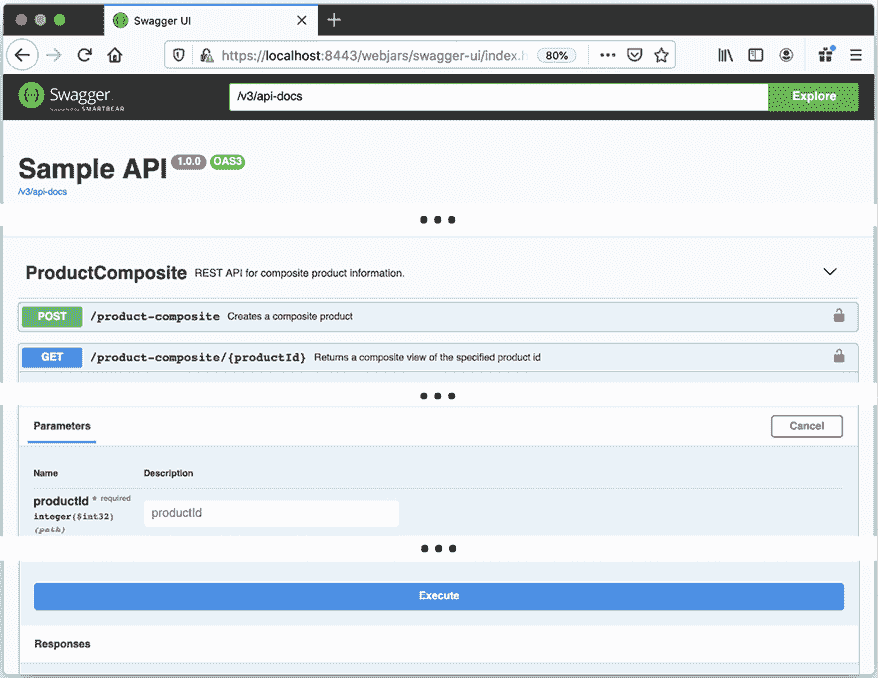
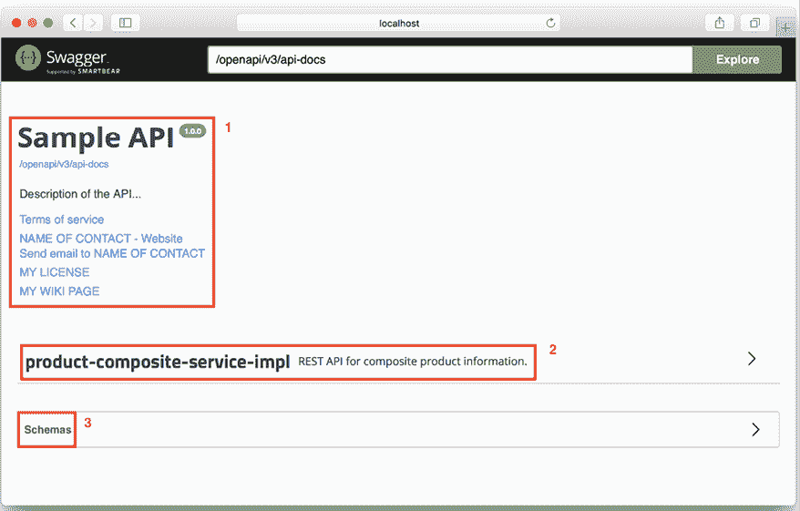
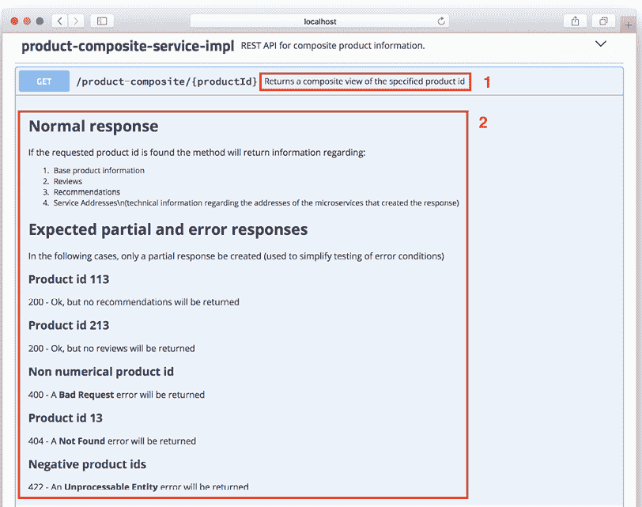
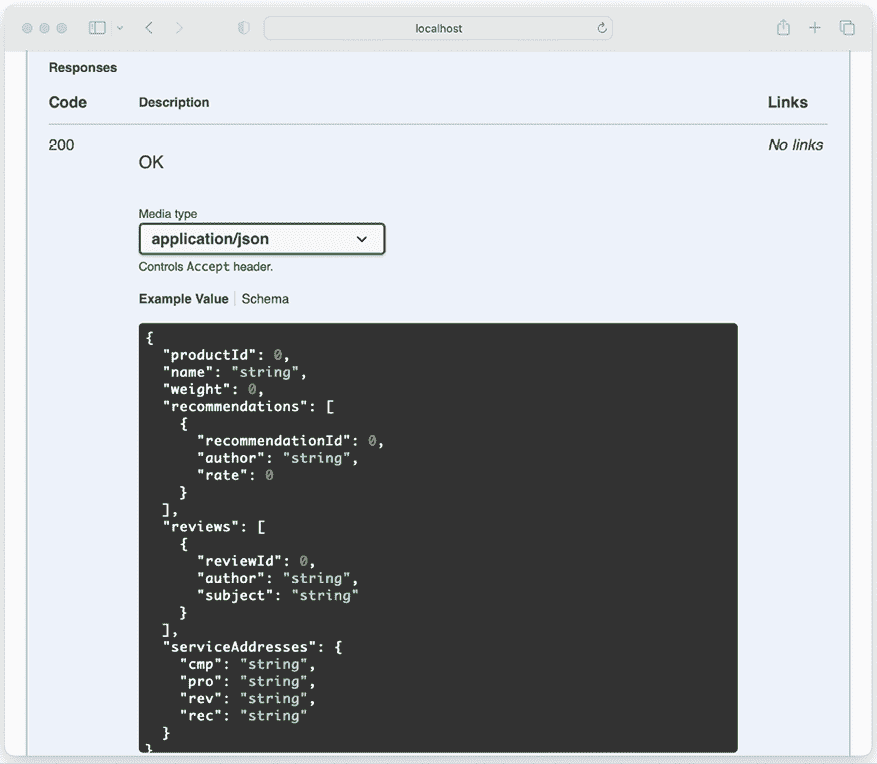
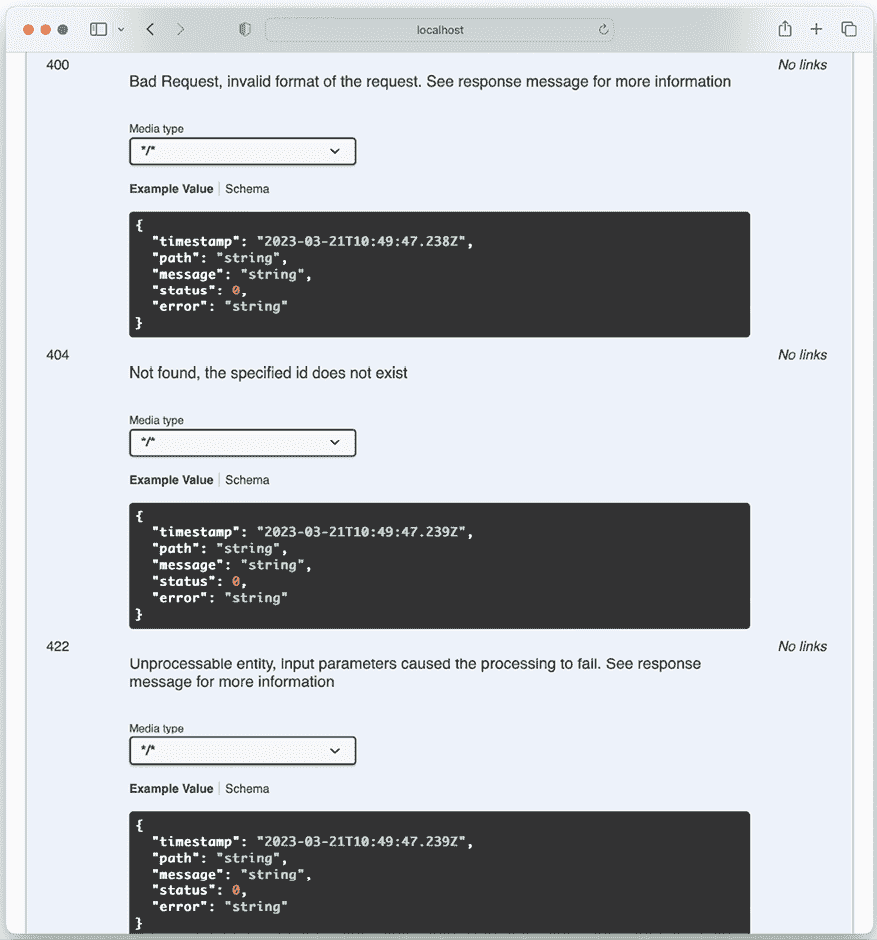
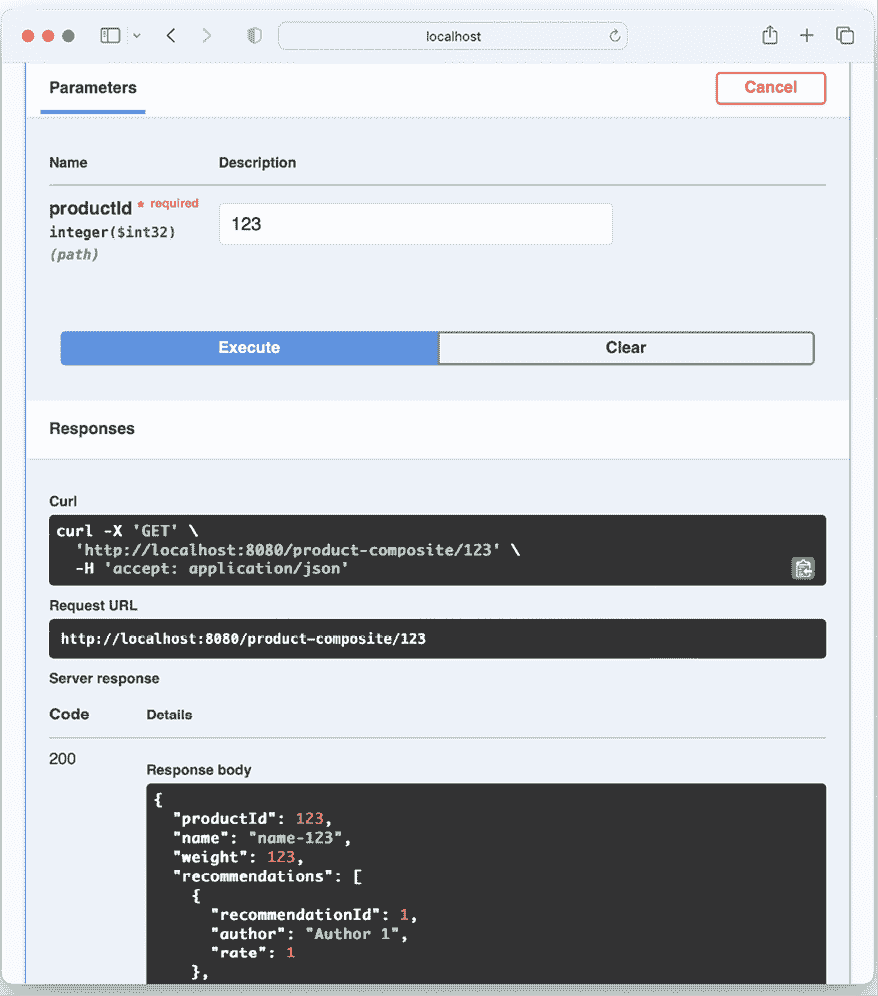
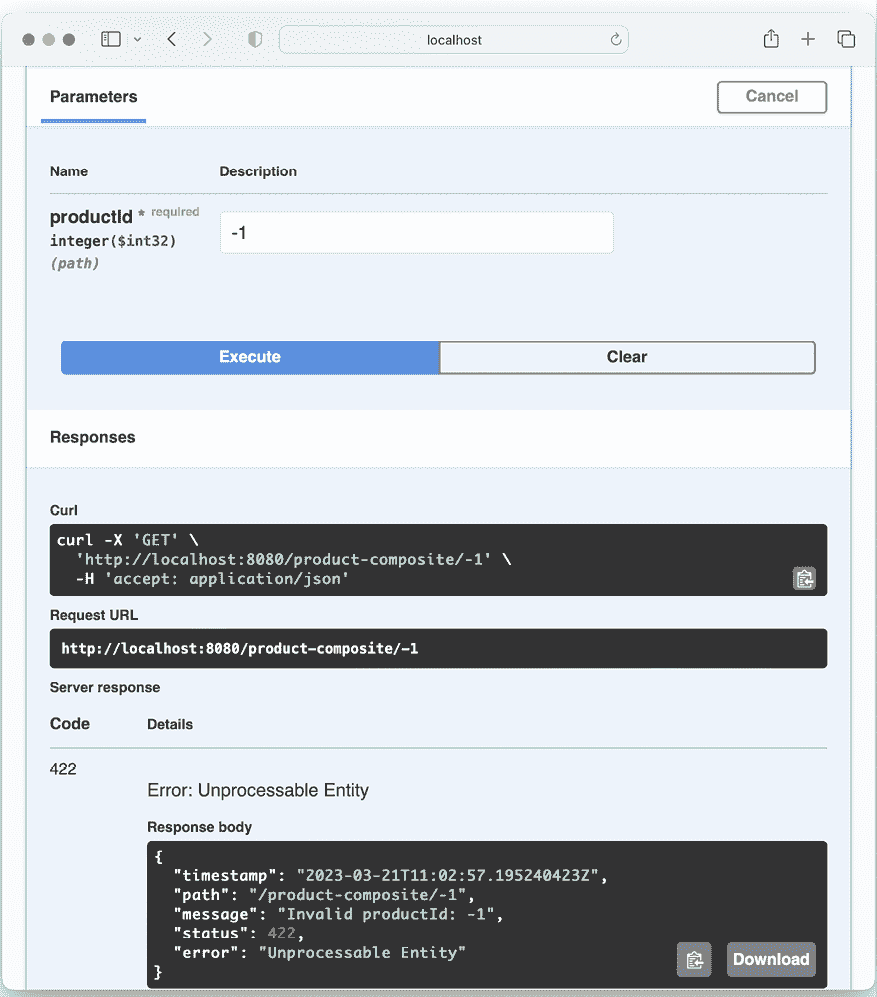

# 第五章：使用 OpenAPI 添加 API 描述

一个 API（如 RESTful 服务）的价值在很大程度上取决于其消费的难易程度。良好的、易于访问的文档是 API 是否有用的一个重要部分。在本章中，我们将学习如何使用 **OpenAPI 规范**来记录我们可以从微服务景观外部访问的 API。

正如我们在 *第二章*，*Spring Boot 简介* 中提到的，OpenAPI 规范（以前称为 Swagger 规范）是记录 RESTful 服务时最常用的规范之一。许多领先的 API 网关都原生支持 OpenAPI 规范。我们将学习如何使用开源项目 **springdoc-openapi** 来生成此类文档。我们还将学习如何嵌入 API 文档查看器，**Swagger UI 查看器**，它可以用来检查 API 文档并发出 API 请求。

到本章结束时，我们将拥有由 `product-composite-service` 微服务暴露的基于 OpenAPI 的 API 文档。该微服务还将暴露一个 Swagger UI 查看器，我们可以用它来可视化并测试 API。

本章将涵盖以下主题：

+   springdoc-openapi 的使用介绍

+   将 springdoc-openapi 添加到源代码中

+   构建和启动微服务景观

+   尝试使用 OpenAPI 文档

# 技术要求

关于如何安装本书中使用的工具以及如何访问本书源代码的说明，请参阅：

+   *第二十一章* 为 mac OS 安装说明

+   *第二十二章* 使用 WSL 2 和 Ubuntu 为 Microsoft Windows 安装说明

本章中的代码示例全部来自 `$BOOK_HOME/Chapter05` 中的源代码。

如果您想查看对本章源代码所做的更改，即查看使用 springdoc-openapi 创建基于 OpenAPI 的 API 文档所需要的内容，您可以将其与 *第四章*，*使用 Docker 部署我们的微服务* 的源代码进行比较。您可以使用您喜欢的 `diff` 工具比较两个文件夹，即 `$BOOK_HOME/Chapter04` 和 `$BOOK_HOME/Chapter05`。

# springdoc-openapi 的使用介绍

使用 springdoc-openapi 使得将 API 的文档与实现 API 的源代码保持在一起成为可能。通过 springdoc-openapi，您可以在运行时通过检查代码中的 Java 注解来动态创建 API 文档。对我来说，这是一个重要的功能。如果 API 文档与 Java 源代码分开维护，它们最终会相互分离。根据我的经验，这种情况往往比预期的要早发生。

在 springdoc-openapi 创建之前，另一个开源项目**SpringFox**([`springfox.github.io/springfox/`](http://springfox.github.io/springfox/))提供了类似的功能。近年来，SpringFox 项目没有积极维护，作为对此的反应，创建了 springdoc-openapi 项目。SpringFox 用户的迁移指南可以在[`springdoc.org/#migrating-from-springfox`](https://springdoc.org/#migrating-from-springfox)找到。

总的来说，将组件的接口与其实现分离是很重要的。在记录 RESTful API 方面，我们应该将 API 文档添加到描述 API 的 Java 接口中，而不是添加到实现 API 的 Java 类中。为了简化更新 API 文档的文本部分（例如，较长的描述），我们可以将描述放在属性文件中，而不是直接放在 Java 代码中。

除了动态创建 API 规范之外，springdoc-openapi 还附带了一个名为 Swagger UI 的嵌入式 API 查看器。我们将配置`product-composite-service`服务以暴露 Swagger UI 来查看其 API。

尽管 Swagger UI 在开发和测试阶段非常有用，但由于安全原因，通常不会在生产环境中的 API 上公开。在许多情况下，API 通过 API 网关公开。今天，大多数 API 网关产品都支持基于 OpenAPI 文档公开 API 文档。因此，而不是公开 Swagger UI，API 的 OpenAPI 文档（由 springdoc-openapi 生成）被导出到一个可以安全发布 API 文档的 API 网关。

如果预期 API 将由第三方开发者使用，可以设置一个包含文档和工具的开发者门户，例如用于自我注册。Swagger UI 可以在开发者门户中使用，允许开发者通过阅读文档并使用测试实例尝试 API 来了解 API。

在第十一章“保护 API 访问”中，我们将学习如何使用 OAuth 2.1 锁定对 API 的访问。我们还将学习如何配置 Swagger UI 组件以获取 OAuth 2.1 访问令牌，并在用户通过 Swagger UI 尝试 API 时使用这些令牌。

以下截图是 Swagger UI 的一个示例：



图 5.1：Swagger UI 示例

在前面的图中，一些目前不重要的截图部分已被替换为“**…**”。我们将在本章的后面部分回到这些细节。

要启用 springdoc-openapi 创建 API 文档，我们需要在我们的构建文件中添加一些依赖项，并在定义 RESTful 服务的 Java 接口中添加一些注解。如上所述，我们还将 API 文档的描述部分放在属性文件中。

如果文档的部分内容已经放置在属性文件中以简化 API 文档的更新，那么重要的是属性文件必须与源代码在相同的生命周期和版本控制下处理。否则，存在它们开始与实现脱节的风险，即变得过时。

介绍了 springdoc-openapi 之后，让我们看看如何通过在源代码中进行必要的更改来开始使用它。

# 将 springdoc-openapi 添加到源代码中

要添加关于由`product-composite-service`微服务公开的外部 API 的基于 OpenAPI 的文档，我们需要更改两个项目的源代码：

+   `product-composite-service`：在这里，我们将设置 Java 应用程序类`ProductCompositeServiceApplication`中的 springdoc-openapi 配置，并添加一些与 API 相关的一般信息。

+   `api`：在这里，我们将向 Java 接口`ProductCompositeService`添加注解，描述每个 RESTful 服务和其操作。在这个阶段，我们只有一个 RESTful 服务和一个操作，接受对`/product-composite/{productId}`的 HTTP GET 请求，用于请求有关特定产品的组合信息。

用于描述 API 操作的实际文本将被放置在`product-composite-service`项目的默认属性文件`application.yml`中。

在我们开始使用 springdoc-openapi 之前，我们需要将其添加到 Gradle 构建文件中的依赖项。所以，让我们从这里开始吧！

## 将依赖项添加到 Gradle 构建文件中

springdoc-openapi 项目被划分为多个模块。对于`api`项目，我们只需要包含我们将用于文档化的 API 注解的模块。我们可以将其添加到`api`项目的构建文件`build.gradle`中，如下所示：

```java
implementation 'org.springdoc:springdoc-openapi-starter-common:2.0.2' 
```

`product-composite-service`项目需要一个功能更全面的模块，该模块包含 Swagger UI 查看器和 Spring WebFlux 的支持。我们可以在构建文件`build.gradle`中添加依赖项，如下所示：

```java
implementation 'org.springdoc:springdoc-openapi-starter-webflux-ui:2.0.2' 
```

需要添加的所有依赖项都已添加；现在让我们进行配置。

## 将 OpenAPI 配置和一般 API 文档添加到 ProductCompositeService

要在`product-composite-service`微服务中启用 springdoc-openapi，我们必须添加一些配置。为了保持源代码紧凑，我们将直接将其添加到应用程序类`ProductCompositeServiceApplication.java`中。

如果您愿意，可以将 springdoc-openapi 的配置放置在单独的 Spring 配置类中。

首先，我们需要定义一个 Spring Bean，它返回一个`OpenAPI` Bean。源代码看起来是这样的：

```java
@Bean
public OpenAPI getOpenApiDocumentation() {
  return **new****OpenAPI****()**
    .info(new Info().title(apiTitle)
      .description(apiDescription)
      .version(apiVersion)
      .contact(new Contact()
        .name(apiContactName)
        .url(apiContactUrl)
        .email(apiContactEmail))
      .termsOfService(apiTermsOfService)
      .license(new License()
        .name(apiLicense)
        .url(apiLicenseUrl)))
    .externalDocs(new ExternalDocumentation()
      .description(apiExternalDocDesc)
      .url(apiExternalDocUrl));
} 
```

从前面的代码中，我们可以看到配置包含有关 API 的一般描述性信息，例如：

+   API 的名称、描述、版本和联系方式

+   使用条款和许可信息

+   如果有的话，有关 API 的外部信息链接

用于配置`OpenAPI` bean 的`api`变量是通过 Spring `@Value`注解从属性文件初始化的。具体如下：

```java
 @Value("${api.common.version}")         String apiVersion;
  @Value("${api.common.title}")           String apiTitle;
  @Value("${api.common.description}")     String apiDescription;
  @Value("${api.common.termsOfService}")  String apiTermsOfService;
  @Value("${api.common.license}")         String apiLicense;
  @Value("${api.common.licenseUrl}")      String apiLicenseUrl;
  @Value("${api.common.externalDocDesc}") String apiExternalDocDesc;
  @Value("${api.common.externalDocUrl}")  String apiExternalDocUrl;
  @Value("${api.common.contact.name}")    String apiContactName;
  @Value("${api.common.contact.url}")     String apiContactUrl;
  @Value("${api.common.contact.email}")   String apiContactEmail; 
```

实际值在属性文件`application.yml`中设置，如下所示：

```java
api:
  common:
    version: 1.0.0
    title: Sample API
    description: Description of the API...
    termsOfService: MY TERMS OF SERVICE
    license: MY LICENSE
    licenseUrl: MY LICENSE URL
    externalDocDesc: MY WIKI PAGE
    externalDocUrl: MY WIKI URL
    contact:
      name: NAME OF CONTACT
      url: URL TO CONTACT
      email: contact@mail.com 
```

属性文件还包含一些针对 springdoc-openapi 的配置：

```java
springdoc:
  swagger-ui.path: /openapi/swagger-ui.html
  api-docs.path: /openapi/v3/api-docs
  packagesToScan: se.magnus.microservices.composite.product
  pathsToMatch: /** 
```

配置参数有以下目的：

+   `springdoc.swagger-ui.path` 和 `springdoc.api-docs.path` 用于指定嵌入的 Swagger UI 查看器使用的 URL 在路径`/openapi`下可用。在本书的后续内容中，当我们添加不同类型的边缘服务器并解决安全挑战时，这将简化边缘服务器的配置。有关更多信息，请参阅以下章节：

    +   *第十章*，*使用 Spring Cloud Gateway 在边缘服务器后面隐藏微服务*

    +   *第十一章*，*保护 API 访问*

    +   *第十七章*，*通过实现 Kubernetes 功能简化系统景观*，*替换 Spring Cloud Gateway*部分

    +   *第十八章*，*使用服务网格提高可观察性和管理*，*用 Istio Ingress Gateway 替换 Kubernetes Ingress 控制器*部分

+   `springdoc.packagesToScan` 和 `springdoc.pathsToMatch` 控制 springdoc-openapi 在代码库中搜索注解的位置。我们能够给 springdoc-openapi 提供的范围越窄，扫描的速度就越快。

详细信息请参阅`product-composite-service`项目中的应用程序类`ProductCompositeServiceApplication.java`和`application.yml`属性文件。现在我们可以继续了解如何在`api`项目中的 Java 接口`ProductCompositeService.java`中添加 API 特定文档。

## 向 ProductCompositeService 接口添加 API 特定文档

为了记录实际的 API 及其 RESTful 操作，我们将在`api`项目中的`ProductCompositeService.java`接口声明上添加一个`@Tag`注解。对于 API 中的每个 RESTful 操作，我们将在相应的 Java 方法上添加一个`@Operation`注解，以及`@ApiResponse`注解，以描述操作及其预期的响应。我们将描述成功和错误响应。

除了在运行时读取这些注解外，springdoc-openapi 还会检查 Spring 注解，例如`@GetMapping`注解，以了解操作所接受的输入参数以及如果产生成功响应，响应将呈现什么样子。为了了解潜在错误响应的结构，springdoc-openapi 将寻找`@RestControllerAdvice`和`@ExceptionHandler`注解。在第三章*创建一组协作微服务*中，我们在`util`项目中添加了一个实用类，`GlobalControllerExceptionHandler.java`。

这个类被注解为 `@RestControllerAdvice`。有关详细信息，请参阅 *全局 REST 控制器异常处理器* 部分。异常处理器负责处理 `404` (`NOT_FOUND`) 和 `422` (`UNPROCESSABLE_ENTITY`) 错误。为了允许 springdoc-openapi 正确记录 Spring WebFlux 在发现请求中的不正确输入参数时生成的 `400` (`BAD_REQUEST`) 错误，我们还在 `GlobalControllerExceptionHandler.java` 中添加了一个 `@ExceptionHandler` 用于 `400` (`BAD_REQUEST`) 错误。

资源级别的 API 文档，对应于 Java 接口声明，如下所示：

```java
@Tag(name = "ProductComposite", description = 
  "REST API for composite product information.")
public interface ProductCompositeService { 
```

对于 API 操作，我们将 `@Operation` 和 `@ApiResponse` 注解中使用的实际文本提取到了属性文件中。注解包含属性占位符，如 `${name-of-the-property}`，springdoc-openapi 将在运行时使用这些占位符从属性文件中查找实际文本。API 操作的文档如下所示：

```java
@Operation( 
  summary = 
    "${api.product-composite.get-composite-product.description}",
  description = 
    "${api.product-composite.get-composite-product.notes}")
@ApiResponses(value = {
  @ApiResponse(responseCode = "200", description = 
    "${api.responseCodes.ok.description}"),
  @ApiResponse(responseCode = "**400**", description = 
    "${api.responseCodes.badRequest.description}"),
  @ApiResponse(responseCode = "**404**", description =   
    "${api.responseCodes.notFound.description}"),
  @ApiResponse(responseCode = "**422**", description =   
    "${api.responseCodes.unprocessableEntity.description}")
})
**@GetMapping**(
  value = **"/product-composite/{productId}"**,
  produces = "application/json")
ProductAggregate getProduct**(****@PathVariable****int** **productId)**; 
```

从前面的源代码中，springdoc-openapi 将能够提取以下关于操作的信息：

+   该操作接受对 URL `/product-composite/{productid}` 的 HTTP GET 请求，其中 URL 的最后一部分 `{productid}` 被用作请求的输入参数。

+   成功的响应将生成与 Java 类 `ProductAggregate` 对应的 JSON 结构。

+   在发生错误的情况下，将返回 HTTP 错误代码 `400`、`404` 或 `422`，并在响应体中包含错误信息，如 Java 类 `GlobalControllerExceptionHandler.java` 中的 `@ExceptionHandler` 所描述的，如上所述。

对于 `@Operation` 和 `@ApiResponse` 注解中指定的值，我们可以直接使用属性占位符，而无需使用 Spring `@Value` 注解。实际值在属性文件 `application.yml` 中设置，如下所示：

```java
**api:**
**responseCodes:**
**ok.description:****OK**
    badRequest.description: Bad Request, invalid format of the request. See response message for more information
    notFound.description: Not found, the specified id does not exist
    unprocessableEntity.description: Unprocessable entity, input parameters caused the processing to fail. See response message for more information
  product-composite:
    get-composite-product:
      description: Returns a composite view of the specified product id
      notes: **|**
        # Normal response
        If the requested product id is found the method will return information regarding:
        1\. Base product information
        1\. Reviews
        1\. Recommendations
        1\. Service Addresses\n(technical information regarding the addresses of the microservices that created the response)
        # Expected partial and error responses
        In the following cases, only a partial response be created (used to simplify testing of error conditions)
        ## Product id 113
        200 - Ok, but no recommendations will be returned
        ## Product id 213
        200 - Ok, but no reviews will be returned
        ## Non-numerical product id
        400 - A **Bad Request** error will be returned
        ## Product id 13
        404 - A **Not Found** error will be returned
        ## Negative product ids
        422 - An **Unprocessable Entity** error will be returned 
```

从前面的配置中，我们可以了解以下内容：

+   例如，属性占位符 `${api.responseCodes.ok.description}` 将被翻译为 `OK`。注意基于 YAML 的属性文件的层次结构：

    ```java
    api:
      responseCodes:
        ok.description: OK 
    ```

+   多行值以 `|` 开头，例如属性 `api.get-composite-product.description.notes` 的值。此外，请注意 springdoc-openapi 支持使用 **Markdown** 语法提供多行描述。

有关详细信息，请参阅 `api` 项目中的服务接口类 `ProductCompositeService.java` 和 `product-composite-service` 项目中的属性文件 `application.yml`。

如果你想了解更多关于 YAML 文件结构的信息，请查看规范：[`yaml.org/spec/1.2/spec.html`](https://yaml.org/spec/1.2/spec.html)。

# 构建 和 启动 微服务环境

在我们尝试 OpenAPI 文档之前，我们需要构建并启动微服务环境！

这可以通过以下命令完成：

```java
cd $BOOK_HOME/Chapter05
./gradlew build && docker-compose build && docker-compose up -d 
```

你可能会遇到一个关于端口 `8080` 已经被分配的错误消息。这看起来如下：

```java
ERROR: for product-composite Cannot start service product-composite: driver failed programming external connectivity on endpoint chapter05_product-composite_1 (0138d46f2a3055ed1b90b3b3daca92330919a1e7fec20351728633222db5e737): Bind for 0.0.0.0:8080 failed: port is already allocated 
```

如果是这样，你可能忘记从上一章拉取微服务景观。要找出正在运行的容器的名称，请运行以下命令：

```java
 docker ps --format {{.Names}} 
```

当上一章的微服务景观仍在运行时的一个示例响应如下：

```java
chapter05_review_1
chapter05_product_1
chapter05_recommendation_1
chapter04_review_1
chapter04_product-composite_1
chapter04_product_1
chapter04_recommendation_1 
```

如果你在命令输出中发现了来自其他章节的容器，例如，来自 *第四章*，*使用 Docker 部署我们的微服务*，就像前面的例子中那样，你需要跳转到该章节的源代码文件夹并拉取其容器：

```java
cd ../Chapter04
docker-compose down 
```

现在，你可以启动本章缺失的容器：

```java
cd ../Chapter05
docker-compose up -d 
```

注意，由于其他容器已经成功启动，命令仅启动了缺失的容器 `product-composite`：

```java
Starting chapter05_product-composite_1 ... done 
```

要等待微服务景观启动并验证其是否正常工作，你可以运行以下命令：

```java
./test-em-all.bash 
```

注意，测试脚本 `test-em-all.bash` 已扩展，包含一组测试，以验证 Swagger UI 端点按预期工作：

```java
# Verify access to Swagger and OpenAPI URLs
echo "Swagger/OpenAPI tests"
assertCurl 302 "curl -s  http://$HOST:$PORT/openapi/swagger-ui.html"
assertCurl 200 "curl -sL http://$HOST:$PORT/openapi/swagger-ui.html"
assertCurl 200 "curl -s  http://$HOST:$PORT/openapi/webjars/swagger-ui/index.html?configUrl=/v3/api-docs/swagger-config"
assertCurl 200 "curl -s  http://$HOST:$PORT/openapi/v3/api-docs"
assertEqual "3.0.1" "$(echo $RESPONSE | jq -r .openapi)"
assertEqual "http://$HOST:$PORT" "$(echo $RESPONSE | jq -r '.servers[0].url')"
assertCurl 200 "curl -s  http://$HOST:$PORT/openapi/v3/api-docs.yaml" 
```

在微服务成功启动后，我们可以继续尝试使用其嵌入的 Swagger UI 查看器测试 `product-composite` 微服务暴露的 OpenAPI 文档。

# 尝试 OpenAPI 文档

要浏览 OpenAPI 文档，我们将使用嵌入的 Swagger UI 查看器。如果我们在一个网络浏览器中打开 [`localhost:8080/openapi/swagger-ui.html`](http://localhost:8080/openapi/swagger-ui.html) URL，我们将看到一个类似于以下截图的网页：



图 5.2：带有 Swagger UI 查看器的 OpenAPI 文档

在这里，我们可以确认以下内容：

1.  我们在 springdoc-openapi `OpenAPI` bean 中指定的通用信息以及指向实际 OpenAPI 文档的链接，**/openapi/v3/api-docs**，指向 `http://localhost:8080/openapi/v3/api-docs`。

    注意，这是可以导出到 API 网关的 OpenAPI 文档链接，如上节 *springdoc-openapi 使用介绍* 中所述。

1.  API 资源列表；在我们的例子中，是 **ProductComposite** API。

1.  在页面底部，有一个我们可以检查 API 中使用的模式的区域。

    按照以下步骤进行 API 文档的检查。

1.  点击 **ProductComposite** API 资源以展开它。您将获得该资源上可用的操作列表。您将只看到一个操作，**/product-composite/{productId}**。

1.  点击它以展开。您将看到我们指定在 `ProductCompositeService` Java 接口中的操作文档：



图 5.3：ProductComposite API 文档

在这里，我们可以看到以下内容：

+   操作的一行描述。

+   一个包含操作细节的章节，包括它支持的输入参数。注意 `@ApiOperation` 注解中 `notes` 字段中的 Markdown 语法已经被很好地渲染了！

如果你向下滚动网页，你也会找到有关预期响应及其结构的文档，包括正常 **200**（OK）响应的文档…



图 5.4：200 响应的文档

…以及我们之前定义的各种 4xx 错误响应，如下面的截图所示：



图 5.5：4xx 响应的文档

对于每个文档化的潜在错误响应，我们可以了解其含义和响应体的结构。

如果我们向上滚动到参数描述，我们会找到 **尝试一下** 按钮。如果我们点击该按钮，我们可以填写实际的参数值，并通过点击 **执行** 按钮向 API 发送请求。例如，如果我们将在 **productId** 字段中输入 `123`，我们将得到以下响应：



图 5.6：发送现有产品请求后的响应

我们将得到预期的 **200**（OK）作为响应代码，以及我们已熟悉的 JSON 结构在响应体中！

如果我们输入一个错误的输入，例如 `-1`，我们将得到一个适当的错误代码作为响应代码，**422**，以及响应体中的基于 JSON 的错误描述：



图 5.7：发送无效输入后的响应

注意响应体中的 **message** 字段清楚地指出了问题：**“Invalid productId: -1”**。

如果你想在不使用 Swagger UI 查看器的情况下尝试调用 API，你可以从 **响应** 部分复制相应的 `curl` 命令，并在终端窗口中运行它，如前一个截图所示：

```java
curl -X GET "http://localhost:8080/product-composite/123" -H "accept: application/json" 
```

太棒了，不是吗？

# 摘要

良好的 API 文档对于其接受至关重要，而 OpenAPI 是在文档化 RESTful 服务时最常用的规范之一。springdoc-openapi 是一个开源项目，它通过检查 Spring WebFlux 和 Swagger 注解，使得在运行时动态创建基于 OpenAPI 的 API 文档成为可能。API 的文本描述可以从 Java 源代码中的注解中提取出来，并放置在属性文件中以方便编辑。springdoc-openapi 可以配置为将内嵌的 Swagger UI 查看器引入微服务中，这使得阅读微服务公开的 API 以及从查看器中尝试它们变得非常容易。

现在，关于通过添加持久性来给我们的微服务带来活力，也就是说，将那些微服务的数据保存到数据库中的能力，我们该怎么办？为此，我们需要添加一些更多的 API，以便我们可以创建和删除由微服务处理的信息。前往下一章了解更多！

# 问题

1.  Springdoc-openapi 是如何帮助我们为 RESTful 服务创建 API 文档的？

1.  Springdoc-openapi 支持哪种 API 文档规范？

1.  springdoc-openapi 的`OpenAPI` bean 的用途是什么？

1.  列举一些 springdoc-openapi 在运行时读取的注解，以动态创建 API 文档。

1.  在 YAML 文件中，代码“`: |`"代表什么意思？

1.  如何在不再次使用查看器的情况下重复调用使用嵌入式 Swagger UI 查看器执行的 API 调用？

# 加入我们的 Discord 社区

加入我们的 Discord 空间，与作者和其他读者进行讨论：

[`packt.link/SpringBoot3e`](https://packt.link/SpringBoot3e)


