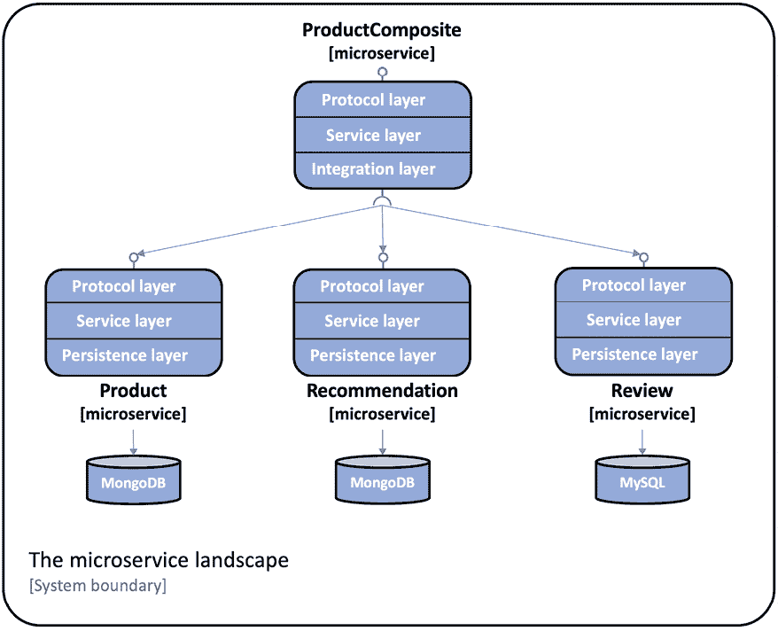
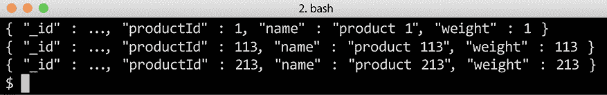
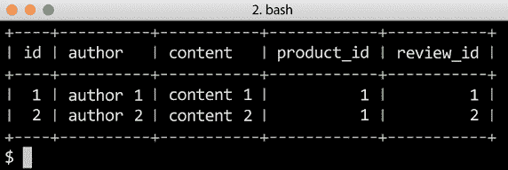
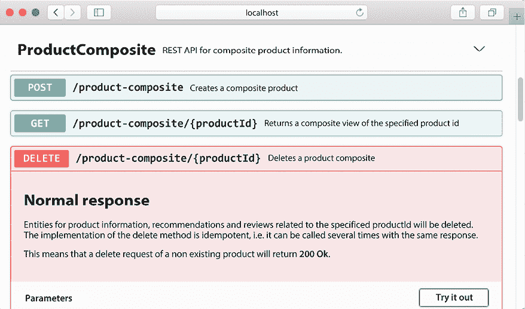
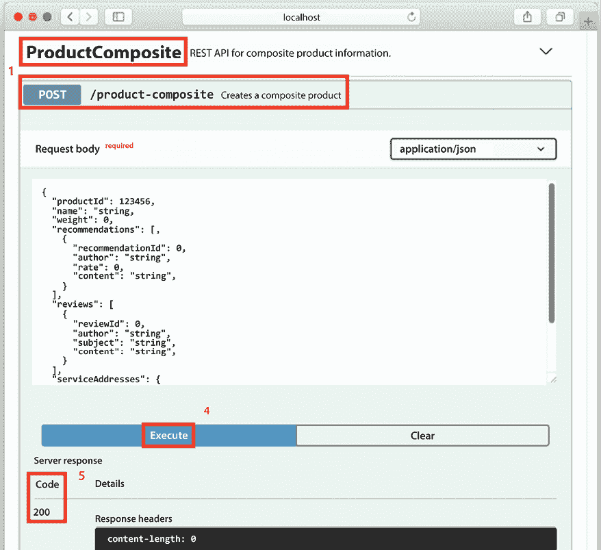
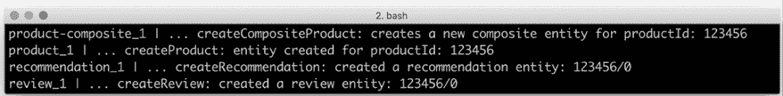
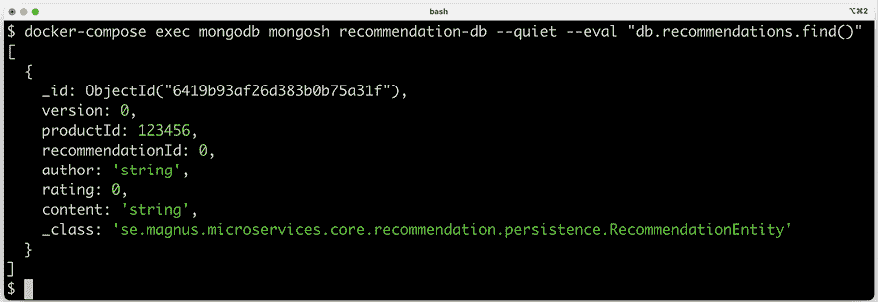
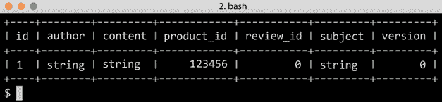
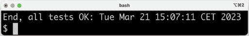

# 第六章：添加持久化

在本章中，我们将学习如何持久化微服务使用的数据。正如在*第二章*，*Spring Boot 简介*中提到的，我们将使用 Spring Data 项目将数据持久化到 MongoDB 和 MySQL 数据库。

`product`和`recommendation`微服务将使用 Spring Data for MongoDB，而`review`微服务将使用 Spring Data for **Java Persistence API**（**JPA**）来访问 MySQL 数据库。我们将向 RESTful API 添加操作以能够在数据库中创建和删除数据。现有的读取数据 API 将更新以访问数据库。我们将以 Docker 容器的方式运行数据库，由 Docker Compose 管理，即以与我们运行微服务相同的方式。

本章将涵盖以下主题：

+   将持久化层添加到核心微服务

+   编写关注持久化的自动化测试

+   在服务层中使用持久化层

+   扩展组合服务 API

+   将数据库添加到 Docker Compose 环境中

+   新 API 和持久化层的手动测试

+   更新微服务景观的自动化测试

# 技术要求

关于如何安装本书中使用的工具以及如何访问本书源代码的说明，请参阅：

+   *第二十一章*，*macOS 安装说明*

+   *第二十二章*，*使用 WSL 2 和 Ubuntu 的 Microsoft Windows 安装说明*

要手动访问数据库，我们将使用运行数据库时使用的 Docker 镜像中提供的 CLI 工具。我们还将公开 Docker Compose 中每个数据库的标准端口，`3306`用于 MySQL 和`27017`用于 MongoDB。这将使我们能够像它们在本地计算机上运行一样使用我们喜欢的数据库工具访问数据库。

本章中的代码示例均来自`$BOOK_HOME/Chapter06`的源代码。

如果你想查看本章源代码中应用的变化，即查看使用 Spring Data 将持久化添加到微服务中所需的内容，你可以将其与*第五章*，*使用 OpenAPI 添加 API 描述*的源代码进行比较。你可以使用你喜欢的`diff`工具比较两个文件夹，`$BOOK_HOME/Chapter05`和`$BOOK_HOME/Chapter06`。

在深入细节之前，让我们看看我们将走向何方。

# 本章目标

到本章结束时，我们微服务中的层级结构将如下所示：



图 6.1：我们追求的微服务景观

**协议层**处理特定协议的逻辑。它非常薄，仅由`api`项目中的`RestController`注解和`util`项目中的通用`GlobalControllerExceptionHandler`组成。每个微服务的主要功能都位于各自的**服务层**。

`product-composite`服务包含一个**集成层**，用于处理与三个核心微服务的通信。核心微服务都将有一个**持久层**，用于与它们的数据库通信。

我们将能够使用如下命令访问存储在 MongoDB 中的数据：

```java
docker-compose exec mongodb mongosh product-db --quiet --eval "db.products.find()" 
```

命令的结果应该如下所示：



图 6.2：访问存储在 MongoDB 中的数据

关于存储在 MySQL 中的数据，我们将能够使用如下命令访问它：

```java
docker-compose exec mysql mysql -uuser -p review-db -e "select * from reviews" 
```

命令的结果应该如下所示：



图 6.3：访问存储在 MySQL 中的数据

`mongo`和`mysql`命令的输出已被缩短以提高可读性。

让我们看看如何实现这一点。我们将首先为我们的核心微服务添加持久性功能！

# 向核心微服务添加持久层

让我们从向核心微服务添加持久层开始。除了使用 Spring Data，我们还将使用一个 Java Bean 映射工具，**MapStruct**，它使得在 Spring Data 实体对象和 API 模型类之间转换变得容易。有关更多详细信息，请参阅[`mapstruct.org/`](http://mapstruct.org/)。

首先，我们需要向 MapStruct、Spring Data 以及我们打算使用的数据库的 JDBC 驱动程序添加依赖项。之后，我们可以定义我们的 Spring Data 实体类和仓库。Spring Data 实体类和仓库将放置在其自己的 Java 包`persistence`中。例如，对于产品微服务，它们将被放置在 Java 包`se.magnus.microservices.core.product.persistence`中。

## 添加依赖项

我们将使用 MapStruct v1.5.3，因此我们将首先在各个核心微服务的构建文件`build.gradle`中定义一个变量来持有版本信息：

```java
ext {
  mapstructVersion = "1.5.3.Final"
} 
```

接下来，我们声明对 MapStruct 的依赖项：

```java
implementation "org.mapstruct:mapstruct:${mapstructVersion}" 
```

由于 MapStruct 在编译时通过处理 MapStruct 注解来生成 bean 映射的实现，我们需要添加一个`annotationProcessor`和一个`testAnnotationProcessor`依赖项：

```java
annotationProcessor "org.mapstruct:mapstruct-processor:${mapstructVersion}"
testAnnotationProcessor "org.mapstruct:mapstruct-processor:${mapstructVersion}" 
```

为了使编译时生成在流行的 IDE（如 IntelliJ IDEA）中工作，我们还需要添加以下依赖项：

```java
compileOnly "org.mapstruct:mapstruct-processor:${mapstructVersion}" 
```

如果你使用的是 IntelliJ IDEA，还需要确保启用了注解处理支持。打开**首选项**，导航到**构建**、**执行**、**部署 | 编译器 | 注解处理器**。请确保名为**启用注解处理**的复选框被选中！

对于`product`和`recommendation`微服务，我们声明以下对 Spring Data MongoDB 的依赖项：

```java
implementation 'org.springframework.boot:spring-boot-starter-data-mongodb' 
```

对于`review`微服务，我们声明了对 Spring Data JPA 和 MySQL JDBC 驱动的依赖项如下：

```java
implementation 'org.springframework.boot:spring-boot-starter-data-jpa'
implementation 'com.mysql:mysql-connector-j' 
```

为了在运行自动化集成测试时启用 MongoDB 和 MySQL 的使用，我们将使用**Testcontainers**及其对 JUnit 5、MongoDB 和 MySQL 的支持。对于`product`和`recommendation`微服务，我们声明以下测试依赖项：

```java
implementation platform('org.testcontainers:testcontainers-bom:1.15.2')
testImplementation 'org.testcontainers:testcontainers'
testImplementation 'org.testcontainers:junit-jupiter'
testImplementation 'org.testcontainers:mongodb' 
```

对于`review`微服务，我们声明以下测试依赖项：

```java
implementation platform('org.testcontainers:testcontainers-bom:1.15.2')
testImplementation 'org.testcontainers:testcontainers'
testImplementation 'org.testcontainers:junit-jupiter'
testImplementation 'org.testcontainers:mysql' 
```

关于如何在集成测试中使用 Testcontainers 的更多信息，请参阅后面的*编写关注持久性的自动化测试*部分。

## 使用实体类存储数据

实体类在包含的字段方面与相应的 API 模型类相似；请参阅`api`项目中的 Java 包`se.magnus.api.core`。与 API 模型类相比，实体类中我们将添加两个字段，`id`和`version`。

`id`字段用于存储每个存储实体的数据库标识符，对应于使用关系型数据库时的主键。我们将委托 Spring Data 生成`id`字段的唯一值的责任。根据所使用的数据库，Spring Data 可以将此责任委托给数据库引擎或自行处理。在任何情况下，应用程序代码都不需要考虑如何设置唯一的数据库`id`值。出于安全角度的最佳实践，`id`字段不在 API 中公开。在模型类中标识实体的字段将在相应的实体类中被分配一个唯一索引，以确保从业务角度在数据库中的一致性。

`version`字段用于实现乐观锁，允许 Spring Data 验证数据库中实体的更新不会覆盖并发更新。如果数据库中存储的`version`字段的值高于更新请求中`version`字段的值，这表明更新是在过时数据上进行的——要更新的信息自从从数据库读取以来已被其他人更新。基于过时数据进行的更新尝试将被 Spring Data 阻止。在编写持久性测试的部分，我们将看到验证 Spring Data 中的乐观锁机制防止对过时数据进行更新的测试。由于我们只实现了创建、读取和删除操作的 API，因此我们不会在 API 中公开`version`字段。

产品实体类中最有趣的部分，用于在 MongoDB 中存储实体，如下所示：

```java
**@Document(collection="products")**
public class ProductEntity {
 **@Id**
 private String id;
 **@Version**
 private Integer version;
 **@Indexed(unique = true)**
 private int productId;
 private String name;
 private int weight; 
```

下面是从前面的代码中得出的几点观察：

+   使用`@Document(collection = "products")`注解来标记该类为用于 MongoDB 的实体类，即映射到 MongoDB 中名为`products`的集合。

+   使用`@Id`和`@Version`注解来标记`id`和`version`字段，以便 Spring Data 使用，如前所述。

+   使用`@Indexed(unique = true)`注解来创建一个用于业务键`productId`的唯一索引。

`Recommendation` 实体类中最有趣的部分，也用于在 MongoDB 中存储实体，看起来如下：

```java
@Document(collection="recommendations")
**@CompoundIndex**(name = "prod-rec-id", unique = true, def = "{'productId': 1, 'recommendationId' : 1}")
public class RecommendationEntity {
    @Id
    private String id;
    @Version
    private Integer version;
    private int productId;
    private int recommendationId;
    private String author;
    private int rating;
    private String content; 
```

在前面产品实体说明的基础上，我们可以看到如何使用 `@CompoundIndex` 注解为基于 `productId` 和 `recommendationId` 字段的复合业务键创建一个唯一的复合索引。

最后，用于在 SQL 数据库（如 MySQL）中存储实体的 `Review` 实体类中最有趣的部分如下：

```java
**@Entity**
**@Table**(name = "reviews", indexes = { @Index(name = "reviews_unique_idx", unique = true, columnList = **"productId,reviewId"**) })
public class ReviewEntity {
    **@Id** **@GeneratedValue**
    private int id;
    **@Version**
    private int version;
    private int productId;
    private int reviewId;
    private String author;
    private String subject;
    private String content; 
```

有关前面代码的说明：

+   `@Entity` 和 `@Table` 注解用于标记类为用于 JPA 的实体类——映射到名为 `reviews` 的 SQL 数据库表。

+   `@Table` 注解也用于指定将基于 `productId` 和 `reviewId` 字段创建一个唯一的复合索引，用于复合业务键。

+   `@Id` 和 `@Version` 注解用于标记 `id` 和 `version` 字段，以便 Spring Data 使用，如前所述。为了指导 Spring Data 使用 JPA 自动为 `id` 字段生成唯一的 `id` 值，我们使用了 `@GeneratedValue` 注解。

实体类的完整源代码，请参阅每个核心微服务项目中的 `persistence` 包。

## 在 Spring Data 中定义仓库

Spring Data 提供了一套用于定义仓库的接口。我们将使用 `CrudRepository` 和 `PagingAndSortingRepository` 接口：

+   `CrudRepository` 接口提供了在数据库中存储的数据上执行基本创建、读取、更新和删除操作的标准方法。

+   `PagingAndSortingRepository` 接口为 `CrudRepository` 接口添加了对分页和排序的支持。

我们将使用 `CrudRepository` 接口作为 `Recommendation` 和 `Review` 仓库的基础，也将 `PagingAndSortingRepository` 接口作为 `Product` 仓库的基础。

我们还将为我们的仓库添加一些额外的查询方法，用于使用业务键 `productId` 查找实体。

Spring Data 支持根据方法的签名命名约定来定义额外的查询方法。例如，`findByProductId(int productId)` 方法签名可以用来指导 Spring Data 自动创建一个查询，从底层集合或表中返回实体。在这种情况下，它将返回 `productId` 字段设置为 `productId` 参数中指定值的实体。有关如何声明额外查询的更多详细信息，请参阅 [`docs.spring.io/spring-data/data-commons/docs/current/reference/html/#repositories.query-methods.query-creation`](https://docs.spring.io/spring-data/data-commons/docs/current/reference/html/#repositories.query-methods.query-creation)。

`Product` 仓库类看起来是这样的：

```java
public interface ProductRepository extends
    PagingAndSortingRepository <ProductEntity, String>,
    CrudRepository<ProductEntity, String> {
    **Optional**<ProductEntity> findByProductId(int productId);
} 
```

由于 `findByProductId` 方法可能返回零个或一个产品实体，因此返回值被标记为可选的，通过将其包装在 `Optional` 对象中来实现。

`Recommendation`仓库类的样子如下：

```java
public interface RecommendationRepository extends CrudRepository <RecommendationEntity, String> {
    **List**<RecommendationEntity> findByProductId(int productId);
} 
```

在这种情况下，`findByProductId`方法将返回零到多个推荐实体，因此返回值被定义为列表。

最后，`Review`仓库类的样子如下：

```java
public interface ReviewRepository extends CrudRepository<ReviewEntity, Integer> {
    **@Transactional(readOnly = true)**
    List<ReviewEntity> findByProductId(int productId);
} 
```

由于 SQL 数据库是事务性的，我们必须为查询方法`findByProductId()`指定默认的事务类型——在我们的案例中是只读。

就这些了——这就是为我们的核心微服务建立持久化层所需的所有内容。

要查看仓库类的完整源代码，请参阅每个核心微服务项目中的`persistence`包。

让我们通过编写一些测试来验证持久化类是否按预期工作，开始使用持久化类。

# 编写关注持久化的自动化测试

在编写持久化测试时，我们希望在测试开始时启动数据库，在测试完成后将其关闭。然而，我们不想让测试等待其他资源启动，例如，一个运行时所需的 Web 服务器（如 Netty）。

Spring Boot 提供了两个针对此特定要求的类级别注解：

+   `@DataMongoTest`：这个注解在测试开始时启动一个 MongoDB 数据库。

+   `@DataJpaTest`：这个注解在测试开始时启动一个 SQL 数据库：

    +   默认情况下，Spring Boot 会将测试配置为回滚 SQL 数据库的更新，以最小化对其他测试的负面影响。在我们的案例中，这种行为将导致一些测试失败。因此，使用类级别的注解`@Transactional(propagation = NOT_SUPPORTED)`禁用了自动回滚。

为了在执行集成测试期间处理数据库的启动和关闭，我们将使用 Testcontainers。在探讨如何编写持久化测试之前，让我们了解一下如何使用 Testcontainers。

## 使用 Testcontainers

**Testcontainers** ([`www.testcontainers.org`](https://www.testcontainers.org))是一个库，通过运行资源管理器（如数据库或消息代理）作为 Docker 容器来简化自动集成测试。Testcontainers 可以配置为在 JUnit 测试启动时自动启动 Docker 容器，并在测试完成后销毁容器。

为了在现有的 Spring Boot 应用程序（如本书中的微服务）的测试类中启用 Testcontainers，我们可以在测试类中添加`@Testcontainers`注解。使用`@Container`注解，例如，我们可以声明`Review`微服务的集成测试将使用运行 MySQL 的 Docker 容器。

代码看起来是这样的：

```java
@SpringBootTest
@Testcontainers
class SampleTests {
  @Container
  private static MySQLContainer database = 
    new MySQLContainer("mysql:8.0.32"); 
```

为 MySQL 指定的版本 8.0.32 是从 Docker Compose 文件中复制的，以确保使用相同的版本。

这种方法的缺点是每个测试类都会使用自己的 Docker 容器。在 Docker 容器中启动 MySQL 需要几秒钟，通常在我的 Mac 上需要 10 秒钟。运行多个使用相同类型测试容器的测试类将为每个测试类增加这种延迟。为了避免这种额外的延迟，我们可以使用**单容器模式**（见[`www.testcontainers.org/test_framework_integration/manual_lifecycle_control/#singleton-containers`](https://www.testcontainers.org/test_framework_integration/manual_lifecycle_control/#singleton-containers)）。遵循此模式，使用一个基类来启动 MySQL 的单个 Docker 容器。在`Review`微服务中使用的基类`MySqlTestBase`如下所示：

```java
public abstract class MySqlTestBase {
  private static MySQLContainer **database** =
    new MySQLContainer("mysql:8.0.32").withStartupTimeoutSeconds(300);

  **static** {
    database.start();
  }
  **@DynamicPropertySource**
  static void **databaseProperties**(DynamicPropertyRegistry registry) {
    registry.add("spring.datasource.url", database::getJdbcUrl);
    registry.add("spring.datasource.username", database::getUsername);
    registry.add("spring.datasource.password", database::getPassword);
  }
} 
```

对前面源代码的解释：

+   `database`容器声明的方式与前面的示例相同，只是在容器启动时增加了五分钟的扩展等待期。

+   使用一个`static`块在调用任何 JUnit 代码之前启动数据库容器。

+   数据库容器在启动时会获取一些属性定义，例如使用哪个端口。为了将这些动态创建的属性注册到应用程序上下文中，定义了一个静态方法`databaseProperties()`。该方法使用`@DynamicPropertySource`注解来覆盖应用程序上下文中的数据库配置，例如来自`application.yml`文件的配置。

测试类如下使用基类：

```java
class PersistenceTests extends MySqlTestBase {
class ReviewServiceApplicationTests extends MySqlTestBase { 
```

对于使用 MongoDB 的`product`和`review`微服务，已添加相应的基类`MongoDbTestBase`。

默认情况下，Testcontainers 的日志输出相当详细。可以在`src/test/resource`文件夹中放置一个**Logback**配置文件来限制日志输出的数量。Logback 是一个日志框架([`logback.qos.ch`](http://logback.qos.ch))，它通过使用`spring-boot-starter-webflux`依赖项包含在微服务中。有关详细信息，请参阅[`www.testcontainers.org/supported_docker_environment/logging_config/`](https://www.testcontainers.org/supported_docker_environment/logging_config/)。本章使用的配置文件名为`src/test/resources/logback-test.xml`，其内容如下：

```java
<?xml version="1.0" encoding="UTF-8" ?>
<configuration>
    <include resource="org/springframework/boot/logging/logback/**defaults.xml**"/>
    <include resource="org/springframework/boot/logging/logback/**console-appender.xml**"/>
    <**root** **level**=**"INFO"**>
        <appender-ref ref="CONSOLE" />
    </root>
</configuration> 
```

关于上面`XML`文件的一些说明：

+   配置文件包括 Spring Boot 提供的两个配置文件来定义默认值，并配置了一个可以将日志事件写入控制台的日志追加器。

+   该配置文件将日志输出限制在`INFO`日志级别，丢弃 Testcontainers 库发出的`DEBUG`和`TRACE`日志记录。

有关 Spring Boot 对日志的支持和 Logback 的使用详情，请参阅[`docs.spring.io/spring-boot/docs/current/reference/html/howto.html#howto-configure-logback-for-logging`](https://docs.spring.io/spring-boot/docs/current/reference/html/howto.html#howto-configure-logback-for-logging)。

最后，当使用`@DataMongoTest`和`@DataJpaTest`注解而不是`@SpringBootTest`注解，仅在集成测试期间启动 MongoDB 和 SQL 数据库时，还有一件事需要考虑。`@DataJpaTest`注解默认设计为启动嵌入式数据库。由于我们想使用容器化数据库，我们必须禁用此功能。

对于`@DataJpaTest`注解，可以通过使用类似这样的`@AutoConfigureTestDatabase`注解来完成：

```java
@DataJpaTest
@AutoConfigureTestDatabase(replace = AutoConfigureTestDatabase.Replace.NONE)
class PersistenceTests extends MySqlTestBase { 
```

随着 Testcontainers 的引入，我们准备好了解如何编写持久化测试。

## 编写持久化测试

对于三个核心微服务的持久化测试彼此相似，因此我们只需通过`product`微服务的持久化测试来了解。

测试类`PersistenceTests`声明了一个带有`@BeforeEach`注解的方法`setupDb()`，该方法在每个测试方法执行前执行。设置方法会从数据库中移除之前测试中创建的任何实体，并插入一个测试方法可以用来作为测试基础的实体：

```java
@DataMongoTest
class PersistenceTests {
    @Autowired
    private ProductRepository repository;
    private ProductEntity savedEntity;
    @BeforeEach
    void setupDb() {
        repository.deleteAll();
        ProductEntity entity = new ProductEntity(1, "n", 1);
        savedEntity = repository.save(entity);
        assertEqualsProduct(entity, savedEntity);
    } 
```

接下来是各种测试方法。首先是`create`测试：

```java
@Test
void create() {
    ProductEntity newEntity = new ProductEntity(2, "n", 2);
    **repository.save**(newEntity);
    ProductEntity foundEntity = 
    repository.**findById**(newEntity.getId()).get();
    assertEqualsProduct(newEntity, foundEntity);
    **assertEquals(****2**, repository.count());
} 
```

此测试创建一个新的实体，验证它可以使用`findById`方法找到，并通过断言数据库中存储了两个实体来结束测试，一个是`setup`方法创建的，另一个是测试本身创建的。

`update`测试看起来是这样的：

```java
@Test
void update() {
    savedEntity.setName("n2");
    repository.**save**(savedEntity);
    ProductEntity foundEntity = 
    repository.**findById**(savedEntity.getId()).get();
    **assertEquals(****1****,** (long)foundEntity.getVersion());
    **assertEquals(****"n2"****,** foundEntity.getName());
} 
```

此测试更新由`setup`方法创建的实体，再次使用标准的`findById()`方法从数据库中读取它，并断言它包含一些字段的预期值。请注意，当创建实体时，其`version`字段被 Spring Data 设置为`0`，因此我们期望更新后它为`1`。

`delete`测试看起来是这样的：

```java
@Test
void delete() {
    repository.**delete**(savedEntity);
    **assertFalse(repository.existsById**(savedEntity.getId()));
} 
```

此测试删除由`setup`方法创建的实体，并验证它不再存在于数据库中。

`read`测试看起来是这样的：

```java
@Test
void getByProductId() {
    Optional<ProductEntity> entity = 
    repository.**findByProductId**(savedEntity.getProductId());
    assertTrue(entity.isPresent());
    **assertEqualsProduct**(savedEntity, entity.get());
} 
```

此测试使用`findByProductId()`方法获取由`setup`方法创建的实体，验证其被找到，然后使用本地辅助方法`assertEqualsProduct()`验证`findByProductId()`返回的实体与`setup`方法存储的实体看起来相同。

接下来是两个测试方法，用于验证替代流程——处理错误条件。首先是验证重复项被正确处理的测试：

```java
@Test
void duplicateError() {
  assertThrows(**DuplicateKeyException**.class, () -> {
    ProductEntity entity = new ProductEntity(savedEntity.getProductId(), "n", 1);
    repository.save(entity);
  });
} 
```

测试尝试存储一个与由`setup`方法创建的实体使用的业务键相同的实体。如果保存操作成功，或者保存操作失败并抛出除预期的`DuplicateKeyException`之外的异常，则测试将失败。

在我的看法中，另一个负面测试是测试类中最有趣的测试。这是一个验证在更新过时数据的情况下正确处理错误的测试——它验证了乐观锁机制是否工作。它看起来是这样的：

```java
@Test
void optimisticLockError() {
    // Store the saved entity in two separate entity objects
    ProductEntity **entity1** = 
    repository.findById(savedEntity.getId()).get();
    ProductEntity **entity2** = 
    repository.findById(savedEntity.getId()).get();
    // Update the entity using the first entity object
    entity1.setName("n1");
    repository.**save(entity1)**;
    //  Update the entity using the second entity object.
    // This should fail since the second entity now holds an old version 
    // number, that is, an Optimistic Lock Error
    assertThrows(**OptimisticLockingFailureException.class**, () -> {
      entity2.setName("n2");
      repository.**save(entity2)**;
    });
    // Get the updated entity from the database and verify its new state
    ProductEntity updatedEntity = 
    repository.findById(savedEntity.getId()).get();
    **assertEquals(****1****,** (int)updatedEntity.getVersion());
    **assertEquals(****"n1"****,** updatedEntity.getName());
} 
```

从代码中可以观察到以下内容：

+   首先，测试读取相同的实体两次，并将其存储在两个不同的变量`entity1`和`entity2`中。

+   接下来，它使用其中一个变量`entity1`来更新实体。数据库中实体的更新将导致 Spring Data 自动增加实体的`version`字段。另一个变量`entity2`现在包含过时数据，这体现在其`version`字段上，该字段持有比数据库中相应值更低的值。

+   当测试尝试使用包含过时数据的变量`entity2`更新实体时，它预期会失败，并抛出`OptimisticLockingFailureException`异常。

+   测试通过断言数据库中的实体反映了第一次更新，即包含名称`"n1"`，并且`version`字段具有值`1`；数据库中的实体只执行了一个更新。

最后，`product`服务包含一个测试，演示了在 Spring Data 中使用内置的排序和分页支持：

```java
@Test
void paging() {
    repository.deleteAll();
    List<ProductEntity> newProducts = rangeClosed(1001, 1010)
        .mapToObj(i -> new ProductEntity(i, "name " + i, i))
        .collect(Collectors.toList());
    repository.**saveAll**(newProducts);
    Pageable nextPage = **PageRequest.of(****0****,** **4****, ASC,** **"productId"****);**
    nextPage = **testNextPage**(nextPage, "[1001, 1002, 1003, 1004]", 
    true);
    nextPage = testNextPage(nextPage, "[1005, 1006, 1007, 1008]", 
    true);
    nextPage = testNextPage(nextPage, "[1009, 1010]", false);
} 
```

上述代码的解释：

+   测试首先删除任何现有数据，然后插入具有`productId`字段从`1001`到`1010`的 10 个实体。

+   接下来，它创建`PageRequest`，请求每页`4`个实体，并按`ProductId`升序排序。

+   最后，它使用辅助方法`testNextPage`读取预期的三页，验证每页上的预期产品 ID，并验证 Spring Data 是否正确报告是否存在更多页面。

辅助方法`testNextPage`看起来如下：

```java
private Pageable testNextPage(Pageable nextPage, String expectedProductIds, boolean expectsNextPage) {
    Page<ProductEntity> productPage = repository.**findAll(nextPage);**
    assertEquals(expectedProductIds, productPage.getContent()
    .stream().map(p -> p.getProductId()).collect(Collectors.
    toList()).toString());
    assertEquals(expectsNextPage, productPage.hasNext());
    return productPage.nextPageable();
} 
```

辅助方法使用页面请求对象`nextPage`从存储库方法`findAll()`获取下一页。根据结果，它将返回的实体中的产品 ID 提取到字符串中，并将其与预期的产品 ID 列表进行比较。最后，它返回下一页。

要查看持久化测试的完整源代码，请参阅每个核心微服务项目中的测试类`PersistenceTests`。

可以使用类似以下命令的 Gradle 执行`product`微服务中的持久化测试：

```java
cd $BOOK_HOME/Chapter06
./gradlew microservices:product-service:test --tests PersistenceTests 
```

运行测试后，它应该响应如下：


图 6.4：BUILD SUCCESSFUL 响应

在设置持久化层之后，我们可以更新核心微服务中的服务层以使用持久化层。

# 在服务层中使用持久化层

在本节中，我们将学习如何在服务层中使用持久化层来存储和检索数据库中的数据。我们将按照以下步骤进行：

1.  记录数据库连接 URL

1.  添加新 API

1.  从服务层调用持久化层

1.  声明 Java Bean 映射器

1.  更新服务测试

## 记录数据库连接 URL

当扩展微服务数量，每个微服务连接到自己的数据库时，可能很难跟踪每个微服务实际使用的是哪个数据库。为了避免这种混淆，一个好的做法是在微服务启动后直接添加一个`LOG`语句，记录用于连接到数据库的连接信息。

例如，`product`服务的启动代码看起来是这样的：

```java
public class ProductServiceApplication {
  private static final Logger LOG = 
  LoggerFactory.getLogger(ProductServiceApplication.class);
  public static void main(String[] args) {
    ConfigurableApplicationContext ctx = 
    SpringApplication.run(ProductServiceApplication.class, args);
    String mongodDbHost = 
    ctx.getEnvironment().getProperty("spring.data.mongodb.host");
    String mongodDbPort = 
    ctx.getEnvironment().getProperty("spring.data.mongodb.port");
 **LOG.info(****"Connected to MongoDb: "** **+ mongodDbHost +** **":"** **+** 
 **mongodDbPort);**
  }
} 
```

对`LOG.info`方法的调用将像以下内容一样写入日志：


图 6.5：预期的日志输出

对于完整的源代码，请查看每个核心微服务项目中的主应用程序类，例如`product-service`项目中的`ProductServiceApplication`。

## 添加新的 API

在我们能够使用持久层在数据库中创建和删除信息之前，我们需要在我们的核心服务 API 中创建相应的 API 操作。

创建和删除产品实体的 API 操作看起来如下：

```java
@PostMapping(
    value    = "/product",
    consumes = "application/json",
    produces = "application/json")
Product createProduct(@RequestBody Product body);
@DeleteMapping(value = "/product/{productId}")
void deleteProduct(@PathVariable int productId); 
```

删除操作的实现将是**幂等的**；也就是说，如果多次调用，它将返回相同的结果。这在故障场景中是一个有价值的特性。例如，如果客户端在调用删除操作时遇到网络超时，它只需再次调用删除操作，无需担心不同的响应，例如，第一次响应是**OK**（**200**），而连续调用时响应是**Not Found**（**404**），或者任何意外的副作用。这表明即使实体在数据库中不再存在，操作也应返回状态码**OK**（**200**）。

`recommendation`和`review`实体的 API 操作看起来类似；然而，请注意，当涉及到`recommendation`和`review`实体的删除操作时，它将删除指定`productId`的所有`recommendations`和`reviews`。

对于完整的源代码，请查看`api`项目中核心微服务的接口声明（`ProductService`、`RecommendationService`和`ReviewService`）。

## 从服务层调用持久层

在服务层使用持久层的源代码对所有核心微服务都是结构化的。因此，我们只需查看`product`微服务的源代码。

首先，我们需要将持久层的仓库类和一个 Java Bean 映射类注入到构造函数中：

```java
private final ServiceUtil serviceUtil;
private final ProductRepository repository;
private final ProductMapper mapper;
@Autowired
public ProductServiceImpl(**ProductRepository repository, ProductMapper mapper, ServiceUtil serviceUtil**) {
    this.repository = repository;
    this.mapper = mapper;
    this.serviceUtil = serviceUtil;
} 
```

在下一节中，我们将看到如何定义 Java 映射类。

接下来，`createProduct`方法实现如下：

```java
public Product createProduct(Product body) {
    try {
        ProductEntity entity = mapper.apiToEntity(body);
        ProductEntity newEntity = repository.**save**(entity);
        return mapper.**entityToApi**(newEntity);
    } catch (**DuplicateKeyException** dke) {
        **throw****new****InvalidInputException**("Duplicate key, Product Id: " + 
        body.getProductId());
    }
} 
```

`createProduct`方法使用了存储库中的`save`方法来存储新的实体。需要注意的是，映射类用于在 API 模型类和实体类之间使用两个映射方法`apiToEntity()`和`entityToApi()`进行 Java bean 的转换。我们为`create`方法处理的唯一错误是`DuplicateKeyException`异常，我们将其转换为`InvalidInputException`异常。

`getProduct`方法如下所示：

```java
public Product getProduct(int productId) {
    if (**productId <** **1**) throw new InvalidInputException("Invalid 
    productId: " + productId);
    ProductEntity entity = repository.**findByProductId**(productId)
        .**orElseThrow**(() -> new NotFoundException("No product found for 
         productId: " + productId));
    Product response = mapper.entityToApi(entity);
    response.setServiceAddress(**serviceUtil**.getServiceAddress());
    return response;
} 
```

在进行一些基本输入验证（即确保`productId`不是负数）之后，使用存储库中的`findByProductId()`方法来查找产品实体。由于存储库方法返回一个`Optional`产品，我们可以使用`Optional`类中的`orElseThrow()`方法方便地抛出`NotFoundException`异常，如果未找到产品实体。在返回产品信息之前，使用`serviceUtil`对象来填写当前使用的微服务地址。

最后，让我们看看`deleteProduct`方法：

```java
public void deleteProduct(int productId) {
    repository.**findByProductId**(productId).**ifPresent**(e -> 
    repository.delete(e));
} 
```

`delete`方法也使用了存储库中的`findByProductId()`方法，并使用`Optional`类中的`ifPresent()`方法来方便地仅在实体存在时删除实体。请注意，实现是幂等的；如果未找到实体，则不会报告任何失败。

要查看完整的源代码，请参阅每个核心微服务项目中的服务实现类，例如，在`product-service`项目中查看`ProductServiceImpl`。

## 声明 Java bean 映射器

那么，关于神奇的 Java bean 映射器，又是怎样的呢？

如前所述，MapStruct 用于声明我们的映射类。在所有三个核心微服务中，MapStruct 的使用方式相似，因此我们只需查看`product`微服务中映射对象的源代码。

`product`服务的`mapper`类如下所示：

```java
@Mapper(componentModel = "spring")
public interface ProductMapper {
    @Mappings({
        @Mapping(target = "**serviceAddress**", ignore = true)
    })
    Product **entityToApi**(ProductEntity entity);
    @Mappings({
        @Mapping(target = "**id**", ignore = true),
        @Mapping(target = "**version**", ignore = true)
    })
    ProductEntity **apiToEntity**(Product api);
} 
```

从代码中可以注意以下几点：

+   `entityToApi()`方法将实体对象映射到 API 模型对象。由于实体类没有`serviceAddress`字段，`entityToApi()`方法被注解为忽略 API 模型对象中的`serviceAddress`字段。

+   `apiToEntity()`方法将 API 模型对象映射到实体对象。同样，`apiToEntity()`方法被注解为忽略 API 模型类中缺失的`id`和`version`字段。

MapStruct 不仅支持按名称映射字段，还可以指定映射具有不同名称的字段。在`recommendation`服务的映射类中，使用以下注解将`rating`实体字段映射到 API 模型字段`rate`：

```java
 @Mapping(target = "**rate**", source="entity.**rating**"),
    Recommendation entityToApi(RecommendationEntity entity);
    @Mapping(target = "**rating**", source="api.**rate**"),
    RecommendationEntity apiToEntity(Recommendation api); 
```

在成功构建 Gradle 之后，可以在每个项目的`build/classes`文件夹中找到生成的映射实现。例如，在`product-service`项目中，`ProductMapperImpl.java`。

要查看完整的源代码，请参阅每个核心微服务项目中的映射类，例如，在`product-service`项目中查看`ProductMapper`。

## 更新服务测试

自上一章以来，核心微服务公开的 API 测试已经更新，包括创建和删除 API 操作的测试。

添加的测试在所有三个核心微服务中都是相似的，所以我们只通过`product`微服务中的服务测试源代码进行说明。

为了确保每个测试都有一个已知的状态，声明了一个`setupDb()`设置方法，并使用`@BeforeEach`注解，因此它在每个测试之前执行。设置方法删除任何之前创建的实体：

```java
@Autowired
private ProductRepository repository;
@**BeforeEach**
void **setupDb**() {
   repository.deleteAll();
} 
```

创建 API 的测试方法验证在创建产品实体后可以检索到该实体，并且使用相同的`productId`创建另一个产品实体会导致 API 请求的响应中出现预期的错误，`UNPROCESSABLE_ENTITY`：

```java
@Test
void duplicateError() {
   int productId = 1;
   **postAndVerifyProduct(productId, OK);**
   assertTrue(repository.findByProductId(productId).isPresent());
   **postAndVerifyProduct(productId, UNPROCESSABLE_ENTITY)**
      .jsonPath("$.path").isEqualTo("/product")
      .jsonPath("$.message").isEqualTo("Duplicate key, Product Id: " + 
       productId);
} 
```

删除 API 的测试方法验证可以删除产品实体，并且第二个删除请求是幂等的——它也返回状态码 OK，即使实体在数据库中不再存在：

```java
@Test
void deleteProduct() {
   int productId = 1;
   postAndVerifyProduct(productId, OK);
   assertTrue(repository.findByProductId(productId).isPresent());
   deleteAndVerifyProduct(productId, **OK**);
   assertFalse(repository.findByProductId(productId).isPresent());
   deleteAndVerifyProduct(productId, **OK**);
} 
```

为了简化向 API 发送创建、读取和删除请求并验证响应状态，创建了三个辅助方法：

+   `postAndVerifyProduct()`

+   `getAndVerifyProduct()`

+   `deleteAndVerifyProduct()`

`postAndVerifyProduct()`方法如下所示：

```java
private WebTestClient.BodyContentSpec postAndVerifyProduct(int productId, HttpStatus expectedStatus) {
   Product product = new Product(productId, "Name " + productId, 
   productId, "SA");
   return client.post()
      .uri("/product")
      .body(just(product), Product.class)
      .accept(APPLICATION_JSON)
      .**exchange()**
      .expectStatus().**isEqualTo(expectedStatus)**
      .expectHeader().**contentType(APPLICATION_JSON)**
 **.expectBody();**
} 
```

辅助方法执行实际的 HTTP 请求并验证响应代码和响应体的内容类型。除此之外，辅助方法还会根据调用者的需要返回响应体以进行进一步调查。其他两个辅助方法用于读取和删除请求，它们类似。

三个服务测试类的源代码可以在每个核心微服务项目中找到，例如，在`product-service`项目中的`ProductServiceApplicationTests`。

现在，让我们继续了解如何扩展复合服务 API。

# 扩展复合服务 API

在本节中，我们将了解如何通过创建和删除复合实体的操作来扩展复合 API。我们将按照以下步骤进行：

1.  向复合服务 API 添加新操作

1.  将方法添加到集成层

1.  实现新的复合 API 操作

1.  更新复合服务测试

## 向复合服务 API 添加新操作

创建和删除实体以及处理聚合实体的复合版本与核心服务 API 中的创建和删除操作类似。主要区别是它们添加了用于基于 OpenAPI 的文档的注解。有关 OpenAPI 注解`@Operation`和`@ApiResponse`的用法说明，请参阅*第五章*，*使用 OpenAPI 添加 API 描述*，特别是*将 API 特定文档添加到 ProductCompositeService 接口*部分。

创建复合产品实体的 API 操作声明如下：

```java
@Operation(
  summary = "${api.product-composite.create-composite-product.description}",
  description = "${api.product-composite.create-composite-product.notes}")
@ApiResponses(value = {
  @ApiResponse(responseCode = "400", description = "${api.responseCodes.badRequest.description}"),
  @ApiResponse(responseCode = "422", description = "${api.responseCodes.unprocessableEntity.description}")
  })
@PostMapping(
  value    = "/product-composite",
  consumes = "application/json")
void createProduct(@RequestBody ProductAggregate body); 
```

删除复合产品实体的 API 操作声明如下：

```java
@Operation(
  summary = "${api.product-composite.delete-composite-product.description}",
  description = "${api.product-composite.delete-composite-product.notes}")
@ApiResponses(value = {
  @ApiResponse(responseCode = "400", description = "${api.responseCodes.badRequest.description}"),
  @ApiResponse(responseCode = "422", description = "${api.responseCodes.unprocessableEntity.description}")
})
@DeleteMapping(value = "/product-composite/{productId}")
void deleteProduct(@PathVariable int productId); 
```

对于完整的源代码，请参阅`api`项目中的 Java 接口`ProductCompositeService`。

我们还需要像以前一样，将 API 文档的描述性文本添加到`product-composite`项目中的属性文件`application.yml`中：

```java
create-composite-product:
  description: Creates a composite product
  notes: |
    # Normal response
    The composite product information posted to the API will be 
    split up and stored as separate product-info, recommendation 
    and review entities.
    # Expected error responses
    1\. If a product with the same productId as specified in the 
    posted information already exists, an **422 - Unprocessable 
    Entity** error with a "duplicate key" error message will be 
    Returned
delete-composite-product:
  description: Deletes a product composite
  notes: |
    # Normal response
    Entities for product information, recommendations and reviews 
    related to the specified productId will be deleted.
    The implementation of the delete method is idempotent, that is, 
    it can be called several times with the same response.
    This means that a delete request of a non-existing product will 
    return **200 Ok**. 
```

使用 Swagger UI 查看器，更新的 OpenAPI 文档将看起来像这样：



图 6.6：更新后的 OpenAPI 文档

在本章的后面部分，我们将使用 Swagger UI 查看器来尝试新的组合 API 操作。

## 向集成层添加方法

在我们能够在组合服务中实现新的创建和删除 API 之前，我们需要扩展集成层，使其能够调用核心微服务的 API 中的底层创建和删除操作。

集成层中调用三个核心微服务的创建和删除操作的方法简单直接，彼此相似，所以我们只将通过调用`product`微服务的方法的源代码进行说明。

`createProduct()`方法看起来是这样的：

```java
@Override
public Product createProduct(Product body) {
    try {
        return **restTemplate.postForObject**(
                   productServiceUrl, body, Product.class);
    } catch (HttpClientErrorException ex) {
        throw **handleHttpClientException**(ex);
    }
} 
```

它简单地委托发送 HTTP 请求的责任给`RestTemplate`对象，并将错误处理委托给辅助方法`handleHttpClientException`。

`deleteProduct()`方法看起来是这样的：

```java
@Override
public void deleteProduct(int productId) {
    try {
        **restTemplate.delete**(productServiceUrl + "/" + productId);
    } catch (HttpClientErrorException ex) {
        throw handleHttpClientException(ex);
    }
} 
```

它的实现方式与创建方法相同，但执行的是一个 HTTP `delete`请求。

集成层的完整源代码可以在`product-composite`项目中的`ProductCompositeIntegration`类中找到。

## 实现新的组合 API 操作

现在，我们可以实现组合的创建和删除方法了！

组合创建方法将聚合产品对象拆分为离散的`product`、`recommendation`和`review`对象，并在集成层中调用相应的创建方法：

```java
@Override
public void createProduct(ProductAggregate body) {
    try {
        Product product = new Product(body.getProductId(), 
        body.getName(), body.getWeight(), null);
        **integration.createProduct**(product);
        if (body.getRecommendations() != null) {
            body.getRecommendations().forEach(r -> {
                Recommendation recommendation = new 
                Recommendation(body.getProductId(), 
                r.getRecommendationId(), r.getAuthor(), r.getRate(), 
                r.getContent(), null);
                **integration.createRecommendation**(recommendation);
            });
        }
        if (body.getReviews() != null) {
            body.getReviews().forEach(r -> {
                Review review = new Review(body.getProductId(), 
                r.getReviewId(), r.getAuthor(), r.getSubject(), 
                r.getContent(), null);
                **integration.createReview**(review);
            });
        }
    } catch (RuntimeException re) {
        LOG.warn("createCompositeProduct failed", re);
        throw re;
    }
} 
```

组合删除方法简单地调用集成层中的三个删除方法，以删除底层数据库中的相应实体：

```java
@Override
public void deleteProduct(int productId) {
    integration.deleteProduct(productId);
    integration.deleteRecommendations(productId);
    integration.deleteReviews(productId);
} 
```

服务实现的完整源代码可以在`product-composite`项目中的`ProductCompositeServiceImpl`类中找到。

对于愉快的场景，这种实现将工作得很好，但如果考虑各种错误场景，我们会看到这种实现将引起麻烦！

例如，如果底层核心微服务因内部、网络或数据库问题暂时不可用，会怎样呢？

这可能会导致部分创建或删除的组合产品。对于删除操作，如果请求者简单地调用组合的删除方法直到成功，则可以修复。然而，如果底层问题持续一段时间，请求者可能会放弃，导致组合产品状态不一致——这在大多数情况下是不可接受的！

在下一章，*第七章*，*开发响应式微服务*中，我们将看到如何使用同步 API（如 RESTful API）来解决这个问题。

现在，让我们带着这个脆弱的设计继续前进。

## 更新组合服务测试

如同在 *第三章* 中提到的，*创建一组协作的微服务*（参考 *在隔离中添加自动微服务测试* 部分），测试组合服务仅限于使用简单的模拟组件，而不是实际的核心服务。这限制了我们对更复杂场景的测试，例如，在底层数据库中尝试创建重复项时的错误处理。

因此，组合创建和删除 API 操作的测试相对简单：

```java
@Test
void createCompositeProduct1() {
   ProductAggregate compositeProduct = new ProductAggregate(1, "name", 
   1, null, null, null);
   postAndVerifyProduct(compositeProduct, OK);
}
@Test
void createCompositeProduct2() {
    ProductAggregate compositeProduct = new ProductAggregate(1, "name", 
        1, singletonList(new RecommendationSummary(1, "a", 1, "c")),
        singletonList(new ReviewSummary(1, "a", "s", "c")), null);
    postAndVerifyProduct(compositeProduct, OK);
}
@Test
void deleteCompositeProduct() {
    ProductAggregate compositeProduct = new ProductAggregate(1, "name", 
        1,singletonList(new RecommendationSummary(1, "a", 1, "c")),
        singletonList(new ReviewSummary(1, "a", "s", "c")), null);
    postAndVerifyProduct(compositeProduct, OK);
    deleteAndVerifyProduct(compositeProduct.getProductId(), OK);
    deleteAndVerifyProduct(compositeProduct.getProductId(), OK);
} 
```

服务测试的完整源代码可以在 `product-composite` 项目的 `ProductCompositeServiceApplicationTests` 类中找到。

这些都是在源代码中需要进行的所有更改。在我们能够一起测试微服务之前，我们必须学习如何将数据库添加到由 Docker Compose 管理的系统景观中。

# 将数据库添加到 Docker Compose 景观中

现在，我们已经准备好了所有源代码。在我们能够启动微服务景观并尝试使用新的持久层一起测试新的 API 之前，我们必须启动一些数据库。

我们将把 MongoDB 和 MySQL 带入由 Docker Compose 控制的系统景观中，并添加配置到我们的微服务中，以便它们在运行时可以找到它们的数据库。

## Docker Compose 配置

在 Docker Compose 配置文件 `docker-compose.yml` 中，MongoDB 和 MySQL 的声明如下：

```java
 mongodb:
    image: **mongo:6.0.4**
    mem_limit: 512m
    ports:
      - **"27017:27017"**
    command: mongod
    **healthcheck**:
      test: "mongo --eval 'db.stats().ok'"
      interval: 5s
      timeout: 2s
      retries: 60
  mysql:
    image: **mysql:8.0.32**
    mem_limit: 512m
    ports:
      - "**3306:3306**"
    environment:
      - **MYSQL_ROOT_PASSWORD**=rootpwd
      - **MYSQL_DATABASE**=review-db
      - **MYSQL_USER**=user
      - **MYSQL_PASSWORD**=pwd
    **healthcheck**:
      test: "/usr/bin/mysql --user=user --password=pwd --execute \"SHOW DATABASES;\""
      interval: 5s
      timeout: 2s
      retries: 60 
```

有关前面代码的说明：

+   我们将使用 MongoDB v6.0.4 和 MySQL 8.0.32 的官方 Docker 镜像，并将它们的默认端口 `27017` 和 `3306` 转发到 Docker 主机，当使用 Docker Desktop for Mac 时，这些端口也将在 `localhost` 上可用。

+   对于 MySQL，我们还声明了一些环境变量，定义以下内容：

    +   根密码

    +   容器启动时将创建的数据库名称

    +   在容器启动时为数据库设置的用户的用户名和密码

+   我们还声明了一个健康检查，Docker 将运行以确定 MongoDB 和 MySQL 数据库的状态。

为了避免微服务在它们启动和运行之前尝试连接到数据库，`product` 和 `recommendation` 服务被声明为依赖于 MongoDB 数据库，如下所示：

```java
depends_on:
  mongodb:
    condition: service_healthy 
```

由于同样的原因，`review` 服务也被声明为依赖于 MySQL 数据库：

```java
depends_on:
  mysql:
    condition: service_healthy 
```

这意味着 Docker Compose 不会启动微服务容器，直到数据库容器启动并由其健康检查报告为健康状态。

## 数据库连接配置

数据库已就绪后，我们现在需要设置核心微服务的配置，以便它们知道如何连接到它们的数据库。这通过每个核心微服务的配置文件`application.yml`在`product-service`、`recommendation-service`和`review-service`项目中设置。

`product`和`recommendation`服务的配置相似，因此我们只需查看`product`服务的配置。以下配置部分值得关注：

```java
spring.data.mongodb:
  host: **localhost**
  port: **27017**
  database: product-db
logging:
 level:
 org.springframework.data.mongodb.core.**MongoTemplate**: **DEBUG**
---
spring.config.activate.on-profile: **docker**
spring.data.mongodb.host: **mongodb** 
```

代码的前重要部分：

+   在不使用 Docker 并使用默认 Spring 配置文件的情况下运行时，数据库预期可以通过`localhost:27017`进行访问。

+   将`MongoTemplate`的日志级别设置为`DEBUG`将允许我们在日志中看到哪些 MongoDB 语句被执行。

+   在使用 Spring 配置文件`docker`在 Docker 内部运行时，数据库预期可以通过`mongodb:27017`进行访问。

影响其如何连接 SQL 数据库的`review`服务的配置如下：

```java
**spring.jpa.hibernate.ddl-auto**: update
spring.datasource:
  url: jdbc:mysql://**localhost**/review-db
  username: user
  password: pwd
spring.datasource.hikari.**initializationFailTimeout**: 60000
**logging**:
 level:
 org.hibernate.SQL: DEBUG
 org.hibernate.type.descriptor.sql.BasicBinder: TRACE
---
spring.config.activate.on-profile: docker
spring.datasource:
 url: jdbc:mysql://**mysql**/review-db 
```

代码的前解释：

+   默认情况下，Hibernate 将由 Spring Data JPA 用作 JPA 的 EntityManager。

+   `spring.jpa.hibernate.ddl-auto`属性用于告诉 Spring Data JPA 在启动时创建新表或更新现有 SQL 表。

**注意**：强烈建议在生产环境中将`spring.jpa.hibernate.ddl-auto`属性设置为`none`或`validate`——这可以防止 Spring Data JPA 操作 SQL 表的结构。更多信息，请参阅[`docs.spring.io/spring-boot/docs/current/reference/htmlsingle/#howto-database-initialization`](https://docs.spring.io/spring-boot/docs/current/reference/htmlsingle/#howto-database-initialization)。

+   在不使用 Docker 的情况下，使用默认的 Spring 配置文件，数据库预期可以通过`localhost`使用默认端口`3306`进行访问。

+   默认情况下，Spring Data JPA 使用 HikariCP 作为 JDBC 连接池。为了最小化在硬件资源有限的计算机上的启动问题，`initializationFailTimeout`参数设置为 60 秒。这意味着 Spring Boot 应用程序将在启动时最多等待 60 秒以建立数据库连接。

+   Hibernate 的日志级别设置将导致 Hibernate 打印使用的 SQL 语句和实际使用的值。请注意，当在生产环境中使用时，出于隐私原因，应避免将实际值写入日志。

+   在使用 Spring 配置文件`docker`在 Docker 内部运行时，数据库预期可以通过`mysql`主机名使用默认端口`3306`进行访问。

在此配置就绪后，我们就可以启动系统景观了。但在我们这样做之前，让我们学习如何运行数据库 CLI 工具。

## MongoDB 和 MySQL CLI 工具

一旦我们开始运行一些微服务的测试，将很有趣地看到实际存储在微服务数据库中的数据。每个数据库 Docker 容器都附带基于 CLI 的工具，可以用来查询数据库表和集合。要运行数据库 CLI 工具，可以使用 Docker Compose 的`exec`命令。

本节中描述的命令将在下一节进行手动测试时使用。现在不要尝试运行它们；它们将失败，因为我们还没有启动和运行数据库！

要在`mongodb`容器内启动 MongoDB CLI 工具`mongo`，运行以下命令：

```java
docker-compose exec mongodb mongosh ––quiet
> 
```

输入`exit`以离开`mongo` CLI。

要在`mysql`容器内启动 MySQL CLI 工具`mysql`并使用启动时创建的用户登录到`review-db`，请运行以下命令：

```java
docker-compose exec mysql mysql -uuser -p review-db
mysql> 
```

`mysql` CLI 工具将提示您输入密码；您可以在`docker-compose.yml`文件中找到它。查找环境变量`MYSQL_PASSWORD`的值。

输入`exit`以离开`mysql` CLI。

我们将在下一节中看到这些工具的用法。

如果您更喜欢图形数据库工具，您也可以在本地运行它们，因为 MongoDB 和 MySQL 容器都在 localhost 上公开了它们的标准端口。

# 新 API 和持久层的手动测试

现在，我们已经准备好一起测试微服务。我们将基于新的 Docker 镜像使用 Docker Compose 启动系统景观。接下来，我们将使用 Swagger UI 查看器进行一些手动测试。最后，我们将使用数据库 CLI 工具查看插入到数据库中的数据。

使用以下命令构建并启动系统景观：

```java
cd $BOOK_HOME/Chapter06
./gradlew build && docker-compose build && docker-compose up 
```

在网页浏览器中打开 Swagger UI，`http://localhost:8080/openapi/swagger-ui.html`，并在网页上执行以下步骤：

1.  点击**ProductComposite**服务和**POST**方法以展开它们。

1.  点击**尝试操作**按钮，然后下滑到 body 字段。

1.  将`productId`字段的默认值`0`替换为`123456`。

1.  滚动到**执行**按钮并点击它。

1.  验证返回的响应代码是**200**。

以下是在点击**执行**按钮后的示例截图：



图 6.7：测试服务器响应

在`docker-compose up`命令的日志输出中，我们应该能够看到以下输出（为了提高可读性进行了缩写）：



图 6.8：docker-compose up 命令的日志输出

我们还可以使用数据库 CLI 工具查看不同数据库的实际内容。

使用以下命令查找`product`服务中的内容，即 MongoDB 中的`products`集合：

```java
docker-compose exec mongodb mongosh product-db --quiet --eval "db.products.find()" 
```

预期得到如下响应：


图 6.9：查找产品

使用以下命令在`recommendation`服务中查找内容，即 MongoDB 中的`recommendations`集合：

```java
docker-compose exec mongodb mongosh recommendation-db --quiet --eval "db.recommendations.find()" 
```

预期会收到如下响应：



图 6.10：查找推荐内容

使用以下命令在`review`服务中查找内容，即 MySQL 中的`reviews`表：

```java
docker-compose exec mysql mysql -uuser -p review-db -e "select * from reviews" 
```

`mysql` CLI 工具将提示您输入密码；您可以在`docker-compose.yml`文件中找到它。查找环境变量`MYSQL_PASSWORD`的值。预期会收到如下响应：



图 6.11：查找评论

通过中断`docker-compose up`命令并按*Ctrl* + *C*，然后执行`docker-compose down`命令来关闭系统景观。之后，让我们看看如何更新微服务景观中的自动化测试。

# 更新微服务景观的自动化测试

微服务景观的自动化测试`test-em-all.bash`需要更新，以确保在运行测试之前每个微服务的数据库都处于已知状态。

脚本通过一个设置函数`setupTestdata()`进行扩展，该函数使用复合创建和删除 API 来设置测试数据，这些数据由测试使用。

`setupTestdata`函数看起来是这样的：

```java
function setupTestdata() {
    body=\
    '{"productId":1,"name":"product 1","weight":1, "recommendations":[
        {"recommendationId":1,"author":"author 
         1","rate":1,"content":"content 1"},
        {"recommendationId":2,"author":"author 
         2","rate":2,"content":"content 2"},
        {"recommendationId":3,"author":"author 
         3","rate":3,"content":"content 3"}
    ], "reviews":[
        {"reviewId":1,"author":"author 1","subject":"subject 
         1","content":"content 1"},
        {"reviewId":2,"author":"author 2","subject":"subject 
         2","content":"content 2"},
        {"reviewId":3,"author":"author 3","subject":"subject 
         3","content":"content 3"}
    ]}'
    recreateComposite 1 "$body"
    body=\
    '{"productId":113,"name":"product 113","weight":113, "reviews":[
    {"reviewId":1,"author":"author 1","subject":"subject 
     1","content":"content 1"},
    {"reviewId":2,"author":"author 2","subject":"subject 
     2","content":"content 2"},
    {"reviewId":3,"author":"author 3","subject":"subject 
     3","content":"content 3"}
]}'
    recreateComposite 113 "$body"
    body=\
    '{"productId":213,"name":"product 213","weight":213, 
    "recommendations":[
       {"recommendationId":1,"author":"author 
         1","rate":1,"content":"content 1"},
       {"recommendationId":2,"author":"author 
        2","rate":2,"content":"content 2"},
       {"recommendationId":3,"author":"author 
        3","rate":3,"content":"content 3"}
]}'
    recreateComposite 213 "$body"
} 
```

它使用一个辅助函数`recreateComposite()`来执行对删除和创建 API 的实际请求：

```java
function **recreateComposite**() {
    local productId=$1
    local composite=$2
    assertCurl 200 "curl -X **DELETE** http://$HOST:$PORT/product-
    composite/${productId} -s"
    curl -X **POST** http://$HOST:$PORT/product-composite -H "Content-Type: 
    application/json" --data "$composite"
} 
```

`setupTestdata`函数在`waitForService`函数之后直接调用：

```java
waitForService curl -X DELETE http://$HOST:$PORT/product-composite/13
setupTestdata 
```

`waitForService`函数的主要目的是验证所有微服务都已启动并运行。在前一章中，使用了复合产品服务的 get API。在本章中，使用的是 delete API。当使用 get API 时，如果实体未找到，则只会调用`product`核心微服务；不会调用`recommendation`和`review`服务来验证它们是否已启动并运行。对 delete API 的调用也将确保`productId 13`上的*未找到*测试成功。在下一章中，我们将看到如何为检查微服务景观的健康状态定义特定的 API。

使用以下命令执行更新的测试脚本：

```java
cd $BOOK_HOME/Chapter06
./test-em-all.bash start stop 
```

执行应通过写入如下日志消息结束：



图 6.12：测试执行结束时的日志消息

这标志着微服务景观自动化测试更新的结束。

# 摘要

在本章中，我们看到了如何使用 Spring Data 为核心微服务添加持久化层。我们使用了 Spring Data 的核心概念，即仓库和实体，在 MongoDB 和 MySQL 中存储数据。对于 NoSQL 数据库（如 MongoDB）和 SQL 数据库（如 MySQL）而言，编程模型是相似的，尽管它不是完全可移植的。我们还看到了 Spring Boot 的注解 `@DataMongoTest` 和 `@DataJpaTest` 如何被用来方便地设置针对持久化的测试；这是在测试运行之前自动启动数据库，但不会启动微服务在运行时需要的其他基础设施，例如，一个像 Netty 这样的网络服务器。为了处理数据库的启动和关闭，我们使用了 Testcontainers，它在 Docker 容器中运行数据库。这导致持久化测试易于设置，并且具有最小的开销。

我们也看到了持久化层如何被服务层使用，以及我们如何添加创建和删除实体（无论是核心的还是组合的）的 API。

最后，我们了解到在运行时使用 Docker Compose 启动数据库（如 MongoDB 和 MySQL）是多么方便，以及如何使用新的创建和删除 API 在运行基于微服务的系统的自动化测试之前设置测试数据。

然而，在本章中确定了一个主要问题。使用同步 API 更新（创建或删除）一个组合实体——一个其部分存储在多个微服务中的实体——如果所有涉及的微服务都没有成功更新，可能会导致不一致性。这通常是不被接受的。这引出了下一章，我们将探讨为什么以及如何构建反应式微服务，即可扩展且健壮的微服务。

# 问题

1.  基于实体和仓库的通用编程模型 Spring Data 可以用于不同类型的数据库引擎。从本章的源代码示例中，MySQL 和 MongoDB 的持久化代码最重要的区别是什么？

1.  使用 Spring Data 实现乐观锁需要哪些要求？

1.  MapStruct 用于什么？

1.  如果一个操作是幂等的，这意味着什么？为什么这很有用？

1.  我们如何在不使用 API 的情况下访问存储在 MySQL 和 MongoDB 数据库中的数据？
