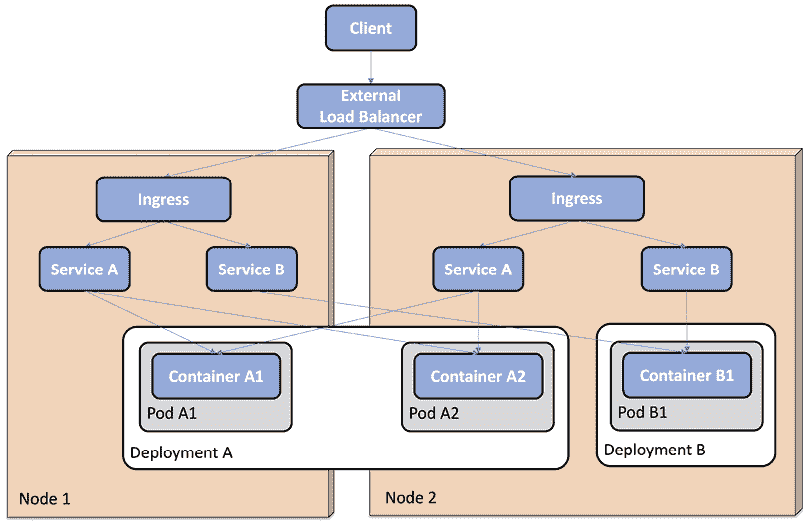
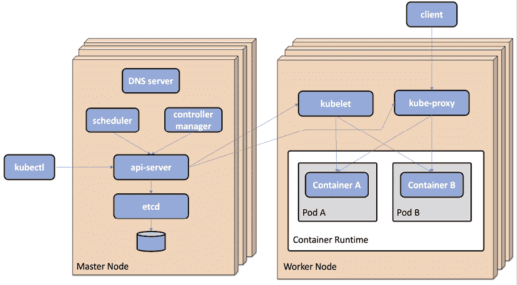
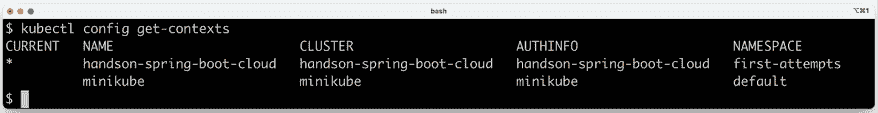
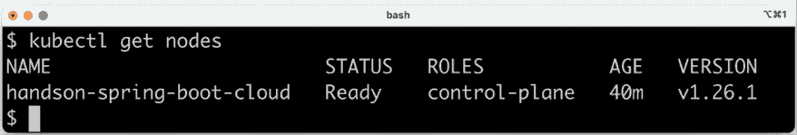
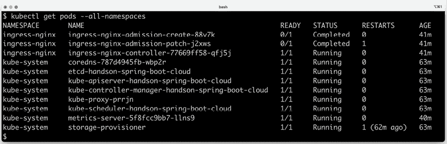
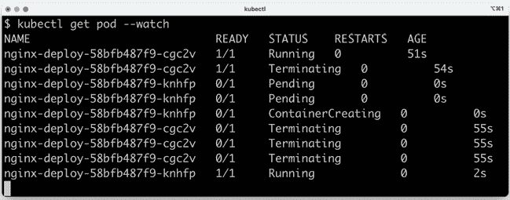
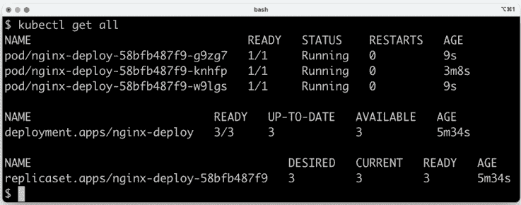
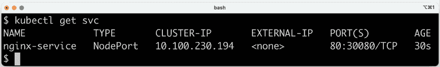
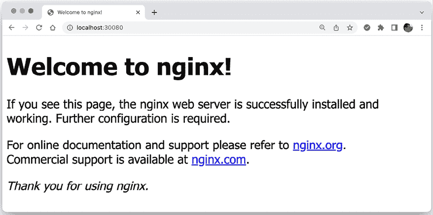
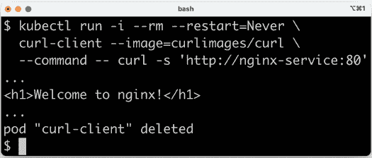

# 第十五章：Kubernetes 简介

在本章中，我们将开始学习 Kubernetes，这是在撰写本书时最受欢迎和最广泛使用的容器编排器。由于容器编排器的一般主题和 Kubernetes 本身的内容太多，无法在一章中涵盖，因此我将专注于介绍我在过去几年使用 Kubernetes 时认为最重要的领域。

本章将涵盖以下主题：

+   Kubernetes 概念介绍

+   Kubernetes API 对象介绍

+   Kubernetes 运行时组件介绍

+   创建本地 Kubernetes 集群

+   尝试一个示例部署并熟悉 `kubectl` Kubernetes 命令行界面工具

+   管理本地 Kubernetes 集群

# 技术要求

关于如何安装本书中使用的工具以及如何访问本书源代码的说明，请参阅：

+   *第二十一章*，*macOS 安装说明*

+   *第二十二章*，*使用 WSL 2 和 Ubuntu 在 Microsoft Windows 上的安装说明*

本章中的代码示例均来自 `$BOOK_HOME/Chapter15` 目录下的源代码。本章将要执行的示例部署在 Kubernetes 上的源代码可以在 `$BOOK_HOME/Chapter15/kubernetes/first-attempts` 文件夹中找到。

# Kubernetes 概念介绍

从高层次来看，作为容器编排器，Kubernetes 使得一组（物理或虚拟）运行容器的服务器看起来像是一个运行容器的单个大逻辑服务器。

作为操作员，我们通过使用 Kubernetes API 创建对象来向 Kubernetes 集群声明一个**期望状态**。Kubernetes 会持续比较期望状态和当前状态。如果检测到差异，它会采取措施确保当前状态与期望状态相同。

Kubernetes 集群的主要目的之一是部署和运行容器，但同时也支持使用绿色/蓝色和金丝雀部署等技术进行零停机滚动升级。Kubernetes 可以调度容器，即包含一个或多个相邻容器的**Pod**，到集群中的可用节点。为了能够监控运行容器的健康状态，Kubernetes 假设容器实现了**存活探针**。如果存活探针报告容器不健康，Kubernetes 将重启该容器。可以在集群中手动或自动使用水平自动扩展来扩展容器。为了优化集群中可用硬件资源（例如内存和 CPU）的使用，可以将具有指定容器所需资源数量的**配额**配置到容器中。另一方面，可以在**命名空间**级别为容器或一组 Pod 指定允许消耗的最大量。随着本章的进行，我们将介绍命名空间。如果多个团队共享一个共同的 Kubernetes 集群，这一点尤为重要。

Kubernetes 的另一个主要目的是提供正在运行的 Pod 和它们的容器的服务发现。可以为服务发现定义 Kubernetes **服务**对象，并且它还会在可用的 Pod 上进行请求的负载均衡。服务对象可以被暴露在 Kubernetes 集群外部。然而，正如我们将看到的，**入口**对象在很多情况下更适合处理指向一组服务的外部传入流量。为了帮助 Kubernetes 确定容器是否准备好接受传入请求，容器可以实现 **就绪探测**。

在内部，Kubernetes 集群提供一个大型的扁平 IP 网络，其中每个 Pod 都有自己的 IP 地址，并且可以到达所有其他 Pod，无论它们运行在哪个节点上。为了支持多个网络供应商，Kubernetes 允许使用符合 **容器网络接口**（**CNI**）规范（[`github.com/containernetworking/cni`](https://github.com/containernetworking/cni)）的网络插件。默认情况下，Pod 不会被隔离；它们接受所有传入的请求。支持使用网络策略定义的 CNI 插件可以用来锁定对 Pod 的访问，例如，仅允许来自同一命名空间内 Pod 的流量。

为了允许多个团队以安全的方式在同一个 Kubernetes 集群上工作，可以应用 **基于角色的访问控制**（**RBAC**，[`kubernetes.io/docs/reference/access-authn-authz/rbac/`](https://kubernetes.io/docs/reference/access-authn-authz/rbac/)）。例如，管理员可以授权访问集群级别的资源，而团队成员的访问可以限制到由团队拥有的命名空间中创建的资源。

总的来说，这些概念提供了一个可扩展、安全、高可用性和弹性的容器运行平台。

让我们进一步了解 Kubernetes 中可用的 API 对象，以及构成 Kubernetes 集群的运行时组件。

# 介绍 Kubernetes API 对象

Kubernetes 定义了一个 API，用于管理不同类型的 *对象* 或 *资源*，正如它们所知。API 中提到的最常用的类型，或称为 *种类*，如下所示：

+   **节点**：节点代表集群中的一个服务器，无论是虚拟的还是物理的。

+   **Pod**：Pod 是 Kubernetes 中最小的可部署组件，由一个或多个并置的容器组成。这些容器共享相同的 IP 地址和端口范围。这意味着同一 Pod 实例中的容器可以通过 localhost 相互通信，但需要注意潜在的端口冲突。通常，Pod 由一个容器组成，但也有一些用例，可以通过在 Pod 中运行第二个容器来扩展主容器的功能。在*第十八章*，*使用服务网格来提高可观察性和管理*中，Pod 中将使用第二个容器，运行一个边车容器，使主容器加入服务网格。

+   **Deployment**：Deployment 用于部署和升级 Pod。Deployment 对象将创建和监控 Pod 的责任交给 ReplicaSet。当首次创建 Deployment 时，Deployment 对象执行的工作并不比创建 ReplicaSet 对象的工作多多少。当执行 Deployment 的滚动升级时，Deployment 对象的角色更为复杂。

+   **ReplicaSet**：ReplicaSet 用于确保始终运行指定数量的 Pod。如果一个 Pod 被删除，ReplicaSet 将用一个新的 Pod 来替换它。

+   **Service**：Service 是一个稳定的网络端点，您可以使用它来连接到一个或多个 Pod。Service 在 Kubernetes 集群的内部网络中被分配一个 IP 地址和 DNS 名称。Service 的 IP 地址在其生命周期内保持不变。发送到 Service 的请求将通过基于轮询的负载均衡转发到可用的 Pod 之一。默认情况下，Service 仅通过集群 IP 地址在集群内部暴露。也有可能将 Service 暴露在集群外部，要么在集群中每个节点的专用端口上，要么——更好的是——通过一个了解 Kubernetes 的外部负载均衡器；也就是说，它可以自动为 Service 分配一个公共 IP 地址和/或 DNS 名称。通常，提供 Kubernetes 作为服务的云提供商支持这种类型的负载均衡器。

+   **Ingress**：Ingress 可以管理 Kubernetes 集群中服务的对外访问，通常使用 HTTP 或 HTTPS。例如，它可以根据 URL 路径或 HTTP 头（如主机名）将流量路由到底层的服务。通常，不是通过使用节点端口或通过负载均衡器公开多个服务，而是在服务前面设置一个 Ingress 更为方便。为了处理 Ingress 对象定义的实际通信，集群中必须运行一个 Ingress 控制器。随着我们的进展，我们将看到一个 Ingress 控制器的示例。

+   **Namespace**：Namespace 用于在 Kubernetes 集群中对资源进行分组和在某种程度上进行隔离。资源名称必须在它们的命名空间中是唯一的，但不同命名空间之间不必唯一。

+   **ConfigMap**：ConfigMap 用于存储容器使用的配置。ConfigMaps 可以映射到正在运行的容器中作为环境变量或文件。

+   **Secret**：用于存储容器使用的敏感数据，例如凭证。Secrets 可以通过与 ConfigMaps 相同的方式提供给容器。任何对 API 服务器具有完全读取访问权限的人都可以访问创建的 Secrets 的值，因此它们并不像名字所暗示的那样安全。

+   **DaemonSet**：确保在集群中的一组节点上运行一个 Pod。在*第十九章*，*使用 EFK 堆栈进行集中式日志记录*中，我们将看到一个日志收集器 Fluentd 的示例，它将以 DaemonSet 的形式在每个工作节点上运行。

要查看 Kubernetes API 在 v1.26 中涵盖的资源对象的完整列表，请参阅[`kubernetes.io/docs/reference/generated/kubernetes-api/v1.26/`](https://kubernetes.io/docs/reference/generated/kubernetes-api/v1.26/)。

下面的图总结了处理传入请求所涉及的 Kubernetes 资源：



图 15.1：Kubernetes 资源概述

在前面的图中，我们可以看到以下内容：

+   两个部署，**部署 A**和**部署 B**，已部署到具有两个节点**节点 1**和**节点 2**的集群中

+   **部署 A**包含两个 Pod，**Pod A1**和**Pod A2**

+   **部署 B**包含一个 Pod，**Pod B1**

+   **Pod A1**被调度到**节点 1**

+   **Pod A2**和**Pod B1**被调度到**节点 2**

+   每个部署都有一个相应的服务部署，**服务 A**和**服务 B**，并且它们在所有节点上都是可用的

+   定义了一个**入口**来路由传入请求到两个服务

+   客户端通常通过**外部负载均衡器**向集群发送请求

这些对象本身不是运行组件；相反，它们是不同类型期望状态的定义。为了在集群的当前状态下反映期望状态，Kubernetes 提供了一套由多个运行时组件组成的架构，如下一节所述。

# 介绍 Kubernetes 运行时组件

Kubernetes 集群包含两种类型的节点：**主节点**和**工作节点**。主节点管理集群，而工作节点的主要目的是运行实际的工作负载，例如，我们在集群中部署的容器。Kubernetes 由多个运行时组件组成。最重要的组件如下：

+   有一些组件运行在主节点上，构成了**控制平面**：

    +   **API 服务器**，控制平面的入口点。它公开了一个 RESTful API，例如，Kubernetes CLI 工具**kubectl**就是使用这个 API。

    +   **etcd**，一个高度可用和分布式的键值存储，用作所有集群数据的数据库。

    +   一个 **控制器管理器**，其中包含多个控制器，它们会持续评估 etcd 数据库中定义的对象的期望状态与当前状态。每当期望状态或当前状态发生变化时，负责该类型状态的控制器会采取行动，将当前状态移动到期望状态。例如，负责管理 Pods 的复制控制器会在通过 API 服务器添加新 Pod 或正在运行的 Pod 被删除时做出反应，并确保启动新的 Pods。另一个控制器的例子是节点控制器。它负责在节点不可用时采取行动，确保在集群中的其他节点上重新调度失败节点上运行的 Pods。

    +   一个 **调度器**，负责将新创建的 Pods 分配到具有可用容量的节点上，例如，从内存和 CPU 的角度来看。可以使用 **亲和性规则** 来控制 Pods 分配到节点的方式。例如，执行大量磁盘 I/O 操作的 Pods 可以分配到具有快速 SSD 硬盘的一组工作节点。可以定义 **反亲和性规则** 来分离 Pods，例如，避免将来自同一 Deployment 的 Pods 分配到同一工作节点。

+   在所有节点上运行的组件，构成 **数据平面**：

    +   **kubelet**，一个节点代理，它作为节点操作系统中直接运行的过程，而不是作为容器。kubelet 确保分配给其节点的 Pods 的容器处于运行状态，并且它们是健康的。它在其节点上充当 API 服务器和容器运行时之间的通道。

    +   **kube-proxy**，一个网络代理，它使 Kubernetes 中的 Service 概念成为可能，并且能够将请求转发到适当的 Pods，如果有多个 Pods 可用于特定的 Service，通常以轮询的方式。`kube-proxy` 作为 DaemonSet 部署。

    +   **容器运行时**，这是在节点上运行容器的软件。历史上，Kubernetes 使用 Docker Engine，但今天可以使用任何 Kubernetes **容器运行时接口**（**CRI**）的实现，例如 **cri-o** ([`cri-o.io`](https://cri-o.io)) 和 **containerd** ([`containerd.io/`](https://containerd.io/))。在 Kubernetes v1.24 中移除了对 Docker Engine 的支持。

    `containerd` 实际上是 Docker 的容器引擎。它在 2017 年从 Docker 中分离出来，如今已成为一个毕业的 CNCF 项目。

    +   **Kubernetes DNS**，这是一个在集群内部网络中使用的 DNS 服务器。服务和 Pods 被分配一个 DNS 名称，并且 Pods 被配置为使用此 DNS 服务器解析内部 DNS 名称。DNS 服务器作为 Deployment 对象和 Service 对象部署。

下图总结了上述描述的 Kubernetes 运行时组件：



图 15.2：Kubernetes 运行时组件概述

根据图示，我们可以想象以下事件序列：

1.  操作员使用**kubectl**向 Kubernetes 发送一个新的期望状态，其中包含声明新**Deployment**、**Service**和**Ingress**对象的清单。Ingress 定义了到 Service 对象的路由，而 Service 对象被定义为选择由 Deployment 对象配置的 Pods。

1.  **kubectl**与**API 服务器**通信，并将新的期望状态作为对象存储在**etcd**数据库中。

1.  各种**控制器**将对新对象的创建做出反应并采取以下行动：

    1.  对于 Deployment 对象：

        1.  新的**ReplicaSet**和**Pod**对象将在 API 服务器中注册。

        1.  **调度器**将看到新的 Pod(s)并将它们调度到适当的工作节点。

        1.  在每个工作节点上，**kubelet**代理将根据 Pods 描述启动容器。kubelet 将使用工作节点上的**容器运行时**来管理容器。

    1.  对于 Service 对象：

        1.  将在 Service 对象的内部 DNS 服务器中注册一个 DNS 名称，**kube-proxy**将能够将使用 DNS 名称的请求路由到可用的 Pod 之一。

注意，Pods 可以从集群中的任何节点访问，因此 kube-proxy 不需要在 Pod 所在的同一节点上运行，才能将请求转发到它。

1.  对于 Ingress 对象：

    1.  **Ingress 控制器**将根据 Ingress 对象设置路由，并准备好接受来自 Kubernetes 集群外部的请求。与 Ingress 对象定义的路由匹配的外部请求将由 Ingress 控制器转发到 Service 对象。这些请求将如上所述由 kube-proxy 转发到 Pod。

现在我们已经了解了 Kubernetes 运行时组件及其支持的内容和运行环境，让我们继续使用 Minikube 创建一个 Kubernetes 集群。

# 使用 Minikube 创建 Kubernetes 集群

现在，我们已准备好创建一个 Kubernetes 集群！我们将使用 Minikube 创建一个本地单节点集群。Minikube 可以使用不同的驱动程序部署在 VM、容器或裸金属上。我们将使用首选驱动程序之一，即 Docker 驱动程序，其中 Minikube 实例在 macOS 和 Windows 上的 Docker Desktop 管理的容器中运行，并使用**Windows Subsystem for Linux, v2** (WSL 2)。

关于 Minikube 中可用驱动程序的更多信息，请参阅[`minikube.sigs.k8s.io/docs/drivers/`](https://minikube.sigs.k8s.io/docs/drivers/)。

Docker 及其容器已经在单独的 WSL 2 实例中运行；请参阅*第二十二章，*安装 Microsoft Windows 的 WSL 2 和 Ubuntu 的安装说明*中的*安装 Docker Desktop for Windows*部分。

将 Minikube 作为容器在 Docker 上运行的一个缺点是，Minikube 暴露的端口只能在运行 Docker 的主机上访问。为了使端口对 Docker 客户端可用，例如，在 WSL 2 上我们将使用的 macOS 或 Linux 服务器，我们可以在创建 Minikube 集群时指定端口映射。

在创建 Kubernetes 集群之前，我们需要了解一下 Minikube 配置文件，这是 Kubernetes 的 CLI 工具 `kubectl` 的相关知识，以及它对上下文的使用。

## 使用 Minikube 配置文件

为了在本地运行多个 Kubernetes 集群，Minikube 提供了**配置文件**的概念。例如，如果您想使用多个 Kubernetes 版本，您可以使用 Minikube 创建多个 Kubernetes 集群。每个集群都将分配一个单独的 Minikube 配置文件。大多数 Minikube 命令都接受 `--profile` 标志（或 `-p` 的简称），可以用来指定命令将应用于哪个 Kubernetes 集群。如果您计划在一段时间内使用一个特定的配置文件，存在一个更方便的替代方案，其中您可以使用以下命令指定当前配置文件：

```java
minikube profile my-profile 
```

此命令将 `my-profile` 配置文件设置为当前配置文件。

要获取当前配置文件，请运行以下命令：

```java
minikube config get profile 
```

如果没有指定配置文件，无论是使用 `minikube profile` 命令还是 `--profile` 开关，都将使用默认配置文件 `minikube`。

可以使用 `minikube profile list` 命令找到有关现有配置文件的信息。

## 使用 Kubernetes CLI，kubectl

`kubectl` 是 Kubernetes 的 CLI 工具。一旦集群已设置，这通常是您唯一需要的用于管理集群的工具！

对于管理 API 对象，正如我们在本章前面所描述的，`kubectl apply` 命令是您唯一需要了解的命令。它是一个**声明性命令**；也就是说，作为操作员，我们要求 Kubernetes 应用我们通过命令给出的对象定义。然后由 Kubernetes 决定实际上需要做什么。

另一个可能是许多本书读者的熟悉声明性命令的例子是 `SQL SELECT` 语句，它可以连接来自多个数据库表的信息。我们在 SQL 查询中只声明预期的结果，而数据库查询优化器则需要确定以何种顺序访问表以及使用哪些索引以最有效的方式检索数据。

在某些情况下，**命令式语句**更受欢迎，这些语句明确告诉 Kubernetes 要做什么。一个例子是 `kubectl delete` 命令，其中我们明确告诉 Kubernetes 删除一些 API 对象。也可以使用明确的 `kubectl create namespace` 命令方便地创建命名空间对象。

重复使用祈使语句会导致它们失败，例如，使用 `kubectl delete` 删除相同的 API 对象两次或使用 `kubectl create` 创建相同的命名空间两次。声明式命令，即使用 `kubectl apply`，不会因重复使用而失败——它将简单地声明没有变化并退出而不采取任何行动。

以下是一些用于检索 Kubernetes 集群信息的常用命令：

+   `kubectl get` 显示指定 API 对象的信息

+   `kubectl describe` 提供有关指定 API 对象的更多详细信息

+   `kubectl logs` 显示容器的日志输出

我们将在本章节和接下来的章节中看到许多这些以及其他 `kubectl` 命令的示例！

如果对如何使用 `kubectl` 工具有疑问，`kubectl help` 和 `kubectl <command> --help` 命令始终可用，并提供非常有用的信息。另一个有用的命令是 `kubectl explain`，它可以用来显示在声明 Kubernetes 对象时有哪些字段可用。例如，如果你需要查找描述 Deployment 对象模板中容器可用的字段，请运行以下命令：

```java
kubectl explain deployment.spec.template.spec.containers 
```

## 使用 kubectl 上下文

要能够与多个 Kubernetes 集群一起工作，无论是使用本地的 Minikube 还是设置在本地服务器或云中的 Kubernetes 集群，`kubectl` 都包含 **上下文** 的概念。上下文是以下内容的组合：

+   一个 Kubernetes 集群

+   用户认证信息

+   默认命名空间

默认情况下，上下文保存在 `~/.kube/config` 文件中，但可以使用 `KUBECONFIG` 环境变量更改该文件。在这本书中，我们将使用默认位置，因此我们将使用 `unset KUBECONFIG` 命令取消设置 `KUBECONFIG`。

当在 Minikube 中创建 Kubernetes 集群时，会创建一个与 Minikube 配置文件同名上下文，并将其设置为当前上下文。因此，在 Minikube 中创建集群后发出的 `kubectl` 命令将发送到该集群。

要列出可用的上下文，请运行以下命令：

```java
kubectl config get-contexts 
```

以下是一个示例响应：



图 15.3：kubectl 上下文列表

第一列中的通配符 ***** 标记了当前上下文。

只有在集群创建完成后，你才会在前面的响应中看到 `handson-spring-boot-cloud` 上下文，我们将在稍后描述其创建过程。

如果你想将当前上下文切换到另一个上下文，即与另一个 Kubernetes 集群一起工作，请运行以下命令：

```java
kubectl config use-context my-cluster 
```

在此示例中，当前上下文将更改为 `my-cluster`。

要更新上下文，例如，切换 `kubectl` 使用的默认命名空间，请使用 `kubectl config set-context` 命令。

例如，要将当前上下文的默认命名空间更改为 `my-namespace`，请使用以下命令：

```java
kubectl config set-context $(kubectl config current-context) --namespace my-namespace 
```

在此命令中，`kubectl config current-context` 用于获取当前上下文名称。

## 创建 Kubernetes 集群

要使用 Minikube 创建 Kubernetes 集群，我们需要运行几个命令：

+   取消设置 `KUBECONFIG` 环境变量，以确保 `kubectl` 上下文在默认配置文件 `~/.kube/config` 中创建。

+   使用 `minikube start` 命令创建集群，我们也可以指定要使用的 Kubernetes 版本以及要分配给集群的硬件资源量：

    +   为了能够完成本书剩余章节中的示例，请为集群分配 10 GB 的内存，即 10,240 MB。如果只分配 6 GB（6,144 MB）给 Minikube 集群，尽管速度较慢，这些示例也应该能正常工作。

    +   分配您认为合适的 CPU 核心和磁盘空间；以下示例中使用了 4 个 CPU 核心和 30 GB 的磁盘空间。

    +   指定将使用哪个版本的 Kubernetes。在本书中，我们将使用 v1.26.1。

    +   指定我们将使用上面描述的 Docker 驱动程序。

    +   指定所需的端口映射。端口 `8080` 和 `8443` 将由 Ingress 控制器使用，而端口 `30080` 和 `30443` 将由类型为 `NodePort` 的服务使用。

    有关网关服务器如何部署类型为 `NodePort` 的服务的详细信息，请参阅*第十六章*，将我们的微服务部署到 Kubernetes。

+   指定用于即将到来的 `minikube` 命令的 Minikube 配置文件。我们将使用 `handson-spring-boot-cloud` 作为配置文件名称。

+   在集群创建后，我们将使用 Minikube 中的插件管理器来启用 Minikube 自带的 Ingress 控制器和度量服务器。Ingress 控制器和度量服务器将在下一章中使用。

运行以下命令以创建 Kubernetes 集群：

```java
unset KUBECONFIG
minikube start \
 --profile=handson-spring-boot-cloud \
 --memory=10240 \
 --cpus=4 \
 --disk-size=30g \
 --kubernetes-version=v1.26.1 \
 --driver=docker \
 --ports=8080:80 --ports=8443:443 \
 --ports=30080:30080 --ports=30443:30443
minikube profile handson-spring-boot-cloud
minikube addons enable ingress
minikube addons enable metrics-server 
```

在前面的命令完成后，您应该能够与集群通信。尝试运行 `kubectl get nodes` 命令。它应该响应类似于以下内容：



图 15.4：Kubernetes 集群中的节点列表

一旦创建，集群将在后台初始化自身，启动 `kube-system` 和 `ingress-nginx` 命名空间中的多个系统 Pods。我们可以通过以下命令来监控其进度：

```java
kubectl get pods --all-namespaces 
```

一旦启动完成，前面的命令应该报告所有 Pods 的状态为 **运行中**，并且 **READY** 计数应为 **1/1**，这意味着每个 Pod 中的单个容器都已启动并运行：



图 15.5：运行中的系统 Pods 列表

注意，有两个 Pod 报告为**Completed**，而不是**Running**。它们是由**Job**对象创建的 Pod，用于执行容器固定次数，就像批处理作业一样。运行命令`kubectl get jobs --namespace=ingress-nginx`以揭示这两个 Job 对象。

我们现在准备好采取一些行动了！

# 尝试一个示例 Deployment

让我们看看我们如何做到以下：

+   在我们的 Kubernetes 集群中部署基于 NGINX 的简单 Web 服务器

+   对 Deployment 应用一些更改：

    +   通过删除 Pod 来更改当前状态，并验证`ReplicaSet`创建了一个新的 Pod

    +   通过将 Web 服务器扩展到三个 Pod 来更改所需状态，并验证`ReplicaSet`通过启动两个新的 Pod 来填补空缺

+   使用具有节点端口的 Service 将外部流量路由到 Web 服务器

首先，创建一个命名空间`first-attempts`，并更新`kubectl`上下文以默认使用此命名空间：

```java
kubectl create namespace first-attempts
kubectl config set-context $(kubectl config current-context) --namespace=first-attempts 
```

我们现在可以使用`kubernetes/first-attempts/nginx-deployment.yaml`文件在命名空间中创建一个 NGINX Deployment。此文件如下所示：

```java
apiVersion: apps/v1
kind: Deployment
metadata:
  name: nginx-deploy
spec:
  replicas: 1
  selector:
    matchLabels:
      app: nginx-app
  template:
    metadata:
      labels:
        app: nginx-app
    spec:
      containers:
      - name: nginx-container
        image: nginx:latest
        ports:
        - containerPort: 80 
```

让我们更详细地解释这段源代码：

+   `kind`和`apiVersion`属性用于指定我们正在声明一个 Deployment 对象。

+   `metadata`部分用于描述 Deployment 对象。例如，我们给它命名为`nginx-deploy`。

Kubernetes 对象常用的其他元数据包括它所属的`namespace`名称、`label`s 和`annotation`s。我们将在本章和下一章中看到它们的使用。

+   接下来是一个定义 Deployment 对象的期望状态的`spec`部分：

    +   `replicas: 1`指定我们希望有一个 Pod 运行。

    +   一个指定 Deployment 如何找到它管理的 Pods 的`selector`部分。在这种情况下，Deployment 将寻找将`app`标签设置为`nginx-app`的 Pods。

    +   `template`部分用于指定 Pod 的创建方式。

        +   `metadata`部分指定了用于识别 Pods 的`label`，即`app: nginx-app`，从而匹配选择器。

        +   `spec`部分指定了 Pod 中单个容器创建的详细信息，即`name`、`image`以及它使用的`ports`。

使用以下命令创建 Deployment：

```java
cd $BOOK_HOME/Chapter15
kubectl apply -f kubernetes/first-attempts/nginx-deployment.yaml 
```

让我们看看使用`kubectl get all`命令我们得到了什么：


图 15.6：由示例 Deployment 创建的 Kubernetes 对象

如预期，我们得到了一个 Deployment、ReplicaSet 和 Pod 对象。经过一段时间后，这主要取决于下载 NGINX Docker 镜像所需的时间，Pod 将启动并运行，在**READY**列中报告为**1/1**，这意味着所需状态等于当前状态！

现在，我们将通过删除 Pod 来更改当前状态。在删除 Pod 之前，在另一个终端中运行命令`kubectl get pod --watch`。使用`--watch`选项使命令挂起，等待当前命名空间中 Pod 的状态变化。使用以下命令删除 Pod：

```java
kubectl delete pod --selector app=nginx-app 
```

由于 Pod 有一个随机名称（在前面的例子中是`nginx-deploy-59b8c5f7cd-mt6pg`），Pod 是根据`app`标签选择的，该标签在 Pod 中设置为`nginx-app`。

注意`kubectl get pod --watch`如何报告当前 Pod 的终止，同时启动一个新的 Pod。

是 ReplicaSet 检测到期望状态和当前状态之间的差异，并且几乎立即启动一个新的 Pod 来补偿偏差。报告的事件应类似于以下截图：



图 15.7：kubectl get pod --watch 报告 Pod 的变化

在截图上，我们可以看到以`d69ln`结尾的 Pod 被`delete`命令停止了，并且 ReplicaSet 立即启动了一个以`ptbkf`结尾的新 Pod。

通过在`kubernetes/first-attempts/nginx-deployment.yaml` Deployment 文件中将期望的 Pod 数量设置为三个副本来更改期望状态。通过简单地重复我们之前提到的`kubectl apply`命令来应用期望状态的变化。

再次注意，`kubectl get pod --watch`命令报告 ReplicaSet 启动的新 Pod 以获取当前状态等效于新的期望状态，即三个 Pod。几秒钟后，将报告两个新的 NGINX Pod 已启动并运行。使用*Ctrl + C*停止命令。

执行`kubectl get all`命令，并期待得到以下类似的响应：



图 15.8：Kubernetes 启动的新 Pod 以满足期望状态

注意有三个 Pod，并且 Deployment 对象报告**3/3**。这表示有 3 个就绪的和 3 个期望的 Pod，意味着所有期望的 Pod 都准备好使用。

要启用与 Web 服务的外部通信，使用`kubernetes/first-attempts/nginx-service.yaml`文件创建一个服务。它看起来如下：

```java
apiVersion: v1
kind: Service
metadata:
  name: nginx-service
spec:
  type: NodePort
  selector:
    app: nginx-app
  ports:
    - targetPort: 80
      port: 80
      nodePort: 30080 
```

`kind`和`apiVersion`属性用于指定我们正在声明一个`Service`对象。

`metadata`部分用于描述`Service`对象，例如，给它一个名称：`nginx-service`。

接下来是一个`spec`部分，它定义了`Service`对象的期望状态：

+   使用`type`字段，我们指定我们想要`NodePort`，即一个在集群中每个节点上具有专用端口的可外部访问的服务。这意味着外部调用者可以通过集群中任何节点的此端口访问此服务背后的 Pod，而不论 Pod 实际运行在哪些节点上。

+   选择器由 Service 用于查找可用的 Pods，在我们的案例中，是标记为`app: nginx-app`的 Pods。

+   最后，`ports`声明如下：

    +   `port: 80`指定了 Service 将在哪个端口上可访问，即在集群内部。

    +   `targetPort: 80`指定了请求将被转发到的 Pod 中的端口。

    +   `nodePort: 30080`指定了 Service 将通过集群中的任何节点在哪个端口上对外部可访问。默认情况下，节点端口必须在`30000`到`32767`的范围内。

此端口范围用于最小化与其他正在使用的端口的冲突风险。在生产系统中，通常在 Kubernetes 集群前面放置一个负载均衡器，以保护外部用户免受这些端口的了解以及 Kubernetes 集群中节点的 IP 地址。有关使用`LoadBalanced` Kubernetes Service 的更多信息，请参阅*第十八章*，*使用服务网格来提高可观察性和管理*，特别是*设置对 Istio 服务的访问*部分。

使用以下命令创建 Service：

```java
kubectl apply -f kubernetes/first-attempts/nginx-service.yaml 
```

要查看我们得到的结果，请运行`kubectl get svc`命令。预期会收到以下类似响应：



图 15.9：我们的部署的 NodePort 服务

`kubectl`支持许多 API 对象的短名称，作为其全名称的替代。例如，在前面命令中使用的是`svc`，而不是全称`service`。运行`kubectl api-resources`命令以查看所有可用的短名称。

要通过 Service 的节点端口访问 Web 服务器，我们需要知道我们集群中单个节点的 IP 地址或主机名。当使用 Docker 驱动时，主机名始终是`localhost`。

节点端口`30080`通过`minikube start`命令中的`–ports`选项由 Docker Engine 转发。有关详细信息，请参阅上面的*创建 Kubernetes 集群*部分。这意味着`Service`可以通过地址`localhost:30080`访问。

在 WSL 2 实例中打开的端口在 Windows 上可通过`localhost`访问。

使用这些信息，我们可以将 macOS 和 Windows 上的网络浏览器指向部署的 Web 服务器，使用地址`http://localhost:30080`。预期会收到以下类似响应：



图 15.10：NGINX 默认网页

太好了！但关于内部集群 IP 地址和端口怎么办？

验证 Web 服务器是否也可以在集群内部访问的一种方法是通过启动一个小 Pod，我们可以使用它从内部运行`curl`命令。`curl`命令将使用内部集群 IP 地址和端口。我们不需要使用内部 IP 地址；相反，我们可以使用为 Service 在内部 DNS 服务器中创建的 DNS 名称。DNS 名称的简称与 Service 的名称相同，即`nginx-service`。

服务的完整 DNS 名称是 `<service-name>.<namespace>.svc.cluster.local`。此服务的完整名称是 `nginx-service.first-attempts.svc.cluster.local`。由于我们将在相同的命名空间中运行以下命令，我们可以使用简短名称。

运行以下命令：

```java
kubectl run -i --rm --restart=Never curl-client --image=curlimages/curl --command -- curl -s 'http://nginx-service:80' 
```

命令看起来有点复杂，但它将执行以下操作：

1.  创建一个基于 Docker 镜像 `curlimages/curl` 的 Pod，该镜像包含 `curl` 命令。

1.  在容器内运行 `curl -s 'http://nginx-service:80'` 命令，并使用 `-i` 选项将输出重定向到终端。

1.  使用 `--rm` 选项删除 Pod。

预期上一条命令的输出将包含以下信息（我们在这里只显示响应的部分）：



图 15.11：访问 Kubernetes 集群内的 NGINX

这意味着 Web 服务器也可以在集群内部访问！

这基本上是我们需要了解的所有内容，以便能够部署我们的系统景观。

通过删除包含 `nginx` 部署的命名空间来结束这一切：

```java
kubectl delete namespace first-attempts 
```

在结束关于 Kubernetes 的这一章介绍之前，我们需要学习如何管理我们的 Kubernetes 集群。

# 管理本地 Kubernetes 集群

运行的 Kubernetes 集群消耗大量资源，主要是内存。因此，当我们完成在 Minikube 中与 Kubernetes 集群的工作后，我们必须能够将其休眠以释放分配给它的资源。我们还需要知道如何在想要继续工作时恢复集群。最终，我们还需要能够永久删除集群，当我们不再希望将其保留在磁盘上时。

Minikube 随带一个 `stop` 命令，可以用来休眠 Kubernetes 集群。我们用来最初创建 Kubernetes 集群的 `start` 命令也可以用来从休眠状态恢复集群。要永久删除集群，我们可以使用 Minikube 的 `delete` 命令。

## 休眠和恢复 Kubernetes 集群

运行以下命令来休眠（即 `stop`）Kubernetes 集群：

```java
minikube stop 
```

运行以下命令再次恢复（即 `start`）Kubernetes 集群：

```java
minikube start 
```

在重启集群后直接运行 `kubectl` 命令可能会导致错误信息，例如：

```java
E0428 09:44:16.333361   79175 memcache.go:106] couldn't get resource list for metrics.k8s.io/v1beta1: the server is currently unable to handle the request 
```

这是因为 `metrics-server` 在启动时有点慢；错误信息会在一段时间后消失。

当恢复一个已经存在的集群时，`start` 命令会忽略你在创建集群时使用的开关。

在恢复 Kubernetes 集群后，`kubectl` 上下文将更新为使用此集群，当前使用的命名空间设置为 `default`。如果你正在使用另一个命名空间，例如，我们将在下一章“第十六章，将我们的微服务部署到 Kubernetes”中使用的 `hands-on` 命名空间，你可以使用以下命令更新 `kubectl` 上下文：

```java
kubectl config set-context $(kubectl config current-context) --namespace=hands-on 
```

后续的 `kubectl` 命令将在适用的情况下应用于 `hands-on` 命名空间。

Minikube 还提供了一种比 `stop` 和 `start` 命令更轻量级和更快的替代方案：`pause` 和 `unpause` 命令。在这种情况下，控制平面的组件被暂停，而不是停止，将集群的 CPU 消耗降至最低。然而，我在最近章节中使用这些命令时遇到了问题，因此我建议使用 `start` 和 `stop` 命令。

## 终止 Kubernetes 集群

如果您稍后想终止 Kubernetes 集群，您可以运行以下命令：

```java
minikube delete --profile handson-spring-boot-cloud 
```

实际上，您可以在不指定配置文件的情况下运行 `delete` 命令，但我发现明确指定配置文件更安全。否则，您可能会意外删除错误的 Kubernetes 集群！

我们已经成功学习了如何管理在 Minikube 中运行的 Kubernetes 集群。现在我们知道如何挂起和恢复集群，以及当不再需要时，如何永久删除它。

# 摘要

在本章中，我们介绍了 Kubernetes 作为容器编排器。

使用 Kubernetes，我们可以将服务器集群作为一个大型的逻辑服务器来处理，该服务器运行我们的容器。我们为 Kubernetes 集群声明一个所需状态，并且它确保只要集群中有足够的硬件资源，实际状态始终与所需状态相同。

所需状态是通过使用 Kubernetes API 服务器创建资源来声明的。Kubernetes 中的控制器管理器和其控制器会对 API 服务器创建的各种资源做出反应，并采取行动确保当前状态符合新的所需状态。调度器将节点分配给新创建的容器，即包含一个或多个容器的 Pods。在每个节点上，一个代理，一个 `kubelet` 运行，并确保已调度到其节点的 Pods 正在运行。`kube-proxy` 作为网络代理，通过将发送到服务的请求转发到集群中可用的 Pods 来实现服务抽象。外部请求可以通过 Kubernetes 感知的负载均衡器来处理，该负载均衡器可以为服务提供公共 IP 地址和/或 DNS 名称，或者通过集群中所有节点上都可用的节点端口，或者通过一个专门的 Ingress 资源。

我们还通过使用 Minikube 创建本地单节点集群来尝试了 Kubernetes。Minikube 集群作为使用 Docker 驱动的 Docker 容器运行。为了使端口在 Docker 引擎外部可访问，我们可以在 `minikube start` 命令上使用 `--ports` 选项。使用名为 `kubectl` 的 Kubernetes CLI 工具，我们部署了一个基于 NGINX 的简单 Web 服务器。我们通过删除 Web 服务器来测试其弹性能力，并观察到它被自动重新创建。我们学习了如何通过请求在 Web 服务器上运行三个 Pod 来手动扩展它。我们创建了一个具有节点端口的 Service，并验证了我们可以从集群外部和内部访问它。

最后，我们学习了如何从休眠、恢复和终止集群的角度来管理在 Minikube 中运行的 Kubernetes 集群。

我们现在已经准备好从前面章节中部署我们的系统架构到 Kubernetes 中。前往下一章了解如何进行此操作！

# 问题

1.  如果你两次运行相同的 `kubectl create` 命令会发生什么？

1.  如果你两次运行相同的 `kubectl apply` 命令会发生什么？

1.  在问题 1 和 2 的方面，为什么它们在第二次运行时表现不同？

1.  ReplicaSet 的作用是什么，还有哪些资源可以创建 ReplicaSet？

1.  在 Kubernetes 集群中，`etcd` 的作用是什么？

1.  如何让一个容器找出在同一 Pod 中运行的另一个容器的 IP 地址？

1.  如果你创建两个具有相同名称但位于不同命名空间中的 Deployment 会发生什么？

1.  两个具有相同名称的 Service 的哪种配置会导致它们失败，即使它们是在两个不同的命名空间中创建的？

# 加入我们的 Discord 社区

加入我们的 Discord 空间，与作者和其他读者进行讨论：

[`packt.link/SpringBoot3e`](https://packt.link/SpringBoot3e)


