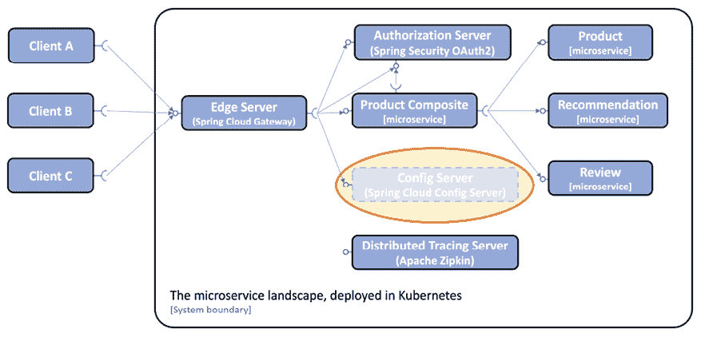
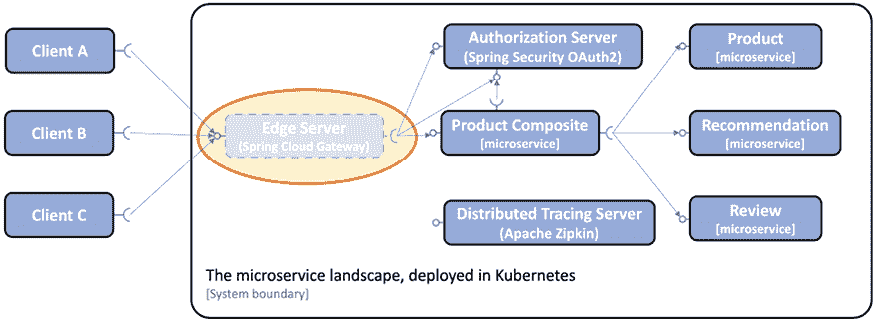
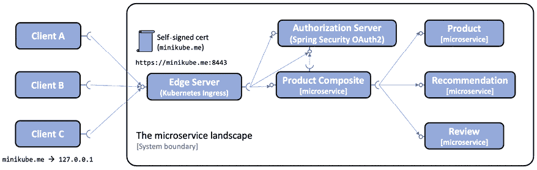
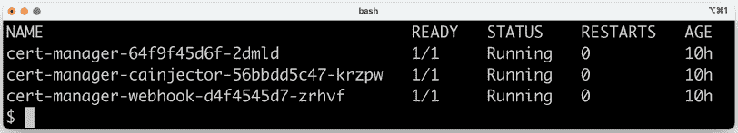
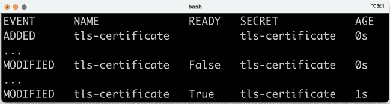
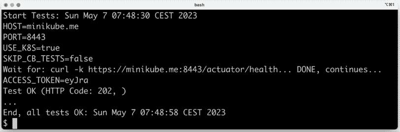
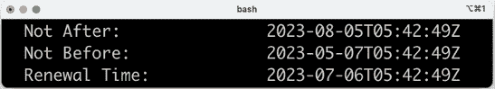
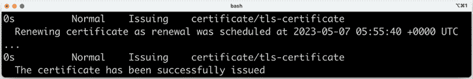
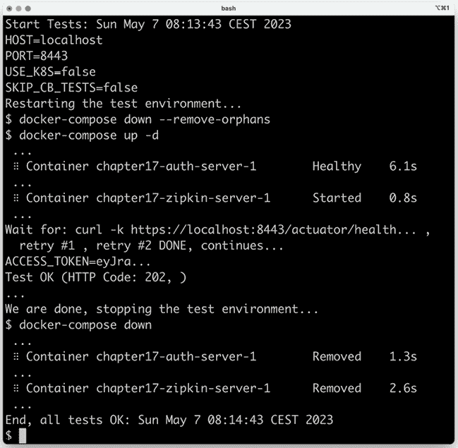

# 第十七章：实施 Kubernetes 功能以简化系统景观

当前的微服务景观包含几个支持服务，这些服务实现了在大规模微服务景观中所需的重要设计模式，例如，边缘服务器、配置服务器、授权服务器以及分布式跟踪服务。为了回顾，请参阅 *第一章*，*微服务简介*。在前一章中，我们将基于 Netflix Eureka 的服务发现模式实现替换为 Kubernetes 内置的发现服务。在本章中，我们将通过减少需要部署的支持服务数量来进一步简化微服务景观。相反，相应的设计模式将由 Kubernetes 的内置功能处理。Spring Cloud Config Server 将被 Kubernetes ConfigMaps 和 Secrets 替换。Spring Cloud Gateway 将被 Kubernetes Ingress 对象替换，它可以像 Spring Cloud Gateway 一样充当边缘服务器。

在 *第十一章*，*API 访问安全* 中，我们介绍了使用证书来保护外部 API。证书是手动配置的，这既耗时又容易出错，尤其是在记得在证书过期前旋转证书时。在本章中，我们将了解 **cert-manager** 以及如何使用它来自动化创建、配置和旋转证书的过程。

当一个平台如 Kubernetes 上的功能越来越多时，确保微服务的源代码不依赖于该平台是很重要的。为了确保我们可以在不部署到 Kubernetes 的情况下仍然使用微服务，我们将通过使用 Docker Compose 部署微服务景观，并执行 `test-em-all.bash` 测试脚本以验证微服务在功能层面上仍然可以正常工作，而不使用 Kubernetes。

本章将涵盖以下主题：

+   用 Kubernetes ConfigMaps 和 Secrets 替换 Spring Cloud Config Server

+   用 Kubernetes Ingress 对象替换 Spring Cloud Gateway

+   使用 `cert-manager` 自动配置证书

+   在 Kubernetes 上部署和测试微服务景观

+   使用 Docker Compose 部署和测试微服务景观，以确保微服务的源代码不会被锁定在 Kubernetes 中

# 技术要求

关于如何安装本书中使用的工具以及如何访问本书的源代码的说明，请参阅：

+   *第二十一章*，*macOS 的安装说明*

+   *第二十二章*，*使用 WSL 2 和 Ubuntu 的 Microsoft Windows 安装说明*

本章中的代码示例均来自 `$BOOK_HOME/Chapter17` 的源代码。

如果你想查看本章源代码中应用的变化，即查看用 Kubernetes 中相应的功能替换 Spring Cloud Config Server 和 Spring Cloud Gateway 以及使用 cert-manager 部署证书的过程，你可以将其与 *第十六章*，*将我们的微服务部署到 Kubernetes* 中的源代码进行比较。你可以使用你喜欢的 `diff` 工具并比较两个文件夹，`$BOOK_HOME/Chapter16` 和 `$BOOK_HOME/Chapter17`。

# 替换 Spring Cloud Config Server

正如我们在上一章所看到的，ConfigMaps 和 Secrets 可以用来保存我们微服务的配置信息。Spring Cloud Config Server 添加了诸如将所有配置保存在一个地方、可选的 Git 版本控制以及能够在磁盘上加密敏感信息等功能。但它也消耗了相当数量的内存（就像任何基于 Java 和 Spring 的应用程序一样）并在启动时增加了显著的开销。

例如，当运行自动化集成测试，例如本书中使用的测试脚本 `test-em-all.bash` 时，所有微服务都会同时启动，包括配置服务器。由于其他微服务必须从配置服务器获取配置，因此它们都必须等待配置服务器启动并运行后才能启动自己。这导致在运行集成测试时出现显著延迟。如果我们使用 Kubernetes ConfigMaps 和 Secrets 代替，这种延迟就会消除，使自动化集成测试运行得更快。因此，当底层平台不提供类似功能时，使用 Spring Cloud Config Server 是有意义的，但在部署到 Kubernetes 时，最好使用 ConfigMaps 和 Secrets。

使用 Kubernetes ConfigMaps 和 Secrets 而不是 Spring Cloud Config Server 将使微服务景观启动更快，这意味着它将需要更少的内存。它还将通过消除一个支持服务，即配置服务器，来简化微服务景观。当我们进行替换时，重要的是要以这种方式进行，即不影响微服务中的源代码，从而避免不必要的 Kubernetes 锁定。

这一更改在下图中得到了说明：



图 17.1：用 Kubernetes 内置的 ConfigMaps 和 Secrets 替换 Spring Cloud Config Server

让我们看看用 Kubernetes ConfigMaps 和 Secrets 替换 Spring Cloud Config Server 需要什么！

特别注意，我们只更改配置；Java 源代码中不需要任何更改！

## 替换 Spring Cloud Config Server 所需的更改

在源代码的配置中已应用以下更改以替换 Spring Cloud Config Server 为 Kubernetes ConfigMaps 和 Secrets：

1.  我们已经移除了 `spring-cloud/config-server` 项目，并也从 `settings.gradle` 构建文件中移除了项目。

1.  我们已经移除了配置服务器的 Helm 图表。

1.  我们已经从 `test-em-all.bash` 测试脚本中移除了特定于配置服务器的测试。

1.  我们已经从所有微服务中移除了以下配置：

    +   `build.gradle` 构建文件中的 `spring-cloud-starter-config` 依赖项

    +   每个项目 `src/main/resource` 文件夹中的 `application.yml` 文件，用于连接到配置服务器

    +   由于不再需要，集成测试中的 `spring.cloud.config.enabled=false` 属性设置

1.  `config-repo` 文件夹中的配置文件更改：

    +   我们已经移除了包含敏感信息的属性，例如 MongoDB、MySQL、RabbitMQ 的凭证以及边缘服务器使用的 TLS 证书的密码。将使用 Kubernetes Secrets 来处理敏感信息。

    +   在边缘服务器的配置中已移除配置服务器 API 的路由。

1.  `kubernetes/helm/components` 中微服务 Helm 图表的更改：

    +   每个图表中已添加 `config-repo` 文件夹。在 Helm 图表的 `config-repo` 文件夹中创建了从公共 `config-repo` 文件夹所需的配置文件的软链接。对于每个微服务，已创建一个指向公共配置文件 `application.yaml` 和特定于微服务的配置文件软链接。

    关于如何创建软链接的回顾，请参阅第十六章 *将我们的微服务部署到 Kubernetes* 中的 *组件图表* 部分。

    +   `values.yaml` 文件已更新如下：

        +   用于指出要使用哪些配置文件的 Spring 属性的环境变量。例如，对于 `product` 微服务，该属性看起来如下：

            ```java
            SPRING_CONFIG_LOCATION: file:/config-repo/application.yml,file:/config-repo/product.yml 
            ```

        +   微服务将使用它来查找配置文件的 ConfigMap。ConfigMap 将在容器的 /config-repo 路径内提供。声明如下：

            ```java
            configmap:
              enabled: true
              volumeMounts:
                mountPath: /config-repo 
            ```

        +   为了创建 ConfigMap，已添加一个基于 `common` 图表中的命名模板 `common.configmap_from_file` 的模板。

1.  `kubernetes/helm/environments` 中环境 Helm 图表的更改：

    +   我们已经移除了对配置服务器图表的依赖。

    +   `values.yaml` 文件已更新。

    +   配置服务器及其客户端的 Secrets 已替换为资源管理器、MongoDB、MySQL 和 RabbitMQ 及其客户端的 Secrets。例如：

        ```java
         rabbitmq-zipkin-credentials:
            RABBIT_USER: rabbit-user-dev
            RABBIT_PASSWORD: rabbit-pwd-dev
          mongodb-credentials:
            SPRING_DATA_MONGODB_AUTHENTICATION_DATABASE: admin
            SPRING_DATA_MONGODB_USERNAME: mongodb-user-dev
            SPRING_DATA_MONGODB_PASSWORD: mongodb-pwd-dev 
        ```

    上一章的回顾：请注意，此 `values.yaml` 文件包含敏感信息，如上述示例中的密码。因此，必须安全地存储此文件。如果不适于安全存储此文件，则另一种选择是在执行 `helm install` 命令时提供敏感信息，并从该文件中移除敏感信息。

    +   每个组件都被分配了它所需的 Secrets。

    回顾上一章：Secrets 将被映射到每个 Pod 作为环境变量。

    例如，产品服务需要访问 MongoDB 和 RabbitMQ，因此分配了以下两个 Secrets：

    ```java
    product:
      envFromSecretRefs:
        - rabbitmq-credentials
        - mongodb-credentials 
    ```

Helm 图表的`values.yaml`文件中的大多数更改最终都会出现在 Kubernetes 的`Deployment`对象清单中。例如，`product`微服务的`Deployment`对象将如下所示：

```java
apiVersion: apps/v1
kind: Deployment
metadata:
  name: product
spec:
  template:
    spec:
      containers:
        - name: product
          env:
          - name: SPRING_CONFIG_LOCATION
            value: file:/config-repo/application.yml,file:/config-repo/product.yml
          - name: SPRING_PROFILES_ACTIVE
            value: docker
          envFrom:
          - secretRef:
              name: rabbitmq-credentials
          - secretRef:
              name: mongodb-credentials
          volumeMounts:
          - name: product
            mountPath: /config-repo
      volumes:
        - name: product
          configMap:
            name: product 
```

注意，上述更改未影响的部分已被省略以提高可读性。

如果你想自己渲染组件的 Kubernetes 清单，可以通过在感兴趣的图表上应用 Helm 的`template`命令来实现。你还必须添加适用于`template`命令组件的环境`values.yaml`文件中的值。以`product`服务为例。`dev-env`图表的`values.yaml`文件包含以下适用于`product`服务的设置：

```java
product:
  envFromSecretRefs:
    - rabbitmq-credentials
    - mongodb-credentials 
```

要将这些设置添加到`template`命令中，我们可以使用`--set`标志。

还有一个`--values`标志可以在执行命令时添加`values.yaml`文件。

当从环境图表添加值时，我们必须记住它们是组件图表的父图表。这意味着在直接应用于组件图表时，必须从设置中移除组件图表的名称。在这种情况下，这意味着我们应该将以下值添加到`template`命令中，以正确渲染`product`图表：

```java
 envFromSecretRefs:
    - rabbitmq-credentials
    - mongodb-credentials 
```

可以使用`--set`标志定义如上所示的 YAML 数组，通过在大括号内列出元素，例如，`"{a,b,c}"`。可以使用以下命令渲染`product`图表：

```java
helm template kubernetes/helm/components/product \
  --set envFromSecretRefs= \
    "{rabbitmq-credentials, mongodb-credentials}" 
```

结果将包含`product`微服务的清单、一个 ConfigMap、一个 Service 以及最后的`Deployment`对象。

这就是用 Kubernetes ConfigMaps 和 Secrets 替换配置服务器的需求。在下一节中，我们将了解如何用 Kubernetes Ingress 对象替换 Spring Cloud Gateway。

# 替换 Spring Cloud Gateway

在本节中，我们将通过使用 Kubernetes 内置的 Ingress 对象替换 Spring Cloud Gateway 来进一步简化微服务景观，减少需要部署的支持服务的数量。

如在第十五章*Kubernetes 简介*中所述，Ingress 对象可以在 Kubernetes 中用作边缘服务器，就像 Spring Cloud Gateway 一样。与 Ingress 对象相比，Spring Cloud Gateway 提供了更丰富的路由功能。然而，Ingress 是 Kubernetes 平台的一部分，无需额外部署，并且还可以使用 cert-manager 扩展来自动配置证书，正如我们将在本章后面看到的那样。

我们还使用 Spring Cloud Gateway 来保护我们的微服务免受未经身份验证的请求，通过要求从受信任的 OAuth 授权服务器或 OIDC 提供者获取有效的 OAuth 2.0/OIDC 访问令牌。如果需要回顾，请参阅第十一章“确保 API 访问安全”。通常，Kubernetes Ingress 对象不支持此功能。然而，Ingress 控制器的特定实现可能支持它。

最后，我们在第十章“使用 Spring Cloud Gateway 在边缘服务器后面隐藏微服务”中添加的复合健康检查可以被每个微服务部署清单中定义的 Kubernetes 存活和就绪探针所替代。

因此，与 Spring Cloud Config Server 一样，当底层平台不提供类似功能时，使用 Spring Cloud Gateway 是有意义的。当部署到 Kubernetes 时，最好使用 Ingress 对象。

在本章中，我们将验证请求是否包含有效访问令牌的责任委托给`product-composite`微服务。这是通过 Ingress 将包含访问令牌的 HTTP 头从请求转发到`product-composite`微服务来完成的，它将像前几章一样执行其 OAuth 访问令牌的验证。下一章将介绍服务网格的概念，我们将看到一种完全支持验证 JWT 编码 OAuth 访问令牌的 Ingress 的替代实现。

在“验证微服务在没有 Kubernetes 的情况下工作”部分，我们仍然会使用 Spring Cloud Gateway 与 Docker Compose 一起使用，因此我们不会删除项目。

以下图表显示，当部署到 Kubernetes 时，Spring Cloud Gateway 将从微服务景观中移除：



图 17.2：用 Kubernetes 内置 Ingress 控制器替换 Spring Cloud Gateway

让我们看看用 Kubernetes Ingress 对象替换 Spring Cloud Gateway 需要什么！

特别注意，我们只更改了配置；也就是说，Java 源代码中不需要任何更改！

## 替换 Spring Cloud Gateway 所需的变化

以下更改已应用于源代码配置，以用 Kubernetes Ingress 对象替换 Spring Cloud Gateway：

1.  我们已经删除了 Spring Cloud Gateway 的 Helm 图表。

1.  我们在`common`图表中为 Ingress 清单添加了一个命名模板和一些默认值。

    命名模板`kubernetes/helm/common/templates/_ingress.yaml`以我们在前一章中熟悉的声明开始：

    ```java
    {{- define "common.ingress" -}}
    {{- $common := dict "Values" .Values.common -}}
    {{- $noCommon := omit .Values "common" -}} 
    {{- $overrides := dict "Values" $noCommon -}} 
    {{- $noValues := omit . "Values" -}} 
    {{- with merge $noValues $overrides $common -}}
    apiVersion: networking.k8s.io/v1
    kind: Ingress
    metadata:
      name: {{ include "common.fullname" . }}
      labels:
        app.kubernetes.io/name: {{ include "common.name" . }}
        helm.sh/chart: {{ include "common.chart" . }}
        app.kubernetes.io/managed-by: {{ .Release.Service }}
    {{- with .Values.ingress.annotations }}
      annotations:
    {{ toYaml . | indent 4 }}
    {{- end }} 
    ```

    模板的名称是 `common.ingress`，并且 `apiVersion` 和 `kind` 分别设置为 `networking.k8s.io/v1` 和 `Ingress`，以标识这是一个 Ingress 清单。模板上方的其余部分与在其他需要覆盖参数的清单中看到的类似，例如 `Deployment` 或 `Service` 模板。唯一的新部分是模板允许通过 `values.yaml` 文件中的 `ingress.annotations` 字段添加注释（如果需要的话）。

    Ingress 模板的其余部分包含清单的主要部分，即 `spec` 部分。它看起来像这样：

    ```java
    spec:
      tls:
        - hosts:
            - {{ .Values.ingress.host | quote }}
          secretName: {{ .Values.ingress.tls.secretName }}
      rules:
        - host: {{ .Values.ingress.host | quote }}
          http:
            paths:
            {{- range .Values.ingress.paths }}
              - path: {{ .path }}
                pathType: Prefix
                backend:
                  service:
                    name: {{ .service }}
                    port:
                      name: http
            {{- end }}
    {{- end }}
    {{- end -}} 
    ```

    首先是 `tls` 部分，其中清单声明 Ingress 只接受 HTTPS 流量，并且接受的 `hostname` 将使用 `values.yaml` 文件中的 `ingress.host` 键指定。用于服务 HTTPS 请求的证书将存储在名为 `values.yaml` 文件中指定的 Secret 中，使用 `ingress.tls.secretName` 键。

    接下来是 `rules` 部分中声明的路由规则。首先是用于路由的主机名。这将与上面 `tls` 部分中的相同主机名相同。接下来是一系列路由。它们将使用 `values.yaml` 文件中的 `ingress.paths` 部分进行填充。每个条目包含一个 `path` 和请求该路径的 `service` 名称，该请求将被路由到该服务。每个服务都期望其端口的名称设置为 `http`。

    `common` 图表的 `values.yaml` 文件为 Ingress 清单提供了以下默认值：

    ```java
    ingress:
      annotations:
        cert-manager.io/issuer: selfsigned
      tls:
        secretName: tls-certificate 
    ```

    首先是针对 Ingress 对象声明的注释，`cert-manager.io/issuer`，表示 cert-manager 应该使用名为 `selfsigned` 的颁发者来管理此 Ingress 对象所需的证书。更多关于此内容将在下面的 *自动化证书配置* 部分中介绍。接下来是存储证书的 Secret，默认名称为 `tls-certificate`。

1.  我们已向环境图表 `dev-env` 和 `prod-env` 添加了模板和额外的设置以用于 Ingress 清单。模板命名为 `ingress.yml`，基于上面描述的 `common` 图表的命名模板：

    ```java
    {{- template "common.ingress" . -}} 
    ```

1.  渲染 Ingress 清单所需的其余值，包括用于路由的实际 `hostname` 和路径，都在每个环境图表的 `values.yaml` 文件中指定。声明看起来像这样：

    ```java
    ingress:
      host: minikube.me
      paths:
        - path: /oauth2
          service: auth-server
        - path: /login
          service: auth-server
        - path: /error
          service: auth-server
        - path: /product-composite
          service: product-composite
        - path: /actuator/health
          service: product-composite
        - path: /openapi
          service: product-composite
        - path: /webjars
          service: product-composite 
    ```

从配置中我们可以看到，我们将使用主机名 `minikube.me`，并且为 `auth-server` 定义了三个路由，而其余声明的路径将被路由到 `product-composite` 服务。

我们将在 *使用 Kubernetes ConfigMaps、Secrets、Ingress 和 cert-manager 进行测试* 部分中稍后注册主机名 `minikube.me` 到本地的 `/etc/hosts` 文件中。

上述更改将导致 Helm 渲染 Ingress 清单。由于 Ingress 模板仅由环境图表使用，我们需要渲染一个环境图表来查看 Ingress 清单。

运行以下命令以使用`dev-env`图表渲染清单：

```java
helm template kubernetes/helm/environments/dev-env 
```

在输出中查找`kind: Ingress`，你将找到 Ingress 清单。它看起来像这样：

```java
apiVersion: networking.k8s.io/v1
kind: Ingress
metadata:
  name: RELEASE-NAME-dev-env
  labels:
    app.kubernetes.io/name: dev-env
    helm.sh/chart: dev-env-1.0.0
    app.kubernetes.io/managed-by: Helm
  annotations:
    cert-manager.io/issuer: selfsigned
spec:
  tls:
    - hosts:
        - "minikube.me"
      secretName: tls-certificate
  rules:
    - host: "minikube.me"
      http:
        paths:
          - path: /oauth2
            pathType: Prefix
            backend:
              service:
                name: auth-server
                port:
                  name: http
          - path: /product-composite
            pathType: Prefix
            backend:
              service:
                name: product-composite
                port:
                  name: http
          - path: /actuator/health
            pathType: Prefix
            backend:
              service:
                name: product-composite
                port:
                  name: http 
```

注意，为了提高可读性，一些路由规则已被删除。

最后缺少的部分是包含证书的 Secret 是如何创建的；让我们接下来看看这个问题。

# 自动化证书配置

cert-manager 工具([`cert-manager.io/docs/`](https://cert-manager.io/docs/))是 Kubernetes 的证书管理控制器。

它可以简化证书的自动化创建、配置和轮换。它支持多个证书来源；例如：

+   一个符合**RFC8555** ([`tools.ietf.org/html/rfc8555`](https://tools.ietf.org/html/rfc8555))的**ACME 服务器**，例如**Let’s Encrypt** ([`letsencrypt.org`](https://letsencrypt.org))。

+   **HashiCorp Vault PKI Secrets Engine** ([`www.vaultproject.io/docs/secrets/pki`](https://www.vaultproject.io/docs/secrets/pki))

+   自签名证书，由 cert-manager 本身颁发

要查看可用的发行者完整列表，请参阅[`cert-manager.io/docs/configuration/`](https://cert-manager.io/docs/configuration/)。

由于自签名证书不需要与任何外部资源进行通信，因此在开发期间使用它们是一个很好的选择。我们将在本书的范围内使用它们。

在生产环境中使用 cert-manager 通常需要使用一个发行者，例如 Let’s Encrypt，它可以颁发客户端（例如，网络浏览器和外部系统）将信任的外部 API 的证书。

在 Kubernetes 集群中安装 cert-manager 之后，至少必须注册一个发行者。发行者可以是特定命名空间内的本地发行者，或者是在集群范围内可访问的。我们将使用在现有命名空间`hands-on`中注册的本地发行者。

将由环境图表`dev-env`和`prod-env`负责注册适当的发行者。这两个环境都将使用自签名发行者。已添加一个名为`_issuer.yaml`的命名模板到`common`图表中。它看起来像这样：

```java
{{- define "common.issuer" -}}
apiVersion: cert-manager.io/v1
kind: Issuer
metadata:
  name: selfsigned
spec:
  selfSigned: {}
{{- end -}} 
```

`apiVersion`和`kind`字段指定这是一个由 cert-manager 定义的发行者。其名称设置为`selfsigned`。在上面的*替换 Spring Cloud Gateway 所需更改*部分中，我们看到了如何使用此名称来注释 Ingress 清单：

```java
ingress:
  annotations:
    cert-manager.io/issuer: selfsigned
  tls:
    secretName: tls-certificate 
```

这就是让 cert-manager 启动并提供 Ingress 对象证书所需的所有内容。cert-manager 监听带有 `cert-manager.io/issuer` 注解的 Ingress 对象的注册，并开始使用注解值中引用的发行者颁发证书，在本例中为 `selfsigned`。cert-manager 工具将使用发行者创建证书并将其存储在以 Ingress 对象命名的 Secret 中。在我们的例子中，名称设置为 `tls-certificate`。还将创建一个具有相同名称的 `Certificate` 对象，其中包含管理信息，例如 cert-manager 何时需要更新证书。

由于名为 `common.issuer` 的模板不接受任何配置，要在 `dev-env` 和 `prod-env` 图表中应用它，只需在每个图表中添加一个使用该命名模板的模板。该模板命名为 `issuer.yaml`，其外观如下：

```java
{{- template "common.issuer" . -}} 
```

这样，我们就拥有了替换 Spring Cloud Config Server 和 Gateway 为本地 Kubernetes 组件和 cert-manager 所需的一切。让我们部署并运行一些测试！

# 使用 Kubernetes ConfigMaps、Secrets、Ingress 和 cert-manager 进行测试

在描述了前面的更改之后，我们已准备好使用 Spring Cloud Config Server 和 Spring Cloud Gateway 被 Kubernetes ConfigMaps、Secrets、Ingress 对象和 cert-manager 替换的系统景观进行测试。和之前一样，当我们使用 Spring Cloud Gateway 作为边缘服务器时，外部 API 将由 HTTPS 保护。在这个部署中，将使用由 cert-manager 提供的证书来保护外部 API 的 Ingress 控制器。这将在以下图中说明：



图 17.3：使用 HTTPS 保护外部访问

Ingress 控制器在 Minikube 实例的默认 HTTPS 端口 `443` 上公开。在主机上，我们作为 Docker 容器运行 Minikube 实例时，我们通过 `localhost` 与 Minikube 实例通信。当创建 Minikube 实例时，已配置从 `localhost` 的 `8443` 端口到 Minikube 实例的 `443` 端口的端口转发。我们在执行 `minikube addons enable ingress` 命令时安装了 Ingress 控制器。

关于 Minikube 实例设置的回顾，请参阅 *第十五章*，*Kubernetes 简介* 中的 *创建 Kubernetes 集群* 部分。

这里有一个有趣的问题，Ingress 控制器是如何在 Minikube 实例上使用端口 `443` 的？我们看到了使用类型为 `NodePort` 的服务，它可以分配从 `30000` 开始的端口，那么 Ingress 控制器是如何使用标准的 HTTPS 端口 `443` 的呢？

Ingress 控制器由 `ingress-nginx` 命名空间中的 `Deployment` 对象 `ingress-nginx-controller` 组成。问题的答案是，`Deployment` 对象使用 `hostPort` 将 Kubernetes 主机中的端口 `443` 映射到 Pod 中运行的容器中的端口 `443`，即 Minikube 实例。`Deployment` 对象定义中的关键部分如下所示：

```java
apiVersion: apps/v1
kind: Deployment
metadata:
  name: ingress-nginx-controller
spec:
  template:
    spec:
      containers:
        image: registry.k8s.io/ingress-nginx/controller:v1.5.1
        ports:
        - containerPort: 443
          hostPort: 443 
```

此设置适用于用于开发和测试的单节点 Kubernetes 集群。在多节点 Kubernetes 集群中，使用外部负载均衡器来公开 Ingress 控制器，以实现高可用性和可伸缩性。

`Deployment` 对象使用的命令类型与我们用于 *第十六章*，*将我们的微服务部署到 Kubernetes* 中使用的命令类型相同；请参阅 *将应用程序部署到 Kubernetes 进行开发和测试* 部分。在本节中，我们还将安装 cert-manager 并为主机名 `minikube.me` 添加 `/etc/hosts` 文件中的条目。

执行以下步骤以部署系统景观并验证其按预期工作：

1.  在 `cert-manager` 命名空间中安装 cert-manager 并等待部署完成。在安装 cert-manager 之前，我们需要添加其 Helm 仓库。运行以下命令：

    ```java
    helm repo add jetstack https://charts.jetstack.io
    helm repo update
    helm install cert-manager jetstack/cert-manager \
      --create-namespace \
      --namespace cert-manager \
      --version v1.11.0 \
      --set installCRDs=true \
      --wait 
    ```

    cert-manager 工具还附带一组 Kubernetes **自定义资源定义**（**CRDs**），如上面介绍的 `Issuer` 对象。CRDs 用于 Kubernetes 以扩展其 API，即向其 API 添加新对象。上述命令中的 `--set installCRDs=true` 标志确保在安装 cert-manager 时安装这些对象定义。

    使用以下命令验证 `cert-manager` 命名空间中有三个 Pods 已就绪：

    ```java
    kubectl get pods --namespace cert-manager 
    ```

    预期会有如下响应：

    

    图 17.4：cert-manager 命名空间中的 Pods

1.  通过在 `/etc/hosts` 文件中添加一行，将 `minikube.me` 映射到我们可以用来访问 Minikube 实例的 IP 地址。运行以下命令：

    ```java
    sudo bash -c "echo 127.0.0.1 minikube.me | tee -a /etc/hosts" 
    ```

    注意，`sudo` 命令可能会要求你输入密码。

    使用 `cat /etc/hosts` 命令验证结果。预期会有一行包含 `127.0.0.1 minikube.me`。

    如果你的 `/etc/hosts` 文件中包含多个针对 `minikube.me` 的行（例如，来自之前的尝试），你需要手动删除旧的行。

1.  你可以从源代码构建 Docker 镜像，如下所示：

    ```java
    cd $BOOK_HOME/Chapter17
    eval $(minikube docker-env -u)
    ./gradlew build
    eval $(minikube docker-env)
    docker-compose build 
    ```

`eval $(minikube docker-env -u)` 命令用于确保 `./gradlew build` 命令使用主机的 Docker 引擎，而不是 Minikube 实例中的 Docker 引擎。`build` 命令使用 Docker 运行测试容器。

1.  解决 Helm 图表的依赖项：

    1.  首先，我们更新 `components` 文件夹中的依赖项：

        ```java
        for f in kubernetes/helm/components/*; do helm dep up $f; done 
        ```

    1.  接下来，我们更新 `environments` 文件夹中的依赖项：

        ```java
        for f in kubernetes/helm/environments/*; do helm dep up $f; done 
        ```

1.  将 `hands-on` 命名空间设置为 `kubectl` 的默认命名空间：

    ```java
    kubectl config set-context $(kubectl config current-context) --namespace=hands-on 
    ```

1.  在另一个终端窗口中，运行以下命令以监控 cert-manager 创建证书对象的方式：

    ```java
    kubectl get certificates -w --output-watch-events 
    ```

1.  使用 Helm 部署系统景观，并等待所有部署完成：

    ```java
    helm install hands-on-dev-env \
      kubernetes/helm/environments/dev-env \
      -n hands-on \
      --create-namespace \
      --wait 
    ```

1.  注意 cert-manager 在部署期间创建证书的方式。预期 `kubectl get certificates` 命令将输出以下内容：



图 17.5：cert-manager 配置证书的事件

1.  使用 *Ctrl*+ *C* 停止 `kubectl get certificates` 命令。

1.  运行测试以验证系统景观按预期工作：

    ```java
    HOST=minikube.me PORT=8443 USE_K8S=true ./test-em-all.bash 
    ```

预期测试输出与上一章中获得的输出类似（以压缩格式）：



图 17.6：验证由 dev-env Helm 图表创建的系统景观

在完成 `dev-env` 之前，让我们尝试使用 cert-manager 创建的证书对象，看看它如何影响证书的保留时间。

## 证书轮换

让我们从以下命令开始熟悉证书对象：

```java
kubectl describe cert tls-certificate 
```

在命令输出的末尾，我们将找到有关证书有效期的以下信息：



图 17.7：证书验证期间和续签时间

我们可以看到证书有效期为 90 天（**过期时间** – **起始时间**），并且 cert-manager 将在 60 天后尝试续签它（**续签时间** – **起始时间**）。由于我们使用的自签名发行者不允许任何配置，这些是 cert-manager 使用的默认值：90 天，有效期和生命周期结束后的 2/3 时刻启动的续签过程。

但我们不想等待 60 天才能观察到证书的续签。如果我们研究证书对象的 API 规范 [`cert-manager.io/docs/reference/api-docs/#cert-manager.io/v1.Certificate`](https://cert-manager.io/docs/reference/api-docs/#cert-manager.io/v1.Certificate)，我们会在 `spec` 部分找到一个感兴趣的字段。

它被命名为 `renewBefore`，可以用来指定 cert-manager 应该何时开始续签过程。如果我们希望证书每分钟续签一次，我们可以将 `renewBefore` 设置为 90 天 - 1 分钟 = 90 * 24 小时 - 1 分钟 = 2160 小时 - 1 分钟 = 2159 小时和 59 分钟。

在另一个终端窗口中启动 `kubectl get events -w` 命令，并运行以下 `patch` 命令以向证书添加 `renewBefore` 字段：

```java
kubectl patch certificate tls-certificate --type=json \
-p='[{"op": "add", "path": "/spec/renewBefore", "value": "2159h59m"}]' 
```

在 1 分钟内，`get events` 命令应该开始报告证书续签。对于每次续签，`get events` 命令应该打印以下内容：



图 17.8：cert-manager 旋转证书的事件

等待几分钟以验证证书每分钟更新一次。如果你对下一次更新何时发生感兴趣，可以发出以下命令：

```java
kubectl get cert tls-certificate -o json | jq .status.renewalTime 
```

它应该响应一个类似 **2023-05-07T05:58:40Z** 的日期。

如果你不再想有自定义保留时间，可以使用以下命令删除 `renewBefore` 字段：

```java
kubectl patch certificate tls-certificate --type=json \
  -p='[{"op": "remove", "path": "/spec/renewBefore"}]' 
```

这标志着我们将在使用 `dev-env` 图表部署的系统景观中进行的测试的结束。我们可以使用以下命令删除系统景观：

```java
kubectl delete namespace hands-on 
```

让我们回顾一下如何使用 `prod-env` 图表部署系统景观！

## 将应用部署到 Kubernetes 的预发布和生产环境

使用 `prod-env` 图表部署到预发布和生产环境遵循与我们在第十六章“将我们的微服务部署到 Kubernetes”中“部署到 Kubernetes 的预发布和生产环境”部分所使用的相同步骤。以下以紧凑的形式重述这些步骤：

1.  在 Kubernetes 外启动 MySQL、MongoDB 和 RabbitMQ：

    ```java
    eval $(minikube docker-env)
    docker-compose up -d mongodb mysql rabbitmq 
    ```

1.  使用 `v1` 版本标记 Docker 镜像：

    ```java
    docker tag hands-on/auth-server hands-on/auth-server:v1
    docker tag hands-on/product-composite-service hands-on/product-composite-service:v1 
    docker tag hands-on/product-service hands-on/product-service:v1
    docker tag hands-on/recommendation-service hands-on/recommendation-service:v1
    docker tag hands-on/review-service hands-on/review-service:v1 
    ```

1.  使用 `prod-env` Helm 图表部署微服务：

    ```java
    helm install hands-on-prod-env \
      kubernetes/helm/environments/prod-env \
      -n hands-on --create-namespace \
      --wait 
    ```

1.  运行测试以验证系统景观按预期工作：

    ```java
    HOST=minikube.me PORT=8443 USE_K8S=true ./test-em-all.bash 
    ```

完成后，使用以下命令清理在 Kubernetes 和 Docker 中创建的资源：

1.  如果 `kubectl get cert -w` 和 `kubectl get events -w` 命令仍在运行，请使用 *Ctrl* + *C* 停止它们。

1.  使用以下命令在 Kubernetes 中删除命名空间：

    ```java
    kubectl delete namespace hands-on 
    ```

1.  使用以下命令停止 MySQL、MongoDB 和 RabbitMQ：

    ```java
    eval $(minikube docker-env)
    docker-compose down 
    ```

这样，我们就完成了在 Kubernetes 上运行的所有测试。让我们看看如何验证微服务在没有 Kubernetes 的情况下仍然工作。

# 验证微服务在没有 Kubernetes 的情况下工作

在本章和上一章中，我们看到了 Kubernetes 平台中的功能，如 ConfigMaps、Secrets、Services 和 Ingress 对象，如何简化开发协作微服务景观的努力。但重要的是要确保微服务的源代码在功能上不依赖于平台。避免这种锁定使得在需要时可以以最小的努力切换到另一个平台。切换平台不应需要修改源代码，而只需修改微服务的配置。

使用 Docker Compose 测试微服务并运行 `test-em-all.bash` 验证脚本将确保它们在没有 Kubernetes 的情况下从功能上工作。在没有 Kubernetes 运行微服务时，我们将缺少 Kubernetes 提供的非功能性特性，例如监控、扩展和重启容器。

当使用 Docker Compose 时，我们将替换以下 Kubernetes 功能：

+   我们将使用映射主机文件系统的配置文件的卷来代替 ConfigMaps

+   我们将不再使用 Secrets，而是将敏感信息，如凭证，保存在 Docker Compose 的`.env`文件中

+   我们将使用 Spring Cloud Gateway 而不是 Ingress

+   我们将直接将客户端使用的域名映射到容器的域名，这意味着我们将不会设置任何服务发现，并且无法扩展容器

使用 Docker Compose 这种方式与使用 Kubernetes 相比，在非功能性方面将产生显著的缺点。但考虑到 Docker Compose 仅用于运行功能测试，这是可以接受的。

在我们使用 Docker Compose 运行测试之前，让我们看一下`docker-compose*.yml`文件中的更改。

## Docker Compose 文件中的更改

要在 Kubernetes 之外运行微服务，使用 Docker Compose，以下更改已应用于`docker-compose*.yml`文件：

+   我们已经移除了配置服务器定义

+   我们已经移除了以下配置服务器环境变量的使用：`CONFIG_SERVER_USR`和`CONFIG_SERVER_PWD`

+   我们已经将`config-repo`文件夹映射为每个需要从配置仓库读取配置文件的容器中的卷

+   我们已经定义了`SPRING_CONFIG_LOCATION`环境变量，将其指向配置仓库中的配置文件，在这种情况下是`/config-repo/application.yml`和`/config-repo/product.yml`文件

+   我们已经将敏感信息，如凭证和密码，存储在 Docker Compose 的`.env`文件中的 TLS 证书中

+   我们已经定义了环境变量，其中包含对资源管理器的访问凭证，使用`.env`文件中定义的变量

例如，`product`微服务的配置在`docker-compose.yml`文件中看起来如下：

```java
product:
  build: microservices/product-service
  image: hands-on/product-service
  environment:
    - SPRING_PROFILES_ACTIVE=docker
    - SPRING_CONFIG_LOCATION=file:/config-repo/application.yml,file:/config-repo/product.yml
    - SPRING_RABBITMQ_USERNAME=${RABBITMQ_USR}
    - SPRING_RABBITMQ_PASSWORD=${RABBITMQ_PWD}
    - SPRING_DATA_MONGODB_AUTHENTICATION_DATABASE=admin
    - SPRING_DATA_MONGODB_USERNAME=${MONGODB_USR}
    - SPRING_DATA_MONGODB_PASSWORD=${MONGODB_PWD}
  volumes:
    - $PWD/config-repo:/config-repo 
```

这里是对源代码的解释：

+   `config-repo`文件夹被映射为卷到容器的`/config-repo`

+   `SPRING_CONFIG_LOCATION`环境变量告诉 Spring 在哪里找到属性文件，在这种情况下，是`/config-repo/application.yml`和`/config-repo/product.yml`文件

+   访问 RabbitMQ 和 MongoDB 的凭证已根据`.env`文件中的内容设置为环境变量

在前面的源代码中提到的凭证在`.env`文件中定义为：

```java
RABBITMQ_USR=rabbit-user-prod
RABBITMQ_PWD=rabbit-pwd-prod
MONGODB_USR=mongodb-user-prod
MONGODB_PWD=mongodb-pwd-prod 
```

## 测试使用 Docker Compose

要使用 Docker Compose 进行测试，我们将使用 Docker Desktop 而不是 Minikube。执行以下步骤：

1.  要将 Docker 客户端指向 Docker Desktop 而不是 Minikube，请运行以下命令：

    ```java
    eval $(minikube docker-env --unset) 
    ```

1.  为了避免在端口`8443`上的端口冲突，您需要停止 Minikube 实例：

    ```java
    minikube stop 
    ```

1.  使用以下命令在 Docker Desktop 中构建 Docker 镜像：

    ```java
    docker-compose build 
    ```

1.  使用 RabbitMQ（每个主题一个分区）运行测试

    ```java
    COMPOSE_FILE=docker-compose.yml ./test-em-all.bash start stop 
    ```

1.  测试应该从启动所有容器、运行测试以及最后停止所有容器开始。期望输出类似于我们在前面的章节中看到的输出（输出已缩减以提高可读性）：



图 17.9：在不使用 Kubernetes 的情况下验证系统景观的功能

1.  可选地，使用 RabbitMQ 并为每个主题设置多个分区来运行测试：

    ```java
    COMPOSE_FILE=docker-compose-partitions.yml ./test-em-all.bash start stop 
    ```

    预期输出与前面的测试类似。

1.  或者，使用 Kafka 并为每个主题设置多个分区来运行测试：

    ```java
    COMPOSE_FILE=docker-compose-kafka.yml ./test-em-all.bash start stop 
    ```

    预期输出与前面的测试类似。

由于 Kafka 代理可能需要几秒钟的时间来决定将哪个分区分配给消费者组中的实例，因此测试可能会失败，因为当测试开始时重平衡操作仍在进行中。如果测试失败，请重新运行命令，但不要使用 `start` 标志：

```java
COMPOSE_FILE=docker-compose-kafka.yml ./test-em-all.bash stop 
```

1.  启动 Minikube 实例，并将默认命名空间设置为 `hands-on`：

    ```java
    minikube start
    kubectl config set-context $(kubectl config current-context) --namespace=hands-on 
    ```

通过这些测试的成功执行，我们已经验证了微服务在没有 Kubernetes 的情况下也能工作。

# 摘要

在本章中，我们看到了 Kubernetes 的功能如何被用来简化微服务景观，这意味着我们减少了需要与微服务一起开发和部署的支持服务的数量。我们看到了 Kubernetes ConfigMaps 和 Secrets 如何用来取代 Spring Cloud Config Server，以及 Kubernetes Ingress 对象如何取代 Spring Cloud Gateway。

使用 cert-manager 允许我们自动为 Ingress 控制器暴露的 HTTPS 端点提供证书，消除了手动和繁琐工作的需求。

为了验证微服务的源代码可以在其他平台上运行，也就是说，没有锁定在 Kubernetes 上，我们使用 Docker Compose 部署了微服务并运行了 `test-em-all.bash` 测试脚本。

在下一章中，我们将介绍服务网格的概念，并学习如何使用服务网格产品 **Istio** 来提高在 Kubernetes 上部署的协作微服务景观的可观察性、安全性、弹性和路由。

前往下一章！

# 问题

1.  Spring Cloud Config Server 是如何被 Kubernetes 资源所取代的？

1.  Spring Cloud Gateway 是如何被 Kubernetes 资源所取代的？

1.  要使 cert-manager 能够自动为 Ingress 对象提供证书，需要什么？

1.  如何检查和更新证书的保留时间？

1.  实际证书存储在哪里？

1.  为什么我们使用 Docker Compose 来运行测试？
