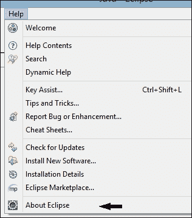
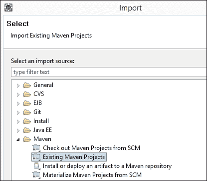
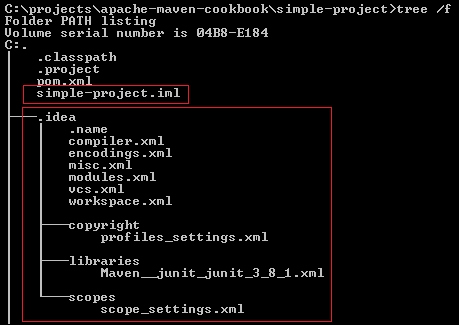

# 第二章。Maven 与 IDE 集成

在本章中，我们将了解如何使用三个流行的 Java **集成开发环境**（**IDE**）设置和使用 Maven。我们将涵盖以下菜谱：

+   在 Eclipse 中创建新的 Maven 项目

+   在 Eclipse 中导入现有的 Maven 项目

+   在 NetBeans 中导入现有的 Maven 项目

+   在 NetBeans 中导入现有的 Maven 项目

+   在 IntelliJ IDEA 中创建新的 Maven 项目

+   在 IntelliJ IDEA 中导入现有的 Maven 项目

# 简介

IDE 通过执行以下功能提高开发者的生产力：

+   创建样板代码

+   执行代码补全

+   识别语法问题

+   执行编译、单元测试和部署到 Web/应用程序服务器等任务

虽然 Maven 主要是一个命令行工具，但 IDE 可以帮助开发者以更好的方式享受和利用 Maven 功能。Maven 与 IDE 的集成可以帮助我们自动下载依赖项，并通过 UI 快速搜索依赖项，以及其他好处。

Maven 的 IDE 集成在过去几年中得到了改善，现在大多数 Maven 功能都可以通过 IDE 设置。

# 在 Eclipse 中创建新的 Maven 项目

Eclipse 是最受欢迎的开源 IDE 之一。它主要起源于 IBM 的 VisualAge for Java。它是一个可以通过插件进行扩展的平台（Maven 也是如此）。Eclipse 不仅可以用于开发 Java 项目，还可以通过插件开发大量其他语言。

就本书撰写时，Eclipse 4.4.1（Luna SR1）是最新的版本。本书中的截图为此版本。

## 准备就绪

由于 Eclipse 需要 Java 环境来运行，因此需要在系统上安装 Java。要完成此操作，请参阅第一章的前三个菜谱的*准备就绪*部分，*入门*。

从[`www.eclipse.org/downloads/`](https://www.eclipse.org/downloads/)下载 Eclipse。Eclipse 的二进制文件适用于所有流行的操作系统。还有针对不同类型开发者的不同 Eclipse 包解决方案（C/C++、Java EE、PHP 等）。您应该选择 Java 开发者使用的 Eclipse IDE 或 Java EE 开发者使用的 Eclipse IDE。

### 小贴士

要使 Maven 工作，重要的是使用 JDK 而不是 JRE 启动 Eclipse。这可以通过将以下参数传递给启动脚本来完成：

```java
-vm %JAVA_HOME%\bin\javaw
```

最近的 Eclipse 版本预装了 Maven 支持。让我们通过以下步骤来确认这一点：

1.  启动 Eclipse，然后在**帮助**菜单中点击**关于 Eclipse**按钮，如图所示：

1.  从您看到的图标列表中点击**m2**图标：

1.  点击**m2**图标，您应该会看到以下类似的截图：

1.  通过导航到 Eclipse 菜单栏的**窗口** | **首选项**来点击**Maven**链接。

1.  点击**安装**。您将看到 Eclipse 中可用的现有安装。它使用 Eclipse 附带的**嵌入式**Maven 安装，如下面的截图所示：

1.  通过点击**添加…**按钮添加您设置的 Maven 安装。

1.  您可以检查此安装，以便它被选择而不是**嵌入式**安装。

## 如何操作…

要创建一个新的 Maven 项目，请执行以下步骤：

1.  导航到**文件** | **新建** | **Maven 项目**。您将看到以下屏幕：

1.  选择**创建一个简单项目（跳过存档选择）**选项以避免选择要创建的内容。

1.  在第一章的“使用 Maven 创建简单项目”菜谱中，填写我们指定的参数值，以创建一个简单的 Maven 项目。(*组 ID：`com.packt.cookbook`，*存档 ID：`simple-project`)*

1.  点击**完成**。您的项目现在已设置完成。点击`pom.xml`文件。您将看到以下截图：

## 它是如何工作的…

Eclipse 内置了对 Maven 项目的支持（使用`m2e`插件）。在本菜谱中，我们使用 Eclipse 创建了一个简单的 Maven 项目，跳过了存档选择。我们还指定了项目的`groupId`、`artifactId`和`version`。

使用这些信息，Eclipse 将调用 Maven 存档插件来创建一个快速启动项目。Eclipse 控制台显示了执行步骤，并创建了项目。

文件夹结构和内容与通过命令行创建的项目相同。

# 在 Eclipse 中导入现有的 Maven 项目

如果您已经通过命令行设置了 Maven 项目，那么它可以很容易地导入到 Eclipse 中。

如果您尚未设置 Eclipse 并验证 Maven 是否存在，请遵循前面菜谱中的**准备就绪**部分。

## 如何操作…

要在 Eclipse 中导入现有的 Maven 项目，请执行以下步骤：

1.  导航到**文件** | **导入…**并点击**Maven**：

1.  选择上一章中创建的项目：

1.  导入项目。您将看到的内容与我们创建新 Maven 项目时看到的内容相同。

## 它是如何工作的…

Eclipse 内置了对 Maven 项目的支持。当导入 Maven 项目时，它会解析指定项目的`pom.xml`文件。根据项目的 pom 配置文件，它创建相关的 Eclipse 配置以识别源文件、测试和存档。

它还会识别项目的所有依赖项，如果尚未下载，将使用 Maven 下载这些依赖项，并将它们添加到项目依赖项中。

# 在 NetBeans 中创建新的 Maven 项目

NetBeans 是另一个流行的 IDE。它由 Oracle 支持，功能丰富且可扩展，支持多种语言，如 Eclipse。

到目前为止，NetBeans 8.0.2 是最新的版本。本书中的截图反映了这个版本。

## 准备工作

如果尚未下载，NetBeans 可以通过两种不同的方式下载：

+   Oracle 提供了最新 JDK 和 NetBeans 最新版本的下载。这是一个不错的选择，尤其是如果你还没有安装 JDK。

+   如果 JDK 已经安装，那么可以从 [`netbeans.org/`](https://netbeans.org/) 独立下载 NetBeans。NetBeans 有不同的版本（类似于 Eclipse）。你可以根据自己的喜好选择 Java SE 或 Java EE，或者全部选择。

## 如何操作...

现在 NetBeans 已经安装，让我们通过以下步骤创建一个新的 Maven 项目：

1.  导航到 **工具** | **选项**。选择 **Java** 并点击 **Maven** 选项卡。你会注意到 **Maven Home** 显示为 **捆绑**，版本为 **3.0.5**：

1.  你可以保持原样，或者通过选择下拉菜单将其更改为你的 Maven 安装。

1.  现在导航到 **文件** | **新建项目**。

1.  从 **类别** 中选择 **Maven**，从 **项目** 中选择 **Java 应用程序**，如图所示：

1.  指定项目的详细信息：

你已经完成了！现在在 NetBeans 中创建了一个新项目。

## 它是如何工作的...

与 Eclipse 一样，NetBeans 内置了对 Maven 的支持。与 Eclipse 不同，NetBeans 并未使用 Maven 架构来快速启动。相反，它使用模板创建了一个新项目。在这种情况下，你会注意到它没有创建快速架构创建的虚拟源代码和测试类。

# 在 NetBeans 中导入现有的 Maven 项目

与前一个示例中创建新的 Maven 项目不同，你可能想要在 NetBeans 中打开一个现有的 Maven 项目。现在让我们看看如何导入一个现有的 Maven 项目。

## 准备工作

如果尚未下载，NetBeans 可以通过两种不同的方式下载：

+   Oracle 提供了最新 JDK 和 NetBeans 最新版本的下载。这是一个不错的选择，尤其是如果你还没有安装 JDK。

+   如果 JDK 已经安装，那么可以从 [`netbeans.org/`](https://netbeans.org/) 独立下载 NetBeans。NetBeans 有不同的版本（类似于 Eclipse）。你可以根据自己的喜好选择 Java SE 或 Java EE，或者全部选择。

## 如何操作...

要在 NetBeans 中导入现有的 Maven 项目，请执行以下步骤：

1.  导航到 **文件** | **打开项目...**：

1.  从命令行中选择我们之前创建的项目。注意 NetBeans 如何将其识别为 Maven 项目（带有 **ma** 图标）：

1.  NetBeans 现在打开了 Maven 项目。

## 工作原理...

与 Eclipse 一样，NetBeans 内置了对 Maven 的支持。它通过存在 `pom.xml` 文件识别一个文件夹为 Maven 项目。它解析此文件，并打开项目，将文件和文件夹关联到 **源包**、**依赖项**和**项目文件**，如下面的截图所示：


# 在 IntelliJ IDEA 中创建新的 Maven 项目

IntelliJ IDEA 是 JetBrains 的一个 IDE，它既有社区版也有商业版。IntelliJ IDEA 在开发者中非常受欢迎，并且定期更新最新的语言和平台功能。

为了本食谱的目的，我们将使用社区版。对于商业版，步骤也是相同的。

在撰写本书时，IntelliJ IDEA 14.0.3 是最新版本。本书中的截图反映了这个版本。

## 准备工作

由于 IntelliJ IDEA 需要 Java 环境来运行，让我们首先确保我们的系统上已设置 Java 环境：

1.  确保已安装 JDK。

1.  通过访问 [`www.jetbrains.com/idea/`](https://www.jetbrains.com/idea/) 并点击 **下载** 链接来下载 IntelliJ IDEA。

1.  确保项目 SDK 设置为您的 Java 安装。

## 如何操作...

使用以下步骤在 IntelliJ IDEA 中创建新的 Maven 项目：

1.  打开 IntelliJ IDEA。

1.  点击 **创建新项目**。

1.  选择 **Maven**。

1.  选择 **从原型创建** 选项，并选择 **maven-archetype-quickstart:1.1**：

1.  指定创建项目所需的值：

1.  确认项目的值：

你已经完成了！在 IntelliJ IDEA 中创建了一个新的 Maven 项目。

## 工作原理...

IntelliJ IDEA 对 Maven 提供了一级支持。它可以按照原型创建新的 Maven 项目，通过从仓库下载所需的插件和依赖项。它使用配置的 Maven 设置，这些设置可以在下一节中自定义。

## 更多内容...

您可以通过以下方式在 IntelliJ IDEA 中自定义 Maven：

1.  导航到 **配置** | **设置**：

1.  在左侧面板上点击 **Maven**：

1.  点击 **覆盖** 以更改所需的值。

1.  更改一些默认选项，例如 **离线工作** 或 **输出级别**，如前一个截图所示。

# 在 IntelliJ IDEA 中导入现有的 Maven 项目

虽然我们可以使用 IntelliJ IDEA 创建新项目，但在大多数情况下，你已经在文件系统中有一个现有项目。在后一种情况下，你将想要导入此项目。

## 准备中

由于 IntelliJ IDEA 需要一个 Java 环境来运行，让我们首先确保我们的系统上已设置 Java 环境：

1.  确保已安装 JDK。

1.  通过访问 [`www.jetbrains.com/idea/`](https://www.jetbrains.com/idea/) 并点击 **下载** 链接来下载 IntelliJ IDEA。

1.  确保项目 SDK 设置为你的 Java 安装。

## 如何操作...

要在 IntelliJ IDEA 中导入现有的 Maven 项目，请执行以下步骤：

1.  启动 IntelliJ IDEA。

1.  选择 **导入项目**。浏览到我们之前创建的简单项目：

1.  如有需要，进行更改。更改可以按照以下截图所示进行：

1.  确认要导入的项目：

完成了！现有的 Maven 项目现在已导入 IntelliJ IDEA。

## 它是如何工作的...

IntelliJ IDEA 对 Maven 提供了一级支持。它可以解析 pom 文件以确定项目结构和依赖关系，并在 IDE 中布局。

一旦项目在 IntelliJ IDEA 中打开，以下文件夹和文件将被创建：



## 更多内容...

所有 Maven 相关操作都可以通过在 IntelliJ IDEA 中打开 **Maven Projects** 选项卡来执行：


你可以选择 **生命周期** 并点击要运行的阶段。例如，在先前的截图中，我们运行了 **Lifecycle** 的 **package** 阶段。
