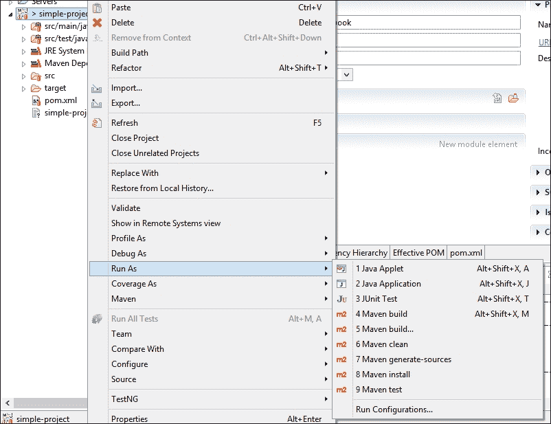

# 第四章. 必要的 Maven 插件

在本章中，我们将探讨以下食谱：

+   使用 Maven Clean 插件

+   使用 Maven 编译器插件

+   更改 Maven 编译器插件使用的编译器

+   为编译器插件指定 Java 版本

+   使用 Maven Surefire 插件运行单元测试

+   使用 Maven Failsafe 插件运行集成测试

+   使用 Maven 资源插件

+   使用资源进行过滤

+   使用 Eclipse 运行 Maven 目标

+   使用 NetBeans 运行 Maven 目标

+   使用 IntelliJ IDEA 运行 Maven 目标

# 简介

在上一章中，我们学习了 Maven 生命周期及其阶段和目标，了解了 pom 项目配置文件和设置文件的基本元素，并学习了如何使用 Maven 配置文件和属性。

在本章中，我们将探讨如何向 pom 文件添加和配置插件，并使用它们来执行基本构建任务。Maven 具有插件架构，除了核心功能外，Maven 中的每个任务都是通过插件完成的。Maven 提供了大量的插件。此外，还有几个第三方插件。如果用户选择这样做，Maven 还提供了一种机制，让用户开发自己的插件。

# 使用 Maven Clean 插件

当项目构建时，确保它不会被早期构建的工件所不利影响是很重要的。通常，构建工具在定义良好的文件夹中生成工件，即 `target` 文件夹，称为**项目工作目录**。在新构建之前，这个文件夹通常会被删除。

## 准备工作

Maven 已在您的系统上设置并验证其工作。要这样做，请参考 第一章 *入门* 的前三道食谱。

## 如何操作...

让我们通过以下步骤开始使用 Maven Clean 插件：

1.  打开命令提示符。

1.  在我们创建的简单 Maven 项目中运行以下 Maven 命令，该命令位于 第一章 中 *使用 Maven 创建简单项目* 的食谱中：*入门*：

    ```java
    mvn clean
    ```

1.  观察执行的各种步骤：

    ```java
    [INFO] --- maven-clean-plugin:2.4.1:clean (default-clean) @ simple-project ---
    [INFO] Deleting C:\projects\apache-maven-cookbook\simple-project\target

    ```

    如果没有文件/文件夹要删除，您将看不到以下输出：

    ```java
    [INFO] --- maven-clean-plugin:2.5:clean (default-clean) @ simple-project ---
    [INFO] ------------------------------------------------------------------------
    [INFO] BUILD SUCCESS

    ```

## 它是如何工作的...

当调用 `clean` 阶段时，Maven 会自动推断出正在调用 `clean` 生命周期。

它使用 Maven Clean 插件来完成这项工作。该插件只有一个目标，即 `clean`，用于清理工作目录。

在 Maven 的情况下，工作目录被称为 `target`。Maven 在构建完成后创建此目录。插件的 `clean` 目标尝试删除此目录。

由于 `clean` 是一个与 `default`（构建）生命周期分开的生命周期，如果你需要确保工作目录被删除，那么在 `default` 生命周期之前需要显式调用 `clean`。

## 更多...

在本节中，我们将讨论如何在构建过程中自动运行 Clean 插件，跳过删除工作目录的步骤，以及删除一些额外文件/文件夹的过程。

### 自动清理

在前面的例子中，因为我们使用了插件的默认行为，并且不需要进行任何配置，所以我们不需要对 pom 配置文件进行任何更改。然而，如果我们想确保`clean`目标在没有明确调用的情况下运行，该怎么办？

要做到这一点，我们需要在我们的 pom 文件中定义带有一些参数的插件：

1.  让我们在 pom 文件中添加以下代码：

    ```java
        <build>
            <plugins>
              <plugin>
                <artifactId>maven-clean-plugin</artifactId>
                <version>2.6</version>
                <executions>
                  <execution>
                    <id>auto-clean</id>
                    <phase>initialize</phase>
                    <goals>
                      <goal>clean</goal>
                    </goals>
                  </execution>
                </executions>
              </plugin>
            </plugins>
          </build>
    ```

    尽管前面的声明可能看起来很冗长，但我们只是要求在项目的`initialize`阶段调用`clean`目标。我们使用一个名为`auto-clean`的`id`来标识这个`execution`。

1.  现在在命令提示符上运行以下命令：

    ```java
    mvn package

    ```

1.  你将看到以下截图：

即使我们没有调用`clean`阶段，由于在 pom 文件中配置了在`initialize`阶段运行，`clean`目标仍然被触发。

### 跳过删除工作目录

让我们看看前面用例的反面。由于某种原因，我们不想删除工作目录，即使运行了`clean`。为此，请执行以下步骤：

1.  按照以下方式配置插件：

    ```java
        <plugin>
          <artifactId>maven-clean-plugin</artifactId>
          <version>2.6</version>
          <configuration>
            <skip>true</skip>
          </configuration>
        </plugin>
    ```

1.  在命令提示符上运行以下命令：

    ```java
    mvn clean

    ```

1.  观察以下输出：

    ```java
    C:\projects\apache-maven-cookbook\project-with-clean-disabled>mvn clean
    [INFO] Scanning for projects...
    [INFO]
    [INFO] ------------------------------------------------------------------------
    [INFO] Building Project with clean disabled 1.0-SNAPSHOT
    [INFO] ------------------------------------------------------------------------
    [INFO]
    [INFO] --- maven-clean-plugin:2.6:clean (default-clean) @ project-with-clean-disabled ---
    [INFO] Clean is skipped.

    ```

将`skip`插件属性设置为`true`表示告诉 Maven 必须跳过`clean`目标。

### 删除额外的文件夹/文件

如果你的项目除了`target`之外还有一个额外的文件夹，比如`report`，这可能是由另一个脚本创建的，并且你希望也删除它？我们使用以下步骤来完成同样的操作：

1.  按照以下方式配置插件：

    ```java
      <plugin>
        <artifactId>maven-clean-plugin</artifactId>
        <version>2.6</version>
        <configuration>
          <filesets>
            <fileset>
              <directory>${basedir}/report</directory>
            </fileset>
          </filesets>
        </configuration>
      </plugin>
    ```

    你现在已经配置了插件来删除一个额外的目录

1.  创建一个`report`文件夹用于测试。

1.  在命令提示符上运行以下命令：

    ```java
    mvn clean

    ```

1.  你现在将看到以下输出：

    ```java
    C:\projects\apache-maven-cookbook\project-with-clean-additional-folder>mvn clean
    [INFO] Scanning for projects...
    [INFO]
    [INFO] ------------------------------------------------------------------------
    [INFO] Building Project with clean additional folder 1.0-SNAPSHOT
    [INFO] ------------------------------------------------------------------------
    [INFO]
    [INFO] --- maven-clean-plugin:2.6:clean (default-clean) @ project-with-clean-additional-folder ---
    [INFO] Deleting C:\projects\apache-maven-cookbook\project-with-clean-additional-folder\report (includes = [], excludes = [])

    ```

`report`文件夹也被删除了。实际上，Maven 可以被配置为删除（或不清除）该文件夹内的特定文件夹和文件。

# 使用 Maven 编译器插件

编译是构建工具执行的基本任务之一。Maven 使用 Maven 编译器插件来进行编译。该插件提供了一些配置选项，使编译更加灵活。

## 如何操作...

要使用 Maven 编译器插件，请执行以下步骤：

1.  打开命令提示符。

1.  在第一章中，按照*使用 Maven 创建简单项目*的步骤创建的简单项目中运行以下 Maven 命令：

    ```java
    mvn compile

    ```

1.  观察以下输出：

    ```java
    [INFO] --- maven-compiler-plugin:2.3.2:compile (default-compile) @ simple-project ---
    [INFO] Compiling 1 source file to C:\projects\apache-maven-cookbook\simple-project\target\classes

    ```

## 它是如何工作的...

`compile`参数表示对 Maven 的`default`生命周期的调用。如第三章中*理解 Maven 生命周期、阶段和目标*配方所示，Maven 按顺序运行所有阶段，包括`compile`阶段。

`compile`阶段本身实际上是在运行 Maven Compiler 插件的`compile`目标。

这将 Java 源文件编译成`target/classes`文件夹中的类。

一个问题可能会让你感到困惑。关于测试类呢？为什么`compile`阶段不编译测试源文件？

答案在于 Maven 处理生命周期和生命周期阶段的方式。除非你想运行测试，否则你为什么要编译测试源文件？

## 更多...

如果我们想要编译测试源文件怎么办？

让我们在命令提示符上尝试运行以下命令：

```java
mvn test

```

观察以下截图所示的输出：


由于我们指定了`test`阶段，Maven 运行了它之前的所有阶段，包括使用 Maven Compiler 插件的`testCompile`目标编译测试源文件。

# 更改 Maven Compiler 插件使用的编译器

假设我们正在使用 JDK 7 运行 Maven，但我们的项目需要使用 JDK 8 编译源文件。本质上，我们想要使用一个与运行 Maven 的 JDK 不同的 JDK 进行编译。

在这种情况下，我们可以指定我们想要用于 Maven 的编译器。

## 如何操作...

使用以下步骤更改 Maven Compiler 插件使用的编译器：

1.  打开命令提示符。

1.  定义一个 Maven 属性以存储 Java 8 的位置详细信息：

    ```java
    <properties>
        <JAVA8.HOME>C:/Program Files/Java/jdk1.8.0_20</JAVA8.HOME>
    </properties>
    ```

    ### 注意

    要以便携的方式完成此操作，可以在用户的`settings.xml`文件中的`profile`中定义此属性。这是因为`JAVA_HOME`的位置可能因用户的操作系统或首选安装位置而不同。

1.  将以下插件配置添加到 Maven 项目中：

    ```java
        <plugins>
          <plugin>
            <groupId>org.apache.maven.plugins</groupId>
            <artifactId>maven-compiler-plugin</artifactId>
            <version>3.2</version>
            <configuration>
              <verbose>true</verbose>
              <fork>true</fork>
              <executable>${JAVA8.HOME}/bin/javac</executable>
              <compilerVersion>1.8</compilerVersion>
            </configuration>
          </plugin>
        </plugins>
    ```

    ### 注意

    为了使前面的代码生效，`fork`元素需要设置为`true`。Maven 将在单独的线程中调用不同的 Java 编译器，因此需要分叉。这样做是为了让 Maven 能够加载与不同 JDK 对应的不同的 JVM。

1.  在命令提示符上运行以下命令：

    ```java
    mvn compile

    ```

## 它是如何工作的...

编译发生的方式不会有明显的区别，除了现在，`executable`元素中指定的编译器将被调用。

## 参见

+   本章中*指定编译器插件的 Java 版本*配方

# 指定编译器插件的 Java 版本

当我们在 Eclipse 中创建新项目时，你会观察到以下警告：


为什么会出现这个错误？这是因为 Maven Compiler 插件默认将`source`和`target` Java 版本视为`1.5`（出于向后兼容性原因）。

让我们解决这个问题警告。

## 如何做到这一点...

假设你已经在 Eclipse 中将 Java 8 配置为默认的 Java 运行时，并执行以下步骤：

1.  打开 Eclipse 项目。

1.  将以下配置添加到 Maven Compiler 插件中：

    ```java
        <plugins>
          <plugin>
            <groupId>org.apache.maven.plugins</groupId>
            <artifactId>maven-compiler-plugin</artifactId>
            <version>3.2</version>
            <configuration>
              <source>1.8</source>
              <target>1.8</target>
            </configuration>
          </plugin>
        </plugins>
    ```

1.  或者，在 `properties` 元素中添加以下属性（这实际上是前面过程的快捷方式）：

    ```java
    <properties>
        <maven.compiler.target>1.8</maven.compiler.target>
        <maven.compiler.source>1.8</maven.compiler.source>
    </properties>
    ```

1.  检查警告是否消失。

## 它是如何工作的...

当 `source` 和 `target` 版本的 Java 明确设置到编译器时，源代码中使用的 Java 版本以及编译类所期望的版本是明确的。编译器编译到错误的 Java 目标版本的可能性很小。

因此，Eclipse 警告消失了。

## 更多...

你可能需要在 `compilerArguement` 元素中传递编译器参数。例如，你可能想识别代码中已弃用的 API 的使用。你可以通过添加以下配置来完成此操作：

```java
<plugin>
    <groupId>org.apache.maven.plugins</groupId>
    <artifactId>maven-compiler-plugin</artifactId>
    <version>3.2</version>
    <configuration>
       <compilerArgument>-Xlint:deprecation</compilerArgument>
    </configuration>
</plugin>
```

当在具有弃用代码上运行时，你可以看到相关的行：

```java
[INFO] Compiling 1 source file to C:\projects\apache-maven-cookbook\project-with-deprecation\target\classes
[WARNING] /C:/projects/apache-maven-cookbook/project-with-deprecation/src/main/java/com/packt/cookbook/App.java:[12,24] Date(int,int,int) in java.util.Date has been deprecated

```

# 使用 Maven Surefire 插件运行单元测试

软件开发的最佳实践之一是为你开发的代码编写自动化单元测试。现在让我们看看如何运行这些测试。

执行此任务的插件是 Maven Surefire 插件。

## 如何做到这一点...

要使用 Maven Surefire 插件运行单元测试，请执行以下步骤：

1.  打开命令提示符。

1.  在我们的一个示例项目中运行以下命令：

    ```java
    mvn test

    ```

1.  观察执行的各种步骤：

    ```java
    [INFO] --- maven-surefire-plugin:2.10:test (default-test) @ simple-project ---
    [INFO] Surefire report directory: C:\projects\apache-maven-cookbook\simple-project\target\surefire-reports
    -------------------------------------------------------
     T E S T S
    -------------------------------------------------------
    Running com.packt.cookbook.AppTest
    Tests run: 1, Failures: 0, Errors: 0, Skipped: 0, Time elapsed: 0 sec
    Results:
    Tests run: 1, Failures: 0, Errors: 0, Skipped: 0

    ```

## 它是如何工作的...

`test` 参数表示对 Maven 的 `default` 生命周期的调用。如第三章中“理解 Maven 生命周期、阶段和目标”配方所示，Maven 按顺序运行所有阶段，包括 `test` 阶段。

`test` 阶段本身实际上运行了 Maven Surefire 插件的 `test` 目标。

这将运行 `target/test-classes` 文件夹中存在的测试类。

我们拥有的测试是使用 JUnit 框架编写的测试。插件不仅运行测试，还生成可以用来分析失败以及测试覆盖率的测试报告。

检查 `surefire-reports` 文件夹：


虽然文本文件包含总结报告，但 XML 文件包含每个测试的详细信息。

## 更多...

Surefire 插件提供了许多配置，以使测试更容易。

### 使用 TestNG

JUnit 并非编写自动化单元测试的唯一方式。你可以使用 TestNG ([`testng.org`](http://testng.org)) 或者甚至在不使用任何框架的情况下（通过使用 Java 断言）编写测试。

Surefire 根据已定义的依赖项确定要使用的框架。

我们之前的例子运行了 JUnit 测试，因为我们已经在 pom 文件中定义了 `junit` 依赖。

现在，让我们使用 TestNG 编写一个测试，看看需要更改什么才能使其工作。参考带有 TestNG 的 Maven 项目。

pom 文件中唯一的更改是将`junit`依赖项替换为`testng`：

```java
<dependency>
    <groupId>org.testng</groupId>
    <artifactId>testng</artifactId>
    <version>6.8.8</version>
    <scope>test</scope>
</dependency>
```

在命令提示符下运行以下命令：

```java
mvn test

```

现在测试将使用 TestNG 运行：

```java
[INFO]
[INFO] --- maven-surefire-plugin:2.10:test (default-test) @ project-with-testNG---
[INFO] Surefire report directory: C:\projects\apache-maven-cookbook\project-with-testNG\target\surefire-reports
-------------------------------------------------------
T E S T S
-------------------------------------------------------
Running com.packt.cookbook.AppTest
Set up run
Fast test
Slow test
Tests run: 2, Failures: 0, Errors: 0, Skipped: 0, Time elapsed: 0.609 sec

```

现在，检查`surefire-reports`文件夹。它包含与`testng`对应的不同文件集：


与 TestNG 和 JUnit 一样，相同的测试可以在 TestNG 中运行。

### 跳过测试

可能存在你不想运行测试的情况；一些测试可能已损坏。可以通过以下方式完成：

+   在 pom 文件中配置 Surefire 插件：使用以下代码在 pom.xml 文件中配置你的 Surefire 插件：

    ```java
        <plugins>
          <plugin>
            <groupId>org.apache.maven.plugins</groupId>
            <artifactId>maven-surefire-plugin</artifactId>
            <version>2.17</version>
            <configuration>
              <skipTests>true</skipTests>
            </configuration>
          </plugin>
        </plugins>
    ```

    现在，运行以下命令：

    ```java
    mvn test

    ```

    你将看到以下输出：

    ```java
    [INFO]
    [INFO] --- maven-surefire-plugin:2.17:test (default-test) @ project-with-tests-skipped ---
    [INFO] Tests are skipped.

    ```

+   通过命令行参数发出`mvn`命令：即使发出以下命令，也可以跳过测试：

    ```java
    mvn –DskipTests tests

    ```

### 跳过测试源的编译

在前面的 mvn 命令中使用的`skipTests`参数跳过了测试的运行，但测试源仍然由早期阶段/目标编译。要跳过测试源的编译，你可以运行以下命令：

```java
mvn –Dmaven.test.skip=true package

```

这将完全跳过测试编译和测试执行。

# 使用 Maven Failsafe 插件运行集成测试

除了单元测试外，Maven 还允许你自动化运行你的集成测试。虽然单元测试在构建生命周期的`test`阶段运行，但集成测试在`verify`阶段运行。Maven Failsafe 插件用于运行集成测试。

## 如何做...

要使用 Maven Failsafe 插件运行集成测试，请执行以下步骤：

1.  打开包含集成测试的项目，即`project-with-integration-test`。

1.  将以下插件配置添加到 pom 文件中：

    ```java
    <plugin>
       <groupId>org.apache.maven.plugins</groupId>
       <artifactId>maven-failsafe-plugin</artifactId>
       <version>2.18</version>
       <executions>
          <execution>
            <id>integration-tests</id>
            <goals>
               <goal>integration-test</goal>
               <goal>verify</goal>
            </goals>
          </execution>
        </executions>
      </plugin>
    ```

1.  运行以下命令：

    ```java
    mvn verify

    ```

1.  观察执行的各种步骤：

## 它是如何工作的...

我们在 pom 文件中指定了集成测试必须运行，以及 Maven Failsafe 插件的目的是必须验证。这些目标绑定到 Maven 的`verify`阶段，并会被调用。

# 使用 Maven Resources 插件

资源插件出现以将项目资源复制到输出目录。资源可以是项目运行或测试的目的。

## 如何做...

让我们通过以下步骤开始使用 Maven Resources 插件：

1.  打开命令提示符。

1.  在我们之前创建的简单项目中运行以下命令：

    ```java
    mvn process-resources

    ```

1.  观察以下情况：

    ```java
    [INFO] --- maven-resources-plugin:2.5:resources (default-resources) @ simple-project ---
    [INFO] skip non existing resourceDirectory C:\projects\apache-maven-cookbook\simple-project\src\main\resources

    ```

## 它是如何工作的...

当我们指定`process-resources`阶段时，Maven 执行`maven-resources-plugin`的`resources`目标，该目标绑定到`process-resources`生命周期阶段。

在早期项目中，没有资源，因此资源不会被复制。

如果你向 `src\main\resources` 目录中添加一个文件（例如 `project-with-resources` 项目的情况），你将看到以下输出：

```java
[INFO] --- maven-resources-plugin:2.5:resources (default-resources) @ project-with-properties ---
[INFO] Copying 1 resource

```

你也可以显式调用插件的 goal，如下所示：

```java
mvn resources:resources

```

你也可以调用 `process-resources` 阶段之后的任何阶段，这将触发资源处理：

```java
mvn compile

```

有一个单独的目标用于将测试资源复制到提供主资源和测试资源分离的地方。像项目资源一样，测试资源处理可以通过以下三种方式之一调用，如下所示：

+   通过指定一个将自动调用其之前阶段的阶段：

    ```java
    mvn process-test-resources

    ```

+   通过显式声明插件的目标：

    ```java
    mvn resources:testResources

    ```

+   通过跟随 `process-test-resources` 的阶段：

    ```java
    mvn test

    ```

## 还有更多...

如果我们在额外的文件夹中有资源怎么办？Maven 资源插件允许我们配置这些额外的文件夹。

假设我们有一个额外的资源文件夹，即 `src/main/additional`。我们可以按照以下方式配置 `pom.xml` 文件：

```java
<build>
   <resources>
     <resource>
         <directory>src/main/resources</directory>
     </resource>
     <resource>
         <directory>src/main/additional</directory>
     </resource>
   </resources>
   </build>
```

现在，运行以下命令：

```java
mvn process-resources

```

观察输出：

```java
[INFO] --- maven-resources-plugin:2.5:resources (default-resources) @ project-with-additional-resources ---
[INFO] Copying 1 resource
[INFO] Copying 1 resource

```

线 `Copying 1 resource` 重复两次，表明从两个文件夹中发生了复制。

# 使用资源进行过滤

现在，让我们看看我们如何将 Maven 的资源功能用于良好，即对项目资源执行变量替换。这个特性在你需要根据部署平台使用不同的配置值参数化构建时很有用。

你可以在你的资源中定义变量。让我们看看我们如何从属性、资源过滤器文件和命令行中获取这些变量的值。

## 如何做到这一点...

要使用资源进行过滤，请按照以下步骤操作：

1.  在 `src/main/resource/app.properties` 文件中添加一个带有变量的属性：

    ```java
    display.name=Hello ${project.name}
    ```

1.  在 pom 文件中添加以下代码：

    ```java
      <build>
        <resources>
          <resource>
            <directory>src/main/resources</directory>
            <filtering>true</filtering>
          </resource>
        </resources>
      </build>
    ```

1.  调用 `process-resources` 阶段：

    ```java
    mvn process-resources

    ```

1.  检查 `target/classes` 中的处理后的资源 `app.properties`：

    ```java
    C:\projects\apache-maven-cookbook\project-with-resource-filtering\target\classes>type app.properties
    display.name=Hello Project with resource filtering

    ```

## 它是如何工作的...

在 第三章 的 *Maven 生命周期* 的 *使用 Maven 中的属性* 菜谱中，我们看到了 Maven 可以拥有的各种属性类型。在前面的例子中，我们将 `filtering` 元素设置为 `true`。Maven 将变量 `${project.name}` 替换为在 pom 文件中定义的项目名称对应的属性值，即 `Project with resource filtering`。

## 还有更多...

你可以从命令行覆盖属性值：

```java
mvn –Dproject.name="Override from command line" process-resources

```

现在，通过导航到 `target/classes` 查看 `app.properties`：

```java
C:\projects\apache-maven-cookbook\project-with-resource-filtering>type target\classes\app.properties
display.name=Hello Override from command line

```

如果你有很多变量，它们的值根据环境而不同，那么你可以在项目代码库中创建一个文件，例如 `my-filter-values.properties`，在其中持有键和值（例如，`src/filter` 文件夹），并将它们用作过滤器：

```java
<filters>
    <filter>my-filter-values.properties</filter>
</filters>
```

# 使用 Eclipse 运行 Maven 目标

如果你正在使用 Eclipse 开发你的项目，了解如何使用 IDE 运行我们之前讨论的一些插件是很有帮助的。

## 如何做到这一点...

要使用 Eclipse 运行 Maven 目标，请按照以下步骤操作：

1.  在 Eclipse 中打开简单项目。

1.  右键单击项目。

1.  选择**运行方式**。

1.  查看可用的 Maven 选项：

## 如何工作...

Eclipse 提供了一个选项，可以从 IDE 中运行各种目标。在我们本章中看到的目标中，`clean`、`compile`和`test`由 Eclipse 提供。还有一些其他选项。

此外，Eclipse 还允许我们根据需要修改配置。

Eclipse 还允许项目以传统方式（不使用任何 Maven 插件）**作为 Java 应用程序运行**。同样，它允许在没有使用 Maven 的情况下运行**JUnit 测试**。

# 使用 NetBeans 运行 Maven 目标

现在我们来看看如何在 NetBeans 中运行 Maven 目标。

## 如何操作...

要使用 NetBeans IDE 运行 Maven 目标，请执行以下步骤：

1.  在 NetBeans IDE 中打开简单项目。

1.  右键单击项目。

1.  查看可用选项：

## 如何工作...

与 Eclipse 不同，NetBeans 具有更紧密的 Maven 集成。这意味着每个菜单选项（**构建**、**清理和构建**、**清理**等）都会调用相应的 Maven 命令来执行。

例如，单击**清理**选项将产生以下结果：


如所示，它运行了`mvn clean`命令。

同样，**清理和构建**选项等同于`mvn clean install`命令。

这些是简单的用例。NetBeans 提供了额外的配置选项来覆盖默认的 Maven 行为。

# 使用 IntelliJ IDEA 运行 Maven 目标

最后，让我们看看 IntelliJ IDEA 提供了什么。

## 如何操作...

要使用 IntelliJ IDEA 运行 Maven 目标，请执行以下步骤：

1.  在 IntelliJ IDEA 中打开简单项目。

1.  选择**Maven 项目**：

1.  打开**生命周期**并单击一个合适的目标/阶段：

## 如何工作...

单击 Maven 阶段/目标将调用相应的 Maven 命令并执行。例如，单击**编译**将执行以下操作：


IntelliJ IDEA 还提供了其他配置选项，用于自定义 Maven 项目。
