# 第五章. 依赖管理

在本章中，我们将介绍以下食谱：

+   选择依赖的范围

+   获取依赖报告

+   进入依赖并避免依赖地狱

+   将依赖下载到文件夹中

+   理解 SNAPSHOT 依赖

+   处理依赖下载错误

+   检测未使用/未声明的依赖

+   手动安装仓库中不可用的依赖

+   使用 Eclipse 进行依赖管理

+   使用 NetBeans 进行依赖管理

+   使用 IntelliJ IDEA 进行依赖管理

# 简介

Maven 的强大功能之一是管理项目所需的依赖。一个项目在没有使用其他依赖的情况下开发是很罕见的。使用依赖的典型问题与依赖的数量和选择、它们的版本以及传递依赖（一个项目依赖反过来又依赖于其他依赖）有关。

Maven 有一种管理依赖的方式，同时也为用户提供足够的灵活性来处理出现的复杂性。

# 选择依赖的范围

我们可能出于许多原因使用依赖。其中一些可能是为了编译和运行项目所必需的。可能还有其他仅用于运行测试的（例如，`junit`）。然后可能有在运行时必需的依赖，比如 `logback`。

## 如何做到这一点...

使用以下步骤来选择依赖的范围：

1.  打开我们之前创建的 Maven 项目。

1.  观察以下部分：

    ```java
    <dependencies>
        <dependency>
          <groupId>junit</groupId>
          <artifactId>junit</artifactId>
          <version>3.8.1</version>
          <scope>test</scope>
        </dependency>
    ```

1.  删除前面的代码行并运行以下命令：

    ```java
    mvn compile

    ```

1.  观察到它运行时没有任何问题。

1.  现在，运行以下命令：

    ```java
    mvn test

    ```

1.  注意以下错误：

    ```java
    [INFO] Compiling 1 source file to C:\projects\apache-maven-cookbook\project-with
    -dependencies\target\test-classes
    [INFO] -------------------------------------------------------------
    [ERROR] COMPILATION ERROR:
    [INFO] -------------------------------------------------------------
    [ERROR] /C:/projects/apache-maven-cookbook/project-with-dependencies/src/test/java/com/packt/cookbook/AppTest.java:[3,23] package junit.framework does not exist

    ```

## 它是如何工作的...

Java 源代码 `App.java` 没有任何依赖。只有源类被 `mvn` 编译，因此命令运行时没有出现任何错误。

测试代码 `AppTest.java` 需要使用 `junit` 库进行构建。这在代码的导入语句中声明。`mvn` 测试尝试编译测试类，由于没有找到依赖，它失败了。

声明依赖需要指定以下信息：

```java
      <groupId>junit</groupId>
      <artifactId>junit</artifactId>
      <version>3.8.1</version>
```

前三个元素唯一地标识了依赖。

第四条信息如下：

```java
<scope>test</scope>
```

默认情况下，`scope` 是 `compile`。

有六个不同的依赖范围可供选择：

+   `compile`：这个依赖对于编译是必需的。这自动意味着它对于测试以及运行时（当项目运行时）也是必需的。

+   `test`：这个依赖仅用于测试。这意味着依赖通常在测试代码中。由于测试代码不用于运行项目，因此这些依赖在运行时不必要。

+   `runtime`：这些依赖在编译期间不是必需的，但运行项目时是必需的。一个例子是，如果你使用 **Java 简单日志门面（slf4j**）进行日志记录并希望使用 `logback` 绑定，那么就需要 `logback` 依赖。

+   `provided`：这告诉 Maven 依赖项对于编译和运行是必需的，但这个依赖项不需要与打包的分发包一起打包。依赖项将由用户提供。这种依赖项的一个例子是 `servlet-api`。通常，应用服务器有这些库。

+   `system`：这与提供的范围相似。在这里，我们需要明确提供 JAR 文件的路径。它不会从仓库中查找。这可能有助于指定不在仓库中的依赖项：

    ```java
      <dependency>
          <groupId>com.myorg</groupId>
          <artifactId>some-jar</artifactId>
          <version>2.0</version>
          <scope>system</scope>
          <systemPath>${basedir}/lib/some.jar</systemPath>
        </dependency>
    ```

+   `import`：这仅在 `dependencyManagement` 部分的 `pom` 类型依赖项上使用。它表示指定的 pom 应该用该 pom 的 `dependencyManagement` 部分中的依赖项替换。这是为了集中管理大型多模块项目的依赖项。

## 参见

+   本章中 *手动安装仓库中不可用的依赖项* 的配方

# 获取依赖关系报告

获取 Maven 项目的依赖关系列表对于识别和调试问题非常有用。Maven Dependency 插件在这里帮了我们大忙。

## 准备工作

要欣赏这一点，我们需要一个相当复杂的项目，它有几个传递依赖。您可以在 [`github.com/selendroid/demoproject-selendroid`](https://github.com/selendroid/demoproject-selendroid) 上查看这样一个项目。

项目源代码以 Git 仓库的形式提供。通常通过克隆来下载 Git 仓库。为此，请在您的系统上安装 Git。有关详细说明，请参阅 Git 设置链接 ([`help.github.com/articles/set-up-git/`](https://help.github.com/articles/set-up-git/))。

## 如何操作...

使用以下步骤，获取 Maven 项目的依赖关系列表：

1.  克隆开源项目 `demoproject-selendroid`。

1.  运行以下 Maven 目标：

    ```java
    mvn dependency:list

    ```

1.  观察以下截图所示的输出：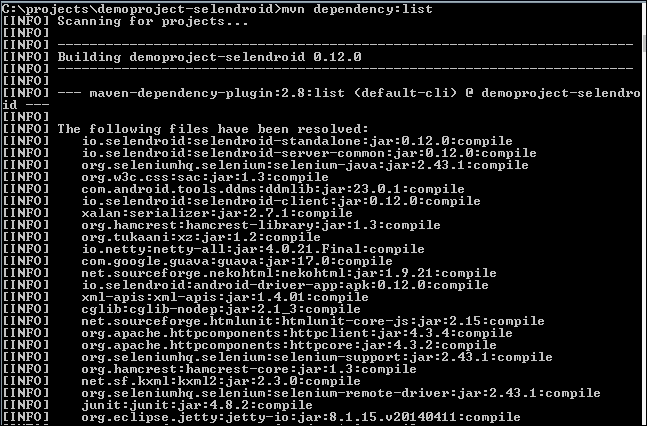

## 它是如何工作的...

Maven Dependency 插件有几个目标，用于获取有关依赖项的信息以及管理它们。

有趣的是，这个目标并不绑定到 Maven 的任何阶段或生命周期。这意味着，当运行 `mvn dependency:list` 命令时，Maven 只会运行 `list` 目标，而不会做其他任何事情。

`dependency:list` 参数告诉 Maven 运行 Maven Dependency 插件的 `list` 目标。这会分析 pom 文件并生成项目的依赖关系列表。

## 还有更多...

虽然依赖关系列表对于简单情况可能足够好，但更有趣和有用的是以树形格式显示的依赖关系报告。

这可以通过运行 Maven Dependency 插件的 `tree` 目标来完成：

```java
mvn dependency:tree

```

在前面的项目上运行此命令会得到以下输出：

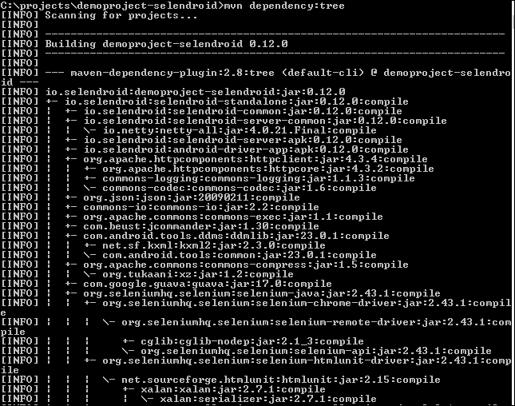

如我们所见，这是依赖关系传递性的更好表示。现在我们知道哪些其他依赖项被使用了，例如，`commons-logging`。

# 进入依赖关系并避免依赖关系地狱

随着您使用越来越多的依赖关系，每个依赖关系反过来也可能包含更多的依赖关系。可能会出现项目中有多个相同依赖关系版本的情况。这通常会导致错误。

## 准备工作

要理解这一点，我们需要一个相当复杂的项目，它有几个传递依赖关系。您可以在[`github.com/selendroid/demoproject-selendroid`](https://github.com/selendroid/demoproject-selendroid)查看这样一个项目。

在您的系统上克隆仓库。现在，我们准备了解复杂依赖关系可能变得多么复杂。

## 如何操作...

使用以下步骤来避免依赖关系地狱：

1.  运行以下命令：

    ```java
    mvn dependency:tree -Dverbose

    ```

1.  注意以下截图所示的输出：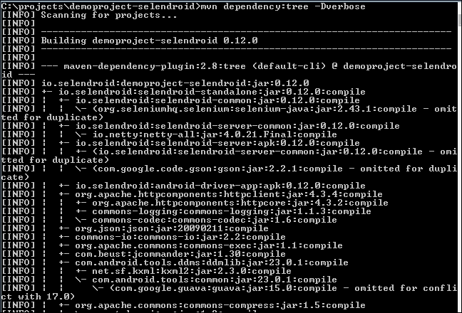

## 它是如何工作的...

正如您所看到的，在确定项目要使用的依赖关系的过程中，Maven 执行依赖关系分析。这揭示了两个问题：

+   两个或多个依赖关系需要另一个依赖关系的相同版本。Maven 只包含一次依赖关系。

+   两个或多个依赖关系需要另一个依赖关系的不同版本。

Maven 通过支持*最近定义*来解决这个问题，这意味着它将使用与您的项目在依赖关系树中最接近的依赖关系的版本。

这意味着它不一定选择最新的或最旧的版本。它将按照依赖关系的顺序，找到的第一个版本。

当项目由于使用了错误的版本而无法工作时，正确的解决方法是明确在您的 pom 文件中定义所需的依赖关系版本。根据前面的策略，这将作为*最近定义*将优先于任何其他依赖关系中定义的任何其他版本。

## 更多...

Maven 提供了另一种处理上述场景的方法，即通过使用`dependencyManagement`元素。

这允许我们在遇到传递依赖关系或未指定版本的依赖关系时，直接指定要使用的工件版本。在前面章节的示例中，`guava`依赖关系直接添加到`demoproject-selendroid`中，即使它没有被项目直接使用。相反，`demoproject-selendroid`可以在其`dependencyManagement`部分将`guava`作为依赖关系包含，并直接控制何时或是否引用它时使用哪个版本的`guava`。

没有魔法子弹可以防止依赖关系地狱。即使您手动管理通过前面机制包含在您的项目中的库的版本，这也并不意味着其他依赖于同一库不同版本的传递依赖关系会突然与管理的版本二进制兼容。

# 将依赖关系下载到文件夹中

一些项目可能需要将所有依赖项都可用，例如，在一个文件夹中。这可能是为了存档特定构建版本中使用的依赖项。

## 如何操作...

使用以下步骤在 `target/dependency` 文件夹中下载依赖项：

1.  让我们打开之前菜谱中使用的演示项目。

1.  运行以下命令：

    ```java
    mvn dependency:copy-dependencies

    ```

1.  在 `target/dependency` 文件夹中查看输出：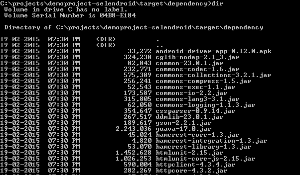

## 它是如何工作的...

Maven Dependency 插件的 `copy-dependencies` 目标会将项目中使用的所有依赖项（包括传递依赖项）复制到项目的 `target/dependency` 文件夹中。

## 还有更多...

此目标接受多个参数来处理各种用例，例如复制依赖项的 pom 文件、复制父 pom、保留仓库的文件夹结构等。

可以通过传递以下参数来更改文件夹位置：

```java
mvn dependency:copy-dependencies -DoutputDirectory=dependencies

```

现在依赖项将被复制到 `dependencies` 文件夹而不是默认的 `target/dependency` 文件夹。

可以通过运行以下命令保留仓库的文件夹结构并将依赖项的 pom 复制过来：

```java
mvn dependency:copy-dependencies -Dmdep.copyPom=true Dmdep.useRepositoryLayout=true

```

生成的文件夹结构将类似于以下截图所示的仓库布局：

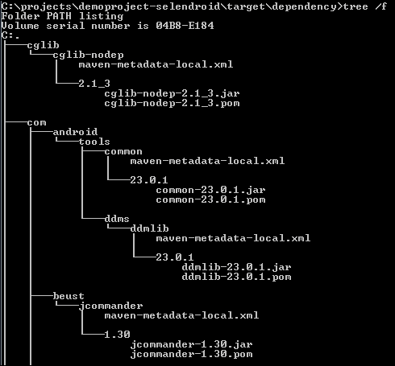

# 理解 SNAPSHOT 依赖项

在 Maven 中，`SNAPSHOT` 版本是项目/依赖项尚未发布的版本。这通过在版本号后附加 `SNAPSHOT` 来表示。以下是一个示例：

```java
<version>1.0-SNAPSHOT</version>
```

您会注意到我们使用 Maven 架构快速启动创建的项目有一个 `SNAPSHOT` 版本。

在 `-SNAPSHOT` 前指定的版本号是预期发布的项目/依赖项应具有的版本。因此，`1.0-SNAPSHOT` 表示 `1.0` 尚未发布。

由于 `SNAPSHOT` 版本表示正在开发中的软件，Maven 会以不同的方式处理这些依赖项。

## 如何操作...

很少会使用外部依赖项的 `SNAPSHOT` 版本。如果您在您的组织中开发一个多模块项目，那么您可能会使用项目中需要的其他模块的 `SNAPSHOT` 版本。

让我们尝试以下虚构的示例：

1.  打开我们创建的一个项目。

1.  添加以下依赖项：

    ```java
    <dependency>
        <groupId>org.springframework</groupId>
        <artifactId>spring-context</artifactId>
        <version>4.1.0.BUILD-SNAPSHOT</version>
    </dependency>
    ```

1.  添加以下代码以指定依赖项可用的仓库：

    ```java
    <repositories>
        <repository>
            <id>repository.spring.snapshot</id>
            <name>Spring Snapshot Repository</name>
            <url>http://repo.spring.io/snapshot</url>
        </repository>
    </repositories>
    ```

1.  运行以下命令：

    ```java
    C:\projects\apache-maven-cookbook\project-with-snapshot-dependencies>mvn verify
    ```

1.  观察以下结果：

    ```java
    [INFO] Scanning for projects...
    [INFO]
    [INFO] ------------------------------------------------------------------------
    [INFO] Building Project with SNAPSHOT dependencies 1.0-SNAPSHOT
    [INFO] ------------------------------------------------------------------------
    Downloading:http://repo.spring.io/snapshot/org/springframework/spring-context/4.1.2.BUILD-SNAPSHOT/maven-metadata.xml
    Downloaded:http://repo.spring.io/snapshot/org/springframework/spring-context/4.1.2.BUILD-SNAPSHOT/maven-metadata.xml (3 KB at 1.7 KB/sec)
    Downloading:http://repo.spring.io/snapshot/org/springframework/spring-context/4.1.2.BUILD-SNAPSHOT/spring-context-4.1.2.BUILD-20141107.161556-92.pom
    Downloaded:http://repo.spring.io/snapshot/org/springframework/spring-context/4.1.2.BUILD-SNAPSHOT/spring-context-4.1.2.BUILD-20141107.161556-92.pom (5 KB at 6.8 KB/sec)

    ```

## 它是如何工作的...

您首先会看到需要定义一个特定的仓库来下载依赖项。这些依赖项不在常规仓库中。它们位于称为 **快照仓库** 的单独仓库中。在先前的示例中，我们指定了包含所需依赖项的快照仓库。

你会注意到的第二件事是文件名。每个正在下载的工件都会附加`20141107.161556-92`。这是仓库中每个`SNAPSHOT`版本的唯一标识符。每次仓库中有新的`SNAPSHOT`版本可用时，此值都会改变。

Maven 对待`SNAPSHOT`版本和发布版本的方式不同。

对于发布版本，Maven 会检查该工件是否已存在于已下载的本地仓库中。如果是这样，它将不会尝试从远程仓库中获取相同的工件。

对于`SNAPSHOT`版本，即使工件在本地可用，它也会根据可以配置的更新策略在远程仓库中检查`SNAPSHOT`版本的更新。

默认情况下，更新间隔是一天一次。这意味着，如果 Maven 今天中午下载了一个`SNAPSHOT`依赖项，它将在明天中午检查其更新，而不会在此之前，无论你构建项目多少次。

更新间隔可以在 pom 或 settings 文件的仓库部分指定如下：

```java
<updatePolicy>always<updatePolicy>
```

选项有`always`、`daily`（默认）、`interval:X`（其中`X`是分钟内的一个整数）或`never`。让我们简要讨论这些选项：

+   `always`：这会在每次 Maven 运行时检查更新。

+   `daily`：这会每天检查一次更新。这并不一定意味着从上次检查的 24 小时后；只是在每天的开始。

+   `interval:X`：这会在指定的时间后检查更新。

    ### 小贴士

    在多模块项目中，对于模块间的依赖项，将`updatePolicy`元素值设置为`always`是很好的。

## 还有更多...

如前所述，发布版本和快照版本有单独的仓库。默认情况下，快照在发布仓库中是禁用的，反之亦然。`repository`元素有单独的`releases`和`snapshots`子元素，可以在其中指定：

```java
       <repository>
          <id>my-repo</id>
          <name>My Release Repo</name>
          <releases>
            <enabled>true</enabled>
            <updatePolicy>never</updatePolicy>
            <checksumPolicy>fail</checksumPolicy>
          </releases>
          <snapshots>
            <enabled>false</enabled>
            <updatePolicy>always</updatePolicy>
            <checksumPolicy>fail</checksumPolicy>
          </snapshots>
          <url>http://my.repo.url</url>
          <layout>default</layout>
        </repository>
```

通常，对于发布仓库，`snapshots`的`enabled`将为`false`。对于快照仓库，`snapshots`的`enabled`将为`true`，而`releases`的`enabled`将为`false`。这样，Maven 每次需要依赖项时都会查看正确的仓库，而不会不必要地查看错误的仓库。

`checksumPolicy`元素告诉 Maven 在下载的依赖项的校验和与实际校验和不匹配时应该做什么。`fail`的值将在校验和错误时停止构建。

# 处理依赖项下载错误

可能会有一些情况，由于网络问题或其他问题，依赖项可能无法下载。有时，Maven 报告的错误可能不会表明问题。了解如何解决这个问题是很有用的。

## 如何做到这一点...

在正常情况下模拟这个问题是困难的，但我们可以通过以下步骤创建一个人为的场景：

1.  修改我们简单项目中 JUnit 的依赖版本：

    ```java
    <version>3.9.1 </version>
    ```

1.  运行以下命令：

    ```java
    mvn verify

    ```

1.  这将尝试下载依赖项并失败（因为版本无效）：

    ```java
    [INFO] Building simple-project 1.0-SNAPSHOT
    [INFO] ------------------------------------------------------------------------
    Downloading:https://repo.maven.apache.org/maven2/junit/junit/3.9.1/junit-3.9.1.pom
    [WARNING] The POM for junit:junit:jar:3.9.1 is missing, no dependency information available
    Downloading:https://repo.maven.apache.org/maven2/junit/junit/3.9.1/junit-3.9.1.jar
    [INFO] ------------------------------------------------------------------------
    [INFO] BUILD FAILURE
    [INFO] ------------------------------------------------------------------------
    [INFO] Total time: 3.329 s
    [INFO] Finished at: 2014-11-08T15:59:33+05:30
    [INFO] Final Memory: 7M/154M
    [INFO] ------------------------------------------------------------------------
    [ERROR] Failed to execute goal on project simple-project: Could not resolve dependencies for project com.packt.cookbook:simple-project:jar:1.0-SNAPSHOT: Could not find artifact junit:junit:jar:3.9.1 in central (https://repo.maven.apache.org/maven2) -> [Help 1]

    ```

1.  再次运行命令并观察结果：

    ```java
    [ERROR] Failed to execute goal on project simple-project: Could not resolve dependencies for project com.packt.cookbook:simple-project:jar:1.0-SNAPSHOT: Failure to find junit:junit:jar:3.9.1 in https://repo.maven.apache.org/maven2 was cached in the local repository, resolution will not be reattempted until the update interval of central has elapsed or updates are forced -> [Help 1]

    ```

1.  删除本地仓库（`.m2/repository/junit/junit/3.9.1`）中的文件夹`3.9.1`（或以`.lastUpdated`结尾的文件夹中的文件）并重试。

    “无法尝试解决”错误将消失，Maven 将再次尝试下载依赖项。

## 它是如何工作的...

Maven 首先下载依赖项的 pom 文件。它分析 pom 文件，并递归地下载那里指定的传递依赖项。然后下载实际的依赖项文件，通常是 JAR 文件。

当 Maven 无法下载一个工件时，它会创建一个与未能下载的工件同名的文件，但后缀为`.lastUpdated`。在该文件中，它放入与下载相关的信息，如下例所示：

```java
#NOTE: This is an Aether internal implementation file, its format can be changed without prior notice.
#Sat Nov 08 15:59:33 IST 2014
https\://repo.maven.apache.org/maven2/.lastUpdated=1415442573938
https\://repo.maven.apache.org/maven2/.error=

```

当请求 Maven 再次下载依赖项时，Maven 会参考此文件的内容来决定是否应该重新尝试。这是针对发布依赖项的情况。删除此文件将确保 Maven 在请求时重新尝试下载依赖项。

我们已经在本章的“理解 SNAPSHOT 依赖”食谱中看到了这是如何为 SNAPSHOT 依赖项工作的。

# 检测未使用/未声明的依赖项

随着项目变得越来越大，依赖项的数量（包括传递依赖项）增加，了解我们是否最终声明了未使用的依赖项，或者我们是否使用了未声明的依赖项（这些依赖项是通过传递依赖项引入的）是有好处的。

## 如何操作...

使用以下步骤来检测未使用/未声明的依赖项：

1.  在我们之前使用的`demo-selendroid`项目上运行以下 Maven 命令：

    ```java
    mvn dependency:analyze

    ```

1.  注意生成的报告：

    ```java
    [WARNING] Used undeclared dependencies found:
    [WARNING]    org.seleniumhq.selenium:selenium-api:jar:2.43.1:compile
    [WARNING]    org.hamcrest:hamcrest-library:jar:1.3:compile
    [WARNING]    io.selendroid:selendroid-common:jar:0.12.0:compile
    [WARNING] Unused declared dependencies found:
    [WARNING]    org.hamcrest:hamcrest-integration:jar:1.3:compile

    ```

## 它是如何工作的...

如前述报告所示，Maven 已经识别出项目使用的一个未声明的依赖项，例如`selenium-api` JAR 文件。它还发现了一个在 pom 文件中声明但未被项目使用的依赖项（`hamcrest-integration`）。您可以检查删除是否会引起任何副作用，如果没有，则继续操作。

明确定义项目中使用的依赖项，指定版本号而不是通过传递依赖项使用它，这是一个好习惯。这是因为我们无法控制这个传递依赖项的版本或可用性。

另一方面，为了更好地控制我们之前看到的依赖项冲突，明确定义那些不是直接由我们的项目要求但由我们的依赖项使用的依赖项的版本可能不是一个坏主意。

# 在仓库中不可用的依赖项的手动安装

可能存在这样的情况，需要使用一个不在任何 Maven 仓库中的库。我们已看到一种使用方法，即将其指定为具有 `system` 范围的依赖项，并明确指定其路径。

这种方法的缺点是，如果您需要将项目作为库分发，则此依赖项将不可用。

Maven 提供了一种机制，可以将工件安装到您的本地仓库，以便您可以像其他依赖项一样声明和使用它。

## 如何操作...

使用以下步骤手动安装仓库中不可用的依赖项：

1.  将以下依赖项添加到我们之前创建的简单项目中：

    ```java
    <dependency>
          <groupId>org.apache.tomcat</groupId>
          <artifactId>apache-tomcat</artifactId>
          <version>8.0.14</version>
          <type>tar.gz</type>
          </dependency>
    ```

    项目将因缺少依赖项而编译失败

1.  现在运行以下 Maven 命令：

    ```java
    C:\projects\apache-maven-cookbook\project-with-dependency-not-in-repo>mvn install:install-file -DgroupId=org.apache.tomcat -DartifactId=apache-tomcat -Dversion=8.0.14 -Dpackaging=tar.gz -Dfile=C:\Users\raghu\Downloads\apache-tomcat-8.0.14.tar.gz -DgeneratePom=true

    ```

1.  注意结果：

    ```java
    [INFO] --- maven-install-plugin:2.4:install-file (default-cli) @ project-with-dependency-not-in-repo ---
    [INFO] Installing C:\Users\raghu\Downloads\apache-tomcat-8.0.14.tar.gz to C:\software\maven\org\apache\tomcat\apache-tomcat\8.0.14\apache-tomcat-8.0.14.tar.gz
    [INFO] Installing 
    C:\Users\raghu\AppData\Local\Temp\mvninstall8295760271813162395.pom to C:\software\maven\org\apache\tomcat\apache-tomcat\8.0.14\apache-tomcat-8.0.14.pom

    ```

## 它是如何工作的...

Maven Install 插件的 `install-file` 目标允许将依赖项安装到本地仓库。它接受 `groupId`、`artifactId`、`version` 和 `packaging` 类型作为参数，以便它可以在仓库中适当地放置依赖项，并为它创建一个简单的 pom 文件。

在有多个开发者的项目中，这种方法并不理想，因为每个开发者都需要手动执行此步骤。一种处理方法是将此依赖项安装到组织使用的仓库管理器中。因为开发者将使用此仓库管理器作为 `mirror`，所以 Maven 将从 `mirror` 中找到依赖项并继续执行。

在这种情况下，我们可以使用 Maven deploy 插件的 `deploy` 目标将工件安装到远程仓库。

一些远程仓库有访问控制。Maven 允许在 `server` 元素中指定访问详情。最好在 `settings.xml` 中指定此内容，因为此文件对每个用户都是特定的。

## 还有更多...

使用这种方法安装依赖项的项目再次不可分发，因为使用它们的人将无法找到依赖项。

当项目预期被他人作为依赖项分发和包含时，需要遵循不同的方法——即静态 **项目内仓库** 解决方案。使用以下步骤遵循项目内仓库方法：

1.  在您的 pom 文件中添加以下内容以在项目中创建一个仓库：

    ```java
    <repository>
        <id>in-project-repo</id>
        <releases>
            <checksumPolicy>ignore</checksumPolicy>
        </releases>
        <url>file://${project.basedir}/lib</url>
    </repository>
    ```

1.  使用以下命令将依赖项安装到该仓库：

    ```java
    mvn install:install-file -DgroupId=org.apache.tomcat -DartifactId=apache-tomcat -Dversion=8.0.14 -Dpackaging=tar.gz -Dfile=C:\Users\raghu\Downloads\apache-tomcat-8.0.14.tar.gz -DgeneratePom=true -DlocalRepositoryPath=lib

    ```

我们取得了什么成果？现在，依赖项已与源代码一起打包到我们项目的 `lib` 文件夹中，并可供分发。这对用户来说是透明的，因为他们不需要做任何特殊操作来访问它。

# 使用 Eclipse 进行依赖项管理

我们已经看到 Eclipse IDE 提供了对 Maven 项目的支持，并允许我们从 IDE 中运行 Maven 命令。现在让我们看看如何使用 Eclipse 管理依赖项。

## 如何操作...

在 Eclipse IDE 中使用以下步骤来管理依赖项：

1.  在 Eclipse 中打开 demoproject-selendroid 文件。

1.  打开 `pom.xml` 文件。

1.  点击以下截图所示的 **依赖项** 选项卡：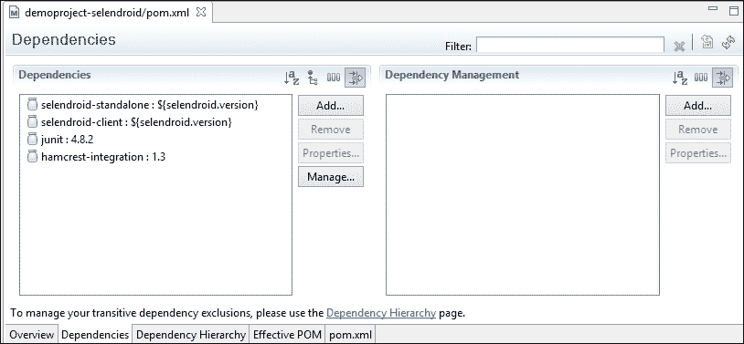

1.  可以通过点击 **添加…** 按钮（参见前面的截图中的 **添加…** 按钮）来添加新的依赖项：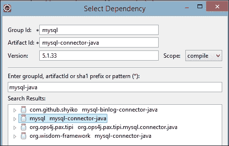

    如前一个截图所示，您可以在 **组 ID：**、**组件 ID：** 和 **版本：** 文本框中指定值，以及 **作用域** 下拉列表中的值。或者，您可以在 **输入组 ID、组件 ID 或 sha1 前缀或模式 (*):** 文本框中搜索一个组件，Eclipse 将根据您在 **搜索结果** 列表中的选择填充相关列。

1.  您还可以通过点击 **依赖关系层次结构** 选项卡来查看依赖关系树：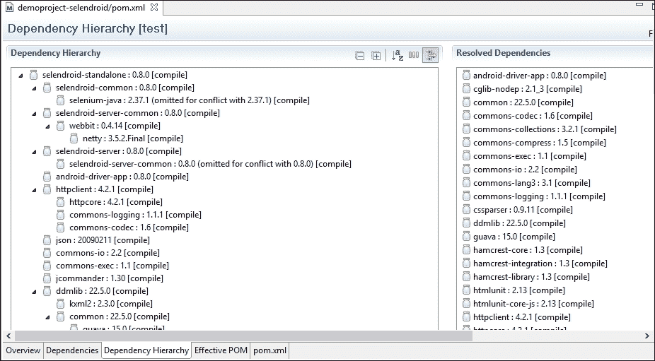

## 工作原理...

由于 Eclipse 内置了对 Maven 的支持，它可以通过解析 pom 文件来可视化依赖项。它还内部调用各种 Maven 命令（如 `dependency:tree`）来构建层次结构并显示相同的内容。

## 更多内容...

我们看到用户可以搜索并添加依赖项。为了使此功能正常工作，请导航到 **Windows** | **首选项** | **Maven** 并勾选 **启动时下载仓库索引更新** 选项以下载索引，如图所示：

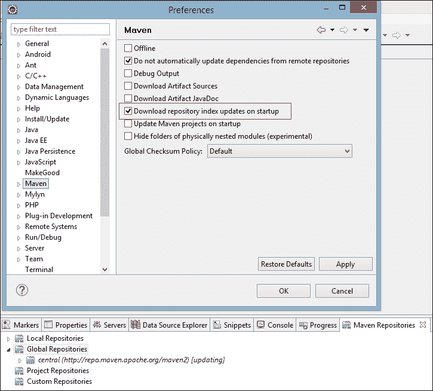

您可能需要重新启动 Eclipse 以使此更改生效。此外，您还可以启用 **Maven 仓库** 视图（参见前面的截图），查看仓库，并根据需要更新索引。

# 使用 NetBeans 进行依赖项管理

与 Eclipse 类似，NetBeans 也允许通过 IDE 管理和查看依赖项。与 Eclipse 不同，NetBeans 显示了依赖项的图形视图以及附加信息，这使得开发者更容易排查问题。

## 如何操作...

在 NetBeans IDE 中使用以下步骤来管理依赖项：

1.  在 NetBeans 中打开 `demoproject-selendroid` 文件。

1.  打开 `pom.xml` 文件。

1.  点击 **图形** 选项卡：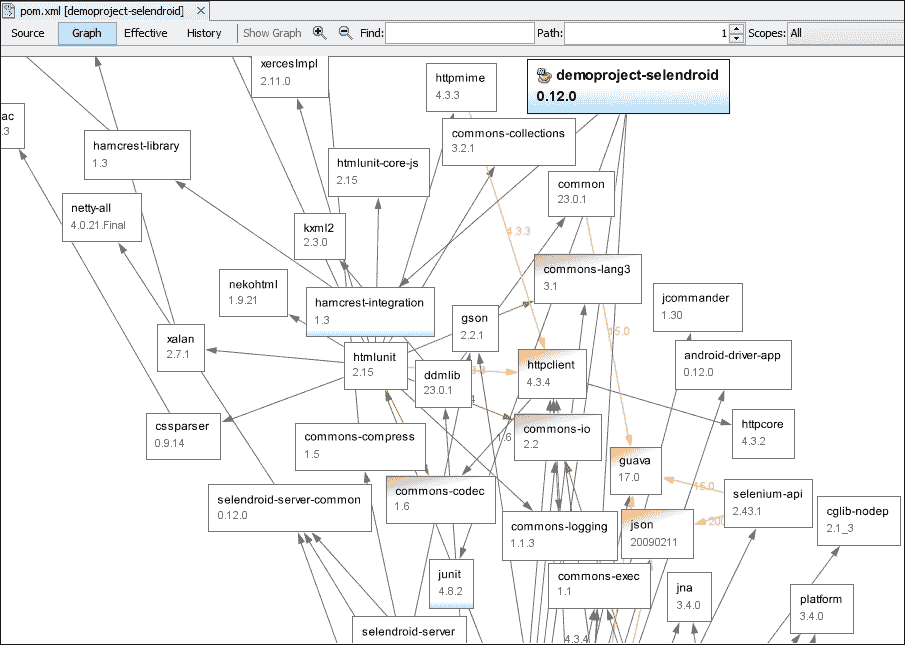

1.  将鼠标悬停在红色依赖项之一（**commons-codec**）上：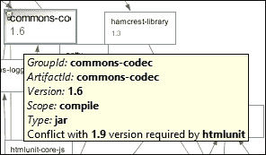

1.  将鼠标悬停在橙色依赖项之一（**httpclient**）上：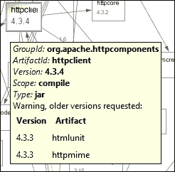

## 工作原理...

NetBeans 创建了一个包含所有项目依赖关系的图表，并显示相同的内容。它用红色突出显示有冲突的依赖项，用橙色突出显示有警告的依赖项。在悬停时，NetBeans 显示问题的详细信息。

这允许用户采取适当的行动。

# 使用 IntelliJ IDEA 进行依赖项管理

与 Eclipse 和 NetBeans 不同，只有在 IntelliJ IDEA Ultimate 版本中才能以图形的形式查看依赖项，这是一个商业版本。社区版不支持此选项。

## 如何操作...

在 IntelliJ IDEA Ultimate 版本中使用以下步骤来管理依赖项：

1.  在 IntelliJ IDEA Ultimate 版本中打开 `demoproject-selendroid` 文件。

1.  右键单击 `pom.xml` 文件。

1.  点击 **显示依赖...** 选项（参见前面的截图中的此选项）并观察以下截图：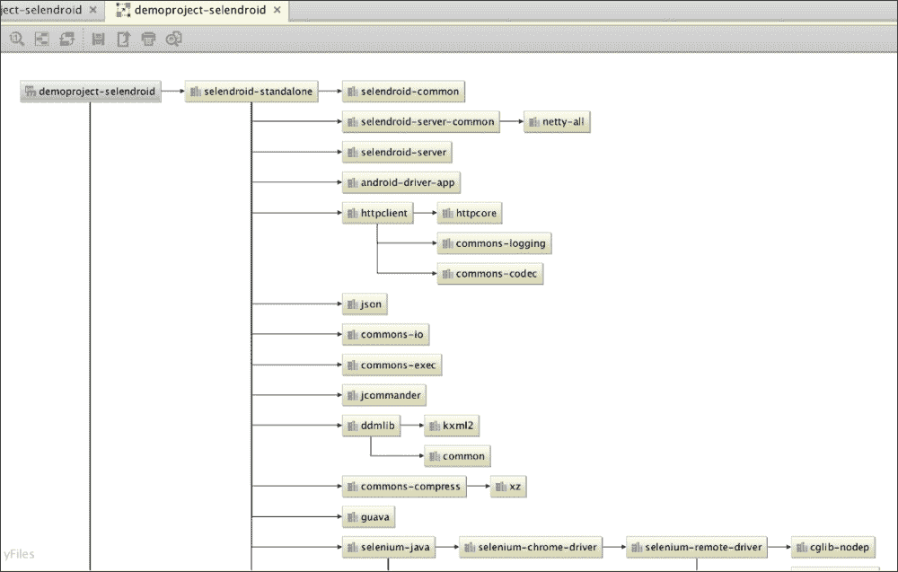

## 它是如何工作的...

IntelliJ IDEA 对 Maven 项目提供了一级支持。它读取项目的 `pom.xml` 文件，解析它，并识别所有依赖项，包括传递依赖项。然后以图形方式显示这些依赖项，使用户能够可视化项目。
