# 第六章。代码质量插件

在本章中，我们将回顾一些可用于 Java 语言的工具，以及如何在 Maven 上下文中使用它们。我们将涵盖以下食谱：

+   使用 Maven JaCoCo 插件分析代码覆盖率

+   使用 Maven Cobertura 插件分析代码覆盖率

+   使用 Maven PMD 插件分析代码

+   使用 Maven Checkstyle 插件分析代码

+   使用 Maven FindBugs 插件分析代码

+   使用 Maven JXR 插件生成源引用

+   使用 Maven SonarQube 插件分析代码

# 简介

编写代码和编写优秀的代码是两回事。通过拥有编码指南/标准，代码质量的主体性得到了极大的降低。开发者是否遵循编码标准可以通过对代码进行代码审查来验证。另一方面，有一些工具可以自动执行这些审查，与定义的标准进行对比。

除了代码质量，编程最佳实践还建议为代码编写自动单元测试。这些单元测试实现的行和分支覆盖率也可以通过工具进行定量测量。

# 使用 Maven JaCoCo 插件分析代码覆盖率

JaCoCo 是一个免费的 Java 代码覆盖率工具。这实际上是 Emma 的继任者，它是由 EclEmma 团队作为 Eclipse 项目开发的。

JaCoCo 提供行和分支覆盖率。

## 准备工作

Maven 已在您的系统上设置并验证其工作。为此，请参考第一章的前三个食谱，*入门*。

## 如何操作...

使用以下步骤使用 Maven JaCoCo 插件分析代码覆盖率：

1.  打开具有单元测试的项目（例如，`project-with-tests`）的 pom 文件。

1.  添加以下代码：

    ```java
    <plugin>
      <groupId>org.jacoco</groupId>
      <artifactId>jacoco-maven-plugin</artifactId>
      <version>0.7.2.201409121644</version>
      <executions>
         <execution>
           <id>default-prepare-agent</id>
           <goals>
             <goal>prepare-agent</goal>
           </goals>
         </execution>
         <execution>
           <id>default-report</id>
           <phase>prepare-package</phase>
           <goals>
             <goal>report</goal>
           </goals>
         </execution>
       </executions>
     </plugin>
    ```

1.  从命令提示符运行以下命令：

    ```java
    mvn package

    ```

1.  注意前面命令的输出：

    ```java
    [INFO] --- jacoco-maven-plugin:0.7.2.201409121644:prepare-agent (default-prepare-agent) @ project-with-tests ---
    [INFO] argLine set to -javaagent:C:\\software\\maven\\org\\jacoco\\org.jacoco.agent\\0.7.2.201409121644\\org.jacoco.agent-0.7.2.201409121644-runtime.jar=destfile=C:\\projects\\apache-maven-cookbook\\project-with-tests\\target\\jacoco.exec
    [INFO] --- jacoco-maven-plugin:0.7.2.201409121644:report (default-report) @ project-with-tests ---
    [INFO] Analyzed bundle 'Project with Tests with 1 classes

    ```

1.  打开在 `target/site/jacoco` 文件夹中生成的 `index.html` 文件：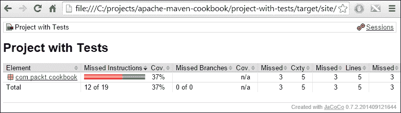

## 它是如何工作的...

在 pom 文件中，我们指示 Maven 运行 Maven JaCoCo 插件的以下两个目标：

+   `prepare-agent`：默认情况下，它与 Maven 默认生命周期的 `initialize` 阶段绑定。目标运行并准备执行分析的分析代理。

+   `report`：当运行测试时，此代理收集测试覆盖率信息，并在 `prepare-package` 阶段（我们已明确指定）中创建报告。

报告提供了关于测试覆盖率的详细信息。绿色表示被测试覆盖的行，红色表示未被测试覆盖的行。在上面的示例中，**12/19** 指令未被测试覆盖。

## 还有更多...

您可以对项目进行代码覆盖率分析并生成相同的报告，而无需对 pom 文件进行任何更改。为此，请运行以下命令：

```java
mvn jacoco:prepare-agent test jacoco:report

```

现在，您可能会遇到以下错误：

```java
[ERROR] No plugin found for prefix 'jacoco' in the current project and in the plugin groups [org.apache.maven.plugins] available from the repositories [local (C:\software\maven), central (https://repo.maven.apache.org/maven2)] -> [Help 1]

```

为了解决这个问题，明确指定插件的 `groupId` 和 `artifactId` 参数。在 第八章 的 *配置 Maven 以搜索插件* 菜谱中，我们将看到解决此问题的另一种方法。

在以下代码中，我们将明确调用之前看到执行的相关目标。所以首先运行 `prepare-agent`，然后是 `test`，最后是 `report` 目标：

```java
mvn org.jacoco:jacoco-maven-plugin:prepare-agent test org.jacoco:jacoco-maven-plugin:report

```

如果代码覆盖率低于阈值值时失败构建怎么办？为此，执行以下步骤：

1.  将以下执行块添加到之前指定的 `build` 部分的插件配置中：

    ```java
    <execution>
        <id>default-check</id>
        <phase>prepare-package</phase>
        <goals>
            <goal>check</goal>
        </goals>
        <configuration>
            <rules>
                <rule>
                    <element>BUNDLE</element>
                    <limits>
                        <limit>
                            <counter>COMPLEXITY</counter>
                            <value>COVEREDRATIO</value>
                            <minimum>0.60</minimum>
                        </limit>
                    </limits>
                </rule>
            </rules>
        </configuration>
    </execution>
    ```

1.  运行以下命令：

    ```java
    mvn package

    ```

1.  观察以下截图所示的结果：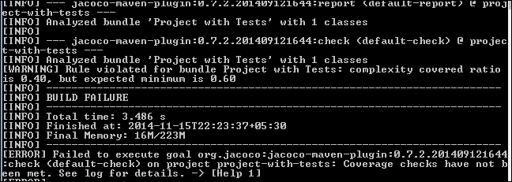

# 使用 Maven Cobertura 插件分析代码覆盖率

Cobertura 是另一个流行的 Java 工具，它计算测试访问的代码百分比。它基于 **jcoverage**。使用 Cobertura 有许多方式，包括独立使用、通过 Ant 脚本和 Maven。让我们使用 Maven Cobertura 插件。

## 如何操作...

使用以下步骤使用 Maven Cobertura 插件分析代码覆盖率：

1.  打开一个具有单元测试的 Maven 项目（例如，`project-with-tests`）。

1.  运行以下命令：

    ```java
    mvn cobertura:cobertura

    ```

1.  观察以下输出：

    ```java
    [INFO] <<< cobertura-maven-plugin:2.6:cobertura (default-cli) < [cobertura]test@ project-with-tests <<<
    [INFO]
    [INFO] --- cobertura-maven-plugin:2.6:cobertura (default-cli) @ project-with-tests ---
    [INFO] Cobertura 2.0.3 - GNU GPL License (NO WARRANTY) - See COPYRIGHT file
    Report time: 165ms
    [ERROR] Nov 15, 2014 5:06:25 PM
    net.sourceforge.cobertura.coveragedata.CoverageDataFileHandler loadCoverageData
    INFO: Cobertura: Loaded information on 1 classes.

    ```

1.  查看生成的报告：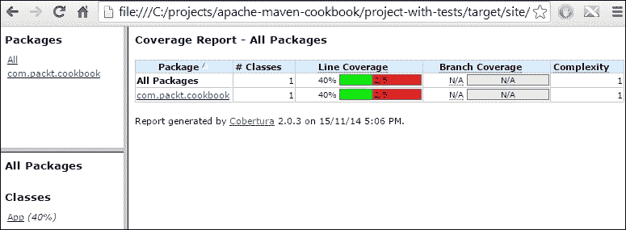

## 工作原理...

JaCoCo 在测试运行时在线对代码进行仪器化，因此需要运行代理。另一方面，Cobertura 在离线编译期间对字节码进行仪器化。Cobertura Maven 插件的 `cobertura` 目标对项目进行仪器化，运行测试并生成报告。

如果需要，有单独的目标用于 `instrument` 和 `check` 结果。

## 还有更多...

如果我们想在代码覆盖率低于阈值时失败构建，我们可以设置 Cobertura 来实现这一点：

1.  将以下内容添加到 pom 文件中：

    ```java
         <plugin>
            <groupId>org.codehaus.mojo</groupId>
            <artifactId>cobertura-maven-plugin</artifactId>
            <version>2.6</version>
            <configuration>
              <check>
                <branchRate>85</branchRate>
                <lineRate>85</lineRate>
                <haltOnFailure>true</haltOnFailure>
              </check>
            </configuration>
            <executions>
              <execution>
                <goals>
                  <goal>check</goal>
                </goals>
              </execution>
            </executions>
          </plugin>
    ```

1.  运行以下命令：

    ```java
    mvn cobertura:check

    ```

1.  观察以下截图所示的结果：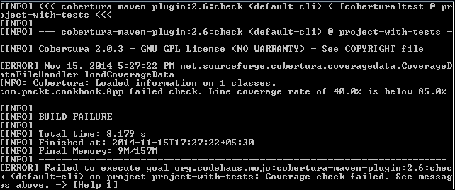

构建失败，因为在 pom 文件中，我们指定了如果覆盖率低于 85%，则应停止构建。

# 使用 Maven PMD 插件分析代码

PMD 是一个源代码分析器。它查找常见的编程缺陷，如未使用的变量、空的 catch 块和不必要的对象创建。它还包括 **复制/粘贴检测器**（**CPD**），用于查找重复的代码。

## 如何操作...

使用以下步骤在 Maven 项目上运行 PMD：

1.  打开你想要进行 PMD 分析的 Maven 项目（例如，`project-with-violations`）。

1.  运行以下命令：

    ```java
    mvn pmd:pmd pmd:cpd

    ```

1.  观察输出：

    ```java
    [INFO] --- maven-pmd-plugin:3.2:pmd (default-cli) @ project-with-violations ---
    [WARNING] Unable to locate Source XRef to link to – DISABLED
    [INFO] --- maven-pmd-plugin:3.2:cpd (default-cli) @ project-with-violations ---
    [WARNING] Unable to locate Source XRef to link to - DISABLED
    [INFO] ------------------------------------------------------------------------
    [INFO] BUILD SUCCESS

    ```

1.  检查 `target` 文件夹的内容：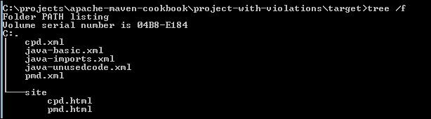

1.  打开 `pmd.xml` 报告：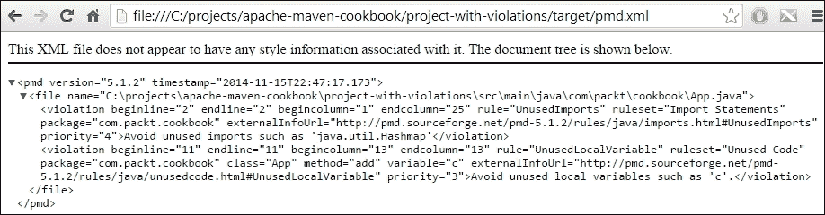

1.  在 `site` 文件夹中打开 `cpd.html` 文件：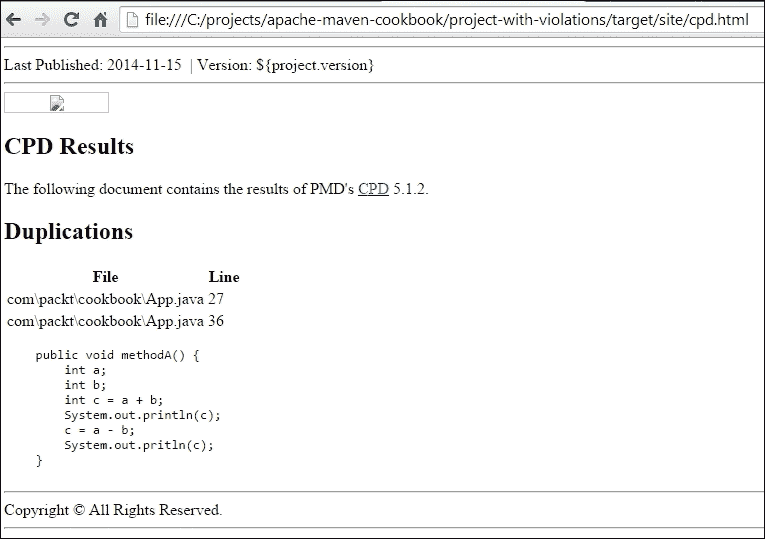

## 它是如何工作的...

Maven PMD 插件的 `pmd` 或 `cpd` 目标没有绑定到任何阶段。它们也分析 Java 源代码，因此不需要运行任何其他 Maven 阶段或目标。

当运行 `pmd` 目标时，它使用默认规则集和插件中设置的配置生成 PMD 站点报告。它还生成一个 XML 格式的 pmd 输出文件。

您也可以定义自己的自定义规则集。为此，在 pom 文件的 `configuration` 部分添加以下代码：

```java
<reporting>
    <plugins>
      <plugin>
        <groupId>org.apache.maven.plugins</groupId>
        <artifactId>maven-pmd-plugin</artifactId>
        <version>3.4</version>
        <configuration>
          <rulesets>
            <!-- Two rule sets that come bundled with PMD -->
            <ruleset>/rulesets/java/braces.xml</ruleset>
            <ruleset>/rulesets/java/naming.xml</ruleset>
            <!-- Custom local file system rule set -->
            <ruleset>d:\rulesets\strings.xml</ruleset>
            <!-- Custom remote rule set accessed via a URL -->
            <ruleset>http://localhost/design.xml</ruleset>
          </rulesets>
        </configuration>
      </plugin>
    </plugins>
  </reporting>
```

同样，当运行 `cpd` 目标时，它会为重复代码生成类似的报告。默认情况下，它认为报告代码重复的最小令牌计数是 100 个令牌（这通常是 10 行代码）。

## 还有更多...

可以通过以下方式使用插件的 check 目标使构建失败：

1.  将以下代码添加到 `project-with-violations` 的 pom 文件中：

    ```java
    <build>
      <plugins>
        <plugin>
          <groupId>org.apache.maven.plugins</groupId>
          <artifactId>maven-pmd-plugin</artifactId>
          <version>3.4</version>
          <executions>
            <execution>
              <goals>
                <goal>check</goal>
                <goal>cpd-check</goal>
              </goals>
            </execution>
          </executions>
        </plugin>
      </plugins>
    </build>
    ```

1.  运行以下命令：

    ```java
    mvn verify

    ```

1.  观察以下截图中的输出结果：

# 使用 Maven Checkstyle 插件分析代码

Checkstyle 是一个帮助程序员遵循编码标准的工具。它自动化了检查定义的编码标准是否被遵循的过程。它可以通过适当的配置支持任何编码标准。像其他工具一样，它既可以独立运行，也可以与 Maven 集成。

## 如何操作...

使用以下步骤使用 Maven Checkstyle 插件分析代码：

1.  打开您要进行 Checkstyle 分析的 Maven 项目（例如，`project-with-violations`）。

1.  运行以下命令：

    ```java
    mvn checkstyle:checkstyle

    ```

1.  观察以下截图中的输出结果：

    ```java
    [INFO]
    [INFO] --- maven-checkstyle-plugin:2.13:checkstyle (default-cli) @ project-with-violations ---
    [INFO]
    [INFO] There are 29 checkstyle errors.
    [WARNING] Unable to locate Source XRef to link to - DISABLED
    [INFO] ------------------------------------------------------------------------
    [INFO] BUILD SUCCESS

    ```

1.  在 `target` 文件夹中打开 `checkstyle-result.xml` 报告：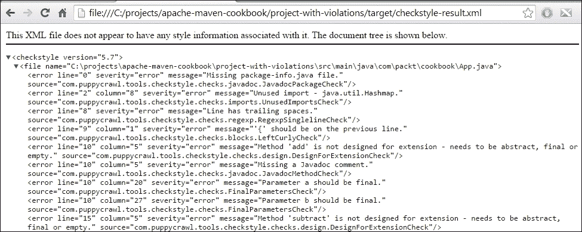

## 它是如何工作的...

与 Maven 的 `pmd`、`checkstyle` 目标不同，Checkstyle 插件没有绑定到任何阶段。

当运行 `checkstyle` 目标时，它使用默认规则集和插件中设置的配置生成 Checkstyle 站点报告。它还生成一个 XML 格式的 Checkstyle 输出文件。

Maven Checkstyle 插件支持多个配置选项来定制规则、排除要检查的文件等。让我们简要讨论一些示例，展示 Maven Checkstyle 插件在高级用例中的使用：

1.  Checkstyle 规则可以内联在插件的 `configuration` 部分中指定：

    ```java
    <configuration>
      <checkstyleRules>
        <module name="Checker">
          <module name="TreeWalker">
            <module name="FinalLocalVariable">
              <property name="tokens" value="VARIABLE_DEF,PARAMETER_DEF"/>
            </module>
          </module>
        </module>
      </checkstyleRules>
    </configuration>
    ```

1.  它们也可以在外部文件中指定，并使用 `configLocation` 元素进行引用：

    ```java
    <plugin>
      <groupId>org.apache.maven.plugins</groupId>
      <artifactId>maven-checkstyle-plugin</artifactId>
      <version>2.14</version>
      <configuration>
        <configLocation>checkstyle.xml</configLocation>
      </configuration>
    </plugin>
    ```

1.  可以创建一个 Suppressions 过滤器，告诉 Checkstyle 不要在特定文件和文件的特定部分报告违规：

    ```java
    <suppressions>
      <suppress checks="JavadocStyleCheck"
                 files="GeneratedObject.java"
                 lines="50-9999"/>
      <suppress checks="MagicNumberCheck"
                 files="LegacyDatasetConvertor.java"
                 lines="221,250-295"/>
    </suppressions>
    ```

## 还有更多...

与 PMD 的情况一样，我们可以配置 Maven Checkstyle 插件，使其在出现错误时失败构建：

1.  将以下代码添加到 `project-with-violations` 的 pom 文件中：

    ```java
    <build>
        <plugins>
          <plugin>
            <groupId>org.apache.maven.plugins</groupId>
            <artifactId>maven-checkstyle-plugin</artifactId>
            <version>2.14</version>
            <executions>
              <execution>
                <id>verify-style</id>
                <phase>process-sources</phase>
                <goals>
                  <goal>check</goal>
                </goals>
              </execution>
            </executions>
          </plugin>      
        </plugins>
      </build>
    ```

1.  运行以下 Maven 命令：

    ```java
    mvn verify

    ```

1.  观察以下截图所示的输出：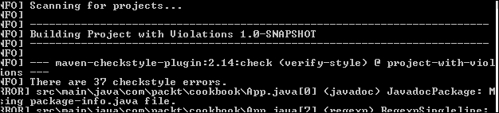

# 使用 Maven FindBugs 插件分析代码

FindBugs 是另一个使用静态分析来检查 Java 代码中 Java 字节码中错误的工具。它基于错误模式的概念。错误模式通常是一个错误代码片段。

## 如何操作...

让我们看看如何使用 Maven FindBugs 插件来分析和识别代码中的缺陷：

1.  打开你想要进行 FindBugs 分析的 Maven 项目。

1.  运行以下命令：

    ```java
    mvn clean compile findbugs:findbugs

    ```

1.  观察输出：

    ```java
    [INFO] --- maven-compiler-plugin:3.1:compile (default-compile) @ project-with-violations ---
    [INFO] Changes detected - recompiling the module!
    [INFO] Compiling 1 source file to C:\projects\apache-maven cookbook\project-with-violations\target\classes
    [INFO]
    [INFO] --- findbugs-maven-plugin:3.0.0:findbugs (default-cli) @ project-with-violations ---
    [INFO] Fork Value is true
    [java] Warnings generated: 3
    [INFO] Done FindBugs Analysis....

    ```

1.  在`target`文件夹中打开生成的 XML 文件`findbugsXml.xml`：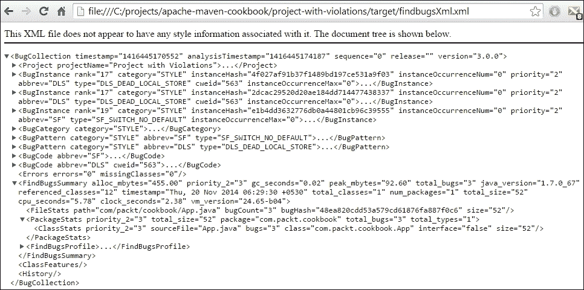

## 如何工作...

当运行 FindBugs 插件的`findbugs`目标时，它分析字节码并将错误报告到 XML 格式的输出文件中。与 Checkstyle 和 PMD 插件不同，除非配置不同，否则它不会生成默认的站点报告。

### 小贴士

由于 FindBugs 在字节码上工作，因此在运行 FindBugs 分析之前，项目需要先编译。否则，你将找不到任何 FindBugs 缺陷！

FindBugs 还提供了几个选项，允许你指定要包含/排除分析的类，指定要运行的规则，并在构建过程中出现错误时失败。让我们简要讨论一些描述 FindBugs 插件基本使用的示例：

+   过滤要报告的 bug：此插件允许我们指定可以包含或排除在报告中的类和方法：

    ```java
        <plugin>
            <groupId>org.codehaus.mojo</groupId>
            <artifactId>findbugs-maven-plugin</artifactId>
            <version>3.0.1-SNAPSHOT</version>
            <configuration>
              <excludeFilterFile>findbugs exclude.xml</excludeFilterFile>
              <includeFilterFile>findbugs-include.xml</includeFilterFile>
            </configuration>
          </plugin>
    ```

+   要运行的错误检测器：我们还可以指定要运行哪些检测器。这可以通过以下方式完成：

    ```java
        <plugin>
            <groupId>org.codehaus.mojo</groupId>
            <artifactId>findbugs-maven-plugin</artifactId>
            <version>3.0.1-SNAPSHOT</version>
            <configuration>
    <visitors>FindDeadLocalStores,UnreadFields</visitors>
            </configuration>
          </plugin>
    ```

## 还有更多...

你还可以启动 FindBugs GUI 以图形格式查看报告：

1.  要这样做，请运行以下 Maven 命令：

    ```java
    mvn compile findbugs:findbugs findbugs:gui

    ```

1.  观察 FindBugs 屏幕：

# 使用 Maven JXR 插件生成源引用

在运行 PMD 或 Checkstyle 插件时，你可能已经观察到以下警告：

```java
[INFO] --- maven-pmd-plugin:3.2:pmd (default-cli) @ project-with-violations ---
[WARNING] Unable to locate Source XRef to link to – DISABLED
[INFO] --- maven-checkstyle-plugin:2.13:checkstyle (default-cli) @ project-with-violations ---
[INFO]
[INFO] There are 36 checkstyle errors.
[WARNING] Unable to locate Source XRef to link to – DISABLED

```

插件试图将违规行为链接到源交叉引用的特定行。由于它们无法找到此交叉引用，因此显示警告。

要生成此交叉引用，我们需要使用 Maven JXR 插件。

## 如何操作...

使用以下步骤使用 Maven JXR 插件生成源引用：

1.  打开你想要运行交叉引用的项目。

1.  运行以下 Maven 命令：

    ```java
    mvn jxr:jxr

    ```

1.  观察输出：

    ```java
    [INFO]
    [INFO] --- maven-jxr-plugin:2.5:jxr (default-cli) @ project-with-violations ---
    [INFO] ------------------------------------------------------------------------

    ```

1.  浏览`target/site`文件夹。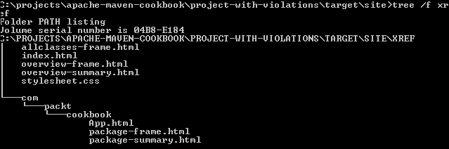

1.  在浏览器中打开`xref`文件夹的内容：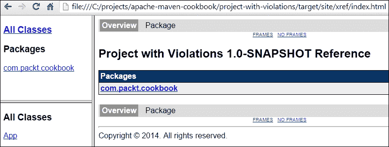

## 如何工作...

当运行 Maven JXR 插件的`jxr`目标时，它生成项目的所有源文件的交叉引用。格式类似于 Javadoc，但点击类时，你可以看到带有行号的源代码：

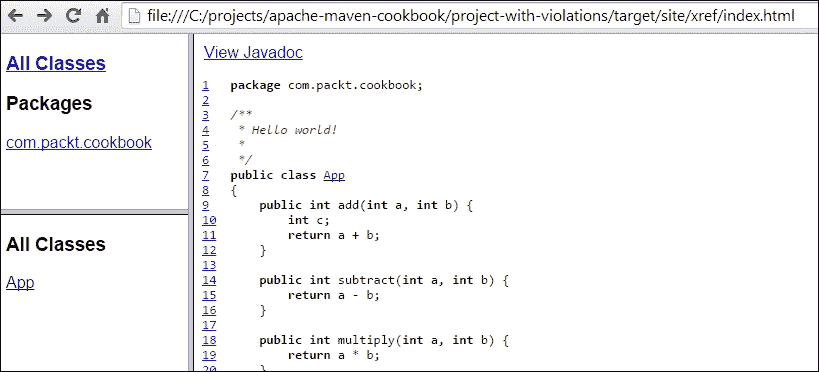

## 还有更多...

一旦建立交叉引用，代码质量工具，如 PMD 和 Checkstyle，将自动使用以下步骤链接到此引用：

1.  运行以下 Maven 命令：

    ```java
    mvn jxr:jxr checkstyle:checkstyle

    ```

1.  在浏览器中打开 Checkstyle 报告：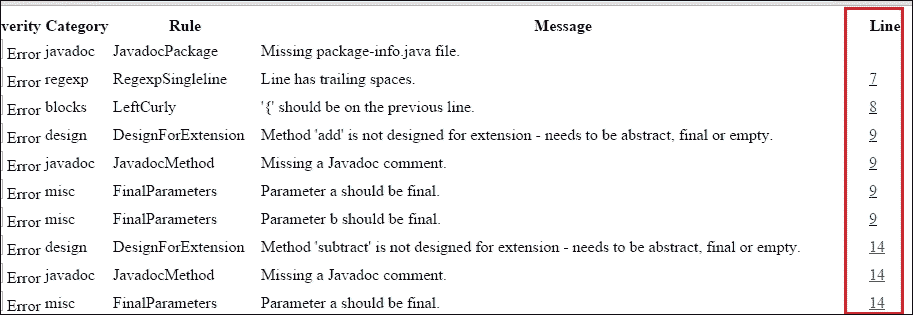

您现在可以看到针对每个违规的行号，以及到交叉引用源代码行号的链接。

# 使用 Maven SonarQube 插件分析代码

我们在前几节中看到的每个代码分析工具都识别代码中的特定问题。虽然 Checkstyle 寻找编码指南中的违规，PMD 识别常见的编码错误，而 FindBugs 检测错误模式。

您可以将项目配置为运行所有这三个工具。此外，您还可以运行插件以识别覆盖率。您还可以通过执行项目的 SonarQube 分析来完成所有这些以及其他操作。

SonarQube 是一个用于管理代码质量的平台。它是一个基于 Web 的应用程序，其中可以配置规则、警报、阈值和其他指标。它提供了分析代码的多种方式。分析的结果可以在 Web 应用程序中查看。SonarQube 还提供了一些付费插件，例如**SQALE**，以及针对特定语言，如 Cobol 和 C++。

## 准备中...

让我们简要讨论使用 Maven SonarQube 插件的一些基本要求：

1.  访问 SonarQube 的下载页面[`www.sonarqube.org/downloads/`](http://www.sonarqube.org/downloads/)。

1.  下载最新版本。

1.  将 ZIP 文件解压缩到您选择的文件夹中。

1.  根据平台，按照说明启动服务器。

1.  通过访问网页`http://localhost:9000/`（假设是默认安装）来确认服务器正在运行。

## 如何操作...

使用以下步骤使用 Maven SonarQube 插件分析代码：

1.  打开您想要进行 SonarQube 分析的项目。

1.  运行以下 Maven 命令：

    ```java
    mvn sonar:sonar

    ```

1.  观察以下屏幕截图所示的输出：

1.  访问 Sonar 网页`http://localhost:9000`：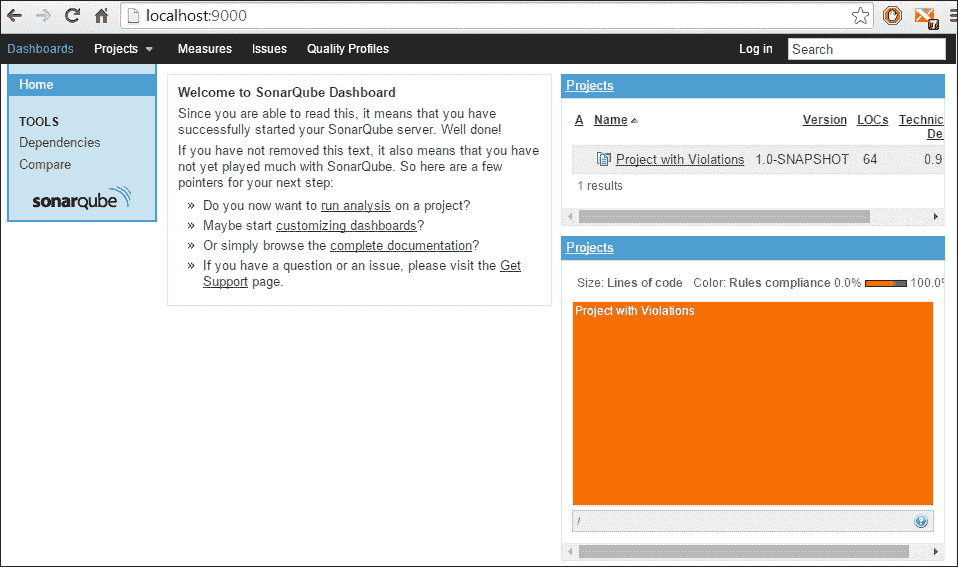

1.  点击项目链接：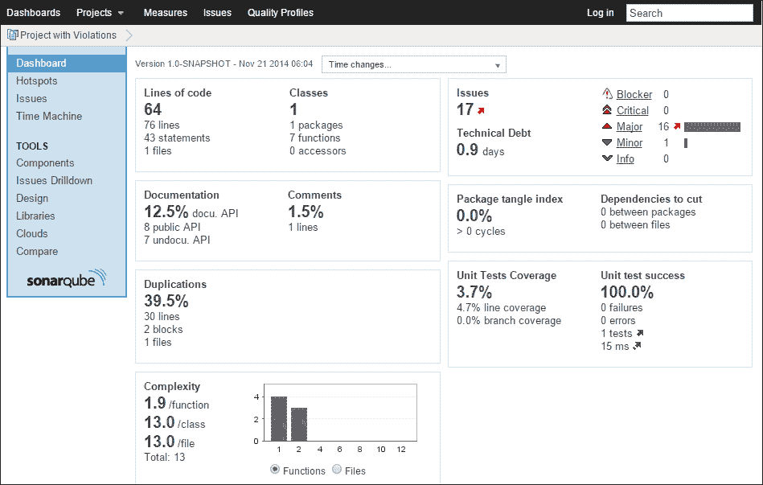

## 它是如何工作的...

Maven SonarQube 插件的`sonar`目标启动了一系列步骤，以对项目进行各种分析。根据配置，Sonar 插件执行 Checkstyle 分析、FindBugs 分析和 PMD 分析，并检测代码覆盖率、代码重复、设计问题和代码复杂性。

它将输出发送到数据库，并生成用户可以通过网页查看的报告。

如您从仪表板中看到的那样，它已生成单元测试报告以及覆盖率信息。点击链接将用户带到覆盖率详情。

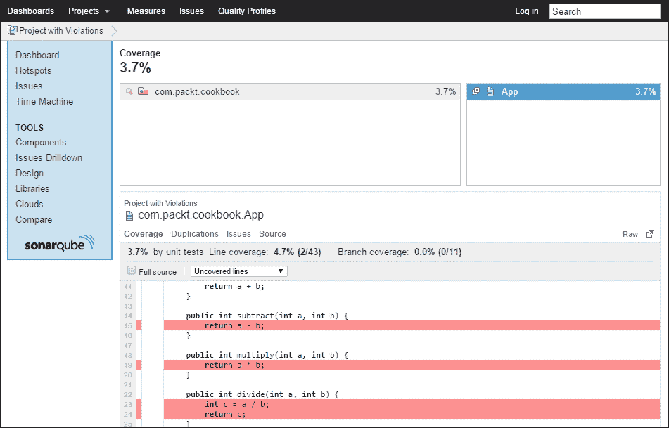

类似地，点击**问题**可以查看各种违规的详细信息：

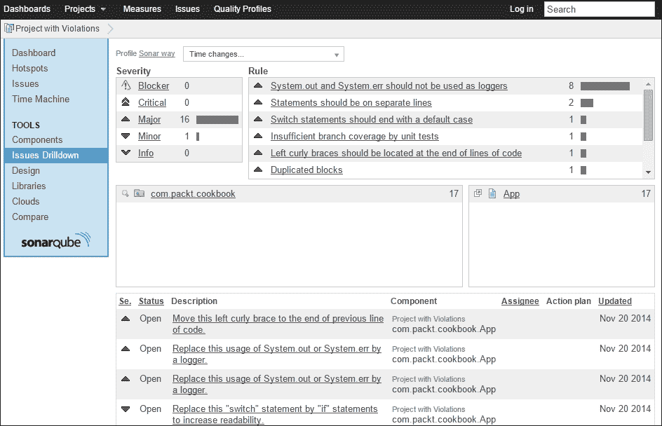

这些问题中的每一个都可以深入到行级细节，Sonar 提供了详细信息，包括修复建议。

## 还有更多...

SonarQube 提供了多个配置选项来指定要包含/排除的规则、要包含/排除的源文件等。配置可以通过网页界面进行，在某些情况下，也可以通过属性进行，无论是在 Maven 的设置文件中还是在命令行中。

此外，SonarQube 为 Eclipse 和 IntelliJ 提供了插件。一旦安装并配置，这些插件就会在 IDE 中直接报告特定行的违规情况。由于这并非特定于 Maven，其详细信息超出了本节范围。
