# 第八章. 处理典型构建需求

在本章中，我们将介绍以下食谱：

+   包含和排除额外资源

+   包含和排除源文件和文件夹

+   配置 Maven 以搜索插件

+   在离线模式下工作

+   控制 Maven 输出的详细程度

+   使用 Maven Help 插件

+   使用 Maven SCM 插件

+   为网站生成变更日志

# 简介

在前面的章节中，我们看到了如何设置 Apache Maven 来构建软件项目。我们也看到了如何配置它来分析代码质量和代码覆盖率。我们看到了如何生成和发布项目文档。

由于我们使用 Apache Maven，我们可能会遇到既不通用又不罕见的需求。在许多项目中，可能需要包含额外的源或资源文件夹。我们将看到 Maven 如何允许我们做到这一点。我们还想从 Maven 获得更多详细的输出，以便在出错时进行故障排除。我们还将看到在不使用互联网的情况下，我们可以将 Maven 构建工作到什么程度。我们还将看到 Maven 如何与**软件配置管理**（**SCM**）系统协同工作，并允许 SCM 更改成为项目文档的一部分。

# 包含和排除额外资源

在编译或测试过程中，你可能会遇到需要包含额外的资源文件或文件夹的情况。你也可能需要排除特定的文件或文件夹。让我们看看我们如何做到这一点。

## 准备工作

Maven 已在你的系统上设置并验证了其工作。为此，请参考第一章的前三个食谱，*入门*。

## 如何操作...

1.  打开一个需要包含或排除文件或文件夹的 Maven 项目；例如，`project-with-include-exclude`。

1.  将以下内容添加到你的`pom`文件的`build`部分：

    ```java
    <resources>
          <resource>
            <directory>src/resources/xml</directory>
            <includes>
              <include>*.xml</include>
            </includes>
          </resource>
          <resource>
            <directory>src/resources/json</directory>
            <includes>
              <include>include.json</include>
            </includes>
            <excludes>
              <exclude>exclude.json</exclude>
            </excludes>
          </resource>
    </resources>
    ```

1.  运行以下命令：

    ```java
    mvn resources:resources

    ```

1.  观察输出：

    ```java
    [INFO] --- maven-resources-plugin:2.6:resources (default-cli) @ project-with-include-exclude ---
    [INFO] Using 'UTF-8' encoding to copy filtered resources.
    [INFO] Copying 2 resources
    [INFO] Copying 1 resource
    [INFO] ------------------------------------------------------------------------

    ```

1.  查看资源文件夹的内容：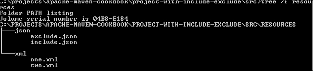

1.  查看构建输出目录的内容：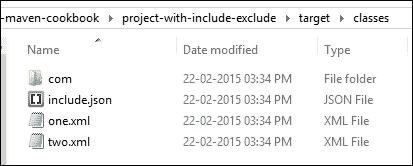

## 它是如何工作的...

Maven Resources 插件的`resources`目标会复制构建输出目录所需的所有资源。此目标绑定到`process-resources`阶段，它是`default`生命周期的一部分。

默认情况下，目标会复制`src/main/resources`的内容。当在`pom`文件中指定`resources`标签时，它会根据指定的`include`和`exclude`过滤器复制那里目录的内容。

在我们的特定示例中，我们做了三件事：

+   在`src/resources/xml`文件夹中包含了所有 XML 文件

+   在`src/resources/json`文件夹中包含一个特定的文件

+   在`src/resouces/json`文件夹中排除了一个特定的文件

## 更多内容...

如果我们需要有选择地复制测试资源怎么办？为此，我们需要做以下事情：

1.  在你的`pom`文件的`build`部分添加以下内容：

    ```java
    <testResources>
      <testResource>
        <directory>src/resources/xml</directory>
        <includes>
          <include>*.xml</include>
        </includes>
      </testResource>
      <testResource>
        <directory>src/resources/json</directory>
        <includes>
          <include>include.json</include>
        </includes>
        <excludes>
          <exclude>exclude.json</exclude>
        </excludes>
      </testResource>
    </testResources>
    ```

1.  运行以下命令：

    ```java
    mvn resources:testResources

    ```

1.  查看目标文件夹`test-classes`的内容：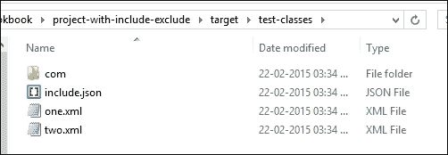

这将现在将指定的测试资源复制到测试输出目录（`target/test-classes`）。

我们看到`resources`和`testResources`目标分别将资源复制到`classes`和`test-classes`。如果我们需要将这些资源复制到特定的文件夹中，例如，将`xml`文件复制到`xml`文件夹，将`json`文件复制到`json`文件夹，怎么办？Build Helper Maven 插件的`add-resource`和`add-test-resource`目标在这里提供帮助。

1.  使用以下代码更新`pom`文件：

    ```java
    <plugin>
      <groupId>org.codehaus.mojo</groupId>
      <artifactId>build-helper-maven-plugin</artifactId>
      <version>1.9.1</version>
      <executions>
        <execution>
          <id>add-resource</id>
          <phase>generate-resources</phase>
          <goals>
            <goal>add-resource</goal>
          </goals>
          <configuration>
            <resources>
              <resource>
                <directory>src/resources/xml</directory>
                <targetPath>xml</targetPath>
              </resource>
              <resource>
                <directory>src/resources/json</directory>
                <targetPath>json</targetPath>
                  <includes>
                    <include>include.json</include>
                  </includes>
                  <excludes>
                    <exclude>exclude.json</exclude>
                  </excludes>
              </resource>
            </resources>
          </configuration>
        </execution>
      </executions>
    </plugin>
    ```

1.  运行以下命令：

    ```java
    mvn compile

    ```

1.  现在检查`target/classes`文件夹。

您将看到带有相应内容的`xml`和`json`子文件夹。

# 包含和排除源文件和文件夹

根据 Maven 约定，所有项目源文件都应该在`src`文件夹中。然而，可能存在组织方式不同的遗留项目，并且可能有多个源文件夹。此外，在某些项目中，我们可能需要从`wsdl2java`等工具动态生成源代码。在这种情况下，Maven 需要知道这些额外的源文件夹。请注意，这样的项目可能在 IDE 中运行不佳。

## 如何操作...

使用以下步骤在您的 Maven 项目中包含和排除源文件和文件夹：

1.  打开名为`project-with-additional-source`的 Maven 项目。

1.  在`pom`文件中添加以下部分：

    ```java
        <plugin>
            <groupId>org.codehaus.mojo</groupId>
            <artifactId>build-helper-maven-plugin</artifactId>
            <version>1.9.1</version>
            <executions>
              <execution>
                <id>add-source</id>
                <phase>generate-sources</phase>
                <goals>
                  <goal>add-source</goal>
                </goals>
                <configuration>
                  <sources>
                    <source>src/main/source</source>
                  </sources>
                </configuration>
              </execution>
            </executions>
        </plugin>
    ```

1.  运行以下命令：

    ```java
    mvn compile

    ```

1.  查看生成的输出：

    ```java
    [INFO] --- build-helper-maven-plugin:1.9.1:add-source (add-source) @ project-with-additional-source ---
    [INFO] Source directory: C:\projects\apache-maven-cookbook\project-with-additional-source\src\main\source added.

    ```

1.  查看目标文件夹`target/classes`：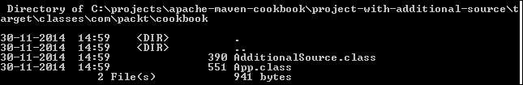

## 工作原理...

我们有一个名为`src/main/source`的额外源文件夹。我们在构建辅助 Maven 插件的`configuration`部分指定了这一点。我们还把插件的`add-source`目标绑定到了`default`生命周期的`generate-sources`阶段。

作为`default`生命周期的组成部分，在`compile`目标之前，Maven 会运行`generate-sources`阶段。这调用了插件的`add-source`目标，它为编译添加了额外的文件夹及其内容。

以类似的方式，可以添加额外的测试文件夹到构建中。配置将与之前的案例相同，除了`execution`部分，它将如下所示：

```java
         <execution>
            <id>add-test-source</id>
            <phase>generate-test-sources</phase>
            <goals>
              <goal>add-test-source</goal>
            </goals>
            <configuration>
              <sources>
                <source>src/main/source</source>
              </sources>
            </configuration>
          </execution> 
```

我们指定了`add-test-source`目标而不是`add-source`，并将其绑定到`generate-test-sources`阶段。

## 还有更多...

Build Helper Maven 插件提供了一些满足特定项目需求的其他目标。以下是一些例子：

+   `attach-artifact`：此功能用于附加额外的工件以安装和/或部署，除了项目工件。这可以通过以下方式配置插件：

    ```java
          <plugin>
            <groupId>org.codehaus.mojo</groupId>
            <artifactId>build-helper-maven-plugin</artifactId>
            <version>1.9.1</version>
            <executions>
              <execution>
                <id>attach-artifacts</id>
                <phase>package</phase>
                <goals>
                  <goal>attach-artifact</goal>
                </goals>
                <configuration>
                  <artifacts>
                    <artifact>
                      <file>some file</file>
                      <type>extension of your file </type>
                      <classifier>optional</classifier>
                    </artifact>
                  </artifacts>
                </configuration>
              </execution>
            </executions>
          </plugin>
    ```

+   `maven-version`：此功能用于设置包含当前 Maven 版本的属性，可以根据需要使用。为了在项目 JAR 的清单中使用 Maven 版本号，我们将配置插件如下：

    ```java
      <build>
        <plugins>
          <plugin>
            <groupId>org.codehaus.mojo</groupId>
            <artifactId>build-helper-maven-plugin</artifactId>
            <version>1.9.1</version>
            <executions>
              <execution>
                <id>maven-version</id>
                <goals>
                  <goal>maven-version</goal>
                </goals>
              </execution>
            </executions>
          </plugin>
          <plugin>
            <groupId>org.apache.maven.plugins</groupId>
            <artifactId>maven-jar-plugin</artifactId>
            <version>2.2</version>
            <configuration>
              <archive>
                <manifestEntries>
                  <Maven-Version>${maven.version}</Maven-Version>
                </manifestEntries>
              </archive>
            </configuration>
          </plugin>
        </plugins>
      </build>
    ```

# 配置 Maven 以搜索插件

你可能会记得，在关于使用 Maven JaCoCo 插件的章节中，为了生成代码覆盖率，我们必须从命令行显式指定插件的 `projectId` 和 `artifactId` 值。然而，对于大多数其他插件，我们只指定了插件名称而没有附加信息。

我们将看到为什么我们必须这样做以及如何避免它。

## 如何操作...

1.  打开 `settings` 文件（具体来说是您家目录中的 `settings.xml` 文件）。

1.  添加以下部分：

    ```java
    <pluginGroups>
        <pluginGroup>org.jacoco</pluginGroup>
    </pluginGroups>
    ```

1.  在之前运行 JaCoCo 的同一个项目上运行以下命令：

    ```java
    mvn clean jacoco:prepare-agent test jacoco:report

    ```

1.  观察输出：

    ```java
    [INFO]
    [INFO] --- jacoco-maven-plugin:0.7.2.201409121644:report (default-cli) @ project-with-tests ---
    [INFO] Analyzed bundle 'Project with Tests' with 1 classes

    ```

## 它是如何工作的...

Maven 插件有两种类型，如下所示：

+   由 Maven 团队本身维护的插件（让我们称它们为官方插件）。这些在默认插件组 `org.apache.maven.plugins` 和 `org.codehaus.mojo` 中。

+   所有其他插件（比如说第三方插件）。

所有官方插件都有相同的 `groupId`，即 `org.apache.maven.plugins`。它们还有一个关于 `artifactId` 的约定：`maven-${prefix}-plugin`，其中 `prefix` 代表插件前缀，是引用插件的简称。

用于引用插件的名称也可以自定义。前缀可以通过插件 `pom` 文件中的 `Maven-plugin-plugin` 的 `goalPrefix` 配置参数直接指定。

因此，当我们运行 `mvn clean` 时，Maven 会搜索 `org.apache.maven.plugins` 组中的 `maven-clean-plugin`。

第三方插件怎么办？`pluginGroups` 让 Maven 知道它应该在哪里搜索额外的插件。所以，在先前的例子中，Maven 在 `org.jacoco` 组中搜索插件。

第三方插件应该与官方插件有不同的名称。定义第三方插件的 `artifactId` 的传统方式是 `${prefix}-maven-plugin`。当以这种方式指定时，Maven 会自动识别插件的快捷名称。在先前的例子中，由于 `artifactId` 是 `jacoco-maven-plugin`，快捷名称是 `jacoco`。

## 还有更多...

在搜索以下默认组之前，Maven 总是会搜索指定的 `pluginGroups`：

+   `org.apache.maven.plugins`

+   `org.codehaus.mojo`

Maven 会选择它找到的第一个快捷方式的匹配项。例如，如果在 `pluginGroups` 中的用户指定插件中有一个 `clean` 快捷方式，它将优先于 Maven Clean 插件。

# 离线模式工作

可能会有这样的情况，Maven 项目需要在没有互联网访问的情况下构建。让我们看看 Maven 如何支持这一点，以及需要注意的事项。

## 如何操作...

1.  打开一个你想要离线构建的项目。

1.  运行以下命令：

    ```java
    mvn dependency:go-offline 

    ```

1.  观察输出：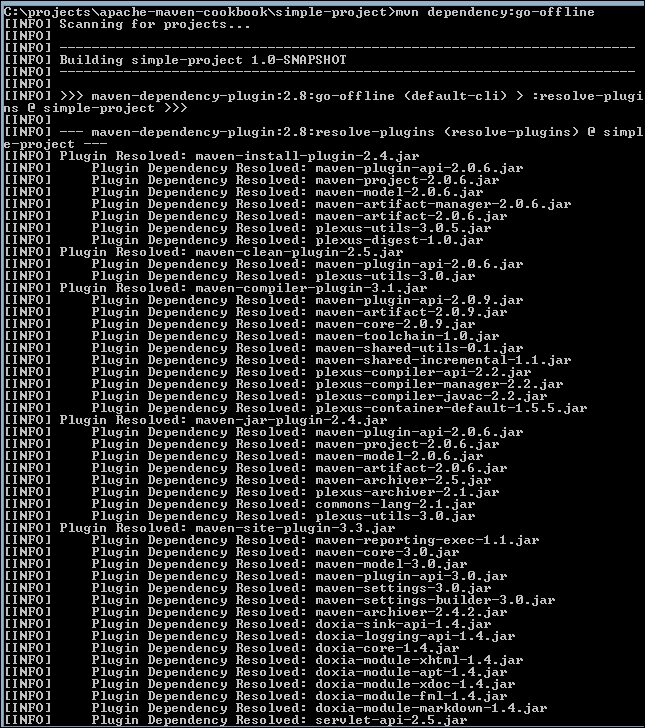

1.  运行以下命令：

    ```java
    mvn –o clean package

    ```

注意到构建在没有网络连接的情况下成功完成。

## 它是如何工作的...

Maven Dependency 插件的 `go-offline` 目标根据 pom 文件下载项目所需的所有依赖和插件。`–o` 选项告诉 Maven 离线工作，不检查互联网上的任何内容。

然而，它并非没有问题。在一个全新的本地仓库中，`offline` 选项将无法使用，并出现以下错误：

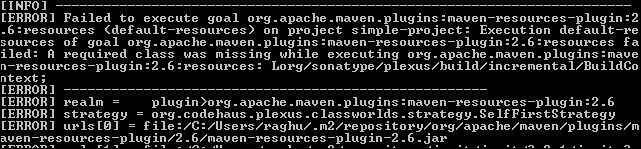

这是 Maven Dependency 插件已知的问题或限制。必须在线构建所需的项目一次，以下载插件遗漏的任何内容。随后，项目可以离线构建。这通常不是必需的，因为大多数组织如果不允许直接访问互联网，会使用 Nexus 或 Artifactory 等仓库管理器。

### 小贴士

如果您的项目使用 `SNAPSHOT` 依赖项，那么 Maven 需要互联网来查找依赖项的更新。为了避免这种情况，您可以设置 `updatePolicy` 为 `never`，但这将是适得其反的，因为您将无法获得依赖项的最新版本。

## 还有更多...

运行 Maven 的另一种离线模式是在 `settings` 文件中将 `offline` 参数指定为 `true`。一旦这样做，Maven 就不会尝试连接到互联网。

1.  在设置文件中添加以下内容：

    ```java
    <offline>true</offline>
    ```

1.  运行 Maven 构建：

    ```java
    mvn clean package

    ```

观察到构建成功完成，而没有连接到互联网。

# 控制 Maven 输出的详细程度

有时，Maven 的输出可能过于详细，我们可能只想看到错误。在其他时候，Maven 显示的信息可能不足，我们希望看到更多细节。让我们看看我们如何控制这一点。

## 如何操作...

1.  打开一个 Maven 项目。

1.  运行以下命令：

    ```java
     mvn –q clean package 

    ```

1.  观察输出：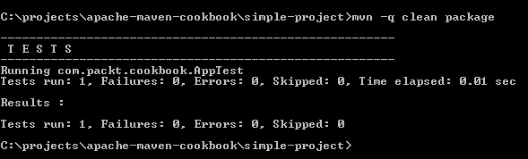

1.  现在运行以下命令：

    ```java
     mvn –X clean package 

    ```

1.  观察输出：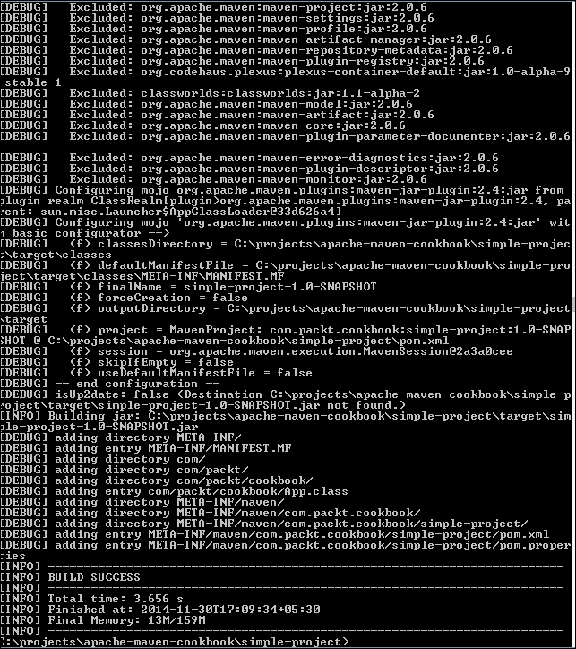

## 它是如何工作的...

Maven 提供了不同级别的日志记录。典型的级别是 `DEBUG`（详细消息）、`INFO`（信息消息）和 `ERROR`（错误消息）。指定一个级别将显示该级别及以上的所有消息。例如，指定 `INFO` 级别将显示 `INFO` 和 `ERROR` 级别的消息。

默认情况下，Maven 将所有 `INFO` 级别的消息记录到屏幕上。

`-q` 参数告诉 Maven 保持安静，不在屏幕上显示除 `ERROR` 级别消息之外的内容。因此，唯一显示的是测试输出。

另一方面，`-X` 参数告诉 Maven 显示所有 `DEBUG` 级别及以上的消息。这提供了大量信息，对于故障排除非常有用。

## 还有更多...

您可以将 Maven 输出重定向到文件以供稍后查看，而不是在屏幕上查看 Maven 输出。为此，运行以下命令：

```java
 mvn –l simple-project-log.txt clean package

```

命令将在屏幕上无输出完成。`simple-project-log.txt`文件将包含所有日志消息。您可以使用`-l`与`-q`或`-X`结合，将适当的日志级别重定向到文件。

或者，可以将输出重定向到文件中：

```java
mvn clean package > simple-project-log.txt

```

# 使用 Maven 帮助插件

Maven 提供了一个`-h`命令行标志来显示它支持的各个命令行参数。然而，还有一个帮助插件可以帮助您获取其他信息。

## 如何操作...

1.  打开简单的 Maven 项目。

1.  执行以下命令：

    ```java
     mvn help:effective-pom 

    ```

1.  观察输出结果：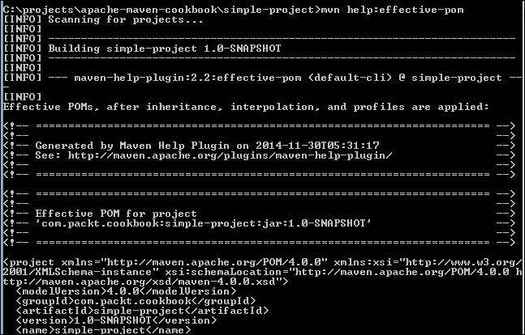

1.  在具有配置文件的项目（例如，`project-with-profile`）上运行以下命令：

    ```java
    mvn help:all-profiles

    ```

1.  观察输出结果：

    ```java
    [INFO] --- maven-help-plugin:2.2:all-profiles (default-cli) @ project-with-profile ---
    [INFO] Listing Profiles for Project: com.packt.cookbook:project-with-profile:jar
    :1.0-SNAPSHOT
     Profile Id: dev (Active: false , Source: pom)

    ```

1.  执行以下命令：

    ```java
    mvn –help:active-profiles

    ```

1.  观察输出结果：

    ```java
    Active Profiles for Project 'com.packt.cookbook:project-with-profile:jar:1.0-SNAPSHOT':

    The following profiles are active:

    ```

1.  现在执行以下命令：

    ```java
    mvn –Pdev help:active-profiles

    ```

1.  观察输出结果：

    ```java
    Active Profiles for Project 'com.packt.cookbook:project-with-profile:jar:1.0-SNAPSHOT':

    The following profiles are active:

     - dev (source: com.packt.cookbook:project-with-profile:1.0-SNAPSHOT)

    ```

## 以下是工作原理...

Maven 帮助插件提供不同的目标。这些也由 IDE 支持，如下所示：

+   `effective-pom`：这显示了在应用继承、插值和配置文件后，Maven 将使用的 pom 文件。当需要用于故障排除时，了解最终的 pom 文件是有用的。

+   `all-profiles`：此目标显示项目可用的所有配置文件。它指示配置文件是否处于活动状态。

+   `active-profiles`：此目标显示活动配置文件的列表。我们明确启用了`dev`配置文件（默认情况下不是活动的），因此它出现在活动配置文件列表中。

## 还有更多...

Maven 帮助插件还提供了一些其他目标。其中一个值得注意的是`describe`目标，它用于获取任何插件的详细信息。

1.  为了理解这一点，让我们使用一个实例并运行以下命令：

    ```java
    mvn help:describe -DgroupId=org.jacoco -DartifactId=jacoco-maven-plugin -Ddetail=true

    ```

1.  观察结果：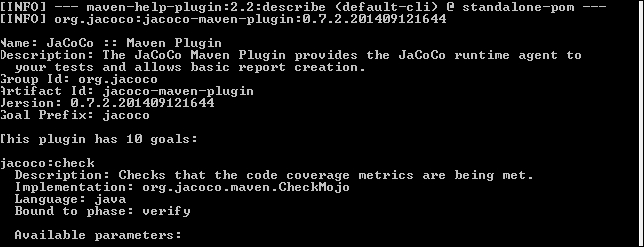

### 小贴士

`describe`目标不需要您有一个 Maven 项目。您只是为特定插件获取一些帮助信息！

# 使用 Maven SCM 插件

Maven 提供了一种以供应商无关的方式与 SCM 系统交互的机制。通常，Maven 项目被检查到 SCM 中。使用 Maven SCM 插件，您可以执行许多与 SCM 相关的活动。

## 准备工作

我们想要使用插件进行操作的 Maven 项目应该在 SCM 中。Maven 支持许多 SCM 提供商。我们将使用 Git 来演示这一点。

## 如何操作...

1.  将以下代码添加到您的 pom 文件中：

    ```java
      <scm>
            <connection>scm:git:https://bitbucket.org/maruhgar/apache-maven-cookbook</connection>
         <developerConnection>scm:git:https://maruhgar@bitbucket.org/maruhgar/apache-maven-cookbook</developerConnection>
            <url>https://bitbucket.org/maruhgar/apache-maven-cookbook</url>
        </scm>
    ```

1.  执行以下命令：

    ```java
    mvn scm:status

    ```

1.  在 Windows 中观察输出结果：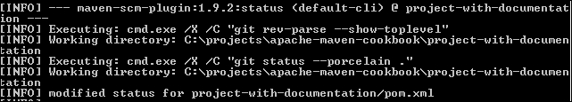

1.  对于 Linux，输出结果如下：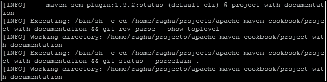

## 以下是工作原理...

当运行 Maven SCM 插件的`status`目标时，它会使用`pom`文件中`scm`标签中的信息来获取 SCM 详细信息。它使用这些信息并调用相应的`scm`命令来获取状态信息。在上面的示例中，它是`git status`。

### 小贴士

相关 SCM 客户端的命令行版本必须安装并可在 Maven 路径中可用，以便此操作生效。

`scm` 标签中有三个条目：

+   `connection`：这是访问仓库的连接信息。这通常以下列形式存在：

    ```java
    <service name>:<scm implementation>:<repository url>
    ```

    +   `service name`：这将是一个版本控制系统。

    +   `scm implementation`：这将是一个受支持的版本控制系统。

    +   `repository url`：这将是一个仓库的 URL。

+   `developerConnection`：这与任何连接类似，但可能需要认证或具有额外的权限。通常，`connection` 访问会是只读的，而 `developerConnection` 访问会是读写。

+   `url`：这是仓库的 URL。

你也会注意到根据操作系统使用适当的 shell 命令，在 Windows 的情况下是 `cmd.exe`，而在 Linux 的情况下是 `sh`。

## 更多...

Maven SCM 插件提供了许多其他命令，用于执行各种版本控制操作，例如 `add`、`remove`、`checkin`、`checkout`、`update`、`diff`、`branch` 和 `tag`。

Bootstrap 是一个有趣的选项，可以用来检出并构建一个项目：

1.  创建一个新的 Maven 项目（或打开 `bootstrap-project` 文件）。

1.  在 `scm` 部分添加一个有效的 Maven 项目：

    ```java
    <scm>
        <connection>scm:git:https://github.com/maruhgar/mvn-examples</connection>
        <url>https://github.com/maruhgar/mvn-examples</url>
      </scm>
    ```

1.  在 `build` 部分添加以下条目：

    ```java
    <build>
      <plugins>
        <plugin>
          <groupId>org.apache.maven.plugins</groupId>
          <artifactId>maven-scm-plugin</artifactId>
          <version>1.9.2</version>
          <configuration>
            <goals>install</goals>
            <goalsDirectory>test-properties</goalsDirectory>
          </configuration>
        </plugin>
      </plugins>
    </build>
    ```

1.  运行 Maven 命令：

    ```java
    mvn scm:bootstrap

    ```

1.  观察结果：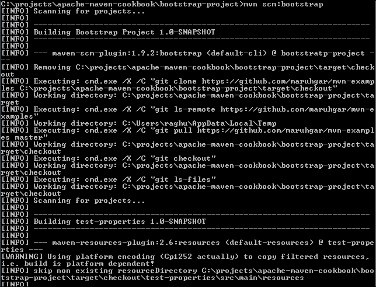

我们的 Maven 项目已经检查了另一个 Maven 项目，使用 `scm` 部分中的信息，并在该上运行指定的目标。我们指定一个 `goalsDirectory` 元素，因为版本控制系统中包含多个项目，而我们只想为特定的项目执行目标，在这个例子中是 `test-properties`。

# 为网站生成变更日志。

现在我们已经看到了 Maven SCM 插件的实际应用，我们可以看到如何使用这个特性来生成项目变更日志作为网站报告的一部分。

## 如何操作...

1.  打开 Maven 项目 `project-with-documentation`。

1.  在 `reporting` 部分添加以下条目：

    ```java
          <plugin>
            <groupId>org.apache.maven.plugins</groupId>
            <artifactId>maven-changelog-plugin</artifactId>
            <version>2.3</version>
          </plugin>
    ```

1.  运行以下命令：

    ```java
    mvn site

    ```

1.  观察输出：

    ```java
    [INFO] Generating "Change Log" report    --- maven-changelog-plugin:2.3
    [INFO] Generating changed sets xml to: C:\projects\apache-maven-cookbook\project-with-documentation\target\changelog.xml
    [INFO] Executing: cmd.exe /X /C "git whatchanged "--since=2014-11-06 02:45:57 +0
    000" "--until=2014-12-07 02:45:57 +0000" --date=iso -- C:\projects\apache-maven-cookbook\project-with-documentation"

    ```

1.  观察生成的报告：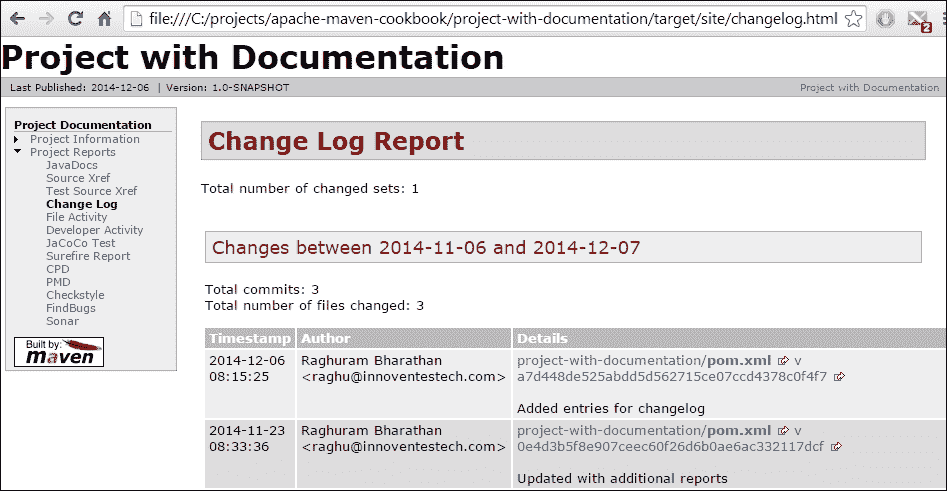

## 它是如何工作的...

当运行 `site` 命令时，Maven 使用 `pom` 文件中 `reporting` 部分的信息来生成各种报告。它找到一个 Maven Changelog 插件的条目，并生成相应的变更日志报告。

这实际上是项目的版本控制日志，包含如时间戳、作者和变更详情等信息。
