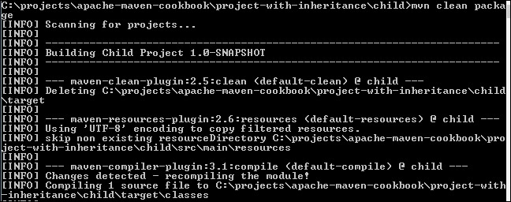
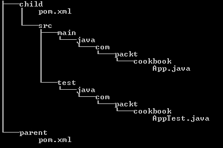
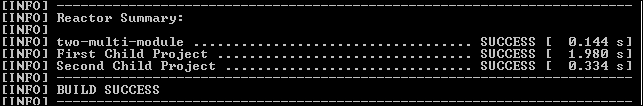
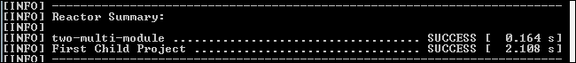
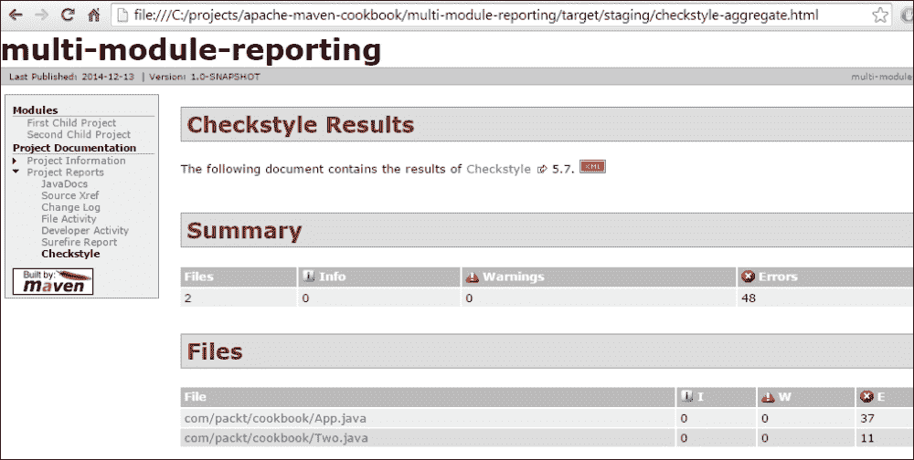
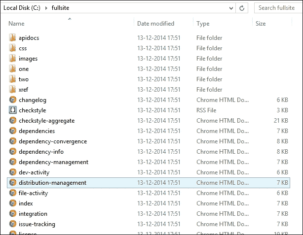

# 第九章：多模块项目

在本章中，我们将介绍以下食谱：

+   理解项目继承

+   理解项目聚合

+   结合继承和聚合

+   执行多模块依赖项管理

+   执行多模块插件管理

+   选择性构建模块

+   多模块项目的报告

# 简介

除了简单的项目外，大多数现实生活中的项目都有多个模块。每个模块都可以独立开发。一些模块可能依赖于其他模块。使用这些模块的项目希望确保它能够使用所有模块的正确版本成功构建。

当我们查看多个模块时，每个模块可能都会使用多个依赖项。为了避免依赖地狱，确保每个模块使用的依赖项版本得到良好管理非常重要。还有机会优化依赖项和插件，以减少构建脚本的重复。

# 理解项目继承

有时候，你可能希望项目使用另一个`.pom`文件中的值。你可能正在构建一个大型软件产品，因此不希望多次重复依赖项和其他元素。

Maven 为此提供了一个名为**项目继承**的功能。Maven 允许将父 POM 文件中指定的多个元素合并到继承的项目中。实际上，超级 POM 文件就是项目继承的一个例子。

## 准备工作

Maven 已在你的系统上设置并验证其工作。要这样做，请参阅第一章, *入门*。

## 如何做到这一点...

1.  打开一个具有继承关系的项目；在我们的例子中是`project-with-inheritance`。这个项目有一个名为`child`的子文件夹，它是从父项目继承的项目。

1.  按照以下方式更新父 POM 文件：

    ```java
        <groupId>com.packt.cookbook</groupId>
        <artifactId>project-with-inheritance</artifactId>
        <packaging>pom</packaging>
        <version>1.0-SNAPSHOT</version>
    ```

1.  按照以下方式为`child`创建 POM 文件：

    ```java
      <parent>
          <groupId>com.packt.cookbook</groupId>
          <artifactId>project-with-inheritance</artifactId>
          <version>1.0-SNAPSHOT</version>
      </parent>
      <modelVersion>4.0.0</modelVersion>
      <artifactId>child</artifactId>
      <packaging>jar</packaging>
      <name>Child Project</name>
    ```

1.  在`child`子文件夹中运行以下 Maven 命令：

    ```java
    mvn clean package

    ```

1.  观察输出：

## 它是如何工作的...

我们在`child`的 POM 文件中指定了一个`parent`元素。在这里，我们添加了父项目的坐标，即`groupId`、`artifactId`和`version`。我们没有指定`child`项目的`groupId`和`version`坐标。我们也没有指定任何`properties`和`dependencies`。

在父 POM 文件中，我们指定了`properties`和`dependencies`。

由于定义的关系，当 Maven 在`child`项目上运行时，它会继承父项目中定义的`groupId`、`version`、`properties`和`dependencies`。

有趣的是，父 POM 文件（`project-with-inheritance`）对存在`child`项目的事实一无所知。

然而，这仅当父项目是`pom`类型时才有效。

Maven 是如何知道父 POM 的位置的？我们没有在 POM 文件中指定位置。这是因为，默认情况下，Maven 会在`child`的父文件夹中查找父 POM。否则，它会尝试从仓库下载父 POM。

## 还有更多...

如果父 pom 文件不在任何仓库中呢？如果它在子项目的父文件夹之外的不同文件夹中呢？让我们看看会发生什么：

1.  打开一个子项目，其中父项目不在 `parent` 文件夹中，而是在一个子文件夹中（在我们的例子中，是 `parent`）：

1.  按照以下方式更新子项目的 pom 文件：

    ```java
      <parent>
          <groupId>com.packt.cookbook</groupId>
          <artifactId>parent</artifactId>
          <version>1.0-SNAPSHOT</version>
          <relativePath>../parent/pom.xml</relativePath>
     </parent> 
    ```

1.  构建子项目：

    ```java
    mvn clean package

    ```

Maven 现在通过 `relativePath` 元素确定父 pom 文件的位置，这表明了父 pom 文件所在的文件夹。使用这个信息，它成功地构建了子项目。

# 理解项目聚合

继承和聚合之间的一个关键区别在于，聚合是通过自上而下的方法定义的，而继承则是相反的方式。在 Maven 中，项目聚合类似于项目继承，只是更改是在父 pom 文件中进行的，而不是在子 pom 文件中。

Maven 使用术语 **模块** 来定义一个子项目或子项目，它是更大项目的一部分。一个聚合项目可以一起构建所有模块。此外，在父 pom 文件或聚合项目的 pom 文件上运行的 Maven 命令也将适用于它包含的所有模块。

## 如何操作...

1.  打开一个具有聚合的项目；在我们的例子中是 `project-with-aggregation`。这个项目有一个名为 `aggregate-child` 的子文件夹，它是被父项目聚合的模块。

1.  按照以下方式更新父 pom 文件：

    ```java
        <groupId>com.packt.cookbook</groupId>
        <artifactId>project-with-aggregation</artifactId>
        <packaging>pom</packaging>
        <version>1.0-SNAPSHOT</version>
    ```

1.  添加 `module` 部分，并指定子项目：

    ```java
       <modules>
          <module>aggregate-child</module>
       </module>
    ```

1.  在 `parent` 文件夹中运行以下 Maven 命令：

    ```java
    mvn clean package

    ```

1.  观察输出：

    ```java
    C:\projects\apache-maven-cookbook\project-with-aggregation>mvn clean package
    [INFO] Scanning for projects...
    [INFO] ------------------------------------------------------------------------
    [INFO] Reactor Build Order:
    [INFO]
    [INFO] Aggregate child Project
    [INFO] project-with-aggregation
    …
    [INFO] ------------------------------------------------------------------------
    [INFO] Reactor Summary:
    [INFO]
    [INFO] Child Project ...................................... SUCCESS [  2.866 s]
    [INFO] project-with-aggregation ........................... SUCCESS [  0.004 s]
    [INFO] ------------------------------------------------------------------------
    [INFO] BUILD SUCCESS
    [INFO] ------------------------------------------------------------------------

    ```

## 它是如何工作的...

我们在聚合 pom 文件中将 `child` 项目指定为模块。子项目是一个正常的 Maven 项目，它没有关于存在聚合 pom 文件的信息。

当聚合项目构建时，它会依次构建子项目。你会在 Maven 输出中注意到 `Reactor` 这个词。Reactor 是 Maven 的一部分，它允许在一系列模块上执行目标。虽然模块是离散的工作单元；但可以使用 reactor 将它们聚集在一起同时构建。Reactor 根据每个模块声明的依赖关系确定正确的构建顺序。

## 还有更多...

就像继承的情况一样，模块不是聚合项目的子文件夹，而是一个同级文件夹。

1.  按照以下方式更新 `module` 部分：

    ```java
      <modules>
          <module>../aggregate-child</module>
       </module>

    ```

1.  构建聚合项目：

    ```java
    mvn clean package

    ```

Maven 现在通过指定的路径确定模块的位置，这表明了父 pom 文件所在的文件夹。按照惯例，模块名称应与文件夹名称相同。

# 结合继承和聚合

通过使用 Maven 的项目继承功能，我们可以在所有子项目中共享公共构建属性，如 `properties` 和 `dependencies`。我们还可以聚合模块并将它们一起构建。

当使用项目继承时，父项目不会意识到子项目。在项目聚合的情况下，每个模块都不会意识到聚合。

我们现在将看到如何结合两者并获取其好处。

## 如何操作...

1.  打开一个多模块项目；在我们的例子中，`simple-multi-module`。这个项目有一个子文件夹`child`，它是被父项目聚合的模块。

1.  按照以下方式更新父 pom：

    ```java
        <groupId>com.packt.cookbook</groupId>
        <artifactId>simple-multi-module</artifactId>
        <packaging>pom</packaging>
        <version>1.0-SNAPSHOT</version>
    ```

1.  添加`module`部分并指定子项目：

    ```java
       <modules>
          <module>child</module>
    ```

1.  更新子 pom 以指定`parent`元素：

    ```java
        <parent>
          <groupId>com.packt.cookbook</groupId>
          <artifactId>simple-multi-module</artifactId>
          <version>1.0-SNAPSHOT</version>
         </parent>
    ```

1.  在父文件夹中运行以下 Maven 命令：

    ```java
    mvn clean package

    ```

1.  观察输出：

    ```java
    [INFO] Reactor Summary:
    [INFO]
    [INFO] simple-multi-module ................................ SUCCESS [  0.162 s]
    [INFO] Child Project ...................................... SUCCESS [  2.411 s]

    ```

## 它是如何工作的...

我们在`child` pom 中指定了`parent`元素，以指明父项目是谁。我们还在父 pom 中将`child`项目指定为一个模块。因此，这两种关系——继承和聚合——都被定义了。

当我们构建父项目时，它通过`modules`元素自动构建子项目。同时，子项目也可以独立构建。

## 还有更多...

子项目不一定是父项目的子文件夹。如果它在其他地方，就像我们在前面的菜谱中看到的那样，它可以如下所示：

+   `relativePath`：父元素的`relativePath`应指向父元素的正确位置

+   `module`：`module`元素应包含指向子项目的适当路径

# 执行多模块依赖项管理

依赖项管理是一种集中化依赖项信息的机制。当有一组项目（或模块）继承一个共同的父项目时，所有关于依赖项的信息都可以放在父 pom 中，项目可以对这些依赖项进行更简单的引用。这使得在多个项目之间维护依赖项变得容易，并减少了由于同一依赖项的多个版本而通常出现的问题。

## 如何操作...

1.  打开一个多模块项目（`simple-multi-module`）。

1.  在`dependencyManagement`部分添加对`junit`的依赖项：

    ```java
    <dependencyManagement>
        <dependencies>
          <dependency>
            <groupId>junit</groupId>
            <artifactId>junit</artifactId>
            <version>3.8.1</version>
            <scope>test</scope>
          </dependency>
        </dependencies>
    </dependencyManagement>
    ```

1.  按照以下方式更新子项目的`dependencies`部分：

    ```java
    <dependencies>
         <dependency>
           <groupId>junit</groupId>
           <artifactId>junit</artifactId>
         </dependency>
    </dependencies>
    ```

1.  执行以下命令：

    ```java
    mvn clean test

    ```

    确保构建过程成功完成。

1.  运行 Maven 命令以检查依赖项：

    ```java
    mvn dependency:tree

    ```

1.  观察结果：

    ```java
    [INFO] --- maven-dependency-plugin:2.8:tree (default-cli) @ simple-multi-module
    ---
    [INFO] com.packt.cookbook:simple-multi-module:pom:1.0-SNAPSHOT
    [INFO]
    [INFO] ------------------------------------------------------------------------
    [INFO] Building Child Project 1.0-SNAPSHOT
    [INFO] ------------------------------------------------------------------------
    [INFO]
    [INFO] --- maven-dependency-plugin:2.8:tree (default-cli) @ child ---
    [INFO] com.packt.cookbook:child:jar:1.0-SNAPSHOT
    [INFO] \- junit:junit:jar:3.8.1:test

    ```

## 它是如何工作的...

在父 pom 的`dependencyManagement`部分指定的依赖项对所有子项目都是可用的。子项目需要通过在`dependencies`部分显式指定所需的依赖项来选择依赖项。在此过程中，子项目可以省略`version`和`scope`信息，以便从父项目继承。

你可能会问：“为什么还要有`dependencyManagement`部分，子项目已经继承了父 pom 中定义的依赖项？”原因在于，父项目集中管理多个项目的依赖项。子项目通常只需要父项目定义的一些依赖项，而不是全部。`dependencyManagement`部分允许子项目有选择性地选择这些依赖项。

## 还有更多...

`dependencyManagement`部分也有助于解决 Maven 依赖调解的任何意外。依赖调解是确定在遇到多个版本的工件时将使用哪个版本的过程。然而，`dependencyManagement`优先于依赖调解，并确保依赖调解不会选择`dependencyManagement`中指定的版本之外的版本。

应该注意的是，不同版本的依赖项容易出错，`dependencyManagement`并不能总是避免库版本不兼容的问题。

# 执行多模块插件管理

在多模块项目中，`pluginManagement`允许你配置子项目所需使用的插件信息。父 pom 可以定义不同子项目使用的各种插件的配置。每个子项目可以选择它构建所需的插件。

## 如何操作...

1.  打开一个多模块项目（`simple-multi-module`）。

1.  在父 pom 的`pluginManagement`部分添加 Maven 构建辅助插件的配置，以复制额外的资源：

    ```java
       <pluginManagement>
         <plugins>
          <plugin>
            <groupId>org.codehaus.mojo</groupId>
            <artifactId>build-helper-maven-plugin</artifactId>
            <version>1.9.1</version>
            <executions>
              <execution>
                <id>add-resource</id>
                <phase>generate-resources</phase>
                <goals>
                  <goal>add-resource</goal>
                </goals>
                <configuration>
                  <resources>
                    <resource>
                      <directory>src/resources/xml</directory>
                      <targetPath>xml</targetPath>
                    </resource>
                    <resource>
                      <directory>src/resources/json</directory>
                      <targetPath>json</targetPath>
                        <includes>
                          <include>include.json</include>
                        </includes>
                        <excludes>
                          <exclude>exclude.json</exclude>
                        </excludes>
                    </resource>
                  </resources>
                </configuration>
              </execution>
            </executions>
          </plugin>
         </plugins>
        </pluginManagement>
      </build>
    ```

1.  运行以下命令来构建项目：

    ```java
     mvn clean test 

    ```

    注意，额外的资源没有被复制到子项目中。

1.  现在，在子项目中使用相应的插件：

    ```java
        <build>
           <plugins>
               <plugin>
                   <groupId>org.codehaus.mojo</groupId>
                   <artifactId>build-helper-maven-plugin</artifactId>
               </plugin>
           </plugins>
       </build>
    ```

1.  再次构建项目。

1.  观察输出：

    ```java
    [INFO] Copying 2 resources to xml
    [INFO] Copying 1 resource to json

    ```

## 它是如何工作的...

我们在父 pom 的`pluginManagement`部分定义了 Maven 构建辅助插件，用于从额外的文件夹中复制资源。直到子项目使用该插件之前，它对子 pom 不可用。当子项目没有定义插件时，父 pom 中的插件定义没有效果。当子项目定义了插件时，它生效，并且额外的资源被复制过来。

## 还有更多...

如果插件是构建生命周期的一部分，那么即使在子项目中没有明确定义，`pluginManagement`部分的配置也会生效。让我们看看这是如何发生的：

1.  在父 pom 的`pluginManagement`中定义 Maven 编译插件：

    ```java
      <pluginManagement>
          <plugins>
            <plugin>
                <groupId>org.apache.maven.plugins</groupId>
                <artifactId>maven-compiler-plugin</artifactId>
                <version>3.2</version>
                <configuration>
                  <source>1.8</source>
                  <target>1.8</target>
                </configuration>
            </plugin>
          <plugin>
    </pluginManagement>
    ```

1.  不将插件添加到子 pom 中，使用 Java 7 运行以下命令：

    ```java
    mvn clean test

    ```

1.  观察错误：

    ```java
    [ERROR] Failed to execute goal org.apache.maven.plugins:maven-compiler-plugin:3.
    2:compile (default-compile) on project child: Fatal error compiling: invalid tar
    get release: 1.8 -> [Help 1]

    ```

这里发生了什么？尽管子 pom 没有定义 Maven Compiler 插件，但由于`compile`目标属于构建生命周期的一部分，父 pom 中`pluginManagement`部分的 Maven Compiler 插件配置仍然生效。由于配置指定了 Java 8 目标，编译失败。

如果我们不想继承特定的插件配置怎么办？Maven 提供了一种方法来实现这一点。让我们看看如何：

1.  更新前面的 Maven 编译器插件配置如下：

    ```java
      <pluginManagement>
          <plugins>
            <plugin>
                <groupId>org.apache.maven.plugins</groupId>
                <artifactId>maven-compiler-plugin</artifactId>
                <version>3.2</version>
                <inherited>false</inherited>
                <configuration>
                  <source>1.8</source>
                  <target>1.8</target>
                </configuration>
            </plugin>
          <plugin>
    </pluginManagement>
    ```

1.  现在用 Java 7 运行以下命令：

    ```java
    mvn clean package

    ```

1.  注意，项目编译时没有错误，尽管插件配置指定了 Java 8。

这是因为配置没有被继承到子模块中，因为我们把`inherited`元素设置为`false`。

# 选择性地构建模块

当一个项目有多个模块时，可能会有一些情况，我们可能想要选择性地构建模块。这种情况之一可能是模块可能只在特定的机器上运行。另一个原因可能是模块可能有长时间运行的测试，这些测试可能只在测试服务器上有意义。

让我们看看如何通过使用 Maven 的**配置文件**功能来选择性地构建模块。

## 如何操作...

1.  打开一个包含两个模块（`two-multi-module`）的多模块项目，即`common-one`和`dev-two`。

1.  在父 POM 中，将一个项目添加到`modules`部分：

    ```java
      <modules>
          <module>common-one</module>
      </modules>
    ```

1.  定义一个配置文件并包含两个模块：

    ```java
    <profiles>
          <profile>
              <id>dev</id>
              <modules>
                  <module>common-one</module>
                  <module>dev-two</module>
              </modules>
          </profile>
      </profiles>
    ```

1.  运行带有`dev`配置文件的 Maven 命令构建：

    ```java
    mvn –P dev clean test

    ```

1.  观察结果：

1.  运行 Maven 命令构建不带配置文件：

    ```java
    mvn clean test

    ```

1.  观察结果：

## 它是如何工作的...

当你有多个模块，并且想要控制特定模块的构建时机时，最简单的方法是为它们定义特定的配置文件，并在每个配置文件中定义模块。在我们的例子中，我们创建了一个`dev`配置文件来构建两个模块，`common-one`和`dev-two`。默认的 Maven 构建过程只构建`common-one`模块。

我们实现的是根据需要排除或跳过特定模块的构建。正如你所见，配置文件只能扩展模块列表，因此它实际上不能实现黑名单功能。

### 小贴士

同样，我们可以在配置文件中定义`pluginManagement`和`dependencyManagement`，这样它们只对配置文件生效。

## 还有更多...

Maven 还提供了命令行选项来选择性地构建模块。以下是一些示例，基于`two-multi-module` Maven 项目：

+   `-pl –projects`：这是一个以逗号分隔的项目列表，用于指定要构建的项目。以下是一个示例：

    ```java
    mvn clean package –pl common-one

    ```

+   `–am`：这代表`--also-make`。如果指定了项目列表，这将构建列表中所需的项目：

    ```java
    mvn clean package –pl common-one –am 

    ```

+   `–amd`：这代表`--also-make-dependants`。这会构建依赖于列表中项目的项目（如果指定了项目列表）：

    ```java
    mvn clean package –pl common-one –amd

    ```

+   `-rf`：这代表`–resume-from`。这可以从特定的项目恢复构建（在多模块构建失败的情况下很有用）：

    ```java
    mvn –Pdev clean package –rf dev-two 

    ```

# 多模块项目的报告

当我们谈论为多模块项目生成站点报告时，我们指的是为项目的每个模块和父项目生成此报告。在多模块项目的站点报告的情况下，需要考虑几个因素。第一个是要测试父模块和模块之间的链接是否正确工作。另一个是要检查是否可以将某些站点报告聚合，而不是为每个模块单独报告。

## 如何操作...

1.  打开一个包含两个模块的多模块项目（`two-multi-module`），一个和两个。

1.  将以下命令添加到父 pom 的`reporting`部分中的`checkstyle`：

    ```java
        <plugin>
            <groupId>org.apache.maven.plugins</groupId>
            <artifactId>maven-checkstyle-plugin</artifactId>
            <version>2.13</version>
            <reportSets>
              <reportSet>
                <id>aggregate</id>
                <inherited>false</inherited>
                <reports>
                  <report>checkstyle-aggregate</report>
                </reports>
              </reportSet>
            </reportSets>
          </plugin>
    ```

1.  运行以下命令生成站点报告：

    ```java
    mvn test site

    ```

1.  点击站点报告中**Checkstyle**链接：

## 工作原理...

当为多模块项目运行`site`目标时，它除了生成父模块的站点报告外，还为所有模块生成站点报告。所有报告都是为每个模块单独生成的。然而，像 Checkstyle 这样的插件提供了一个选项，可以在项目的所有模块之间生成聚合报告。这使我们能够获得项目所有模块的 Checkstyle 违规的统一视图。

### 小贴士

其他报告插件，如 FindBugs、PMD 和 Cobertura 支持多模块报告。然而，并非所有这些插件都支持报告的聚合。允许聚合报告的其他报告插件包括 Javadocs 和 JXR。

## 更多内容...

尽管为多模块项目生成的站点报告包含了指向每个子模块的链接，但这些链接将无法正确工作，因为每个模块报告都在相应模块的`target/site`文件夹中。

让我们看看我们如何验证报告中的模块是否正确链接：

1.  在父 pom 中添加`distributionManagement`部分：

    ```java
    <distributionManagement>
        <site>
          <id>packt</id>
          <url>file:///C:/fullsite</url>
        </site>
      </distributionManagement>
    ```

1.  运行以下命令生成站点报告：

    ```java
    mvn test site

    ```

1.  运行以下命令来准备站点：

    ```java
    mvn site:stage –DstagingDirectory=C:/fullsite

    ```

1.  打开文件夹：

你会注意到，这两个模块的站点数据现在都是项目站点文件夹的子文件夹。打开`fullsite`的索引页面，我们可以导航到每个模块站点并确保链接正常工作：


