# 第三章：创建和导入项目

让我们继续我们的旅程。在本章中，我们将从 Maven 项目结构开始，然后是构建架构，接着我们将介绍一些基本概念，最后学习如何创建简单的 Maven 项目。本章分为以下部分：

+   Maven 项目的结构

+   **POM（项目对象模型）**

    +   Maven 坐标

    +   POM 关系

    +   简单 POM

    +   超级 POM

+   Maven 项目的构建架构

+   其他基本概念

    +   仓库

    +   项目依赖

    +   插件和目标

    +   站点生成和报告

+   创建 Maven 项目

    +   使用原型

    +   不使用原型

    +   检出 Maven 项目

+   导入 Maven 项目

# Maven 项目的结构

如前几章所述，Maven 遵循约定优于配置。这使得我们相信 Maven 项目结构有一个标准布局。在我们开始创建和操作 Maven 项目之前，让我们首先了解 Maven 项目的基本通用布局，如下所示：

| 文件夹/文件 | 描述 |
| --- | --- |
| `src/main/java` | 这包含应用程序的 Java 源文件 |
| `src/main/resources` | 这包含应用程序的资源文件，如图像、声音、模板等 |
| `src/main/filters` | 这包含资源的过滤器文件 |
| `src/main/config` | 这包含应用程序的配置文件 |
| `src/main/scripts` | 这包含特定于应用程序的脚本文件 |
| `src/main/webapp` | 这包含 Web 应用程序的源文件 |
| `src/test/java` | 这包含 Java 的单元测试文件 |
| `src/test/resources` | 这包含在应用程序中使用的针对单元测试的特定资源 |
| `src/filters` | 这包含针对资源的测试特定过滤器文件 |
| `src/it` | 这包含集成测试文件（主要用于插件） |
| `src/assembly` | 这包含汇编描述符的文件 |
| `src/site` | 这包含站点工件 |
| `LICENSE.txt` | 这表示项目的许可证 |
| `NOTICE.txt` | 这包括项目依赖的通知和归属 |
| `README.txt` | 这表示项目的 readme 信息 |
| `target` | 这包含构建的所有输出 |
| `pom.xml` | 这是项目的`pom`文件（将在后续章节中详细讨论） |

尽管之前提到的布局是标准推荐约定，但在项目描述符文件（`pom`文件）中这总可以被覆盖。

# POM（项目对象模型）

**POM**代表**项目对象模型**。它主要是文件名为`pom.xml`的项目 XML 表示。POM 是 Maven 项目的身份，没有它，项目就没有存在。它与**Make**文件或**Ant**的`build.xml`文件类似。

在广义上，一个项目应该包含不仅仅是代码文件，而应该作为一个一站式商店，提供所有与之相关的事物。Maven 使用 `pom` 文件来满足这一需求。POM 通常回答如下问题：源代码在哪里？资源在哪里？如何进行打包？单元测试在哪里？组件在哪里？构建环境是什么样的？项目的参与者是谁？等等。

简而言之，POM 的内容属于以下四个类别：

+   **项目信息**：这提供了关于项目的通用信息，例如项目名称、URL、组织、开发者列表和贡献者、许可证等。

+   **POM 关系**：在罕见的情况下，一个项目可以是一个单一实体，不依赖于其他项目。本节提供了关于其依赖项、从父项目继承的信息，以及其子模块等。

+   **构建设置**：这些设置提供了关于 Maven 构建配置的信息。通常，行为定制，如源代码位置、测试、报告生成、构建插件等，都是在这里完成的。

+   **构建环境**：这指定并激活了不同环境的构建设置。它还使用配置文件来区分开发、测试和生产环境。

如下所示，一个包含所有讨论类别的 POM 文件：

```java
<project>
  <!-- The Basics Project Information-->
  <groupId>...</groupId>
  <artifactId>...</artifactId>
  <version>...</version>
  <packaging>...</packaging>
  <dependencies>...</dependencies>
  <parent>...</parent>
  <dependencyManagement>...</dependencyManagement>
  <modules>...</modules>
  <properties>...</properties>

  <!-- Build Settings -->
  <build>...</build>
  <reporting>...</reporting>
  <properties>...</properties>
  <packaging>...</packaging>

  <!-- More Project Information -->
  <name>...</name>
  <description>...</description>
  <url>...</url>
  <inceptionYear>...</inceptionYear>
  <licenses>...</licenses>
  <organization>...</organization>
  <developers>...</developers>
  <contributors>...</contributors>

   <!-- POM Relationships -->
  <groupId>...</groupId>
  <artifactId>...</artifactId>
  <version>...</version>
  <parent>...</parent>

  <dependencyManagement>...</dependencyManagement>
  <dependencies>...</dependencies>

  <modules>...</modules>

<!-- Environment Settings -->
  <issueManagement>...</issueManagement>
  <ciManagement>...</ciManagement>
  <mailingLists>...</mailingLists>
  <scm>...</scm>
  <prerequisites>...</prerequisites>
  <repositories>...</repositories>
  <pluginRepositories>...</pluginRepositories>
  <distributionManagement>...</distributionManagement>
  <profiles>...</profiles>
</project>
```

## Maven 坐标

Maven 坐标定义了一组标识符，这些标识符可以用来在 Maven POM 中唯一地识别一个项目、一个依赖项或一个插件。类似于代数中一个点通过其在空间中的坐标来识别，Maven 坐标在存储库中标记了一个特定的位置，充当 Maven 项目的坐标系。Maven 坐标的组成部分如下：

+   **groupId**：这代表一个组、公司、团队、组织或项目。组 ID 的一般约定是该项目的创建组织的反向域名开头。然而，它可能不一定使用与 `junit` 项目中相同的点表示法。组构成了在存储库中存储的基础，并且与在操作系统中的 Java 打包结构非常相似。相应的点被替换为操作系统特定的目录分隔符（例如 Unix 中的 `/`），从而形成了从基本存储库的相对目录结构。例如，如果 `groupId` 是 `com.packt.mvneclipse`，它位于 `$M2_REPO/com/packt/mvneclipse` 目录中。

+   **artifactId**：这是 `groupId` 下的一个唯一标识符，代表一个单一项目/已知的项目。与 `groupId` 坐标一起，`artifactId` 坐标完全定义了在存储库中该组件的居住地。例如，继续前面的例子，具有 `hello-project` 的组件 ID 位于 `$M2_REPO/com/packt/mvneclipse/hello-project` 路径。

+   **项目版本**：这表示项目的特定版本。它还在工件仓库中使用，以区分不同的版本。例如，版本为 1.0 的 `hello-project` 存在于 `$M2_REPO/com/packt/mvneclipse/hello-project/1.0/` 目录中。

+   **打包**：这描述了由项目生成的打包输出。如果没有声明打包，Maven 假设工件是默认的 `jar` 文件。Maven 中可用的核心打包值包括：`pom`、`jar`、`maven-plugin`、`ejb`、`war`、`ear`、`rar` 和 `par`。以下图示展示了 Maven 坐标的示例：

### 注意

作为本地仓库，`$M2_REPO` 表示用户机器上的 `%USER_HOME% /.m2` 目录。

## POM 关系

POM 关系标识了它们与其他模块、项目和其它 POM 之间的关系。这种关系可以是依赖关系、多模块项目、父子关系（也称为继承）和聚合。POM 关系的元素如图所示：


类似地，XML 文件中 POM 关系的元素可以指定如下所示代码：

```java
    <!-- POM Relationships -->
  <groupId>...</groupId>
  <artifactId>...</artifactId>
  <version>...</version>
  <parent>...</parent>
  <dependencyManagement>...</dependencyManagement>
  <dependencies>...</dependencies>
  <modules>...</modules>
```

## 一个简单的 POM

最基本的 POM 只包含 Maven 坐标，足以构建和生成项目的 `jar` 文件。一个简单的 POM 文件可能如下所示代码：

```java
<project 

  xsi:schemaLocation="http://maven.apache.org/POM/4.0.0
  http://maven.apache.org/xsd/maven-4.0.0.xsd">
  <modelVersion>4.0.0</modelVersion>

  <groupId>com.packt.mvneclipse</groupId>
  <artifactId>hello-project</artifactId>
  <version>1.0</version>

</project>
```

以下要点将解释这些元素：

+   `modelVersion` 值为 `4.0.0`。Maven 支持此版本的 POM 模型。

+   每个项目都有一个 POM 文件。

+   所有 POM 文件都需要 `project` 元素和三个强制字段：`groupId`、`artifactId` 和 `version`。

+   `pom.xml` 的根元素是 `project`，它有三个主要子节点。

在现实世界的项目中，一个简单的 POM（如前代码片段所示）几乎是不够的。

## 一个超级 POM

类似于 Java，其中每个对象都继承自 `java.lang.Object`，每个 POM 都继承自一个称为 **Super POM** 的基本 POM。隐式地，每个 POM 都从基本 POM 继承默认值。这简化了开发者在 `pom.xml` 文件中的最小配置工作。然而，当它们在项目的相应 `pom` 文件中指定时，可以轻松地覆盖默认值。可以通过在相应项目内部运行以下命令来获取超级 POM 的默认配置：

```java
mvn help:effective-pom

```

超级 POM 是 Maven 安装的一部分，可以在 `$M2_HOME/lib` 下的 `maven-x.y.z-uber.jar` 或 `maven-model-builder-x.y.z.jar` 文件中找到，其中 `x.y.z` 表示版本。在相应的 JAR 文件中，`org.apache.maven.model` 包下有一个名为 `pom-4.0.0.xml` 的文件。


在示例项目中继承的超级 POM 的默认配置如下；为了简洁起见，仅展示了某些重要方面：

```java
<!--General project Information -->
 <modelVersion>4.0.0</modelVersion>
 <groupId>com.packt.mvneclipse</groupId>
 <artifactId>hello-project</artifactId>
 <version>0.0.1-SNAPSHOT</version>
 <name>hello-project</name>
 <url>http://maven.apache.org</url>
 <properties>1
 <project.build.sourceEncoding>UTF8</project.build.sourceEncoding>
</properties>

<repositories>
  <repository>
    <snapshots>
      <enabled>false</enabled>
    </snapshots>
    <id>central</id>
    <name>Maven Repository Switchboard</name>
    <url>http://repo1.maven.org/maven2</url>
  </repository>
</repositories>
<pluginRepositories>
  <pluginRepository>
    <releases>
      <updatePolicy>never</updatePolicy>
    </releases>
    <snapshots>
      <enabled>false</enabled>
    </snapshots>
    <id>central</id>
    <name>Maven Plugin Repository</name>
    <url>http://repo1.maven.org/maven2</url>
  </pluginRepository>
</pluginRepositories>

<!-- Build source directory and details>
  <build>
…
  <sourceDirectory> ...</sourceDirectory>
  <scriptSourceDirectory>..</scriptSourceDirectory>
  <testOutputDirectory>..</testOutputDirectory>
  <outputDirectory>...<outputDirectory>
…

<finalName>hello-project-0.0.1-SNAPSHOT</finalName>
  <pluginManagement>
    <plugins>
      <plugin>
        <artifactId>maven-antrun-plugin</artifactId>
        <version>1.3</version>
      </plugin>
      <plugin>
        <artifactId>maven-assembly-plugin</artifactId>
        <version>2.2-beta-5</version>
      </plugin>
        <plugin>
          <artifactId>maven-dependency-plugin</artifactId>
          <version>2.1</version>
        </plugin>
        <plugin>
          <artifactId>maven-release-plugin</artifactId>
          <version>2.0</version>
        </plugin>
      </plugins>
    </pluginManagement>
    <plugins>

<!-- Plugins, phases and goals -->
 <plugin>
 <artifactId>maven-clean-plugin</artifactId>
 <version>2.4.1</version>
 <executions>
 <execution>
 <id>default-clean</id>
 <phase>clean</phase>
 <goals>
 <goal>clean</goal>
 </goals>
 </execution>
 </executions>
 </plugin>
 <plugin>
 <artifactId>maven-surefire-plugin</artifactId>
 <version>2.7.2</version>
 <executions>
 <execution>
 <id>default-test</id>
 <phase>test</phase>
 <goals>
 <goal>test</goal>
 </goals>
 </execution>
 </executions>
 </plugin>
 <plugin>
 <artifactId>maven-compiler-plugin</artifactId>
 <version>2.3.2</version>
 <executions>
 <execution>
 <id>default-testCompile</id>
 <phase>test-compile</phase>
 <goals>
 <goal>testCompile</goal>
 </goals>
 </execution>
 <execution>
 <id>default-compile</id>
 <phase>compile</phase>
 <goals>
 <goal>compile</goal>
 </goals>
 </execution>
 </executions>
 </plugin>
 <plugin>
 <artifactId>maven-jar-plugin</artifactId>
 <version>2.3.1</version>
 <executions>
 <execution>
 <id>default-jar</id>
 <phase>package</phase>
 <goals>
 <goal>jar</goal>
 </goals>
 </execution>
 </executions>
 </plugin>
 <plugin>
 <artifactId>maven-deploy-plugin</artifactId>
 <version>2.5</version>
 <executions>
 <execution>
 <id>default-deploy</id>
 <phase>deploy</phase>
 <goals>
 <goal>deploy</goal>
 </goals>
 </execution>
 </executions>
 </plugin>
 <plugin>
 <artifactId>maven-site-plugin</artifactId>
 <version>2.0.1</version>
 <executions>
 <execution>
 <id>default-site</id>
 <phase>site</phase>
 <goals>
 <goal>site</goal>
 </goals>
 <configuration>
 </project>

```

# Maven 项目构建架构

以下图展示了 Maven 项目的常见构建架构。本质上，每个 Maven 项目都包含一个 POM 文件，该文件定义了项目的所有基本方面。Maven 使用 POM 的详细信息来决定不同的操作和工件生成。指定的依赖项首先在本地仓库中搜索，然后是在中央仓库中。还有一个概念，如果 POM 中指定了远程仓库，则会搜索远程仓库。我们将在下一节中讨论仓库。此外，POM 定义了在生成站点时要包含的详细信息。

看看以下图：

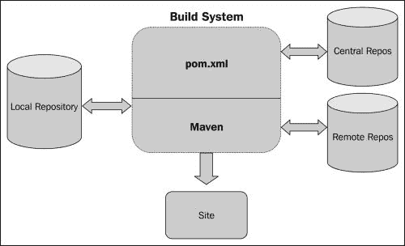

# 其他基本概念

Maven 的其他基本概念将在以下章节中讨论。

## 仓库

Maven 仓库是可访问的位置，用于存储 Maven 构建产生的工件。更准确地说，仓库是一个用于存储项目工件的位置，它被设计成与 Maven 坐标匹配。

Maven 仓库可以是以下类型之一：

+   本地

+   中央

+   远程

### 本地仓库

本地仓库是位于 Maven 构建运行的同一台机器上的仓库。它是用户机器的 `$USER_HOME` 目录中的一个 `.m2` 文件夹。当第一次运行 `mvn` 命令时创建。然而，要覆盖默认位置，如果存在，请打开 `settings.xml` 文件；否则，在 `$M2_HOME\conf` (对于 Windows: `%M2_HOME%\conf`) 文件夹中创建一个，并按照以下代码中的相应位置：

```java
<settings 

  xsi:schemaLocation="http://maven.apache.org/SETTINGS/1.0.0
  http://maven.apache.org/xsd/settings-1.0.0.xsd">
  <localRepository>/opt/m2repos</localRepository>
</settings>
```

当我们运行 Maven 命令时，Maven 会将依赖项下载到自定义路径。

### 中央仓库

中央仓库是由 Maven 社区提供的仓库。它包含了一个大型常用库的仓库。当 Maven 在本地仓库中找不到库时，该仓库就会发挥作用。中央仓库可以在以下位置找到：[`search.maven.org/#browse`](http://search.maven.org/#browse)。

### 远程仓库

企业通常维护自己的仓库，用于存储项目中使用的库。这些仓库与本地仓库不同；仓库是在一个独立的服务器上维护的，不同于开发者的机器，并且可以在组织内部访问。此外，有时中央仓库中库的可用性不确定，因此产生了对远程仓库的需求。

例如，以下 POM 文件提到了远程仓库，其中依赖项在中央仓库中不可用：

```java
<project 

  xsi:schemaLocation="http://maven.apache.org/POM/4.0.0
  http://maven.apache.org/xsd/maven-4.0.0.xsd">
  <modelVersion>4.0.0</modelVersion>
  <groupId>com.packt.mvneclipse</groupId>
  <artifactId>hello-project</artifactId>
  <version>1.0</version>

  <dependencies>
    <dependency>
      <groupId>com.packt.commons</groupId>
      <artifactId>utility-lib</artifactId>
      <version>1.0.0</version>
    </dependency>
  <dependencies>
  <repositories>
    <repository>
       <id>packt.ser1</id>
       <url>http://download.packt.net/maven2/1</url>
    </repository>
    <repository>
      <id>packt.ser2</id>
      <url>http://download.packt.net/maven2/2</url>
    </repository>
  </repositories>
</project>
```

### 仓库中的搜索顺序

以下图说明了在执行 Maven 构建时在仓库中执行搜索操作的顺序：

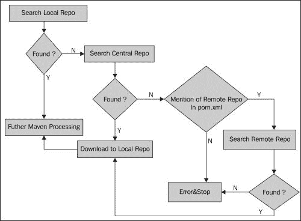

Maven 按照以下顺序在仓库中搜索依赖库，顺序如下所述：

1.  在步骤 1 中，Maven 在本地仓库中搜索依赖项；如果找到，则继续进行，否则它将转到中央仓库。

1.  在步骤 2 中，搜索继续在中央仓库中进行；如果找到，它将下载依赖库到本地仓库并继续处理。如果在中央仓库中搜索失败，并且 POM 文件中提到了远程仓库，它将继续进行步骤 3，否则抛出错误并停止。

1.  在步骤 3 中，搜索继续在远程仓库中进行。如果找到，它将下载依赖库到本地仓库并继续处理。如果搜索遇到失败，它将抛出错误并在该处停止。

## 项目依赖

Maven 的强大功能是其对任何项目的依赖项管理。依赖项可能是外部库或内部（内部）库/项目。POM 中的依赖项可以以下列标签和以下属性进行声明，如下所示：

```java
<dependencies>
  <dependency>
    <groupId>org.testng </groupId>
    <artifactId>testng</artifactId>
    <version>6.1.1</version>
    <type>jar</type>
    <scope>test</scope>
    <optional>true</optional>
  </dependency>
...
  </dependencies>
```

```java
`groupId`, `artifactId`, and `version`: These are the Maven coordinates for dependency.`type`: This is a dependency packaging type. The default type is JAR. We have already discussed this in an earlier section.`scope`: This provides a mechanism of control over the inclusion of dependencies in the class path and with an application. We will talk about this scope in the next section.`optional`: This indicates the dependency as optional when the project is a dependency. To put this in simple terms, consider that project A has the `optional` dependency, which means it needs this library at build time. Now, project B has this project A that is dependency defined, so this implies B may not need A's dependency for its build and is a part of transitive dependencies.
```

### 依赖项范围

依赖项范围控制类路径中依赖项的可用性，并与应用程序一起打包。有六个依赖项范围，以下详细描述如下：

+   `Compile`：如果没有指定，这是默认范围。具有此范围的依赖项在所有类路径中可用，并且被打包。

+   `Provided`：与 `compile` 范围类似，但表示 JDK 或容器提供它们。它仅在编译和测试类路径中可用，并且不是传递的。

+   `Runtime`：此范围表示依赖项在编译时不需要，但在执行时可用。例如，JDBC 驱动程序仅在运行时需要，然而 JDBC API 在编译时需要。

+   `Test`：此范围表示依赖项对于应用程序的正常使用不是必需的，并且它仅在测试编译和执行阶段可用。

+   `System`：这与 `provided` 范围类似，但明确指出了本地文件系统上 JAR 的路径。路径必须是绝对路径，例如 `$JAVA_HOME/lib`。Maven 不会检查仓库；相反，它将检查文件的存在。

### 传递依赖

项目 A 依赖于项目 B，而项目 B 依赖于 C——现在 C 是 A 的传递依赖。Maven 的优势在于它可以处理传递依赖，并从开发者的知识中隐藏依赖链。作为开发者，项目的直接依赖被定义，而所有其他依赖链的麻烦都由 Maven 通过有效的版本冲突管理来处理。范围限制依赖项的传递性，如前所述，通过允许包含适合构建当前阶段的依赖项。

更多信息，请访问[`maven.apache.org/guides/introduction/introduction-to-dependency-mechanism.html`](http://maven.apache.org/guides/introduction/introduction-to-dependency-mechanism.html)。

以下图示说明了传递依赖关系：

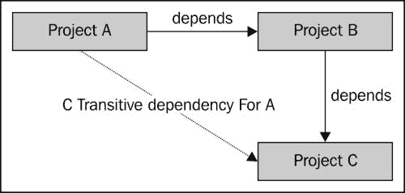

## 插件和目标

Maven 本质上是一个插件框架，其中每个动作都是某个插件的结果。每个插件由目标（也称为 Mojos）组成，这些目标定义了要执行的操作。简单来说，*目标*是工作单元。例如，`compiler`插件有`compile`作为目标，用于编译项目的源代码。以下是一个示例：


带有目标集的插件可以使用以下命令执行：

```java
mvn [pluginID:goalID]

```

通常，以下是一些插件类型：

| 类型 | 描述 |
| --- | --- |
| 构建插件 | 这些插件在构建期间执行，并在`pom`文件中的`<build> <build/>`元素中指定。 |
| 报告插件 | 这些插件在站点生成期间执行，并在`pom`文件中的`<reporting> <reporting/>`元素中配置。 |
| 核心插件 | 这些插件对应于默认的核心阶段。 |
| 打包类型/工具 | 这些与相应的打包工件类型相关。 |

以下表格包含了一些常见的插件：

| 插件 | 描述 |
| --- | --- |
| `compiler` | 这用于编译源代码。 |
| `jar` | 这将从项目构建`jar`文件。 |
| `war` | 这将从项目构建`war`文件。 |
| `install` | 这将构建工件安装到本地仓库。 |
| `site` | 这将为当前项目生成站点。 |
| `surefire` | 这将运行单元测试并生成报告。 |
| `clean` | 这将在构建后清理目标。 |
| `javadoc` | 这将为项目生成 Javadoc。 |
| `pdf` | 这将为项目文档生成 PDF 版本。 |

更多插件，请访问[`maven.apache.org/plugins/`](http://maven.apache.org/plugins/)。

## 站点生成和报告

很少有项目是单个开发者的资产。一个项目包含利益相关者，并且他们之间的协作是必不可少的。通常，缺乏有效的文档会使项目、其维护和其使用陷入瘫痪。Maven 及其`site`插件通过生成与项目相关的站点和报告，简化了拥有有效项目文档的过程。可以使用以下命令生成站点：

```java
mvn site

```

网站生成在`target/site`目录下。Maven 使用 Doxia 组件（在第一章的*Maven 组件架构*部分中讨论），*Apache Maven – 简介 和 安装*来生成文档。网站还包含所有配置的报告，如单元测试覆盖率、PMD 报告等。我们将在第五章的*生成网站文档*部分中更详细地介绍网站和报告的生成，*Spicing Up a Maven Project*。

# 创建 Maven 项目

m2eclipse 使创建 Maven 项目变得简单。Maven 项目可以通过以下两种方式创建：

+   使用原型

+   不使用原型

现在，我们将讨论如何使用这些方法创建项目。

## 使用原型

原型是一个插件，允许用户使用称为原型的定义模板创建 Maven 项目。不同类型的项目有不同的原型。

原型主要用于创建以下内容：

+   Maven 插件

+   简单的 Web 应用程序

+   简单项目

我们现在将看到如何使用原型创建一个简单的 Hello World! 项目：

1.  导航到**文件** | **新建**并点击**其他**。项目向导出现并展开**Maven**文件夹。如图所示选择**Maven 项目**并点击**下一步**：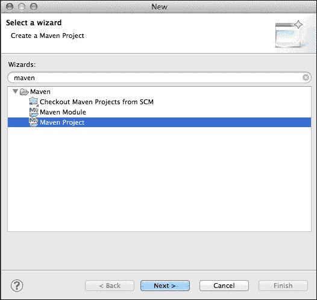

1.  **新 Maven 项目**向导出现。使用默认的工作空间，并如图所示点击**下一步**：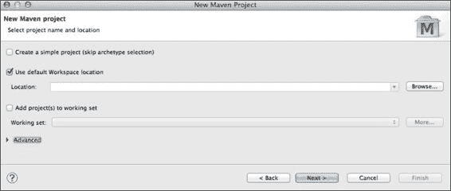

1.  **选择一个原型**向导出现。这显示了 Maven 仓库中可用的原型列表。可以通过**添加原型**按钮添加新的原型。在我们的案例中，让我们选择如图所示的**maven-archetype-quickstart**并点击**下一步**：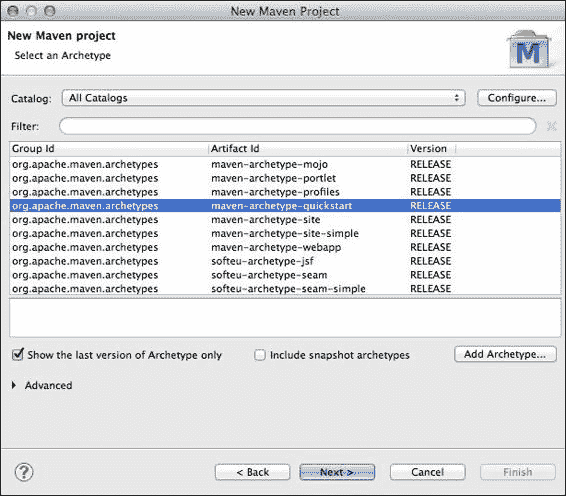

1.  出现一个指定 Maven 坐标的向导。请在以下表格中填写截图后的详细信息，并点击**完成**：

    | 字段 | 值 |
    | --- | --- |
    | **组 ID** | `com.packt.mvneclipse` |
    | **工件 ID** | `hello-project` |
    | **版本** | 默认 – **0.0.1-SNAPSHOT** |
    | **包名** | `com.packt.mvneclipse.hello` |

    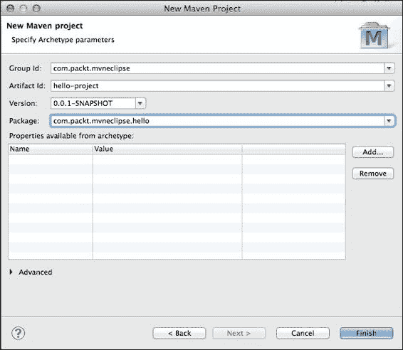

现在已经创建了一个示例 Maven 项目，它包含一个打印**Hello World!**的 Java 文件。项目具有以下结构：

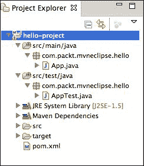

## 不使用原型

您可以使用以下步骤不使用原型创建 Maven 项目：

1.  导航到**文件** | **新建**并点击**其他**。项目向导出现并展开**Maven**文件夹。选择**Maven 项目**并点击**下一步**。

1.  **新建 Maven 项目**向导出现。使用默认工作区并勾选以下截图所示的**跳过原型**复选框，然后点击**下一步**：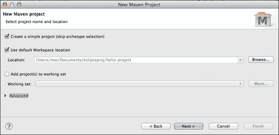

1.  出现指定 Maven 坐标的向导。请填写以下截图所示的详细信息，然后点击**完成**：

1.  将创建一个骨架结构，如以下截图所示，我们将根据我们构建的应用程序类型对其进行自定义：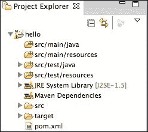

## 检出 Maven 项目

检出 Maven 项目意味着从源代码版本控制系统检出。在我们处理之前，我们需要确保我们已安装了计划使用的相应 SCM 的 Maven 连接器。使用以下步骤检出 Maven 项目：

1.  在 Mac 上导航到**Eclipse** | **首选项**，在其他操作系统上则导航到**Windows** | **首选项搜索**，并搜索`Maven`，展开它，然后点击**发现**。

1.  然后，点击**打开目录**。这列出了市场上所有可用的 m2connectors。在我们的例子中，我们将使用 SVN，因此选择**m2-Subversive**，如以下截图所示，然后点击**完成**。在接下来的屏幕上，点击**下一步**，接受许可协议，最后点击**完成**以安装它。同样，我们可以选择我们打算用于 SCM 的任何连接器。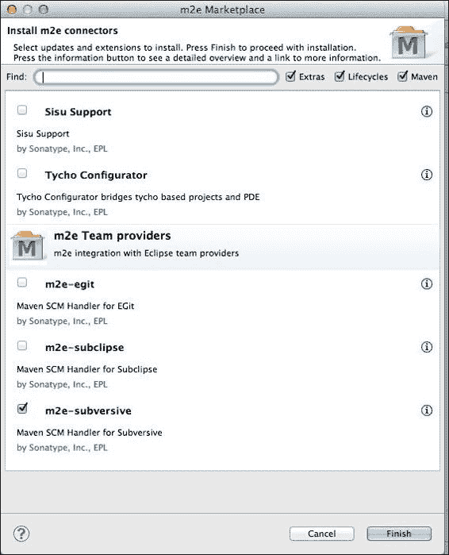

1.  就像创建项目一样，导航到**文件** | **新建**，然后点击**其他**。出现项目向导。展开 Maven 文件夹。点击**从 SCM 检出 Maven 项目**，然后点击**下一步**。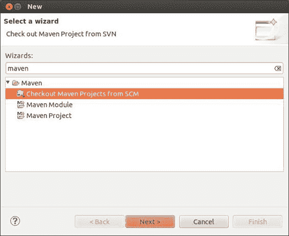

1.  在下一个屏幕上，选择 SCM 连接器**SVN**并提供相应的 SVN URL，如以下截图所示，然后点击**完成**。如果您点击**下一步**，它将显示仓库结构。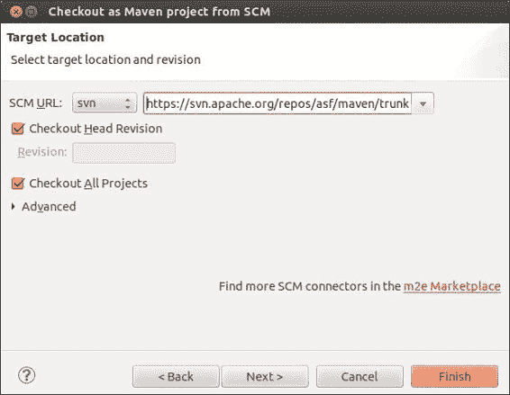

# 导入 Maven 项目

导入 Maven 项目就像导入任何其他 Java 项目一样。导入 Maven 项目的步骤如下：

1.  从**文件**菜单中，点击**导入**。选择`导入`，出现一个源窗口，展开`Maven`，然后点击**现有 Maven 项目**，如以下截图所示：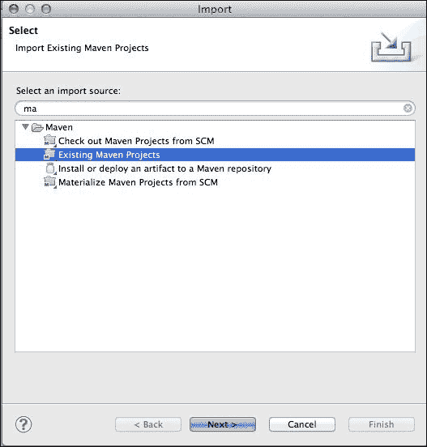

1.  在下一个向导中，我们必须选择 Maven 项目的位置。使用**浏览...**按钮导航到相应的位置，然后点击**完成**以完成导入，如以下截图所示；项目将被导入到工作区：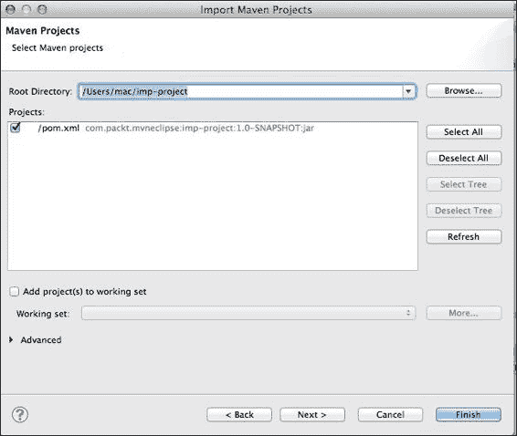

# 摘要

恭喜！在本章中，你了解了 Maven 项目的结构、POM 文件、Maven 领域的其他基本概念，最后你学习了如何创建和导入 Maven 项目。如需更多信息，你可以参考 Tim O'Brien 所著的 *Maven: The Complete Reference*，由 Sonatype, Inc. 出版，以及 Apache Maven 网站。在下一章中，我们将探讨构建周期，你将学习如何运行 Maven 项目。
