# 第五章.为 Maven 项目增色

到目前为止，我们已经构建了基础，现在我们终于准备好发射火箭了。火箭！激动人心，不是吗？让我们将前几章的知识付诸实践；我们将使用 Maven 创建一个简单的 Web 应用程序，MyDistance，它允许用户在不同单位之间转换距离。在构建此应用程序的过程中，我们还将学习如何自定义项目信息并生成不同的工件。本章将涵盖以下主题：

+   创建 MyDistance 项目

+   修改项目信息

+   添加依赖项

+   添加资源

+   应用程序代码

    +   添加表单以获取输入

    +   添加 servlet

    +   添加实用类

+   运行应用程序

+   编写单元测试

+   运行单元测试

+   生成站点文档

+   生成单元测试—HTML 报告

+   生成 javadoc

# 创建 MyDistance 项目

要创建`MyDistance`应用程序，我们需要执行以下步骤：

1.  从菜单中，导航到**文件** | **新建** | **其他...**。出现一个新的项目向导窗口。在文本框中搜索`maven`，选择**Maven 项目**，然后点击**下一步**按钮，如下截图所示：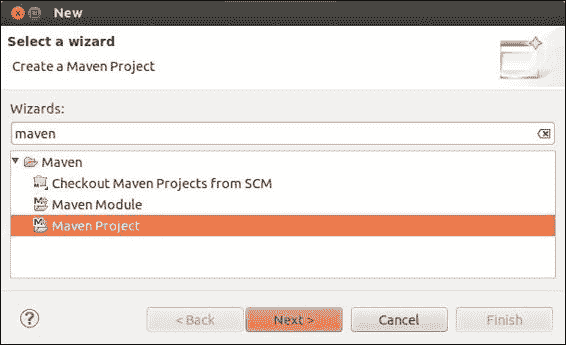

1.  出现了一个**新 Maven 项目**向导；选中**使用默认工作区位置**复选框，并确保**创建简单项目（跳过存档选择）**复选框未选中，如下截图所示：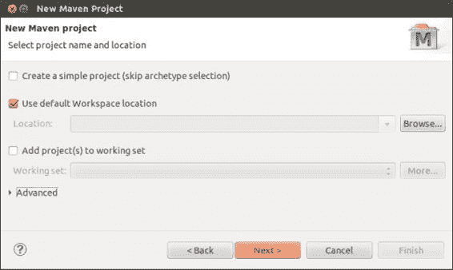

1.  接下来，从新存档向导中选择一个存档。由于我们正在构建 Web 应用程序，在**过滤器**中搜索`webapp`，选择**maven-archetype-webapp**，然后点击**下一步**，如下截图所示：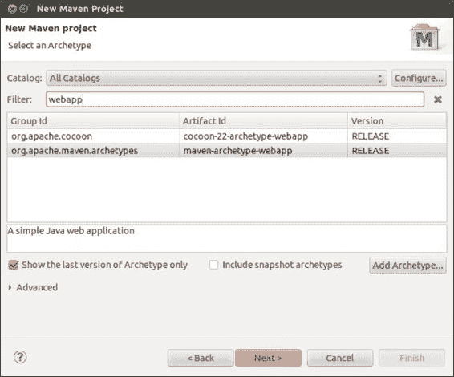

1.  使用以下值指定 Maven 坐标，也称为技术术语中的**组-工件-版本**（**GAV**），然后点击**完成**：

    | 字段 | 值 |
    | --- | --- |
    | **组 ID** | `com.packt.mvneclipse` |
    | **工件 ID** | `MyDistance` |
    | **版本** | `0.0.1-SNAPSHOT` |
    | **包名** | `com.packt.chpt5.mydistance` |

    执行上一步操作后，您的屏幕将显示如下截图：

    

    ### 注意

    Maven 中的快照表示当前的开发副本，即代码的当前快照。Maven 在配置的间隔内，默认为 24 小时，在远程仓库中检查新的 SNAPSHOT 版本。有关 Maven 版本的更多信息，请参阅[`docs.oracle.com/middleware/1212/core/MAVEN/maven_version.htm`](http://docs.oracle.com/middleware/1212/core/MAVEN/maven_version.htm)。

1.  Web 应用程序骨架将被创建，其结构如下截图所示：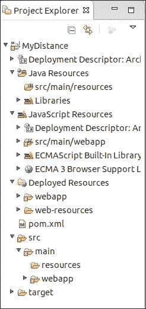

如果您看到表示项目中有错误的红色交叉，请不要担心；我们将在即将到来的*应用程序代码*部分中了解更多关于它的信息。

# 修改项目信息

在我们深入代码的更多细节之前，让我们自定义项目信息。让我们添加有关组织、许可证和与之相关的开发者的信息。为此，让我们打开`pom`文件并添加以下代码：

```java
<project >
…....
  <!-- Organization information -->
    <organization> 
      <name>Packt Publishing</name>
      <url>www.packtpub.com</url>
    </organization> 
  <!-- License information  -->
  <licenses>
    <license>
       <name>Apache 2</name>
      <url>http://www.apache.org/licenses/LICENSE-2.0.txt</url>
      <distribution>manual</distribution>
        <comments>A Friendly license</comments>
    </license>
  </licenses>
  <!-- Developers Information -->
  <developers>
    <developer>
      <id>foo</id>
        <name>Foo foo</name>
        <email>foo@foo.com</email>
        <url>http://www.foofoo.net</url>
        <organization>Packt</organization>
        <organizationUrl>http://packtpub.com</organizationUrl>
            <roles>
              <role>developer</role>
            </roles>
            <timezone>-8</timezone>
    </developer>
  </developers>
.......
</project>
```

### 注意

有关 Maven 模型的详细信息，请访问[`maven.apache.org/ref/3.2.1/maven-model/maven.html`](http://maven.apache.org/ref/3.2.1/maven-model/maven.html)。

# 添加依赖项

我们的项目是一个简单的 Web 应用程序，为了开始，它将需要 JUnit 作为测试的依赖项，以及`log4j`用于日志记录。随着我们进一步进展，我们将逐步添加更多依赖项；本节的想法是展示如何在`pom`文件中添加依赖项。如果我们查看我们的`pom`文件，我们可以看到 JUnit 已经作为依赖项存在；因此，让我们通过添加以下代码片段将`log4j`作为依赖项添加：

```java
<project>
…....
<dependencies>
…
<!-- For logging purpose -->
    <dependency>
      <groupId>log4j</groupId>
      <artifactId>log4j</artifactId>
      <version>1.2.17</version>
    </dependency>
</dependencies>
…....
</project>
```

完整的`pom`文件将如下所示：

```java
<project  
  xsi:schemaLocation="http://maven.apache.org/POM/4.0.0 http://maven.apache.org/maven-v4_0_0.xsd">
  <modelVersion>4.0.0</modelVersion>
  <groupId>com.packt.mvneclipse</groupId>
  <artifactId>MyDistance</artifactId>
  <packaging>war</packaging>
  <version>0.0.1-SNAPSHOT</version>
  <name>MyDistance Maven Webapp</name>
  <url>http://maven.apache.org</url>
  <!-- Organization information -->
  <organization>
    <name>Packt Publishing</name>
    <url>www.packtpub.com</url>
  </organization>

  <!-- License information  -->
  <licenses>
    <license>
       <name>Apache 2</name>
       <url>http://www.apache.org/licenses/LICENSE-2.0.txt</url>
       <distribution>manual</distribution>
       <comments>A Friendly license</comments>
    </license>
  </licenses>
  <!-- Developers Information -->
  <developers>
    <developer>
    <id>foo</id>
      <name>Foo foo</name>
      <email>foo@foo.com</email>
      <url>http://www.foofoo.net</url>
      <organization>Packt</organization>
      <organizationUrl>http://packtpub.com</organizationUrl>
      <roles>
        <role>developer</role>
          </roles>
            <timezone>-8</timezone>
    </developer>
    </developers>
  <dependencies>
    <dependency>
      <groupId>junit</groupId>
      <artifactId>junit</artifactId>
      <version>3.8.1</version>
      <scope>test</scope>
    </dependency>
    <!-- For logging purpose -->
    <dependency>
      <groupId>log4j</groupId>
      <artifactId>log4j</artifactId>
      <version>1.2.17</version>
    </dependency>
  </dependencies>
  <build>
    <finalName>MyDistance</finalName>
  </build>
</project>
```

# 添加资源

我们将使用`log4j`将日志记录到文件或控制台。`log4j`通过`log4j`属性文件进行配置。现在让我们创建属性文件。为此，导航到`src/main/resources`，右键单击资源并选择**新建** | **其他...**；出现一个新向导。在**过滤器**部分搜索`file`，选择**文件**，然后点击**下一步**，如下面的截图所示：

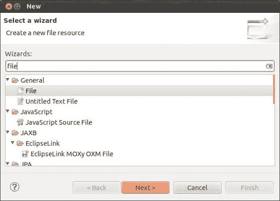

接下来，出现一个**文件**资源窗口；输入文件名为`log4j.properties`，并确保父文件夹是`MyDistance/src/main/resources`，然后点击**完成**，如下面的截图所示：

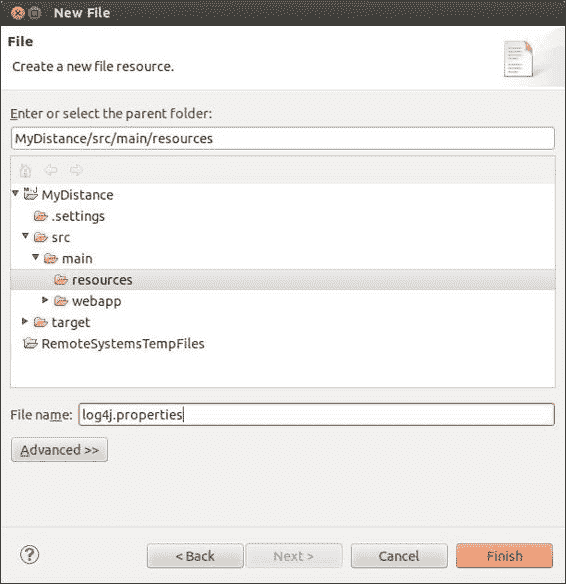

### 注意

资源放置在`src/main/resources`文件夹中。

一旦文件创建完成，请添加以下代码片段来设置`log4j`的不同属性。它将模式布局附加到控制台以分割信息，并将日志写入`Mydistance.log`文件，并设置为`DEBUG`级别，如下面的代码所示：

```java
#log4j Properties 
  log4j.rootLogger=DEBUG, consoleAppender, fileAppender

  log4j.appender.consoleAppender=org.apache.log4j.ConsoleAppender
  log4j.appender.consoleAppender.layout=org.apache.log4j.PatternLayout
  log4j.appender.consoleAppender.layout.ConversionPattern=[%t] %-5p  %c{1} %x - %m%n

  log4j.appender.fileAppender=org.apache.log4j.RollingFileAppender
  log4j.appender.fileAppender.layout=org.apache.log4j.PatternLayout
  log4j.appender.fileAppender.layout.ConversionPattern=[%t] %-5p  %c{1} %x - %m%n
  log4j.appender.fileAppender.File=Mydistance.log
```

有关`log4j`的更多信息，请参阅[`logging.apache.org/log4j/1.2/`](http://logging.apache.org/log4j/1.2/)。

# 应用程序代码

应用程序故意创建在 JSP 或 servlets 中，以保持简单并避免熟悉其他框架来理解示例。在我们深入研究应用程序代码的基本知识之前，让我们解决在*创建 MyDistance 项目*部分的第 5 步中 Eclipse 抱怨的错误。在`pom`文件中添加以下依赖项，错误应该会消失：

```java
<!-- Include servlet  API -->
  <dependency>
    <groupId>javax.servlet</groupId>
    <artifactId>javax.servlet-api</artifactId>
    <version>3.1.0</version>
    <scope>provided</scope>
  </dependency>
```

在*添加 Servlet*部分稍后编写 servlet 时，也需要这个依赖项。

### 注意

范围已提供，这意味着容器将提供此依赖项，Maven 不会将其包含在此项目的输出或 war 文件中。我们已在第四章中更详细地讨论了范围，*构建和运行项目*。

应用程序将需要以下附加文件：

+   `index.jsp`：这是一个带有表单的 JSP 文件，允许用户输入距离、其单位和所需的转换单位

+   `DistanceServlet`：这是一个处理表单输入的 servlet

+   `ConversionUtil`：这是一个实用工具类，它有一个方法用于在不同单位之间进行转换

## 添加获取输入的表单

在`src/main/webapp`下打开`index.jsp`文件，并添加以下代码以获取距离、其单位和转换单位作为输入。表单包括一个输入框、两个单选按钮用于选择单位以及一个按钮来启动转换，如下面的代码所示：

```java
<body>
<h2>MyDistance Utility</h2>
  <form>
    <table>
      <tr>
        <td><input type="text" id="mydistance" name='distance' placeholder="My Distance In"></td>

        <td> <input type="radio" name="distin" id="distin" value="km">KM<br>
        <input type="radio" name="distin" id="distin" value="m">Metre</td>
      </tr>
      <tr></tr>
      <tr></tr>
      <tr></tr>
      <tr> 
        <td> <label for="convert">Convert To</label></td>
        <td> <input type="radio" name="convertto" id="convertto" value="yd">Yard<br>
        <input type="radio" name="convertto" id="convertto" value="mi">Miles</td>
      </tr>
      <tr>
        <td><input type="button" id="submit" value='Convert'></td>
      </tr>

    </table>
    <div id="convertvalue"> </div>
  </form>
</body>
```

如果愿意，你可以添加 CSS 样式来使 UI 更加美观。前面的裸骨文件会产生类似以下的结果：

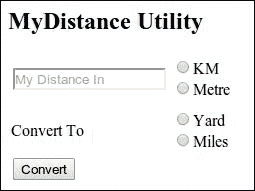

我们想使用 Ajax（jQuery Ajax）计算值并在其下方显示相应的结果。为此，添加以下代码片段：

```java
<head>
  <script src="img/jquery-latest.js">
  </script>
  <script>
    $(document).ready(function() {
    $('#submit').click(function(event) {
      var mydistance=$('#mydistance').val();

      var mydistanceIn=$('[name=distin]:checked').val();
      var convertTo=$('[name=convertto]:checked').val();
      if(mydistanceIn==convertTo){
        alert("Cannot have same unit");
        return false;
      }
      console.log(mydistance+mydistanceIn+convertTo);
      $.get('mydistance',{distance:mydistance,distIn:mydistanceIn,convert:convertTo},function(responseText) { 
          $('#convertvalue').text(responseText);
        });
      });
    });
  </script>
</head>
```

## 添加 servlet

在添加任何 Java 文件之前，在`src/main`下创建一个名为`java`的文件夹，因为 Maven 会在该目录中查找 Java 文件（所有 Java 文件都应该位于其中）。在`com.packt.chpt5.mydistance`包中添加`DistanceServlet` servlet。servlet 获取请求参数，提取它，并调用实用工具类中的相应转换方法。servlet 看起来如下所示：

```java
public class DistanceServlet extends HttpServlet {

  private static final long serialVersionUID = 1L;
  static Logger log=Logger.getLogger(DistanceServlet.class);
  public void doGet(HttpServletRequest req, HttpServletResponse resp)
        throws ServletException, IOException {
        double convertVal = 0;
        double distanceProvided =Double.parseDouble(req.getParameter("distance"));
    String distanceIn=req.getParameter("distIn");
    String convertTo=req.getParameter("convert");
    log.debug("Request Parameters ==>"+"Distance-"+distanceProvided+distanceIn+" Conversion Unit- "+convertTo );
    ConversionUtil conversion= new ConversionUtil();
    if(distanceIn.equals("km") && convertTo.equals("yd")){
      convertVal=conversion.convertkmToYard(distanceProvided);
    }

    if(distanceIn.equals("m") && convertTo.equals("yd")){
        convertVal=conversion.convertMtoYard(distanceProvided);
    }

    if(distanceIn.equals("km") && convertTo.equals("mi")){
        convertVal=conversion.convertKMToMile(distanceProvided);
    }

    if(distanceIn.equals("m") && convertTo.equals("mi")){
      convertVal=conversion.convertMToMile(distanceProvided);
    }

    resp.setContentType("text/html");
      PrintWriter out = resp.getWriter();
      out.print("The converted value is "+convertVal);
      out.flush();
      out.close();

    }

}
```

在`src/main/webapp/WEB-INF`下的`web.xml`文件中添加以下行：

```java
<web-app>
  <display-name>MyDistance Calculator</display-name>
  <servlet>
        <servlet-name>mydistance</servlet-name>
        <servlet-class>com.packt.chpt5.mydistance.DistanceServlet</servlet-class>
        <load-on-startup>1</load-on-startup>
    </servlet>

    <servlet-mapping>
        <servlet-name>mydistance</servlet-name> 
        <url-pattern>/mydistance</url-pattern>
    </servlet-mapping>
</web-app>
```

## 添加实用工具类

在`com.packt.chpt5.mydistance.util`包中添加一个名为`ConversionUtil`的实用工具类。实用工具类包含执行不同距离单位转换的方法。将以下代码添加到实用工具类中：

```java
public double convertKMToMile(double distance){
  return (distance*0.62137);
}
public double convertkmToYard(double distance){
  return distance*1093.6;
}

public double convertMToMile(double distance){
  return (distance/1000)*0.62137 ;
}
public double convertMtoYard(double distance){
  return (distance/1000)*1093.6;
}
```

# 运行应用程序

现在我们已经完成了编码。让我们运行代码并看看它的工作情况。该项目是一个 Web 应用程序，因此它需要一个 servlet 容器来运行。我们将在这里使用 Tomcat 容器。为 Tomcat 添加以下构建插件，该插件可以从 Maven 中实际托管 Tomcat 实例，无需安装：

```java
    <build>
….
  <plugins>
  <plugin>
    <groupId>org.apache.tomcat.maven</groupId>
    <artifactId>tomcat7-maven-plugin</artifactId>
    <version>2.1</version>
  </plugin>
  </plugins>
    </build>
```

这将从存储库下载所有依赖项。下载完成后，右键单击项目，选择**运行方式** | **运行配置...**，在配置窗口中创建配置，指定**目标**为`tomcat7:run`，然后单击**运行**，如图所示：

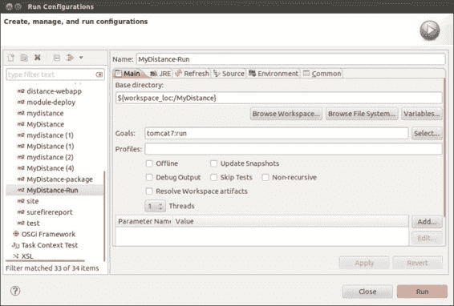

### 注意

Tomcat 插件具有`run`目标，它编译并运行应用程序。

同样，我们可以在任何其他容器中添加任何其他容器并运行应用程序。运行的应用程序将在`http://localhost:8080/MyDistance/`处可用，如下面的截图所示（显示了一个示例转换）：

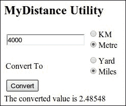

# 编写单元测试

编写单元测试是软件开发中的良好实践的一部分。Maven 的`test`阶段执行单元测试并生成相应的报告。在本节中，我们将学习如何为我们的实用工具类`ConversionUtil`编写简单的单元测试，在下一节中，我们将看到如何执行它并生成报告。

所有单元测试类都应该放在`src/test/java`下。在`MyDistance`项目中创建相应的文件夹。一旦文件夹就位，右键单击它并导航到**新建** | **其他...**。一旦出现向导窗口，在**过滤器**部分输入`junit`，选择**JUnit 测试用例**，然后点击**下一步**，如下面的截图所示：

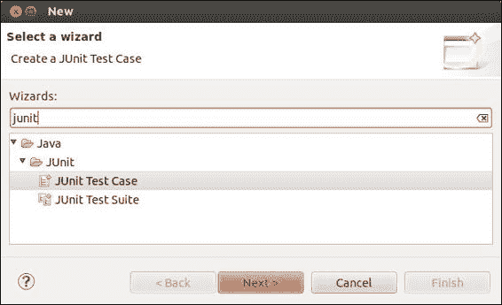

在接下来的窗口中，通过填写以下详细信息来定义单元测试类，然后点击**下一步**，如下面的截图所示：

| 字段 | 值 |
| --- | --- |
| **源文件夹** | `MyDistance/src/test/java` |
| **包** | `com.packt.chpt5.mydistance.util` |
| **名称** | `ConvertionUtilTest` |
| **测试中的类** | `com.packt.chpt5.mydistance.util.ConversionUtil` |

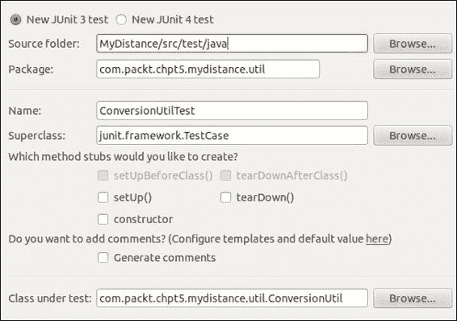

将显示一个选择测试方法的窗口，将生成如下截图所示的存根。确保`ConversionUtil`类的所有方法都被选中，然后按照以下方式点击**完成**：

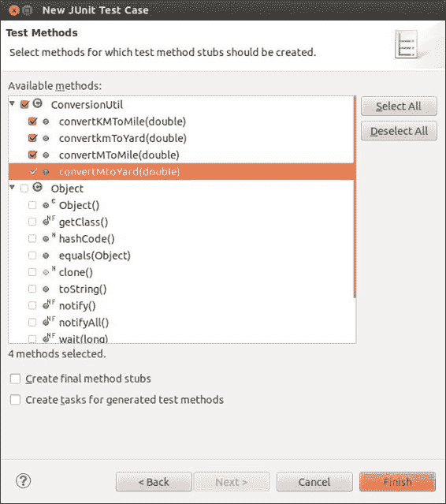

将生成带有测试方法存根的`ConversionUtilTest`测试类。按照以下方式编辑类的代码：

```java
private ConversionUtil conversion;

  @Override
  protected void setUp() throws Exception {

    super.setUp();
    conversion= new ConversionUtil();
  }

  public void testConvertKmToMile() {
    double actual=conversion.convertKMToMile(4);
    assertEquals(2.48548,actual,0.001);
  }

  public void testConvertkmToYard() {
    double actual=conversion.convertkmToYard(4);
    assertEquals(4374.45,actual,0.10);
  }

  public void testConvertMToMile() {
    double actual=conversion.convertMToMile(4000);
    assertEquals(2.48548,actual,0.001);
  }

  public void testConvertMtoYard() {
    double actual=conversion.convertMtoYard(4000);
    assertEquals(4374.45,actual,0.10);
  }

  @Override
  protected void tearDown() throws Exception {

    super.tearDown();
    conversion = null;
  }
```

关于 JUnit 测试用例的更多信息，请参阅[`junit.org/`](http://junit.org/).

# 运行单元测试

在 Maven 中运行单元测试只需指定测试阶段。要执行上一节中编写的单元测试，右键单击`MyDistance`项目，选择**运行方式**，然后点击**Maven 测试**。它将对类运行单元测试，并在`/target/surefire-reports/`文件夹中生成报告，如下面的截图所示：

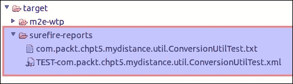

您可以在`txt`和`xml`格式中查看单元测试执行的结果。

# 生成站点文档

Maven 的一个核心特性是它简化了构件和站点文档的生成。要生成站点文档，请在`pom`文件中添加以下依赖项：

```java
<reporting>
    <plugins>
    <!--  Reporting -document generation -->
      <plugin>
        <groupId>org.apache.maven.plugins</groupId>
        <artifactId>maven-plugin-plugin</artifactId>
        <version>3.3</version>
      </plugin>
        <plugin>
      <groupId>org.apache.maven.plugins</groupId>
  <artifactId>maven-project-info-reports-plugin</artifactId>
  <version>2.7</version>
      </plugin>
    </plugins>

  </reporting>
```

在添加前面的依赖项后，以站点为目标运行项目，即在**运行配置**窗口中，将**目标**指定为`site`，如下面的截图所示：

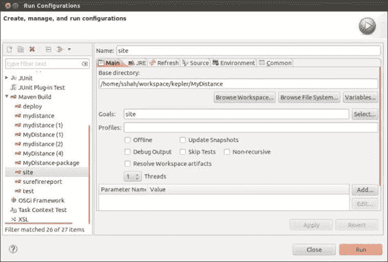

点击**运行**按钮，文档将被生成。**Maven 控制台**的输出摘录如下所示：

```java
[INFO] Generating "About" report    --- maven-project-info-reports-plugin:2.7
[INFO] Generating "Plugin Management" report    --- maven-project-info-reports-plugin:2.7
[INFO] Generating "Distribution Management" report    --- maven-project-info-reports-plugin:2.7
[INFO] Generating "Dependency Information" report    --- maven-project-info-reports-plugin:2.7
[INFO] Generating "Source Repository" report    --- maven-project-info-reports-plugin:2.7
[INFO] Generating "Mailing Lists" report    --- maven-project-info-reports-plugin:2.7
[INFO] Generating "Issue Tracking" report    --- maven-project-info-reports-plugin:2.7
[INFO] Generating "Continuous Integration" report    --- maven-project-info-reports-plugin:2.7
[INFO] Generating "Project Plugins" report    --- maven-project-info-reports-plugin:2.7
[INFO] Generating "Project License" report    --- maven-project-info-reports-plugin:2.7
[INFO] Generating "Project Team" report    --- maven-project-info-reports-plugin:2.7
[INFO] Generating "Project Summary" report    --- maven-project-info-reports-plugin:2.7
[INFO] Generating "Dependencies" report    --- maven-project-info-reports-plugin:2.7
[INFO] ------------------------------------------------------------------------
[INFO] BUILD SUCCESS
[INFO] ------------------------------------------------------------------------
```

文档将在`target/site`目录中生成，文件夹的扩展形式如下所示：

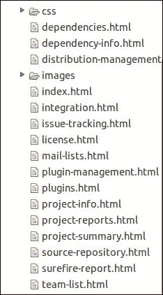

每种类型的细节都有一个 HTML 文件，从`project-info`、`project reports`、`project summary`、`license`、`plugin`等等，而`index.html`是链接每个文档的起点。以下截图显示了**项目摘要**页面：

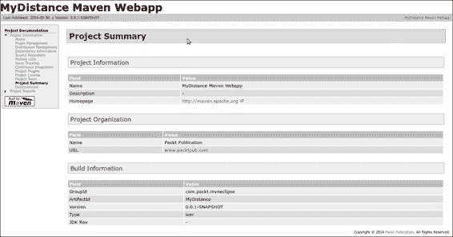

关于网站和网站插件的更多信息，请参阅[`maven.apache.org/guides/mini/guide-site.html`](http://maven.apache.org/guides/mini/guide-site.html)和[`maven.apache.org/plugins/maven-site-plugin/`](http://maven.apache.org/plugins/maven-site-plugin/)。

# 生成单元测试 - HTML 报告

在上一节中，我们运行了单元测试，结果以`txt`和`xml`格式生成。通常，开发者需要生成更易读的报告。实际上，报告应该是网站文档的一部分，以便更好地协作，并在一个地方提供信息。要生成 HTML 报告并将其作为网站文档的一部分，请在`pom`文件中的`reporting`元素下作为`plugin`添加依赖项，如下所示：

```java
<reporting>
    <plugins>
…...
<!-- For HTML test report generation -->
      <plugin>
        <groupId>org.apache.maven.plugins</groupId>
        <artifactId>maven-surefire-report-plugin</artifactId>
        <version>2.17</version>
      </plugin>
…...
    </plugins>
</reporting>
```

在上述代码添加后，从上一节运行`site`阶段。测试报告可以通过在`index.html`中的导航到**项目文档** | **项目报告** | **Surefire 报告**来获取，如下面的截图所示：

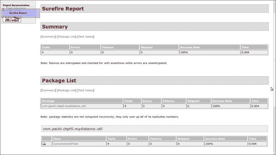

# 生成 javadoc

我们经常需要生成代码库的 API 文档。拥有 API 文档可以增加协作、理解、迁移，并且知识转移变得方便。要生成 javadoc，请在`reporting`元素中添加以下依赖项，如下所示：

```java
<reporting>
    <plugins>
  …...
  <!-- For Javadoc generation-->
        <plugin>
        <groupId>org.apache.maven.plugins</groupId>
        <artifactId>maven-javadoc-plugin</artifactId>
        <version>2.9.1</version>
       </plugin> 
  </plugins>
</reporting>
```

在对`pom`文件进行上述更改后，从上一节运行`site`阶段。API 将在`target/site`目录下的`apidocs`和`testapidocs`文件夹中生成。这可以在`index.html`文件中导航，在**项目报告**标题下，有**JavaDocs**和**测试 JavaDocs**标签，以及**Surefire-Reports**，如下面的截图所示：

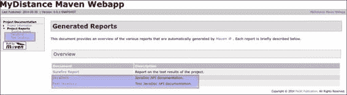

# 摘要

干得好！我们已经开发了`MyDistance`，一个距离转换实用程序网络应用程序。在开发过程中，我们学习了添加依赖项、编写单元测试、执行它们、生成网站文档以及为它们生成 javadoc。在下一章中，我们将学习关于 Maven 的多模块项目。
