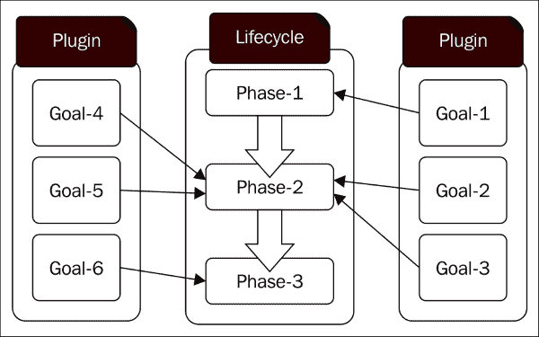
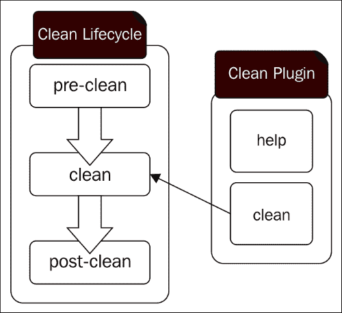
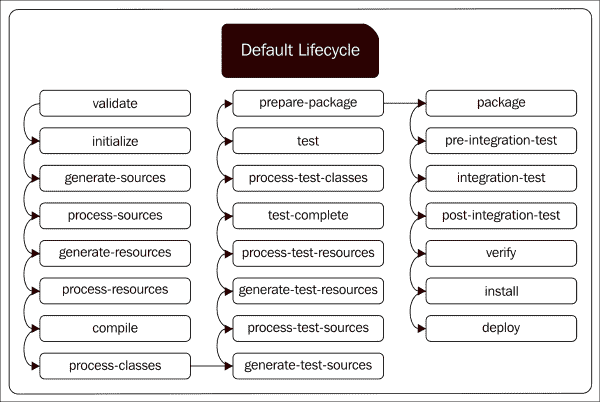
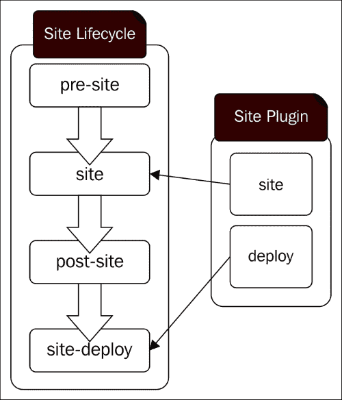

# 第五章。构建生命周期

Maven 构建生命周期由一系列定义良好的阶段组成。每个阶段由 Maven 插件定义的一组目标组成，生命周期定义了执行顺序。Maven 插件是一组目标，其中每个目标都负责执行特定的操作。我们在第四章“Maven 插件”中详细讨论了 Maven 插件。第四章。

在本章中，将涵盖以下主题：

+   Maven 中的标准生命周期

+   生命周期绑定

+   构建自定义生命周期扩展

下图显示了 Maven 插件目标和生命周期阶段之间的关系：



让我们来看一下每个 Java 开发者都熟悉的简单 Maven 构建命令：

```java
$ mvn clean install

```

这会做什么？作为一个开发者，你执行过这个命令多少次？你是否想过它内部发生了什么？如果没有，现在是时候探索它了。

# Maven 中的标准生命周期

Maven 随带三个标准生命周期：

+   `clean`

+   `default`

+   `site`

每个生命周期定义了自己的阶段集。

## 清洁生命周期

`clean` 生命周期定义了三个阶段：`pre-clean`、`clean` 和 `post-clean`。生命周期中的一个阶段只是构建执行路径中的一个有序占位符。例如，`clean` 生命周期中的 `clean` 阶段本身不能做任何事情。在 Maven 架构中，它有两个关键元素：名词和动词。与特定项目相关的名词和动词都在 POM 文件中定义。项目的名称、父项目的名称、依赖项和打包类型都是名词。插件将动词引入 Maven 构建系统，并通过其目标定义在构建执行期间需要执行的操作。一个插件是一组目标。插件中的每个目标都可以单独执行，也可以注册为 Maven 构建生命周期中某个阶段的一部分。

当你输入 `mvn clean` 时，它会执行 `clean` 生命周期中定义的所有阶段，包括 `clean` 阶段。不要混淆；在这个命令中，`clean` 不是生命周期的名称，而是阶段的名称。它只是一个巧合，阶段的名字恰好与生命周期的名字相同。在 Maven 中，你不能简单地通过名称执行生命周期——它必须是阶段的名称。Maven 将找到相应的生命周期，并将执行其中直到给定阶段的所有阶段（包括该阶段）。

当你输入 `mvn clean` 时，它会清理项目的工作目录（默认情况下，它是 `target` 目录）。这是通过 Maven 的 `clean` 插件完成的。要了解更多关于 Maven `clean` 插件的信息，请输入以下命令。它描述了 `clean` 插件内部定义的所有目标：

```java
$ mvn help:describe -Dplugin=clean

Name: Maven Clean Plugin
Description: The Maven Clean Plugin is a plugin that removes files generated at build-time in a project's directory.
Group Id: org.apache.maven.plugins
Artifact Id: maven-clean-plugin
Version: 2.5
Goal Prefix: clean

This plugin has 2 goals.

clean:clean

Description: Goal, which cleans the build. This attempts to clean a project's working directory of the files that were generated at build-time. By default, it discovers and deletes the directories configured in project.build.directory, project.build.outputDirectory, project.build.testOutputDirectory, andproject.reporting.outputDirectory.Files outside the default may also be included in the deletion by configuring the filesets tag.

clean:help

Description: Display help information on maven-clean-plugin.Call
mvn clean:help -Ddetail=true -Dgoal=<goal-name> to display parameter details.

For more information, run 'mvn help:describe [...] -Ddetail'

```

### 注意

Maven 中的每件事都是一个插件。甚至我们之前执行以获取 `clean` 插件目标详情的命令也执行了另一个插件——`help` 插件。以下命令将描述 `help` 插件：

```java
$ mvn help:describe -Dplugin=help

```

`describe` 是在 `help` 插件内部定义的目标。

`clean` 插件中定义了两个目标：`clean` 和 `help`。如前所述，插件中的每个目标都可以单独执行，也可以注册为 Maven 构建生命周期中某个阶段的组成部分。`clean` 插件的 `clean` 目标可以单独使用以下命令执行：

```java
$ mvn clean:clean

```

下图显示了 Maven `clean` 插件目标与 `clean` 生命周期阶段之间的关系：



在上一个命令中 `clean` 这个词的第一个实例是 `clean` 插件的限定符，而第二个实例是目标名称。当您输入 `mvn clean` 时，执行的是相同的 `clean` 目标。然而，这次它是通过 `clean` 生命周期的 `clean` 阶段执行的，并且它还会执行相应生命周期中直到并包括 `clean` 阶段的所有阶段——不仅仅是 `clean` 阶段。`clean` 插件的 `clean` 目标默认配置为在 `clean` 生命周期的 `clean` 阶段执行。可以通过应用程序 POM 文件提供插件目标到生命周期阶段的映射；如果没有提供，它将继承自父 POM 文件。默认定义 `clean` 插件的父 POM 文件将该插件添加到 `clean` 生命周期的 `clean` 阶段。您不能在不同的生命周期中定义具有相同名称的阶段。

下面的代码片段显示了 Maven `clean` 插件的 `clean` 目标是如何与 `clean` 生命周期阶段的 `clean` 阶段关联的：

```java
<plugin>
   <artifactId>maven-clean-plugin</artifactId>
   <version>2.5</version>
   <executions>
      <execution>
         <id>default-clean</id>
         <phase>clean</phase>
         <goals>
            <goal>clean</goal>
         </goals>
      </execution>
   </executions>
</plugin>
```

`clean` 生命周期的 `pre-clean` 和 `post-clean` 阶段没有任何插件绑定。`pre-clean` 阶段的目标是在清理任务之前执行任何操作，而 `post-clean` 阶段的目标是在清理任务之后执行任何操作。如果您需要将任何插件与这两个阶段关联，只需将它们添加到相应的插件配置中。

## 默认生命周期

Maven 的 `default` 生命周期定义了 23 个阶段。当您运行 `mvn clean install` 命令时，它将执行 `default` 生命周期中直到并包括 `install` 阶段的所有阶段。更准确地说，Maven 首先执行 `clean` 生命周期中直到并包括 `clean` 阶段的所有阶段，然后执行 `default` 生命周期中直到并包括 `install` 阶段。

`default` 生命周期中的阶段没有关联的插件目标。每个阶段的插件绑定由相应的打包类型（即 `jar` 或 `war`）定义。如果您的 Maven 项目的打包类型是 `jar`，那么它将为每个阶段定义自己的插件集。如果打包类型是 `war`，那么它将有自己的插件集。以下要点总结了在 `default` 生命周期下按执行顺序定义的所有阶段：

+   `validate`：此阶段验证项目 POM 文件，并确保执行构建所需的所有相关信息都可用。

+   `initialize`：此阶段通过设置正确的目录结构和初始化属性来初始化构建。

+   `generate-sources`：此阶段生成所需的任何源代码。

+   `process-sources`：此阶段处理生成的源代码；例如，在这个阶段可以运行一个插件，根据一些定义的准则过滤源代码。

+   `generate-resources`：此阶段生成需要与最终工件一起打包的任何资源。

+   `process-resources`：此阶段处理生成的资源。它将资源复制到目标目录，并使它们准备好进行打包。

+   `compile`：此阶段编译源代码。

+   `process-classes`：此阶段可以在`compile`阶段之后执行任何字节码增强。

+   `generate-test-sources`：此阶段生成测试所需的源代码。

+   `process-test-sources`：此阶段处理生成的测试源代码；例如，在这个阶段可以运行一个插件，根据一些定义的准则过滤源代码。

+   `generate-test-resources`：此阶段生成运行测试所需的所有资源。

+   `process-test-resources`：此阶段处理生成的测试资源。它将资源复制到目标目录，并使它们准备好进行测试。

+   `test-compile`：此阶段编译测试源代码。

+   `process-test-classes`：此阶段可以在`test-compile`阶段之后执行任何字节码增强。

+   `test`：此阶段使用适当的单元测试框架执行测试。

+   `prepare-package`：此阶段在组织要打包的工件时很有用。

+   `package`：此阶段将工件打包成可分发格式，例如，JAR 或 WAR。

+   `pre-integration-test`：此阶段执行在运行集成测试之前所需的操作（如果有）。这可能用于启动任何外部应用程序服务器并将工件部署到不同的测试环境中。

+   `integration-test`：此阶段运行集成测试。

+   `post-integration-test`：此阶段可以在运行集成测试后执行任何清理任务。

+   `verify`：此阶段验证包的有效性。检查有效性的标准需要由相应的插件定义。

+   `install`：此阶段将最终工件安装到本地仓库。

+   `deploy`：此阶段将最终工件部署到远程仓库。

### 注意

给定 Maven 项目的打包类型在 `pom.xml` 文件的 `<packaging>` 元素下定义。如果省略此元素，则 Maven 假设它为 `jar` 打包。

下图显示了在 Maven `default` 生命周期下定义的所有阶段及其执行顺序：



### 注意

更多关于 Maven 生命周期的详细信息可以在[`maven.apache.org/ref/3.3.3/maven-core/lifecycles.html`](http://maven.apache.org/ref/3.3.3/maven-core/lifecycles.html)找到。

让我们看看一个具体的例子。运行以下命令针对一个具有 `jar` 打包方式的 Maven 项目：

```java
$ mvn help:describe -Dcmd=deploy

```

### 注意

如果您没有这样的项目，您可以从[`svn.wso2.org/repos/wso2/people/prabath/maven-mini/chapter05/jose/`](https://svn.wso2.org/repos/wso2/people/prabath/maven-mini/chapter05/jose/)下载一个示例 Maven 项目。

这里，我们使用 Maven `help` 插件来查找与 `jar` 打包方式对应的 `deploy` 阶段的更多详细信息，它将产生以下输出：

```java
It is a part of the lifecycle for the POM packaging 'jar'. This lifecycle includes the following phases:

* validate: Not defined
* initialize: Not defined
* generate-sources: Not defined
* process-sources: Not defined
* generate-resources: Not defined
* process-resources: org.apache.maven.plugins:maven-resources-plugin:2.6:resources
* compile: org.apache.maven.plugins:maven-compiler-plugin:2.5.1:compile
* process-classes: Not defined
* generate-test-sources: Not defined
* process-test-sources: Not defined
* generate-test-resources: Not defined
* process-test-resources: org.apache.maven.plugins:maven-resources-plugin:2.6:testResources
* test-compile: org.apache.maven.plugins:maven-compiler-plugin:2.5.1:testCompile
* process-test-classes: Not defined
* test: org.apache.maven.plugins:maven-surefire-plugin:2.12.4:test
* prepare-package: Not defined
* package: org.apache.maven.plugins:maven-jar-plugin:2.4:jar
* pre-integration-test: Not defined
* integration-test: Not defined
* post-integration-test: Not defined
* verify: Not defined
* install: org.apache.maven.plugins:maven-install-plugin:2.4:install
* deploy: org.apache.maven.plugins:maven-deploy-plugin:2.7:deploy

```

输出列出了针对 `default` 生命周期不同阶段的 `jar` 打包方式注册的所有 Maven 插件。`maven-jar-plugin` 的 `jar` 目标注册在 `package` 阶段，而 `maven-install-plugin` 的 `install` 目标注册在 `install` 阶段。

让我们运行之前的命令针对一个具有 `war` 打包方式的 POM 文件。它产生了以下输出：

```java
It is a part of the lifecycle for the POM packaging 'war'. This life includes the following phases:
* validate: Not defined
* initialize: Not defined
* generate-sources: Not defined
* process-sources: Not defined
* generate-resources: Not defined
* process-resources: org.apache.maven.plugins:maven-resources-plugin:2.6:resources
* compile: org.apache.maven.plugins:maven-compiler-plugin:2.5.1:compile
* process-classes: Not defined
* generate-test-sources: Not defined
* process-test-sources: Not defined
* generate-test-resources: Not defined
* process-test-resources: org.apache.maven.plugins:maven-resources-plugin:2.6:testResources
* test-compile: org.apache.maven.plugins:maven-compiler-plugin:2.5.1:testCompile
* process-test-classes: Not defined
* test: org.apache.maven.plugins:maven-surefire-plugin:2.12.4:test
* prepare-package: Not defined
* package: org.apache.maven.plugins:maven-war-plugin:2.2:war
* pre-integration-test: Not defined
* integration-test: Not defined
* post-integration-test: Not defined
* verify: Not defined
* install: org.apache.maven.plugins:maven-install-plugin:2.4:install
* deploy: org.apache.maven.plugins:maven-deploy-plugin:2.7:deploy

```

现在，如果您查看 `package` 阶段，您会注意到我们有一个不同的插件目标：`maven-war-plugin` 的 `war` 目标。

与 `jar` 和 `war` 打包方式类似，其他打包类型为 `default` 生命周期定义了自己的绑定。

## 站点生命周期

`site` 生命周期定义了四个阶段：`pre-site`、`site`、`post-site` 和 `site-deploy`。没有 Maven `site` 插件，`site` 生命周期就没有价值。`site` 插件用于为项目生成静态 HTML 内容。生成的 HTML 内容还将包括与项目相对应的适当报告。`site` 插件定义了八个目标，其中两个直接与 `site` 生命周期中的阶段相关联。

让我们运行以下命令针对一个 POM 文件来描述站点目标：

```java
$ mvn help:describe -Dcmd=site

```

如以下输出所示，`site` 插件的 `site` 目标与 `site` 阶段相关联，而 `site` 插件的 `deploy` 目标与 `site-deploy` 阶段相关联：

```java
[INFO] 'site' is a lifecycle with the following phases: 
* pre-site: Not defined
* site: org.apache.maven.plugins:maven-site-plugin:3.3:site
* post-site: Not defined
* site-deploy: org.apache.maven.plugins:maven-site-plugin:3.3:deploy

```

以下图显示了 Maven `site` 插件目标和 `site` 生命周期阶段之间的关系：



# 生命周期绑定

在讨论 `default` 生命周期时，我们简要提到了生命周期绑定的概念。`default` 生命周期定义时没有关联的生命周期绑定，而 `clean` 和 `site` 生命周期则定义了绑定。标准的 Maven 生命周期及其关联的绑定定义在 `MAVEN_HOME/lib/maven-core-3.3.3.jar` 文件夹下的 `META-INF/plex/components.xml` 文件中。

这是 `default` 生命周期没有关联插件绑定的配置：

```java
<component>  
  <role>org.apache.maven.lifecycle.Lifecycle</role>
  <implementation>
    org.apache.maven.lifecycle.Lifecycle                                           
  </implementation>
  <role-hint>default</role-hint>
  <configuration>
    <id>default</id>
    <phases>
      <phase>validate</phase>
      <phase>initialize</phase>
      <phase>generate-sources</phase>
      <phase>process-sources</phase>
      <phase>generate-resources</phase>
      <phase>process-resources</phase>
      <phase>compile</phase>
      <phase>process-classes</phase>
      <phase>generate-test-sources</phase>
      <phase>process-test-sources</phase>
      <phase>generate-test-resources</phase>
      <phase>process-test-resources</phase>
      <phase>test-compile</phase>
      <phase>process-test-classes</phase>
      <phase>test</phase>
      <phase>prepare-package</phase>
      <phase>package</phase>
      <phase>pre-integration-test</phase>
      <phase>integration-test</phase>
      <phase>post-integration-test</phase>
      <phase>verify</phase>
      <phase>install</phase>
      <phase>deploy</phase>
    </phases>       
  </configuration>
</component>
```

`components.xml`文件，也称为**组件描述符**，描述了 Maven 管理 Maven 项目生命周期所需的所有属性。`role`元素指定了由此生命周期组件公开的 Java 接口并定义了组件的类型。所有生命周期组件都必须以`org.apache.maven.lifecycle.Lifecycle`作为角色。`implementation`标签指定了接口的具体实现。组件的身份由角色和`role-hint`元素的组合定义。`role-hint`元素不是必需的元素；然而，如果我们有多个相同类型的元素，那么我们必须定义一个`role-hint`元素。对应于 Maven 生命周期，生命周期的名称被设置为`role-hint`元素的值。

### 注意

Maven 使用`components.xml`来定义比 Maven 生命周期更多的其他组件。根据组件的类型，设置`role`元素的值。

`clean`生命周期是通过与`maven-clean-plugin`的`clean`目标关联的插件绑定来定义的。插件绑定定义在`default-phases`元素下。配置如下：

```java
<component>
  <role>org.apache.maven.lifecycle.Lifecycle</role>
  <implementation>
    org.apache.maven.lifecycle.Lifecycle
  </implementation>
  <role-hint>clean</role-hint>
  <configuration>
    <id>clean</id>
    <phases>
      <phase>pre-clean</phase>
      <phase>clean</phase>
      <phase>post-clean</phase>
    </phases>
    <default-phases>
 <clean>
 org.apache.maven.plugins:maven-clean-plugin:2.4.1:clean 
 </clean> 
 </default-phases>
  </configuration>
</component>
```

Maven 的`site`生命周期是通过与`maven-site-plugin`的`site`和`site-deploy`目标关联的插件绑定来定义的。插件绑定定义在`default-phases`元素下，配置如下：

```java
<component>
  <role>org.apache.maven.lifecycle.Lifecycle</role>
  <implementation>
    org.apache.maven.lifecycle.Lifecycle
  </implementation>
  <role-hint>site</role-hint>
  <configuration>
    <id>site</id>
    <phases>
      <phase>pre-site</phase>
      <phase>site</phase>
      <phase>post-site</phase>
      <phase>site-deploy</phase>
    </phases>
    <default-phases>
 <site>
 org.apache.maven.plugins:maven-site-plugin:2.0.1:site
 </site>
 <site-deploy>
 org.apache.maven.plugins:maven-site-plugin:2.0.1:deploy
 </site-deploy>
 </default-phases>
  </configuration>
</component>
```

最后，让我们看看如何定义`default`生命周期的`jar`插件绑定。以下`component`元素定义了一个插件绑定到现有的生命周期。相关生命周期定义在`configuration/lifecycles/lifecycle/id`元素下：

```java
<component>  
  <role>
      org.apache.maven.lifecycle.mapping.LifecycleMapping  
  </role>
  <role-hint>jar</role-hint>      
  <implementation>org.apache.maven.lifecycle.mapping.DefaultLifecycleMapping
  </implementation>
  <configuration>
    <lifecycles>
      <lifecycle>
       <id>default</id>
        <phases>
          <process-resources>
            org.apache.maven.plugins:maven-resources-plugin:2.4.3:resources
          </process-resources>
          <compile>
            org.apache.maven.plugins:maven-compiler-plugin:2.3.2:compile
          </compile>
          <process-test-resources>
            org.apache.maven.plugins:maven-resources-plugin:2.4.3:testResources
          </process-test-resources>
          <test-compile>
            org.apache.maven.plugins:maven-compiler-plugin:2.3.2:testCompile
          </test-compile>
          <test>
            org.apache.maven.plugins:maven-surefire-plugin:2.5:test
          </test>
          <package>
            org.apache.maven.plugins:maven-jar-plugin:2.3.1:jar
          </package>
          <install>
            org.apache.maven.plugins:maven-install-plugin:2.3.1:install
          </install>
          <deploy>
            org.apache.maven.plugins:maven-deploy-plugin:2.5:deploy
          </deploy>
        </phases>            
      </lifecycle>
    </lifecycles>
  </configuration>
</component>
```

# 生命周期扩展

Maven 的生命周期扩展允许你自定义标准的构建行为。让我们看看`org.apache.maven.AbstractMavenLifecycleParticipant`类。一个自定义的生命周期扩展应该从`AbstractMavenLifecycleParticipant`类扩展，该类提供了以下三个你可以重写的方法：

+   `afterProjectsRead(MavenSession session)`: 此方法在所有 Maven 项目实例创建后调用。对于每个 POM 文件，将有一个项目实例。在一个大规模的构建系统中，你有一个父 POM，它指向多个子 POM 文件。

+   `afterSessionEnd(MavenSession session)`: 此方法在所有 Maven 项目构建完成后被调用。

+   `afterSessionStart(MavenSession session)`: 此方法在创建`MavenSession`实例后调用。

让我们尝试以下示例：

```java
package com.packt.lifecycle.ext;

import org.apache.maven.AbstractMavenLifecycleParticipant;
import org.apache.maven.MavenExecutionException;
import org.apache.maven.execution.MavenSession;
import org.codehaus.plexus.component.annotations.Component;

@Component(role = AbstractMavenLifecycleParticipant.class, hint ="packt")
public class PACKTLifeCycleExtension extends AbstractMavenLifecycleParticipant {

 @Override
  public void afterProjectsRead(MavenSession session) {

   System.out.println("All Maven project instances are created.");
   System.out.println("Offline building: " + session.isOffline());
  }

  @Override
  public void afterSessionEnd(MavenSession session) 
                      throws MavenExecutionException {
   System.out.println("All Maven projects are built.");
  }
}
```

以下应用 POM 文件可以构建前面的代码：

```java
<project>
  <modelVersion>4.0.0</modelVersion>
  <groupId>com.packt</groupId>
  <artifactId>com.packt.lifecycle.ext</artifactId>
  <version>1.0.0</version>
  <packaging>jar</packaging>

  <dependencies>
    <dependency>
      <groupId>org.apache.maven</groupId>
      <artifactId>maven-compat</artifactId>
      <version>3.2.1</version>
    </dependency>
    <dependency>
      <groupId>org.apache.maven</groupId>
      <artifactId>maven-core</artifactId>
      <version>3.2.1</version>
   </dependency>
  </dependencies>

  <build>
    <plugins>
      <plugin>
 <groupId>org.codehaus.plexus</groupId>
 <artifactId>plexus-component-metadata</artifactId>
 <version>1.5.5</version>

 <executions>
 <execution>
 <goals>
 <goal>generate-metadata</goal>
 <goal>generate-test-metadata</goal>
 </goals>
 </execution>
 </executions>
 </plugin>
    </plugins>
  </build>
</project>
```

在此 POM 文件中，我们使用`plexus-component-metadata`插件从源标签和类注解生成 Plexus 描述符。

一旦使用 `mvn clean install` 成功构建了扩展项目，我们就需要将这个扩展集成到其他 Maven 构建中。你可以通过两种方式来完成；一种是将它作为扩展添加到项目的 POM 文件中，如下面的代码所示：

```java
<project>
  <modelVersion>4.0.0</modelVersion>
  <groupId>com.packt</groupId>
  <artifactId>
    com.packt.lifecycle.ext.sample.project
  </artifactId>
  <version>1.0.0</version>
  <packaging>jar</packaging>
  <name>Custom Lifecycle Extension Project</name>

  <build>
    <extensions>
      <extension>
 <groupId>com.packt</groupId>
 <artifactId>com.packt.lifecycle.ext</artifactId>
 <version>1.0.0</version>
 </extension>
    </extensions>
  </build>
</project>
```

现在，你可以使用 `mvn clean install` 构建示例项目。它将产生以下输出：

```java
[INFO] Scanning for projects...
All Maven project instances are created.
Offline building: false

[INFO] --------------------------------------------------------------
[INFO] BUILD SUCCESS
[INFO] --------------------------------------------------------------
[INFO] Total time: 1.328 s
[INFO] Finished at: 2014-07-29T11:29:52+05:30
[INFO] Final Memory: 6M/81M
[INFO] --------------------------------------------------------------

All Maven projects are built.

```

如果你想要在不更改每个 POM 文件的情况下，为所有 Maven 项目执行这个扩展，那么你需要将生命周期扩展 JAR 文件添加到 `MAVEN_HOME/lib/ext`。

### 注意

与生命周期扩展项目对应的完整源代码可以从 [`svn.wso2.org/repos/wso2/people/prabath/maven-mini/chapter05/`](https://svn.wso2.org/repos/wso2/people/prabath/maven-mini/chapter05/) 下载。

# 摘要

在本章中，我们专注于 Maven 生命周期，并解释了三个标准生命周期是如何工作的，以及我们如何自定义它们。在章节的后面部分，我们讨论了如何开发我们自己的生命周期扩展。

在下一章中，我们将讨论如何构建 Maven 集成。
