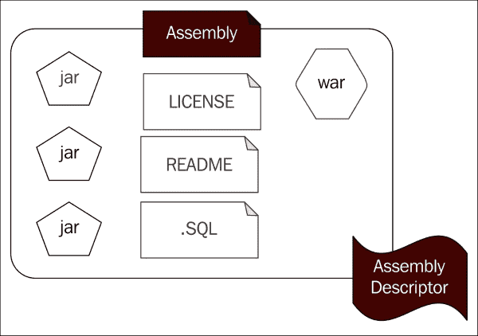

# 第六章：Maven Assemblies

Maven 通过插件和生命周期提供了一种可扩展的架构。插件和关联的生命周期支持诸如 `.jar`、`.war`、`.ear` 等多种存档类型。JAR 插件根据 JAR 规范创建一个具有 `.jar` 扩展名和相关元数据的工件。实际上，JAR 文件是一个包含可选 `META-INF` 目录的 ZIP 文件。你可以从 [`docs.oracle.com/javase/7/docs/technotes/guides/jar/jar.html`](http://docs.oracle.com/javase/7/docs/technotes/guides/jar/jar.html) 找到更多关于 JAR 规范的详细信息。

JAR 文件将一组类文件聚合起来构建一个单一的发行单元。WAR 文件将一组 JAR 文件、Java 类、JSP、图片以及许多其他资源聚合到一个单一的发行单元中，该单元可以在 Java EE 应用服务器中部署。然而，当你构建一个产品时，你可能需要将来自不同地方的许多 JAR 文件、WAR 文件、README 文件、LICENSE 文件等聚合到一个单一的 ZIP 文件中。为了构建这样的存档，我们可以使用 Maven `assembly` 插件。

下图显示了 Maven `assembly` 的可能内容：



在本章中，我们将讨论以下主题：

+   Maven `assembly` 插件

+   存档描述符

+   艺术品/资源过滤器

+   构建定制发行存档的端到端示例

Maven `assembly` 插件生成一个符合用户定义布局的定制存档。这个定制存档也被称为 Maven `assembly`。换句话说，一个 Maven `assembly` 是一个根据定制布局构建的发行单元。

# `assembly` 插件

让我们快速看一下一个使用 `assembly` 插件的真实世界示例。

**WSO2 身份服务器**（**WSO2 IS**）是一个开源的身份和权限管理产品，以 ZIP 文件的形式分发，遵循 Apache 2.0 许可证。ZIP 分发是通过 Maven `assembly` 插件组装的。让我们看一下 WSO2 IS 的 `distribution` 模块的根 POM 文件，它构建了身份服务器发行版，可在 [`svn.wso2.org/repos/wso2/carbon/platform/branches/turing/products/is/5.0.0/modules/distribution/pom.xml`](https://svn.wso2.org/repos/wso2/carbon/platform/branches/turing/products/is/5.0.0/modules/distribution/pom.xml) 找到。

首先，注意 POM 文件的 `plugins` 部分。在这里，你可以看到 `maven-assembly-plugin` 与项目相关联。在插件配置内部，你可以使用 `execution` 元素定义任意数量的执行，该元素是 `executions` 元素的一个子元素，其配置如下：

```java
    <plugin>
      <groupId>org.apache.maven.plugins</groupId>
      <artifactId>maven-assembly-plugin</artifactId>
      <executions>
        <execution>
          <id>copy_components</id>
          <phase>test</phase>
          <goals>
            <goal>attached</goal>
          </goals>
          <configuration>
            <filters>
              <filter>
                ${basedir}/src/assembly/filter.properties
              </filter>
            </filters>
            <descriptors>
              <descriptor>src/assembly/dist.xml</descriptor>
            </descriptors>
          </configuration>
        </execution>
        <execution>
          <id>dist</id>
          <phase>package</phase>
          <goals>
            <goal>attached</goal>
          </goals>
          <configuration>
            <filters>
              <filter>
                ${basedir}/src/assembly/filter.properties
              </filter>
            </filters>
            <descriptors>
              <descriptor>src/assembly/bin.xml</descriptor>
              <descriptor>src/assembly/src.xml</descriptor>
              <descriptor>src/assembly/docs.xml</descriptor>
            </descriptors>
          </configuration>
        </execution>
      </executions>
    </plugin>
```

如果你查看第一个 `execution` 元素，它将 `assembly` 插件的 `attached` 目标与 `default` 生命周期的 `test` 阶段关联起来。同样地，第二个 `execution` 元素将 `attached` 目标与 `default` 生命周期的 `package` 阶段关联起来。

### 注意

Maven `default`生命周期包括：`validate`、`initialize`、`generate-sources`、`process-sources`、`generate-resources`、`process-resources`、`compile`、`process-classes`、`generate-test-sources`、`process-test-sources`、`generate-test-resources`、`process-test-resources`、`test-compile`、`process-test-classes`、`test`、`prepare-package`、`package`、`pre-integration-test`、`integration-test`、`post-integration-test`、`verify`、`install`、`deploy`。

`configuration`元素内的所有内容都是插件特定的。在这种情况下，Maven `assembly`插件知道如何处理`filters`和`descriptors`元素。

在这个特定的例子中，只使用了`assembly`插件的`attached`目标。`assembly`插件引入了八个目标；然而，其中六个已经弃用，包括`attached`目标。不建议使用任何已弃用的目标。稍后，我们将看到如何使用`assembly`插件的`single`目标来替代已弃用的`attached`目标。以下列出了`assembly`插件的六个已弃用目标。如果你正在使用其中任何一个，你应该将你的项目迁移到使用`single`目标，除了第四个，即`unpack`目标。为此，你需要使用 Maven `dependency`插件的`unpack`目标。以下列出了`assembly`插件的六个已弃用目标：

+   `assembly:assembly`

+   `assembly:attached`

+   `assembly:directory`

+   `assembly:unpack`

+   `assembly:directory-single`

+   `assembly:directory-inline`

### 注意

关于 Maven `assembly`插件的更多详细信息及其目标可以在[`maven.apache.org/plugins/maven-assembly-plugin/plugin-info.html`](http://maven.apache.org/plugins/maven-assembly-plugin/plugin-info.html)找到。

# 组件描述符

`assembly`描述符是一个基于 XML 的配置，它定义了如何构建一个组件以及其内容应该如何结构化。

如果我们回到之前的例子，`assembly`插件的`attached`目标会根据`assembly`描述符创建一个二进制分发，在`default` Maven 生命周期的`test`和`package`阶段。每个阶段的`assembly`描述符可以在`descriptors`元素下指定。正如这个特定例子的情况一样，在`descriptors`父元素下定义了多个`descriptor`元素。对于`package`阶段，它有三个组件描述符，如下面的配置所示：

```java
<descriptors>
   <descriptor>src/assembly/bin.xml</descriptor>
   <descriptor>src/assembly/src.xml</descriptor>
   <descriptor>src/assembly/docs.xml</descriptor>
</descriptors>
```

每个`descriptor`元素指示`assembly`插件从哪里加载描述符，并且每个`descriptor`文件将按照定义的顺序依次执行。

让我们来看看`src/assembly/bin.xml`文件，它在这里显示：

```java
<assembly>
  <formats>
    <format>zip</format>
  </formats>
```

### 注意

描述符元素中的文件路径是相对于`distribution`模块下的根 POM 文件给出的。你可以在[`svn.wso2.org/repos/wso2/carbon/platform/branches/turing/products/is/5.0.0/modules/distribution/src/assembly/bin.xml`](https://svn.wso2.org/repos/wso2/carbon/platform/branches/turing/products/is/5.0.0/modules/distribution/src/assembly/bin.xml)找到完整的`bin.xml`文件。

`format`元素的值指定了要生成的存档的最终类型。它可以是指定类型为`zip`、`tar`、`tar.gz`、`tar.bz2`、`jar`、`dir`或`war`。你可以使用相同的汇编描述符来创建多个格式。在这种情况下，你需要在`formats`父元素下包含多个`format`元素。

### 注意

即使你可以在`assembly`描述符中指定汇编的格式，但建议通过插件配置来完成。在插件配置中，你可以为你的汇编定义不同的格式，如下面的代码块所示。这里的优点是你可以拥有多个 Maven 配置文件来构建不同的存档类型。我们将在第七章*最佳实践*中讨论 Maven 配置文件：

```java
<plugin>
  <executions>
    <execution>
      <configuration>
        <formats>
 <format>zip</format>
        </formats>   
      </configuration>
    </execution>
  </executions>
</plugin>
```

```java
  <includeBaseDirectory>false</includeBaseDirectory>
```

当`includeBaseDirectory`元素的值设置为`false`时，将不会创建基础目录，如果设置为`true`，这是默认值，则将在基础目录下创建存档。你可以在`baseDirectory`元素下指定基础目录的值。在大多数情况下，`includeBaseDirectory`的值设置为`false`，以便最终的分发单元直接将所有存档打包在其下方，而不需要另一个根目录：

```java
  <fileSets>
    <fileSet>
      <directory>target/wso2carbon-core-4.2.0</directory>
      <outputDirectory>wso2is-${pom.version}</outputDirectory>
      <excludes>
        <exclude>**/*.sh</exclude>
```

在`fileSets`父元素下的每个`fileSet`元素指定了要组装以构建最终存档的文件集。第一个`fileSet`元素指示将`directory`（即`target/wso2carbon-core-4.2.0`）中的所有内容复制到`outputDirectory`，排除每个`exclude`元素下定义的所有文件。如果没有定义排除项，则将`directory`内部的所有内容复制到`outputDirectory`。在这个特定的情况下，`${pom.version}`的值将被在`distribution`模块下的`pom.xml`文件中定义的存档`version`值所替换。

第一个`exclude`元素指示不要从`target/wso2carbon-core-4.2.0`内部的任何位置复制任何扩展名为`.sh`的文件到`outputDirectory`元素：

```java
        <exclude>**/wso2server.bat</exclude>
        <exclude>**/axis2services/sample01.aar</exclude>
```

第二个`exclude`元素指示不要从`target/wso2carbon-core-4.2.0`内部的任何位置复制任何名为`wso2server.bat`的文件到`outputDirectory`。

第三个`exclude`元素指示不要从`target/wso2carbon-core-4.2.0`内部的任何位置复制文件`axis2services`/`sample01.aar`到`outputDirectory`：

```java
        <exclude>**/axis2services/Echo.aar</exclude>
        <exclude>**/axis2services/Version.aar</exclude>
        <exclude>**/pom.xml</exclude>
        <exclude>**/version.txt</exclude>
        <exclude>**/README*</exclude>
        <exclude>**/carbon.xml</exclude>
        <exclude>**/axis2/*</exclude>
        <exclude>**/LICENSE.txt</exclude>
        <exclude>**/INSTALL.txt</exclude>
        <exclude>**/release-notes.html</exclude>
        <exclude>**/claim-config.xml</exclude>
        <exclude>**/log4j.properties</exclude>
        <exclude>**/registry.xml</exclude>
      </excludes>
    </fileSet>

    <fileSet>
      <directory>
       ../p2-profile-gen/target/wso2carbon-core-4.2.0/repository/conf/identity
      </directory>
      <outputDirectory>wso2is-${pom.version}/repository/conf/identity
      </outputDirectory>
      <includes>
        <include>**/*.xml</include>
      </includes>
```

`include` 元素指示仅从 `../p2-profile-gen/target/wso2carbon-core-4.2.0/repository/conf/identity` 目录内的任何位置复制具有 `.xml` 扩展名的文件到 `outputDirectory`。如果没有定义 `include` 元素，则所有内容都将被包含：

```java
    </fileSet>
    <fileSet>
      <directory>
      ../p2-profile-gen/target/wso2carbon-core-4.2.0/repository/resources/security/ldif
      </directory>

      <outputDirectory>wso2is-${pom.version}/repository/resources/security/ldif
      </outputDirectory>
      <includes>
        <include>identityPerson.ldif</include>
        <include>scimPerson.ldif</include>
        <include>wso2Person.ldif</include>
      </includes>
```

前述代码中提到的三个 `include` 元素指示仅从 `../p2-profile-gen/target/wso2carbon-core/4.2.0/repository/resources/security/ldif` 目录内的任何位置复制具有特定名称的文件到 `outputDirectory`：

```java
    </fileSet>

    <fileSet>
      <directory>
      ../p2-profile-gen/target/wso2carbon-core-4.2.0/repository/deployment/server/webapps
      </directory>
      <outputDirectory>${pom.artifactId}-${pom.version}/repository/deployment/server/webapps
      </outputDirectory>
      <includes>
        <include>oauth2.war</include>
      </includes>
```

`include` 元素指示仅从 `../p2-profile-gen/target/wso2carbon-core/4.2.0/repository/resources/deployment/server/webappas` 目录内的任何位置复制名为 `oauth2.war` 的 WAR 文件到 `outputDirectory`：

```java
    </fileSet>

    <fileSet>
      <directory>
        ../p2-profile-gen/target/wso2carbon-core-4.2.0/repository/deployment/server/webapps
      </directory>
      <outputDirectory>${pom.artifactId}-${pom.version}/repository/deployment/server/webapps
      </outputDirectory>
      <includes>
        <include>authenticationendpoint.war</include>
      </includes>
    </fileSet>

    <fileSet>
      <directory>
        ../styles/service/src/main/resources/web/styles/css
      </directory>
      <outputDirectory>${pom.artifactId}-${pom.version}/resources/allthemes/Default/admin
      </outputDirectory>
      <includes>
        <include>**/**.css</include>
      </includes>
```

`include` 元素指示从 `../styles/service/src/main/resources/web/styles/css` 目录内的任何位置复制任何具有 `.css` 扩展名的文件到 `outputDirectory`：

```java
    </fileSet>

    <fileSet>
      <directory>
       ../p2-profile-gen/target/WSO2-CARBON-PATCH-4.2.0-0006
      </directory>
      <outputDirectory>
        wso2is-${pom.version}/repository/components/patches/
      </outputDirectory>
      <includes>
        <include>**/patch0006/*.*</include>
      </includes>
```

`include` 元素指示从 `../p2-profile-gen/target/WSO2-CARBON-PATCH-4.2.0-0006` 目录内的任何位置复制 `patch006` 目录中的所有文件到 `outputDirectory`：

```java
    </fileSet>
  </fileSets>

  <files>
```

`files` 元素在关键功能方面与 `fileSets` 元素非常相似。两者都可以用来控制组合的内容。

### 小贴士

当你完全清楚确切源文件位置时，应使用 `files/file` 元素，而 `fileSets/fileSet` 元素在根据定义的模式从源中选择文件方面则更加灵活。

下面的片段中的 `fileMode` 元素定义了一组要附加到复制文件的权限。权限按照四位八进制表示法定义。你可以从 [`en.wikipedia.org/wiki/File_system_permissions#Octal_notation_and_additional_permissions`](http://en.wikipedia.org/wiki/File_system_permissions#Octal_notation_and_additional_permissions) 了解更多关于四位八进制表示法的信息：

```java
    <file>
      <source>../p2-profile-gen/target/WSO2-CARBON-PATCH-${carbon.kernel.version}-0006/lib/org.wso2.ciphertool-1.0.0-wso2v2.jar
      </source>
      <outputDirectory>
        ${pom.artifactId}-${pom.version}/lib/
      </outputDirectory>
      <filtered>true</filtered>
      <fileMode>644</fileMode>
    </file>
  <files>
</assembly>
```

在 `assembly` 插件的 `package` 阶段下定义了三个 `descriptor` 元素。我们之前讨论的那个将创建二进制发行版，而 `src/assembly/src.xml` 和 `src/assembly/docs.xml` 文件将分别创建源发行版和文档发行版。

让我们也看看为 `test` 阶段定义的 `assembly` 描述符：

```java
<descriptors>
  <descriptor>src/assembly/dist.xml</descriptor>
</descriptors>
```

这相当简短，仅包括构建 WSO2 身份服务器初始分发的所需配置。尽管此项目在`test`阶段执行此操作，但它似乎没有价值。在这种情况下，似乎需要`maven-antrun-plugin`，它与`package`阶段相关联，但在定义`assembly`插件之前，需要 ZIP 文件分发。理想情况下，除非有非常充分的理由，否则不应在`test`阶段运行`assembly`插件。您可能需要准备好的分发来运行集成测试；然而，集成测试应在`package`阶段之后的`integration-test`阶段执行。在大多数情况下，`assembly`插件与 Maven 的`default`生命周期的`package`阶段相关联。

以下代码显示了为`test`阶段在`src/assembly/dist.xml`中定义的 assembly 描述符：

```java
<assembly>
  <formats>
    <format>zip</format>
  </formats>
  <includeBaseDirectory>false</includeBaseDirectory>
  <fileSets>
    <!-- Copying p2 profile and osgi bundles-->
    <fileSet>
      <directory>
        ../p2-profile-gen/target/wso2carbon-core-4.2.0/repository/components
      </directory>
      <outputDirectory>wso2is-${pom.version}/repository/components
      </outputDirectory>
      <excludes>
        <exclude>**/eclipse.ini</exclude>
        <exclude>**/*.lock</exclude>
        <exclude>**/.data</exclude>
        <exclude>**/.settings</exclude>
      </excludes>
    </fileSet>
  </fileSets>
  <dependencySets>
 <dependencySet>
      <outputDirectory>
         wso2is-${pom.version}/repository/deployment/client/modules
      </outputDirectory>
      <includes>
        <include>org.apache.rampart:rampart:mar</include>
      </includes>
 </dependencySet>
  </dependencySets>
</assembly>
```

此配置引入了一个我们之前未曾见过的元素，即`dependencySet`。`dependencySet`元素允许您将项目依赖项包含或排除在构建的最终组装中。在先前的示例中，它将`rampart`模块添加到`outputDirectory`元素中。`include`元素的值应采用以下格式：`groupdId:artifactId:type[:classifier][:version]`。Maven 将首先在其本地 Maven 仓库中查找具有定义坐标的此工件，如果找到，它将将其复制到`outputDirectory`元素下定义的位置。

与`fileSet`和`file`元素不同，`dependencySet`元素不定义一个具体的路径来选择和复制依赖项。Maven 通过定义的坐标查找工件。如果您只想通过`groupId`元素和`artifactId`坐标包含依赖项，那么您可以遵循以下模式：`groupdId:artifactId`。特定的工件应在 POM 文件的`dependencies`部分声明，该部分定义了`assembly`插件。您可以在`distribution`模块下的 POM 文件中找到以下对`rampart`模块的依赖定义。如果在同一 POM 文件中定义了同一依赖项的两个版本（这相当不可能），则最后定义的版本将被复制：

```java
<dependency>
  <groupId>org.apache.rampart</groupId>
  <artifactId>rampart</artifactId>
  <type>mar</type>
  <version>1.6.1-wso2v12</version>
</dependency>
```

您还可以通过`groupId`、`artifactId`和`type`包含依赖项，如下面的配置所示。然后，您可以遵循以下模式：`groupdId:artifactId:type[:classifier]`。这正是先前的示例中遵循的模式：

```java
<includes>
  <include>org.apache.rampart:rampart:mar</include>
</includes>
```

如果您想更精确，也可以将版本包含在模式中。在这种情况下，它将看起来像这样：

```java
<includes>
  <include>
    org.apache.rampart:rampart:mar:1.6.1-wso2v12
  </include>
</includes>
```

### 注意

大多数时候我们谈论四个 Maven 坐标；然而，为了精确，实际上有五个。Maven 构件可以通过这五个坐标唯一标识：`groupdId:artifactId:type[:classifier]:version`。我们已经讨论了四个主要坐标，但没有讨论`classifier`。这很少使用；在从同一个 POM 文件构建构件但具有多个目标环境的情况下，它可能非常有用。我们将在第七章*最佳实践*中详细讨论`classifiers`。

之前的示例仅涵盖了`assembly`描述符的一个非常小的子集。您可以在[`maven.apache.org/plugins/maven-assembly-plugin/assembly.html`](http://maven.apache.org/plugins/maven-assembly-plugin/assembly.html)找到所有可用的配置选项，这是一个相当详尽的列表。

### 提示

在一个名为`assembly`的目录中包含所有`assembly`描述符文件是一种最佳实践或约定，尽管这不是强制的。

让我们看看另一个带有**Apache Axis2**的真实世界示例。Axis2 是一个在 Apache 2.0 许可下发布的开源项目。Axis2 有三种类型的分发：作为 ZIP 文件的二进制分发，作为 WAR 文件的文件分发，以及作为 ZIP 文件的源代码分发。Axis2 的二进制 ZIP 分发可以独立运行，而 WAR 分发必须部署在 Java EE 应用服务器上。

所有三个 Axis2 分发都是从`distribution`模块内的 POM 文件中创建的，该模块可以在[`svn.apache.org/repos/asf/axis/axis2/java/core/trunk/modules/distribution/pom.xml`](http://svn.apache.org/repos/asf/axis/axis2/java/core/trunk/modules/distribution/pom.xml)找到。

此 POM 文件将 Maven `assembly`插件的`single`目标与项目关联，从而启动创建最终分发构件的过程。`assembly`配置指向三个不同的`assembly`描述符——一个用于 ZIP 分发，第二个用于 WAR 分发，第三个用于源代码分发。以下代码片段显示了`assembly`插件的配置：

```java
<plugin>
  <groupId>org.apache.maven.plugins</groupId>
  <artifactId>maven-assembly-plugin</artifactId>
  <executions>
    <execution>
      <id>distribution-package</id>
      <phase>package</phase>
      <goals>
        <goal>single</goal>
      </goals>
      <configuration>
        <finalName>axis2-${project.version}</finalName>
        <descriptors> 
          <descriptor>
 src/main/assembly/war-assembly.xml
          </descriptor>
          <descriptor>
 src/main/assembly/src-assembly.xml
          </descriptor>
          <descriptor>
 src/main/assembly/bin-assembly.xml
          </descriptor>
        </descriptors>
      </configuration>
    </execution>
  </executions>
</plugin>
```

让我们看看`bin-assembly.xml`文件——构建 ZIP 分发的`assembly`描述符：

```java
<assembly>
  <id>bin</id>
  <includeBaseDirectory>true</includeBaseDirectory> 
  <baseDirectory>axis2-${version}</baseDirectory>
  <formats>
    <!--<format>tar.gz</format>  
    //uncomment,if tar.gz archive needed-->
    <format>zip</format>
  </formats>
```

这正是我们之前讨论的，也是我们想要避免的，原因与前面代码注释中的相同。如果我们想构建`tar.gz`分发，那么我们需要修改文件。而不是这样做，我们可以将`format`配置元素从`assembly`描述符移动到在`pom.xml`文件中定义的插件配置中。然后，您可以定义多个配置文件，并根据配置文件配置存档类型：

```java
  <fileSets>    
     ………………..
  </fileSets>

  <dependencySets>
    <dependencySet>
      <useProjectArtifact>false</useProjectArtifact>

```

`useProjectArtifact`配置元素指示插件是否将在此项目构建中产生的构件包含到`dependencySet`元素中。通过将值设置为`false`，我们可以避免它：

```java
      <outputDirectory>lib</outputDirectory>
      <includes>
        <include>*:*:jar</include>
      </includes>
      <excludes>
        <exclude>
 org.apache.geronimo.specs:geronimo-activation_1.1_spec:jar
        </exclude>
      </excludes>
    </dependencySet>
    <dependencySet>
      <useProjectArtifact>false</useProjectArtifact>
      <outputDirectory>lib/endorsed</outputDirectory>
      <includes>
        <include>javax.xml.bind:jaxb-api:jar</include>
      </includes>
    </dependencySet>
    <dependencySet>
      <useProjectArtifact>false</useProjectArtifact>
      <includes>
        <include>org.apache.axis2:axis2-webapp</include>
      </includes>
      <unpack>true</unpack>

```

`includes`和`excludes`配置元素将确保`distribution/pom.xml`文件的`dependencies`部分下定义的所有艺术品都将包含在构建中，除了在`excludes`配置元素下定义的艺术品。如果你没有定义任何`include`元素，POM 文件中定义的所有依赖项都将包含在构建中，除了在`excludes`部分定义的内容。

一旦将`unpack`配置元素设置为`true`，在`include`元素下定义的所有依赖项都将解压缩到`outputDirectory`。该插件能够解压缩`jar`、`zip`、`tar.gz`和`tar.bz`存档。以下配置中显示的`unpackOptions`配置元素可以用来过滤解压缩依赖项的内容。根据以下配置，只有`unpackOptions`元素下的`include`元素中定义的文件将被包含；其余的将被忽略，不会包含在构建中。在这个特定情况下，`axis2-webapp`是一个 WAR 文件（在先前配置的`include`元素下定义），而`distributions/pom.xml`文件有对其的依赖。这个 Web 应用将被展开（提取），然后`WEB-INF/classes`和`axis2-web`目录中的所有文件将被复制到 ZIP 分发的`webapp`目录中，包括`WEB-INF/web.xml`文件：

```java
      <outputDirectory>webapp</outputDirectory>
      <unpackOptions>
        <includes>
          <include>WEB-INF/classes/**/*</include>
          <include>WEB-INF/web.xml</include>
          <include>axis2-web/**/*</include>
        </includes>
      </unpackOptions>
    </dependencySet>
  </dependencySets>
</assembly>
```

现在，让我们看一下`war-assembly.xml`——构建 WAR 分发的构建描述符。在这个配置中没有新内容，除了`outputFileNameMapping`配置元素。由于`format`元素的值设置为`zip`，这个`assembly`描述符将生成符合 ZIP 文件规范的存档文件。`outputFileNameMapping`配置元素的值应用于所有依赖项。默认值是参数化的：`${artifactId}-${version}${classifier?}.${extension}`。在这种情况下，它是硬编码为`axis2.war`，所以`axis2-webapp`艺术品将被复制到`outputDirectory`元素下定义的位置作为`axis2.war`。由于没有为`outputDirectory`元素定义值，文件将被复制到根位置，如下所示：

```java
<assembly>
  <id>war</id>
  <includeBaseDirectory>false</includeBaseDirectory>
  <formats>
    <format>zip</format>
  </formats>
  <dependencySets>
    <dependencySet>
      <useProjectArtifact>false</useProjectArtifact>
      <includes>
        <include>org.apache.axis2:axis2-webapp</include>
      </includes>
      <outputFileNameMapping>axis2.war</outputFileNameMapping>
    </dependencySet>
  </dependencySets>
  <fileSets>
    <fileSet>
      <directory>../..</directory>
      <outputDirectory></outputDirectory>
        <includes>
          <include>LICENSE.txt</include>
          <include>NOTICE.txt</include>
          <include>README.txt</include>
          <include>release-notes.html</include>
        </includes>
      <filtered>true</filtered>
    </fileSet>
  </fileSets>
</assembly>
```

# 艺术品/资源过滤

我们在第一个示例中为 WSO2 身份服务器中的`assembly`插件定义了一个`filters`配置。这指示`assembly`插件应用提供的过滤器或过滤器集中定义的文件过滤标准。如果你想要对一个特定的文件应用过滤器，那么你应该将`filtered`元素的值设置为`true`。

以下配置展示了如何定义一个过滤器：

```java
<filters>
  <filter>${basedir}/src/assembly/filter.properties</filter>
</filters>
```

让我们来看看文件`${basedir}/src/assembly/filter.properties`。此文件定义了一组名称/值对。名称是一个特殊的占位符，应在要过滤的文件中用`${`和`}`括起来，并在过滤过程中被值替换：

```java
product.name=WSO2 Identity Server 
product.key=IS 
product.version=5.0.0 
hotdeployment=true 
hotupdate=true 
default.server.role=IdentityServer
```

# 组装帮助

正如我们之前讨论的，`assembly`插件目前只有两个活跃的目标：`single`和`help`；所有其他的目标都已弃用。正如我们在前面的示例中看到的，`single`目标负责创建带有各种其他配置的存档。

以下命令显示了如何执行`assembly`插件的`help`目标。这必须在包含 POM 文件的目录中执行：

```java
$ mvn assembly:help -Ddetail=true

```

当你运行此命令时，如果你看到以下错误，可能不是最新版本。在这种情况下，将插件版本更新到 2.4.1 或更高版本：

```java
[ERROR] Could not find goal 'help' in plugin org.apache.maven.plugins:maven-assembly-plugin:2.2-beta-2 among available goals assembly, attach-assembly-descriptor, attach-component-descriptor, attached, directory-inline, directory, directory-single, single, unpack -> [Help 1]

```

# 一个可运行的独立 Maven 项目

由于我们已经涵盖了 Maven `assembly`插件的许多相关信息，让我们看看如何使用`assembly`插件构建一个完整的端到端可运行的独立项目。你可以找到完整的示例在[`svn.wso2.org/repos/wso2/people/prabath/maven-mini/chapter06`](https://svn.wso2.org/repos/wso2/people/prabath/maven-mini/chapter06)。按照以下步骤创建一个可运行的独立 Maven 项目：

1.  首先，创建一个目录结构，如下所示：

    ```java
           |-pom.xml
           |-modules
             |- json-parser
                |- src/main/java/com/packt/json/JSONParser.java
                |- pom.xml
             |- distribution
                |- src/main/assembly/dist.xml
                |- pom.xml
    ```

1.  `JSONParser.java`文件是一个简单的 Java 类，它读取一个 JSON 文件并将其打印到控制台，如下所示：

    ```java
    package com.packt.json;

    import java.io.File;
    import java.io.FileReader;
    import org.json.simple.JSONObject;

    public class JSONParser {

      public static void main(String[] args) {

      FileReader fileReader;
      JSONObject json;

      org.json.simple.parser.JSONParser parser;
      parser = new org.json.simple.parser.JSONParser();

        try {

          if (args == null || args.length == 0 || args[0] == null || !new File(args[0]).exists())   
          {
            System.out.println("No valid JSON file provided");
          } else {
            fileReader = new FileReader(new File(args[0]));
            json = (JSONObject) parser.parse(fileReader);

            if (json != null) {
              System.out.println(json.toJSONString());
            }
          }
         } catch (Exception e) {
          e.printStackTrace();
         }
      }
    }
    ```

1.  现在，我们可以在`modules/json-parser`下创建一个 POM 文件来构建我们的 JAR 文件，如下所示：

    ```java
    <project>

      <modelVersion>4.0.0</modelVersion>
      <groupId>com.packt</groupId>
      <artifactId>json-parser</artifactId>
      <version>1.0.0</version>
      <packaging>jar</packaging>
      <name>PACKT JSON Parser</name>

      <dependencies>
         <dependency>
          <groupId>com.googlecode.json-simple
          </groupId>
          <artifactId>json-simple</artifactId>
          <version>1.1</version>
        </dependency>
      </dependencies>

    </project>
    ```

1.  一旦我们完成了`json-parser`模块，下一步就是创建`distribution`模块。`distribution`模块将有一个 POM 文件和一个`assembly`描述符。让我们首先在`modules/distribution`下创建 POM 文件，如下所示。这将与项目关联两个插件：`maven-assembly-plugin`和`maven-jar-plugin`。这两个插件都在 Maven `default`生命周期的`package`阶段执行。由于`maven-assembly-plugin`在`maven-jar-plugin`之前定义，因此它将首先执行：

    ```java
    <project>
      <modelVersion>4.0.0</modelVersion>
      <groupId>com.packt</groupId>
      <artifactId>json-parser-dist</artifactId>
      <version>1.0.0</version>
      <packaging>jar</packaging>
      <name>PACKT JSON Parser Distribution</name>

      <dependencies>
    <!—
    Under the dependencies section we have to specify all the dependent jars that must be assembled into the final artifact. In this case we have two jar files. The first one is the external dependency that we used to parse the JSON file and the second one includes the class 
    we wrote.
    -->
        <dependency>
          <groupId>com.googlecode.json-simple</groupId>
          <artifactId>json-simple</artifactId>
          <version>1.1</version>
        </dependency>
        <dependency>
          <groupId>com.packt</groupId>
          <artifactId>json-parser</artifactId>
          <version>1.0.0</version>
        </dependency>
      </dependencies>

      <build>
        <plugins>
          <plugin>
            <groupId>org.apache.maven.plugins</groupId>
            <artifactId>maven-assembly-plugin</artifactId>
            <executions>
              <execution>
                <id>distribution-package</id>
                <phase>package</phase>
                <goals>
                  <goal>single</goal>
                </goals>
                <configuration>
                  <finalName>json-parser</finalName>
                  <descriptors>
                    <descriptor>
     src/main/assembly/dist.xml
                    </descriptor>
                  </descriptors>
                </configuration>
              </execution>
            </executions>
          </plugin>

    <!—
    Even though the maven-jar-plugin is inherited from the super pom, here we have redefined it because we need to add some extra configurations. Since we need to make our final archive executable, we need to define the class to be executable in the jar manifest. Here we have set com.packt.json.JSONParser as our main class. Also – the classpath is set to the lib directory. If you look at the assembly descriptor used in the assembly plugin, you will notice that, the dependent jar files are copied into the lib directory. The manifest configuration in the maven-jar-plugin will result in the following manifest file (META-INF/MANIFEST.MF).

    Manifest-Version: 1.0
    Archiver-Version: Plexus Archiver
    Created-By: Apache Maven
    Built-By: prabath
    Build-Jdk: 1.6.0_65
    Main-Class: com.packt.json.JSONParser
    Class-Path: lib/json-simple-1.1.jar lib/json-parser-
    1.0.0.jar
    -->

          <plugin>
            <groupId>org.apache.maven.plugins</groupId>
            <artifactId>maven-jar-plugin</artifactId>
            <version>2.3.1</version>
            <configuration>
              <archive>
                <manifest>
     <addClasspath>true</addClasspath>
     <classpathPrefix>lib/</classpathPrefix>
     <mainClass>com.packt.json.JSONParser
     </mainClass>
                </manifest>
              </archive>
            </configuration>
          </plugin>

        </plugins>
      </build>
    </project>
    ```

1.  以下配置显示了`assembly`描述符（`module/distribution/src/main/assembly/dist.xml`），对应于上一步中定义的`assembly`插件：

    ```java
    <assembly>
      <id>bin</id>
      <formats>
        <format>zip</format>
      </formats>

      <dependencySets>
        <dependencySet>
          <useProjectArtifact>false</useProjectArtifact>
          <outputDirectory>lib</outputDirectory>
          <unpack>false</unpack>
        </dependencySet>
      </dependencySets>

      <fileSets>
        <fileSet>
          <directory>${project.build.directory}</directory>
          <outputDirectory></outputDirectory>
          <includes>
     <include>*.jar</include>
     </includes>
        </fileSet>
      </fileSets>
    </assembly>
    ```

1.  现在，我们也完成了`distribution`模块。接下来，我们将创建根 POM 文件，它聚合了`json-parser`和`distribution`模块，如下所示：

    ```java
    <project>
      <modelVersion>4.0.0</modelVersion>
      <groupId>com.packt</groupId>
      <artifactId>json-parser-aggregator</artifactId>
      <version>1.0.0</version>
      <packaging>pom</packaging>
      <name>PACKT JSON Parser Aggregator</name>
      <modules>
        <module>modules/json-parser</module>
        <module>modules/distribution</module>
      </modules>
    </project>
    ```

1.  我们已经准备好构建项目了。从根目录，输入`mvn clean install`。这将产生位于`modules/distribution/target`目录中的`json-parser-bin.zip`存档。输出如下：

    ```java
    [INFO] ----------------------------------------------------
    [INFO] Reactor Summary:
    [INFO] 
    [INFO] PACKT JSON Parser............... SUCCESS [  1.790 s]
    [INFO] PACKT JSON Parser Distribution.. SUCCESS [  0.986 s]
    [INFO] PACKT JSON Parser Aggregator.... SUCCESS [  0.014 s]
    [INFO] ----------------------------------------------------
    [INFO] BUILD SUCCESS
    [INFO] ----------------------------------------------------

    ```

1.  前往`modules/distribution/target`并解压`json-parser-bin.zip`。

1.  要运行解析器，请输入以下命令，它将输出`No valid JSON file provided`：

    ```java
    $ java -jar json-parser/json-parser-dist-1.0.0.jar

    ```

1.  再次运行解析器，并使用有效的 JSON 文件。您需要将 JSON 文件的路径作为参数传递：

    ```java
    $ java -jar json-parser/json-parser-dist-1.0.0.jar myjsonfile.json

    ```

    下面的输出是由前面的命令产生的：

    ```java
    {
     "bookName"  : "Mastering Maven", "publisher" : "PACKT"
    }

    ```

# 摘要

在本章中，我们专注于 Maven 的 `assembly` 插件。`assembly` 插件提供了一种构建自定义归档文件的方法，聚合了许多其他自定义配置和资源。大多数基于 Java 的产品都使用 `assembly` 插件来构建最终的分发工件。这些可以是二进制分发、源代码分发，甚至是文档分发。本章详细介绍了如何使用 Maven 的 `assembly` 插件的实际案例，并最终以一个端到端的示例 Maven 项目结束。

在下一章中，我们将讨论 Maven 的最佳实践。
