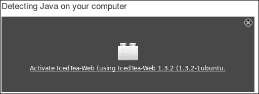
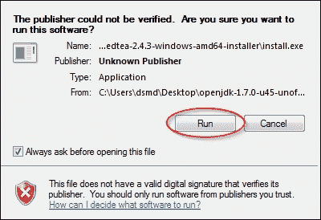
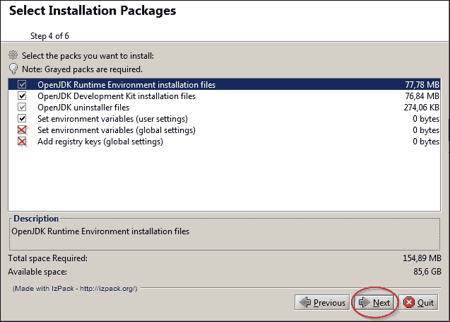
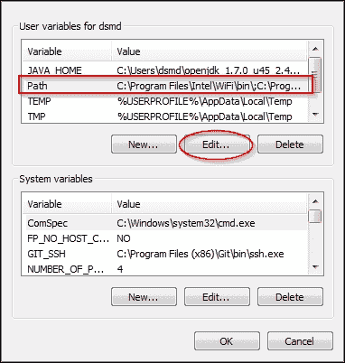
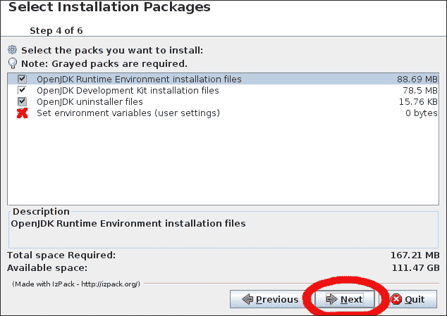

# 第一章. 开始使用 OpenJDK

在本章中，我们将涵盖以下主题：

+   区分 OpenJDK 和 Oracle JDK

+   在 Windows 上安装 OpenJDK

+   在 Windows 上配置 OpenJDK

+   在 Linux 上安装 OpenJDK

+   在 Linux 上配置 OpenJDK

+   在 OpenJDK 组和项目中导航

# 简介

OpenJDK 现在是一个官方的 Java 7 参考实现，现在也是 Java 8 的。这意味着 Java 生态系统中最基本的项目现在是开源的。这也意味着 OpenJDK 可以通过多种方式安装——从源码构建到如果有的话，通过包管理器安装二进制包。

Sun 努力发布开源 JDK 是项目公开宣布的开始，发生在 2006 年的 JavaOne 会议上。HotSpot 是在 GPLv2 许可证下发布的。**Java 类库**（**JCL**）的完整源代码在 2007 年 5 月以 GPL 许可证发布，除了几个与 GPL 不兼容的许可证的专有部分。

然而，在 2009 年 4 月的 OpenJDK 7 b53 更新中，OpenJDK 需要一些专有部分（占总代码行的 4%到 1%，具体取决于更新号），这些部分以单独的专有包的形式存在。

人们可能会认为初始安装和配置相当简单，不需要某种详细的解释。在许多方面，这是真的；但在这个过程中也有一些困难。

我们将首先区分 OpenJDK 和 Oracle JDK。后者基于前者，但并非全部。每个都有自己的优点和缺点。OpenJDK 的主要优点是它是开源的，而 Oracle JDK 总是被推荐并且是现成的。此外，OpenJDK 6 是 Java 6 停止后唯一可维护的 Java 6 实现。

然后，我们将介绍 Windows 的安装过程以及一些 Windows 版本可能遇到的问题。之后，我们将描述一些典型的配置文件，以针对各种需求配置已安装的 OpenJDK 实例，例如服务器实例和开发人员实例。

然后，我们将更深入地探讨一些复杂的问题，例如在各种 Linux 系统上安装 OpenJDK。至少有两种常见的方法：依赖于发行版的发行版推荐方法，以及适用于所有 Linux 系统的另一种方法。

Linux 的配置基本上与 Windows 相同，但也有一些需要说明的差异。这些差异主要与系统哲学有关，即它是如何实现的，以及确切地做了什么。

然后，我们将以介绍性的方式探讨 OpenJDK 的内部结构。我们将考虑已经使用的 OpenJDK 项目，并学习如何使用我们以后需要的工具。此外，我们还将简要地查看 OpenJDK 组，了解它们在做什么以及它们可能如何影响 OpenJDK 的进一步发展。

最后但同样重要的是，您将学习如何从 Adopt OpenJDK 项目中受益，该项目也是 OpenJDK 社区的一部分。Adopt OpenJDK 是一个旨在提高 OpenJDK 可用性准备就绪、测试新语言版本以及做任何使 OpenJDK 对用户和开发者更有用和受欢迎的事情的努力。

本章的编写目的是介绍性的，不涵盖 Oracle Java 中常见的某些细节。然而，它提供了工作的必要基础。

我们将使用 Java 7，因为它稳定且是可用的最新 Java 版本。所有截图和过程都假设我们使用 Java 7，除非明确提及其他版本。

如果您已经将 OpenJDK 构建并安装为默认版本，并且您了解 OpenJDK 和 Oracle JDK 之间的区别，以及 Adopt OpenJDK 的存在，您可以完全跳过这一章。

# 区分 OpenJDK 和 Oracle JDK

虽然 OpenJDK 是 Java 平台的官方参考实现，但某些 Oracle 提供的软件不是开源的。其中最著名的是 Java 浏览器插件，但差异远不止于此。这个食谱将向您展示如何区分 OpenJDK 和 Oracle JDK。

## 准备工作

要遵循这个食谱，您需要一个已安装的 OpenJDK 实例。如果您还有一个 Oracle JDK 实例，这将有助于您感受两者的区别。此外，我们将假设您有一个 Linux 安装和一个已安装并准备使用的`update-java-alternatives`命令。要了解如何在各种系统上安装 OpenJDK，请参阅本章后面的食谱。如果您没有安装`update-alternatives`（对于 Fedora、Gentoo 等），请访问*配置 Linux 上的 OpenJDK*食谱或参考您的发行版文档/论坛。

## 如何操作...

请查看以下步骤，了解 OpenJDK 和 Oracle JDK 之间的区别：

1.  我们将打开一个终端并输入以下命令：

    ```java
    update-java-alternatives  --list

    ```

1.  我们将看到已安装的 Java 实现的全列表：

    ```java
    $ update-java-alternatives  --list
    java-1.6.0-openjdk-amd64 1061 /usr/lib/jvm/java-1.6.0-openjdk-amd64
    java-1.7.0-openjdk-amd64 1071 /usr/lib/jvm/java-1.7.0-openjdk-amd64
    java-6-oracle 1073 /usr/lib/jvm/java-6-oracle
    java-7-oracle 1081 /usr/lib/jvm/java-7-oracle
    java-8-oracle 1082 /usr/lib/jvm/java-8-oracle

    ```

1.  让我们将 Oracle Java 设置为默认。我们将使用`root`权限运行以下命令：

    ```java
    update-java-alternatives  --set java-7-oracle

    ```

    ### 小贴士

    此命令可能会产生错误，例如“没有 apt 的替代品”。没关系，只需忽略它们即可。

1.  然后，我们将前往[`www.java.com/en/download/installed.jsp?detect=jre`](https://www.java.com/en/download/installed.jsp?detect=jre)并检查我们的浏览器插件版本。我们将看到激活链接（紧随激活实体名称之后）。

    我们可以从我们操作的结果中看到，Java 浏览器插件已经安装。

1.  让我们尝试将 OpenJDK 设置为默认的 Java 环境（在您的案例中实际实例名称可能不同）：

    ```java
    update-java-alternatives  --set java-1.7.0-openjdk-amd64

    ```

1.  然后我们将进入浏览器页面并刷新它。可能需要重新启动浏览器，以便更改生效，如下面的截图所示：

我们可以看到，该插件并非来自 JDK 本身，而是来自一个名为 IcedTea 的项目。

IcedTea 是一个开源项目，其目标是尽可能多地替换 Java 生态系统的专有部分。该插件本身来自 IcedTea-Web，它是 Java Web Start 和 Java 浏览器插件的开源实现。

在大多数发行版中，`IcedTea`插件默认安装。但有必要记住，它是一个开源插件，绝对不是一个参考插件。这意味着它的功能可能略有不同于 Oracle 插件。也可能某些功能可能无法使用。

## 它是如何工作的...

Oracle JDK 仍然有一些专有组件，浏览器插件就是一个例子。在本章中，我们需要看到 OpenJDK 和 Oracle JDK 组件之间的区别。

此外，OpenJDK 和 Oracle JDK 之间巨大的差异在于许可证。OpenJDK 是开源的，而 Oracle JDK 包含专有部分，因此它根据 Oracle 二进制许可证授权。OpenJDK 是开源的事实，通过能够研究和修改其源代码，提供了全新的好处（以及令人兴奋的发现）。还值得一提的是，超过 90%的 Oracle JDK 基于 OpenJDK 源代码。这意味着 OpenJDK 的质量在没有任何妥协的情况下。与 Oracle JDK 相比，OpenJDK 中缺失的不仅仅是浏览器插件。

## 参见

+   在第五章 *构建 IcedTea* 中，有关于如何从源代码构建 IcedTea 的详细说明。

# 在 Windows 上安装 OpenJDK

Windows 是世界上使用最广泛的操作系统，许多开发者将其作为他们的主要系统。尽管它很受欢迎，但 Windows 并没有像 Linux 那样得到 OpenJDK 开发社区的强烈支持，安装产品并不像在 Linux 上那么容易。这个配方将涵盖在 Windows 上安装 OpenJDK 所需的步骤。

这个配方提供了一个简单但去中心化的安装程序方法，尽管最新版本提供了自己的软件包仓库。然而，在 Windows 上，安装最新版 OpenJDK 的唯一官方方式是从源代码构建。

## 准备工作

要遵循这个配方，我们需要一个已安装的 Windows 系统。Windows 7 或 Windows 8 将是最佳选择，因为 Windows XP 已经被微软官方停止支持。

## 如何操作...

在 Windows 上有一个官方的 OpenJDK 构建，但它仅用于参考目的。它是官方的，安装简单，但没有安全更新或改进。然而，存在非官方构建，由 Alex Casco 维护。我们将尝试以两种方式安装 OpenJDK：

1.  我们将从一个官方参考构建开始。要获取它，我们需要访问[`jdk7.java.net/java-se-7-ri/`](https://jdk7.java.net/java-se-7-ri/)并接受许可条款。然后，下载并运行安装程序。

    ### 小贴士

    虽然 OpenJDK 源代码由开放许可证许可，但这个官方构建由 Oracle 二进制代码许可证和 GPLv2 许可。如果您想保持 OpenJDK 的开源性，请使用由 GPLv2 许可的版本。

1.  将下载的文件解压缩到您喜欢的位置。让我们称它为`C:/OpenJDK`。

1.  通过导航到**开始** | **运行**，输入`cmd`，然后点击**运行**按钮来打开 Windows 命令行。

1.  运行以下命令：

    ```java
    C:\OpenJDK\bin\java.exe -version

    ```

    它将输出 Java 版本信息。输出应该看起来像这样：

    ```java
    openjdk version 1.7.0
    OpenJDK Runtime Environment <build 1.7.0-b146>
    OpenJDK Client VM <build 21.0-b16, mixed mode>
    ```

恭喜！我们刚刚安装了 OpenJDK 官方二进制文件。

## 它是如何工作的...

参考实现是 OpenJDK 唯一可用的官方二进制构建版本。但它缺乏安全性，仅用于参考目的。它是一个需要解压缩才能使用的简单存档。

为了绕过这种不愉快的情况，并给 Windows 用户提供一个机会，无需从源代码构建即可将 OpenJDK 作为二进制文件安装，OpenJDK 的一位贡献者建立了一个完全非官方但非常有用的 OpenJDK 构建集，适用于各种平台。

此外，这个二进制构建版本与官方版本不同，它是开源的，并且使用 GPL 许可证。因此，我们甚至可以在一个完全开源的环境中使用它，而无需添加任何可能让我们陷入麻烦的专有组件。

### 小贴士

在那些非官方构建中，您也会找到一个 Mac 的安装程序。

## 还有更多...

虽然官方参考二进制文件已经过时，但有一个非官方项目提供了来自最新源代码的 OpenJDK 构建。

现在我们将从非官方构建中安装 OpenJDK 7：

1.  前往[`github.com/alexkasko/openjdk-unofficial-builds`](https://github.com/alexkasko/openjdk-unofficial-builds)。

1.  选择适合 Windows 的适当构建并下载它。

1.  解压缩它并运行`install.exe`。

1.  当出现前面的消息时，点击**运行**按钮。

1.  仔细阅读并接受许可协议，然后点击**下一步**。

1.  在下一个窗口中选择安装路径。它默认指向您的家目录，所以请小心——这样的安装可能只有您自己才能访问。

1.  如果目标目录不存在，让安装程序创建它。

1.  如果您只想将此 JDK 设置为系统所有用户的默认值，而不仅仅是您自己的，请仅检查前面的截图中的红色突出显示的复选框。如果您根本不需要此 JDK 为默认值，您可以取消勾选第四个框。

1.  然后点击**下一步**按钮，等待安装完成。

1.  然后最后一次点击**下一步**按钮。

1.  然后点击**完成**。

## 参考信息

虽然安装 OpenJDK 最简单的方法是解压缩二进制文件，手动或自动进行，但毫无疑问，使用源代码将在所有可能级别上给我们带来更多的灵活性。

想了解更多，请阅读以下章节：

+   第二章，*构建 OpenJDK 6* 到 第四章，*构建 OpenJDK 8*，了解从源代码构建 OpenJDK

+   第六章，*使用其他虚拟机实现构建 IcedTea*，以使用其他虚拟机构建 OpenJDK

+   第十三章，*构建自动化*，以使用未来技术，这些技术将相当长一段时间内无法以二进制形式获得

# 在 Windows 上配置 OpenJDK

虽然初始配置对于大多数任务已经足够，但仍可能需要做一些配置。在 OpenJDK 的情况下，这是通过设置系统变量来完成的。在这里，我们将仅讨论在手动解包 JDK 时经常出现的情况——如何将其设置为默认值。

## 准备工作

为了遵循这个食谱，我们需要在我们的 Windows 系统上安装一个 OpenJDK 实例。Windows 7 或 Windows 8 将是最佳选择，因为 Windows XP 已经被微软正式停止支持。

## 如何操作...

首先，我们需要将我们的 OpenJDK 实现作为默认 Java 实例安装。这对于开发通常是必要的：

1.  为了做到这一点，我们将转到**开始** | **控制面板** | **系统** | **高级** | **环境变量** | **用户变量**（或**系统变量**用于系统范围的配置）并将 Java 可执行文件的路径添加到`PATH`系统变量中，如图所示：

    ### 小贴士

    如果存在其他路径指向其他 Java 可执行文件，我们可能也需要删除它们，但最好还是记住它们，因为我们可能需要恢复我们旧的默认 Java 设置。

1.  如果我们从非官方构建安装 OpenJDK，可能根本不需要更改`PATH`变量。

1.  为了验证我们新配置的变量，我们将转到命令提示符并输入以下内容：

    ```java
    java -version
    ```

1.  预期的输出是我们新安装的构建版本。

## 它是如何工作的…

为了将新安装的 OpenJDK 实例设置为默认 JDK，我们需要更改系统变量。更改后，我们的 Java 可执行文件将对系统可见。

## 还有更多...

同样的程序用于设置`CLASSPATH`变量。这并不是非常必要，如果你使用其他库如 GNU classpath，你可能已经知道了。

# 在 Linux 上安装 OpenJDK

Linux 操作系统允许进行许多内部调整，以及修改系统的源代码。它也被称为一个复杂的操作系统，并非所有发行版都易于使用。有很多人在使用它，它是开源的，例如 OpenJDK 本身。安装过程因选择的发行版而异，我们将介绍三种最常用的包管理器的安装过程，以及适用于几乎所有 x86 Linux 分发的安装过程。

## 准备工作

要遵循这个食谱，你需要一个已安装的 Linux 系统。如果它的内核版本是 2.6 或更高，那就更好了，尽管据报道 OpenJDK 在 2.4 内核上也能工作。此外，如果你有`.deb`、`.rpm`或`.ebuild`包管理器，安装任何包的推荐方法是使用这些来安装。

## 如何做...

当涉及到各种软件包的安装时，这个过程取决于我们的 Linux 发行版。

对于基于 Debian 的发行版：

1.  打开终端并输入：

    ```java
    apt-get install openjdk-7-jdk
    ```

    ### 提示

    我们应该有 root 权限或使用`sudo`来访问系统文件。

1.  这将自动触发安装。如果我们收到一个错误消息，表明找不到包，我们应该在谷歌上搜索适合我们发行版的 OpenJDK 包的适当名称。

对于基于 RPM 的发行版，我们首先需要搜索包名，因为不同发行版的包名各不相同，如下所示：

```java
yum search openjdk
```

你将看到如下输出：

```java
java-1.6.0-openjdk.x86_64 : OpenJDK Runtime Environment
java-1.6.0-openjdk-demo.x86_64 : OpenJDK Demos
java-1.6.0-openjdk-devel.x86_64 : OpenJDK Development Environment
java-1.6.0-openjdk-javadoc.x86_64 : OpenJDK API Documentation
java-1.6.0-openjdk-src.x86_64 : OpenJDK Source Bundle
java-1.7.0-openjdk.x86_64 : OpenJDK Runtime Environment
java-1.7.0-openjdk-demo.x86_64 : OpenJDK Demos
java-1.7.0-openjdk-devel.x86_64 : OpenJDK Development Environment
java-1.7.0-openjdk-javadoc.noarch : OpenJDK API Documentation
java-1.7.0-openjdk-src.x86_64 : OpenJDK Source Bundle
```

你可以安装所有具有所需版本的包。然后，我们将运行另一个命令，使用我们刚刚找到的包名：

```java
yum install <a found package name>
```

这也将触发自动下载和安装。

如果我们有一个基于 Gentoo 的发行版，只需输入以下内容：

```java
emerge openjdk-1.7
```

这将根据你的发行版，解压并安装一个二进制包，或者更有可能的是，自动从源代码构建这个包。

## 还有更多...

除了推荐的方式之外，还有一个通用的安装程序。虽然它可能会对你的操作系统造成一些损害，但这个程序相当简单，所以除非你真的知道你在做什么，否则不要使用它：

1.  这是解压 OpenJDK 系统并自行安装的方法。要获取构建版本，我们将再次参考非官方构建页面，[`github.com/alexkasko/openjdk-unofficial-builds`](https://github.com/alexkasko/openjdk-unofficial-builds)。

1.  然后将下载的包解压到一个文件夹中，并从该文件夹运行以下命令：

    ```java
    java -jar ./install.jar
    ```

1.  将出现一个 GUI 安装器窗口。阅读并接受许可协议，选择目录，并允许创建 OpenJDK，如果它不存在，如下所示：

1.  如果你想将此安装设置为默认安装，请勾选前面的复选框。然后点击**下一步**按钮。

1.  等待安装完成，并最后一次点击**下一步**。

1.  然后点击**完成**。

# 在 Linux 上配置 OpenJDK

Linux 配置配置文件与 Windows 的不同，因为那些系统在处理资源以及硬件的方式上略有不同。在这里，我们将简要解释这些差异以及克服它们的方法。此外，不同的 Linux 发行版，像往常一样，有不同的处理配置的方式。我们将尝试介绍最显著的几种。

## 准备中

要遵循此食谱，您需要在 Linux 系统上安装一个 OpenJDK 实例。`deb`、`rpm`或`ebuild`发行版非常适合我们，尽管我们还将看到一种通用的 Linux 配置方法。

此外，我们还需要确保 bash 启动文件正确安装。

### 小贴士

在大多数 Linux 发行版中，不建议使用通用方式配置需要 root 访问权限的任何内容，这种方法的成果往往会在每次更新中消失。通常，有发行版推荐的指南，其中描述了问题解决方案。

## 如何做到这一点…

首先，让我们检查您的 bash 启动文件是否已安装。最简单的方法是使用它们配置 OpenJDK。它们是系统范围的且易于使用，尽管它们的用法有一些缺点，例如更新冲突：

1.  在您的终端中输入以下行：

    ```java
    cat /etc/profile
    ```

    如果文件存在并且包含某种 shell 脚本，那么你的 bash 启动文件的设置可能正确。如果不正确，请按照您的发行版说明进行设置。

1.  然后添加`/etc/profile.d/openjdk.sh`文件。

1.  为了配置不同的事情，编写以下内容：

    ```java
    To set JAVA_HOME
    JAVA_HOME=<youJDK installation directory>
    export JAVA_HOME

    To append JAVA_HOME to PATH
    pathappend $JAVA_HOME/bin PATH

    To adjust CLASSPATH directory
    AUTO_CLASSPATH_DIR=<classpath dir>
    pathprepend . CLASSPATH

    for dir in `find ${AUTO_CLASSPATH_DIR} -type d 2>/dev/null`; do
        pathappend $dir CLASSPATH
    done

    for jar in `find ${AUTO_CLASSPATH_DIR} -name "*.jar" 2>/dev/null`; do
        pathappend $jar CLASSPATH
    done

    export CLASSPATH
    ```

    ### 小贴士

    应尽可能避免使用`CLASSPATH`环境变量。它通常由主要配置为 JDK 1.2 及以下版本的旧版 Java 应用程序使用。使用`java`和`javac`命令的`-classpath`选项代替。

上述代码相当简单——它只是将所有 JAR 文件追加到类路径中。

## 它是如何工作的…

此脚本在 shell 初始化期间调用，因此每次您执行 shell 初始化时，这些变量都会被导出。因此，这些变量是系统范围的，所以在玩弄它们时要小心，因为如果在文件中犯了一些错误，它们可能会永久性地导致您的 Java 失败。

## 还有更多…

在 Linux 上，您可以使用`tree`命令查看已安装 OpenJDK 的目录结构。

要这样做，安装`tree`包（如果可能，请使用您的发行版文档）并输入：

```java
tree -L 1 <path-to-openjdk> -lah
```

您将看到以下内容：

```java
/usr/lib/jvm/java-7-openjdk-amd64
├── [  22]  ASSEMBLY_EXCEPTION -> jre/ASSEMBLY_EXCEPTION
├── [4.0K]  bin
├── [  41]  docs -> ../../../share/doc/openjdk-7-jre-headless
├── [4.0K]  include
├── [4.0K]  jre
├── [4.0K]  lib
├── [4.0K]  man
├── [  20]  src.zip -> ../openjdk-7/src.zip
└── [  22]  THIRD_PARTY_README -> jre/THIRD_PARTY_README
```

这是第一级目录结构，其中：

+   `ASSEMBLY_EXCEPTION`是关于许可的，`THIRD_PARTY_README`也是如此。

+   `docs`文件夹用于各种 OpenJDK 文档（变更日志、版权、作者等）。

+   `include`目录用于包含路径（例如，对于`JNI`）。

+   `jre`目录是 Java 运行时放置的地方。

+   `lib`目录是放置各种 OpenJDK 库的地方（例如 Jigsaw 或 CORBA 支持；主要是由所有 OpenJDK 代码组成）。

+   `man`命令是 OpenJDK 的手册页条目。它包含 OpenJDK 类、`javadocs`和其他手册条目。在极不可能发生互联网连接丢失的情况下，它可能非常有用。

# 在 OpenJDK 组和项目中导航

OpenJDK 不是一个庞大的项目。它由大量子项目组成，由相对较小的开发者团队开发。我们将查看它们，并了解 OpenJDK 内部的工作原理。

## 准备工作

要遵循此食谱，您需要一个已安装的 OpenJDK 实例和稳定的互联网连接。这个食谱更多的是为了对过程的初步理解，而不是实际应用，所以如果您熟悉这些事情，请不要犹豫，可以完全跳过这个食谱。

## 如何操作...

我们将看到 OpenJDK 由什么组成：

1.  访问[`openjdk.java.net/`](http://openjdk.java.net/)。

1.  在右侧列中，还有关于组和项目的概述。

1.  我们将从中选择一个来完成这个过程。

    ### 小贴士

    该过程将在第八章 *Hacking OpenJDK*中详细描述。

1.  让选定的项目为`JDK9`。

1.  前往[`openjdk.java.net/projects/jdk9/`](http://openjdk.java.net/projects/jdk9/)的`JDK9`项目页面。

没有什么可看的，因为只有基本的入职信息。大部分的项目业务都在问题跟踪器中。

在官方网站上阅读有关项目的信息后，我们将前往 JDK JIRA 查看这里发生了什么。我们将访问[`bugs.openjdk.java.net/browse/JDK/fixforversion/14949`](https://bugs.openjdk.java.net/browse/JDK/fixforversion/14949)的 JIRA 中的`JDK9`部分。

在这里，我们可以看到与 JDK9 直接相关的问题，并了解过程是如何进行的。

## 它是如何工作的...

组是一组可能在不同项目中工作但属于一个大范围的开发者。开发者参与选择的项目，项目由组赞助。

### 小贴士

要参与一个组并成为贡献者，请遵循[`openjdk.java.net/contribute/`](http://openjdk.java.net/contribute/)中的说明。

有四种主要的项目类型：

+   功能

+   改进

+   替换

+   可移植性

例如，JDK9 项目是一个特色项目。图形光栅化项目是一个替换项目，而 Swing 组是一个专注于 Swing 改进的整个组。

各种端口的项目显然是可移植性的。

## 参见

+   请参阅第八章，*Hacking OpenJDK*，第十一章，*故障排除*，以及第十三章，*构建自动化*——它们将非常适合您

+   在第四章，*构建 OpenJDK 8*中查看尾巴。
