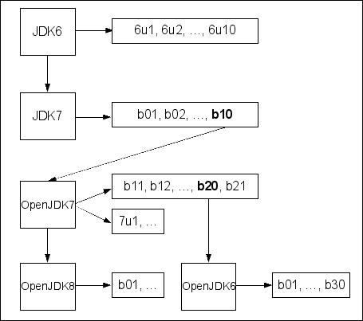

# 第二章：构建 OpenJDK 6

在本章中，我们将涵盖以下内容：

+   准备 CA 证书

+   在 Ubuntu Linux 12.04 LTS 上构建 OpenJDK 6

+   为最兼容的 Linux 构建设置最小构建环境

+   为 Windows 构建安装 Cygwin

+   在 Windows 上为 OpenJDK 6 构建 32 位 FreeType 库

+   在 Windows 上为 OpenJDK 6 构建 64 位 FreeType 库

+   在 Windows 7 SP1 上构建 32 位 OpenJDK 6

+   在 Windows 7 x64 SP1 上构建 64 位 OpenJDK 6

# 简介

OpenJDK 6 是 Java 平台标准版 6 的免费和开源实现。目前，该项目由社区积极维护，由红帽公司担任主导角色。

在所有 Java 平台版本中，Java 6 的寿命最长。其参考实现 Sun Java 6 于 2006 年 12 月发布，而 Java 平台下一个版本的参考实现 OpenJDK 7 直到 2011 年 7 月才推出。在这 5 年期间，许多应用程序都是基于这个平台版本构建的。

此外，在这些年间，参考实现的作者 Sun Microsystems 被甲骨文公司收购，因此该产品被更名为 Oracle Java。2013 年 2 月，甲骨文公司结束了 Oracle Java 6 的公共支持，但这并不意味着 Java 6 的终结：红帽公司担任 OpenJDK 6 的主导角色，现在它继续定期发布新版本。

OpenJDK 6 代码库与 Oracle 和 Sun Java 6 以及 OpenJDK 7 代码库都大相径庭。它最初是 OpenJDK 7 构建 20 的一个分支，第一个通过 Java 兼容性工具包测试套件的版本在 OpenJDK 7 正式发布之前就已经发布。版本方案与 Oracle Java 6 的版本方案不同。每个版本都没有更新号，只有构建号，例如 b01 和 b02。在撰写本书时，2014 年 1 月的发布版本为 b30。

您可以在以下图表中看到 OpenJDK 6 的家族树：



图表参考：[`blogs.oracle.com/darcy/entry/openjdk_6_genealogy`](https://blogs.oracle.com/darcy/entry/openjdk_6_genealogy)

OpenJDK 6 支持 Linux、Windows 和 Solaris 操作系统。以下将仅讨论 Windows 和 Linux 版本。对于 Linux 和 Windows 操作系统，支持 x86 和 x86_64 架构。为了符合 OpenJDK 术语，将使用**i586**术语表示 x86 架构，而**amd64**将用于 x86_64 架构。OpenJDK 6 不支持交叉编译，因此必须使用 i586 操作系统来构建 i586 版本，对于 amd64 也是如此。对于 Linux 版本，这两个架构的构建过程几乎相同，但对于 Windows 版本则大相径庭。

# 准备 CA 证书

**公钥加密**在互联网上被广泛使用。当网络浏览器打开一个安全网站时，它会将服务器端证书与网站域名进行核对。为了执行此类检查，所有网络浏览器都有一个可能用于签署网站服务器端证书的**证书颁发机构**（**CA**）证书列表。此类检查可能被禁用，但它们是安全网络浏览、客户端银行等必要的一部分。

当 Java 程序（例如，从安全站点下载文件）使用网站访问时，前面的示例中的浏览器等程序应检查网站证书。此类检查通常由底层 SSL API 实现执行，并且对于浏览器，CA 证书列表必须对 OpenJDK 运行时可用。

此列表以**Java 密钥库**（**JKS**）格式存储在`openjdk_directory/jre/security/cacerts`文件中。在官方 OpenJDK 6 的 tar 包中，`cacerts`文件不包含任何证书。如果使用这样的空文件进行运行时访问安全网站，将会抛出一个难以理解的异常。

以下代码片段将导致异常，其根本原因如下：

```java
new URL("https://github.com/").openStream().close();
Caused by: java.security.InvalidAlgorithmParameterException: the trustAnchors parameter must be non-empty
    at java.security.cert.PKIXParameters.setTrustAnchors(PKIXParameters.java:...
        at java.security.cert.PKIXParameters.<init>(PKIXParameters.java:120)
        at java.security.cert.PKIXBuilderParameters.<init>(PKIXBuilderParameters....
        at sun.security.validator.PKIXValidator.<init>(PKIXValidator.java:73)
        ... 47 more
```

## 准备工作

为了防止此类异常，应准备一个合适的`cacerts`文件。它可以在 OpenJDK 构建过程中使用，或者稍后添加到`jre/security`目录中。应获取 CA 证书列表并将其转换为 JKS 格式。为了下载和转换 CA 列表，我们需要一个安装了`cURL`和`keytool`实用工具的较新版本的 Ubuntu（或类似基于 Linux 的）操作系统。您还需要`cat`、`awk`和`csplit`标准实用工具；这些工具应作为`coreutils`包的一部分已经安装。

## 如何操作...

以下步骤将帮助我们准备 CA 证书：

1.  安装`cURL`实用工具：

    ```java
    sudo apt-get install curl

    ```

1.  将`keytool`实用工具作为预构建 OpenJDK 包的一部分进行安装：

    ```java
    sudo apt-get install openjdk-7-jdk

    ```

1.  从 cURL 库网站下载 Firefox 网络浏览器使用的 CA 列表，预先转换为 PEM 格式到`cacert.pem`文件：

    ```java
    curl -L http://curl.haxx.se/ca/cacert.pem -o cacert.pem

    ```

1.  使用`cert_`前缀将`cacert.pem`文件分割成多个文件。每个文件将包含一个 CA 证书：

    ```java
    cat cacert.pem | awk '/-----BEGIN CERTIFICATE-----/,/-----END CERTIFICATE-----/{ print $0; }' > cacert-clean.pem
    csplit -k -f cert_ cacert-clean.pem "/-----BEGIN CERTIFICATE-----/" {*}

    ```

1.  创建一个 JKS 密钥库，并使用`keytool`将所有 CA 证书加载到其中：

    ```java
    for CERT_FILE in cert_*; do
     ALIAS=$(basename ${CERT_FILE})
     echo yes | keytool -import -alias ${ALIAS} -keystore cacerts -storepass 'changeit' -file ${CERT_FILE} || :
    done

    ```

1.  检查`cacerts`文件的内容：

    ```java
    keytool -list -keystore cacerts -storepass 'changeit'

    ```

现在`cacerts`文件已准备好使用。

## 它是如何工作的...

Firefox 网络浏览器使用的 CA 证书列表作为 Mozilla 开源安全库的一部分免费提供，该库称为 NSS。此列表以文本格式在[`mxr.mozilla.org/mozilla/source/security/nss/lib/ckfw/builtins/certdata.txt`](http://mxr.mozilla.org/mozilla/source/security/nss/lib/ckfw/builtins/certdata.txt)处可用。我们使用了相同的文件，但预先将其转换为 PEM 格式，该格式可在 cURL 网站上找到。

`keytool` 工具理解 PEM 格式的证书，但它只能逐个加载证书，因此需要事先将大的 PEM 文件分割。此外，`keytool` 工具对 PEM 文件有严格的要求：不允许在 `/-----BEGIN CERTIFICATE-----/` 和 `/-----END CERTIFICATE-----/` 字符串之前或之后有文本内容。使用 `awk` 工具来删除不需要的前缀和后缀。

然后使用 `csplit` 工具使用 `/-----BEGIN CERTIFICATE-----/` 分隔符来分割文件。

接下来，将分割的文件逐个加载到密钥库中。密钥库是在第一次加载证书时创建的。

`changeit` 密码用于此密钥库，这可能是一个相当不安全的密码选择。然而，对于 `cacerts` 文件来说，这并不重要，因为 CA 证书只包含公钥，不需要隐藏在密码后面。

## 还有更多...

此配方的大部分内容并非特定于 Ubuntu 操作系统；任何类 Unix 环境（例如，Windows 上的 Cygwin）都足够使用。

此配方中的 Bash 脚本可以被任何其他脚本语言（如 Python 或 PowerShell）替换。

可以使用除 Firefox 中的 CA 列表之外的任何其他 CA 证书集。可能需要删除某些 CA 证书，例如用户不信任的特定 CA 证书，或者可能添加一些额外的 CA 证书，例如访问公司内部网络资源的内部企业 CA 证书。

## 参见

+   此配方中使用的脚本的来源是 GitHub 上的 `obuildfactory` 项目，网址为 [`github.com/hgomez/obuildfactory/blob/2075649116e32a5f0bbf8fc7b2791769387eda92/openjdk7/macosx/build.sh#L54`](https://github.com/hgomez/obuildfactory/blob/2075649116e32a5f0bbf8fc7b2791769387eda92/openjdk7/macosx/build.sh#L54)

+   cURL 工具手册 [`curl.haxx.se/docs/manpage.html`](http://curl.haxx.se/docs/manpage.html)

+   keytool 工具手册 [`docs.oracle.com/javase/6/docs/technotes/tools/windows/key`](http://docs.oracle.com/javase/6/docs/technotes/tools/windows/key)

# 在 Ubuntu Linux 12.04 LTS 上构建 OpenJDK 6

OpenJDK 的构建过程严重依赖于类 Unix 开发工具。基于 Linux 的操作系统通常对这些工具提供顶级支持，因此，在 Linux 上构建 OpenJDK 可能比在 Windows 上简单。对于像 Fedora 或 Ubuntu 这样的主要发行版，构建工具链和所有依赖项已经作为软件包包含在发行版中，可以轻松安装。

选择 Ubuntu 12.04 LTS 作为本书的操作系统，因为它是最受欢迎的 Linux 发行版之一。对于运行其他操作系统的 Ubuntu 12.04 的读者，可以在网上找到用于最流行的虚拟化工具（如 Oracle VirtualBox 或 VMware）的虚拟镜像。

要为 i586 和 amd64 架构构建二进制文件，应使用相应的 Ubuntu 版本。对于这两个架构，构建说明完全相同，因此在此配方中不会进一步提及。

## 准备工作

对于此配方，我们需要一个干净的 Ubuntu 12.04（服务器或桌面版本）运行。

## 如何做...

以下步骤将帮助我们构建 OpenJDK：

1.  安装 OpenJDK 6 的预打包二进制文件：

    ```java
    sudo apt-get install openjdk-6-jdk

    ```

1.  安装 GCC 工具链和构建依赖项：

    ```java
    sudo apt-get build-dep openjdk-6
    sudo apt-get install libmotif-dev

    ```

1.  下载并解压官方 OpenJDK 6 构建版本 30 的 tarball：

    ```java
    mkdir openjdk-6-src-b30-21_jan_2014
    cd openjdk-6-src-b30-21_jan_2014
    wget https://java.net/projects/openjdk6/downloads/download/openjdk-6-src-b30-21_jan_2014.tar.xz
    tar xJf openjdk-6-src-b30-21_jan_2014.tar.xz
    rm openjdk-6-src-b30-21_jan_2014.tar.xz

    ```

1.  使用您喜欢的文本编辑器打开 `jdk/make/javax/sound/jsoundalsa/Makefile` 文件，并将第 68 行从 `LDFLAGS += -lasound` 更改为：

    ```java
    OTHER_LDLIBS += -lasound

    ```

1.  创建一个名为 `buildenv.sh` 的新文本文件，包含以下环境设置：

    ```java
    export LD_LIBRARY_PATH=
    export CLASSPATH=
    export JAVA_HOME=
    export LANG=C
    export ALT_BOOTDIR=/usr/lib/jvm/java-6-openjdk
    ```

1.  将环境导入当前 shell 会话（注意它前面有一个点和空格）：

    ```java
    . buildenv.sh

    ```

1.  从 `openjdk-6-src-b30-21_jan_2014` 目录开始构建过程：

    ```java
    make 2>&1 | tee make.log

    ```

1.  等待构建完成，然后尝试运行新构建的二进制文件：

    ```java
    cd build/linux-amd64/j2sdk-image/
    ./bin/java –version
    openjdk version "1.6.0-internal"
    OpenJDK Runtime Environment (build 1.6.0-internal-ubuntu_22_jan_2014_13_12-b00)
    OpenJDK 64-Bit Server VM (build 23.25-b01, mixed mode)

    ```

## 它是如何工作的...

预打包的二进制文件是必需的，因为一些构建步骤是使用外部 Java 运行时运行的。

`build-dep` 命令用于安装构建指定软件包所需的所有依赖项。由于 Ubuntu 打包的 OpenJDK 6 与官方 OpenJDK 6 非常接近，此命令将安装几乎所有所需的依赖项。

`libmotif-dev` 软件包是唯一需要的额外软件包。它包含 Motif GUI 工具包的头文件。

需要对 `jdk/make/javax/sound/jsoundalsa/Makefile` 文件进行调整，以符合 Ubuntu 12.04 GCC 4.6 工具链。对于原始 GCC 4.2 工具链，可能不需要此调整，并且对于更近期的 OpenJDK 6 官方源代码，可能也不需要，因为此更改将被包含在 OpenJDK 6 上游。

`tee` 命令用于同时将输出写入日志文件和屏幕。

在 amd64 平台上成功构建后，JDK 文件将放置在 `build/linux-amd64/j2sdk-image`，JRE 文件将放置在 `build/linux-amd64/j2re-image`。在 i586 平台上，将使用 `build/linux-i586` 路径。

## 更多...

Javadoc 生成过程耗时很多，是构建过程中最消耗内存的步骤。可以通过设置一个额外的环境变量来跳过：

```java
export NO_DOCS=true
```

此构建已生成一个里程碑标签和构建号 `b00`。预定义的构建号和里程碑可以通过额外的环境变量设置：

```java
export MILESTONE=ubuntu-build
export BUILD_NUMBER=b30
```

在构建过程中可以使用额外的环境变量提供 `cacerts` 文件：

```java
export ALT_CACERTS_FILE=path/to/cacerts
```

对于 amd64 构建，由 `ALT_BOOTDIR` 变量提供的预安装 Java 可以是 amd64 或 i586 构建。i586 二进制文件消耗更少的内存，并且可以在硬件有限的情况下用于 amd64 构建。

OpenJDK 6 的构建过程实际上是单线程的；对于此版本，不支持并行构建（使用 `make -j N`）。

## 参见

+   之前的配方 *准备 CA 证书*

+   OpenJDK 6 的官方构建说明在 [`hg.openjdk.java.net/jdk6/jdk6/raw-file/tip/README-builds.html`](http://hg.openjdk.java.net/jdk6/jdk6/raw-file/tip/README-builds.html)

+   来自 Red Hat, Inc. 的当前 OpenJDK 6 版本的源代码包，请访问 [`java.net/projects/openjdk6/downloads`](https://java.net/projects/openjdk6/downloads)

+   来自 Oracle 的较旧版本 OpenJDK 6 的源代码包，请访问 [`download.java.net/openjdk/jdk6/promoted/`](http://download.java.net/openjdk/jdk6/promoted/)

+   关于 Ubuntu 12.04 上 `jsoundalsa` 问题之前提到的邮件列表线程，请访问 [`mail.openjdk.java.net/pipermail/jdk6-dev/2014-January/003222.html`](http://mail.openjdk.java.net/pipermail/jdk6-dev/2014-January/003222.html)

# 设置最兼容的 Linux 构建的最小构建环境

Linux 上的 OpenJDK 6 是为当时可用的 GCC 工具链开发的，并且进行了过度的测试。现代 Linux 发行版有更新的工具链，例如，Ubuntu 12.04 有 GCC 4.6。更新的工具链可能有更先进的优化，并提供略微更快的代码，但较旧的工具链应该对 OpenJDK 更稳定。

Oracle 发布了 OpenJDK 6 的最小构建环境描述。它说：

> *"使用 MBE 构建将生成与同一基础操作系统和硬件架构的更多变体兼容的位，并且可以安装和正确运行。"* 

我们将在以下最小构建环境平台之一上构建 OpenJDK 6——Debian Linux 5.0 Lenny。对于 i586 和 amd64 架构，构建说明完全相同，因此在此配方中不再提及。

构建步骤与之前的配方类似，所以我们将专注于不同的步骤。

## 准备工作

在此配方中，我们需要运行 Debian Lenny。安装镜像可以从 Debian CDImage 存档下载。Lenny 可能与一些较新笔记本电脑上的某些硬件不兼容，但应该可以在 Oracle VirtualBox 或 VMware 等虚拟化工具上正常运行。

## 如何操作...

以下步骤将帮助我们设置最小构建环境：

1.  将存档仓库添加到 `/etc/apt/sources.list` 文件：

    ```java
    deb http://archive.kernel.org/debian-archive/debian lenny main contrib non-free
    deb-src http://archive.kernel.org/debian-archive/debian lenny main contrib non-free

    ```

1.  安装 OpenJDK 6 二进制文件和构建依赖项：

    ```java
    sudo apt-get install openjdk-6-jdk
    sudo apt-get build-dep openjdk-6
    sudo apt-get install libmotif-dev

    ```

1.  下载并解压 Apache Ant：

    ```java
    wget http://archive.apache.org/dist/ant/binaries/apache-ant-1.8.4-bin.tar.gz
    tar xzf apache-ant-1.8.4-bin.tar.gz

    ```

1.  创建一个包含环境设置的新的文本文件 `buildenv.sh`，并将其内容导入当前 bash shell：

    ```java
    export LD_LIBRARY_PATH=
    export CLASSPATH=
    export JAVA_HOME=
    export LANG=C
    export ALT_BOOTDIR=/usr/lib/jvm/java-6-openjdk
    export ANT_HOME=path/to/apache-ant-1.8.4/
    export PATH=$ANT_HOME/bin:$PATH
    . buildenv.sh

    ```

1.  下载并解压官方 OpenJDK 6 构建版本 30 的 tarball：

    ```java
    mkdir openjdk-6-src-b30-21_jan_2014
    cd openjdk-6-src-b30-21_jan_2014
    wget https://java.net/projects/openjdk6/downloads/download/openjdk-6-src-b30-21_jan_2014.tar.gz
    tar xzf openjdk-6-src-b30-21_jan_2014.tar.gz
    rm openjdk-6-src-b30-21_jan_2014.tar.gz

    ```

1.  从 `openjdk-6-src-b30-21_jan_2014` 目录开始构建过程：

    ```java
    make 2>&1 | tee make.log

    ```

1.  等待构建完成。

## 它是如何工作的...

需要设置存档仓库，因为官方 Lenny 仓库已不再可用。

需要一个更新的 Apache Ant 版本，因为 Lenny 中捆绑的 1.7.0 版本太旧，OpenJDK 6 需要 Ant 1.7.1 或更高版本。

## 还有更多...

其他较老的 Linux 发行版，如 Ubuntu 8.04 或 Fedora 9，也可以用作最小构建环境。

## 参见

+   *在 Ubuntu Linux 12.04 LTS 上构建 OpenJDK 6* 的配方

+   OpenJDK 的官方构建说明，6 版本，包括最小构建平台的描述，可在 [`hg.openjdk.java.net/jdk6/jdk6/raw-file/tip/README-builds.html#MBE`](http://hg.openjdk.java.net/jdk6/jdk6/raw-file/tip/README-builds.html#MBE) 找到

+   Debian CDImages 存档位于 [`cdimage.debian.org`](http://cdimage.debian.org)

# 安装 Cygwin for Windows 版本

与大多数其他跨平台开源项目一样，OpenJDK 使用类似 Unix 的工具进行构建过程。例如 `gmake`、`awk` 和 `cpio` 在 Unix 和 Linux 世界中无处不在，几乎可以在任何类似 Unix 的平台上找到。然而，这些工具基于 Unix 进程行为，当我们想在 Windows 上运行它们时，这会成为一个问题。

Cygwin 是由 Red Hat, Inc. 开发的一套免费和开源工具，为 Windows 提供对类似 Unix 环境的有限支持。在 Windows 上构建 OpenJDK 时是必需的。

OpenJDK 需要 Cygwin i586 来进行 i586 和 amd64 构建。对于 Windows 7 SP1 i586 和 Windows 7 SP1 amd64 的安装程序是相同的，所以我们在此配方中不会进一步提及架构。

## 准备工作

要安装并成功使用 Cygwin，我们需要一个干净的 Windows 7 SP1 安装，且没有运行防病毒软件。

## 如何操作...

以下步骤将帮助我们安装 Cygwin：

1.  从 [`cygwin.com/`](http://cygwin.com/) 网站下载 `setup-x86.exe`。

1.  运行安装程序，并将 [`mirrors.kernel.org`](http://mirrors.kernel.org) 作为软件包的镜像。

1.  选择附加软件包：

    ```java
    Devel/binutils
    Interpreters/m4
    Utils/cpio
    Archive/zip
    Archive/unzip
    System/procps
    ```

1.  将安装程序安装到包含 ASCII 字母或数字路径的目录中，路径中不应包含空格。

## 它是如何工作的...

任何防病毒软件（或可能扫描其他应用程序内存的类似软件）都是禁止的，因为它可能会干扰 Cygwin。Cygwin 使用复杂的技术在 Windows 上模拟 Unix 的 fork 功能。这些技术在运行防病毒扫描器的情况下可能不起作用。

只有 Cygwin 上的 i586 版本支持构建 OpenJDK。amd64 Cygwin 可能或可能不支持。

Cygwin 社区在全球范围内托管了许多软件包的镜像。我们使用 [`www.kernel.org/`](https://www.kernel.org/) 镜像，因为它应该拥有最完整的预构建软件包集：

+   `binutils` 软件包是 `ar` 实用工具所必需的。这是一种特殊的归档器，可以用来创建和更新静态库

+   `m4` 软件包是用于与经典 Unix 宏处理器脚本一起工作的必需品

+   `cpio` 实用工具被用作归档器，因为在某些环境中，它可能比更流行的 tar 实用工具快得多

+   `procps` 软件包对于免费实用工具是必需的，该工具用于获取有关空闲和已用内存的信息

## 还有更多...

OpenJDK 6 也可以使用商业 MKS 工具包构建。这种方法提供了更短的构建时间，但不支持 OpenJDK 8 及以上版本。

Cygwin 的安装可以从一个 Windows 系统复制到另一个系统而不需要安装。这对于在干净的 Windows 系统上构建可能很有用。除了常用的 Windows 二进制文件外，Cygwin 还使用特殊类型的符号链接文件，例如，`bin/awk`实际上指向`bin/gawk.exe`。如果将这些符号链接加载到或从版本控制系统（如 Git）中，它们可能会损坏。可以通过用具有符号链接名称的实际二进制文件的副本替换符号链接来解决这个问题：`gawk.exe`到`awk.exe`等等。

## 相关阅读

+   OpenJDK 6 的官方构建说明以及所需的 Cygwin 软件包列表，请参阅[`hg.openjdk.java.net/jdk6/jdk6/raw-file/tip/README-builds.html#cygwin`](http://hg.openjdk.java.net/jdk6/jdk6/raw-file/tip/README-builds.html#cygwin)

+   可能干扰 Cygwin 的应用程序列表，请参阅[`cygwin.com/faq/faq.html#faq.using.bloda`](https://cygwin.com/faq/faq.html#faq.using.bloda)

+   Cygwin 用户指南，请参阅[`www.cygwin.com/cygwin-ug-net/cygwin-ug-net.html`](https://www.cygwin.com/cygwin-ug-net/cygwin-ug-net.html)

# 在 Windows 上为 OpenJDK 6 构建 32 位 FreeType 库

现代软件中使用的多数字体都编码为矢量格式，以支持适当的缩放。矢量字体有多个标准，例如，唐纳德·E·克努特教授的 Metafont，Adobe 的 Type1，Apple 和 Microsoft 的 TrueType，以及 Adobe 和 Microsoft 的 OpenType。

矢量字体的光栅化是一个非常复杂的过程，大多数桌面软件（如网页浏览器或文本处理器）都使用第三方库来处理字体。

Sun Microsystems 为 Sun Java 实现许可了一个第三方闭源字体库。这个库的源代码不能与 OpenJDK 的初始版本一起发布。在 OpenJDK 早期，启动了字体缩放器替换项目，以采用开源字体库。

FreeType 是一个免费的开源（在宽松许可下）字体光栅化库。它在开源桌面软件中得到广泛应用。OpenJDK 团队选择了 FreeType 作为闭源字体库的替代品，现在在所有支持的平台上使用。Windows 上的 OpenJDK 构建需要预构建的静态和动态 FreeType 库。

## 准备工作

对于这个食谱，我们应该有一个运行 Windows 7 SP1 i586 的系统。

## 如何操作...

以下步骤将帮助我们构建 FreeType：

1.  将 Visual Studio.NET 2003 安装到默认安装路径。只需要先决条件和 Visual C++组件。

1.  从[`freetype.org/`](http://freetype.org/)下载 FreeType 2.5.2 源代码 tar 包并解压。

1.  打开文件`include\config\ftoption.h`并取消注释：

    ```java
    #define FT_CONFIG_OPTION_SUBPIXEL_RENDERING
    ```

1.  将行`/* #define FT_EXPORT(x) extern x */`和`/* #define FT_EXPORT_DEF(x) x */`更改为：

    ```java
    #define FT_EXPORT(x) __declspec(dllexport) x
    #define FT_EXPORT_DEF(x) __declspec(dllexport) x
    ```

1.  在 Visual Studio.NET 2003 中打开项目文件`builds\windows\visualc\freetype.dsw`。

1.  将 `Solution Configuration` 更改为 `Release Multithreaded` 并构建解决方案。`freetype252MT.lib` 文件将被放置在 `objs` 目录中。

1.  重命名文件 `freetype.lib` 并将其保存以用于 OpenJDK 构建。

1.  在 **项目属性** 中将 **配置类型** 更改为 **动态库 (.dll)** 并构建解决方案。`freetype.dll` 和 `freetype.exp` 文件将被放置在 `objs\release_mt` 目录中。

在 OpenJDK 构建过程中，带有三个结果文件的目录将由 `ALT_FREETYPE_LIB_PATH` 环境变量表示。

## 它是如何工作的...

`FT_CONFIG_OPTION_SUBPIXEL_RENDERING` 宏在 FreeType 实现中启用亚像素渲染功能。

应该根据当前平台的调用约定调整 `FT_EXPORT` 和 `FT_EXPORT_DEF` 宏。我们将它们更改为使用 Windows 特定的调用约定。

FreeType 没有为 Visual Studio.NET 2003 预定义项目文件。相反，我们正在使用为 Visual Studio 6 创建的项目文件。

## 参见

+   *在 Windows 上为 OpenJDK 6 构建 64 位 FreeType 库* 配方

+   FreeType 官方网站 [`freetype.org/`](http://freetype.org/)

+   教授 Donald E. Knuth 关于 Metafont 和 TrueType 的访谈，请访问 [`www.advogato.org/article/28.html`](http://www.advogato.org/article/28.html)

+   *OpenJDK: 字体缩放器替换项目* 页面 [`openjdk.java.net/projects/font-sc`](http://openjdk.java.net/projects/font-sc)

# 在 Windows 上为 OpenJDK 6 构建 64 位 FreeType 库

Windows amd64 的 FreeType 构建 与 i586 构建 类似，但配置更为复杂。与 i586 版本不同，amd64 库可以使用 Microsoft Visual Studio 2005 Express Edition 和 Windows Server 2003 SP1 平台 SDK 中的免费工具进行构建。

## 准备工作

对于这个配方，我们需要运行 Windows 7 SP1 amd64。

## 如何操作...

以下步骤将帮助我们构建 FreeType：

1.  从 [`www.microsoft.com/en-in/default.aspx`](http://www.microsoft.com/en-in/default.aspx) 下载 Visual Studio 2005 Express Edition 并将其安装到默认位置。关于 Windows 7 兼容性问题的消息可以忽略。

1.  安装 `VS80sp1-KB926748-X86-INTL` 和 `VS80sp1-KB932232-X86-ENU` Visual Studio 更新。

1.  从 [`www.microsoft.com/en-in/default.aspx`](http://www.microsoft.com/en-in/default.aspx) 下载 Windows Server 2003 SP1 平台 SDK 并使用默认安装路径进行安装。构建需要 AMD-64 组件。

1.  执行上一个配方中的步骤 2、3 和 4 以下载和调整 FreeType 源代码。

1.  从**开始**菜单进入**Microsoft Platform SDK for Windows Server 2003 SP1** | **打开构建环境窗口** | **Windows Server 2003 64 位构建环境** | **设置 Win Svr 2003 x64 构建环境 (零售)**。

1.  从出现的 `cmd.exe` 窗口中运行（管理员权限警告可以忽略）：

    ```java
    >"C:\Program Files (x86)\Microsoft Visual Studio 8\Common7\IDE\VCExpress.exe"

    ```

1.  在主菜单中导航到**工具** | **选项** | **项目和解决方案** | **VC++ 目录**，并调整以下目录：

    ```java
    Executable files:

    C:\Program Files\Microsoft Platform SDK\Bin\win64\x86\AMD64
    C:\Program Files\Microsoft Platform SDK\Bin
    C:\Windows\System32

    Include files:
    C:\Program Files\Microsoft Platform SDK\Include
    C:\Program Files\Microsoft Platform SDK\Include\crt

    Library files:
    C:\Program Files\Microsoft Platform SDK\Lib\AMD64
    ```

1.  打开位于此路径的 FreeType 解决方案`freetype-2.5.2\builds\windows\vc2005\freetype.sln`。

1.  在菜单中，导航到**项目** | **属性** | **配置属性** | **配置管理器**，并在**活动解决方案平台**下选择**<新建 ...>**。

1.  输入`new platform x64`，并从**从以下设置复制**中选择**Win32**。

1.  在**配置管理器**表单中，导航到**活动解决方案配置** | **LIB 发布多线程**，然后转到**活动解决方案平台** | **x64**。

1.  在同一表单中，在 FreeType 项目的网格中，导航到**配置** | **发布多线程**，并在**平台**菜单下保留**Win32**值。

1.  在**配置属性**菜单中，检查**配置类型**是否设置为**静态库 (.lib**)。

1.  导航到**配置属性** | **C/C++** | **预处理器**，并将**处理器定义**字符串中的**WIN32**值更改为**WIN64**。

1.  在**构建**下的**构建解决方案**运行，`freetype252MT.lib`库将被放置到`freetype-2.5.2\objs\win32\vc2005`目录中。将其重命名为`freetype.lib`，并保存以备后用。

1.  在**配置属性**菜单中，将**配置类型**更改为**动态库 (.dll**)并选择**应用**。

1.  导航到**配置属性** | **链接器** | **输入**，并将`bufferoverflowU.lib`放入**附加依赖项**字段。

1.  导航到**配置属性** | **链接器** | **命令行**，并将`/MACHINE:AMD64`放入**附加选项**字段。

1.  清理并构建解决方案。目标库`freetype.dll`和`freetype.exp`将被放置到`freetype-2.5.2\objs\release_mt`目录中。

在 OpenJDK 构建期间，带有三个结果文件的目录将由`ALT_FREETYPE_LIB_PATH`环境变量表示。

## 它是如何工作的...

Visual Studio 2005 Express 不支持 amd64 架构，因此使用 Windows SDK 中的 amd64 编译器的设置占据了此食谱的大部分。

## 参见

+   **在 Windows 上为 OpenJDK 6 构建 32 位 FreeType 库**的食谱

+   FreeType 官方网站[`freetype.org/`](http://freetype.org/)

# 在 Windows 7 SP1 上构建 32 位 OpenJDK 6

Windows 构建比 Linux 构建要复杂得多。尽管如此，Windows 上也有 GCC 工具链。通过 MinGW 项目，OpenJDK 使用来自 Visual Studio 和 Windows SDK 的官方 Microsoft 编译器。这带来了很多复杂性，因为 Microsoft 工具链与 Cygwin 提供的类 Unix 环境不兼容。

需要 Visual Studio.NET 2003 来构建 i586 二进制文件。Windows i586 上的 OpenJDK 6 是本书中唯一不能使用免费工具构建的版本。选择 VS 2003 用于 OpenJDK 6 是因为它支持 Windows 2000，这在 Sun Java 6 开发时期至关重要。

## 准备工作

对于这个配方，我们应该有一个没有安装任何防病毒软件的 Windows 7 SP1 i586 运行。不允许使用防病毒软件，因为它可能会干扰 Cygwin 运行时。

## 如何操作...

以下步骤将帮助我们构建 OpenJDK 6：

1.  将 Visual Studio.NET 2003 安装到默认安装路径。只需要先决条件和 Visual C++.NET 组件。

1.  将预安装的 Cygwin 版本安装或复制到 `c:\cygwin`。

1.  将 Microsoft DirectX 9.0 SDK（夏季 2004）下载并安装到默认安装路径。请注意，此分发版不再可以从 [`www.microsoft.com/en-in/default.aspx`](http://www.microsoft.com/en-in/default.aspx) 网站获取。我们可以从其他在线位置下载它，并检查文件详细信息：

    ```java
    name: dxsdk_sum2004.exe
    size: 239008008 bytes
    sha1sum: 73d875b97591f48707c38ec0dbc63982ff45c661
    ```

1.  从 [`www.microsoft.com/en-in/default.aspx`](http://www.microsoft.com/en-in/default.aspx) 下载平台软件开发工具包可再分发版：Windows 95、98 和 Me 系统的 Unicode 层，版本 1.1.3790.0，并将其安装到 `c:\unicows` 目录。

1.  从 `openjdk-unofficial-builds` GitHub 项目下载 `unicows.lib`，并将其放入 `c:\unicows` 目录。

1.  从 [`apache.org/`](http://apache.org/) 网站下载 Apache Ant 版本 1.8.4 ZIP 分发版，并将其解压缩到 `c:\ant` 目录。

1.  从 [`www.cmake.org/`](http://www.cmake.org/) 网站下载 GNU make 工具的二进制文件，使用 [`www.cmake.org/files/cygwin/make.exe-cygwin1.7`](http://www.cmake.org/files/cygwin/make.exe-cygwin1.7)，将其重命名为 `make.exe`，并将其放入 `c:\make` 目录。

1.  创建 `c:\path_prepend` 目录，并从 Cygwin 安装中复制 `find.exe` 和 `sort.exe` 文件。

1.  从 `openjdk-unofficial-builds` GitHub 项目（目录 `6_32`）下载预构建的 FreeType 库，并将二进制文件放入 `c:\freetype` 目录，将头文件放入 `c:\freetype\include` 目录。

1.  将 OpenJDK 6 二进制文件或 Oracle Java 6 安装到 `c:\jdk6`。

1.  从 [`java.net/projects/openjdk6/downloads`](https://java.net/projects/openjdk6/downloads) 网页下载官方 OpenJDK 6 构建版本 30 的源代码 tarball，并将其解压缩到 `c:\sources` 目录（警告：tarball 不包括 `root` 目录）

1.  在 `hotspot\make\windows\makefiles` 目录下的 `sa.make` 文件中，将第 100 行从 `SA_CFLAGS = $(SA_CFLAGS) /ZI` 修改为：

    ```java
    SA_CFLAGS = $(SA_CFLAGS) /Zi
    ```

1.  创建一个 `build.bat` 批处理文件，并在其中写入以下环境变量设置：

    ```java
    @echo off
    set LD_LIBRARY_PATH=
    set CLASSPATH=
    set JAVA_HOME=
    set PATH=c:/path_prepend;C:/WINDOWS/system32;C:/WINDOWS;C:/WINDOWS/System32/Wbem;c:/make;c:/cygwin/bin;c:/jdk6/bin;c:/ant/bin
    set ALT_BOOTDIR=c:/jdk6
    set ALT_FREETYPE_LIB_PATH=c:/freetype
    set ALT_FREETYPE_HEADERS_PATH=c:/freetype/include
    set ALT_UNICOWS_LIB_PATH=c:/unicows
    set ALT_UNICOWS_DLL_PATH=c:/unicows
    call "C:/Program Files/Microsoft Visual Studio .NET 2003/Common7/Tools/vsvars32.bat"
    bash
    echo Press any key to close window ...
    pause > nul
    ```

1.  从 Windows 资源管理器运行 `build.bat`。应该会出现一个带有启动 bash 的 `cmd.exe` 窗口。

1.  在 bash 命令提示符下运行以下命令：

    ```java
    cd /cygdrive/c/sources
    chmod –R 777
    make > make.log 2>&1
    ```

1.  启动另一个 Cygwin 控制台，并运行以下命令：

    ```java
    cd /cygdrive/c/sources
    tail -f make.log
    ```

1.  等待构建完成。

## 它是如何工作的...

Cygwin 安装在本章的 *为 Windows 构建安装 Cygwin* 配方中介绍。

为了简洁起见，这里使用磁盘 `C` 的根目录。通常，可以使用由 ASCII 字母或数字组成的任意路径，且不包含空格。

Visual Studio 2003 在 Windows 7 上不受官方支持。它警告可能存在兼容性问题，并且可能在 GUI 界面中出现故障，但它的命令行工具运行良好，并且对于 OpenJDK 构建不需要 GUI 界面。

也可以使用更新的 DirectX SDK 版本。

不同的 GNU make 版本在 Windows 上可能存在不同的问题。这个特定版本来自 `cmake` 项目，已在不同的 Windows 版本上进行了测试，并且运行良好。

此脚本使用来自 `openjdk-unofficial-builds` GitHub 项目的预构建 FreeType 2.4.10 库。可以使用 Visual Studio 2003 从源代码构建 FreeType。请参阅本章中的 *在 Windows 上为 OpenJDK 6 构建 32 位 FreeType 库* 脚本。

需要一个针对 HotSpot 服务性 `Makefile` 文件的补丁来绕过在最近的安全更新之后发现的 VS2003 错误。这个更改将被上传到官方 OpenJDK 6 源代码中，并且可能对于更新的源代码包不再需要。

在环境设置中，应特别注意 `PATH` 变量内容的顺序。`sort` 和 `find` Cygwin 实用程序位于 `PATH` 变量的开头，这样它们就不会被具有相同名称但功能不同的 Windows 实用程序所掩盖。`make` 实用程序位于 Cygwin 之前，这样就不会被可能包含在 Cygwin 安装中的另一个版本的 `make` 所掩盖。

`chmod 777` 命令是必需的，以修复可能导致构建后期阶段出现错误的 Cygwin 文件权限。

`make` 输出将被重定向到 `make.log` 文件。`2>&1` 语句确保 `stdout` 和 `stderr` 都将被重定向。

`tail -f` 命令允许我们在构建过程中监视 `make.log` 文件的内容。

在批处理文件末尾添加了 `pause > nul` 命令，以防止在运行时错误的情况下 `cmd.exe` 窗口消失。

## 更多...

为了构建最兼容的二进制文件，应使用相同的脚本，但应使用 Windows 2000 操作系统而不是 Windows 7。

在 Windows 2000 中，不需要使用 `chmod 777` 命令。

## 参见

+   *Windows 上安装 Cygwin 构建* 脚本

+   *在 Ubuntu Linux 12.04 LTS 上构建 OpenJDK 6* 脚本，有关构建调优的信息

+   *在 Windows 上为 OpenJDK 6 构建 32 位 FreeType 库* 脚本

+   *准备 CA 证书* 脚本

+   OpenJDK 6 的官方构建说明请参阅 [`hg.openjdk.java.net/jdk6/jdk6/raw-file/tip/README-builds.html`](http://hg.openjdk.java.net/jdk6/jdk6/raw-file/tip/README-builds.html)

+   关于 Serviceability HotSpot 修补程序的邮件列表线程，请参阅 [`mail.openjdk.java.net/pipermail/jdk6-dev/2013-December/003163.html`](http://mail.openjdk.java.net/pipermail/jdk6-dev/2013-December/003163.html)

# 在 Windows 7 x64 SP1 上构建 64 位 OpenJDK 6

Windows 7 上的 amd64 构建与 i586 构建类似，但有一些额外的复杂性。

Cygwin（至少是更常见的 i586 版本）在 amd64 Windows 上运行得要差得多。由于地址空间大小大得多，Cygwin 分叉技术运行得慢，且可靠性较低。

Visual Studio.NET 2003 不支持 amd64 架构，因此使用 Windows Server 2003 SP1 平台 SDK。

## 准备工作

对于这个配方，我们应该有一个没有安装任何防病毒软件的 Windows 7 SP1 i586 运行。不允许使用防病毒软件，因为它可能会干扰 Cygwin 运行时。

## 如何做...

以下步骤将帮助我们构建 OpenJDK：

1.  从 Microsoft 网站下载 Windows Server 2003 SP1 平台 SDK，并使用默认安装路径进行安装。构建需要 AMD-64 和 MDAC（Microsoft 数据访问服务）组件。

1.  按照从 *在 Windows 7 SP1 上构建 32 位 OpenJDK 6* 的配方中的步骤 2 到 11 进行（对于 FreeType 库使用 `6_64` 目录）。

1.  前一个配方中的步骤 12 对于 amd64 构建不是必需的，可以跳过。

1.  创建一个 `build.bat` 批处理文件，并写入以下环境变量设置：

    ```java
    @echo off
    set LD_LIBRARY_PATH=
    set CLASSPATH=
    set JAVA_HOME=
    set PATH=C:/path_prepend;C:/WINDOWS/system32;C:/WINDOWS;C:/WINDOWS/System32/Wbem;C:/make;C:/cygwin/bin;C:/jdk6/bin;C:/ant/bin
    set ALT_BOOTDIR=c:/jdk6
    set ALT_FREETYPE_LIB_PATH=c:/freetype
    set ALT_FREETYPE_HEADERS_PATH=c:/freetype/include
    set ALT_UNICOWS_LIB_PATH=c:/unicows
    set ALT_UNICOWS_DLL_PATH=c:/unicows
    call "C:/Program Files/Microsoft Platform SDK"/SetEnv.cmd /X64 /RETAIL
    bash
    echo Press any key to close window ...
    pause > nul
    ```

1.  按照前一个配方中的步骤 14 到 17 进行。

## 它是如何工作的...

大多数来自 i586 构建的说明也适用于 amd64 构建，除了那些特定于 VS2003 的。

修补 `Makefile` 以提高可服务性不是必需的，因为 `Makefile` 的这部分是针对 i586 构建的。

## 还有更多...

为了构建最兼容的二进制文件，应使用相同的配方，但应使用 Windows 2003 Server amd64 操作系统而不是 Windows 7。

在 Windows 2003 中，不需要 `chmod 777` 命令。

## 参见

+   *为 Windows 构建安装 Cygwin* 的配方

+   关于构建调整的信息，请参阅 *在 Ubuntu Linux 12.04 LTS 上构建 OpenJDK 6* 的配方

+   *在 Windows 上为 OpenJDK 6 构建 64 位 FreeType 库* 的配方

+   *准备* *CA 证书* 的配方

+   OpenJDK 6 的官方构建说明，请参阅 [`hg.openjdk.java.net/jdk6/jdk6/raw-file/tip/README-builds.html`](http://hg.openjdk.java.net/jdk6/jdk6/raw-file/tip/README-builds.html)
