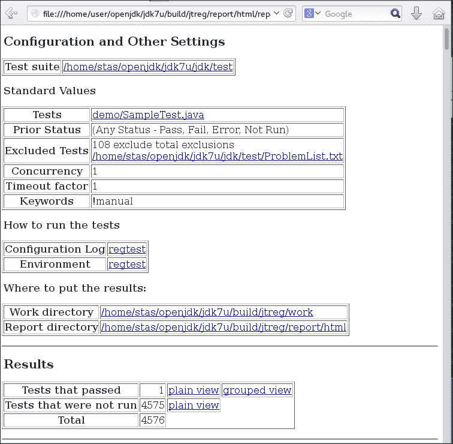
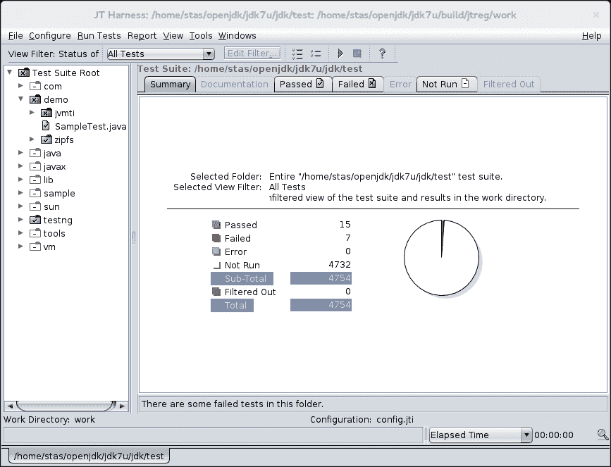
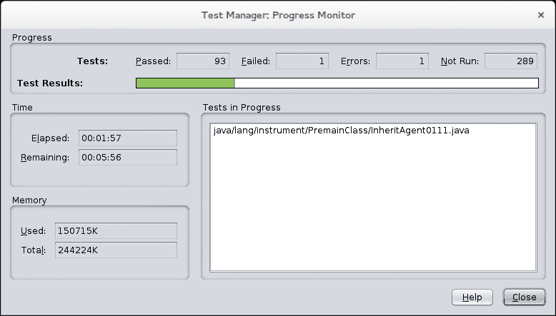

# 第九章：测试 OpenJDK

在本章中，我们将涵盖以下主题：

+   使用下载或构建的 jtreg 版本运行测试

+   从源代码构建 jtreg

+   运行标准套件的 OpenJDK 测试

+   为 jtreg 编写自己的测试

+   在 GUI 模式下使用 jtreg

+   为 jtreg 编写 TestNG 测试

+   从源代码编译 JT Harness

+   构建 和 运行 jcstress

+   为 jcstress 编写测试

+   使用 JMH 创建基准测试项目

+   下载源代码并编译 JMH

# 简介

回到 1997 年，当 JDK 1.1 完成，JDK 1.2 刚刚开始时，有一个明显的问题——JDK 必须以某种方式被测试，并且必须有一个工具来完成这项工作。这就是 jtreg 作为回归测试工具出现的时刻。当时，Java 的测试框架并不多。事实上，甚至没有多少软件是用 Java 编写的。所以选择非常有限，唯一合理的选项是当时用于**Java 兼容性工具包**（**JCK**）的框架。它的名字叫**JavaTest**。但是，由于 JCK 测试与 JDK 回归测试应该完成的任务非常不同，该框架需要进行一些调整，这就是 jtreg 出现的时候。到目前为止，尽管自 1997 年以来已经过去了许多年，jtreg 仍然仍然是运行 OpenJDK 中单元和回归测试的主要工具。自从它在 OpenJDK 中引入以来，已经创建了超过 10,000 个使用 jtreg 框架运行的测试。

作为测试工具，jtreg 对于习惯了 JUnit 和 TestNG 等工具的现代开发者来说可能看起来有些不寻常。jtreg 看起来不同的主要原因是因为它有着悠久的历史。它在 1997 年出现，而 jUnit 大约在 2000 年左右出现。在当时，尤其是在技术如此年轻的时候，三年是一个很长的时间。似乎还有一个可能的原因是，jtreg 长期以来一直是一个专有工具，并且由于它一直在履行其职责，因此没有必要对其进行更改。此外，它并没有向广大的开源社区开放，这些社区本可以在一段时间内改变其形态。与当前*经典*工具相比，导致其差异的另一个原因是它提供了一些通常不在测试框架中可用，但在进行 JDK 测试时必需的特殊功能。这些功能包括在具有特定参数的单独 JVM 实例（或对于某些测试，甚至几个实例）中运行测试，测试 Java 小程序（还记得它们吗？），将 shell 脚本作为测试运行，运行需要用户交互的 GUI 测试等等。这是一套相当大的附加功能，足以证明为它构建一个单独的框架是合理的。

话虽如此，说 jtreg 是某种过时的工具，它停滞在 20 世纪 90 年代，并且没有尝试改变自己以更接近现代软件测试框架构建方式，这并不公平。它已经与测试框架如**TestNG**集成，并提供了一种基于该框架创建测试的方法。然而，JDK 中的大多数测试仍然是只有 main 方法的类，由框架执行。尽管如此，公平地说，这种做法有其优点，因为它允许一个人在没有框架的情况下运行单个测试。还有一些测试只是批处理文件，并且正在进行努力以消除它们。

作为从 JavaTest 演变而来的工具，jtreg 继承了与其框架的兼容性。这种兼容性现在已被隔离到一个名为**Java Test Harness**（**JT Harness**）的独立项目中。这是一个用于运行、构建和部署测试套件的框架。它还提供了一个 GUI 来管理和执行测试套件。

在本章中，你将学习到足够的内容，成为一个自信的 jtreg 用户，并了解如何使用 JT Harness。你将了解到如何从源代码构建 jtreg 和 JT Harness，如何运行测试，以及如何编写自己的测试。本章仅涵盖纯 Java 和 TestNG 测试，因为它们对于 OpenJDK 开发者来说最有用。本章不涵盖 shell 测试的使用，因为它们的用法不被认为是良好的实践，并且它们是为了解决几年前存在的 JVM 限制而创建的。在当前时刻，所有 OpenJDK 贡献者都被鼓励尽可能地将 shell 测试替换为 Java 版本。

# 使用下载或构建的 jtreg 版本运行测试

开始使用 jtreg 的最简单方法是下载它，解压它，并运行一些测试。在这个食谱中，我们将做的是确切地这样做，而不会做任何额外的事情，比如从源代码构建它或尝试创建我们自己的测试。

## 准备工作

对于这个食谱，实际上不需要太多东西——只需要互联网连接、安装或构建了 OpenJDK 的机器，以及 OpenJDK 源代码。在 Windows 环境中，必须在您的机器上安装 Cygwin。

## 如何操作...

以下是一些简单的步骤，以便通过 jtreg 执行一组测试：

1.  如果 jtreg 尚未在机器上可用，请访问 jtreg 的官方网站（[`adopt-openjdk.ci.cloudbees.com/job/jtreg/lastSuccessfulBuild/artifact/`](https://adopt-openjdk.ci.cloudbees.com/job/jtreg/lastSuccessfulBuild/artifact/)）并下载 jtreg 的最新可用版本。另一种选择是从源代码构建它。为此，请遵循本章后面将涵盖的“从源代码构建 Jtreg”食谱中的说明。在你下载了 jtreg 或使用源代码构建了它之后，继续下一步。

1.  将下载的存档解压到一个文件夹中。

1.  在 OpenJDK 源代码树的根目录下，创建一个名为`run_test.sh`的 shell 脚本。这个脚本将用于运行 jtreg：

    ```java
    #!/bin/sh
    export JT_JAVA=/etc/alternatives/java_sdk_1.7.0_openjdk/
    /home/user/openjdk/jtreg/bin/jtreg -jdk:$JT_JAVA -agentvm -automatic -verbose:summary -w build/jtreg/work -r build/jtreg/report hotspot/test/compiler/5091921

    ```

    这里唯一需要更改的是`JT_JAVA`环境变量，它必须指向高于或等于 1.5 版本的 OpenJDK。

1.  运行脚本后，您将看到如下输出：

    ```java
    [user@localhost jdk7u_clean]$ ./run_test.sh 
    Passed: compiler/5091921/Test5091921.java
    Passed: compiler/5091921/Test6186134.java
    Passed: compiler/5091921/Test6196102.java
    Passed: compiler/5091921/Test6357214.java
    Passed: compiler/5091921/Test6559156.java
    Passed: compiler/5091921/Test6753639.java
    Passed: compiler/5091921/Test6850611.java
    Passed: compiler/5091921/Test6890943.java
    Passed: compiler/5091921/Test6897150.java
    Passed: compiler/5091921/Test6905845.java
    Passed: compiler/5091921/Test6931567.java
    Passed: compiler/5091921/Test6935022.java
    Passed: compiler/5091921/Test6959129.java
    Passed: compiler/5091921/Test6985295.java
    Passed: compiler/5091921/Test6992759.java
    Passed: compiler/5091921/Test7005594.java
    Passed: compiler/5091921/Test7020614.java
    Test results: passed: 17

    ```

1.  测试完成后，运行由 jtreg 生成的 HTML 报告。这个报告可以在由`-r`参数指定的文件夹中找到。

## 它是如何工作的…

正如您所看到的，用于运行 jtreg 的 shell 脚本很简单，只需要澄清几个要点。这些是`JT_JAVA`环境变量和 jtreg 的命令行参数。

`JT_JAVA`是 jtreg shell 脚本使用的两个环境变量之一。`JT_JAVA`指定了将用于运行框架的 Java 版本，但不包括测试。在这个菜谱中，为了简单起见，我们使用了与 jtreg 和测试相同的 Java 版本。

jtreg 的命令行参数在 jtreg 网页上都有详细描述（[`openjdk.java.net/jtreg/command-help.html`](http://openjdk.java.net/jtreg/command-help.html)），所以我们将只介绍在这个菜谱中使用的一些参数：

+   `-jdk`：这个参数将生成用于运行测试的 JDK。基本上，这是测试运行时被测试的 Java 版本。在我们的例子中，我们使用了安装在机器上的版本。如果您想使用从源代码构建的版本，变量应该相应地更改以指向构建的输出。

+   `-agentvm`：这是 jtreg 使用可重用 JVM 池来运行测试的模式。当一个测试需要一个单独的 JVM 来运行时，不会创建新的 JVM，而是从可重用实例池中借用。如果没有指定任何参数，jtreg 将为每个测试重新创建一个 JVM，这将显著减慢测试运行速度。

+   `-verbose:summary`：这个参数指定了输出模式。`summary`参数意味着它将只打印状态和测试名称。

+   `-automatic`：这个参数意味着只有不需要用户干预的自动测试将被运行。

+   `-w`：这个参数提供了工作目录的位置。这将用于存储类文件等。

+   `-r`：这个参数提供了报告目录，报告将存储在这个目录中。要查看报告，请在任何浏览器中打开`<reporting directory>/html/report.html`文件。

## 参见

+   完整的命令行选项列表可在[`openjdk.java.net/jtreg/command-help.html`](http://openjdk.java.net/jtreg/command-help.html)找到。

+   有些人可能发现只运行特定错误的测试很有用，为此，可以使用 `bug:<bug_id>` 命令行选项。测试的日志文件可以在工作目录中找到（由 `-w` 参数指定或在未定义该参数时在 `JTwork` 中），日志文件以 `.jtr` 扩展名的文本格式存在。这些文件包含测试输出以及命令行和抛出的异常，对于故障排除非常有用。

# 从源代码构建 jtreg

除了下载 jtreg 作为二进制包之外，还可以选择下载源代码并从源代码构建 jtreg。这对于可能想要修改源代码或获取尚未作为二进制包发布的最新修复的开发者来说可能是有益的。

## 准备工作

你需要一个互联网连接，一台能够运行 make 和批处理文件（Linux 或 Cygwin）的机器，以及已安装的 Mercurial。

## 如何做...

以下简单步骤将展示如何获取 jtreg 源代码并构建：

1.  从 [`hg.openjdk.java.net/code-tools/jtreg`](http://hg.openjdk.java.net/code-tools/jtreg) 下载源代码。为此，只需执行以下命令，该命令将在本地文件夹中克隆 jtreg 源代码树，`jtreg`：

    ```java
    [user@localhost tmp]$ hg clone http://hg.openjdk.java.net/code-tools/jtreg
    destination directory: jtreg
    requesting all changes
    adding changesets
    adding manifests
    adding file changes
    added 85 changesets with 1239 changes to 602 files
    updating to branch default
    586 files updated, 0 files merged, 0 files removed, 0 files unresolved

    ```

    命令执行后，当前目录可以在新的 `jtreg` 文件夹中找到，其中包含所有 jtreg 源代码。

1.  如果机器上没有安装 Ant 软件，可以使用 `yum`（或任何其他打包工具）安装它，或者简单地从 [`ant.apache.org/`](http://ant.apache.org/) 下载它，然后解压。如果你使用的是 Linux 机器，你也可以选择通过运行 `yum` 或任何其他可以在 [`ant.apache.org/`](http://ant.apache.org/) 找到的类似工具来安装它，然后解压。

1.  下载 JT Harness 的最新可用版本，它可在 [`jtharness.java.net/`](https://jtharness.java.net/) 找到。将其解压到 `jtreg/lib` 文件夹中。

1.  jtreg 需要 JUnit，但不一定是最新版本。版本必须早于 4.11。最简单的方法是从 Maven central 在 [`mvnrepository.com/artifact/junit/junit/4.5`](http://mvnrepository.com/artifact/junit/junit/4.5) 下载该版本。jtreg 构建只需要 JAR 文件。将此文件放入 `jtreg/lib` 文件夹中。

1.  为了让事情变得更有趣，jtreg 构建还需要另一个测试框架——**TestNG v.6.8**。可以从 [`testng.org/doc/download.html`](http://testng.org/doc/download.html) 下载。

    注意，所需的版本是针对 Ant 用户版本的。为了简化操作，只需使用链接，[`testng.org/testng-6.8.zip`](http://testng.org/testng-6.8.zip)。将下载的存档解压到 `jtreg/lib` 文件夹中。

1.  下一个依赖项是 `JavaHelp`。这似乎只能通过直接链接在 [`download.java.net/javadesktop/javahelp/javahelp2_0_05.zip`](http://download.java.net/javadesktop/javahelp/javahelp2_0_05.zip) 获取。将其解压缩到 `jtreg/lib` 文件夹中。

1.  然后，最后，最后一个依赖项是 `Xalan`，XML 转换库。所需版本是 2.7.1，可以从以下网站之一下载：[`www.apache.org/dyn/closer.cgi/xml/xalan-j`](http://www.apache.org/dyn/closer.cgi/xml/xalan-j)。按照您对其他库所做的相同程序，将其解压缩到 `jtreg/lib` 文件夹中。

1.  现在，是时候编写执行构建的脚本了。将以下脚本代码放入在第一步中创建的 `jtreg` 文件夹的 `make.sh` 文件中：

    ```java
    #!/bin/sh
    export JDK15HOME= /etc/alternatives/java_sdk_1.7.0_openjdk/
    export JAVAHELP_HOME=/home/user/openjdk/jtreg/lib/jh2.0/javahelp
    export ANTHOME=/usr/share/ant
    export JTHARNESS_HOME=/home/user/openjdk/jtreg/lib/jharness4.4.1
    export JUNIT_JAR=/home/user/openjdk/jtreg/lib/junit4.5/junit-4.5.jar
    export TESTNG_HOME=/home/user/openjdk/jtreg/lib/testng-6.8
    export TESTNG_JAR=/home/user/openjdk/jtreg/lib/testng-6.8/testng-6.8.jar
    export XALANHOME=/home/user/openjdk/jtreg/lib/xalan-j_2_7_1
    make -C make

    ```

    如您所见，脚本很简单，只需设置环境变量。不需要太多解释，因为所有变量名都很直观。所以，只需为您的机器设置分配适当的值。所有变量都是强制性的，必须定义才能运行框架。

1.  最后一步就是运行那个脚本：

    ```java
    [user@localhost jtreg]$ ./make.sh

    ```

    构建（应该只需几秒钟）完成后，生成的 JAR 文件可以在 `build/images/jtreg/` 文件夹中找到。这个文件夹将包含一个完全可工作和自给自足的 jtreg 发行版：

    ```java
    [user@localhost jtreg]$ ls -l build/images/jtreg/
    total 60
    drwxrwxr-x. 2 user user 4096 May  3 21:27 bin
    -rw-rw-r--. 1 user user 994 May  3 21:23 COPYRIGHT
    drwxrwxr-x. 3 user user 4096 May  3 21:23 doc
    drwxrwxr-x. 4 user user 4096 May  3 21:27 legal
    drwxrwxr-x. 2 user user 4096 May  3 21:27 lib
    -rw-rw-r--. 1 user user 19241 May  3 21:27 LICENSE
    drwxrwxr-x. 3 user user 4096 May  3 21:23 linux
    -rw-rw-r--. 1 user user 3790 May  3 21:27 README
    -rw-rw-r--. 1 user user 72 May  3 21:27 release
    drwxrwxr-x. 3 user user 4096 May  3 21:23 solaris
    drwxrwxr-x. 3 user user 4096 May  3 21:23 win32

    ```

# 运行 OpenJDK 的标准测试集

这个菜谱与描述简单测试执行的菜谱没有太大区别。然而，它将重点介绍如何运行 JDK 测试。如果有人正在修改 HotSpot 或 OpenJDK 的其他部分，可能需要这些知识。

标准测试仅在 JDK7 的三个根文件夹和 JDK8 的四个文件夹中可用。这些是 `hotspot`、`jdk`、`langtools` 和 `nashorn`（仅限 JDK8）。尽管其他区域如 CORBA、JDBC、JAXP 等没有测试可用，但这并不意味着它们完全没有经过测试。这只意味着它们的测试不是 OpenJDK 的一部分，也就是说，它们不是由供应商提供的。

测试的组织方式因测试区域的依赖性而异，例如，`hotspot` 和 `langtools` 主要按它们测试的功能区域分组，然后按错误（编号）分组。`jdk` 文件夹主要按包名组织，因为这个测试集涵盖了 Java API。

请记住，有些测试可能会失败，但这并不意味着 OpenJDK 有什么特别的问题。这只意味着在某些情况下，很难创建在任何环境中都能通过测试的测试。例如，可能有需要特殊网络配置或某些其他特殊环境的测试，而这些可能没有在机器上设置。

有一些已知的测试会失败，通常有很好的理由。最明显的例子是覆盖了一些已知问题的测试，但修复这些问题的方案不会很快出现。这些测试列在`jdk/test/ProblemList.txt`中，或者用`@ignore`标签标记。通常，这些测试应该从标准测试运行中排除。

## 准备中

由于我们将运行 OpenJDK 的测试，机器上需要有相关的源代码。机器还应设置好 OpenJDK 构建环境，因为我们将会使用 OpenJDK 的 make 文件来执行测试运行。

jtreg 应该在机器上的一个文件夹中下载并解压，以便为测试运行做好准备。

一些 OpenJDK 测试是 shell 脚本，因此你需要使用 Linux 机器，或者在 Windows 机器上使用支持 Bourne shell 的 Cygwin，尽管不推荐使用 Cygwin，因为有可能某些 shell 测试无法在它上面正确运行。

## 如何操作...

运行测试最方便的方式之一是为每个区域单独运行，例如`hotspot`、`jdk`等。由于本菜谱的目的是仅解释概念，我们将使用`jdk`测试，这些测试只是 OpenJDK 中所有测试的一个子集，但相同的模式也可以应用于所有其他区域。按照以下步骤操作：

1.  在 OpenJDK 源根目录下，创建一个名为`run_jdk_lang_tests.sh`的文件，并包含以下内容：

    ```java
    #!/bin/sh
    export JTREG_HOME=/home/user/openjdk/jtreg/build/images/jtreg/
    export JT_HOME=/home/user/openjdk/jtreg/build/images/jtreg/
    export PRODUCT_HOME=/home/stas/openjdk/jdk7u_clean/build/linux-amd64/j2sdk-image/
    cd jdk/test
    make TESTDIRS=java/lang

    ```

    `JTREG_HOME`和`JT_HOME`环境变量都是相同的，应该指向包含 jtreg 的文件夹。不幸的是，在 make 文件中有地方同时使用了这两个变量。

    `PRODUCT_HOME`指向测试中的 JDK。并不严格要求它指向从源代码构建的 JDK 版本，但也没有必要在无法更改的版本上执行测试。

    `TESTDIRS`指向要运行的测试子集。显然，这个子集越广，要执行的测试就越多，运行时间也就越长。所以通常来说，将这个子集限制在合理范围内是有意义的，除非在做出重大更改后需要进行回归测试。

1.  现在让我们运行脚本。它将在`jdk`文件夹中执行测试，并输出数百行类似的内容：

    ```java
    TEST: java/lang/StringBuilder/Insert.java
     build: 1.112 seconds
     compile: 1.112 seconds
     main: 0.161 seconds
    TEST RESULT: Passed. Execution successful
    --------------------------------------------------

    ```

1.  当一切完成后，make 脚本将报告如下：

    ```java
    Summary:
    TEST STATS: name=  run=383  pass=383  fail=0  excluded=4
    EXIT CODE: 0
    EXIT CODE: 0
    Testing completed successfully

    ```

前面的输出告诉我们执行了多少测试，有多少失败了，有多少通过了，等等。现在，当我们运行所有感兴趣的测试后，结果可以在`jdk/build/linux-amd64/testoutput/JTreport`文件夹中找到。将会有标准的 jtreg 文本和 HTML 报告文件，可以使用任何网络浏览器查看。

## 还有更多...

如果有人到了需要运行 OpenJDK 测试的地步，很可能会有这样的情况，即测试需要更新或扩展。在这种情况下，了解这些测试内部发生的事情以及每个测试存在的确切原因是很重要的。大多数情况下，这些信息都包含在`@bug`和`@summary`标签中。强烈建议关注它们的内容，并投入一些努力来了解它们如何与实际的测试代码相关联。

大多数测试在`@bug`和`@summary`标签中包含额外的信息。参考这些标签来理解测试的原因是很重要的。例如，当你运行测试时，看到以下类似的输出并不罕见：

```java
--------------------------------------------------
TEST: java/lang/invoke/7157574/Test7157574.java
 build: 1.194 seconds
 compile: 1.193 seconds
 main: 0.199 seconds
TEST RESULT: Passed. Execution successful

```

这意味着这是一个针对 ID 为`7157574`的 bug 的测试，实际上可以在 JDK 错误跟踪系统中找到[`bugs.openjdk.java.net/browse/JDK-7157574`](https://bugs.openjdk.java.net/browse/JDK-7157574)。当查看测试时，以下信息将在标题中：

```java
/* @test
 * @bug 7157574
 * @summary method handles returned by reflective lookup API sometimes have wrong receiver type
 *
 * @run main Test7157574
 */

```

这个标题引用了这个测试正在测试的 bug，在摘要部分，它详细说明了这个测试正在做什么。此外，当你查看测试的源代码时，通常可以看到它包含了一个非常详细的关于问题的解释以及测试问题的方法。

# 为 jtreg 编写自己的测试

如果你打算向 OpenJDK 添加新功能或修复一个错误，有一个测试用例来覆盖功能的变化并确保实现更改不会破坏任何东西，这确实是一个好主意。这个方法将帮助你了解这个过程并创建一个简单的测试。你会发现为 jtreg 编写自己的测试用例并不是一个复杂的工作，但在某些方面可能有些不寻常。

## 准备中

这个方法只需要安装 jtreg 和 OpenJDK 源代码。后者是必需的，因为这种方法假设新创建的测试是针对 OpenJDK 的。

## 如何操作...

为 jtreg 编写测试可能有些不寻常，但当你习惯了这种模式，实际上相当简单。开始时，只需遵循以下步骤。记住，所有路径都是相对于 OpenJDK 源根给出的：

1.  前往 OpenJDK 的根目录，首先创建`jdk/test/demo/SampleTest.java`文件：

    ```java
    /* @test
     * @summary Test to ensure that computer wasn't moved to the past
     * @compile SampleTimeProvider.java
     * @run main SampleTest
     * @run main/othervm SampleTest
     */
    public class SampleTest {
        public static void main(String[] args) {
            long currentTime = new SampleTimeProvider().getCurrentTime();
            if ( currentTime < 0 ) {
                throw new RuntimeException("It can't be 1969!");
            }
        }
    }
    ```

1.  然后，按照以下方式在`jdk/test/demo/SampleTimeProvider.java`文件中创建文件：

    ```java
    public class SampleTimeProvider {
        public long getCurrentTime() {
            return System.currentTimeMillis();
        }
    }
    ```

1.  现在，在 JDK 源根目录下创建一个名为`run_jtreg.sh`的脚本文件并运行它：

    ```java
    #!/bin/sh
    export JT_JAVA=/usr/lib/jvm/java-1.7.0-openjdk-1.7.0.60-2.4.7.0.fc20.x86_64
    /home/user/openjdk/jtreg/build/images/jtreg/bin/jtreg -jdk:$JT_JAVA -agentvm -automatic -verbose:summary -w build/jtreg/work -r build/jtreg/report -exclude:./jdk/test/ProblemList.txt jdk/test/demo/SampleTest.java

    ```

1.  输出应该是这样的：

    ```java
    [user@localhost jdk7u]$ ./run_jtreg.sh 
    Directory "build/jtreg/work" not found: creating
    Directory "build/jtreg/report" not found: creating 
    Passed: demo/SampleTest.java
    Test results: passed: 1
    Report written to /home/user/openjdk/jdk7u/build/jtreg/report/html/report.html
    Results written to /home/user/openjdk/jdk7u/build/jtreg/work

    ```

    如您所见，只运行了一个测试，并且运行成功。因此，编写一个简单的测试用例是一个非常简单的任务。

1.  现在，最后一步。在所有测试都运行完毕后，让我们看看 jtreg 输出中提供的测试结果路径。让我们在网页浏览器中打开`report/html/repost.html`并查看其中的内容：

    在这里，我们可以看到只有一个测试，**demo/SampleTest.java**被执行，并且它通过了。

## 它是如何工作的...

需要一些解释来找出实际发生了什么。测试本身位于`SampleTest.java`文件中。jtreg 通过类头部注释中存在的`@test`标签知道该文件包含测试。如果没有这个标签，jtreg 不会将其视为测试。

`@summary`标签的唯一目的是为测试提供一个总结描述。这个描述也将用于日志和报告中。为该标签提供一个良好、易读的描述非常重要。此外，如果测试是为了一个错误，那么有必要将`@bug`标签填充适当的错误编号。

下一个标签`@compile`引用了另一个文件，该文件需要编译后才能运行测试。`SampleTimeProvider.java`的存在只是为了展示如何使用`@compile`标签。Java 做这样的事情非常不寻常。通常，所有内容都会编译，然后从类路径中选取，但这是 Java 的工作方式。

`@run`标签告诉测试框架如何运行测试。从测试类中可以看出，这个参数可以定义多次，这意味着测试也将执行多次，每次都会使用关联的运行标签定义的配置来运行。在我们的例子中，有两个运行，一个在同一虚拟机中，另一个在由`othervm`参数指定的新虚拟机实例中。如果没有定义此标签，则 jtreg 默认假设它是`@run main ClassName`。

注意，如果测试运行时间超过 2 分钟（120 秒），则测试失败，并且可以被`@run main/timeout=xxx`覆盖。

通常，测试通过抛出异常来指示其失败。如果条件不满足，这个测试用例将抛出`RuntimeException`。

jtreg 要求在测试的根目录中创建`TEST.ROOT`文件。没有这个文件，它将不会执行任何测试。幸运的是，对于 JDK 来说，它已经有了包含适当内容的所需文件，所以我们不需要担心这个问题。

## 另请参阅

jtreg 测试用例由 Javadoc 标签定义，熟悉所有这些标签是有用的。标签的完整列表和每个标签的信息可以在通过运行 jtreg 命令`–onlineHelp`访问的帮助文件中找到，或者在网上[`openjdk.java.net/jtreg/tag-spec.html`](http://openjdk.java.net/jtreg/tag-spec.html)找到。

# 在 GUI 模式下使用 jtreg

jtreg 不仅是一个命令行工具，还提供了一个相对复杂的图形界面，允许你运行单个测试集、准备测试运行、查看运行结果等等。此配方将涵盖一些基本的 UI 功能，足以让用户开始使用此工具。

## 准备工作

此配方所需的所有内容只是一个已安装的 jtreg 和 OpenJDK 源代码。

## 如何操作...

1.  创建以下脚本以启动具有图形用户界面的 jtreg：

    ```java
    #!/bin/sh
    export JT_JAVA=/usr/lib/jvm/java-1.7.0-openjdk-1.7.0.60-2.4.7.0.fc20.x86_64
    /home/user/openjdk/jtreg/build/images/jtreg/bin/jtreg –g -jdk:$JT_JAVA -agentvm -automatic -verbose:summary -w build/jtreg/work -r build/jtreg/report -exclude:./jdk/test/ProblemList.txt jdk/test/

    ```

    告诉 jtreg 启动 JT Harness UI 的参数是`-g`。启动后，jtreg 显示一个类似于以下窗口：

    

1.  在前面的截图右侧，你可以看到最新测试运行的结果。它知道从`–r`参数中提取它们的位置。在此截图中，你还可以看到成功和失败的测试数量、执行的总测试数量和一些其他统计数据。

1.  在前面的截图左侧，有一个包含所有可用测试的树。这显示了从测试包的根目录开始的全部测试，该目录包含`TEST.ROOT`配置文件。绿色文件夹图标表示成功运行的测试，红色图标表示失败的测试。

1.  要从一组测试中运行特定的测试，右键单击单个测试文件夹，并从弹出菜单中选择**执行这些测试**项。这将触发测试运行，并生成一个新的报告。对于长时间运行的测试，有一个状态窗口，可通过**运行测试**|**监控进度**菜单项访问：

## 工作原理...

jtreg 使用的 UI 实际上并不属于 jtreg。它由 JT Harness 提供，jtreg 只是通过提供的插件系统将其集成。

JT Harness 不仅提供了一个丰富的界面来运行测试，还提供了一套向导来创建测试配置、各种报告转换工具、代理监控工具等等。要获取有关所有这些功能的更多信息，请参阅 JT Harness 在线帮助，它可通过**帮助/在线帮助**菜单项访问。

# 为 jtreg 编写 TestNG 测试

jtreg 还提供了运行 TestNG 测试用例的支持，这可能对许多开发者来说是一个更熟悉的技巧。需要执行一些步骤才能实现这一点，此配方将介绍这些步骤。

## 准备工作

此配方需要 OpenJDK 源代码和已安装的 jtreg 版本。在 Windows 机器上，还需要安装 Cygwin。

## 如何操作...

以下过程对 Java 开发者来说可能比编写本机 jtreg 测试更熟悉，因为 TestNG 是大多数开发者所听说并使用的。现在，让我们进入实际部分并创建一个测试。路径相对于 OpenJDK 源根目录。

1.  相对于 OpenJDK 根文件夹，创建一个名为`jdk/test/testng/org/demo`的文件夹。这是我们将要创建测试的文件夹。

1.  在相对于 OpenJDK 源根的`jdk/test/testng/TEST.properties`文件中创建文件，添加以下行：

    ```java
    TestNG.dirs=.

    ```

    创建该文件不是严格必要的，也可以在`jdk/test/TEST.ROOT`中定义属性，这将以相同的方式工作，就像我们之前的属性一样。然而，在大多数情况下，有一个这样的文件是实用的，因为它可以包含一些针对 TestNG 测试集的特定配置，例如，`lib.dirs`属性。

1.  在`jdk/test/testng/org/mydemo`文件夹中，创建以下名称的文件，`MyTestNGTest.java`：

    ```java
    package org.mydemo;

    import org.testng.Assert;
    import org.testng.annotations.Test;

    public class MyTestNGTest {
     @Test
     public void testMoreNanosThanMillis() {
     final long nanos = System.nanoTime();
     final long millis = System.currentTimeMillis();
     Assert.assertTrue(nanos > millis);
     }
    }

    ```

1.  现在，在 OpenJDK 的源根文件夹中，创建以下 bash 脚本（根据机器环境需要调整路径）：

    ```java
    #!/bin/sh
    export JT_JAVA=/usr/lib/jvm/java-1.7.0-openjdk-1.7.0.60-2.4.7.0.fc20.x86_64
    /home/user/openjdk/jtreg/build/images/jtreg/bin/jtreg -jdk:$JT_JAVA -agentvm -automatic -verbose:summary -w build/jtreg/work -r build/jtreg/report -exclude:./jdk/test/ProblemList.txt jdk/test/testng

    ```

1.  然后，给它一个名字，`./run_jtreg.sh`，并使其可执行（运行`chmod +x ./run_jterg.sh`即可完成此操作）并运行它。脚本的输出结果应类似于以下内容：

    ```java
    [user@localhost jdk7u]$ ./run_jtreg.sh 
    Passed: testng/org/mydemo/MyTestNGTest.java
    Test results: passed: 1
    Report written to /home/user/openjdk/jdk7u/build/jtreg/report/html/report.html
    Results written to /home/user/openjdk/jdk7u/build/jtreg/work

    ```

就这样。测试已经运行，并且从输出中可以看出，它已经通过。运行的结果可以通过在浏览器应用程序中打开`/home/user/openjdk/jdk7u/build/jtreg/report/html/report.html`来查看。

## 它是如何工作的…

在测试根包文件夹中创建的名为`TEST.properties`的文件需要一些解释。这是包含特定于 TestNG 测试的配置集的文件。例如，它可以通过`lib.dirs`属性引用包含库的文件夹。这是一个`path`类型的属性，与`TestNG.dirs`相同，此类属性是路径到某些文件夹或文件的空格分隔列表。如果列表中的路径以`/`开头，则相对于`TEST.ROOT`文件夹进行评估，否则从包含`TEST.properties`的目录进行评估。

## 参见

由于可以在测试类中使用 TestNG 注解，因此查看 TestNG 网站是值得的，该网站包含一些关于此主题的文档，链接为[`testng.org/doc/documentation-main.html`](http://testng.org/doc/documentation-main.html)。

还可以使用 jtreg 样式标签和 TestNG 样式测试一起使用。在这种情况下，测试应创建为正常的 jtreg 测试（参见*为 jtreg 编写自己的测试*配方），使用`testng`作为`@run`的参数，例如，`@run testng SampleTest`。在这种情况下，不需要`TEST.properties`，并且像`lib.dirs`这样的东西通过 jtreg 标签在测试源文件中定义，而不是在单独的配置文件中定义。

# 从源代码编译 JT Harness

JT Harness 是一个框架，允许您执行不同的测试集。您不必仅使用 jtreg。其他测试框架也可以与之集成。这意味着拥有其源代码以便从源代码构建它可能很有用。这正是本食谱将要解释的内容。

## 准备工作

您需要互联网访问来下载源代码和安装构建所需的附加软件。

确保机器上安装了 Ant 版本 1.6.1 或更高版本。如果没有，请安装它。*如何做...*这一部分取决于您使用的操作系统。例如，在 Fedora 上，它将是：

```java
yum install ant

```

在 Windows 上，最简单的方法是下载发行版并将 Ant 的`bin`文件夹添加到`PATH`环境变量中。Ant 发行版可以在[`ant.apache.org/`](http://ant.apache.org/)找到。请注意，为了使其工作，`JAVA_HOME`环境变量必须包含 Java 发行版的正确路径。

确保机器上已安装 Subversion。与其它工具不同，JT Harness 不使用 Mercurial 仓库来存储其源代码。在 Fedora 上，可以通过运行`yum`来安装 Subversion：

```java
yum install svn

```

在任何其他操作系统上，这完全取决于操作系统。请检查[`subversion.apache.org/`](http://subversion.apache.org/)以了解可用的选项。

## 如何做...

运行以下命令以检查源代码：

```java
svn checkout https://svn.java.net/svn/jtharness~svn/trunk jtharness
```

此命令将创建一个名为`jtharness`的文件夹，并下载源代码。在该文件夹中创建另一个文件夹，并将其命名为`lib`。在这里，我们将放置构建 JT Harness 所需的库。

现在下载以下软件（所有路径都是以`jtharness`文件夹为相对路径）：

1.  JavaHelp 似乎只能通过[`download.java.net/javadesktop/javahelp/javahelp2_0_05.zip`](http://download.java.net/javadesktop/javahelp/javahelp2_0_05.zip)的直接链接获得。将其解压到`lib/jh2.0`。

1.  前往[`asm.ow2.org/`](http://asm.ow2.org/)下载 ASM Java 字节码操作库的二进制版本 3.1。将其解压到`lib/asm-3.1`。这仅用于编译。

1.  接下来，所需的库是`Java Communications API`。前往[`www.oracle.com/technetwork/java/javasebusiness/downloads/java-archive-downloads-misc-419423.html`](http://www.oracle.com/technetwork/java/javasebusiness/downloads/java-archive-downloads-misc-419423.html)下载`Java Communications API 3.0u1`或任何其他可用的更高版本。将其解压到`lib/commapi`。这仅用于编译。

1.  Java Servlet API 仅用于编译。最简单的方法是直接从 Maven Central 获取 JAR 文件。访问[`search.maven.org/`](http://search.maven.org/)并搜索`javax.servlet servlet-api`。下载版本 3.1.0 的 JAR 文件并将其直接放入`lib`文件夹。

1.  最后一个是 JUnit，它也仅用于编译。推荐版本是 4.4。访问[`junit.org/`](http://junit.org/)并点击**下载**链接以下载适当的 JAR 文件版本。将其直接放入`lib`文件夹。

1.  下一步是获取源代码。为此，运行以下命令，将从主干获取最新源代码：

    ```java
    svn checkout https://svn.java.net/svn/jtharness~svn/trunk jtharness

    ```

    这将创建一个名为`jtharness`的文件夹，其中包含两个子文件夹：`www`和`code`。`www`文件夹包含指向文档和其他有用信息的页面链接，但我们真正感兴趣的是名为`code`的文件夹。实际上，根本没有必要下载`www`，但这也不会造成任何伤害。

1.  前往文件夹`jtharness/code/build`，找到文件`local.properties`，并编辑它以设置以下属性以指向适当的路径：

    +   `jhalljar`: 这提供了 JavaHelp `jhalljar.jar`文件的路径。

    +   `jhjar`: 此属性提供了 JavaHelp `jhjar.jar`文件的路径。

    +   `jcommjar`: 这提供了从`Java Communications API`到`comm.jar`文件的路径。

    +   `servletjar`: 这提供了从`Java Servlet API`到`servlet-api.jar`文件的路径。

    +   `bytecodelib`: 这提供了冒号分隔的`asm-3.1.jar`和`asm-commons-3.1.jar`文件的路径。

    +   `junitlib`: 这提供了从 jUnit 到`junit-4.4.jar`文件的路径。

    编辑后，文件应类似于以下内容：

    ```java
    #Please specify location of jhall.jar here - for compilation
    jhalljar = /home/user/openjdk/jtharness/lib/jh2.0/javahelp/lib/jhall.jar
    # needed only at runtime
    jhjar = /home/user/openjdk/jtharness/lib/jh2.0/javahelp/lib/jh.jar
    # location of jar with implementation of java serial communications API
    jcommjar = /home/user/openjdk/jtharness/lib/commapi/jar/comm.jar
    # location of jar with servlet API implementation
    servletjar = /home/user/openjdk/jtharness/lib/javax.servlet-api-3.1.0.jar
    # bytecode library (BCEL or ASM)
    # these are not interchangable
    bytecodelib = /home/user/openjdk/jtharness/lib/asm-3.1/lib/asm-3.1.jar:/home/stas/openjdk/jtharness/lib/asm-3.1/lib/asm-commons-3.1.jar
    # JUnit Library - Version 4 currently used to compile 3 and 4 support
    junitlib = /home/user/openjdk/jtharness/lib/junit-4.4.jar
    # Please specify location where the build distribution (output) will be created
    BUILD_DIR = ../JTHarness-build

    ```

    如果需要，可以将`BUILD_DIR`变量更改为不同的文件夹，但通常没有必要。

1.  现在确保当前文件夹是`jtharness/code/build`，然后运行 Ant：

    ```java
    [stas@localhost build]$ ant
    Buildfile: /home/user/openjdk/jtharness/code/build/build.xml
     …skipped…
    BUILD SUCCESSFUL
    Total time: 45 seconds
    When build is finished

    ```

    当构建完成后，文件夹`jtharness/JTHarness-build/binaries`将包含 JT Harness 的分发版本。

## 参见

JT Harness 构建文件中还有其他一些目标，你可能觉得它们很有用：

+   `run`: 这将构建并运行 JT Harness。这不是启动应用程序的唯一方法。另一种选择是在构建后从源根目录运行以下命令：

    ```java
    java -jar JTHarness-build/binaries/lib/javatest.jar

    ```

+   `clean`: 这只是构建分发目录。

+   `build`: 这将构建 JT Harness 然后运行所有测试。

+   `test`: 这只是运行测试。

+   `Javadoc`: 这将生成 Javadoc API 文档。

+   `build-examples`: 这将构建与源代码一起打包的示例测试套件。此目标还会自动首先构建核心工具。

# 构建 和 运行 jcstress

**Java 并发压力测试**（**jcstress**）是一组用于测试 Java 并发支持的正确性的测试。这是一个主要针对 Java 8 的新工具，这意味着并非所有测试都能在 Java 的先前版本上运行。作为一个新工具，jcstress 处于 alpha 阶段，修复和改进的更改很常见，这意味着使用它的人预计需要相对频繁地更新源代码和重新构建工具。

测试并发性不是一个容易的任务，即使代码有误，也可能很难使这样的测试失败。这是因为并发代码的性质，它可能在不同的硬件配置上以不同的方式工作。这种差异可能源于 CPU 的数量或 CPU 架构。总的来说，这意味着 jcstress 中的许多测试都是不确定的，它们可能需要很长时间才能暴露潜在的问题。

## 准备工作

您需要互联网访问和 Mercurial 仓库来下载源代码。由于 jcstress 需要 Java 8 进行编译和运行完整的测试集，因此它必须安装到机器上，并设置为当前版本。这意味着以下命令应显示 Java 1.8 作为主要版本，如以下所示：

```java
[user@localhost]$ java -version
openjdk version "1.8.0_11"
OpenJDK Runtime Environment (build 1.8.0_11-b12)
OpenJDK 64-Bit Server VM (build 25.11-b02, mixed mode)
[user@localhost jcstress]$ javac -version
javac 1.8.0_11

```

构建还需要在机器上安装 Maven（Java 构建工具之一）。这个工具的安装取决于操作系统。例如，在 Fedora 上，可以通过以下命令作为 root 用户执行：

```java
[root@localhost ~]# yum install maven

```

在其他操作系统上，最简单的方法可能是从[`maven.apache.org/download.cgi`](http://maven.apache.org/download.cgi)下载二进制文件，解压存档，将`M2_HOME`指向解压文件夹的根目录，并将`M2_HOME/bin`添加到路径中。

## 如何做…

现在是采取行动的时候了。这个食谱的前几个步骤将涵盖构建过程，然后它将切换到运行实际的测试：

1.  第一步是下载源代码。转到您想要存储源代码的文件夹，并运行以下命令：

    ```java
    [user@localhost ~]$ hg clone http://hg.openjdk.java.net/code-tools/jcstress/ jcstress

    ```

    当运行此命令时，Mercurial 将从远程仓库下载源代码，并存储在`jcstress`文件夹中。

1.  现在，要构建这个工具，移动到`jcstress`文件夹并运行以下命令：

    ```java
    [user@localhost jcstress]$ mvn clean install -pl tests-custom –am

    ```

    如果成功，它应该在结束时显示如下：

    ```java
    [INFO] BUILD SUCCESS
    [INFO] ----------------------------------------------------
    [INFO] Total time: 1:31.300s
    [INFO] Finished at: Tue Jul 29 22:23:19 BST 2014
    [INFO] Final Memory: 37M/410M
    [INFO] ----------------------------------------------------

    ```

    这意味着构建已经完成了它应该做的事情，测试准备就绪，可以运行。

1.  要运行所有测试，请使用以下命令：

    ```java
    java -jar tests-custom/target/jcstress.jar

    ```

    这将输出数千行类似的内容：

    ```java
    (ETA:   00:39:58) (R: 1.36E+07) (T:  46/898) (F: 1/1) (I: 3/5)       [OK] o.o.j.t.atomicity.primitives.plain.VolatileCharAtomicityTest
    (ETA:   00:40:05) (R: 1.36E+07) (T:  46/898) (F: 1/1) (I: 3/5)       [OK] o.o.j.t.atomicity.primitives.plain.VolatileDoubleAtomicityTest

    ```

    `ETA`是预计完成时间，`R`是运行时间（以纳秒为单位），`T`是测试编号，`F`是分支编号，`I`是测试迭代编号。所有这些后面都跟着结果（本例中的`OK`）和测试类的全名。

如您所见，完整的标准测试集运行大约需要 40 分钟，这可能太多了，所以有一个选项可以使用`-t`参数选择要运行的测试。这是一个为测试选择的正则表达式，例如：

```java
[user@localhost jcstress]$ java -jar tests-custom/target/jcstress.jar -t ".*ByteBufferAtomicityTests.*"

```

这将只运行名称中包含`ByteBufferAtomicityTests`的测试。

当测试完成后，是时候查看生成的报告了，默认情况下，它们被放入 `./results/` 文件夹中。在那里您可以找到文件 `index.html`，可以用任何浏览器打开。结果将列出所有测试，如果您点击测试，将列出所有观察者输出。这些输出可能是预期的，不是预期的，或者预期但以某种方式对用户来说令人惊讶。这可能导致以下测试结果：

+   `FAILED`: 测试失败，结果并非预期

+   `ERROR`: 测试崩溃

+   `ACCEPTABLE`: 测试结果符合规范

+   `ACCEPTABLE_INTERESTING`: 这与 `ACCEPTABLE` 相同，但它有一些值得强调的内容

+   `ACCEPTABLE_SPEC`: 这与 `ACCEPTABLE` 相同，但还观察到一些可能不会预料到的有趣行为

## 还有更多...

建议您查看 jcstress 可用的其他命令行选项。这些信息可以通过运行以下命令获取：

```java
[user@localhost jcstress]$ java -jar tests-custom/target/jcstress.jar –h

```

jcstress 在[`openjdk.java.net/`](http://openjdk.java.net/)有自己的页面，那里有一些非常有用的信息和链接到源代码和邮件列表[`openjdk.java.net/projects/code-tools/jcstress/`](http://openjdk.java.net/projects/code-tools/jcstress/)。

# 为 jcstress 编写测试

**Java 并发压力测试**是一个非常好的工具，被 JDK 作者用来确保他们的并发代码在并发方面工作正确。编写并发代码很困难，测试起来更难。他们的大多数测试都是概率性的，需要很多技巧来编写，可能需要很多天的时间，以及适当的硬件来展示失败行为。考虑到所有这些复杂性，拥有一个可以帮助正确执行测试的框架是一个很大的优势。此配方将介绍编写自己 jcstress 测试所需的步骤。

## 准备工作

要遵循此配方，唯一的要求是拥有一个能够编译和运行 jcstress 的环境（请参阅 *构建和运行 jcstress* 配方）。

## 如何操作...

以下步骤将引导您完成创建测试并使用 jcstress 运行测试的过程：

1.  首先，我们需要一个代码来测试。让我们选择一个，可以说是并发中最常见的头痛原因，并且很容易复现的问题。数据竞争听起来是一个很好的候选者。我们将创建一个名为 `CASValue` 的类并实现它：

    ```java
    package org.openjdk.jcstress.tests;

    public class CASValue {
        private int i = 0;
        public boolean cas(int expected, int newValue) {
            boolean res = false;
            if (i == expected) {
                i = newValue;
                res = true;
            }
            return res;
        }
    }
    ```

    此类实现了一个单一的操作，该操作应该执行比较和交换操作（请参阅[`en.wikipedia.org/wiki/Compare-and-swap`](http://en.wikipedia.org/wiki/Compare-and-swap)）。在没有同步的情况下，它将无法在多线程环境中正确工作，并且应该会失败我们将在本配方的下一步中创建的测试。

1.  在 jcstress 的源根文件夹中创建文件，`tests-custom/src/main/java/org/openjdk/jcstress/tests/CASValue.java`，并将`CASValue`类的源代码放入其中。

1.  现在是时候编写一个测试来看看我们的实现是否错误了。测试类看起来像这样：

    ```java
    package org.openjdk.jcstress.tests;

    import org.openjdk.jcstress.annotations.*;
    import org.openjdk.jcstress.infra.results.LongResult2;

    public class CASValueTests {
        @State
        public static class S extends CASValue { }

        @JCStressTest
        @Description("Tests correctness of CASValue CAS operations.")
        @Outcome(id = "[5,2]", expect = Expect.ACCEPTABLE, desc = "T1 -> T2 execution.")
        @Outcome(id = "[1,10]", expect = Expect.ACCEPTABLE, desc = "T1 -> T2 execution.")
        public static class ValCas_ValCas {
            @Actor public void actor1(S s, LongResult2 r) { 
                r.r1 = s.cas(0, 5) ? 5 : 1; 
            }
            @Actor public void actor2(S s, LongResult2 r) { 
                r.r2 = s.cas(0, 10) ? 10 : 2;
            }
        }
    }
    ```

1.  将此文件保存在与`CASValue.java`相同的文件夹中，即在`tests-custom/src/main/java/org/openjdk/jcstress/tests/`，并命名为`CASValueTests.java`。

1.  `CASValueTests` 类是测试中其他类的容器类。这并不是严格必要的，但它有助于保持代码整洁。被`@JCStressTest`注解的`ValCas_ValCas`类是包含两个演员（被`@Actor`注解的方法）的测试用例类。这些方法将由测试框架并行运行。

1.  被注解为`@State`的子类`S`是在演员之间共享的状态，在这种情况下，是正在测试的类。它扩展了我们的类`CASValue`，并且仅为了避免在`CASValue`上添加`@State`注解而创建。

1.  `@Outcome`注解指定了测试的结果。结果可以是`ACCEPTABLE`、`FORBIDDEN`、`ACCEPTABLE_INTERESTING`和`ACCEPTABLE_SPEC`。这些由`expect`属性定义。`id`属性提供了结果列表，而`desc`只是对结果的一个描述。此测试用例指定，对于我们的测试，`LongResul2`中的有效值只有`5`和`2`以及`1`和`10`，这是如果 CAS 按预期工作时的唯一预期结果。任何其他结果都是禁止的，并将导致测试用例失败，这正是我们想要的。

1.  现在是编译测试的时候了。为此，请从 jcstress 的源根目录运行以下命令：

    ```java
    [user@localhost jcstress] mvn clean install -pl tests-custom –am

    ```

    这将仅运行`tests-custom`项目的构建，编译我们刚刚创建的类。

1.  下一步是运行我们的测试并查看它是否工作：

    ```java
    [user@localhost jcstress] java -jar tests-custom/target/jcstress.jar -t ".*CASValueTests.*"

    ```

    此命令中的`-t`参数指定我们只想运行满足`.*CASValueTests.*`正则表达式的测试。

    如预期的那样，测试应该失败，因为提供的实现确实实现了 CAS 操作。输出应该有多个类似于以下结果的测试结果：

    ```java
    (ETA:        n/a) (R: 5.95E+08) (T:   1/1) (F: 1/1) (I: 1/5)   [FAILED] o.o.j.t.CASValueTests$ValCas_ValCas
    Observed state  Occurrences Expectation Interpretation
    [5, 2]  (3,230,666)        ACCEPTABLE T1 -> T2 execution.
    [1, 10] (2,613,825)        ACCEPTABLE T2 -> T1 execution.
    [5, 10] (7,609,449)        FORBIDDEN Other cases are not expected.

    ```

    它显示了每种结果的输出数量。到目前为止，不正确的结果`[5, 10]`以`7,609,449`次出现率领先。这表明测试工作正确，并帮助我们确定我们需要修复 CAS 类的实现。

1.  现在让我们修复我们的类并再次运行测试。最简单但不是最有效的方法是简单地给我们的 CAS 方法添加`synchronized`修饰符：

    ```java
    public class CASValue {
     private int i = 0;
     public synchronized boolean cas(int expected, int newValue) {
     boolean res = false;
     if (i == expected) {
     i = newValue;
     res = true;
     }
     return res;
     }
    }

    ```

1.  在更改实现后，再次运行构建：

    ```java
    mvn clean install -pl tests-custom –am

    ```

1.  然后，重新运行测试：

    ```java
    java -jar tests-custom/target/jcstress.jar -t ".*CASValueTests.*"

    ```

1.  现在，测试不应该显示任何失败，并报告测试运行成功：

    ```java
    (ETA: n/a) (R: 3.35E+08) (T:   1/1) (F: 1/1) (I: 1/5) [OK] o.o.j.t.CASValueTests$ValCas_ValCas
    (ETA: 00:00:02) (R: 1.69E+07) (T:   1/1) (F: 1/1) (I: 2/5) [OK] o.o.j.t.CASValueTests$ValCas_ValCas
    (ETA: 00:00:01) (R: 1.22E+07) (T:   1/1) (F: 1/1) (I: 3/5) [OK] o.o.j.t.CASValueTests$ValCas_ValCas
    (ETA: 00:00:00) (R: 1.07E+07) (T:   1/1) (F: 1/1) (I: 4/5) [OK] o.o.j.t.CASValueTests$ValCas_ValCas
    (ETA: now) (R: 1.00E+07) (T:   1/1) (F: 1/1) (I: 5/5) [OK] o.o.j.t.CASValueTests$ValCas_ValCas

    ```

这表明实现的更改是有效的，并且根据测试用例，实现是正确的。

通过遵循这些步骤，开发者可以确保并发代码根据规范按预期工作，只要测试和测试用例被正确实现和定义。然而，请注意，并发性是难以测试的，一个在一种硬件上工作的实现很容易在其他硬件上失败。这意味着建议在尽可能广泛的配置上运行这些测试。

## 参见

这个框架是由 Aleksey Shipilëv 构建和维护的，他有自己的博客，并在各种会议上发表演讲。我们建议您访问他的主页 ([`shipilev.net/`](http://shipilev.net/))，在 YouTube 上观看他的视频（例如，[`www.youtube.com/watch?v=4p4vL6EhzOk`](https://www.youtube.com/watch?v=4p4vL6EhzOk))，并阅读一些他的论文。这将帮助您获得大量关于正确并发测试、一般并发、Java 中的并发支持以及其他相关主题的信息。

# 使用 JMH 创建基准项目

微基准测试本身不是一个容易的主题，使用像 Java 这样的语言正确地进行它是一个非常困难的任务。这些困难源于 Java 执行代码的方式和 JVM 所需的基础设施。正如 JIT 和 GC 可能会严重影响微基准测试的结果一样，确保每次运行的输出结果一致和正确可能不是一个容易完成的任务。为了帮助解决这个问题，有几个框架可以帮助确保基准测试运行正确。其中之一是 **Java 微基准工具**（**JMH**），它是 OpenJDK 的一部分。这个食谱将解释开发者如何使用这个框架来对其自己的代码进行基准测试。

## 准备工作

这个食谱需要一个具有互联网连接的机器、Maven、Java SDK 以及支持 Maven 项目的你喜欢的 IDE。

## 如何做…

以下步骤将指导您创建基准项目并编写基准测试，这可以用来分析代码的性能：

1.  在命令行中，运行以下 Maven 命令：

    ```java
    [user@localhost ~] mvn archetype:generate -DinteractiveMode=false -DarchetypeGroupId=org.openjdk.jmh -DarchetypeArtifactId=jmh-java-benchmark-archetype -DgroupId=org.benchmark -DartifactId=mybenchmark -Dversion=1.0

    ```

1.  运行此命令后，在当前目录下，Maven 将创建一个名为 `mybenchmark` 的文件夹，其中将包含项目的框架。如果一切顺利，构建应该以类似于以下内容的输出结束：

    ```java
    [INFO] project created from Archetype in dir: /home/user/openjdk/mybenchmark
    [INFO] -------------------------------------------------------
    [INFO] BUILD SUCCESS
    [INFO] -------------------------------------------------------
    [INFO] Total time: 9.188s
    [INFO] Finished at: Sat Aug 02 20:16:01 BST 2014
    [INFO] Final Memory: 11M/129M
    [INFO] -------------------------------------------------------

    ```

1.  现在，当项目生成后，我们可以开始使用它并创建我们的第一个微基准测试。使用您最喜欢的 IDE 打开生成的项目文件（`/home/user/openjdk/mybenchmark/pom.xml`）。确保 Maven 配置正确并且所有依赖项都已正确下载。请注意，已经为基准测试创建了一个名为`org.benchmark.MyBenchmark`的类。一开始，它只有一个方法，我们将在其中放置稍后要测试的代码。

1.  作为例子，让我们测试一些相对简单但仍有改进空间的东西。二分查找是这种目的的好选择。所以，让我们草拟一个简单的实现并将其放入`org.benchmark.BinarySearch1`类中，如下所示：

    ```java
    package org.benchmark;
    public class BinarySearch1 {
        public static int search(long[] arr, long value) {
            return search(arr, value, 0, arr.length-1);
        }

        private static int search(long[] arr, long value, int start, int end) {
            if (end < start) 
                return -1;

            int imid = start + ((end - start) / 2);
            if (arr[imid] > value)
                return search(arr, value, start, imid-1);
            else if (arr[imid] < value)
                return search(arr, value, imid+1, end);
            else
                return imid;
        }
    ```

    这是一个非常基本的实现，对于我们的实验来说已经足够好了。如果您不熟悉二分查找或想了解更多关于这个算法的信息，请访问维基百科页面[`en.wikipedia.org/wiki/Binary_search_algorithm`](http://en.wikipedia.org/wiki/Binary_search_algorithm)。

1.  现在，当实现的第一稿准备好后，我们将为它创建一个微基准测试。将以下代码放入`org.benchmark.MyBenchmark`类中：

    ```java
    package org.benchmark;

    import org.openjdk.jmh.annotations.*;
    import java.util.Arrays;
    import java.util.concurrent.TimeUnit;

    @State(value = Scope.Thread)
    @BenchmarkMode(Mode.AverageTime)
    @OutputTimeUnit(TimeUnit.NANOSECONDS)
    public class MyBenchmark {
        private long[] data = new long[5000];

        @Setup
        public void setup() {
            for (int i = 0; i != data.length; ++i) {
                data[i]=(long)(Math.random()*Long.MAX_VALUE-1);
            }
            Arrays.sort(data);
        }

        @Benchmark
        public int testBinarySearch1 () {
            return BinarySearch1.search(data, Long.MAX_VALUE);
        }
    }
    ```

    这段代码需要一些解释。`@State`注解是必需的，以告诉 JMH 这个类包含一些由测试使用的数据，并且`Scope.Thread`作用域中的数据意味着它不会在多个线程之间共享。

    `@BenchmarkMode(Mode.AverageTime)`注解表示我们想要测量的是执行测试的平均时间，默认情况下，它测量吞吐量。`@OutputTimeUnit(TimeUnit.MICROSECONDS)`注解设置了`timeunit`。我们需要定义它，因为默认值是秒，这对于基准测试来说是一个非常大的尺度。

    设置方法被`@Setup`注解标记，这意味着它为测试做一些准备工作，并且它将在初始化测试数据时被调用。它与 JUnit 中的`@Before`注解类似。请注意，这个方法只会在 JVM 分叉运行测试之前执行一次。它不会在每个测试方法被调用之前执行。这意味着相同的测试方法将在每次迭代后使用相同的数据。

    实际的测试在带有`@Benchmark`注解的方法中，该方法执行我们要测试的代码。

1.  现在一切准备就绪，运行一个测试来找出我们的代码有多快。首先，让我们用我们的代码构建项目并测试它。为此，转到项目文件夹并运行以下命令：

    ```java
    [user@localhost mybenchmark] mvn clean install

    ```

1.  然后，运行基准测试：

    ```java
    [user@localhost mybenchmark] java -jar target/benchmarks.jar --wi=10 --i=5 --f=1 --jvmArgs=-server

    ```

    在这里，`wi`定义了`warmup`迭代次数，`i`定义了测试运行迭代次数，`f`表示要使用的 JVM 分叉数量，而`jvmArgs`是分叉 JVM 的参数。

    我们每个测试方法的输出应该看起来像这样：

    ```java
    # VM invoker: C:\Usres\User\jdk1.7.0\jre\bin\java.exe
    # VM options: -server
    # Warmup: 10 iterations, 1 s each
    # Measurement: 5 iterations, 1 s each
    # Threads: 1 thread, will synchronize iterations
    # Benchmark mode: Average time, time/op
    # Benchmark: org.benchmark.MyBenchmark.testBinarySearch1

    # Run progress: 0.00% complete, ETA 00:00:15
    # Fork: 1 of 1
    # Warmup Iteration   1: 74.562 ns/op
    # Warmup Iteration   2: 75.657 ns/op
    # Warmup Iteration   3: 79.575 ns/op
    # Warmup Iteration   4: 75.718 ns/op
    # Warmup Iteration   5: 76.432 ns/op
    # Warmup Iteration   6: 75.965 ns/op
    # Warmup Iteration   7: 73.987 ns/op
    # Warmup Iteration   8: 75.677 ns/op
    # Warmup Iteration   9: 76.326 ns/op
    # Warmup Iteration  10: 77.050 ns/op
    Iteration   1: 77.027 ns/op
    Iteration   2: 75.870 ns/op
    Iteration   3: 77.674 ns/op
    Iteration   4: 81.460 ns/op
    Iteration   5: 73.858 ns/op

    Result: 77.178 ±(99.9%) 10.778 ns/op [Average]
     Statistics: (min, avg, max) = (73.858, 77.178, 81.460), stdev = 2.799
     Confidence interval (99.9%): [66.400, 87.956]

    # Run complete. Total time: 00:00:18
    Benchmark                            Mode  Samples   Score  Score error  Units
    o.b.MyBenchmark.testBinarySearch1    avgt        5  77.178       10.778  ns/op

    ```

    输出显示了每个分叉执行的运行以及最终结果。在这里，我们可以看到，平均而言，我们的方法运行需要`77.178`纳秒。

1.  现在我们有了结果，我们应该如何处理它们？通常，这些结果只有在与其他东西比较时才有意义。让我们尝试对代码进行一些修改，看看是否有助于我们的二分查找实现运行得更快。我们可以尝试移除递归并看看效果如何。创建另一个名为`org.benchmark.BinarySearch2`的类，并将以下实现放在那里：

    ```java
    package org.benchmark;
    public class BinarySearch2 {
        public static int search(long[] arr, long value) {
            return search(arr, value, 0, arr.length-1);
        }
        private static int search(long[] arr, long value, int start, int end) {
            while (end >= start) {
                int imid = start + ((end - start) / 2);
                if(arr[imid] == value)
                    return imid;
                else if (arr[imid] < value)
                    start = imid + 1;
                else
                    end = imid - 1;
            }
            return -1;
        }
    }
    ```

    这是迭代实现，它不使用递归调用。

1.  现在，让我们更新基准测试类，以便我们可以比较递归和迭代实现：

    ```java
    package org.benchmark;

    import org.openjdk.jmh.annotations.*;
    import java.util.Arrays;
    import java.util.concurrent.TimeUnit;

    @State(value = Scope.Group)
    @BenchmarkMode(Mode.AverageTime)
    @OutputTimeUnit(TimeUnit.NANOSECONDS)
    public class MyBenchmark {
        private long[] data = new long[500000];

        @Setup
        public void setup() {
            for (int i = 0; i != data.length; ++i) {
                data[i] = (long)(Math.random() * (Long.MAX_VALUE-1));
            }
            Arrays.sort(data);
        }

        @Benchmark
        @Group(value = "bsearch")
        public int testBinarySearch1() {
            return BinarySearch1.search(data, Long.MAX_VALUE);
        }

        @Benchmark
        @Group(value = "bsearch")
        public int testBinarySearch2() {
            return BinarySearch2.search(data, Long.MAX_VALUE);
        }
    }
    ```

    与上一个版本相比，这个基准测试使用的是提供我们实现简单比较的基准测试组。现在`@State`注解必须具有`Group`范围，否则测试将使用不同的数据实例，这不是我们想要的，因为我们希望算法在完全相同的条件下工作。

1.  现在，重新构建项目：

    ```java
    [user@localhost mybenchmark] mvn clean install

    ```

1.  然后，再次运行测试：

    ```java
    [user@localhost mybenchmark] java -jar target/benchmarks.jar --wi=10 --i=5 --f=1 --jvmArgs=-server

    ```

    输出将略不同于上一个，因为使用了分组。我们感兴趣的主要区别将在报告的末尾：

    ```java
    # Run complete. Total time: 00:00:18
    Benchmark                                    Mode  Samples   Score  Score error  Units
    o.b.MyBenchmark.bsearch                      avgt        5  66.929        1.663  ns/op
    o.b.MyBenchmark.bsearch:testBinarySearch1    avgt        5  79.717        2.289  ns/op
    o.b.MyBenchmark.bsearch:testBinarySearch2    avgt        5  54.141        1.209  ns/op

    ```

    我们可以看到的是，对于这个特定的配置（包括机器规格、JDK 版本、操作系统等），通过`testBinarySearch2()`方法实现的迭代实现平均比通过`testBinarySearch1()`实现的递归实现更快（`54.141` < `79.717`）。

在完成这个菜谱后，你已经学会了如何运行微基准测试，如何解释结果，以及如何比较不同实现的性能。确保你正确地对每个困难任务进行微基准测试，并记住结果在不同机器、JVM 版本等上可能会有很大差异。

## 还有更多...

JMH 是一个灵活的框架，它提供了使用方式的灵活性。例如，如果有人想通过主方法运行测试，而不使用`benchmarks.jar`，这可以很容易地实现。为此，只需将以下主方法添加到`MyBenchmark`中并运行它：

```java
public static void main(String[] args) throws RunnerException {
    Options opt = new OptionsBuilder()
            .include(".*" + MyBenchmark.class.getSimpleName() + ".*")
            .warmupIterations(3)
            .measurementIterations(3)
            .forks(2)
            .build();
    new Runner(opt).run();
}
```

这个例子将给出与运行以下命令相同的结果：

```java
[user@localhost mybenchmark] java -jar target/benchmarks.jar --wi=3 --i=3 --f=2

```

我们还建议你下载源代码（见*下载源代码和编译 JHM*菜谱）。查看菜谱和 JavaDocs，因为 JavaDocs 写得很好，解释了很多关于框架的内容。

## 参见

与 jcstress 类似，这个框架也是由 Aleksey Shipilëv 构建和维护的，他有自己的博客，并在各种会议上发表演讲。我们建议你访问他的主页 ([`shipilev.net/`](http://shipilev.net/))，在 YouTube 上观看他的视频（例如，[`www.youtube.com/watch?v=4p4vL6EhzOk`](https://www.youtube.com/watch?v=4p4vL6EhzOk))，并阅读一些他的论文。

# 下载源代码和编译 JHM

与所有其他 OpenJDK 工具和项目类似，有一个选项可以下载 JHM 的源代码并自行构建。如果框架需要定制和扩展修复，可能需要这样做。幸运的是，这个过程非常简单直接。

## 准备工作

此配方需要一个能够运行 Mercurial 和 Maven 的具有互联网连接的机器。基本上，要求与编译和运行 `jcstress` 的要求相同（参见 *构建和运行 jcstress* 配方）。

## 如何操作…

以下步骤将引导你通过下载源代码和构建 JHM 的过程：

1.  首先，让我们运行以下命令以下载源文件：

    ```java
    hg clone http://hg.openjdk.java.net/code-tools/jmh/ jmh

    ```

    此命令将下载源文件并将它们放入 `jmh` 文件夹。

1.  下一步是构建源代码。构建过程需要机器上安装 Maven。将当前文件夹更改为 `jmh` 并运行以下命令：

    ```java
    mvn clean install –DskipTests

    ```

    此命令应生成类似于以下内容的输出：

    ```java
    [INFO] -------------------------------------------------------
    [INFO] BUILD SUCCESS
    [INFO] -------------------------------------------------------
    [INFO] Total time: 3:14.052s
    [INFO] Finished at: Sat Aug 02 19:43:39 BST 2014
    [INFO] Final Memory: 38M/176M
    [INFO] -------------------------------------------------------

    ```

    这意味着构建已成功完成。

1.  现在，最后一步是将你的基准项目更改为使用刚刚构建的 JHM 版本。假设 JHM 版本的项目引用是通过属性进行的，只需将项目中 JHM 依赖的版本更改为 `1.0-SNAPSHOT`：

    ```java
    <properties>
     ...
     <jmh.version>0.9.3</jmh.version>
    </properties>

    ```

## 它是如何工作的…

当你使用 `install` 目标运行 Maven 时，它将新构建的工件版本放入本地仓库。在这种情况下，版本是 `1.0-SNAPSHOT`。当其他项目对该版本有依赖时，Maven 将从本地仓库选择该版本并使用它。
