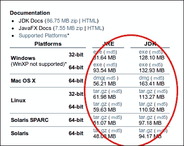
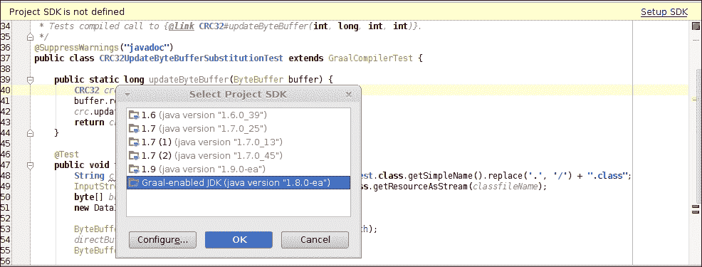

# 第十二章。与未来技术合作

在本章中，我们将涵盖以下主题：

+   在 Mac OS X 上使用 Clang 构建 OpenJDK 9

+   在 Windows 上使用 MSYS 构建 OpenJDK 9

+   运行和测试 OpenJDK 9 的早期访问预览

+   使用 Jigsaw

+   使用 Graal 构建 OpenJDK 9

+   使用 Sumatra 构建 OpenJDK 9

# 简介

Java 经常因为某些程度的保守性而受到批评，尤其是在涉及主要语言变化时。然而，最近的 Java 8 版本已经做了很多工作来缓解人们对 Java 将保持保守和停滞不前的担忧。

然而，还有更多的变化即将到来。Java 9 被认为将支持一些长期期待的功能，这可能会将其带入一个全新的市场和编程水平。

在过去，注解支持和泛型在 Java 编程中引起了一场革命。思维方式发生了改变，尽管在低级设计中没有添加任何全新的内容，但高级设计和编程技术无疑发生了变化。结果是，例如，基于注解的框架数量增加，整体编程变得更加简单。

Java 8 已经发布了支持 lambda 表达式、类型注解和公共用途的参数反射。但至少从 2012 年底开始就可以使用它。在官方发布日期之前，就可以拥有所有这些功能，编写具有所有这些特性的程序，享受测试新技术带来的乐趣。一些企业开发者认为，即使在发布后，现代 Java 仍然是不稳定的，并且有些不可预测。然而，任何对新技术测试和支持感兴趣并为之做出贡献的程序员，都能在开发阶段测试和尝试 OpenJDK 8。

OpenJDK 9 早期访问预览在 Java 8 发布后立即发布。因此，我们现在可以尝试 OpenJDK 9。当然，它仍然不稳定，甚至没有通过一些回归测试，但它将会改变。

OpenJDK 8 和 9 之间有哪些主要区别？

有三个主要特性：

+   第一项是长期期待的类型擦除的消除。通过新的精细泛型，将能够在每个泛型引用上确定在集合、映射或元组中使用的是哪种类型。对于所有 Java 程序员来说，这将是一个巨大的缓解。

+   第二个特性旨在为 Java 平台带来一个新的盟友——GPU 的全部力量现在将掌握在程序员手中，只需使用标准特性，无需任何原生代码。这一点将在本章中进一步解释。

+   第三项是 Graal 项目，它将 Java VM API 暴露给最终用户。这是一个巨大的突破，因为现在可以即时更改 Java 的操作方式。

还有更多的工作要做；Java 9 也将包含更少的 GC 类型，而不会降低性能。

### 小贴士

注意，下划线 (_) 在 Java 9 中将不会是一个合法的标识符名称，所以请及时准备你的代码。更多详细信息请查看 [`openjdk.java.net/jeps/213`](http://openjdk.java.net/jeps/213)。

此外，对于那些处理货币交易和金融分析的人来说，Java 9 还有一个特性——JSR 354，货币 API。它将实现 ISO-4217 标准货币和一些额外的货币。还将引入货币算术。

### 小贴士

要测试 Java Money API，从 [`github.com/JavaMoney/jsr354-api`](https://github.com/JavaMoney/jsr354-api) 构建源代码。然而，这是一个满足 JSR 要求的 Maven 项目，不是 OpenJDK 项目的组成部分。

# 在 Mac OS X 上使用 Clang 构建 OpenJDK 9

在撰写本文时，OpenJDK 9 项目仍然与 OpenJDK 8 非常相似。因此，关于构建 OpenJDK 9 的大部分信息都可以在 第四章，*构建 OpenJDK 8* 中找到。

区分 OpenJDK 9 和 OpenJDK 8 的一个点是 Mac OS X 上使用 Clang 编译器。从 Xcode 版本 5 开始，Clang 成为了 Mac OS X 的官方编译器，而不是 GCC。原本计划将其用作 Mac OS X 上 OpenJDK 8 的官方编译器，但这个切换被推迟到了 OpenJDK 9。

在这个配方中，我们将使用 Xcode 5 和 Clang 编译器构建 OpenJDK 9 的当前代码库。

## 准备工作

对于这个配方，我们需要一个干净安装了 Mercurial 源控制工具的 Mac OS X 10.8 Mountain Lion 或 10.9 Mavericks 系统。

## 如何操作...

以下步骤将帮助我们构建 OpenJDK 9：

1.  从 [`developer.apple.com/xcode/`](https://developer.apple.com/xcode/) 下载 Xcode 5（需要 Apple 开发者账户，注册免费）并安装它。

1.  使用之前提到的相同下载链接下载对应 Xcode 小版本的命令行工具，并安装它。

1.  从终端运行以下命令以设置命令行工具：

    ```java
    sudo xcode-select -switch /Applications/Xcode.app/Contents/Developer/

    ```

1.  安装 JDK 8—Oracle 发行版，或者可以使用预构建的 OpenJDK 二进制文件。

1.  从 Mercurial 仓库获取源代码：

    ```java
    hg checkout http://hg.openjdk.java.net/jdk9/jdk9/
    bash ./get_source.sh

    ```

1.  运行 autotools 配置脚本：

    ```java
    bash ./configure –-with-boot-jdk=path/to/jdk8

    ```

1.  开始构建：

    ```java
    make all 2>&1

    ```

1.  构建的二进制文件将被放入以下目录：

    ```java
    build/macosx-x86_64-normal-server-release/images/j2sdk-image

    ```

## 它是如何工作的...

Xcode 5 默认使用 Clang 编译器，OpenJDK 9 已经对所有从 GCC 切换到 Clang 所需的调整。

## 还有更多...

在 OpenJDK 9 的早期版本中，可能需要安装 X11 服务器。X11 服务器可以从 *XQuartz* 项目中进行安装。

## 参见

+   从 第四章，*构建 OpenJDK 8* 中获取构建 OpenJDK 8 在 Mac OS X 上的配方

# 在 Windows 上使用 MSYS 构建 OpenJDK 9

Windows 操作系统有着悠久的提供类似 Unix 环境的不同工具的历史。在 Windows 历史的各个时期，存在过诸如 Microsoft POSIX 子系统、Interix、Windows Services for UNIX、MKS Toolkit、Cygwin、MinGW/MSYS 等工具，它们提供了不同级别的 Unix 兼容性。

这三个后者的工具与 OpenJDK 构建最为相关。MKS Toolkit 曾用于 Sun Microsystems 的内部构建，因为它提供了比 Cygwin 更好的速度。OpenJDK 7 不再支持 MKS Toolkit。我们在第二章网站下载并安装 Mercurial SCM 工具。

1.  将 OpenJDK 9 当前的开发森林克隆到`C:\openjdk`目录：

    ```java
    hg clone http://hg.openjdk.java.net/jdk9/jdk9/

    ```

1.  从[`mingw.org/`](http://mingw.org/)下载`mingw-get`实用程序（`mingw-get-setup.exe`）并将其安装到`C:\MinGW`路径。

1.  运行`cmd.exe`外壳程序并导航到目录。

1.  运行以下命令将已安装的 MSYS 版本从最新版本回退到 1.0.17：

    ```java
    mingw-get install --reinstall --recursive msys-core=1.0.17-1

    ```

1.  运行以下命令安装所有必需的 MSYS 软件包：

    ```java
    mingw-get install msys-zip
    mingw-get install msys-unzip
    mingw-get install msys-diffutils
    mingw-get install msys-file
    mingw-get install msys-mktemp
    mingw-get install msys-tar
    mingw-get install msys-xargs
    mingw-get install msys-findutils
    mingw-get install msys-make

    ```

1.  使用`C:\MinGW\msys\1.0\msys.bat`文件运行 MSYS 外壳程序。

1.  导航到`c/openjdk`目录，并使用以下命令下载所有 OpenJDK 子存储库的源代码：

    ```java
    bash ./get_source.sh

    ```

1.  在`PATH`变量中添加 JDK 8 二进制文件的路径：

    ```java
    export PATH=/c/jdk8/bin:$PATH

    ```

1.  更改所有源文件的文件系统权限：

    ```java
    chmod -R 777 .

    ```

1.  指定 FreeType 二进制文件的路径运行配置脚本：

    ```java
    ./configure --with-freetype=/c/freetype

    ```

1.  同时将输出写入屏幕和日志文件以启动构建过程：

    ```java
    make | tee make.log

    ```

1.  等待构建完成。

## 它是如何工作的...

在撰写本文时，OpenJDK 9 代码使用与 OpenJDK 8 相同的工具链，因此环境设置类似。

我们使用 MSYS 的 1.0.17 版本，因为 1.0.18 版本中出现了与多核支持相关的回归问题。这个回归问题在撰写本文时尚未修复，但很可能将在后续版本中得到修复。

`mingw-get`实用程序是一个软件包管理器，允许我们安装或更新所需的 MSYS 软件包。

## 参见

+   来自第二章的*为 Windows 构建安装 Cygwin*配方，*构建 OpenJDK 6*

+   来自第四章的*在 Windows 7 SP1 上构建 OpenJDK 8*配方，*构建 OpenJDK 8*

+   与 OpenJDK 9 中 MSYS 支持的恢复相关的 OpenJDK 错误[`bugs.openjdk.java.net/browse/JDK-8022177`](https://bugs.openjdk.java.net/browse/JDK-8022177)

+   关于 MSYS 1.0.18 中回归的 OpenJDK 邮件列表线程[`mail.openjdk.java.net/pipermail/build-dev/2014-August/012917.html`](http://mail.openjdk.java.net/pipermail/build-dev/2014-August/012917.html)

+   MSYS 网站[`www.mingw.org/wiki/msys`](http://www.mingw.org/wiki/msys)

+   关于 Windows 服务 Unix 的信息[`technet.microsoft.com/en-us/library/bb496506.aspx`](http://technet.microsoft.com/en-us/library/bb496506.aspx)

+   MKS Toolkit 网站[`mkssoftware.com/`](http://mkssoftware.com/)

+   Cygwin 网站[`cygwin.com/`](http://cygwin.com/)

# 运行并测试 OpenJDK 9 的早期访问预览

我们将获取最新的 OpenJDK 代码，并测试功能可用性。不要犹豫去尝试新功能，它们可能在更新的版本中可用。自从 OpenJDK 9 发布以来，这将是测试 OpenJDK 9 最快的方式。希望发布时，同样的事情也会适用于 OpenJDK 10。

## 准备工作

您需要一个互联网连接。除此之外，不需要任何东西。

## 如何操作...

我们将下载、解包并运行最新的公开可用完整 OpenJDK 构建：

1.  打开[`jdk9.java.net/`](https://jdk9.java.net/)页面。

1.  下载早期访问预览，如图所示：

1.  运行安装程序。

1.  您可以在本书的第一章 *OpenJDK 入门*中找到如何从存档中安装 OpenJDK 的方法。

测试早期访问 JDK 中已经包含的一些有趣的功能。查看以下代码：

```java
 DatagramSocket socket = new DatagramSocket(4445);
 System.out.println(socket.supportedOptions());

```

当执行时，您可能期望它返回以下字符串或类似的内容：

```java
[SO_SNDBUF, SO_RCVBUF, SO_REUSEADDR, IP_TOS]

```

虽然有一些小的改进和大量的错误修复，但在早期访问预览中还没有任何重大变化。

## 它是如何工作的...

在[`hg.openjdk.java.net/jdk9/jdk9`](http://hg.openjdk.java.net/jdk9/jdk9)的源代码仓库中，有一些标签，例如`jdk9-b<build number>`，它们会自动构建成早期访问版本。尽管没有夜间构建，但如果您有很多时间和一台足够强大的机器，您始终可以从源代码构建它们。

不要忘记更新您已安装的版本——将会有真正重大和令人兴奋的变化，包括下面解释的。迟早，开发者会推出完整的 Java 9 版本，那时将有机会在它成为生产就绪之前对其进行测试。

## 还有更多...

您也可以从源代码构建 OpenJDK 9：

1.  克隆源代码仓库`hg` [`hg.openjdk.java.net/jdk9/jdk9`](http://hg.openjdk.java.net/jdk9/jdk9)

1.  获取 OpenJDK 子项目的源代码：

    ```java
    chmod 755 ./get_source.sh && ./get_source.sh
    cd jigsaw

    ```

1.  然后配置要构建的 OpenJDK 实例：

    ```java
    chmod 755 ./configure.sh && ./configure.sh

    ```

1.  最后，进行构建本身：

    ```java
    Make

    ```

1.  您输出的最终字符串将看起来像这样：

    ```java
    -------------------------
    Finished building OpenJDK for target 'default'

    ```

# 使用 Jigsaw

Jigsaw 是 Java 全新的模块化系统。它让人联想到一些现有的产品，如 Maven 或 Gradle，但它的最有趣的特点是 JDK 本身的模块化可能性。Jigsaw 将允许在其完全完成后，甚至对一些被认为不可分割的功能进行模块化，例如 HotSpot 二进制文件。

Jigsaw 包含了关于 Java 模块系统的提案。模块化意味着可扩展性——从小型、嵌入式设备，它们只需要基本功能且性能较差，到拥有数十台机器的全规模数据中心。其中一些目标已经实现——但 Jigsaw 提供了一个在所有平台上解决依赖关系的通用方式，从 Java 本身开始。

几个 JEP 是 Jigsaw 的一部分：

+   **JEP 200**：这使得 JDK 本身模块化

+   **JEP 201**：这使得源代码模块化

+   **JEP 220**：这使得运行时 Java 镜像模块化，因此它们可以部分加载

关于 JEPs 进度的某些信息可以在以下 JIRA 链接中找到：

+   [`bugs.openjdk.java.net/browse/JDK-8051619`](https://bugs.openjdk.java.net/browse/JDK-8051619)

+   [`bugs.openjdk.java.net/browse/JDK-8051618`](https://bugs.openjdk.java.net/browse/JDK-8051618)

+   [`bugs.openjdk.java.net/browse/JDK-8061971`](https://bugs.openjdk.java.net/browse/JDK-8061971)

此外，Jigsaw 的核心是 JSR 376——Java 平台模块系统。

## 准备中

你将需要互联网访问。此外，希望有一些使用 Maven 或类似软件的经验。任何关于构建系统内部工作原理的知识都将受到欢迎。

## 如何做...

以下步骤将教你如何构建启用 Jigsaw 的 Java：

1.  首先，让我们从[`hg.openjdk.java.net/jigsaw/jigsaw`](http://hg.openjdk.java.net/jigsaw/jigsaw)克隆一个源代码仓库`hg`。

1.  然后，让我们获取 OpenJDK 子项目的源代码：

    ```java
    chmod 755 ./get_source.sh && ./get_source.sh
    cd jigsaw

    ```

1.  然后配置要构建的 OpenJDK 实例：

    ```java
    chmod 755 ./configure && ./configure

    ```

1.  最后，进行构建本身：

    ```java
    make all
    -------------------------
    Finished building OpenJDK for target 'default'

    ```

恭喜，你已经构建了启用 Jigsaw 的 Java。

现在，我们将进行一些测试：

1.  让我们考虑简单的*helloworld1*程序：

    ```java
    package me.dsmd.jigsawsample
    import me.dsmd.helloworldstrings.Strings
    public class Main{
      public void main(String [] args){
        System.out.println(Strings.helloworld1());
      }
    }
    ```

1.  它有一个类，这个类是从一个尚不存在的包中导入的。

1.  让我们创建它。

    ```java
    package me.dsmd.helloworldstrings
    public class Strings{
      public String helloworld1(){
        return "Hello World";
      }
    }
    ```

现在，我们将尝试使用 Jigsaw 链接它。

Jigsaw 将模块声明存储在名为`module-info.java`的文件中。

1.  让我们为这两个包创建如下：

    ```java
    module  me.dsmd.jigsawsample @ 1.0{
     requires me.dsmd.helloworldstrings
     class me.dsmd.jigsawsample.Main
    }
    module  me.dsmd.helloworldstrings @ 0.1 {
     class me.dsmd.helloworldstrings.Strings
    }

    ```

    这些文件应放置在包的根目录中。

1.  让我们考虑这样一个情况，即所有这些模块都放置在同一个名为`src`的目录中：

    ```java
    .
    ├── modules
    └── src
     ├── me.dsmd.helloworldstrings
     │   ├── me
     │   │   └── dsmd
     │   │       └── helloworldstrings
     │   │           └── Strings.java
     │   └── module-info.java
     └── me.dsmd.jigsawsample
     ├── me
     │   └── dsmd
     │       └── jigsawsample
     │           └── Main.java
     └── module-info.java

    ```

1.  然后，让我们使用`javac`从你的 jigsaw 构建中编译它们：

    ```java
    javac -verbose -d modules -modulepath modules -sourcepath \ `find src -name '*.java'`

    ```

## 它是如何工作的...

Jigsaw 是一个模块化系统，为 Java 提供了它自己的构建系统。在 Java 世界中，很久以前就出现了类似的系统，但它们缺乏核心支持。它们从未能够将模块化支持的优点带给 Java 本身的功能。当然，也有一些缺点。*一次编写，到处运行*的口号不像以前那样适用了。

我们使用新构建的 OpenJDK 命令来创建、安装和导出模块。这些命令仍在积极开发中，但规范已经写出，所以，希望在生产访问发布之前不会有显著的变化。

## 还有更多...

你还可以将模块作为库安装。为此，运行以下命令：

+   要创建一个模块库：

    ```java
    $ jmod -L lib1 create 

    ```

    这将创建一个模块库`lib1`。

+   要将一些模块安装到库中：

    ```java
    $ jmod -L lib1 install modules module1 module2

    ```

    这将在库`lib1`下将你的模块安装到系统父目录下。

目前，没有方法可以从库中删除模块。也许，在发布时也不会有。目前，从库中删除模块的最简单方法是物理地从存储库中删除它：

```java
rm -rf lib1/module1

```

此外，如果您要运行一个模块，如果它包含标准入口点：

```java
java -L lib1 -m module1

```

### 小贴士

新的`-m`选项也仅包含在 Jigsaw 启用的 Java 命令中。截至现在（2014 年 6 月），它不包含在任何公共早期访问预览中。

作为下一个特性，您可以通过执行以下命令将模块导出为文件：

```java
jpkg -m modules/module1 jmod module1

```

将创建`module1@<module version>.jmod`文件。它将包含已导出、准备使用的模块。

# 使用 Graal 构建 OpenJDK 9

如项目页面所述，Graal 是：

> *JVM 对自身 J 的探索*

在完成此项目后，JVM 功能将通过 Java API 公开，因此最终用户将能够访问最底层的操作。例如，将能够用 Java 编写 Java 编译器。现在，我们将尝试对其进行测试。

此外，还有**Truffle**，这是一个框架，允许您使用 Graal VM 构建自己的语言。它基于**抽象语法树**（**AST**）的概念，实际上这个过程非常简单。为了更好地了解，请查看以下链接：

[`cesquivias.github.io/blog/2014/10/13/writing-a-language-in-truffle-part-1-a-simple-slow-interpreter/`](https://cesquivias.github.io/blog/2014/10/13/writing-a-language-in-truffle-part-1-a-simple-slow-interpreter/)

## 准备工作

您需要互联网连接。此外，建议阅读有关构建 OpenJDK 的章节。

## 如何做...

查看以下步骤以使用 Graal 构建 OpenJDK：

1.  首先，克隆一个源代码库：

    ```java
    hg clone http://hg.openjdk.java.net/graal/graal
    cd graal
    export EXTRA_JAVA_HOMES=/usr/lib/jvm/java-1.7.0-openjdk
    ./mx.sh build

    ```

1.  输入一个选择值，`vm graal`将基于此构建。不幸的是，它不会在未经修改的情况下针对 OpenJDK 9-ea 预览版构建：

    ```java
    ./mx.sh build
    [1] /usr/lib/jvm/java-1.7.0-openjdk
    [2] /usr/lib/jvm/java-1.6.0-openjdk-amd64
    [3] /usr/lib/jvm/java-6-oracle
    [4] /usr/lib/jvm/jdk1.9.0
    [5] /usr/lib/jvm/java-7-oracle
    [6] /usr/lib/jvm/java-8-oracle
    [7] /usr/lib/jvm/java-6-openjdk-amd64
    [8] /usr/lib/jvm/java-7-openjdk-amd64
    [9] /usr/lib/jvm/java-1.7.0-openjdk-amd64
    [10] <other>

    ```

1.  然后，选择要执行的 VM 类型。有两种类型的 VM。简而言之，`server vm`将使用默认的 hotspot 编译，仅使用 Graal 本身进行显式 Graal API 调用，而`graal VM`将通过 Graal 编译一切。第一个选项更适合生产 VM，而第二个选项更适合测试目的。

    ```java
    Please select the VM to be executed from the following:
    [1] server - Normal compilation is performed with a tiered system (C1
     + C2), Truffle compilation is performed with Graal. Use this for
     optimal Truffle performance.
    [2] graal - Normal compilation is performed with a tiered system (C1 +
     Graal), Truffle compilation is performed with Graal.

    ```

1.  然后，泡一杯茶，这个过程可能需要几十分钟。

1.  然后，如果您想初始化您的 IDE 项目，请运行`./mx.sh ideinit`。

1.  然后，打开您喜欢的 IDE 并打开生成的项目。这里以 IntelliJ Idea 为例：

1.  探索各种测试。

## 它是如何工作的...

Graal 启用的虚拟机将向最终用户公开 Java API。

## 还有更多...

在第八章 *Hacking OpenJDK* 中，我们向 HotSpot 添加了新的内建函数，以 crc32 计算为例。在 Graal 项目中，有一个类似的测试，它测试了`CRC32#updateByteBuffer`方法的编译替换。它包含在`com.oracle.graal.hotspot.jdk8.test`包中。运行它，并享受性能变化。

# 使用 Sumatra 构建 OpenJDK 9

很长时间以来，Java 被认为是一个主要的后端工具，因为它具有跨平台的向量功能。只有 J2ME 能够在移动领域实现长期的优势。但现在它将改变。Sumatra 项目的目标是向 Java 开发者提供 GPU 计算标准。

## 准备工作

您可能需要一个支持 CUDA 和 OpenGL 的 GPU，或者一个正在运行的 HSAIL 模拟器（因为板载 GPU 不支持本地 GPU 语言）。

## 如何做到这一点...

Sumatra 开发者广泛使用前面提到的 Graal 项目。构建分为两个阶段。首先，Sumatra JDK 像正常的 OpenJDK 构建一样构建，如下所示：

```java
make
Building OpenJDK for target 'default' in configuration 'linux-x86_64-normal-server-release'

## Starting langtools
## Finished langtools (build time 00:00:03)

## Starting hotspot
## Finished hotspot (build time 00:00:01)

## Starting corba
## Finished corba (build time 00:00:00)

## Starting jaxp
## Finished jaxp (build time 00:00:01)

## Starting jaxws
## Finished jaxws (build time 00:00:02)

## Starting jdk
## Finished jdk (build time 00:00:21)

----- Build times -------
Start 2014-07-06 00:17:24
End   2014-07-06 00:17:52
00:00:00 corba
00:00:01 hotspot
00:00:01 jaxp
00:00:02 jaxws
00:00:21 jdk
00:00:03 langtools
00:00:28 TOTAL
-------------------------
Finished building OpenJDK for target 'default'

```

第二阶段是在 Sumatra JDK 之上构建一个 Graal JDK。这可能有点棘手，但希望它能成功：

1.  克隆一个`hg`仓库`hg clone [`hg.openjdk.java.net/sumatra/sumatra-dev/`](http://hg.openjdk.java.net/sumatra/sumatra-dev/)`：

    ```java
    chmod 755 configure && ./configure

    ```

1.  获取源代码：

    ```java
    chmod 755 get_source.sh && ./get_source.sh

    ```

1.  然后制作源代码：

    ```java
    make

    ```

1.  将`JAVA_HOME`导出到新构建的 OpenJDK 实例：

    ```java
    export JAVA_HOME=<path-to-sumatra-dev>/build/linux-<your-arch>-normal-server-release/images/j2sdk-image

    ```

1.  构建启用了 HSAIL 的 grail：

    ```java
    /mx.sh --vmbuild product --vm server build

    ```

恭喜！您有一个启用了 Sumatra 的虚拟机。

让我们做一个简单的测试。考虑一个来自官方样本的代码：

```java
package simple;

import java.util.stream.IntStream;

public class Simple {

    public static void main(String[] args) {
        final int length = 8;
        int[] ina = new int[length];
        int[] inb = new int[length];
        int[] out = new int[length];

        // Initialize the input arrays - this is offloadable
        IntStream.range(0, length).parallel().forEach(p -> {
            ina[p] = 1;
            inb[p] = 2;
        });

        // Sum each pair of elements into out[] - this is offloadable
        IntStream.range(0, length).parallel().forEach(p -> {
            out[p] = ina[p] + inb[p];
        });

        // Print results - this is not offloadable since it is
        // calling native code etc.
        IntStream.range(0, length).forEach(p -> {
            System.out.println(out[p] + ", " + ina[p] + ", " + inb[p]);
        });
    }
}
```

它包含两个可卸载的 lambda 函数。我们将尝试使用`HSA` API 使它们并行运行。

1.  首先，将`JAVA_HOME`设置为 Graal JDK：

    ```java
    export JAVA_HOME=/path/to/graal/jdk1.8.0-internal/product/

    ```

1.  然后克隆`OKRA HSA`接口：

    ```java
    git clone https://github.com/HSAFoundation/Okra-Interface-to-HSA-Device.git

    ```

1.  使其可运行：

    ```java
    export PATH=$PATH:/path/to/okra/dist/bin
    export LD_LIBRARY_PATH=$LD_LIBRARY_PATH:/path/to/okra/dist/bin

    ```

1.  运行带有和不带有卸载的示例。

1.  您将在终端中获得以下代码：

    ```java
    $JAVA_HOME/bin/java -server -esa -XX:+TraceGPUInteraction -Dcom.amd.sumatra.offload.immediate=true -G:Log=CodeGen  simple.Simple
    ...
    [HSAIL] library is libokra_x86_64.so
    [GPU] registered initialization of Okra (total initialized: 2)
    [CUDA] Ptx::get_execute_kernel_from_vm_address
    [thread:1] scope:
     [thread:1] scope: GraalCompiler
     [thread:1] scope: GraalCompiler.CodeGen
     Nothing to do here
     Nothing to do here
     Nothing to do here
     version 0:95: $full : $large; 
    // static method HotSpotMethod<Simple.lambda$main$0(int[], int[], int)> 
    kernel &run ( 
     align 8 kernarg_u64 %_arg0,
     align 8 kernarg_u64 %_arg1
     ) {
     ld_kernarg_u64  $d0, [%_arg0];
     ld_kernarg_u64  $d1, [%_arg1];
     workitemabsid_u32 $s0, 0;

    @L0:
     cmp_eq_b1_u64 $c0, $d1, 0; // null test
     cbr $c0, @L1;
    @L2:
     ld_global_s32 $s1, [$d1 + 12];
     cmp_ge_b1_u32 $c0, $s0, $s1;
     cbr $c0, @L8;
    @L3:
     cmp_eq_b1_u64 $c0, $d0, 0; // null test
     cbr $c0, @L4;
    @L5:
     ld_global_s32 $s1, [$d0 + 12];
     cmp_ge_b1_u32 $c0, $s0, $s1;
     cbr $c0, @L7;
    @L6:
     cvt_s64_s32 $d2, $s0;
     mul_s64 $d2, $d2, 4;
     add_u64 $d0, $d0, $d2;
     st_global_s32 1, [$d0 + 16];
     cvt_s64_s32 $d0, $s0;
     mul_s64 $d0, $d0, 4;
     add_u64 $d1, $d1, $d0;
     st_global_s32 2, [$d1 + 16];
     ret;
    @L1:
     mov_b32 $s0, -6155;
    @L9:
     ret;
    @L4:
     mov_b32 $s0, -4363;
     brn @L9;
    @L8:
     mov_b32 $s0, -6683;
     brn @L9;
    @L7:
     mov_b32 $s0, -4891;
     brn @L9;
    }; 

    [HSAIL] heap=0x00007f4c9801de38
    [HSAIL] base=0x05a00000, capacity=209190912
    External method:simple.Simple.lambda$main$0([I[II)V
    installCode0: ExternalCompilationResult
    [HSAIL] sig:([I[II)V  args length=2, _parameter_count=3
    [HSAIL] static method
    [HSAIL] HSAILKernelArguments::do_array, _index=0, 0x82b20888, is a [I
    [HSAIL] HSAILKernelArguments::do_array, _index=1, 0x82b208b8, is a [I
    [HSAIL] HSAILKernelArguments::not pushing trailing int
     [thread:1] scope: GraalCompiler
     [thread:1] scope: GraalCompiler.CodeGen
     Nothing to do here
     Nothing to do here
     Nothing to do here
     version 0:95: $full : $large; 
    // static method HotSpotMethod<Simple.lambda$main$1(int[], int[], int[], int)> 
    kernel &run ( 
     align 8 kernarg_u64 %_arg0,
     align 8 kernarg_u64 %_arg1,
     align 8 kernarg_u64 %_arg2
     ) {
     ld_kernarg_u64  $d0, [%_arg0];
     ld_kernarg_u64  $d1, [%_arg1];
     ld_kernarg_u64  $d2, [%_arg2];
     workitemabsid_u32 $s0, 0;

    @L0:
     cmp_eq_b1_u64 $c0, $d0, 0; // null test
     cbr $c0, @L1;
    @L2:
     ld_global_s32 $s1, [$d0 + 12];
     cmp_ge_b1_u32 $c0, $s0, $s1;
     cbr $c0, @L12;
    @L3:
     cmp_eq_b1_u64 $c0, $d2, 0; // null test
     cbr $c0, @L4;
    @L5:
     ld_global_s32 $s1, [$d2 + 12];
     cmp_ge_b1_u32 $c0, $s0, $s1;
     cbr $c0, @L11;
    @L6:
     cmp_eq_b1_u64 $c0, $d1, 0; // null test
     cbr $c0, @L7;
    @L8:
     ld_global_s32 $s1, [$d1 + 12];
     cmp_ge_b1_u32 $c0, $s0, $s1;
     cbr $c0, @L10;
    @L9:
     cvt_s64_s32 $d3, $s0;
     mul_s64 $d3, $d3, 4;
     add_u64 $d1, $d1, $d3;
     ld_global_s32 $s1, [$d1 + 16];
     cvt_s64_s32 $d1, $s0;
     mul_s64 $d1, $d1, 4;
     add_u64 $d2, $d2, $d1;
     ld_global_s32 $s2, [$d2 + 16];
     add_s32 $s2, $s2, $s1;
     cvt_s64_s32 $d1, $s0;
     mul_s64 $d1, $d1, 4;
     add_u64 $d0, $d0, $d1;
     st_global_s32 $s2, [$d0 + 16];
     ret;
    @L1:
     mov_b32 $s0, -7691;
    @L13:
     ret;
    @L4:
     mov_b32 $s0, -6411;
     brn @L13;
    @L10:
     mov_b32 $s0, -5403;
     brn @L13;
    @L7:
     mov_b32 $s0, -4875;
     brn @L13;
    @L12:
     mov_b32 $s0, -8219;
     brn @L13;
    @L11:
     mov_b32 $s0, -6939;
     brn @L13;
    }; 
    [HSAIL] heap=0x00007f4c9801de38
    [HSAIL] base=0x05a00000, capacity=209190912
    External method:simple.Simple.lambda$main$1([I[I[II)V
    installCode0: ExternalCompilationResult
    [HSAIL] sig:([I[I[II)V  args length=3, _parameter_count=4
    [HSAIL] static method
    [HSAIL] HSAILKernelArguments::do_array, _index=0, 0x82b208f8, is a [I
    [HSAIL] HSAILKernelArguments::do_array, _index=1, 0x82b20888, is a [I
    [HSAIL] HSAILKernelArguments::do_array, _index=2, 0x82b208b8, is a [I
    [HSAIL] HSAILKernelArguments::not pushing trailing int
    3, 1, 2
    3, 1, 2
    3, 1, 2
    3, 1, 2
    3, 1, 2
    3, 1, 2
    3, 1, 2
    3, 1, 2

    ```

## 它是如何工作的...

Sumatra 运行在 Graal 项目之上。由于所有与 GPU 的操作都是在虚拟机级别实现的，Sumatra 使用 Graal 来访问它们。Sumatra 的功能处于高度发展阶段，并且可能面临各种不可预测的变化。

但最终用户现在就可以使用其中的一些，以牺牲一些兼容性和标准化为代价，获得新的 Java 生产力水平。

## 还有更多...

在 Graal 套件中，可以测试 Sumatra HSAIL 功能。

要这样做，运行以下代码：

```java
./mx.sh --vm server unittest -XX:+TraceGPUInteraction -XX:+GPUOffload -G:Log=CodeGen hsail.test.IntAddTest

```

输出应该看起来像以下这样（对于 Linux Mint 15，或其他发行版/操作系统，结果可能略有不同）：

```java
 [HSAIL] library is libokra_x86_64.so
[HSAIL] using _OKRA_SIM_LIB_PATH_=/tmp/okraresource.dir_2488167353114811077/libokra_x86_64.so
[GPU] registered initialization of Okra (total initialized: 2)
[CUDA] Ptx::get_execute_kernel_from_vm_address
JUnit version 4.8
.[thread:1] scope:
 [thread:1] scope: GraalCompiler
 [thread:1] scope: GraalCompiler.CodeGen
 Nothing to do here
 Nothing to do here
 Nothing to do here
 version 0:95: $full : $large;
// static method HotSpotMethod<IntAddTest.run(int[], int[], int[], int)>
kernel &run (
 align 8 kernarg_u64 %_arg0,
 align 8 kernarg_u64 %_arg1,
 align 8 kernarg_u64 %_arg2
 ) {
 ld_kernarg_u64  $d0, [%_arg0];
 ld_kernarg_u64  $d1, [%_arg1];
 ld_kernarg_u64  $d2, [%_arg2];
 workitemabsid_u32 $s0, 0;
@L0:
 cmp_eq_b1_u64 $c0, $d0, 0; // null test
 cbr $c0, @L1;
@L2:
 ld_global_s32 $s1, [$d0 + 12];
 cmp_ge_b1_u32 $c0, $s0, $s1;
 cbr $c0, @L12;
@L3:
 cmp_eq_b1_u64 $c0, $d2, 0; // null test
 cbr $c0, @L4;
@L5:
 ld_global_s32 $s1, [$d2 + 12];
 cmp_ge_b1_u32 $c0, $s0, $s1;
 cbr $c0, @L11;
@L6:
 cmp_eq_b1_u64 $c0, $d1, 0; // null test
 cbr $c0, @L7;
@L8:
 ld_global_s32 $s1, [$d1 + 12];
 cmp_ge_b1_u32 $c0, $s0, $s1;
 cbr $c0, @L10;
@L9:
 cvt_s64_s32 $d3, $s0;
 mul_s64 $d3, $d3, 4;
 add_u64 $d1, $d1, $d3;
 ld_global_s32 $s1, [$d1 + 16];
 cvt_s64_s32 $d1, $s0;
 mul_s64 $d1, $d1, 4;
 add_u64 $d2, $d2, $d1;
 ld_global_s32 $s2, [$d2 + 16];
 add_s32 $s2, $s2, $s1;
 cvt_s64_s32 $d1, $s0;
 mul_s64 $d1, $d1, 4;
 add_u64 $d0, $d0, $d1;
 st_global_s32 $s2, [$d0 + 16];
 ret;
@L1:
 mov_b32 $s0, -7691;
@L13:
 ret;
@L4:
 mov_b32 $s0, -6411;
 brn @L13;
@L10:
 mov_b32 $s0, -5403;
 brn @L13;
@L7:
 mov_b32 $s0, -4875;
 brn @L13;
@L12:
 mov_b32 $s0, -8219;
 brn @L13;
@L11:
 mov_b32 $s0, -6939;
 brn @L13;
};

[HSAIL] heap=0x00007f95b8019cc0
[HSAIL] base=0x05a00000, capacity=210763776
External method:com.oracle.graal.compiler.hsail.test.IntAddTest.run([I[I[II)V
installCode0: ExternalCompilationResult
[HSAIL] sig:([I[I[II)V args length=3, _parameter_count=4
[HSAIL] static method
[HSAIL] HSAILKernelArguments::do_array, _index=0, 0x82b21970, is a [I
[HSAIL] HSAILKernelArguments::do_array, _index=1, 0x82b477f0, is a [I
[HSAIL] HSAILKernelArguments::do_array, _index=2, 0x82b479e0, is a [I
[HSAIL] HSAILKernelArguments::not pushing trailing int

Time: 0.153

OK (1 test)

```

完成此测试意味着 HSAIL 函数正在正常工作，因此最前沿的 Java 已经从您的 GPU 中受益。
