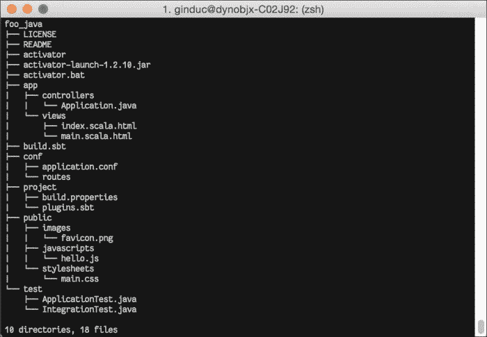
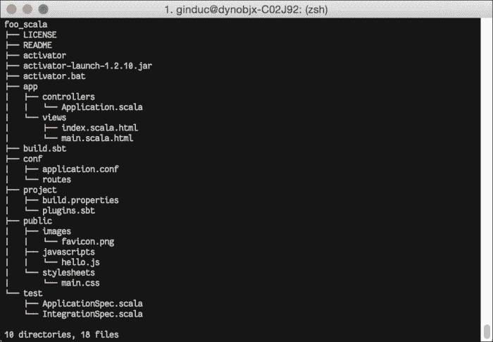
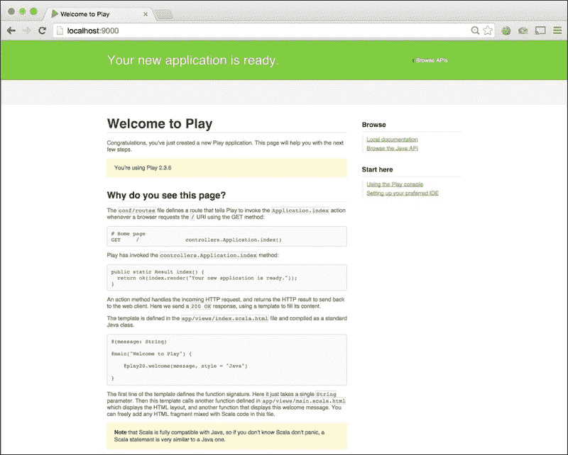
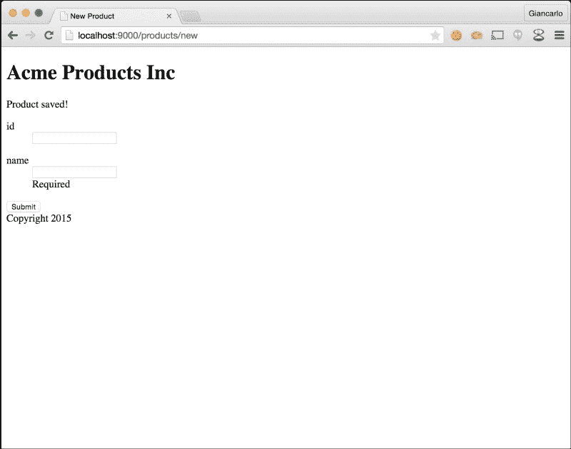
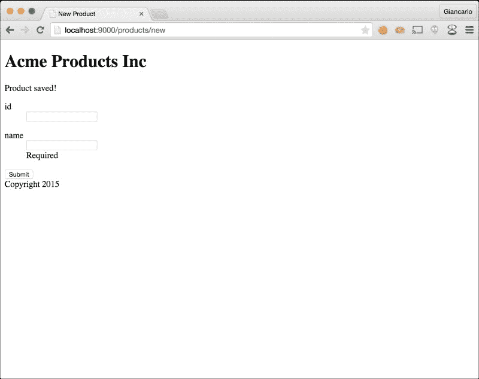
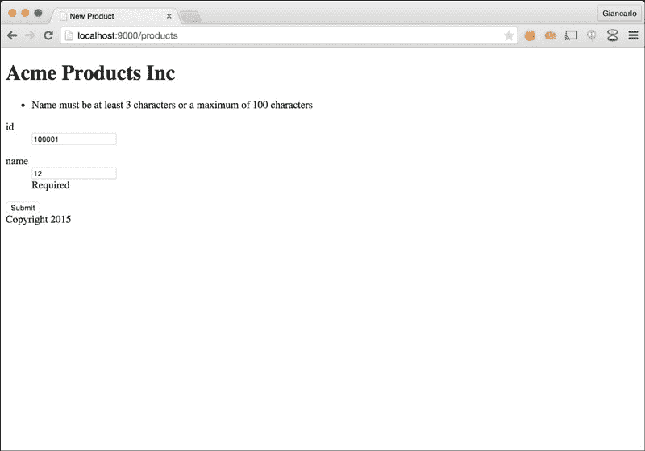
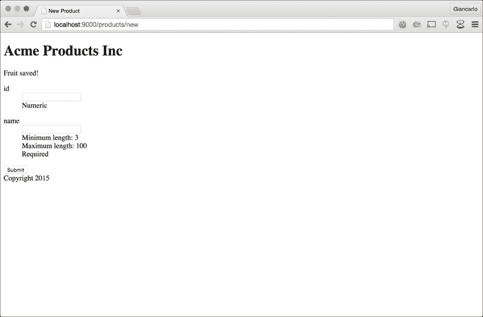
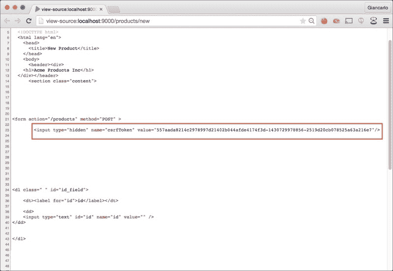
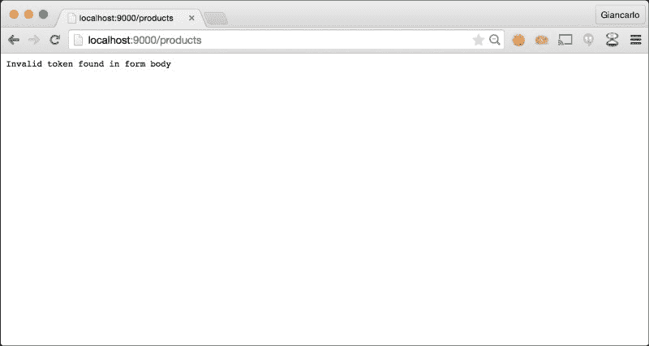

# 第一章. Play 框架基础

在本章中，我们将介绍以下菜谱：

+   安装 Play 框架

+   使用 Typesafe Activator 创建 Play 应用程序

+   使用 Play 控制台

+   与模块一起工作

+   与控制器和路由一起工作

+   在控制器中使用动作参数

+   使用反向路由和重定向

+   与视图模板一起工作

+   使用辅助标签

+   使用视图布局和包含

+   与 XML 和文本文件一起工作

+   使用 Ebean（Java）与 MySQL

+   使用 Anorm（Scala）和 MySQL 数据库演变

+   使用表单模板和 Web 动作

+   使用表单验证

+   保护表单提交

+   使用 JUnit（Java）和 specs2（Scala）进行测试

+   测试模型

+   测试控制器

# 简介

Play 是一个既适用于 Java 也适用于 Scala 的开发者友好的现代 Web 应用程序框架。本章将带您了解安装 Play 框架进行本地开发的步骤。本章将描述 Play 应用程序项目目录结构、其各种成员及其在 Play 应用程序中的功能。

本章还将向您介绍`Activator`命令，它取代了旧的 Play 命令。Activator 在开发过程中的各个阶段都得到使用，包括编译、下载库依赖项、测试和构建。它实际上与其他构建工具（如 Ant 或 Maven）非常相似。

本章还将介绍如何在 Play 框架中实现**模型-视图-控制器**（**MVC**）组件。这将随后是创建控制器和路由动作的源代码，使用视图模板和用于与关系数据库管理系统（如 MySQL）接口的模型组件。本章将处理基本的 HTTP 表单，认识到现代 Web 应用程序能够处理用户交互和数据的重要性，以及 Play 框架如何提供各种 API 来简化开发者的工作。

到本章结束时，您应该能够很好地掌握如何实现基本的 Web 应用程序功能，例如使用 MySQL 进行表单提交和数据访问，创建指向 Web 动作的 URL 路由，以及创建由更小、模块化和可重用视图组件组成的视图。 

本章中的大多数菜谱都假设您对 Java 开发、Web 应用程序开发、命令行界面、**结构化查询语言**（**SQL**）、开发构建工具、第三方库使用、依赖管理以及单元测试有一定程度的熟悉。

# 安装 Play 框架

本菜谱将指导您安装 Play Framework 2.3 以进行本地开发。本节将指导您进行 Play 框架的先决条件安装，例如**Java 开发工具包**（**JDK**），以及确保 Play 框架可以访问 JDK 的二进制文件的必要步骤。

## 准备工作

Play 框架需要 6 或更高版本的 JDK。请访问 Oracle 网站，下载适合您的开发机器的 JDK，链接为 [`www.oracle.com/technetwork/java/javase/downloads/index.html`](http://www.oracle.com/technetwork/java/javase/downloads/index.html)。

下载合适的 JDK 后，请确保将二进制文件夹添加到系统路径中：

```java
<span class="strong"><strong>    $ export JAVA_PATH=/YOUR/INSTALLATION/PATH</strong></span>
<span class="strong"><strong>    $ export PATH=$PATH:$JAVA_HOME/bin</strong></span>
```

您还可以参考 Oracle 的在线文档以获取有关设置环境变量的更多信息，链接为 [`docs.oracle.com/cd/E19182-01/820-7851/inst_cli_jdk_javahome_t/index.html`](http://docs.oracle.com/cd/E19182-01/820-7851/inst_cli_jdk_javahome_t/index.html)。

这里是如何验证 JDK 是否已添加到系统路径中的方法：

```java
<span class="strong"><strong>    $ javac -version</strong></span>
<span class="strong"><strong>    javac 1.7.0_71</strong></span>
 <span class="strong"><strong>    $ java -version</strong></span>
<span class="strong"><strong>    java version "1.7.0_71"</strong></span>
<span class="strong"><strong>    Java(TM) SE Runtime Environment (build 1.7.0_71-b14)</strong></span>
<span class="strong"><strong>    Java HotSpot(TM) 64-Bit Server VM (build 24.71-b01, mixed mode)</strong></span>
```

## 如何操作...

截至 Play 2.3.x，Play 现在通过一个名为 Typesafe Activator 的工具进行分发，按照以下步骤安装它：[`typesafe.com/activator`](http://typesafe.com/activator)。

1.  下载 *Typesafe Reactive Platform* 分发版，链接为 [`typesafe.com/platform/getstarted`](https://typesafe.com/platform/getstarted)，并将其解压到您有写访问权限的期望位置。

1.  下载并解压分发版后，将 `Activator` 安装目录添加到您的系统路径中：

    ```java
    <span class="strong"><strong>    $ export ACTIVATOR_HOME=&lt;/YOUR/INSTALLATION/PATH&gt;</strong></span>
    <span class="strong"><strong>    $ export PATH=$PATH:$ACTIVATOR_HOME</strong></span>
    ```

1.  现在，验证 Activator 是否已添加到系统路径中：

    ```java
    <span class="strong"><strong>    $ activator --version</strong></span>
    <span class="strong"><strong>    sbt launcher version 0.13.5</strong></span>
    ```

1.  现在，您应该可以使用 `activator` 命令创建 Play 应用程序：

    ```java
    <span class="strong"><strong>    $ activator new &lt;YOUR_APP_NAME&gt;</strong></span>
    ```

# 使用 Typesafe Activator 创建 Play 应用程序

一旦您安装并正确配置了 JDK 和 Activator，您就应该准备好创建 Play 2.3.x 应用程序。从 Play 2.0 开始，开发者现在可以创建基于 Java 或 Scala 的 Play 应用程序。Activator 为 Java 和 Scala 提供了许多 Play 项目模板。对于第一个项目，让我们使用基本项目模板。我们还将使用 Activator 的命令行界面来处理本食谱中的所有配方。

## 如何操作...

您需要执行以下操作以创建 Java 和 Scala 的模板：

+   对于 Java，让我们使用 `play-java` 模板，并通过以下命令将我们的第一个应用程序命名为 `foo_java`：

    ```java
    <span class="strong"><strong>    $ activator new foo_java play-java</strong></span>
    ```

+   对于 Scala，让我们使用 `play-scala` 模板，并通过以下命令将我们的第一个应用程序命名为 `foo_scala`：

    ```java
    <span class="strong"><strong>    $ activator new foo_scala play-scala</strong></span>
    ```

## 它是如何工作的…

此 `Activator` 命令创建项目的根目录（`foo_java` 或 `foo_scala`）并创建所有相关的子目录、配置文件和类文件：

以下截图显示了 `foo_java` 的根目录：



以下截图显示了 `foo_scala` 的根目录：



如您所见，Java 和 Scala 项目模板生成的文件列表几乎相同，只是对于 *play_java* 模板，生成的类文件是 `.java` 文件，而对于 *play_scala* 模板，生成的类文件是 `.scala` 文件。

对于项目的目录结构，Play 框架的一个重要方面是它遵循约定优于配置的概念。这最好地体现在每个 Play 应用程序遵循的标准项目目录结构中：

1st Level

2nd Level

3rd Level

描述

`app/`

应用程序源文件

`assets`/

编译后的 JavaScript 或样式表

`stylesheets`/

编译后的样式表（例如 LESS 或 SASS）

`javascripts`/

编译后的 JavaScript（例如 CoffeeScript）

`controllers`/

应用程序请求-响应控制器

`models`/

应用程序领域对象

`views`/

应用程序展示视图

`conf/`

应用程序配置文件

`public`/

公共可用的资源

`stylesheets`/

公共可用的样式表文件

`javascripts`/

公共可用的 JavaScript 文件

`project`/

构建配置文件（例如 `Build.scala` 和 `plugins.sbt`）

`lib`/

未管理的库和包

`logs`/

日志文件

`test`/

测试源文件

源代码、配置文件和 Web 资源组织在预定义的目录结构中，这使得开发者能够轻松地浏览项目目录树，并在逻辑位置中找到相关文件。

## 更多内容...

前往 [`typesafe.com/activator/templates`](http://typesafe.com/activator/templates) 查看可用的项目模板的完整列表。

# 使用 Play 控制台

Play 控制台是一个用于构建和运行 Play 应用程序的命令行界面工具。对于每个开发者来说，熟悉可用的命令，如 `clean`、`compile`、`dependencies` 和 `run`，以充分利用 Play 控制台的功能是非常重要的。

## 如何操作…

你需要执行以下操作才能使用 Play 控制台来运行 Java 和 Scala：

1.  在 Activator 完成设置 Play 项目后，你可以进入你的 Play 应用程序的 Play 控制台。

    +   使用以下命令进行 Java：

        ```java
        <span class="strong"><strong>    $ cd foo_java</strong></span>
        <span class="strong"><strong>    $ activator</strong></span>
        ```

    +   使用以下命令进行 Scala：

        ```java
        <span class="strong"><strong>    $ cd foo_scala</strong></span>
        <span class="strong"><strong>    $ activator</strong></span>
        ```

1.  一旦进入 Play 控制台，你就可以以开发模式运行你的应用程序：

    +   使用以下命令进行 Java：

        ```java
        <span class="strong"><strong>    [foo_java] $ run</strong></span>
        ```

    +   使用以下命令进行 Scala：

        ```java
        <span class="strong"><strong>    [foo_scala] $ run</strong></span>
        ```

1.  现在，打开网络浏览器并转到 `http://localhost:9000`：

1.  使用以下命令行启用热重载功能启动你的 Play 应用程序：

    ```java
    <span class="strong"><strong>    $ activator "~run"</strong></span>
    ```

1.  使用以下命令行在不同的端口上启动你的 Play 应用程序：

    ```java
    <span class="strong"><strong>    $ activator "run 9001"</strong></span>
    ```

### 备注

以开发模式运行你的应用程序将配置你的应用程序以自动重新加载运行，Play 将尝试重新编译项目文件中的任何最近更改，从而无需为每次代码编辑手动重新启动应用程序。你现在可以使用网络浏览器查看你的应用程序。

## 更多内容…

你还可以使用 Play 控制台通过 activator 控制台中的 `compile` 命令手动编译类文件（使用 `activator` 命令）：

+   使用以下命令进行 Java：

    ```java
    <span class="strong"><strong>    [foo_java] $ compile</strong></span>
    ```

+   使用以下命令进行 Scala：

    ```java
    <span class="strong"><strong>    [foo_scala] $ compile</strong></span>
    ```

你也可以直接运行 Play 命令，而不是使用 Play 控制台：

+   使用以下命令进行 Java：

    ```java
    <span class="strong"><strong>    $ cd foo_java</strong></span>
    <span class="strong"><strong>    $ activator compile</strong></span>
    <span class="strong"><strong>    $ activator run</strong></span>
    ```

+   使用以下命令进行 Scala：

    ```java
    <span class="strong"><strong>    $ cd foo_scala</strong></span>
    <span class="strong"><strong>    $ activator compile</strong></span>
    <span class="strong"><strong>    $ activator run</strong></span>
    ```

使用以下命令使用`Activator`为你的现有 Play 应用程序生成 eclipse 项目文件：

```java
<span class="strong"><strong>    $ activator eclipse</strong></span>
<span class="strong"><strong>    [info] Loading project definition from /private/tmp/foo_scala/project</strong></span>
<span class="strong"><strong>    [info] Set current project to foo_scala (in build file:/private/tmp/foo_scala/)</strong></span>
<span class="strong"><strong>    [info] About to create Eclipse project files for your project(s).</strong></span>
<span class="strong"><strong>    [info] Compiling 5 Scala sources and 1 Java source to /private/tmp/foo_scala/target/scala-2.11/classes...</strong></span>
<span class="strong"><strong>    [info] Successfully created Eclipse project files for project(s):</strong></span>
<span class="strong"><strong>    [info] foo_scala</strong></span>
```

使用以下命令使用`Activator`为你的现有 Play 应用程序生成 IntelliJ IDEA 项目文件：

```java
<span class="strong"><strong>    $ activator idea</strong></span>
<span class="strong"><strong>    [info] Loading project definition from /private/tmp/foo_java/project</strong></span>
<span class="strong"><strong>    [info] Set current project to foo_java (in build file:/private/tmp/foo_java/)</strong></span>
<span class="strong"><strong>    [info] Creating IDEA module for project 'foo_java' ...</strong></span>
<span class="strong"><strong>    [info] Running compile:managedSources ...</strong></span>
<span class="strong"><strong>    [info] Running test:managedSources ...</strong></span>
<span class="strong"><strong>    [info] Excluding folder target</strong></span>
<span class="strong"><strong>    [info] Created /private/tmp/foo_java/.idea/IdeaProject.iml</strong></span>
<span class="strong"><strong>    [info] Created /private/tmp/foo_java/.idea</strong></span>
<span class="strong"><strong>    [info] Excluding folder /private/tmp/foo_java/target/scala-2.11/cache</strong></span>
<span class="strong"><strong>    [info] Excluding folder /private/tmp/foo_java/target/scala-2.11/classes</strong></span>
<span class="strong"><strong>    [info] Excluding folder /private/tmp/foo_java/target/scala-2.11/classes_managed</strong></span>
<span class="strong"><strong>    [info] Excluding folder /private/tmp/foo_java/target/native_libraries</strong></span>
<span class="strong"><strong>    [info] Excluding folder /private/tmp/foo_java/target/resolution-cache</strong></span>
<span class="strong"><strong>    [info] Excluding folder /private/tmp/foo_java/target/streams</strong></span>
<span class="strong"><strong>    [info] Excluding folder /private/tmp/foo_java/target/web</strong></span>
<span class="strong"><strong>    [info] Created /private/tmp/foo_java/.idea_modules/foo_java.iml</strong></span>
<span class="strong"><strong>    [info] Created /private/tmp/foo_java/.idea_modules/foo_java-build.iml</strong></span>
```

# 使用模块

你可以在你的 Play 应用程序中利用其他 Play 框架或第三方模块。这可以通过编辑构建文件（`build.sbt`）并以`sbt`依赖声明的方式声明库依赖来实现。

## 如何做到这一点…

你需要执行以下步骤来声明一个模块：

1.  打开`build.sbt`文件，并添加以下行，在声明库依赖时使用组 ID`%`模块名称`%`版本：

    ```java
    libraryDependencies ++= Seq(
          jdbc,
          "mysql" % "mysql-connector-java" % "5.1.28"
        )
    ```

1.  保存对`build.sbt`的更改后，转到命令行，让 Activator 下载新声明的依赖项：

    ```java
    <span class="strong"><strong>    $ activator clean dependencies</strong></span>
    ```

## 它是如何工作的…

在这个菜谱中，我们声明了我们的 Play 应用程序需要什么，并引用了由 Play 框架提供的**Java 数据库连接**（**JDBC**）模块以及由 MySQL 提供的 MySQL Java 连接器模块。一旦我们声明了模块，我们就可以运行 activator dependencies 命令，使 Activator 从公共 Maven 仓库下载所有声明的依赖项，并将它们存储在本地开发机器上。

## 更多内容…

请参考 Play 框架网站以获取官方 Play 模块的完整列表（[`www.playframework.com/documentation/2.3.x/Modules`](https://www.playframework.com/documentation/2.3.x/Modules)）。你还可以参考 Typesafe 官方发布仓库以获取其他可用的插件和模块（[`repo.typesafe.com/typesafe/releases/`](http://repo.typesafe.com/typesafe/releases/)）。

# 使用控制器和路由进行工作

Play 应用程序使用控制器来处理 HTTP 请求和响应。Play 控制器由具有特定功能的行为组成。Play 应用程序使用路由器将 HTTP 请求映射到控制器行为。

## 如何做到这一点…

要创建一个新页面，该页面为 Play Java 项目打印出“Hello World”，我们需要采取以下步骤：

1.  启用热重载功能运行`foo_java`应用程序：

    ```java
    <span class="strong"><strong>    $ activator "~run"</strong></span>
    ```

1.  通过添加以下操作编辑`foo_java/app/controllers/Application.java`：

    ```java
    public static Result hello() {
          return ok("Hello World");
        }
    ```

1.  通过添加以下行编辑`foo_java/conf/routes`：

    ```java
    GET    /hello    controllers.Application.hello()
    ```

1.  使用网页浏览器查看你的新 hello 页面：

    ```java
    <code class="literal">http://localhost:9000/hello</code>
    ```

对于 Scala，我们需要采取以下步骤：

1.  启用热重载功能运行`foo_scala`应用程序：

    ```java
    <span class="strong"><strong>    $ activator "~run"</strong></span>
    ```

1.  通过添加以下操作编辑`foo_scala/app/controllers/Application.scala`：

    ```java
    def hello = Action {
          Ok("Hello World")
        }
    ```

1.  通过添加以下行编辑`foo_scala/conf/routes`：

    ```java
    GET    /hello    controllers.Application.hello
    ```

1.  使用网页浏览器查看你的新 hello 页面：

    ```java
    <code class="literal">http://localhost:9000/hello</code>
    ```

## 它是如何工作的…

在这个菜谱中，我们列举了通过在控制器中创建一个新的网络操作来创建一个新的可访问页面的必要步骤，并通过向 `conf/routes` 文件中添加一个新条目来定义这个新页面的 URL 路由。我们现在应该有一个“Hello World”页面，而且无需重新加载应用程序服务器。

# 在控制器中使用操作参数

网络应用应该能够接受动态数据作为其规范 URL 的一部分。一个例子是 RESTful API 网络服务的 `GET` 操作。Play 使得开发者能够轻松实现这一点。

## 如何做…

对于 Java，我们需要采取以下步骤：

1.  启用 Hot-Reloading 运行 `foo_java` 应用程序。

1.  通过添加以下操作来编辑 `foo_java/app/controllers/Application.java`：

    ```java
    public static Result echo(String msg) {
          return ok("Echoing " + msg);
        }
    ```

1.  通过添加以下行来编辑 `foo_java/conf/routes`：

    ```java
    GET    /echo/:msg    controllers.Application.echo(msg)
    ```

1.  使用网页浏览器查看你的新 echo 页面：

    ```java
    <code class="literal">http://localhost:9000/echo/foo</code>
    ```

1.  你应该能够看到文本 **Echoing foo**。

对于 Scala，我们需要采取以下步骤：

1.  启用 Hot-Reloading 运行 `foo_scala` 应用程序。

1.  通过添加以下操作来编辑 `foo_scala/app/controllers/Application.scala`：

    ```java
    def echo(msg: String) = Action {
          Ok("Echoing " + msg)
        }
    ```

1.  通过添加以下行来编辑 `foo_scala/conf/routes`：

    ```java
    GET    /echo/:msg    controllers.Application.echo(msg)
    ```

1.  使用网页浏览器查看你的新 echo 页面：

    ```java
    <code class="literal">http://localhost:9000/echo/bar</code>
    ```

1.  你应该能够看到文本 **Echoing bar**。

## 它是如何工作的…

在这个菜谱中，我们只修改了两个文件，应用程序控制器 `Application.java` 和 `Application.scala` 以及 `routes` 文件。我们在 `Application.scala` 中添加了一个新的网络操作，该操作接受一个 String 类型的参数 `msg` 并将消息的内容返回给 HTTP 响应。然后我们在 `routes` 文件中添加了一个新的条目，声明了一个新的 URL 路由，并将 `:msg` 路由参数作为规范 URL 的一部分。

# 使用反向路由和重定向

对于一个网络应用来说，能够重定向 HTTP 请求是一个更基本的任务，而使用 Play 框架重定向 HTTP 非常简单。这个菜谱展示了开发者如何使用反向路由来引用已定义的路由。

## 如何做…

对于 Java，我们需要采取以下步骤：

1.  启用 Hot-Reloading 运行 `foo_java` 应用程序。

1.  通过添加以下操作来编辑 `foo_java/app/controllers/Application.java`：

    ```java
    public static Result helloRedirect() {
          return redirect(controllers.routes.Application.echo("HelloWorldv2"));
        }
    ```

1.  通过添加以下行来编辑 `foo_java/conf/routes`：

    ```java
    GET    /v2/hello    controllers.Application.helloRedirect()
    ```

1.  使用网页浏览器查看你的新 echo 页面：

    ```java
    <code class="literal">http://localhost:9000/v2/hello</code>
    ```

1.  你应该能够看到文本 **Echoing HelloWorldv2**。

1.  注意，在网页浏览器中的 URL 也已经重定向到 `http://localhost:9000/echo/HelloWorldv2`

对于 Scala，我们需要采取以下步骤：

1.  启用 Hot-Reloading 运行 `foo_scala` 应用程序。

1.  通过添加以下操作来编辑 `foo_scala/app/controllers/Application.scala`：

    ```java
    def helloRedirect() = Action {
          Redirect(routes.Application.echo("HelloWorldv2"))
        }
    ```

1.  通过添加以下行来编辑 `foo_scala/conf/routes`：

    ```java
    GET    /v2/hello    controllers.Application.helloRedirect
    ```

1.  使用网页浏览器查看你的新 echo 页面：

    ```java
    <code class="literal">http://localhost:9000/v2/hello</code>
    ```

1.  你应该能够看到文本 **Echoing HelloWorldv2**。

1.  注意，在网页浏览器中的 URL 也已经重定向到 `http://localhost:9000/echo/HelloWorldv2`

## 它是如何工作的…

在这个菜谱中，我们在引用其他操作方法中的现有路由时使用了反向路由。这很方便，因为我们不需要在其他操作方法中硬编码渲染的 URL 路由。我们还通过使用我们的第一个 HTTP 重定向，一个非常常见的 Web 应用程序功能，来执行一个 302 HTTP 重定向，这是一个所有标准 Web 服务器都处理的标准 HTTP 状态码。

# 使用视图模板

你期望能够在 Web 应用程序中将一些数据发送回视图本身；在 Play 框架中，这非常简单直接。一个 Play 视图模板只是一个包含指令、网页标记标签和模板标签的文本文件。`视图模板`文件也遵循标准的命名约定，并且它们被放置在 Play 项目目录中的预定义目录中，这使得管理模板文件变得更加容易。

## 如何操作...

对于 Java，我们需要采取以下步骤：

1.  使用启用热重载的功能运行`foo_java`应用程序。

1.  在`foo_java/app/views/`中创建视图文件`products.scala.html`。添加视图文件的内容：

    ```java
    @(products: Collection[String])
         &lt;h3&gt;@products.mkString(",")&lt;/h3&gt;
    ```

1.  通过添加以下操作来编辑`foo_java/app/controllers/Application.java`：

    ```java
    private static final java.util.Map&lt;Integer, String&gt; productMap = new java.util.HashMap&lt;Integer, String&gt;();
         static {
          productMap.put(1, "Keyboard");
          productMap.put(2, "Mouse");
          productMap.put(3, "Monitor");
        }
         public static Result listProducts() {
          return ok(products.render(productMap.values()));
        }
    ```

1.  通过添加以下行来编辑`foo_java/conf/routes`：

    ```java
    GET    /products    controllers.Application.listProducts
    ```

1.  使用网络浏览器查看产品页面：

    ```java
    <code class="literal">http://localhost:9000/products</code>
    ```

对于 Scala，我们需要采取以下步骤：

1.  使用启用热重载的功能运行`foo_scala`应用程序。

1.  在`foo_scala/app/views/`中创建视图文件`products.scala.html`。添加视图文件的内容：

    ```java
    @(products: Seq[String])
         &lt;h3&gt;@products.mkString(",")&lt;/h3&gt;
    ```

1.  通过添加以下操作来编辑`foo_scala/app/controllers/Application.scala`：

    ```java
    private val productMap = Map(1 -&gt; "Keyboard", 2 -&gt; "Mouse", 3 -&gt; "Monitor")
        def listProducts() = Action {
          Ok(views.html.products(productMap.values.toSeq))
        }
    ```

1.  通过添加以下行来编辑`foo_scala/conf/routes`：

    ```java
    GET    /products    controllers.Application.listProducts
    ```

1.  使用网络浏览器查看产品页面：

    ```java
    <code class="literal">http://localhost:9000/products</code>
    ```

## 它是如何工作的...

在这个菜谱中，我们能够从服务器端检索数据集合，并在我们的视图模板中显示集合的内容。目前，我们使用一个静态的字符串对象集合在视图模板中显示，而不是从数据库中检索一些数据集，这将在接下来的菜谱中解决。

我们通过在视图模板的第一行代码中声明参数并在控制器中传递数据到视图模板中引入了在视图模板中声明参数的方法。

# 使用辅助标签

视图标签允许开发者创建可重用的视图函数和组件，从而使视图的管理变得更加简单和容易。

## 如何操作...

对于 Java，我们需要采取以下步骤：

1.  使用启用热重载的功能运行`foo_java`应用程序。

1.  在`foo_java/app/views/tags`中创建标签文件`productsIterator.scala.html`

1.  添加标签文件的以下内容：

    ```java
    @(products: Collection[String])
         &lt;ul&gt;
          @for(product &lt;- products) {
            &lt;li&gt;@product&lt;/li&gt;
          }
        &lt;/ul&gt;
    ```

1.  通过添加以下块来编辑`foo_java/app/views/products.scala.html`：

    ```java
    @import tags._

        @productsIterator(products)
    ```

1.  使用网络浏览器重新加载产品页面以查看新的产品列表，使用无序列表 HTML 标签：

    ```java
    <code class="literal">http://localhost:9000/products</code>
    ```

对于 Scala，我们需要采取以下步骤：

1.  使用启用热重载的功能运行`foo_scala`应用程序。

1.  在`foo_scala/app/views/tags`中创建标签文件`productsIterator.scala.html`

1.  添加标签文件的内容：

    ```java
    @(products: Seq[String])
         &lt;ul&gt;
          @for(product &lt;- products) {
            &lt;li&gt;@product&lt;/li&gt;
      }
        &lt;/ul&gt;
    ```

1.  通过添加以下代码块编辑`foo_scala/app/views/products.scala.html`：

    ```java
    @import tags._

        @productsIterator(products)
    ```

1.  使用网页浏览器重新加载产品页面，以查看新的产品列表，使用无序列表 HTML 标签：

    ```java
    <code class="literal">http://localhost:9000/products</code>
    ```

## 它是如何工作的...

在这个菜谱中，我们能够在`app/views/tags`中创建一个新的视图标签。然后我们继续在我们的视图模板中使用这个标签。

首先，我们创建了一个新的标签，该标签接收一组产品标题，然后将其作为无序列表在模板中显示。然后我们在产品视图模板中导入该标签，并通过调用其文件名（`@productsIterator(products)`）来调用辅助函数。

# 使用视图布局和包含

对于这个菜谱，我们将创建一个包含定义好的头部和尾部视图的主布局视图模板。这将允许我们的视图模板通过包含这个主视图模板来继承一致的外观和感觉，并在单个文件中管理所有 UI 更改。在我们的产品视图中，我们将使用这个示例中的主布局视图。

## 如何操作...

对于 Java，我们需要采取以下步骤：

1.  启用热重载功能运行`foo_java`应用程序。

1.  在`foo_java/app/views/common`中创建主布局视图文件`mainLayout.scala.html`。

1.  添加主布局视图文件的内容：

    ```java
    @(title: String)(content: Html)
      &lt;!DOCTYPE html&gt;
      &lt;html lang="en"&gt;
        &lt;head&gt;
          &lt;title&gt;@title&lt;/title&gt;
        &lt;/head&gt;
        &lt;body&gt;
          &lt;header&gt;@header()&lt;/header&gt;
          &lt;section class="content"&gt;@content&lt;/section&gt;
          &lt;footer&gt;@footer()&lt;/footer&gt;
        &lt;/body&gt;
      &lt;/html&gt;
    ```

1.  在`foo_java/app/views/common`中创建头部视图文件`header.scala.html`并添加以下代码：

    ```java
    &lt;div&gt;
        &lt;h1&gt;Acme Products Inc&lt;/h1&gt;
      &lt;/div&gt;
    ```

1.  在`foo_java/app/views/common`中创建尾部视图文件`footer.scala.html`并添加以下代码：

    ```java
    &lt;div&gt;
        Copyright 2014
      &lt;/div&gt;
    ```

1.  编辑`foo_java/app/views/products.scala.html`产品视图文件，以使用主布局视图模板，将所有文件内容替换为以下代码：

    ```java
    @(products: Collection[String])
       @import tags._
      @import common._
       @mainLayout(title = "Acme Products") {
        @productsIterator(products)
      }
    ```

1.  使用网页浏览器重新加载更新后的产品页面：

    ```java
    <code class="literal">http://localhost:9000/products</code>
    ```

对于 Scala，我们需要采取以下步骤：

1.  启用热重载功能运行`foo_scala`应用程序。

1.  在`foo_scala/app/views/common`中创建主布局视图文件`mainLayout.scala.html`。

1.  添加主布局视图文件的内容：

    ```java
    @(title: String)(content: Html)
      &lt;!DOCTYPE html&gt;
      &lt;html lang="en"&gt;
        &lt;head&gt;
          &lt;title&gt;@title&lt;/title&gt;
        &lt;/head&gt;
        &lt;body&gt;
          &lt;header&gt;@header()&lt;/header&gt;
          &lt;section class="content"&gt;@content&lt;/section&gt;
          &lt;footer&gt;@footer()&lt;/footer&gt;
        &lt;/body&gt;
      &lt;/html&gt;
    ```

1.  在`foo_scala/app/views/common`中创建头部视图文件`header.scala.html`并添加以下代码：

    ```java
    &lt;div&gt;
        &lt;h1&gt;Acme Products Inc&lt;/h1&gt;
      &lt;/div&gt;
    ```

1.  在`foo_scala/app/views/common`中创建尾部视图文件`footer.scala.html`并添加以下代码：

    ```java
    &lt;div&gt;
        Copyright 2014
      &lt;/div&gt;
    ```

1.  编辑`foo_scala/app/views/products.scala.html`产品视图文件，以使用主布局视图模板，将所有文件内容替换为以下代码：

    ```java
    @(products: Seq[String])
       @import tags._
      @import common._
       @mainLayout(title = "Acme Products") {
        @productsIterator(products)
      }
    ```

1.  使用网页浏览器重新加载更新后的产品页面：

    ```java
    <code class="literal">http://localhost:9000/products</code>
    ```

## 它是如何工作的...

在这个菜谱中，我们创建了一个可以在整个 Play 应用程序中重用的主布局视图模板。一个常见的布局视图消除了在相关视图中重复视图逻辑的需要，并使得管理父视图和子视图变得容易得多。

# 处理 XML 和文本文件

使用视图模板，我们也能够响应 HTTP 请求的其他内容类型，如文本文件和 XML 数据格式。Play 框架具有原生处理 XML 和文本文件内容类型响应的处理程序。

## 如何操作...

对于 Java，我们需要采取以下步骤：

1.  启用 Hot-Reloading 运行 `foo_java` 应用程序：

    ```java
    <span class="strong"><strong>    $ activator "~run"</strong></span>
    ```

1.  在 `app/views/` 中创建基于文本的视图模板文件 `products.scala.txt` 并添加以下内容：

    ```java
    @(productMap: Map[Integer, String])
        @for((id, name) &lt;- productMap) {
          The Product '@name' has an ID of @id
        }
    ```

1.  在 `app/views/` 中创建基于 XML 的视图模板文件 `products.scala.xml` 并添加以下内容：

    ```java
    @(productMap: Map[Integer, String]) &lt;products&gt;
        @for((id, name) &lt;- productMap) {
          &lt;product id="@id"&gt;@name&lt;/product&gt;
        }
        &lt;/products&gt;
    ```

1.  通过添加以下动作编辑 `foo_java/app/controllers/Application.java`：

    ```java
    public static Result listProductsAsXML() {
            return ok(views.xml.products.render(productMap));
        }
         public static Result listProductsAsTXT() {
            return ok(views.txt.products.render(productMap));
        }
    ```

1.  通过添加以下行编辑 `foo_java/conf/routes`：

    ```java
    GET    /products.txt    controllers.Application.listProductsAsTXT()
        GET    /products.xml    controllers.Application.listProductsAsXML()
    ```

1.  使用网页浏览器查看新的路由和动作：

    +   `http://localhost:9000/products.txt` 和，

    +   `http://localhost:9000/products.xml`

对于 Scala，我们需要采取以下步骤：

1.  启用 Hot-Reloading 运行 `foo_scala` 应用程序：

    ```java
    $ activator "~run"
    ```

1.  在 `app/views/` 中创建基于文本的视图模板文件 `products.scala.txt` 并添加以下内容：

    ```java
    @(productMap: Map[Int, String])
        @for((id, name) &lt;- productMap) {
          The Product '@name' has an ID of @id
        }
    ```

1.  在 `app/views/` 中创建基于 XML 的视图模板文件 `products.scala.xml` 并添加以下内容：

    ```java
    @(productMap: Map[Int, String]) &lt;products&gt;
        @for((id, name) &lt;- productMap) {
          &lt;product id="@id"&gt;@name&lt;/product&gt;
        }
        &lt;/products&gt;
    ```

1.  通过添加以下动作编辑 `foo_scala/app/controllers/Application.scala`：

    ```java
    def listProductsAsTXT = Action {
          Ok(views.txt.products(productMap))
        }
         def listProductsAsXML = Action {
          Ok(views.xml.products(productMap))
        }
    ```

1.  通过添加以下行编辑 `foo_scala/conf/routes`：

    ```java
    GET    /products.txt    controllers.Application.listProductsAsTXT
        GET    /products.xml    controllers.Application.listProductsAsXML
    ```

1.  使用网页浏览器查看新的路由和动作：

    +   `http://localhost:9000/products.txt` 和

    +   `http://localhost:9000/products.xml`

## 它是如何工作的...

在这个菜谱中，我们利用了 Play 框架内置的其他内容类型支持。我们创建了新的 URL 路由和 Web 动作，以便能够响应 XML 或文本文件格式的数据请求。通过遵循文件命名标准和视图约定，我们能够在 HTML、XML 和文本文件格式中创建视图模板，Play 会自动处理这些模板，并在 HTTP 响应中添加适当的内容类型头。

# 使用 Ebean（Java）与 MySQL

Play Framework 2.x 包含一个名为 **Ebean** 的对象关系映射工具，用于 Java 基础的 Play 应用程序。为了能够使用 Ebean，请确保在 `foo_java/build.sbt` 中将 Ebean 和合适的 MySQL 驱动程序声明为项目依赖项。

对于这个菜谱，我们将利用 Ebean 进行数据库进化。Play Framework 2.x 为开发者提供了一种管理数据库迁移的方法。数据库迁移在应用程序开发过程中跟踪模式变化非常有用。数据库进化默认启用，但可以在 `conf/application.conf` 中通过以下设置禁用：

```java
evolutionplugin=disabled
```

进化脚本存储在 `conf/evolutions/default/` 目录中。有关数据库进化的更多信息，请参阅 Play 的在线文档：

[`www.playframework.com/documentation/2.3.x/Evolutions`](https://www.playframework.com/documentation/2.3.x/Evolutions)。

## 如何操作...

为了利用 Ebean，你需要执行以下步骤：

1.  在 `build.sbt` 中添加 Ebean 依赖项：

    ```java
    libraryDependencies ++= Seq(
            javaJdbc,   javaEbean,
            "mysql" % "mysql-connector-java" % "5.1.28"
        )
    ```

1.  确保在 `conf/application.conf` 中正确配置了 Ebean 和 MySQL：

    ```java
    db.default.driver=com.mysql.jdbc.Driver
        db.default.url="jdbc:mysql://&lt;YOUR_MYSQL_HOST&gt;/&lt;YOUR_DB&gt;"
        db.default.user=&lt;YOUR_USER&gt;
        db.default.password=&lt;YOUR_PASSWORD&gt;
         ebean.default="models.*"
    ```

1.  对于接下来的菜谱，我们需要在我们的 MySQL 数据库中创建我们的产品表。在 `conf/evolutions/default` 中创建我们的第一个数据库进化文件 `1.sql` 并添加以下 SQL 语句：

    ```java
    # --- !Ups
        CREATE TABLE Products (
          id INT NOT NULL AUTO_INCREMENT,
          name VARCHAR(100) NOT NULL,
          PRIMARY KEY (id)
        );
       # --- !Downs
        DROP TABLE Products;
    ```

1.  下一步是创建我们实体 `Product` 的 Ebean 模型：

    ```java
    package models;
         import java.util.*;
        import javax.persistence.*;
        import play.db.ebean.*;
        import play.data.format.*;
        import play.data.validation.*;
         @Entity
       @Table(name = "Products")
        public class Product extends Model {

        @Id
        public Long id;

        @Column
        @Constraints.Required
        public String name;
         public static Finder&lt;Long, Product&gt; find = new Finder&lt;Long, Product&gt;(
          Long.class, Product.class
        );
         public Long getId() {
          return id;
        }
        public void setId(Long id) {
          this.id = id;
        }
        public String getName() {
          return name;
        }
        public void setName(String name) {
          this.name = name;
        }
    }
    ```

以下展示了使用 Ebean 的各种数据库操作。

### 小贴士

**下载示例代码**

您可以从您在 [`www.packtpub.com`](http://www.packtpub.com) 的账户中下载您购买的所有 Packt 书籍的示例代码文件。如果您在其他地方购买了这本书，您可以访问 [`www.packtpub.com/support`](http://www.packtpub.com/support) 并注册以将文件直接通过电子邮件发送给您。

### 创建记录

以下代码片段将创建一条新记录：

```java
Product product = new Product();
      product.name = "Apple iPhone";
      product.save();
```

### 更新记录

以下代码片段将更新一条记录：

```java
Product forUpdate = Product.find.ref(1L);
      forUpdate.name = "Apple iPhone 6";
      forUpdate.update();Deleting a record:
  Product.find.ref(1L).delete();
```

### 查询记录

以下代码片段将查询一条记录：

```java
Product p = Product.find.byId(1L);
```

### 检索记录

以下代码片段将检索一条记录：

```java
List&lt;Product&gt; products = Product.find.all();
```

# 使用 Anorm（Scala）和 MySQL 数据库演变

Play Framework 2.x 包含 Anorm，这是一个用于 Scala 基础 Play 应用程序的有用数据访问库。为了能够使用 Anorm，请确保在 `foo_scala/build.sbt` 中将 Anorm 和合适的 MySQL 驱动程序声明为项目依赖项。

对于这个菜谱，我们将利用 Anorm 和数据库演变。Play Framework 2.x 为开发者提供了一种管理数据库迁移的方法。数据库迁移对于跟踪应用程序开发过程中的模式更改非常有用。数据库演变默认启用，但可以在 `conf/application.conf` 中使用以下设置禁用：

```java
evolutionplugin=disabled
```

进化脚本存储在 `conf/evolutions/default/` 目录中。有关数据库进化的更多信息，请参阅 Play 的在线文档，网址为 [`www.playframework.com/documentation/2.3.x/Evolutions`](https://www.playframework.com/documentation/2.3.x/Evolutions)。

您需要执行以下步骤来利用 Anorm：

1.  将 Anorm 依赖项添加到 `build.sbt`：

    ```java
    libraryDependencies ++= Seq(
          jdbc,
          anorm,
       "mysql" % "mysql-connector-java" % "5.1.28"
        )
    ```

1.  确保在 `conf/application.conf` 中正确配置了 Anorm 和 MySQL：

    ```java
    db.default.driver= com.mysql.jdbc.Driver
        db.default.url="jdbc:mysql://localhost/YOUR_DB"
        db.default.user=YOUR_USER
        db.default.password=YOUR_PASSWORD
    ```

1.  对于接下来的菜谱，我们需要在我们的 MySQL 数据库中创建我们的产品表。在 `conf/evolutions/default` 中创建我们的第一个数据库演变文件 `1.sql`，并添加以下 SQL 语句：

    ```java
    # --- !Ups
        CREATE TABLE Products (
          id INT NOT NULL AUTO_INCREMENT,
          name VARCHAR(100) NOT NULL,
          PRIMARY KEY (id)
        );
     # --- !Downs
        DROP TABLE Products;
    ```

## 还有更多...

以下部分展示了使用 `Anorm` 的各种数据库操作。

### 创建新记录

以下代码片段将创建一条新记录：

```java
DB.withConnection { implicit c =&gt;
     SQL("INSERT INTO Products(id, name) VALUES ({id}, {name});")
        .on('id -&gt; product.id, 'name -&gt; product.name).executeInsert()
   }
```

### 更新记录

以下代码片段将更新一条记录：

```java
   DB.withConnection { implicit c =&gt;
      SQL("UPDATE Products SET name = {name} WHERE id = {id}")
       .on('name -&gt; product.name, 'id -&gt; product.id).executeUpdate()
   }
```

### 删除记录

以下代码片段将删除一条记录：

```java
   DB.withConnection { implicit c =&gt;
      SQL("DELETE FROM Products WHERE id={id};")
       .on('id -&gt; id).executeUpdate()
   }Querying a record
```

以下代码片段将查询一条记录：

```java
DB.withConnection { implicit c =&gt;
      SQL("SELECT * FROM Products WHERE id={id};")
       .on('id -&gt; id).executeQuery().singleOpt(defaultParser)
    }
```

以下代码片段将检索一条记录：

```java
DB.withConnection { implicit c =&gt;
     SQL("SELECT * FROM Products;").executeQuery().list(defaultParser)
   }
```

最后，我们可以将这些功能组合在一个名为 Product 的伴随对象中：

```java
package models
     import play.api.db.DB
    import play.api.Play.current
    import anorm._
    import anorm.SqlParser.{str, int}
     case class Product(id: Long, name: String)
     object Product {
      val defaultParser = int("id") ~ str("name") map {
          case id ~ name  =&gt; Product(id, name)
         }
       def save(product: Product) = {
        DB.withConnection { implicit c =&gt;
      SQL("INSERT INTO Products(id, name) VALUES ({id}, {name});")
                  .on('id -&gt; product.id, 'name -&gt; product.name).executeInsert()
        }
          }

       def update(product: Product) = {
        DB.withConnection { implicit c =&gt;
               SQL("UPDATE Products SET name = {name} WHERE id = {id}")
                .on('name -&gt; product.name, 'id -&gt; product.id).executeUpdate()
            }
          }

      def delete(id: Long) = {
        DB.withConnection { implicit c =&gt;
               SQL("DELETE FROM Products WHERE id={id};")
           .on('id -&gt; id).executeUpdate()
        }
          }

      def get(id: Long) = {
        DB.withConnection { implicit c =&gt;
      SQL("SELECT * FROM Products WHERE id={id};")
        .on('id -&gt; id).executeQuery().singleOpt(defaultParser)
        }
          }

      def all = {
        DB.withConnection { implicit c =&gt;
      SQL("SELECT * FROM Products;").executeQuery().list(defaultParser)
        }
          }
    }
```

# 使用表单模板和 Web 动作

与大多数网络应用程序一样，总会有接受 HTTP 表单的需求，无论是注册表单还是登录表单。Play 框架提供了帮助类来管理和处理 HTTP 表单提交。在这个菜谱中，我们将介绍创建简单表单并映射处理此表单提交分配的网络操作的步骤。我们还将利用闪存作用域，它允许我们使用闪存对象在每次请求的基础上从控制器向视图模板发送消息。

## 如何操作...

对于 Java，我们需要采取以下步骤：

1.  以启用热重载的方式运行 `foo_java` 应用程序。

1.  创建表单视图模板文件 `app/views/product/form.scala.html` 并添加以下内容：

    ```java
    @(productForm: Form[models.Product])

        @import common._
         @mainLayout(title = "New Product") {

          @if(flash.get("success") != null) {
            &lt;p&gt;@flash.get("success")&lt;/p&gt;
          }
           @if(productForm.hasGlobalErrors) {
            &lt;ul&gt;
            @for(error &lt;- productForm.globalErrors) {
              &lt;li&gt;@error.message&lt;/li&gt;
            }
            &lt;/ul&gt;
          }
           @helper.form(action = routes.Products.postForm()) {
            @helper.inputText(productForm("id"))
            @helper.inputText(productForm("name"))
             &lt;input type="submit"&gt;
          }
        }
    ```

1.  创建产品控制器 `foo_java/app/controllers/Products.java` 并添加以下导入、操作和 Play 表单块：

    ```java
    package controllers;
         import play.*;
        import play.mvc.*;
        import play.data.*;
        import views.html.*;
        import models.*;
         public class Products extends Controller {  
       public static Result create() {
          Form&lt;Product&gt; form = Form.form(Product.class);
               return ok(views.html.product.form.render(form));
           }
            public static Result postForm() {
              Form&lt;Product&gt; productForm = Form.form(Product.class).bindFromRequest();
              if (productForm.hasErrors()) {
              return badRequest(views.html.product.form.render(productForm));
          } else {
         Product product = productForm.get();
              product.save();
          flash("success", "Product saved!");
                  return redirect(controllers.routes.Products.create());
          }
           }
        }
    ```

1.  通过添加以下行编辑 `foo_java/conf/routes`：

    ```java
    GET    /products/new    controllers.Products.create()
        POST   /products        controllers.Products.postForm()
    ```

1.  使用网页浏览器查看您的新产品表单：

    ```java
    <code class="literal">http://localhost:9000/product/new</code>
    ```

1.  为您的新产品填写一个名称并点击 **提交**。您现在应该会收到成功消息：

对于 Scala，我们需要采取以下步骤：

1.  以启用热重载的方式运行 `foo_scala` 应用程序。

1.  创建表单视图模板文件 `app/views/product/form.scala.html` 并添加以下内容：

    ```java
    @(productForm: Form[models.Product])(implicit flash: Flash)

        @import common._
         @mainLayout(title = "New Product") {
          @flash.get("success").map { message =&gt;
            &lt;p&gt;@message&lt;/p&gt;
          }
           @if(productForm.hasGlobalErrors) {
            &lt;ul&gt;
            @for(error &lt;- productForm.globalErrors) {
              &lt;li&gt;@error.message&lt;/li&gt;
            }
            &lt;/ul&gt;
          }
           @helper.form(action = routes.Products.postForm()) {
            @helper.inputText(productForm("id"))
            @helper.inputText(productForm("name"))
             &lt;input type="submit"&gt;
          }
        }
    ```

1.  创建产品控制器 `foo_scala/app/controllers/Products.scala` 并添加以下导入、操作和 Play 表单块：

    ```java
    import play.api._
        import play.api.mvc._
        import models._
        import play.api.data._
        import play.api.data.Forms._
         val form = Form(
          mapping(
            "id" -&gt; longNumber,
            "name" -&gt; text
          )(Product.apply)(Product.unapply)
        )

        def create = Action { implicit request =&gt;
          Ok(views.html.product.form(form))
        }
         def postForm = Action { implicit request =&gt;
          form.bindFromRequest.fold(
            formWithErrors =&gt; {
              BadRequest(views.html.product.form(formWithErrors))
            },
            product =&gt; {Product.save(product)
              Redirect(routes.Products.create).flashing("success" -&gt; "Product saved!")
            }
          )
        }
    ```

1.  通过添加以下行编辑 `foo_scala/conf/routes`：

    ```java
    GET    /products/new    controllers.Products.create
        POST   /products        controllers.Products.postForm
    ```

1.  使用网页浏览器查看您的新产品表单：

    ```java
    <code class="literal">http://localhost:9000/product/new</code>
    ```

1.  为您的新产品填写一个名称并点击 **提交**。您现在应该会收到以下成功消息：

## 工作原理...

在这个菜谱中，我们能够使用 Play 框架创建我们的第一个 HTTP 表单。这个菜谱包括了创建 HTML 表单视图模板和我们的产品控制器。我们声明了两个网络操作和两个 URL 路由，并创建了 Play 表单对象，我们使用它将请求参数绑定到我们的模型 Fruit。我们能够通过在网页浏览器中访问 `http://localhost:9000/Products/new` 来加载网络表单。填写完我们的表单详细信息后，我们提交了表单本身，并从产品控制器收到了通知。

# 使用表单验证

Play 框架提供了一个简单的方式来验证表单提交。对于 Play Java，我们将验证添加到模型中，这将检查提交字段的长度，如果验证条件不满足，则返回错误消息。对于 Play Scala，我们将表单验证添加到表单对象本身，并在那里定义每个表单字段的验证参数。

## 如何操作...

对于 Java，我们需要采取以下步骤：

1.  编辑产品模型，`foo_java/app/models/Product.java` 并添加 `validate()` 方法：

    ```java
    public String validate() {
          if (name.length() &lt; 3 || name.length() &gt; 100) {
             return "Name must be at least 3 characters or a maximum of 100 characters";
       }
          return null;
        }
    ```

1.  使用网页浏览器重新加载产品表单：

    ```java
    <code class="literal">http://localhost:9000/products/new</code>
    ```

1.  产品表单现在应仅接受至少三个字符和最多 100 个字符的产品名称，如下截图所示！

对于 Scala，我们需要采取以下步骤：

1.  编辑产品控制器`foo_scala/app/controllers/Products.scala`并修改表单的声明方式：

    ```java
    val form = Form(
          mapping(
            "id" -&gt; longNumber,
            "name" -&gt; nonEmptyText(minLength = 3, maxLength = 100)
          )(Product.apply)(Product.unapply)
        )
    ```

1.  使用网页浏览器重新加载产品表单：

    ```java
    <code class="literal">http://localhost:9000/products/new</code>
    ```

1.  产品表单现在应仅接受至少三个字符和最多 100 个字符的水果名称，如下截图所示！

## 它是如何工作的...

在这个菜谱中，我们为产品名称和用户提交的可接受长度添加了数据验证。对于 Java，我们在产品模型中添加了一个`validate()`方法。

我们可以通过使用 JSR-303 JavaBean 验证注解并定义一个 Play 在模型类中存在时调用的`validate()`方法来验证我们的 Java 模型。

对于 Scala，我们在控制器中的`Form`对象中添加了数据验证指令。我们使用了 Play 表单助手来定义产品名称属性的最小和最大字符数。

# 保护表单提交

Play 框架有一个 CSRF 过滤器模块，开发人员可以在 HTTP 表单提交期间验证 CSRF 令牌。这允许开发人员确信表单是使用有效的会话令牌提交的，并且没有被任何方式篡改。

## 如何操作...

对于 Java，我们需要采取以下步骤：

1.  将 Play 过滤器模块作为项目依赖项添加到`build.sbt`：

    ```java
    libraryDependencies += filters
    ```

1.  在`app/`目录中创建一个`Global.java`对象文件：

    ```java
    import play.GlobalSettings;
        import play.api.mvc.EssentialFilter;
        import play.filters.csrf.CSRFFilter;
         public class Global extends GlobalSettings {
            @Override
            public &lt;T extends EssentialFilter&gt; Class&lt;T&gt;[] filters() {
                return new Class[]{CSRFFilter.class};
            }
        }
    ```

1.  在`conf/application.conf`中声明`Global.java`对象：

    ```java
    application.global=Global
    ```

1.  通过添加产品表单文件`app/views/product/form.scala.html`的隐式请求对象来更新模板声明：

    ```java
    @(productForm: Form[models.Product])
    ```

1.  将 CSRF 令牌助手标签添加到产品表单文件`app/views/product/form.scala.html`：

    ```java
    @helper.form(action = routes.Products.postForm()) {
            @helper.CSRF.formField @* -Add the CSRF Token Helper Tag- *@
        }
    ```

1.  使用网页浏览器重新加载产品表单：

    ```java
    <code class="literal">http://localhost:9000/products/new</code>
    ```

1.  产品表单现在应包含由 Play 生成的 CSRF 令牌，并使用此令牌验证表单提交，如下截图所示！

对于 Scala，我们需要采取以下步骤：

1.  将 Play 过滤器模块作为项目依赖项添加到`build.sbt`：

    ```java
    libraryDependencies += filters
    ```

1.  在`app/`中创建一个`Global.scala`对象文件：

    ```java
    import play.api._
         object Global extends GlobalSettings {
        }
    ```

1.  在`conf/application.conf`中声明`Global.scala`对象：

    ```java
    application.global=Global
    ```

1.  通过修改`app/Global.scala`中的对象声明来添加 Play 全局 CSRF 过滤器：

    ```java
    import play.api.mvc._
        import play.filters.csrf._
         object Global extends WithFilters(CSRFFilter()) with GlobalSettings
    ```

1.  通过添加产品表单文件`app/views/product/form.scala.html`的隐式请求对象来更新模板声明：

    ```java
    @(productForm: Form[models.Product])(implicit flash: Flash, request: play.api.mvc.Request[Any])
    ```

1.  将 CSRF 令牌助手标签添加到产品表单文件`app/views/product/form.scala.html`：

    ```java
    @helper.form(action = routes.Products.postForm()) {
            @helper.CSRF.formField @* -Add the CSRF Token Helper Tag- *@
        }
    ```

1.  使用网页浏览器重新加载产品表单：

    ```java
    <code class="literal">http://localhost:9000/products/new</code>
    ```

1.  产品表单现在应包含由 Play 生成的 CSRF 令牌，并使用此令牌验证表单提交。

## 它是如何工作的...

在这个菜谱中，我们添加了 Play 框架的过滤器模块，其中包括 CSRF 辅助工具。我们通过在 Play 应用程序的全局设置类`app/Global.java`和`app/Global.scala`中声明`CSRFFilter`来添加全局 CSRF 支持。最后一步是在我们的标签中插入一个 CSRF 令牌辅助标签，该标签由过滤器用于验证表单提交。

修改或篡改有效的 CSRF 令牌现在将导致错误，并被 Play 拒绝，如下截图所示：



# 使用 JUnit（Java）和 specs2（Scala）进行测试

对于一个 Web 框架来说，尽可能无缝地将其与 Web 框架本身集成进行测试是非常重要的。这最小化了开发者在编写功能规范和编写测试以验证其工作时遇到的摩擦。对于 Play Java 项目，我们将使用流行的测试框架 JUnit。我们将使用它来进行简单的单元测试，并测试我们的模型和控制器操作。对于 Play Scala 项目，我们将使用 specs2 来进行简单的单元测试，并测试我们的模型、控制器操作和路由映射。

## 如何做...

对于 Java，我们需要采取以下步骤：

1.  在`test/`目录下创建一个新的规范类`ProductTest.java`，并添加以下内容：

    ```java
    import static org.junit.Assert.*;
        import org.junit.Test;
         public class ProductTest {

          @Test
          public void testString() {
            String str = "product";
            assertEquals(7, str.length());
          }
        }
    ```

1.  使用 Activator 运行第一个规范，命令为`test-only ProductTest`：

    ```java
    <span class="strong"><strong>    $ activator</strong></span>
    <span class="strong"><strong>    [info] Loading project definition from /private/tmp/foo_java/project</strong></span>
    <span class="strong"><strong>    [info] Set current project to foo_java (in build file:/private/tmp/foo_java/)</strong></span>
    <span class="strong"><strong>    [foo_java] $ test-only ProductTest</strong></span>
    <span class="strong"><strong>    [info] Compiling 3 Java sources to /private/tmp/foo_java/target/scala-2.11/test-classes...</strong></span>
    <span class="strong"><strong>    [info] Passed: Total 1, Failed 0, Errors 0, Passed 1</strong></span>
    <span class="strong"><strong>    [success] Total time: 3 s, completed 09 29, 14 8:44:31 PM</strong></span>
    ```

对于 Scala，我们需要采取以下步骤：

1.  在`test/`目录下创建一个新的 Spec 类`ProductSpec.scala`，并添加以下内容：

    ```java
    import org.specs2.mutable._
         class ProductSpec extends Specification {
           "The 'product' string" should {
            "contain seven characters" in {
              "product" must have size(7)
            }
          }
        }
    ```

1.  使用 Activator 运行第一个规范，命令为`test-only ProductSpec`：

    ```java
    <span class="strong"><strong>    $ activator</strong></span>
    <span class="strong"><strong>    [info] Loading project definition from /private/tmp/foo_scala/project</strong></span>
    <span class="strong"><strong>    [info] Set current project to foo_scala (in build file:/private/tmp/foo_scala/)</strong></span>
    <span class="strong"><strong>    [foo_scala] $ test-only ProductSpec</strong></span>
    <span class="strong"><strong>    [info] ProductSpec</strong></span>
    <span class="strong"><strong>    [info]</strong></span>
    <span class="strong"><strong>    [info] The 'product' string should</strong></span>
    <span class="strong"><strong>    [info] + contain seven characters</strong></span>
    <span class="strong"><strong>    [info]</strong></span>
    <span class="strong"><strong>    [info] Total for specification ProductSpec</strong></span>
    <span class="strong"><strong>    [info] Finished in 24 ms</strong></span>
    <span class="strong"><strong>    [info] 1 example, 0 failure, 0 error</strong></span>
    <span class="strong"><strong>    [info] Passed: Total 1, Failed 0, Errors 0, Passed 1</strong></span>
    <span class="strong"><strong>    [success] Total time: 2 s, completed 09 29, 14 12:22:57 PM</strong></span>
    ```

## 它是如何工作的...

在这个菜谱中，我们创建了一个全新的规范文件，该文件将包含我们的测试规范。我们将此文件放置在`test/`目录中，并使用`activator`的`test-only`命令运行测试。`test`命令用于运行测试，并显示测试结果。

# 测试模型

以下菜谱专注于编写对我们模型对象的测试。我们将创建一个新的记录并添加断言来验证对象的创建。然后我们将使用`Activator`命令来运行我们的测试。

## 如何做...

对于 Java，我们需要采取以下步骤：

1.  编辑`ProductTest.java`文件并添加以下内容：

    ```java
    // add new imports
        import static play.test.Helpers.*;
        import models.*;
        import play.test.*;
         // add new test
        @Test
        public void testSavingAProduct() {
          running(fakeApplication(), new Runnable() {
            public void run() {

         Product product = new Product();
              product.name = "Apple";
              product.save();
              assertNotNull(product.getId());
            }
          });
        }
    ```

1.  通过运行命令`test-only ProductTest`来执行新的规范：

    ```java
    <span class="strong"><strong>    [foo_java] $ test-only ProductTest</strong></span>
    <span class="strong"><strong>    [info] Passed: Total 2, Failed 0, Errors 0, Passed 2</strong></span>
    <span class="strong"><strong>    [success] Total time: 2 s, completed 09 29, 14 9:33:43 PM</strong></span>
    ```

对于 Scala，我们需要采取以下步骤：

1.  编辑`ProductSpec.scala`文件并添加以下内容：

    ```java
    import models._
        import play.api.test.WithApplication
         "models.Product" should {
          "create a product with save()" in new WithApplication {
                    val product = Product(1, "Apple")
            val productId = Product.save(product)
               productId must not be None
          }
        }
    ```

1.  通过运行命令`test-only ProductSpec`来执行新的规范：

    ```java
    <span class="strong"><strong>    [foo_scala] $ test-only ProductSpec</strong></span>
    <span class="strong"><strong>    [info] Compiling 1 Scala source to /private/tmp/foo_scala/target/scala-2.11/test-classes...</strong></span>
    <span class="strong"><strong>    [info] ProductSpec</strong></span>
    <span class="strong"><strong>    [info]</strong></span>
    <span class="strong"><strong>    [info] The 'product' string should</strong></span>
    <span class="strong"><strong>    [info] + contain seven characters</strong></span>
    <span class="strong"><strong>    [info]</strong></span>
    <span class="strong"><strong>    [info] models.Product should</strong></span>
    <span class="strong"><strong>    [info] + create a product with save()</strong></span>
    <span class="strong"><strong>    [info]</strong></span>
    <span class="strong"><strong>    [info] Total for specification ProductSpec</strong></span>
    <span class="strong"><strong>    [info] Finished in 1 second, 90 ms</strong></span>
    <span class="strong"><strong>    [info] 2 examples, 0 failure, 0 error</strong></span>
    <span class="strong"><strong>    [info] Passed: Total 2, Failed 0, Errors 0, Passed 2</strong></span>
    <span class="strong"><strong>    [success] Total time: 4 s, completed 09 29, 14 4:28:51 PM</strong></span>
    ```

## 它是如何工作的...

在这个菜谱中，我们添加了一个新的规范，其中我们创建了一个新产品并调用了`save()`方法。然后我们添加了断言语句来验证`save()`方法返回的值不等于 none。使用`test`命令来运行测试并显示测试结果。

# 测试控制器

以下菜谱专注于编写测试我们的控制器对象。我们将使用`FakeApplication`来创建一个模拟 HTTP 请求到产品 XML 列表页面，并添加断言来验证我们收到的响应确实是一个代表我们数据库中所有产品的 XML。然后，我们将使用`Activator`命令来运行我们的测试。

## 如何操作...

对于 Java，我们需要采取以下步骤：

1.  编辑`ProductTest.java`文件并添加以下内容：

    ```java
    // add new imports
        import play.mvc.*;
        import static org.fest.assertions.Assertions.*;
         //add new test
        @Test
        public void testProductListAsXml() {
          Result result = callAction(controllers.routes.ref.Application.listProductsAsXML());   
          assertThat(status(result)).isEqualTo(OK);
          assertThat(contentType(result)).isEqualTo("application/xml");
          assertThat(contentAsString(result)).contains("products");
        }
    ```

1.  通过运行命令`test-only ProductTest`来执行新的 spec：

    ```java
    <span class="strong"><strong>    [foo_java] $ test-only ProductTest</strong></span>
    <span class="strong"><strong>    [info] Compiling 1 Java source to /private/tmp/foo_java/target/scala-2.11/test-classes...</strong></span>
    <span class="strong"><strong>    [info] Passed: Total 3, Failed 0, Errors 0, Passed 3</strong></span>
    <span class="strong"><strong>    [success] Total time: 3 s, completed 09 29, 14 9:37:03 PM</strong></span>
    ```

对于 Scala，我们需要采取以下步骤：

1.  编辑`Product`Spec.scala 文件，并添加以下 spec 代码：

    ```java
    import controllers._
        import play.api.test.FakeRequest
        import play.api.test.Helpers._
         "controllers.Application" should {
          "respond with XML for /products.xml requests" in new WithApplication {
            val result = controllers.Application.listProductsAsXML()(FakeRequest())
             status(result) must equalTo(OK)
            contentType(result) must beSome("application/xml")
            contentAsString(result) must contain("products")
          }
        }
    ```

1.  通过运行`test-only ProductSpec`命令来执行新的 spec：

    ```java
    <span class="strong"><strong>    $ test-only ProductSpec</strong></span>
    <span class="strong"><strong>    [info] Compiling 1 Scala source to /private/tmp/foo_scala/target/scala-2.11/test-classes...</strong></span>
    <span class="strong"><strong>    [info] ProductSpec</strong></span>
    <span class="strong"><strong>    [info]</strong></span>
    <span class="strong"><strong>    [info] The 'product' string should</strong></span>
    <span class="strong"><strong>    [info] + contain seven characters</strong></span>
    <span class="strong"><strong>    [info]</strong></span>
    <span class="strong"><strong>    [info] models.Product should</strong></span>
    <span class="strong"><strong>    [info] + create a product with save()</strong></span>
    <span class="strong"><strong>    [info]</strong></span>
    <span class="strong"><strong>    [info] controllers.Application should</strong></span>
    <span class="strong"><strong>    [info] + respond with XML for /products.xml requests</strong></span>
    <span class="strong"><strong>    [info]</strong></span>
    <span class="strong"><strong>    [info] Total for specification ProductSpec</strong></span>
    <span class="strong"><strong>    [info] Finished in 1 second, 333 ms</strong></span>
    <span class="strong"><strong>    [info] 3 examples, 0 failure, 0 error</strong></span>
    <span class="strong"><strong>    [info] Passed: Total 3, Failed 0, Errors 0, Passed 3</strong></span>
    <span class="strong"><strong>    success] Total time: 4 s, completed 09 29, 14 5:23:41 PM</strong></span>
    ```

## 它是如何工作的...

在这个菜谱中，我们创建了一个新的 spec 来测试我们之前创建的 URL 路由。然后，我们通过确保响应的内容类型是`application/xml`并且它包含我们的根元素 products 来验证`/products.xml` URL 路由。`test`命令用于运行测试，并显示测试结果。
