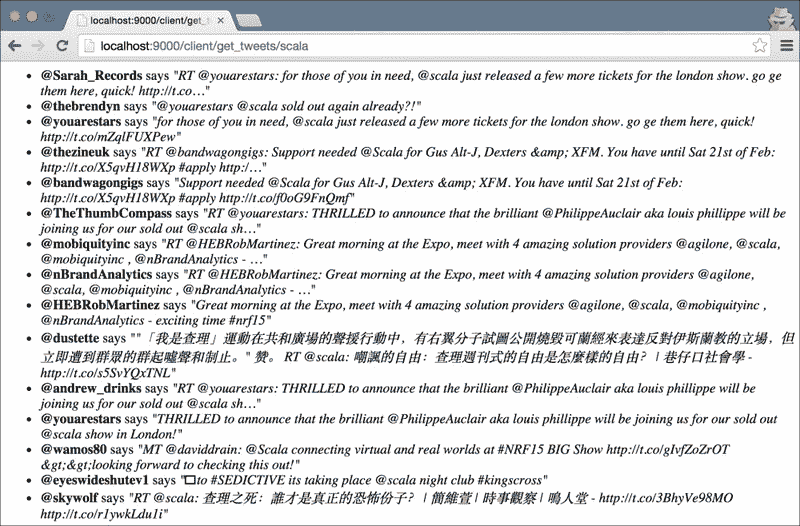

# 第四章. 创建和使用 Web API

在本章中，我们将介绍以下食谱：

+   创建一个 `POST` API 端点

+   创建一个 `GET` API 端点

+   创建一个 `PUT` API 端点

+   创建一个 `DELETE` API 端点

+   使用 HTTP 基本身份验证保护 API 端点

+   消费外部 Web API

+   使用 OAuth 通过 Twitter API

# 简介

在本章中，我们将探讨如何使用 Play 2.0 创建 REST API 并与其他外部基于 Web 的 API 进行交互，在我们的例子中，是 Twitter API。

随着独立 Web 服务之间数据交换的日益流行，REST API 已经成为了一种流行的方法，不仅用于消费外部数据，还用于接收传入数据以进行进一步处理和持久化，以及向授权客户端公开数据。基于 RESTful API 规范，HTTP 方法 `POST` 用于插入新记录，HTTP 方法 `GET` 用于检索数据。HTTP 方法 `PUT` 用于更新现有记录，最后，HTTP 方法 `DELETE` 用于删除记录。

我们将看到如何利用不同的 Play 2.0 库来构建我们自己的 REST API 端点，并使用新的 Play WS 库访问其他基于 Web 的 API。

# 创建一个 `POST` API 端点

在本食谱中，我们将探索如何使用 Play 2.0 创建一个 RESTful `POST` 端点来向我们的 API 添加新记录。

## 如何做到这一点...

对于 Java，我们需要执行以下步骤：

1.  启用热重载功能运行`foo_java`应用程序：

    ```java
    <span class="strong"><strong>    activator "~run"</strong></span>
    ```

1.  在`foo_java/app/controllers/Products.java`中创建一个新的产品控制器，内容如下：

    ```java
    package controllers;
         import java.util.*;
        import play.data.Form;
        import play.mvc.*;
        import models.Product;
        import static play.libs.Json.toJson;
         public class Products extends Controller {
            public static Map&lt;String, Product&gt; products = new HashMap&lt;String, Product&gt;();
             @BodyParser.Of(BodyParser.Json.class)
            public static Result create() {
                try {
                    Form&lt;Product&gt; form = Form.form(Product.class).bindFromRequest();
                     if (form.hasErrors()) {
                        return badRequest(form.errorsAsJson());
                    } else {
                        Product product = form.get();
                        products.put(product.getSku(), product);
                        return created(toJson(product));
                    }
                 } catch (Exception e) {
                    return internalServerError(e.getMessage());
                }
            }
        }
    ```

1.  在`foo_java/app/models/Product.java`中创建一个产品模型类：

    ```java
    package models;
         import play.data.validation.Constraints;
         public class Product implements java.io.Serializable {
            @Constraints.Required
            private String sku;
             @Constraints.Required
            private String title;
             public String getSku() {
                return sku;
            }
            public void setSku(String sku) {
                this.sku = sku;
            }
            public String getTitle() {
                return title;
            }
            public void setTitle(String title) {
                this.title = title;
            }
        }
    ```

1.  在`foo_java/conf/routes`中为新增的操作添加一个新的路由条目：

    ```java
    POST    /api/products       controllers.Products.create
    ```

1.  请求新的路由并检查响应体以确认：

    ```java
    <span class="strong"><strong>    $ curl -v -X POST http://localhost:9000/api/products --data '{"sku":"abc",   "title":"Macbook Pro Retina"}' --header "Content-type: application/json"</strong></span>
    <span class="strong"><strong>    * Hostname was NOT found in DNS cache</strong></span>
    <span class="strong"><strong>    *   Trying ::1...</strong></span>
    <span class="strong"><strong>    * Connected to localhost (::1) port 9000 (#0)</strong></span>
    <span class="strong"><strong>    &gt; POST /api/products HTTP/1.1</strong></span>
    <span class="strong"><strong>    &gt; User-Agent: curl/7.37.1</strong></span>
    <span class="strong"><strong>    &gt; Host: localhost:9000</strong></span>
    <span class="strong"><strong>    &gt; Accept: */*</strong></span>
    <span class="strong"><strong>    &gt; Content-type: application/json</strong></span>
    <span class="strong"><strong>    &gt; Content-Length: 43</strong></span>
    <span class="strong"><strong>    &gt;</strong></span>
    <span class="strong"><strong>    * upload completely sent off: 43 out of 43 bytes</strong></span>
    <span class="strong"><strong>    &lt; HTTP/1.1 201 Created</strong></span>
    <span class="strong"><strong>    &lt; Content-Type: application/json; charset=utf-8</strong></span>
    <span class="strong"><strong>    &lt; Content-Length: 42</strong></span>
    <span class="strong"><strong>    &lt;</strong></span>
    <span class="strong"><strong>    * Connection #0 to host localhost left intact</strong></span>
    <span class="strong"><strong>    {"sku":"abc","title":"Macbook Pro Retina"}%</strong></span>
    ```

对于 Scala，我们需要执行以下步骤：

1.  启用热重载功能运行`foo_scala`应用程序：

    ```java
    <span class="strong"><strong>    activator "~run"</strong></span>
    ```

1.  在`foo_scala/app/controllers/Products.scala`中创建一个新的产品控制器，内容如下：

    ```java
    package controllers
         import models.Product
        import play.api.libs.json.{JsError, Json}
        import play.api.libs.json.Json._
        import play.api.mvc._
         object Products extends Controller {
          implicit private val productWrites = Json.writes[Product]
          implicit private val productReads = Json.reads[Product]
          private val products: scala.collection.mutable.ListBuffer[Product] = scala.collection.mutable.ListBuffer[Product]()
           def create = Action(BodyParsers.parse.json) { implicit request =&gt;
            val post = request.body.validate[Product]
            post.fold(
              errors =&gt; BadRequest(Json.obj("message" -&gt; JsError.toFlatJson(errors))),
              p =&gt; {
                try {
                  products += p
                  Created(Json.toJson(p))
                } catch {
                  case e: Exception =&gt; InternalServerError(e.getMessage)
                }
              }
            )
          }
        }
    ```

1.  在`foo_scala/app/models/Product.scala`中创建一个产品模型类：

    ```java
    package models
         case class Product(sku: String, title: String)
    ```

1.  在`foo_scala/conf/routes`中为新增的操作添加一个新的路由条目：

    ```java
    POST    /api/products       controllers.Products.create
    ```

1.  请求新的路由并检查响应体以确认：

    ```java
    <span class="strong"><strong>    $ curl -v -X POST http://localhost:9000/api/products --data '{"sku":"abc",   "title":"Macbook Pro Retina"}' --header "Content-type: application/json"</strong></span>
    <span class="strong"><strong>    * Hostname was NOT found in DNS cache</strong></span>
    <span class="strong"><strong>    *   Trying ::1...</strong></span>
    <span class="strong"><strong>    * Connected to localhost (::1) port 9000 (#0)</strong></span>
    <span class="strong"><strong>    &gt; POST /api/products HTTP/1.1</strong></span>
    <span class="strong"><strong>    &gt; User-Agent: curl/7.37.1</strong></span>
    <span class="strong"><strong>    &gt; Host: localhost:9000</strong></span>
    <span class="strong"><strong>    &gt; Accept: */*</strong></span>
    <span class="strong"><strong>    &gt; Content-type: application/json</strong></span>
    <span class="strong"><strong>    &gt; Content-Length: 43</strong></span>
    <span class="strong"><strong>    &gt;</strong></span>
    <span class="strong"><strong>    * upload completely sent off: 43 out of 43 bytes</strong></span>
    <span class="strong"><strong>    &lt; HTTP/1.1 201 Created</strong></span>
    <span class="strong"><strong>    &lt; Content-Type: application/json; charset=utf-8</strong></span>
    <span class="strong"><strong>    &lt; Content-Length: 42</strong></span>
    <span class="strong"><strong>    &lt;</strong></span>
    <span class="strong"><strong>    * Connection #0 to host localhost left intact</strong></span>
    <span class="strong"><strong>    {"sku":"abc","title":"Macbook Pro Retina"}%</strong></span>
    ```

## 它是如何工作的...

在本食谱中，我们使用 Play 2.0 实现了一个 RESTful `POST` 请求。第一步是创建我们的控制器和模型类。对于模型类，我们声明了两个基本的产品字段。我们将它们标注为必填字段。这允许 Play 在产品绑定到请求体时验证这两个字段。

```java
// Java 
    @Constraints.Required
    private String sku;
```

对于强制执行必需请求参数的 Scala 等价物，我们使用 `scala.Option` 类声明可选参数。然而，在本食谱中，为了保持 Java 和 Scala 食谱的一致性，将不需要使用 `scala.Option`，我们将在我们的案例类中强制执行必需字段，如下所示：

```java
case class Product(sku: String, title: String)
```

我们在控制器类中创建了一个动作方法，该方法将处理产品的`POST`请求。我们确保在数据绑定过程中`play.data.Form`对象没有遇到任何验证错误；然而，如果遇到问题，它将通过`badRequest()`辅助函数返回 HTTP 状态码 400：

```java
// Java 
    if (form.hasErrors()) {
        return badRequest(form.errorsAsJson());
    }
     // Scala 
    errors =&gt; BadRequest(Json.obj("message" -&gt; JsError.toFlatJson(errors))),
```

如果没有遇到错误，我们继续持久化我们的新产品并返回由`created()`辅助函数包装的 HTTP 状态码 201：

```java
// Java 
    return created(toJson(product));
     // Scala 
    Created(Json.toJson(p))
```

我们然后在`conf/routes`文件中声明了我们的新`POST`路由。最后，我们使用命令行工具`curl`模拟 HTTP `POST`请求来测试我们的路由。要验证我们的端点是否执行了`POST`表单字段的验证，请从之前的`curl`命令中省略标题参数，您将看到适当的错误消息：

```java
<span class="strong"><strong>    $ curl -v -X POST http://localhost:9000/api/products --data '{"sku":"abc"}' --header "Content-type: application/json"</strong></span>
<span class="strong"><strong>    * Hostname was NOT found in DNS cache</strong></span>
<span class="strong"><strong>    *   Trying ::1...</strong></span>
<span class="strong"><strong>    * Connected to localhost (::1) port 9000 (#0)</strong></span>
<span class="strong"><strong>    &gt; POST /api/products HTTP/1.1</strong></span>
<span class="strong"><strong>    &gt; User-Agent: curl/7.37.1</strong></span>
<span class="strong"><strong>    &gt; Host: localhost:9000</strong></span>
<span class="strong"><strong>    &gt; Accept: */*</strong></span>
<span class="strong"><strong>    &gt; Content-type: application/json</strong></span>
<span class="strong"><strong>    &gt; Content-Length: 44</strong></span>
<span class="strong"><strong>    &gt;</strong></span>
<span class="strong"><strong>    * upload completely sent off: 44 out of 44 bytes</strong></span>
<span class="strong"><strong>    &lt; HTTP/1.1 400 Bad Request</strong></span>
<span class="strong"><strong>    &lt; Content-Type: application/json; charset=utf-8</strong></span>
<span class="strong"><strong>    &lt; Content-Length: 36</strong></span>
<span class="strong"><strong>    &lt;</strong></span>
<span class="strong"><strong>    * Connection #0 to host localhost left intact</strong></span>
<span class="strong"><strong>    {"title":["This field is required"]}%</strong></span>
```

# 创建一个 GET API 端点

对于这个菜谱，我们将创建一个 RESTful 的`GET`端点，它将返回一个 JSON 对象的集合。

## 如何做…

对于 Java，我们需要执行以下步骤：

1.  启用 Hot-Reloading 运行`foo_java`应用程序：

    ```java
    <span class="strong"><strong>    activator "~run"</strong></span>
    ```

1.  通过添加以下动作方法来修改`foo_java/app/controllers/Products.java`中的产品控制器：

    ```java
    public static Result index() {
            return ok(toJson(products));
        }
    ```

1.  在`foo_java/conf/routes`中为新增的操作添加一个新的路由条目：

    ```java
    GET     /api/products       controllers.Products.index
    ```

1.  请求新路由并检查响应头以确认我们对 HTTP 响应头的修改：

    ```java
    <span class="strong"><strong>    $ curl -v http://localhost:9000/api/products</strong></span>
    <span class="strong"><strong>    * Hostname was NOT found in DNS cache</strong></span>
    <span class="strong"><strong>    *   Trying ::1...</strong></span>
    <span class="strong"><strong>    * Connected to localhost (::1) port 9000 (#0)</strong></span>
    <span class="strong"><strong>    &gt; GET /api/products HTTP/1.1</strong></span>
    <span class="strong"><strong>    &gt; User-Agent: curl/7.37.1</strong></span>
    <span class="strong"><strong>    &gt; Host: localhost:9000</strong></span>
    <span class="strong"><strong>    &gt; Accept: */*</strong></span>
    <span class="strong"><strong>    &gt;</strong></span>
    <span class="strong"><strong>    &lt; HTTP/1.1 200 OK</strong></span>
    <span class="strong"><strong>    &lt; Content-Type: application/json; charset=utf-8</strong></span>
    <span class="strong"><strong>    &lt; Content-Length: 50</strong></span>
    <span class="strong"><strong>    &lt;</strong></span>
    <span class="strong"><strong>    * Connection #0 to host localhost left intact</strong></span>
    <span class="strong"><strong>    {"abc":{"sku":"abc","title":"Macbook Pro Retina"},"def":{"sku":"def","title":"iPad Air"}}%</strong></span>
    ```

对于 Scala，我们需要执行以下步骤：

1.  启用 Hot-Reloading 运行`foo_scala`应用程序：

    ```java
    <span class="strong"><strong>    activator "~run"</strong></span>
    ```

1.  通过在`foo_scala/app/controllers/Products.scala`中添加以下动作方法来修改产品控制器：

    ```java
    def index = Action {
          Ok(toJson(products))
        }
    ```

1.  在`foo_scala/conf/routes`中为新增的操作添加一个新的路由条目：

    ```java
    <span class="strong"><strong>    GET     /api/products       controllers.Products.index</strong></span>
    ```

1.  请求我们的新路由并检查响应头以确认我们对 HTTP 响应头的修改：

    ```java
    <span class="strong"><strong>    $ curl -v http://localhost:9000/api/products</strong></span>
    <span class="strong"><strong>    * Hostname was NOT found in DNS cache</strong></span>
    <span class="strong"><strong>    *   Trying ::1...</strong></span>
    <span class="strong"><strong>    * Connected to localhost (::1) port 9000 (#0)</strong></span>
    <span class="strong"><strong>    &gt; GET /api/products HTTP/1.1</strong></span>
    <span class="strong"><strong>    &gt; User-Agent: curl/7.37.1</strong></span>
    <span class="strong"><strong>    &gt; Host: localhost:9000</strong></span>
    <span class="strong"><strong>    &gt; Accept: */*</strong></span>
    <span class="strong"><strong>    &gt;</strong></span>
    <span class="strong"><strong>    &lt; HTTP/1.1 200 OK</strong></span>
    <span class="strong"><strong>    &lt; Content-Type: application/json; charset=utf-8</strong></span>
    <span class="strong"><strong>    &lt; Content-Length: 50</strong></span>
    <span class="strong"><strong>    &lt;</strong></span>
    <span class="strong"><strong>    * Connection #0 to host localhost left intact</strong></span>
    <span class="strong"><strong>    {"abc":{"sku":"abc","title":"Macbook Pro Retina"},"def":{"sku":"def","title":"iPad Air"}}%</strong></span>
    ```

## 如何工作…

在这个菜谱中，我们实现了一个返回产品记录列表的 API 端点。我们通过声明一个新的动作方法来实现这一点，该方法从我们的数据存储中检索记录，将对象转换为 JSON，并返回一个 JSON 集合：

```java
// Java 
    return ok(toJson(products));
     // Scala 
    Ok(toJson(products))
```

我们为`GET`端点声明了一个新的路由条目，并使用`curl`验证端点的功能。

如果数据存储为空，端点将返回一个空的 JSON 数组：

```java
<span class="strong"><strong>    # Empty product list  </strong></span>
 <span class="strong"><strong>    $ curl -v http://localhost:9000/api/products</strong></span>
<span class="strong"><strong>    * Hostname was NOT found in DNS cache</strong></span>
<span class="strong"><strong>    *   Trying ::1...</strong></span>
<span class="strong"><strong>    * Connected to localhost (::1) port 9000 (#0)</strong></span>
<span class="strong"><strong>    &gt; GET /api/products HTTP/1.1</strong></span>
<span class="strong"><strong>    &gt; User-Agent: curl/7.37.1</strong></span>
<span class="strong"><strong>    &gt; Host: localhost:9000</strong></span>
<span class="strong"><strong>    &gt; Accept: */*</strong></span>
<span class="strong"><strong>    &gt;</strong></span>
<span class="strong"><strong>    &lt; HTTP/1.1 200 OK</strong></span>
<span class="strong"><strong>    &lt; Content-Type: application/json; charset=utf-8</strong></span>
<span class="strong"><strong>    &lt; Content-Length: 2</strong></span>
<span class="strong"><strong>    &lt;</strong></span>
<span class="strong"><strong>    * Connection #0 to host localhost left intact</strong></span>
<span class="strong"><strong>    []%</strong></span>
```

# 创建一个 PUT API 端点

在这个菜谱中，我们将使用 Play 2.0 实现一个 RESTful 的`PUT` API 端点，以更新我们数据存储中的一个现有记录。

## 如何做…

对于 Java，我们需要执行以下步骤：

1.  启用 Hot-Reloading 运行`foo_java`应用程序：

    ```java
    <span class="strong"><strong>    activator "~run"</strong></span>
    ```

1.  通过添加以下动作来修改`foo_java/app/controllers/Products.java`：

    ```java
    @BodyParser.Of(BodyParser.Json.class)
        public static Result edit(String id) {
            try {
                Product product = products.get(id);
                 if (product != null) {
                    Form&lt;Product&gt; form = Form.form(Product.class).bindFromRequest();
                    if (form.hasErrors()) {
                        return badRequest(form.errorsAsJson());
                    } else {
                        Product productForm = form.get();
                        product.setTitle(productForm.getTitle());
                        products.put(product.getSku(), product);
                         return ok(toJson(product));
                    }
                } else {
                    return notFound();
                }
            } catch (Exception e) {
                return internalServerError(e.getMessage());
            }
        }
    ```

1.  在`foo_java/conf/routes`中为新增的操作添加一个新的路由：

    ```java
    PUT     /api/products/:id   controllers.Products.edit(id: String)
    ```

1.  使用`curl`，我们将更新我们数据存储中的一个现有产品：

    ```java
    <span class="strong"><strong>    $ curl -v -X PUT http://localhost:9000/api/products/def --data '{"sku":"def", "title":"iPad 3 Air"}' --header "Content-type: application/json"</strong></span>
    <span class="strong"><strong>    * Hostname was NOT found in DNS cache</strong></span>
    <span class="strong"><strong>    *   Trying ::1...</strong></span>
    <span class="strong"><strong>    * Connected to localhost (::1) port 9000 (#0)</strong></span>
    <span class="strong"><strong>    &gt; PUT /api/products/def HTTP/1.1</strong></span>
    <span class="strong"><strong>    &gt; User-Agent: curl/7.37.1</strong></span>
    <span class="strong"><strong>    &gt; Host: localhost:9000</strong></span>
    <span class="strong"><strong>    &gt; Accept: */*</strong></span>
    <span class="strong"><strong>    &gt; Content-type: application/json</strong></span>
    <span class="strong"><strong>    &gt; Content-Length: 35</strong></span>
    <span class="strong"><strong>    &gt;</strong></span>
    <span class="strong"><strong>    * upload completely sent off: 35 out of 35 bytes</strong></span>
    <span class="strong"><strong>    &lt; HTTP/1.1 200 OK</strong></span>
    <span class="strong"><strong>    &lt; Content-Type: application/json; charset=utf-8</strong></span>
    <span class="strong"><strong>    &lt; Content-Length: 34</strong></span>
    <span class="strong"><strong>    &lt;</strong></span>
    <span class="strong"><strong>    * Connection #0 to host localhost left intact</strong></span>
    <span class="strong"><strong>    {"sku":"def","title":"iPad 3 Air"}%</strong></span>
    ```

对于 Scala，我们需要执行以下步骤：

1.  启用 Hot-Reloading 运行`foo_scala`应用程序：

    ```java
    <span class="strong"><strong>    activator "~run"</strong></span>
    ```

1.  通过添加以下动作来修改`foo_scala/app/controllers/Products.scala`：

    ```java
    def edit(id: String) = Action(BodyParsers.parse.json) { implicit request =&gt;
          val post = request.body.validate[Product]
          post.fold(
            errors =&gt; BadRequest(Json.obj("message" -&gt; JsError.toFlatJson(errors))),
            p =&gt; {
              products.find(_.sku equals id) match {
                case Some(product) =&gt; {
                  try {
                    products -= product
                    products += p
                     Ok(Json.toJson(p))
                  } catch {
                    case e: Exception =&gt; InternalServerError(e.getMessage)
                  }
                }
                case None =&gt; NotFound
              }
            }
          )
        }
    ```

1.  在 `foo_scala/conf/routes` 中为新增的动作添加一个新的路由：

    ```java
    PUT     /api/products/:id   controllers.Products.edit(id: String)
    ```

1.  使用 `curl`，我们将更新我们数据存储中的现有产品：

    ```java
    <span class="strong"><strong>    $ curl -v -X PUT http://localhost:9000/api/products/def --data '{"sku":"def", "title":"iPad 3 Air"}' --header "Content-type: application/json"</strong></span>
    <span class="strong"><strong>    * Hostname was NOT found in DNS cache</strong></span>
    <span class="strong"><strong>    *   Trying ::1...</strong></span>
    <span class="strong"><strong>    * Connected to localhost (::1) port 9000 (#0)</strong></span>
    <span class="strong"><strong>    &gt; PUT /api/products/def HTTP/1.1</strong></span>
    <span class="strong"><strong>    &gt; User-Agent: curl/7.37.1</strong></span>
    <span class="strong"><strong>    &gt; Host: localhost:9000</strong></span>
    <span class="strong"><strong>    &gt; Accept: */*</strong></span>
    <span class="strong"><strong>    &gt; Content-type: application/json</strong></span>
    <span class="strong"><strong>    &gt; Content-Length: 35</strong></span>
    <span class="strong"><strong>    &gt;</strong></span>
    <span class="strong"><strong>    * upload completely sent off: 35 out of 35 bytes</strong></span>
    <span class="strong"><strong>    &lt; HTTP/1.1 200 OK</strong></span>
    <span class="strong"><strong>    &lt; Content-Type: application/json; charset=utf-8</strong></span>
    <span class="strong"><strong>    &lt; Content-Length: 34</strong></span>
    <span class="strong"><strong>    &lt;</strong></span>
    <span class="strong"><strong>    * Connection #0 to host localhost left intact</strong></span>
    <span class="strong"><strong>    {"sku":"def","title":"iPad 3 Air"}%</strong></span>
    ```

## 它是如何工作的…

在本菜谱中，我们创建了一个新的 URL 路由和动作，该动作将更新我们数据存储中的现有记录。我们在产品控制器类中添加了一个新的动作，并在 `conf/routes` 中为它声明了一个新的路由。在我们的 `edit` 动作中，我们声明该动作期望请求体为 JSON 格式：

```java
// Java
    @BodyParser.Of(BodyParser.Json.class)
     // Scala
    def edit(id: String) = Action(BodyParsers.parse.json) { implicit request =&gt;
```

我们通过在我们的数据存储中进行查找来检查传入的 ID 值是否有效。对于无效的 ID，我们发送 HTTP 状态码 404：

```java
// Java 
    return notFound();
     // Scala 
    case None =&gt; NotFound
```

我们还检查任何表单验证错误，并在出现错误时返回适当的状态码：

```java
// Java 
    if (form.hasErrors()) {
      return badRequest(form.errorsAsJson());
    }
     // Scala 
    errors =&gt; BadRequest(Json.obj("message" -&gt; JsError.toFlatJson(errors))),
```

最后，我们使用 `curl` 测试了新的产品 `PUT` 动作。我们可以进一步通过测试它如何处理无效的 ID 和无效的请求体来验证 `PUT` 端点：

```java
<span class="strong"><strong># Passing an invalid Product ID:</strong></span>
 <span class="strong"><strong>$ curl -v -X PUT http://localhost:9000/api/products/XXXXXX</strong></span>
<span class="strong"><strong>* Hostname was NOT found in DNS cache</strong></span>
<span class="strong"><strong>*   Trying ::1...</strong></span>
<span class="strong"><strong>* Connected to localhost (::1) port 9000 (#0)</strong></span>
<span class="strong"><strong>&gt; PUT /api/products/XXXXXX HTTP/1.1</strong></span>
<span class="strong"><strong>&gt; User-Agent: curl/7.37.1</strong></span>
<span class="strong"><strong>&gt; Host: localhost:9000</strong></span>
<span class="strong"><strong>&gt; Accept: */*</strong></span>
<span class="strong"><strong>&gt;</strong></span>
<span class="strong"><strong>&lt; HTTP/1.1 404 Not Found</strong></span>
<span class="strong"><strong>&lt; Content-Length: 0</strong></span>
<span class="strong"><strong>&lt;</strong></span>
<span class="strong"><strong>* Connection #0 to host localhost left intact</strong></span>
 <span class="strong"><strong># PUT requests with form validation error</strong></span>
 <span class="strong"><strong>$ curl -v -X PUT http://localhost:9000/api/products/def --data '{}'  --header "Content-type: application/json"</strong></span>
<span class="strong"><strong>* Hostname was NOT found in DNS cache</strong></span>
<span class="strong"><strong>*   Trying ::1...</strong></span>
<span class="strong"><strong>* Connected to localhost (::1) port 9000 (#0)</strong></span>
<span class="strong"><strong>&gt; PUT /api/products/def HTTP/1.1</strong></span>
<span class="strong"><strong>&gt; User-Agent: curl/7.37.1</strong></span>
<span class="strong"><strong>&gt; Host: localhost:9000</strong></span>
<span class="strong"><strong>&gt; Accept: */*</strong></span>
<span class="strong"><strong>&gt; Content-type: application/json</strong></span>
<span class="strong"><strong>&gt; Content-Length: 2</strong></span>
<span class="strong"><strong>&gt;</strong></span>
<span class="strong"><strong>* upload completely sent off: 2 out of 2 bytes</strong></span>
<span class="strong"><strong>&lt; HTTP/1.1 400 Bad Request</strong></span>
<span class="strong"><strong>&lt; Content-Type: application/json; charset=utf-8</strong></span>
<span class="strong"><strong>&lt; Content-Length: 69</strong></span>
<span class="strong"><strong>&lt;</strong></span>
<span class="strong"><strong>* Connection #0 to host localhost left intact</strong></span>
<span class="strong"><strong>{"title":["This field is required"],"sku":["This field is required"]}%</strong></span>
```

# 创建 DELETE API 端点

在本菜谱中，我们将实现一个 RESTful `DELETE` API 端点，从我们的数据存储中删除记录。

## 如何操作…

对于 Java，我们需要执行以下步骤：

1.  以启用热重载的方式运行 `foo_java` 应用程序：

    ```java
    <span class="strong"><strong>    activator "~run"</strong></span>
    ```

1.  通过添加以下动作修改 `foo_java/app/controllers/Products.java`：

    ```java
    public static Result delete(String id) {
            try {
                Product product = products.get(id);
                 if (product != null) {
                    products.remove(product);
                     return noContent();
                } else {
                    return notFound();
                }
            } catch (Exception e) {
                return internalServerError(e.getMessage());
            }
        }
    ```

1.  在 `foo_java/conf/routes` 中为新增的动作添加一个新的路由：

    ```java
    DELETE  /api/products/:id   controllers.Products.delete(id: String)
    ```

1.  使用 `curl`，按照以下方式删除现有记录：

    ```java
    <span class="strong"><strong>    $ curl -v -X DELETE http://localhost:9000/api/products/def</strong></span>
    <span class="strong"><strong>    * Hostname was NOT found in DNS cache</strong></span>
    <span class="strong"><strong>    *   Trying ::1...</strong></span>
    <span class="strong"><strong>    * Connected to localhost (::1) port 9000 (#0)</strong></span>
    <span class="strong"><strong>    &gt; DELETE /api/products/def HTTP/1.1</strong></span>
    <span class="strong"><strong>    &gt; User-Agent: curl/7.37.1</strong></span>
    <span class="strong"><strong>    &gt; Host: localhost:9000</strong></span>
    <span class="strong"><strong>    &gt; Accept: */*</strong></span>
    <span class="strong"><strong>    &gt;</strong></span>
    <span class="strong"><strong>    &lt; HTTP/1.1 204 No Content</strong></span>
    <span class="strong"><strong>    &lt; Content-Length: 0</strong></span>
    <span class="strong"><strong>    &lt;</strong></span>
    <span class="strong"><strong>    * Connection #0 to host localhost left intact</strong></span>
    ```

对于 Scala，我们需要执行以下步骤：

1.  以启用热重载的方式运行 `foo_scala` 应用程序：

    ```java
    <span class="strong"><strong>    activator "~run"</strong></span>
    ```

1.  通过添加以下动作修改 `foo_scala/app/controllers/Products.scala`：

    ```java
    def delete(id: String) = BasicAuthAction {
        products.find(_.sku equals id) match {
          case Some(product) =&gt; {
            try {
              products -= product
              NoContent
            } catch {
              case e: Exception =&gt; InternalServerError(e.getMessage)
            }
          }
          case None =&gt; NotFound
        }
      }
    ```

1.  在 `foo_scala/conf/routes` 中为新增的动作添加一个新的路由：

    ```java
    DELETE  /api/products/:id   controllers.Products.delete(id: String)
    ```

1.  使用 `curl`，按照以下方式删除现有记录：

    ```java
    <span class="strong"><strong>    $ curl -v -X DELETE http://localhost:9000/api/products/def</strong></span>
    <span class="strong"><strong>    * Hostname was NOT found in DNS cache</strong></span>
    <span class="strong"><strong>    *   Trying ::1...</strong></span>
    <span class="strong"><strong>    * Connected to localhost (::1) port 9000 (#0)</strong></span>
    <span class="strong"><strong>    &gt; DELETE /api/products/def HTTP/1.1</strong></span>
    <span class="strong"><strong>    &gt; User-Agent: curl/7.37.1</strong></span>
    <span class="strong"><strong>    &gt; Host: localhost:9000</strong></span>
    <span class="strong"><strong>    &gt; Accept: */*</strong></span>
    <span class="strong"><strong>    &gt;</strong></span>
    <span class="strong"><strong>    &lt; HTTP/1.1 204 No Content</strong></span>
    <span class="strong"><strong>    &lt; Content-Length: 0</strong></span>
    <span class="strong"><strong>    &lt;</strong></span>
    <span class="strong"><strong>    * Connection #0 to host localhost left intact</strong></span>
    ```

## 它是如何工作的…

在本菜谱中，我们创建了一个新的 URL 路由和动作，用于删除现有的产品记录。我们声明了 `delete` 动作通过传入的 ID 参数来查找记录。我们确保在无效 ID 的情况下返回适当的 HTTP 状态码，在这种情况下，HTTP 状态码 404：

```java
// Java 
    return notFound();
     // Scala 
    case None =&gt; NotFound
```

我们确保返回适当的 HTTP 状态码以表示记录删除成功，在这种情况下，HTTP 状态码 204：

```java
// Java 
    return noContent();
     // Scala 
    NoContent
```

我们还可以测试 `DELETE` 端点并验证它是否正确处理无效的 ID：

```java
<span class="strong"><strong>    $ curl -v -X DELETE http://localhost:9000/api/products/XXXXXX</strong></span>
<span class="strong"><strong>    * Hostname was NOT found in DNS cache</strong></span>
<span class="strong"><strong>    *   Trying ::1...</strong></span>
<span class="strong"><strong>    * Connected to localhost (::1) port 9000 (#0)</strong></span>
<span class="strong"><strong>    &gt; DELETE /api/products/asd HTTP/1.1</strong></span>
<span class="strong"><strong>    &gt; User-Agent: curl/7.37.1</strong></span>
<span class="strong"><strong>    &gt; Host: localhost:9000</strong></span>
<span class="strong"><strong>    &gt; Accept: */*</strong></span>
<span class="strong"><strong>    &gt;</strong></span>
<span class="strong"><strong>    &lt; HTTP/1.1 404 Not Found</strong></span>
<span class="strong"><strong>    &lt; Content-Length: 0</strong></span>
<span class="strong"><strong>    &lt;</strong></span>
<span class="strong"><strong>    * Connection #0 to host localhost left intact</strong></span>
```

# 使用 HTTP 基本认证保护 API 端点

在本菜谱中，我们将探讨如何使用 Play 2.0 的 HTTP 基本认证方案来保护 API 端点。我们将使用 Apache Commons Codec 库进行 Base64 编码和解码。这个依赖项被 Play 隐式导入，我们不需要在 `build.sbt` 的库依赖中显式声明它。

## 如何操作…

对于 Java，我们需要执行以下步骤：

1.  以启用热重载的方式运行 `foo_java` 应用程序：

    ```java
    <span class="strong"><strong>    activator "~run"</strong></span>
    ```

1.  在 `foo_java/app/controllers/BasicAuthenticator.java` 中创建一个新的 `play.mvc.Security.Authenticator` 实现类，内容如下：

    ```java
    package controllers;
         import org.apache.commons.codec.binary.Base64;
        import play.mvc.Http;
        import play.mvc.Result;
        import play.mvc.Security;
         public class BasicAuthenticator extends Security.Authenticator {
            private static final String AUTHORIZATION = "authorization";
            private static final String WWW_AUTHENTICATE = "WWW-Authenticate";
            private static final String REALM = "Basic realm=\"API Realm\"";
             @Override
            public String getUsername(Http.Context ctx) {
                try {
                    String authHeader = ctx.request().getHeader(AUTHORIZATION);
                     if (authHeader != null) {
                        ctx.response().setHeader(WWW_AUTHENTICATE, REALM);
                        String auth = authHeader.substring(6);
                        byte[] decodedAuth = Base64.decodeBase64(auth);
                        String[] credentials = new String(decodedAuth, "UTF-8").split(":");
                         if (credentials != null &amp;&amp; credentials.length == 2) {
                            String username = credentials[0];
                            String password = credentials[1];
                            if (isAuthenticated(username, password)) {
                                return username;
                            } else {
                                return null;
                            }
                        }
                    }
                    return null;
                 } catch (Exception e) {
                    return null;
                }
            }
            private boolean isAuthenticated(String username, String password) {
                return username != null &amp;&amp; username.equals("ned") &amp;&amp;
                    password != null &amp;&amp; password.equals("flanders");
            }
             @Override
            public Result onUnauthorized(Http.Context context) {
                return unauthorized();
            }
        }
    ```

1.  通过向 API 操作添加以下注解来修改`foo_java/app/controllers/Products.java`：

    ```java
    <span class="strong"><strong>    @Security.Authenticated(BasicAuthenticator.class)</strong></span>
        public static Result create() 
     <span class="strong"><strong>    @Security.Authenticated(BasicAuthenticator.class)</strong></span>
        public static Result index() 
     <span class="strong"><strong>    @Security.Authenticated(BasicAuthenticator.class)</strong></span>
        public static Result edit(String id)
     <span class="strong"><strong>    @Security.Authenticated(BasicAuthenticator.class)</strong></span>
        public static Result delete(String id)
    ```

1.  使用`curl`，发送一个请求到我们之前所做的现有 RESTful `GET`端点；你现在将看到一个未授权的响应：

    ```java
    <span class="strong"><strong>    $  curl -v http://localhost:9000/api/products</strong></span>
    <span class="strong"><strong>    * Hostname was NOT found in DNS cache</strong></span>
    <span class="strong"><strong>    *   Trying 127.0.0.1...</strong></span>
    <span class="strong"><strong>    * Connected to localhost (127.0.0.1) port 9000 (#0)</strong></span>
    <span class="strong"><strong>    &gt; GET /api/products HTTP/1.1</strong></span>
    <span class="strong"><strong>    &gt; User-Agent: curl/7.37.1</strong></span>
    <span class="strong"><strong>    &gt; Host: localhost:9000</strong></span>
    <span class="strong"><strong>    &gt; Accept: */*</strong></span>
    <span class="strong"><strong>    &gt;</strong></span>
    <span class="strong"><strong>    &lt; HTTP/1.1 401 Unauthorized</strong></span>
    <span class="strong"><strong>    &lt; Content-Length: 0</strong></span>
    <span class="strong"><strong>    &lt;</strong></span>
    <span class="strong"><strong>    * Connection #0 to host localhost left intact</strong></span>
    ```

1.  再次使用`curl`，发送另一个请求到现有的 RESTful `GET`端点，这次带有用户凭据，`ned`（用户名）和`flanders`（密码）：

    ```java
    <span class="strong"><strong>    $  curl -v -u "ned:flanders" http://localhost:9000/api/products</strong></span>
    <span class="strong"><strong>    * Hostname was NOT found in DNS cache</strong></span>
    <span class="strong"><strong>    *   Trying 127.0.0.1...</strong></span>
    <span class="strong"><strong>    * Connected to localhost (127.0.0.1) port 9000 (#0)</strong></span>
    <span class="strong"><strong>    * Server auth using Basic with user 'ned'</strong></span>
    <span class="strong"><strong>    &gt; GET /api/products HTTP/1.1</strong></span>
    <span class="strong"><strong>    &gt; Authorization: Basic bmVkOmZsYW5kZXJz</strong></span>
    <span class="strong"><strong>    &gt; User-Agent: curl/7.37.1</strong></span>
    <span class="strong"><strong>    &gt; Host: localhost:9000</strong></span>
    <span class="strong"><strong>    &gt; Accept: */*</strong></span>
    <span class="strong"><strong>    &gt;</strong></span>
    <span class="strong"><strong>    &lt; HTTP/1.1 200 OK</strong></span>
    <span class="strong"><strong>    &lt; Content-Type: application/json; charset=utf-8</strong></span>
    <span class="strong"><strong>    &lt; WWW-Authenticate: Basic realm="API Realm"</strong></span>
    <span class="strong"><strong>    &lt; Content-Length: 2</strong></span>
    <span class="strong"><strong>    &lt;</strong></span>
    <span class="strong"><strong>    * Connection #0 to host localhost left intact</strong></span>
    <span class="strong"><strong>    {}%</strong></span>
    ```

对于 Scala，我们需要执行以下步骤：

1.  启用热重载功能运行`foo_scala`应用程序：

    ```java
    activator "~run"
    ```

1.  在`foo_scala/app/controllers/BasicAuthAction.scala`中创建一个新的`ActionBuilder`类，并添加以下内容：

    ```java
    package controllers
         import controllers.Products._
        import org.apache.commons.codec.binary.Base64
        import play.api.mvc._
        import scala.concurrent.Future
         object BasicAuthAction extends ActionBuilder[Request] {
          def invokeBlockA =&gt; Future[Result]) = {
            try {
              request.headers.get("authorization") match {
                case Some(headers) =&gt; {
                  val auth = headers.substring(6)
                  val decodedAuth = Base64.decodeBase64(auth)
                  val credentials = new String(decodedAuth, "UTF-8").split(":")
                   if (credentials != null &amp;&amp; credentials.length == 2 &amp;&amp;
                      isAuthenticated(credentials(0), credentials(1))) {
                    block(request)
                  } else {
                    unauthorized
                  }
                }
                case None =&gt; unauthorized
              }
            } catch {
              case e: Exception =&gt; Future.successful(InternalServerError(e.getMessage))
            }
          }
           def unauthorized = Future.successful(Unauthorized.withHeaders("WWW-Authenticate" -&gt; "Basic realm=\"API Realm\""))
           def isAuthenticated(username: String, password: String) = username != null &amp;&amp; username.equals("ned") &amp;&amp; password != null &amp;&amp; password.equals("flanders")
        }
    ```

1.  通过添加新创建的`ActionBuilder`类和 API 操作来修改`foo_scala/app/controllers/Products.scala`：

    ```java
    def index = BasicAuthAction 
         def create = BasicAuthAction(BodyParsers.parse.json)
         def edit(id: String) = BasicAuthAction(BodyParsers.parse.json)
         def delete(id: String) = BasicAuthAction
    ```

1.  使用`curl`，发送一个请求到我们之前所做的现有 RESTful `GET`端点；你现在将看到一个未授权的响应：

    ```java
    <span class="strong"><strong>    $  curl -v http://localhost:9000/api/products</strong></span>
    <span class="strong"><strong>    * Hostname was NOT found in DNS cache</strong></span>
    <span class="strong"><strong>    *   Trying 127.0.0.1...</strong></span>
    <span class="strong"><strong>    * Connected to localhost (127.0.0.1) port 9000 (#0)</strong></span>
    <span class="strong"><strong>    &gt; GET /api/products HTTP/1.1</strong></span>
    <span class="strong"><strong>    &gt; User-Agent: curl/7.37.1</strong></span>
    <span class="strong"><strong>    &gt; Host: localhost:9000</strong></span>
    <span class="strong"><strong>    &gt; Accept: */*</strong></span>
    <span class="strong"><strong>    &gt;  </strong></span>
    <span class="strong"><strong>    &lt; HTTP/1.1 401 Unauthorized</strong></span>
    <span class="strong"><strong>    &lt; Content-Length: 0</strong></span>
    <span class="strong"><strong>    &lt;</strong></span>
    <span class="strong"><strong>    * Connection #0 to host localhost left intact</strong></span>
    ```

1.  再次使用`curl`，发送另一个请求到现有的 RESTful `GET`端点，这次带有用户凭据，`ned`（用户名）和`flanders`（密码）：

    ```java
    <span class="strong"><strong>    $  curl -v -u "ned:flanders" http://localhost:9000/api/products</strong></span>
    <span class="strong"><strong>    * Hostname was NOT found in DNS cache</strong></span>
    <span class="strong"><strong>    *   Trying 127.0.0.1...</strong></span>
    <span class="strong"><strong>    * Connected to localhost (127.0.0.1) port 9000 (#0)</strong></span>
    <span class="strong"><strong>    * Server auth using Basic with user 'ned'</strong></span>
    <span class="strong"><strong>    &gt; GET /api/products HTTP/1.1</strong></span>
    <span class="strong"><strong>    &gt; Authorization: Basic bmVkOmZsYW5kZXJz</strong></span>
    <span class="strong"><strong>    &gt; User-Agent: curl/7.37.1</strong></span>
    <span class="strong"><strong>    &gt; Host: localhost:9000</strong></span>
    <span class="strong"><strong>    &gt; Accept: */*</strong></span>
    <span class="strong"><strong>    &gt;</strong></span>
    <span class="strong"><strong>    &lt; HTTP/1.1 200 OK</strong></span>
    <span class="strong"><strong>    &lt; Content-Type: application/json; charset=utf-8</strong></span>
     <span class="strong"><strong>    &lt; Content-Length: 2</strong></span>
    <span class="strong"><strong>    &lt;</strong></span>
    <span class="strong"><strong>    * Connection #0 to host localhost left intact</strong></span>
    <span class="strong"><strong>    {}%</strong></span>
    ```

## 它是如何工作的…

在这个菜谱中，我们使用 Play 2.0 的 HTTP 基本认证方案对 RESTful API 端点进行了安全保护。我们为 Java 和 Scala 创建了相应的安全实现类。对于每个安全实现类，`BasicAuthenticator.java`和`BasicAuthAction.scala`，我们检索了授权头并解码了值字符串以解密我们传递的用户凭据：

```java
// Java
    String authHeader = ctx.request().getHeader(AUTHORIZATION);
    if (authHeader != null) {
        ctx.response().setHeader(WWW_AUTHENTICATE, REALM);
        String auth = authHeader.substring(6);
        byte[] decodedAuth = Base64.decodeBase64(auth);
        String[] credentials = new String(decodedAuth, "UTF-8").split(":");
    }
     // Scala 
    request.headers.get("authorization") match {
        case Some(headers) =&gt; {
          val auth = headers.substring(6)
          val decodedAuth = Base64.decodeBase64(auth)
          val credentials = new String(decodedAuth, "UTF-8").split(":")
        }
    }
```

一旦我们获得了用户名和密码，我们就调用了`isAuthenticated`函数来检查用户凭据的有效性：

```java
// Java
    if (credentials != null &amp;&amp; credentials.length == 2) {
     String username = credentials[0];
        String password = credentials[1];
        if (isAuthenticated(username, password)) {
            return username;
        } else {
            return null;
        }
    }
     // Scala
    if (credentials != null &amp;&amp; credentials.length == 2 &amp;&amp;
          isAuthenticated(credentials(0), credentials(1))) {
        block(request)
    } else {
        unauthorized
    }
```

我们通过注解 Java API 操作并声明为 API 操作类来利用安全实现类：

```java
// Java
    @Security.Authenticated(BasicAuthenticator.class)
    public static Result index() {
        return ok(toJson(products));
    }
     // Scala 
    def index = BasicAuthAction {
        Ok(toJson(products))
    }
```

使用`curl`，我们还可以检查我们的安全 API 操作是否处理未认证的请求：

```java
<span class="strong"><strong>    $ curl -v http://localhost:9000/api/products</strong></span>
<span class="strong"><strong>    * Hostname was NOT found in DNS cache</strong></span>
<span class="strong"><strong>    *   Trying ::1...</strong></span>
<span class="strong"><strong>    * Connected to localhost (::1) port 9000 (#0)</strong></span>
<span class="strong"><strong>    &gt; GET /api/products HTTP/1.1</strong></span>
<span class="strong"><strong>    &gt; User-Agent: curl/7.37.1</strong></span>
<span class="strong"><strong>    &gt; Host: localhost:9000</strong></span>
<span class="strong"><strong>    &gt; Accept: */*</strong></span>
<span class="strong"><strong>    &gt;</strong></span>
<span class="strong"><strong>    &lt; HTTP/1.1 401 Unauthorized</strong></span>
<span class="strong"><strong>    &lt; WWW-Authenticate: Basic realm="API Realm"</strong></span>
<span class="strong"><strong>    &lt; Content-Length: 0</strong></span>
<span class="strong"><strong>    &lt;</strong></span>
<span class="strong"><strong>    * Connection #0 to host localhost left intact</strong></span>
```

# 消费外部 Web API

在这个菜谱中，我们将探索 Play WS API，从 Play 2 Web 应用程序中消费外部 Web 服务。随着 Web 应用程序需求的发展，我们对外部数据服务的依赖性越来越大，例如外汇汇率、实时天气数据等。Play WS 库为我们提供了与外部 Web 服务接口的 API。

## 如何做到这一点…

对于 Java，我们需要执行以下步骤：

1.  启用热重载功能运行`foo_java`应用程序：

    ```java
    <span class="strong"><strong>    activator "~run"</strong></span>
    ```

1.  在`build.sbt`中将`playWs`声明为项目依赖项：

    ```java
    libraryDependencies ++= Seq(
            javaWs
        )
    ```

1.  在`foo_java/app/controllers/WebClient.java`中创建一个新的控制器并添加以下内容：

    ```java
    package controllers;
         import com.fasterxml.jackson.databind.JsonNode;
        import play.libs.F;
        import play.libs.F.Promise;
        import play.libs.ws.WS;
        import play.mvc.Controller;
        import play.mvc.Result;
         public class WebClient extends Controller {
            public static Promise&lt;Result&gt; getTodos() {
                Promise&lt;play.libs.ws.WSResponse&gt; todos = WS.url("http://jsonplaceholder.typicode.com/todos").get();
                return todos.map(
                    new F.Function&lt;play.libs.ws.WSResponse, Result&gt;() {
                        public Result apply(play.libs.ws.WSResponse res) {
                            JsonNode json = res.asJson();
                            return ok("Todo Title: " + json.findValuesAsText("title"));
                        }
                    }
                );
            }
        }
    ```

1.  在`foo_java/conf/routes`中为新增的操作添加一个新的路由条目：

    ```java
    GET     /client/get_todos   controllers.WebClient.getTodos
    ```

1.  使用`curl`，我们将能够测试我们的新操作如何消费外部 Web API：

    ```java
    <span class="strong"><strong>    $ curl -v http://localhost:9000/client/get_todos</strong></span>
    <span class="strong"><strong>    * Hostname was NOT found in DNS cache</strong></span>
    <span class="strong"><strong>    *   Trying ::1...</strong></span>
    <span class="strong"><strong>    * Connected to localhost (::1) port 9000 (#0)</strong></span>
    <span class="strong"><strong>    &gt; GET /client/get_todos HTTP/1.1</strong></span>
    <span class="strong"><strong>    &gt; User-Agent: curl/7.37.1</strong></span>
    <span class="strong"><strong>    &gt; Host: localhost:9000</strong></span>
    <span class="strong"><strong>    &gt; Accept: */*</strong></span>
    <span class="strong"><strong>    &gt;</strong></span>
    <span class="strong"><strong>    &lt; HTTP/1.1 200 OK</strong></span>
    <span class="strong"><strong>    &lt; Content-Type: text/plain; charset=utf-8</strong></span>
    <span class="strong"><strong>    &lt; Content-Length: 8699</strong></span>
    <span class="strong"><strong>    &lt;</strong></span>
    <span class="strong"><strong>    Todo Title: [delectus aut autem, quis ut nam facilis et officia qui, fugiat veniam minus, et porro tempora, laboriosam mollitia et enim quasi adipisci quia provident illum, qui ullam ratione quibusdam voluptatem quia omnis, illo expedita</strong></span>
    ```

对于 Scala，我们需要执行以下步骤：

1.  启用热重载功能运行`foo_scala`应用程序：

    ```java
    <span class="strong"><strong>    activator "~run"</strong></span>
    ```

1.  在`build.sbt`中将`playWs`声明为项目依赖项：

    ```java
    libraryDependencies ++= Seq(
            ws
        )
    ```

1.  在`foo_scala/app/controllers/WebClient.scala`中创建一个新的控制器并添加以下内容：

    ```java
    package controllers
         import play.api.libs.concurrent.Execution.Implicits.defaultContext
        import play.api.Play.current
        import play.api.libs.ws.WS
        import play.api.mvc.{Action, Controller}
         object WebClient extends Controller {
          def getTodos = Action.async {
            WS.url("http://jsonplaceholder.typicode.com/todos").get().map { res =&gt;
              Ok("Todo Title: " + (res.json \\ "title").map(_.as[String]))
            }
          }
        }
    ```

1.  在`foo_scala/conf/routes`中为新增的操作添加一个新的路由条目：

    ```java
    GET     /client/get_todos   controllers.WebClient.getTodos
    ```

1.  使用`curl`，我们将能够测试我们的新操作如何消费外部 Web API：

    ```java
    <span class="strong"><strong>    $ curl -v http://localhost:9000/client/get_todos</strong></span>
    <span class="strong"><strong>    * Hostname was NOT found in DNS cache</strong></span>
    <span class="strong"><strong>    *   Trying ::1...</strong></span>
    <span class="strong"><strong>    * Connected to localhost (::1) port 9000 (#0)</strong></span>
    <span class="strong"><strong>    &gt; GET /client/get_todos HTTP/1.1</strong></span>
    <span class="strong"><strong>    &gt; User-Agent: curl/7.37.1</strong></span>
    <span class="strong"><strong>    &gt; Host: localhost:9000</strong></span>
    <span class="strong"><strong>    &gt; Accept: */*</strong></span>
    <span class="strong"><strong>    &gt;</strong></span>
    <span class="strong"><strong>    &lt; HTTP/1.1 200 OK</strong></span>
    <span class="strong"><strong>    &lt; Content-Type: text/plain; charset=utf-8</strong></span>
    <span class="strong"><strong>    &lt; Content-Length: 8699</strong></span>
    <span class="strong"><strong>    &lt;</strong></span>
    <span class="strong"><strong>    Todo Title: [delectus aut autem, quis ut nam facilis et officia qui, fugiat veniam minus, et porro tempora, laboriosam mollitia et enim quasi adipisci quia provident illum, qui ullam ratione quibusdam voluptatem quia omnis, illo expedita</strong></span>
    ```

## 它是如何工作的…

在本菜谱中，我们利用了 Play 2.0 插件 WS 来消费外部 Web API。我们创建了一个新的路由和`AsynchronousAction`方法。在操作中，我们将外部 API 的 URL 传递给 WS api，并指定它将是一个`GET`操作：

```java
// Java  
    Promise&lt;play.libs.ws.WSResponse&gt; todos = WS.url("http://jsonplaceholder.typicode.com/todos").get();
    // Scala 
WS.url("http://jsonplaceholder.typicode.com/todos").get()
```

我们然后解析了 JSON 响应，并将其管道输入到新创建的路由`/client/get_todos`的结果响应中：

```java
// Java 
    return todos.map(
      new F.Function&lt;play.libs.ws.WSResponse, Result&gt;() {
        public Result apply(play.libs.ws.WSResponse res) {
          JsonNode json = res.asJson();
          return ok("Todo Title: " + json.findValuesAsText("title"));
        }
      }
    );
     // Scala 
    Ok("Todo Title: " + (res.json \\ "title").map(_.as[String]))
```

# 使用 Twitter API 和 OAuth

在本菜谱中，我们将探讨如何使用 Play 2.0 的内置 OAuth 支持从 Twitter API 检索推文。

## 如何做到这一点…

对于 Java，我们需要执行以下步骤：

1.  启用 Hot-Reloading 运行`foo_java`应用程序：

    ```java
    <span class="strong"><strong>    activator "~run"</strong></span>
    ```

1.  在`foo_java/conf/application.conf`中指定您的 Twitter API 信息：

    ```java
    tw.consumerKey="YOUR TWITTER DEV CONSUMER KEY HERE"
        tw.consumerSecret="YOUR TWITTER DEV CONSUMER SECRET HERE"
        tw.accessToken="YOUR TWITTER DEV ACCESS TOKEN HERE"
        tw.accessTokenSecret="YOUR TWITTER DEV ACCESS TOKEN SECRET HERE"
    ```

1.  在`foo_java/app/controllers/WebClient.java`中修改`WebClient`控制器，按照以下操作：

    ```java
    // Add additional imports at the top section of the class file 
        import play.Play;
        import play.libs.oauth.OAuth;
        import play.libs.oauth.OAuth.OAuthCalculator;
        import play.libs.ws.WSResponse;
        import java.util.HashMap;
        import java.util.Iterator;
        import java.util.Map;
         // Add the Action method
        public static Promise&lt;Result&gt; getTweets(String hashtag) {
            final String url = "https://api.twitter.com/1.1/search/tweets.json?q=%40" + hashtag;
            final OAuth.ConsumerKey consumerInfo = new OAuth.ConsumerKey(
                Play.application().configuration().getString("tw.consumerKey"),
                Play.application().configuration().getString("tw.consumerSecret")
            );
            final OAuth.RequestToken tokens = new OAuth.RequestToken(
                Play.application().configuration().getString("tw.accessToken"),
                Play.application().configuration().getString("tw.accessTokenSecret")
            );
             Promise&lt;play.libs.ws.WSResponse&gt; twRequest = WS.url(url).sign(new OAuthCalculator(consumerInfo, tokens)).get();
            return twRequest.map(
                new F.Function&lt;WSResponse, Result&gt;(){
                    @Override
                    public Result apply(WSResponse res) throws Throwable {
                        Map&lt;String, String&gt; map = new HashMap&lt;String, String&gt;();
                        JsonNode root = res.asJson();
                         for (JsonNode json : root.get("statuses")) {
                            map.put(
             json.findValue("user").findValue("screen_name").asText(),
                                json.findValue("text").asText()
                            );
                        }
                         return ok(views.html.tweets.render(map));
                    }
                }
            );
        }
    ```

1.  在`foo_java/conf/routes`中为`getTweets(hashtag: String)`操作添加新的路由：

    ```java
    GET /client/get_tweets/:hashtag controllers.WebClient.getTweets(hashtag)
    ```

1.  在`foo_java/app/views/tweets.scala.html`中添加一个新的视图模板，内容如下：

    ```java
    @(tweets: Map[String, String])
         &lt;ul&gt;
          @tweets.map { tw =&gt;
            &lt;li&gt;&lt;strong&gt;@@@tw._1&lt;/strong&gt; says &lt;i&gt;"@tw._2"&lt;/i&gt;&lt;/li&gt;
          }
        &lt;/ul&gt;
    ```

1.  使用网络浏览器访问`/client/get_tweets/:hashtag`路由以查看从 Twitter API 检索的推文：

对于 Scala，我们需要执行以下步骤：

1.  启用 Hot-Reloading 运行`foo_scala`应用程序：

    ```java
    <span class="strong"><strong>    activator "~run"</strong></span>
    ```

1.  在`foo_scala/conf/application.conf`中指定您的 Twitter API 信息：

    ```java
    tw.consumerKey="YOUR TWITTER DEV CONSUMER KEY HERE"
        tw.consumerSecret="YOUR TWITTER DEV CONSUMER SECRET HERE"
        tw.accessToken="YOUR TWITTER DEV ACCESS TOKEN HERE"
        tw.accessTokenSecret="YOUR TWITTER DEV ACCESS TOKEN SECRET HERE"
    ```

1.  在`foo_scala/app/controllers/WebClient.scala`中修改`WebClient`控制器，按照以下操作：

    ```java
    def getTweets(hashtag: String) = Action.async {
          import play.api.Play
           val consumerInfo = ConsumerKey(
            Play.application.configuration.getString("tw.consumerKey").get,
            Play.application.configuration.getString("tw.consumerSecret").get
          )
          val tokens = RequestToken(
            Play.application.configuration.getString("tw.accessToken").get,
            Play.application.configuration.getString("tw.accessTokenSecret").get
          )
          val url = "https://api.twitter.com/1.1/search/tweets.json?q=%40" + hashtag
           WS.url(url).sign(OAuthCalculator(consumerInfo, tokens)).get().map { res =&gt;
            val tweets = ListBuffer[(String, String)]()
            (res.json \ "statuses").as[List[JsObject]].map { tweet =&gt;
              tweets += ((
                (tweet \ "user" \ "screen_name").as[String],
                (tweet \ "text").as[String]
              ))
            }
             Ok(views.html.tweets(tweets.toList))
          }
        }
    ```

1.  在`foo_scala/conf/routes`中为`getTweets(hashtag: String)`操作添加新的路由：

    ```java
    GET /client/get_tweets/:hashtag controllers.WebClient.getTweets(hashtag)
    ```

1.  在`foo_scala/app/views/tweets.scala.html`中添加一个新的视图模板，内容如下：

    ```java
    @(tweets: List[(String, String)])
         &lt;ul&gt;
          @tweets.map { tw =&gt;
            &lt;li&gt;&lt;strong&gt;@@@tw._1&lt;/strong&gt; says &lt;i&gt;"@tw._2"&lt;/i&gt;&lt;/li&gt;
          }
        &lt;/ul&gt;
    ```

1.  使用网络浏览器访问`/client/get_tweets/:hashtag`路由以查看从 Twitter API 检索的推文，如下截图所示：

## 它是如何工作的…

在本菜谱中，我们创建了一个新的 URL 路由和操作来检索和显示由请求路由`/client/get_tweets/:hashtag`中指定的 hashtag 标记的推文。我们通过从`conf/application.conf`（记得在[`dev.twitter.com`](http://dev.twitter.com)注册 Twitter 开发者账户并为本菜谱生成消费者和访问令牌）检索所需的 Twitter API 消费者和访问令牌密钥来实现操作方法：

```java
// Java
    final OAuth.ConsumerKey consumerInfo = new OAuth.ConsumerKey(
        Play.application().configuration().getString("tw.consumerKey"),
        Play.application().configuration().getString("tw.consumerSecret")
    );
    final OAuth.RequestToken tokens = new OAuth.RequestToken(
        Play.application().configuration().getString("tw.accessToken"),
        Play.application().configuration()
    .getString("tw.accessTokenSecret")
    );
     // Scala 
    val consumerInfo = ConsumerKey(
      Play.application.configuration.getString("tw.consumerKey").get,
      Play.application.configuration.getString("tw.consumerSecret").get
    )
    val tokens = RequestToken(
      Play.application.configuration.getString("tw.accessToken").get,
      Play.application.configuration.getString("tw.accessTokenSecret").get
    )
```

我们将这些凭证传递给 Play 类`OAuthCalculator`，当我们访问 Twitter 搜索 API 端点时：

```java
// Java
    Promise&lt;play.libs.ws.WSResponse&gt; twRequest = 
WS.url(url).sign(new OAuthCalculator(consumerInfo, tokens)).get();
     // Scala 
    WS.url(url).sign(OAuthCalculator(consumerInfo, tokens)).get()
```

一旦 Twitter API 响应返回，我们解析响应的 JSON 并将其推送到一个中间集合对象，然后将其传递给我们的视图模板：

```java
// Java 
    Map&lt;String, String&gt; map = new HashMap&lt;String, String&gt;();
    JsonNode root = res.asJson();
     for (JsonNode json : root.get("statuses")) {
      map.put(
        json.findValue("user")
          .findValue("screen_name").asText(),
        json.findValue("text").asText()
      );
    }
     return ok(views.html.tweets.render(map));
     // Scala 
    val tweets = ListBuffer[(String, String)]()
    (res.json \ "statuses").as[List[JsObject]].map { tweet =&gt;
      tweets += ((
        (tweet \ "user" \ "screen_name").as[String],
        (tweet \ "text").as[String]
      ))
    }
     Ok(views.html.tweets(tweets.toList))
```
