# 第八章。额外的 Play 信息

本章将涵盖以下食谱：

+   使用 Travis CI 进行测试

+   使用 New Relic 进行监控

+   将 Play 应用程序与 AngularJS 集成

+   将 Play 应用程序与 Parse 集成

+   使用 Vagrant 创建 Play 开发环境

+   使用 IntelliJ IDEA 14 编写 Play 2 网络应用

# 简介

在本章中，我们将探讨 Play 的额外食谱，开发者会发现这些食谱在他们的工具箱中非常实用和有用。我们将涉及 Play 2.0 网络应用的自动化测试和监控工具，这些是现代网络应用必不可少的辅助工具。我们还将探讨将 AngularJS 前端集成以及集成[Parse.com](http://Parse.com)，一个**后端即服务**（**BaaS**），以在 Play 网络应用中管理我们的数据。

最后，我们将探讨使用流行的工具**Vagrant**自动化创建 Play 开发环境，允许开发者创建可共享和更便携的开发环境。

# 使用 Travis CI 进行测试

对于这个食谱，我们将探讨如何使用**Travis CI**为 Play 2.0 网络应用构建和运行自动化测试。我们需要在 Travis CI 上注册一个账户，并与 GitHub 账户一起注册。我们还将配置我们的 Travis 账户，使其连接到一个 GitHub 仓库，以便在代码提交上进行自动测试。

## 如何做到这一点…

对于这个食谱，您需要执行以下步骤：

1.  在[`github.com/join`](https://github.com/join)创建一个 GitHub 账户：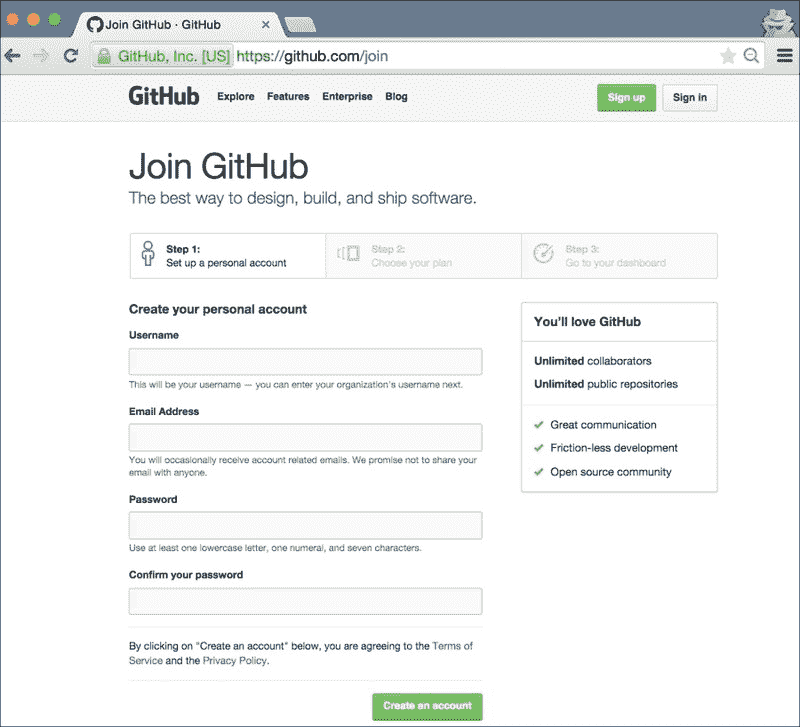

1.  在以下位置创建一个新的公共 GitHub 仓库，命名为 play2-travis：

    [`github.com/new`](https://github.com/new)

1.  在您的开发机器上，使用`activator`模板`play-slick-angular-test-example`创建一个新的 Play 2.0 网络应用：

    ```java
    <span class="strong"><strong>    activator new play2-travis play-slick-angular-test-example</strong></span>
    ```

1.  编辑`.travis.yml`以触发我们的测试脚本：

    ```java
    <span class="strong"><strong>    language: scala</strong></span>
    <span class="strong"><strong>    scala:</strong></span>
    <span class="strong"><strong>    - 2.11.2</strong></span>
    <span class="strong"><strong>    script:</strong></span>
    <span class="strong"><strong>    - sbt test</strong></span>
    ```

1.  提交并推送到 GitHub 远程仓库（请特别注意您的 GitHub 用户名，并在以下命令中指定它）：

    ```java
    <span class="strong"><strong>    git add --all &amp;&amp; git commit -am "Initial" &amp;&amp; git remote add origin https://github.com/&lt;YOUR_GITHUB_USER&gt;/play2-travis.git &amp;&amp; git push origin master</strong></span>
    ```

1.  使用您的 GitHub 账户注册 Travis 账户：

    [`travis-ci.org`](https://travis-ci.org)

1.  在 Travis 同步您的 GitHub 仓库后，在以下位置启用 play2-travis 仓库的 Travis 构建：

    `https://travis-ci.org/profile/<YOUR_GITHUB_USER>`:

    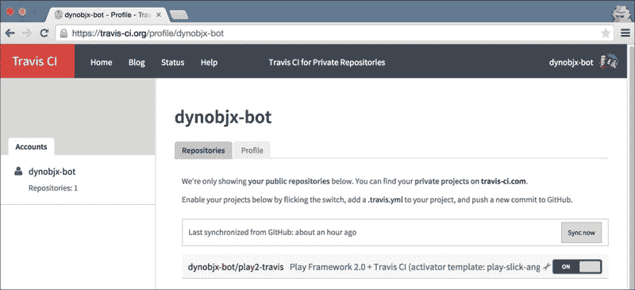

1.  接下来，通过添加一个示例测试失败来修改`test/controllers/ReportSpec.scala`：

    ```java
    "testing a failure" in {
          true must equalTo(false)
        }
    ```

1.  提交并推送以触发具有预期测试失败的 Travis 构建：

    ```java
    <span class="strong"><strong>    git commit -am "With expected test failure" &amp;&amp; git push origin master</strong></span>
    ```

1.  这应该在几秒钟后触发我们的构建。我们预计我们的第一次构建将失败，并且应该看到以下类似的结果：

    ```java
    <span class="strong"><strong>    [info] x testing a failure</strong></span>
    <span class="strong"><strong>    [error]  the value is not equal to 'false' (ReportSpec.scala:58)</strong></span>
    ```

    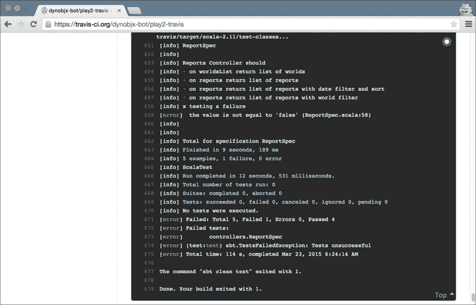

1.  现在，在`test/controllers/ReportSpec.scala`中取消注释示例测试失败：

    ```java
    /*"testing a failure" in {
          true must equalTo(false)
        }*/
    ```

1.  让我们提交并推送这些最新的更改，这次我们期望 Travis 构建通过：

    ```java
    <span class="strong"><strong>    git commit -am "disabling failing test" &amp;&amp; git push origin master</strong></span>
    ```

1.  这个提交应该再次触发 Travis 的构建，这次我们应该在我们的 Travis 仪表板上看到所有测试都通过。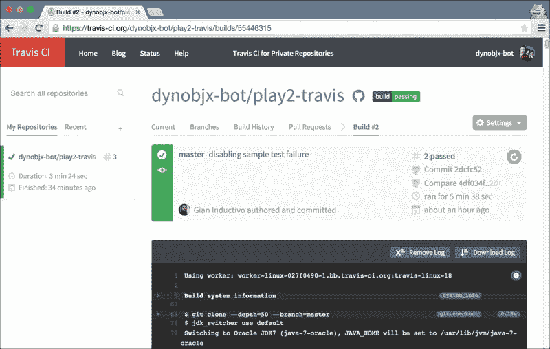

## 它是如何工作的…

在这个配方中，我们使用了 Travis CI 在我们的链接 GitHub 存储库中构建和执行测试。这种设置使我们能够建立 **开发-提交-测试** 流程。此设置需要 Travis CI 和 GitHub 的用户账户。

一旦我们确定了 GitHub 存储库，我们希望与 Travis 集成。我们需要更新项目根目录中的 Travis 配置（`.travis.yml`），指定一个运行脚本以执行我们的网络应用程序测试：

```java
<span class="strong"><strong>    script:</strong></span>
<span class="strong"><strong>    - sbt test</strong></span>
```

这是 Travis 在运行我们的测试时执行的命令。Travis 将根据 `.travis.yml` 配置文件（在我们的配方中，运行 `sbt` 任务测试）中的设置来配置构建，以执行我们的网络应用程序测试。构建结果在 Travis 的存储库仪表板上显示：

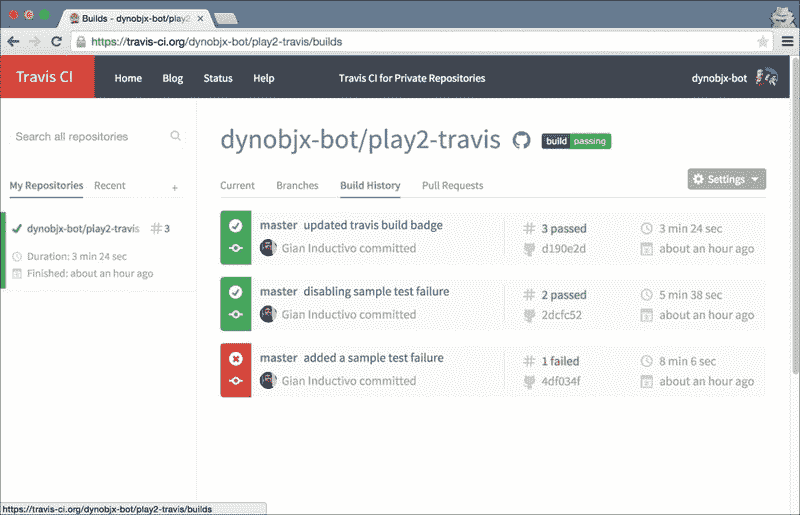

一旦我们将 GitHub 存储库链接并启用在 Travis 中，我们会观察到每次代码提交并推送到 GitHub 存储库后都会触发构建。这对于开发者来说是一个很好的开发工具和流程，可以帮助他们意识到最近提交的代码中的回归问题，并支持其他构建工具，如工件发布和通知。

# 使用 New Relic 进行监控

对于这个配方，我们将使用 Docker 和 Digital Ocean 部署 Play 2.0 网络应用程序，并使用 **New Relic** 监控该网络应用程序。我们将以 Docker 容器的形式部署网络应用程序，并详细说明如何使用与我们的 activator 构建脚本集成的 New Relic JAR 文件来对 computer-database-scala 示例网络应用程序进行配置。

## 如何做到这一点...

对于这个配方，您需要执行以下步骤：

1.  首先，在 [`newrelic.com/signup`](https://newrelic.com/signup) 注册 New Relic 账户

1.  在 New Relic 仪表板中创建一个新的 Java 应用程序：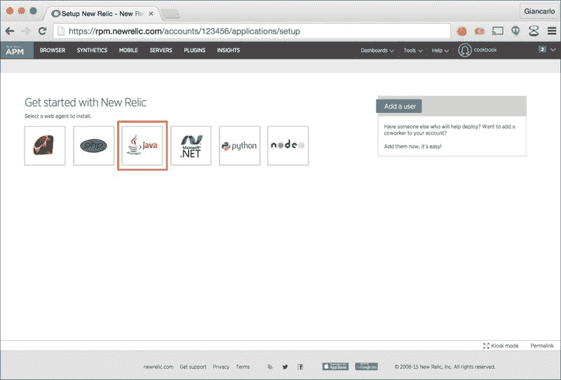

1.  在创建 Java 应用程序期间，请注意您的 New Relic 许可证密钥：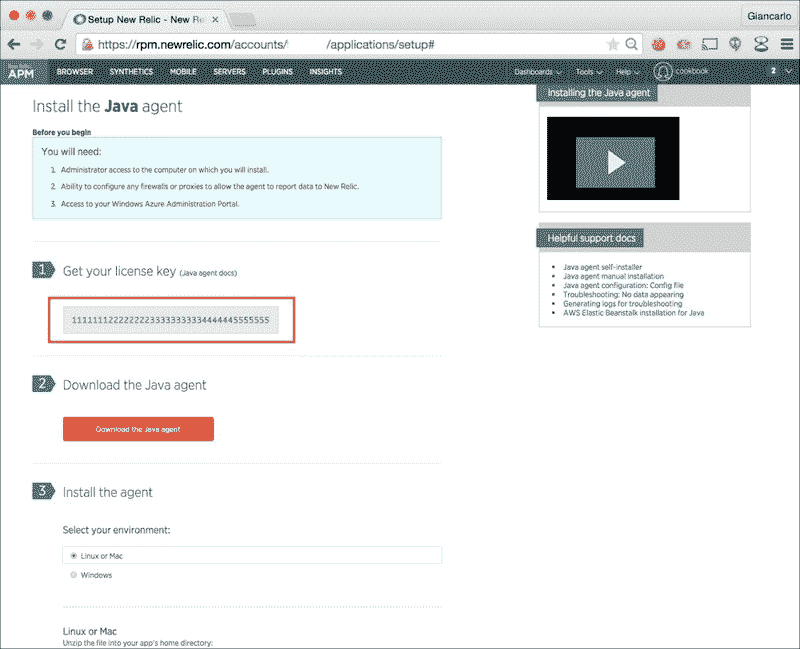

1.  接下来，下载 New Relic Java 代理 ZIP 文件，并记下下载位置。此 ZIP 文件应包含 Java 代理库、许可证密钥文件、API 文档和其他有用的 New Relic 资源。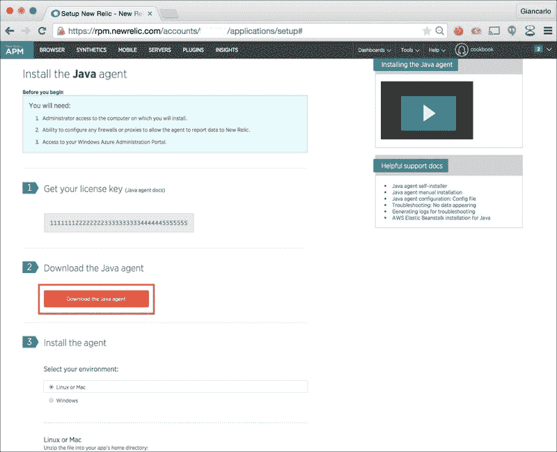

1.  解压 Java 代理 ZIP 文件，并注意两个重要的文件，我们将需要的 `newrelic.yml` 和 `newrelic.jar`：

    ```java
    <span class="strong"><strong>    $ ls ~/Downloads/newrelic/</strong></span>
    <span class="strong"><strong>    CHANGELOG </strong></span>
    <span class="strong"><strong>    extension-example.xml </strong></span>
    <span class="strong"><strong>    newrelic-api-sources.jar </strong></span>
    <span class="strong"><strong>    newrelic.yml</strong></span>
    <span class="strong"><strong>    LICENSE </strong></span>
    <span class="strong"><strong>    extension.xsd </strong></span>
    <span class="strong"><strong>    newrelic-api.jar </strong></span>
    <span class="strong"><strong>    nrcerts</strong></span>
    <span class="strong"><strong>    README.txt </strong></span>
    <span class="strong"><strong>    newrelic-api-javadoc.jar </strong></span>
    <span class="strong"><strong>    newrelic.jar</strong></span>
    ```

1.  通过添加相关名称到设置参数 `app_name` 编辑 `newrelic.yml` 文件，对于这个配方，我们将 `app_name` 命名为 `computer-database-scala`：

    ```java
    <span class="strong"><strong>    common: &amp;default_settings</strong></span>
    <span class="strong"><strong>  </strong></span>
    <span class="strong"><strong>      license_key: '111112222223333344444455555556666666'</strong></span>
    <span class="strong"><strong>      agent_enabled: true</strong></span>
    <span class="strong"><strong>      app_name: computer-database-scala</strong></span>
    <span class="strong"><strong>      # ..</strong></span>
    ```

1.  使用 `activator` 模板 `computer-database-scala` 创建一个新的 Play 网络应用程序，并将其更改到项目根目录：

    ```java
    <span class="strong"><strong>    activator new play2-deploy-81 computer-database-scala</strong></span>
    <span class="strong"><strong>    cd play2-deploy-81</strong></span>
    ```

1.  在 `conf` 目录中创建一个 `instrument` 目录：

    ```java
    <span class="strong"><strong>    mkdir conf/instrument</strong></span>
    ```

1.  将我们的两个 New Relic 配置文件复制到 `conf/instrument`：

    ```java
    <span class="strong"><strong>    cp ~/Downloads/newrelic/newrelic.yml conf/instrument</strong></span>
    <span class="strong"><strong>    cp ~/Downloads/newrelic/newrelic.jar conf/instrument</strong></span>
    ```

1.  编辑 `conf/application.conf` 以启用自动数据库演变：

    ```java
    <span class="strong"><strong>    applyEvolutions.default=true</strong></span>
    ```

1.  在 `project/plugins.sbt` 中添加较新版本的本地 Docker 打包器 `sbt` 插件，它具有对 Docker 的额外原生支持：

    ```java
    <span class="strong"><strong>    addSbtPlugin("com.typesafe.sbt" % "sbt-native-packager" % "1.0.0-M3")</strong></span>
    ```

1.  编辑 `build.sbt` 以指定网络应用程序的特定 Docker 设置：

    ```java
    <span class="strong"><strong>    $ vi build.sbt</strong></span>
    <span class="strong"><strong>    import com.typesafe.sbt.SbtNativePackager._</strong></span>
     <span class="strong"><strong>    name := """play2-deploy-81"""</strong></span>
     <span class="strong"><strong>    version := "0.0.1-SNAPSHOT"</strong></span>
     <span class="strong"><strong>    scalaVersion := "2.11.4"</strong></span>
     <span class="strong"><strong>    dockerRepository := Some("ginduc")</strong></span>
     <span class="strong"><strong>    dockerExposedPorts := Seq(9000)</strong></span>
     <span class="strong"><strong>     dockerEntrypoint := Seq("bin/play2-deploy-81", "-J-javaagent:conf/instrument/newrelic.jar")</strong></span>
     <span class="strong"><strong>    libraryDependencies ++= Seq(</strong></span>
    <span class="strong"><strong>      jdbc,</strong></span>
    <span class="strong"><strong>      anorm,</strong></span>
    <span class="strong"><strong>      "org.webjars" % "jquery" % "2.1.1",</strong></span>
    <span class="strong"><strong>      "org.webjars" % "bootstrap" % "3.3.1"</strong></span>
    <span class="strong"><strong>    )</strong></span>
     <span class="strong"><strong>    lazy val root = (project in file(".")).enablePlugins(PlayScala)</strong></span>
    ```

1.  使用 `activator` 创建 Docker 镜像：

    ```java
    <span class="strong"><strong>     activator clean docker:stage</strong></span>
    ```

1.  使用您的 Docker Hub 凭据从您的本地开发机器登录到 Docker：

    ```java
    <span class="strong"><strong>    $ docker login</strong></span>
    ```

1.  使用`activator`构建镜像并上传到[hub.docker.com](http://hub.docker.com)：

    ```java
    <span class="strong"><strong>    activator docker:publish</strong></span>
    ```

1.  从[hub.docker.com](http://hub.docker.com)拉取`play2-deploy-81` Docker 镜像到我们将部署网络应用程序的虚拟机中：

    ```java
    <span class="strong"><strong>    docker pull &lt;YOUR_DOCKERHUB_USERNAME&gt;/play2-deploy-81:0.0.1-SNAPSHOT</strong></span>
    ```

1.  在同一远程虚拟机中运行`play2-deploy-81` Docker 容器：

    ```java
    <span class="strong"><strong>    docker run -d -p 9000:9000 ginduc/play2-deploy-81:0.0.1-SNAPSHOT</strong></span>
    ```

1.  使用网络浏览器，您现在应该能够访问我们刚刚部署的计算机数据库网络应用程序：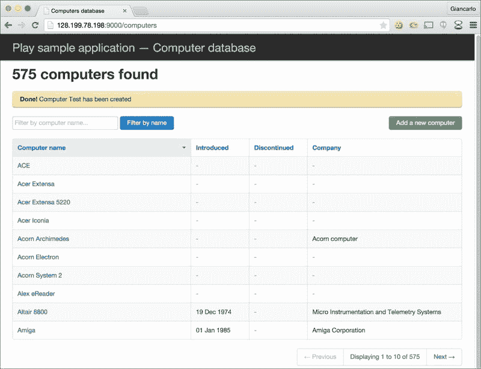

1.  现在，登录到您的 New Relic 账户并导航到您的应用程序仪表板。您应该能够以图表和图形的形式看到一些相关的应用程序统计数据：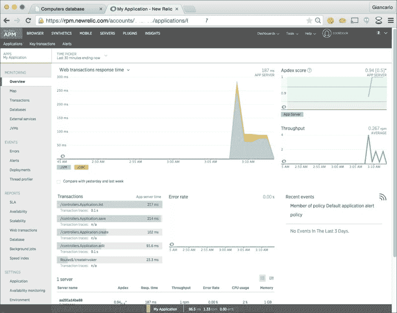

## 它是如何工作的...

在本食谱中，我们在远程**虚拟机**（**vm**）中部署了 Play 2.0 网络应用程序。对于虚拟机，我们使用了 CoreOS 版本 607.0.0 作为基础操作系统，它应该会自动安装 Docker：

```java
<span class="strong"><strong>    $ docker -v</strong></span>
<span class="strong"><strong>    Docker version 1.5.0, build a8a31ef-dirty</strong></span>
```

一旦部署虚拟机设置完成，我们就将注意力转向设置我们的 New Relic 账户。创建账户后，我们下载了 New Relic Java 代理，并特别记录了我们的账户许可证密钥。我们将两者都使用，因为我们将在我们的 Play 网络应用程序中集成 New Relic Java 代理：

```java
<span class="strong"><strong>  $ unzip newrelic-java-3.15.0.zip</strong></span>
<span class="strong"><strong>  Archive:  newrelic-java-3.15.0.zip</strong></span>
<span class="strong"><strong>     creating: newrelic/</strong></span>
<span class="strong"><strong>    inflating: newrelic/newrelic.jar</strong></span>
<span class="strong"><strong>    inflating: newrelic/LICENSE</strong></span>
<span class="strong"><strong>    inflating: newrelic/README.txt</strong></span>
<span class="strong"><strong>    inflating: newrelic/extension.xsd</strong></span>
<span class="strong"><strong>   inflating: newrelic/nrcerts</strong></span>
<span class="strong"><strong>    inflating: newrelic/extension-example.xml</strong></span>
<span class="strong"><strong>   inflating: newrelic/CHANGELOG</strong></span>
<span class="strong"><strong>   inflating: newrelic/newrelic.yml</strong></span>
<span class="strong"><strong>    inflating: newrelic/newrelic-api.jar</strong></span>
<span class="strong"><strong>   inflating: newrelic/newrelic-api-sources.jar</strong></span>
<span class="strong"><strong>    inflating: newrelic/newrelic-api-javadoc.jar</strong></span>
```

我们使用 activator 模板`computer-database-scala`作为本食谱中的示例 Play 网络应用程序。

一旦我们生成了我们的 Web 项目，我们将把两个 New Relic 配置文件放在项目根目录下的`conf/instrument`目录中：

```java
<span class="strong"><strong>    $ ls conf/instrument</strong></span>
<span class="strong"><strong>    newrelic.jar </strong></span>
<span class="strong"><strong>    newrelic.yml</strong></span>
```

要加载本机 Docker 打包器，我们需要将`sbt-native-packager`插件添加到我们的`project/plugins.sbt`构建插件文件中：

```java
addSbtPlugin("com.typesafe.sbt" % "sbt-native-packager" % "1.0.0-M3")
```

最后一步是配置我们的主要构建文件`build.sbt`，以指定创建镜像的 docker 特定设置：

```java
maintainer := "ginduc &lt;ginduc@dynamicobjx.com&gt;"
     dockerRepository := Some("dynobjx")
     dockerExposedPorts := Seq(9000)
     dockerEntrypoint := Seq("bin/imapi", "-J-javaagent:conf/instrument/newrelic.jar")
```

在前面的设置中，我们指定了[hub.docker.com](http://hub.docker.com)中的默认仓库和我们将公开应用程序的主要端口号（在本食谱中为端口号 9000）。最后的设置是指定`entrypoint`命令的位置。我们不得不修改它，以便传递必要的设置来指定 New Relic Java 代理：

```java
dockerEntrypoint := Seq("bin/imapi", "-J-javaagent:conf/instrument/newrelic.jar")
```

前面的设置生成的`Dockerfile`应该看起来像这样：

```java
<span class="strong"><strong>    $ cat target/docker/Dockerfile</strong></span>
<span class="strong"><strong>    FROM dockerfile/java:latest</strong></span>
<span class="strong"><strong>    MAINTAINER ginduc &lt;ginduc@dynamicobjx.com&gt;</strong></span>
<span class="strong"><strong>    EXPOSE 9000</strong></span>
<span class="strong"><strong>    ADD files /</strong></span>
<span class="strong"><strong>    WORKDIR /opt/docker</strong></span>
<span class="strong"><strong>    RUN ["chown", "-R", "daemon", "."]</strong></span>
<span class="strong"><strong>    USER daemon</strong></span>
<span class="strong"><strong>    ENTRYPOINT ["bin/imapi", "-J-javaagent:conf/instrument/newrelic.jar"]</strong></span>
<span class="strong"><strong>    CMD []</strong></span>
```

我们可以通过运行我们的 Docker 容器时查看 Docker 日志来验证当前是否已加载 New Relic Java 代理：

```java
<span class="strong"><strong>    $ docker logs     9790caf8046c7da1d561dcc6e221169d64fa125cdd0a689222fe31637c7bc234</strong></span>
<span class="strong"><strong>    Mar 30, 2015 13:54:11 +0000 [1 1] com.newrelic INFO: New Relic Agent:      Loading configuration file "/opt/docker/conf/instrument/./newrelic.yml"</strong></span>
<span class="strong"><strong>    Mar 30, 2015 13:54:11 +0000 [1 1] com.newrelic INFO: New Relic Agent: Writing to log file: /opt/docker/lib/logs/newrelic_agent.log</strong></span>
<span class="strong"><strong>    Play server process ID is 1</strong></span>
<span class="strong"><strong>    [info] play - database [default] connected at jdbc:h2:mem:play</strong></span>
<span class="strong"><strong>    [info] play - Application started (Prod)</strong></span>
<span class="strong"><strong>    [info] play - Listening for HTTP on /0:0:0:0:0:0:0:0:9000</strong></span>
```

一旦我们在部署虚拟机中安装和部署了 Docker 容器，我们就可以使用网络浏览器访问`computer-database-scala`网络应用程序。然后我们可以使用 New Relic 仪表板查看所有相关的仪表数据点，例如 JVM 和数据库指标，以图表和图形的形式：

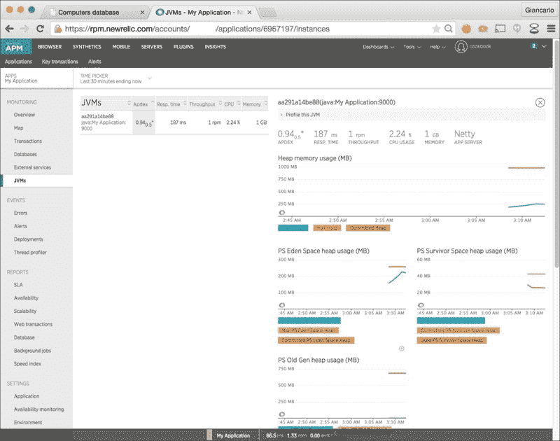

在这里，我们可以查看 New Relic 的应用指标有多深入，包括 JVM、数据库连接等的报告视图：

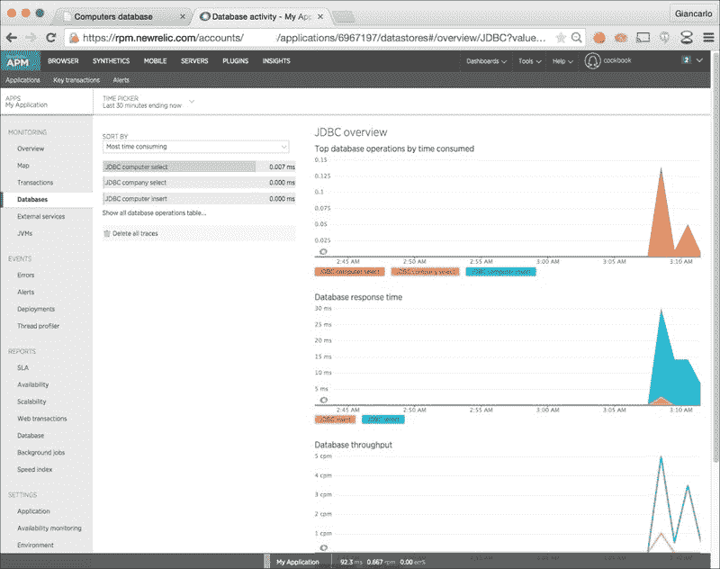

# 将 Play 应用程序与 AngularJS 集成

对于这个食谱，我们将集成一个基于 AngularJS 的前端 Play web 应用程序。AngularJS 是一个流行的 JavaScript 框架，为开发者提供了构建强大交互式 UI 的便捷工具。本食谱假定开发者对 AngularJS 有一定的了解。

更多关于 AngularJS 的信息可以在[`angularjs.org/`](https://angularjs.org/)找到。

在这个食谱中，我们还将使用 WebJars，一个 Play 友好的依赖管理仓库，来管理我们的 AngularJS 库。

更多关于 WebJars 的信息可以在[`www.webjars.org/`](http://www.webjars.org/)找到。

我们还将使用 RequireJS，这是一个 JavaScript 模块脚本加载器，用于管理 AngularJS 模块和`public/javascripts/main.js`，我们的主要应用程序 JavaScript 模块。有关 RequireJS 的更多信息，请参阅他们的在线文档[`requirejs.org/`](http://requirejs.org/)。

## 如何做到这一点…

对于这个食谱，你需要执行以下步骤：

1.  通过使用`activator`模板`play-scala`创建一个新的 Play 2 web 应用程序项目：

    ```java
    <span class="strong"><strong>    activator new play2-angular-83 play-scala &amp;&amp; cd play2-angular-83</strong></span>
    ```

1.  编辑`build.sbt`构建文件以导入 RequireJS、AngularJS 和 Bootstrap：

    ```java
    libraryDependencies ++= Seq(
          "org.webjars" %% "webjars-play" % "2.3.0",
          "org.webjars" % "angularjs" % "1.3.4",
          "org.webjars" % "bootstrap" % "3.3.1" exclude("org.webjars", "jquery"),
          "org.webjars" % "requirejs" % "2.1.15" exclude("org.webjars", "jquery")
        )
    ```

1.  编辑默认应用程序控制器文件`app/controllers/Application.scala`的内容，并用以下片段替换：

    ```java
    package controllers
         import play.api._
        import play.api.libs.json.Json
        import play.api.mvc._
         case class Product(sku: String, title: String)
         object Application extends Controller {
          implicit val productWrites = Json.writes[Product]
           def index = Action {
            Ok(views.html.index())
          }
           val products = Seq(
            Product("733733-421", "HP ProLiant DL360p Gen8"),
            Product("7147H2G", "IBM System x x3690 X5"),
            Product("R630-3552", "DELL PowerEdge R630"),
            Product("RX-2280I", "Supermicro RTG RX-2280I"),
            Product("MB449D/A", "Apple Xserve")
          )
           def listProducts = Action {
            Ok(Json.toJson(products))
          }
        }
    ```

1.  编辑路由文件`conf/routes`的内容，并用以下片段替换：

    ```java
    # Routes
        GET     /                           controllers.Application.index
        GET     /assets/*file               controllers.Assets.versioned(path="/public", file: Asset)
        GET     /api/products               controllers.Application.listProducts
        GET     /webjars/*file              controllers.WebJarAssets.at(file)
    ```

1.  编辑默认索引模板 HTML 文件`app/views/index.scala.html`的内容，并用以下片段替换：

    ```java
    @main("Product Catalogue") {
          &lt;nav class="navbar navbar-inverse navbar-fixed-top" role="navigation"&gt;
            &lt;div class="container-fluid"&gt;
              &lt;div class="navbar-header"&gt;
                &lt;button type="button" class="navbar-toggle collapsed" data-toggle="collapse" data-target="#navbar" aria-expanded="false" aria-controls="navbar"&gt;
                    &lt;span class="sr-only"&gt;Toggle navigation&lt;/span&gt;
                    &lt;span class="icon-bar"&gt;&lt;/span&gt;
                    &lt;span class="icon-bar"&gt;&lt;/span&gt;
                    &lt;span class="icon-bar"&gt;&lt;/span&gt;
                &lt;/button&gt;
                &lt;a class="navbar-brand" href="#"&gt;Product Catalogue&lt;/a&gt;
              &lt;/div&gt;
            &lt;/div&gt;
          &lt;/nav&gt;
           &lt;div class="container-fluid"&gt;
            &lt;div class="row"&gt;
              &lt;ng-view /&gt;
            &lt;/div&gt;
          &lt;/div&gt;
        }
    ```

1.  编辑默认布局模板文件`app/views/main.scala.html`的内容，并用以下片段替换：

    ```java
    @(title: String)(content: Html)&lt;!DOCTYPE html&gt;
       &lt;html&gt;
      &lt;head&gt;
        &lt;meta charset="utf-8"&gt;
        &lt;meta http-equiv="X-UA-Compatible" content="IE=edge"&gt;
        &lt;meta name="viewport" content="width=device-width, initial-scale=1"&gt;
        &lt;meta name="description" content=""&gt;
        &lt;meta name="author" content=""&gt;
        &lt;title&gt;@title&lt;/title&gt;
        &lt;link rel="shortcut icon" type="image/png" href='@routes.Assets.versioned("images/favicon.png")'&gt;
        &lt;link rel="stylesheet" media="screen" href='@routes.WebJarAssets.at(WebJarAssets.locate("css/bootstrap.min.css"))' /&gt;
        &lt;style&gt;
            body {
                padding-top: 50px;
            }
        &lt;/style&gt;
      &lt;/head&gt;
      &lt;body&gt;
        @content
        &lt;script data-main='@routes.Assets.versioned("javascripts/main.js").url' src='@routes.WebJarAssets.at(WebJarAssets.locate("require.min.js")).url'&gt;&lt;/script&gt;
      &lt;/body&gt;
      &lt;/html&gt;
    ```

1.  在`public/javascripts/main.js`中添加我们 web 应用程序的主要 JavaScript 文件，并添加以下片段：

    ```java
    'use strict';
       requirejs.config({
        paths: {
          'angular': ['../lib/angularjs/angular'],
          'angular-route': ['../lib/angularjs/angular-route'],
          'angular-resource': ['../lib/angularjs/angular-resource.min']
        },
        shim: {
          'angular': {
            exports : 'angular'
          },
          'angular-route': {
            deps: ['angular'],
            exports : 'angular'
          },
          'angular-resource': {
            deps: ['angular'],
            exports : 'angular'
          }
        }
      });
       require([
        'angular',
        'angular-route',
        'angular-resource',
        './services',
        './controllers'
        ],
        function(angular) {
          angular.module('azApp', [
            'ngRoute',
            'ngResource',
            'azApp.services',
            'azApp.controllers'
          ])
           .config(['$routeProvider', '$locationProvider', '$httpProvider', function($routeProvider, $locationProvider, $httpProvider) {
            $routeProvider
              .when('/', {
                templateUrl: 'assets/javascripts/partials/products.html',
                controller: 'ProductsCtrl'
              })
          }]);
           angular.bootstrap(document, ['azApp']);
      });
    ```

1.  接下来，我们在`public/javascripts/controllers.js`中添加了 Angular 控制器 JavaScript 文件，内容如下：

    ```java
    'use strict';
       define(['angular'], function(angular) {
        angular.module('azApp.controllers', [])
           .controller('ProductsCtrl', ['$scope', 'Products', function ($scope, Products) {
            $scope.products = Products.list().query();
          }])
         ;
      });
    ```

1.  在添加 angular 控制器文件后，我们在`public/javascript/services.js`中添加了 Angular 工厂 JavaScript 文件，内容如下：

    ```java
    'use strict';
       define(['angular'], function(angular) {
        angular.module('azApp.services', [])
          .factory('Products', ['$resource', '$http', function Contacts($resource, $http) {
              var endpointURI = '/api/products';
               return {
                list: function(options) {
                    return $resource(endpointURI);
                }
              }
          }])
        ;
      });
    ```

1.  最后，我们在`public/javascripts/partials/products.html`中添加了产品部分的 HTML 文件，内容如下：

    ```java
    &lt;div class="table-responsive"&gt;
          &lt;table class="table table-striped table-hover"&gt;
            &lt;thead&gt;
              &lt;th&gt;Product Title&lt;/th&gt;
              &lt;th&gt;SKU&lt;/th&gt;
            &lt;/thead&gt;
          &lt;tbody&gt;
            &lt;tr ng-repeat="p in products | orderBy:'title'"&gt;
              &lt;td ng-bind="p.title"&gt;&lt;/td&gt;
              &lt;td ng-bind="p.sku"&gt;&lt;/td&gt;
            &lt;/tr&gt;
          &lt;/tbody&gt;
        &lt;/table&gt;
      &lt;/div&gt;
    ```

1.  我们现在可以执行`activator`命令`run`来启动 Play 2 web 应用程序：

    ```java
    <span class="strong"><strong>    $ activator "~run"</strong></span>
    <span class="strong"><strong>    [info] Loading project definition</strong></span>
    <span class="strong"><strong>    [info] Set current project to play2-angular-83</strong></span>
    <span class="strong"><strong>    --- (Running the application, auto-reloading is enabled) ---</strong></span>
    <span class="strong"><strong>    [info] play - Listening for HTTP on /0:0:0:0:0:0:0:0:9000</strong></span>
    <span class="strong"><strong>    (Server started, use Ctrl+D to stop and go back to the console...)</strong></span>
     <span class="strong"><strong>    [success] Compiled in 354ms</strong></span>
    ```

1.  使用`curl`，我们可以验证我们的产品 API 端点是否正常工作：

    ```java
    <span class="strong"><strong>    $ curl http://localhost:9000/api/products</strong></span>
    <span class="strong"><strong>    [{"sku":"733733-421","title":"HP ProLiant DL360p Gen8"}, {"sku":"7147H2G","title":"IBM System x x3690 X5"},{"sku":"R630- 3552","title":"DELL PowerEdge R630"},{"sku":"RX-2280I","title":"Supermicro RTG  RX-2280I"},{"sku":"MB449D/A","title":"Apple Xserve"}]%</strong></span>
    ```

1.  我们现在可以通过在浏览器中加载 URL`http://localhost:9000`来访问由 Play 2 支持的 API 端点驱动的产品列表页面：

## 它是如何工作的…

在这个食谱中，我们创建了一个使用 AngularJS 和 Bootstrap 来显示产品列表的 Play 2 web 应用程序。产品列表由基于 Play 2 的 Rest API 端点提供，该端点返回包含产品标题和 SKU 的产品集。

为了将所有东西连接起来，我们不得不修改一些基于 play-scala 的`activator`模板的配置设置，并添加包含我们主要 AngularJS 脚本的 JavaScript 文件。

1.  首先，我们必须通过修改`build.sbt`文件中的库依赖项来声明我们的 Web 应用程序需要 AngularJS、RequireJS 和 Bootstrap：

    ```java
    libraryDependencies ++= Seq(
          "org.webjars" %% "webjars-play" % "2.3.0",
          "org.webjars" % "angularjs" % "1.3.4",
          "org.webjars" % "bootstrap" % "3.3.1" exclude("org.webjars", "jquery"),
          "org.webjars" % "requirejs" % "2.1.15" exclude("org.webjars", "jquery")
        )
    ```

1.  接下来，我们修改了应用程序控制器，添加了一个产品案例类和`listProducts`操作，这将服务于我们的产品 API 端点：

    ```java
    case class Product(sku: String, title: String)

        def listProducts = Action {
          Ok(Json.toJson(products))
        }
    ```

1.  接下来，我们需要修改我们的`routes`文件以声明新路由和重新配置现有路由：

    ```java
    GET     /assets/*file               controllers.Assets.versioned(path="/public", file: Asset)
        GET     /api/products               controllers.Application.listProducts
        GET     /webjars/*file              controllers.WebJarAssets.at(file)
    ```

1.  在前面的代码片段中，我们通过使用`versioned`操作来重新配置现有的`/assets/*file`路由。然后我们添加了产品 API 端点路由和 WebJars 资产的路由条目。

1.  接下来，我们需要修改现有的`app/views/index.scala.html`模板以插入 Angular 视图标签来渲染部分 HTML：

    ```java
    @main("Product Catalogue") {

          &lt;div class="container-fluid"&gt;
            &lt;div class="row"&gt;
              &lt;ng-view /&gt;
            &lt;/div&gt;
          &lt;/div&gt;
        }
    ```

1.  下一步是修改布局模板文件`app/views/main.scala.html`以加载我们的主要 JavaScript 文件及其依赖项：

    ```java
    @(title: String)(content: Html)&lt;!DOCTYPE html&gt;
       &lt;html&gt;
      &lt;head&gt;
        &lt;meta charset="utf-8"&gt;
        &lt;meta http-equiv="X-UA-Compatible" content="IE=edge"&gt;
        &lt;meta name="viewport" content="width=device-width, initial-scale=1"&gt;
        &lt;meta name="description" content=""&gt;
        &lt;meta name="author" content=""&gt;
        &lt;title&gt;@title&lt;/title&gt;
        &lt;link rel="shortcut icon" type="image/png" href='@routes.Assets.versioned("images/favicon.png")'&gt;
        &lt;link rel="stylesheet" media="screen" href='@routes.WebJarAssets.at(WebJarAssets.locate("css/bootstrap.min.css"))' /&gt;
        &lt;style&gt;
            body {
                padding-top: 50px;
            }
        &lt;/style&gt;
      &lt;/head&gt;
      &lt;body&gt;
        @content
        &lt;script data-main='@routes.Assets.versioned("javascripts/main.js").url' src='@routes.WebJarAssets.at(WebJarAssets.locate("require.min.js")).url'&gt;&lt;/script&gt;
      &lt;/body&gt;
      &lt;/html&gt;
    ```

1.  然后，我们需要在`public/javascripts/main.js`中添加我们的主要 JavaScript 文件以配置我们的主要 Angular 应用程序：

    ```java
    'use strict';
       requirejs.config({
        paths: {
          'angular': ['../lib/angularjs/angular'],
          'angular-route': ['../lib/angularjs/angular-route'],
          'angular-resource': ['../lib/angularjs/angular-resource.min']
        },
        shim: {
          'angular': {
            exports : 'angular'
          },
          'angular-route': {
            deps: ['angular'],
            exports : 'angular'
          },
          'angular-resource': {
            deps: ['angular'],
            exports : 'angular'
          }
        }
      });
       require([
        'angular',
        'angular-route',
        'angular-resource',
        './services',
        './controllers'
        ],
        function(angular) {
          angular.module('azApp', [
            'ngRoute',
            'ngResource',
            'azApp.services',
            'azApp.controllers'
          ])
           .config(['$routeProvider', '$locationProvider', '$httpProvider', function($routeProvider, $locationProvider, $httpProvider) {
            $routeProvider
              .when('/', {
                templateUrl: 'assets/javascripts/partials/products.html',
                controller: 'ProductsCtrl'
              })
          }]);
           angular.bootstrap(document, ['azApp']);
      });
    ```

1.  在前面的代码片段中，我们初始化了 Angular 和另外两个 Angular 插件`angular-routes`和`angular-resources`，它们将处理请求路由并管理 API 调用。我们还加载并初始化了我们的 Angular 控制器和服务脚本文件：

    ```java
    require([
        'angular',
        'angular-route',
        'angular-resource',
        './services',
        './controllers'
        ])
    ```

1.  最后，我们使用`$routeProvider`指令配置了我们的 Angular 应用程序路由。对于这个菜谱，默认情况下，基本 URL 通过模板部分`public/javascripts/partials/products.html`加载产品控制器：

    ```java
    $routeProvider
        .when('/', {
          templateUrl: 'assets/javascripts/partials/products.html',
          controller: 'ProductsCtrl'
        })
      }])
    ```

对于这个菜谱，我们成功地将 AngularJS 与我们的 Play 2 Web 应用程序集成，使用 WebJars 仓库来管理所有前端库（在这个菜谱中，Angular、RequireJS 和 Bootstrap）。我们能够访问产品 API 端点并显示其内容在 Angular 模板中。

# 将 Play 应用程序与 Parse.com 集成

对于这个菜谱，我们将集成一个 Play 2 Rest API 与一个 BaaS，如[Parse.com](http://Parse.com)的 Parse Core，这是一个允许开发者将数据存储在云中的云服务。在这个菜谱中，我们想要看看我们如何使用 Play 将其他外部 Web 服务集成到我们的 Web 应用程序中。对于现代 Web 应用程序来说，拥有多个数据源并不罕见。我们将使用一个 Parse Core 应用程序来模拟这一点。我们将使用 Play WS 库来连接到 Parse API，特别是使用 HTTP 头发送应用程序凭据和 JSON 数据到 Parse API Web 服务。我们还将能够使用[Parse.com](http://Parse.com)自己的核心数据浏览器来查看我们在 Parse Core 应用程序中存储的数据。

对于这个菜谱，我们需要一个[Parse.com](http://Parse.com)账户。你可以在[`parse.com/#signup`](https://parse.com/#signup)注册一个账户。

## 如何做到这一点...

对于这个菜谱，你需要执行以下步骤：

1.  登录到你的[Parse.com](http://Parse.com)账户并创建一个新的 Parse Core 应用程序！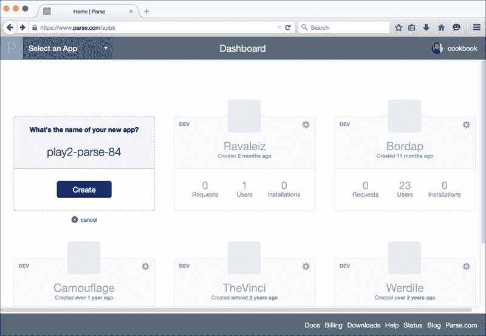

1.  创建一个新的 Parse 应用后，导航到**设置**部分以检索您的**应用程序 ID**和**Rest API 密钥**：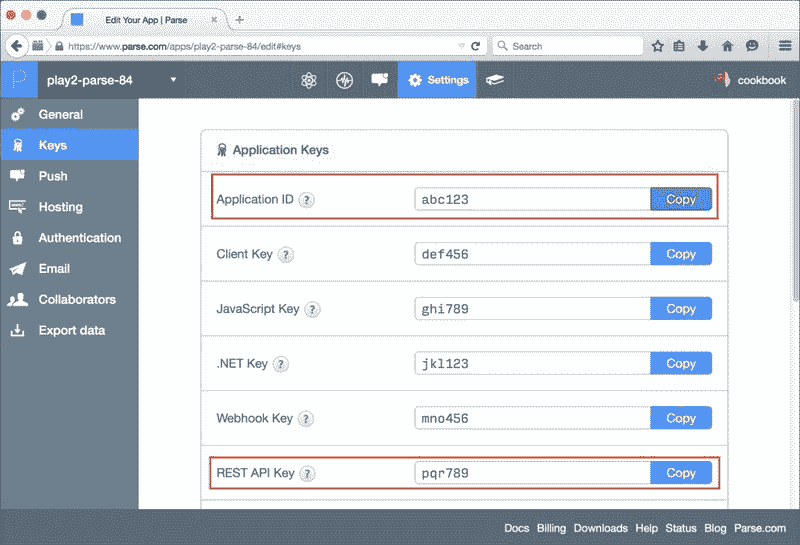

1.  接下来，在 Parse Core 部分创建一个新的 Parse 类（类似于数据库表）。对于这个菜谱，我们将存储**Item**记录：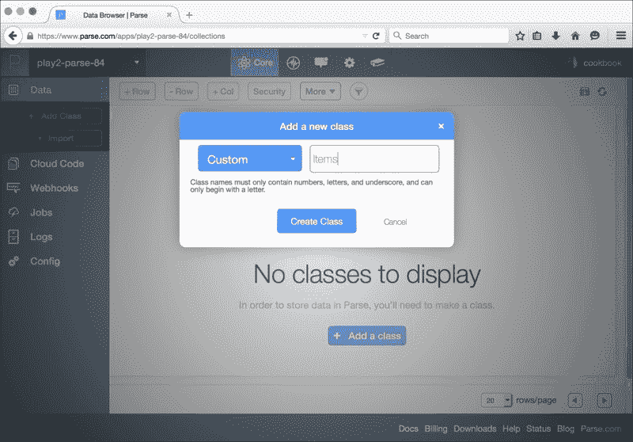

1.  创建 Parse 类后，为我们的项目添加必要的列。对于这个菜谱，我们将添加**标题**和 SKU 列：

1.  接下来，我们将着手于我们的 Play 2 Web 应用，该应用将与 Parse Core 进行交互。基于 activator 模板`play-scala`生成一个新的 Play 2 Web 应用：

    ```java
    <span class="strong"><strong>    activator new play2-parse-84 play-scala &amp;&amp; cd play2-parse-84</strong></span>
    ```

1.  接下来，在`app/plugins/ParsePlugin.scala`中创建一个新的插件，以下内容：

    ```java
    package plugins
         import play.api.{Application, Plugin}
         class ParsePlugin(app: Application) extends Plugin {
          lazy val parseAPI: ParseAPI = {
            new ParseAPI(
              app.configuration.getString("parse.core.appId").get,
              app.configuration.getString("parse.core.restKey").get
            )
          }
           override def onStart() = {
            parseAPI
          }
        }
    ```

1.  接下来，在`conf/application.conf`文件中添加 Parse Core 密钥，我们在上一步中做了笔记。确保用您实际的 Parse 应用 ID 和 Rest 密钥替换占位符：

    ```java
    parse.core.appId=&lt;YOUR_PARSE_APP_ID&gt;
        parse.core.restKey=&lt;YOUR_PARSE_REST_KEY&gt;
    ```

1.  接下来，在`app/plugins/ParseAPI.scala`中创建我们的 Parse 辅助类，以下内容：

    ```java
    package plugins
         import play.api.Play.current
        import play.api.libs.json.JsValue
        import play.api.libs.ws.WS
         class ParseAPI(appId: String, restKey: String) {
          private val PARSE_API_HEADER_APP_ID = "X-Parse-Application-Id"
          private val PARSE_API_HEADER_REST_API_KEY = "X-Parse-REST-API-Key"
          private val PARSE_API_URL = "https://api.parse.com"
          private val PARSE_API_URL_CLASSES = "/1/classes/"
          private val PARSE_API_HEADER_CONTENT_TYPE = "Content-Type"
          private val CONTENT_TYPE_JSON = "application/json; charset=utf-8"
           private val parseBaseUrl = "%s%s".format(PARSE_API_URL, PARSE_API_URL_CLASSES)
           def list(className: String) = parseWS(className).get()
           def create(className: String, json: JsValue) = {
            parseWS(className)
              .withHeaders(PARSE_API_HEADER_CONTENT_TYPE -&gt; CONTENT_TYPE_JSON)
          .post(json)
          }
           private def parseWS(className: String) = WS.url("%s%s".format(parseBaseUrl, className))
            .withHeaders(PARSE_API_HEADER_APP_ID -&gt; appId)
            .withHeaders(PARSE_API_HEADER_REST_API_KEY -&gt; restKey)
        }
    ```

1.  接下来，在应用启动时初始化插件，在`conf/play.plugins`中创建 Play 插件配置文件，以下内容：

    ```java
    799:plugins.ParsePlugin
    ```

1.  最后，让我们在`app/controllers/Items.scala`文件中添加我们的`Items`控制器，以下内容将添加两个操作方法，`index()`用于从 Parse Core 返回项目，以及`create()`，它将在 Parse Core 上持久化项目：

    ```java
    package controllers
         import play.api.Play
        import play.api.Play.current
        import play.api.libs.json.{JsError, Json, JsObject}
        import play.api.mvc.{BodyParsers, Action, Controller}
        import play.api.libs.concurrent.Execution.Implicits._
        import plugins.ParsePlugin
        import scala.collection.mutable.ListBuffer
        import scala.concurrent.Future
         case class Item(objectId: Option[String], title: String, sku: String)
         object Items extends Controller {
          private val parseAPI = Play.application.plugin[ParsePlugin].get.parseAPI
          implicit val itemWrites = Json.writes[Item]
          implicit val itemReads = Json.reads[Item]
           val `Items` = "Items"
           def index = Action.async { implicit request =&gt;
            parseAPI.list(`Items`).map { res =&gt;
              val list = ListBuffer[Item]()
              (res.json \ "results").as[List[JsObject]].map { itemJson =&gt;
                list += itemJson.as[Item]
              }
              Ok(Json.toJson(list))
            }
          }
           def create = Action.async(BodyParsers.parse.json) { implicit request =&gt;
            val post = request.body.validate[Item]
            post.fold(
              errors =&gt; Future.successful {
                BadRequest(Json.obj("error" -&gt; JsError.toFlatJson(errors)))
              },
              item =&gt; {
                parseAPI.create(`Items`, Json.toJson(item)).map { res =&gt;
                  if (res.status == CREATED) {
                    Created(Json.toJson(res.json))
                  } else {
                    BadGateway("Please try again later")
                  }
                }
              }
            )
          }
        }
    ```

1.  在`conf/routes`文件中添加必要的路由条目以供我们的`Items`操作使用：

    ```java
    GET     /api/items                  controllers.Items.index
        POST    /api/items                  controllers.Items.create
    ```

1.  要运行我们的 Web 应用，我们将使用 activator 命令`run`，使用波浪字符(~)表示我们希望为此 Web 应用启用热重载：

    ```java
    <span class="strong"><strong>    $ activator "~run"</strong></span>
    <span class="strong"><strong>    [info] Loading project definition</strong></span>
    <span class="strong"><strong>    [info] Set current project to play2-parse-84</strong></span>
     <span class="strong"><strong>    --- (Running the application, auto-reloading is enabled) ---</strong></span>
     <span class="strong"><strong>    [info] play - Listening for HTTP on /0:0:0:0:0:0:0:0:9000</strong></span>
     <span class="strong"><strong>    (Server started, use Ctrl+D to stop and go back to the console...)</strong></span>
     <span class="strong"><strong>    [success] Compiled in 400ms</strong></span>
    <span class="strong"><strong>    [info] play - Application started (Dev)</strong></span>
    ```

1.  使用`curl`，我们现在可以向我们的 Parse Core 应用中插入新的记录：

    ```java
    <span class="strong"><strong>    $ curl -v -X POST http://localhost:9000/api/items --header "Content-type: application/json" -d '{"title":"Supermicro RTG RX-2280I", "sku":"RX-2280I"}'</strong></span>
    <span class="strong"><strong>    * Hostname was NOT found in DNS cache</strong></span>
    <span class="strong"><strong>    *   Trying ::1...</strong></span>
    <span class="strong"><strong>    * Connected to localhost (::1) port 9000 (#0)</strong></span>
    <span class="strong"><strong>    &gt; POST /api/items HTTP/1.1</strong></span>
    <span class="strong"><strong>    &gt; User-Agent: curl/7.37.1</strong></span>
    <span class="strong"><strong>    &gt; Host: localhost:9000</strong></span>
    <span class="strong"><strong>    &gt; Accept: */*</strong></span>
    <span class="strong"><strong>    &gt; Content-type: application/json</strong></span>
    <span class="strong"><strong>    &gt; Content-Length: 53</strong></span>
    <span class="strong"><strong>    &gt;</strong></span>
    <span class="strong"><strong>    * upload completely sent off: 53 out of 53 bytes</strong></span>
    <span class="strong"><strong>    &lt; HTTP/1.1 201 Created</strong></span>
    <span class="strong"><strong>    &lt; Content-Type: application/json; charset=utf-8</strong></span>
    <span class="strong"><strong>    &lt; Content-Length: 64</strong></span>
    <span class="strong"><strong>    &lt;</strong></span>
    <span class="strong"><strong>    * Connection #0 to host localhost left intact</strong></span>
    <span class="strong"><strong>    {"createdAt":"2015-04-08T06:13:52.103Z","objectId":"K7Q2JEXxmI"}%</strong></span>
    ```

1.  现在，我们也可以通过使用`curl`检索存储在 Parse Core 上的`items`：

    ```java
    <span class="strong"><strong>    $ curl -v http://localhost:9000/api/items</strong></span>
    <span class="strong"><strong>    * Hostname was NOT found in DNS cache</strong></span>
    <span class="strong"><strong>    *   Trying ::1...</strong></span>
    <span class="strong"><strong>    * Connected to localhost (::1) port 9000 (#0)</strong></span>
    <span class="strong"><strong>    &gt; GET /api/items HTTP/1.1</strong></span>
    <span class="strong"><strong>    &gt; User-Agent: curl/7.37.1</strong></span>
    <span class="strong"><strong>    &gt; Host: localhost:9000</strong></span>
    <span class="strong"><strong>    &gt; Accept: */*</strong></span>
    <span class="strong"><strong>    &gt;</strong></span>
    <span class="strong"><strong>    &lt; HTTP/1.1 200 OK</strong></span>
    <span class="strong"><strong>    &lt; Content-Type: application/json; charset=utf-8</strong></span>
    <span class="strong"><strong>    &lt; Content-Length: 231</strong></span>
    <span class="strong"><strong>    &lt;</strong></span>
    <span class="strong"><strong>    * Connection #0 to host localhost left intact</strong></span>
    <span class="strong"><strong>    [{"objectId":"0aTdEVAwaF","title":"DELL PowerEdge R630","sku":"R630-3552"},    {"objectId":"T3TqVdi9a2","title":"HP ProLiant DL360p Gen8","sku":"733733-421"},    {"objectId":"K7Q2JEXxmI","title":"Supermicro RTG RX-2280I","sku":"RX-2280I"}]%</strong></span>
    ```

## 它是如何工作的…

在这个菜谱中，我们查看了一个更实际的示例，即使用 Play WS 库将外部 Web 服务与 Play 2 Web 应用集成。Play WS 库在设置和连接到远程 HTTP 主机时节省了开发者大量的样板代码，它还提供了方便的方法来设置头信息、请求参数等。

Parse Core 是一个非常受欢迎且稳定的后端即服务提供商，它为开发者提供其他服务，如移动推送通知和移动分析，这些都是任何开发者工具链的重要补充。

对于这个菜谱来说，注册一个[Parse.com](http://Parse.com)账户并创建一个 Parse Core 应用是至关重要的。一旦我们设置好，我们就可以继续创建一个 Play 插件，该插件将负责初始化和设置我们与 Parse API 的连接：

```java
// app/plugins/ParsePlugin.scala
    class ParsePlugin(app: Application) extends Plugin {
      lazy val parseAPI: ParseAPI = {
        new ParseAPI(
          app.configuration.getString("parse.core.appId").get,
          app.configuration.getString("parse.core.restKey").get
        )
      }
       override def onStart() = {
        parseAPI
      }
    }
     // conf/application.conf
    parse.core.appId=&lt;YOUR_PARSE_APP_ID&gt;
    parse.core.restKey=&lt;YOUR_PARSE_REST_KEY&gt;
```

接下来，我们创建我们的 Parse Core 代理类`conf/plugins/ParseAPI.scala`，它将封装所有与 Parse API 的交互：

```java
package plugins
     import play.api.Play.current
    import play.api.libs.json.JsValue
    import play.api.libs.ws.WS
     class ParseAPI(appId: String, restKey: String) {
      private val PARSE_API_HEADER_APP_ID = "X-Parse-Application-Id"
      private val PARSE_API_HEADER_REST_API_KEY = "X-Parse-REST-API-Key"
      private val PARSE_API_URL = "https://api.parse.com"
      private val PARSE_API_URL_CLASSES = "/1/classes/"
      private val PARSE_API_HEADER_CONTENT_TYPE = "Content-Type"
      private val CONTENT_TYPE_JSON = "application/json; charset=utf-8"
       private val parseBaseUrl = "%s%s".format(PARSE_API_URL, PARSE_API_URL_CLASSES)
       def list(className: String) = parseWS(className).get()
       def create(className: String, json: JsValue) = {
        parseWS(className)
          .withHeaders(PARSE_API_HEADER_CONTENT_TYPE -&gt; CONTENT_TYPE_JSON)
      .post(json)
      }
       private def parseWS(className: String) = WS.url("%s%s".format(parseBaseUrl, className))
        .withHeaders(PARSE_API_HEADER_APP_ID -&gt; appId)
        .withHeaders(PARSE_API_HEADER_REST_API_KEY -&gt; restKey)
    }
```

在前面的类中，我们创建了两个公共方法，应该具有数据检索和记录创建的功能。我们在进行 `GET` 或 `POST` 请求时包括所需的 Parse API 身份验证头：

```java
private def parseWS(className: String) = WS.url("%s%s".format(parseBaseUrl, className))
        .withHeaders(PARSE_API_HEADER_APP_ID -&gt; appId)
        .withHeaders(PARSE_API_HEADER_REST_API_KEY -&gt; restKey)
```

对于 `POST` 请求，我们添加所需的附加头，将内容类型设置为 `application/json`：

```java
def create(className: String, json: JsValue) = {
      parseWS(className)
        .withHeaders(PARSE_API_HEADER_CONTENT_TYPE -&gt; CONTENT_TYPE_JSON)
        .post(json)
    }
```

一旦 Parse 插件全部设置完成，我们创建 `Items` 控制器，它将接收项目请求和项目创建请求，并将负责将这些请求委派给 Parse API 辅助工具：

```java
def index = Action.async { implicit request =&gt;
      parseAPI.list(`Items`).map { res =&gt;
        val list = ListBuffer[Item]()
        (res.json \ "results").as[List[JsObject]].map { itemJson =&gt;
          list += itemJson.as[Item]
        }
        Ok(Json.toJson(list))
      }
    }
     def create = Action.async(BodyParsers.parse.json) { implicit request =&gt;
      val post = request.body.validate[Item]
      post.fold(
        errors =&gt; Future.successful {
          BadRequest(Json.obj("error" -&gt; JsError.toFlatJson(errors)))
        },
        item =&gt; {
          parseAPI.create(`Items`, Json.toJson(item)).map { res =&gt;
            if (res.status == CREATED) {
              Created(Json.toJson(res.json))
            } else {
              BadGateway("Please try again later")
            }
          }
        }
      )
    }
```

不要忘记在 `conf/routes` 配置文件中添加后续的路由：

```java
GET     /api/items                  controllers.Items.index
    POST    /api/items                  controllers.Items.create
```

我们可以使用 Parse Core 仪表板查看通过 Parse API 创建的所有数据：

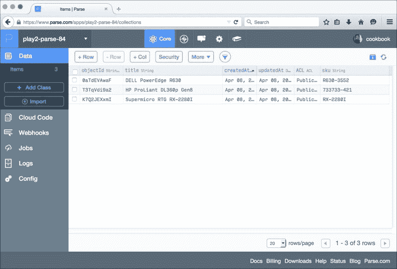

## 还有更多...

有关 Parse Core 的更多信息，请参阅他们位于 [`parse.com/docs`](https://parse.com/docs) 的在线文档。

# 使用 Vagrant 创建 Play 开发环境

我们将探讨如何创建一个用于 Play 2 开发的便携式开发环境，使用 **Vagrant**，这是任何开发者工具链的有力补充。Vagrant 允许开发者自动化创建开发环境，从安装用于 **Read-Eval-Print Loop** (**REPL**) 工具所需的开发套件，到安装其他服务如 MySQL 和 Redis。这种设置对于多成员开发团队或需要在多个工作站上工作的开发者来说非常有用，其中需要一个一致、相同的开发环境，这是必要且理想的。

对于这个配方，我们将从头开始创建我们的 Vagrant 实例，安装运行我们的示例 Play 网络应用程序所需的库，并使用 Docker 运行 MySQL 服务，以及使用 `activator` 模板 `play-slick-angular-test-example` 运行实际的示例 Play 网络应用程序。

## 如何做到这一点...

对于这个配方，你需要执行以下步骤：

1.  按照以下链接中的安装说明安装 Vagrant：

    [Vagrant 安装文档](https://docs.vagrantup.com/v2/installation/index.html)

1.  现在你应该已经安装了本地的 Vagrant 版本：

    ```java
    <span class="strong"><strong>    $ vagrant -v</strong></span>
    <span class="strong"><strong>    Vagrant 1.6.3</strong></span>
    ```

1.  创建一个工作空间目录并切换到新创建的目录：

    ```java
    <span class="strong"><strong>    mkdir play2-vagrant-85 &amp;&amp; cd $_</strong></span>
    ```

1.  在项目根目录中创建一个 `Vagrantfile`，内容如下：

    ```java
    # -*- mode: ruby -*-
        # vi: set ft=ruby :
         VAGRANTFILE_API_VERSION = "2"
         Vagrant.configure(VAGRANTFILE_API_VERSION) do |config|
          config.vm.box = "Centos-6.5"
          config.vm.box_url = "https://github.com/2creatives/vagrant-centos/releases/download/v6.5.1/centos65-x86_64-20131205.box"
          config.vm.hostname = "VG-play2"
           config.vm.provision :shell, :path =&gt; "bootstrap.sh"
           config.vm.network "forwarded_port", guest: 9000, host: 9000
          config.vm.network "forwarded_port", guest: 3306, host: 3306
           config.vm.provider :virtualbox do |vb|
            vb.name = "VG-play2"
            vb.gui = false
            vb.customize ["modifyvm", :id, "--memory", "4096", "--cpus", "2", "--    ioapic", "on"]
          end
        end
    ```

1.  创建一个 Bootstrap bash 脚本文件 `bootstrap.sh`，内容如下：

    ```java
    #!/usr/bin/env bash
         set -x
         SCALA_VER=2.11.2
        ACTIVATOR_VER=1.3.2
        MYSQL_ROOT_PW="cookbook"
         if [ ! -e "/home/vagrant/.firstboot" ]; then
           # tools etc
          yum -y install yum-plugin-fastestmirror
          yum -y install git wget curl rpm-build
           # Pre-docker install: http://stackoverflow.com/a/27216873
          sudo yum-config-manager --enable public_ol6_latest
          sudo yum install -y device-mapper-event-libs
           # Docker
          yum -y install docker-io
          service docker start
          chkconfig docker on
          usermod -a -G docker vagrant
           # Install the JDK
          curl -LO 'http://download.oracle.com/otn-pub/java/jdk/7u51-b13/jdk-7u51-linux-x64.rpm' -H 'Cookie: oraclelicense=accept-securebackup-cookie'
          rpm -i jdk-7u51-linux-x64.rpm
          /usr/sbin/alternatives --install /usr/bin/java java /usr/java/default/bin/java 200000
          rm jdk-7u51-linux-x64.rpm
           # Install scala repl
          rpm -ivh http://scala-lang.org/files/archive/scala-$SCALA_VER.rpm
           # Install Activator
          cd /opt
          wget http://downloads.typesafe.com/typesafe-activator/$ACTIVATOR_VER/typesafe-activator-$ACTIVATOR_VER.zip
          unzip typesafe-activator-$ACTIVATOR_VER.zip
          chown -R vagrant:vagrant /opt/activator-$ACTIVATOR_VER
           # Set Path
          echo "export JAVA_HOME=/usr/java/default/" &gt;&gt; /home/vagrant/.bash_profile
          echo "export PATH=$PATH:$JAVA_HOME/bin:/home/vagrant/bin:/opt/activator-$ACTIVATOR_VER" &gt;&gt; /home/vagrant/.bash_profile
           touch /home/vagrant/.firstboot
        fi
         # Start MySQL
        docker run -e MYSQL_PASS=$MYSQL_ROOT_PW -i -d -p 3306:3306 --name mysqld -t tutum/mysql
    ```

1.  创建一个 git 忽略文件 `.gitignore`，以排除 Vagrant 目录工作空间从 git：

    ```java
    <span class="strong"><strong>    $ cat .gitignore</strong></span>
    <span class="strong"><strong>    .vagrant</strong></span>
    ```

1.  一旦 Vagrant 安装完成并且我们的 `Vagrantfile` 已经正确配置，我们就可以初始化我们的 Vagrant 实例：

    ```java
    <span class="strong"><strong>    vagrant up</strong></span>
    ```

1.  我们可以使用以下命令登录到 Vagrant 实例：

    ```java
    <span class="strong"><strong>    vagrant ssh</strong></span>
    ```

1.  登录到 Vagrant 实例后，使用以下命令切换到 Vagrant 工作空间目录：

    ```java
    <span class="strong"><strong>    cd /vagrant</strong></span>
    ```

1.  列出 `/vagrant` 目录的内容以验证你处于正确的目录：

    ```java
    <span class="strong"><strong>    $ ls -ltra</strong></span>
    <span class="strong"><strong>    -rw-r--r--   1 vagrant vagrant    9 Mar 31 12:48 .gitignore</strong></span>
    <span class="strong"><strong>    -rw-r--r--   1 vagrant vagrant  683 Mar 31 12:50 Vagrantfile</strong></span>
    <span class="strong"><strong>    drwxr-xr-x   1 vagrant vagrant  102 Mar 31 12:57 .vagrant</strong></span>
    <span class="strong"><strong>    -rwxr-xr-x   1 vagrant vagrant 1632 Apr  1 12:44 bootstrap.sh</strong></span>
    ```

1.  对于这个配方，我们将使用 `activator` 模板 `play-slick-angular-test-example` 并基于此生成一个新的 Play 2 项目：

    ```java
    <span class="strong"><strong>    $ activator new play-slick-angular-test-example play-slick-angular-test-example</strong></span>
    ```

1.  通过修改以下代码行编辑 `conf/application.conf` 配置文件：

    ```java
    db.default.driver=com.mysql.jdbc.Driver
        db.default.url="jdbc:mysql://localhost/report?createDatabaseIfNotExist=true"
        db.default.user=admin
        db.default.password="cookbook"
         applyEvolutions.default=true
    ```

1.  使用 `activator` 运行 Play 网络应用：

    ```java
    <span class="strong"><strong>    $ activator run</strong></span>
    ```

1.  现在，你应该能够通过网页浏览器访问 Play 网络应用：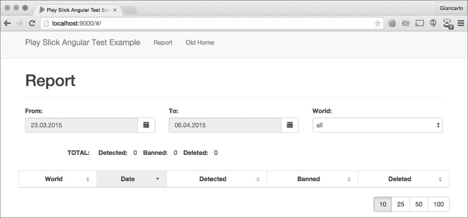

## 如何工作…

在这个菜谱中，我们按照以下步骤安装了 Vagrant，这是一个流行的开发者工具，它自动化了开发者环境的初始化和设置：

1.  在 `Vagrantfile` 配置文件中，我们声明我们将使用 Centos 6.5 Vagrant box 作为我们的基础操作系统：

    ```java
    config.vm.box_url = "https://github.com/2creatives/vagrant-centos/releases/download/v6.5.1/centos65-x86_64-20131205.box"
    ```

1.  我们声明在 Vagrant 实例配置过程中运行我们的 `bootstrap.sh` 脚本文件：

    ```java
    config.vm.provision :shell, :path =&gt; "bootstrap.sh"
    ```

1.  接下来，我们声明了从我们的 Vagrant 实例转发到主机机的端口，Play 使用端口 9000，MySQL 使用端口 3306：

    ```java
    config.vm.network "forwarded_port", guest: 9000, host: 9000
        config.vm.network "forwarded_port", guest: 3306, host: 3306
    ```

1.  最后，我们可选地配置了我们的 Vagrant 实例具有 4-GB RAM 并使用两个 CPU：

    ```java
    vb.customize ["modifyvm", :id, "--memory", "4096", "--cpus", "2", "--ioapic", "on"]
    ```

1.  我们安装了用于 Play 开发的相关工具，我们在 `bootstrap.sh` 脚本文件中指定了这些工具。我们在 `bootstrap.sh` 文件的顶部声明了 Scala 和 Activator 的版本：

    ```java
    SCALA_VER=2.11.2
        ACTIVATOR_VER=1.3.2
    ```

1.  我们还声明了用于我们的 MySQL 实例的默认密码：

    ```java
    MYSQL_ROOT_PW="cookbook"
    ```

1.  接下来，我们安装了所需的 CentOS 软件包：

    ```java
    <span class="strong"><strong># tools etc</strong></span>
    <span class="strong"><strong>  yum -y install yum-plugin-fastestmirror</strong></span>
    <span class="strong"><strong>  yum -y install git wget curl rpm-build</strong></span>
    ```

1.  下一个要安装的软件包是 Docker 及其所需的库：

    ```java
    <span class="strong"><strong># Pre-docker install: http://stackoverflow.com/a/27216873</strong></span>
    <span class="strong"><strong>  sudo yum-config-manager --enable public_ol6_latest</strong></span>
    <span class="strong"><strong>  sudo yum install -y device-mapper-event-libs</strong></span>
     <span class="strong"><strong>  # Docker</strong></span>
    <span class="strong"><strong>  yum -y install docker-io</strong></span>
    <span class="strong"><strong>  service docker start</strong></span>
    <span class="strong"><strong>  chkconfig docker on</strong></span>
    <span class="strong"><strong>  usermod -a -G docker vagrant</strong></span>
    ```

1.  接下来，我们安装了 JDK、Scala 二进制文件和 Activator：

    ```java
    <span class="strong"><strong>    # Install the JDK</strong></span>
    <span class="strong"><strong>    curl -LO 'http://download.oracle.com/otn-pub/java/jdk/7u51-b13/jdk-7u51-linux-x64.rpm' -H 'Cookie: oraclelicense=accept-securebackup-cookie'</strong></span>
    <span class="strong"><strong>    rpm -i jdk-7u51-linux-x64.rpm</strong></span>
    <span class="strong"><strong>    /usr/sbin/alternatives --install /usr/bin/java java /usr/java/default/bin/java 200000</strong></span>
    <span class="strong"><strong>    rm jdk-7u51-linux-x64.rpm</strong></span>
     <span class="strong"><strong>    # Install scala repl</strong></span>
    <span class="strong"><strong>    rpm -ivh http://scala-lang.org/files/archive/scala-$SCALA_VER.rpm</strong></span>
     <span class="strong"><strong>    # Install Activator</strong></span>
    <span class="strong"><strong>    cd /opt</strong></span>
    <span class="strong"><strong>    wget http://downloads.typesafe.com/typesafe-activator/$ACTIVATOR_VER/typesafe-activator-$ACTIVATOR_VER.zip</strong></span>
    <span class="strong"><strong>    unzip typesafe-activator-$ACTIVATOR_VER.zip</strong></span>
    <span class="strong"><strong>    chown -R vagrant:vagrant /opt/activator-$ACTIVATOR_VER</strong></span>
     <span class="strong"><strong>    # Set Path</strong></span>
    <span class="strong"><strong>    echo "export JAVA_HOME=/usr/java/default/" &gt;&gt; /home/vagrant/.bash_profile</strong></span>
    <span class="strong"><strong>    echo "export PATH=$PATH:$JAVA_HOME/bin:/home/vagrant/bin:/opt/activator-$ACTIVATOR_VER" &gt;&gt; /home/vagrant/.bash_profile</strong></span>
    ```

1.  最后，我们在实例启动时运行了一个 MySQL Docker 容器：

    ```java
    <span class="strong"><strong>    # Start MySQL</strong></span>
    <span class="strong"><strong>    docker run -e MYSQL_PASS=$MYSQL_ROOT_PW -i -d -p 3306:3306 --name mysqld -t tutum/mysql</strong></span>
    ```

1.  我们运行 Vagrant 命令 `vagrant up`，从头开始初始化 Vagrant 实例。经过一段时间后，我们的 Play 2 开发环境应该准备好了。使用命令 `vagrant ssh` 登录到 Vagrant 实例。你应该能够验证是否已安装所有必需的二进制文件：

    ```java
    <span class="strong"><strong>    [vagrant@VG-play2 ~]$ java -version</strong></span>
    <span class="strong"><strong>    java version "1.7.0_51"</strong></span>
    <span class="strong"><strong>    Java(TM) SE Runtime Environment (build 1.7.0_51-b13)</strong></span>
    <span class="strong"><strong>    Java HotSpot(TM) 64-Bit Server VM (build 24.51-b03, mixed mode)</strong></span>
    <span class="strong"><strong>    [vagrant@VG-play2 ~]$ activator --version</strong></span>
    <span class="strong"><strong>    sbt launcher version 0.13.8-M5</strong></span>
    <span class="strong"><strong>    [vagrant@VG-play2 ~]$ scala -version</strong></span>
    <span class="strong"><strong>    Scala code runner version 2.11.2 -- Copyright 2002-2013, LAMP/EPFL</strong></span>
    <span class="strong"><strong>    [vagrant@VG-play2 ~]$ docker ps</strong></span>
    <span class="strong"><strong>    CONTAINER ID        IMAGE                COMMAND             CREATED                STATUS              PORTS                    NAMES</strong></span>
    <span class="strong"><strong>    08ecd4a3d98c        tutum/mysql:latest   "/run.sh"           21 minutes ago          Up 21 minutes       0.0.0.0:3306-&gt;3306/tcp   mysqld</strong></span>
    ```

1.  一旦 Vagrant 实例启动并运行，我们就可以构建和运行一个 Play 网络应用；在这个菜谱中，我们在 `/vagrant` 目录中安装的 `play-slick-angular-test-example` activator 模板：

    ```java
    <span class="strong"><strong>    cd /vagrant/play-slick-angular-test-example</strong></span>
    <span class="strong"><strong>    activator run</strong></span>
    <span class="strong"><strong>    [info] Loading project definition from /vagrant/play-slick-angular-test-example/project</strong></span>
    <span class="strong"><strong>    [info] Set current project to PlaySlickAngularBootstrapH2TestsExample (in build file:/vagrant/play-slick-angular-test-example/)</strong></span>
    <span class="strong"><strong>    [success] Total time: 4 s, completed Apr 6, 2015 2:55:54 PM</strong></span>
    <span class="strong"><strong>    [info] Updating {file:/vagrant/play-slick-angular-test-example/}root...</strong></span>
    <span class="strong"><strong>    [info] Resolving jline#jline;2.12 ...</strong></span>
    <span class="strong"><strong>    [info] Done updating.</strong></span>
     <span class="strong"><strong>    --- (Running the application from SBT, auto-reloading is enabled) ---</strong></span>
     <span class="strong"><strong>    [info] play - Listening for HTTP on /0:0:0:0:0:0:0:0:9000</strong></span>
     <span class="strong"><strong>    (Server started, use Ctrl+D to stop and go back to the console...)</strong></span>
    ```

## 还有更多…

记得在你想暂时关闭实例并稍后返回时暂停你的 Vagrant 实例：

```java
<span class="strong"><strong>    vagrant halt</strong></span>
```

这允许 Vagrant 实例在不重新初始化 Vagrant 实例的情况下保留其当前状态。有关 Vagrant 的更多信息，请参阅[`docs.vagrantup.com/v2/`](https://docs.vagrantup.com/v2/)的文档。

# 使用 IntelliJ IDEA 14 编码 Play 2 网络应用

对于这个菜谱，我们将探讨如何使用流行的 IDE，IntelliJ IDEA 14 来编码 Play 2 网络应用。我们将使用社区版：

## 如何做…

对于这个菜谱，你需要执行以下步骤：

1.  从 JetBrains 网站下载并安装 IntelliJ IDEA 14：

    [`www.jetbrains.com/idea/download/`](https://www.jetbrains.com/idea/download/)

1.  导航到你想使用 IDEA 14 的 Play 2 网络应用；在这个菜谱中，`play2-parse-84`：

    ```java
    <span class="strong"><strong>    cd play2-parse-84</strong></span>
    ```

1.  使用 `activator` 生成基础 IDEA 14 项目文件：

    ```java
    <span class="strong"><strong>    $ activator idea</strong></span>
    <span class="strong"><strong>    [info] Creating IDEA module for project 'play2-parse-84' ...</strong></span>
    <span class="strong"><strong>    [info] Running compile:managedSources ...</strong></span>
    <span class="strong"><strong>    [info] Running test:managedSources ...</strong></span>
    <span class="strong"><strong>    [info] Created /Users/cookbook/play2-parse-84/.idea/IdeaProject.iml</strong></span>
    <span class="strong"><strong>    [info] Created /Users/cookbook/play2-parse-84/.idea</strong></span>
    <span class="strong"><strong>    [info] Created /Users/cookbook/play2-parse-84.iml</strong></span>
    <span class="strong"><strong>    [info] Created /Users/cookbook/play2-parse-84/.idea_modules/play2-parse-84- build.iml</strong></span>
    ```

1.  启动 IntelliJ IDEA 14 并点击 **导入项目**：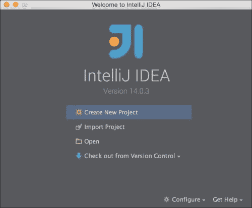

1.  使用 IDEA 14，导航到您想要工作的项目目录；在这个菜谱中，**play2-parse-84**: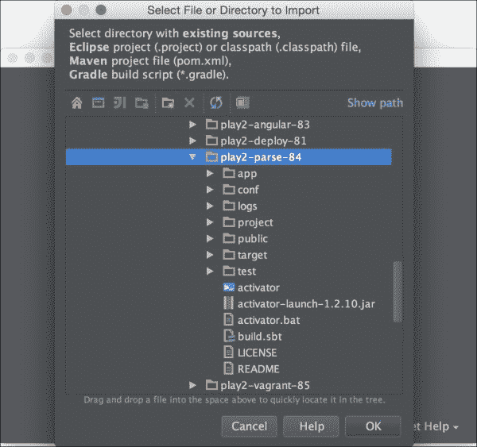

1.  在下一屏幕上，选择**SBT**作为项目的外部模型: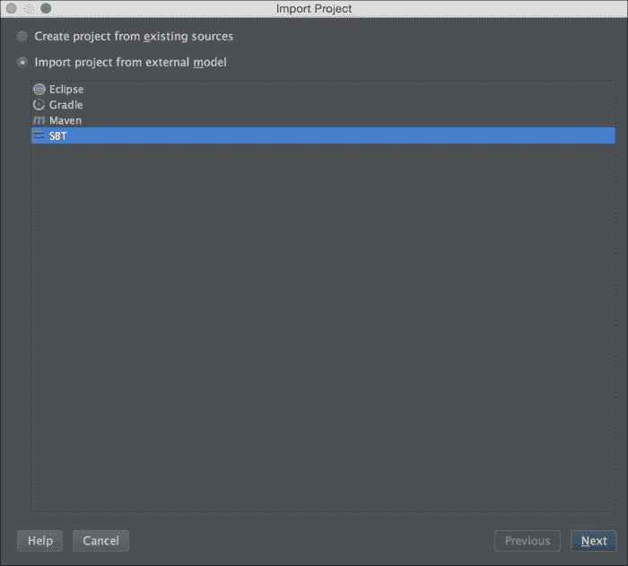

1.  接下来，选择额外的项目设置，例如要使用的已安装 JDK 版本: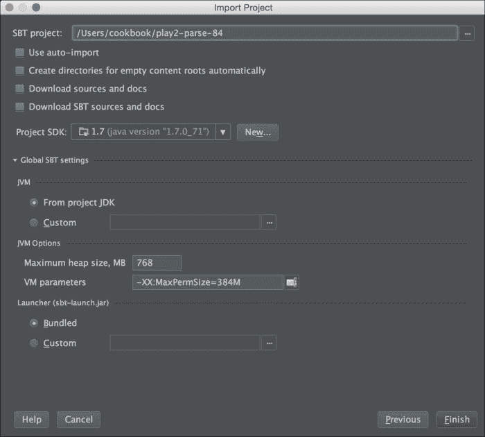

1.  点击**完成**后，您应该在 IntelliJ IDEA 14 上正确加载了您的 Play 2 网络应用: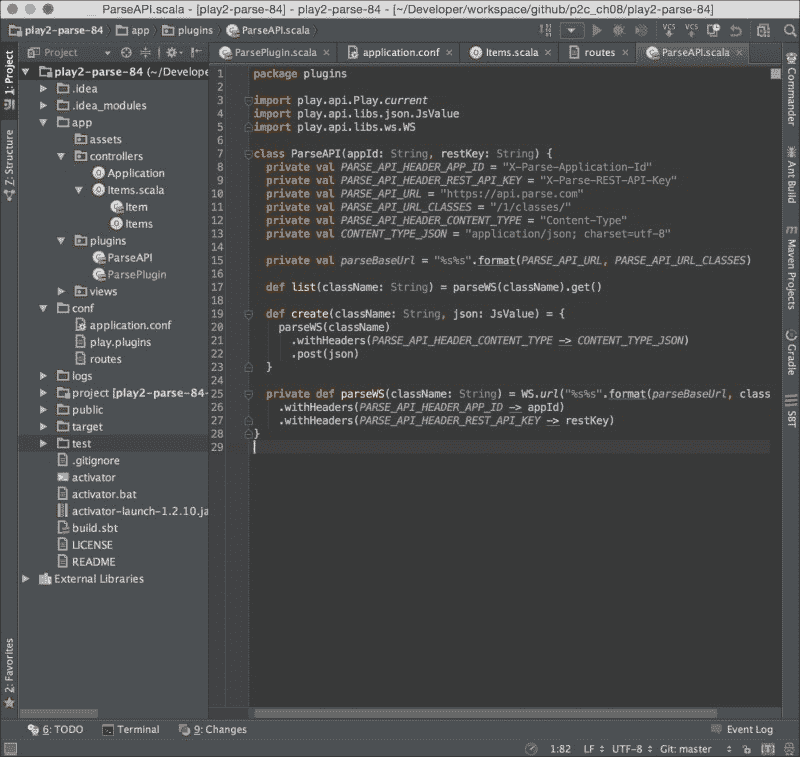

## 它是如何工作的…

在这个菜谱中，我们简单地使用了 Activator 内置对 IntelliJ IDEA 的支持，通过命令`activator idea`生成我们的 Play 2 网络应用 IDEA 项目文件。一旦我们从当前代码库中生成了 IDEA 项目文件，我们所需做的就是将其导入到 IntelliJ IDEA 中，并按照项目设置屏幕进行操作。现在我们应该能够使用 IntelliJ IDEA 来处理我们的 Play 2 网络应用。
