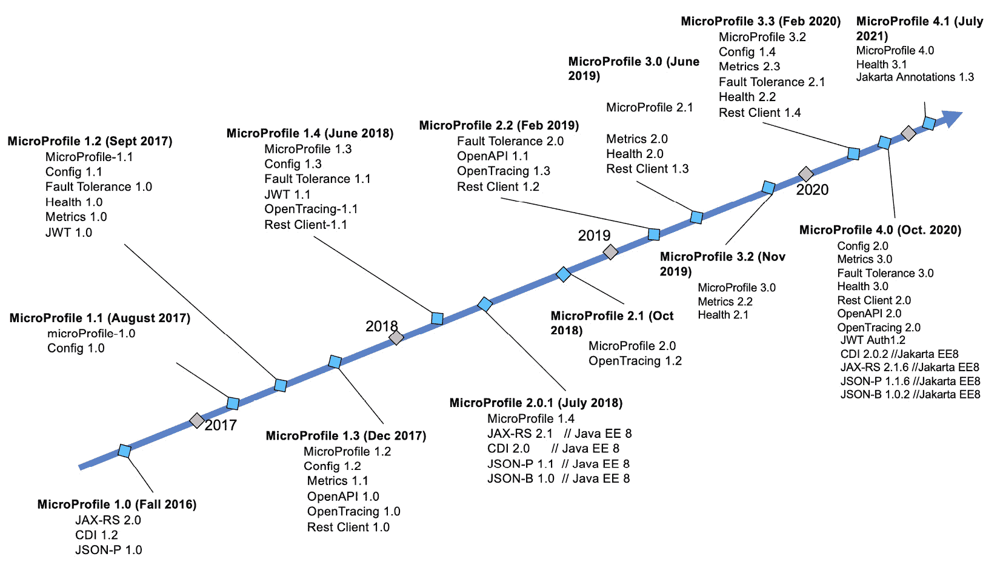
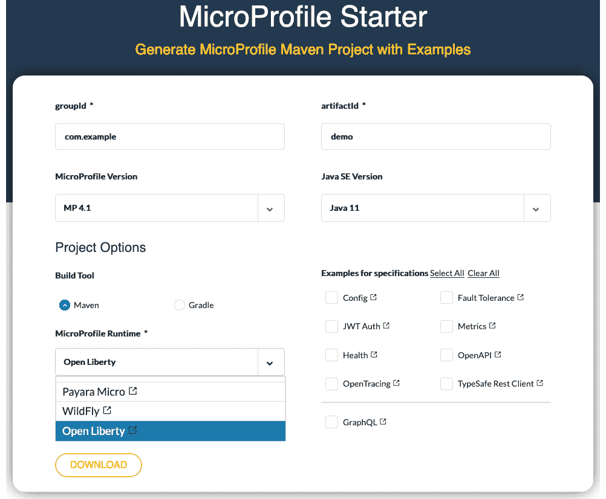

# 第二章：MicroProfile 如何融入云原生应用开发？

本章为您提供了 MicroProfile 的概述，并从满足云原生应用需求的角度描述了 MicroProfile 的规范。在本章中，我们首先回顾 MicroProfile 的历史，探讨其创建的原因和目的，然后我们将探讨 MicroProfile 的内容。这将使您对每个 MicroProfile 规范有一个高层次的理解，以便您了解 MicroProfile 如何融入云原生应用开发，以及为什么您应该采用 MicroProfile 技术。最后，我们将关注 MicroProfile 代码生成器，即 **MicroProfile Starter**，重点介绍如何创建云原生应用。这很有用，因为它将帮助您从头开始使用 MicroProfile。

本章将涵盖以下主题：

+   MicroProfile 概述

+   MicroProfile 规范

+   MicroProfile Starter

# MicroProfile 概述

让我们先回顾 MicroProfile 的历史，探讨其成立的原因和进展，以及如何建立其工作组。在本节中，我们将探讨两个不同的子主题：*MicroProfile 的历史*和*MicroProfile 的特点*。我们将从历史开始。了解发布周期和各个 MicroProfile 版本包含的内容非常重要，这样我们才能选择使用哪个版本，并了解 MicroProfile 发布新版本的频率。

## MicroProfile 历史

看到 Java EE 发展的缓慢步伐，包括 IBM、Red Hat、Payara、Tomitribe 等在内的几家主要行业参与者于 2016 年聚在一起，讨论如何使服务器端 Java 框架发展更快，并解决与新兴微服务空间相关的新挑战。作为这次合作的结果，MicroProfile 于 2016 年秋季诞生。它旨在帮助 Java 开发者开发云原生应用，而无需学习新语言。

MicroProfile 1.0 于 2016 年 9 月在 JavaOne 上宣布发布。MicroProfile 1.0 的首个版本包括 CDI、JSON-P 和 JAX-RS。2016 年 12 月，MicroProfile 在 Apache License v2.0 (Alv2.0) 许可下加入了 Eclipse 基金会。MicroProfile 1.1 于 2017 年 8 月发布，并包括了第一个新的 MicroProfile 规范，即 MicroProfile Config 1.0。从 2017 年到 2019 年，MicroProfile 每年发布三次：2 月、6 月和 10 月。

2020 年，在 MicroProfile 3.3 版本发布之后，Eclipse 基金会要求 MicroProfile 在进行任何进一步的重大或小版本发布之前，先设立其工作组。社区为此花费了近一年的时间来决定是设立自己的工作组还是与 Jakarta EE 工作组合并。最终，IBM、Red Hat 和 Tomitribe 决定成立一个独立的工作组。由于工作组要求至少有 5 家企业成员，社区花了些时间才获得另外 2 家企业成员的支持。10 月份，**亚特兰大 Java 用户组**（**AJUG**）和 Jelastic 与 IBM、Red Hat 和 Tomitribe 联合，成立了 MicroProfile 工作组。最终，在 2020 年 10 月，工作组章程获得批准。不久之后，Payara、Oracle、富士通、Garden State JUG 和 iJUG 也加入了 MicroProfile 工作组。

2020 年 10 月 MicroProfile 工作组成立后，MicroProfile 社区立即开始准备使用新建立的发布流程发布 MicroProfile 4.0 版本。12 月 23 日，MicroProfile 4.0 版本发布。最新的 MicroProfile 版本 4.1 于 2021 年 7 月最近发布。以下是 MicroProfile 发布的时间线：



图 2.1 – MicroProfile 发布时间线

如您从 *图* *2.1* 中所见，MicroProfile 具有快速的发布节奏。此外，MicroProfile 还有其他识别特征。在下一节中，我们将探讨它们。

## MicroProfile 的特点

MicroProfile 由于其开放性和多样性等独特特性而迅速发展。具体如下：

+   开放性和透明度：MicroProfile 在会议、项目、贡献等方面对公众开放。没有等级制度，每个人都有权表达自己的观点。没有人有否决权。

+   多样性：社区是多元化的。其贡献者包括 IBM、Red Hat、Tomitribe、Payara、Java 用户组以及其他个人和团体。每个人都欢迎加入 MicroProfile 并表达自己的观点。加入对话的方式是通过 MicroProfile Google 群组，可通过 [microprofile.io](http://microprofile.io) 上的 **加入讨论** 访问。

+   许多运行时实现：MicroProfile 发展 API、规范和**技术兼容性工具包**（**TCK**）。它只创建 API，但不包括实现。然而，并不缺少实现。大约有十几种实现，如下所示：

    a) Open Liberty ([`openliberty.io/`](https://openliberty.io/))

    b) WebSphere Liberty ([`www.ibm.com/uk-en/cloud/websphere-liberty`](https://www.ibm.com/uk-en/cloud/websphere-liberty))

    c) Quarkus ([`quarkus.io/`](https://quarkus.io/))

    d) Wildfly ([`www.wildfly.org/`](https://www.wildfly.org/))

    e) Payara ([`www.payara.fish/`](https://www.payara.fish/))

    f) TomEE ([`tomee.apache.org/`](https://tomee.apache.org/))

    g) Helidon ([`helidon.io`](https://helidon.io))

    h) Launcher ([`github.com/fujitsu/launcher`](https://github.com/fujitsu/launcher))

    i) KumuluzEE ([`ee.kumuluz.com/`](https://ee.kumuluz.com/))

    j) Piranha Cloud ([`piranha.cloud/`](https://piranha.cloud/))

    k) Apache Geronimo ([`geronimo.apache.org/`](https://geronimo.apache.org/))

+   轻量级、迭代的过程：MicroProfile 建立了一种快速移动并采用迭代过程的模式。它适应变化，允许在版本之间进行破坏性更改，并采用语义版本控制策略，这意味着包含破坏性更改的主要版本发布。然而，MicroProfile 试图最小化破坏性更改的数量。当有破坏性更改时，这些更改必须在相应规范的发布说明中进行明确记录。

由于 MicroProfile 的上述特性，其采用率迅速增长。因此，越来越多的公司开始投资 MicroProfile 技术。现在，MicroProfile 被视为开发云原生应用的标准。在下一节中，我们将更详细地查看每个单独的 MicroProfile 规范。

# MicroProfile 规范

在这一点上，你可能想知道 MicroProfile 包含哪些内容。正如你可能知道的，MicroProfile 在开发云原生应用方面不断演进**应用程序编程接口**（**APIs**）。MicroProfile 有几个规范，为云原生应用提供了各种功能。作为一名云原生应用开发者，了解这些是非常重要的。

MicroProfile 4.0 版本包括来自 Jakarta EE 8 的四个规范和八个 MicroProfile 规范，如下所示：

**Jakarta EE 规范**：

+   Jakarta 上下文和依赖注入（CDI）2.0

+   Jakarta RESTful Web 服务（JAX-RS）2.1

+   Jakarta JSON 绑定 1.0

+   Jakarta JSON 处理 1.1

**MicroProfile 规范**：

+   MicroProfile 配置 2.0

+   MicroProfile 容错 3.0

+   MicroProfile 健康 3.0

+   MicroProfile JWT 传播 1.2

+   MicroProfile 度量 3.0

+   MicroProfile OpenAPI 2.0

+   MicroProfile OpenTracing 2.0

+   MicroProfile Rest 客户端 2.0

MicroProfile 规范根据不同的发布类别进行分组。MicroProfile 有**平台**发布和**独立**发布的概念。在本节中，我们将详细介绍这两个概念。

## 平台发布

平台发布包括 12 个规范，其中 4 个来自 Jakarta EE。根据它们的用途，这些规范可以分为三个子组（三个层次）：

+   **构建云原生应用**：CDI、JAX-RS、Rest 客户端、JSON-B 和 JSON-P

+   **增强云原生应用**：Open API、容错、JWT 传播和配置

+   **观察和监控云原生应用**：Open Tracing、健康和度量

让我们依次探索这些组。

### 开发云原生应用的技术

**云原生应用程序**可以使用 **CDI**、**JAX-RS**、**JSON-B** 或 **JSON-P** 来开发。MicroProfile Rest Client 用于连接云原生应用程序。接下来是一个关于这些技术的快速概述。*第四章*，*开发云原生应用程序*，将更详细地解释它们。

#### CDI – Contexts and Dependency Injection

`@ApplicationScoped`、`@RequestScoped` 和 `@Dependent`。`@ApplicationScoped` 注解意味着每个云原生应用程序只有一个实例。依赖注入通过 `@Inject` 注解指定，该注解由 Jakarta 注入规范定义。

#### JAX-RS – Jakarta RESTful Web Services

`@Path`、`@GET`、`@PUT`、`@POST`、`DELETE`、`@Produces` 和 `@Consumes`。让我们逐个查看这些实例：

+   `@Path` 指定资源或方法的相对路径。

+   `@GET`、`@PUT`、`@POST` 和 `@DELETE` 指定 HTTP 请求类型。

+   `@Produces` 指定响应媒体类型，例如 `MediaType.APPLICATION_JSON`。

+   `@Consumes` 指定接受的媒体类型。

+   以下是一个 JAX-RS 服务的示例。它声明了一个带有端点的 `GET` 操作，例如 `http://localhost:9080/system/properties`。当调用此 URL 时，将返回系统属性。由于 `@Produces` 指定了 `MediaType.APPLICATION_JSON` 格式，因此有效载荷格式将采用称为 **JavaScript 对象表示法**（**JSON**）的格式：

```java
@ApplicationScoped // (1)
@Path("/properties") // (2)
public class PropertyController {
    @GET // (3)
    @Produces(MediaType.APPLICATION_JSON) // (4)
    public Properties getProperties() {
        return System.getProperties();
    }
}
```

让我们来看看这段代码中的四条注释行：

1.  `@ApplicationScoped` 注解，由 CDI 定义，表示 `PropertyController` 资源的生命周期是单一的，每个应用程序只有一个实例。

1.  `@Path` 注解指定了到 `PropertyController` 资源的相对路径，即为 `/properties`。

1.  `@GET` 注解表示 JAX-RS 操作类型。

1.  `@Produces(MediaType.APPLICATION_JSON)` 注解强制要求有效载荷以 JSON 格式。

到现在为止，你应该对 JAX-RS 有了一个基本的了解。在下一节中，我们将探讨如何使用 MicroProfile Rest Client 连接 RESTful 服务。

#### MicroProfile Rest Client

`@RegisterRestClient` 用于声明类型安全接口，如下面的代码片段所示。

以下示例定义了 JAX-RS 操作 `PropertyController.getProperties()` 的类型安全接口，如前节所示：

```java
@RegisterRestClient(baseUri="http://localhost:9081/system")  // (1)
public interface PropertiesClient {
    @GET // (2)
    @Produces(MediaType.APPLICATION_JSON) // (3)
    @Path("/properties") // (4)
    public Properties getProperities();
}
```

让我们来看看这段代码中的四条注释行：

1.  `@RegisterRestClient` 注解将 `PropertiesClient` 接口注册为 RESTful 客户端。

1.  `@GET` 注解表示 `getProperties()` 方法是一个 `GET` 操作。

1.  `@Produces(MediaType.APPLICATION_JSON)` 注解指定了有效载荷格式为 JSON 格式。

1.  `@Path` 注解声明了 `getProperties()` 操作的相对路径。

类型安全的客户端同时支持 CDI 和程序性查找。以下代码片段演示了如何使用 CDI 注入`PropertiesClient` RESTful 客户端，然后调用其`getProperties()`方法：

```java
@Path("/client")
@ApplicationScoped
public class ClientController {
@Inject @RestClient 
private PropertiesClient; // (1)
    @GET 
    @Path("/props") 
    @Produces(MediaType.APPLICATION_JSON) 
    public Properties displayProps() throws       IllegalStateException, RestClientDefinitionException, 
        URISyntaxException {
        return propertiesClient.getProperities(); // (2)
    }
}
```

让我们来看看这个代码片段中的两条注释行：

1.  `@Inject`（由`@RestClient`（由`PropertiesClient`定义的 CDI 限定符）注入到`propertiesClient`变量中。

1.  调用后端操作，`getProperties()`，即`PropertyController.getProperties()`。

或者，您可以使用`RestClientBuilder`程序性 API 来获取客户端，这将在*第四章* *开发云原生应用程序*中讨论。

在前面的示例中，JAX-RS 服务的响应是 JSON 格式，这是最受欢迎的响应格式。我们将在下一节中讨论 JSON，如何将其转换为对象，以及从对象转换为 JSON 对象。

#### JSON-B 和 JSON-P

JSON 是云原生应用程序中传输数据的主要格式。JSON 支持两种数据结构：**对象**和**数组**。对象是一系列键值对，由大括号括起来，而数组将这些对象收集到一个集合中。

两者**JSON-B**([`github.com/eclipse-ee4j/jsonb-api`](https://github.com/eclipse-ee4j/jsonb-api))和**JSON-P**([`github.com/eclipse-ee4j/jsonp`](https://github.com/eclipse-ee4j/jsonp))都是 Jakarta EE API 规范，用于将 POJOs 转换为 JSON 数据以及从 JSON 数据转换回 POJOs。JSON-P 的第一个版本比 JSON-B 早几年发布。JSON-P 为 JSON 处理提供了流式和数据模型。

JSON-B 提供了一种将 Java 对象转换为 JSON 消息或从 JSON 消息转换回 Java 对象的机制。它提供了多种方法来序列化/反序列化 Java 对象到/从 JSON。JSON-B 提供的 API 比 JSON-P 更高级。JSON-B 与 JAX-RS 和 JAX-RS 2.1 兼容，并强制使用 JSON-B 来自动将返回的对象转换为 HTTP 响应中的 JSON 数据。

### 增强云原生应用程序的技术

建立云原生应用程序后，不幸的是，工作还没有完成。您需要考虑如何改进应用程序。下一个任务是提高其可靠性和可维护性。例如，您是否希望自由更改配置值而无需重新编译应用程序，比如端口号？您是否希望应用程序具有弹性，无论发生什么情况都能持续运行？您是否希望应用程序具有安全性，这意味着不允许未经授权的请求？当您有数十或数百个应用程序时，您需要帮助确定应用程序正在做什么？

如果上述任何问题的答案是*是*，您将需要添加一些基本的**服务质量**(**QoS**)，包括以下内容：

+   配置

+   弹性

+   安全性

+   文档

**MicroProfile 配置** 提供了一种无需重新部署即可配置应用程序的方法。**MicroProfile 故障恢复** 使应用程序更具弹性。**MicroProfile JWT 认证** 以便携和简单的方式保护应用程序，而 **MicroProfile Open API** 用于记录应用程序。接下来，我们将快速概述这些技术，并在 *第五章*，*增强云原生应用程序* 中深入探讨每个技术。

#### MicroProfile 配置

**MicroProfile 配置** ([`github.com/eclipse/microprofile-config`](https://github.com/eclipse/microprofile-config)) 定义了一个简单灵活的系统来检索应用程序配置。配置定义在配置源中，这些配置源可以由应用程序提供。检索配置有两种方式：**CDI** 或 **程序性查找**。让我们依次查看这些方法：

+   `"customer.name"`，以下代码片段可以用来检索其值：

    ```java
    @Inject @ConfigProperty(name="customer.name") String customerName;
    ```

+   `customer.name` 也可以通过以下 API 进行程序性查找：

    ```java
    Config = ConfigProvider.getConfig();
    String customerName = config.getValue("customer.name",   String.class);
    ```

在类路径上的 `microprofile-config.properties` 文件中定义的属性，环境变量和系统属性对云原生应用程序自动可用。这意味着 MicroProfile 配置还可以访问映射到 Pod 的 Kubernetes `ConfigMaps` 或 `Secrets` 的环境变量的值。以下代码片段演示了在 Java 属性文件格式中定义的 `customer.name` 属性：

```java
customer.name=Bob
```

MicroProfile 配置允许外部化配置。存储在环境中的配置可以通过 Config API 被云原生应用程序访问。本规范实现了在 *第一章*，*云原生应用程序* 中提到的 **Twelve-Factor App** 的第三个因素，**配置**。您已经学习了如何配置您的应用程序。接下来，我们将简要讨论如何使用 MicroProfile 故障恢复使您的应用程序更具弹性。

#### MicroProfile 故障恢复

**MicroProfile 故障恢复** ([`github.com/eclipse/microprofile-fault-tolerance/`](https://github.com/eclipse/microprofile-fault-tolerance/)) 定义了一组用于使云原生应用程序具有弹性的注解。这些注解如下：

+   `@Retry`：从短暂的网络故障中恢复。这允许您定义重试的次数、可以触发重试的异常、重试的时间长度等。

+   `@Timeout`：定义了最大允许的响应时间。这用于时间敏感的操作。它定义了相应操作响应的最大时间长度。

+   `@CircuitBreaker`：快速失败并避免可重复的无限等待或超时。您可以指定要检查电路的滚动窗口、电路打开的失败率、电路断路器考虑或忽略的异常等。

+   `@Bulkhead`：隔离故障并避免整个系统崩溃。有两种类型的隔离舱。当此注解与 `@Asynchronous` 注解一起使用时，这意味着**线程隔离**，这意味着带有此注解的方法将在子线程上执行。否则，它意味着**信号量隔离**，这意味着方法将在父线程上执行。

+   `@Fallback`：为失败的执行提供替代解决方案。您应该始终使用此注解来确保健壮的云原生应用程序能够应对各种情况。此注解在原始方法返回异常时提供替代操作。

+   上述注解可以一起使用，这提高了您云原生应用程序的健壮性。一旦您的应用程序可配置且健壮，下一步就是考虑如何防止敏感信息被无关方获取。这正是 MicroProfile JWT 传播发挥作用的地方。

#### MicroProfile JWT 传播

`@RolesAllowed`，用于保护 JAX-RS 端点。

MicroProfile JWT 传播建立了一种将用户信息传递到后端的方法，以便后端可以确定调用是否允许。MicroProfile JWT 传播建立在 JWT 之上，并添加了一些额外的声明：`JsonWebToken`，它扩展了 `java.security.Principal` 接口。此 API 通过 getter 访问器提供一系列声明。

JAX-RS 应用程序可以通过 `SecurityContext` 注解访问 `JsonWebToken`：

```java
@GET
@Path("/getGroups")
public Set<String> getGroups(@Context SecurityContext sec) {
    Set<String> groups = null;
    Principal user = sec.getUserPrincipal();
    if (user instanceof JsonWebToken) {
        JsonWebToken jwt = (JsonWebToken) user;
        groups= = jwt.getGroups();
    }
    return groups;
} 
```

或者，它也可以被注入：

```java
@Inject private JsonWebToken jwt;
@Inject @Claim(standard= Claims.raw_token) private String   rawToken;
@Inject @Claim("iat") private Long dupIssuedAt;
@Inject @Claim("sub") private ClaimValue<Optional<String>>   optSubject;
```

MicroProfile JWT 认证还确保了单点登录，并且运行时将自动拒绝权限不足或缺少适当声明的请求。一旦您的应用程序可配置、健壮且安全，您就需要考虑如何记录您的应用程序。您可以使用 MicroProfile OpenAPI 来记录您的应用程序。

#### MicroProfile OpenAPI

`http://myHost:myPort/openapi`，作为一个 `GET` 操作。一些 MicroProfile Open API 实现，如 Open Liberty ([`openliberty.io/`](https://openliberty.io/))，也提供了 Swagger UI 集成并公开了端点，`http://myHost:myPort/openapi/ui`，允许测试端点。

注意

MicroProfile OpenAPI 生成一组 Java 接口和注解，允许 Java 开发者从他们的 JAX-RS 生成 OpenAPI v3 文档。MicroProfile OpenAPI 受 OpenAPI v3 的影响很大，但它们并不相同。

作为云原生开发者，你的工作几乎已经完成。你可以将你的应用程序部署到云端。如果一切顺利，你将有一个轻松的工作。然而，如果出了问题，你可能很难找出问题所在。为了帮助服务，你需要了解观察和监控应用程序的技术。继续阅读，了解你可以做些什么来帮助服务性。

### 观察和监控云原生应用程序的技术

在完成云原生应用程序的开发后，下一个阶段是**第二天操作**，在这一阶段，监控、维护和故障排除变得重要。**MicroProfile Health**、**MicroProfile Metrics**和**MicroProfile Open Tracing**在这些领域提供支持。接下来是对这些技术的快速概述，以帮助你了解这些技术如何协同工作以帮助第二天操作。*第六章*，*观察和监控云原生应用程序*，将更详细地介绍这一点。

#### MicroProfile Health

`@Readiness`和`@Liveness`注解，相应地。`@Readiness`注解应用于`HealthCheck`实现，以定义就绪检查程序，而`@Liveness`应用于存活检查程序。`HealthCheck`程序的响应可以是*UP*或*DOWN*。

就绪检查的响应决定了云原生应用程序是否准备好服务请求。如果响应是*UP*，云基础设施，如**Kubernetes**，将路由请求到它所在的 Pod。如果响应是*DOWN*，Kubernetes 将不会将请求路由到 Pod。存活检查的响应意味着云原生应用程序是否仍然存活。如果响应是*DOWN*，Kubernetes 将销毁云原生应用程序所在的 Pod，并启动一个新的 Pod。

MicroProfile Health 定义了其实现需要暴露的`http://myHost:myPort/health/ready`和`http://myHost:myPort/health/live`端点，以表示整个运行时的就绪和存活状态，这可以用于 Kubernetes 的就绪和存活检查。

#### MicroProfile 度量指标

`http://myHost:myPort/metrics/base`，`http://myHost:myPort/metrics/vendor`和`http://myHost:myPort/metrics/application`。`http://myHost:myPort/metrics`端点列出了度量指标所有三个作用域的聚合。通过 HTTP REST 暴露的数据可以是 JSON 格式或**OpenMetrics**文本格式，可以被监控工具如**Prometheus**消费，以便将度量指标以图表的形式显示在仪表板上。

#### MicroProfile OpenTracing

将`SpanContext`信息放入任何出去的 JAX-RS 请求中，然后为任何出去的 JAX-RS 请求启动一个跨度，并在请求完成时完成`Span`。MicroProfile OpenTracing 采用每个应用程序可用的`io.opentracing.Tracer`。

MicroProfile OpenTracing 公开了跟踪工具（如**Jaeger**或**Zipkin**）可以用来收集数据并在仪表板上图形化的跟踪跨度。

你已经学到了 MicroProfile 的基本规范。然而，还有一些额外的规范在独立版本之后发布。让我们看看这些规范，看看你是否可以在你的应用中使用它们。

## 独立版本

从 2018 年开始，又发布了几个 MicroProfile 规范：**MicroProfile Reactive Streams Operators**、**MicroProfile Messaging**、**MicroProfile Context Propagation**和**MicroProfile GraphQL**。

MicroProfile 社区希望在将这些规范合并到综合版本之前收集更多反馈。因此，它们仍然作为独立规范存在。第十章*，*反应式云原生应用*，和第十一章*，*MicroProfile GraphQL*将更详细地讨论这些规范。现在，让我们概述每个规范：

+   `map`、`filter`和`flatMap`。它还提供了 MicroProfile Messaging 可用的 API。

+   `@Incoming`用于消费消息，`@Outgoing`用于发布消息。

+   `CompletionStage`、`CompletableFuture`和`Function`，以便在具有一些相关上下文的云原生应用中更好地工作。MicroProfile Context Propagation 使异步编程能够感知上下文，因为新线程可以从父线程继承一些上下文，例如`Security Context`、`CDI Context`、`Application Context`、`Transaction Context`以及定义在`ThreadContext`中的其他应用。

+   `@Query`和`@Mutuation`，用于构建 GraphQL 查询和突变。

到目前为止，我们已经迅速了解了所有 MicroProfile 规范。如果你对其中的一些规范不理解，不要担心，我们将在接下来的章节中更深入地介绍它们。

你现在可能想知道如何使用 MicroProfile 创建云原生应用，以及是否有任何工具可以帮助创建云原生应用。我们将在下一节中介绍。

# MicroProfile Starter

**MicroProfile Starter** ([`start.microprofile.io/`](https://start.microprofile.io/))是使用 MicroProfile 开发云原生应用的代码生成器。这个工具可以通过网络、命令行或 IDE 插件访问。在本节中，我们将学习 MicroProfile Starter 工具，用于创建云原生应用。

## 通过网络访问 MicroProfile Starter

以下截图显示了 MicroProfile Starter 的**用户界面**，可以用来创建云原生应用，然后下载 ZIP 文件：



图 2.2 – MicroProfile Starter UI

在前面的 UI 中，我们可以指定以下内容：

+   **groupId**：生成的应用的 Maven 组 ID。

+   **artifactId**：生成的应用的 Maven 项目的 ID。

+   **MicroProfile 版本**：MicroProfile 发布版本的版本号。

+   **MicroProfile 运行时**：支持所选 MicroProfile 发布版本的所选运行时。在*图 2.2*中，选择了 MicroProfile 版本 3.3，然后显示了实现 MicroProfile 版本 3.3 的三个运行时：**Open Liberty**、**Wildfly**和**Payara Micro**。

+   **Java SE 版本**：一旦我们选择了我们喜欢的运行时，我们就可以选择 Java SE 版本。如果运行时支持多个 Java SE 版本，我们就可以选择我们想要的 Java SE 版本。例如，Open Liberty 支持 Java SE 8 和 Java SE 11。一旦我们选择了 Open Liberty，我们就可以选择 Java SE 8 或 Java SE 11。

+   **规范示例**：生成的应用将要使用的 MicroProfile 规范。点击复选框将选择相应的 MicroProfile 规范，代码示例将包括所选的 MicroProfile 规范。如果选择了 TypeSafe Rest Client 或 JWT Auth，将生成两个云原生应用来演示客户端-服务器架构。如果您想从头创建 MicroProfile 应用，则不需要选择任何复选框。在这种情况下，您将设置好结构，然后可以直接编写业务代码。

## 通过命令行访问 MicroProfile Starter

MicroProfile Starter 支持命令行，如果您想在命令行或作为自动化过程的一部分自动生成云原生应用，这将非常有用。

您可以通过以下命令找到所有信息，其中输出显示了所有支持的功能及其对应的命令：

```java
curl 'https://start.microprofile.io/api'
```

在上述命令的输出中，您可以找到用于为所选运行时、MicroProfile 版本等创建特定云原生应用的进一步命令。

## 通过 IDE 插件访问 MicroProfile Starter

MicroProfile Starter 还可以通过 IDE 插件访问，即**Visual Studio Code MicroProfile 扩展包**或**IntelliJ IDEA MicroProfile 插件**，我们现在将探讨这些插件。

### Visual Studio Code 插件

**Visual Studio Code MicroProfile 扩展包**（[`marketplace.visualstudio.com/items?itemName=MicroProfile-Community.vscode-microprofile-pack`](https://marketplace.visualstudio.com/items?itemName=MicroProfile-Community.vscode-microprofile-pack)）可以下载并安装到 Visual Studio Code（[`code.visualstudio.com`](https://code.visualstudio.com)）。

此扩展包还包括**MicroProfile 语言服务器支持**、**Open Liberty 工具**、**Quarkus**和**Payara 工具**。

## IntelliJ IDEA 插件

**IntelliJ IDEA** ([`www.jetbrains.com/idea/`](https://www.jetbrains.com/idea/)) 提供了一个 MicroProfile Starter 插件 ([`plugins.jetbrains.com/plugin/13386-microprofile-starter`](https://plugins.jetbrains.com/plugin/13386-microprofile-starter))，让您可以直接从 IntelliJ IDE 访问 MicroProfile Starter。您只需简单地安装插件，就可以开始使用 MicroProfile Starter。在使用插件时，您可以输入与 *图 2.2* 中所示相同的字段，然后就会创建一个应用程序。

# 摘要

在本章中，我们学习了所有的 MicroProfile 规范，并讨论了它们如何帮助创建云原生应用程序。然后我们添加了各种 QoS，例如配置、弹性、安全和监控。有了这些，您将有一个基本的想法，了解如何使用最佳实践来设计您的云原生应用程序，使其安全、可配置、弹性、智能和可监控。在接下来的章节中，我们将更深入地学习这些技术。

此外，在了解了 MicroProfile 规范之后，我们介绍了 MicroProfile Starter，这是一个用于开发云原生应用程序的工具。该工具可以通过网页、命令行、Visual Studio 插件或 IntelliJ IDEA 插件访问。您将能够使用这些工具从头开始创建您的云原生应用程序。

在下一章中，我们将介绍一个利用 MicroProfile 技术解决一些常见问题的真实世界、云原生应用程序，并学习 MicroProfile 如何帮助解决真实世界用例带来的挑战。
